```r
rm(list = ls())
knitr::opts_chunk$set(echo = TRUE,
                      message = FALSE,
                      warning = FALSE,
                      fig.align = 'center')
#XQuartz is a mess, put this in your onload to default to cairo instead
options(bitmapType = "cairo") 
# (https://github.com/tidyverse/ggplot2/issues/2655)
# Lo mapas se hacen mas rapido
```

# Background

The following document intends to carry out a complementary
methodological analysis to correlate environmental variables with the
population dynamics of krill (*Euphausia superba*), in this case, with a biological component like lengths from fishery monitoring. 

# Hypothesis

The primary inquiry pertains to the environmental effects of distinct physical and oceanographic factors in the Southern Ocean on the krill population. Our aim is to examine the population structure's evolution via krill size and determine whether any changes were driven by environmental factors across any of its dimensions.

# Objective

Once the correlation and effects on the population and/or fishing
indicators on krill have been verified, this analysis aims to have a
time series of the environmental variable to incorporate into the stock
assessment process. Similar work in @Wang2021 but with a longest fishery
history.


```r
library(reshape2)
library(tidyverse)
library(plyr)
library(lubridate)
library(raster)
library(sf)
library(CCAMLRGIS)
library(here)
library(easystats)
library(see) # for plotting
library(ggraph) # needs to be loaded# analisis estadisticos post
library(ncdf4)
library(readr)
library(data.table)
library(ggridges)
library(ggpubr)
library(knitr)
library(kableExtra)
# stat test
library(corrplot)
library(outliers)
library(visreg)
# correlation test 
library(PerformanceAnalytics)
library(psych)
library(lme4)
library(sjPlot)
```

# Methodology

## Length structure krill 48 Statistical Subarea

Another important piece of information for a stock evaluation refers to
the biological components such as average sizes and weights across areas
and years. To do this, we will explore the biological data and prepare
the output to add it into stock assessment integrate model [@Methot2013].

the idea is to correlate mean lengths with SIC.

## Data exploratory analysis

The object `ohbio2` come from data exploration analysis in data request
CCAMLR data. This objetc have bio information from krill.


```r
#cargo objeto
meta <- get("METADATA")
c1 <- get("C1")
ohbio <- get("OBS_HAUL_BIOLOGY")
names(ohbio)
```

```
##  [1] "c1_id"                 "obs_haul_id"           "obs_logbook_id"       
##  [4] "haul_number"           "taxon_code"            "taxon_scientific_name"
##  [7] "taxon_family"          "maturity_stage"        "sex_code"             
## [10] "length_total_cm"       "greenweight_kg"
```

```r
dim(c1)
```

```
## [1] 360439     35
```

```r
dim(ohbio)
```

```
## [1] 2107887      11
```

Join data set with master as `c1` set. This join is trought
`obs_haul_id` variable


```r
ohbio2 <- left_join(c1, ohbio, by="obs_haul_id")
dim(ohbio2)
```

```
## [1] 2443773      45
```

Firsts glance. Test how many register have by year. In this case,
`length_total_cm` by season ccamlr. Same exercise in date period `date_catchperiod_start` to separate dates.


```r
ohbio3 <- ohbio2 %>%
  mutate(Year = year(date_catchperiod_start),
         Month = month(date_catchperiod_start),
         Day = day(date_catchperiod_start))
```


```r
names(ohbio3)
```

```
##  [1] "c1_id.x"                   "obs_haul_id"              
##  [3] "obs_logbook_id.x"          "obs_haul_number"          
##  [5] "haul_number.x"             "vessel_name"              
##  [7] "vessel_nationality_code"   "fishing_purpose_code"     
##  [9] "season_ccamlr"             "target_species"           
## [11] "asd_code"                  "trawl_technique"          
## [13] "catchperiod_code"          "date_catchperiod_start"   
## [15] "datetime_set_start"        "datetime_set_end"         
## [17] "datetime_haul_start"       "datetime_haul_end"        
## [19] "datetime_timezone"         "depth_gear_set_end_m"     
## [21] "depth_gear_haul_start_m"   "depth_bottom_set_end_m"   
## [23] "depth_bottom_haul_start_m" "latitude_set_end"         
## [25] "longitude_set_end"         "latitude_haul_start"      
## [27] "longitude_haul_start"      "gear_type_code"           
## [29] "gear_type"                 "mesh_code"                
## [31] "trawl_net_number"          "notes"                    
## [33] "trawl_duration_depth_h"    "trawl_duration_total_h"   
## [35] "krill_greenweight_kg"      "c1_id.y"                  
## [37] "obs_logbook_id.y"          "haul_number.y"            
## [39] "taxon_code"                "taxon_scientific_name"    
## [41] "taxon_family"              "maturity_stage"           
## [43] "sex_code"                  "length_total_cm"          
## [45] "greenweight_kg"            "Year"                     
## [47] "Month"                     "Day"
```

```r
ohbio4 <- ohbio3 %>% 
dplyr::select(7, 9, 11, 12, 14, 24, 25, 29, 42, 44, 46, 47)
names(ohbio4)
```

```
##  [1] "vessel_nationality_code" "season_ccamlr"          
##  [3] "asd_code"                "trawl_technique"        
##  [5] "date_catchperiod_start"  "latitude_set_end"       
##  [7] "longitude_set_end"       "gear_type"              
##  [9] "maturity_stage"          "length_total_cm"        
## [11] "Year"                    "Month"
```


```r
coutlength <-ohbio4 %>% 
  drop_na(length_total_cm) %>% 
  dplyr::group_by(Year, Month, asd_code) %>%
  dplyr::summarise(avg=mean(length_total_cm))
#kableExtra::kable(coutlength, format = "html")
```

Some features of data set length structures


```r
table(ohbio4$gear_type) %>%
  kbl() %>%
  kable_styling()
```

<table class="table" style="margin-left: auto; margin-right: auto;">
 <thead>
  <tr>
   <th style="text-align:left;"> Var1 </th>
   <th style="text-align:right;"> Freq </th>
  </tr>
 </thead>
<tbody>
  <tr>
   <td style="text-align:left;"> Beam Trawls, Midwater </td>
   <td style="text-align:right;"> 387680 </td>
  </tr>
  <tr>
   <td style="text-align:left;"> Gear Not Known, Or Not Elsewhere Included </td>
   <td style="text-align:right;"> 43 </td>
  </tr>
  <tr>
   <td style="text-align:left;"> Midwater Trawls Nei </td>
   <td style="text-align:right;"> 14346 </td>
  </tr>
  <tr>
   <td style="text-align:left;"> Otter Trawls Nei </td>
   <td style="text-align:right;"> 3 </td>
  </tr>
  <tr>
   <td style="text-align:left;"> Otter Trawls, Bottom </td>
   <td style="text-align:right;"> 380 </td>
  </tr>
  <tr>
   <td style="text-align:left;"> Otter Trawls, Bottom, Towed From Stern </td>
   <td style="text-align:right;"> 2576 </td>
  </tr>
  <tr>
   <td style="text-align:left;"> Otter Trawls, Midwater </td>
   <td style="text-align:right;"> 375337 </td>
  </tr>
  <tr>
   <td style="text-align:left;"> Otter Trawls, Midwater, Towed From Side </td>
   <td style="text-align:right;"> 1 </td>
  </tr>
  <tr>
   <td style="text-align:left;"> Otter Trawls, Midwater, Towed From Stern </td>
   <td style="text-align:right;"> 1663407 </td>
  </tr>
</tbody>
</table>

```r
table(ohbio2$trawl_technique)%>%
  kbl() %>%
  kable_styling()
```

<table class="table" style="margin-left: auto; margin-right: auto;">
 <thead>
  <tr>
   <th style="text-align:left;"> Var1 </th>
   <th style="text-align:right;"> Freq </th>
  </tr>
 </thead>
<tbody>
  <tr>
   <td style="text-align:left;"> C </td>
   <td style="text-align:right;"> 436932 </td>
  </tr>
  <tr>
   <td style="text-align:left;"> T </td>
   <td style="text-align:right;"> 2006841 </td>
  </tr>
</tbody>
</table>

## Plots

Filter data regarding to previous glances. Follow with a quick glimpse to
all 48 subarea length composition from monitoring fisheries.


```r
jz <- ggplot(ohbio4 %>% 
               filter(Year>2000),
             aes(x=length_total_cm, 
                 y = as.factor(Year), 
                 fill=asd_code))+
  #geom_joy(alpha=0.9) +
  geom_density_ridges(stat = "binline", bins = 50, 
                      scale = 1.8, 
                      draw_baseline = FALSE,
                      alpha=0.9)+
  facet_wrap(.~asd_code, ncol=3) +   
  geom_vline(xintercept = 3.6, color = "red")+
  scale_x_continuous(breaks = seq(from = 1, to = 10, 
                                  by = 1))+
  scale_y_discrete(breaks = seq(from = 2000, 
                                to = 2020, by = 1))+
  scale_fill_viridis_d(name="SubArea",
                       option="F")+
  theme_bw()+
  theme(axis.text.x = element_text(angle = 90, 
                                   hjust = 1))+
  xlim(0,10)+
  xlab("Longitud (cm.)")+
  ylab("")
jz
```


Another way to watch this data is regarding thecniches trawl like Figure \@ref(fig:lenthtrwal).


```r
trwal <- ggplot(ohbio4 %>% 
               filter(Year>2000),
             aes(x=length_total_cm, 
                 y = as.factor(Year),
                 fill= trawl_technique))+
  #geom_joy(alpha=0.9) +
  geom_density_ridges(stat = "binline", bins = 50, 
                      scale = 1.8, 
                      draw_baseline = FALSE,
                      alpha=0.5)+
  facet_wrap(.~asd_code, ncol=3) +   
  geom_vline(xintercept = 3.6, color = "red")+
  scale_x_continuous(breaks = seq(from = 1, to = 10, 
                                  by = 1))+
  scale_y_discrete(breaks = seq(from = 2000, 
                                to = 2020, by = 1))+
  scale_fill_viridis_d(name="Trawl Technique",
                       option="F")+
  theme_bw()+
  theme(axis.text.x = element_text(angle = 90, 
                                   hjust = 1))+
  xlim(0,10)+
  xlab("Longitud (cm.)")+
  ylab("")
trwal
```

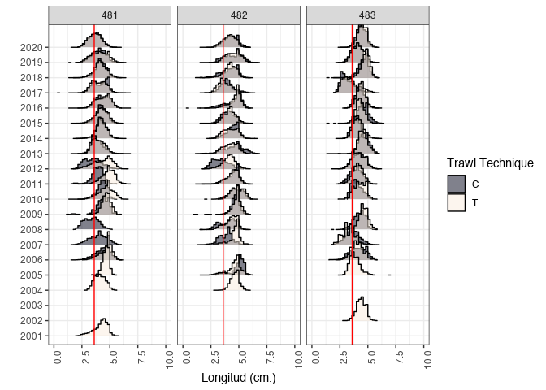

Same plot by Sub Area and month trought year. With this kind of plot, we
can see the recruit power interannually (Figure \@ref(fig:lengthmonth).


```r
ymasd <- ggplot(ohbio4 %>% 
               filter(Year>2000),
             aes(x=length_total_cm, 
                 y = as.factor(Month),
                 fill=asd_code))+
  #geom_joy(alpha=0.9) +
  geom_density_ridges(stat = "binline", bins = 50, 
                      scale = 1.5, 
                      draw_baseline = FALSE,
                      alpha=0.5)+
  facet_wrap(.~season_ccamlr, ncol=5) +   
  geom_vline(xintercept = 3.6, color = "red")+
  scale_x_continuous(breaks = seq(from = 1, to = 10, 
                                  by = 1))+
  scale_y_discrete(breaks = seq(from = 1, 
                                to = 12, by = 1))+
  scale_fill_viridis_d(name="SubArea",
                       option="F")+
  theme_bw()+
  theme(axis.text.x = element_text(angle = 90, 
                                   hjust = 1))+
  xlim(0,10)+
  xlab("Longitud (cm.)")+
  ylab("")
ymasd
```

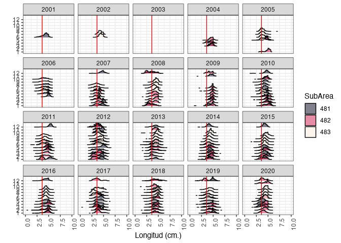
Just 48.1 SubArea plot


```r
yma481 <- ggplot(ohbio4 %>% 
               filter(Year>2000,
                      asd_code==481),
             aes(x=length_total_cm, 
                 y = as.factor(Month),
                 fill=asd_code))+
  #geom_joy(alpha=0.9) +
  geom_density_ridges(stat = "binline", bins = 50, 
                      scale = 1.5, 
                      draw_baseline = FALSE,
                      alpha=0.5)+
  facet_wrap(.~Year, ncol=5) +   
  geom_vline(xintercept = 3.6, color = "red")+
  scale_x_continuous(breaks = seq(from = 1, to = 10, 
                                  by = 1))+
  scale_y_discrete(breaks = seq(from = 1, 
                                to = 12, by = 1))+
  scale_fill_viridis_d(name="SubArea",
                       option="F")+
  theme_bw()+
  theme(axis.text.x = element_text(angle = 90, 
                                   hjust = 1))+
  xlim(0,10)+
  xlab("Longitud (cm.)")+
  ylab("")
yma481
```

## Mean Length

Recruit estimate (% Low Recruit length) [@Perry2020]

Un diaggrama de caja para el porcentage de individuos bajo talla (3.6
mmm.)


```r
box <- ggplot(ohbio4) +
  geom_boxplot(aes(length_total_cm, group=season_ccamlr), 
               alpha=0.3,
               fill=3)+
  geom_vline(xintercept = 3.6, color = "red")+
  xlim(0, 7)+
  coord_flip()+
  facet_wrap(~asd_code, ncol=1)+
  theme_bw()+
  labs(x="% Below Recruit length (3.6 mm.)",
       x="")
hi <- ggplot(ohbio4)+
  geom_histogram(aes(y=length_total_cm), 
                 fill=3,
                 alpha=0.3,
                 color="black")+
  coord_flip()+
  theme_bw()+
  ylim(0,10)

ggarrange(box, hi, ncol = 2)
```

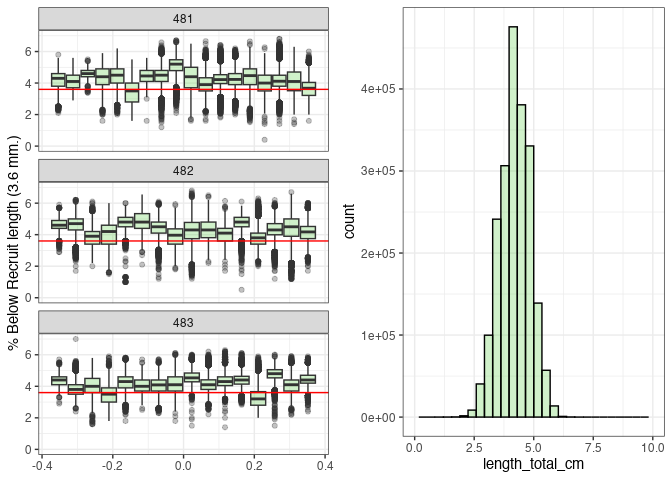

Mean length in time series by Subarea.


```r
pmea <- ggplot(coutlength %>% 
                 filter(Year>2000), 
               aes(Year,avg))+
    geom_point(shape=21, fill=coutlength$asd_code, 
               show.legend = T) +
    stat_smooth(method= "glm", colour='#253494')+
    scale_size(range = c(-4,8)) +
    theme_bw()+ 
    facet_wrap(.~asd_code)+
    scale_x_continuous(breaks = seq(from = 2000, to = 2020, by = 2))+
    #scale_y_discrete(breaks = seq(from = 1, to = 13, by = 1))+
    theme(axis.text.x = element_text(angle = 90, hjust = 2))+
    guides(fill = guide_legend(reverse=F))+
    scale_fill_viridis_c(option="E")+
    ylim(3,6)+
    ylab("") +
    xlab("") +
    ggtitle("Lenght Mean Krill fishery")
pmea
```

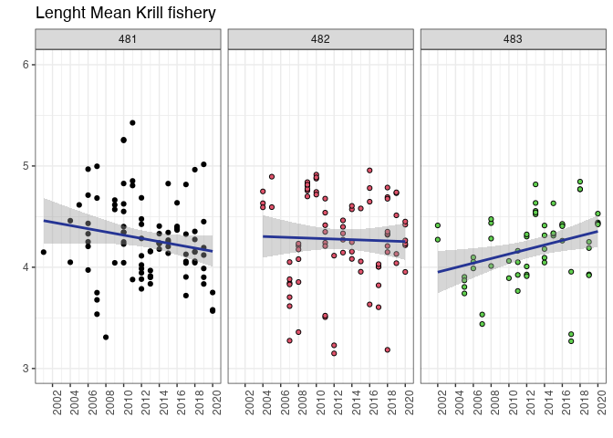

by month and year only 48.1


```r
pmea481 <- ggplot(coutlength %>% 
                 filter(Year>2000,
                        asd_code==481), 
               aes(Month, avg))+
    geom_point(shape=21,  
               show.legend = T) +
    stat_smooth(method= "glm", colour='#253494')+
    scale_x_continuous(breaks = seq(from = 1, to = 12, by = 2))+
    theme_bw()+ 
    facet_wrap(.~Year) +
    ggtitle("Lenght Mean Krill fishery 48.1")+
    ylim(0, 6)
pmea481
```

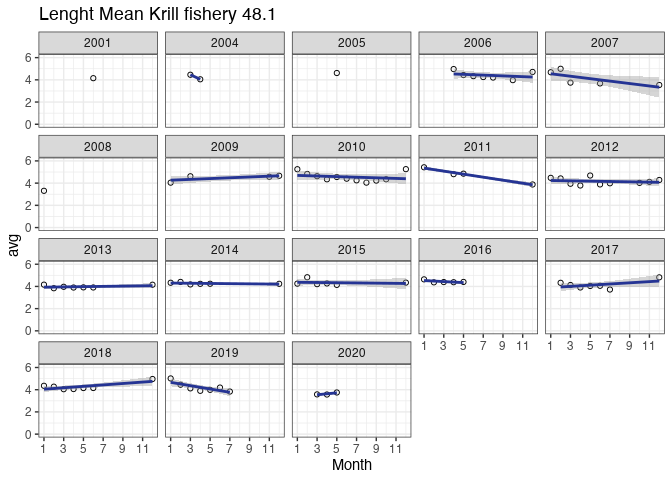
(Probar datos con RaadTools library [@Raadtools2022])

## Maps length data

First thing is get different rater layer to join krill data length according different porpoises.


```r
# Cargo linea de costa
coast <- load_Coastline()
coast1<- st_as_sf(coast) 
coast2 = st_transform(coast1, "+proj=latlong +ellps=WGS84")
# con SSMU
ssmu <- load_SSMUs()
ssmu481 <- subset(ssmu[c(2,3,4,5,6,7,17),])
ssmu481a <- st_as_sf(ssmu481) 
ssmu481aa = st_transform(ssmu481a, "+proj=latlong +ellps=WGS84")

# con Statistical Areas con foco en 48.1
suba <- load_ASDs()
suba1 <- subset(suba[(3),])
suba1a<- st_as_sf(suba1) 
suba1aa = st_transform(suba1a, "+proj=latlong +ellps=WGS84")


# Uso las agrupaciones de DMP1
dmp1 <- st_read("~/DOCAS/Mapas/Antarctic_SHPfiles/D1MPA-model-2019.shp",
                quiet=T)
dmp1=st_transform(dmp1, 6932)

# Uso las agrupaciones de Strata
strata <- st_read("~/DOCAS/Mapas/Antarctic_SHPfiles/Strata.shp",
                quiet=T)
strata=st_transform(strata, "+proj=latlong +ellps=WGS84")
```
Test Strata maps


```r
# y testeo el mapa
ssmap <- ggplot()+
  geom_sf(data = strata, aes(fill=strata$ID, 
                           alpha=0.3))+
  # geom_sf(data = ssmu481aa, aes(fill=ssmu481aa$GAR_Short_Label, 
  #                         alpha=0.3))+
  geom_sf(data = coast2, colour="black", fill=NA)+
  #geom_sf(data = gridcrop1, colour="black", fill=NA)+
  #geom_sf(data= suba1aa, fill=NA)+
  # geom_sf(aes(fill=ssmu481aa$GAR_Short_Label,
  #              alpha=0.3))+
  scale_fill_viridis_d(option = "F",
                       name="Strata")+
  #geom_sf_label(aes(label = strata$ID))+
  # labs(fill = "SSMU")+
  ylim(230000, 2220000)+
  xlim(-3095349 , -1858911)+
  # coord_sf(crs = 32610)+ #sistema de prpyecccion para campos completos
  coord_sf(crs = 6932)+
  scale_alpha(guide="none")+
  theme_bw()
ssmap
```

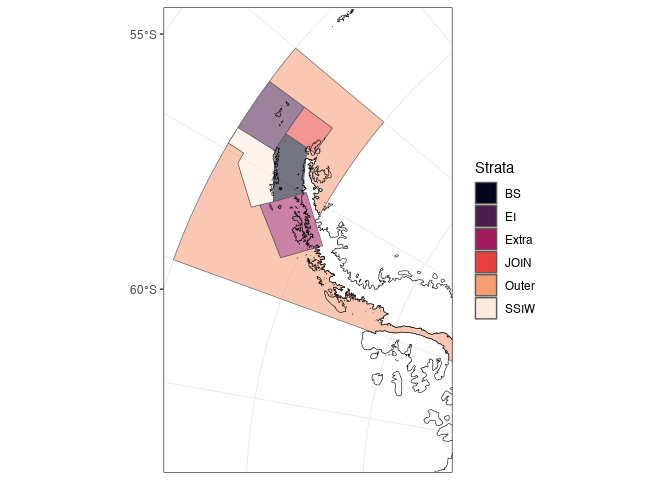
Test Strata SSMU 

```r
# y testeo el mapa
ssmumap <- ggplot()+
  # geom_sf(data = strata, aes(fill=strata$ID, 
  #                          alpha=0.3))+
  geom_sf(data = ssmu481aa, aes(fill=ssmu481aa$GAR_Short_Label,
                          alpha=0.3))+
  geom_sf(data = coast2, colour="black", fill=NA)+
  #geom_sf(data = gridcrop1, colour="black", fill=NA)+
  #geom_sf(data= suba1aa, fill=NA)+
  # geom_sf(aes(fill=ssmu481aa$GAR_Short_Label,
  #              alpha=0.3))+
  scale_fill_viridis_d(option = "G",
                       name="SSMU")+
  #geom_sf_label(aes(label = strata$ID))+
  # labs(fill = "SSMU")+
  ylim(230000, 2220000)+
  xlim(-3095349 , -1858911)+
  # coord_sf(crs = 32610)+ #sistema de prpyecccion para campos completos
  coord_sf(crs = 6932)+
  scale_alpha(guide="none")+
  theme_bw()
ssmumap
```

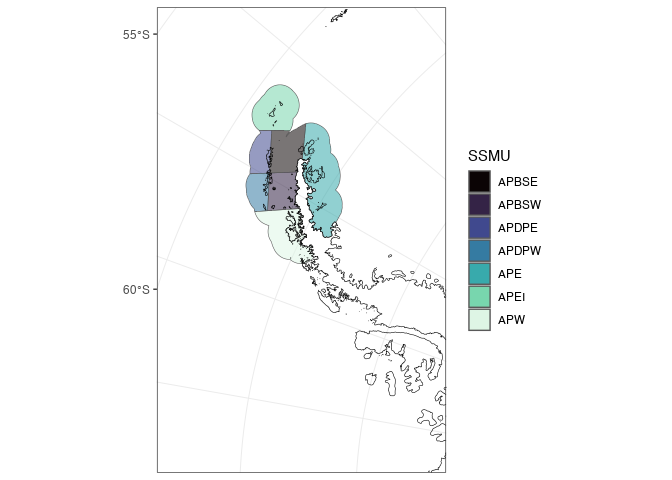

## Grouping Length data into Grid

### SSMU 48.1 CCAMLR


```r
names(ohbio4)
```

```
##  [1] "vessel_nationality_code" "season_ccamlr"          
##  [3] "asd_code"                "trawl_technique"        
##  [5] "date_catchperiod_start"  "latitude_set_end"       
##  [7] "longitude_set_end"       "gear_type"              
##  [9] "maturity_stage"          "length_total_cm"        
## [11] "Year"                    "Month"
```

```r
ohbio5 <- ohbio4 %>% 
  filter(asd_code==481) %>% 
  dplyr::select(6, 7, 8, 9, 10, 11, 12) 
ohbio6 <- st_as_sf(ohbio5 %>% 
                     drop_na(latitude_set_end), 
                   coords = c("longitude_set_end", "latitude_set_end"),  
                  crs = "+proj=latlong +ellps=WGS84")
```

This grid has the same characteristics as the environmental data grids that will be called up later. This grid is 1x0.5 degrees which allows a clear visualization of the processes, whether biological and/or environmental.


```r
Grid<- suba1aa  %>% #pm481 es el plot base original linea 481
  sf::st_make_grid(cellsize = c(1,0.5)) %>% # para que quede cuadrada
  sf::st_cast("MULTIPOLYGON") %>%
  sf::st_sf()  %>%  # objeto en spatial feature
  dplyr::mutate(cellid = row_number()) 

# Clean the input data by removing duplicate vertices and making the object topologically valid
grid3 <- st_make_valid(Grid)

# Corto la grilla dentro de las SSMU
#gridcrop1 <- crop_shape(grid3, suba1aa, polygon = TRUE)

# the first object drives the output geometry
grilen <- grid3 %>%
  st_join(ohbio6) %>% 
  group_by(cellid)

names(grilen)
```

```
## [1] "cellid"          "gear_type"       "maturity_stage"  "length_total_cm"
## [5] "Year"            "Month"           "geometry"
```

Test lentgh mean map by Year


```r
grilen3 <- grilen %>%
  drop_na(length_total_cm) %>% 
  dplyr::group_by(cellid,Year) %>% 
  dplyr::summarise(lepro=mean(length_total_cm))

 
gl <- ggplot() +
   geom_sf(data=grilen3,
           aes(fill = lepro), 
           alpha=0.7, color=NA) +
  scale_fill_viridis_b(option="G",
                       name="Krill Length Fishery (cm.)",
                       breaks = seq(0,8,1),
                       direction=-1)+
  geom_sf(data = suba1aa, fill=NA, col=2)+
  geom_sf(data = coast2, colour="black", fill="grey")+
  facet_wrap(~Year, ncol=6)+
  theme(panel.background = element_rect(fill = 'aliceblue'),
        panel.grid.major = element_blank(), 
        panel.grid.minor = element_blank())+
  # ylim(-70, -60)+
  # xlim(-70, -50)
  # another kind projection
  ylim(230000, 2220000)+
  xlim(-3095349 , -1858911)+
  #coord_sf(crs = 32610)+ #sistema de prpyecccion para campos completos
  coord_sf(crs = 6932)
gl
```

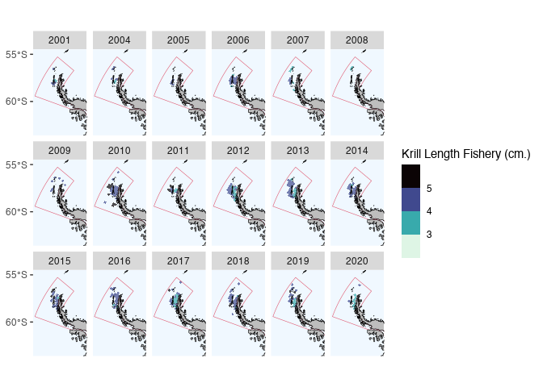

Load environmental data to merge with length.


Get data specific object

```r
ls()
```

```
##  [1] "box"              "c1"               "C1"               "coast"           
##  [5] "coast1"           "coast2"           "coutlength"       "datae"           
##  [9] "dataenvf"         "dmp1"             "gl"               "Grid"            
## [13] "grid3"            "grilen"           "grilen3"          "hi"              
## [17] "jz"               "meta"             "metadata"         "METADATA"        
## [21] "OBS_HAUL_BIOLOGY" "ohbio"            "ohbio2"           "ohbio3"          
## [25] "ohbio4"           "ohbio5"           "ohbio6"           "pmea"            
## [29] "pmea481"          "ssmap"            "ssmu"             "ssmu481"         
## [33] "ssmu481a"         "ssmu481aa"        "ssmumap"          "strata"          
## [37] "suba"             "suba1"            "suba1a"           "suba1aa"         
## [41] "trwal"            "ymasd"
```

```r
get("dataenvf")
```

```
##      cellid ANO.x meansic                     geometry.x ANO.y   meanchl
## 1         1  1979    2540 POLYGON ((-69 -73.11359, -6...  <NA>        NA
## 2         1  1980    2540 POLYGON ((-69 -73.11359, -6...  <NA>        NA
## 3         1  1981    2540 POLYGON ((-69 -73.11359, -6...  <NA>        NA
## 4         1  1982    2540 POLYGON ((-69 -73.11359, -6...  <NA>        NA
## 5         1  1983    2540 POLYGON ((-69 -73.11359, -6...  <NA>        NA
## 6         1  1984    2540 POLYGON ((-69 -73.11359, -6...  <NA>        NA
## 7         1  1985    2540 POLYGON ((-69 -73.11359, -6...  <NA>        NA
## 8         1  1986    2540 POLYGON ((-69 -73.11359, -6...  <NA>        NA
## 9         1  1987    2540 POLYGON ((-69 -73.11359, -6...  <NA>        NA
## 10        1  1989    2540 POLYGON ((-69 -73.11359, -6...  <NA>        NA
## 11        1  1990    2540 POLYGON ((-69 -73.11359, -6...  <NA>        NA
## 12        1  1991    2540 POLYGON ((-69 -73.11359, -6...  <NA>        NA
## 13        1  1992    2540 POLYGON ((-69 -73.11359, -6...  <NA>        NA
## 14        1  1993    2540 POLYGON ((-69 -73.11359, -6...  <NA>        NA
## 15        1  1994    2540 POLYGON ((-69 -73.11359, -6...  <NA>        NA
## 16        1  1995    2540 POLYGON ((-69 -73.11359, -6...  <NA>        NA
## 17        1  1996    2540 POLYGON ((-69 -73.11359, -6...  <NA>        NA
## 18        1  1997    2540 POLYGON ((-69 -73.11359, -6...  <NA>        NA
## 19        1  1998    2540 POLYGON ((-69 -73.11359, -6...  <NA>        NA
## 20        1  1999    2540 POLYGON ((-69 -73.11359, -6...  <NA>        NA
## 21        1  2000    2540 POLYGON ((-69 -73.11359, -6...  <NA>        NA
## 22        1  2001    2540 POLYGON ((-69 -73.11359, -6...  <NA>        NA
## 23        1  2002    2540 POLYGON ((-69 -73.11359, -6...  <NA>        NA
## 24        1  2003    2540 POLYGON ((-69 -73.11359, -6...  <NA>        NA
## 25        1  2004    2540 POLYGON ((-69 -73.11359, -6...  <NA>        NA
## 26        1  2005    2540 POLYGON ((-69 -73.11359, -6...  <NA>        NA
## 27        1  2006    2540 POLYGON ((-69 -73.11359, -6...  <NA>        NA
## 28        1  2007    2540 POLYGON ((-69 -73.11359, -6...  <NA>        NA
## 29        1  2008    2540 POLYGON ((-69 -73.11359, -6...  <NA>        NA
## 30        1  2009    2540 POLYGON ((-69 -73.11359, -6...  <NA>        NA
## 31        1  2010    2540 POLYGON ((-69 -73.11359, -6...  <NA>        NA
## 32        1  2011    2540 POLYGON ((-69 -73.11359, -6...  <NA>        NA
## 33        1  2012    2540 POLYGON ((-69 -73.11359, -6...  <NA>        NA
## 34        1  2013    2540 POLYGON ((-69 -73.11359, -6...  <NA>        NA
## 35        1  2014    2540 POLYGON ((-69 -73.11359, -6...  <NA>        NA
## 36        1  2015    2540 POLYGON ((-69 -73.11359, -6...  <NA>        NA
## 37        1  2016    2540 POLYGON ((-69 -73.11359, -6...  <NA>        NA
## 38        1  2017    2540 POLYGON ((-69 -73.11359, -6...  <NA>        NA
## 39        1  2018    2540 POLYGON ((-69 -73.11359, -6...  <NA>        NA
## 40        1  2019    2540 POLYGON ((-69 -73.11359, -6...  <NA>        NA
## 41        1  2020    2540 POLYGON ((-69 -73.11359, -6...  <NA>        NA
## 42        1  2021    2540 POLYGON ((-69 -73.11359, -6...  <NA>        NA
## 43        1  2022    2540 POLYGON ((-69 -73.11359, -6...  <NA>        NA
## 44        2  1979    2540 POLYGON ((-68 -72.94489, -6...  <NA>        NA
## 45        2  1980    2540 POLYGON ((-68 -72.94489, -6...  <NA>        NA
## 46        2  1981    2540 POLYGON ((-68 -72.94489, -6...  <NA>        NA
## 47        2  1982    2540 POLYGON ((-68 -72.94489, -6...  <NA>        NA
## 48        2  1983    2540 POLYGON ((-68 -72.94489, -6...  <NA>        NA
## 49        2  1984    2540 POLYGON ((-68 -72.94489, -6...  <NA>        NA
## 50        2  1985    2540 POLYGON ((-68 -72.94489, -6...  <NA>        NA
## 51        2  1986    2540 POLYGON ((-68 -72.94489, -6...  <NA>        NA
## 52        2  1987    2540 POLYGON ((-68 -72.94489, -6...  <NA>        NA
## 53        2  1989    2540 POLYGON ((-68 -72.94489, -6...  <NA>        NA
## 54        2  1990    2540 POLYGON ((-68 -72.94489, -6...  <NA>        NA
## 55        2  1991    2540 POLYGON ((-68 -72.94489, -6...  <NA>        NA
## 56        2  1992    2540 POLYGON ((-68 -72.94489, -6...  <NA>        NA
## 57        2  1993    2540 POLYGON ((-68 -72.94489, -6...  <NA>        NA
## 58        2  1994    2540 POLYGON ((-68 -72.94489, -6...  <NA>        NA
## 59        2  1995    2540 POLYGON ((-68 -72.94489, -6...  <NA>        NA
## 60        2  1996    2540 POLYGON ((-68 -72.94489, -6...  <NA>        NA
## 61        2  1997    2540 POLYGON ((-68 -72.94489, -6...  <NA>        NA
## 62        2  1998    2540 POLYGON ((-68 -72.94489, -6...  <NA>        NA
## 63        2  1999    2540 POLYGON ((-68 -72.94489, -6...  <NA>        NA
## 64        2  2000    2540 POLYGON ((-68 -72.94489, -6...  <NA>        NA
## 65        2  2001    2540 POLYGON ((-68 -72.94489, -6...  <NA>        NA
## 66        2  2002    2540 POLYGON ((-68 -72.94489, -6...  <NA>        NA
## 67        2  2003    2540 POLYGON ((-68 -72.94489, -6...  <NA>        NA
## 68        2  2004    2540 POLYGON ((-68 -72.94489, -6...  <NA>        NA
## 69        2  2005    2540 POLYGON ((-68 -72.94489, -6...  <NA>        NA
## 70        2  2006    2540 POLYGON ((-68 -72.94489, -6...  <NA>        NA
## 71        2  2007    2540 POLYGON ((-68 -72.94489, -6...  <NA>        NA
## 72        2  2008    2540 POLYGON ((-68 -72.94489, -6...  <NA>        NA
## 73        2  2009    2540 POLYGON ((-68 -72.94489, -6...  <NA>        NA
## 74        2  2010    2540 POLYGON ((-68 -72.94489, -6...  <NA>        NA
## 75        2  2011    2540 POLYGON ((-68 -72.94489, -6...  <NA>        NA
## 76        2  2012    2540 POLYGON ((-68 -72.94489, -6...  <NA>        NA
## 77        2  2013    2540 POLYGON ((-68 -72.94489, -6...  <NA>        NA
## 78        2  2014    2540 POLYGON ((-68 -72.94489, -6...  <NA>        NA
## 79        2  2015    2540 POLYGON ((-68 -72.94489, -6...  <NA>        NA
## 80        2  2016    2540 POLYGON ((-68 -72.94489, -6...  <NA>        NA
## 81        2  2017    2540 POLYGON ((-68 -72.94489, -6...  <NA>        NA
## 82        2  2018    2540 POLYGON ((-68 -72.94489, -6...  <NA>        NA
## 83        2  2019    2540 POLYGON ((-68 -72.94489, -6...  <NA>        NA
## 84        2  2020    2540 POLYGON ((-68 -72.94489, -6...  <NA>        NA
## 85        2  2021    2540 POLYGON ((-68 -72.94489, -6...  <NA>        NA
## 86        2  2022    2540 POLYGON ((-68 -72.94489, -6...  <NA>        NA
## 87        3  1979    2540 POLYGON ((-67.499 -72.72107...  <NA>        NA
## 88        3  1980    2540 POLYGON ((-67.499 -72.72107...  <NA>        NA
## 89        3  1981    2540 POLYGON ((-67.499 -72.72107...  <NA>        NA
## 90        3  1982    2540 POLYGON ((-67.499 -72.72107...  <NA>        NA
## 91        3  1983    2540 POLYGON ((-67.499 -72.72107...  <NA>        NA
## 92        3  1984    2540 POLYGON ((-67.499 -72.72107...  <NA>        NA
## 93        3  1985    2540 POLYGON ((-67.499 -72.72107...  <NA>        NA
## 94        3  1986    2540 POLYGON ((-67.499 -72.72107...  <NA>        NA
## 95        3  1987    2540 POLYGON ((-67.499 -72.72107...  <NA>        NA
## 96        3  1989    2540 POLYGON ((-67.499 -72.72107...  <NA>        NA
## 97        3  1990    2540 POLYGON ((-67.499 -72.72107...  <NA>        NA
## 98        3  1991    2540 POLYGON ((-67.499 -72.72107...  <NA>        NA
## 99        3  1992    2540 POLYGON ((-67.499 -72.72107...  <NA>        NA
## 100       3  1993    2540 POLYGON ((-67.499 -72.72107...  <NA>        NA
## 101       3  1994    2540 POLYGON ((-67.499 -72.72107...  <NA>        NA
## 102       3  1995    2540 POLYGON ((-67.499 -72.72107...  <NA>        NA
## 103       3  1996    2540 POLYGON ((-67.499 -72.72107...  <NA>        NA
## 104       3  1997    2540 POLYGON ((-67.499 -72.72107...  <NA>        NA
## 105       3  1998    2540 POLYGON ((-67.499 -72.72107...  <NA>        NA
## 106       3  1999    2540 POLYGON ((-67.499 -72.72107...  <NA>        NA
## 107       3  2000    2540 POLYGON ((-67.499 -72.72107...  <NA>        NA
## 108       3  2001    2540 POLYGON ((-67.499 -72.72107...  <NA>        NA
## 109       3  2002    2540 POLYGON ((-67.499 -72.72107...  <NA>        NA
## 110       3  2003    2540 POLYGON ((-67.499 -72.72107...  <NA>        NA
## 111       3  2004    2540 POLYGON ((-67.499 -72.72107...  <NA>        NA
## 112       3  2005    2540 POLYGON ((-67.499 -72.72107...  <NA>        NA
## 113       3  2006    2540 POLYGON ((-67.499 -72.72107...  <NA>        NA
## 114       3  2007    2540 POLYGON ((-67.499 -72.72107...  <NA>        NA
## 115       3  2008    2540 POLYGON ((-67.499 -72.72107...  <NA>        NA
## 116       3  2009    2540 POLYGON ((-67.499 -72.72107...  <NA>        NA
## 117       3  2010    2540 POLYGON ((-67.499 -72.72107...  <NA>        NA
## 118       3  2011    2540 POLYGON ((-67.499 -72.72107...  <NA>        NA
## 119       3  2012    2540 POLYGON ((-67.499 -72.72107...  <NA>        NA
## 120       3  2013    2540 POLYGON ((-67.499 -72.72107...  <NA>        NA
## 121       3  2014    2540 POLYGON ((-67.499 -72.72107...  <NA>        NA
## 122       3  2015    2540 POLYGON ((-67.499 -72.72107...  <NA>        NA
## 123       3  2016    2540 POLYGON ((-67.499 -72.72107...  <NA>        NA
## 124       3  2017    2540 POLYGON ((-67.499 -72.72107...  <NA>        NA
## 125       3  2018    2540 POLYGON ((-67.499 -72.72107...  <NA>        NA
## 126       3  2019    2540 POLYGON ((-67.499 -72.72107...  <NA>        NA
## 127       3  2020    2540 POLYGON ((-67.499 -72.72107...  <NA>        NA
## 128       3  2021    2540 POLYGON ((-67.499 -72.72107...  <NA>        NA
## 129       3  2022    2540 POLYGON ((-67.499 -72.72107...  <NA>        NA
## 130      22  <NA>      NA POLYGON ((-70 -72.62109, -7...  <NA>        NA
## 131      23  1979    2540 POLYGON ((-69 -72.37327, -6...  <NA>        NA
## 132      23  1980    2540 POLYGON ((-69 -72.37327, -6...  <NA>        NA
## 133      23  1981    2540 POLYGON ((-69 -72.37327, -6...  <NA>        NA
## 134      23  1982    2540 POLYGON ((-69 -72.37327, -6...  <NA>        NA
## 135      23  1983    2540 POLYGON ((-69 -72.37327, -6...  <NA>        NA
## 136      23  1984    2540 POLYGON ((-69 -72.37327, -6...  <NA>        NA
## 137      23  1985    2540 POLYGON ((-69 -72.37327, -6...  <NA>        NA
## 138      23  1986    2540 POLYGON ((-69 -72.37327, -6...  <NA>        NA
## 139      23  1987    2540 POLYGON ((-69 -72.37327, -6...  <NA>        NA
## 140      23  1989    2540 POLYGON ((-69 -72.37327, -6...  <NA>        NA
## 141      23  1990    2540 POLYGON ((-69 -72.37327, -6...  <NA>        NA
## 142      23  1991    2540 POLYGON ((-69 -72.37327, -6...  <NA>        NA
## 143      23  1992    2540 POLYGON ((-69 -72.37327, -6...  <NA>        NA
## 144      23  1993    2540 POLYGON ((-69 -72.37327, -6...  <NA>        NA
## 145      23  1994    2540 POLYGON ((-69 -72.37327, -6...  <NA>        NA
## 146      23  1995    2540 POLYGON ((-69 -72.37327, -6...  <NA>        NA
## 147      23  1996    2540 POLYGON ((-69 -72.37327, -6...  <NA>        NA
## 148      23  1997    2540 POLYGON ((-69 -72.37327, -6...  <NA>        NA
## 149      23  1998    2540 POLYGON ((-69 -72.37327, -6...  <NA>        NA
## 150      23  1999    2540 POLYGON ((-69 -72.37327, -6...  <NA>        NA
## 151      23  2000    2540 POLYGON ((-69 -72.37327, -6...  <NA>        NA
## 152      23  2001    2540 POLYGON ((-69 -72.37327, -6...  <NA>        NA
## 153      23  2002    2540 POLYGON ((-69 -72.37327, -6...  <NA>        NA
## 154      23  2003    2540 POLYGON ((-69 -72.37327, -6...  <NA>        NA
## 155      23  2004    2540 POLYGON ((-69 -72.37327, -6...  <NA>        NA
## 156      23  2005    2540 POLYGON ((-69 -72.37327, -6...  <NA>        NA
## 157      23  2006    2540 POLYGON ((-69 -72.37327, -6...  <NA>        NA
## 158      23  2007    2540 POLYGON ((-69 -72.37327, -6...  <NA>        NA
## 159      23  2008    2540 POLYGON ((-69 -72.37327, -6...  <NA>        NA
## 160      23  2009    2540 POLYGON ((-69 -72.37327, -6...  <NA>        NA
## 161      23  2010    2540 POLYGON ((-69 -72.37327, -6...  <NA>        NA
## 162      23  2011    2540 POLYGON ((-69 -72.37327, -6...  <NA>        NA
## 163      23  2012    2540 POLYGON ((-69 -72.37327, -6...  <NA>        NA
## 164      23  2013    2540 POLYGON ((-69 -72.37327, -6...  <NA>        NA
## 165      23  2014    2540 POLYGON ((-69 -72.37327, -6...  <NA>        NA
## 166      23  2015    2540 POLYGON ((-69 -72.37327, -6...  <NA>        NA
## 167      23  2016    2540 POLYGON ((-69 -72.37327, -6...  <NA>        NA
## 168      23  2017    2540 POLYGON ((-69 -72.37327, -6...  <NA>        NA
## 169      23  2018    2540 POLYGON ((-69 -72.37327, -6...  <NA>        NA
## 170      23  2019    2540 POLYGON ((-69 -72.37327, -6...  <NA>        NA
## 171      23  2020    2540 POLYGON ((-69 -72.37327, -6...  <NA>        NA
## 172      23  2021    2540 POLYGON ((-69 -72.37327, -6...  <NA>        NA
## 173      23  2022    2540 POLYGON ((-69 -72.37327, -6...  <NA>        NA
## 174      24  1979    2540 POLYGON ((-67 -72.34893, -6...  <NA>        NA
## 175      24  1980    2540 POLYGON ((-67 -72.34893, -6...  <NA>        NA
## 176      24  1981    2540 POLYGON ((-67 -72.34893, -6...  <NA>        NA
## 177      24  1982    2540 POLYGON ((-67 -72.34893, -6...  <NA>        NA
## 178      24  1983    2540 POLYGON ((-67 -72.34893, -6...  <NA>        NA
## 179      24  1984    2540 POLYGON ((-67 -72.34893, -6...  <NA>        NA
## 180      24  1985    2540 POLYGON ((-67 -72.34893, -6...  <NA>        NA
## 181      24  1986    2540 POLYGON ((-67 -72.34893, -6...  <NA>        NA
## 182      24  1987    2540 POLYGON ((-67 -72.34893, -6...  <NA>        NA
## 183      24  1989    2540 POLYGON ((-67 -72.34893, -6...  <NA>        NA
## 184      24  1990    2540 POLYGON ((-67 -72.34893, -6...  <NA>        NA
## 185      24  1991    2540 POLYGON ((-67 -72.34893, -6...  <NA>        NA
## 186      24  1992    2540 POLYGON ((-67 -72.34893, -6...  <NA>        NA
## 187      24  1993    2540 POLYGON ((-67 -72.34893, -6...  <NA>        NA
## 188      24  1994    2540 POLYGON ((-67 -72.34893, -6...  <NA>        NA
## 189      24  1995    2540 POLYGON ((-67 -72.34893, -6...  <NA>        NA
## 190      24  1996    2540 POLYGON ((-67 -72.34893, -6...  <NA>        NA
## 191      24  1997    2540 POLYGON ((-67 -72.34893, -6...  <NA>        NA
## 192      24  1998    2540 POLYGON ((-67 -72.34893, -6...  <NA>        NA
## 193      24  1999    2540 POLYGON ((-67 -72.34893, -6...  <NA>        NA
## 194      24  2000    2540 POLYGON ((-67 -72.34893, -6...  <NA>        NA
## 195      24  2001    2540 POLYGON ((-67 -72.34893, -6...  <NA>        NA
## 196      24  2002    2540 POLYGON ((-67 -72.34893, -6...  <NA>        NA
## 197      24  2003    2540 POLYGON ((-67 -72.34893, -6...  <NA>        NA
## 198      24  2004    2540 POLYGON ((-67 -72.34893, -6...  <NA>        NA
## 199      24  2005    2540 POLYGON ((-67 -72.34893, -6...  <NA>        NA
## 200      24  2006    2540 POLYGON ((-67 -72.34893, -6...  <NA>        NA
## 201      24  2007    2540 POLYGON ((-67 -72.34893, -6...  <NA>        NA
## 202      24  2008    2540 POLYGON ((-67 -72.34893, -6...  <NA>        NA
## 203      24  2009    2540 POLYGON ((-67 -72.34893, -6...  <NA>        NA
## 204      24  2010    2540 POLYGON ((-67 -72.34893, -6...  <NA>        NA
## 205      24  2011    2540 POLYGON ((-67 -72.34893, -6...  <NA>        NA
## 206      24  2012    2540 POLYGON ((-67 -72.34893, -6...  <NA>        NA
## 207      24  2013    2540 POLYGON ((-67 -72.34893, -6...  <NA>        NA
## 208      24  2014    2540 POLYGON ((-67 -72.34893, -6...  <NA>        NA
## 209      24  2015    2540 POLYGON ((-67 -72.34893, -6...  <NA>        NA
## 210      24  2016    2540 POLYGON ((-67 -72.34893, -6...  <NA>        NA
## 211      24  2017    2540 POLYGON ((-67 -72.34893, -6...  <NA>        NA
## 212      24  2018    2540 POLYGON ((-67 -72.34893, -6...  <NA>        NA
## 213      24  2019    2540 POLYGON ((-67 -72.34893, -6...  <NA>        NA
## 214      24  2020    2540 POLYGON ((-67 -72.34893, -6...  <NA>        NA
## 215      24  2021    2540 POLYGON ((-67 -72.34893, -6...  <NA>        NA
## 216      24  2022    2540 POLYGON ((-67 -72.34893, -6...  <NA>        NA
## 217      25  <NA>      NA POLYGON ((-66.90486 -72.220...  <NA>        NA
## 218      44  1979    2540 MULTIPOLYGON (((-68.65768 -...  <NA>        NA
## 219      44  1980    2540 MULTIPOLYGON (((-68.65768 -...  <NA>        NA
## 220      44  1981    2540 MULTIPOLYGON (((-68.65768 -...  <NA>        NA
## 221      44  1982    2540 MULTIPOLYGON (((-68.65768 -...  <NA>        NA
## 222      44  1983    2540 MULTIPOLYGON (((-68.65768 -...  <NA>        NA
## 223      44  1984    2540 MULTIPOLYGON (((-68.65768 -...  <NA>        NA
## 224      44  1985    2540 MULTIPOLYGON (((-68.65768 -...  <NA>        NA
## 225      44  1986    2540 MULTIPOLYGON (((-68.65768 -...  <NA>        NA
## 226      44  1987    2540 MULTIPOLYGON (((-68.65768 -...  <NA>        NA
## 227      44  1989    2540 MULTIPOLYGON (((-68.65768 -...  <NA>        NA
## 228      44  1990    2540 MULTIPOLYGON (((-68.65768 -...  <NA>        NA
## 229      44  1991    2540 MULTIPOLYGON (((-68.65768 -...  <NA>        NA
## 230      44  1992    2540 MULTIPOLYGON (((-68.65768 -...  <NA>        NA
## 231      44  1993    2540 MULTIPOLYGON (((-68.65768 -...  <NA>        NA
## 232      44  1994    2540 MULTIPOLYGON (((-68.65768 -...  <NA>        NA
## 233      44  1995    2540 MULTIPOLYGON (((-68.65768 -...  <NA>        NA
## 234      44  1996    2540 MULTIPOLYGON (((-68.65768 -...  <NA>        NA
## 235      44  1997    2540 MULTIPOLYGON (((-68.65768 -...  <NA>        NA
## 236      44  1998    2540 MULTIPOLYGON (((-68.65768 -...  <NA>        NA
## 237      44  1999    2540 MULTIPOLYGON (((-68.65768 -...  <NA>        NA
## 238      44  2000    2540 MULTIPOLYGON (((-68.65768 -...  <NA>        NA
## 239      44  2001    2540 MULTIPOLYGON (((-68.65768 -...  <NA>        NA
## 240      44  2002    2540 MULTIPOLYGON (((-68.65768 -...  <NA>        NA
## 241      44  2003    2540 MULTIPOLYGON (((-68.65768 -...  <NA>        NA
## 242      44  2004    2540 MULTIPOLYGON (((-68.65768 -...  <NA>        NA
## 243      44  2005    2540 MULTIPOLYGON (((-68.65768 -...  <NA>        NA
## 244      44  2006    2540 MULTIPOLYGON (((-68.65768 -...  <NA>        NA
## 245      44  2007    2540 MULTIPOLYGON (((-68.65768 -...  <NA>        NA
## 246      44  2008    2540 MULTIPOLYGON (((-68.65768 -...  <NA>        NA
## 247      44  2009    2540 MULTIPOLYGON (((-68.65768 -...  <NA>        NA
## 248      44  2010    2540 MULTIPOLYGON (((-68.65768 -...  <NA>        NA
## 249      44  2011    2540 MULTIPOLYGON (((-68.65768 -...  <NA>        NA
## 250      44  2012    2540 MULTIPOLYGON (((-68.65768 -...  <NA>        NA
## 251      44  2013    2540 MULTIPOLYGON (((-68.65768 -...  <NA>        NA
## 252      44  2014    2540 MULTIPOLYGON (((-68.65768 -...  <NA>        NA
## 253      44  2015    2540 MULTIPOLYGON (((-68.65768 -...  <NA>        NA
## 254      44  2016    2540 MULTIPOLYGON (((-68.65768 -...  <NA>        NA
## 255      44  2017    2540 MULTIPOLYGON (((-68.65768 -...  <NA>        NA
## 256      44  2018    2540 MULTIPOLYGON (((-68.65768 -...  <NA>        NA
## 257      44  2019    2540 MULTIPOLYGON (((-68.65768 -...  <NA>        NA
## 258      44  2020    2540 MULTIPOLYGON (((-68.65768 -...  <NA>        NA
## 259      44  2021    2540 MULTIPOLYGON (((-68.65768 -...  <NA>        NA
## 260      44  2022    2540 MULTIPOLYGON (((-68.65768 -...  <NA>        NA
## 261      45  1979    2540 POLYGON ((-67.19363 -71.720...  <NA>        NA
## 262      45  1980    2540 POLYGON ((-67.19363 -71.720...  <NA>        NA
## 263      45  1981    2540 POLYGON ((-67.19363 -71.720...  <NA>        NA
## 264      45  1982    2540 POLYGON ((-67.19363 -71.720...  <NA>        NA
## 265      45  1983    2540 POLYGON ((-67.19363 -71.720...  <NA>        NA
## 266      45  1984    2540 POLYGON ((-67.19363 -71.720...  <NA>        NA
## 267      45  1985    2540 POLYGON ((-67.19363 -71.720...  <NA>        NA
## 268      45  1986    2540 POLYGON ((-67.19363 -71.720...  <NA>        NA
## 269      45  1987    2540 POLYGON ((-67.19363 -71.720...  <NA>        NA
## 270      45  1989    2540 POLYGON ((-67.19363 -71.720...  <NA>        NA
## 271      45  1990    2540 POLYGON ((-67.19363 -71.720...  <NA>        NA
## 272      45  1991    2540 POLYGON ((-67.19363 -71.720...  <NA>        NA
## 273      45  1992    2540 POLYGON ((-67.19363 -71.720...  <NA>        NA
## 274      45  1993    2540 POLYGON ((-67.19363 -71.720...  <NA>        NA
## 275      45  1994    2540 POLYGON ((-67.19363 -71.720...  <NA>        NA
## 276      45  1995    2540 POLYGON ((-67.19363 -71.720...  <NA>        NA
## 277      45  1996    2540 POLYGON ((-67.19363 -71.720...  <NA>        NA
## 278      45  1997    2540 POLYGON ((-67.19363 -71.720...  <NA>        NA
## 279      45  1998    2540 POLYGON ((-67.19363 -71.720...  <NA>        NA
## 280      45  1999    2540 POLYGON ((-67.19363 -71.720...  <NA>        NA
## 281      45  2000    2540 POLYGON ((-67.19363 -71.720...  <NA>        NA
## 282      45  2001    2540 POLYGON ((-67.19363 -71.720...  <NA>        NA
## 283      45  2002    2540 POLYGON ((-67.19363 -71.720...  <NA>        NA
## 284      45  2003    2540 POLYGON ((-67.19363 -71.720...  <NA>        NA
## 285      45  2004    2540 POLYGON ((-67.19363 -71.720...  <NA>        NA
## 286      45  2005    2540 POLYGON ((-67.19363 -71.720...  <NA>        NA
## 287      45  2006    2540 POLYGON ((-67.19363 -71.720...  <NA>        NA
## 288      45  2007    2540 POLYGON ((-67.19363 -71.720...  <NA>        NA
## 289      45  2008    2540 POLYGON ((-67.19363 -71.720...  <NA>        NA
## 290      45  2009    2540 POLYGON ((-67.19363 -71.720...  <NA>        NA
## 291      45  2010    2540 POLYGON ((-67.19363 -71.720...  <NA>        NA
## 292      45  2011    2540 POLYGON ((-67.19363 -71.720...  <NA>        NA
## 293      45  2012    2540 POLYGON ((-67.19363 -71.720...  <NA>        NA
## 294      45  2013    2540 POLYGON ((-67.19363 -71.720...  <NA>        NA
## 295      45  2014    2540 POLYGON ((-67.19363 -71.720...  <NA>        NA
## 296      45  2015    2540 POLYGON ((-67.19363 -71.720...  <NA>        NA
## 297      45  2016    2540 POLYGON ((-67.19363 -71.720...  <NA>        NA
## 298      45  2017    2540 POLYGON ((-67.19363 -71.720...  <NA>        NA
## 299      45  2018    2540 POLYGON ((-67.19363 -71.720...  <NA>        NA
## 300      45  2019    2540 POLYGON ((-67.19363 -71.720...  <NA>        NA
## 301      45  2020    2540 POLYGON ((-67.19363 -71.720...  <NA>        NA
## 302      45  2021    2540 POLYGON ((-67.19363 -71.720...  <NA>        NA
## 303      45  2022    2540 POLYGON ((-67.19363 -71.720...  <NA>        NA
## 304      46  1979    2540 POLYGON ((-67 -71.87457, -6...  <NA>        NA
## 305      46  1980    2540 POLYGON ((-67 -71.87457, -6...  <NA>        NA
## 306      46  1981    2540 POLYGON ((-67 -71.87457, -6...  <NA>        NA
## 307      46  1982    2540 POLYGON ((-67 -71.87457, -6...  <NA>        NA
## 308      46  1983    2540 POLYGON ((-67 -71.87457, -6...  <NA>        NA
## 309      46  1984    2540 POLYGON ((-67 -71.87457, -6...  <NA>        NA
## 310      46  1985    2540 POLYGON ((-67 -71.87457, -6...  <NA>        NA
## 311      46  1986    2540 POLYGON ((-67 -71.87457, -6...  <NA>        NA
## 312      46  1987    2540 POLYGON ((-67 -71.87457, -6...  <NA>        NA
## 313      46  1989    2540 POLYGON ((-67 -71.87457, -6...  <NA>        NA
## 314      46  1990    2540 POLYGON ((-67 -71.87457, -6...  <NA>        NA
## 315      46  1991    2540 POLYGON ((-67 -71.87457, -6...  <NA>        NA
## 316      46  1992    2540 POLYGON ((-67 -71.87457, -6...  <NA>        NA
## 317      46  1993    2540 POLYGON ((-67 -71.87457, -6...  <NA>        NA
## 318      46  1994    2540 POLYGON ((-67 -71.87457, -6...  <NA>        NA
## 319      46  1995    2540 POLYGON ((-67 -71.87457, -6...  <NA>        NA
## 320      46  1996    2540 POLYGON ((-67 -71.87457, -6...  <NA>        NA
## 321      46  1997    2540 POLYGON ((-67 -71.87457, -6...  <NA>        NA
## 322      46  1998    2540 POLYGON ((-67 -71.87457, -6...  <NA>        NA
## 323      46  1999    2540 POLYGON ((-67 -71.87457, -6...  <NA>        NA
## 324      46  2000    2540 POLYGON ((-67 -71.87457, -6...  <NA>        NA
## 325      46  2001    2540 POLYGON ((-67 -71.87457, -6...  <NA>        NA
## 326      46  2002    2540 POLYGON ((-67 -71.87457, -6...  <NA>        NA
## 327      46  2003    2540 POLYGON ((-67 -71.87457, -6...  <NA>        NA
## 328      46  2004    2540 POLYGON ((-67 -71.87457, -6...  <NA>        NA
## 329      46  2005    2540 POLYGON ((-67 -71.87457, -6...  <NA>        NA
## 330      46  2006    2540 POLYGON ((-67 -71.87457, -6...  <NA>        NA
## 331      46  2007    2540 POLYGON ((-67 -71.87457, -6...  <NA>        NA
## 332      46  2008    2540 POLYGON ((-67 -71.87457, -6...  <NA>        NA
## 333      46  2009    2540 POLYGON ((-67 -71.87457, -6...  <NA>        NA
## 334      46  2010    2540 POLYGON ((-67 -71.87457, -6...  <NA>        NA
## 335      46  2011    2540 POLYGON ((-67 -71.87457, -6...  <NA>        NA
## 336      46  2012    2540 POLYGON ((-67 -71.87457, -6...  <NA>        NA
## 337      46  2013    2540 POLYGON ((-67 -71.87457, -6...  <NA>        NA
## 338      46  2014    2540 POLYGON ((-67 -71.87457, -6...  <NA>        NA
## 339      46  2015    2540 POLYGON ((-67 -71.87457, -6...  <NA>        NA
## 340      46  2016    2540 POLYGON ((-67 -71.87457, -6...  <NA>        NA
## 341      46  2017    2540 POLYGON ((-67 -71.87457, -6...  <NA>        NA
## 342      46  2018    2540 POLYGON ((-67 -71.87457, -6...  <NA>        NA
## 343      46  2019    2540 POLYGON ((-67 -71.87457, -6...  <NA>        NA
## 344      46  2020    2540 POLYGON ((-67 -71.87457, -6...  <NA>        NA
## 345      46  2021    2540 POLYGON ((-67 -71.87457, -6...  <NA>        NA
## 346      46  2022    2540 POLYGON ((-67 -71.87457, -6...  <NA>        NA
## 347      65  1979    2540 POLYGON ((-68.2089 -71.7208...  <NA>        NA
## 348      65  1980    2540 POLYGON ((-68.2089 -71.7208...  <NA>        NA
## 349      65  1981    2540 POLYGON ((-68.2089 -71.7208...  <NA>        NA
## 350      65  1982    2540 POLYGON ((-68.2089 -71.7208...  <NA>        NA
## 351      65  1983    2540 POLYGON ((-68.2089 -71.7208...  <NA>        NA
## 352      65  1984    2540 POLYGON ((-68.2089 -71.7208...  <NA>        NA
## 353      65  1985    2540 POLYGON ((-68.2089 -71.7208...  <NA>        NA
## 354      65  1986    2540 POLYGON ((-68.2089 -71.7208...  <NA>        NA
## 355      65  1987    2540 POLYGON ((-68.2089 -71.7208...  <NA>        NA
## 356      65  1989    2540 POLYGON ((-68.2089 -71.7208...  <NA>        NA
## 357      65  1990    2540 POLYGON ((-68.2089 -71.7208...  <NA>        NA
## 358      65  1991    2540 POLYGON ((-68.2089 -71.7208...  <NA>        NA
## 359      65  1992    2540 POLYGON ((-68.2089 -71.7208...  <NA>        NA
## 360      65  1993    2540 POLYGON ((-68.2089 -71.7208...  <NA>        NA
## 361      65  1994    2540 POLYGON ((-68.2089 -71.7208...  <NA>        NA
## 362      65  1995    2540 POLYGON ((-68.2089 -71.7208...  <NA>        NA
## 363      65  1996    2540 POLYGON ((-68.2089 -71.7208...  <NA>        NA
## 364      65  1997    2540 POLYGON ((-68.2089 -71.7208...  <NA>        NA
## 365      65  1998    2540 POLYGON ((-68.2089 -71.7208...  <NA>        NA
## 366      65  1999    2540 POLYGON ((-68.2089 -71.7208...  <NA>        NA
## 367      65  2000    2540 POLYGON ((-68.2089 -71.7208...  <NA>        NA
## 368      65  2001    2540 POLYGON ((-68.2089 -71.7208...  <NA>        NA
## 369      65  2002    2540 POLYGON ((-68.2089 -71.7208...  <NA>        NA
## 370      65  2003    2540 POLYGON ((-68.2089 -71.7208...  <NA>        NA
## 371      65  2004    2540 POLYGON ((-68.2089 -71.7208...  <NA>        NA
## 372      65  2005    2540 POLYGON ((-68.2089 -71.7208...  <NA>        NA
## 373      65  2006    2540 POLYGON ((-68.2089 -71.7208...  <NA>        NA
## 374      65  2007    2540 POLYGON ((-68.2089 -71.7208...  <NA>        NA
## 375      65  2008    2540 POLYGON ((-68.2089 -71.7208...  <NA>        NA
## 376      65  2009    2540 POLYGON ((-68.2089 -71.7208...  <NA>        NA
## 377      65  2010    2540 POLYGON ((-68.2089 -71.7208...  <NA>        NA
## 378      65  2011    2540 POLYGON ((-68.2089 -71.7208...  <NA>        NA
## 379      65  2012    2540 POLYGON ((-68.2089 -71.7208...  <NA>        NA
## 380      65  2013    2540 POLYGON ((-68.2089 -71.7208...  <NA>        NA
## 381      65  2014    2540 POLYGON ((-68.2089 -71.7208...  <NA>        NA
## 382      65  2015    2540 POLYGON ((-68.2089 -71.7208...  <NA>        NA
## 383      65  2016    2540 POLYGON ((-68.2089 -71.7208...  <NA>        NA
## 384      65  2017    2540 POLYGON ((-68.2089 -71.7208...  <NA>        NA
## 385      65  2018    2540 POLYGON ((-68.2089 -71.7208...  <NA>        NA
## 386      65  2019    2540 POLYGON ((-68.2089 -71.7208...  <NA>        NA
## 387      65  2020    2540 POLYGON ((-68.2089 -71.7208...  <NA>        NA
## 388      65  2021    2540 POLYGON ((-68.2089 -71.7208...  <NA>        NA
## 389      65  2022    2540 POLYGON ((-68.2089 -71.7208...  <NA>        NA
## 390      66  1979    2540 POLYGON ((-67.51976 -71.221...  <NA>        NA
## 391      66  1980    2540 POLYGON ((-67.51976 -71.221...  <NA>        NA
## 392      66  1981    2540 POLYGON ((-67.51976 -71.221...  <NA>        NA
## 393      66  1982    2540 POLYGON ((-67.51976 -71.221...  <NA>        NA
## 394      66  1983    2540 POLYGON ((-67.51976 -71.221...  <NA>        NA
## 395      66  1984    2540 POLYGON ((-67.51976 -71.221...  <NA>        NA
## 396      66  1985    2540 POLYGON ((-67.51976 -71.221...  <NA>        NA
## 397      66  1986    2540 POLYGON ((-67.51976 -71.221...  <NA>        NA
## 398      66  1987    2540 POLYGON ((-67.51976 -71.221...  <NA>        NA
## 399      66  1989    2540 POLYGON ((-67.51976 -71.221...  <NA>        NA
## 400      66  1990    2540 POLYGON ((-67.51976 -71.221...  <NA>        NA
## 401      66  1991    2540 POLYGON ((-67.51976 -71.221...  <NA>        NA
## 402      66  1992    2540 POLYGON ((-67.51976 -71.221...  <NA>        NA
## 403      66  1993    2540 POLYGON ((-67.51976 -71.221...  <NA>        NA
## 404      66  1994    2540 POLYGON ((-67.51976 -71.221...  <NA>        NA
## 405      66  1995    2540 POLYGON ((-67.51976 -71.221...  <NA>        NA
## 406      66  1996    2540 POLYGON ((-67.51976 -71.221...  <NA>        NA
## 407      66  1997    2540 POLYGON ((-67.51976 -71.221...  <NA>        NA
## 408      66  1998    2540 POLYGON ((-67.51976 -71.221...  <NA>        NA
## 409      66  1999    2540 POLYGON ((-67.51976 -71.221...  <NA>        NA
## 410      66  2000    2540 POLYGON ((-67.51976 -71.221...  <NA>        NA
## 411      66  2001    2540 POLYGON ((-67.51976 -71.221...  <NA>        NA
## 412      66  2002    2540 POLYGON ((-67.51976 -71.221...  <NA>        NA
## 413      66  2003    2540 POLYGON ((-67.51976 -71.221...  <NA>        NA
## 414      66  2004    2540 POLYGON ((-67.51976 -71.221...  <NA>        NA
## 415      66  2005    2540 POLYGON ((-67.51976 -71.221...  <NA>        NA
## 416      66  2006    2540 POLYGON ((-67.51976 -71.221...  <NA>        NA
## 417      66  2007    2540 POLYGON ((-67.51976 -71.221...  <NA>        NA
## 418      66  2008    2540 POLYGON ((-67.51976 -71.221...  <NA>        NA
## 419      66  2009    2540 POLYGON ((-67.51976 -71.221...  <NA>        NA
## 420      66  2010    2540 POLYGON ((-67.51976 -71.221...  <NA>        NA
## 421      66  2011    2540 POLYGON ((-67.51976 -71.221...  <NA>        NA
## 422      66  2012    2540 POLYGON ((-67.51976 -71.221...  <NA>        NA
## 423      66  2013    2540 POLYGON ((-67.51976 -71.221...  <NA>        NA
## 424      66  2014    2540 POLYGON ((-67.51976 -71.221...  <NA>        NA
## 425      66  2015    2540 POLYGON ((-67.51976 -71.221...  <NA>        NA
## 426      66  2016    2540 POLYGON ((-67.51976 -71.221...  <NA>        NA
## 427      66  2017    2540 POLYGON ((-67.51976 -71.221...  <NA>        NA
## 428      66  2018    2540 POLYGON ((-67.51976 -71.221...  <NA>        NA
## 429      66  2019    2540 POLYGON ((-67.51976 -71.221...  <NA>        NA
## 430      66  2020    2540 POLYGON ((-67.51976 -71.221...  <NA>        NA
## 431      66  2021    2540 POLYGON ((-67.51976 -71.221...  <NA>        NA
## 432      66  2022    2540 POLYGON ((-67.51976 -71.221...  <NA>        NA
## 433      86  <NA>      NA POLYGON ((-68.22588 -71.220...  <NA>        NA
## 434      87  1979    2540 POLYGON ((-67.68807 -70.721...  <NA>        NA
## 435      87  1980    2540 POLYGON ((-67.68807 -70.721...  <NA>        NA
## 436      87  1981    2540 POLYGON ((-67.68807 -70.721...  <NA>        NA
## 437      87  1982    2540 POLYGON ((-67.68807 -70.721...  <NA>        NA
## 438      87  1983    2540 POLYGON ((-67.68807 -70.721...  <NA>        NA
## 439      87  1984    2540 POLYGON ((-67.68807 -70.721...  <NA>        NA
## 440      87  1985    2540 POLYGON ((-67.68807 -70.721...  <NA>        NA
## 441      87  1986    2540 POLYGON ((-67.68807 -70.721...  <NA>        NA
## 442      87  1987    2540 POLYGON ((-67.68807 -70.721...  <NA>        NA
## 443      87  1989    2540 POLYGON ((-67.68807 -70.721...  <NA>        NA
## 444      87  1990    2540 POLYGON ((-67.68807 -70.721...  <NA>        NA
## 445      87  1991    2540 POLYGON ((-67.68807 -70.721...  <NA>        NA
## 446      87  1992    2540 POLYGON ((-67.68807 -70.721...  <NA>        NA
## 447      87  1993    2540 POLYGON ((-67.68807 -70.721...  <NA>        NA
## 448      87  1994    2540 POLYGON ((-67.68807 -70.721...  <NA>        NA
## 449      87  1995    2540 POLYGON ((-67.68807 -70.721...  <NA>        NA
## 450      87  1996    2540 POLYGON ((-67.68807 -70.721...  <NA>        NA
## 451      87  1997    2540 POLYGON ((-67.68807 -70.721...  <NA>        NA
## 452      87  1998    2540 POLYGON ((-67.68807 -70.721...  <NA>        NA
## 453      87  1999    2540 POLYGON ((-67.68807 -70.721...  <NA>        NA
## 454      87  2000    2540 POLYGON ((-67.68807 -70.721...  <NA>        NA
## 455      87  2001    2540 POLYGON ((-67.68807 -70.721...  <NA>        NA
## 456      87  2002    2540 POLYGON ((-67.68807 -70.721...  <NA>        NA
## 457      87  2003    2540 POLYGON ((-67.68807 -70.721...  <NA>        NA
## 458      87  2004    2540 POLYGON ((-67.68807 -70.721...  <NA>        NA
## 459      87  2005    2540 POLYGON ((-67.68807 -70.721...  <NA>        NA
## 460      87  2006    2540 POLYGON ((-67.68807 -70.721...  <NA>        NA
## 461      87  2007    2540 POLYGON ((-67.68807 -70.721...  <NA>        NA
## 462      87  2008    2540 POLYGON ((-67.68807 -70.721...  <NA>        NA
## 463      87  2009    2540 POLYGON ((-67.68807 -70.721...  <NA>        NA
## 464      87  2010    2540 POLYGON ((-67.68807 -70.721...  <NA>        NA
## 465      87  2011    2540 POLYGON ((-67.68807 -70.721...  <NA>        NA
## 466      87  2012    2540 POLYGON ((-67.68807 -70.721...  <NA>        NA
## 467      87  2013    2540 POLYGON ((-67.68807 -70.721...  <NA>        NA
## 468      87  2014    2540 POLYGON ((-67.68807 -70.721...  <NA>        NA
## 469      87  2015    2540 POLYGON ((-67.68807 -70.721...  <NA>        NA
## 470      87  2016    2540 POLYGON ((-67.68807 -70.721...  <NA>        NA
## 471      87  2017    2540 POLYGON ((-67.68807 -70.721...  <NA>        NA
## 472      87  2018    2540 POLYGON ((-67.68807 -70.721...  <NA>        NA
## 473      87  2019    2540 POLYGON ((-67.68807 -70.721...  <NA>        NA
## 474      87  2020    2540 POLYGON ((-67.68807 -70.721...  <NA>        NA
## 475      87  2021    2540 POLYGON ((-67.68807 -70.721...  <NA>        NA
## 476      87  2022    2540 POLYGON ((-67.68807 -70.721...  <NA>        NA
## 477     107  1979    2540 POLYGON ((-68.21253 -70.220...  <NA>        NA
## 478     107  1980    2540 POLYGON ((-68.21253 -70.220...  <NA>        NA
## 479     107  1981    2540 POLYGON ((-68.21253 -70.220...  <NA>        NA
## 480     107  1982    2540 POLYGON ((-68.21253 -70.220...  <NA>        NA
## 481     107  1983    2540 POLYGON ((-68.21253 -70.220...  <NA>        NA
## 482     107  1984    2540 POLYGON ((-68.21253 -70.220...  <NA>        NA
## 483     107  1985    2540 POLYGON ((-68.21253 -70.220...  <NA>        NA
## 484     107  1986    2540 POLYGON ((-68.21253 -70.220...  <NA>        NA
## 485     107  1987    2540 POLYGON ((-68.21253 -70.220...  <NA>        NA
## 486     107  1989    2540 POLYGON ((-68.21253 -70.220...  <NA>        NA
## 487     107  1990    2540 POLYGON ((-68.21253 -70.220...  <NA>        NA
## 488     107  1991    2540 POLYGON ((-68.21253 -70.220...  <NA>        NA
## 489     107  1992    2540 POLYGON ((-68.21253 -70.220...  <NA>        NA
## 490     107  1993    2540 POLYGON ((-68.21253 -70.220...  <NA>        NA
## 491     107  1994    2540 POLYGON ((-68.21253 -70.220...  <NA>        NA
## 492     107  1995    2540 POLYGON ((-68.21253 -70.220...  <NA>        NA
## 493     107  1996    2540 POLYGON ((-68.21253 -70.220...  <NA>        NA
## 494     107  1997    2540 POLYGON ((-68.21253 -70.220...  <NA>        NA
## 495     107  1998    2540 POLYGON ((-68.21253 -70.220...  <NA>        NA
## 496     107  1999    2540 POLYGON ((-68.21253 -70.220...  <NA>        NA
## 497     107  2000    2540 POLYGON ((-68.21253 -70.220...  <NA>        NA
## 498     107  2001    2540 POLYGON ((-68.21253 -70.220...  <NA>        NA
## 499     107  2002    2540 POLYGON ((-68.21253 -70.220...  <NA>        NA
## 500     107  2003    2540 POLYGON ((-68.21253 -70.220...  <NA>        NA
## 501     107  2004    2540 POLYGON ((-68.21253 -70.220...  <NA>        NA
## 502     107  2005    2540 POLYGON ((-68.21253 -70.220...  <NA>        NA
## 503     107  2006    2540 POLYGON ((-68.21253 -70.220...  <NA>        NA
## 504     107  2007    2540 POLYGON ((-68.21253 -70.220...  <NA>        NA
## 505     107  2008    2540 POLYGON ((-68.21253 -70.220...  <NA>        NA
## 506     107  2009    2540 POLYGON ((-68.21253 -70.220...  <NA>        NA
## 507     107  2010    2540 POLYGON ((-68.21253 -70.220...  <NA>        NA
## 508     107  2011    2540 POLYGON ((-68.21253 -70.220...  <NA>        NA
## 509     107  2012    2540 POLYGON ((-68.21253 -70.220...  <NA>        NA
## 510     107  2013    2540 POLYGON ((-68.21253 -70.220...  <NA>        NA
## 511     107  2014    2540 POLYGON ((-68.21253 -70.220...  <NA>        NA
## 512     107  2015    2540 POLYGON ((-68.21253 -70.220...  <NA>        NA
## 513     107  2016    2540 POLYGON ((-68.21253 -70.220...  <NA>        NA
## 514     107  2017    2540 POLYGON ((-68.21253 -70.220...  <NA>        NA
## 515     107  2018    2540 POLYGON ((-68.21253 -70.220...  <NA>        NA
## 516     107  2019    2540 POLYGON ((-68.21253 -70.220...  <NA>        NA
## 517     107  2020    2540 POLYGON ((-68.21253 -70.220...  <NA>        NA
## 518     107  2021    2540 POLYGON ((-68.21253 -70.220...  <NA>        NA
## 519     107  2022    2540 POLYGON ((-68.21253 -70.220...  <NA>        NA
## 520     108  <NA>      NA POLYGON ((-68 -70.28827, -6...  <NA>        NA
## 521     127  1979     956 POLYGON ((-69 -70.18306, -6...  2000 0.1840773
## 522     127  1979     956 POLYGON ((-69 -70.18306, -6...  2000 0.1840773
## 523     127  1979     956 POLYGON ((-69 -70.18306, -6...  2000 0.1840773
## 524     127  1979     956 POLYGON ((-69 -70.18306, -6...  2000 0.1840773
## 525     127  1979     956 POLYGON ((-69 -70.18306, -6...  2000 0.1840773
## 526     127  1979     956 POLYGON ((-69 -70.18306, -6...  2000 0.1840773
## 527     127  1979     956 POLYGON ((-69 -70.18306, -6...  2000 0.1840773
## 528     127  1979     956 POLYGON ((-69 -70.18306, -6...  2000 0.1840773
## 529     127  1979     956 POLYGON ((-69 -70.18306, -6...  2000 0.1840773
## 530     127  1979     956 POLYGON ((-69 -70.18306, -6...  2000 0.1840773
## 531     127  1979     956 POLYGON ((-69 -70.18306, -6...  2000 0.1840773
## 532     127  1979     956 POLYGON ((-69 -70.18306, -6...  2000 0.1840773
## 533     127  1979     956 POLYGON ((-69 -70.18306, -6...  2000 0.1840773
## 534     127  1979     956 POLYGON ((-69 -70.18306, -6...  2000 0.1840773
## 535     127  1979     956 POLYGON ((-69 -70.18306, -6...  2000 0.1840773
## 536     127  1979     956 POLYGON ((-69 -70.18306, -6...  2000 0.1840773
## 537     127  1979     956 POLYGON ((-69 -70.18306, -6...  2000 0.1840773
## 538     127  1979     956 POLYGON ((-69 -70.18306, -6...  2000 0.1840773
## 539     127  1979     956 POLYGON ((-69 -70.18306, -6...  2000 0.1840773
## 540     127  1979     956 POLYGON ((-69 -70.18306, -6...  2000 0.1840773
## 541     127  1979     956 POLYGON ((-69 -70.18306, -6...  2000 0.1840773
## 542     127  1979     956 POLYGON ((-69 -70.18306, -6...  2000 0.1840773
## 543     127  1979     956 POLYGON ((-69 -70.18306, -6...  2000 0.1840773
## 544     127  1979     956 POLYGON ((-69 -70.18306, -6...  2000 0.1840773
## 545     127  1979     956 POLYGON ((-69 -70.18306, -6...  2000 0.1840773
## 546     127  1979     956 POLYGON ((-69 -70.18306, -6...  2000 0.1840773
## 547     127  1979     956 POLYGON ((-69 -70.18306, -6...  2000 0.1840773
## 548     127  1979     956 POLYGON ((-69 -70.18306, -6...  2000 0.1840773
## 549     127  1979     956 POLYGON ((-69 -70.18306, -6...  2000 0.1840773
## 550     127  1979     956 POLYGON ((-69 -70.18306, -6...  2000 0.1840773
## 551     127  1979     956 POLYGON ((-69 -70.18306, -6...  2000 0.1840773
## 552     127  1979     956 POLYGON ((-69 -70.18306, -6...  2000 0.1840773
## 553     127  1979     956 POLYGON ((-69 -70.18306, -6...  2001 0.3125245
## 554     127  1979     956 POLYGON ((-69 -70.18306, -6...  2001 0.3125245
## 555     127  1979     956 POLYGON ((-69 -70.18306, -6...  2001 0.3125245
## 556     127  1979     956 POLYGON ((-69 -70.18306, -6...  2001 0.3125245
## 557     127  1979     956 POLYGON ((-69 -70.18306, -6...  2001 0.3125245
## 558     127  1979     956 POLYGON ((-69 -70.18306, -6...  2001 0.3125245
## 559     127  1979     956 POLYGON ((-69 -70.18306, -6...  2001 0.3125245
## 560     127  1979     956 POLYGON ((-69 -70.18306, -6...  2001 0.3125245
## 561     127  1979     956 POLYGON ((-69 -70.18306, -6...  2001 0.3125245
## 562     127  1979     956 POLYGON ((-69 -70.18306, -6...  2001 0.3125245
## 563     127  1979     956 POLYGON ((-69 -70.18306, -6...  2001 0.3125245
## 564     127  1979     956 POLYGON ((-69 -70.18306, -6...  2001 0.3125245
## 565     127  1979     956 POLYGON ((-69 -70.18306, -6...  2001 0.3125245
## 566     127  1979     956 POLYGON ((-69 -70.18306, -6...  2001 0.3125245
## 567     127  1979     956 POLYGON ((-69 -70.18306, -6...  2001 0.3125245
## 568     127  1979     956 POLYGON ((-69 -70.18306, -6...  2001 0.3125245
## 569     127  1979     956 POLYGON ((-69 -70.18306, -6...  2001 0.3125245
## 570     127  1979     956 POLYGON ((-69 -70.18306, -6...  2001 0.3125245
## 571     127  1979     956 POLYGON ((-69 -70.18306, -6...  2001 0.3125245
## 572     127  1979     956 POLYGON ((-69 -70.18306, -6...  2001 0.3125245
## 573     127  1979     956 POLYGON ((-69 -70.18306, -6...  2001 0.3125245
## 574     127  1979     956 POLYGON ((-69 -70.18306, -6...  2001 0.3125245
## 575     127  1979     956 POLYGON ((-69 -70.18306, -6...  2001 0.3125245
## 576     127  1979     956 POLYGON ((-69 -70.18306, -6...  2001 0.3125245
## 577     127  1979     956 POLYGON ((-69 -70.18306, -6...  2001 0.3125245
## 578     127  1979     956 POLYGON ((-69 -70.18306, -6...  2001 0.3125245
## 579     127  1979     956 POLYGON ((-69 -70.18306, -6...  2001 0.3125245
## 580     127  1979     956 POLYGON ((-69 -70.18306, -6...  2001 0.3125245
## 581     127  1979     956 POLYGON ((-69 -70.18306, -6...  2001 0.3125245
## 582     127  1979     956 POLYGON ((-69 -70.18306, -6...  2001 0.3125245
## 583     127  1979     956 POLYGON ((-69 -70.18306, -6...  2001 0.3125245
## 584     127  1979     956 POLYGON ((-69 -70.18306, -6...  2001 0.3125245
## 585     127  1979     956 POLYGON ((-69 -70.18306, -6...  2002 0.3160305
## 586     127  1979     956 POLYGON ((-69 -70.18306, -6...  2002 0.3160305
## 587     127  1979     956 POLYGON ((-69 -70.18306, -6...  2002 0.3160305
## 588     127  1979     956 POLYGON ((-69 -70.18306, -6...  2002 0.3160305
## 589     127  1979     956 POLYGON ((-69 -70.18306, -6...  2002 0.3160305
## 590     127  1979     956 POLYGON ((-69 -70.18306, -6...  2002 0.3160305
## 591     127  1979     956 POLYGON ((-69 -70.18306, -6...  2002 0.3160305
## 592     127  1979     956 POLYGON ((-69 -70.18306, -6...  2002 0.3160305
## 593     127  1979     956 POLYGON ((-69 -70.18306, -6...  2002 0.3160305
## 594     127  1979     956 POLYGON ((-69 -70.18306, -6...  2002 0.3160305
## 595     127  1979     956 POLYGON ((-69 -70.18306, -6...  2002 0.3160305
## 596     127  1979     956 POLYGON ((-69 -70.18306, -6...  2002 0.3160305
## 597     127  1979     956 POLYGON ((-69 -70.18306, -6...  2002 0.3160305
## 598     127  1979     956 POLYGON ((-69 -70.18306, -6...  2002 0.3160305
## 599     127  1979     956 POLYGON ((-69 -70.18306, -6...  2002 0.3160305
## 600     127  1979     956 POLYGON ((-69 -70.18306, -6...  2002 0.3160305
## 601     127  1979     956 POLYGON ((-69 -70.18306, -6...  2002 0.3160305
## 602     127  1979     956 POLYGON ((-69 -70.18306, -6...  2002 0.3160305
## 603     127  1979     956 POLYGON ((-69 -70.18306, -6...  2002 0.3160305
## 604     127  1979     956 POLYGON ((-69 -70.18306, -6...  2002 0.3160305
## 605     127  1979     956 POLYGON ((-69 -70.18306, -6...  2002 0.3160305
## 606     127  1979     956 POLYGON ((-69 -70.18306, -6...  2002 0.3160305
## 607     127  1979     956 POLYGON ((-69 -70.18306, -6...  2002 0.3160305
## 608     127  1979     956 POLYGON ((-69 -70.18306, -6...  2002 0.3160305
## 609     127  1979     956 POLYGON ((-69 -70.18306, -6...  2002 0.3160305
## 610     127  1979     956 POLYGON ((-69 -70.18306, -6...  2002 0.3160305
## 611     127  1979     956 POLYGON ((-69 -70.18306, -6...  2002 0.3160305
## 612     127  1979     956 POLYGON ((-69 -70.18306, -6...  2002 0.3160305
## 613     127  1979     956 POLYGON ((-69 -70.18306, -6...  2002 0.3160305
## 614     127  1979     956 POLYGON ((-69 -70.18306, -6...  2002 0.3160305
## 615     127  1979     956 POLYGON ((-69 -70.18306, -6...  2002 0.3160305
## 616     127  1979     956 POLYGON ((-69 -70.18306, -6...  2002 0.3160305
## 617     127  1979     956 POLYGON ((-69 -70.18306, -6...  2003 0.6154758
## 618     127  1979     956 POLYGON ((-69 -70.18306, -6...  2003 0.6154758
## 619     127  1979     956 POLYGON ((-69 -70.18306, -6...  2003 0.6154758
## 620     127  1979     956 POLYGON ((-69 -70.18306, -6...  2003 0.6154758
## 621     127  1979     956 POLYGON ((-69 -70.18306, -6...  2003 0.6154758
## 622     127  1979     956 POLYGON ((-69 -70.18306, -6...  2003 0.6154758
## 623     127  1979     956 POLYGON ((-69 -70.18306, -6...  2003 0.6154758
## 624     127  1979     956 POLYGON ((-69 -70.18306, -6...  2003 0.6154758
## 625     127  1979     956 POLYGON ((-69 -70.18306, -6...  2003 0.6154758
## 626     127  1979     956 POLYGON ((-69 -70.18306, -6...  2003 0.6154758
## 627     127  1979     956 POLYGON ((-69 -70.18306, -6...  2003 0.6154758
## 628     127  1979     956 POLYGON ((-69 -70.18306, -6...  2003 0.6154758
## 629     127  1979     956 POLYGON ((-69 -70.18306, -6...  2003 0.6154758
## 630     127  1979     956 POLYGON ((-69 -70.18306, -6...  2003 0.6154758
## 631     127  1979     956 POLYGON ((-69 -70.18306, -6...  2003 0.6154758
## 632     127  1979     956 POLYGON ((-69 -70.18306, -6...  2003 0.6154758
## 633     127  1979     956 POLYGON ((-69 -70.18306, -6...  2003 0.6154758
## 634     127  1979     956 POLYGON ((-69 -70.18306, -6...  2003 0.6154758
## 635     127  1979     956 POLYGON ((-69 -70.18306, -6...  2003 0.6154758
## 636     127  1979     956 POLYGON ((-69 -70.18306, -6...  2003 0.6154758
## 637     127  1979     956 POLYGON ((-69 -70.18306, -6...  2003 0.6154758
## 638     127  1979     956 POLYGON ((-69 -70.18306, -6...  2003 0.6154758
## 639     127  1979     956 POLYGON ((-69 -70.18306, -6...  2003 0.6154758
## 640     127  1979     956 POLYGON ((-69 -70.18306, -6...  2003 0.6154758
## 641     127  1979     956 POLYGON ((-69 -70.18306, -6...  2003 0.6154758
## 642     127  1979     956 POLYGON ((-69 -70.18306, -6...  2003 0.6154758
## 643     127  1979     956 POLYGON ((-69 -70.18306, -6...  2003 0.6154758
## 644     127  1979     956 POLYGON ((-69 -70.18306, -6...  2003 0.6154758
## 645     127  1979     956 POLYGON ((-69 -70.18306, -6...  2003 0.6154758
## 646     127  1979     956 POLYGON ((-69 -70.18306, -6...  2003 0.6154758
## 647     127  1979     956 POLYGON ((-69 -70.18306, -6...  2003 0.6154758
## 648     127  1979     956 POLYGON ((-69 -70.18306, -6...  2003 0.6154758
## 649     127  1979     956 POLYGON ((-69 -70.18306, -6...  2004 0.5050839
## 650     127  1979     956 POLYGON ((-69 -70.18306, -6...  2004 0.5050839
## 651     127  1979     956 POLYGON ((-69 -70.18306, -6...  2004 0.5050839
## 652     127  1979     956 POLYGON ((-69 -70.18306, -6...  2004 0.5050839
## 653     127  1979     956 POLYGON ((-69 -70.18306, -6...  2004 0.5050839
## 654     127  1979     956 POLYGON ((-69 -70.18306, -6...  2004 0.5050839
## 655     127  1979     956 POLYGON ((-69 -70.18306, -6...  2004 0.5050839
## 656     127  1979     956 POLYGON ((-69 -70.18306, -6...  2004 0.5050839
## 657     127  1979     956 POLYGON ((-69 -70.18306, -6...  2004 0.5050839
## 658     127  1979     956 POLYGON ((-69 -70.18306, -6...  2004 0.5050839
## 659     127  1979     956 POLYGON ((-69 -70.18306, -6...  2004 0.5050839
## 660     127  1979     956 POLYGON ((-69 -70.18306, -6...  2004 0.5050839
## 661     127  1979     956 POLYGON ((-69 -70.18306, -6...  2004 0.5050839
## 662     127  1979     956 POLYGON ((-69 -70.18306, -6...  2004 0.5050839
## 663     127  1979     956 POLYGON ((-69 -70.18306, -6...  2004 0.5050839
## 664     127  1979     956 POLYGON ((-69 -70.18306, -6...  2004 0.5050839
## 665     127  1979     956 POLYGON ((-69 -70.18306, -6...  2004 0.5050839
## 666     127  1979     956 POLYGON ((-69 -70.18306, -6...  2004 0.5050839
## 667     127  1979     956 POLYGON ((-69 -70.18306, -6...  2004 0.5050839
## 668     127  1979     956 POLYGON ((-69 -70.18306, -6...  2004 0.5050839
## 669     127  1979     956 POLYGON ((-69 -70.18306, -6...  2004 0.5050839
## 670     127  1979     956 POLYGON ((-69 -70.18306, -6...  2004 0.5050839
## 671     127  1979     956 POLYGON ((-69 -70.18306, -6...  2004 0.5050839
## 672     127  1979     956 POLYGON ((-69 -70.18306, -6...  2004 0.5050839
## 673     127  1979     956 POLYGON ((-69 -70.18306, -6...  2004 0.5050839
## 674     127  1979     956 POLYGON ((-69 -70.18306, -6...  2004 0.5050839
## 675     127  1979     956 POLYGON ((-69 -70.18306, -6...  2004 0.5050839
## 676     127  1979     956 POLYGON ((-69 -70.18306, -6...  2004 0.5050839
## 677     127  1979     956 POLYGON ((-69 -70.18306, -6...  2004 0.5050839
## 678     127  1979     956 POLYGON ((-69 -70.18306, -6...  2004 0.5050839
## 679     127  1979     956 POLYGON ((-69 -70.18306, -6...  2004 0.5050839
## 680     127  1979     956 POLYGON ((-69 -70.18306, -6...  2004 0.5050839
## 681     127  1979     956 POLYGON ((-69 -70.18306, -6...  2005 0.2386019
## 682     127  1979     956 POLYGON ((-69 -70.18306, -6...  2005 0.2386019
## 683     127  1979     956 POLYGON ((-69 -70.18306, -6...  2005 0.2386019
## 684     127  1979     956 POLYGON ((-69 -70.18306, -6...  2005 0.2386019
## 685     127  1979     956 POLYGON ((-69 -70.18306, -6...  2005 0.2386019
## 686     127  1979     956 POLYGON ((-69 -70.18306, -6...  2005 0.2386019
## 687     127  1979     956 POLYGON ((-69 -70.18306, -6...  2005 0.2386019
## 688     127  1979     956 POLYGON ((-69 -70.18306, -6...  2005 0.2386019
## 689     127  1979     956 POLYGON ((-69 -70.18306, -6...  2005 0.2386019
## 690     127  1979     956 POLYGON ((-69 -70.18306, -6...  2005 0.2386019
## 691     127  1979     956 POLYGON ((-69 -70.18306, -6...  2005 0.2386019
## 692     127  1979     956 POLYGON ((-69 -70.18306, -6...  2005 0.2386019
## 693     127  1979     956 POLYGON ((-69 -70.18306, -6...  2005 0.2386019
## 694     127  1979     956 POLYGON ((-69 -70.18306, -6...  2005 0.2386019
## 695     127  1979     956 POLYGON ((-69 -70.18306, -6...  2005 0.2386019
## 696     127  1979     956 POLYGON ((-69 -70.18306, -6...  2005 0.2386019
## 697     127  1979     956 POLYGON ((-69 -70.18306, -6...  2005 0.2386019
## 698     127  1979     956 POLYGON ((-69 -70.18306, -6...  2005 0.2386019
## 699     127  1979     956 POLYGON ((-69 -70.18306, -6...  2005 0.2386019
## 700     127  1979     956 POLYGON ((-69 -70.18306, -6...  2005 0.2386019
## 701     127  1979     956 POLYGON ((-69 -70.18306, -6...  2005 0.2386019
## 702     127  1979     956 POLYGON ((-69 -70.18306, -6...  2005 0.2386019
## 703     127  1979     956 POLYGON ((-69 -70.18306, -6...  2005 0.2386019
## 704     127  1979     956 POLYGON ((-69 -70.18306, -6...  2005 0.2386019
## 705     127  1979     956 POLYGON ((-69 -70.18306, -6...  2005 0.2386019
## 706     127  1979     956 POLYGON ((-69 -70.18306, -6...  2005 0.2386019
## 707     127  1979     956 POLYGON ((-69 -70.18306, -6...  2005 0.2386019
## 708     127  1979     956 POLYGON ((-69 -70.18306, -6...  2005 0.2386019
## 709     127  1979     956 POLYGON ((-69 -70.18306, -6...  2005 0.2386019
## 710     127  1979     956 POLYGON ((-69 -70.18306, -6...  2005 0.2386019
## 711     127  1979     956 POLYGON ((-69 -70.18306, -6...  2005 0.2386019
## 712     127  1979     956 POLYGON ((-69 -70.18306, -6...  2005 0.2386019
## 713     127  1979     956 POLYGON ((-69 -70.18306, -6...  2006 0.1360182
## 714     127  1979     956 POLYGON ((-69 -70.18306, -6...  2006 0.1360182
## 715     127  1979     956 POLYGON ((-69 -70.18306, -6...  2006 0.1360182
## 716     127  1979     956 POLYGON ((-69 -70.18306, -6...  2006 0.1360182
## 717     127  1979     956 POLYGON ((-69 -70.18306, -6...  2006 0.1360182
## 718     127  1979     956 POLYGON ((-69 -70.18306, -6...  2006 0.1360182
## 719     127  1979     956 POLYGON ((-69 -70.18306, -6...  2006 0.1360182
## 720     127  1979     956 POLYGON ((-69 -70.18306, -6...  2006 0.1360182
## 721     127  1979     956 POLYGON ((-69 -70.18306, -6...  2006 0.1360182
## 722     127  1979     956 POLYGON ((-69 -70.18306, -6...  2006 0.1360182
## 723     127  1979     956 POLYGON ((-69 -70.18306, -6...  2006 0.1360182
## 724     127  1979     956 POLYGON ((-69 -70.18306, -6...  2006 0.1360182
## 725     127  1979     956 POLYGON ((-69 -70.18306, -6...  2006 0.1360182
## 726     127  1979     956 POLYGON ((-69 -70.18306, -6...  2006 0.1360182
## 727     127  1979     956 POLYGON ((-69 -70.18306, -6...  2006 0.1360182
## 728     127  1979     956 POLYGON ((-69 -70.18306, -6...  2006 0.1360182
## 729     127  1979     956 POLYGON ((-69 -70.18306, -6...  2006 0.1360182
## 730     127  1979     956 POLYGON ((-69 -70.18306, -6...  2006 0.1360182
## 731     127  1979     956 POLYGON ((-69 -70.18306, -6...  2006 0.1360182
## 732     127  1979     956 POLYGON ((-69 -70.18306, -6...  2006 0.1360182
## 733     127  1979     956 POLYGON ((-69 -70.18306, -6...  2006 0.1360182
## 734     127  1979     956 POLYGON ((-69 -70.18306, -6...  2006 0.1360182
## 735     127  1979     956 POLYGON ((-69 -70.18306, -6...  2006 0.1360182
## 736     127  1979     956 POLYGON ((-69 -70.18306, -6...  2006 0.1360182
## 737     127  1979     956 POLYGON ((-69 -70.18306, -6...  2006 0.1360182
## 738     127  1979     956 POLYGON ((-69 -70.18306, -6...  2006 0.1360182
## 739     127  1979     956 POLYGON ((-69 -70.18306, -6...  2006 0.1360182
## 740     127  1979     956 POLYGON ((-69 -70.18306, -6...  2006 0.1360182
## 741     127  1979     956 POLYGON ((-69 -70.18306, -6...  2006 0.1360182
## 742     127  1979     956 POLYGON ((-69 -70.18306, -6...  2006 0.1360182
## 743     127  1979     956 POLYGON ((-69 -70.18306, -6...  2006 0.1360182
## 744     127  1979     956 POLYGON ((-69 -70.18306, -6...  2006 0.1360182
## 745     127  1979     956 POLYGON ((-69 -70.18306, -6...  2007 1.0369038
## 746     127  1979     956 POLYGON ((-69 -70.18306, -6...  2007 1.0369038
## 747     127  1979     956 POLYGON ((-69 -70.18306, -6...  2007 1.0369038
## 748     127  1979     956 POLYGON ((-69 -70.18306, -6...  2007 1.0369038
## 749     127  1979     956 POLYGON ((-69 -70.18306, -6...  2007 1.0369038
## 750     127  1979     956 POLYGON ((-69 -70.18306, -6...  2007 1.0369038
## 751     127  1979     956 POLYGON ((-69 -70.18306, -6...  2007 1.0369038
## 752     127  1979     956 POLYGON ((-69 -70.18306, -6...  2007 1.0369038
## 753     127  1979     956 POLYGON ((-69 -70.18306, -6...  2007 1.0369038
## 754     127  1979     956 POLYGON ((-69 -70.18306, -6...  2007 1.0369038
## 755     127  1979     956 POLYGON ((-69 -70.18306, -6...  2007 1.0369038
## 756     127  1979     956 POLYGON ((-69 -70.18306, -6...  2007 1.0369038
## 757     127  1979     956 POLYGON ((-69 -70.18306, -6...  2007 1.0369038
## 758     127  1979     956 POLYGON ((-69 -70.18306, -6...  2007 1.0369038
## 759     127  1979     956 POLYGON ((-69 -70.18306, -6...  2007 1.0369038
## 760     127  1979     956 POLYGON ((-69 -70.18306, -6...  2007 1.0369038
## 761     127  1979     956 POLYGON ((-69 -70.18306, -6...  2007 1.0369038
## 762     127  1979     956 POLYGON ((-69 -70.18306, -6...  2007 1.0369038
## 763     127  1979     956 POLYGON ((-69 -70.18306, -6...  2007 1.0369038
## 764     127  1979     956 POLYGON ((-69 -70.18306, -6...  2007 1.0369038
## 765     127  1979     956 POLYGON ((-69 -70.18306, -6...  2007 1.0369038
## 766     127  1979     956 POLYGON ((-69 -70.18306, -6...  2007 1.0369038
## 767     127  1979     956 POLYGON ((-69 -70.18306, -6...  2007 1.0369038
## 768     127  1979     956 POLYGON ((-69 -70.18306, -6...  2007 1.0369038
## 769     127  1979     956 POLYGON ((-69 -70.18306, -6...  2007 1.0369038
## 770     127  1979     956 POLYGON ((-69 -70.18306, -6...  2007 1.0369038
## 771     127  1979     956 POLYGON ((-69 -70.18306, -6...  2007 1.0369038
## 772     127  1979     956 POLYGON ((-69 -70.18306, -6...  2007 1.0369038
## 773     127  1979     956 POLYGON ((-69 -70.18306, -6...  2007 1.0369038
## 774     127  1979     956 POLYGON ((-69 -70.18306, -6...  2007 1.0369038
## 775     127  1979     956 POLYGON ((-69 -70.18306, -6...  2007 1.0369038
## 776     127  1979     956 POLYGON ((-69 -70.18306, -6...  2007 1.0369038
## 777     127  1979     956 POLYGON ((-69 -70.18306, -6...  2008 0.2032518
## 778     127  1979     956 POLYGON ((-69 -70.18306, -6...  2008 0.2032518
## 779     127  1979     956 POLYGON ((-69 -70.18306, -6...  2008 0.2032518
## 780     127  1979     956 POLYGON ((-69 -70.18306, -6...  2008 0.2032518
## 781     127  1979     956 POLYGON ((-69 -70.18306, -6...  2008 0.2032518
## 782     127  1979     956 POLYGON ((-69 -70.18306, -6...  2008 0.2032518
## 783     127  1979     956 POLYGON ((-69 -70.18306, -6...  2008 0.2032518
## 784     127  1979     956 POLYGON ((-69 -70.18306, -6...  2008 0.2032518
## 785     127  1979     956 POLYGON ((-69 -70.18306, -6...  2008 0.2032518
## 786     127  1979     956 POLYGON ((-69 -70.18306, -6...  2008 0.2032518
## 787     127  1979     956 POLYGON ((-69 -70.18306, -6...  2008 0.2032518
## 788     127  1979     956 POLYGON ((-69 -70.18306, -6...  2008 0.2032518
## 789     127  1979     956 POLYGON ((-69 -70.18306, -6...  2008 0.2032518
## 790     127  1979     956 POLYGON ((-69 -70.18306, -6...  2008 0.2032518
## 791     127  1979     956 POLYGON ((-69 -70.18306, -6...  2008 0.2032518
## 792     127  1979     956 POLYGON ((-69 -70.18306, -6...  2008 0.2032518
## 793     127  1979     956 POLYGON ((-69 -70.18306, -6...  2008 0.2032518
## 794     127  1979     956 POLYGON ((-69 -70.18306, -6...  2008 0.2032518
## 795     127  1979     956 POLYGON ((-69 -70.18306, -6...  2008 0.2032518
## 796     127  1979     956 POLYGON ((-69 -70.18306, -6...  2008 0.2032518
## 797     127  1979     956 POLYGON ((-69 -70.18306, -6...  2008 0.2032518
## 798     127  1979     956 POLYGON ((-69 -70.18306, -6...  2008 0.2032518
## 799     127  1979     956 POLYGON ((-69 -70.18306, -6...  2008 0.2032518
## 800     127  1979     956 POLYGON ((-69 -70.18306, -6...  2008 0.2032518
## 801     127  1979     956 POLYGON ((-69 -70.18306, -6...  2008 0.2032518
## 802     127  1979     956 POLYGON ((-69 -70.18306, -6...  2008 0.2032518
## 803     127  1979     956 POLYGON ((-69 -70.18306, -6...  2008 0.2032518
## 804     127  1979     956 POLYGON ((-69 -70.18306, -6...  2008 0.2032518
## 805     127  1979     956 POLYGON ((-69 -70.18306, -6...  2008 0.2032518
## 806     127  1979     956 POLYGON ((-69 -70.18306, -6...  2008 0.2032518
## 807     127  1979     956 POLYGON ((-69 -70.18306, -6...  2008 0.2032518
## 808     127  1979     956 POLYGON ((-69 -70.18306, -6...  2008 0.2032518
## 809     127  1979     956 POLYGON ((-69 -70.18306, -6...  2009 0.1777242
## 810     127  1979     956 POLYGON ((-69 -70.18306, -6...  2009 0.1777242
## 811     127  1979     956 POLYGON ((-69 -70.18306, -6...  2009 0.1777242
## 812     127  1979     956 POLYGON ((-69 -70.18306, -6...  2009 0.1777242
## 813     127  1979     956 POLYGON ((-69 -70.18306, -6...  2009 0.1777242
## 814     127  1979     956 POLYGON ((-69 -70.18306, -6...  2009 0.1777242
## 815     127  1979     956 POLYGON ((-69 -70.18306, -6...  2009 0.1777242
## 816     127  1979     956 POLYGON ((-69 -70.18306, -6...  2009 0.1777242
## 817     127  1979     956 POLYGON ((-69 -70.18306, -6...  2009 0.1777242
## 818     127  1979     956 POLYGON ((-69 -70.18306, -6...  2009 0.1777242
## 819     127  1979     956 POLYGON ((-69 -70.18306, -6...  2009 0.1777242
## 820     127  1979     956 POLYGON ((-69 -70.18306, -6...  2009 0.1777242
## 821     127  1979     956 POLYGON ((-69 -70.18306, -6...  2009 0.1777242
## 822     127  1979     956 POLYGON ((-69 -70.18306, -6...  2009 0.1777242
## 823     127  1979     956 POLYGON ((-69 -70.18306, -6...  2009 0.1777242
## 824     127  1979     956 POLYGON ((-69 -70.18306, -6...  2009 0.1777242
## 825     127  1979     956 POLYGON ((-69 -70.18306, -6...  2009 0.1777242
## 826     127  1979     956 POLYGON ((-69 -70.18306, -6...  2009 0.1777242
## 827     127  1979     956 POLYGON ((-69 -70.18306, -6...  2009 0.1777242
## 828     127  1979     956 POLYGON ((-69 -70.18306, -6...  2009 0.1777242
## 829     127  1979     956 POLYGON ((-69 -70.18306, -6...  2009 0.1777242
## 830     127  1979     956 POLYGON ((-69 -70.18306, -6...  2009 0.1777242
## 831     127  1979     956 POLYGON ((-69 -70.18306, -6...  2009 0.1777242
## 832     127  1979     956 POLYGON ((-69 -70.18306, -6...  2009 0.1777242
## 833     127  1979     956 POLYGON ((-69 -70.18306, -6...  2009 0.1777242
## 834     127  1979     956 POLYGON ((-69 -70.18306, -6...  2009 0.1777242
## 835     127  1979     956 POLYGON ((-69 -70.18306, -6...  2009 0.1777242
## 836     127  1979     956 POLYGON ((-69 -70.18306, -6...  2009 0.1777242
## 837     127  1979     956 POLYGON ((-69 -70.18306, -6...  2009 0.1777242
## 838     127  1979     956 POLYGON ((-69 -70.18306, -6...  2009 0.1777242
## 839     127  1979     956 POLYGON ((-69 -70.18306, -6...  2009 0.1777242
## 840     127  1979     956 POLYGON ((-69 -70.18306, -6...  2009 0.1777242
## 841     127  1979     956 POLYGON ((-69 -70.18306, -6...  2010 0.3916464
## 842     127  1979     956 POLYGON ((-69 -70.18306, -6...  2010 0.3916464
## 843     127  1979     956 POLYGON ((-69 -70.18306, -6...  2010 0.3916464
## 844     127  1979     956 POLYGON ((-69 -70.18306, -6...  2010 0.3916464
## 845     127  1979     956 POLYGON ((-69 -70.18306, -6...  2010 0.3916464
## 846     127  1979     956 POLYGON ((-69 -70.18306, -6...  2010 0.3916464
## 847     127  1979     956 POLYGON ((-69 -70.18306, -6...  2010 0.3916464
## 848     127  1979     956 POLYGON ((-69 -70.18306, -6...  2010 0.3916464
## 849     127  1979     956 POLYGON ((-69 -70.18306, -6...  2010 0.3916464
## 850     127  1979     956 POLYGON ((-69 -70.18306, -6...  2010 0.3916464
## 851     127  1979     956 POLYGON ((-69 -70.18306, -6...  2010 0.3916464
## 852     127  1979     956 POLYGON ((-69 -70.18306, -6...  2010 0.3916464
## 853     127  1979     956 POLYGON ((-69 -70.18306, -6...  2010 0.3916464
## 854     127  1979     956 POLYGON ((-69 -70.18306, -6...  2010 0.3916464
## 855     127  1979     956 POLYGON ((-69 -70.18306, -6...  2010 0.3916464
## 856     127  1979     956 POLYGON ((-69 -70.18306, -6...  2010 0.3916464
## 857     127  1979     956 POLYGON ((-69 -70.18306, -6...  2010 0.3916464
## 858     127  1979     956 POLYGON ((-69 -70.18306, -6...  2010 0.3916464
## 859     127  1979     956 POLYGON ((-69 -70.18306, -6...  2010 0.3916464
## 860     127  1979     956 POLYGON ((-69 -70.18306, -6...  2010 0.3916464
## 861     127  1979     956 POLYGON ((-69 -70.18306, -6...  2010 0.3916464
## 862     127  1979     956 POLYGON ((-69 -70.18306, -6...  2010 0.3916464
## 863     127  1979     956 POLYGON ((-69 -70.18306, -6...  2010 0.3916464
## 864     127  1979     956 POLYGON ((-69 -70.18306, -6...  2010 0.3916464
## 865     127  1979     956 POLYGON ((-69 -70.18306, -6...  2010 0.3916464
## 866     127  1979     956 POLYGON ((-69 -70.18306, -6...  2010 0.3916464
## 867     127  1979     956 POLYGON ((-69 -70.18306, -6...  2010 0.3916464
## 868     127  1979     956 POLYGON ((-69 -70.18306, -6...  2010 0.3916464
## 869     127  1979     956 POLYGON ((-69 -70.18306, -6...  2010 0.3916464
## 870     127  1979     956 POLYGON ((-69 -70.18306, -6...  2010 0.3916464
## 871     127  1979     956 POLYGON ((-69 -70.18306, -6...  2010 0.3916464
## 872     127  1979     956 POLYGON ((-69 -70.18306, -6...  2010 0.3916464
## 873     127  1979     956 POLYGON ((-69 -70.18306, -6...  2011 0.2860107
## 874     127  1979     956 POLYGON ((-69 -70.18306, -6...  2011 0.2860107
## 875     127  1979     956 POLYGON ((-69 -70.18306, -6...  2011 0.2860107
## 876     127  1979     956 POLYGON ((-69 -70.18306, -6...  2011 0.2860107
## 877     127  1979     956 POLYGON ((-69 -70.18306, -6...  2011 0.2860107
## 878     127  1979     956 POLYGON ((-69 -70.18306, -6...  2011 0.2860107
## 879     127  1979     956 POLYGON ((-69 -70.18306, -6...  2011 0.2860107
## 880     127  1979     956 POLYGON ((-69 -70.18306, -6...  2011 0.2860107
## 881     127  1979     956 POLYGON ((-69 -70.18306, -6...  2011 0.2860107
## 882     127  1979     956 POLYGON ((-69 -70.18306, -6...  2011 0.2860107
## 883     127  1979     956 POLYGON ((-69 -70.18306, -6...  2011 0.2860107
## 884     127  1979     956 POLYGON ((-69 -70.18306, -6...  2011 0.2860107
## 885     127  1979     956 POLYGON ((-69 -70.18306, -6...  2011 0.2860107
## 886     127  1979     956 POLYGON ((-69 -70.18306, -6...  2011 0.2860107
## 887     127  1979     956 POLYGON ((-69 -70.18306, -6...  2011 0.2860107
## 888     127  1979     956 POLYGON ((-69 -70.18306, -6...  2011 0.2860107
## 889     127  1979     956 POLYGON ((-69 -70.18306, -6...  2011 0.2860107
## 890     127  1979     956 POLYGON ((-69 -70.18306, -6...  2011 0.2860107
## 891     127  1979     956 POLYGON ((-69 -70.18306, -6...  2011 0.2860107
## 892     127  1979     956 POLYGON ((-69 -70.18306, -6...  2011 0.2860107
## 893     127  1979     956 POLYGON ((-69 -70.18306, -6...  2011 0.2860107
## 894     127  1979     956 POLYGON ((-69 -70.18306, -6...  2011 0.2860107
## 895     127  1979     956 POLYGON ((-69 -70.18306, -6...  2011 0.2860107
## 896     127  1979     956 POLYGON ((-69 -70.18306, -6...  2011 0.2860107
## 897     127  1979     956 POLYGON ((-69 -70.18306, -6...  2011 0.2860107
## 898     127  1979     956 POLYGON ((-69 -70.18306, -6...  2011 0.2860107
## 899     127  1979     956 POLYGON ((-69 -70.18306, -6...  2011 0.2860107
## 900     127  1979     956 POLYGON ((-69 -70.18306, -6...  2011 0.2860107
## 901     127  1979     956 POLYGON ((-69 -70.18306, -6...  2011 0.2860107
## 902     127  1979     956 POLYGON ((-69 -70.18306, -6...  2011 0.2860107
## 903     127  1979     956 POLYGON ((-69 -70.18306, -6...  2011 0.2860107
## 904     127  1979     956 POLYGON ((-69 -70.18306, -6...  2011 0.2860107
## 905     127  1979     956 POLYGON ((-69 -70.18306, -6...  2012 0.8368669
## 906     127  1979     956 POLYGON ((-69 -70.18306, -6...  2012 0.8368669
## 907     127  1979     956 POLYGON ((-69 -70.18306, -6...  2012 0.8368669
## 908     127  1979     956 POLYGON ((-69 -70.18306, -6...  2012 0.8368669
## 909     127  1979     956 POLYGON ((-69 -70.18306, -6...  2012 0.8368669
## 910     127  1979     956 POLYGON ((-69 -70.18306, -6...  2012 0.8368669
## 911     127  1979     956 POLYGON ((-69 -70.18306, -6...  2012 0.8368669
## 912     127  1979     956 POLYGON ((-69 -70.18306, -6...  2012 0.8368669
## 913     127  1979     956 POLYGON ((-69 -70.18306, -6...  2012 0.8368669
## 914     127  1979     956 POLYGON ((-69 -70.18306, -6...  2012 0.8368669
## 915     127  1979     956 POLYGON ((-69 -70.18306, -6...  2012 0.8368669
## 916     127  1979     956 POLYGON ((-69 -70.18306, -6...  2012 0.8368669
## 917     127  1979     956 POLYGON ((-69 -70.18306, -6...  2012 0.8368669
## 918     127  1979     956 POLYGON ((-69 -70.18306, -6...  2012 0.8368669
## 919     127  1979     956 POLYGON ((-69 -70.18306, -6...  2012 0.8368669
## 920     127  1979     956 POLYGON ((-69 -70.18306, -6...  2012 0.8368669
## 921     127  1979     956 POLYGON ((-69 -70.18306, -6...  2012 0.8368669
## 922     127  1979     956 POLYGON ((-69 -70.18306, -6...  2012 0.8368669
## 923     127  1979     956 POLYGON ((-69 -70.18306, -6...  2012 0.8368669
## 924     127  1979     956 POLYGON ((-69 -70.18306, -6...  2012 0.8368669
## 925     127  1979     956 POLYGON ((-69 -70.18306, -6...  2012 0.8368669
## 926     127  1979     956 POLYGON ((-69 -70.18306, -6...  2012 0.8368669
## 927     127  1979     956 POLYGON ((-69 -70.18306, -6...  2012 0.8368669
## 928     127  1979     956 POLYGON ((-69 -70.18306, -6...  2012 0.8368669
## 929     127  1979     956 POLYGON ((-69 -70.18306, -6...  2012 0.8368669
## 930     127  1979     956 POLYGON ((-69 -70.18306, -6...  2012 0.8368669
## 931     127  1979     956 POLYGON ((-69 -70.18306, -6...  2012 0.8368669
## 932     127  1979     956 POLYGON ((-69 -70.18306, -6...  2012 0.8368669
## 933     127  1979     956 POLYGON ((-69 -70.18306, -6...  2012 0.8368669
## 934     127  1979     956 POLYGON ((-69 -70.18306, -6...  2012 0.8368669
## 935     127  1979     956 POLYGON ((-69 -70.18306, -6...  2012 0.8368669
## 936     127  1979     956 POLYGON ((-69 -70.18306, -6...  2012 0.8368669
## 937     127  1979     956 POLYGON ((-69 -70.18306, -6...  2013 0.7973232
## 938     127  1979     956 POLYGON ((-69 -70.18306, -6...  2013 0.7973232
## 939     127  1979     956 POLYGON ((-69 -70.18306, -6...  2013 0.7973232
## 940     127  1979     956 POLYGON ((-69 -70.18306, -6...  2013 0.7973232
## 941     127  1979     956 POLYGON ((-69 -70.18306, -6...  2013 0.7973232
## 942     127  1979     956 POLYGON ((-69 -70.18306, -6...  2013 0.7973232
## 943     127  1979     956 POLYGON ((-69 -70.18306, -6...  2013 0.7973232
## 944     127  1979     956 POLYGON ((-69 -70.18306, -6...  2013 0.7973232
## 945     127  1979     956 POLYGON ((-69 -70.18306, -6...  2013 0.7973232
## 946     127  1979     956 POLYGON ((-69 -70.18306, -6...  2013 0.7973232
## 947     127  1979     956 POLYGON ((-69 -70.18306, -6...  2013 0.7973232
## 948     127  1979     956 POLYGON ((-69 -70.18306, -6...  2013 0.7973232
## 949     127  1979     956 POLYGON ((-69 -70.18306, -6...  2013 0.7973232
## 950     127  1979     956 POLYGON ((-69 -70.18306, -6...  2013 0.7973232
## 951     127  1979     956 POLYGON ((-69 -70.18306, -6...  2013 0.7973232
## 952     127  1979     956 POLYGON ((-69 -70.18306, -6...  2013 0.7973232
## 953     127  1979     956 POLYGON ((-69 -70.18306, -6...  2013 0.7973232
## 954     127  1979     956 POLYGON ((-69 -70.18306, -6...  2013 0.7973232
## 955     127  1979     956 POLYGON ((-69 -70.18306, -6...  2013 0.7973232
## 956     127  1979     956 POLYGON ((-69 -70.18306, -6...  2013 0.7973232
## 957     127  1979     956 POLYGON ((-69 -70.18306, -6...  2013 0.7973232
## 958     127  1979     956 POLYGON ((-69 -70.18306, -6...  2013 0.7973232
## 959     127  1979     956 POLYGON ((-69 -70.18306, -6...  2013 0.7973232
## 960     127  1979     956 POLYGON ((-69 -70.18306, -6...  2013 0.7973232
## 961     127  1979     956 POLYGON ((-69 -70.18306, -6...  2013 0.7973232
## 962     127  1979     956 POLYGON ((-69 -70.18306, -6...  2013 0.7973232
## 963     127  1979     956 POLYGON ((-69 -70.18306, -6...  2013 0.7973232
## 964     127  1979     956 POLYGON ((-69 -70.18306, -6...  2013 0.7973232
## 965     127  1979     956 POLYGON ((-69 -70.18306, -6...  2013 0.7973232
## 966     127  1979     956 POLYGON ((-69 -70.18306, -6...  2013 0.7973232
## 967     127  1979     956 POLYGON ((-69 -70.18306, -6...  2013 0.7973232
## 968     127  1979     956 POLYGON ((-69 -70.18306, -6...  2013 0.7973232
## 969     127  1979     956 POLYGON ((-69 -70.18306, -6...  2014 0.3036814
## 970     127  1979     956 POLYGON ((-69 -70.18306, -6...  2014 0.3036814
## 971     127  1979     956 POLYGON ((-69 -70.18306, -6...  2014 0.3036814
## 972     127  1979     956 POLYGON ((-69 -70.18306, -6...  2014 0.3036814
## 973     127  1979     956 POLYGON ((-69 -70.18306, -6...  2014 0.3036814
## 974     127  1979     956 POLYGON ((-69 -70.18306, -6...  2014 0.3036814
## 975     127  1979     956 POLYGON ((-69 -70.18306, -6...  2014 0.3036814
## 976     127  1979     956 POLYGON ((-69 -70.18306, -6...  2014 0.3036814
## 977     127  1979     956 POLYGON ((-69 -70.18306, -6...  2014 0.3036814
## 978     127  1979     956 POLYGON ((-69 -70.18306, -6...  2014 0.3036814
## 979     127  1979     956 POLYGON ((-69 -70.18306, -6...  2014 0.3036814
## 980     127  1979     956 POLYGON ((-69 -70.18306, -6...  2014 0.3036814
## 981     127  1979     956 POLYGON ((-69 -70.18306, -6...  2014 0.3036814
## 982     127  1979     956 POLYGON ((-69 -70.18306, -6...  2014 0.3036814
## 983     127  1979     956 POLYGON ((-69 -70.18306, -6...  2014 0.3036814
## 984     127  1979     956 POLYGON ((-69 -70.18306, -6...  2014 0.3036814
## 985     127  1979     956 POLYGON ((-69 -70.18306, -6...  2014 0.3036814
## 986     127  1979     956 POLYGON ((-69 -70.18306, -6...  2014 0.3036814
## 987     127  1979     956 POLYGON ((-69 -70.18306, -6...  2014 0.3036814
## 988     127  1979     956 POLYGON ((-69 -70.18306, -6...  2014 0.3036814
## 989     127  1979     956 POLYGON ((-69 -70.18306, -6...  2014 0.3036814
## 990     127  1979     956 POLYGON ((-69 -70.18306, -6...  2014 0.3036814
## 991     127  1979     956 POLYGON ((-69 -70.18306, -6...  2014 0.3036814
## 992     127  1979     956 POLYGON ((-69 -70.18306, -6...  2014 0.3036814
## 993     127  1979     956 POLYGON ((-69 -70.18306, -6...  2014 0.3036814
## 994     127  1979     956 POLYGON ((-69 -70.18306, -6...  2014 0.3036814
## 995     127  1979     956 POLYGON ((-69 -70.18306, -6...  2014 0.3036814
## 996     127  1979     956 POLYGON ((-69 -70.18306, -6...  2014 0.3036814
## 997     127  1979     956 POLYGON ((-69 -70.18306, -6...  2014 0.3036814
## 998     127  1979     956 POLYGON ((-69 -70.18306, -6...  2014 0.3036814
## 999     127  1979     956 POLYGON ((-69 -70.18306, -6...  2014 0.3036814
## 1000    127  1979     956 POLYGON ((-69 -70.18306, -6...  2014 0.3036814
## 1001    127  1979     956 POLYGON ((-69 -70.18306, -6...  2015 0.2430818
## 1002    127  1979     956 POLYGON ((-69 -70.18306, -6...  2015 0.2430818
## 1003    127  1979     956 POLYGON ((-69 -70.18306, -6...  2015 0.2430818
## 1004    127  1979     956 POLYGON ((-69 -70.18306, -6...  2015 0.2430818
## 1005    127  1979     956 POLYGON ((-69 -70.18306, -6...  2015 0.2430818
## 1006    127  1979     956 POLYGON ((-69 -70.18306, -6...  2015 0.2430818
## 1007    127  1979     956 POLYGON ((-69 -70.18306, -6...  2015 0.2430818
## 1008    127  1979     956 POLYGON ((-69 -70.18306, -6...  2015 0.2430818
## 1009    127  1979     956 POLYGON ((-69 -70.18306, -6...  2015 0.2430818
## 1010    127  1979     956 POLYGON ((-69 -70.18306, -6...  2015 0.2430818
## 1011    127  1979     956 POLYGON ((-69 -70.18306, -6...  2015 0.2430818
## 1012    127  1979     956 POLYGON ((-69 -70.18306, -6...  2015 0.2430818
## 1013    127  1979     956 POLYGON ((-69 -70.18306, -6...  2015 0.2430818
## 1014    127  1979     956 POLYGON ((-69 -70.18306, -6...  2015 0.2430818
## 1015    127  1979     956 POLYGON ((-69 -70.18306, -6...  2015 0.2430818
## 1016    127  1979     956 POLYGON ((-69 -70.18306, -6...  2015 0.2430818
## 1017    127  1979     956 POLYGON ((-69 -70.18306, -6...  2015 0.2430818
## 1018    127  1979     956 POLYGON ((-69 -70.18306, -6...  2015 0.2430818
## 1019    127  1979     956 POLYGON ((-69 -70.18306, -6...  2015 0.2430818
## 1020    127  1979     956 POLYGON ((-69 -70.18306, -6...  2015 0.2430818
## 1021    127  1979     956 POLYGON ((-69 -70.18306, -6...  2015 0.2430818
## 1022    127  1979     956 POLYGON ((-69 -70.18306, -6...  2015 0.2430818
## 1023    127  1979     956 POLYGON ((-69 -70.18306, -6...  2015 0.2430818
## 1024    127  1979     956 POLYGON ((-69 -70.18306, -6...  2015 0.2430818
## 1025    127  1979     956 POLYGON ((-69 -70.18306, -6...  2015 0.2430818
## 1026    127  1979     956 POLYGON ((-69 -70.18306, -6...  2015 0.2430818
## 1027    127  1979     956 POLYGON ((-69 -70.18306, -6...  2015 0.2430818
## 1028    127  1979     956 POLYGON ((-69 -70.18306, -6...  2015 0.2430818
## 1029    127  1979     956 POLYGON ((-69 -70.18306, -6...  2015 0.2430818
## 1030    127  1979     956 POLYGON ((-69 -70.18306, -6...  2015 0.2430818
## 1031    127  1979     956 POLYGON ((-69 -70.18306, -6...  2015 0.2430818
## 1032    127  1979     956 POLYGON ((-69 -70.18306, -6...  2015 0.2430818
## 1033    127  1979     956 POLYGON ((-69 -70.18306, -6...  2016 0.5107804
## 1034    127  1979     956 POLYGON ((-69 -70.18306, -6...  2016 0.5107804
## 1035    127  1979     956 POLYGON ((-69 -70.18306, -6...  2016 0.5107804
## 1036    127  1979     956 POLYGON ((-69 -70.18306, -6...  2016 0.5107804
## 1037    127  1979     956 POLYGON ((-69 -70.18306, -6...  2016 0.5107804
## 1038    127  1979     956 POLYGON ((-69 -70.18306, -6...  2016 0.5107804
## 1039    127  1979     956 POLYGON ((-69 -70.18306, -6...  2016 0.5107804
## 1040    127  1979     956 POLYGON ((-69 -70.18306, -6...  2016 0.5107804
## 1041    127  1979     956 POLYGON ((-69 -70.18306, -6...  2016 0.5107804
## 1042    127  1979     956 POLYGON ((-69 -70.18306, -6...  2016 0.5107804
## 1043    127  1979     956 POLYGON ((-69 -70.18306, -6...  2016 0.5107804
## 1044    127  1979     956 POLYGON ((-69 -70.18306, -6...  2016 0.5107804
## 1045    127  1979     956 POLYGON ((-69 -70.18306, -6...  2016 0.5107804
## 1046    127  1979     956 POLYGON ((-69 -70.18306, -6...  2016 0.5107804
## 1047    127  1979     956 POLYGON ((-69 -70.18306, -6...  2016 0.5107804
## 1048    127  1979     956 POLYGON ((-69 -70.18306, -6...  2016 0.5107804
## 1049    127  1979     956 POLYGON ((-69 -70.18306, -6...  2016 0.5107804
## 1050    127  1979     956 POLYGON ((-69 -70.18306, -6...  2016 0.5107804
## 1051    127  1979     956 POLYGON ((-69 -70.18306, -6...  2016 0.5107804
## 1052    127  1979     956 POLYGON ((-69 -70.18306, -6...  2016 0.5107804
## 1053    127  1979     956 POLYGON ((-69 -70.18306, -6...  2016 0.5107804
## 1054    127  1979     956 POLYGON ((-69 -70.18306, -6...  2016 0.5107804
## 1055    127  1979     956 POLYGON ((-69 -70.18306, -6...  2016 0.5107804
## 1056    127  1979     956 POLYGON ((-69 -70.18306, -6...  2016 0.5107804
## 1057    127  1979     956 POLYGON ((-69 -70.18306, -6...  2016 0.5107804
## 1058    127  1979     956 POLYGON ((-69 -70.18306, -6...  2016 0.5107804
## 1059    127  1979     956 POLYGON ((-69 -70.18306, -6...  2016 0.5107804
## 1060    127  1979     956 POLYGON ((-69 -70.18306, -6...  2016 0.5107804
## 1061    127  1979     956 POLYGON ((-69 -70.18306, -6...  2016 0.5107804
## 1062    127  1979     956 POLYGON ((-69 -70.18306, -6...  2016 0.5107804
## 1063    127  1979     956 POLYGON ((-69 -70.18306, -6...  2016 0.5107804
## 1064    127  1979     956 POLYGON ((-69 -70.18306, -6...  2016 0.5107804
## 1065    127  1979     956 POLYGON ((-69 -70.18306, -6...  2017 0.3040194
## 1066    127  1979     956 POLYGON ((-69 -70.18306, -6...  2017 0.3040194
## 1067    127  1979     956 POLYGON ((-69 -70.18306, -6...  2017 0.3040194
## 1068    127  1979     956 POLYGON ((-69 -70.18306, -6...  2017 0.3040194
## 1069    127  1979     956 POLYGON ((-69 -70.18306, -6...  2017 0.3040194
## 1070    127  1979     956 POLYGON ((-69 -70.18306, -6...  2017 0.3040194
## 1071    127  1979     956 POLYGON ((-69 -70.18306, -6...  2017 0.3040194
## 1072    127  1979     956 POLYGON ((-69 -70.18306, -6...  2017 0.3040194
## 1073    127  1979     956 POLYGON ((-69 -70.18306, -6...  2017 0.3040194
## 1074    127  1979     956 POLYGON ((-69 -70.18306, -6...  2017 0.3040194
## 1075    127  1979     956 POLYGON ((-69 -70.18306, -6...  2017 0.3040194
## 1076    127  1979     956 POLYGON ((-69 -70.18306, -6...  2017 0.3040194
## 1077    127  1979     956 POLYGON ((-69 -70.18306, -6...  2017 0.3040194
## 1078    127  1979     956 POLYGON ((-69 -70.18306, -6...  2017 0.3040194
## 1079    127  1979     956 POLYGON ((-69 -70.18306, -6...  2017 0.3040194
## 1080    127  1979     956 POLYGON ((-69 -70.18306, -6...  2017 0.3040194
## 1081    127  1979     956 POLYGON ((-69 -70.18306, -6...  2017 0.3040194
## 1082    127  1979     956 POLYGON ((-69 -70.18306, -6...  2017 0.3040194
## 1083    127  1979     956 POLYGON ((-69 -70.18306, -6...  2017 0.3040194
## 1084    127  1979     956 POLYGON ((-69 -70.18306, -6...  2017 0.3040194
## 1085    127  1979     956 POLYGON ((-69 -70.18306, -6...  2017 0.3040194
## 1086    127  1979     956 POLYGON ((-69 -70.18306, -6...  2017 0.3040194
## 1087    127  1979     956 POLYGON ((-69 -70.18306, -6...  2017 0.3040194
## 1088    127  1979     956 POLYGON ((-69 -70.18306, -6...  2017 0.3040194
## 1089    127  1979     956 POLYGON ((-69 -70.18306, -6...  2017 0.3040194
## 1090    127  1979     956 POLYGON ((-69 -70.18306, -6...  2017 0.3040194
## 1091    127  1979     956 POLYGON ((-69 -70.18306, -6...  2017 0.3040194
## 1092    127  1979     956 POLYGON ((-69 -70.18306, -6...  2017 0.3040194
## 1093    127  1979     956 POLYGON ((-69 -70.18306, -6...  2017 0.3040194
## 1094    127  1979     956 POLYGON ((-69 -70.18306, -6...  2017 0.3040194
## 1095    127  1979     956 POLYGON ((-69 -70.18306, -6...  2017 0.3040194
## 1096    127  1979     956 POLYGON ((-69 -70.18306, -6...  2017 0.3040194
## 1097    127  1979     956 POLYGON ((-69 -70.18306, -6...  2018 0.4119439
## 1098    127  1979     956 POLYGON ((-69 -70.18306, -6...  2018 0.4119439
## 1099    127  1979     956 POLYGON ((-69 -70.18306, -6...  2018 0.4119439
## 1100    127  1979     956 POLYGON ((-69 -70.18306, -6...  2018 0.4119439
## 1101    127  1979     956 POLYGON ((-69 -70.18306, -6...  2018 0.4119439
## 1102    127  1979     956 POLYGON ((-69 -70.18306, -6...  2018 0.4119439
## 1103    127  1979     956 POLYGON ((-69 -70.18306, -6...  2018 0.4119439
## 1104    127  1979     956 POLYGON ((-69 -70.18306, -6...  2018 0.4119439
## 1105    127  1979     956 POLYGON ((-69 -70.18306, -6...  2018 0.4119439
## 1106    127  1979     956 POLYGON ((-69 -70.18306, -6...  2018 0.4119439
## 1107    127  1979     956 POLYGON ((-69 -70.18306, -6...  2018 0.4119439
## 1108    127  1979     956 POLYGON ((-69 -70.18306, -6...  2018 0.4119439
## 1109    127  1979     956 POLYGON ((-69 -70.18306, -6...  2018 0.4119439
## 1110    127  1979     956 POLYGON ((-69 -70.18306, -6...  2018 0.4119439
## 1111    127  1979     956 POLYGON ((-69 -70.18306, -6...  2018 0.4119439
## 1112    127  1979     956 POLYGON ((-69 -70.18306, -6...  2018 0.4119439
## 1113    127  1979     956 POLYGON ((-69 -70.18306, -6...  2018 0.4119439
## 1114    127  1979     956 POLYGON ((-69 -70.18306, -6...  2018 0.4119439
## 1115    127  1979     956 POLYGON ((-69 -70.18306, -6...  2018 0.4119439
## 1116    127  1979     956 POLYGON ((-69 -70.18306, -6...  2018 0.4119439
## 1117    127  1979     956 POLYGON ((-69 -70.18306, -6...  2018 0.4119439
## 1118    127  1979     956 POLYGON ((-69 -70.18306, -6...  2018 0.4119439
## 1119    127  1979     956 POLYGON ((-69 -70.18306, -6...  2018 0.4119439
## 1120    127  1979     956 POLYGON ((-69 -70.18306, -6...  2018 0.4119439
## 1121    127  1979     956 POLYGON ((-69 -70.18306, -6...  2018 0.4119439
## 1122    127  1979     956 POLYGON ((-69 -70.18306, -6...  2018 0.4119439
## 1123    127  1979     956 POLYGON ((-69 -70.18306, -6...  2018 0.4119439
## 1124    127  1979     956 POLYGON ((-69 -70.18306, -6...  2018 0.4119439
## 1125    127  1979     956 POLYGON ((-69 -70.18306, -6...  2018 0.4119439
## 1126    127  1979     956 POLYGON ((-69 -70.18306, -6...  2018 0.4119439
## 1127    127  1979     956 POLYGON ((-69 -70.18306, -6...  2018 0.4119439
## 1128    127  1979     956 POLYGON ((-69 -70.18306, -6...  2018 0.4119439
## 1129    127  1979     956 POLYGON ((-69 -70.18306, -6...  2019 0.5561410
## 1130    127  1979     956 POLYGON ((-69 -70.18306, -6...  2019 0.5561410
## 1131    127  1979     956 POLYGON ((-69 -70.18306, -6...  2019 0.5561410
## 1132    127  1979     956 POLYGON ((-69 -70.18306, -6...  2019 0.5561410
## 1133    127  1979     956 POLYGON ((-69 -70.18306, -6...  2019 0.5561410
## 1134    127  1979     956 POLYGON ((-69 -70.18306, -6...  2019 0.5561410
## 1135    127  1979     956 POLYGON ((-69 -70.18306, -6...  2019 0.5561410
## 1136    127  1979     956 POLYGON ((-69 -70.18306, -6...  2019 0.5561410
## 1137    127  1979     956 POLYGON ((-69 -70.18306, -6...  2019 0.5561410
## 1138    127  1979     956 POLYGON ((-69 -70.18306, -6...  2019 0.5561410
## 1139    127  1979     956 POLYGON ((-69 -70.18306, -6...  2019 0.5561410
## 1140    127  1979     956 POLYGON ((-69 -70.18306, -6...  2019 0.5561410
## 1141    127  1979     956 POLYGON ((-69 -70.18306, -6...  2019 0.5561410
## 1142    127  1979     956 POLYGON ((-69 -70.18306, -6...  2019 0.5561410
## 1143    127  1979     956 POLYGON ((-69 -70.18306, -6...  2019 0.5561410
## 1144    127  1979     956 POLYGON ((-69 -70.18306, -6...  2019 0.5561410
## 1145    127  1979     956 POLYGON ((-69 -70.18306, -6...  2019 0.5561410
## 1146    127  1979     956 POLYGON ((-69 -70.18306, -6...  2019 0.5561410
## 1147    127  1979     956 POLYGON ((-69 -70.18306, -6...  2019 0.5561410
## 1148    127  1979     956 POLYGON ((-69 -70.18306, -6...  2019 0.5561410
## 1149    127  1979     956 POLYGON ((-69 -70.18306, -6...  2019 0.5561410
## 1150    127  1979     956 POLYGON ((-69 -70.18306, -6...  2019 0.5561410
## 1151    127  1979     956 POLYGON ((-69 -70.18306, -6...  2019 0.5561410
## 1152    127  1979     956 POLYGON ((-69 -70.18306, -6...  2019 0.5561410
## 1153    127  1979     956 POLYGON ((-69 -70.18306, -6...  2019 0.5561410
## 1154    127  1979     956 POLYGON ((-69 -70.18306, -6...  2019 0.5561410
## 1155    127  1979     956 POLYGON ((-69 -70.18306, -6...  2019 0.5561410
## 1156    127  1979     956 POLYGON ((-69 -70.18306, -6...  2019 0.5561410
## 1157    127  1979     956 POLYGON ((-69 -70.18306, -6...  2019 0.5561410
## 1158    127  1979     956 POLYGON ((-69 -70.18306, -6...  2019 0.5561410
## 1159    127  1979     956 POLYGON ((-69 -70.18306, -6...  2019 0.5561410
## 1160    127  1979     956 POLYGON ((-69 -70.18306, -6...  2019 0.5561410
## 1161    127  1979     956 POLYGON ((-69 -70.18306, -6...  2020 0.3868442
## 1162    127  1979     956 POLYGON ((-69 -70.18306, -6...  2020 0.3868442
## 1163    127  1979     956 POLYGON ((-69 -70.18306, -6...  2020 0.3868442
## 1164    127  1979     956 POLYGON ((-69 -70.18306, -6...  2020 0.3868442
## 1165    127  1979     956 POLYGON ((-69 -70.18306, -6...  2020 0.3868442
## 1166    127  1979     956 POLYGON ((-69 -70.18306, -6...  2020 0.3868442
## 1167    127  1979     956 POLYGON ((-69 -70.18306, -6...  2020 0.3868442
## 1168    127  1979     956 POLYGON ((-69 -70.18306, -6...  2020 0.3868442
## 1169    127  1979     956 POLYGON ((-69 -70.18306, -6...  2020 0.3868442
## 1170    127  1979     956 POLYGON ((-69 -70.18306, -6...  2020 0.3868442
## 1171    127  1979     956 POLYGON ((-69 -70.18306, -6...  2020 0.3868442
## 1172    127  1979     956 POLYGON ((-69 -70.18306, -6...  2020 0.3868442
## 1173    127  1979     956 POLYGON ((-69 -70.18306, -6...  2020 0.3868442
## 1174    127  1979     956 POLYGON ((-69 -70.18306, -6...  2020 0.3868442
## 1175    127  1979     956 POLYGON ((-69 -70.18306, -6...  2020 0.3868442
## 1176    127  1979     956 POLYGON ((-69 -70.18306, -6...  2020 0.3868442
## 1177    127  1979     956 POLYGON ((-69 -70.18306, -6...  2020 0.3868442
## 1178    127  1979     956 POLYGON ((-69 -70.18306, -6...  2020 0.3868442
## 1179    127  1979     956 POLYGON ((-69 -70.18306, -6...  2020 0.3868442
## 1180    127  1979     956 POLYGON ((-69 -70.18306, -6...  2020 0.3868442
## 1181    127  1979     956 POLYGON ((-69 -70.18306, -6...  2020 0.3868442
## 1182    127  1979     956 POLYGON ((-69 -70.18306, -6...  2020 0.3868442
## 1183    127  1979     956 POLYGON ((-69 -70.18306, -6...  2020 0.3868442
## 1184    127  1979     956 POLYGON ((-69 -70.18306, -6...  2020 0.3868442
## 1185    127  1979     956 POLYGON ((-69 -70.18306, -6...  2020 0.3868442
## 1186    127  1979     956 POLYGON ((-69 -70.18306, -6...  2020 0.3868442
## 1187    127  1979     956 POLYGON ((-69 -70.18306, -6...  2020 0.3868442
## 1188    127  1979     956 POLYGON ((-69 -70.18306, -6...  2020 0.3868442
## 1189    127  1979     956 POLYGON ((-69 -70.18306, -6...  2020 0.3868442
## 1190    127  1979     956 POLYGON ((-69 -70.18306, -6...  2020 0.3868442
## 1191    127  1979     956 POLYGON ((-69 -70.18306, -6...  2020 0.3868442
## 1192    127  1979     956 POLYGON ((-69 -70.18306, -6...  2020 0.3868442
## 1193    127  1980     980 POLYGON ((-69 -70.18306, -6...  2000 0.1840773
## 1194    127  1980     980 POLYGON ((-69 -70.18306, -6...  2000 0.1840773
## 1195    127  1980     980 POLYGON ((-69 -70.18306, -6...  2000 0.1840773
## 1196    127  1980     980 POLYGON ((-69 -70.18306, -6...  2000 0.1840773
## 1197    127  1980     980 POLYGON ((-69 -70.18306, -6...  2000 0.1840773
## 1198    127  1980     980 POLYGON ((-69 -70.18306, -6...  2000 0.1840773
## 1199    127  1980     980 POLYGON ((-69 -70.18306, -6...  2000 0.1840773
## 1200    127  1980     980 POLYGON ((-69 -70.18306, -6...  2000 0.1840773
## 1201    127  1980     980 POLYGON ((-69 -70.18306, -6...  2000 0.1840773
## 1202    127  1980     980 POLYGON ((-69 -70.18306, -6...  2000 0.1840773
## 1203    127  1980     980 POLYGON ((-69 -70.18306, -6...  2000 0.1840773
## 1204    127  1980     980 POLYGON ((-69 -70.18306, -6...  2000 0.1840773
## 1205    127  1980     980 POLYGON ((-69 -70.18306, -6...  2000 0.1840773
## 1206    127  1980     980 POLYGON ((-69 -70.18306, -6...  2000 0.1840773
## 1207    127  1980     980 POLYGON ((-69 -70.18306, -6...  2000 0.1840773
## 1208    127  1980     980 POLYGON ((-69 -70.18306, -6...  2000 0.1840773
## 1209    127  1980     980 POLYGON ((-69 -70.18306, -6...  2000 0.1840773
## 1210    127  1980     980 POLYGON ((-69 -70.18306, -6...  2000 0.1840773
## 1211    127  1980     980 POLYGON ((-69 -70.18306, -6...  2000 0.1840773
## 1212    127  1980     980 POLYGON ((-69 -70.18306, -6...  2000 0.1840773
## 1213    127  1980     980 POLYGON ((-69 -70.18306, -6...  2000 0.1840773
## 1214    127  1980     980 POLYGON ((-69 -70.18306, -6...  2000 0.1840773
## 1215    127  1980     980 POLYGON ((-69 -70.18306, -6...  2000 0.1840773
## 1216    127  1980     980 POLYGON ((-69 -70.18306, -6...  2000 0.1840773
## 1217    127  1980     980 POLYGON ((-69 -70.18306, -6...  2000 0.1840773
## 1218    127  1980     980 POLYGON ((-69 -70.18306, -6...  2000 0.1840773
## 1219    127  1980     980 POLYGON ((-69 -70.18306, -6...  2000 0.1840773
## 1220    127  1980     980 POLYGON ((-69 -70.18306, -6...  2000 0.1840773
## 1221    127  1980     980 POLYGON ((-69 -70.18306, -6...  2000 0.1840773
## 1222    127  1980     980 POLYGON ((-69 -70.18306, -6...  2000 0.1840773
## 1223    127  1980     980 POLYGON ((-69 -70.18306, -6...  2000 0.1840773
## 1224    127  1980     980 POLYGON ((-69 -70.18306, -6...  2000 0.1840773
## 1225    127  1980     980 POLYGON ((-69 -70.18306, -6...  2001 0.3125245
## 1226    127  1980     980 POLYGON ((-69 -70.18306, -6...  2001 0.3125245
## 1227    127  1980     980 POLYGON ((-69 -70.18306, -6...  2001 0.3125245
## 1228    127  1980     980 POLYGON ((-69 -70.18306, -6...  2001 0.3125245
## 1229    127  1980     980 POLYGON ((-69 -70.18306, -6...  2001 0.3125245
## 1230    127  1980     980 POLYGON ((-69 -70.18306, -6...  2001 0.3125245
## 1231    127  1980     980 POLYGON ((-69 -70.18306, -6...  2001 0.3125245
## 1232    127  1980     980 POLYGON ((-69 -70.18306, -6...  2001 0.3125245
## 1233    127  1980     980 POLYGON ((-69 -70.18306, -6...  2001 0.3125245
## 1234    127  1980     980 POLYGON ((-69 -70.18306, -6...  2001 0.3125245
## 1235    127  1980     980 POLYGON ((-69 -70.18306, -6...  2001 0.3125245
## 1236    127  1980     980 POLYGON ((-69 -70.18306, -6...  2001 0.3125245
## 1237    127  1980     980 POLYGON ((-69 -70.18306, -6...  2001 0.3125245
## 1238    127  1980     980 POLYGON ((-69 -70.18306, -6...  2001 0.3125245
## 1239    127  1980     980 POLYGON ((-69 -70.18306, -6...  2001 0.3125245
## 1240    127  1980     980 POLYGON ((-69 -70.18306, -6...  2001 0.3125245
## 1241    127  1980     980 POLYGON ((-69 -70.18306, -6...  2001 0.3125245
## 1242    127  1980     980 POLYGON ((-69 -70.18306, -6...  2001 0.3125245
## 1243    127  1980     980 POLYGON ((-69 -70.18306, -6...  2001 0.3125245
## 1244    127  1980     980 POLYGON ((-69 -70.18306, -6...  2001 0.3125245
## 1245    127  1980     980 POLYGON ((-69 -70.18306, -6...  2001 0.3125245
## 1246    127  1980     980 POLYGON ((-69 -70.18306, -6...  2001 0.3125245
## 1247    127  1980     980 POLYGON ((-69 -70.18306, -6...  2001 0.3125245
## 1248    127  1980     980 POLYGON ((-69 -70.18306, -6...  2001 0.3125245
## 1249    127  1980     980 POLYGON ((-69 -70.18306, -6...  2001 0.3125245
## 1250    127  1980     980 POLYGON ((-69 -70.18306, -6...  2001 0.3125245
## 1251    127  1980     980 POLYGON ((-69 -70.18306, -6...  2001 0.3125245
## 1252    127  1980     980 POLYGON ((-69 -70.18306, -6...  2001 0.3125245
## 1253    127  1980     980 POLYGON ((-69 -70.18306, -6...  2001 0.3125245
## 1254    127  1980     980 POLYGON ((-69 -70.18306, -6...  2001 0.3125245
## 1255    127  1980     980 POLYGON ((-69 -70.18306, -6...  2001 0.3125245
## 1256    127  1980     980 POLYGON ((-69 -70.18306, -6...  2001 0.3125245
## 1257    127  1980     980 POLYGON ((-69 -70.18306, -6...  2002 0.3160305
## 1258    127  1980     980 POLYGON ((-69 -70.18306, -6...  2002 0.3160305
## 1259    127  1980     980 POLYGON ((-69 -70.18306, -6...  2002 0.3160305
## 1260    127  1980     980 POLYGON ((-69 -70.18306, -6...  2002 0.3160305
## 1261    127  1980     980 POLYGON ((-69 -70.18306, -6...  2002 0.3160305
## 1262    127  1980     980 POLYGON ((-69 -70.18306, -6...  2002 0.3160305
## 1263    127  1980     980 POLYGON ((-69 -70.18306, -6...  2002 0.3160305
## 1264    127  1980     980 POLYGON ((-69 -70.18306, -6...  2002 0.3160305
## 1265    127  1980     980 POLYGON ((-69 -70.18306, -6...  2002 0.3160305
## 1266    127  1980     980 POLYGON ((-69 -70.18306, -6...  2002 0.3160305
## 1267    127  1980     980 POLYGON ((-69 -70.18306, -6...  2002 0.3160305
## 1268    127  1980     980 POLYGON ((-69 -70.18306, -6...  2002 0.3160305
## 1269    127  1980     980 POLYGON ((-69 -70.18306, -6...  2002 0.3160305
## 1270    127  1980     980 POLYGON ((-69 -70.18306, -6...  2002 0.3160305
## 1271    127  1980     980 POLYGON ((-69 -70.18306, -6...  2002 0.3160305
## 1272    127  1980     980 POLYGON ((-69 -70.18306, -6...  2002 0.3160305
## 1273    127  1980     980 POLYGON ((-69 -70.18306, -6...  2002 0.3160305
## 1274    127  1980     980 POLYGON ((-69 -70.18306, -6...  2002 0.3160305
## 1275    127  1980     980 POLYGON ((-69 -70.18306, -6...  2002 0.3160305
## 1276    127  1980     980 POLYGON ((-69 -70.18306, -6...  2002 0.3160305
## 1277    127  1980     980 POLYGON ((-69 -70.18306, -6...  2002 0.3160305
## 1278    127  1980     980 POLYGON ((-69 -70.18306, -6...  2002 0.3160305
## 1279    127  1980     980 POLYGON ((-69 -70.18306, -6...  2002 0.3160305
## 1280    127  1980     980 POLYGON ((-69 -70.18306, -6...  2002 0.3160305
## 1281    127  1980     980 POLYGON ((-69 -70.18306, -6...  2002 0.3160305
## 1282    127  1980     980 POLYGON ((-69 -70.18306, -6...  2002 0.3160305
## 1283    127  1980     980 POLYGON ((-69 -70.18306, -6...  2002 0.3160305
## 1284    127  1980     980 POLYGON ((-69 -70.18306, -6...  2002 0.3160305
## 1285    127  1980     980 POLYGON ((-69 -70.18306, -6...  2002 0.3160305
## 1286    127  1980     980 POLYGON ((-69 -70.18306, -6...  2002 0.3160305
## 1287    127  1980     980 POLYGON ((-69 -70.18306, -6...  2002 0.3160305
## 1288    127  1980     980 POLYGON ((-69 -70.18306, -6...  2002 0.3160305
## 1289    127  1980     980 POLYGON ((-69 -70.18306, -6...  2003 0.6154758
## 1290    127  1980     980 POLYGON ((-69 -70.18306, -6...  2003 0.6154758
## 1291    127  1980     980 POLYGON ((-69 -70.18306, -6...  2003 0.6154758
## 1292    127  1980     980 POLYGON ((-69 -70.18306, -6...  2003 0.6154758
## 1293    127  1980     980 POLYGON ((-69 -70.18306, -6...  2003 0.6154758
## 1294    127  1980     980 POLYGON ((-69 -70.18306, -6...  2003 0.6154758
## 1295    127  1980     980 POLYGON ((-69 -70.18306, -6...  2003 0.6154758
## 1296    127  1980     980 POLYGON ((-69 -70.18306, -6...  2003 0.6154758
## 1297    127  1980     980 POLYGON ((-69 -70.18306, -6...  2003 0.6154758
## 1298    127  1980     980 POLYGON ((-69 -70.18306, -6...  2003 0.6154758
## 1299    127  1980     980 POLYGON ((-69 -70.18306, -6...  2003 0.6154758
## 1300    127  1980     980 POLYGON ((-69 -70.18306, -6...  2003 0.6154758
## 1301    127  1980     980 POLYGON ((-69 -70.18306, -6...  2003 0.6154758
## 1302    127  1980     980 POLYGON ((-69 -70.18306, -6...  2003 0.6154758
## 1303    127  1980     980 POLYGON ((-69 -70.18306, -6...  2003 0.6154758
## 1304    127  1980     980 POLYGON ((-69 -70.18306, -6...  2003 0.6154758
## 1305    127  1980     980 POLYGON ((-69 -70.18306, -6...  2003 0.6154758
## 1306    127  1980     980 POLYGON ((-69 -70.18306, -6...  2003 0.6154758
## 1307    127  1980     980 POLYGON ((-69 -70.18306, -6...  2003 0.6154758
## 1308    127  1980     980 POLYGON ((-69 -70.18306, -6...  2003 0.6154758
## 1309    127  1980     980 POLYGON ((-69 -70.18306, -6...  2003 0.6154758
## 1310    127  1980     980 POLYGON ((-69 -70.18306, -6...  2003 0.6154758
## 1311    127  1980     980 POLYGON ((-69 -70.18306, -6...  2003 0.6154758
## 1312    127  1980     980 POLYGON ((-69 -70.18306, -6...  2003 0.6154758
## 1313    127  1980     980 POLYGON ((-69 -70.18306, -6...  2003 0.6154758
## 1314    127  1980     980 POLYGON ((-69 -70.18306, -6...  2003 0.6154758
## 1315    127  1980     980 POLYGON ((-69 -70.18306, -6...  2003 0.6154758
## 1316    127  1980     980 POLYGON ((-69 -70.18306, -6...  2003 0.6154758
## 1317    127  1980     980 POLYGON ((-69 -70.18306, -6...  2003 0.6154758
## 1318    127  1980     980 POLYGON ((-69 -70.18306, -6...  2003 0.6154758
## 1319    127  1980     980 POLYGON ((-69 -70.18306, -6...  2003 0.6154758
## 1320    127  1980     980 POLYGON ((-69 -70.18306, -6...  2003 0.6154758
## 1321    127  1980     980 POLYGON ((-69 -70.18306, -6...  2004 0.5050839
## 1322    127  1980     980 POLYGON ((-69 -70.18306, -6...  2004 0.5050839
## 1323    127  1980     980 POLYGON ((-69 -70.18306, -6...  2004 0.5050839
## 1324    127  1980     980 POLYGON ((-69 -70.18306, -6...  2004 0.5050839
## 1325    127  1980     980 POLYGON ((-69 -70.18306, -6...  2004 0.5050839
## 1326    127  1980     980 POLYGON ((-69 -70.18306, -6...  2004 0.5050839
## 1327    127  1980     980 POLYGON ((-69 -70.18306, -6...  2004 0.5050839
## 1328    127  1980     980 POLYGON ((-69 -70.18306, -6...  2004 0.5050839
## 1329    127  1980     980 POLYGON ((-69 -70.18306, -6...  2004 0.5050839
## 1330    127  1980     980 POLYGON ((-69 -70.18306, -6...  2004 0.5050839
## 1331    127  1980     980 POLYGON ((-69 -70.18306, -6...  2004 0.5050839
## 1332    127  1980     980 POLYGON ((-69 -70.18306, -6...  2004 0.5050839
## 1333    127  1980     980 POLYGON ((-69 -70.18306, -6...  2004 0.5050839
## 1334    127  1980     980 POLYGON ((-69 -70.18306, -6...  2004 0.5050839
## 1335    127  1980     980 POLYGON ((-69 -70.18306, -6...  2004 0.5050839
## 1336    127  1980     980 POLYGON ((-69 -70.18306, -6...  2004 0.5050839
## 1337    127  1980     980 POLYGON ((-69 -70.18306, -6...  2004 0.5050839
## 1338    127  1980     980 POLYGON ((-69 -70.18306, -6...  2004 0.5050839
## 1339    127  1980     980 POLYGON ((-69 -70.18306, -6...  2004 0.5050839
## 1340    127  1980     980 POLYGON ((-69 -70.18306, -6...  2004 0.5050839
## 1341    127  1980     980 POLYGON ((-69 -70.18306, -6...  2004 0.5050839
## 1342    127  1980     980 POLYGON ((-69 -70.18306, -6...  2004 0.5050839
## 1343    127  1980     980 POLYGON ((-69 -70.18306, -6...  2004 0.5050839
## 1344    127  1980     980 POLYGON ((-69 -70.18306, -6...  2004 0.5050839
## 1345    127  1980     980 POLYGON ((-69 -70.18306, -6...  2004 0.5050839
## 1346    127  1980     980 POLYGON ((-69 -70.18306, -6...  2004 0.5050839
## 1347    127  1980     980 POLYGON ((-69 -70.18306, -6...  2004 0.5050839
## 1348    127  1980     980 POLYGON ((-69 -70.18306, -6...  2004 0.5050839
## 1349    127  1980     980 POLYGON ((-69 -70.18306, -6...  2004 0.5050839
## 1350    127  1980     980 POLYGON ((-69 -70.18306, -6...  2004 0.5050839
## 1351    127  1980     980 POLYGON ((-69 -70.18306, -6...  2004 0.5050839
## 1352    127  1980     980 POLYGON ((-69 -70.18306, -6...  2004 0.5050839
## 1353    127  1980     980 POLYGON ((-69 -70.18306, -6...  2005 0.2386019
## 1354    127  1980     980 POLYGON ((-69 -70.18306, -6...  2005 0.2386019
## 1355    127  1980     980 POLYGON ((-69 -70.18306, -6...  2005 0.2386019
## 1356    127  1980     980 POLYGON ((-69 -70.18306, -6...  2005 0.2386019
## 1357    127  1980     980 POLYGON ((-69 -70.18306, -6...  2005 0.2386019
## 1358    127  1980     980 POLYGON ((-69 -70.18306, -6...  2005 0.2386019
## 1359    127  1980     980 POLYGON ((-69 -70.18306, -6...  2005 0.2386019
## 1360    127  1980     980 POLYGON ((-69 -70.18306, -6...  2005 0.2386019
## 1361    127  1980     980 POLYGON ((-69 -70.18306, -6...  2005 0.2386019
## 1362    127  1980     980 POLYGON ((-69 -70.18306, -6...  2005 0.2386019
## 1363    127  1980     980 POLYGON ((-69 -70.18306, -6...  2005 0.2386019
## 1364    127  1980     980 POLYGON ((-69 -70.18306, -6...  2005 0.2386019
## 1365    127  1980     980 POLYGON ((-69 -70.18306, -6...  2005 0.2386019
## 1366    127  1980     980 POLYGON ((-69 -70.18306, -6...  2005 0.2386019
## 1367    127  1980     980 POLYGON ((-69 -70.18306, -6...  2005 0.2386019
## 1368    127  1980     980 POLYGON ((-69 -70.18306, -6...  2005 0.2386019
## 1369    127  1980     980 POLYGON ((-69 -70.18306, -6...  2005 0.2386019
## 1370    127  1980     980 POLYGON ((-69 -70.18306, -6...  2005 0.2386019
## 1371    127  1980     980 POLYGON ((-69 -70.18306, -6...  2005 0.2386019
## 1372    127  1980     980 POLYGON ((-69 -70.18306, -6...  2005 0.2386019
## 1373    127  1980     980 POLYGON ((-69 -70.18306, -6...  2005 0.2386019
## 1374    127  1980     980 POLYGON ((-69 -70.18306, -6...  2005 0.2386019
## 1375    127  1980     980 POLYGON ((-69 -70.18306, -6...  2005 0.2386019
## 1376    127  1980     980 POLYGON ((-69 -70.18306, -6...  2005 0.2386019
## 1377    127  1980     980 POLYGON ((-69 -70.18306, -6...  2005 0.2386019
## 1378    127  1980     980 POLYGON ((-69 -70.18306, -6...  2005 0.2386019
## 1379    127  1980     980 POLYGON ((-69 -70.18306, -6...  2005 0.2386019
## 1380    127  1980     980 POLYGON ((-69 -70.18306, -6...  2005 0.2386019
## 1381    127  1980     980 POLYGON ((-69 -70.18306, -6...  2005 0.2386019
## 1382    127  1980     980 POLYGON ((-69 -70.18306, -6...  2005 0.2386019
## 1383    127  1980     980 POLYGON ((-69 -70.18306, -6...  2005 0.2386019
## 1384    127  1980     980 POLYGON ((-69 -70.18306, -6...  2005 0.2386019
## 1385    127  1980     980 POLYGON ((-69 -70.18306, -6...  2006 0.1360182
## 1386    127  1980     980 POLYGON ((-69 -70.18306, -6...  2006 0.1360182
## 1387    127  1980     980 POLYGON ((-69 -70.18306, -6...  2006 0.1360182
## 1388    127  1980     980 POLYGON ((-69 -70.18306, -6...  2006 0.1360182
## 1389    127  1980     980 POLYGON ((-69 -70.18306, -6...  2006 0.1360182
## 1390    127  1980     980 POLYGON ((-69 -70.18306, -6...  2006 0.1360182
## 1391    127  1980     980 POLYGON ((-69 -70.18306, -6...  2006 0.1360182
## 1392    127  1980     980 POLYGON ((-69 -70.18306, -6...  2006 0.1360182
## 1393    127  1980     980 POLYGON ((-69 -70.18306, -6...  2006 0.1360182
## 1394    127  1980     980 POLYGON ((-69 -70.18306, -6...  2006 0.1360182
## 1395    127  1980     980 POLYGON ((-69 -70.18306, -6...  2006 0.1360182
## 1396    127  1980     980 POLYGON ((-69 -70.18306, -6...  2006 0.1360182
## 1397    127  1980     980 POLYGON ((-69 -70.18306, -6...  2006 0.1360182
## 1398    127  1980     980 POLYGON ((-69 -70.18306, -6...  2006 0.1360182
## 1399    127  1980     980 POLYGON ((-69 -70.18306, -6...  2006 0.1360182
## 1400    127  1980     980 POLYGON ((-69 -70.18306, -6...  2006 0.1360182
## 1401    127  1980     980 POLYGON ((-69 -70.18306, -6...  2006 0.1360182
## 1402    127  1980     980 POLYGON ((-69 -70.18306, -6...  2006 0.1360182
## 1403    127  1980     980 POLYGON ((-69 -70.18306, -6...  2006 0.1360182
## 1404    127  1980     980 POLYGON ((-69 -70.18306, -6...  2006 0.1360182
## 1405    127  1980     980 POLYGON ((-69 -70.18306, -6...  2006 0.1360182
## 1406    127  1980     980 POLYGON ((-69 -70.18306, -6...  2006 0.1360182
## 1407    127  1980     980 POLYGON ((-69 -70.18306, -6...  2006 0.1360182
## 1408    127  1980     980 POLYGON ((-69 -70.18306, -6...  2006 0.1360182
## 1409    127  1980     980 POLYGON ((-69 -70.18306, -6...  2006 0.1360182
## 1410    127  1980     980 POLYGON ((-69 -70.18306, -6...  2006 0.1360182
## 1411    127  1980     980 POLYGON ((-69 -70.18306, -6...  2006 0.1360182
## 1412    127  1980     980 POLYGON ((-69 -70.18306, -6...  2006 0.1360182
## 1413    127  1980     980 POLYGON ((-69 -70.18306, -6...  2006 0.1360182
## 1414    127  1980     980 POLYGON ((-69 -70.18306, -6...  2006 0.1360182
## 1415    127  1980     980 POLYGON ((-69 -70.18306, -6...  2006 0.1360182
## 1416    127  1980     980 POLYGON ((-69 -70.18306, -6...  2006 0.1360182
## 1417    127  1980     980 POLYGON ((-69 -70.18306, -6...  2007 1.0369038
## 1418    127  1980     980 POLYGON ((-69 -70.18306, -6...  2007 1.0369038
## 1419    127  1980     980 POLYGON ((-69 -70.18306, -6...  2007 1.0369038
## 1420    127  1980     980 POLYGON ((-69 -70.18306, -6...  2007 1.0369038
## 1421    127  1980     980 POLYGON ((-69 -70.18306, -6...  2007 1.0369038
## 1422    127  1980     980 POLYGON ((-69 -70.18306, -6...  2007 1.0369038
## 1423    127  1980     980 POLYGON ((-69 -70.18306, -6...  2007 1.0369038
## 1424    127  1980     980 POLYGON ((-69 -70.18306, -6...  2007 1.0369038
## 1425    127  1980     980 POLYGON ((-69 -70.18306, -6...  2007 1.0369038
## 1426    127  1980     980 POLYGON ((-69 -70.18306, -6...  2007 1.0369038
## 1427    127  1980     980 POLYGON ((-69 -70.18306, -6...  2007 1.0369038
## 1428    127  1980     980 POLYGON ((-69 -70.18306, -6...  2007 1.0369038
## 1429    127  1980     980 POLYGON ((-69 -70.18306, -6...  2007 1.0369038
## 1430    127  1980     980 POLYGON ((-69 -70.18306, -6...  2007 1.0369038
## 1431    127  1980     980 POLYGON ((-69 -70.18306, -6...  2007 1.0369038
## 1432    127  1980     980 POLYGON ((-69 -70.18306, -6...  2007 1.0369038
## 1433    127  1980     980 POLYGON ((-69 -70.18306, -6...  2007 1.0369038
## 1434    127  1980     980 POLYGON ((-69 -70.18306, -6...  2007 1.0369038
## 1435    127  1980     980 POLYGON ((-69 -70.18306, -6...  2007 1.0369038
## 1436    127  1980     980 POLYGON ((-69 -70.18306, -6...  2007 1.0369038
## 1437    127  1980     980 POLYGON ((-69 -70.18306, -6...  2007 1.0369038
## 1438    127  1980     980 POLYGON ((-69 -70.18306, -6...  2007 1.0369038
## 1439    127  1980     980 POLYGON ((-69 -70.18306, -6...  2007 1.0369038
## 1440    127  1980     980 POLYGON ((-69 -70.18306, -6...  2007 1.0369038
## 1441    127  1980     980 POLYGON ((-69 -70.18306, -6...  2007 1.0369038
## 1442    127  1980     980 POLYGON ((-69 -70.18306, -6...  2007 1.0369038
## 1443    127  1980     980 POLYGON ((-69 -70.18306, -6...  2007 1.0369038
## 1444    127  1980     980 POLYGON ((-69 -70.18306, -6...  2007 1.0369038
## 1445    127  1980     980 POLYGON ((-69 -70.18306, -6...  2007 1.0369038
## 1446    127  1980     980 POLYGON ((-69 -70.18306, -6...  2007 1.0369038
## 1447    127  1980     980 POLYGON ((-69 -70.18306, -6...  2007 1.0369038
## 1448    127  1980     980 POLYGON ((-69 -70.18306, -6...  2007 1.0369038
## 1449    127  1980     980 POLYGON ((-69 -70.18306, -6...  2008 0.2032518
## 1450    127  1980     980 POLYGON ((-69 -70.18306, -6...  2008 0.2032518
## 1451    127  1980     980 POLYGON ((-69 -70.18306, -6...  2008 0.2032518
## 1452    127  1980     980 POLYGON ((-69 -70.18306, -6...  2008 0.2032518
## 1453    127  1980     980 POLYGON ((-69 -70.18306, -6...  2008 0.2032518
## 1454    127  1980     980 POLYGON ((-69 -70.18306, -6...  2008 0.2032518
## 1455    127  1980     980 POLYGON ((-69 -70.18306, -6...  2008 0.2032518
## 1456    127  1980     980 POLYGON ((-69 -70.18306, -6...  2008 0.2032518
## 1457    127  1980     980 POLYGON ((-69 -70.18306, -6...  2008 0.2032518
## 1458    127  1980     980 POLYGON ((-69 -70.18306, -6...  2008 0.2032518
## 1459    127  1980     980 POLYGON ((-69 -70.18306, -6...  2008 0.2032518
## 1460    127  1980     980 POLYGON ((-69 -70.18306, -6...  2008 0.2032518
## 1461    127  1980     980 POLYGON ((-69 -70.18306, -6...  2008 0.2032518
## 1462    127  1980     980 POLYGON ((-69 -70.18306, -6...  2008 0.2032518
## 1463    127  1980     980 POLYGON ((-69 -70.18306, -6...  2008 0.2032518
## 1464    127  1980     980 POLYGON ((-69 -70.18306, -6...  2008 0.2032518
## 1465    127  1980     980 POLYGON ((-69 -70.18306, -6...  2008 0.2032518
## 1466    127  1980     980 POLYGON ((-69 -70.18306, -6...  2008 0.2032518
## 1467    127  1980     980 POLYGON ((-69 -70.18306, -6...  2008 0.2032518
## 1468    127  1980     980 POLYGON ((-69 -70.18306, -6...  2008 0.2032518
## 1469    127  1980     980 POLYGON ((-69 -70.18306, -6...  2008 0.2032518
## 1470    127  1980     980 POLYGON ((-69 -70.18306, -6...  2008 0.2032518
## 1471    127  1980     980 POLYGON ((-69 -70.18306, -6...  2008 0.2032518
## 1472    127  1980     980 POLYGON ((-69 -70.18306, -6...  2008 0.2032518
## 1473    127  1980     980 POLYGON ((-69 -70.18306, -6...  2008 0.2032518
## 1474    127  1980     980 POLYGON ((-69 -70.18306, -6...  2008 0.2032518
## 1475    127  1980     980 POLYGON ((-69 -70.18306, -6...  2008 0.2032518
## 1476    127  1980     980 POLYGON ((-69 -70.18306, -6...  2008 0.2032518
## 1477    127  1980     980 POLYGON ((-69 -70.18306, -6...  2008 0.2032518
## 1478    127  1980     980 POLYGON ((-69 -70.18306, -6...  2008 0.2032518
## 1479    127  1980     980 POLYGON ((-69 -70.18306, -6...  2008 0.2032518
## 1480    127  1980     980 POLYGON ((-69 -70.18306, -6...  2008 0.2032518
## 1481    127  1980     980 POLYGON ((-69 -70.18306, -6...  2009 0.1777242
## 1482    127  1980     980 POLYGON ((-69 -70.18306, -6...  2009 0.1777242
## 1483    127  1980     980 POLYGON ((-69 -70.18306, -6...  2009 0.1777242
## 1484    127  1980     980 POLYGON ((-69 -70.18306, -6...  2009 0.1777242
## 1485    127  1980     980 POLYGON ((-69 -70.18306, -6...  2009 0.1777242
## 1486    127  1980     980 POLYGON ((-69 -70.18306, -6...  2009 0.1777242
## 1487    127  1980     980 POLYGON ((-69 -70.18306, -6...  2009 0.1777242
## 1488    127  1980     980 POLYGON ((-69 -70.18306, -6...  2009 0.1777242
## 1489    127  1980     980 POLYGON ((-69 -70.18306, -6...  2009 0.1777242
## 1490    127  1980     980 POLYGON ((-69 -70.18306, -6...  2009 0.1777242
## 1491    127  1980     980 POLYGON ((-69 -70.18306, -6...  2009 0.1777242
## 1492    127  1980     980 POLYGON ((-69 -70.18306, -6...  2009 0.1777242
## 1493    127  1980     980 POLYGON ((-69 -70.18306, -6...  2009 0.1777242
## 1494    127  1980     980 POLYGON ((-69 -70.18306, -6...  2009 0.1777242
## 1495    127  1980     980 POLYGON ((-69 -70.18306, -6...  2009 0.1777242
## 1496    127  1980     980 POLYGON ((-69 -70.18306, -6...  2009 0.1777242
## 1497    127  1980     980 POLYGON ((-69 -70.18306, -6...  2009 0.1777242
## 1498    127  1980     980 POLYGON ((-69 -70.18306, -6...  2009 0.1777242
## 1499    127  1980     980 POLYGON ((-69 -70.18306, -6...  2009 0.1777242
## 1500    127  1980     980 POLYGON ((-69 -70.18306, -6...  2009 0.1777242
## 1501    127  1980     980 POLYGON ((-69 -70.18306, -6...  2009 0.1777242
## 1502    127  1980     980 POLYGON ((-69 -70.18306, -6...  2009 0.1777242
## 1503    127  1980     980 POLYGON ((-69 -70.18306, -6...  2009 0.1777242
## 1504    127  1980     980 POLYGON ((-69 -70.18306, -6...  2009 0.1777242
## 1505    127  1980     980 POLYGON ((-69 -70.18306, -6...  2009 0.1777242
## 1506    127  1980     980 POLYGON ((-69 -70.18306, -6...  2009 0.1777242
## 1507    127  1980     980 POLYGON ((-69 -70.18306, -6...  2009 0.1777242
## 1508    127  1980     980 POLYGON ((-69 -70.18306, -6...  2009 0.1777242
## 1509    127  1980     980 POLYGON ((-69 -70.18306, -6...  2009 0.1777242
## 1510    127  1980     980 POLYGON ((-69 -70.18306, -6...  2009 0.1777242
## 1511    127  1980     980 POLYGON ((-69 -70.18306, -6...  2009 0.1777242
## 1512    127  1980     980 POLYGON ((-69 -70.18306, -6...  2009 0.1777242
## 1513    127  1980     980 POLYGON ((-69 -70.18306, -6...  2010 0.3916464
## 1514    127  1980     980 POLYGON ((-69 -70.18306, -6...  2010 0.3916464
## 1515    127  1980     980 POLYGON ((-69 -70.18306, -6...  2010 0.3916464
## 1516    127  1980     980 POLYGON ((-69 -70.18306, -6...  2010 0.3916464
## 1517    127  1980     980 POLYGON ((-69 -70.18306, -6...  2010 0.3916464
## 1518    127  1980     980 POLYGON ((-69 -70.18306, -6...  2010 0.3916464
## 1519    127  1980     980 POLYGON ((-69 -70.18306, -6...  2010 0.3916464
## 1520    127  1980     980 POLYGON ((-69 -70.18306, -6...  2010 0.3916464
## 1521    127  1980     980 POLYGON ((-69 -70.18306, -6...  2010 0.3916464
## 1522    127  1980     980 POLYGON ((-69 -70.18306, -6...  2010 0.3916464
## 1523    127  1980     980 POLYGON ((-69 -70.18306, -6...  2010 0.3916464
## 1524    127  1980     980 POLYGON ((-69 -70.18306, -6...  2010 0.3916464
## 1525    127  1980     980 POLYGON ((-69 -70.18306, -6...  2010 0.3916464
## 1526    127  1980     980 POLYGON ((-69 -70.18306, -6...  2010 0.3916464
## 1527    127  1980     980 POLYGON ((-69 -70.18306, -6...  2010 0.3916464
## 1528    127  1980     980 POLYGON ((-69 -70.18306, -6...  2010 0.3916464
## 1529    127  1980     980 POLYGON ((-69 -70.18306, -6...  2010 0.3916464
## 1530    127  1980     980 POLYGON ((-69 -70.18306, -6...  2010 0.3916464
## 1531    127  1980     980 POLYGON ((-69 -70.18306, -6...  2010 0.3916464
## 1532    127  1980     980 POLYGON ((-69 -70.18306, -6...  2010 0.3916464
## 1533    127  1980     980 POLYGON ((-69 -70.18306, -6...  2010 0.3916464
## 1534    127  1980     980 POLYGON ((-69 -70.18306, -6...  2010 0.3916464
## 1535    127  1980     980 POLYGON ((-69 -70.18306, -6...  2010 0.3916464
## 1536    127  1980     980 POLYGON ((-69 -70.18306, -6...  2010 0.3916464
## 1537    127  1980     980 POLYGON ((-69 -70.18306, -6...  2010 0.3916464
## 1538    127  1980     980 POLYGON ((-69 -70.18306, -6...  2010 0.3916464
## 1539    127  1980     980 POLYGON ((-69 -70.18306, -6...  2010 0.3916464
## 1540    127  1980     980 POLYGON ((-69 -70.18306, -6...  2010 0.3916464
## 1541    127  1980     980 POLYGON ((-69 -70.18306, -6...  2010 0.3916464
## 1542    127  1980     980 POLYGON ((-69 -70.18306, -6...  2010 0.3916464
## 1543    127  1980     980 POLYGON ((-69 -70.18306, -6...  2010 0.3916464
## 1544    127  1980     980 POLYGON ((-69 -70.18306, -6...  2010 0.3916464
## 1545    127  1980     980 POLYGON ((-69 -70.18306, -6...  2011 0.2860107
## 1546    127  1980     980 POLYGON ((-69 -70.18306, -6...  2011 0.2860107
## 1547    127  1980     980 POLYGON ((-69 -70.18306, -6...  2011 0.2860107
## 1548    127  1980     980 POLYGON ((-69 -70.18306, -6...  2011 0.2860107
## 1549    127  1980     980 POLYGON ((-69 -70.18306, -6...  2011 0.2860107
## 1550    127  1980     980 POLYGON ((-69 -70.18306, -6...  2011 0.2860107
## 1551    127  1980     980 POLYGON ((-69 -70.18306, -6...  2011 0.2860107
## 1552    127  1980     980 POLYGON ((-69 -70.18306, -6...  2011 0.2860107
## 1553    127  1980     980 POLYGON ((-69 -70.18306, -6...  2011 0.2860107
## 1554    127  1980     980 POLYGON ((-69 -70.18306, -6...  2011 0.2860107
## 1555    127  1980     980 POLYGON ((-69 -70.18306, -6...  2011 0.2860107
## 1556    127  1980     980 POLYGON ((-69 -70.18306, -6...  2011 0.2860107
## 1557    127  1980     980 POLYGON ((-69 -70.18306, -6...  2011 0.2860107
## 1558    127  1980     980 POLYGON ((-69 -70.18306, -6...  2011 0.2860107
## 1559    127  1980     980 POLYGON ((-69 -70.18306, -6...  2011 0.2860107
## 1560    127  1980     980 POLYGON ((-69 -70.18306, -6...  2011 0.2860107
## 1561    127  1980     980 POLYGON ((-69 -70.18306, -6...  2011 0.2860107
## 1562    127  1980     980 POLYGON ((-69 -70.18306, -6...  2011 0.2860107
## 1563    127  1980     980 POLYGON ((-69 -70.18306, -6...  2011 0.2860107
## 1564    127  1980     980 POLYGON ((-69 -70.18306, -6...  2011 0.2860107
## 1565    127  1980     980 POLYGON ((-69 -70.18306, -6...  2011 0.2860107
## 1566    127  1980     980 POLYGON ((-69 -70.18306, -6...  2011 0.2860107
## 1567    127  1980     980 POLYGON ((-69 -70.18306, -6...  2011 0.2860107
## 1568    127  1980     980 POLYGON ((-69 -70.18306, -6...  2011 0.2860107
## 1569    127  1980     980 POLYGON ((-69 -70.18306, -6...  2011 0.2860107
## 1570    127  1980     980 POLYGON ((-69 -70.18306, -6...  2011 0.2860107
## 1571    127  1980     980 POLYGON ((-69 -70.18306, -6...  2011 0.2860107
## 1572    127  1980     980 POLYGON ((-69 -70.18306, -6...  2011 0.2860107
## 1573    127  1980     980 POLYGON ((-69 -70.18306, -6...  2011 0.2860107
## 1574    127  1980     980 POLYGON ((-69 -70.18306, -6...  2011 0.2860107
## 1575    127  1980     980 POLYGON ((-69 -70.18306, -6...  2011 0.2860107
## 1576    127  1980     980 POLYGON ((-69 -70.18306, -6...  2011 0.2860107
## 1577    127  1980     980 POLYGON ((-69 -70.18306, -6...  2012 0.8368669
## 1578    127  1980     980 POLYGON ((-69 -70.18306, -6...  2012 0.8368669
## 1579    127  1980     980 POLYGON ((-69 -70.18306, -6...  2012 0.8368669
## 1580    127  1980     980 POLYGON ((-69 -70.18306, -6...  2012 0.8368669
## 1581    127  1980     980 POLYGON ((-69 -70.18306, -6...  2012 0.8368669
## 1582    127  1980     980 POLYGON ((-69 -70.18306, -6...  2012 0.8368669
## 1583    127  1980     980 POLYGON ((-69 -70.18306, -6...  2012 0.8368669
## 1584    127  1980     980 POLYGON ((-69 -70.18306, -6...  2012 0.8368669
## 1585    127  1980     980 POLYGON ((-69 -70.18306, -6...  2012 0.8368669
## 1586    127  1980     980 POLYGON ((-69 -70.18306, -6...  2012 0.8368669
## 1587    127  1980     980 POLYGON ((-69 -70.18306, -6...  2012 0.8368669
## 1588    127  1980     980 POLYGON ((-69 -70.18306, -6...  2012 0.8368669
## 1589    127  1980     980 POLYGON ((-69 -70.18306, -6...  2012 0.8368669
## 1590    127  1980     980 POLYGON ((-69 -70.18306, -6...  2012 0.8368669
## 1591    127  1980     980 POLYGON ((-69 -70.18306, -6...  2012 0.8368669
## 1592    127  1980     980 POLYGON ((-69 -70.18306, -6...  2012 0.8368669
## 1593    127  1980     980 POLYGON ((-69 -70.18306, -6...  2012 0.8368669
## 1594    127  1980     980 POLYGON ((-69 -70.18306, -6...  2012 0.8368669
## 1595    127  1980     980 POLYGON ((-69 -70.18306, -6...  2012 0.8368669
## 1596    127  1980     980 POLYGON ((-69 -70.18306, -6...  2012 0.8368669
## 1597    127  1980     980 POLYGON ((-69 -70.18306, -6...  2012 0.8368669
## 1598    127  1980     980 POLYGON ((-69 -70.18306, -6...  2012 0.8368669
## 1599    127  1980     980 POLYGON ((-69 -70.18306, -6...  2012 0.8368669
## 1600    127  1980     980 POLYGON ((-69 -70.18306, -6...  2012 0.8368669
## 1601    127  1980     980 POLYGON ((-69 -70.18306, -6...  2012 0.8368669
## 1602    127  1980     980 POLYGON ((-69 -70.18306, -6...  2012 0.8368669
## 1603    127  1980     980 POLYGON ((-69 -70.18306, -6...  2012 0.8368669
## 1604    127  1980     980 POLYGON ((-69 -70.18306, -6...  2012 0.8368669
## 1605    127  1980     980 POLYGON ((-69 -70.18306, -6...  2012 0.8368669
## 1606    127  1980     980 POLYGON ((-69 -70.18306, -6...  2012 0.8368669
## 1607    127  1980     980 POLYGON ((-69 -70.18306, -6...  2012 0.8368669
## 1608    127  1980     980 POLYGON ((-69 -70.18306, -6...  2012 0.8368669
## 1609    127  1980     980 POLYGON ((-69 -70.18306, -6...  2013 0.7973232
## 1610    127  1980     980 POLYGON ((-69 -70.18306, -6...  2013 0.7973232
## 1611    127  1980     980 POLYGON ((-69 -70.18306, -6...  2013 0.7973232
## 1612    127  1980     980 POLYGON ((-69 -70.18306, -6...  2013 0.7973232
## 1613    127  1980     980 POLYGON ((-69 -70.18306, -6...  2013 0.7973232
## 1614    127  1980     980 POLYGON ((-69 -70.18306, -6...  2013 0.7973232
## 1615    127  1980     980 POLYGON ((-69 -70.18306, -6...  2013 0.7973232
## 1616    127  1980     980 POLYGON ((-69 -70.18306, -6...  2013 0.7973232
## 1617    127  1980     980 POLYGON ((-69 -70.18306, -6...  2013 0.7973232
## 1618    127  1980     980 POLYGON ((-69 -70.18306, -6...  2013 0.7973232
## 1619    127  1980     980 POLYGON ((-69 -70.18306, -6...  2013 0.7973232
## 1620    127  1980     980 POLYGON ((-69 -70.18306, -6...  2013 0.7973232
## 1621    127  1980     980 POLYGON ((-69 -70.18306, -6...  2013 0.7973232
## 1622    127  1980     980 POLYGON ((-69 -70.18306, -6...  2013 0.7973232
## 1623    127  1980     980 POLYGON ((-69 -70.18306, -6...  2013 0.7973232
## 1624    127  1980     980 POLYGON ((-69 -70.18306, -6...  2013 0.7973232
## 1625    127  1980     980 POLYGON ((-69 -70.18306, -6...  2013 0.7973232
## 1626    127  1980     980 POLYGON ((-69 -70.18306, -6...  2013 0.7973232
## 1627    127  1980     980 POLYGON ((-69 -70.18306, -6...  2013 0.7973232
## 1628    127  1980     980 POLYGON ((-69 -70.18306, -6...  2013 0.7973232
## 1629    127  1980     980 POLYGON ((-69 -70.18306, -6...  2013 0.7973232
## 1630    127  1980     980 POLYGON ((-69 -70.18306, -6...  2013 0.7973232
## 1631    127  1980     980 POLYGON ((-69 -70.18306, -6...  2013 0.7973232
## 1632    127  1980     980 POLYGON ((-69 -70.18306, -6...  2013 0.7973232
## 1633    127  1980     980 POLYGON ((-69 -70.18306, -6...  2013 0.7973232
## 1634    127  1980     980 POLYGON ((-69 -70.18306, -6...  2013 0.7973232
## 1635    127  1980     980 POLYGON ((-69 -70.18306, -6...  2013 0.7973232
## 1636    127  1980     980 POLYGON ((-69 -70.18306, -6...  2013 0.7973232
## 1637    127  1980     980 POLYGON ((-69 -70.18306, -6...  2013 0.7973232
## 1638    127  1980     980 POLYGON ((-69 -70.18306, -6...  2013 0.7973232
## 1639    127  1980     980 POLYGON ((-69 -70.18306, -6...  2013 0.7973232
## 1640    127  1980     980 POLYGON ((-69 -70.18306, -6...  2013 0.7973232
## 1641    127  1980     980 POLYGON ((-69 -70.18306, -6...  2014 0.3036814
## 1642    127  1980     980 POLYGON ((-69 -70.18306, -6...  2014 0.3036814
## 1643    127  1980     980 POLYGON ((-69 -70.18306, -6...  2014 0.3036814
## 1644    127  1980     980 POLYGON ((-69 -70.18306, -6...  2014 0.3036814
## 1645    127  1980     980 POLYGON ((-69 -70.18306, -6...  2014 0.3036814
## 1646    127  1980     980 POLYGON ((-69 -70.18306, -6...  2014 0.3036814
## 1647    127  1980     980 POLYGON ((-69 -70.18306, -6...  2014 0.3036814
## 1648    127  1980     980 POLYGON ((-69 -70.18306, -6...  2014 0.3036814
## 1649    127  1980     980 POLYGON ((-69 -70.18306, -6...  2014 0.3036814
## 1650    127  1980     980 POLYGON ((-69 -70.18306, -6...  2014 0.3036814
## 1651    127  1980     980 POLYGON ((-69 -70.18306, -6...  2014 0.3036814
## 1652    127  1980     980 POLYGON ((-69 -70.18306, -6...  2014 0.3036814
## 1653    127  1980     980 POLYGON ((-69 -70.18306, -6...  2014 0.3036814
## 1654    127  1980     980 POLYGON ((-69 -70.18306, -6...  2014 0.3036814
## 1655    127  1980     980 POLYGON ((-69 -70.18306, -6...  2014 0.3036814
## 1656    127  1980     980 POLYGON ((-69 -70.18306, -6...  2014 0.3036814
## 1657    127  1980     980 POLYGON ((-69 -70.18306, -6...  2014 0.3036814
## 1658    127  1980     980 POLYGON ((-69 -70.18306, -6...  2014 0.3036814
## 1659    127  1980     980 POLYGON ((-69 -70.18306, -6...  2014 0.3036814
## 1660    127  1980     980 POLYGON ((-69 -70.18306, -6...  2014 0.3036814
## 1661    127  1980     980 POLYGON ((-69 -70.18306, -6...  2014 0.3036814
## 1662    127  1980     980 POLYGON ((-69 -70.18306, -6...  2014 0.3036814
## 1663    127  1980     980 POLYGON ((-69 -70.18306, -6...  2014 0.3036814
## 1664    127  1980     980 POLYGON ((-69 -70.18306, -6...  2014 0.3036814
## 1665    127  1980     980 POLYGON ((-69 -70.18306, -6...  2014 0.3036814
## 1666    127  1980     980 POLYGON ((-69 -70.18306, -6...  2014 0.3036814
## 1667    127  1980     980 POLYGON ((-69 -70.18306, -6...  2014 0.3036814
## 1668    127  1980     980 POLYGON ((-69 -70.18306, -6...  2014 0.3036814
## 1669    127  1980     980 POLYGON ((-69 -70.18306, -6...  2014 0.3036814
## 1670    127  1980     980 POLYGON ((-69 -70.18306, -6...  2014 0.3036814
## 1671    127  1980     980 POLYGON ((-69 -70.18306, -6...  2014 0.3036814
## 1672    127  1980     980 POLYGON ((-69 -70.18306, -6...  2014 0.3036814
## 1673    127  1980     980 POLYGON ((-69 -70.18306, -6...  2015 0.2430818
## 1674    127  1980     980 POLYGON ((-69 -70.18306, -6...  2015 0.2430818
## 1675    127  1980     980 POLYGON ((-69 -70.18306, -6...  2015 0.2430818
## 1676    127  1980     980 POLYGON ((-69 -70.18306, -6...  2015 0.2430818
## 1677    127  1980     980 POLYGON ((-69 -70.18306, -6...  2015 0.2430818
## 1678    127  1980     980 POLYGON ((-69 -70.18306, -6...  2015 0.2430818
## 1679    127  1980     980 POLYGON ((-69 -70.18306, -6...  2015 0.2430818
## 1680    127  1980     980 POLYGON ((-69 -70.18306, -6...  2015 0.2430818
## 1681    127  1980     980 POLYGON ((-69 -70.18306, -6...  2015 0.2430818
## 1682    127  1980     980 POLYGON ((-69 -70.18306, -6...  2015 0.2430818
## 1683    127  1980     980 POLYGON ((-69 -70.18306, -6...  2015 0.2430818
## 1684    127  1980     980 POLYGON ((-69 -70.18306, -6...  2015 0.2430818
## 1685    127  1980     980 POLYGON ((-69 -70.18306, -6...  2015 0.2430818
## 1686    127  1980     980 POLYGON ((-69 -70.18306, -6...  2015 0.2430818
## 1687    127  1980     980 POLYGON ((-69 -70.18306, -6...  2015 0.2430818
## 1688    127  1980     980 POLYGON ((-69 -70.18306, -6...  2015 0.2430818
## 1689    127  1980     980 POLYGON ((-69 -70.18306, -6...  2015 0.2430818
## 1690    127  1980     980 POLYGON ((-69 -70.18306, -6...  2015 0.2430818
## 1691    127  1980     980 POLYGON ((-69 -70.18306, -6...  2015 0.2430818
## 1692    127  1980     980 POLYGON ((-69 -70.18306, -6...  2015 0.2430818
## 1693    127  1980     980 POLYGON ((-69 -70.18306, -6...  2015 0.2430818
## 1694    127  1980     980 POLYGON ((-69 -70.18306, -6...  2015 0.2430818
## 1695    127  1980     980 POLYGON ((-69 -70.18306, -6...  2015 0.2430818
## 1696    127  1980     980 POLYGON ((-69 -70.18306, -6...  2015 0.2430818
## 1697    127  1980     980 POLYGON ((-69 -70.18306, -6...  2015 0.2430818
## 1698    127  1980     980 POLYGON ((-69 -70.18306, -6...  2015 0.2430818
## 1699    127  1980     980 POLYGON ((-69 -70.18306, -6...  2015 0.2430818
## 1700    127  1980     980 POLYGON ((-69 -70.18306, -6...  2015 0.2430818
## 1701    127  1980     980 POLYGON ((-69 -70.18306, -6...  2015 0.2430818
## 1702    127  1980     980 POLYGON ((-69 -70.18306, -6...  2015 0.2430818
## 1703    127  1980     980 POLYGON ((-69 -70.18306, -6...  2015 0.2430818
## 1704    127  1980     980 POLYGON ((-69 -70.18306, -6...  2015 0.2430818
## 1705    127  1980     980 POLYGON ((-69 -70.18306, -6...  2016 0.5107804
## 1706    127  1980     980 POLYGON ((-69 -70.18306, -6...  2016 0.5107804
## 1707    127  1980     980 POLYGON ((-69 -70.18306, -6...  2016 0.5107804
## 1708    127  1980     980 POLYGON ((-69 -70.18306, -6...  2016 0.5107804
## 1709    127  1980     980 POLYGON ((-69 -70.18306, -6...  2016 0.5107804
## 1710    127  1980     980 POLYGON ((-69 -70.18306, -6...  2016 0.5107804
## 1711    127  1980     980 POLYGON ((-69 -70.18306, -6...  2016 0.5107804
## 1712    127  1980     980 POLYGON ((-69 -70.18306, -6...  2016 0.5107804
## 1713    127  1980     980 POLYGON ((-69 -70.18306, -6...  2016 0.5107804
## 1714    127  1980     980 POLYGON ((-69 -70.18306, -6...  2016 0.5107804
## 1715    127  1980     980 POLYGON ((-69 -70.18306, -6...  2016 0.5107804
## 1716    127  1980     980 POLYGON ((-69 -70.18306, -6...  2016 0.5107804
## 1717    127  1980     980 POLYGON ((-69 -70.18306, -6...  2016 0.5107804
## 1718    127  1980     980 POLYGON ((-69 -70.18306, -6...  2016 0.5107804
## 1719    127  1980     980 POLYGON ((-69 -70.18306, -6...  2016 0.5107804
## 1720    127  1980     980 POLYGON ((-69 -70.18306, -6...  2016 0.5107804
## 1721    127  1980     980 POLYGON ((-69 -70.18306, -6...  2016 0.5107804
## 1722    127  1980     980 POLYGON ((-69 -70.18306, -6...  2016 0.5107804
## 1723    127  1980     980 POLYGON ((-69 -70.18306, -6...  2016 0.5107804
## 1724    127  1980     980 POLYGON ((-69 -70.18306, -6...  2016 0.5107804
## 1725    127  1980     980 POLYGON ((-69 -70.18306, -6...  2016 0.5107804
## 1726    127  1980     980 POLYGON ((-69 -70.18306, -6...  2016 0.5107804
## 1727    127  1980     980 POLYGON ((-69 -70.18306, -6...  2016 0.5107804
## 1728    127  1980     980 POLYGON ((-69 -70.18306, -6...  2016 0.5107804
## 1729    127  1980     980 POLYGON ((-69 -70.18306, -6...  2016 0.5107804
## 1730    127  1980     980 POLYGON ((-69 -70.18306, -6...  2016 0.5107804
## 1731    127  1980     980 POLYGON ((-69 -70.18306, -6...  2016 0.5107804
## 1732    127  1980     980 POLYGON ((-69 -70.18306, -6...  2016 0.5107804
## 1733    127  1980     980 POLYGON ((-69 -70.18306, -6...  2016 0.5107804
## 1734    127  1980     980 POLYGON ((-69 -70.18306, -6...  2016 0.5107804
## 1735    127  1980     980 POLYGON ((-69 -70.18306, -6...  2016 0.5107804
## 1736    127  1980     980 POLYGON ((-69 -70.18306, -6...  2016 0.5107804
## 1737    127  1980     980 POLYGON ((-69 -70.18306, -6...  2017 0.3040194
## 1738    127  1980     980 POLYGON ((-69 -70.18306, -6...  2017 0.3040194
## 1739    127  1980     980 POLYGON ((-69 -70.18306, -6...  2017 0.3040194
## 1740    127  1980     980 POLYGON ((-69 -70.18306, -6...  2017 0.3040194
## 1741    127  1980     980 POLYGON ((-69 -70.18306, -6...  2017 0.3040194
## 1742    127  1980     980 POLYGON ((-69 -70.18306, -6...  2017 0.3040194
## 1743    127  1980     980 POLYGON ((-69 -70.18306, -6...  2017 0.3040194
## 1744    127  1980     980 POLYGON ((-69 -70.18306, -6...  2017 0.3040194
## 1745    127  1980     980 POLYGON ((-69 -70.18306, -6...  2017 0.3040194
## 1746    127  1980     980 POLYGON ((-69 -70.18306, -6...  2017 0.3040194
## 1747    127  1980     980 POLYGON ((-69 -70.18306, -6...  2017 0.3040194
## 1748    127  1980     980 POLYGON ((-69 -70.18306, -6...  2017 0.3040194
## 1749    127  1980     980 POLYGON ((-69 -70.18306, -6...  2017 0.3040194
## 1750    127  1980     980 POLYGON ((-69 -70.18306, -6...  2017 0.3040194
## 1751    127  1980     980 POLYGON ((-69 -70.18306, -6...  2017 0.3040194
## 1752    127  1980     980 POLYGON ((-69 -70.18306, -6...  2017 0.3040194
## 1753    127  1980     980 POLYGON ((-69 -70.18306, -6...  2017 0.3040194
## 1754    127  1980     980 POLYGON ((-69 -70.18306, -6...  2017 0.3040194
## 1755    127  1980     980 POLYGON ((-69 -70.18306, -6...  2017 0.3040194
## 1756    127  1980     980 POLYGON ((-69 -70.18306, -6...  2017 0.3040194
## 1757    127  1980     980 POLYGON ((-69 -70.18306, -6...  2017 0.3040194
## 1758    127  1980     980 POLYGON ((-69 -70.18306, -6...  2017 0.3040194
## 1759    127  1980     980 POLYGON ((-69 -70.18306, -6...  2017 0.3040194
## 1760    127  1980     980 POLYGON ((-69 -70.18306, -6...  2017 0.3040194
## 1761    127  1980     980 POLYGON ((-69 -70.18306, -6...  2017 0.3040194
## 1762    127  1980     980 POLYGON ((-69 -70.18306, -6...  2017 0.3040194
## 1763    127  1980     980 POLYGON ((-69 -70.18306, -6...  2017 0.3040194
## 1764    127  1980     980 POLYGON ((-69 -70.18306, -6...  2017 0.3040194
## 1765    127  1980     980 POLYGON ((-69 -70.18306, -6...  2017 0.3040194
## 1766    127  1980     980 POLYGON ((-69 -70.18306, -6...  2017 0.3040194
## 1767    127  1980     980 POLYGON ((-69 -70.18306, -6...  2017 0.3040194
## 1768    127  1980     980 POLYGON ((-69 -70.18306, -6...  2017 0.3040194
## 1769    127  1980     980 POLYGON ((-69 -70.18306, -6...  2018 0.4119439
## 1770    127  1980     980 POLYGON ((-69 -70.18306, -6...  2018 0.4119439
## 1771    127  1980     980 POLYGON ((-69 -70.18306, -6...  2018 0.4119439
## 1772    127  1980     980 POLYGON ((-69 -70.18306, -6...  2018 0.4119439
## 1773    127  1980     980 POLYGON ((-69 -70.18306, -6...  2018 0.4119439
## 1774    127  1980     980 POLYGON ((-69 -70.18306, -6...  2018 0.4119439
## 1775    127  1980     980 POLYGON ((-69 -70.18306, -6...  2018 0.4119439
## 1776    127  1980     980 POLYGON ((-69 -70.18306, -6...  2018 0.4119439
## 1777    127  1980     980 POLYGON ((-69 -70.18306, -6...  2018 0.4119439
## 1778    127  1980     980 POLYGON ((-69 -70.18306, -6...  2018 0.4119439
## 1779    127  1980     980 POLYGON ((-69 -70.18306, -6...  2018 0.4119439
## 1780    127  1980     980 POLYGON ((-69 -70.18306, -6...  2018 0.4119439
## 1781    127  1980     980 POLYGON ((-69 -70.18306, -6...  2018 0.4119439
## 1782    127  1980     980 POLYGON ((-69 -70.18306, -6...  2018 0.4119439
## 1783    127  1980     980 POLYGON ((-69 -70.18306, -6...  2018 0.4119439
## 1784    127  1980     980 POLYGON ((-69 -70.18306, -6...  2018 0.4119439
## 1785    127  1980     980 POLYGON ((-69 -70.18306, -6...  2018 0.4119439
## 1786    127  1980     980 POLYGON ((-69 -70.18306, -6...  2018 0.4119439
## 1787    127  1980     980 POLYGON ((-69 -70.18306, -6...  2018 0.4119439
## 1788    127  1980     980 POLYGON ((-69 -70.18306, -6...  2018 0.4119439
## 1789    127  1980     980 POLYGON ((-69 -70.18306, -6...  2018 0.4119439
## 1790    127  1980     980 POLYGON ((-69 -70.18306, -6...  2018 0.4119439
## 1791    127  1980     980 POLYGON ((-69 -70.18306, -6...  2018 0.4119439
## 1792    127  1980     980 POLYGON ((-69 -70.18306, -6...  2018 0.4119439
## 1793    127  1980     980 POLYGON ((-69 -70.18306, -6...  2018 0.4119439
## 1794    127  1980     980 POLYGON ((-69 -70.18306, -6...  2018 0.4119439
## 1795    127  1980     980 POLYGON ((-69 -70.18306, -6...  2018 0.4119439
## 1796    127  1980     980 POLYGON ((-69 -70.18306, -6...  2018 0.4119439
## 1797    127  1980     980 POLYGON ((-69 -70.18306, -6...  2018 0.4119439
## 1798    127  1980     980 POLYGON ((-69 -70.18306, -6...  2018 0.4119439
## 1799    127  1980     980 POLYGON ((-69 -70.18306, -6...  2018 0.4119439
## 1800    127  1980     980 POLYGON ((-69 -70.18306, -6...  2018 0.4119439
## 1801    127  1980     980 POLYGON ((-69 -70.18306, -6...  2019 0.5561410
## 1802    127  1980     980 POLYGON ((-69 -70.18306, -6...  2019 0.5561410
## 1803    127  1980     980 POLYGON ((-69 -70.18306, -6...  2019 0.5561410
## 1804    127  1980     980 POLYGON ((-69 -70.18306, -6...  2019 0.5561410
## 1805    127  1980     980 POLYGON ((-69 -70.18306, -6...  2019 0.5561410
## 1806    127  1980     980 POLYGON ((-69 -70.18306, -6...  2019 0.5561410
## 1807    127  1980     980 POLYGON ((-69 -70.18306, -6...  2019 0.5561410
## 1808    127  1980     980 POLYGON ((-69 -70.18306, -6...  2019 0.5561410
## 1809    127  1980     980 POLYGON ((-69 -70.18306, -6...  2019 0.5561410
## 1810    127  1980     980 POLYGON ((-69 -70.18306, -6...  2019 0.5561410
## 1811    127  1980     980 POLYGON ((-69 -70.18306, -6...  2019 0.5561410
## 1812    127  1980     980 POLYGON ((-69 -70.18306, -6...  2019 0.5561410
## 1813    127  1980     980 POLYGON ((-69 -70.18306, -6...  2019 0.5561410
## 1814    127  1980     980 POLYGON ((-69 -70.18306, -6...  2019 0.5561410
## 1815    127  1980     980 POLYGON ((-69 -70.18306, -6...  2019 0.5561410
## 1816    127  1980     980 POLYGON ((-69 -70.18306, -6...  2019 0.5561410
## 1817    127  1980     980 POLYGON ((-69 -70.18306, -6...  2019 0.5561410
## 1818    127  1980     980 POLYGON ((-69 -70.18306, -6...  2019 0.5561410
## 1819    127  1980     980 POLYGON ((-69 -70.18306, -6...  2019 0.5561410
## 1820    127  1980     980 POLYGON ((-69 -70.18306, -6...  2019 0.5561410
## 1821    127  1980     980 POLYGON ((-69 -70.18306, -6...  2019 0.5561410
## 1822    127  1980     980 POLYGON ((-69 -70.18306, -6...  2019 0.5561410
## 1823    127  1980     980 POLYGON ((-69 -70.18306, -6...  2019 0.5561410
## 1824    127  1980     980 POLYGON ((-69 -70.18306, -6...  2019 0.5561410
## 1825    127  1980     980 POLYGON ((-69 -70.18306, -6...  2019 0.5561410
## 1826    127  1980     980 POLYGON ((-69 -70.18306, -6...  2019 0.5561410
## 1827    127  1980     980 POLYGON ((-69 -70.18306, -6...  2019 0.5561410
## 1828    127  1980     980 POLYGON ((-69 -70.18306, -6...  2019 0.5561410
## 1829    127  1980     980 POLYGON ((-69 -70.18306, -6...  2019 0.5561410
## 1830    127  1980     980 POLYGON ((-69 -70.18306, -6...  2019 0.5561410
## 1831    127  1980     980 POLYGON ((-69 -70.18306, -6...  2019 0.5561410
## 1832    127  1980     980 POLYGON ((-69 -70.18306, -6...  2019 0.5561410
## 1833    127  1980     980 POLYGON ((-69 -70.18306, -6...  2020 0.3868442
## 1834    127  1980     980 POLYGON ((-69 -70.18306, -6...  2020 0.3868442
## 1835    127  1980     980 POLYGON ((-69 -70.18306, -6...  2020 0.3868442
## 1836    127  1980     980 POLYGON ((-69 -70.18306, -6...  2020 0.3868442
## 1837    127  1980     980 POLYGON ((-69 -70.18306, -6...  2020 0.3868442
## 1838    127  1980     980 POLYGON ((-69 -70.18306, -6...  2020 0.3868442
## 1839    127  1980     980 POLYGON ((-69 -70.18306, -6...  2020 0.3868442
## 1840    127  1980     980 POLYGON ((-69 -70.18306, -6...  2020 0.3868442
## 1841    127  1980     980 POLYGON ((-69 -70.18306, -6...  2020 0.3868442
## 1842    127  1980     980 POLYGON ((-69 -70.18306, -6...  2020 0.3868442
## 1843    127  1980     980 POLYGON ((-69 -70.18306, -6...  2020 0.3868442
## 1844    127  1980     980 POLYGON ((-69 -70.18306, -6...  2020 0.3868442
## 1845    127  1980     980 POLYGON ((-69 -70.18306, -6...  2020 0.3868442
## 1846    127  1980     980 POLYGON ((-69 -70.18306, -6...  2020 0.3868442
## 1847    127  1980     980 POLYGON ((-69 -70.18306, -6...  2020 0.3868442
## 1848    127  1980     980 POLYGON ((-69 -70.18306, -6...  2020 0.3868442
## 1849    127  1980     980 POLYGON ((-69 -70.18306, -6...  2020 0.3868442
## 1850    127  1980     980 POLYGON ((-69 -70.18306, -6...  2020 0.3868442
## 1851    127  1980     980 POLYGON ((-69 -70.18306, -6...  2020 0.3868442
## 1852    127  1980     980 POLYGON ((-69 -70.18306, -6...  2020 0.3868442
## 1853    127  1980     980 POLYGON ((-69 -70.18306, -6...  2020 0.3868442
## 1854    127  1980     980 POLYGON ((-69 -70.18306, -6...  2020 0.3868442
## 1855    127  1980     980 POLYGON ((-69 -70.18306, -6...  2020 0.3868442
## 1856    127  1980     980 POLYGON ((-69 -70.18306, -6...  2020 0.3868442
## 1857    127  1980     980 POLYGON ((-69 -70.18306, -6...  2020 0.3868442
## 1858    127  1980     980 POLYGON ((-69 -70.18306, -6...  2020 0.3868442
## 1859    127  1980     980 POLYGON ((-69 -70.18306, -6...  2020 0.3868442
## 1860    127  1980     980 POLYGON ((-69 -70.18306, -6...  2020 0.3868442
## 1861    127  1980     980 POLYGON ((-69 -70.18306, -6...  2020 0.3868442
## 1862    127  1980     980 POLYGON ((-69 -70.18306, -6...  2020 0.3868442
## 1863    127  1980     980 POLYGON ((-69 -70.18306, -6...  2020 0.3868442
## 1864    127  1980     980 POLYGON ((-69 -70.18306, -6...  2020 0.3868442
## 1865    127  1981     944 POLYGON ((-69 -70.18306, -6...  2000 0.1840773
## 1866    127  1981     944 POLYGON ((-69 -70.18306, -6...  2000 0.1840773
## 1867    127  1981     944 POLYGON ((-69 -70.18306, -6...  2000 0.1840773
## 1868    127  1981     944 POLYGON ((-69 -70.18306, -6...  2000 0.1840773
## 1869    127  1981     944 POLYGON ((-69 -70.18306, -6...  2000 0.1840773
## 1870    127  1981     944 POLYGON ((-69 -70.18306, -6...  2000 0.1840773
## 1871    127  1981     944 POLYGON ((-69 -70.18306, -6...  2000 0.1840773
## 1872    127  1981     944 POLYGON ((-69 -70.18306, -6...  2000 0.1840773
## 1873    127  1981     944 POLYGON ((-69 -70.18306, -6...  2000 0.1840773
## 1874    127  1981     944 POLYGON ((-69 -70.18306, -6...  2000 0.1840773
## 1875    127  1981     944 POLYGON ((-69 -70.18306, -6...  2000 0.1840773
## 1876    127  1981     944 POLYGON ((-69 -70.18306, -6...  2000 0.1840773
## 1877    127  1981     944 POLYGON ((-69 -70.18306, -6...  2000 0.1840773
## 1878    127  1981     944 POLYGON ((-69 -70.18306, -6...  2000 0.1840773
## 1879    127  1981     944 POLYGON ((-69 -70.18306, -6...  2000 0.1840773
## 1880    127  1981     944 POLYGON ((-69 -70.18306, -6...  2000 0.1840773
## 1881    127  1981     944 POLYGON ((-69 -70.18306, -6...  2000 0.1840773
## 1882    127  1981     944 POLYGON ((-69 -70.18306, -6...  2000 0.1840773
## 1883    127  1981     944 POLYGON ((-69 -70.18306, -6...  2000 0.1840773
## 1884    127  1981     944 POLYGON ((-69 -70.18306, -6...  2000 0.1840773
## 1885    127  1981     944 POLYGON ((-69 -70.18306, -6...  2000 0.1840773
## 1886    127  1981     944 POLYGON ((-69 -70.18306, -6...  2000 0.1840773
## 1887    127  1981     944 POLYGON ((-69 -70.18306, -6...  2000 0.1840773
## 1888    127  1981     944 POLYGON ((-69 -70.18306, -6...  2000 0.1840773
## 1889    127  1981     944 POLYGON ((-69 -70.18306, -6...  2000 0.1840773
## 1890    127  1981     944 POLYGON ((-69 -70.18306, -6...  2000 0.1840773
## 1891    127  1981     944 POLYGON ((-69 -70.18306, -6...  2000 0.1840773
## 1892    127  1981     944 POLYGON ((-69 -70.18306, -6...  2000 0.1840773
## 1893    127  1981     944 POLYGON ((-69 -70.18306, -6...  2000 0.1840773
## 1894    127  1981     944 POLYGON ((-69 -70.18306, -6...  2000 0.1840773
## 1895    127  1981     944 POLYGON ((-69 -70.18306, -6...  2000 0.1840773
## 1896    127  1981     944 POLYGON ((-69 -70.18306, -6...  2000 0.1840773
## 1897    127  1981     944 POLYGON ((-69 -70.18306, -6...  2001 0.3125245
## 1898    127  1981     944 POLYGON ((-69 -70.18306, -6...  2001 0.3125245
## 1899    127  1981     944 POLYGON ((-69 -70.18306, -6...  2001 0.3125245
## 1900    127  1981     944 POLYGON ((-69 -70.18306, -6...  2001 0.3125245
## 1901    127  1981     944 POLYGON ((-69 -70.18306, -6...  2001 0.3125245
## 1902    127  1981     944 POLYGON ((-69 -70.18306, -6...  2001 0.3125245
## 1903    127  1981     944 POLYGON ((-69 -70.18306, -6...  2001 0.3125245
## 1904    127  1981     944 POLYGON ((-69 -70.18306, -6...  2001 0.3125245
## 1905    127  1981     944 POLYGON ((-69 -70.18306, -6...  2001 0.3125245
## 1906    127  1981     944 POLYGON ((-69 -70.18306, -6...  2001 0.3125245
## 1907    127  1981     944 POLYGON ((-69 -70.18306, -6...  2001 0.3125245
## 1908    127  1981     944 POLYGON ((-69 -70.18306, -6...  2001 0.3125245
## 1909    127  1981     944 POLYGON ((-69 -70.18306, -6...  2001 0.3125245
## 1910    127  1981     944 POLYGON ((-69 -70.18306, -6...  2001 0.3125245
## 1911    127  1981     944 POLYGON ((-69 -70.18306, -6...  2001 0.3125245
## 1912    127  1981     944 POLYGON ((-69 -70.18306, -6...  2001 0.3125245
## 1913    127  1981     944 POLYGON ((-69 -70.18306, -6...  2001 0.3125245
## 1914    127  1981     944 POLYGON ((-69 -70.18306, -6...  2001 0.3125245
## 1915    127  1981     944 POLYGON ((-69 -70.18306, -6...  2001 0.3125245
## 1916    127  1981     944 POLYGON ((-69 -70.18306, -6...  2001 0.3125245
## 1917    127  1981     944 POLYGON ((-69 -70.18306, -6...  2001 0.3125245
## 1918    127  1981     944 POLYGON ((-69 -70.18306, -6...  2001 0.3125245
## 1919    127  1981     944 POLYGON ((-69 -70.18306, -6...  2001 0.3125245
## 1920    127  1981     944 POLYGON ((-69 -70.18306, -6...  2001 0.3125245
## 1921    127  1981     944 POLYGON ((-69 -70.18306, -6...  2001 0.3125245
## 1922    127  1981     944 POLYGON ((-69 -70.18306, -6...  2001 0.3125245
## 1923    127  1981     944 POLYGON ((-69 -70.18306, -6...  2001 0.3125245
## 1924    127  1981     944 POLYGON ((-69 -70.18306, -6...  2001 0.3125245
## 1925    127  1981     944 POLYGON ((-69 -70.18306, -6...  2001 0.3125245
## 1926    127  1981     944 POLYGON ((-69 -70.18306, -6...  2001 0.3125245
## 1927    127  1981     944 POLYGON ((-69 -70.18306, -6...  2001 0.3125245
## 1928    127  1981     944 POLYGON ((-69 -70.18306, -6...  2001 0.3125245
## 1929    127  1981     944 POLYGON ((-69 -70.18306, -6...  2002 0.3160305
## 1930    127  1981     944 POLYGON ((-69 -70.18306, -6...  2002 0.3160305
## 1931    127  1981     944 POLYGON ((-69 -70.18306, -6...  2002 0.3160305
## 1932    127  1981     944 POLYGON ((-69 -70.18306, -6...  2002 0.3160305
## 1933    127  1981     944 POLYGON ((-69 -70.18306, -6...  2002 0.3160305
## 1934    127  1981     944 POLYGON ((-69 -70.18306, -6...  2002 0.3160305
## 1935    127  1981     944 POLYGON ((-69 -70.18306, -6...  2002 0.3160305
## 1936    127  1981     944 POLYGON ((-69 -70.18306, -6...  2002 0.3160305
## 1937    127  1981     944 POLYGON ((-69 -70.18306, -6...  2002 0.3160305
## 1938    127  1981     944 POLYGON ((-69 -70.18306, -6...  2002 0.3160305
## 1939    127  1981     944 POLYGON ((-69 -70.18306, -6...  2002 0.3160305
## 1940    127  1981     944 POLYGON ((-69 -70.18306, -6...  2002 0.3160305
## 1941    127  1981     944 POLYGON ((-69 -70.18306, -6...  2002 0.3160305
## 1942    127  1981     944 POLYGON ((-69 -70.18306, -6...  2002 0.3160305
## 1943    127  1981     944 POLYGON ((-69 -70.18306, -6...  2002 0.3160305
## 1944    127  1981     944 POLYGON ((-69 -70.18306, -6...  2002 0.3160305
## 1945    127  1981     944 POLYGON ((-69 -70.18306, -6...  2002 0.3160305
## 1946    127  1981     944 POLYGON ((-69 -70.18306, -6...  2002 0.3160305
## 1947    127  1981     944 POLYGON ((-69 -70.18306, -6...  2002 0.3160305
## 1948    127  1981     944 POLYGON ((-69 -70.18306, -6...  2002 0.3160305
## 1949    127  1981     944 POLYGON ((-69 -70.18306, -6...  2002 0.3160305
## 1950    127  1981     944 POLYGON ((-69 -70.18306, -6...  2002 0.3160305
## 1951    127  1981     944 POLYGON ((-69 -70.18306, -6...  2002 0.3160305
## 1952    127  1981     944 POLYGON ((-69 -70.18306, -6...  2002 0.3160305
## 1953    127  1981     944 POLYGON ((-69 -70.18306, -6...  2002 0.3160305
## 1954    127  1981     944 POLYGON ((-69 -70.18306, -6...  2002 0.3160305
## 1955    127  1981     944 POLYGON ((-69 -70.18306, -6...  2002 0.3160305
## 1956    127  1981     944 POLYGON ((-69 -70.18306, -6...  2002 0.3160305
## 1957    127  1981     944 POLYGON ((-69 -70.18306, -6...  2002 0.3160305
## 1958    127  1981     944 POLYGON ((-69 -70.18306, -6...  2002 0.3160305
## 1959    127  1981     944 POLYGON ((-69 -70.18306, -6...  2002 0.3160305
## 1960    127  1981     944 POLYGON ((-69 -70.18306, -6...  2002 0.3160305
## 1961    127  1981     944 POLYGON ((-69 -70.18306, -6...  2003 0.6154758
## 1962    127  1981     944 POLYGON ((-69 -70.18306, -6...  2003 0.6154758
## 1963    127  1981     944 POLYGON ((-69 -70.18306, -6...  2003 0.6154758
## 1964    127  1981     944 POLYGON ((-69 -70.18306, -6...  2003 0.6154758
## 1965    127  1981     944 POLYGON ((-69 -70.18306, -6...  2003 0.6154758
## 1966    127  1981     944 POLYGON ((-69 -70.18306, -6...  2003 0.6154758
## 1967    127  1981     944 POLYGON ((-69 -70.18306, -6...  2003 0.6154758
## 1968    127  1981     944 POLYGON ((-69 -70.18306, -6...  2003 0.6154758
## 1969    127  1981     944 POLYGON ((-69 -70.18306, -6...  2003 0.6154758
## 1970    127  1981     944 POLYGON ((-69 -70.18306, -6...  2003 0.6154758
## 1971    127  1981     944 POLYGON ((-69 -70.18306, -6...  2003 0.6154758
## 1972    127  1981     944 POLYGON ((-69 -70.18306, -6...  2003 0.6154758
## 1973    127  1981     944 POLYGON ((-69 -70.18306, -6...  2003 0.6154758
## 1974    127  1981     944 POLYGON ((-69 -70.18306, -6...  2003 0.6154758
## 1975    127  1981     944 POLYGON ((-69 -70.18306, -6...  2003 0.6154758
## 1976    127  1981     944 POLYGON ((-69 -70.18306, -6...  2003 0.6154758
## 1977    127  1981     944 POLYGON ((-69 -70.18306, -6...  2003 0.6154758
## 1978    127  1981     944 POLYGON ((-69 -70.18306, -6...  2003 0.6154758
## 1979    127  1981     944 POLYGON ((-69 -70.18306, -6...  2003 0.6154758
## 1980    127  1981     944 POLYGON ((-69 -70.18306, -6...  2003 0.6154758
## 1981    127  1981     944 POLYGON ((-69 -70.18306, -6...  2003 0.6154758
## 1982    127  1981     944 POLYGON ((-69 -70.18306, -6...  2003 0.6154758
## 1983    127  1981     944 POLYGON ((-69 -70.18306, -6...  2003 0.6154758
## 1984    127  1981     944 POLYGON ((-69 -70.18306, -6...  2003 0.6154758
## 1985    127  1981     944 POLYGON ((-69 -70.18306, -6...  2003 0.6154758
## 1986    127  1981     944 POLYGON ((-69 -70.18306, -6...  2003 0.6154758
## 1987    127  1981     944 POLYGON ((-69 -70.18306, -6...  2003 0.6154758
## 1988    127  1981     944 POLYGON ((-69 -70.18306, -6...  2003 0.6154758
## 1989    127  1981     944 POLYGON ((-69 -70.18306, -6...  2003 0.6154758
## 1990    127  1981     944 POLYGON ((-69 -70.18306, -6...  2003 0.6154758
## 1991    127  1981     944 POLYGON ((-69 -70.18306, -6...  2003 0.6154758
## 1992    127  1981     944 POLYGON ((-69 -70.18306, -6...  2003 0.6154758
## 1993    127  1981     944 POLYGON ((-69 -70.18306, -6...  2004 0.5050839
## 1994    127  1981     944 POLYGON ((-69 -70.18306, -6...  2004 0.5050839
## 1995    127  1981     944 POLYGON ((-69 -70.18306, -6...  2004 0.5050839
## 1996    127  1981     944 POLYGON ((-69 -70.18306, -6...  2004 0.5050839
## 1997    127  1981     944 POLYGON ((-69 -70.18306, -6...  2004 0.5050839
## 1998    127  1981     944 POLYGON ((-69 -70.18306, -6...  2004 0.5050839
## 1999    127  1981     944 POLYGON ((-69 -70.18306, -6...  2004 0.5050839
## 2000    127  1981     944 POLYGON ((-69 -70.18306, -6...  2004 0.5050839
## 2001    127  1981     944 POLYGON ((-69 -70.18306, -6...  2004 0.5050839
## 2002    127  1981     944 POLYGON ((-69 -70.18306, -6...  2004 0.5050839
## 2003    127  1981     944 POLYGON ((-69 -70.18306, -6...  2004 0.5050839
## 2004    127  1981     944 POLYGON ((-69 -70.18306, -6...  2004 0.5050839
## 2005    127  1981     944 POLYGON ((-69 -70.18306, -6...  2004 0.5050839
## 2006    127  1981     944 POLYGON ((-69 -70.18306, -6...  2004 0.5050839
## 2007    127  1981     944 POLYGON ((-69 -70.18306, -6...  2004 0.5050839
## 2008    127  1981     944 POLYGON ((-69 -70.18306, -6...  2004 0.5050839
## 2009    127  1981     944 POLYGON ((-69 -70.18306, -6...  2004 0.5050839
## 2010    127  1981     944 POLYGON ((-69 -70.18306, -6...  2004 0.5050839
## 2011    127  1981     944 POLYGON ((-69 -70.18306, -6...  2004 0.5050839
## 2012    127  1981     944 POLYGON ((-69 -70.18306, -6...  2004 0.5050839
## 2013    127  1981     944 POLYGON ((-69 -70.18306, -6...  2004 0.5050839
## 2014    127  1981     944 POLYGON ((-69 -70.18306, -6...  2004 0.5050839
## 2015    127  1981     944 POLYGON ((-69 -70.18306, -6...  2004 0.5050839
## 2016    127  1981     944 POLYGON ((-69 -70.18306, -6...  2004 0.5050839
## 2017    127  1981     944 POLYGON ((-69 -70.18306, -6...  2004 0.5050839
## 2018    127  1981     944 POLYGON ((-69 -70.18306, -6...  2004 0.5050839
## 2019    127  1981     944 POLYGON ((-69 -70.18306, -6...  2004 0.5050839
## 2020    127  1981     944 POLYGON ((-69 -70.18306, -6...  2004 0.5050839
## 2021    127  1981     944 POLYGON ((-69 -70.18306, -6...  2004 0.5050839
## 2022    127  1981     944 POLYGON ((-69 -70.18306, -6...  2004 0.5050839
## 2023    127  1981     944 POLYGON ((-69 -70.18306, -6...  2004 0.5050839
## 2024    127  1981     944 POLYGON ((-69 -70.18306, -6...  2004 0.5050839
## 2025    127  1981     944 POLYGON ((-69 -70.18306, -6...  2005 0.2386019
## 2026    127  1981     944 POLYGON ((-69 -70.18306, -6...  2005 0.2386019
## 2027    127  1981     944 POLYGON ((-69 -70.18306, -6...  2005 0.2386019
## 2028    127  1981     944 POLYGON ((-69 -70.18306, -6...  2005 0.2386019
## 2029    127  1981     944 POLYGON ((-69 -70.18306, -6...  2005 0.2386019
## 2030    127  1981     944 POLYGON ((-69 -70.18306, -6...  2005 0.2386019
## 2031    127  1981     944 POLYGON ((-69 -70.18306, -6...  2005 0.2386019
## 2032    127  1981     944 POLYGON ((-69 -70.18306, -6...  2005 0.2386019
## 2033    127  1981     944 POLYGON ((-69 -70.18306, -6...  2005 0.2386019
## 2034    127  1981     944 POLYGON ((-69 -70.18306, -6...  2005 0.2386019
## 2035    127  1981     944 POLYGON ((-69 -70.18306, -6...  2005 0.2386019
## 2036    127  1981     944 POLYGON ((-69 -70.18306, -6...  2005 0.2386019
## 2037    127  1981     944 POLYGON ((-69 -70.18306, -6...  2005 0.2386019
## 2038    127  1981     944 POLYGON ((-69 -70.18306, -6...  2005 0.2386019
## 2039    127  1981     944 POLYGON ((-69 -70.18306, -6...  2005 0.2386019
## 2040    127  1981     944 POLYGON ((-69 -70.18306, -6...  2005 0.2386019
## 2041    127  1981     944 POLYGON ((-69 -70.18306, -6...  2005 0.2386019
## 2042    127  1981     944 POLYGON ((-69 -70.18306, -6...  2005 0.2386019
## 2043    127  1981     944 POLYGON ((-69 -70.18306, -6...  2005 0.2386019
## 2044    127  1981     944 POLYGON ((-69 -70.18306, -6...  2005 0.2386019
## 2045    127  1981     944 POLYGON ((-69 -70.18306, -6...  2005 0.2386019
## 2046    127  1981     944 POLYGON ((-69 -70.18306, -6...  2005 0.2386019
## 2047    127  1981     944 POLYGON ((-69 -70.18306, -6...  2005 0.2386019
## 2048    127  1981     944 POLYGON ((-69 -70.18306, -6...  2005 0.2386019
## 2049    127  1981     944 POLYGON ((-69 -70.18306, -6...  2005 0.2386019
## 2050    127  1981     944 POLYGON ((-69 -70.18306, -6...  2005 0.2386019
## 2051    127  1981     944 POLYGON ((-69 -70.18306, -6...  2005 0.2386019
## 2052    127  1981     944 POLYGON ((-69 -70.18306, -6...  2005 0.2386019
## 2053    127  1981     944 POLYGON ((-69 -70.18306, -6...  2005 0.2386019
## 2054    127  1981     944 POLYGON ((-69 -70.18306, -6...  2005 0.2386019
## 2055    127  1981     944 POLYGON ((-69 -70.18306, -6...  2005 0.2386019
## 2056    127  1981     944 POLYGON ((-69 -70.18306, -6...  2005 0.2386019
## 2057    127  1981     944 POLYGON ((-69 -70.18306, -6...  2006 0.1360182
## 2058    127  1981     944 POLYGON ((-69 -70.18306, -6...  2006 0.1360182
## 2059    127  1981     944 POLYGON ((-69 -70.18306, -6...  2006 0.1360182
## 2060    127  1981     944 POLYGON ((-69 -70.18306, -6...  2006 0.1360182
## 2061    127  1981     944 POLYGON ((-69 -70.18306, -6...  2006 0.1360182
## 2062    127  1981     944 POLYGON ((-69 -70.18306, -6...  2006 0.1360182
## 2063    127  1981     944 POLYGON ((-69 -70.18306, -6...  2006 0.1360182
## 2064    127  1981     944 POLYGON ((-69 -70.18306, -6...  2006 0.1360182
## 2065    127  1981     944 POLYGON ((-69 -70.18306, -6...  2006 0.1360182
## 2066    127  1981     944 POLYGON ((-69 -70.18306, -6...  2006 0.1360182
## 2067    127  1981     944 POLYGON ((-69 -70.18306, -6...  2006 0.1360182
## 2068    127  1981     944 POLYGON ((-69 -70.18306, -6...  2006 0.1360182
## 2069    127  1981     944 POLYGON ((-69 -70.18306, -6...  2006 0.1360182
## 2070    127  1981     944 POLYGON ((-69 -70.18306, -6...  2006 0.1360182
## 2071    127  1981     944 POLYGON ((-69 -70.18306, -6...  2006 0.1360182
## 2072    127  1981     944 POLYGON ((-69 -70.18306, -6...  2006 0.1360182
## 2073    127  1981     944 POLYGON ((-69 -70.18306, -6...  2006 0.1360182
## 2074    127  1981     944 POLYGON ((-69 -70.18306, -6...  2006 0.1360182
## 2075    127  1981     944 POLYGON ((-69 -70.18306, -6...  2006 0.1360182
## 2076    127  1981     944 POLYGON ((-69 -70.18306, -6...  2006 0.1360182
## 2077    127  1981     944 POLYGON ((-69 -70.18306, -6...  2006 0.1360182
## 2078    127  1981     944 POLYGON ((-69 -70.18306, -6...  2006 0.1360182
## 2079    127  1981     944 POLYGON ((-69 -70.18306, -6...  2006 0.1360182
## 2080    127  1981     944 POLYGON ((-69 -70.18306, -6...  2006 0.1360182
## 2081    127  1981     944 POLYGON ((-69 -70.18306, -6...  2006 0.1360182
## 2082    127  1981     944 POLYGON ((-69 -70.18306, -6...  2006 0.1360182
## 2083    127  1981     944 POLYGON ((-69 -70.18306, -6...  2006 0.1360182
## 2084    127  1981     944 POLYGON ((-69 -70.18306, -6...  2006 0.1360182
## 2085    127  1981     944 POLYGON ((-69 -70.18306, -6...  2006 0.1360182
## 2086    127  1981     944 POLYGON ((-69 -70.18306, -6...  2006 0.1360182
## 2087    127  1981     944 POLYGON ((-69 -70.18306, -6...  2006 0.1360182
## 2088    127  1981     944 POLYGON ((-69 -70.18306, -6...  2006 0.1360182
## 2089    127  1981     944 POLYGON ((-69 -70.18306, -6...  2007 1.0369038
## 2090    127  1981     944 POLYGON ((-69 -70.18306, -6...  2007 1.0369038
## 2091    127  1981     944 POLYGON ((-69 -70.18306, -6...  2007 1.0369038
## 2092    127  1981     944 POLYGON ((-69 -70.18306, -6...  2007 1.0369038
## 2093    127  1981     944 POLYGON ((-69 -70.18306, -6...  2007 1.0369038
## 2094    127  1981     944 POLYGON ((-69 -70.18306, -6...  2007 1.0369038
## 2095    127  1981     944 POLYGON ((-69 -70.18306, -6...  2007 1.0369038
## 2096    127  1981     944 POLYGON ((-69 -70.18306, -6...  2007 1.0369038
## 2097    127  1981     944 POLYGON ((-69 -70.18306, -6...  2007 1.0369038
## 2098    127  1981     944 POLYGON ((-69 -70.18306, -6...  2007 1.0369038
## 2099    127  1981     944 POLYGON ((-69 -70.18306, -6...  2007 1.0369038
## 2100    127  1981     944 POLYGON ((-69 -70.18306, -6...  2007 1.0369038
## 2101    127  1981     944 POLYGON ((-69 -70.18306, -6...  2007 1.0369038
## 2102    127  1981     944 POLYGON ((-69 -70.18306, -6...  2007 1.0369038
## 2103    127  1981     944 POLYGON ((-69 -70.18306, -6...  2007 1.0369038
## 2104    127  1981     944 POLYGON ((-69 -70.18306, -6...  2007 1.0369038
## 2105    127  1981     944 POLYGON ((-69 -70.18306, -6...  2007 1.0369038
## 2106    127  1981     944 POLYGON ((-69 -70.18306, -6...  2007 1.0369038
## 2107    127  1981     944 POLYGON ((-69 -70.18306, -6...  2007 1.0369038
## 2108    127  1981     944 POLYGON ((-69 -70.18306, -6...  2007 1.0369038
## 2109    127  1981     944 POLYGON ((-69 -70.18306, -6...  2007 1.0369038
## 2110    127  1981     944 POLYGON ((-69 -70.18306, -6...  2007 1.0369038
## 2111    127  1981     944 POLYGON ((-69 -70.18306, -6...  2007 1.0369038
## 2112    127  1981     944 POLYGON ((-69 -70.18306, -6...  2007 1.0369038
## 2113    127  1981     944 POLYGON ((-69 -70.18306, -6...  2007 1.0369038
## 2114    127  1981     944 POLYGON ((-69 -70.18306, -6...  2007 1.0369038
## 2115    127  1981     944 POLYGON ((-69 -70.18306, -6...  2007 1.0369038
## 2116    127  1981     944 POLYGON ((-69 -70.18306, -6...  2007 1.0369038
## 2117    127  1981     944 POLYGON ((-69 -70.18306, -6...  2007 1.0369038
## 2118    127  1981     944 POLYGON ((-69 -70.18306, -6...  2007 1.0369038
## 2119    127  1981     944 POLYGON ((-69 -70.18306, -6...  2007 1.0369038
## 2120    127  1981     944 POLYGON ((-69 -70.18306, -6...  2007 1.0369038
## 2121    127  1981     944 POLYGON ((-69 -70.18306, -6...  2008 0.2032518
## 2122    127  1981     944 POLYGON ((-69 -70.18306, -6...  2008 0.2032518
## 2123    127  1981     944 POLYGON ((-69 -70.18306, -6...  2008 0.2032518
## 2124    127  1981     944 POLYGON ((-69 -70.18306, -6...  2008 0.2032518
## 2125    127  1981     944 POLYGON ((-69 -70.18306, -6...  2008 0.2032518
## 2126    127  1981     944 POLYGON ((-69 -70.18306, -6...  2008 0.2032518
## 2127    127  1981     944 POLYGON ((-69 -70.18306, -6...  2008 0.2032518
## 2128    127  1981     944 POLYGON ((-69 -70.18306, -6...  2008 0.2032518
## 2129    127  1981     944 POLYGON ((-69 -70.18306, -6...  2008 0.2032518
## 2130    127  1981     944 POLYGON ((-69 -70.18306, -6...  2008 0.2032518
## 2131    127  1981     944 POLYGON ((-69 -70.18306, -6...  2008 0.2032518
## 2132    127  1981     944 POLYGON ((-69 -70.18306, -6...  2008 0.2032518
## 2133    127  1981     944 POLYGON ((-69 -70.18306, -6...  2008 0.2032518
## 2134    127  1981     944 POLYGON ((-69 -70.18306, -6...  2008 0.2032518
## 2135    127  1981     944 POLYGON ((-69 -70.18306, -6...  2008 0.2032518
## 2136    127  1981     944 POLYGON ((-69 -70.18306, -6...  2008 0.2032518
## 2137    127  1981     944 POLYGON ((-69 -70.18306, -6...  2008 0.2032518
## 2138    127  1981     944 POLYGON ((-69 -70.18306, -6...  2008 0.2032518
## 2139    127  1981     944 POLYGON ((-69 -70.18306, -6...  2008 0.2032518
## 2140    127  1981     944 POLYGON ((-69 -70.18306, -6...  2008 0.2032518
## 2141    127  1981     944 POLYGON ((-69 -70.18306, -6...  2008 0.2032518
## 2142    127  1981     944 POLYGON ((-69 -70.18306, -6...  2008 0.2032518
## 2143    127  1981     944 POLYGON ((-69 -70.18306, -6...  2008 0.2032518
## 2144    127  1981     944 POLYGON ((-69 -70.18306, -6...  2008 0.2032518
## 2145    127  1981     944 POLYGON ((-69 -70.18306, -6...  2008 0.2032518
## 2146    127  1981     944 POLYGON ((-69 -70.18306, -6...  2008 0.2032518
## 2147    127  1981     944 POLYGON ((-69 -70.18306, -6...  2008 0.2032518
## 2148    127  1981     944 POLYGON ((-69 -70.18306, -6...  2008 0.2032518
## 2149    127  1981     944 POLYGON ((-69 -70.18306, -6...  2008 0.2032518
## 2150    127  1981     944 POLYGON ((-69 -70.18306, -6...  2008 0.2032518
## 2151    127  1981     944 POLYGON ((-69 -70.18306, -6...  2008 0.2032518
## 2152    127  1981     944 POLYGON ((-69 -70.18306, -6...  2008 0.2032518
## 2153    127  1981     944 POLYGON ((-69 -70.18306, -6...  2009 0.1777242
## 2154    127  1981     944 POLYGON ((-69 -70.18306, -6...  2009 0.1777242
## 2155    127  1981     944 POLYGON ((-69 -70.18306, -6...  2009 0.1777242
## 2156    127  1981     944 POLYGON ((-69 -70.18306, -6...  2009 0.1777242
## 2157    127  1981     944 POLYGON ((-69 -70.18306, -6...  2009 0.1777242
## 2158    127  1981     944 POLYGON ((-69 -70.18306, -6...  2009 0.1777242
## 2159    127  1981     944 POLYGON ((-69 -70.18306, -6...  2009 0.1777242
## 2160    127  1981     944 POLYGON ((-69 -70.18306, -6...  2009 0.1777242
## 2161    127  1981     944 POLYGON ((-69 -70.18306, -6...  2009 0.1777242
## 2162    127  1981     944 POLYGON ((-69 -70.18306, -6...  2009 0.1777242
## 2163    127  1981     944 POLYGON ((-69 -70.18306, -6...  2009 0.1777242
## 2164    127  1981     944 POLYGON ((-69 -70.18306, -6...  2009 0.1777242
## 2165    127  1981     944 POLYGON ((-69 -70.18306, -6...  2009 0.1777242
## 2166    127  1981     944 POLYGON ((-69 -70.18306, -6...  2009 0.1777242
## 2167    127  1981     944 POLYGON ((-69 -70.18306, -6...  2009 0.1777242
## 2168    127  1981     944 POLYGON ((-69 -70.18306, -6...  2009 0.1777242
## 2169    127  1981     944 POLYGON ((-69 -70.18306, -6...  2009 0.1777242
## 2170    127  1981     944 POLYGON ((-69 -70.18306, -6...  2009 0.1777242
## 2171    127  1981     944 POLYGON ((-69 -70.18306, -6...  2009 0.1777242
## 2172    127  1981     944 POLYGON ((-69 -70.18306, -6...  2009 0.1777242
## 2173    127  1981     944 POLYGON ((-69 -70.18306, -6...  2009 0.1777242
## 2174    127  1981     944 POLYGON ((-69 -70.18306, -6...  2009 0.1777242
## 2175    127  1981     944 POLYGON ((-69 -70.18306, -6...  2009 0.1777242
## 2176    127  1981     944 POLYGON ((-69 -70.18306, -6...  2009 0.1777242
## 2177    127  1981     944 POLYGON ((-69 -70.18306, -6...  2009 0.1777242
## 2178    127  1981     944 POLYGON ((-69 -70.18306, -6...  2009 0.1777242
## 2179    127  1981     944 POLYGON ((-69 -70.18306, -6...  2009 0.1777242
## 2180    127  1981     944 POLYGON ((-69 -70.18306, -6...  2009 0.1777242
## 2181    127  1981     944 POLYGON ((-69 -70.18306, -6...  2009 0.1777242
## 2182    127  1981     944 POLYGON ((-69 -70.18306, -6...  2009 0.1777242
## 2183    127  1981     944 POLYGON ((-69 -70.18306, -6...  2009 0.1777242
## 2184    127  1981     944 POLYGON ((-69 -70.18306, -6...  2009 0.1777242
## 2185    127  1981     944 POLYGON ((-69 -70.18306, -6...  2010 0.3916464
## 2186    127  1981     944 POLYGON ((-69 -70.18306, -6...  2010 0.3916464
## 2187    127  1981     944 POLYGON ((-69 -70.18306, -6...  2010 0.3916464
## 2188    127  1981     944 POLYGON ((-69 -70.18306, -6...  2010 0.3916464
## 2189    127  1981     944 POLYGON ((-69 -70.18306, -6...  2010 0.3916464
## 2190    127  1981     944 POLYGON ((-69 -70.18306, -6...  2010 0.3916464
## 2191    127  1981     944 POLYGON ((-69 -70.18306, -6...  2010 0.3916464
## 2192    127  1981     944 POLYGON ((-69 -70.18306, -6...  2010 0.3916464
## 2193    127  1981     944 POLYGON ((-69 -70.18306, -6...  2010 0.3916464
## 2194    127  1981     944 POLYGON ((-69 -70.18306, -6...  2010 0.3916464
## 2195    127  1981     944 POLYGON ((-69 -70.18306, -6...  2010 0.3916464
## 2196    127  1981     944 POLYGON ((-69 -70.18306, -6...  2010 0.3916464
## 2197    127  1981     944 POLYGON ((-69 -70.18306, -6...  2010 0.3916464
## 2198    127  1981     944 POLYGON ((-69 -70.18306, -6...  2010 0.3916464
## 2199    127  1981     944 POLYGON ((-69 -70.18306, -6...  2010 0.3916464
## 2200    127  1981     944 POLYGON ((-69 -70.18306, -6...  2010 0.3916464
## 2201    127  1981     944 POLYGON ((-69 -70.18306, -6...  2010 0.3916464
## 2202    127  1981     944 POLYGON ((-69 -70.18306, -6...  2010 0.3916464
## 2203    127  1981     944 POLYGON ((-69 -70.18306, -6...  2010 0.3916464
## 2204    127  1981     944 POLYGON ((-69 -70.18306, -6...  2010 0.3916464
## 2205    127  1981     944 POLYGON ((-69 -70.18306, -6...  2010 0.3916464
## 2206    127  1981     944 POLYGON ((-69 -70.18306, -6...  2010 0.3916464
## 2207    127  1981     944 POLYGON ((-69 -70.18306, -6...  2010 0.3916464
## 2208    127  1981     944 POLYGON ((-69 -70.18306, -6...  2010 0.3916464
## 2209    127  1981     944 POLYGON ((-69 -70.18306, -6...  2010 0.3916464
## 2210    127  1981     944 POLYGON ((-69 -70.18306, -6...  2010 0.3916464
## 2211    127  1981     944 POLYGON ((-69 -70.18306, -6...  2010 0.3916464
## 2212    127  1981     944 POLYGON ((-69 -70.18306, -6...  2010 0.3916464
## 2213    127  1981     944 POLYGON ((-69 -70.18306, -6...  2010 0.3916464
## 2214    127  1981     944 POLYGON ((-69 -70.18306, -6...  2010 0.3916464
## 2215    127  1981     944 POLYGON ((-69 -70.18306, -6...  2010 0.3916464
## 2216    127  1981     944 POLYGON ((-69 -70.18306, -6...  2010 0.3916464
## 2217    127  1981     944 POLYGON ((-69 -70.18306, -6...  2011 0.2860107
## 2218    127  1981     944 POLYGON ((-69 -70.18306, -6...  2011 0.2860107
## 2219    127  1981     944 POLYGON ((-69 -70.18306, -6...  2011 0.2860107
## 2220    127  1981     944 POLYGON ((-69 -70.18306, -6...  2011 0.2860107
## 2221    127  1981     944 POLYGON ((-69 -70.18306, -6...  2011 0.2860107
## 2222    127  1981     944 POLYGON ((-69 -70.18306, -6...  2011 0.2860107
## 2223    127  1981     944 POLYGON ((-69 -70.18306, -6...  2011 0.2860107
## 2224    127  1981     944 POLYGON ((-69 -70.18306, -6...  2011 0.2860107
## 2225    127  1981     944 POLYGON ((-69 -70.18306, -6...  2011 0.2860107
## 2226    127  1981     944 POLYGON ((-69 -70.18306, -6...  2011 0.2860107
## 2227    127  1981     944 POLYGON ((-69 -70.18306, -6...  2011 0.2860107
## 2228    127  1981     944 POLYGON ((-69 -70.18306, -6...  2011 0.2860107
## 2229    127  1981     944 POLYGON ((-69 -70.18306, -6...  2011 0.2860107
## 2230    127  1981     944 POLYGON ((-69 -70.18306, -6...  2011 0.2860107
## 2231    127  1981     944 POLYGON ((-69 -70.18306, -6...  2011 0.2860107
## 2232    127  1981     944 POLYGON ((-69 -70.18306, -6...  2011 0.2860107
## 2233    127  1981     944 POLYGON ((-69 -70.18306, -6...  2011 0.2860107
## 2234    127  1981     944 POLYGON ((-69 -70.18306, -6...  2011 0.2860107
## 2235    127  1981     944 POLYGON ((-69 -70.18306, -6...  2011 0.2860107
## 2236    127  1981     944 POLYGON ((-69 -70.18306, -6...  2011 0.2860107
## 2237    127  1981     944 POLYGON ((-69 -70.18306, -6...  2011 0.2860107
## 2238    127  1981     944 POLYGON ((-69 -70.18306, -6...  2011 0.2860107
## 2239    127  1981     944 POLYGON ((-69 -70.18306, -6...  2011 0.2860107
## 2240    127  1981     944 POLYGON ((-69 -70.18306, -6...  2011 0.2860107
## 2241    127  1981     944 POLYGON ((-69 -70.18306, -6...  2011 0.2860107
## 2242    127  1981     944 POLYGON ((-69 -70.18306, -6...  2011 0.2860107
## 2243    127  1981     944 POLYGON ((-69 -70.18306, -6...  2011 0.2860107
## 2244    127  1981     944 POLYGON ((-69 -70.18306, -6...  2011 0.2860107
## 2245    127  1981     944 POLYGON ((-69 -70.18306, -6...  2011 0.2860107
## 2246    127  1981     944 POLYGON ((-69 -70.18306, -6...  2011 0.2860107
## 2247    127  1981     944 POLYGON ((-69 -70.18306, -6...  2011 0.2860107
## 2248    127  1981     944 POLYGON ((-69 -70.18306, -6...  2011 0.2860107
## 2249    127  1981     944 POLYGON ((-69 -70.18306, -6...  2012 0.8368669
## 2250    127  1981     944 POLYGON ((-69 -70.18306, -6...  2012 0.8368669
## 2251    127  1981     944 POLYGON ((-69 -70.18306, -6...  2012 0.8368669
## 2252    127  1981     944 POLYGON ((-69 -70.18306, -6...  2012 0.8368669
## 2253    127  1981     944 POLYGON ((-69 -70.18306, -6...  2012 0.8368669
## 2254    127  1981     944 POLYGON ((-69 -70.18306, -6...  2012 0.8368669
## 2255    127  1981     944 POLYGON ((-69 -70.18306, -6...  2012 0.8368669
## 2256    127  1981     944 POLYGON ((-69 -70.18306, -6...  2012 0.8368669
## 2257    127  1981     944 POLYGON ((-69 -70.18306, -6...  2012 0.8368669
## 2258    127  1981     944 POLYGON ((-69 -70.18306, -6...  2012 0.8368669
## 2259    127  1981     944 POLYGON ((-69 -70.18306, -6...  2012 0.8368669
## 2260    127  1981     944 POLYGON ((-69 -70.18306, -6...  2012 0.8368669
## 2261    127  1981     944 POLYGON ((-69 -70.18306, -6...  2012 0.8368669
## 2262    127  1981     944 POLYGON ((-69 -70.18306, -6...  2012 0.8368669
## 2263    127  1981     944 POLYGON ((-69 -70.18306, -6...  2012 0.8368669
## 2264    127  1981     944 POLYGON ((-69 -70.18306, -6...  2012 0.8368669
## 2265    127  1981     944 POLYGON ((-69 -70.18306, -6...  2012 0.8368669
## 2266    127  1981     944 POLYGON ((-69 -70.18306, -6...  2012 0.8368669
## 2267    127  1981     944 POLYGON ((-69 -70.18306, -6...  2012 0.8368669
## 2268    127  1981     944 POLYGON ((-69 -70.18306, -6...  2012 0.8368669
## 2269    127  1981     944 POLYGON ((-69 -70.18306, -6...  2012 0.8368669
## 2270    127  1981     944 POLYGON ((-69 -70.18306, -6...  2012 0.8368669
## 2271    127  1981     944 POLYGON ((-69 -70.18306, -6...  2012 0.8368669
## 2272    127  1981     944 POLYGON ((-69 -70.18306, -6...  2012 0.8368669
## 2273    127  1981     944 POLYGON ((-69 -70.18306, -6...  2012 0.8368669
## 2274    127  1981     944 POLYGON ((-69 -70.18306, -6...  2012 0.8368669
## 2275    127  1981     944 POLYGON ((-69 -70.18306, -6...  2012 0.8368669
## 2276    127  1981     944 POLYGON ((-69 -70.18306, -6...  2012 0.8368669
## 2277    127  1981     944 POLYGON ((-69 -70.18306, -6...  2012 0.8368669
## 2278    127  1981     944 POLYGON ((-69 -70.18306, -6...  2012 0.8368669
## 2279    127  1981     944 POLYGON ((-69 -70.18306, -6...  2012 0.8368669
## 2280    127  1981     944 POLYGON ((-69 -70.18306, -6...  2012 0.8368669
## 2281    127  1981     944 POLYGON ((-69 -70.18306, -6...  2013 0.7973232
## 2282    127  1981     944 POLYGON ((-69 -70.18306, -6...  2013 0.7973232
## 2283    127  1981     944 POLYGON ((-69 -70.18306, -6...  2013 0.7973232
## 2284    127  1981     944 POLYGON ((-69 -70.18306, -6...  2013 0.7973232
## 2285    127  1981     944 POLYGON ((-69 -70.18306, -6...  2013 0.7973232
## 2286    127  1981     944 POLYGON ((-69 -70.18306, -6...  2013 0.7973232
## 2287    127  1981     944 POLYGON ((-69 -70.18306, -6...  2013 0.7973232
## 2288    127  1981     944 POLYGON ((-69 -70.18306, -6...  2013 0.7973232
## 2289    127  1981     944 POLYGON ((-69 -70.18306, -6...  2013 0.7973232
## 2290    127  1981     944 POLYGON ((-69 -70.18306, -6...  2013 0.7973232
## 2291    127  1981     944 POLYGON ((-69 -70.18306, -6...  2013 0.7973232
## 2292    127  1981     944 POLYGON ((-69 -70.18306, -6...  2013 0.7973232
## 2293    127  1981     944 POLYGON ((-69 -70.18306, -6...  2013 0.7973232
## 2294    127  1981     944 POLYGON ((-69 -70.18306, -6...  2013 0.7973232
## 2295    127  1981     944 POLYGON ((-69 -70.18306, -6...  2013 0.7973232
## 2296    127  1981     944 POLYGON ((-69 -70.18306, -6...  2013 0.7973232
## 2297    127  1981     944 POLYGON ((-69 -70.18306, -6...  2013 0.7973232
## 2298    127  1981     944 POLYGON ((-69 -70.18306, -6...  2013 0.7973232
## 2299    127  1981     944 POLYGON ((-69 -70.18306, -6...  2013 0.7973232
## 2300    127  1981     944 POLYGON ((-69 -70.18306, -6...  2013 0.7973232
## 2301    127  1981     944 POLYGON ((-69 -70.18306, -6...  2013 0.7973232
## 2302    127  1981     944 POLYGON ((-69 -70.18306, -6...  2013 0.7973232
## 2303    127  1981     944 POLYGON ((-69 -70.18306, -6...  2013 0.7973232
## 2304    127  1981     944 POLYGON ((-69 -70.18306, -6...  2013 0.7973232
## 2305    127  1981     944 POLYGON ((-69 -70.18306, -6...  2013 0.7973232
## 2306    127  1981     944 POLYGON ((-69 -70.18306, -6...  2013 0.7973232
## 2307    127  1981     944 POLYGON ((-69 -70.18306, -6...  2013 0.7973232
## 2308    127  1981     944 POLYGON ((-69 -70.18306, -6...  2013 0.7973232
## 2309    127  1981     944 POLYGON ((-69 -70.18306, -6...  2013 0.7973232
## 2310    127  1981     944 POLYGON ((-69 -70.18306, -6...  2013 0.7973232
## 2311    127  1981     944 POLYGON ((-69 -70.18306, -6...  2013 0.7973232
## 2312    127  1981     944 POLYGON ((-69 -70.18306, -6...  2013 0.7973232
## 2313    127  1981     944 POLYGON ((-69 -70.18306, -6...  2014 0.3036814
## 2314    127  1981     944 POLYGON ((-69 -70.18306, -6...  2014 0.3036814
## 2315    127  1981     944 POLYGON ((-69 -70.18306, -6...  2014 0.3036814
## 2316    127  1981     944 POLYGON ((-69 -70.18306, -6...  2014 0.3036814
## 2317    127  1981     944 POLYGON ((-69 -70.18306, -6...  2014 0.3036814
## 2318    127  1981     944 POLYGON ((-69 -70.18306, -6...  2014 0.3036814
## 2319    127  1981     944 POLYGON ((-69 -70.18306, -6...  2014 0.3036814
## 2320    127  1981     944 POLYGON ((-69 -70.18306, -6...  2014 0.3036814
## 2321    127  1981     944 POLYGON ((-69 -70.18306, -6...  2014 0.3036814
## 2322    127  1981     944 POLYGON ((-69 -70.18306, -6...  2014 0.3036814
## 2323    127  1981     944 POLYGON ((-69 -70.18306, -6...  2014 0.3036814
## 2324    127  1981     944 POLYGON ((-69 -70.18306, -6...  2014 0.3036814
## 2325    127  1981     944 POLYGON ((-69 -70.18306, -6...  2014 0.3036814
## 2326    127  1981     944 POLYGON ((-69 -70.18306, -6...  2014 0.3036814
## 2327    127  1981     944 POLYGON ((-69 -70.18306, -6...  2014 0.3036814
## 2328    127  1981     944 POLYGON ((-69 -70.18306, -6...  2014 0.3036814
## 2329    127  1981     944 POLYGON ((-69 -70.18306, -6...  2014 0.3036814
## 2330    127  1981     944 POLYGON ((-69 -70.18306, -6...  2014 0.3036814
## 2331    127  1981     944 POLYGON ((-69 -70.18306, -6...  2014 0.3036814
## 2332    127  1981     944 POLYGON ((-69 -70.18306, -6...  2014 0.3036814
## 2333    127  1981     944 POLYGON ((-69 -70.18306, -6...  2014 0.3036814
## 2334    127  1981     944 POLYGON ((-69 -70.18306, -6...  2014 0.3036814
## 2335    127  1981     944 POLYGON ((-69 -70.18306, -6...  2014 0.3036814
## 2336    127  1981     944 POLYGON ((-69 -70.18306, -6...  2014 0.3036814
## 2337    127  1981     944 POLYGON ((-69 -70.18306, -6...  2014 0.3036814
## 2338    127  1981     944 POLYGON ((-69 -70.18306, -6...  2014 0.3036814
## 2339    127  1981     944 POLYGON ((-69 -70.18306, -6...  2014 0.3036814
## 2340    127  1981     944 POLYGON ((-69 -70.18306, -6...  2014 0.3036814
## 2341    127  1981     944 POLYGON ((-69 -70.18306, -6...  2014 0.3036814
## 2342    127  1981     944 POLYGON ((-69 -70.18306, -6...  2014 0.3036814
## 2343    127  1981     944 POLYGON ((-69 -70.18306, -6...  2014 0.3036814
## 2344    127  1981     944 POLYGON ((-69 -70.18306, -6...  2014 0.3036814
## 2345    127  1981     944 POLYGON ((-69 -70.18306, -6...  2015 0.2430818
## 2346    127  1981     944 POLYGON ((-69 -70.18306, -6...  2015 0.2430818
## 2347    127  1981     944 POLYGON ((-69 -70.18306, -6...  2015 0.2430818
## 2348    127  1981     944 POLYGON ((-69 -70.18306, -6...  2015 0.2430818
## 2349    127  1981     944 POLYGON ((-69 -70.18306, -6...  2015 0.2430818
## 2350    127  1981     944 POLYGON ((-69 -70.18306, -6...  2015 0.2430818
## 2351    127  1981     944 POLYGON ((-69 -70.18306, -6...  2015 0.2430818
## 2352    127  1981     944 POLYGON ((-69 -70.18306, -6...  2015 0.2430818
## 2353    127  1981     944 POLYGON ((-69 -70.18306, -6...  2015 0.2430818
## 2354    127  1981     944 POLYGON ((-69 -70.18306, -6...  2015 0.2430818
## 2355    127  1981     944 POLYGON ((-69 -70.18306, -6...  2015 0.2430818
## 2356    127  1981     944 POLYGON ((-69 -70.18306, -6...  2015 0.2430818
## 2357    127  1981     944 POLYGON ((-69 -70.18306, -6...  2015 0.2430818
## 2358    127  1981     944 POLYGON ((-69 -70.18306, -6...  2015 0.2430818
## 2359    127  1981     944 POLYGON ((-69 -70.18306, -6...  2015 0.2430818
## 2360    127  1981     944 POLYGON ((-69 -70.18306, -6...  2015 0.2430818
## 2361    127  1981     944 POLYGON ((-69 -70.18306, -6...  2015 0.2430818
## 2362    127  1981     944 POLYGON ((-69 -70.18306, -6...  2015 0.2430818
## 2363    127  1981     944 POLYGON ((-69 -70.18306, -6...  2015 0.2430818
## 2364    127  1981     944 POLYGON ((-69 -70.18306, -6...  2015 0.2430818
## 2365    127  1981     944 POLYGON ((-69 -70.18306, -6...  2015 0.2430818
## 2366    127  1981     944 POLYGON ((-69 -70.18306, -6...  2015 0.2430818
## 2367    127  1981     944 POLYGON ((-69 -70.18306, -6...  2015 0.2430818
## 2368    127  1981     944 POLYGON ((-69 -70.18306, -6...  2015 0.2430818
## 2369    127  1981     944 POLYGON ((-69 -70.18306, -6...  2015 0.2430818
## 2370    127  1981     944 POLYGON ((-69 -70.18306, -6...  2015 0.2430818
## 2371    127  1981     944 POLYGON ((-69 -70.18306, -6...  2015 0.2430818
## 2372    127  1981     944 POLYGON ((-69 -70.18306, -6...  2015 0.2430818
## 2373    127  1981     944 POLYGON ((-69 -70.18306, -6...  2015 0.2430818
## 2374    127  1981     944 POLYGON ((-69 -70.18306, -6...  2015 0.2430818
## 2375    127  1981     944 POLYGON ((-69 -70.18306, -6...  2015 0.2430818
## 2376    127  1981     944 POLYGON ((-69 -70.18306, -6...  2015 0.2430818
## 2377    127  1981     944 POLYGON ((-69 -70.18306, -6...  2016 0.5107804
## 2378    127  1981     944 POLYGON ((-69 -70.18306, -6...  2016 0.5107804
## 2379    127  1981     944 POLYGON ((-69 -70.18306, -6...  2016 0.5107804
## 2380    127  1981     944 POLYGON ((-69 -70.18306, -6...  2016 0.5107804
## 2381    127  1981     944 POLYGON ((-69 -70.18306, -6...  2016 0.5107804
## 2382    127  1981     944 POLYGON ((-69 -70.18306, -6...  2016 0.5107804
## 2383    127  1981     944 POLYGON ((-69 -70.18306, -6...  2016 0.5107804
## 2384    127  1981     944 POLYGON ((-69 -70.18306, -6...  2016 0.5107804
## 2385    127  1981     944 POLYGON ((-69 -70.18306, -6...  2016 0.5107804
## 2386    127  1981     944 POLYGON ((-69 -70.18306, -6...  2016 0.5107804
## 2387    127  1981     944 POLYGON ((-69 -70.18306, -6...  2016 0.5107804
## 2388    127  1981     944 POLYGON ((-69 -70.18306, -6...  2016 0.5107804
## 2389    127  1981     944 POLYGON ((-69 -70.18306, -6...  2016 0.5107804
## 2390    127  1981     944 POLYGON ((-69 -70.18306, -6...  2016 0.5107804
## 2391    127  1981     944 POLYGON ((-69 -70.18306, -6...  2016 0.5107804
## 2392    127  1981     944 POLYGON ((-69 -70.18306, -6...  2016 0.5107804
## 2393    127  1981     944 POLYGON ((-69 -70.18306, -6...  2016 0.5107804
## 2394    127  1981     944 POLYGON ((-69 -70.18306, -6...  2016 0.5107804
## 2395    127  1981     944 POLYGON ((-69 -70.18306, -6...  2016 0.5107804
## 2396    127  1981     944 POLYGON ((-69 -70.18306, -6...  2016 0.5107804
## 2397    127  1981     944 POLYGON ((-69 -70.18306, -6...  2016 0.5107804
## 2398    127  1981     944 POLYGON ((-69 -70.18306, -6...  2016 0.5107804
## 2399    127  1981     944 POLYGON ((-69 -70.18306, -6...  2016 0.5107804
## 2400    127  1981     944 POLYGON ((-69 -70.18306, -6...  2016 0.5107804
## 2401    127  1981     944 POLYGON ((-69 -70.18306, -6...  2016 0.5107804
## 2402    127  1981     944 POLYGON ((-69 -70.18306, -6...  2016 0.5107804
## 2403    127  1981     944 POLYGON ((-69 -70.18306, -6...  2016 0.5107804
## 2404    127  1981     944 POLYGON ((-69 -70.18306, -6...  2016 0.5107804
## 2405    127  1981     944 POLYGON ((-69 -70.18306, -6...  2016 0.5107804
## 2406    127  1981     944 POLYGON ((-69 -70.18306, -6...  2016 0.5107804
## 2407    127  1981     944 POLYGON ((-69 -70.18306, -6...  2016 0.5107804
## 2408    127  1981     944 POLYGON ((-69 -70.18306, -6...  2016 0.5107804
## 2409    127  1981     944 POLYGON ((-69 -70.18306, -6...  2017 0.3040194
## 2410    127  1981     944 POLYGON ((-69 -70.18306, -6...  2017 0.3040194
## 2411    127  1981     944 POLYGON ((-69 -70.18306, -6...  2017 0.3040194
## 2412    127  1981     944 POLYGON ((-69 -70.18306, -6...  2017 0.3040194
## 2413    127  1981     944 POLYGON ((-69 -70.18306, -6...  2017 0.3040194
## 2414    127  1981     944 POLYGON ((-69 -70.18306, -6...  2017 0.3040194
## 2415    127  1981     944 POLYGON ((-69 -70.18306, -6...  2017 0.3040194
## 2416    127  1981     944 POLYGON ((-69 -70.18306, -6...  2017 0.3040194
## 2417    127  1981     944 POLYGON ((-69 -70.18306, -6...  2017 0.3040194
## 2418    127  1981     944 POLYGON ((-69 -70.18306, -6...  2017 0.3040194
## 2419    127  1981     944 POLYGON ((-69 -70.18306, -6...  2017 0.3040194
## 2420    127  1981     944 POLYGON ((-69 -70.18306, -6...  2017 0.3040194
## 2421    127  1981     944 POLYGON ((-69 -70.18306, -6...  2017 0.3040194
## 2422    127  1981     944 POLYGON ((-69 -70.18306, -6...  2017 0.3040194
## 2423    127  1981     944 POLYGON ((-69 -70.18306, -6...  2017 0.3040194
## 2424    127  1981     944 POLYGON ((-69 -70.18306, -6...  2017 0.3040194
## 2425    127  1981     944 POLYGON ((-69 -70.18306, -6...  2017 0.3040194
## 2426    127  1981     944 POLYGON ((-69 -70.18306, -6...  2017 0.3040194
## 2427    127  1981     944 POLYGON ((-69 -70.18306, -6...  2017 0.3040194
## 2428    127  1981     944 POLYGON ((-69 -70.18306, -6...  2017 0.3040194
## 2429    127  1981     944 POLYGON ((-69 -70.18306, -6...  2017 0.3040194
## 2430    127  1981     944 POLYGON ((-69 -70.18306, -6...  2017 0.3040194
## 2431    127  1981     944 POLYGON ((-69 -70.18306, -6...  2017 0.3040194
## 2432    127  1981     944 POLYGON ((-69 -70.18306, -6...  2017 0.3040194
## 2433    127  1981     944 POLYGON ((-69 -70.18306, -6...  2017 0.3040194
## 2434    127  1981     944 POLYGON ((-69 -70.18306, -6...  2017 0.3040194
## 2435    127  1981     944 POLYGON ((-69 -70.18306, -6...  2017 0.3040194
## 2436    127  1981     944 POLYGON ((-69 -70.18306, -6...  2017 0.3040194
## 2437    127  1981     944 POLYGON ((-69 -70.18306, -6...  2017 0.3040194
## 2438    127  1981     944 POLYGON ((-69 -70.18306, -6...  2017 0.3040194
## 2439    127  1981     944 POLYGON ((-69 -70.18306, -6...  2017 0.3040194
## 2440    127  1981     944 POLYGON ((-69 -70.18306, -6...  2017 0.3040194
## 2441    127  1981     944 POLYGON ((-69 -70.18306, -6...  2018 0.4119439
## 2442    127  1981     944 POLYGON ((-69 -70.18306, -6...  2018 0.4119439
## 2443    127  1981     944 POLYGON ((-69 -70.18306, -6...  2018 0.4119439
## 2444    127  1981     944 POLYGON ((-69 -70.18306, -6...  2018 0.4119439
## 2445    127  1981     944 POLYGON ((-69 -70.18306, -6...  2018 0.4119439
## 2446    127  1981     944 POLYGON ((-69 -70.18306, -6...  2018 0.4119439
## 2447    127  1981     944 POLYGON ((-69 -70.18306, -6...  2018 0.4119439
## 2448    127  1981     944 POLYGON ((-69 -70.18306, -6...  2018 0.4119439
## 2449    127  1981     944 POLYGON ((-69 -70.18306, -6...  2018 0.4119439
## 2450    127  1981     944 POLYGON ((-69 -70.18306, -6...  2018 0.4119439
## 2451    127  1981     944 POLYGON ((-69 -70.18306, -6...  2018 0.4119439
## 2452    127  1981     944 POLYGON ((-69 -70.18306, -6...  2018 0.4119439
## 2453    127  1981     944 POLYGON ((-69 -70.18306, -6...  2018 0.4119439
## 2454    127  1981     944 POLYGON ((-69 -70.18306, -6...  2018 0.4119439
## 2455    127  1981     944 POLYGON ((-69 -70.18306, -6...  2018 0.4119439
## 2456    127  1981     944 POLYGON ((-69 -70.18306, -6...  2018 0.4119439
## 2457    127  1981     944 POLYGON ((-69 -70.18306, -6...  2018 0.4119439
## 2458    127  1981     944 POLYGON ((-69 -70.18306, -6...  2018 0.4119439
## 2459    127  1981     944 POLYGON ((-69 -70.18306, -6...  2018 0.4119439
## 2460    127  1981     944 POLYGON ((-69 -70.18306, -6...  2018 0.4119439
## 2461    127  1981     944 POLYGON ((-69 -70.18306, -6...  2018 0.4119439
## 2462    127  1981     944 POLYGON ((-69 -70.18306, -6...  2018 0.4119439
## 2463    127  1981     944 POLYGON ((-69 -70.18306, -6...  2018 0.4119439
## 2464    127  1981     944 POLYGON ((-69 -70.18306, -6...  2018 0.4119439
## 2465    127  1981     944 POLYGON ((-69 -70.18306, -6...  2018 0.4119439
## 2466    127  1981     944 POLYGON ((-69 -70.18306, -6...  2018 0.4119439
## 2467    127  1981     944 POLYGON ((-69 -70.18306, -6...  2018 0.4119439
## 2468    127  1981     944 POLYGON ((-69 -70.18306, -6...  2018 0.4119439
## 2469    127  1981     944 POLYGON ((-69 -70.18306, -6...  2018 0.4119439
## 2470    127  1981     944 POLYGON ((-69 -70.18306, -6...  2018 0.4119439
## 2471    127  1981     944 POLYGON ((-69 -70.18306, -6...  2018 0.4119439
## 2472    127  1981     944 POLYGON ((-69 -70.18306, -6...  2018 0.4119439
## 2473    127  1981     944 POLYGON ((-69 -70.18306, -6...  2019 0.5561410
## 2474    127  1981     944 POLYGON ((-69 -70.18306, -6...  2019 0.5561410
## 2475    127  1981     944 POLYGON ((-69 -70.18306, -6...  2019 0.5561410
## 2476    127  1981     944 POLYGON ((-69 -70.18306, -6...  2019 0.5561410
## 2477    127  1981     944 POLYGON ((-69 -70.18306, -6...  2019 0.5561410
## 2478    127  1981     944 POLYGON ((-69 -70.18306, -6...  2019 0.5561410
## 2479    127  1981     944 POLYGON ((-69 -70.18306, -6...  2019 0.5561410
## 2480    127  1981     944 POLYGON ((-69 -70.18306, -6...  2019 0.5561410
## 2481    127  1981     944 POLYGON ((-69 -70.18306, -6...  2019 0.5561410
## 2482    127  1981     944 POLYGON ((-69 -70.18306, -6...  2019 0.5561410
## 2483    127  1981     944 POLYGON ((-69 -70.18306, -6...  2019 0.5561410
## 2484    127  1981     944 POLYGON ((-69 -70.18306, -6...  2019 0.5561410
## 2485    127  1981     944 POLYGON ((-69 -70.18306, -6...  2019 0.5561410
## 2486    127  1981     944 POLYGON ((-69 -70.18306, -6...  2019 0.5561410
## 2487    127  1981     944 POLYGON ((-69 -70.18306, -6...  2019 0.5561410
## 2488    127  1981     944 POLYGON ((-69 -70.18306, -6...  2019 0.5561410
## 2489    127  1981     944 POLYGON ((-69 -70.18306, -6...  2019 0.5561410
## 2490    127  1981     944 POLYGON ((-69 -70.18306, -6...  2019 0.5561410
## 2491    127  1981     944 POLYGON ((-69 -70.18306, -6...  2019 0.5561410
## 2492    127  1981     944 POLYGON ((-69 -70.18306, -6...  2019 0.5561410
## 2493    127  1981     944 POLYGON ((-69 -70.18306, -6...  2019 0.5561410
## 2494    127  1981     944 POLYGON ((-69 -70.18306, -6...  2019 0.5561410
## 2495    127  1981     944 POLYGON ((-69 -70.18306, -6...  2019 0.5561410
## 2496    127  1981     944 POLYGON ((-69 -70.18306, -6...  2019 0.5561410
## 2497    127  1981     944 POLYGON ((-69 -70.18306, -6...  2019 0.5561410
## 2498    127  1981     944 POLYGON ((-69 -70.18306, -6...  2019 0.5561410
## 2499    127  1981     944 POLYGON ((-69 -70.18306, -6...  2019 0.5561410
## 2500    127  1981     944 POLYGON ((-69 -70.18306, -6...  2019 0.5561410
## 2501    127  1981     944 POLYGON ((-69 -70.18306, -6...  2019 0.5561410
## 2502    127  1981     944 POLYGON ((-69 -70.18306, -6...  2019 0.5561410
## 2503    127  1981     944 POLYGON ((-69 -70.18306, -6...  2019 0.5561410
## 2504    127  1981     944 POLYGON ((-69 -70.18306, -6...  2019 0.5561410
## 2505    127  1981     944 POLYGON ((-69 -70.18306, -6...  2020 0.3868442
## 2506    127  1981     944 POLYGON ((-69 -70.18306, -6...  2020 0.3868442
## 2507    127  1981     944 POLYGON ((-69 -70.18306, -6...  2020 0.3868442
## 2508    127  1981     944 POLYGON ((-69 -70.18306, -6...  2020 0.3868442
## 2509    127  1981     944 POLYGON ((-69 -70.18306, -6...  2020 0.3868442
## 2510    127  1981     944 POLYGON ((-69 -70.18306, -6...  2020 0.3868442
## 2511    127  1981     944 POLYGON ((-69 -70.18306, -6...  2020 0.3868442
## 2512    127  1981     944 POLYGON ((-69 -70.18306, -6...  2020 0.3868442
## 2513    127  1981     944 POLYGON ((-69 -70.18306, -6...  2020 0.3868442
## 2514    127  1981     944 POLYGON ((-69 -70.18306, -6...  2020 0.3868442
## 2515    127  1981     944 POLYGON ((-69 -70.18306, -6...  2020 0.3868442
## 2516    127  1981     944 POLYGON ((-69 -70.18306, -6...  2020 0.3868442
## 2517    127  1981     944 POLYGON ((-69 -70.18306, -6...  2020 0.3868442
## 2518    127  1981     944 POLYGON ((-69 -70.18306, -6...  2020 0.3868442
## 2519    127  1981     944 POLYGON ((-69 -70.18306, -6...  2020 0.3868442
## 2520    127  1981     944 POLYGON ((-69 -70.18306, -6...  2020 0.3868442
## 2521    127  1981     944 POLYGON ((-69 -70.18306, -6...  2020 0.3868442
## 2522    127  1981     944 POLYGON ((-69 -70.18306, -6...  2020 0.3868442
## 2523    127  1981     944 POLYGON ((-69 -70.18306, -6...  2020 0.3868442
## 2524    127  1981     944 POLYGON ((-69 -70.18306, -6...  2020 0.3868442
## 2525    127  1981     944 POLYGON ((-69 -70.18306, -6...  2020 0.3868442
## 2526    127  1981     944 POLYGON ((-69 -70.18306, -6...  2020 0.3868442
## 2527    127  1981     944 POLYGON ((-69 -70.18306, -6...  2020 0.3868442
## 2528    127  1981     944 POLYGON ((-69 -70.18306, -6...  2020 0.3868442
## 2529    127  1981     944 POLYGON ((-69 -70.18306, -6...  2020 0.3868442
## 2530    127  1981     944 POLYGON ((-69 -70.18306, -6...  2020 0.3868442
## 2531    127  1981     944 POLYGON ((-69 -70.18306, -6...  2020 0.3868442
## 2532    127  1981     944 POLYGON ((-69 -70.18306, -6...  2020 0.3868442
## 2533    127  1981     944 POLYGON ((-69 -70.18306, -6...  2020 0.3868442
## 2534    127  1981     944 POLYGON ((-69 -70.18306, -6...  2020 0.3868442
## 2535    127  1981     944 POLYGON ((-69 -70.18306, -6...  2020 0.3868442
## 2536    127  1981     944 POLYGON ((-69 -70.18306, -6...  2020 0.3868442
## 2537    127  1982     980 POLYGON ((-69 -70.18306, -6...  2000 0.1840773
## 2538    127  1982     980 POLYGON ((-69 -70.18306, -6...  2000 0.1840773
## 2539    127  1982     980 POLYGON ((-69 -70.18306, -6...  2000 0.1840773
## 2540    127  1982     980 POLYGON ((-69 -70.18306, -6...  2000 0.1840773
## 2541    127  1982     980 POLYGON ((-69 -70.18306, -6...  2000 0.1840773
## 2542    127  1982     980 POLYGON ((-69 -70.18306, -6...  2000 0.1840773
## 2543    127  1982     980 POLYGON ((-69 -70.18306, -6...  2000 0.1840773
## 2544    127  1982     980 POLYGON ((-69 -70.18306, -6...  2000 0.1840773
## 2545    127  1982     980 POLYGON ((-69 -70.18306, -6...  2000 0.1840773
## 2546    127  1982     980 POLYGON ((-69 -70.18306, -6...  2000 0.1840773
## 2547    127  1982     980 POLYGON ((-69 -70.18306, -6...  2000 0.1840773
## 2548    127  1982     980 POLYGON ((-69 -70.18306, -6...  2000 0.1840773
## 2549    127  1982     980 POLYGON ((-69 -70.18306, -6...  2000 0.1840773
## 2550    127  1982     980 POLYGON ((-69 -70.18306, -6...  2000 0.1840773
## 2551    127  1982     980 POLYGON ((-69 -70.18306, -6...  2000 0.1840773
## 2552    127  1982     980 POLYGON ((-69 -70.18306, -6...  2000 0.1840773
## 2553    127  1982     980 POLYGON ((-69 -70.18306, -6...  2000 0.1840773
## 2554    127  1982     980 POLYGON ((-69 -70.18306, -6...  2000 0.1840773
## 2555    127  1982     980 POLYGON ((-69 -70.18306, -6...  2000 0.1840773
## 2556    127  1982     980 POLYGON ((-69 -70.18306, -6...  2000 0.1840773
## 2557    127  1982     980 POLYGON ((-69 -70.18306, -6...  2000 0.1840773
## 2558    127  1982     980 POLYGON ((-69 -70.18306, -6...  2000 0.1840773
## 2559    127  1982     980 POLYGON ((-69 -70.18306, -6...  2000 0.1840773
## 2560    127  1982     980 POLYGON ((-69 -70.18306, -6...  2000 0.1840773
## 2561    127  1982     980 POLYGON ((-69 -70.18306, -6...  2000 0.1840773
## 2562    127  1982     980 POLYGON ((-69 -70.18306, -6...  2000 0.1840773
## 2563    127  1982     980 POLYGON ((-69 -70.18306, -6...  2000 0.1840773
## 2564    127  1982     980 POLYGON ((-69 -70.18306, -6...  2000 0.1840773
## 2565    127  1982     980 POLYGON ((-69 -70.18306, -6...  2000 0.1840773
## 2566    127  1982     980 POLYGON ((-69 -70.18306, -6...  2000 0.1840773
## 2567    127  1982     980 POLYGON ((-69 -70.18306, -6...  2000 0.1840773
## 2568    127  1982     980 POLYGON ((-69 -70.18306, -6...  2000 0.1840773
## 2569    127  1982     980 POLYGON ((-69 -70.18306, -6...  2001 0.3125245
## 2570    127  1982     980 POLYGON ((-69 -70.18306, -6...  2001 0.3125245
## 2571    127  1982     980 POLYGON ((-69 -70.18306, -6...  2001 0.3125245
## 2572    127  1982     980 POLYGON ((-69 -70.18306, -6...  2001 0.3125245
## 2573    127  1982     980 POLYGON ((-69 -70.18306, -6...  2001 0.3125245
## 2574    127  1982     980 POLYGON ((-69 -70.18306, -6...  2001 0.3125245
## 2575    127  1982     980 POLYGON ((-69 -70.18306, -6...  2001 0.3125245
## 2576    127  1982     980 POLYGON ((-69 -70.18306, -6...  2001 0.3125245
## 2577    127  1982     980 POLYGON ((-69 -70.18306, -6...  2001 0.3125245
## 2578    127  1982     980 POLYGON ((-69 -70.18306, -6...  2001 0.3125245
## 2579    127  1982     980 POLYGON ((-69 -70.18306, -6...  2001 0.3125245
## 2580    127  1982     980 POLYGON ((-69 -70.18306, -6...  2001 0.3125245
## 2581    127  1982     980 POLYGON ((-69 -70.18306, -6...  2001 0.3125245
## 2582    127  1982     980 POLYGON ((-69 -70.18306, -6...  2001 0.3125245
## 2583    127  1982     980 POLYGON ((-69 -70.18306, -6...  2001 0.3125245
## 2584    127  1982     980 POLYGON ((-69 -70.18306, -6...  2001 0.3125245
## 2585    127  1982     980 POLYGON ((-69 -70.18306, -6...  2001 0.3125245
## 2586    127  1982     980 POLYGON ((-69 -70.18306, -6...  2001 0.3125245
## 2587    127  1982     980 POLYGON ((-69 -70.18306, -6...  2001 0.3125245
## 2588    127  1982     980 POLYGON ((-69 -70.18306, -6...  2001 0.3125245
## 2589    127  1982     980 POLYGON ((-69 -70.18306, -6...  2001 0.3125245
## 2590    127  1982     980 POLYGON ((-69 -70.18306, -6...  2001 0.3125245
## 2591    127  1982     980 POLYGON ((-69 -70.18306, -6...  2001 0.3125245
## 2592    127  1982     980 POLYGON ((-69 -70.18306, -6...  2001 0.3125245
## 2593    127  1982     980 POLYGON ((-69 -70.18306, -6...  2001 0.3125245
## 2594    127  1982     980 POLYGON ((-69 -70.18306, -6...  2001 0.3125245
## 2595    127  1982     980 POLYGON ((-69 -70.18306, -6...  2001 0.3125245
## 2596    127  1982     980 POLYGON ((-69 -70.18306, -6...  2001 0.3125245
## 2597    127  1982     980 POLYGON ((-69 -70.18306, -6...  2001 0.3125245
## 2598    127  1982     980 POLYGON ((-69 -70.18306, -6...  2001 0.3125245
## 2599    127  1982     980 POLYGON ((-69 -70.18306, -6...  2001 0.3125245
## 2600    127  1982     980 POLYGON ((-69 -70.18306, -6...  2001 0.3125245
## 2601    127  1982     980 POLYGON ((-69 -70.18306, -6...  2002 0.3160305
## 2602    127  1982     980 POLYGON ((-69 -70.18306, -6...  2002 0.3160305
## 2603    127  1982     980 POLYGON ((-69 -70.18306, -6...  2002 0.3160305
## 2604    127  1982     980 POLYGON ((-69 -70.18306, -6...  2002 0.3160305
## 2605    127  1982     980 POLYGON ((-69 -70.18306, -6...  2002 0.3160305
## 2606    127  1982     980 POLYGON ((-69 -70.18306, -6...  2002 0.3160305
## 2607    127  1982     980 POLYGON ((-69 -70.18306, -6...  2002 0.3160305
## 2608    127  1982     980 POLYGON ((-69 -70.18306, -6...  2002 0.3160305
## 2609    127  1982     980 POLYGON ((-69 -70.18306, -6...  2002 0.3160305
## 2610    127  1982     980 POLYGON ((-69 -70.18306, -6...  2002 0.3160305
## 2611    127  1982     980 POLYGON ((-69 -70.18306, -6...  2002 0.3160305
## 2612    127  1982     980 POLYGON ((-69 -70.18306, -6...  2002 0.3160305
## 2613    127  1982     980 POLYGON ((-69 -70.18306, -6...  2002 0.3160305
## 2614    127  1982     980 POLYGON ((-69 -70.18306, -6...  2002 0.3160305
## 2615    127  1982     980 POLYGON ((-69 -70.18306, -6...  2002 0.3160305
## 2616    127  1982     980 POLYGON ((-69 -70.18306, -6...  2002 0.3160305
## 2617    127  1982     980 POLYGON ((-69 -70.18306, -6...  2002 0.3160305
## 2618    127  1982     980 POLYGON ((-69 -70.18306, -6...  2002 0.3160305
## 2619    127  1982     980 POLYGON ((-69 -70.18306, -6...  2002 0.3160305
## 2620    127  1982     980 POLYGON ((-69 -70.18306, -6...  2002 0.3160305
## 2621    127  1982     980 POLYGON ((-69 -70.18306, -6...  2002 0.3160305
## 2622    127  1982     980 POLYGON ((-69 -70.18306, -6...  2002 0.3160305
## 2623    127  1982     980 POLYGON ((-69 -70.18306, -6...  2002 0.3160305
## 2624    127  1982     980 POLYGON ((-69 -70.18306, -6...  2002 0.3160305
## 2625    127  1982     980 POLYGON ((-69 -70.18306, -6...  2002 0.3160305
## 2626    127  1982     980 POLYGON ((-69 -70.18306, -6...  2002 0.3160305
## 2627    127  1982     980 POLYGON ((-69 -70.18306, -6...  2002 0.3160305
## 2628    127  1982     980 POLYGON ((-69 -70.18306, -6...  2002 0.3160305
## 2629    127  1982     980 POLYGON ((-69 -70.18306, -6...  2002 0.3160305
## 2630    127  1982     980 POLYGON ((-69 -70.18306, -6...  2002 0.3160305
## 2631    127  1982     980 POLYGON ((-69 -70.18306, -6...  2002 0.3160305
## 2632    127  1982     980 POLYGON ((-69 -70.18306, -6...  2002 0.3160305
## 2633    127  1982     980 POLYGON ((-69 -70.18306, -6...  2003 0.6154758
## 2634    127  1982     980 POLYGON ((-69 -70.18306, -6...  2003 0.6154758
## 2635    127  1982     980 POLYGON ((-69 -70.18306, -6...  2003 0.6154758
## 2636    127  1982     980 POLYGON ((-69 -70.18306, -6...  2003 0.6154758
## 2637    127  1982     980 POLYGON ((-69 -70.18306, -6...  2003 0.6154758
## 2638    127  1982     980 POLYGON ((-69 -70.18306, -6...  2003 0.6154758
## 2639    127  1982     980 POLYGON ((-69 -70.18306, -6...  2003 0.6154758
## 2640    127  1982     980 POLYGON ((-69 -70.18306, -6...  2003 0.6154758
## 2641    127  1982     980 POLYGON ((-69 -70.18306, -6...  2003 0.6154758
## 2642    127  1982     980 POLYGON ((-69 -70.18306, -6...  2003 0.6154758
## 2643    127  1982     980 POLYGON ((-69 -70.18306, -6...  2003 0.6154758
## 2644    127  1982     980 POLYGON ((-69 -70.18306, -6...  2003 0.6154758
## 2645    127  1982     980 POLYGON ((-69 -70.18306, -6...  2003 0.6154758
## 2646    127  1982     980 POLYGON ((-69 -70.18306, -6...  2003 0.6154758
## 2647    127  1982     980 POLYGON ((-69 -70.18306, -6...  2003 0.6154758
## 2648    127  1982     980 POLYGON ((-69 -70.18306, -6...  2003 0.6154758
## 2649    127  1982     980 POLYGON ((-69 -70.18306, -6...  2003 0.6154758
## 2650    127  1982     980 POLYGON ((-69 -70.18306, -6...  2003 0.6154758
## 2651    127  1982     980 POLYGON ((-69 -70.18306, -6...  2003 0.6154758
## 2652    127  1982     980 POLYGON ((-69 -70.18306, -6...  2003 0.6154758
## 2653    127  1982     980 POLYGON ((-69 -70.18306, -6...  2003 0.6154758
## 2654    127  1982     980 POLYGON ((-69 -70.18306, -6...  2003 0.6154758
## 2655    127  1982     980 POLYGON ((-69 -70.18306, -6...  2003 0.6154758
## 2656    127  1982     980 POLYGON ((-69 -70.18306, -6...  2003 0.6154758
## 2657    127  1982     980 POLYGON ((-69 -70.18306, -6...  2003 0.6154758
## 2658    127  1982     980 POLYGON ((-69 -70.18306, -6...  2003 0.6154758
## 2659    127  1982     980 POLYGON ((-69 -70.18306, -6...  2003 0.6154758
## 2660    127  1982     980 POLYGON ((-69 -70.18306, -6...  2003 0.6154758
## 2661    127  1982     980 POLYGON ((-69 -70.18306, -6...  2003 0.6154758
## 2662    127  1982     980 POLYGON ((-69 -70.18306, -6...  2003 0.6154758
## 2663    127  1982     980 POLYGON ((-69 -70.18306, -6...  2003 0.6154758
## 2664    127  1982     980 POLYGON ((-69 -70.18306, -6...  2003 0.6154758
## 2665    127  1982     980 POLYGON ((-69 -70.18306, -6...  2004 0.5050839
## 2666    127  1982     980 POLYGON ((-69 -70.18306, -6...  2004 0.5050839
## 2667    127  1982     980 POLYGON ((-69 -70.18306, -6...  2004 0.5050839
## 2668    127  1982     980 POLYGON ((-69 -70.18306, -6...  2004 0.5050839
## 2669    127  1982     980 POLYGON ((-69 -70.18306, -6...  2004 0.5050839
## 2670    127  1982     980 POLYGON ((-69 -70.18306, -6...  2004 0.5050839
## 2671    127  1982     980 POLYGON ((-69 -70.18306, -6...  2004 0.5050839
## 2672    127  1982     980 POLYGON ((-69 -70.18306, -6...  2004 0.5050839
## 2673    127  1982     980 POLYGON ((-69 -70.18306, -6...  2004 0.5050839
## 2674    127  1982     980 POLYGON ((-69 -70.18306, -6...  2004 0.5050839
## 2675    127  1982     980 POLYGON ((-69 -70.18306, -6...  2004 0.5050839
## 2676    127  1982     980 POLYGON ((-69 -70.18306, -6...  2004 0.5050839
## 2677    127  1982     980 POLYGON ((-69 -70.18306, -6...  2004 0.5050839
## 2678    127  1982     980 POLYGON ((-69 -70.18306, -6...  2004 0.5050839
## 2679    127  1982     980 POLYGON ((-69 -70.18306, -6...  2004 0.5050839
## 2680    127  1982     980 POLYGON ((-69 -70.18306, -6...  2004 0.5050839
## 2681    127  1982     980 POLYGON ((-69 -70.18306, -6...  2004 0.5050839
## 2682    127  1982     980 POLYGON ((-69 -70.18306, -6...  2004 0.5050839
## 2683    127  1982     980 POLYGON ((-69 -70.18306, -6...  2004 0.5050839
## 2684    127  1982     980 POLYGON ((-69 -70.18306, -6...  2004 0.5050839
## 2685    127  1982     980 POLYGON ((-69 -70.18306, -6...  2004 0.5050839
## 2686    127  1982     980 POLYGON ((-69 -70.18306, -6...  2004 0.5050839
## 2687    127  1982     980 POLYGON ((-69 -70.18306, -6...  2004 0.5050839
## 2688    127  1982     980 POLYGON ((-69 -70.18306, -6...  2004 0.5050839
## 2689    127  1982     980 POLYGON ((-69 -70.18306, -6...  2004 0.5050839
## 2690    127  1982     980 POLYGON ((-69 -70.18306, -6...  2004 0.5050839
## 2691    127  1982     980 POLYGON ((-69 -70.18306, -6...  2004 0.5050839
## 2692    127  1982     980 POLYGON ((-69 -70.18306, -6...  2004 0.5050839
## 2693    127  1982     980 POLYGON ((-69 -70.18306, -6...  2004 0.5050839
## 2694    127  1982     980 POLYGON ((-69 -70.18306, -6...  2004 0.5050839
## 2695    127  1982     980 POLYGON ((-69 -70.18306, -6...  2004 0.5050839
## 2696    127  1982     980 POLYGON ((-69 -70.18306, -6...  2004 0.5050839
## 2697    127  1982     980 POLYGON ((-69 -70.18306, -6...  2005 0.2386019
## 2698    127  1982     980 POLYGON ((-69 -70.18306, -6...  2005 0.2386019
## 2699    127  1982     980 POLYGON ((-69 -70.18306, -6...  2005 0.2386019
## 2700    127  1982     980 POLYGON ((-69 -70.18306, -6...  2005 0.2386019
## 2701    127  1982     980 POLYGON ((-69 -70.18306, -6...  2005 0.2386019
## 2702    127  1982     980 POLYGON ((-69 -70.18306, -6...  2005 0.2386019
## 2703    127  1982     980 POLYGON ((-69 -70.18306, -6...  2005 0.2386019
## 2704    127  1982     980 POLYGON ((-69 -70.18306, -6...  2005 0.2386019
## 2705    127  1982     980 POLYGON ((-69 -70.18306, -6...  2005 0.2386019
## 2706    127  1982     980 POLYGON ((-69 -70.18306, -6...  2005 0.2386019
## 2707    127  1982     980 POLYGON ((-69 -70.18306, -6...  2005 0.2386019
## 2708    127  1982     980 POLYGON ((-69 -70.18306, -6...  2005 0.2386019
## 2709    127  1982     980 POLYGON ((-69 -70.18306, -6...  2005 0.2386019
## 2710    127  1982     980 POLYGON ((-69 -70.18306, -6...  2005 0.2386019
## 2711    127  1982     980 POLYGON ((-69 -70.18306, -6...  2005 0.2386019
## 2712    127  1982     980 POLYGON ((-69 -70.18306, -6...  2005 0.2386019
## 2713    127  1982     980 POLYGON ((-69 -70.18306, -6...  2005 0.2386019
## 2714    127  1982     980 POLYGON ((-69 -70.18306, -6...  2005 0.2386019
## 2715    127  1982     980 POLYGON ((-69 -70.18306, -6...  2005 0.2386019
## 2716    127  1982     980 POLYGON ((-69 -70.18306, -6...  2005 0.2386019
## 2717    127  1982     980 POLYGON ((-69 -70.18306, -6...  2005 0.2386019
## 2718    127  1982     980 POLYGON ((-69 -70.18306, -6...  2005 0.2386019
## 2719    127  1982     980 POLYGON ((-69 -70.18306, -6...  2005 0.2386019
## 2720    127  1982     980 POLYGON ((-69 -70.18306, -6...  2005 0.2386019
## 2721    127  1982     980 POLYGON ((-69 -70.18306, -6...  2005 0.2386019
## 2722    127  1982     980 POLYGON ((-69 -70.18306, -6...  2005 0.2386019
## 2723    127  1982     980 POLYGON ((-69 -70.18306, -6...  2005 0.2386019
## 2724    127  1982     980 POLYGON ((-69 -70.18306, -6...  2005 0.2386019
## 2725    127  1982     980 POLYGON ((-69 -70.18306, -6...  2005 0.2386019
## 2726    127  1982     980 POLYGON ((-69 -70.18306, -6...  2005 0.2386019
## 2727    127  1982     980 POLYGON ((-69 -70.18306, -6...  2005 0.2386019
## 2728    127  1982     980 POLYGON ((-69 -70.18306, -6...  2005 0.2386019
## 2729    127  1982     980 POLYGON ((-69 -70.18306, -6...  2006 0.1360182
## 2730    127  1982     980 POLYGON ((-69 -70.18306, -6...  2006 0.1360182
## 2731    127  1982     980 POLYGON ((-69 -70.18306, -6...  2006 0.1360182
## 2732    127  1982     980 POLYGON ((-69 -70.18306, -6...  2006 0.1360182
## 2733    127  1982     980 POLYGON ((-69 -70.18306, -6...  2006 0.1360182
## 2734    127  1982     980 POLYGON ((-69 -70.18306, -6...  2006 0.1360182
## 2735    127  1982     980 POLYGON ((-69 -70.18306, -6...  2006 0.1360182
## 2736    127  1982     980 POLYGON ((-69 -70.18306, -6...  2006 0.1360182
## 2737    127  1982     980 POLYGON ((-69 -70.18306, -6...  2006 0.1360182
## 2738    127  1982     980 POLYGON ((-69 -70.18306, -6...  2006 0.1360182
## 2739    127  1982     980 POLYGON ((-69 -70.18306, -6...  2006 0.1360182
## 2740    127  1982     980 POLYGON ((-69 -70.18306, -6...  2006 0.1360182
## 2741    127  1982     980 POLYGON ((-69 -70.18306, -6...  2006 0.1360182
## 2742    127  1982     980 POLYGON ((-69 -70.18306, -6...  2006 0.1360182
## 2743    127  1982     980 POLYGON ((-69 -70.18306, -6...  2006 0.1360182
## 2744    127  1982     980 POLYGON ((-69 -70.18306, -6...  2006 0.1360182
## 2745    127  1982     980 POLYGON ((-69 -70.18306, -6...  2006 0.1360182
## 2746    127  1982     980 POLYGON ((-69 -70.18306, -6...  2006 0.1360182
## 2747    127  1982     980 POLYGON ((-69 -70.18306, -6...  2006 0.1360182
## 2748    127  1982     980 POLYGON ((-69 -70.18306, -6...  2006 0.1360182
## 2749    127  1982     980 POLYGON ((-69 -70.18306, -6...  2006 0.1360182
## 2750    127  1982     980 POLYGON ((-69 -70.18306, -6...  2006 0.1360182
## 2751    127  1982     980 POLYGON ((-69 -70.18306, -6...  2006 0.1360182
## 2752    127  1982     980 POLYGON ((-69 -70.18306, -6...  2006 0.1360182
## 2753    127  1982     980 POLYGON ((-69 -70.18306, -6...  2006 0.1360182
## 2754    127  1982     980 POLYGON ((-69 -70.18306, -6...  2006 0.1360182
## 2755    127  1982     980 POLYGON ((-69 -70.18306, -6...  2006 0.1360182
## 2756    127  1982     980 POLYGON ((-69 -70.18306, -6...  2006 0.1360182
## 2757    127  1982     980 POLYGON ((-69 -70.18306, -6...  2006 0.1360182
## 2758    127  1982     980 POLYGON ((-69 -70.18306, -6...  2006 0.1360182
## 2759    127  1982     980 POLYGON ((-69 -70.18306, -6...  2006 0.1360182
## 2760    127  1982     980 POLYGON ((-69 -70.18306, -6...  2006 0.1360182
## 2761    127  1982     980 POLYGON ((-69 -70.18306, -6...  2007 1.0369038
## 2762    127  1982     980 POLYGON ((-69 -70.18306, -6...  2007 1.0369038
## 2763    127  1982     980 POLYGON ((-69 -70.18306, -6...  2007 1.0369038
## 2764    127  1982     980 POLYGON ((-69 -70.18306, -6...  2007 1.0369038
## 2765    127  1982     980 POLYGON ((-69 -70.18306, -6...  2007 1.0369038
## 2766    127  1982     980 POLYGON ((-69 -70.18306, -6...  2007 1.0369038
## 2767    127  1982     980 POLYGON ((-69 -70.18306, -6...  2007 1.0369038
## 2768    127  1982     980 POLYGON ((-69 -70.18306, -6...  2007 1.0369038
## 2769    127  1982     980 POLYGON ((-69 -70.18306, -6...  2007 1.0369038
## 2770    127  1982     980 POLYGON ((-69 -70.18306, -6...  2007 1.0369038
## 2771    127  1982     980 POLYGON ((-69 -70.18306, -6...  2007 1.0369038
## 2772    127  1982     980 POLYGON ((-69 -70.18306, -6...  2007 1.0369038
## 2773    127  1982     980 POLYGON ((-69 -70.18306, -6...  2007 1.0369038
## 2774    127  1982     980 POLYGON ((-69 -70.18306, -6...  2007 1.0369038
## 2775    127  1982     980 POLYGON ((-69 -70.18306, -6...  2007 1.0369038
## 2776    127  1982     980 POLYGON ((-69 -70.18306, -6...  2007 1.0369038
## 2777    127  1982     980 POLYGON ((-69 -70.18306, -6...  2007 1.0369038
## 2778    127  1982     980 POLYGON ((-69 -70.18306, -6...  2007 1.0369038
## 2779    127  1982     980 POLYGON ((-69 -70.18306, -6...  2007 1.0369038
## 2780    127  1982     980 POLYGON ((-69 -70.18306, -6...  2007 1.0369038
## 2781    127  1982     980 POLYGON ((-69 -70.18306, -6...  2007 1.0369038
## 2782    127  1982     980 POLYGON ((-69 -70.18306, -6...  2007 1.0369038
## 2783    127  1982     980 POLYGON ((-69 -70.18306, -6...  2007 1.0369038
## 2784    127  1982     980 POLYGON ((-69 -70.18306, -6...  2007 1.0369038
## 2785    127  1982     980 POLYGON ((-69 -70.18306, -6...  2007 1.0369038
## 2786    127  1982     980 POLYGON ((-69 -70.18306, -6...  2007 1.0369038
## 2787    127  1982     980 POLYGON ((-69 -70.18306, -6...  2007 1.0369038
## 2788    127  1982     980 POLYGON ((-69 -70.18306, -6...  2007 1.0369038
## 2789    127  1982     980 POLYGON ((-69 -70.18306, -6...  2007 1.0369038
## 2790    127  1982     980 POLYGON ((-69 -70.18306, -6...  2007 1.0369038
## 2791    127  1982     980 POLYGON ((-69 -70.18306, -6...  2007 1.0369038
## 2792    127  1982     980 POLYGON ((-69 -70.18306, -6...  2007 1.0369038
## 2793    127  1982     980 POLYGON ((-69 -70.18306, -6...  2008 0.2032518
## 2794    127  1982     980 POLYGON ((-69 -70.18306, -6...  2008 0.2032518
## 2795    127  1982     980 POLYGON ((-69 -70.18306, -6...  2008 0.2032518
## 2796    127  1982     980 POLYGON ((-69 -70.18306, -6...  2008 0.2032518
## 2797    127  1982     980 POLYGON ((-69 -70.18306, -6...  2008 0.2032518
## 2798    127  1982     980 POLYGON ((-69 -70.18306, -6...  2008 0.2032518
## 2799    127  1982     980 POLYGON ((-69 -70.18306, -6...  2008 0.2032518
## 2800    127  1982     980 POLYGON ((-69 -70.18306, -6...  2008 0.2032518
## 2801    127  1982     980 POLYGON ((-69 -70.18306, -6...  2008 0.2032518
## 2802    127  1982     980 POLYGON ((-69 -70.18306, -6...  2008 0.2032518
## 2803    127  1982     980 POLYGON ((-69 -70.18306, -6...  2008 0.2032518
## 2804    127  1982     980 POLYGON ((-69 -70.18306, -6...  2008 0.2032518
## 2805    127  1982     980 POLYGON ((-69 -70.18306, -6...  2008 0.2032518
## 2806    127  1982     980 POLYGON ((-69 -70.18306, -6...  2008 0.2032518
## 2807    127  1982     980 POLYGON ((-69 -70.18306, -6...  2008 0.2032518
## 2808    127  1982     980 POLYGON ((-69 -70.18306, -6...  2008 0.2032518
## 2809    127  1982     980 POLYGON ((-69 -70.18306, -6...  2008 0.2032518
## 2810    127  1982     980 POLYGON ((-69 -70.18306, -6...  2008 0.2032518
## 2811    127  1982     980 POLYGON ((-69 -70.18306, -6...  2008 0.2032518
## 2812    127  1982     980 POLYGON ((-69 -70.18306, -6...  2008 0.2032518
## 2813    127  1982     980 POLYGON ((-69 -70.18306, -6...  2008 0.2032518
## 2814    127  1982     980 POLYGON ((-69 -70.18306, -6...  2008 0.2032518
## 2815    127  1982     980 POLYGON ((-69 -70.18306, -6...  2008 0.2032518
## 2816    127  1982     980 POLYGON ((-69 -70.18306, -6...  2008 0.2032518
## 2817    127  1982     980 POLYGON ((-69 -70.18306, -6...  2008 0.2032518
## 2818    127  1982     980 POLYGON ((-69 -70.18306, -6...  2008 0.2032518
## 2819    127  1982     980 POLYGON ((-69 -70.18306, -6...  2008 0.2032518
## 2820    127  1982     980 POLYGON ((-69 -70.18306, -6...  2008 0.2032518
## 2821    127  1982     980 POLYGON ((-69 -70.18306, -6...  2008 0.2032518
## 2822    127  1982     980 POLYGON ((-69 -70.18306, -6...  2008 0.2032518
## 2823    127  1982     980 POLYGON ((-69 -70.18306, -6...  2008 0.2032518
## 2824    127  1982     980 POLYGON ((-69 -70.18306, -6...  2008 0.2032518
## 2825    127  1982     980 POLYGON ((-69 -70.18306, -6...  2009 0.1777242
## 2826    127  1982     980 POLYGON ((-69 -70.18306, -6...  2009 0.1777242
## 2827    127  1982     980 POLYGON ((-69 -70.18306, -6...  2009 0.1777242
## 2828    127  1982     980 POLYGON ((-69 -70.18306, -6...  2009 0.1777242
## 2829    127  1982     980 POLYGON ((-69 -70.18306, -6...  2009 0.1777242
## 2830    127  1982     980 POLYGON ((-69 -70.18306, -6...  2009 0.1777242
## 2831    127  1982     980 POLYGON ((-69 -70.18306, -6...  2009 0.1777242
## 2832    127  1982     980 POLYGON ((-69 -70.18306, -6...  2009 0.1777242
## 2833    127  1982     980 POLYGON ((-69 -70.18306, -6...  2009 0.1777242
## 2834    127  1982     980 POLYGON ((-69 -70.18306, -6...  2009 0.1777242
## 2835    127  1982     980 POLYGON ((-69 -70.18306, -6...  2009 0.1777242
## 2836    127  1982     980 POLYGON ((-69 -70.18306, -6...  2009 0.1777242
## 2837    127  1982     980 POLYGON ((-69 -70.18306, -6...  2009 0.1777242
## 2838    127  1982     980 POLYGON ((-69 -70.18306, -6...  2009 0.1777242
## 2839    127  1982     980 POLYGON ((-69 -70.18306, -6...  2009 0.1777242
## 2840    127  1982     980 POLYGON ((-69 -70.18306, -6...  2009 0.1777242
## 2841    127  1982     980 POLYGON ((-69 -70.18306, -6...  2009 0.1777242
## 2842    127  1982     980 POLYGON ((-69 -70.18306, -6...  2009 0.1777242
## 2843    127  1982     980 POLYGON ((-69 -70.18306, -6...  2009 0.1777242
## 2844    127  1982     980 POLYGON ((-69 -70.18306, -6...  2009 0.1777242
## 2845    127  1982     980 POLYGON ((-69 -70.18306, -6...  2009 0.1777242
## 2846    127  1982     980 POLYGON ((-69 -70.18306, -6...  2009 0.1777242
## 2847    127  1982     980 POLYGON ((-69 -70.18306, -6...  2009 0.1777242
## 2848    127  1982     980 POLYGON ((-69 -70.18306, -6...  2009 0.1777242
## 2849    127  1982     980 POLYGON ((-69 -70.18306, -6...  2009 0.1777242
## 2850    127  1982     980 POLYGON ((-69 -70.18306, -6...  2009 0.1777242
## 2851    127  1982     980 POLYGON ((-69 -70.18306, -6...  2009 0.1777242
## 2852    127  1982     980 POLYGON ((-69 -70.18306, -6...  2009 0.1777242
## 2853    127  1982     980 POLYGON ((-69 -70.18306, -6...  2009 0.1777242
## 2854    127  1982     980 POLYGON ((-69 -70.18306, -6...  2009 0.1777242
## 2855    127  1982     980 POLYGON ((-69 -70.18306, -6...  2009 0.1777242
## 2856    127  1982     980 POLYGON ((-69 -70.18306, -6...  2009 0.1777242
## 2857    127  1982     980 POLYGON ((-69 -70.18306, -6...  2010 0.3916464
## 2858    127  1982     980 POLYGON ((-69 -70.18306, -6...  2010 0.3916464
## 2859    127  1982     980 POLYGON ((-69 -70.18306, -6...  2010 0.3916464
## 2860    127  1982     980 POLYGON ((-69 -70.18306, -6...  2010 0.3916464
## 2861    127  1982     980 POLYGON ((-69 -70.18306, -6...  2010 0.3916464
## 2862    127  1982     980 POLYGON ((-69 -70.18306, -6...  2010 0.3916464
## 2863    127  1982     980 POLYGON ((-69 -70.18306, -6...  2010 0.3916464
## 2864    127  1982     980 POLYGON ((-69 -70.18306, -6...  2010 0.3916464
## 2865    127  1982     980 POLYGON ((-69 -70.18306, -6...  2010 0.3916464
## 2866    127  1982     980 POLYGON ((-69 -70.18306, -6...  2010 0.3916464
## 2867    127  1982     980 POLYGON ((-69 -70.18306, -6...  2010 0.3916464
## 2868    127  1982     980 POLYGON ((-69 -70.18306, -6...  2010 0.3916464
## 2869    127  1982     980 POLYGON ((-69 -70.18306, -6...  2010 0.3916464
## 2870    127  1982     980 POLYGON ((-69 -70.18306, -6...  2010 0.3916464
## 2871    127  1982     980 POLYGON ((-69 -70.18306, -6...  2010 0.3916464
## 2872    127  1982     980 POLYGON ((-69 -70.18306, -6...  2010 0.3916464
## 2873    127  1982     980 POLYGON ((-69 -70.18306, -6...  2010 0.3916464
## 2874    127  1982     980 POLYGON ((-69 -70.18306, -6...  2010 0.3916464
## 2875    127  1982     980 POLYGON ((-69 -70.18306, -6...  2010 0.3916464
## 2876    127  1982     980 POLYGON ((-69 -70.18306, -6...  2010 0.3916464
## 2877    127  1982     980 POLYGON ((-69 -70.18306, -6...  2010 0.3916464
## 2878    127  1982     980 POLYGON ((-69 -70.18306, -6...  2010 0.3916464
## 2879    127  1982     980 POLYGON ((-69 -70.18306, -6...  2010 0.3916464
## 2880    127  1982     980 POLYGON ((-69 -70.18306, -6...  2010 0.3916464
## 2881    127  1982     980 POLYGON ((-69 -70.18306, -6...  2010 0.3916464
## 2882    127  1982     980 POLYGON ((-69 -70.18306, -6...  2010 0.3916464
## 2883    127  1982     980 POLYGON ((-69 -70.18306, -6...  2010 0.3916464
## 2884    127  1982     980 POLYGON ((-69 -70.18306, -6...  2010 0.3916464
## 2885    127  1982     980 POLYGON ((-69 -70.18306, -6...  2010 0.3916464
## 2886    127  1982     980 POLYGON ((-69 -70.18306, -6...  2010 0.3916464
## 2887    127  1982     980 POLYGON ((-69 -70.18306, -6...  2010 0.3916464
## 2888    127  1982     980 POLYGON ((-69 -70.18306, -6...  2010 0.3916464
## 2889    127  1982     980 POLYGON ((-69 -70.18306, -6...  2011 0.2860107
## 2890    127  1982     980 POLYGON ((-69 -70.18306, -6...  2011 0.2860107
## 2891    127  1982     980 POLYGON ((-69 -70.18306, -6...  2011 0.2860107
## 2892    127  1982     980 POLYGON ((-69 -70.18306, -6...  2011 0.2860107
## 2893    127  1982     980 POLYGON ((-69 -70.18306, -6...  2011 0.2860107
## 2894    127  1982     980 POLYGON ((-69 -70.18306, -6...  2011 0.2860107
## 2895    127  1982     980 POLYGON ((-69 -70.18306, -6...  2011 0.2860107
## 2896    127  1982     980 POLYGON ((-69 -70.18306, -6...  2011 0.2860107
## 2897    127  1982     980 POLYGON ((-69 -70.18306, -6...  2011 0.2860107
## 2898    127  1982     980 POLYGON ((-69 -70.18306, -6...  2011 0.2860107
## 2899    127  1982     980 POLYGON ((-69 -70.18306, -6...  2011 0.2860107
## 2900    127  1982     980 POLYGON ((-69 -70.18306, -6...  2011 0.2860107
## 2901    127  1982     980 POLYGON ((-69 -70.18306, -6...  2011 0.2860107
## 2902    127  1982     980 POLYGON ((-69 -70.18306, -6...  2011 0.2860107
## 2903    127  1982     980 POLYGON ((-69 -70.18306, -6...  2011 0.2860107
## 2904    127  1982     980 POLYGON ((-69 -70.18306, -6...  2011 0.2860107
## 2905    127  1982     980 POLYGON ((-69 -70.18306, -6...  2011 0.2860107
## 2906    127  1982     980 POLYGON ((-69 -70.18306, -6...  2011 0.2860107
## 2907    127  1982     980 POLYGON ((-69 -70.18306, -6...  2011 0.2860107
## 2908    127  1982     980 POLYGON ((-69 -70.18306, -6...  2011 0.2860107
## 2909    127  1982     980 POLYGON ((-69 -70.18306, -6...  2011 0.2860107
## 2910    127  1982     980 POLYGON ((-69 -70.18306, -6...  2011 0.2860107
## 2911    127  1982     980 POLYGON ((-69 -70.18306, -6...  2011 0.2860107
## 2912    127  1982     980 POLYGON ((-69 -70.18306, -6...  2011 0.2860107
## 2913    127  1982     980 POLYGON ((-69 -70.18306, -6...  2011 0.2860107
## 2914    127  1982     980 POLYGON ((-69 -70.18306, -6...  2011 0.2860107
## 2915    127  1982     980 POLYGON ((-69 -70.18306, -6...  2011 0.2860107
## 2916    127  1982     980 POLYGON ((-69 -70.18306, -6...  2011 0.2860107
## 2917    127  1982     980 POLYGON ((-69 -70.18306, -6...  2011 0.2860107
## 2918    127  1982     980 POLYGON ((-69 -70.18306, -6...  2011 0.2860107
## 2919    127  1982     980 POLYGON ((-69 -70.18306, -6...  2011 0.2860107
## 2920    127  1982     980 POLYGON ((-69 -70.18306, -6...  2011 0.2860107
## 2921    127  1982     980 POLYGON ((-69 -70.18306, -6...  2012 0.8368669
## 2922    127  1982     980 POLYGON ((-69 -70.18306, -6...  2012 0.8368669
## 2923    127  1982     980 POLYGON ((-69 -70.18306, -6...  2012 0.8368669
## 2924    127  1982     980 POLYGON ((-69 -70.18306, -6...  2012 0.8368669
## 2925    127  1982     980 POLYGON ((-69 -70.18306, -6...  2012 0.8368669
## 2926    127  1982     980 POLYGON ((-69 -70.18306, -6...  2012 0.8368669
## 2927    127  1982     980 POLYGON ((-69 -70.18306, -6...  2012 0.8368669
## 2928    127  1982     980 POLYGON ((-69 -70.18306, -6...  2012 0.8368669
## 2929    127  1982     980 POLYGON ((-69 -70.18306, -6...  2012 0.8368669
## 2930    127  1982     980 POLYGON ((-69 -70.18306, -6...  2012 0.8368669
## 2931    127  1982     980 POLYGON ((-69 -70.18306, -6...  2012 0.8368669
## 2932    127  1982     980 POLYGON ((-69 -70.18306, -6...  2012 0.8368669
## 2933    127  1982     980 POLYGON ((-69 -70.18306, -6...  2012 0.8368669
## 2934    127  1982     980 POLYGON ((-69 -70.18306, -6...  2012 0.8368669
## 2935    127  1982     980 POLYGON ((-69 -70.18306, -6...  2012 0.8368669
## 2936    127  1982     980 POLYGON ((-69 -70.18306, -6...  2012 0.8368669
## 2937    127  1982     980 POLYGON ((-69 -70.18306, -6...  2012 0.8368669
## 2938    127  1982     980 POLYGON ((-69 -70.18306, -6...  2012 0.8368669
## 2939    127  1982     980 POLYGON ((-69 -70.18306, -6...  2012 0.8368669
## 2940    127  1982     980 POLYGON ((-69 -70.18306, -6...  2012 0.8368669
## 2941    127  1982     980 POLYGON ((-69 -70.18306, -6...  2012 0.8368669
## 2942    127  1982     980 POLYGON ((-69 -70.18306, -6...  2012 0.8368669
## 2943    127  1982     980 POLYGON ((-69 -70.18306, -6...  2012 0.8368669
## 2944    127  1982     980 POLYGON ((-69 -70.18306, -6...  2012 0.8368669
## 2945    127  1982     980 POLYGON ((-69 -70.18306, -6...  2012 0.8368669
## 2946    127  1982     980 POLYGON ((-69 -70.18306, -6...  2012 0.8368669
## 2947    127  1982     980 POLYGON ((-69 -70.18306, -6...  2012 0.8368669
## 2948    127  1982     980 POLYGON ((-69 -70.18306, -6...  2012 0.8368669
## 2949    127  1982     980 POLYGON ((-69 -70.18306, -6...  2012 0.8368669
## 2950    127  1982     980 POLYGON ((-69 -70.18306, -6...  2012 0.8368669
## 2951    127  1982     980 POLYGON ((-69 -70.18306, -6...  2012 0.8368669
## 2952    127  1982     980 POLYGON ((-69 -70.18306, -6...  2012 0.8368669
## 2953    127  1982     980 POLYGON ((-69 -70.18306, -6...  2013 0.7973232
## 2954    127  1982     980 POLYGON ((-69 -70.18306, -6...  2013 0.7973232
## 2955    127  1982     980 POLYGON ((-69 -70.18306, -6...  2013 0.7973232
## 2956    127  1982     980 POLYGON ((-69 -70.18306, -6...  2013 0.7973232
## 2957    127  1982     980 POLYGON ((-69 -70.18306, -6...  2013 0.7973232
## 2958    127  1982     980 POLYGON ((-69 -70.18306, -6...  2013 0.7973232
## 2959    127  1982     980 POLYGON ((-69 -70.18306, -6...  2013 0.7973232
## 2960    127  1982     980 POLYGON ((-69 -70.18306, -6...  2013 0.7973232
## 2961    127  1982     980 POLYGON ((-69 -70.18306, -6...  2013 0.7973232
## 2962    127  1982     980 POLYGON ((-69 -70.18306, -6...  2013 0.7973232
## 2963    127  1982     980 POLYGON ((-69 -70.18306, -6...  2013 0.7973232
## 2964    127  1982     980 POLYGON ((-69 -70.18306, -6...  2013 0.7973232
## 2965    127  1982     980 POLYGON ((-69 -70.18306, -6...  2013 0.7973232
## 2966    127  1982     980 POLYGON ((-69 -70.18306, -6...  2013 0.7973232
## 2967    127  1982     980 POLYGON ((-69 -70.18306, -6...  2013 0.7973232
## 2968    127  1982     980 POLYGON ((-69 -70.18306, -6...  2013 0.7973232
## 2969    127  1982     980 POLYGON ((-69 -70.18306, -6...  2013 0.7973232
## 2970    127  1982     980 POLYGON ((-69 -70.18306, -6...  2013 0.7973232
## 2971    127  1982     980 POLYGON ((-69 -70.18306, -6...  2013 0.7973232
## 2972    127  1982     980 POLYGON ((-69 -70.18306, -6...  2013 0.7973232
## 2973    127  1982     980 POLYGON ((-69 -70.18306, -6...  2013 0.7973232
## 2974    127  1982     980 POLYGON ((-69 -70.18306, -6...  2013 0.7973232
## 2975    127  1982     980 POLYGON ((-69 -70.18306, -6...  2013 0.7973232
## 2976    127  1982     980 POLYGON ((-69 -70.18306, -6...  2013 0.7973232
## 2977    127  1982     980 POLYGON ((-69 -70.18306, -6...  2013 0.7973232
## 2978    127  1982     980 POLYGON ((-69 -70.18306, -6...  2013 0.7973232
## 2979    127  1982     980 POLYGON ((-69 -70.18306, -6...  2013 0.7973232
## 2980    127  1982     980 POLYGON ((-69 -70.18306, -6...  2013 0.7973232
## 2981    127  1982     980 POLYGON ((-69 -70.18306, -6...  2013 0.7973232
## 2982    127  1982     980 POLYGON ((-69 -70.18306, -6...  2013 0.7973232
## 2983    127  1982     980 POLYGON ((-69 -70.18306, -6...  2013 0.7973232
## 2984    127  1982     980 POLYGON ((-69 -70.18306, -6...  2013 0.7973232
## 2985    127  1982     980 POLYGON ((-69 -70.18306, -6...  2014 0.3036814
## 2986    127  1982     980 POLYGON ((-69 -70.18306, -6...  2014 0.3036814
## 2987    127  1982     980 POLYGON ((-69 -70.18306, -6...  2014 0.3036814
## 2988    127  1982     980 POLYGON ((-69 -70.18306, -6...  2014 0.3036814
## 2989    127  1982     980 POLYGON ((-69 -70.18306, -6...  2014 0.3036814
## 2990    127  1982     980 POLYGON ((-69 -70.18306, -6...  2014 0.3036814
## 2991    127  1982     980 POLYGON ((-69 -70.18306, -6...  2014 0.3036814
## 2992    127  1982     980 POLYGON ((-69 -70.18306, -6...  2014 0.3036814
## 2993    127  1982     980 POLYGON ((-69 -70.18306, -6...  2014 0.3036814
## 2994    127  1982     980 POLYGON ((-69 -70.18306, -6...  2014 0.3036814
## 2995    127  1982     980 POLYGON ((-69 -70.18306, -6...  2014 0.3036814
## 2996    127  1982     980 POLYGON ((-69 -70.18306, -6...  2014 0.3036814
## 2997    127  1982     980 POLYGON ((-69 -70.18306, -6...  2014 0.3036814
## 2998    127  1982     980 POLYGON ((-69 -70.18306, -6...  2014 0.3036814
## 2999    127  1982     980 POLYGON ((-69 -70.18306, -6...  2014 0.3036814
## 3000    127  1982     980 POLYGON ((-69 -70.18306, -6...  2014 0.3036814
## 3001    127  1982     980 POLYGON ((-69 -70.18306, -6...  2014 0.3036814
## 3002    127  1982     980 POLYGON ((-69 -70.18306, -6...  2014 0.3036814
## 3003    127  1982     980 POLYGON ((-69 -70.18306, -6...  2014 0.3036814
## 3004    127  1982     980 POLYGON ((-69 -70.18306, -6...  2014 0.3036814
## 3005    127  1982     980 POLYGON ((-69 -70.18306, -6...  2014 0.3036814
## 3006    127  1982     980 POLYGON ((-69 -70.18306, -6...  2014 0.3036814
## 3007    127  1982     980 POLYGON ((-69 -70.18306, -6...  2014 0.3036814
## 3008    127  1982     980 POLYGON ((-69 -70.18306, -6...  2014 0.3036814
## 3009    127  1982     980 POLYGON ((-69 -70.18306, -6...  2014 0.3036814
## 3010    127  1982     980 POLYGON ((-69 -70.18306, -6...  2014 0.3036814
## 3011    127  1982     980 POLYGON ((-69 -70.18306, -6...  2014 0.3036814
## 3012    127  1982     980 POLYGON ((-69 -70.18306, -6...  2014 0.3036814
## 3013    127  1982     980 POLYGON ((-69 -70.18306, -6...  2014 0.3036814
## 3014    127  1982     980 POLYGON ((-69 -70.18306, -6...  2014 0.3036814
## 3015    127  1982     980 POLYGON ((-69 -70.18306, -6...  2014 0.3036814
## 3016    127  1982     980 POLYGON ((-69 -70.18306, -6...  2014 0.3036814
## 3017    127  1982     980 POLYGON ((-69 -70.18306, -6...  2015 0.2430818
## 3018    127  1982     980 POLYGON ((-69 -70.18306, -6...  2015 0.2430818
## 3019    127  1982     980 POLYGON ((-69 -70.18306, -6...  2015 0.2430818
## 3020    127  1982     980 POLYGON ((-69 -70.18306, -6...  2015 0.2430818
## 3021    127  1982     980 POLYGON ((-69 -70.18306, -6...  2015 0.2430818
## 3022    127  1982     980 POLYGON ((-69 -70.18306, -6...  2015 0.2430818
## 3023    127  1982     980 POLYGON ((-69 -70.18306, -6...  2015 0.2430818
## 3024    127  1982     980 POLYGON ((-69 -70.18306, -6...  2015 0.2430818
## 3025    127  1982     980 POLYGON ((-69 -70.18306, -6...  2015 0.2430818
## 3026    127  1982     980 POLYGON ((-69 -70.18306, -6...  2015 0.2430818
## 3027    127  1982     980 POLYGON ((-69 -70.18306, -6...  2015 0.2430818
## 3028    127  1982     980 POLYGON ((-69 -70.18306, -6...  2015 0.2430818
## 3029    127  1982     980 POLYGON ((-69 -70.18306, -6...  2015 0.2430818
## 3030    127  1982     980 POLYGON ((-69 -70.18306, -6...  2015 0.2430818
## 3031    127  1982     980 POLYGON ((-69 -70.18306, -6...  2015 0.2430818
## 3032    127  1982     980 POLYGON ((-69 -70.18306, -6...  2015 0.2430818
## 3033    127  1982     980 POLYGON ((-69 -70.18306, -6...  2015 0.2430818
## 3034    127  1982     980 POLYGON ((-69 -70.18306, -6...  2015 0.2430818
## 3035    127  1982     980 POLYGON ((-69 -70.18306, -6...  2015 0.2430818
## 3036    127  1982     980 POLYGON ((-69 -70.18306, -6...  2015 0.2430818
## 3037    127  1982     980 POLYGON ((-69 -70.18306, -6...  2015 0.2430818
## 3038    127  1982     980 POLYGON ((-69 -70.18306, -6...  2015 0.2430818
## 3039    127  1982     980 POLYGON ((-69 -70.18306, -6...  2015 0.2430818
## 3040    127  1982     980 POLYGON ((-69 -70.18306, -6...  2015 0.2430818
## 3041    127  1982     980 POLYGON ((-69 -70.18306, -6...  2015 0.2430818
## 3042    127  1982     980 POLYGON ((-69 -70.18306, -6...  2015 0.2430818
## 3043    127  1982     980 POLYGON ((-69 -70.18306, -6...  2015 0.2430818
## 3044    127  1982     980 POLYGON ((-69 -70.18306, -6...  2015 0.2430818
## 3045    127  1982     980 POLYGON ((-69 -70.18306, -6...  2015 0.2430818
## 3046    127  1982     980 POLYGON ((-69 -70.18306, -6...  2015 0.2430818
## 3047    127  1982     980 POLYGON ((-69 -70.18306, -6...  2015 0.2430818
## 3048    127  1982     980 POLYGON ((-69 -70.18306, -6...  2015 0.2430818
## 3049    127  1982     980 POLYGON ((-69 -70.18306, -6...  2016 0.5107804
## 3050    127  1982     980 POLYGON ((-69 -70.18306, -6...  2016 0.5107804
## 3051    127  1982     980 POLYGON ((-69 -70.18306, -6...  2016 0.5107804
## 3052    127  1982     980 POLYGON ((-69 -70.18306, -6...  2016 0.5107804
## 3053    127  1982     980 POLYGON ((-69 -70.18306, -6...  2016 0.5107804
## 3054    127  1982     980 POLYGON ((-69 -70.18306, -6...  2016 0.5107804
## 3055    127  1982     980 POLYGON ((-69 -70.18306, -6...  2016 0.5107804
## 3056    127  1982     980 POLYGON ((-69 -70.18306, -6...  2016 0.5107804
## 3057    127  1982     980 POLYGON ((-69 -70.18306, -6...  2016 0.5107804
## 3058    127  1982     980 POLYGON ((-69 -70.18306, -6...  2016 0.5107804
## 3059    127  1982     980 POLYGON ((-69 -70.18306, -6...  2016 0.5107804
## 3060    127  1982     980 POLYGON ((-69 -70.18306, -6...  2016 0.5107804
## 3061    127  1982     980 POLYGON ((-69 -70.18306, -6...  2016 0.5107804
## 3062    127  1982     980 POLYGON ((-69 -70.18306, -6...  2016 0.5107804
## 3063    127  1982     980 POLYGON ((-69 -70.18306, -6...  2016 0.5107804
## 3064    127  1982     980 POLYGON ((-69 -70.18306, -6...  2016 0.5107804
## 3065    127  1982     980 POLYGON ((-69 -70.18306, -6...  2016 0.5107804
## 3066    127  1982     980 POLYGON ((-69 -70.18306, -6...  2016 0.5107804
## 3067    127  1982     980 POLYGON ((-69 -70.18306, -6...  2016 0.5107804
## 3068    127  1982     980 POLYGON ((-69 -70.18306, -6...  2016 0.5107804
## 3069    127  1982     980 POLYGON ((-69 -70.18306, -6...  2016 0.5107804
## 3070    127  1982     980 POLYGON ((-69 -70.18306, -6...  2016 0.5107804
## 3071    127  1982     980 POLYGON ((-69 -70.18306, -6...  2016 0.5107804
## 3072    127  1982     980 POLYGON ((-69 -70.18306, -6...  2016 0.5107804
## 3073    127  1982     980 POLYGON ((-69 -70.18306, -6...  2016 0.5107804
## 3074    127  1982     980 POLYGON ((-69 -70.18306, -6...  2016 0.5107804
## 3075    127  1982     980 POLYGON ((-69 -70.18306, -6...  2016 0.5107804
## 3076    127  1982     980 POLYGON ((-69 -70.18306, -6...  2016 0.5107804
## 3077    127  1982     980 POLYGON ((-69 -70.18306, -6...  2016 0.5107804
## 3078    127  1982     980 POLYGON ((-69 -70.18306, -6...  2016 0.5107804
## 3079    127  1982     980 POLYGON ((-69 -70.18306, -6...  2016 0.5107804
## 3080    127  1982     980 POLYGON ((-69 -70.18306, -6...  2016 0.5107804
## 3081    127  1982     980 POLYGON ((-69 -70.18306, -6...  2017 0.3040194
## 3082    127  1982     980 POLYGON ((-69 -70.18306, -6...  2017 0.3040194
## 3083    127  1982     980 POLYGON ((-69 -70.18306, -6...  2017 0.3040194
## 3084    127  1982     980 POLYGON ((-69 -70.18306, -6...  2017 0.3040194
## 3085    127  1982     980 POLYGON ((-69 -70.18306, -6...  2017 0.3040194
## 3086    127  1982     980 POLYGON ((-69 -70.18306, -6...  2017 0.3040194
## 3087    127  1982     980 POLYGON ((-69 -70.18306, -6...  2017 0.3040194
## 3088    127  1982     980 POLYGON ((-69 -70.18306, -6...  2017 0.3040194
## 3089    127  1982     980 POLYGON ((-69 -70.18306, -6...  2017 0.3040194
## 3090    127  1982     980 POLYGON ((-69 -70.18306, -6...  2017 0.3040194
## 3091    127  1982     980 POLYGON ((-69 -70.18306, -6...  2017 0.3040194
## 3092    127  1982     980 POLYGON ((-69 -70.18306, -6...  2017 0.3040194
## 3093    127  1982     980 POLYGON ((-69 -70.18306, -6...  2017 0.3040194
## 3094    127  1982     980 POLYGON ((-69 -70.18306, -6...  2017 0.3040194
## 3095    127  1982     980 POLYGON ((-69 -70.18306, -6...  2017 0.3040194
## 3096    127  1982     980 POLYGON ((-69 -70.18306, -6...  2017 0.3040194
## 3097    127  1982     980 POLYGON ((-69 -70.18306, -6...  2017 0.3040194
## 3098    127  1982     980 POLYGON ((-69 -70.18306, -6...  2017 0.3040194
## 3099    127  1982     980 POLYGON ((-69 -70.18306, -6...  2017 0.3040194
## 3100    127  1982     980 POLYGON ((-69 -70.18306, -6...  2017 0.3040194
## 3101    127  1982     980 POLYGON ((-69 -70.18306, -6...  2017 0.3040194
## 3102    127  1982     980 POLYGON ((-69 -70.18306, -6...  2017 0.3040194
## 3103    127  1982     980 POLYGON ((-69 -70.18306, -6...  2017 0.3040194
## 3104    127  1982     980 POLYGON ((-69 -70.18306, -6...  2017 0.3040194
## 3105    127  1982     980 POLYGON ((-69 -70.18306, -6...  2017 0.3040194
## 3106    127  1982     980 POLYGON ((-69 -70.18306, -6...  2017 0.3040194
## 3107    127  1982     980 POLYGON ((-69 -70.18306, -6...  2017 0.3040194
## 3108    127  1982     980 POLYGON ((-69 -70.18306, -6...  2017 0.3040194
## 3109    127  1982     980 POLYGON ((-69 -70.18306, -6...  2017 0.3040194
## 3110    127  1982     980 POLYGON ((-69 -70.18306, -6...  2017 0.3040194
## 3111    127  1982     980 POLYGON ((-69 -70.18306, -6...  2017 0.3040194
## 3112    127  1982     980 POLYGON ((-69 -70.18306, -6...  2017 0.3040194
## 3113    127  1982     980 POLYGON ((-69 -70.18306, -6...  2018 0.4119439
## 3114    127  1982     980 POLYGON ((-69 -70.18306, -6...  2018 0.4119439
## 3115    127  1982     980 POLYGON ((-69 -70.18306, -6...  2018 0.4119439
## 3116    127  1982     980 POLYGON ((-69 -70.18306, -6...  2018 0.4119439
## 3117    127  1982     980 POLYGON ((-69 -70.18306, -6...  2018 0.4119439
## 3118    127  1982     980 POLYGON ((-69 -70.18306, -6...  2018 0.4119439
## 3119    127  1982     980 POLYGON ((-69 -70.18306, -6...  2018 0.4119439
## 3120    127  1982     980 POLYGON ((-69 -70.18306, -6...  2018 0.4119439
## 3121    127  1982     980 POLYGON ((-69 -70.18306, -6...  2018 0.4119439
## 3122    127  1982     980 POLYGON ((-69 -70.18306, -6...  2018 0.4119439
## 3123    127  1982     980 POLYGON ((-69 -70.18306, -6...  2018 0.4119439
## 3124    127  1982     980 POLYGON ((-69 -70.18306, -6...  2018 0.4119439
## 3125    127  1982     980 POLYGON ((-69 -70.18306, -6...  2018 0.4119439
## 3126    127  1982     980 POLYGON ((-69 -70.18306, -6...  2018 0.4119439
## 3127    127  1982     980 POLYGON ((-69 -70.18306, -6...  2018 0.4119439
## 3128    127  1982     980 POLYGON ((-69 -70.18306, -6...  2018 0.4119439
## 3129    127  1982     980 POLYGON ((-69 -70.18306, -6...  2018 0.4119439
## 3130    127  1982     980 POLYGON ((-69 -70.18306, -6...  2018 0.4119439
## 3131    127  1982     980 POLYGON ((-69 -70.18306, -6...  2018 0.4119439
## 3132    127  1982     980 POLYGON ((-69 -70.18306, -6...  2018 0.4119439
## 3133    127  1982     980 POLYGON ((-69 -70.18306, -6...  2018 0.4119439
## 3134    127  1982     980 POLYGON ((-69 -70.18306, -6...  2018 0.4119439
## 3135    127  1982     980 POLYGON ((-69 -70.18306, -6...  2018 0.4119439
## 3136    127  1982     980 POLYGON ((-69 -70.18306, -6...  2018 0.4119439
## 3137    127  1982     980 POLYGON ((-69 -70.18306, -6...  2018 0.4119439
## 3138    127  1982     980 POLYGON ((-69 -70.18306, -6...  2018 0.4119439
## 3139    127  1982     980 POLYGON ((-69 -70.18306, -6...  2018 0.4119439
## 3140    127  1982     980 POLYGON ((-69 -70.18306, -6...  2018 0.4119439
## 3141    127  1982     980 POLYGON ((-69 -70.18306, -6...  2018 0.4119439
## 3142    127  1982     980 POLYGON ((-69 -70.18306, -6...  2018 0.4119439
## 3143    127  1982     980 POLYGON ((-69 -70.18306, -6...  2018 0.4119439
## 3144    127  1982     980 POLYGON ((-69 -70.18306, -6...  2018 0.4119439
## 3145    127  1982     980 POLYGON ((-69 -70.18306, -6...  2019 0.5561410
## 3146    127  1982     980 POLYGON ((-69 -70.18306, -6...  2019 0.5561410
## 3147    127  1982     980 POLYGON ((-69 -70.18306, -6...  2019 0.5561410
## 3148    127  1982     980 POLYGON ((-69 -70.18306, -6...  2019 0.5561410
## 3149    127  1982     980 POLYGON ((-69 -70.18306, -6...  2019 0.5561410
## 3150    127  1982     980 POLYGON ((-69 -70.18306, -6...  2019 0.5561410
## 3151    127  1982     980 POLYGON ((-69 -70.18306, -6...  2019 0.5561410
## 3152    127  1982     980 POLYGON ((-69 -70.18306, -6...  2019 0.5561410
## 3153    127  1982     980 POLYGON ((-69 -70.18306, -6...  2019 0.5561410
## 3154    127  1982     980 POLYGON ((-69 -70.18306, -6...  2019 0.5561410
## 3155    127  1982     980 POLYGON ((-69 -70.18306, -6...  2019 0.5561410
## 3156    127  1982     980 POLYGON ((-69 -70.18306, -6...  2019 0.5561410
## 3157    127  1982     980 POLYGON ((-69 -70.18306, -6...  2019 0.5561410
## 3158    127  1982     980 POLYGON ((-69 -70.18306, -6...  2019 0.5561410
## 3159    127  1982     980 POLYGON ((-69 -70.18306, -6...  2019 0.5561410
## 3160    127  1982     980 POLYGON ((-69 -70.18306, -6...  2019 0.5561410
## 3161    127  1982     980 POLYGON ((-69 -70.18306, -6...  2019 0.5561410
## 3162    127  1982     980 POLYGON ((-69 -70.18306, -6...  2019 0.5561410
## 3163    127  1982     980 POLYGON ((-69 -70.18306, -6...  2019 0.5561410
## 3164    127  1982     980 POLYGON ((-69 -70.18306, -6...  2019 0.5561410
## 3165    127  1982     980 POLYGON ((-69 -70.18306, -6...  2019 0.5561410
## 3166    127  1982     980 POLYGON ((-69 -70.18306, -6...  2019 0.5561410
## 3167    127  1982     980 POLYGON ((-69 -70.18306, -6...  2019 0.5561410
## 3168    127  1982     980 POLYGON ((-69 -70.18306, -6...  2019 0.5561410
## 3169    127  1982     980 POLYGON ((-69 -70.18306, -6...  2019 0.5561410
## 3170    127  1982     980 POLYGON ((-69 -70.18306, -6...  2019 0.5561410
## 3171    127  1982     980 POLYGON ((-69 -70.18306, -6...  2019 0.5561410
## 3172    127  1982     980 POLYGON ((-69 -70.18306, -6...  2019 0.5561410
## 3173    127  1982     980 POLYGON ((-69 -70.18306, -6...  2019 0.5561410
## 3174    127  1982     980 POLYGON ((-69 -70.18306, -6...  2019 0.5561410
## 3175    127  1982     980 POLYGON ((-69 -70.18306, -6...  2019 0.5561410
## 3176    127  1982     980 POLYGON ((-69 -70.18306, -6...  2019 0.5561410
## 3177    127  1982     980 POLYGON ((-69 -70.18306, -6...  2020 0.3868442
## 3178    127  1982     980 POLYGON ((-69 -70.18306, -6...  2020 0.3868442
## 3179    127  1982     980 POLYGON ((-69 -70.18306, -6...  2020 0.3868442
## 3180    127  1982     980 POLYGON ((-69 -70.18306, -6...  2020 0.3868442
## 3181    127  1982     980 POLYGON ((-69 -70.18306, -6...  2020 0.3868442
## 3182    127  1982     980 POLYGON ((-69 -70.18306, -6...  2020 0.3868442
## 3183    127  1982     980 POLYGON ((-69 -70.18306, -6...  2020 0.3868442
## 3184    127  1982     980 POLYGON ((-69 -70.18306, -6...  2020 0.3868442
## 3185    127  1982     980 POLYGON ((-69 -70.18306, -6...  2020 0.3868442
## 3186    127  1982     980 POLYGON ((-69 -70.18306, -6...  2020 0.3868442
## 3187    127  1982     980 POLYGON ((-69 -70.18306, -6...  2020 0.3868442
## 3188    127  1982     980 POLYGON ((-69 -70.18306, -6...  2020 0.3868442
## 3189    127  1982     980 POLYGON ((-69 -70.18306, -6...  2020 0.3868442
## 3190    127  1982     980 POLYGON ((-69 -70.18306, -6...  2020 0.3868442
## 3191    127  1982     980 POLYGON ((-69 -70.18306, -6...  2020 0.3868442
## 3192    127  1982     980 POLYGON ((-69 -70.18306, -6...  2020 0.3868442
## 3193    127  1982     980 POLYGON ((-69 -70.18306, -6...  2020 0.3868442
## 3194    127  1982     980 POLYGON ((-69 -70.18306, -6...  2020 0.3868442
## 3195    127  1982     980 POLYGON ((-69 -70.18306, -6...  2020 0.3868442
## 3196    127  1982     980 POLYGON ((-69 -70.18306, -6...  2020 0.3868442
## 3197    127  1982     980 POLYGON ((-69 -70.18306, -6...  2020 0.3868442
## 3198    127  1982     980 POLYGON ((-69 -70.18306, -6...  2020 0.3868442
## 3199    127  1982     980 POLYGON ((-69 -70.18306, -6...  2020 0.3868442
## 3200    127  1982     980 POLYGON ((-69 -70.18306, -6...  2020 0.3868442
## 3201    127  1982     980 POLYGON ((-69 -70.18306, -6...  2020 0.3868442
## 3202    127  1982     980 POLYGON ((-69 -70.18306, -6...  2020 0.3868442
## 3203    127  1982     980 POLYGON ((-69 -70.18306, -6...  2020 0.3868442
## 3204    127  1982     980 POLYGON ((-69 -70.18306, -6...  2020 0.3868442
## 3205    127  1982     980 POLYGON ((-69 -70.18306, -6...  2020 0.3868442
## 3206    127  1982     980 POLYGON ((-69 -70.18306, -6...  2020 0.3868442
## 3207    127  1982     980 POLYGON ((-69 -70.18306, -6...  2020 0.3868442
## 3208    127  1982     980 POLYGON ((-69 -70.18306, -6...  2020 0.3868442
## 3209    127  1983     992 POLYGON ((-69 -70.18306, -6...  2000 0.1840773
## 3210    127  1983     992 POLYGON ((-69 -70.18306, -6...  2000 0.1840773
## 3211    127  1983     992 POLYGON ((-69 -70.18306, -6...  2000 0.1840773
## 3212    127  1983     992 POLYGON ((-69 -70.18306, -6...  2000 0.1840773
## 3213    127  1983     992 POLYGON ((-69 -70.18306, -6...  2000 0.1840773
## 3214    127  1983     992 POLYGON ((-69 -70.18306, -6...  2000 0.1840773
## 3215    127  1983     992 POLYGON ((-69 -70.18306, -6...  2000 0.1840773
## 3216    127  1983     992 POLYGON ((-69 -70.18306, -6...  2000 0.1840773
## 3217    127  1983     992 POLYGON ((-69 -70.18306, -6...  2000 0.1840773
## 3218    127  1983     992 POLYGON ((-69 -70.18306, -6...  2000 0.1840773
## 3219    127  1983     992 POLYGON ((-69 -70.18306, -6...  2000 0.1840773
## 3220    127  1983     992 POLYGON ((-69 -70.18306, -6...  2000 0.1840773
## 3221    127  1983     992 POLYGON ((-69 -70.18306, -6...  2000 0.1840773
## 3222    127  1983     992 POLYGON ((-69 -70.18306, -6...  2000 0.1840773
## 3223    127  1983     992 POLYGON ((-69 -70.18306, -6...  2000 0.1840773
## 3224    127  1983     992 POLYGON ((-69 -70.18306, -6...  2000 0.1840773
## 3225    127  1983     992 POLYGON ((-69 -70.18306, -6...  2000 0.1840773
## 3226    127  1983     992 POLYGON ((-69 -70.18306, -6...  2000 0.1840773
## 3227    127  1983     992 POLYGON ((-69 -70.18306, -6...  2000 0.1840773
## 3228    127  1983     992 POLYGON ((-69 -70.18306, -6...  2000 0.1840773
## 3229    127  1983     992 POLYGON ((-69 -70.18306, -6...  2000 0.1840773
## 3230    127  1983     992 POLYGON ((-69 -70.18306, -6...  2000 0.1840773
## 3231    127  1983     992 POLYGON ((-69 -70.18306, -6...  2000 0.1840773
## 3232    127  1983     992 POLYGON ((-69 -70.18306, -6...  2000 0.1840773
## 3233    127  1983     992 POLYGON ((-69 -70.18306, -6...  2000 0.1840773
## 3234    127  1983     992 POLYGON ((-69 -70.18306, -6...  2000 0.1840773
## 3235    127  1983     992 POLYGON ((-69 -70.18306, -6...  2000 0.1840773
## 3236    127  1983     992 POLYGON ((-69 -70.18306, -6...  2000 0.1840773
## 3237    127  1983     992 POLYGON ((-69 -70.18306, -6...  2000 0.1840773
## 3238    127  1983     992 POLYGON ((-69 -70.18306, -6...  2000 0.1840773
## 3239    127  1983     992 POLYGON ((-69 -70.18306, -6...  2000 0.1840773
## 3240    127  1983     992 POLYGON ((-69 -70.18306, -6...  2000 0.1840773
## 3241    127  1983     992 POLYGON ((-69 -70.18306, -6...  2001 0.3125245
## 3242    127  1983     992 POLYGON ((-69 -70.18306, -6...  2001 0.3125245
## 3243    127  1983     992 POLYGON ((-69 -70.18306, -6...  2001 0.3125245
## 3244    127  1983     992 POLYGON ((-69 -70.18306, -6...  2001 0.3125245
## 3245    127  1983     992 POLYGON ((-69 -70.18306, -6...  2001 0.3125245
## 3246    127  1983     992 POLYGON ((-69 -70.18306, -6...  2001 0.3125245
## 3247    127  1983     992 POLYGON ((-69 -70.18306, -6...  2001 0.3125245
## 3248    127  1983     992 POLYGON ((-69 -70.18306, -6...  2001 0.3125245
## 3249    127  1983     992 POLYGON ((-69 -70.18306, -6...  2001 0.3125245
## 3250    127  1983     992 POLYGON ((-69 -70.18306, -6...  2001 0.3125245
## 3251    127  1983     992 POLYGON ((-69 -70.18306, -6...  2001 0.3125245
## 3252    127  1983     992 POLYGON ((-69 -70.18306, -6...  2001 0.3125245
## 3253    127  1983     992 POLYGON ((-69 -70.18306, -6...  2001 0.3125245
## 3254    127  1983     992 POLYGON ((-69 -70.18306, -6...  2001 0.3125245
## 3255    127  1983     992 POLYGON ((-69 -70.18306, -6...  2001 0.3125245
## 3256    127  1983     992 POLYGON ((-69 -70.18306, -6...  2001 0.3125245
## 3257    127  1983     992 POLYGON ((-69 -70.18306, -6...  2001 0.3125245
## 3258    127  1983     992 POLYGON ((-69 -70.18306, -6...  2001 0.3125245
## 3259    127  1983     992 POLYGON ((-69 -70.18306, -6...  2001 0.3125245
## 3260    127  1983     992 POLYGON ((-69 -70.18306, -6...  2001 0.3125245
## 3261    127  1983     992 POLYGON ((-69 -70.18306, -6...  2001 0.3125245
## 3262    127  1983     992 POLYGON ((-69 -70.18306, -6...  2001 0.3125245
## 3263    127  1983     992 POLYGON ((-69 -70.18306, -6...  2001 0.3125245
## 3264    127  1983     992 POLYGON ((-69 -70.18306, -6...  2001 0.3125245
## 3265    127  1983     992 POLYGON ((-69 -70.18306, -6...  2001 0.3125245
## 3266    127  1983     992 POLYGON ((-69 -70.18306, -6...  2001 0.3125245
## 3267    127  1983     992 POLYGON ((-69 -70.18306, -6...  2001 0.3125245
## 3268    127  1983     992 POLYGON ((-69 -70.18306, -6...  2001 0.3125245
## 3269    127  1983     992 POLYGON ((-69 -70.18306, -6...  2001 0.3125245
## 3270    127  1983     992 POLYGON ((-69 -70.18306, -6...  2001 0.3125245
## 3271    127  1983     992 POLYGON ((-69 -70.18306, -6...  2001 0.3125245
## 3272    127  1983     992 POLYGON ((-69 -70.18306, -6...  2001 0.3125245
## 3273    127  1983     992 POLYGON ((-69 -70.18306, -6...  2002 0.3160305
## 3274    127  1983     992 POLYGON ((-69 -70.18306, -6...  2002 0.3160305
## 3275    127  1983     992 POLYGON ((-69 -70.18306, -6...  2002 0.3160305
## 3276    127  1983     992 POLYGON ((-69 -70.18306, -6...  2002 0.3160305
## 3277    127  1983     992 POLYGON ((-69 -70.18306, -6...  2002 0.3160305
## 3278    127  1983     992 POLYGON ((-69 -70.18306, -6...  2002 0.3160305
## 3279    127  1983     992 POLYGON ((-69 -70.18306, -6...  2002 0.3160305
## 3280    127  1983     992 POLYGON ((-69 -70.18306, -6...  2002 0.3160305
## 3281    127  1983     992 POLYGON ((-69 -70.18306, -6...  2002 0.3160305
## 3282    127  1983     992 POLYGON ((-69 -70.18306, -6...  2002 0.3160305
## 3283    127  1983     992 POLYGON ((-69 -70.18306, -6...  2002 0.3160305
## 3284    127  1983     992 POLYGON ((-69 -70.18306, -6...  2002 0.3160305
## 3285    127  1983     992 POLYGON ((-69 -70.18306, -6...  2002 0.3160305
## 3286    127  1983     992 POLYGON ((-69 -70.18306, -6...  2002 0.3160305
## 3287    127  1983     992 POLYGON ((-69 -70.18306, -6...  2002 0.3160305
## 3288    127  1983     992 POLYGON ((-69 -70.18306, -6...  2002 0.3160305
## 3289    127  1983     992 POLYGON ((-69 -70.18306, -6...  2002 0.3160305
## 3290    127  1983     992 POLYGON ((-69 -70.18306, -6...  2002 0.3160305
## 3291    127  1983     992 POLYGON ((-69 -70.18306, -6...  2002 0.3160305
## 3292    127  1983     992 POLYGON ((-69 -70.18306, -6...  2002 0.3160305
## 3293    127  1983     992 POLYGON ((-69 -70.18306, -6...  2002 0.3160305
## 3294    127  1983     992 POLYGON ((-69 -70.18306, -6...  2002 0.3160305
## 3295    127  1983     992 POLYGON ((-69 -70.18306, -6...  2002 0.3160305
## 3296    127  1983     992 POLYGON ((-69 -70.18306, -6...  2002 0.3160305
## 3297    127  1983     992 POLYGON ((-69 -70.18306, -6...  2002 0.3160305
## 3298    127  1983     992 POLYGON ((-69 -70.18306, -6...  2002 0.3160305
## 3299    127  1983     992 POLYGON ((-69 -70.18306, -6...  2002 0.3160305
## 3300    127  1983     992 POLYGON ((-69 -70.18306, -6...  2002 0.3160305
## 3301    127  1983     992 POLYGON ((-69 -70.18306, -6...  2002 0.3160305
## 3302    127  1983     992 POLYGON ((-69 -70.18306, -6...  2002 0.3160305
## 3303    127  1983     992 POLYGON ((-69 -70.18306, -6...  2002 0.3160305
## 3304    127  1983     992 POLYGON ((-69 -70.18306, -6...  2002 0.3160305
## 3305    127  1983     992 POLYGON ((-69 -70.18306, -6...  2003 0.6154758
## 3306    127  1983     992 POLYGON ((-69 -70.18306, -6...  2003 0.6154758
## 3307    127  1983     992 POLYGON ((-69 -70.18306, -6...  2003 0.6154758
## 3308    127  1983     992 POLYGON ((-69 -70.18306, -6...  2003 0.6154758
## 3309    127  1983     992 POLYGON ((-69 -70.18306, -6...  2003 0.6154758
## 3310    127  1983     992 POLYGON ((-69 -70.18306, -6...  2003 0.6154758
## 3311    127  1983     992 POLYGON ((-69 -70.18306, -6...  2003 0.6154758
## 3312    127  1983     992 POLYGON ((-69 -70.18306, -6...  2003 0.6154758
## 3313    127  1983     992 POLYGON ((-69 -70.18306, -6...  2003 0.6154758
## 3314    127  1983     992 POLYGON ((-69 -70.18306, -6...  2003 0.6154758
## 3315    127  1983     992 POLYGON ((-69 -70.18306, -6...  2003 0.6154758
## 3316    127  1983     992 POLYGON ((-69 -70.18306, -6...  2003 0.6154758
## 3317    127  1983     992 POLYGON ((-69 -70.18306, -6...  2003 0.6154758
## 3318    127  1983     992 POLYGON ((-69 -70.18306, -6...  2003 0.6154758
## 3319    127  1983     992 POLYGON ((-69 -70.18306, -6...  2003 0.6154758
## 3320    127  1983     992 POLYGON ((-69 -70.18306, -6...  2003 0.6154758
## 3321    127  1983     992 POLYGON ((-69 -70.18306, -6...  2003 0.6154758
## 3322    127  1983     992 POLYGON ((-69 -70.18306, -6...  2003 0.6154758
## 3323    127  1983     992 POLYGON ((-69 -70.18306, -6...  2003 0.6154758
## 3324    127  1983     992 POLYGON ((-69 -70.18306, -6...  2003 0.6154758
## 3325    127  1983     992 POLYGON ((-69 -70.18306, -6...  2003 0.6154758
## 3326    127  1983     992 POLYGON ((-69 -70.18306, -6...  2003 0.6154758
## 3327    127  1983     992 POLYGON ((-69 -70.18306, -6...  2003 0.6154758
## 3328    127  1983     992 POLYGON ((-69 -70.18306, -6...  2003 0.6154758
## 3329    127  1983     992 POLYGON ((-69 -70.18306, -6...  2003 0.6154758
## 3330    127  1983     992 POLYGON ((-69 -70.18306, -6...  2003 0.6154758
## 3331    127  1983     992 POLYGON ((-69 -70.18306, -6...  2003 0.6154758
## 3332    127  1983     992 POLYGON ((-69 -70.18306, -6...  2003 0.6154758
## 3333    127  1983     992 POLYGON ((-69 -70.18306, -6...  2003 0.6154758
## 3334    127  1983     992 POLYGON ((-69 -70.18306, -6...  2003 0.6154758
## 3335    127  1983     992 POLYGON ((-69 -70.18306, -6...  2003 0.6154758
## 3336    127  1983     992 POLYGON ((-69 -70.18306, -6...  2003 0.6154758
## 3337    127  1983     992 POLYGON ((-69 -70.18306, -6...  2004 0.5050839
## 3338    127  1983     992 POLYGON ((-69 -70.18306, -6...  2004 0.5050839
## 3339    127  1983     992 POLYGON ((-69 -70.18306, -6...  2004 0.5050839
## 3340    127  1983     992 POLYGON ((-69 -70.18306, -6...  2004 0.5050839
## 3341    127  1983     992 POLYGON ((-69 -70.18306, -6...  2004 0.5050839
## 3342    127  1983     992 POLYGON ((-69 -70.18306, -6...  2004 0.5050839
## 3343    127  1983     992 POLYGON ((-69 -70.18306, -6...  2004 0.5050839
## 3344    127  1983     992 POLYGON ((-69 -70.18306, -6...  2004 0.5050839
## 3345    127  1983     992 POLYGON ((-69 -70.18306, -6...  2004 0.5050839
## 3346    127  1983     992 POLYGON ((-69 -70.18306, -6...  2004 0.5050839
## 3347    127  1983     992 POLYGON ((-69 -70.18306, -6...  2004 0.5050839
## 3348    127  1983     992 POLYGON ((-69 -70.18306, -6...  2004 0.5050839
## 3349    127  1983     992 POLYGON ((-69 -70.18306, -6...  2004 0.5050839
## 3350    127  1983     992 POLYGON ((-69 -70.18306, -6...  2004 0.5050839
## 3351    127  1983     992 POLYGON ((-69 -70.18306, -6...  2004 0.5050839
## 3352    127  1983     992 POLYGON ((-69 -70.18306, -6...  2004 0.5050839
## 3353    127  1983     992 POLYGON ((-69 -70.18306, -6...  2004 0.5050839
## 3354    127  1983     992 POLYGON ((-69 -70.18306, -6...  2004 0.5050839
## 3355    127  1983     992 POLYGON ((-69 -70.18306, -6...  2004 0.5050839
## 3356    127  1983     992 POLYGON ((-69 -70.18306, -6...  2004 0.5050839
## 3357    127  1983     992 POLYGON ((-69 -70.18306, -6...  2004 0.5050839
## 3358    127  1983     992 POLYGON ((-69 -70.18306, -6...  2004 0.5050839
## 3359    127  1983     992 POLYGON ((-69 -70.18306, -6...  2004 0.5050839
## 3360    127  1983     992 POLYGON ((-69 -70.18306, -6...  2004 0.5050839
## 3361    127  1983     992 POLYGON ((-69 -70.18306, -6...  2004 0.5050839
## 3362    127  1983     992 POLYGON ((-69 -70.18306, -6...  2004 0.5050839
## 3363    127  1983     992 POLYGON ((-69 -70.18306, -6...  2004 0.5050839
## 3364    127  1983     992 POLYGON ((-69 -70.18306, -6...  2004 0.5050839
## 3365    127  1983     992 POLYGON ((-69 -70.18306, -6...  2004 0.5050839
## 3366    127  1983     992 POLYGON ((-69 -70.18306, -6...  2004 0.5050839
## 3367    127  1983     992 POLYGON ((-69 -70.18306, -6...  2004 0.5050839
## 3368    127  1983     992 POLYGON ((-69 -70.18306, -6...  2004 0.5050839
## 3369    127  1983     992 POLYGON ((-69 -70.18306, -6...  2005 0.2386019
## 3370    127  1983     992 POLYGON ((-69 -70.18306, -6...  2005 0.2386019
## 3371    127  1983     992 POLYGON ((-69 -70.18306, -6...  2005 0.2386019
## 3372    127  1983     992 POLYGON ((-69 -70.18306, -6...  2005 0.2386019
## 3373    127  1983     992 POLYGON ((-69 -70.18306, -6...  2005 0.2386019
## 3374    127  1983     992 POLYGON ((-69 -70.18306, -6...  2005 0.2386019
## 3375    127  1983     992 POLYGON ((-69 -70.18306, -6...  2005 0.2386019
## 3376    127  1983     992 POLYGON ((-69 -70.18306, -6...  2005 0.2386019
## 3377    127  1983     992 POLYGON ((-69 -70.18306, -6...  2005 0.2386019
## 3378    127  1983     992 POLYGON ((-69 -70.18306, -6...  2005 0.2386019
## 3379    127  1983     992 POLYGON ((-69 -70.18306, -6...  2005 0.2386019
## 3380    127  1983     992 POLYGON ((-69 -70.18306, -6...  2005 0.2386019
## 3381    127  1983     992 POLYGON ((-69 -70.18306, -6...  2005 0.2386019
## 3382    127  1983     992 POLYGON ((-69 -70.18306, -6...  2005 0.2386019
## 3383    127  1983     992 POLYGON ((-69 -70.18306, -6...  2005 0.2386019
## 3384    127  1983     992 POLYGON ((-69 -70.18306, -6...  2005 0.2386019
## 3385    127  1983     992 POLYGON ((-69 -70.18306, -6...  2005 0.2386019
## 3386    127  1983     992 POLYGON ((-69 -70.18306, -6...  2005 0.2386019
## 3387    127  1983     992 POLYGON ((-69 -70.18306, -6...  2005 0.2386019
## 3388    127  1983     992 POLYGON ((-69 -70.18306, -6...  2005 0.2386019
## 3389    127  1983     992 POLYGON ((-69 -70.18306, -6...  2005 0.2386019
## 3390    127  1983     992 POLYGON ((-69 -70.18306, -6...  2005 0.2386019
## 3391    127  1983     992 POLYGON ((-69 -70.18306, -6...  2005 0.2386019
## 3392    127  1983     992 POLYGON ((-69 -70.18306, -6...  2005 0.2386019
## 3393    127  1983     992 POLYGON ((-69 -70.18306, -6...  2005 0.2386019
## 3394    127  1983     992 POLYGON ((-69 -70.18306, -6...  2005 0.2386019
## 3395    127  1983     992 POLYGON ((-69 -70.18306, -6...  2005 0.2386019
## 3396    127  1983     992 POLYGON ((-69 -70.18306, -6...  2005 0.2386019
## 3397    127  1983     992 POLYGON ((-69 -70.18306, -6...  2005 0.2386019
## 3398    127  1983     992 POLYGON ((-69 -70.18306, -6...  2005 0.2386019
## 3399    127  1983     992 POLYGON ((-69 -70.18306, -6...  2005 0.2386019
## 3400    127  1983     992 POLYGON ((-69 -70.18306, -6...  2005 0.2386019
## 3401    127  1983     992 POLYGON ((-69 -70.18306, -6...  2006 0.1360182
## 3402    127  1983     992 POLYGON ((-69 -70.18306, -6...  2006 0.1360182
## 3403    127  1983     992 POLYGON ((-69 -70.18306, -6...  2006 0.1360182
## 3404    127  1983     992 POLYGON ((-69 -70.18306, -6...  2006 0.1360182
## 3405    127  1983     992 POLYGON ((-69 -70.18306, -6...  2006 0.1360182
## 3406    127  1983     992 POLYGON ((-69 -70.18306, -6...  2006 0.1360182
## 3407    127  1983     992 POLYGON ((-69 -70.18306, -6...  2006 0.1360182
## 3408    127  1983     992 POLYGON ((-69 -70.18306, -6...  2006 0.1360182
## 3409    127  1983     992 POLYGON ((-69 -70.18306, -6...  2006 0.1360182
## 3410    127  1983     992 POLYGON ((-69 -70.18306, -6...  2006 0.1360182
## 3411    127  1983     992 POLYGON ((-69 -70.18306, -6...  2006 0.1360182
## 3412    127  1983     992 POLYGON ((-69 -70.18306, -6...  2006 0.1360182
## 3413    127  1983     992 POLYGON ((-69 -70.18306, -6...  2006 0.1360182
## 3414    127  1983     992 POLYGON ((-69 -70.18306, -6...  2006 0.1360182
## 3415    127  1983     992 POLYGON ((-69 -70.18306, -6...  2006 0.1360182
## 3416    127  1983     992 POLYGON ((-69 -70.18306, -6...  2006 0.1360182
## 3417    127  1983     992 POLYGON ((-69 -70.18306, -6...  2006 0.1360182
## 3418    127  1983     992 POLYGON ((-69 -70.18306, -6...  2006 0.1360182
## 3419    127  1983     992 POLYGON ((-69 -70.18306, -6...  2006 0.1360182
## 3420    127  1983     992 POLYGON ((-69 -70.18306, -6...  2006 0.1360182
## 3421    127  1983     992 POLYGON ((-69 -70.18306, -6...  2006 0.1360182
## 3422    127  1983     992 POLYGON ((-69 -70.18306, -6...  2006 0.1360182
## 3423    127  1983     992 POLYGON ((-69 -70.18306, -6...  2006 0.1360182
## 3424    127  1983     992 POLYGON ((-69 -70.18306, -6...  2006 0.1360182
## 3425    127  1983     992 POLYGON ((-69 -70.18306, -6...  2006 0.1360182
## 3426    127  1983     992 POLYGON ((-69 -70.18306, -6...  2006 0.1360182
## 3427    127  1983     992 POLYGON ((-69 -70.18306, -6...  2006 0.1360182
## 3428    127  1983     992 POLYGON ((-69 -70.18306, -6...  2006 0.1360182
## 3429    127  1983     992 POLYGON ((-69 -70.18306, -6...  2006 0.1360182
## 3430    127  1983     992 POLYGON ((-69 -70.18306, -6...  2006 0.1360182
## 3431    127  1983     992 POLYGON ((-69 -70.18306, -6...  2006 0.1360182
## 3432    127  1983     992 POLYGON ((-69 -70.18306, -6...  2006 0.1360182
## 3433    127  1983     992 POLYGON ((-69 -70.18306, -6...  2007 1.0369038
## 3434    127  1983     992 POLYGON ((-69 -70.18306, -6...  2007 1.0369038
## 3435    127  1983     992 POLYGON ((-69 -70.18306, -6...  2007 1.0369038
## 3436    127  1983     992 POLYGON ((-69 -70.18306, -6...  2007 1.0369038
## 3437    127  1983     992 POLYGON ((-69 -70.18306, -6...  2007 1.0369038
## 3438    127  1983     992 POLYGON ((-69 -70.18306, -6...  2007 1.0369038
## 3439    127  1983     992 POLYGON ((-69 -70.18306, -6...  2007 1.0369038
## 3440    127  1983     992 POLYGON ((-69 -70.18306, -6...  2007 1.0369038
## 3441    127  1983     992 POLYGON ((-69 -70.18306, -6...  2007 1.0369038
## 3442    127  1983     992 POLYGON ((-69 -70.18306, -6...  2007 1.0369038
## 3443    127  1983     992 POLYGON ((-69 -70.18306, -6...  2007 1.0369038
## 3444    127  1983     992 POLYGON ((-69 -70.18306, -6...  2007 1.0369038
## 3445    127  1983     992 POLYGON ((-69 -70.18306, -6...  2007 1.0369038
## 3446    127  1983     992 POLYGON ((-69 -70.18306, -6...  2007 1.0369038
## 3447    127  1983     992 POLYGON ((-69 -70.18306, -6...  2007 1.0369038
## 3448    127  1983     992 POLYGON ((-69 -70.18306, -6...  2007 1.0369038
## 3449    127  1983     992 POLYGON ((-69 -70.18306, -6...  2007 1.0369038
## 3450    127  1983     992 POLYGON ((-69 -70.18306, -6...  2007 1.0369038
## 3451    127  1983     992 POLYGON ((-69 -70.18306, -6...  2007 1.0369038
## 3452    127  1983     992 POLYGON ((-69 -70.18306, -6...  2007 1.0369038
## 3453    127  1983     992 POLYGON ((-69 -70.18306, -6...  2007 1.0369038
## 3454    127  1983     992 POLYGON ((-69 -70.18306, -6...  2007 1.0369038
## 3455    127  1983     992 POLYGON ((-69 -70.18306, -6...  2007 1.0369038
## 3456    127  1983     992 POLYGON ((-69 -70.18306, -6...  2007 1.0369038
## 3457    127  1983     992 POLYGON ((-69 -70.18306, -6...  2007 1.0369038
## 3458    127  1983     992 POLYGON ((-69 -70.18306, -6...  2007 1.0369038
## 3459    127  1983     992 POLYGON ((-69 -70.18306, -6...  2007 1.0369038
## 3460    127  1983     992 POLYGON ((-69 -70.18306, -6...  2007 1.0369038
## 3461    127  1983     992 POLYGON ((-69 -70.18306, -6...  2007 1.0369038
## 3462    127  1983     992 POLYGON ((-69 -70.18306, -6...  2007 1.0369038
## 3463    127  1983     992 POLYGON ((-69 -70.18306, -6...  2007 1.0369038
## 3464    127  1983     992 POLYGON ((-69 -70.18306, -6...  2007 1.0369038
## 3465    127  1983     992 POLYGON ((-69 -70.18306, -6...  2008 0.2032518
## 3466    127  1983     992 POLYGON ((-69 -70.18306, -6...  2008 0.2032518
## 3467    127  1983     992 POLYGON ((-69 -70.18306, -6...  2008 0.2032518
## 3468    127  1983     992 POLYGON ((-69 -70.18306, -6...  2008 0.2032518
## 3469    127  1983     992 POLYGON ((-69 -70.18306, -6...  2008 0.2032518
## 3470    127  1983     992 POLYGON ((-69 -70.18306, -6...  2008 0.2032518
## 3471    127  1983     992 POLYGON ((-69 -70.18306, -6...  2008 0.2032518
## 3472    127  1983     992 POLYGON ((-69 -70.18306, -6...  2008 0.2032518
## 3473    127  1983     992 POLYGON ((-69 -70.18306, -6...  2008 0.2032518
## 3474    127  1983     992 POLYGON ((-69 -70.18306, -6...  2008 0.2032518
## 3475    127  1983     992 POLYGON ((-69 -70.18306, -6...  2008 0.2032518
## 3476    127  1983     992 POLYGON ((-69 -70.18306, -6...  2008 0.2032518
## 3477    127  1983     992 POLYGON ((-69 -70.18306, -6...  2008 0.2032518
## 3478    127  1983     992 POLYGON ((-69 -70.18306, -6...  2008 0.2032518
## 3479    127  1983     992 POLYGON ((-69 -70.18306, -6...  2008 0.2032518
## 3480    127  1983     992 POLYGON ((-69 -70.18306, -6...  2008 0.2032518
## 3481    127  1983     992 POLYGON ((-69 -70.18306, -6...  2008 0.2032518
## 3482    127  1983     992 POLYGON ((-69 -70.18306, -6...  2008 0.2032518
## 3483    127  1983     992 POLYGON ((-69 -70.18306, -6...  2008 0.2032518
## 3484    127  1983     992 POLYGON ((-69 -70.18306, -6...  2008 0.2032518
## 3485    127  1983     992 POLYGON ((-69 -70.18306, -6...  2008 0.2032518
## 3486    127  1983     992 POLYGON ((-69 -70.18306, -6...  2008 0.2032518
## 3487    127  1983     992 POLYGON ((-69 -70.18306, -6...  2008 0.2032518
## 3488    127  1983     992 POLYGON ((-69 -70.18306, -6...  2008 0.2032518
## 3489    127  1983     992 POLYGON ((-69 -70.18306, -6...  2008 0.2032518
## 3490    127  1983     992 POLYGON ((-69 -70.18306, -6...  2008 0.2032518
## 3491    127  1983     992 POLYGON ((-69 -70.18306, -6...  2008 0.2032518
## 3492    127  1983     992 POLYGON ((-69 -70.18306, -6...  2008 0.2032518
## 3493    127  1983     992 POLYGON ((-69 -70.18306, -6...  2008 0.2032518
## 3494    127  1983     992 POLYGON ((-69 -70.18306, -6...  2008 0.2032518
## 3495    127  1983     992 POLYGON ((-69 -70.18306, -6...  2008 0.2032518
## 3496    127  1983     992 POLYGON ((-69 -70.18306, -6...  2008 0.2032518
## 3497    127  1983     992 POLYGON ((-69 -70.18306, -6...  2009 0.1777242
## 3498    127  1983     992 POLYGON ((-69 -70.18306, -6...  2009 0.1777242
## 3499    127  1983     992 POLYGON ((-69 -70.18306, -6...  2009 0.1777242
## 3500    127  1983     992 POLYGON ((-69 -70.18306, -6...  2009 0.1777242
## 3501    127  1983     992 POLYGON ((-69 -70.18306, -6...  2009 0.1777242
## 3502    127  1983     992 POLYGON ((-69 -70.18306, -6...  2009 0.1777242
## 3503    127  1983     992 POLYGON ((-69 -70.18306, -6...  2009 0.1777242
## 3504    127  1983     992 POLYGON ((-69 -70.18306, -6...  2009 0.1777242
## 3505    127  1983     992 POLYGON ((-69 -70.18306, -6...  2009 0.1777242
## 3506    127  1983     992 POLYGON ((-69 -70.18306, -6...  2009 0.1777242
## 3507    127  1983     992 POLYGON ((-69 -70.18306, -6...  2009 0.1777242
## 3508    127  1983     992 POLYGON ((-69 -70.18306, -6...  2009 0.1777242
## 3509    127  1983     992 POLYGON ((-69 -70.18306, -6...  2009 0.1777242
## 3510    127  1983     992 POLYGON ((-69 -70.18306, -6...  2009 0.1777242
## 3511    127  1983     992 POLYGON ((-69 -70.18306, -6...  2009 0.1777242
## 3512    127  1983     992 POLYGON ((-69 -70.18306, -6...  2009 0.1777242
## 3513    127  1983     992 POLYGON ((-69 -70.18306, -6...  2009 0.1777242
## 3514    127  1983     992 POLYGON ((-69 -70.18306, -6...  2009 0.1777242
## 3515    127  1983     992 POLYGON ((-69 -70.18306, -6...  2009 0.1777242
## 3516    127  1983     992 POLYGON ((-69 -70.18306, -6...  2009 0.1777242
## 3517    127  1983     992 POLYGON ((-69 -70.18306, -6...  2009 0.1777242
## 3518    127  1983     992 POLYGON ((-69 -70.18306, -6...  2009 0.1777242
## 3519    127  1983     992 POLYGON ((-69 -70.18306, -6...  2009 0.1777242
## 3520    127  1983     992 POLYGON ((-69 -70.18306, -6...  2009 0.1777242
## 3521    127  1983     992 POLYGON ((-69 -70.18306, -6...  2009 0.1777242
## 3522    127  1983     992 POLYGON ((-69 -70.18306, -6...  2009 0.1777242
## 3523    127  1983     992 POLYGON ((-69 -70.18306, -6...  2009 0.1777242
## 3524    127  1983     992 POLYGON ((-69 -70.18306, -6...  2009 0.1777242
## 3525    127  1983     992 POLYGON ((-69 -70.18306, -6...  2009 0.1777242
## 3526    127  1983     992 POLYGON ((-69 -70.18306, -6...  2009 0.1777242
## 3527    127  1983     992 POLYGON ((-69 -70.18306, -6...  2009 0.1777242
## 3528    127  1983     992 POLYGON ((-69 -70.18306, -6...  2009 0.1777242
## 3529    127  1983     992 POLYGON ((-69 -70.18306, -6...  2010 0.3916464
## 3530    127  1983     992 POLYGON ((-69 -70.18306, -6...  2010 0.3916464
## 3531    127  1983     992 POLYGON ((-69 -70.18306, -6...  2010 0.3916464
## 3532    127  1983     992 POLYGON ((-69 -70.18306, -6...  2010 0.3916464
## 3533    127  1983     992 POLYGON ((-69 -70.18306, -6...  2010 0.3916464
## 3534    127  1983     992 POLYGON ((-69 -70.18306, -6...  2010 0.3916464
## 3535    127  1983     992 POLYGON ((-69 -70.18306, -6...  2010 0.3916464
## 3536    127  1983     992 POLYGON ((-69 -70.18306, -6...  2010 0.3916464
## 3537    127  1983     992 POLYGON ((-69 -70.18306, -6...  2010 0.3916464
## 3538    127  1983     992 POLYGON ((-69 -70.18306, -6...  2010 0.3916464
## 3539    127  1983     992 POLYGON ((-69 -70.18306, -6...  2010 0.3916464
## 3540    127  1983     992 POLYGON ((-69 -70.18306, -6...  2010 0.3916464
## 3541    127  1983     992 POLYGON ((-69 -70.18306, -6...  2010 0.3916464
## 3542    127  1983     992 POLYGON ((-69 -70.18306, -6...  2010 0.3916464
## 3543    127  1983     992 POLYGON ((-69 -70.18306, -6...  2010 0.3916464
## 3544    127  1983     992 POLYGON ((-69 -70.18306, -6...  2010 0.3916464
## 3545    127  1983     992 POLYGON ((-69 -70.18306, -6...  2010 0.3916464
## 3546    127  1983     992 POLYGON ((-69 -70.18306, -6...  2010 0.3916464
## 3547    127  1983     992 POLYGON ((-69 -70.18306, -6...  2010 0.3916464
## 3548    127  1983     992 POLYGON ((-69 -70.18306, -6...  2010 0.3916464
## 3549    127  1983     992 POLYGON ((-69 -70.18306, -6...  2010 0.3916464
## 3550    127  1983     992 POLYGON ((-69 -70.18306, -6...  2010 0.3916464
## 3551    127  1983     992 POLYGON ((-69 -70.18306, -6...  2010 0.3916464
## 3552    127  1983     992 POLYGON ((-69 -70.18306, -6...  2010 0.3916464
## 3553    127  1983     992 POLYGON ((-69 -70.18306, -6...  2010 0.3916464
## 3554    127  1983     992 POLYGON ((-69 -70.18306, -6...  2010 0.3916464
## 3555    127  1983     992 POLYGON ((-69 -70.18306, -6...  2010 0.3916464
## 3556    127  1983     992 POLYGON ((-69 -70.18306, -6...  2010 0.3916464
## 3557    127  1983     992 POLYGON ((-69 -70.18306, -6...  2010 0.3916464
## 3558    127  1983     992 POLYGON ((-69 -70.18306, -6...  2010 0.3916464
## 3559    127  1983     992 POLYGON ((-69 -70.18306, -6...  2010 0.3916464
## 3560    127  1983     992 POLYGON ((-69 -70.18306, -6...  2010 0.3916464
## 3561    127  1983     992 POLYGON ((-69 -70.18306, -6...  2011 0.2860107
## 3562    127  1983     992 POLYGON ((-69 -70.18306, -6...  2011 0.2860107
## 3563    127  1983     992 POLYGON ((-69 -70.18306, -6...  2011 0.2860107
## 3564    127  1983     992 POLYGON ((-69 -70.18306, -6...  2011 0.2860107
## 3565    127  1983     992 POLYGON ((-69 -70.18306, -6...  2011 0.2860107
## 3566    127  1983     992 POLYGON ((-69 -70.18306, -6...  2011 0.2860107
## 3567    127  1983     992 POLYGON ((-69 -70.18306, -6...  2011 0.2860107
## 3568    127  1983     992 POLYGON ((-69 -70.18306, -6...  2011 0.2860107
## 3569    127  1983     992 POLYGON ((-69 -70.18306, -6...  2011 0.2860107
## 3570    127  1983     992 POLYGON ((-69 -70.18306, -6...  2011 0.2860107
## 3571    127  1983     992 POLYGON ((-69 -70.18306, -6...  2011 0.2860107
## 3572    127  1983     992 POLYGON ((-69 -70.18306, -6...  2011 0.2860107
## 3573    127  1983     992 POLYGON ((-69 -70.18306, -6...  2011 0.2860107
## 3574    127  1983     992 POLYGON ((-69 -70.18306, -6...  2011 0.2860107
## 3575    127  1983     992 POLYGON ((-69 -70.18306, -6...  2011 0.2860107
## 3576    127  1983     992 POLYGON ((-69 -70.18306, -6...  2011 0.2860107
## 3577    127  1983     992 POLYGON ((-69 -70.18306, -6...  2011 0.2860107
## 3578    127  1983     992 POLYGON ((-69 -70.18306, -6...  2011 0.2860107
## 3579    127  1983     992 POLYGON ((-69 -70.18306, -6...  2011 0.2860107
## 3580    127  1983     992 POLYGON ((-69 -70.18306, -6...  2011 0.2860107
## 3581    127  1983     992 POLYGON ((-69 -70.18306, -6...  2011 0.2860107
## 3582    127  1983     992 POLYGON ((-69 -70.18306, -6...  2011 0.2860107
## 3583    127  1983     992 POLYGON ((-69 -70.18306, -6...  2011 0.2860107
## 3584    127  1983     992 POLYGON ((-69 -70.18306, -6...  2011 0.2860107
## 3585    127  1983     992 POLYGON ((-69 -70.18306, -6...  2011 0.2860107
## 3586    127  1983     992 POLYGON ((-69 -70.18306, -6...  2011 0.2860107
## 3587    127  1983     992 POLYGON ((-69 -70.18306, -6...  2011 0.2860107
## 3588    127  1983     992 POLYGON ((-69 -70.18306, -6...  2011 0.2860107
## 3589    127  1983     992 POLYGON ((-69 -70.18306, -6...  2011 0.2860107
## 3590    127  1983     992 POLYGON ((-69 -70.18306, -6...  2011 0.2860107
## 3591    127  1983     992 POLYGON ((-69 -70.18306, -6...  2011 0.2860107
## 3592    127  1983     992 POLYGON ((-69 -70.18306, -6...  2011 0.2860107
## 3593    127  1983     992 POLYGON ((-69 -70.18306, -6...  2012 0.8368669
## 3594    127  1983     992 POLYGON ((-69 -70.18306, -6...  2012 0.8368669
## 3595    127  1983     992 POLYGON ((-69 -70.18306, -6...  2012 0.8368669
## 3596    127  1983     992 POLYGON ((-69 -70.18306, -6...  2012 0.8368669
## 3597    127  1983     992 POLYGON ((-69 -70.18306, -6...  2012 0.8368669
## 3598    127  1983     992 POLYGON ((-69 -70.18306, -6...  2012 0.8368669
## 3599    127  1983     992 POLYGON ((-69 -70.18306, -6...  2012 0.8368669
## 3600    127  1983     992 POLYGON ((-69 -70.18306, -6...  2012 0.8368669
## 3601    127  1983     992 POLYGON ((-69 -70.18306, -6...  2012 0.8368669
## 3602    127  1983     992 POLYGON ((-69 -70.18306, -6...  2012 0.8368669
## 3603    127  1983     992 POLYGON ((-69 -70.18306, -6...  2012 0.8368669
## 3604    127  1983     992 POLYGON ((-69 -70.18306, -6...  2012 0.8368669
## 3605    127  1983     992 POLYGON ((-69 -70.18306, -6...  2012 0.8368669
## 3606    127  1983     992 POLYGON ((-69 -70.18306, -6...  2012 0.8368669
## 3607    127  1983     992 POLYGON ((-69 -70.18306, -6...  2012 0.8368669
## 3608    127  1983     992 POLYGON ((-69 -70.18306, -6...  2012 0.8368669
## 3609    127  1983     992 POLYGON ((-69 -70.18306, -6...  2012 0.8368669
## 3610    127  1983     992 POLYGON ((-69 -70.18306, -6...  2012 0.8368669
## 3611    127  1983     992 POLYGON ((-69 -70.18306, -6...  2012 0.8368669
## 3612    127  1983     992 POLYGON ((-69 -70.18306, -6...  2012 0.8368669
## 3613    127  1983     992 POLYGON ((-69 -70.18306, -6...  2012 0.8368669
## 3614    127  1983     992 POLYGON ((-69 -70.18306, -6...  2012 0.8368669
## 3615    127  1983     992 POLYGON ((-69 -70.18306, -6...  2012 0.8368669
## 3616    127  1983     992 POLYGON ((-69 -70.18306, -6...  2012 0.8368669
## 3617    127  1983     992 POLYGON ((-69 -70.18306, -6...  2012 0.8368669
## 3618    127  1983     992 POLYGON ((-69 -70.18306, -6...  2012 0.8368669
## 3619    127  1983     992 POLYGON ((-69 -70.18306, -6...  2012 0.8368669
## 3620    127  1983     992 POLYGON ((-69 -70.18306, -6...  2012 0.8368669
## 3621    127  1983     992 POLYGON ((-69 -70.18306, -6...  2012 0.8368669
## 3622    127  1983     992 POLYGON ((-69 -70.18306, -6...  2012 0.8368669
## 3623    127  1983     992 POLYGON ((-69 -70.18306, -6...  2012 0.8368669
## 3624    127  1983     992 POLYGON ((-69 -70.18306, -6...  2012 0.8368669
## 3625    127  1983     992 POLYGON ((-69 -70.18306, -6...  2013 0.7973232
## 3626    127  1983     992 POLYGON ((-69 -70.18306, -6...  2013 0.7973232
## 3627    127  1983     992 POLYGON ((-69 -70.18306, -6...  2013 0.7973232
## 3628    127  1983     992 POLYGON ((-69 -70.18306, -6...  2013 0.7973232
## 3629    127  1983     992 POLYGON ((-69 -70.18306, -6...  2013 0.7973232
## 3630    127  1983     992 POLYGON ((-69 -70.18306, -6...  2013 0.7973232
## 3631    127  1983     992 POLYGON ((-69 -70.18306, -6...  2013 0.7973232
## 3632    127  1983     992 POLYGON ((-69 -70.18306, -6...  2013 0.7973232
## 3633    127  1983     992 POLYGON ((-69 -70.18306, -6...  2013 0.7973232
## 3634    127  1983     992 POLYGON ((-69 -70.18306, -6...  2013 0.7973232
## 3635    127  1983     992 POLYGON ((-69 -70.18306, -6...  2013 0.7973232
## 3636    127  1983     992 POLYGON ((-69 -70.18306, -6...  2013 0.7973232
## 3637    127  1983     992 POLYGON ((-69 -70.18306, -6...  2013 0.7973232
## 3638    127  1983     992 POLYGON ((-69 -70.18306, -6...  2013 0.7973232
## 3639    127  1983     992 POLYGON ((-69 -70.18306, -6...  2013 0.7973232
## 3640    127  1983     992 POLYGON ((-69 -70.18306, -6...  2013 0.7973232
## 3641    127  1983     992 POLYGON ((-69 -70.18306, -6...  2013 0.7973232
## 3642    127  1983     992 POLYGON ((-69 -70.18306, -6...  2013 0.7973232
## 3643    127  1983     992 POLYGON ((-69 -70.18306, -6...  2013 0.7973232
## 3644    127  1983     992 POLYGON ((-69 -70.18306, -6...  2013 0.7973232
## 3645    127  1983     992 POLYGON ((-69 -70.18306, -6...  2013 0.7973232
## 3646    127  1983     992 POLYGON ((-69 -70.18306, -6...  2013 0.7973232
## 3647    127  1983     992 POLYGON ((-69 -70.18306, -6...  2013 0.7973232
## 3648    127  1983     992 POLYGON ((-69 -70.18306, -6...  2013 0.7973232
## 3649    127  1983     992 POLYGON ((-69 -70.18306, -6...  2013 0.7973232
## 3650    127  1983     992 POLYGON ((-69 -70.18306, -6...  2013 0.7973232
## 3651    127  1983     992 POLYGON ((-69 -70.18306, -6...  2013 0.7973232
## 3652    127  1983     992 POLYGON ((-69 -70.18306, -6...  2013 0.7973232
## 3653    127  1983     992 POLYGON ((-69 -70.18306, -6...  2013 0.7973232
## 3654    127  1983     992 POLYGON ((-69 -70.18306, -6...  2013 0.7973232
## 3655    127  1983     992 POLYGON ((-69 -70.18306, -6...  2013 0.7973232
## 3656    127  1983     992 POLYGON ((-69 -70.18306, -6...  2013 0.7973232
## 3657    127  1983     992 POLYGON ((-69 -70.18306, -6...  2014 0.3036814
## 3658    127  1983     992 POLYGON ((-69 -70.18306, -6...  2014 0.3036814
## 3659    127  1983     992 POLYGON ((-69 -70.18306, -6...  2014 0.3036814
## 3660    127  1983     992 POLYGON ((-69 -70.18306, -6...  2014 0.3036814
## 3661    127  1983     992 POLYGON ((-69 -70.18306, -6...  2014 0.3036814
## 3662    127  1983     992 POLYGON ((-69 -70.18306, -6...  2014 0.3036814
## 3663    127  1983     992 POLYGON ((-69 -70.18306, -6...  2014 0.3036814
## 3664    127  1983     992 POLYGON ((-69 -70.18306, -6...  2014 0.3036814
## 3665    127  1983     992 POLYGON ((-69 -70.18306, -6...  2014 0.3036814
## 3666    127  1983     992 POLYGON ((-69 -70.18306, -6...  2014 0.3036814
## 3667    127  1983     992 POLYGON ((-69 -70.18306, -6...  2014 0.3036814
## 3668    127  1983     992 POLYGON ((-69 -70.18306, -6...  2014 0.3036814
## 3669    127  1983     992 POLYGON ((-69 -70.18306, -6...  2014 0.3036814
## 3670    127  1983     992 POLYGON ((-69 -70.18306, -6...  2014 0.3036814
## 3671    127  1983     992 POLYGON ((-69 -70.18306, -6...  2014 0.3036814
## 3672    127  1983     992 POLYGON ((-69 -70.18306, -6...  2014 0.3036814
## 3673    127  1983     992 POLYGON ((-69 -70.18306, -6...  2014 0.3036814
## 3674    127  1983     992 POLYGON ((-69 -70.18306, -6...  2014 0.3036814
## 3675    127  1983     992 POLYGON ((-69 -70.18306, -6...  2014 0.3036814
## 3676    127  1983     992 POLYGON ((-69 -70.18306, -6...  2014 0.3036814
## 3677    127  1983     992 POLYGON ((-69 -70.18306, -6...  2014 0.3036814
## 3678    127  1983     992 POLYGON ((-69 -70.18306, -6...  2014 0.3036814
## 3679    127  1983     992 POLYGON ((-69 -70.18306, -6...  2014 0.3036814
## 3680    127  1983     992 POLYGON ((-69 -70.18306, -6...  2014 0.3036814
## 3681    127  1983     992 POLYGON ((-69 -70.18306, -6...  2014 0.3036814
## 3682    127  1983     992 POLYGON ((-69 -70.18306, -6...  2014 0.3036814
## 3683    127  1983     992 POLYGON ((-69 -70.18306, -6...  2014 0.3036814
## 3684    127  1983     992 POLYGON ((-69 -70.18306, -6...  2014 0.3036814
## 3685    127  1983     992 POLYGON ((-69 -70.18306, -6...  2014 0.3036814
## 3686    127  1983     992 POLYGON ((-69 -70.18306, -6...  2014 0.3036814
## 3687    127  1983     992 POLYGON ((-69 -70.18306, -6...  2014 0.3036814
## 3688    127  1983     992 POLYGON ((-69 -70.18306, -6...  2014 0.3036814
## 3689    127  1983     992 POLYGON ((-69 -70.18306, -6...  2015 0.2430818
## 3690    127  1983     992 POLYGON ((-69 -70.18306, -6...  2015 0.2430818
## 3691    127  1983     992 POLYGON ((-69 -70.18306, -6...  2015 0.2430818
## 3692    127  1983     992 POLYGON ((-69 -70.18306, -6...  2015 0.2430818
## 3693    127  1983     992 POLYGON ((-69 -70.18306, -6...  2015 0.2430818
## 3694    127  1983     992 POLYGON ((-69 -70.18306, -6...  2015 0.2430818
## 3695    127  1983     992 POLYGON ((-69 -70.18306, -6...  2015 0.2430818
## 3696    127  1983     992 POLYGON ((-69 -70.18306, -6...  2015 0.2430818
## 3697    127  1983     992 POLYGON ((-69 -70.18306, -6...  2015 0.2430818
## 3698    127  1983     992 POLYGON ((-69 -70.18306, -6...  2015 0.2430818
## 3699    127  1983     992 POLYGON ((-69 -70.18306, -6...  2015 0.2430818
## 3700    127  1983     992 POLYGON ((-69 -70.18306, -6...  2015 0.2430818
## 3701    127  1983     992 POLYGON ((-69 -70.18306, -6...  2015 0.2430818
## 3702    127  1983     992 POLYGON ((-69 -70.18306, -6...  2015 0.2430818
## 3703    127  1983     992 POLYGON ((-69 -70.18306, -6...  2015 0.2430818
## 3704    127  1983     992 POLYGON ((-69 -70.18306, -6...  2015 0.2430818
## 3705    127  1983     992 POLYGON ((-69 -70.18306, -6...  2015 0.2430818
## 3706    127  1983     992 POLYGON ((-69 -70.18306, -6...  2015 0.2430818
## 3707    127  1983     992 POLYGON ((-69 -70.18306, -6...  2015 0.2430818
## 3708    127  1983     992 POLYGON ((-69 -70.18306, -6...  2015 0.2430818
## 3709    127  1983     992 POLYGON ((-69 -70.18306, -6...  2015 0.2430818
## 3710    127  1983     992 POLYGON ((-69 -70.18306, -6...  2015 0.2430818
## 3711    127  1983     992 POLYGON ((-69 -70.18306, -6...  2015 0.2430818
## 3712    127  1983     992 POLYGON ((-69 -70.18306, -6...  2015 0.2430818
## 3713    127  1983     992 POLYGON ((-69 -70.18306, -6...  2015 0.2430818
## 3714    127  1983     992 POLYGON ((-69 -70.18306, -6...  2015 0.2430818
## 3715    127  1983     992 POLYGON ((-69 -70.18306, -6...  2015 0.2430818
## 3716    127  1983     992 POLYGON ((-69 -70.18306, -6...  2015 0.2430818
## 3717    127  1983     992 POLYGON ((-69 -70.18306, -6...  2015 0.2430818
## 3718    127  1983     992 POLYGON ((-69 -70.18306, -6...  2015 0.2430818
## 3719    127  1983     992 POLYGON ((-69 -70.18306, -6...  2015 0.2430818
## 3720    127  1983     992 POLYGON ((-69 -70.18306, -6...  2015 0.2430818
## 3721    127  1983     992 POLYGON ((-69 -70.18306, -6...  2016 0.5107804
## 3722    127  1983     992 POLYGON ((-69 -70.18306, -6...  2016 0.5107804
## 3723    127  1983     992 POLYGON ((-69 -70.18306, -6...  2016 0.5107804
## 3724    127  1983     992 POLYGON ((-69 -70.18306, -6...  2016 0.5107804
## 3725    127  1983     992 POLYGON ((-69 -70.18306, -6...  2016 0.5107804
## 3726    127  1983     992 POLYGON ((-69 -70.18306, -6...  2016 0.5107804
## 3727    127  1983     992 POLYGON ((-69 -70.18306, -6...  2016 0.5107804
## 3728    127  1983     992 POLYGON ((-69 -70.18306, -6...  2016 0.5107804
## 3729    127  1983     992 POLYGON ((-69 -70.18306, -6...  2016 0.5107804
## 3730    127  1983     992 POLYGON ((-69 -70.18306, -6...  2016 0.5107804
## 3731    127  1983     992 POLYGON ((-69 -70.18306, -6...  2016 0.5107804
## 3732    127  1983     992 POLYGON ((-69 -70.18306, -6...  2016 0.5107804
## 3733    127  1983     992 POLYGON ((-69 -70.18306, -6...  2016 0.5107804
## 3734    127  1983     992 POLYGON ((-69 -70.18306, -6...  2016 0.5107804
## 3735    127  1983     992 POLYGON ((-69 -70.18306, -6...  2016 0.5107804
## 3736    127  1983     992 POLYGON ((-69 -70.18306, -6...  2016 0.5107804
## 3737    127  1983     992 POLYGON ((-69 -70.18306, -6...  2016 0.5107804
## 3738    127  1983     992 POLYGON ((-69 -70.18306, -6...  2016 0.5107804
## 3739    127  1983     992 POLYGON ((-69 -70.18306, -6...  2016 0.5107804
## 3740    127  1983     992 POLYGON ((-69 -70.18306, -6...  2016 0.5107804
## 3741    127  1983     992 POLYGON ((-69 -70.18306, -6...  2016 0.5107804
## 3742    127  1983     992 POLYGON ((-69 -70.18306, -6...  2016 0.5107804
## 3743    127  1983     992 POLYGON ((-69 -70.18306, -6...  2016 0.5107804
## 3744    127  1983     992 POLYGON ((-69 -70.18306, -6...  2016 0.5107804
## 3745    127  1983     992 POLYGON ((-69 -70.18306, -6...  2016 0.5107804
## 3746    127  1983     992 POLYGON ((-69 -70.18306, -6...  2016 0.5107804
## 3747    127  1983     992 POLYGON ((-69 -70.18306, -6...  2016 0.5107804
## 3748    127  1983     992 POLYGON ((-69 -70.18306, -6...  2016 0.5107804
## 3749    127  1983     992 POLYGON ((-69 -70.18306, -6...  2016 0.5107804
## 3750    127  1983     992 POLYGON ((-69 -70.18306, -6...  2016 0.5107804
## 3751    127  1983     992 POLYGON ((-69 -70.18306, -6...  2016 0.5107804
## 3752    127  1983     992 POLYGON ((-69 -70.18306, -6...  2016 0.5107804
## 3753    127  1983     992 POLYGON ((-69 -70.18306, -6...  2017 0.3040194
## 3754    127  1983     992 POLYGON ((-69 -70.18306, -6...  2017 0.3040194
## 3755    127  1983     992 POLYGON ((-69 -70.18306, -6...  2017 0.3040194
## 3756    127  1983     992 POLYGON ((-69 -70.18306, -6...  2017 0.3040194
## 3757    127  1983     992 POLYGON ((-69 -70.18306, -6...  2017 0.3040194
## 3758    127  1983     992 POLYGON ((-69 -70.18306, -6...  2017 0.3040194
## 3759    127  1983     992 POLYGON ((-69 -70.18306, -6...  2017 0.3040194
## 3760    127  1983     992 POLYGON ((-69 -70.18306, -6...  2017 0.3040194
## 3761    127  1983     992 POLYGON ((-69 -70.18306, -6...  2017 0.3040194
## 3762    127  1983     992 POLYGON ((-69 -70.18306, -6...  2017 0.3040194
## 3763    127  1983     992 POLYGON ((-69 -70.18306, -6...  2017 0.3040194
## 3764    127  1983     992 POLYGON ((-69 -70.18306, -6...  2017 0.3040194
## 3765    127  1983     992 POLYGON ((-69 -70.18306, -6...  2017 0.3040194
## 3766    127  1983     992 POLYGON ((-69 -70.18306, -6...  2017 0.3040194
## 3767    127  1983     992 POLYGON ((-69 -70.18306, -6...  2017 0.3040194
## 3768    127  1983     992 POLYGON ((-69 -70.18306, -6...  2017 0.3040194
## 3769    127  1983     992 POLYGON ((-69 -70.18306, -6...  2017 0.3040194
## 3770    127  1983     992 POLYGON ((-69 -70.18306, -6...  2017 0.3040194
## 3771    127  1983     992 POLYGON ((-69 -70.18306, -6...  2017 0.3040194
## 3772    127  1983     992 POLYGON ((-69 -70.18306, -6...  2017 0.3040194
## 3773    127  1983     992 POLYGON ((-69 -70.18306, -6...  2017 0.3040194
## 3774    127  1983     992 POLYGON ((-69 -70.18306, -6...  2017 0.3040194
## 3775    127  1983     992 POLYGON ((-69 -70.18306, -6...  2017 0.3040194
## 3776    127  1983     992 POLYGON ((-69 -70.18306, -6...  2017 0.3040194
## 3777    127  1983     992 POLYGON ((-69 -70.18306, -6...  2017 0.3040194
## 3778    127  1983     992 POLYGON ((-69 -70.18306, -6...  2017 0.3040194
## 3779    127  1983     992 POLYGON ((-69 -70.18306, -6...  2017 0.3040194
## 3780    127  1983     992 POLYGON ((-69 -70.18306, -6...  2017 0.3040194
## 3781    127  1983     992 POLYGON ((-69 -70.18306, -6...  2017 0.3040194
## 3782    127  1983     992 POLYGON ((-69 -70.18306, -6...  2017 0.3040194
## 3783    127  1983     992 POLYGON ((-69 -70.18306, -6...  2017 0.3040194
## 3784    127  1983     992 POLYGON ((-69 -70.18306, -6...  2017 0.3040194
## 3785    127  1983     992 POLYGON ((-69 -70.18306, -6...  2018 0.4119439
## 3786    127  1983     992 POLYGON ((-69 -70.18306, -6...  2018 0.4119439
## 3787    127  1983     992 POLYGON ((-69 -70.18306, -6...  2018 0.4119439
## 3788    127  1983     992 POLYGON ((-69 -70.18306, -6...  2018 0.4119439
## 3789    127  1983     992 POLYGON ((-69 -70.18306, -6...  2018 0.4119439
## 3790    127  1983     992 POLYGON ((-69 -70.18306, -6...  2018 0.4119439
## 3791    127  1983     992 POLYGON ((-69 -70.18306, -6...  2018 0.4119439
## 3792    127  1983     992 POLYGON ((-69 -70.18306, -6...  2018 0.4119439
## 3793    127  1983     992 POLYGON ((-69 -70.18306, -6...  2018 0.4119439
## 3794    127  1983     992 POLYGON ((-69 -70.18306, -6...  2018 0.4119439
## 3795    127  1983     992 POLYGON ((-69 -70.18306, -6...  2018 0.4119439
## 3796    127  1983     992 POLYGON ((-69 -70.18306, -6...  2018 0.4119439
## 3797    127  1983     992 POLYGON ((-69 -70.18306, -6...  2018 0.4119439
## 3798    127  1983     992 POLYGON ((-69 -70.18306, -6...  2018 0.4119439
## 3799    127  1983     992 POLYGON ((-69 -70.18306, -6...  2018 0.4119439
## 3800    127  1983     992 POLYGON ((-69 -70.18306, -6...  2018 0.4119439
## 3801    127  1983     992 POLYGON ((-69 -70.18306, -6...  2018 0.4119439
## 3802    127  1983     992 POLYGON ((-69 -70.18306, -6...  2018 0.4119439
## 3803    127  1983     992 POLYGON ((-69 -70.18306, -6...  2018 0.4119439
## 3804    127  1983     992 POLYGON ((-69 -70.18306, -6...  2018 0.4119439
## 3805    127  1983     992 POLYGON ((-69 -70.18306, -6...  2018 0.4119439
## 3806    127  1983     992 POLYGON ((-69 -70.18306, -6...  2018 0.4119439
## 3807    127  1983     992 POLYGON ((-69 -70.18306, -6...  2018 0.4119439
## 3808    127  1983     992 POLYGON ((-69 -70.18306, -6...  2018 0.4119439
## 3809    127  1983     992 POLYGON ((-69 -70.18306, -6...  2018 0.4119439
## 3810    127  1983     992 POLYGON ((-69 -70.18306, -6...  2018 0.4119439
## 3811    127  1983     992 POLYGON ((-69 -70.18306, -6...  2018 0.4119439
## 3812    127  1983     992 POLYGON ((-69 -70.18306, -6...  2018 0.4119439
## 3813    127  1983     992 POLYGON ((-69 -70.18306, -6...  2018 0.4119439
## 3814    127  1983     992 POLYGON ((-69 -70.18306, -6...  2018 0.4119439
## 3815    127  1983     992 POLYGON ((-69 -70.18306, -6...  2018 0.4119439
## 3816    127  1983     992 POLYGON ((-69 -70.18306, -6...  2018 0.4119439
## 3817    127  1983     992 POLYGON ((-69 -70.18306, -6...  2019 0.5561410
## 3818    127  1983     992 POLYGON ((-69 -70.18306, -6...  2019 0.5561410
## 3819    127  1983     992 POLYGON ((-69 -70.18306, -6...  2019 0.5561410
## 3820    127  1983     992 POLYGON ((-69 -70.18306, -6...  2019 0.5561410
## 3821    127  1983     992 POLYGON ((-69 -70.18306, -6...  2019 0.5561410
## 3822    127  1983     992 POLYGON ((-69 -70.18306, -6...  2019 0.5561410
## 3823    127  1983     992 POLYGON ((-69 -70.18306, -6...  2019 0.5561410
## 3824    127  1983     992 POLYGON ((-69 -70.18306, -6...  2019 0.5561410
## 3825    127  1983     992 POLYGON ((-69 -70.18306, -6...  2019 0.5561410
## 3826    127  1983     992 POLYGON ((-69 -70.18306, -6...  2019 0.5561410
## 3827    127  1983     992 POLYGON ((-69 -70.18306, -6...  2019 0.5561410
## 3828    127  1983     992 POLYGON ((-69 -70.18306, -6...  2019 0.5561410
## 3829    127  1983     992 POLYGON ((-69 -70.18306, -6...  2019 0.5561410
## 3830    127  1983     992 POLYGON ((-69 -70.18306, -6...  2019 0.5561410
## 3831    127  1983     992 POLYGON ((-69 -70.18306, -6...  2019 0.5561410
## 3832    127  1983     992 POLYGON ((-69 -70.18306, -6...  2019 0.5561410
## 3833    127  1983     992 POLYGON ((-69 -70.18306, -6...  2019 0.5561410
## 3834    127  1983     992 POLYGON ((-69 -70.18306, -6...  2019 0.5561410
## 3835    127  1983     992 POLYGON ((-69 -70.18306, -6...  2019 0.5561410
## 3836    127  1983     992 POLYGON ((-69 -70.18306, -6...  2019 0.5561410
## 3837    127  1983     992 POLYGON ((-69 -70.18306, -6...  2019 0.5561410
## 3838    127  1983     992 POLYGON ((-69 -70.18306, -6...  2019 0.5561410
## 3839    127  1983     992 POLYGON ((-69 -70.18306, -6...  2019 0.5561410
## 3840    127  1983     992 POLYGON ((-69 -70.18306, -6...  2019 0.5561410
## 3841    127  1983     992 POLYGON ((-69 -70.18306, -6...  2019 0.5561410
## 3842    127  1983     992 POLYGON ((-69 -70.18306, -6...  2019 0.5561410
## 3843    127  1983     992 POLYGON ((-69 -70.18306, -6...  2019 0.5561410
## 3844    127  1983     992 POLYGON ((-69 -70.18306, -6...  2019 0.5561410
## 3845    127  1983     992 POLYGON ((-69 -70.18306, -6...  2019 0.5561410
## 3846    127  1983     992 POLYGON ((-69 -70.18306, -6...  2019 0.5561410
## 3847    127  1983     992 POLYGON ((-69 -70.18306, -6...  2019 0.5561410
## 3848    127  1983     992 POLYGON ((-69 -70.18306, -6...  2019 0.5561410
## 3849    127  1983     992 POLYGON ((-69 -70.18306, -6...  2020 0.3868442
## 3850    127  1983     992 POLYGON ((-69 -70.18306, -6...  2020 0.3868442
## 3851    127  1983     992 POLYGON ((-69 -70.18306, -6...  2020 0.3868442
## 3852    127  1983     992 POLYGON ((-69 -70.18306, -6...  2020 0.3868442
## 3853    127  1983     992 POLYGON ((-69 -70.18306, -6...  2020 0.3868442
## 3854    127  1983     992 POLYGON ((-69 -70.18306, -6...  2020 0.3868442
## 3855    127  1983     992 POLYGON ((-69 -70.18306, -6...  2020 0.3868442
## 3856    127  1983     992 POLYGON ((-69 -70.18306, -6...  2020 0.3868442
## 3857    127  1983     992 POLYGON ((-69 -70.18306, -6...  2020 0.3868442
## 3858    127  1983     992 POLYGON ((-69 -70.18306, -6...  2020 0.3868442
## 3859    127  1983     992 POLYGON ((-69 -70.18306, -6...  2020 0.3868442
## 3860    127  1983     992 POLYGON ((-69 -70.18306, -6...  2020 0.3868442
## 3861    127  1983     992 POLYGON ((-69 -70.18306, -6...  2020 0.3868442
## 3862    127  1983     992 POLYGON ((-69 -70.18306, -6...  2020 0.3868442
## 3863    127  1983     992 POLYGON ((-69 -70.18306, -6...  2020 0.3868442
## 3864    127  1983     992 POLYGON ((-69 -70.18306, -6...  2020 0.3868442
## 3865    127  1983     992 POLYGON ((-69 -70.18306, -6...  2020 0.3868442
## 3866    127  1983     992 POLYGON ((-69 -70.18306, -6...  2020 0.3868442
## 3867    127  1983     992 POLYGON ((-69 -70.18306, -6...  2020 0.3868442
## 3868    127  1983     992 POLYGON ((-69 -70.18306, -6...  2020 0.3868442
## 3869    127  1983     992 POLYGON ((-69 -70.18306, -6...  2020 0.3868442
## 3870    127  1983     992 POLYGON ((-69 -70.18306, -6...  2020 0.3868442
## 3871    127  1983     992 POLYGON ((-69 -70.18306, -6...  2020 0.3868442
## 3872    127  1983     992 POLYGON ((-69 -70.18306, -6...  2020 0.3868442
## 3873    127  1983     992 POLYGON ((-69 -70.18306, -6...  2020 0.3868442
## 3874    127  1983     992 POLYGON ((-69 -70.18306, -6...  2020 0.3868442
## 3875    127  1983     992 POLYGON ((-69 -70.18306, -6...  2020 0.3868442
## 3876    127  1983     992 POLYGON ((-69 -70.18306, -6...  2020 0.3868442
## 3877    127  1983     992 POLYGON ((-69 -70.18306, -6...  2020 0.3868442
## 3878    127  1983     992 POLYGON ((-69 -70.18306, -6...  2020 0.3868442
## 3879    127  1983     992 POLYGON ((-69 -70.18306, -6...  2020 0.3868442
## 3880    127  1983     992 POLYGON ((-69 -70.18306, -6...  2020 0.3868442
## 3881    127  1984     992 POLYGON ((-69 -70.18306, -6...  2000 0.1840773
## 3882    127  1984     992 POLYGON ((-69 -70.18306, -6...  2000 0.1840773
## 3883    127  1984     992 POLYGON ((-69 -70.18306, -6...  2000 0.1840773
## 3884    127  1984     992 POLYGON ((-69 -70.18306, -6...  2000 0.1840773
## 3885    127  1984     992 POLYGON ((-69 -70.18306, -6...  2000 0.1840773
## 3886    127  1984     992 POLYGON ((-69 -70.18306, -6...  2000 0.1840773
## 3887    127  1984     992 POLYGON ((-69 -70.18306, -6...  2000 0.1840773
## 3888    127  1984     992 POLYGON ((-69 -70.18306, -6...  2000 0.1840773
## 3889    127  1984     992 POLYGON ((-69 -70.18306, -6...  2000 0.1840773
## 3890    127  1984     992 POLYGON ((-69 -70.18306, -6...  2000 0.1840773
## 3891    127  1984     992 POLYGON ((-69 -70.18306, -6...  2000 0.1840773
## 3892    127  1984     992 POLYGON ((-69 -70.18306, -6...  2000 0.1840773
## 3893    127  1984     992 POLYGON ((-69 -70.18306, -6...  2000 0.1840773
## 3894    127  1984     992 POLYGON ((-69 -70.18306, -6...  2000 0.1840773
## 3895    127  1984     992 POLYGON ((-69 -70.18306, -6...  2000 0.1840773
## 3896    127  1984     992 POLYGON ((-69 -70.18306, -6...  2000 0.1840773
## 3897    127  1984     992 POLYGON ((-69 -70.18306, -6...  2000 0.1840773
## 3898    127  1984     992 POLYGON ((-69 -70.18306, -6...  2000 0.1840773
## 3899    127  1984     992 POLYGON ((-69 -70.18306, -6...  2000 0.1840773
## 3900    127  1984     992 POLYGON ((-69 -70.18306, -6...  2000 0.1840773
## 3901    127  1984     992 POLYGON ((-69 -70.18306, -6...  2000 0.1840773
## 3902    127  1984     992 POLYGON ((-69 -70.18306, -6...  2000 0.1840773
## 3903    127  1984     992 POLYGON ((-69 -70.18306, -6...  2000 0.1840773
## 3904    127  1984     992 POLYGON ((-69 -70.18306, -6...  2000 0.1840773
## 3905    127  1984     992 POLYGON ((-69 -70.18306, -6...  2000 0.1840773
## 3906    127  1984     992 POLYGON ((-69 -70.18306, -6...  2000 0.1840773
## 3907    127  1984     992 POLYGON ((-69 -70.18306, -6...  2000 0.1840773
## 3908    127  1984     992 POLYGON ((-69 -70.18306, -6...  2000 0.1840773
## 3909    127  1984     992 POLYGON ((-69 -70.18306, -6...  2000 0.1840773
## 3910    127  1984     992 POLYGON ((-69 -70.18306, -6...  2000 0.1840773
## 3911    127  1984     992 POLYGON ((-69 -70.18306, -6...  2000 0.1840773
## 3912    127  1984     992 POLYGON ((-69 -70.18306, -6...  2000 0.1840773
## 3913    127  1984     992 POLYGON ((-69 -70.18306, -6...  2001 0.3125245
## 3914    127  1984     992 POLYGON ((-69 -70.18306, -6...  2001 0.3125245
## 3915    127  1984     992 POLYGON ((-69 -70.18306, -6...  2001 0.3125245
## 3916    127  1984     992 POLYGON ((-69 -70.18306, -6...  2001 0.3125245
## 3917    127  1984     992 POLYGON ((-69 -70.18306, -6...  2001 0.3125245
## 3918    127  1984     992 POLYGON ((-69 -70.18306, -6...  2001 0.3125245
## 3919    127  1984     992 POLYGON ((-69 -70.18306, -6...  2001 0.3125245
## 3920    127  1984     992 POLYGON ((-69 -70.18306, -6...  2001 0.3125245
## 3921    127  1984     992 POLYGON ((-69 -70.18306, -6...  2001 0.3125245
## 3922    127  1984     992 POLYGON ((-69 -70.18306, -6...  2001 0.3125245
## 3923    127  1984     992 POLYGON ((-69 -70.18306, -6...  2001 0.3125245
## 3924    127  1984     992 POLYGON ((-69 -70.18306, -6...  2001 0.3125245
## 3925    127  1984     992 POLYGON ((-69 -70.18306, -6...  2001 0.3125245
## 3926    127  1984     992 POLYGON ((-69 -70.18306, -6...  2001 0.3125245
## 3927    127  1984     992 POLYGON ((-69 -70.18306, -6...  2001 0.3125245
## 3928    127  1984     992 POLYGON ((-69 -70.18306, -6...  2001 0.3125245
## 3929    127  1984     992 POLYGON ((-69 -70.18306, -6...  2001 0.3125245
## 3930    127  1984     992 POLYGON ((-69 -70.18306, -6...  2001 0.3125245
## 3931    127  1984     992 POLYGON ((-69 -70.18306, -6...  2001 0.3125245
## 3932    127  1984     992 POLYGON ((-69 -70.18306, -6...  2001 0.3125245
## 3933    127  1984     992 POLYGON ((-69 -70.18306, -6...  2001 0.3125245
## 3934    127  1984     992 POLYGON ((-69 -70.18306, -6...  2001 0.3125245
## 3935    127  1984     992 POLYGON ((-69 -70.18306, -6...  2001 0.3125245
## 3936    127  1984     992 POLYGON ((-69 -70.18306, -6...  2001 0.3125245
## 3937    127  1984     992 POLYGON ((-69 -70.18306, -6...  2001 0.3125245
## 3938    127  1984     992 POLYGON ((-69 -70.18306, -6...  2001 0.3125245
## 3939    127  1984     992 POLYGON ((-69 -70.18306, -6...  2001 0.3125245
## 3940    127  1984     992 POLYGON ((-69 -70.18306, -6...  2001 0.3125245
## 3941    127  1984     992 POLYGON ((-69 -70.18306, -6...  2001 0.3125245
## 3942    127  1984     992 POLYGON ((-69 -70.18306, -6...  2001 0.3125245
## 3943    127  1984     992 POLYGON ((-69 -70.18306, -6...  2001 0.3125245
## 3944    127  1984     992 POLYGON ((-69 -70.18306, -6...  2001 0.3125245
## 3945    127  1984     992 POLYGON ((-69 -70.18306, -6...  2002 0.3160305
## 3946    127  1984     992 POLYGON ((-69 -70.18306, -6...  2002 0.3160305
## 3947    127  1984     992 POLYGON ((-69 -70.18306, -6...  2002 0.3160305
## 3948    127  1984     992 POLYGON ((-69 -70.18306, -6...  2002 0.3160305
## 3949    127  1984     992 POLYGON ((-69 -70.18306, -6...  2002 0.3160305
## 3950    127  1984     992 POLYGON ((-69 -70.18306, -6...  2002 0.3160305
## 3951    127  1984     992 POLYGON ((-69 -70.18306, -6...  2002 0.3160305
## 3952    127  1984     992 POLYGON ((-69 -70.18306, -6...  2002 0.3160305
## 3953    127  1984     992 POLYGON ((-69 -70.18306, -6...  2002 0.3160305
## 3954    127  1984     992 POLYGON ((-69 -70.18306, -6...  2002 0.3160305
## 3955    127  1984     992 POLYGON ((-69 -70.18306, -6...  2002 0.3160305
## 3956    127  1984     992 POLYGON ((-69 -70.18306, -6...  2002 0.3160305
## 3957    127  1984     992 POLYGON ((-69 -70.18306, -6...  2002 0.3160305
## 3958    127  1984     992 POLYGON ((-69 -70.18306, -6...  2002 0.3160305
## 3959    127  1984     992 POLYGON ((-69 -70.18306, -6...  2002 0.3160305
## 3960    127  1984     992 POLYGON ((-69 -70.18306, -6...  2002 0.3160305
## 3961    127  1984     992 POLYGON ((-69 -70.18306, -6...  2002 0.3160305
## 3962    127  1984     992 POLYGON ((-69 -70.18306, -6...  2002 0.3160305
## 3963    127  1984     992 POLYGON ((-69 -70.18306, -6...  2002 0.3160305
## 3964    127  1984     992 POLYGON ((-69 -70.18306, -6...  2002 0.3160305
## 3965    127  1984     992 POLYGON ((-69 -70.18306, -6...  2002 0.3160305
## 3966    127  1984     992 POLYGON ((-69 -70.18306, -6...  2002 0.3160305
## 3967    127  1984     992 POLYGON ((-69 -70.18306, -6...  2002 0.3160305
## 3968    127  1984     992 POLYGON ((-69 -70.18306, -6...  2002 0.3160305
## 3969    127  1984     992 POLYGON ((-69 -70.18306, -6...  2002 0.3160305
## 3970    127  1984     992 POLYGON ((-69 -70.18306, -6...  2002 0.3160305
## 3971    127  1984     992 POLYGON ((-69 -70.18306, -6...  2002 0.3160305
## 3972    127  1984     992 POLYGON ((-69 -70.18306, -6...  2002 0.3160305
## 3973    127  1984     992 POLYGON ((-69 -70.18306, -6...  2002 0.3160305
## 3974    127  1984     992 POLYGON ((-69 -70.18306, -6...  2002 0.3160305
## 3975    127  1984     992 POLYGON ((-69 -70.18306, -6...  2002 0.3160305
## 3976    127  1984     992 POLYGON ((-69 -70.18306, -6...  2002 0.3160305
## 3977    127  1984     992 POLYGON ((-69 -70.18306, -6...  2003 0.6154758
## 3978    127  1984     992 POLYGON ((-69 -70.18306, -6...  2003 0.6154758
## 3979    127  1984     992 POLYGON ((-69 -70.18306, -6...  2003 0.6154758
## 3980    127  1984     992 POLYGON ((-69 -70.18306, -6...  2003 0.6154758
## 3981    127  1984     992 POLYGON ((-69 -70.18306, -6...  2003 0.6154758
## 3982    127  1984     992 POLYGON ((-69 -70.18306, -6...  2003 0.6154758
## 3983    127  1984     992 POLYGON ((-69 -70.18306, -6...  2003 0.6154758
## 3984    127  1984     992 POLYGON ((-69 -70.18306, -6...  2003 0.6154758
## 3985    127  1984     992 POLYGON ((-69 -70.18306, -6...  2003 0.6154758
## 3986    127  1984     992 POLYGON ((-69 -70.18306, -6...  2003 0.6154758
## 3987    127  1984     992 POLYGON ((-69 -70.18306, -6...  2003 0.6154758
## 3988    127  1984     992 POLYGON ((-69 -70.18306, -6...  2003 0.6154758
## 3989    127  1984     992 POLYGON ((-69 -70.18306, -6...  2003 0.6154758
## 3990    127  1984     992 POLYGON ((-69 -70.18306, -6...  2003 0.6154758
## 3991    127  1984     992 POLYGON ((-69 -70.18306, -6...  2003 0.6154758
## 3992    127  1984     992 POLYGON ((-69 -70.18306, -6...  2003 0.6154758
## 3993    127  1984     992 POLYGON ((-69 -70.18306, -6...  2003 0.6154758
## 3994    127  1984     992 POLYGON ((-69 -70.18306, -6...  2003 0.6154758
## 3995    127  1984     992 POLYGON ((-69 -70.18306, -6...  2003 0.6154758
## 3996    127  1984     992 POLYGON ((-69 -70.18306, -6...  2003 0.6154758
## 3997    127  1984     992 POLYGON ((-69 -70.18306, -6...  2003 0.6154758
## 3998    127  1984     992 POLYGON ((-69 -70.18306, -6...  2003 0.6154758
## 3999    127  1984     992 POLYGON ((-69 -70.18306, -6...  2003 0.6154758
## 4000    127  1984     992 POLYGON ((-69 -70.18306, -6...  2003 0.6154758
## 4001    127  1984     992 POLYGON ((-69 -70.18306, -6...  2003 0.6154758
## 4002    127  1984     992 POLYGON ((-69 -70.18306, -6...  2003 0.6154758
## 4003    127  1984     992 POLYGON ((-69 -70.18306, -6...  2003 0.6154758
## 4004    127  1984     992 POLYGON ((-69 -70.18306, -6...  2003 0.6154758
## 4005    127  1984     992 POLYGON ((-69 -70.18306, -6...  2003 0.6154758
## 4006    127  1984     992 POLYGON ((-69 -70.18306, -6...  2003 0.6154758
## 4007    127  1984     992 POLYGON ((-69 -70.18306, -6...  2003 0.6154758
## 4008    127  1984     992 POLYGON ((-69 -70.18306, -6...  2003 0.6154758
## 4009    127  1984     992 POLYGON ((-69 -70.18306, -6...  2004 0.5050839
## 4010    127  1984     992 POLYGON ((-69 -70.18306, -6...  2004 0.5050839
## 4011    127  1984     992 POLYGON ((-69 -70.18306, -6...  2004 0.5050839
## 4012    127  1984     992 POLYGON ((-69 -70.18306, -6...  2004 0.5050839
## 4013    127  1984     992 POLYGON ((-69 -70.18306, -6...  2004 0.5050839
## 4014    127  1984     992 POLYGON ((-69 -70.18306, -6...  2004 0.5050839
## 4015    127  1984     992 POLYGON ((-69 -70.18306, -6...  2004 0.5050839
## 4016    127  1984     992 POLYGON ((-69 -70.18306, -6...  2004 0.5050839
## 4017    127  1984     992 POLYGON ((-69 -70.18306, -6...  2004 0.5050839
## 4018    127  1984     992 POLYGON ((-69 -70.18306, -6...  2004 0.5050839
## 4019    127  1984     992 POLYGON ((-69 -70.18306, -6...  2004 0.5050839
## 4020    127  1984     992 POLYGON ((-69 -70.18306, -6...  2004 0.5050839
## 4021    127  1984     992 POLYGON ((-69 -70.18306, -6...  2004 0.5050839
## 4022    127  1984     992 POLYGON ((-69 -70.18306, -6...  2004 0.5050839
## 4023    127  1984     992 POLYGON ((-69 -70.18306, -6...  2004 0.5050839
## 4024    127  1984     992 POLYGON ((-69 -70.18306, -6...  2004 0.5050839
## 4025    127  1984     992 POLYGON ((-69 -70.18306, -6...  2004 0.5050839
## 4026    127  1984     992 POLYGON ((-69 -70.18306, -6...  2004 0.5050839
## 4027    127  1984     992 POLYGON ((-69 -70.18306, -6...  2004 0.5050839
## 4028    127  1984     992 POLYGON ((-69 -70.18306, -6...  2004 0.5050839
## 4029    127  1984     992 POLYGON ((-69 -70.18306, -6...  2004 0.5050839
## 4030    127  1984     992 POLYGON ((-69 -70.18306, -6...  2004 0.5050839
## 4031    127  1984     992 POLYGON ((-69 -70.18306, -6...  2004 0.5050839
## 4032    127  1984     992 POLYGON ((-69 -70.18306, -6...  2004 0.5050839
## 4033    127  1984     992 POLYGON ((-69 -70.18306, -6...  2004 0.5050839
## 4034    127  1984     992 POLYGON ((-69 -70.18306, -6...  2004 0.5050839
## 4035    127  1984     992 POLYGON ((-69 -70.18306, -6...  2004 0.5050839
## 4036    127  1984     992 POLYGON ((-69 -70.18306, -6...  2004 0.5050839
## 4037    127  1984     992 POLYGON ((-69 -70.18306, -6...  2004 0.5050839
## 4038    127  1984     992 POLYGON ((-69 -70.18306, -6...  2004 0.5050839
## 4039    127  1984     992 POLYGON ((-69 -70.18306, -6...  2004 0.5050839
## 4040    127  1984     992 POLYGON ((-69 -70.18306, -6...  2004 0.5050839
## 4041    127  1984     992 POLYGON ((-69 -70.18306, -6...  2005 0.2386019
## 4042    127  1984     992 POLYGON ((-69 -70.18306, -6...  2005 0.2386019
## 4043    127  1984     992 POLYGON ((-69 -70.18306, -6...  2005 0.2386019
## 4044    127  1984     992 POLYGON ((-69 -70.18306, -6...  2005 0.2386019
## 4045    127  1984     992 POLYGON ((-69 -70.18306, -6...  2005 0.2386019
## 4046    127  1984     992 POLYGON ((-69 -70.18306, -6...  2005 0.2386019
## 4047    127  1984     992 POLYGON ((-69 -70.18306, -6...  2005 0.2386019
## 4048    127  1984     992 POLYGON ((-69 -70.18306, -6...  2005 0.2386019
## 4049    127  1984     992 POLYGON ((-69 -70.18306, -6...  2005 0.2386019
## 4050    127  1984     992 POLYGON ((-69 -70.18306, -6...  2005 0.2386019
## 4051    127  1984     992 POLYGON ((-69 -70.18306, -6...  2005 0.2386019
## 4052    127  1984     992 POLYGON ((-69 -70.18306, -6...  2005 0.2386019
## 4053    127  1984     992 POLYGON ((-69 -70.18306, -6...  2005 0.2386019
## 4054    127  1984     992 POLYGON ((-69 -70.18306, -6...  2005 0.2386019
## 4055    127  1984     992 POLYGON ((-69 -70.18306, -6...  2005 0.2386019
## 4056    127  1984     992 POLYGON ((-69 -70.18306, -6...  2005 0.2386019
## 4057    127  1984     992 POLYGON ((-69 -70.18306, -6...  2005 0.2386019
## 4058    127  1984     992 POLYGON ((-69 -70.18306, -6...  2005 0.2386019
## 4059    127  1984     992 POLYGON ((-69 -70.18306, -6...  2005 0.2386019
## 4060    127  1984     992 POLYGON ((-69 -70.18306, -6...  2005 0.2386019
## 4061    127  1984     992 POLYGON ((-69 -70.18306, -6...  2005 0.2386019
## 4062    127  1984     992 POLYGON ((-69 -70.18306, -6...  2005 0.2386019
## 4063    127  1984     992 POLYGON ((-69 -70.18306, -6...  2005 0.2386019
## 4064    127  1984     992 POLYGON ((-69 -70.18306, -6...  2005 0.2386019
## 4065    127  1984     992 POLYGON ((-69 -70.18306, -6...  2005 0.2386019
## 4066    127  1984     992 POLYGON ((-69 -70.18306, -6...  2005 0.2386019
## 4067    127  1984     992 POLYGON ((-69 -70.18306, -6...  2005 0.2386019
## 4068    127  1984     992 POLYGON ((-69 -70.18306, -6...  2005 0.2386019
## 4069    127  1984     992 POLYGON ((-69 -70.18306, -6...  2005 0.2386019
## 4070    127  1984     992 POLYGON ((-69 -70.18306, -6...  2005 0.2386019
## 4071    127  1984     992 POLYGON ((-69 -70.18306, -6...  2005 0.2386019
## 4072    127  1984     992 POLYGON ((-69 -70.18306, -6...  2005 0.2386019
## 4073    127  1984     992 POLYGON ((-69 -70.18306, -6...  2006 0.1360182
## 4074    127  1984     992 POLYGON ((-69 -70.18306, -6...  2006 0.1360182
## 4075    127  1984     992 POLYGON ((-69 -70.18306, -6...  2006 0.1360182
## 4076    127  1984     992 POLYGON ((-69 -70.18306, -6...  2006 0.1360182
## 4077    127  1984     992 POLYGON ((-69 -70.18306, -6...  2006 0.1360182
## 4078    127  1984     992 POLYGON ((-69 -70.18306, -6...  2006 0.1360182
## 4079    127  1984     992 POLYGON ((-69 -70.18306, -6...  2006 0.1360182
## 4080    127  1984     992 POLYGON ((-69 -70.18306, -6...  2006 0.1360182
## 4081    127  1984     992 POLYGON ((-69 -70.18306, -6...  2006 0.1360182
## 4082    127  1984     992 POLYGON ((-69 -70.18306, -6...  2006 0.1360182
## 4083    127  1984     992 POLYGON ((-69 -70.18306, -6...  2006 0.1360182
## 4084    127  1984     992 POLYGON ((-69 -70.18306, -6...  2006 0.1360182
## 4085    127  1984     992 POLYGON ((-69 -70.18306, -6...  2006 0.1360182
## 4086    127  1984     992 POLYGON ((-69 -70.18306, -6...  2006 0.1360182
## 4087    127  1984     992 POLYGON ((-69 -70.18306, -6...  2006 0.1360182
## 4088    127  1984     992 POLYGON ((-69 -70.18306, -6...  2006 0.1360182
## 4089    127  1984     992 POLYGON ((-69 -70.18306, -6...  2006 0.1360182
## 4090    127  1984     992 POLYGON ((-69 -70.18306, -6...  2006 0.1360182
## 4091    127  1984     992 POLYGON ((-69 -70.18306, -6...  2006 0.1360182
## 4092    127  1984     992 POLYGON ((-69 -70.18306, -6...  2006 0.1360182
## 4093    127  1984     992 POLYGON ((-69 -70.18306, -6...  2006 0.1360182
## 4094    127  1984     992 POLYGON ((-69 -70.18306, -6...  2006 0.1360182
## 4095    127  1984     992 POLYGON ((-69 -70.18306, -6...  2006 0.1360182
## 4096    127  1984     992 POLYGON ((-69 -70.18306, -6...  2006 0.1360182
## 4097    127  1984     992 POLYGON ((-69 -70.18306, -6...  2006 0.1360182
## 4098    127  1984     992 POLYGON ((-69 -70.18306, -6...  2006 0.1360182
## 4099    127  1984     992 POLYGON ((-69 -70.18306, -6...  2006 0.1360182
## 4100    127  1984     992 POLYGON ((-69 -70.18306, -6...  2006 0.1360182
## 4101    127  1984     992 POLYGON ((-69 -70.18306, -6...  2006 0.1360182
## 4102    127  1984     992 POLYGON ((-69 -70.18306, -6...  2006 0.1360182
## 4103    127  1984     992 POLYGON ((-69 -70.18306, -6...  2006 0.1360182
## 4104    127  1984     992 POLYGON ((-69 -70.18306, -6...  2006 0.1360182
## 4105    127  1984     992 POLYGON ((-69 -70.18306, -6...  2007 1.0369038
## 4106    127  1984     992 POLYGON ((-69 -70.18306, -6...  2007 1.0369038
## 4107    127  1984     992 POLYGON ((-69 -70.18306, -6...  2007 1.0369038
## 4108    127  1984     992 POLYGON ((-69 -70.18306, -6...  2007 1.0369038
## 4109    127  1984     992 POLYGON ((-69 -70.18306, -6...  2007 1.0369038
## 4110    127  1984     992 POLYGON ((-69 -70.18306, -6...  2007 1.0369038
## 4111    127  1984     992 POLYGON ((-69 -70.18306, -6...  2007 1.0369038
## 4112    127  1984     992 POLYGON ((-69 -70.18306, -6...  2007 1.0369038
## 4113    127  1984     992 POLYGON ((-69 -70.18306, -6...  2007 1.0369038
## 4114    127  1984     992 POLYGON ((-69 -70.18306, -6...  2007 1.0369038
## 4115    127  1984     992 POLYGON ((-69 -70.18306, -6...  2007 1.0369038
## 4116    127  1984     992 POLYGON ((-69 -70.18306, -6...  2007 1.0369038
## 4117    127  1984     992 POLYGON ((-69 -70.18306, -6...  2007 1.0369038
## 4118    127  1984     992 POLYGON ((-69 -70.18306, -6...  2007 1.0369038
## 4119    127  1984     992 POLYGON ((-69 -70.18306, -6...  2007 1.0369038
## 4120    127  1984     992 POLYGON ((-69 -70.18306, -6...  2007 1.0369038
## 4121    127  1984     992 POLYGON ((-69 -70.18306, -6...  2007 1.0369038
## 4122    127  1984     992 POLYGON ((-69 -70.18306, -6...  2007 1.0369038
## 4123    127  1984     992 POLYGON ((-69 -70.18306, -6...  2007 1.0369038
## 4124    127  1984     992 POLYGON ((-69 -70.18306, -6...  2007 1.0369038
## 4125    127  1984     992 POLYGON ((-69 -70.18306, -6...  2007 1.0369038
## 4126    127  1984     992 POLYGON ((-69 -70.18306, -6...  2007 1.0369038
## 4127    127  1984     992 POLYGON ((-69 -70.18306, -6...  2007 1.0369038
## 4128    127  1984     992 POLYGON ((-69 -70.18306, -6...  2007 1.0369038
## 4129    127  1984     992 POLYGON ((-69 -70.18306, -6...  2007 1.0369038
## 4130    127  1984     992 POLYGON ((-69 -70.18306, -6...  2007 1.0369038
## 4131    127  1984     992 POLYGON ((-69 -70.18306, -6...  2007 1.0369038
## 4132    127  1984     992 POLYGON ((-69 -70.18306, -6...  2007 1.0369038
## 4133    127  1984     992 POLYGON ((-69 -70.18306, -6...  2007 1.0369038
## 4134    127  1984     992 POLYGON ((-69 -70.18306, -6...  2007 1.0369038
## 4135    127  1984     992 POLYGON ((-69 -70.18306, -6...  2007 1.0369038
## 4136    127  1984     992 POLYGON ((-69 -70.18306, -6...  2007 1.0369038
## 4137    127  1984     992 POLYGON ((-69 -70.18306, -6...  2008 0.2032518
## 4138    127  1984     992 POLYGON ((-69 -70.18306, -6...  2008 0.2032518
## 4139    127  1984     992 POLYGON ((-69 -70.18306, -6...  2008 0.2032518
## 4140    127  1984     992 POLYGON ((-69 -70.18306, -6...  2008 0.2032518
## 4141    127  1984     992 POLYGON ((-69 -70.18306, -6...  2008 0.2032518
## 4142    127  1984     992 POLYGON ((-69 -70.18306, -6...  2008 0.2032518
## 4143    127  1984     992 POLYGON ((-69 -70.18306, -6...  2008 0.2032518
## 4144    127  1984     992 POLYGON ((-69 -70.18306, -6...  2008 0.2032518
## 4145    127  1984     992 POLYGON ((-69 -70.18306, -6...  2008 0.2032518
## 4146    127  1984     992 POLYGON ((-69 -70.18306, -6...  2008 0.2032518
## 4147    127  1984     992 POLYGON ((-69 -70.18306, -6...  2008 0.2032518
## 4148    127  1984     992 POLYGON ((-69 -70.18306, -6...  2008 0.2032518
## 4149    127  1984     992 POLYGON ((-69 -70.18306, -6...  2008 0.2032518
## 4150    127  1984     992 POLYGON ((-69 -70.18306, -6...  2008 0.2032518
## 4151    127  1984     992 POLYGON ((-69 -70.18306, -6...  2008 0.2032518
## 4152    127  1984     992 POLYGON ((-69 -70.18306, -6...  2008 0.2032518
## 4153    127  1984     992 POLYGON ((-69 -70.18306, -6...  2008 0.2032518
## 4154    127  1984     992 POLYGON ((-69 -70.18306, -6...  2008 0.2032518
## 4155    127  1984     992 POLYGON ((-69 -70.18306, -6...  2008 0.2032518
## 4156    127  1984     992 POLYGON ((-69 -70.18306, -6...  2008 0.2032518
## 4157    127  1984     992 POLYGON ((-69 -70.18306, -6...  2008 0.2032518
## 4158    127  1984     992 POLYGON ((-69 -70.18306, -6...  2008 0.2032518
## 4159    127  1984     992 POLYGON ((-69 -70.18306, -6...  2008 0.2032518
## 4160    127  1984     992 POLYGON ((-69 -70.18306, -6...  2008 0.2032518
## 4161    127  1984     992 POLYGON ((-69 -70.18306, -6...  2008 0.2032518
## 4162    127  1984     992 POLYGON ((-69 -70.18306, -6...  2008 0.2032518
## 4163    127  1984     992 POLYGON ((-69 -70.18306, -6...  2008 0.2032518
## 4164    127  1984     992 POLYGON ((-69 -70.18306, -6...  2008 0.2032518
## 4165    127  1984     992 POLYGON ((-69 -70.18306, -6...  2008 0.2032518
## 4166    127  1984     992 POLYGON ((-69 -70.18306, -6...  2008 0.2032518
## 4167    127  1984     992 POLYGON ((-69 -70.18306, -6...  2008 0.2032518
## 4168    127  1984     992 POLYGON ((-69 -70.18306, -6...  2008 0.2032518
## 4169    127  1984     992 POLYGON ((-69 -70.18306, -6...  2009 0.1777242
## 4170    127  1984     992 POLYGON ((-69 -70.18306, -6...  2009 0.1777242
## 4171    127  1984     992 POLYGON ((-69 -70.18306, -6...  2009 0.1777242
## 4172    127  1984     992 POLYGON ((-69 -70.18306, -6...  2009 0.1777242
## 4173    127  1984     992 POLYGON ((-69 -70.18306, -6...  2009 0.1777242
## 4174    127  1984     992 POLYGON ((-69 -70.18306, -6...  2009 0.1777242
## 4175    127  1984     992 POLYGON ((-69 -70.18306, -6...  2009 0.1777242
## 4176    127  1984     992 POLYGON ((-69 -70.18306, -6...  2009 0.1777242
## 4177    127  1984     992 POLYGON ((-69 -70.18306, -6...  2009 0.1777242
## 4178    127  1984     992 POLYGON ((-69 -70.18306, -6...  2009 0.1777242
## 4179    127  1984     992 POLYGON ((-69 -70.18306, -6...  2009 0.1777242
## 4180    127  1984     992 POLYGON ((-69 -70.18306, -6...  2009 0.1777242
## 4181    127  1984     992 POLYGON ((-69 -70.18306, -6...  2009 0.1777242
## 4182    127  1984     992 POLYGON ((-69 -70.18306, -6...  2009 0.1777242
## 4183    127  1984     992 POLYGON ((-69 -70.18306, -6...  2009 0.1777242
## 4184    127  1984     992 POLYGON ((-69 -70.18306, -6...  2009 0.1777242
## 4185    127  1984     992 POLYGON ((-69 -70.18306, -6...  2009 0.1777242
## 4186    127  1984     992 POLYGON ((-69 -70.18306, -6...  2009 0.1777242
## 4187    127  1984     992 POLYGON ((-69 -70.18306, -6...  2009 0.1777242
## 4188    127  1984     992 POLYGON ((-69 -70.18306, -6...  2009 0.1777242
## 4189    127  1984     992 POLYGON ((-69 -70.18306, -6...  2009 0.1777242
## 4190    127  1984     992 POLYGON ((-69 -70.18306, -6...  2009 0.1777242
## 4191    127  1984     992 POLYGON ((-69 -70.18306, -6...  2009 0.1777242
## 4192    127  1984     992 POLYGON ((-69 -70.18306, -6...  2009 0.1777242
## 4193    127  1984     992 POLYGON ((-69 -70.18306, -6...  2009 0.1777242
## 4194    127  1984     992 POLYGON ((-69 -70.18306, -6...  2009 0.1777242
## 4195    127  1984     992 POLYGON ((-69 -70.18306, -6...  2009 0.1777242
## 4196    127  1984     992 POLYGON ((-69 -70.18306, -6...  2009 0.1777242
## 4197    127  1984     992 POLYGON ((-69 -70.18306, -6...  2009 0.1777242
## 4198    127  1984     992 POLYGON ((-69 -70.18306, -6...  2009 0.1777242
## 4199    127  1984     992 POLYGON ((-69 -70.18306, -6...  2009 0.1777242
## 4200    127  1984     992 POLYGON ((-69 -70.18306, -6...  2009 0.1777242
## 4201    127  1984     992 POLYGON ((-69 -70.18306, -6...  2010 0.3916464
## 4202    127  1984     992 POLYGON ((-69 -70.18306, -6...  2010 0.3916464
## 4203    127  1984     992 POLYGON ((-69 -70.18306, -6...  2010 0.3916464
## 4204    127  1984     992 POLYGON ((-69 -70.18306, -6...  2010 0.3916464
## 4205    127  1984     992 POLYGON ((-69 -70.18306, -6...  2010 0.3916464
## 4206    127  1984     992 POLYGON ((-69 -70.18306, -6...  2010 0.3916464
## 4207    127  1984     992 POLYGON ((-69 -70.18306, -6...  2010 0.3916464
## 4208    127  1984     992 POLYGON ((-69 -70.18306, -6...  2010 0.3916464
## 4209    127  1984     992 POLYGON ((-69 -70.18306, -6...  2010 0.3916464
## 4210    127  1984     992 POLYGON ((-69 -70.18306, -6...  2010 0.3916464
## 4211    127  1984     992 POLYGON ((-69 -70.18306, -6...  2010 0.3916464
## 4212    127  1984     992 POLYGON ((-69 -70.18306, -6...  2010 0.3916464
## 4213    127  1984     992 POLYGON ((-69 -70.18306, -6...  2010 0.3916464
## 4214    127  1984     992 POLYGON ((-69 -70.18306, -6...  2010 0.3916464
## 4215    127  1984     992 POLYGON ((-69 -70.18306, -6...  2010 0.3916464
## 4216    127  1984     992 POLYGON ((-69 -70.18306, -6...  2010 0.3916464
## 4217    127  1984     992 POLYGON ((-69 -70.18306, -6...  2010 0.3916464
## 4218    127  1984     992 POLYGON ((-69 -70.18306, -6...  2010 0.3916464
## 4219    127  1984     992 POLYGON ((-69 -70.18306, -6...  2010 0.3916464
## 4220    127  1984     992 POLYGON ((-69 -70.18306, -6...  2010 0.3916464
## 4221    127  1984     992 POLYGON ((-69 -70.18306, -6...  2010 0.3916464
## 4222    127  1984     992 POLYGON ((-69 -70.18306, -6...  2010 0.3916464
## 4223    127  1984     992 POLYGON ((-69 -70.18306, -6...  2010 0.3916464
## 4224    127  1984     992 POLYGON ((-69 -70.18306, -6...  2010 0.3916464
## 4225    127  1984     992 POLYGON ((-69 -70.18306, -6...  2010 0.3916464
## 4226    127  1984     992 POLYGON ((-69 -70.18306, -6...  2010 0.3916464
## 4227    127  1984     992 POLYGON ((-69 -70.18306, -6...  2010 0.3916464
## 4228    127  1984     992 POLYGON ((-69 -70.18306, -6...  2010 0.3916464
## 4229    127  1984     992 POLYGON ((-69 -70.18306, -6...  2010 0.3916464
## 4230    127  1984     992 POLYGON ((-69 -70.18306, -6...  2010 0.3916464
## 4231    127  1984     992 POLYGON ((-69 -70.18306, -6...  2010 0.3916464
## 4232    127  1984     992 POLYGON ((-69 -70.18306, -6...  2010 0.3916464
## 4233    127  1984     992 POLYGON ((-69 -70.18306, -6...  2011 0.2860107
## 4234    127  1984     992 POLYGON ((-69 -70.18306, -6...  2011 0.2860107
## 4235    127  1984     992 POLYGON ((-69 -70.18306, -6...  2011 0.2860107
## 4236    127  1984     992 POLYGON ((-69 -70.18306, -6...  2011 0.2860107
## 4237    127  1984     992 POLYGON ((-69 -70.18306, -6...  2011 0.2860107
## 4238    127  1984     992 POLYGON ((-69 -70.18306, -6...  2011 0.2860107
## 4239    127  1984     992 POLYGON ((-69 -70.18306, -6...  2011 0.2860107
## 4240    127  1984     992 POLYGON ((-69 -70.18306, -6...  2011 0.2860107
## 4241    127  1984     992 POLYGON ((-69 -70.18306, -6...  2011 0.2860107
## 4242    127  1984     992 POLYGON ((-69 -70.18306, -6...  2011 0.2860107
## 4243    127  1984     992 POLYGON ((-69 -70.18306, -6...  2011 0.2860107
## 4244    127  1984     992 POLYGON ((-69 -70.18306, -6...  2011 0.2860107
## 4245    127  1984     992 POLYGON ((-69 -70.18306, -6...  2011 0.2860107
## 4246    127  1984     992 POLYGON ((-69 -70.18306, -6...  2011 0.2860107
## 4247    127  1984     992 POLYGON ((-69 -70.18306, -6...  2011 0.2860107
## 4248    127  1984     992 POLYGON ((-69 -70.18306, -6...  2011 0.2860107
## 4249    127  1984     992 POLYGON ((-69 -70.18306, -6...  2011 0.2860107
## 4250    127  1984     992 POLYGON ((-69 -70.18306, -6...  2011 0.2860107
## 4251    127  1984     992 POLYGON ((-69 -70.18306, -6...  2011 0.2860107
## 4252    127  1984     992 POLYGON ((-69 -70.18306, -6...  2011 0.2860107
## 4253    127  1984     992 POLYGON ((-69 -70.18306, -6...  2011 0.2860107
## 4254    127  1984     992 POLYGON ((-69 -70.18306, -6...  2011 0.2860107
## 4255    127  1984     992 POLYGON ((-69 -70.18306, -6...  2011 0.2860107
## 4256    127  1984     992 POLYGON ((-69 -70.18306, -6...  2011 0.2860107
## 4257    127  1984     992 POLYGON ((-69 -70.18306, -6...  2011 0.2860107
## 4258    127  1984     992 POLYGON ((-69 -70.18306, -6...  2011 0.2860107
## 4259    127  1984     992 POLYGON ((-69 -70.18306, -6...  2011 0.2860107
## 4260    127  1984     992 POLYGON ((-69 -70.18306, -6...  2011 0.2860107
## 4261    127  1984     992 POLYGON ((-69 -70.18306, -6...  2011 0.2860107
## 4262    127  1984     992 POLYGON ((-69 -70.18306, -6...  2011 0.2860107
## 4263    127  1984     992 POLYGON ((-69 -70.18306, -6...  2011 0.2860107
## 4264    127  1984     992 POLYGON ((-69 -70.18306, -6...  2011 0.2860107
## 4265    127  1984     992 POLYGON ((-69 -70.18306, -6...  2012 0.8368669
## 4266    127  1984     992 POLYGON ((-69 -70.18306, -6...  2012 0.8368669
## 4267    127  1984     992 POLYGON ((-69 -70.18306, -6...  2012 0.8368669
## 4268    127  1984     992 POLYGON ((-69 -70.18306, -6...  2012 0.8368669
## 4269    127  1984     992 POLYGON ((-69 -70.18306, -6...  2012 0.8368669
## 4270    127  1984     992 POLYGON ((-69 -70.18306, -6...  2012 0.8368669
## 4271    127  1984     992 POLYGON ((-69 -70.18306, -6...  2012 0.8368669
## 4272    127  1984     992 POLYGON ((-69 -70.18306, -6...  2012 0.8368669
## 4273    127  1984     992 POLYGON ((-69 -70.18306, -6...  2012 0.8368669
## 4274    127  1984     992 POLYGON ((-69 -70.18306, -6...  2012 0.8368669
## 4275    127  1984     992 POLYGON ((-69 -70.18306, -6...  2012 0.8368669
## 4276    127  1984     992 POLYGON ((-69 -70.18306, -6...  2012 0.8368669
## 4277    127  1984     992 POLYGON ((-69 -70.18306, -6...  2012 0.8368669
## 4278    127  1984     992 POLYGON ((-69 -70.18306, -6...  2012 0.8368669
## 4279    127  1984     992 POLYGON ((-69 -70.18306, -6...  2012 0.8368669
## 4280    127  1984     992 POLYGON ((-69 -70.18306, -6...  2012 0.8368669
## 4281    127  1984     992 POLYGON ((-69 -70.18306, -6...  2012 0.8368669
## 4282    127  1984     992 POLYGON ((-69 -70.18306, -6...  2012 0.8368669
## 4283    127  1984     992 POLYGON ((-69 -70.18306, -6...  2012 0.8368669
## 4284    127  1984     992 POLYGON ((-69 -70.18306, -6...  2012 0.8368669
## 4285    127  1984     992 POLYGON ((-69 -70.18306, -6...  2012 0.8368669
## 4286    127  1984     992 POLYGON ((-69 -70.18306, -6...  2012 0.8368669
## 4287    127  1984     992 POLYGON ((-69 -70.18306, -6...  2012 0.8368669
## 4288    127  1984     992 POLYGON ((-69 -70.18306, -6...  2012 0.8368669
## 4289    127  1984     992 POLYGON ((-69 -70.18306, -6...  2012 0.8368669
## 4290    127  1984     992 POLYGON ((-69 -70.18306, -6...  2012 0.8368669
## 4291    127  1984     992 POLYGON ((-69 -70.18306, -6...  2012 0.8368669
## 4292    127  1984     992 POLYGON ((-69 -70.18306, -6...  2012 0.8368669
## 4293    127  1984     992 POLYGON ((-69 -70.18306, -6...  2012 0.8368669
## 4294    127  1984     992 POLYGON ((-69 -70.18306, -6...  2012 0.8368669
## 4295    127  1984     992 POLYGON ((-69 -70.18306, -6...  2012 0.8368669
## 4296    127  1984     992 POLYGON ((-69 -70.18306, -6...  2012 0.8368669
## 4297    127  1984     992 POLYGON ((-69 -70.18306, -6...  2013 0.7973232
## 4298    127  1984     992 POLYGON ((-69 -70.18306, -6...  2013 0.7973232
## 4299    127  1984     992 POLYGON ((-69 -70.18306, -6...  2013 0.7973232
## 4300    127  1984     992 POLYGON ((-69 -70.18306, -6...  2013 0.7973232
## 4301    127  1984     992 POLYGON ((-69 -70.18306, -6...  2013 0.7973232
## 4302    127  1984     992 POLYGON ((-69 -70.18306, -6...  2013 0.7973232
## 4303    127  1984     992 POLYGON ((-69 -70.18306, -6...  2013 0.7973232
## 4304    127  1984     992 POLYGON ((-69 -70.18306, -6...  2013 0.7973232
## 4305    127  1984     992 POLYGON ((-69 -70.18306, -6...  2013 0.7973232
## 4306    127  1984     992 POLYGON ((-69 -70.18306, -6...  2013 0.7973232
## 4307    127  1984     992 POLYGON ((-69 -70.18306, -6...  2013 0.7973232
## 4308    127  1984     992 POLYGON ((-69 -70.18306, -6...  2013 0.7973232
## 4309    127  1984     992 POLYGON ((-69 -70.18306, -6...  2013 0.7973232
## 4310    127  1984     992 POLYGON ((-69 -70.18306, -6...  2013 0.7973232
## 4311    127  1984     992 POLYGON ((-69 -70.18306, -6...  2013 0.7973232
## 4312    127  1984     992 POLYGON ((-69 -70.18306, -6...  2013 0.7973232
## 4313    127  1984     992 POLYGON ((-69 -70.18306, -6...  2013 0.7973232
## 4314    127  1984     992 POLYGON ((-69 -70.18306, -6...  2013 0.7973232
## 4315    127  1984     992 POLYGON ((-69 -70.18306, -6...  2013 0.7973232
## 4316    127  1984     992 POLYGON ((-69 -70.18306, -6...  2013 0.7973232
## 4317    127  1984     992 POLYGON ((-69 -70.18306, -6...  2013 0.7973232
## 4318    127  1984     992 POLYGON ((-69 -70.18306, -6...  2013 0.7973232
## 4319    127  1984     992 POLYGON ((-69 -70.18306, -6...  2013 0.7973232
## 4320    127  1984     992 POLYGON ((-69 -70.18306, -6...  2013 0.7973232
## 4321    127  1984     992 POLYGON ((-69 -70.18306, -6...  2013 0.7973232
## 4322    127  1984     992 POLYGON ((-69 -70.18306, -6...  2013 0.7973232
## 4323    127  1984     992 POLYGON ((-69 -70.18306, -6...  2013 0.7973232
## 4324    127  1984     992 POLYGON ((-69 -70.18306, -6...  2013 0.7973232
## 4325    127  1984     992 POLYGON ((-69 -70.18306, -6...  2013 0.7973232
## 4326    127  1984     992 POLYGON ((-69 -70.18306, -6...  2013 0.7973232
## 4327    127  1984     992 POLYGON ((-69 -70.18306, -6...  2013 0.7973232
## 4328    127  1984     992 POLYGON ((-69 -70.18306, -6...  2013 0.7973232
## 4329    127  1984     992 POLYGON ((-69 -70.18306, -6...  2014 0.3036814
## 4330    127  1984     992 POLYGON ((-69 -70.18306, -6...  2014 0.3036814
## 4331    127  1984     992 POLYGON ((-69 -70.18306, -6...  2014 0.3036814
## 4332    127  1984     992 POLYGON ((-69 -70.18306, -6...  2014 0.3036814
## 4333    127  1984     992 POLYGON ((-69 -70.18306, -6...  2014 0.3036814
## 4334    127  1984     992 POLYGON ((-69 -70.18306, -6...  2014 0.3036814
## 4335    127  1984     992 POLYGON ((-69 -70.18306, -6...  2014 0.3036814
## 4336    127  1984     992 POLYGON ((-69 -70.18306, -6...  2014 0.3036814
## 4337    127  1984     992 POLYGON ((-69 -70.18306, -6...  2014 0.3036814
## 4338    127  1984     992 POLYGON ((-69 -70.18306, -6...  2014 0.3036814
## 4339    127  1984     992 POLYGON ((-69 -70.18306, -6...  2014 0.3036814
## 4340    127  1984     992 POLYGON ((-69 -70.18306, -6...  2014 0.3036814
## 4341    127  1984     992 POLYGON ((-69 -70.18306, -6...  2014 0.3036814
## 4342    127  1984     992 POLYGON ((-69 -70.18306, -6...  2014 0.3036814
## 4343    127  1984     992 POLYGON ((-69 -70.18306, -6...  2014 0.3036814
## 4344    127  1984     992 POLYGON ((-69 -70.18306, -6...  2014 0.3036814
## 4345    127  1984     992 POLYGON ((-69 -70.18306, -6...  2014 0.3036814
## 4346    127  1984     992 POLYGON ((-69 -70.18306, -6...  2014 0.3036814
## 4347    127  1984     992 POLYGON ((-69 -70.18306, -6...  2014 0.3036814
## 4348    127  1984     992 POLYGON ((-69 -70.18306, -6...  2014 0.3036814
## 4349    127  1984     992 POLYGON ((-69 -70.18306, -6...  2014 0.3036814
## 4350    127  1984     992 POLYGON ((-69 -70.18306, -6...  2014 0.3036814
## 4351    127  1984     992 POLYGON ((-69 -70.18306, -6...  2014 0.3036814
## 4352    127  1984     992 POLYGON ((-69 -70.18306, -6...  2014 0.3036814
## 4353    127  1984     992 POLYGON ((-69 -70.18306, -6...  2014 0.3036814
## 4354    127  1984     992 POLYGON ((-69 -70.18306, -6...  2014 0.3036814
## 4355    127  1984     992 POLYGON ((-69 -70.18306, -6...  2014 0.3036814
## 4356    127  1984     992 POLYGON ((-69 -70.18306, -6...  2014 0.3036814
## 4357    127  1984     992 POLYGON ((-69 -70.18306, -6...  2014 0.3036814
## 4358    127  1984     992 POLYGON ((-69 -70.18306, -6...  2014 0.3036814
## 4359    127  1984     992 POLYGON ((-69 -70.18306, -6...  2014 0.3036814
## 4360    127  1984     992 POLYGON ((-69 -70.18306, -6...  2014 0.3036814
## 4361    127  1984     992 POLYGON ((-69 -70.18306, -6...  2015 0.2430818
## 4362    127  1984     992 POLYGON ((-69 -70.18306, -6...  2015 0.2430818
## 4363    127  1984     992 POLYGON ((-69 -70.18306, -6...  2015 0.2430818
## 4364    127  1984     992 POLYGON ((-69 -70.18306, -6...  2015 0.2430818
## 4365    127  1984     992 POLYGON ((-69 -70.18306, -6...  2015 0.2430818
## 4366    127  1984     992 POLYGON ((-69 -70.18306, -6...  2015 0.2430818
## 4367    127  1984     992 POLYGON ((-69 -70.18306, -6...  2015 0.2430818
## 4368    127  1984     992 POLYGON ((-69 -70.18306, -6...  2015 0.2430818
## 4369    127  1984     992 POLYGON ((-69 -70.18306, -6...  2015 0.2430818
## 4370    127  1984     992 POLYGON ((-69 -70.18306, -6...  2015 0.2430818
## 4371    127  1984     992 POLYGON ((-69 -70.18306, -6...  2015 0.2430818
## 4372    127  1984     992 POLYGON ((-69 -70.18306, -6...  2015 0.2430818
## 4373    127  1984     992 POLYGON ((-69 -70.18306, -6...  2015 0.2430818
## 4374    127  1984     992 POLYGON ((-69 -70.18306, -6...  2015 0.2430818
## 4375    127  1984     992 POLYGON ((-69 -70.18306, -6...  2015 0.2430818
## 4376    127  1984     992 POLYGON ((-69 -70.18306, -6...  2015 0.2430818
## 4377    127  1984     992 POLYGON ((-69 -70.18306, -6...  2015 0.2430818
## 4378    127  1984     992 POLYGON ((-69 -70.18306, -6...  2015 0.2430818
## 4379    127  1984     992 POLYGON ((-69 -70.18306, -6...  2015 0.2430818
## 4380    127  1984     992 POLYGON ((-69 -70.18306, -6...  2015 0.2430818
## 4381    127  1984     992 POLYGON ((-69 -70.18306, -6...  2015 0.2430818
## 4382    127  1984     992 POLYGON ((-69 -70.18306, -6...  2015 0.2430818
## 4383    127  1984     992 POLYGON ((-69 -70.18306, -6...  2015 0.2430818
## 4384    127  1984     992 POLYGON ((-69 -70.18306, -6...  2015 0.2430818
## 4385    127  1984     992 POLYGON ((-69 -70.18306, -6...  2015 0.2430818
## 4386    127  1984     992 POLYGON ((-69 -70.18306, -6...  2015 0.2430818
## 4387    127  1984     992 POLYGON ((-69 -70.18306, -6...  2015 0.2430818
## 4388    127  1984     992 POLYGON ((-69 -70.18306, -6...  2015 0.2430818
## 4389    127  1984     992 POLYGON ((-69 -70.18306, -6...  2015 0.2430818
## 4390    127  1984     992 POLYGON ((-69 -70.18306, -6...  2015 0.2430818
## 4391    127  1984     992 POLYGON ((-69 -70.18306, -6...  2015 0.2430818
## 4392    127  1984     992 POLYGON ((-69 -70.18306, -6...  2015 0.2430818
## 4393    127  1984     992 POLYGON ((-69 -70.18306, -6...  2016 0.5107804
## 4394    127  1984     992 POLYGON ((-69 -70.18306, -6...  2016 0.5107804
## 4395    127  1984     992 POLYGON ((-69 -70.18306, -6...  2016 0.5107804
## 4396    127  1984     992 POLYGON ((-69 -70.18306, -6...  2016 0.5107804
## 4397    127  1984     992 POLYGON ((-69 -70.18306, -6...  2016 0.5107804
## 4398    127  1984     992 POLYGON ((-69 -70.18306, -6...  2016 0.5107804
## 4399    127  1984     992 POLYGON ((-69 -70.18306, -6...  2016 0.5107804
## 4400    127  1984     992 POLYGON ((-69 -70.18306, -6...  2016 0.5107804
## 4401    127  1984     992 POLYGON ((-69 -70.18306, -6...  2016 0.5107804
## 4402    127  1984     992 POLYGON ((-69 -70.18306, -6...  2016 0.5107804
## 4403    127  1984     992 POLYGON ((-69 -70.18306, -6...  2016 0.5107804
## 4404    127  1984     992 POLYGON ((-69 -70.18306, -6...  2016 0.5107804
## 4405    127  1984     992 POLYGON ((-69 -70.18306, -6...  2016 0.5107804
## 4406    127  1984     992 POLYGON ((-69 -70.18306, -6...  2016 0.5107804
## 4407    127  1984     992 POLYGON ((-69 -70.18306, -6...  2016 0.5107804
## 4408    127  1984     992 POLYGON ((-69 -70.18306, -6...  2016 0.5107804
## 4409    127  1984     992 POLYGON ((-69 -70.18306, -6...  2016 0.5107804
## 4410    127  1984     992 POLYGON ((-69 -70.18306, -6...  2016 0.5107804
## 4411    127  1984     992 POLYGON ((-69 -70.18306, -6...  2016 0.5107804
## 4412    127  1984     992 POLYGON ((-69 -70.18306, -6...  2016 0.5107804
## 4413    127  1984     992 POLYGON ((-69 -70.18306, -6...  2016 0.5107804
## 4414    127  1984     992 POLYGON ((-69 -70.18306, -6...  2016 0.5107804
## 4415    127  1984     992 POLYGON ((-69 -70.18306, -6...  2016 0.5107804
## 4416    127  1984     992 POLYGON ((-69 -70.18306, -6...  2016 0.5107804
## 4417    127  1984     992 POLYGON ((-69 -70.18306, -6...  2016 0.5107804
## 4418    127  1984     992 POLYGON ((-69 -70.18306, -6...  2016 0.5107804
## 4419    127  1984     992 POLYGON ((-69 -70.18306, -6...  2016 0.5107804
## 4420    127  1984     992 POLYGON ((-69 -70.18306, -6...  2016 0.5107804
## 4421    127  1984     992 POLYGON ((-69 -70.18306, -6...  2016 0.5107804
## 4422    127  1984     992 POLYGON ((-69 -70.18306, -6...  2016 0.5107804
## 4423    127  1984     992 POLYGON ((-69 -70.18306, -6...  2016 0.5107804
## 4424    127  1984     992 POLYGON ((-69 -70.18306, -6...  2016 0.5107804
## 4425    127  1984     992 POLYGON ((-69 -70.18306, -6...  2017 0.3040194
## 4426    127  1984     992 POLYGON ((-69 -70.18306, -6...  2017 0.3040194
## 4427    127  1984     992 POLYGON ((-69 -70.18306, -6...  2017 0.3040194
## 4428    127  1984     992 POLYGON ((-69 -70.18306, -6...  2017 0.3040194
## 4429    127  1984     992 POLYGON ((-69 -70.18306, -6...  2017 0.3040194
## 4430    127  1984     992 POLYGON ((-69 -70.18306, -6...  2017 0.3040194
## 4431    127  1984     992 POLYGON ((-69 -70.18306, -6...  2017 0.3040194
## 4432    127  1984     992 POLYGON ((-69 -70.18306, -6...  2017 0.3040194
## 4433    127  1984     992 POLYGON ((-69 -70.18306, -6...  2017 0.3040194
## 4434    127  1984     992 POLYGON ((-69 -70.18306, -6...  2017 0.3040194
## 4435    127  1984     992 POLYGON ((-69 -70.18306, -6...  2017 0.3040194
## 4436    127  1984     992 POLYGON ((-69 -70.18306, -6...  2017 0.3040194
## 4437    127  1984     992 POLYGON ((-69 -70.18306, -6...  2017 0.3040194
## 4438    127  1984     992 POLYGON ((-69 -70.18306, -6...  2017 0.3040194
## 4439    127  1984     992 POLYGON ((-69 -70.18306, -6...  2017 0.3040194
## 4440    127  1984     992 POLYGON ((-69 -70.18306, -6...  2017 0.3040194
## 4441    127  1984     992 POLYGON ((-69 -70.18306, -6...  2017 0.3040194
## 4442    127  1984     992 POLYGON ((-69 -70.18306, -6...  2017 0.3040194
## 4443    127  1984     992 POLYGON ((-69 -70.18306, -6...  2017 0.3040194
## 4444    127  1984     992 POLYGON ((-69 -70.18306, -6...  2017 0.3040194
## 4445    127  1984     992 POLYGON ((-69 -70.18306, -6...  2017 0.3040194
## 4446    127  1984     992 POLYGON ((-69 -70.18306, -6...  2017 0.3040194
## 4447    127  1984     992 POLYGON ((-69 -70.18306, -6...  2017 0.3040194
## 4448    127  1984     992 POLYGON ((-69 -70.18306, -6...  2017 0.3040194
## 4449    127  1984     992 POLYGON ((-69 -70.18306, -6...  2017 0.3040194
## 4450    127  1984     992 POLYGON ((-69 -70.18306, -6...  2017 0.3040194
## 4451    127  1984     992 POLYGON ((-69 -70.18306, -6...  2017 0.3040194
## 4452    127  1984     992 POLYGON ((-69 -70.18306, -6...  2017 0.3040194
## 4453    127  1984     992 POLYGON ((-69 -70.18306, -6...  2017 0.3040194
## 4454    127  1984     992 POLYGON ((-69 -70.18306, -6...  2017 0.3040194
## 4455    127  1984     992 POLYGON ((-69 -70.18306, -6...  2017 0.3040194
## 4456    127  1984     992 POLYGON ((-69 -70.18306, -6...  2017 0.3040194
## 4457    127  1984     992 POLYGON ((-69 -70.18306, -6...  2018 0.4119439
## 4458    127  1984     992 POLYGON ((-69 -70.18306, -6...  2018 0.4119439
## 4459    127  1984     992 POLYGON ((-69 -70.18306, -6...  2018 0.4119439
## 4460    127  1984     992 POLYGON ((-69 -70.18306, -6...  2018 0.4119439
## 4461    127  1984     992 POLYGON ((-69 -70.18306, -6...  2018 0.4119439
## 4462    127  1984     992 POLYGON ((-69 -70.18306, -6...  2018 0.4119439
## 4463    127  1984     992 POLYGON ((-69 -70.18306, -6...  2018 0.4119439
## 4464    127  1984     992 POLYGON ((-69 -70.18306, -6...  2018 0.4119439
## 4465    127  1984     992 POLYGON ((-69 -70.18306, -6...  2018 0.4119439
## 4466    127  1984     992 POLYGON ((-69 -70.18306, -6...  2018 0.4119439
## 4467    127  1984     992 POLYGON ((-69 -70.18306, -6...  2018 0.4119439
## 4468    127  1984     992 POLYGON ((-69 -70.18306, -6...  2018 0.4119439
## 4469    127  1984     992 POLYGON ((-69 -70.18306, -6...  2018 0.4119439
## 4470    127  1984     992 POLYGON ((-69 -70.18306, -6...  2018 0.4119439
## 4471    127  1984     992 POLYGON ((-69 -70.18306, -6...  2018 0.4119439
## 4472    127  1984     992 POLYGON ((-69 -70.18306, -6...  2018 0.4119439
## 4473    127  1984     992 POLYGON ((-69 -70.18306, -6...  2018 0.4119439
## 4474    127  1984     992 POLYGON ((-69 -70.18306, -6...  2018 0.4119439
## 4475    127  1984     992 POLYGON ((-69 -70.18306, -6...  2018 0.4119439
## 4476    127  1984     992 POLYGON ((-69 -70.18306, -6...  2018 0.4119439
## 4477    127  1984     992 POLYGON ((-69 -70.18306, -6...  2018 0.4119439
## 4478    127  1984     992 POLYGON ((-69 -70.18306, -6...  2018 0.4119439
## 4479    127  1984     992 POLYGON ((-69 -70.18306, -6...  2018 0.4119439
## 4480    127  1984     992 POLYGON ((-69 -70.18306, -6...  2018 0.4119439
## 4481    127  1984     992 POLYGON ((-69 -70.18306, -6...  2018 0.4119439
## 4482    127  1984     992 POLYGON ((-69 -70.18306, -6...  2018 0.4119439
## 4483    127  1984     992 POLYGON ((-69 -70.18306, -6...  2018 0.4119439
## 4484    127  1984     992 POLYGON ((-69 -70.18306, -6...  2018 0.4119439
## 4485    127  1984     992 POLYGON ((-69 -70.18306, -6...  2018 0.4119439
## 4486    127  1984     992 POLYGON ((-69 -70.18306, -6...  2018 0.4119439
## 4487    127  1984     992 POLYGON ((-69 -70.18306, -6...  2018 0.4119439
## 4488    127  1984     992 POLYGON ((-69 -70.18306, -6...  2018 0.4119439
## 4489    127  1984     992 POLYGON ((-69 -70.18306, -6...  2019 0.5561410
## 4490    127  1984     992 POLYGON ((-69 -70.18306, -6...  2019 0.5561410
## 4491    127  1984     992 POLYGON ((-69 -70.18306, -6...  2019 0.5561410
## 4492    127  1984     992 POLYGON ((-69 -70.18306, -6...  2019 0.5561410
## 4493    127  1984     992 POLYGON ((-69 -70.18306, -6...  2019 0.5561410
## 4494    127  1984     992 POLYGON ((-69 -70.18306, -6...  2019 0.5561410
## 4495    127  1984     992 POLYGON ((-69 -70.18306, -6...  2019 0.5561410
## 4496    127  1984     992 POLYGON ((-69 -70.18306, -6...  2019 0.5561410
## 4497    127  1984     992 POLYGON ((-69 -70.18306, -6...  2019 0.5561410
## 4498    127  1984     992 POLYGON ((-69 -70.18306, -6...  2019 0.5561410
## 4499    127  1984     992 POLYGON ((-69 -70.18306, -6...  2019 0.5561410
## 4500    127  1984     992 POLYGON ((-69 -70.18306, -6...  2019 0.5561410
## 4501    127  1984     992 POLYGON ((-69 -70.18306, -6...  2019 0.5561410
## 4502    127  1984     992 POLYGON ((-69 -70.18306, -6...  2019 0.5561410
## 4503    127  1984     992 POLYGON ((-69 -70.18306, -6...  2019 0.5561410
## 4504    127  1984     992 POLYGON ((-69 -70.18306, -6...  2019 0.5561410
## 4505    127  1984     992 POLYGON ((-69 -70.18306, -6...  2019 0.5561410
## 4506    127  1984     992 POLYGON ((-69 -70.18306, -6...  2019 0.5561410
## 4507    127  1984     992 POLYGON ((-69 -70.18306, -6...  2019 0.5561410
## 4508    127  1984     992 POLYGON ((-69 -70.18306, -6...  2019 0.5561410
## 4509    127  1984     992 POLYGON ((-69 -70.18306, -6...  2019 0.5561410
## 4510    127  1984     992 POLYGON ((-69 -70.18306, -6...  2019 0.5561410
## 4511    127  1984     992 POLYGON ((-69 -70.18306, -6...  2019 0.5561410
## 4512    127  1984     992 POLYGON ((-69 -70.18306, -6...  2019 0.5561410
## 4513    127  1984     992 POLYGON ((-69 -70.18306, -6...  2019 0.5561410
## 4514    127  1984     992 POLYGON ((-69 -70.18306, -6...  2019 0.5561410
## 4515    127  1984     992 POLYGON ((-69 -70.18306, -6...  2019 0.5561410
## 4516    127  1984     992 POLYGON ((-69 -70.18306, -6...  2019 0.5561410
## 4517    127  1984     992 POLYGON ((-69 -70.18306, -6...  2019 0.5561410
## 4518    127  1984     992 POLYGON ((-69 -70.18306, -6...  2019 0.5561410
## 4519    127  1984     992 POLYGON ((-69 -70.18306, -6...  2019 0.5561410
## 4520    127  1984     992 POLYGON ((-69 -70.18306, -6...  2019 0.5561410
## 4521    127  1984     992 POLYGON ((-69 -70.18306, -6...  2020 0.3868442
## 4522    127  1984     992 POLYGON ((-69 -70.18306, -6...  2020 0.3868442
## 4523    127  1984     992 POLYGON ((-69 -70.18306, -6...  2020 0.3868442
## 4524    127  1984     992 POLYGON ((-69 -70.18306, -6...  2020 0.3868442
## 4525    127  1984     992 POLYGON ((-69 -70.18306, -6...  2020 0.3868442
## 4526    127  1984     992 POLYGON ((-69 -70.18306, -6...  2020 0.3868442
## 4527    127  1984     992 POLYGON ((-69 -70.18306, -6...  2020 0.3868442
## 4528    127  1984     992 POLYGON ((-69 -70.18306, -6...  2020 0.3868442
## 4529    127  1984     992 POLYGON ((-69 -70.18306, -6...  2020 0.3868442
## 4530    127  1984     992 POLYGON ((-69 -70.18306, -6...  2020 0.3868442
## 4531    127  1984     992 POLYGON ((-69 -70.18306, -6...  2020 0.3868442
## 4532    127  1984     992 POLYGON ((-69 -70.18306, -6...  2020 0.3868442
## 4533    127  1984     992 POLYGON ((-69 -70.18306, -6...  2020 0.3868442
## 4534    127  1984     992 POLYGON ((-69 -70.18306, -6...  2020 0.3868442
## 4535    127  1984     992 POLYGON ((-69 -70.18306, -6...  2020 0.3868442
## 4536    127  1984     992 POLYGON ((-69 -70.18306, -6...  2020 0.3868442
## 4537    127  1984     992 POLYGON ((-69 -70.18306, -6...  2020 0.3868442
## 4538    127  1984     992 POLYGON ((-69 -70.18306, -6...  2020 0.3868442
## 4539    127  1984     992 POLYGON ((-69 -70.18306, -6...  2020 0.3868442
## 4540    127  1984     992 POLYGON ((-69 -70.18306, -6...  2020 0.3868442
## 4541    127  1984     992 POLYGON ((-69 -70.18306, -6...  2020 0.3868442
## 4542    127  1984     992 POLYGON ((-69 -70.18306, -6...  2020 0.3868442
## 4543    127  1984     992 POLYGON ((-69 -70.18306, -6...  2020 0.3868442
## 4544    127  1984     992 POLYGON ((-69 -70.18306, -6...  2020 0.3868442
## 4545    127  1984     992 POLYGON ((-69 -70.18306, -6...  2020 0.3868442
## 4546    127  1984     992 POLYGON ((-69 -70.18306, -6...  2020 0.3868442
## 4547    127  1984     992 POLYGON ((-69 -70.18306, -6...  2020 0.3868442
## 4548    127  1984     992 POLYGON ((-69 -70.18306, -6...  2020 0.3868442
## 4549    127  1984     992 POLYGON ((-69 -70.18306, -6...  2020 0.3868442
## 4550    127  1984     992 POLYGON ((-69 -70.18306, -6...  2020 0.3868442
## 4551    127  1984     992 POLYGON ((-69 -70.18306, -6...  2020 0.3868442
## 4552    127  1984     992 POLYGON ((-69 -70.18306, -6...  2020 0.3868442
## 4553    127  1985     956 POLYGON ((-69 -70.18306, -6...  2000 0.1840773
## 4554    127  1985     956 POLYGON ((-69 -70.18306, -6...  2000 0.1840773
## 4555    127  1985     956 POLYGON ((-69 -70.18306, -6...  2000 0.1840773
## 4556    127  1985     956 POLYGON ((-69 -70.18306, -6...  2000 0.1840773
## 4557    127  1985     956 POLYGON ((-69 -70.18306, -6...  2000 0.1840773
## 4558    127  1985     956 POLYGON ((-69 -70.18306, -6...  2000 0.1840773
## 4559    127  1985     956 POLYGON ((-69 -70.18306, -6...  2000 0.1840773
## 4560    127  1985     956 POLYGON ((-69 -70.18306, -6...  2000 0.1840773
## 4561    127  1985     956 POLYGON ((-69 -70.18306, -6...  2000 0.1840773
## 4562    127  1985     956 POLYGON ((-69 -70.18306, -6...  2000 0.1840773
## 4563    127  1985     956 POLYGON ((-69 -70.18306, -6...  2000 0.1840773
## 4564    127  1985     956 POLYGON ((-69 -70.18306, -6...  2000 0.1840773
## 4565    127  1985     956 POLYGON ((-69 -70.18306, -6...  2000 0.1840773
## 4566    127  1985     956 POLYGON ((-69 -70.18306, -6...  2000 0.1840773
## 4567    127  1985     956 POLYGON ((-69 -70.18306, -6...  2000 0.1840773
## 4568    127  1985     956 POLYGON ((-69 -70.18306, -6...  2000 0.1840773
## 4569    127  1985     956 POLYGON ((-69 -70.18306, -6...  2000 0.1840773
## 4570    127  1985     956 POLYGON ((-69 -70.18306, -6...  2000 0.1840773
## 4571    127  1985     956 POLYGON ((-69 -70.18306, -6...  2000 0.1840773
## 4572    127  1985     956 POLYGON ((-69 -70.18306, -6...  2000 0.1840773
## 4573    127  1985     956 POLYGON ((-69 -70.18306, -6...  2000 0.1840773
## 4574    127  1985     956 POLYGON ((-69 -70.18306, -6...  2000 0.1840773
## 4575    127  1985     956 POLYGON ((-69 -70.18306, -6...  2000 0.1840773
## 4576    127  1985     956 POLYGON ((-69 -70.18306, -6...  2000 0.1840773
## 4577    127  1985     956 POLYGON ((-69 -70.18306, -6...  2000 0.1840773
## 4578    127  1985     956 POLYGON ((-69 -70.18306, -6...  2000 0.1840773
## 4579    127  1985     956 POLYGON ((-69 -70.18306, -6...  2000 0.1840773
## 4580    127  1985     956 POLYGON ((-69 -70.18306, -6...  2000 0.1840773
## 4581    127  1985     956 POLYGON ((-69 -70.18306, -6...  2000 0.1840773
## 4582    127  1985     956 POLYGON ((-69 -70.18306, -6...  2000 0.1840773
## 4583    127  1985     956 POLYGON ((-69 -70.18306, -6...  2000 0.1840773
## 4584    127  1985     956 POLYGON ((-69 -70.18306, -6...  2000 0.1840773
## 4585    127  1985     956 POLYGON ((-69 -70.18306, -6...  2001 0.3125245
## 4586    127  1985     956 POLYGON ((-69 -70.18306, -6...  2001 0.3125245
## 4587    127  1985     956 POLYGON ((-69 -70.18306, -6...  2001 0.3125245
## 4588    127  1985     956 POLYGON ((-69 -70.18306, -6...  2001 0.3125245
## 4589    127  1985     956 POLYGON ((-69 -70.18306, -6...  2001 0.3125245
## 4590    127  1985     956 POLYGON ((-69 -70.18306, -6...  2001 0.3125245
## 4591    127  1985     956 POLYGON ((-69 -70.18306, -6...  2001 0.3125245
## 4592    127  1985     956 POLYGON ((-69 -70.18306, -6...  2001 0.3125245
## 4593    127  1985     956 POLYGON ((-69 -70.18306, -6...  2001 0.3125245
## 4594    127  1985     956 POLYGON ((-69 -70.18306, -6...  2001 0.3125245
## 4595    127  1985     956 POLYGON ((-69 -70.18306, -6...  2001 0.3125245
## 4596    127  1985     956 POLYGON ((-69 -70.18306, -6...  2001 0.3125245
## 4597    127  1985     956 POLYGON ((-69 -70.18306, -6...  2001 0.3125245
## 4598    127  1985     956 POLYGON ((-69 -70.18306, -6...  2001 0.3125245
## 4599    127  1985     956 POLYGON ((-69 -70.18306, -6...  2001 0.3125245
## 4600    127  1985     956 POLYGON ((-69 -70.18306, -6...  2001 0.3125245
## 4601    127  1985     956 POLYGON ((-69 -70.18306, -6...  2001 0.3125245
## 4602    127  1985     956 POLYGON ((-69 -70.18306, -6...  2001 0.3125245
## 4603    127  1985     956 POLYGON ((-69 -70.18306, -6...  2001 0.3125245
## 4604    127  1985     956 POLYGON ((-69 -70.18306, -6...  2001 0.3125245
## 4605    127  1985     956 POLYGON ((-69 -70.18306, -6...  2001 0.3125245
## 4606    127  1985     956 POLYGON ((-69 -70.18306, -6...  2001 0.3125245
## 4607    127  1985     956 POLYGON ((-69 -70.18306, -6...  2001 0.3125245
## 4608    127  1985     956 POLYGON ((-69 -70.18306, -6...  2001 0.3125245
## 4609    127  1985     956 POLYGON ((-69 -70.18306, -6...  2001 0.3125245
## 4610    127  1985     956 POLYGON ((-69 -70.18306, -6...  2001 0.3125245
## 4611    127  1985     956 POLYGON ((-69 -70.18306, -6...  2001 0.3125245
## 4612    127  1985     956 POLYGON ((-69 -70.18306, -6...  2001 0.3125245
## 4613    127  1985     956 POLYGON ((-69 -70.18306, -6...  2001 0.3125245
## 4614    127  1985     956 POLYGON ((-69 -70.18306, -6...  2001 0.3125245
## 4615    127  1985     956 POLYGON ((-69 -70.18306, -6...  2001 0.3125245
## 4616    127  1985     956 POLYGON ((-69 -70.18306, -6...  2001 0.3125245
## 4617    127  1985     956 POLYGON ((-69 -70.18306, -6...  2002 0.3160305
## 4618    127  1985     956 POLYGON ((-69 -70.18306, -6...  2002 0.3160305
## 4619    127  1985     956 POLYGON ((-69 -70.18306, -6...  2002 0.3160305
## 4620    127  1985     956 POLYGON ((-69 -70.18306, -6...  2002 0.3160305
## 4621    127  1985     956 POLYGON ((-69 -70.18306, -6...  2002 0.3160305
## 4622    127  1985     956 POLYGON ((-69 -70.18306, -6...  2002 0.3160305
## 4623    127  1985     956 POLYGON ((-69 -70.18306, -6...  2002 0.3160305
## 4624    127  1985     956 POLYGON ((-69 -70.18306, -6...  2002 0.3160305
## 4625    127  1985     956 POLYGON ((-69 -70.18306, -6...  2002 0.3160305
## 4626    127  1985     956 POLYGON ((-69 -70.18306, -6...  2002 0.3160305
## 4627    127  1985     956 POLYGON ((-69 -70.18306, -6...  2002 0.3160305
## 4628    127  1985     956 POLYGON ((-69 -70.18306, -6...  2002 0.3160305
## 4629    127  1985     956 POLYGON ((-69 -70.18306, -6...  2002 0.3160305
## 4630    127  1985     956 POLYGON ((-69 -70.18306, -6...  2002 0.3160305
## 4631    127  1985     956 POLYGON ((-69 -70.18306, -6...  2002 0.3160305
## 4632    127  1985     956 POLYGON ((-69 -70.18306, -6...  2002 0.3160305
## 4633    127  1985     956 POLYGON ((-69 -70.18306, -6...  2002 0.3160305
## 4634    127  1985     956 POLYGON ((-69 -70.18306, -6...  2002 0.3160305
## 4635    127  1985     956 POLYGON ((-69 -70.18306, -6...  2002 0.3160305
## 4636    127  1985     956 POLYGON ((-69 -70.18306, -6...  2002 0.3160305
## 4637    127  1985     956 POLYGON ((-69 -70.18306, -6...  2002 0.3160305
## 4638    127  1985     956 POLYGON ((-69 -70.18306, -6...  2002 0.3160305
## 4639    127  1985     956 POLYGON ((-69 -70.18306, -6...  2002 0.3160305
## 4640    127  1985     956 POLYGON ((-69 -70.18306, -6...  2002 0.3160305
## 4641    127  1985     956 POLYGON ((-69 -70.18306, -6...  2002 0.3160305
## 4642    127  1985     956 POLYGON ((-69 -70.18306, -6...  2002 0.3160305
## 4643    127  1985     956 POLYGON ((-69 -70.18306, -6...  2002 0.3160305
## 4644    127  1985     956 POLYGON ((-69 -70.18306, -6...  2002 0.3160305
## 4645    127  1985     956 POLYGON ((-69 -70.18306, -6...  2002 0.3160305
## 4646    127  1985     956 POLYGON ((-69 -70.18306, -6...  2002 0.3160305
## 4647    127  1985     956 POLYGON ((-69 -70.18306, -6...  2002 0.3160305
## 4648    127  1985     956 POLYGON ((-69 -70.18306, -6...  2002 0.3160305
## 4649    127  1985     956 POLYGON ((-69 -70.18306, -6...  2003 0.6154758
## 4650    127  1985     956 POLYGON ((-69 -70.18306, -6...  2003 0.6154758
## 4651    127  1985     956 POLYGON ((-69 -70.18306, -6...  2003 0.6154758
## 4652    127  1985     956 POLYGON ((-69 -70.18306, -6...  2003 0.6154758
## 4653    127  1985     956 POLYGON ((-69 -70.18306, -6...  2003 0.6154758
## 4654    127  1985     956 POLYGON ((-69 -70.18306, -6...  2003 0.6154758
## 4655    127  1985     956 POLYGON ((-69 -70.18306, -6...  2003 0.6154758
## 4656    127  1985     956 POLYGON ((-69 -70.18306, -6...  2003 0.6154758
## 4657    127  1985     956 POLYGON ((-69 -70.18306, -6...  2003 0.6154758
## 4658    127  1985     956 POLYGON ((-69 -70.18306, -6...  2003 0.6154758
## 4659    127  1985     956 POLYGON ((-69 -70.18306, -6...  2003 0.6154758
## 4660    127  1985     956 POLYGON ((-69 -70.18306, -6...  2003 0.6154758
## 4661    127  1985     956 POLYGON ((-69 -70.18306, -6...  2003 0.6154758
## 4662    127  1985     956 POLYGON ((-69 -70.18306, -6...  2003 0.6154758
## 4663    127  1985     956 POLYGON ((-69 -70.18306, -6...  2003 0.6154758
## 4664    127  1985     956 POLYGON ((-69 -70.18306, -6...  2003 0.6154758
## 4665    127  1985     956 POLYGON ((-69 -70.18306, -6...  2003 0.6154758
## 4666    127  1985     956 POLYGON ((-69 -70.18306, -6...  2003 0.6154758
## 4667    127  1985     956 POLYGON ((-69 -70.18306, -6...  2003 0.6154758
## 4668    127  1985     956 POLYGON ((-69 -70.18306, -6...  2003 0.6154758
## 4669    127  1985     956 POLYGON ((-69 -70.18306, -6...  2003 0.6154758
## 4670    127  1985     956 POLYGON ((-69 -70.18306, -6...  2003 0.6154758
## 4671    127  1985     956 POLYGON ((-69 -70.18306, -6...  2003 0.6154758
## 4672    127  1985     956 POLYGON ((-69 -70.18306, -6...  2003 0.6154758
## 4673    127  1985     956 POLYGON ((-69 -70.18306, -6...  2003 0.6154758
## 4674    127  1985     956 POLYGON ((-69 -70.18306, -6...  2003 0.6154758
## 4675    127  1985     956 POLYGON ((-69 -70.18306, -6...  2003 0.6154758
## 4676    127  1985     956 POLYGON ((-69 -70.18306, -6...  2003 0.6154758
## 4677    127  1985     956 POLYGON ((-69 -70.18306, -6...  2003 0.6154758
## 4678    127  1985     956 POLYGON ((-69 -70.18306, -6...  2003 0.6154758
## 4679    127  1985     956 POLYGON ((-69 -70.18306, -6...  2003 0.6154758
## 4680    127  1985     956 POLYGON ((-69 -70.18306, -6...  2003 0.6154758
## 4681    127  1985     956 POLYGON ((-69 -70.18306, -6...  2004 0.5050839
## 4682    127  1985     956 POLYGON ((-69 -70.18306, -6...  2004 0.5050839
## 4683    127  1985     956 POLYGON ((-69 -70.18306, -6...  2004 0.5050839
## 4684    127  1985     956 POLYGON ((-69 -70.18306, -6...  2004 0.5050839
## 4685    127  1985     956 POLYGON ((-69 -70.18306, -6...  2004 0.5050839
## 4686    127  1985     956 POLYGON ((-69 -70.18306, -6...  2004 0.5050839
## 4687    127  1985     956 POLYGON ((-69 -70.18306, -6...  2004 0.5050839
## 4688    127  1985     956 POLYGON ((-69 -70.18306, -6...  2004 0.5050839
## 4689    127  1985     956 POLYGON ((-69 -70.18306, -6...  2004 0.5050839
## 4690    127  1985     956 POLYGON ((-69 -70.18306, -6...  2004 0.5050839
## 4691    127  1985     956 POLYGON ((-69 -70.18306, -6...  2004 0.5050839
## 4692    127  1985     956 POLYGON ((-69 -70.18306, -6...  2004 0.5050839
## 4693    127  1985     956 POLYGON ((-69 -70.18306, -6...  2004 0.5050839
## 4694    127  1985     956 POLYGON ((-69 -70.18306, -6...  2004 0.5050839
## 4695    127  1985     956 POLYGON ((-69 -70.18306, -6...  2004 0.5050839
## 4696    127  1985     956 POLYGON ((-69 -70.18306, -6...  2004 0.5050839
## 4697    127  1985     956 POLYGON ((-69 -70.18306, -6...  2004 0.5050839
## 4698    127  1985     956 POLYGON ((-69 -70.18306, -6...  2004 0.5050839
## 4699    127  1985     956 POLYGON ((-69 -70.18306, -6...  2004 0.5050839
## 4700    127  1985     956 POLYGON ((-69 -70.18306, -6...  2004 0.5050839
## 4701    127  1985     956 POLYGON ((-69 -70.18306, -6...  2004 0.5050839
## 4702    127  1985     956 POLYGON ((-69 -70.18306, -6...  2004 0.5050839
## 4703    127  1985     956 POLYGON ((-69 -70.18306, -6...  2004 0.5050839
## 4704    127  1985     956 POLYGON ((-69 -70.18306, -6...  2004 0.5050839
## 4705    127  1985     956 POLYGON ((-69 -70.18306, -6...  2004 0.5050839
## 4706    127  1985     956 POLYGON ((-69 -70.18306, -6...  2004 0.5050839
## 4707    127  1985     956 POLYGON ((-69 -70.18306, -6...  2004 0.5050839
## 4708    127  1985     956 POLYGON ((-69 -70.18306, -6...  2004 0.5050839
## 4709    127  1985     956 POLYGON ((-69 -70.18306, -6...  2004 0.5050839
## 4710    127  1985     956 POLYGON ((-69 -70.18306, -6...  2004 0.5050839
## 4711    127  1985     956 POLYGON ((-69 -70.18306, -6...  2004 0.5050839
## 4712    127  1985     956 POLYGON ((-69 -70.18306, -6...  2004 0.5050839
## 4713    127  1985     956 POLYGON ((-69 -70.18306, -6...  2005 0.2386019
## 4714    127  1985     956 POLYGON ((-69 -70.18306, -6...  2005 0.2386019
## 4715    127  1985     956 POLYGON ((-69 -70.18306, -6...  2005 0.2386019
## 4716    127  1985     956 POLYGON ((-69 -70.18306, -6...  2005 0.2386019
## 4717    127  1985     956 POLYGON ((-69 -70.18306, -6...  2005 0.2386019
## 4718    127  1985     956 POLYGON ((-69 -70.18306, -6...  2005 0.2386019
## 4719    127  1985     956 POLYGON ((-69 -70.18306, -6...  2005 0.2386019
## 4720    127  1985     956 POLYGON ((-69 -70.18306, -6...  2005 0.2386019
## 4721    127  1985     956 POLYGON ((-69 -70.18306, -6...  2005 0.2386019
## 4722    127  1985     956 POLYGON ((-69 -70.18306, -6...  2005 0.2386019
## 4723    127  1985     956 POLYGON ((-69 -70.18306, -6...  2005 0.2386019
## 4724    127  1985     956 POLYGON ((-69 -70.18306, -6...  2005 0.2386019
## 4725    127  1985     956 POLYGON ((-69 -70.18306, -6...  2005 0.2386019
## 4726    127  1985     956 POLYGON ((-69 -70.18306, -6...  2005 0.2386019
## 4727    127  1985     956 POLYGON ((-69 -70.18306, -6...  2005 0.2386019
## 4728    127  1985     956 POLYGON ((-69 -70.18306, -6...  2005 0.2386019
## 4729    127  1985     956 POLYGON ((-69 -70.18306, -6...  2005 0.2386019
## 4730    127  1985     956 POLYGON ((-69 -70.18306, -6...  2005 0.2386019
## 4731    127  1985     956 POLYGON ((-69 -70.18306, -6...  2005 0.2386019
## 4732    127  1985     956 POLYGON ((-69 -70.18306, -6...  2005 0.2386019
## 4733    127  1985     956 POLYGON ((-69 -70.18306, -6...  2005 0.2386019
## 4734    127  1985     956 POLYGON ((-69 -70.18306, -6...  2005 0.2386019
## 4735    127  1985     956 POLYGON ((-69 -70.18306, -6...  2005 0.2386019
## 4736    127  1985     956 POLYGON ((-69 -70.18306, -6...  2005 0.2386019
## 4737    127  1985     956 POLYGON ((-69 -70.18306, -6...  2005 0.2386019
## 4738    127  1985     956 POLYGON ((-69 -70.18306, -6...  2005 0.2386019
## 4739    127  1985     956 POLYGON ((-69 -70.18306, -6...  2005 0.2386019
## 4740    127  1985     956 POLYGON ((-69 -70.18306, -6...  2005 0.2386019
## 4741    127  1985     956 POLYGON ((-69 -70.18306, -6...  2005 0.2386019
## 4742    127  1985     956 POLYGON ((-69 -70.18306, -6...  2005 0.2386019
## 4743    127  1985     956 POLYGON ((-69 -70.18306, -6...  2005 0.2386019
## 4744    127  1985     956 POLYGON ((-69 -70.18306, -6...  2005 0.2386019
## 4745    127  1985     956 POLYGON ((-69 -70.18306, -6...  2006 0.1360182
## 4746    127  1985     956 POLYGON ((-69 -70.18306, -6...  2006 0.1360182
## 4747    127  1985     956 POLYGON ((-69 -70.18306, -6...  2006 0.1360182
## 4748    127  1985     956 POLYGON ((-69 -70.18306, -6...  2006 0.1360182
## 4749    127  1985     956 POLYGON ((-69 -70.18306, -6...  2006 0.1360182
## 4750    127  1985     956 POLYGON ((-69 -70.18306, -6...  2006 0.1360182
## 4751    127  1985     956 POLYGON ((-69 -70.18306, -6...  2006 0.1360182
## 4752    127  1985     956 POLYGON ((-69 -70.18306, -6...  2006 0.1360182
## 4753    127  1985     956 POLYGON ((-69 -70.18306, -6...  2006 0.1360182
## 4754    127  1985     956 POLYGON ((-69 -70.18306, -6...  2006 0.1360182
## 4755    127  1985     956 POLYGON ((-69 -70.18306, -6...  2006 0.1360182
## 4756    127  1985     956 POLYGON ((-69 -70.18306, -6...  2006 0.1360182
## 4757    127  1985     956 POLYGON ((-69 -70.18306, -6...  2006 0.1360182
## 4758    127  1985     956 POLYGON ((-69 -70.18306, -6...  2006 0.1360182
## 4759    127  1985     956 POLYGON ((-69 -70.18306, -6...  2006 0.1360182
## 4760    127  1985     956 POLYGON ((-69 -70.18306, -6...  2006 0.1360182
## 4761    127  1985     956 POLYGON ((-69 -70.18306, -6...  2006 0.1360182
## 4762    127  1985     956 POLYGON ((-69 -70.18306, -6...  2006 0.1360182
## 4763    127  1985     956 POLYGON ((-69 -70.18306, -6...  2006 0.1360182
## 4764    127  1985     956 POLYGON ((-69 -70.18306, -6...  2006 0.1360182
## 4765    127  1985     956 POLYGON ((-69 -70.18306, -6...  2006 0.1360182
## 4766    127  1985     956 POLYGON ((-69 -70.18306, -6...  2006 0.1360182
## 4767    127  1985     956 POLYGON ((-69 -70.18306, -6...  2006 0.1360182
## 4768    127  1985     956 POLYGON ((-69 -70.18306, -6...  2006 0.1360182
## 4769    127  1985     956 POLYGON ((-69 -70.18306, -6...  2006 0.1360182
## 4770    127  1985     956 POLYGON ((-69 -70.18306, -6...  2006 0.1360182
## 4771    127  1985     956 POLYGON ((-69 -70.18306, -6...  2006 0.1360182
## 4772    127  1985     956 POLYGON ((-69 -70.18306, -6...  2006 0.1360182
## 4773    127  1985     956 POLYGON ((-69 -70.18306, -6...  2006 0.1360182
## 4774    127  1985     956 POLYGON ((-69 -70.18306, -6...  2006 0.1360182
## 4775    127  1985     956 POLYGON ((-69 -70.18306, -6...  2006 0.1360182
## 4776    127  1985     956 POLYGON ((-69 -70.18306, -6...  2006 0.1360182
## 4777    127  1985     956 POLYGON ((-69 -70.18306, -6...  2007 1.0369038
## 4778    127  1985     956 POLYGON ((-69 -70.18306, -6...  2007 1.0369038
## 4779    127  1985     956 POLYGON ((-69 -70.18306, -6...  2007 1.0369038
## 4780    127  1985     956 POLYGON ((-69 -70.18306, -6...  2007 1.0369038
## 4781    127  1985     956 POLYGON ((-69 -70.18306, -6...  2007 1.0369038
## 4782    127  1985     956 POLYGON ((-69 -70.18306, -6...  2007 1.0369038
## 4783    127  1985     956 POLYGON ((-69 -70.18306, -6...  2007 1.0369038
## 4784    127  1985     956 POLYGON ((-69 -70.18306, -6...  2007 1.0369038
## 4785    127  1985     956 POLYGON ((-69 -70.18306, -6...  2007 1.0369038
## 4786    127  1985     956 POLYGON ((-69 -70.18306, -6...  2007 1.0369038
## 4787    127  1985     956 POLYGON ((-69 -70.18306, -6...  2007 1.0369038
## 4788    127  1985     956 POLYGON ((-69 -70.18306, -6...  2007 1.0369038
## 4789    127  1985     956 POLYGON ((-69 -70.18306, -6...  2007 1.0369038
## 4790    127  1985     956 POLYGON ((-69 -70.18306, -6...  2007 1.0369038
## 4791    127  1985     956 POLYGON ((-69 -70.18306, -6...  2007 1.0369038
## 4792    127  1985     956 POLYGON ((-69 -70.18306, -6...  2007 1.0369038
## 4793    127  1985     956 POLYGON ((-69 -70.18306, -6...  2007 1.0369038
## 4794    127  1985     956 POLYGON ((-69 -70.18306, -6...  2007 1.0369038
## 4795    127  1985     956 POLYGON ((-69 -70.18306, -6...  2007 1.0369038
## 4796    127  1985     956 POLYGON ((-69 -70.18306, -6...  2007 1.0369038
## 4797    127  1985     956 POLYGON ((-69 -70.18306, -6...  2007 1.0369038
## 4798    127  1985     956 POLYGON ((-69 -70.18306, -6...  2007 1.0369038
## 4799    127  1985     956 POLYGON ((-69 -70.18306, -6...  2007 1.0369038
## 4800    127  1985     956 POLYGON ((-69 -70.18306, -6...  2007 1.0369038
## 4801    127  1985     956 POLYGON ((-69 -70.18306, -6...  2007 1.0369038
## 4802    127  1985     956 POLYGON ((-69 -70.18306, -6...  2007 1.0369038
## 4803    127  1985     956 POLYGON ((-69 -70.18306, -6...  2007 1.0369038
## 4804    127  1985     956 POLYGON ((-69 -70.18306, -6...  2007 1.0369038
## 4805    127  1985     956 POLYGON ((-69 -70.18306, -6...  2007 1.0369038
## 4806    127  1985     956 POLYGON ((-69 -70.18306, -6...  2007 1.0369038
## 4807    127  1985     956 POLYGON ((-69 -70.18306, -6...  2007 1.0369038
## 4808    127  1985     956 POLYGON ((-69 -70.18306, -6...  2007 1.0369038
## 4809    127  1985     956 POLYGON ((-69 -70.18306, -6...  2008 0.2032518
## 4810    127  1985     956 POLYGON ((-69 -70.18306, -6...  2008 0.2032518
## 4811    127  1985     956 POLYGON ((-69 -70.18306, -6...  2008 0.2032518
## 4812    127  1985     956 POLYGON ((-69 -70.18306, -6...  2008 0.2032518
## 4813    127  1985     956 POLYGON ((-69 -70.18306, -6...  2008 0.2032518
## 4814    127  1985     956 POLYGON ((-69 -70.18306, -6...  2008 0.2032518
## 4815    127  1985     956 POLYGON ((-69 -70.18306, -6...  2008 0.2032518
## 4816    127  1985     956 POLYGON ((-69 -70.18306, -6...  2008 0.2032518
## 4817    127  1985     956 POLYGON ((-69 -70.18306, -6...  2008 0.2032518
## 4818    127  1985     956 POLYGON ((-69 -70.18306, -6...  2008 0.2032518
## 4819    127  1985     956 POLYGON ((-69 -70.18306, -6...  2008 0.2032518
## 4820    127  1985     956 POLYGON ((-69 -70.18306, -6...  2008 0.2032518
## 4821    127  1985     956 POLYGON ((-69 -70.18306, -6...  2008 0.2032518
## 4822    127  1985     956 POLYGON ((-69 -70.18306, -6...  2008 0.2032518
## 4823    127  1985     956 POLYGON ((-69 -70.18306, -6...  2008 0.2032518
## 4824    127  1985     956 POLYGON ((-69 -70.18306, -6...  2008 0.2032518
## 4825    127  1985     956 POLYGON ((-69 -70.18306, -6...  2008 0.2032518
## 4826    127  1985     956 POLYGON ((-69 -70.18306, -6...  2008 0.2032518
## 4827    127  1985     956 POLYGON ((-69 -70.18306, -6...  2008 0.2032518
## 4828    127  1985     956 POLYGON ((-69 -70.18306, -6...  2008 0.2032518
## 4829    127  1985     956 POLYGON ((-69 -70.18306, -6...  2008 0.2032518
## 4830    127  1985     956 POLYGON ((-69 -70.18306, -6...  2008 0.2032518
## 4831    127  1985     956 POLYGON ((-69 -70.18306, -6...  2008 0.2032518
## 4832    127  1985     956 POLYGON ((-69 -70.18306, -6...  2008 0.2032518
## 4833    127  1985     956 POLYGON ((-69 -70.18306, -6...  2008 0.2032518
## 4834    127  1985     956 POLYGON ((-69 -70.18306, -6...  2008 0.2032518
## 4835    127  1985     956 POLYGON ((-69 -70.18306, -6...  2008 0.2032518
## 4836    127  1985     956 POLYGON ((-69 -70.18306, -6...  2008 0.2032518
## 4837    127  1985     956 POLYGON ((-69 -70.18306, -6...  2008 0.2032518
## 4838    127  1985     956 POLYGON ((-69 -70.18306, -6...  2008 0.2032518
## 4839    127  1985     956 POLYGON ((-69 -70.18306, -6...  2008 0.2032518
## 4840    127  1985     956 POLYGON ((-69 -70.18306, -6...  2008 0.2032518
## 4841    127  1985     956 POLYGON ((-69 -70.18306, -6...  2009 0.1777242
## 4842    127  1985     956 POLYGON ((-69 -70.18306, -6...  2009 0.1777242
## 4843    127  1985     956 POLYGON ((-69 -70.18306, -6...  2009 0.1777242
## 4844    127  1985     956 POLYGON ((-69 -70.18306, -6...  2009 0.1777242
## 4845    127  1985     956 POLYGON ((-69 -70.18306, -6...  2009 0.1777242
## 4846    127  1985     956 POLYGON ((-69 -70.18306, -6...  2009 0.1777242
## 4847    127  1985     956 POLYGON ((-69 -70.18306, -6...  2009 0.1777242
## 4848    127  1985     956 POLYGON ((-69 -70.18306, -6...  2009 0.1777242
## 4849    127  1985     956 POLYGON ((-69 -70.18306, -6...  2009 0.1777242
## 4850    127  1985     956 POLYGON ((-69 -70.18306, -6...  2009 0.1777242
## 4851    127  1985     956 POLYGON ((-69 -70.18306, -6...  2009 0.1777242
## 4852    127  1985     956 POLYGON ((-69 -70.18306, -6...  2009 0.1777242
## 4853    127  1985     956 POLYGON ((-69 -70.18306, -6...  2009 0.1777242
## 4854    127  1985     956 POLYGON ((-69 -70.18306, -6...  2009 0.1777242
## 4855    127  1985     956 POLYGON ((-69 -70.18306, -6...  2009 0.1777242
## 4856    127  1985     956 POLYGON ((-69 -70.18306, -6...  2009 0.1777242
## 4857    127  1985     956 POLYGON ((-69 -70.18306, -6...  2009 0.1777242
## 4858    127  1985     956 POLYGON ((-69 -70.18306, -6...  2009 0.1777242
## 4859    127  1985     956 POLYGON ((-69 -70.18306, -6...  2009 0.1777242
## 4860    127  1985     956 POLYGON ((-69 -70.18306, -6...  2009 0.1777242
## 4861    127  1985     956 POLYGON ((-69 -70.18306, -6...  2009 0.1777242
## 4862    127  1985     956 POLYGON ((-69 -70.18306, -6...  2009 0.1777242
## 4863    127  1985     956 POLYGON ((-69 -70.18306, -6...  2009 0.1777242
## 4864    127  1985     956 POLYGON ((-69 -70.18306, -6...  2009 0.1777242
## 4865    127  1985     956 POLYGON ((-69 -70.18306, -6...  2009 0.1777242
## 4866    127  1985     956 POLYGON ((-69 -70.18306, -6...  2009 0.1777242
## 4867    127  1985     956 POLYGON ((-69 -70.18306, -6...  2009 0.1777242
## 4868    127  1985     956 POLYGON ((-69 -70.18306, -6...  2009 0.1777242
## 4869    127  1985     956 POLYGON ((-69 -70.18306, -6...  2009 0.1777242
## 4870    127  1985     956 POLYGON ((-69 -70.18306, -6...  2009 0.1777242
## 4871    127  1985     956 POLYGON ((-69 -70.18306, -6...  2009 0.1777242
## 4872    127  1985     956 POLYGON ((-69 -70.18306, -6...  2009 0.1777242
## 4873    127  1985     956 POLYGON ((-69 -70.18306, -6...  2010 0.3916464
## 4874    127  1985     956 POLYGON ((-69 -70.18306, -6...  2010 0.3916464
## 4875    127  1985     956 POLYGON ((-69 -70.18306, -6...  2010 0.3916464
## 4876    127  1985     956 POLYGON ((-69 -70.18306, -6...  2010 0.3916464
## 4877    127  1985     956 POLYGON ((-69 -70.18306, -6...  2010 0.3916464
## 4878    127  1985     956 POLYGON ((-69 -70.18306, -6...  2010 0.3916464
## 4879    127  1985     956 POLYGON ((-69 -70.18306, -6...  2010 0.3916464
## 4880    127  1985     956 POLYGON ((-69 -70.18306, -6...  2010 0.3916464
## 4881    127  1985     956 POLYGON ((-69 -70.18306, -6...  2010 0.3916464
## 4882    127  1985     956 POLYGON ((-69 -70.18306, -6...  2010 0.3916464
## 4883    127  1985     956 POLYGON ((-69 -70.18306, -6...  2010 0.3916464
## 4884    127  1985     956 POLYGON ((-69 -70.18306, -6...  2010 0.3916464
## 4885    127  1985     956 POLYGON ((-69 -70.18306, -6...  2010 0.3916464
## 4886    127  1985     956 POLYGON ((-69 -70.18306, -6...  2010 0.3916464
## 4887    127  1985     956 POLYGON ((-69 -70.18306, -6...  2010 0.3916464
## 4888    127  1985     956 POLYGON ((-69 -70.18306, -6...  2010 0.3916464
## 4889    127  1985     956 POLYGON ((-69 -70.18306, -6...  2010 0.3916464
## 4890    127  1985     956 POLYGON ((-69 -70.18306, -6...  2010 0.3916464
## 4891    127  1985     956 POLYGON ((-69 -70.18306, -6...  2010 0.3916464
## 4892    127  1985     956 POLYGON ((-69 -70.18306, -6...  2010 0.3916464
## 4893    127  1985     956 POLYGON ((-69 -70.18306, -6...  2010 0.3916464
## 4894    127  1985     956 POLYGON ((-69 -70.18306, -6...  2010 0.3916464
## 4895    127  1985     956 POLYGON ((-69 -70.18306, -6...  2010 0.3916464
## 4896    127  1985     956 POLYGON ((-69 -70.18306, -6...  2010 0.3916464
## 4897    127  1985     956 POLYGON ((-69 -70.18306, -6...  2010 0.3916464
## 4898    127  1985     956 POLYGON ((-69 -70.18306, -6...  2010 0.3916464
## 4899    127  1985     956 POLYGON ((-69 -70.18306, -6...  2010 0.3916464
## 4900    127  1985     956 POLYGON ((-69 -70.18306, -6...  2010 0.3916464
## 4901    127  1985     956 POLYGON ((-69 -70.18306, -6...  2010 0.3916464
## 4902    127  1985     956 POLYGON ((-69 -70.18306, -6...  2010 0.3916464
## 4903    127  1985     956 POLYGON ((-69 -70.18306, -6...  2010 0.3916464
## 4904    127  1985     956 POLYGON ((-69 -70.18306, -6...  2010 0.3916464
## 4905    127  1985     956 POLYGON ((-69 -70.18306, -6...  2011 0.2860107
## 4906    127  1985     956 POLYGON ((-69 -70.18306, -6...  2011 0.2860107
## 4907    127  1985     956 POLYGON ((-69 -70.18306, -6...  2011 0.2860107
## 4908    127  1985     956 POLYGON ((-69 -70.18306, -6...  2011 0.2860107
## 4909    127  1985     956 POLYGON ((-69 -70.18306, -6...  2011 0.2860107
## 4910    127  1985     956 POLYGON ((-69 -70.18306, -6...  2011 0.2860107
## 4911    127  1985     956 POLYGON ((-69 -70.18306, -6...  2011 0.2860107
## 4912    127  1985     956 POLYGON ((-69 -70.18306, -6...  2011 0.2860107
## 4913    127  1985     956 POLYGON ((-69 -70.18306, -6...  2011 0.2860107
## 4914    127  1985     956 POLYGON ((-69 -70.18306, -6...  2011 0.2860107
## 4915    127  1985     956 POLYGON ((-69 -70.18306, -6...  2011 0.2860107
## 4916    127  1985     956 POLYGON ((-69 -70.18306, -6...  2011 0.2860107
## 4917    127  1985     956 POLYGON ((-69 -70.18306, -6...  2011 0.2860107
## 4918    127  1985     956 POLYGON ((-69 -70.18306, -6...  2011 0.2860107
## 4919    127  1985     956 POLYGON ((-69 -70.18306, -6...  2011 0.2860107
## 4920    127  1985     956 POLYGON ((-69 -70.18306, -6...  2011 0.2860107
## 4921    127  1985     956 POLYGON ((-69 -70.18306, -6...  2011 0.2860107
## 4922    127  1985     956 POLYGON ((-69 -70.18306, -6...  2011 0.2860107
## 4923    127  1985     956 POLYGON ((-69 -70.18306, -6...  2011 0.2860107
## 4924    127  1985     956 POLYGON ((-69 -70.18306, -6...  2011 0.2860107
## 4925    127  1985     956 POLYGON ((-69 -70.18306, -6...  2011 0.2860107
## 4926    127  1985     956 POLYGON ((-69 -70.18306, -6...  2011 0.2860107
## 4927    127  1985     956 POLYGON ((-69 -70.18306, -6...  2011 0.2860107
## 4928    127  1985     956 POLYGON ((-69 -70.18306, -6...  2011 0.2860107
## 4929    127  1985     956 POLYGON ((-69 -70.18306, -6...  2011 0.2860107
## 4930    127  1985     956 POLYGON ((-69 -70.18306, -6...  2011 0.2860107
## 4931    127  1985     956 POLYGON ((-69 -70.18306, -6...  2011 0.2860107
## 4932    127  1985     956 POLYGON ((-69 -70.18306, -6...  2011 0.2860107
## 4933    127  1985     956 POLYGON ((-69 -70.18306, -6...  2011 0.2860107
## 4934    127  1985     956 POLYGON ((-69 -70.18306, -6...  2011 0.2860107
## 4935    127  1985     956 POLYGON ((-69 -70.18306, -6...  2011 0.2860107
## 4936    127  1985     956 POLYGON ((-69 -70.18306, -6...  2011 0.2860107
## 4937    127  1985     956 POLYGON ((-69 -70.18306, -6...  2012 0.8368669
## 4938    127  1985     956 POLYGON ((-69 -70.18306, -6...  2012 0.8368669
## 4939    127  1985     956 POLYGON ((-69 -70.18306, -6...  2012 0.8368669
## 4940    127  1985     956 POLYGON ((-69 -70.18306, -6...  2012 0.8368669
## 4941    127  1985     956 POLYGON ((-69 -70.18306, -6...  2012 0.8368669
## 4942    127  1985     956 POLYGON ((-69 -70.18306, -6...  2012 0.8368669
## 4943    127  1985     956 POLYGON ((-69 -70.18306, -6...  2012 0.8368669
## 4944    127  1985     956 POLYGON ((-69 -70.18306, -6...  2012 0.8368669
## 4945    127  1985     956 POLYGON ((-69 -70.18306, -6...  2012 0.8368669
## 4946    127  1985     956 POLYGON ((-69 -70.18306, -6...  2012 0.8368669
## 4947    127  1985     956 POLYGON ((-69 -70.18306, -6...  2012 0.8368669
## 4948    127  1985     956 POLYGON ((-69 -70.18306, -6...  2012 0.8368669
## 4949    127  1985     956 POLYGON ((-69 -70.18306, -6...  2012 0.8368669
## 4950    127  1985     956 POLYGON ((-69 -70.18306, -6...  2012 0.8368669
## 4951    127  1985     956 POLYGON ((-69 -70.18306, -6...  2012 0.8368669
## 4952    127  1985     956 POLYGON ((-69 -70.18306, -6...  2012 0.8368669
## 4953    127  1985     956 POLYGON ((-69 -70.18306, -6...  2012 0.8368669
## 4954    127  1985     956 POLYGON ((-69 -70.18306, -6...  2012 0.8368669
## 4955    127  1985     956 POLYGON ((-69 -70.18306, -6...  2012 0.8368669
## 4956    127  1985     956 POLYGON ((-69 -70.18306, -6...  2012 0.8368669
## 4957    127  1985     956 POLYGON ((-69 -70.18306, -6...  2012 0.8368669
## 4958    127  1985     956 POLYGON ((-69 -70.18306, -6...  2012 0.8368669
## 4959    127  1985     956 POLYGON ((-69 -70.18306, -6...  2012 0.8368669
## 4960    127  1985     956 POLYGON ((-69 -70.18306, -6...  2012 0.8368669
## 4961    127  1985     956 POLYGON ((-69 -70.18306, -6...  2012 0.8368669
## 4962    127  1985     956 POLYGON ((-69 -70.18306, -6...  2012 0.8368669
## 4963    127  1985     956 POLYGON ((-69 -70.18306, -6...  2012 0.8368669
## 4964    127  1985     956 POLYGON ((-69 -70.18306, -6...  2012 0.8368669
## 4965    127  1985     956 POLYGON ((-69 -70.18306, -6...  2012 0.8368669
## 4966    127  1985     956 POLYGON ((-69 -70.18306, -6...  2012 0.8368669
## 4967    127  1985     956 POLYGON ((-69 -70.18306, -6...  2012 0.8368669
## 4968    127  1985     956 POLYGON ((-69 -70.18306, -6...  2012 0.8368669
## 4969    127  1985     956 POLYGON ((-69 -70.18306, -6...  2013 0.7973232
## 4970    127  1985     956 POLYGON ((-69 -70.18306, -6...  2013 0.7973232
## 4971    127  1985     956 POLYGON ((-69 -70.18306, -6...  2013 0.7973232
## 4972    127  1985     956 POLYGON ((-69 -70.18306, -6...  2013 0.7973232
## 4973    127  1985     956 POLYGON ((-69 -70.18306, -6...  2013 0.7973232
## 4974    127  1985     956 POLYGON ((-69 -70.18306, -6...  2013 0.7973232
## 4975    127  1985     956 POLYGON ((-69 -70.18306, -6...  2013 0.7973232
## 4976    127  1985     956 POLYGON ((-69 -70.18306, -6...  2013 0.7973232
## 4977    127  1985     956 POLYGON ((-69 -70.18306, -6...  2013 0.7973232
## 4978    127  1985     956 POLYGON ((-69 -70.18306, -6...  2013 0.7973232
## 4979    127  1985     956 POLYGON ((-69 -70.18306, -6...  2013 0.7973232
## 4980    127  1985     956 POLYGON ((-69 -70.18306, -6...  2013 0.7973232
## 4981    127  1985     956 POLYGON ((-69 -70.18306, -6...  2013 0.7973232
## 4982    127  1985     956 POLYGON ((-69 -70.18306, -6...  2013 0.7973232
## 4983    127  1985     956 POLYGON ((-69 -70.18306, -6...  2013 0.7973232
## 4984    127  1985     956 POLYGON ((-69 -70.18306, -6...  2013 0.7973232
## 4985    127  1985     956 POLYGON ((-69 -70.18306, -6...  2013 0.7973232
## 4986    127  1985     956 POLYGON ((-69 -70.18306, -6...  2013 0.7973232
## 4987    127  1985     956 POLYGON ((-69 -70.18306, -6...  2013 0.7973232
## 4988    127  1985     956 POLYGON ((-69 -70.18306, -6...  2013 0.7973232
## 4989    127  1985     956 POLYGON ((-69 -70.18306, -6...  2013 0.7973232
## 4990    127  1985     956 POLYGON ((-69 -70.18306, -6...  2013 0.7973232
## 4991    127  1985     956 POLYGON ((-69 -70.18306, -6...  2013 0.7973232
## 4992    127  1985     956 POLYGON ((-69 -70.18306, -6...  2013 0.7973232
## 4993    127  1985     956 POLYGON ((-69 -70.18306, -6...  2013 0.7973232
## 4994    127  1985     956 POLYGON ((-69 -70.18306, -6...  2013 0.7973232
## 4995    127  1985     956 POLYGON ((-69 -70.18306, -6...  2013 0.7973232
## 4996    127  1985     956 POLYGON ((-69 -70.18306, -6...  2013 0.7973232
## 4997    127  1985     956 POLYGON ((-69 -70.18306, -6...  2013 0.7973232
## 4998    127  1985     956 POLYGON ((-69 -70.18306, -6...  2013 0.7973232
## 4999    127  1985     956 POLYGON ((-69 -70.18306, -6...  2013 0.7973232
## 5000    127  1985     956 POLYGON ((-69 -70.18306, -6...  2013 0.7973232
## 5001    127  1985     956 POLYGON ((-69 -70.18306, -6...  2014 0.3036814
## 5002    127  1985     956 POLYGON ((-69 -70.18306, -6...  2014 0.3036814
## 5003    127  1985     956 POLYGON ((-69 -70.18306, -6...  2014 0.3036814
## 5004    127  1985     956 POLYGON ((-69 -70.18306, -6...  2014 0.3036814
## 5005    127  1985     956 POLYGON ((-69 -70.18306, -6...  2014 0.3036814
## 5006    127  1985     956 POLYGON ((-69 -70.18306, -6...  2014 0.3036814
## 5007    127  1985     956 POLYGON ((-69 -70.18306, -6...  2014 0.3036814
## 5008    127  1985     956 POLYGON ((-69 -70.18306, -6...  2014 0.3036814
## 5009    127  1985     956 POLYGON ((-69 -70.18306, -6...  2014 0.3036814
## 5010    127  1985     956 POLYGON ((-69 -70.18306, -6...  2014 0.3036814
## 5011    127  1985     956 POLYGON ((-69 -70.18306, -6...  2014 0.3036814
## 5012    127  1985     956 POLYGON ((-69 -70.18306, -6...  2014 0.3036814
## 5013    127  1985     956 POLYGON ((-69 -70.18306, -6...  2014 0.3036814
## 5014    127  1985     956 POLYGON ((-69 -70.18306, -6...  2014 0.3036814
## 5015    127  1985     956 POLYGON ((-69 -70.18306, -6...  2014 0.3036814
## 5016    127  1985     956 POLYGON ((-69 -70.18306, -6...  2014 0.3036814
## 5017    127  1985     956 POLYGON ((-69 -70.18306, -6...  2014 0.3036814
## 5018    127  1985     956 POLYGON ((-69 -70.18306, -6...  2014 0.3036814
## 5019    127  1985     956 POLYGON ((-69 -70.18306, -6...  2014 0.3036814
## 5020    127  1985     956 POLYGON ((-69 -70.18306, -6...  2014 0.3036814
## 5021    127  1985     956 POLYGON ((-69 -70.18306, -6...  2014 0.3036814
## 5022    127  1985     956 POLYGON ((-69 -70.18306, -6...  2014 0.3036814
## 5023    127  1985     956 POLYGON ((-69 -70.18306, -6...  2014 0.3036814
## 5024    127  1985     956 POLYGON ((-69 -70.18306, -6...  2014 0.3036814
## 5025    127  1985     956 POLYGON ((-69 -70.18306, -6...  2014 0.3036814
## 5026    127  1985     956 POLYGON ((-69 -70.18306, -6...  2014 0.3036814
## 5027    127  1985     956 POLYGON ((-69 -70.18306, -6...  2014 0.3036814
## 5028    127  1985     956 POLYGON ((-69 -70.18306, -6...  2014 0.3036814
## 5029    127  1985     956 POLYGON ((-69 -70.18306, -6...  2014 0.3036814
## 5030    127  1985     956 POLYGON ((-69 -70.18306, -6...  2014 0.3036814
## 5031    127  1985     956 POLYGON ((-69 -70.18306, -6...  2014 0.3036814
## 5032    127  1985     956 POLYGON ((-69 -70.18306, -6...  2014 0.3036814
## 5033    127  1985     956 POLYGON ((-69 -70.18306, -6...  2015 0.2430818
## 5034    127  1985     956 POLYGON ((-69 -70.18306, -6...  2015 0.2430818
## 5035    127  1985     956 POLYGON ((-69 -70.18306, -6...  2015 0.2430818
## 5036    127  1985     956 POLYGON ((-69 -70.18306, -6...  2015 0.2430818
## 5037    127  1985     956 POLYGON ((-69 -70.18306, -6...  2015 0.2430818
## 5038    127  1985     956 POLYGON ((-69 -70.18306, -6...  2015 0.2430818
## 5039    127  1985     956 POLYGON ((-69 -70.18306, -6...  2015 0.2430818
## 5040    127  1985     956 POLYGON ((-69 -70.18306, -6...  2015 0.2430818
## 5041    127  1985     956 POLYGON ((-69 -70.18306, -6...  2015 0.2430818
## 5042    127  1985     956 POLYGON ((-69 -70.18306, -6...  2015 0.2430818
## 5043    127  1985     956 POLYGON ((-69 -70.18306, -6...  2015 0.2430818
## 5044    127  1985     956 POLYGON ((-69 -70.18306, -6...  2015 0.2430818
## 5045    127  1985     956 POLYGON ((-69 -70.18306, -6...  2015 0.2430818
## 5046    127  1985     956 POLYGON ((-69 -70.18306, -6...  2015 0.2430818
## 5047    127  1985     956 POLYGON ((-69 -70.18306, -6...  2015 0.2430818
## 5048    127  1985     956 POLYGON ((-69 -70.18306, -6...  2015 0.2430818
## 5049    127  1985     956 POLYGON ((-69 -70.18306, -6...  2015 0.2430818
## 5050    127  1985     956 POLYGON ((-69 -70.18306, -6...  2015 0.2430818
## 5051    127  1985     956 POLYGON ((-69 -70.18306, -6...  2015 0.2430818
## 5052    127  1985     956 POLYGON ((-69 -70.18306, -6...  2015 0.2430818
## 5053    127  1985     956 POLYGON ((-69 -70.18306, -6...  2015 0.2430818
## 5054    127  1985     956 POLYGON ((-69 -70.18306, -6...  2015 0.2430818
## 5055    127  1985     956 POLYGON ((-69 -70.18306, -6...  2015 0.2430818
## 5056    127  1985     956 POLYGON ((-69 -70.18306, -6...  2015 0.2430818
## 5057    127  1985     956 POLYGON ((-69 -70.18306, -6...  2015 0.2430818
## 5058    127  1985     956 POLYGON ((-69 -70.18306, -6...  2015 0.2430818
## 5059    127  1985     956 POLYGON ((-69 -70.18306, -6...  2015 0.2430818
## 5060    127  1985     956 POLYGON ((-69 -70.18306, -6...  2015 0.2430818
## 5061    127  1985     956 POLYGON ((-69 -70.18306, -6...  2015 0.2430818
## 5062    127  1985     956 POLYGON ((-69 -70.18306, -6...  2015 0.2430818
## 5063    127  1985     956 POLYGON ((-69 -70.18306, -6...  2015 0.2430818
## 5064    127  1985     956 POLYGON ((-69 -70.18306, -6...  2015 0.2430818
## 5065    127  1985     956 POLYGON ((-69 -70.18306, -6...  2016 0.5107804
## 5066    127  1985     956 POLYGON ((-69 -70.18306, -6...  2016 0.5107804
## 5067    127  1985     956 POLYGON ((-69 -70.18306, -6...  2016 0.5107804
## 5068    127  1985     956 POLYGON ((-69 -70.18306, -6...  2016 0.5107804
## 5069    127  1985     956 POLYGON ((-69 -70.18306, -6...  2016 0.5107804
## 5070    127  1985     956 POLYGON ((-69 -70.18306, -6...  2016 0.5107804
## 5071    127  1985     956 POLYGON ((-69 -70.18306, -6...  2016 0.5107804
## 5072    127  1985     956 POLYGON ((-69 -70.18306, -6...  2016 0.5107804
## 5073    127  1985     956 POLYGON ((-69 -70.18306, -6...  2016 0.5107804
## 5074    127  1985     956 POLYGON ((-69 -70.18306, -6...  2016 0.5107804
## 5075    127  1985     956 POLYGON ((-69 -70.18306, -6...  2016 0.5107804
## 5076    127  1985     956 POLYGON ((-69 -70.18306, -6...  2016 0.5107804
## 5077    127  1985     956 POLYGON ((-69 -70.18306, -6...  2016 0.5107804
## 5078    127  1985     956 POLYGON ((-69 -70.18306, -6...  2016 0.5107804
## 5079    127  1985     956 POLYGON ((-69 -70.18306, -6...  2016 0.5107804
## 5080    127  1985     956 POLYGON ((-69 -70.18306, -6...  2016 0.5107804
## 5081    127  1985     956 POLYGON ((-69 -70.18306, -6...  2016 0.5107804
## 5082    127  1985     956 POLYGON ((-69 -70.18306, -6...  2016 0.5107804
## 5083    127  1985     956 POLYGON ((-69 -70.18306, -6...  2016 0.5107804
## 5084    127  1985     956 POLYGON ((-69 -70.18306, -6...  2016 0.5107804
## 5085    127  1985     956 POLYGON ((-69 -70.18306, -6...  2016 0.5107804
## 5086    127  1985     956 POLYGON ((-69 -70.18306, -6...  2016 0.5107804
## 5087    127  1985     956 POLYGON ((-69 -70.18306, -6...  2016 0.5107804
## 5088    127  1985     956 POLYGON ((-69 -70.18306, -6...  2016 0.5107804
## 5089    127  1985     956 POLYGON ((-69 -70.18306, -6...  2016 0.5107804
## 5090    127  1985     956 POLYGON ((-69 -70.18306, -6...  2016 0.5107804
## 5091    127  1985     956 POLYGON ((-69 -70.18306, -6...  2016 0.5107804
## 5092    127  1985     956 POLYGON ((-69 -70.18306, -6...  2016 0.5107804
## 5093    127  1985     956 POLYGON ((-69 -70.18306, -6...  2016 0.5107804
## 5094    127  1985     956 POLYGON ((-69 -70.18306, -6...  2016 0.5107804
## 5095    127  1985     956 POLYGON ((-69 -70.18306, -6...  2016 0.5107804
## 5096    127  1985     956 POLYGON ((-69 -70.18306, -6...  2016 0.5107804
## 5097    127  1985     956 POLYGON ((-69 -70.18306, -6...  2017 0.3040194
## 5098    127  1985     956 POLYGON ((-69 -70.18306, -6...  2017 0.3040194
## 5099    127  1985     956 POLYGON ((-69 -70.18306, -6...  2017 0.3040194
## 5100    127  1985     956 POLYGON ((-69 -70.18306, -6...  2017 0.3040194
## 5101    127  1985     956 POLYGON ((-69 -70.18306, -6...  2017 0.3040194
## 5102    127  1985     956 POLYGON ((-69 -70.18306, -6...  2017 0.3040194
## 5103    127  1985     956 POLYGON ((-69 -70.18306, -6...  2017 0.3040194
## 5104    127  1985     956 POLYGON ((-69 -70.18306, -6...  2017 0.3040194
## 5105    127  1985     956 POLYGON ((-69 -70.18306, -6...  2017 0.3040194
## 5106    127  1985     956 POLYGON ((-69 -70.18306, -6...  2017 0.3040194
## 5107    127  1985     956 POLYGON ((-69 -70.18306, -6...  2017 0.3040194
## 5108    127  1985     956 POLYGON ((-69 -70.18306, -6...  2017 0.3040194
## 5109    127  1985     956 POLYGON ((-69 -70.18306, -6...  2017 0.3040194
## 5110    127  1985     956 POLYGON ((-69 -70.18306, -6...  2017 0.3040194
## 5111    127  1985     956 POLYGON ((-69 -70.18306, -6...  2017 0.3040194
## 5112    127  1985     956 POLYGON ((-69 -70.18306, -6...  2017 0.3040194
## 5113    127  1985     956 POLYGON ((-69 -70.18306, -6...  2017 0.3040194
## 5114    127  1985     956 POLYGON ((-69 -70.18306, -6...  2017 0.3040194
## 5115    127  1985     956 POLYGON ((-69 -70.18306, -6...  2017 0.3040194
## 5116    127  1985     956 POLYGON ((-69 -70.18306, -6...  2017 0.3040194
## 5117    127  1985     956 POLYGON ((-69 -70.18306, -6...  2017 0.3040194
## 5118    127  1985     956 POLYGON ((-69 -70.18306, -6...  2017 0.3040194
## 5119    127  1985     956 POLYGON ((-69 -70.18306, -6...  2017 0.3040194
## 5120    127  1985     956 POLYGON ((-69 -70.18306, -6...  2017 0.3040194
## 5121    127  1985     956 POLYGON ((-69 -70.18306, -6...  2017 0.3040194
## 5122    127  1985     956 POLYGON ((-69 -70.18306, -6...  2017 0.3040194
## 5123    127  1985     956 POLYGON ((-69 -70.18306, -6...  2017 0.3040194
## 5124    127  1985     956 POLYGON ((-69 -70.18306, -6...  2017 0.3040194
## 5125    127  1985     956 POLYGON ((-69 -70.18306, -6...  2017 0.3040194
## 5126    127  1985     956 POLYGON ((-69 -70.18306, -6...  2017 0.3040194
## 5127    127  1985     956 POLYGON ((-69 -70.18306, -6...  2017 0.3040194
## 5128    127  1985     956 POLYGON ((-69 -70.18306, -6...  2017 0.3040194
## 5129    127  1985     956 POLYGON ((-69 -70.18306, -6...  2018 0.4119439
## 5130    127  1985     956 POLYGON ((-69 -70.18306, -6...  2018 0.4119439
## 5131    127  1985     956 POLYGON ((-69 -70.18306, -6...  2018 0.4119439
## 5132    127  1985     956 POLYGON ((-69 -70.18306, -6...  2018 0.4119439
## 5133    127  1985     956 POLYGON ((-69 -70.18306, -6...  2018 0.4119439
## 5134    127  1985     956 POLYGON ((-69 -70.18306, -6...  2018 0.4119439
## 5135    127  1985     956 POLYGON ((-69 -70.18306, -6...  2018 0.4119439
## 5136    127  1985     956 POLYGON ((-69 -70.18306, -6...  2018 0.4119439
## 5137    127  1985     956 POLYGON ((-69 -70.18306, -6...  2018 0.4119439
## 5138    127  1985     956 POLYGON ((-69 -70.18306, -6...  2018 0.4119439
## 5139    127  1985     956 POLYGON ((-69 -70.18306, -6...  2018 0.4119439
## 5140    127  1985     956 POLYGON ((-69 -70.18306, -6...  2018 0.4119439
## 5141    127  1985     956 POLYGON ((-69 -70.18306, -6...  2018 0.4119439
## 5142    127  1985     956 POLYGON ((-69 -70.18306, -6...  2018 0.4119439
## 5143    127  1985     956 POLYGON ((-69 -70.18306, -6...  2018 0.4119439
## 5144    127  1985     956 POLYGON ((-69 -70.18306, -6...  2018 0.4119439
## 5145    127  1985     956 POLYGON ((-69 -70.18306, -6...  2018 0.4119439
## 5146    127  1985     956 POLYGON ((-69 -70.18306, -6...  2018 0.4119439
## 5147    127  1985     956 POLYGON ((-69 -70.18306, -6...  2018 0.4119439
## 5148    127  1985     956 POLYGON ((-69 -70.18306, -6...  2018 0.4119439
## 5149    127  1985     956 POLYGON ((-69 -70.18306, -6...  2018 0.4119439
## 5150    127  1985     956 POLYGON ((-69 -70.18306, -6...  2018 0.4119439
## 5151    127  1985     956 POLYGON ((-69 -70.18306, -6...  2018 0.4119439
## 5152    127  1985     956 POLYGON ((-69 -70.18306, -6...  2018 0.4119439
## 5153    127  1985     956 POLYGON ((-69 -70.18306, -6...  2018 0.4119439
## 5154    127  1985     956 POLYGON ((-69 -70.18306, -6...  2018 0.4119439
## 5155    127  1985     956 POLYGON ((-69 -70.18306, -6...  2018 0.4119439
## 5156    127  1985     956 POLYGON ((-69 -70.18306, -6...  2018 0.4119439
## 5157    127  1985     956 POLYGON ((-69 -70.18306, -6...  2018 0.4119439
## 5158    127  1985     956 POLYGON ((-69 -70.18306, -6...  2018 0.4119439
## 5159    127  1985     956 POLYGON ((-69 -70.18306, -6...  2018 0.4119439
## 5160    127  1985     956 POLYGON ((-69 -70.18306, -6...  2018 0.4119439
## 5161    127  1985     956 POLYGON ((-69 -70.18306, -6...  2019 0.5561410
## 5162    127  1985     956 POLYGON ((-69 -70.18306, -6...  2019 0.5561410
## 5163    127  1985     956 POLYGON ((-69 -70.18306, -6...  2019 0.5561410
## 5164    127  1985     956 POLYGON ((-69 -70.18306, -6...  2019 0.5561410
## 5165    127  1985     956 POLYGON ((-69 -70.18306, -6...  2019 0.5561410
## 5166    127  1985     956 POLYGON ((-69 -70.18306, -6...  2019 0.5561410
## 5167    127  1985     956 POLYGON ((-69 -70.18306, -6...  2019 0.5561410
## 5168    127  1985     956 POLYGON ((-69 -70.18306, -6...  2019 0.5561410
## 5169    127  1985     956 POLYGON ((-69 -70.18306, -6...  2019 0.5561410
## 5170    127  1985     956 POLYGON ((-69 -70.18306, -6...  2019 0.5561410
## 5171    127  1985     956 POLYGON ((-69 -70.18306, -6...  2019 0.5561410
## 5172    127  1985     956 POLYGON ((-69 -70.18306, -6...  2019 0.5561410
## 5173    127  1985     956 POLYGON ((-69 -70.18306, -6...  2019 0.5561410
## 5174    127  1985     956 POLYGON ((-69 -70.18306, -6...  2019 0.5561410
## 5175    127  1985     956 POLYGON ((-69 -70.18306, -6...  2019 0.5561410
## 5176    127  1985     956 POLYGON ((-69 -70.18306, -6...  2019 0.5561410
## 5177    127  1985     956 POLYGON ((-69 -70.18306, -6...  2019 0.5561410
## 5178    127  1985     956 POLYGON ((-69 -70.18306, -6...  2019 0.5561410
## 5179    127  1985     956 POLYGON ((-69 -70.18306, -6...  2019 0.5561410
## 5180    127  1985     956 POLYGON ((-69 -70.18306, -6...  2019 0.5561410
## 5181    127  1985     956 POLYGON ((-69 -70.18306, -6...  2019 0.5561410
## 5182    127  1985     956 POLYGON ((-69 -70.18306, -6...  2019 0.5561410
## 5183    127  1985     956 POLYGON ((-69 -70.18306, -6...  2019 0.5561410
## 5184    127  1985     956 POLYGON ((-69 -70.18306, -6...  2019 0.5561410
## 5185    127  1985     956 POLYGON ((-69 -70.18306, -6...  2019 0.5561410
## 5186    127  1985     956 POLYGON ((-69 -70.18306, -6...  2019 0.5561410
## 5187    127  1985     956 POLYGON ((-69 -70.18306, -6...  2019 0.5561410
## 5188    127  1985     956 POLYGON ((-69 -70.18306, -6...  2019 0.5561410
## 5189    127  1985     956 POLYGON ((-69 -70.18306, -6...  2019 0.5561410
## 5190    127  1985     956 POLYGON ((-69 -70.18306, -6...  2019 0.5561410
## 5191    127  1985     956 POLYGON ((-69 -70.18306, -6...  2019 0.5561410
## 5192    127  1985     956 POLYGON ((-69 -70.18306, -6...  2019 0.5561410
## 5193    127  1985     956 POLYGON ((-69 -70.18306, -6...  2020 0.3868442
## 5194    127  1985     956 POLYGON ((-69 -70.18306, -6...  2020 0.3868442
## 5195    127  1985     956 POLYGON ((-69 -70.18306, -6...  2020 0.3868442
## 5196    127  1985     956 POLYGON ((-69 -70.18306, -6...  2020 0.3868442
## 5197    127  1985     956 POLYGON ((-69 -70.18306, -6...  2020 0.3868442
## 5198    127  1985     956 POLYGON ((-69 -70.18306, -6...  2020 0.3868442
## 5199    127  1985     956 POLYGON ((-69 -70.18306, -6...  2020 0.3868442
## 5200    127  1985     956 POLYGON ((-69 -70.18306, -6...  2020 0.3868442
## 5201    127  1985     956 POLYGON ((-69 -70.18306, -6...  2020 0.3868442
## 5202    127  1985     956 POLYGON ((-69 -70.18306, -6...  2020 0.3868442
## 5203    127  1985     956 POLYGON ((-69 -70.18306, -6...  2020 0.3868442
## 5204    127  1985     956 POLYGON ((-69 -70.18306, -6...  2020 0.3868442
## 5205    127  1985     956 POLYGON ((-69 -70.18306, -6...  2020 0.3868442
## 5206    127  1985     956 POLYGON ((-69 -70.18306, -6...  2020 0.3868442
## 5207    127  1985     956 POLYGON ((-69 -70.18306, -6...  2020 0.3868442
## 5208    127  1985     956 POLYGON ((-69 -70.18306, -6...  2020 0.3868442
## 5209    127  1985     956 POLYGON ((-69 -70.18306, -6...  2020 0.3868442
## 5210    127  1985     956 POLYGON ((-69 -70.18306, -6...  2020 0.3868442
## 5211    127  1985     956 POLYGON ((-69 -70.18306, -6...  2020 0.3868442
## 5212    127  1985     956 POLYGON ((-69 -70.18306, -6...  2020 0.3868442
## 5213    127  1985     956 POLYGON ((-69 -70.18306, -6...  2020 0.3868442
## 5214    127  1985     956 POLYGON ((-69 -70.18306, -6...  2020 0.3868442
## 5215    127  1985     956 POLYGON ((-69 -70.18306, -6...  2020 0.3868442
## 5216    127  1985     956 POLYGON ((-69 -70.18306, -6...  2020 0.3868442
## 5217    127  1985     956 POLYGON ((-69 -70.18306, -6...  2020 0.3868442
## 5218    127  1985     956 POLYGON ((-69 -70.18306, -6...  2020 0.3868442
## 5219    127  1985     956 POLYGON ((-69 -70.18306, -6...  2020 0.3868442
## 5220    127  1985     956 POLYGON ((-69 -70.18306, -6...  2020 0.3868442
## 5221    127  1985     956 POLYGON ((-69 -70.18306, -6...  2020 0.3868442
## 5222    127  1985     956 POLYGON ((-69 -70.18306, -6...  2020 0.3868442
## 5223    127  1985     956 POLYGON ((-69 -70.18306, -6...  2020 0.3868442
## 5224    127  1985     956 POLYGON ((-69 -70.18306, -6...  2020 0.3868442
## 5225    127  1986     984 POLYGON ((-69 -70.18306, -6...  2000 0.1840773
## 5226    127  1986     984 POLYGON ((-69 -70.18306, -6...  2000 0.1840773
## 5227    127  1986     984 POLYGON ((-69 -70.18306, -6...  2000 0.1840773
## 5228    127  1986     984 POLYGON ((-69 -70.18306, -6...  2000 0.1840773
## 5229    127  1986     984 POLYGON ((-69 -70.18306, -6...  2000 0.1840773
## 5230    127  1986     984 POLYGON ((-69 -70.18306, -6...  2000 0.1840773
## 5231    127  1986     984 POLYGON ((-69 -70.18306, -6...  2000 0.1840773
## 5232    127  1986     984 POLYGON ((-69 -70.18306, -6...  2000 0.1840773
## 5233    127  1986     984 POLYGON ((-69 -70.18306, -6...  2000 0.1840773
## 5234    127  1986     984 POLYGON ((-69 -70.18306, -6...  2000 0.1840773
## 5235    127  1986     984 POLYGON ((-69 -70.18306, -6...  2000 0.1840773
## 5236    127  1986     984 POLYGON ((-69 -70.18306, -6...  2000 0.1840773
## 5237    127  1986     984 POLYGON ((-69 -70.18306, -6...  2000 0.1840773
## 5238    127  1986     984 POLYGON ((-69 -70.18306, -6...  2000 0.1840773
## 5239    127  1986     984 POLYGON ((-69 -70.18306, -6...  2000 0.1840773
## 5240    127  1986     984 POLYGON ((-69 -70.18306, -6...  2000 0.1840773
## 5241    127  1986     984 POLYGON ((-69 -70.18306, -6...  2000 0.1840773
## 5242    127  1986     984 POLYGON ((-69 -70.18306, -6...  2000 0.1840773
## 5243    127  1986     984 POLYGON ((-69 -70.18306, -6...  2000 0.1840773
## 5244    127  1986     984 POLYGON ((-69 -70.18306, -6...  2000 0.1840773
## 5245    127  1986     984 POLYGON ((-69 -70.18306, -6...  2000 0.1840773
## 5246    127  1986     984 POLYGON ((-69 -70.18306, -6...  2000 0.1840773
## 5247    127  1986     984 POLYGON ((-69 -70.18306, -6...  2000 0.1840773
## 5248    127  1986     984 POLYGON ((-69 -70.18306, -6...  2000 0.1840773
## 5249    127  1986     984 POLYGON ((-69 -70.18306, -6...  2000 0.1840773
## 5250    127  1986     984 POLYGON ((-69 -70.18306, -6...  2000 0.1840773
## 5251    127  1986     984 POLYGON ((-69 -70.18306, -6...  2000 0.1840773
## 5252    127  1986     984 POLYGON ((-69 -70.18306, -6...  2000 0.1840773
## 5253    127  1986     984 POLYGON ((-69 -70.18306, -6...  2000 0.1840773
## 5254    127  1986     984 POLYGON ((-69 -70.18306, -6...  2000 0.1840773
## 5255    127  1986     984 POLYGON ((-69 -70.18306, -6...  2000 0.1840773
## 5256    127  1986     984 POLYGON ((-69 -70.18306, -6...  2000 0.1840773
## 5257    127  1986     984 POLYGON ((-69 -70.18306, -6...  2001 0.3125245
## 5258    127  1986     984 POLYGON ((-69 -70.18306, -6...  2001 0.3125245
## 5259    127  1986     984 POLYGON ((-69 -70.18306, -6...  2001 0.3125245
## 5260    127  1986     984 POLYGON ((-69 -70.18306, -6...  2001 0.3125245
## 5261    127  1986     984 POLYGON ((-69 -70.18306, -6...  2001 0.3125245
## 5262    127  1986     984 POLYGON ((-69 -70.18306, -6...  2001 0.3125245
## 5263    127  1986     984 POLYGON ((-69 -70.18306, -6...  2001 0.3125245
## 5264    127  1986     984 POLYGON ((-69 -70.18306, -6...  2001 0.3125245
## 5265    127  1986     984 POLYGON ((-69 -70.18306, -6...  2001 0.3125245
## 5266    127  1986     984 POLYGON ((-69 -70.18306, -6...  2001 0.3125245
## 5267    127  1986     984 POLYGON ((-69 -70.18306, -6...  2001 0.3125245
## 5268    127  1986     984 POLYGON ((-69 -70.18306, -6...  2001 0.3125245
## 5269    127  1986     984 POLYGON ((-69 -70.18306, -6...  2001 0.3125245
## 5270    127  1986     984 POLYGON ((-69 -70.18306, -6...  2001 0.3125245
## 5271    127  1986     984 POLYGON ((-69 -70.18306, -6...  2001 0.3125245
## 5272    127  1986     984 POLYGON ((-69 -70.18306, -6...  2001 0.3125245
## 5273    127  1986     984 POLYGON ((-69 -70.18306, -6...  2001 0.3125245
## 5274    127  1986     984 POLYGON ((-69 -70.18306, -6...  2001 0.3125245
## 5275    127  1986     984 POLYGON ((-69 -70.18306, -6...  2001 0.3125245
## 5276    127  1986     984 POLYGON ((-69 -70.18306, -6...  2001 0.3125245
## 5277    127  1986     984 POLYGON ((-69 -70.18306, -6...  2001 0.3125245
## 5278    127  1986     984 POLYGON ((-69 -70.18306, -6...  2001 0.3125245
## 5279    127  1986     984 POLYGON ((-69 -70.18306, -6...  2001 0.3125245
## 5280    127  1986     984 POLYGON ((-69 -70.18306, -6...  2001 0.3125245
## 5281    127  1986     984 POLYGON ((-69 -70.18306, -6...  2001 0.3125245
## 5282    127  1986     984 POLYGON ((-69 -70.18306, -6...  2001 0.3125245
## 5283    127  1986     984 POLYGON ((-69 -70.18306, -6...  2001 0.3125245
## 5284    127  1986     984 POLYGON ((-69 -70.18306, -6...  2001 0.3125245
## 5285    127  1986     984 POLYGON ((-69 -70.18306, -6...  2001 0.3125245
## 5286    127  1986     984 POLYGON ((-69 -70.18306, -6...  2001 0.3125245
## 5287    127  1986     984 POLYGON ((-69 -70.18306, -6...  2001 0.3125245
## 5288    127  1986     984 POLYGON ((-69 -70.18306, -6...  2001 0.3125245
## 5289    127  1986     984 POLYGON ((-69 -70.18306, -6...  2002 0.3160305
## 5290    127  1986     984 POLYGON ((-69 -70.18306, -6...  2002 0.3160305
## 5291    127  1986     984 POLYGON ((-69 -70.18306, -6...  2002 0.3160305
## 5292    127  1986     984 POLYGON ((-69 -70.18306, -6...  2002 0.3160305
## 5293    127  1986     984 POLYGON ((-69 -70.18306, -6...  2002 0.3160305
## 5294    127  1986     984 POLYGON ((-69 -70.18306, -6...  2002 0.3160305
## 5295    127  1986     984 POLYGON ((-69 -70.18306, -6...  2002 0.3160305
## 5296    127  1986     984 POLYGON ((-69 -70.18306, -6...  2002 0.3160305
## 5297    127  1986     984 POLYGON ((-69 -70.18306, -6...  2002 0.3160305
## 5298    127  1986     984 POLYGON ((-69 -70.18306, -6...  2002 0.3160305
## 5299    127  1986     984 POLYGON ((-69 -70.18306, -6...  2002 0.3160305
## 5300    127  1986     984 POLYGON ((-69 -70.18306, -6...  2002 0.3160305
## 5301    127  1986     984 POLYGON ((-69 -70.18306, -6...  2002 0.3160305
## 5302    127  1986     984 POLYGON ((-69 -70.18306, -6...  2002 0.3160305
## 5303    127  1986     984 POLYGON ((-69 -70.18306, -6...  2002 0.3160305
## 5304    127  1986     984 POLYGON ((-69 -70.18306, -6...  2002 0.3160305
## 5305    127  1986     984 POLYGON ((-69 -70.18306, -6...  2002 0.3160305
## 5306    127  1986     984 POLYGON ((-69 -70.18306, -6...  2002 0.3160305
## 5307    127  1986     984 POLYGON ((-69 -70.18306, -6...  2002 0.3160305
## 5308    127  1986     984 POLYGON ((-69 -70.18306, -6...  2002 0.3160305
## 5309    127  1986     984 POLYGON ((-69 -70.18306, -6...  2002 0.3160305
## 5310    127  1986     984 POLYGON ((-69 -70.18306, -6...  2002 0.3160305
## 5311    127  1986     984 POLYGON ((-69 -70.18306, -6...  2002 0.3160305
## 5312    127  1986     984 POLYGON ((-69 -70.18306, -6...  2002 0.3160305
## 5313    127  1986     984 POLYGON ((-69 -70.18306, -6...  2002 0.3160305
## 5314    127  1986     984 POLYGON ((-69 -70.18306, -6...  2002 0.3160305
## 5315    127  1986     984 POLYGON ((-69 -70.18306, -6...  2002 0.3160305
## 5316    127  1986     984 POLYGON ((-69 -70.18306, -6...  2002 0.3160305
## 5317    127  1986     984 POLYGON ((-69 -70.18306, -6...  2002 0.3160305
## 5318    127  1986     984 POLYGON ((-69 -70.18306, -6...  2002 0.3160305
## 5319    127  1986     984 POLYGON ((-69 -70.18306, -6...  2002 0.3160305
## 5320    127  1986     984 POLYGON ((-69 -70.18306, -6...  2002 0.3160305
## 5321    127  1986     984 POLYGON ((-69 -70.18306, -6...  2003 0.6154758
## 5322    127  1986     984 POLYGON ((-69 -70.18306, -6...  2003 0.6154758
## 5323    127  1986     984 POLYGON ((-69 -70.18306, -6...  2003 0.6154758
## 5324    127  1986     984 POLYGON ((-69 -70.18306, -6...  2003 0.6154758
## 5325    127  1986     984 POLYGON ((-69 -70.18306, -6...  2003 0.6154758
## 5326    127  1986     984 POLYGON ((-69 -70.18306, -6...  2003 0.6154758
## 5327    127  1986     984 POLYGON ((-69 -70.18306, -6...  2003 0.6154758
## 5328    127  1986     984 POLYGON ((-69 -70.18306, -6...  2003 0.6154758
## 5329    127  1986     984 POLYGON ((-69 -70.18306, -6...  2003 0.6154758
## 5330    127  1986     984 POLYGON ((-69 -70.18306, -6...  2003 0.6154758
## 5331    127  1986     984 POLYGON ((-69 -70.18306, -6...  2003 0.6154758
## 5332    127  1986     984 POLYGON ((-69 -70.18306, -6...  2003 0.6154758
## 5333    127  1986     984 POLYGON ((-69 -70.18306, -6...  2003 0.6154758
## 5334    127  1986     984 POLYGON ((-69 -70.18306, -6...  2003 0.6154758
## 5335    127  1986     984 POLYGON ((-69 -70.18306, -6...  2003 0.6154758
## 5336    127  1986     984 POLYGON ((-69 -70.18306, -6...  2003 0.6154758
## 5337    127  1986     984 POLYGON ((-69 -70.18306, -6...  2003 0.6154758
## 5338    127  1986     984 POLYGON ((-69 -70.18306, -6...  2003 0.6154758
## 5339    127  1986     984 POLYGON ((-69 -70.18306, -6...  2003 0.6154758
## 5340    127  1986     984 POLYGON ((-69 -70.18306, -6...  2003 0.6154758
## 5341    127  1986     984 POLYGON ((-69 -70.18306, -6...  2003 0.6154758
## 5342    127  1986     984 POLYGON ((-69 -70.18306, -6...  2003 0.6154758
## 5343    127  1986     984 POLYGON ((-69 -70.18306, -6...  2003 0.6154758
## 5344    127  1986     984 POLYGON ((-69 -70.18306, -6...  2003 0.6154758
## 5345    127  1986     984 POLYGON ((-69 -70.18306, -6...  2003 0.6154758
## 5346    127  1986     984 POLYGON ((-69 -70.18306, -6...  2003 0.6154758
## 5347    127  1986     984 POLYGON ((-69 -70.18306, -6...  2003 0.6154758
## 5348    127  1986     984 POLYGON ((-69 -70.18306, -6...  2003 0.6154758
## 5349    127  1986     984 POLYGON ((-69 -70.18306, -6...  2003 0.6154758
## 5350    127  1986     984 POLYGON ((-69 -70.18306, -6...  2003 0.6154758
## 5351    127  1986     984 POLYGON ((-69 -70.18306, -6...  2003 0.6154758
## 5352    127  1986     984 POLYGON ((-69 -70.18306, -6...  2003 0.6154758
## 5353    127  1986     984 POLYGON ((-69 -70.18306, -6...  2004 0.5050839
## 5354    127  1986     984 POLYGON ((-69 -70.18306, -6...  2004 0.5050839
## 5355    127  1986     984 POLYGON ((-69 -70.18306, -6...  2004 0.5050839
## 5356    127  1986     984 POLYGON ((-69 -70.18306, -6...  2004 0.5050839
## 5357    127  1986     984 POLYGON ((-69 -70.18306, -6...  2004 0.5050839
## 5358    127  1986     984 POLYGON ((-69 -70.18306, -6...  2004 0.5050839
## 5359    127  1986     984 POLYGON ((-69 -70.18306, -6...  2004 0.5050839
## 5360    127  1986     984 POLYGON ((-69 -70.18306, -6...  2004 0.5050839
## 5361    127  1986     984 POLYGON ((-69 -70.18306, -6...  2004 0.5050839
## 5362    127  1986     984 POLYGON ((-69 -70.18306, -6...  2004 0.5050839
## 5363    127  1986     984 POLYGON ((-69 -70.18306, -6...  2004 0.5050839
## 5364    127  1986     984 POLYGON ((-69 -70.18306, -6...  2004 0.5050839
## 5365    127  1986     984 POLYGON ((-69 -70.18306, -6...  2004 0.5050839
## 5366    127  1986     984 POLYGON ((-69 -70.18306, -6...  2004 0.5050839
## 5367    127  1986     984 POLYGON ((-69 -70.18306, -6...  2004 0.5050839
## 5368    127  1986     984 POLYGON ((-69 -70.18306, -6...  2004 0.5050839
## 5369    127  1986     984 POLYGON ((-69 -70.18306, -6...  2004 0.5050839
## 5370    127  1986     984 POLYGON ((-69 -70.18306, -6...  2004 0.5050839
## 5371    127  1986     984 POLYGON ((-69 -70.18306, -6...  2004 0.5050839
## 5372    127  1986     984 POLYGON ((-69 -70.18306, -6...  2004 0.5050839
## 5373    127  1986     984 POLYGON ((-69 -70.18306, -6...  2004 0.5050839
## 5374    127  1986     984 POLYGON ((-69 -70.18306, -6...  2004 0.5050839
## 5375    127  1986     984 POLYGON ((-69 -70.18306, -6...  2004 0.5050839
## 5376    127  1986     984 POLYGON ((-69 -70.18306, -6...  2004 0.5050839
## 5377    127  1986     984 POLYGON ((-69 -70.18306, -6...  2004 0.5050839
## 5378    127  1986     984 POLYGON ((-69 -70.18306, -6...  2004 0.5050839
## 5379    127  1986     984 POLYGON ((-69 -70.18306, -6...  2004 0.5050839
## 5380    127  1986     984 POLYGON ((-69 -70.18306, -6...  2004 0.5050839
## 5381    127  1986     984 POLYGON ((-69 -70.18306, -6...  2004 0.5050839
## 5382    127  1986     984 POLYGON ((-69 -70.18306, -6...  2004 0.5050839
## 5383    127  1986     984 POLYGON ((-69 -70.18306, -6...  2004 0.5050839
## 5384    127  1986     984 POLYGON ((-69 -70.18306, -6...  2004 0.5050839
## 5385    127  1986     984 POLYGON ((-69 -70.18306, -6...  2005 0.2386019
## 5386    127  1986     984 POLYGON ((-69 -70.18306, -6...  2005 0.2386019
## 5387    127  1986     984 POLYGON ((-69 -70.18306, -6...  2005 0.2386019
## 5388    127  1986     984 POLYGON ((-69 -70.18306, -6...  2005 0.2386019
## 5389    127  1986     984 POLYGON ((-69 -70.18306, -6...  2005 0.2386019
## 5390    127  1986     984 POLYGON ((-69 -70.18306, -6...  2005 0.2386019
## 5391    127  1986     984 POLYGON ((-69 -70.18306, -6...  2005 0.2386019
## 5392    127  1986     984 POLYGON ((-69 -70.18306, -6...  2005 0.2386019
## 5393    127  1986     984 POLYGON ((-69 -70.18306, -6...  2005 0.2386019
## 5394    127  1986     984 POLYGON ((-69 -70.18306, -6...  2005 0.2386019
## 5395    127  1986     984 POLYGON ((-69 -70.18306, -6...  2005 0.2386019
## 5396    127  1986     984 POLYGON ((-69 -70.18306, -6...  2005 0.2386019
## 5397    127  1986     984 POLYGON ((-69 -70.18306, -6...  2005 0.2386019
## 5398    127  1986     984 POLYGON ((-69 -70.18306, -6...  2005 0.2386019
## 5399    127  1986     984 POLYGON ((-69 -70.18306, -6...  2005 0.2386019
## 5400    127  1986     984 POLYGON ((-69 -70.18306, -6...  2005 0.2386019
## 5401    127  1986     984 POLYGON ((-69 -70.18306, -6...  2005 0.2386019
## 5402    127  1986     984 POLYGON ((-69 -70.18306, -6...  2005 0.2386019
## 5403    127  1986     984 POLYGON ((-69 -70.18306, -6...  2005 0.2386019
## 5404    127  1986     984 POLYGON ((-69 -70.18306, -6...  2005 0.2386019
## 5405    127  1986     984 POLYGON ((-69 -70.18306, -6...  2005 0.2386019
## 5406    127  1986     984 POLYGON ((-69 -70.18306, -6...  2005 0.2386019
## 5407    127  1986     984 POLYGON ((-69 -70.18306, -6...  2005 0.2386019
## 5408    127  1986     984 POLYGON ((-69 -70.18306, -6...  2005 0.2386019
## 5409    127  1986     984 POLYGON ((-69 -70.18306, -6...  2005 0.2386019
## 5410    127  1986     984 POLYGON ((-69 -70.18306, -6...  2005 0.2386019
## 5411    127  1986     984 POLYGON ((-69 -70.18306, -6...  2005 0.2386019
## 5412    127  1986     984 POLYGON ((-69 -70.18306, -6...  2005 0.2386019
## 5413    127  1986     984 POLYGON ((-69 -70.18306, -6...  2005 0.2386019
## 5414    127  1986     984 POLYGON ((-69 -70.18306, -6...  2005 0.2386019
## 5415    127  1986     984 POLYGON ((-69 -70.18306, -6...  2005 0.2386019
## 5416    127  1986     984 POLYGON ((-69 -70.18306, -6...  2005 0.2386019
## 5417    127  1986     984 POLYGON ((-69 -70.18306, -6...  2006 0.1360182
## 5418    127  1986     984 POLYGON ((-69 -70.18306, -6...  2006 0.1360182
## 5419    127  1986     984 POLYGON ((-69 -70.18306, -6...  2006 0.1360182
## 5420    127  1986     984 POLYGON ((-69 -70.18306, -6...  2006 0.1360182
## 5421    127  1986     984 POLYGON ((-69 -70.18306, -6...  2006 0.1360182
## 5422    127  1986     984 POLYGON ((-69 -70.18306, -6...  2006 0.1360182
## 5423    127  1986     984 POLYGON ((-69 -70.18306, -6...  2006 0.1360182
## 5424    127  1986     984 POLYGON ((-69 -70.18306, -6...  2006 0.1360182
## 5425    127  1986     984 POLYGON ((-69 -70.18306, -6...  2006 0.1360182
## 5426    127  1986     984 POLYGON ((-69 -70.18306, -6...  2006 0.1360182
## 5427    127  1986     984 POLYGON ((-69 -70.18306, -6...  2006 0.1360182
## 5428    127  1986     984 POLYGON ((-69 -70.18306, -6...  2006 0.1360182
## 5429    127  1986     984 POLYGON ((-69 -70.18306, -6...  2006 0.1360182
## 5430    127  1986     984 POLYGON ((-69 -70.18306, -6...  2006 0.1360182
## 5431    127  1986     984 POLYGON ((-69 -70.18306, -6...  2006 0.1360182
## 5432    127  1986     984 POLYGON ((-69 -70.18306, -6...  2006 0.1360182
## 5433    127  1986     984 POLYGON ((-69 -70.18306, -6...  2006 0.1360182
## 5434    127  1986     984 POLYGON ((-69 -70.18306, -6...  2006 0.1360182
## 5435    127  1986     984 POLYGON ((-69 -70.18306, -6...  2006 0.1360182
## 5436    127  1986     984 POLYGON ((-69 -70.18306, -6...  2006 0.1360182
## 5437    127  1986     984 POLYGON ((-69 -70.18306, -6...  2006 0.1360182
## 5438    127  1986     984 POLYGON ((-69 -70.18306, -6...  2006 0.1360182
## 5439    127  1986     984 POLYGON ((-69 -70.18306, -6...  2006 0.1360182
## 5440    127  1986     984 POLYGON ((-69 -70.18306, -6...  2006 0.1360182
## 5441    127  1986     984 POLYGON ((-69 -70.18306, -6...  2006 0.1360182
## 5442    127  1986     984 POLYGON ((-69 -70.18306, -6...  2006 0.1360182
## 5443    127  1986     984 POLYGON ((-69 -70.18306, -6...  2006 0.1360182
## 5444    127  1986     984 POLYGON ((-69 -70.18306, -6...  2006 0.1360182
## 5445    127  1986     984 POLYGON ((-69 -70.18306, -6...  2006 0.1360182
## 5446    127  1986     984 POLYGON ((-69 -70.18306, -6...  2006 0.1360182
## 5447    127  1986     984 POLYGON ((-69 -70.18306, -6...  2006 0.1360182
## 5448    127  1986     984 POLYGON ((-69 -70.18306, -6...  2006 0.1360182
## 5449    127  1986     984 POLYGON ((-69 -70.18306, -6...  2007 1.0369038
## 5450    127  1986     984 POLYGON ((-69 -70.18306, -6...  2007 1.0369038
## 5451    127  1986     984 POLYGON ((-69 -70.18306, -6...  2007 1.0369038
## 5452    127  1986     984 POLYGON ((-69 -70.18306, -6...  2007 1.0369038
## 5453    127  1986     984 POLYGON ((-69 -70.18306, -6...  2007 1.0369038
## 5454    127  1986     984 POLYGON ((-69 -70.18306, -6...  2007 1.0369038
## 5455    127  1986     984 POLYGON ((-69 -70.18306, -6...  2007 1.0369038
## 5456    127  1986     984 POLYGON ((-69 -70.18306, -6...  2007 1.0369038
## 5457    127  1986     984 POLYGON ((-69 -70.18306, -6...  2007 1.0369038
## 5458    127  1986     984 POLYGON ((-69 -70.18306, -6...  2007 1.0369038
## 5459    127  1986     984 POLYGON ((-69 -70.18306, -6...  2007 1.0369038
## 5460    127  1986     984 POLYGON ((-69 -70.18306, -6...  2007 1.0369038
## 5461    127  1986     984 POLYGON ((-69 -70.18306, -6...  2007 1.0369038
## 5462    127  1986     984 POLYGON ((-69 -70.18306, -6...  2007 1.0369038
## 5463    127  1986     984 POLYGON ((-69 -70.18306, -6...  2007 1.0369038
## 5464    127  1986     984 POLYGON ((-69 -70.18306, -6...  2007 1.0369038
## 5465    127  1986     984 POLYGON ((-69 -70.18306, -6...  2007 1.0369038
## 5466    127  1986     984 POLYGON ((-69 -70.18306, -6...  2007 1.0369038
## 5467    127  1986     984 POLYGON ((-69 -70.18306, -6...  2007 1.0369038
## 5468    127  1986     984 POLYGON ((-69 -70.18306, -6...  2007 1.0369038
## 5469    127  1986     984 POLYGON ((-69 -70.18306, -6...  2007 1.0369038
## 5470    127  1986     984 POLYGON ((-69 -70.18306, -6...  2007 1.0369038
## 5471    127  1986     984 POLYGON ((-69 -70.18306, -6...  2007 1.0369038
## 5472    127  1986     984 POLYGON ((-69 -70.18306, -6...  2007 1.0369038
## 5473    127  1986     984 POLYGON ((-69 -70.18306, -6...  2007 1.0369038
## 5474    127  1986     984 POLYGON ((-69 -70.18306, -6...  2007 1.0369038
## 5475    127  1986     984 POLYGON ((-69 -70.18306, -6...  2007 1.0369038
## 5476    127  1986     984 POLYGON ((-69 -70.18306, -6...  2007 1.0369038
## 5477    127  1986     984 POLYGON ((-69 -70.18306, -6...  2007 1.0369038
## 5478    127  1986     984 POLYGON ((-69 -70.18306, -6...  2007 1.0369038
## 5479    127  1986     984 POLYGON ((-69 -70.18306, -6...  2007 1.0369038
## 5480    127  1986     984 POLYGON ((-69 -70.18306, -6...  2007 1.0369038
## 5481    127  1986     984 POLYGON ((-69 -70.18306, -6...  2008 0.2032518
## 5482    127  1986     984 POLYGON ((-69 -70.18306, -6...  2008 0.2032518
## 5483    127  1986     984 POLYGON ((-69 -70.18306, -6...  2008 0.2032518
## 5484    127  1986     984 POLYGON ((-69 -70.18306, -6...  2008 0.2032518
## 5485    127  1986     984 POLYGON ((-69 -70.18306, -6...  2008 0.2032518
## 5486    127  1986     984 POLYGON ((-69 -70.18306, -6...  2008 0.2032518
## 5487    127  1986     984 POLYGON ((-69 -70.18306, -6...  2008 0.2032518
## 5488    127  1986     984 POLYGON ((-69 -70.18306, -6...  2008 0.2032518
## 5489    127  1986     984 POLYGON ((-69 -70.18306, -6...  2008 0.2032518
## 5490    127  1986     984 POLYGON ((-69 -70.18306, -6...  2008 0.2032518
## 5491    127  1986     984 POLYGON ((-69 -70.18306, -6...  2008 0.2032518
## 5492    127  1986     984 POLYGON ((-69 -70.18306, -6...  2008 0.2032518
## 5493    127  1986     984 POLYGON ((-69 -70.18306, -6...  2008 0.2032518
## 5494    127  1986     984 POLYGON ((-69 -70.18306, -6...  2008 0.2032518
## 5495    127  1986     984 POLYGON ((-69 -70.18306, -6...  2008 0.2032518
## 5496    127  1986     984 POLYGON ((-69 -70.18306, -6...  2008 0.2032518
## 5497    127  1986     984 POLYGON ((-69 -70.18306, -6...  2008 0.2032518
## 5498    127  1986     984 POLYGON ((-69 -70.18306, -6...  2008 0.2032518
## 5499    127  1986     984 POLYGON ((-69 -70.18306, -6...  2008 0.2032518
## 5500    127  1986     984 POLYGON ((-69 -70.18306, -6...  2008 0.2032518
## 5501    127  1986     984 POLYGON ((-69 -70.18306, -6...  2008 0.2032518
## 5502    127  1986     984 POLYGON ((-69 -70.18306, -6...  2008 0.2032518
## 5503    127  1986     984 POLYGON ((-69 -70.18306, -6...  2008 0.2032518
## 5504    127  1986     984 POLYGON ((-69 -70.18306, -6...  2008 0.2032518
## 5505    127  1986     984 POLYGON ((-69 -70.18306, -6...  2008 0.2032518
## 5506    127  1986     984 POLYGON ((-69 -70.18306, -6...  2008 0.2032518
## 5507    127  1986     984 POLYGON ((-69 -70.18306, -6...  2008 0.2032518
## 5508    127  1986     984 POLYGON ((-69 -70.18306, -6...  2008 0.2032518
## 5509    127  1986     984 POLYGON ((-69 -70.18306, -6...  2008 0.2032518
## 5510    127  1986     984 POLYGON ((-69 -70.18306, -6...  2008 0.2032518
## 5511    127  1986     984 POLYGON ((-69 -70.18306, -6...  2008 0.2032518
## 5512    127  1986     984 POLYGON ((-69 -70.18306, -6...  2008 0.2032518
## 5513    127  1986     984 POLYGON ((-69 -70.18306, -6...  2009 0.1777242
## 5514    127  1986     984 POLYGON ((-69 -70.18306, -6...  2009 0.1777242
## 5515    127  1986     984 POLYGON ((-69 -70.18306, -6...  2009 0.1777242
## 5516    127  1986     984 POLYGON ((-69 -70.18306, -6...  2009 0.1777242
## 5517    127  1986     984 POLYGON ((-69 -70.18306, -6...  2009 0.1777242
## 5518    127  1986     984 POLYGON ((-69 -70.18306, -6...  2009 0.1777242
## 5519    127  1986     984 POLYGON ((-69 -70.18306, -6...  2009 0.1777242
## 5520    127  1986     984 POLYGON ((-69 -70.18306, -6...  2009 0.1777242
## 5521    127  1986     984 POLYGON ((-69 -70.18306, -6...  2009 0.1777242
## 5522    127  1986     984 POLYGON ((-69 -70.18306, -6...  2009 0.1777242
## 5523    127  1986     984 POLYGON ((-69 -70.18306, -6...  2009 0.1777242
## 5524    127  1986     984 POLYGON ((-69 -70.18306, -6...  2009 0.1777242
## 5525    127  1986     984 POLYGON ((-69 -70.18306, -6...  2009 0.1777242
## 5526    127  1986     984 POLYGON ((-69 -70.18306, -6...  2009 0.1777242
## 5527    127  1986     984 POLYGON ((-69 -70.18306, -6...  2009 0.1777242
## 5528    127  1986     984 POLYGON ((-69 -70.18306, -6...  2009 0.1777242
## 5529    127  1986     984 POLYGON ((-69 -70.18306, -6...  2009 0.1777242
## 5530    127  1986     984 POLYGON ((-69 -70.18306, -6...  2009 0.1777242
## 5531    127  1986     984 POLYGON ((-69 -70.18306, -6...  2009 0.1777242
## 5532    127  1986     984 POLYGON ((-69 -70.18306, -6...  2009 0.1777242
## 5533    127  1986     984 POLYGON ((-69 -70.18306, -6...  2009 0.1777242
## 5534    127  1986     984 POLYGON ((-69 -70.18306, -6...  2009 0.1777242
## 5535    127  1986     984 POLYGON ((-69 -70.18306, -6...  2009 0.1777242
## 5536    127  1986     984 POLYGON ((-69 -70.18306, -6...  2009 0.1777242
## 5537    127  1986     984 POLYGON ((-69 -70.18306, -6...  2009 0.1777242
## 5538    127  1986     984 POLYGON ((-69 -70.18306, -6...  2009 0.1777242
## 5539    127  1986     984 POLYGON ((-69 -70.18306, -6...  2009 0.1777242
## 5540    127  1986     984 POLYGON ((-69 -70.18306, -6...  2009 0.1777242
## 5541    127  1986     984 POLYGON ((-69 -70.18306, -6...  2009 0.1777242
## 5542    127  1986     984 POLYGON ((-69 -70.18306, -6...  2009 0.1777242
## 5543    127  1986     984 POLYGON ((-69 -70.18306, -6...  2009 0.1777242
## 5544    127  1986     984 POLYGON ((-69 -70.18306, -6...  2009 0.1777242
## 5545    127  1986     984 POLYGON ((-69 -70.18306, -6...  2010 0.3916464
## 5546    127  1986     984 POLYGON ((-69 -70.18306, -6...  2010 0.3916464
## 5547    127  1986     984 POLYGON ((-69 -70.18306, -6...  2010 0.3916464
## 5548    127  1986     984 POLYGON ((-69 -70.18306, -6...  2010 0.3916464
## 5549    127  1986     984 POLYGON ((-69 -70.18306, -6...  2010 0.3916464
## 5550    127  1986     984 POLYGON ((-69 -70.18306, -6...  2010 0.3916464
## 5551    127  1986     984 POLYGON ((-69 -70.18306, -6...  2010 0.3916464
## 5552    127  1986     984 POLYGON ((-69 -70.18306, -6...  2010 0.3916464
## 5553    127  1986     984 POLYGON ((-69 -70.18306, -6...  2010 0.3916464
## 5554    127  1986     984 POLYGON ((-69 -70.18306, -6...  2010 0.3916464
## 5555    127  1986     984 POLYGON ((-69 -70.18306, -6...  2010 0.3916464
## 5556    127  1986     984 POLYGON ((-69 -70.18306, -6...  2010 0.3916464
## 5557    127  1986     984 POLYGON ((-69 -70.18306, -6...  2010 0.3916464
## 5558    127  1986     984 POLYGON ((-69 -70.18306, -6...  2010 0.3916464
## 5559    127  1986     984 POLYGON ((-69 -70.18306, -6...  2010 0.3916464
## 5560    127  1986     984 POLYGON ((-69 -70.18306, -6...  2010 0.3916464
## 5561    127  1986     984 POLYGON ((-69 -70.18306, -6...  2010 0.3916464
## 5562    127  1986     984 POLYGON ((-69 -70.18306, -6...  2010 0.3916464
## 5563    127  1986     984 POLYGON ((-69 -70.18306, -6...  2010 0.3916464
## 5564    127  1986     984 POLYGON ((-69 -70.18306, -6...  2010 0.3916464
## 5565    127  1986     984 POLYGON ((-69 -70.18306, -6...  2010 0.3916464
## 5566    127  1986     984 POLYGON ((-69 -70.18306, -6...  2010 0.3916464
## 5567    127  1986     984 POLYGON ((-69 -70.18306, -6...  2010 0.3916464
## 5568    127  1986     984 POLYGON ((-69 -70.18306, -6...  2010 0.3916464
## 5569    127  1986     984 POLYGON ((-69 -70.18306, -6...  2010 0.3916464
## 5570    127  1986     984 POLYGON ((-69 -70.18306, -6...  2010 0.3916464
## 5571    127  1986     984 POLYGON ((-69 -70.18306, -6...  2010 0.3916464
## 5572    127  1986     984 POLYGON ((-69 -70.18306, -6...  2010 0.3916464
## 5573    127  1986     984 POLYGON ((-69 -70.18306, -6...  2010 0.3916464
## 5574    127  1986     984 POLYGON ((-69 -70.18306, -6...  2010 0.3916464
## 5575    127  1986     984 POLYGON ((-69 -70.18306, -6...  2010 0.3916464
## 5576    127  1986     984 POLYGON ((-69 -70.18306, -6...  2010 0.3916464
## 5577    127  1986     984 POLYGON ((-69 -70.18306, -6...  2011 0.2860107
## 5578    127  1986     984 POLYGON ((-69 -70.18306, -6...  2011 0.2860107
## 5579    127  1986     984 POLYGON ((-69 -70.18306, -6...  2011 0.2860107
## 5580    127  1986     984 POLYGON ((-69 -70.18306, -6...  2011 0.2860107
## 5581    127  1986     984 POLYGON ((-69 -70.18306, -6...  2011 0.2860107
## 5582    127  1986     984 POLYGON ((-69 -70.18306, -6...  2011 0.2860107
## 5583    127  1986     984 POLYGON ((-69 -70.18306, -6...  2011 0.2860107
## 5584    127  1986     984 POLYGON ((-69 -70.18306, -6...  2011 0.2860107
## 5585    127  1986     984 POLYGON ((-69 -70.18306, -6...  2011 0.2860107
## 5586    127  1986     984 POLYGON ((-69 -70.18306, -6...  2011 0.2860107
## 5587    127  1986     984 POLYGON ((-69 -70.18306, -6...  2011 0.2860107
## 5588    127  1986     984 POLYGON ((-69 -70.18306, -6...  2011 0.2860107
## 5589    127  1986     984 POLYGON ((-69 -70.18306, -6...  2011 0.2860107
## 5590    127  1986     984 POLYGON ((-69 -70.18306, -6...  2011 0.2860107
## 5591    127  1986     984 POLYGON ((-69 -70.18306, -6...  2011 0.2860107
## 5592    127  1986     984 POLYGON ((-69 -70.18306, -6...  2011 0.2860107
## 5593    127  1986     984 POLYGON ((-69 -70.18306, -6...  2011 0.2860107
## 5594    127  1986     984 POLYGON ((-69 -70.18306, -6...  2011 0.2860107
## 5595    127  1986     984 POLYGON ((-69 -70.18306, -6...  2011 0.2860107
## 5596    127  1986     984 POLYGON ((-69 -70.18306, -6...  2011 0.2860107
## 5597    127  1986     984 POLYGON ((-69 -70.18306, -6...  2011 0.2860107
## 5598    127  1986     984 POLYGON ((-69 -70.18306, -6...  2011 0.2860107
## 5599    127  1986     984 POLYGON ((-69 -70.18306, -6...  2011 0.2860107
## 5600    127  1986     984 POLYGON ((-69 -70.18306, -6...  2011 0.2860107
## 5601    127  1986     984 POLYGON ((-69 -70.18306, -6...  2011 0.2860107
## 5602    127  1986     984 POLYGON ((-69 -70.18306, -6...  2011 0.2860107
## 5603    127  1986     984 POLYGON ((-69 -70.18306, -6...  2011 0.2860107
## 5604    127  1986     984 POLYGON ((-69 -70.18306, -6...  2011 0.2860107
## 5605    127  1986     984 POLYGON ((-69 -70.18306, -6...  2011 0.2860107
## 5606    127  1986     984 POLYGON ((-69 -70.18306, -6...  2011 0.2860107
## 5607    127  1986     984 POLYGON ((-69 -70.18306, -6...  2011 0.2860107
## 5608    127  1986     984 POLYGON ((-69 -70.18306, -6...  2011 0.2860107
## 5609    127  1986     984 POLYGON ((-69 -70.18306, -6...  2012 0.8368669
## 5610    127  1986     984 POLYGON ((-69 -70.18306, -6...  2012 0.8368669
## 5611    127  1986     984 POLYGON ((-69 -70.18306, -6...  2012 0.8368669
## 5612    127  1986     984 POLYGON ((-69 -70.18306, -6...  2012 0.8368669
## 5613    127  1986     984 POLYGON ((-69 -70.18306, -6...  2012 0.8368669
## 5614    127  1986     984 POLYGON ((-69 -70.18306, -6...  2012 0.8368669
## 5615    127  1986     984 POLYGON ((-69 -70.18306, -6...  2012 0.8368669
## 5616    127  1986     984 POLYGON ((-69 -70.18306, -6...  2012 0.8368669
## 5617    127  1986     984 POLYGON ((-69 -70.18306, -6...  2012 0.8368669
## 5618    127  1986     984 POLYGON ((-69 -70.18306, -6...  2012 0.8368669
## 5619    127  1986     984 POLYGON ((-69 -70.18306, -6...  2012 0.8368669
## 5620    127  1986     984 POLYGON ((-69 -70.18306, -6...  2012 0.8368669
## 5621    127  1986     984 POLYGON ((-69 -70.18306, -6...  2012 0.8368669
## 5622    127  1986     984 POLYGON ((-69 -70.18306, -6...  2012 0.8368669
## 5623    127  1986     984 POLYGON ((-69 -70.18306, -6...  2012 0.8368669
## 5624    127  1986     984 POLYGON ((-69 -70.18306, -6...  2012 0.8368669
## 5625    127  1986     984 POLYGON ((-69 -70.18306, -6...  2012 0.8368669
## 5626    127  1986     984 POLYGON ((-69 -70.18306, -6...  2012 0.8368669
## 5627    127  1986     984 POLYGON ((-69 -70.18306, -6...  2012 0.8368669
## 5628    127  1986     984 POLYGON ((-69 -70.18306, -6...  2012 0.8368669
## 5629    127  1986     984 POLYGON ((-69 -70.18306, -6...  2012 0.8368669
## 5630    127  1986     984 POLYGON ((-69 -70.18306, -6...  2012 0.8368669
## 5631    127  1986     984 POLYGON ((-69 -70.18306, -6...  2012 0.8368669
## 5632    127  1986     984 POLYGON ((-69 -70.18306, -6...  2012 0.8368669
## 5633    127  1986     984 POLYGON ((-69 -70.18306, -6...  2012 0.8368669
## 5634    127  1986     984 POLYGON ((-69 -70.18306, -6...  2012 0.8368669
## 5635    127  1986     984 POLYGON ((-69 -70.18306, -6...  2012 0.8368669
## 5636    127  1986     984 POLYGON ((-69 -70.18306, -6...  2012 0.8368669
## 5637    127  1986     984 POLYGON ((-69 -70.18306, -6...  2012 0.8368669
## 5638    127  1986     984 POLYGON ((-69 -70.18306, -6...  2012 0.8368669
## 5639    127  1986     984 POLYGON ((-69 -70.18306, -6...  2012 0.8368669
## 5640    127  1986     984 POLYGON ((-69 -70.18306, -6...  2012 0.8368669
## 5641    127  1986     984 POLYGON ((-69 -70.18306, -6...  2013 0.7973232
## 5642    127  1986     984 POLYGON ((-69 -70.18306, -6...  2013 0.7973232
## 5643    127  1986     984 POLYGON ((-69 -70.18306, -6...  2013 0.7973232
## 5644    127  1986     984 POLYGON ((-69 -70.18306, -6...  2013 0.7973232
## 5645    127  1986     984 POLYGON ((-69 -70.18306, -6...  2013 0.7973232
## 5646    127  1986     984 POLYGON ((-69 -70.18306, -6...  2013 0.7973232
## 5647    127  1986     984 POLYGON ((-69 -70.18306, -6...  2013 0.7973232
## 5648    127  1986     984 POLYGON ((-69 -70.18306, -6...  2013 0.7973232
## 5649    127  1986     984 POLYGON ((-69 -70.18306, -6...  2013 0.7973232
## 5650    127  1986     984 POLYGON ((-69 -70.18306, -6...  2013 0.7973232
## 5651    127  1986     984 POLYGON ((-69 -70.18306, -6...  2013 0.7973232
## 5652    127  1986     984 POLYGON ((-69 -70.18306, -6...  2013 0.7973232
## 5653    127  1986     984 POLYGON ((-69 -70.18306, -6...  2013 0.7973232
## 5654    127  1986     984 POLYGON ((-69 -70.18306, -6...  2013 0.7973232
## 5655    127  1986     984 POLYGON ((-69 -70.18306, -6...  2013 0.7973232
## 5656    127  1986     984 POLYGON ((-69 -70.18306, -6...  2013 0.7973232
## 5657    127  1986     984 POLYGON ((-69 -70.18306, -6...  2013 0.7973232
## 5658    127  1986     984 POLYGON ((-69 -70.18306, -6...  2013 0.7973232
## 5659    127  1986     984 POLYGON ((-69 -70.18306, -6...  2013 0.7973232
## 5660    127  1986     984 POLYGON ((-69 -70.18306, -6...  2013 0.7973232
## 5661    127  1986     984 POLYGON ((-69 -70.18306, -6...  2013 0.7973232
## 5662    127  1986     984 POLYGON ((-69 -70.18306, -6...  2013 0.7973232
## 5663    127  1986     984 POLYGON ((-69 -70.18306, -6...  2013 0.7973232
## 5664    127  1986     984 POLYGON ((-69 -70.18306, -6...  2013 0.7973232
## 5665    127  1986     984 POLYGON ((-69 -70.18306, -6...  2013 0.7973232
## 5666    127  1986     984 POLYGON ((-69 -70.18306, -6...  2013 0.7973232
## 5667    127  1986     984 POLYGON ((-69 -70.18306, -6...  2013 0.7973232
## 5668    127  1986     984 POLYGON ((-69 -70.18306, -6...  2013 0.7973232
## 5669    127  1986     984 POLYGON ((-69 -70.18306, -6...  2013 0.7973232
## 5670    127  1986     984 POLYGON ((-69 -70.18306, -6...  2013 0.7973232
## 5671    127  1986     984 POLYGON ((-69 -70.18306, -6...  2013 0.7973232
## 5672    127  1986     984 POLYGON ((-69 -70.18306, -6...  2013 0.7973232
## 5673    127  1986     984 POLYGON ((-69 -70.18306, -6...  2014 0.3036814
## 5674    127  1986     984 POLYGON ((-69 -70.18306, -6...  2014 0.3036814
## 5675    127  1986     984 POLYGON ((-69 -70.18306, -6...  2014 0.3036814
## 5676    127  1986     984 POLYGON ((-69 -70.18306, -6...  2014 0.3036814
## 5677    127  1986     984 POLYGON ((-69 -70.18306, -6...  2014 0.3036814
## 5678    127  1986     984 POLYGON ((-69 -70.18306, -6...  2014 0.3036814
## 5679    127  1986     984 POLYGON ((-69 -70.18306, -6...  2014 0.3036814
## 5680    127  1986     984 POLYGON ((-69 -70.18306, -6...  2014 0.3036814
## 5681    127  1986     984 POLYGON ((-69 -70.18306, -6...  2014 0.3036814
## 5682    127  1986     984 POLYGON ((-69 -70.18306, -6...  2014 0.3036814
## 5683    127  1986     984 POLYGON ((-69 -70.18306, -6...  2014 0.3036814
## 5684    127  1986     984 POLYGON ((-69 -70.18306, -6...  2014 0.3036814
## 5685    127  1986     984 POLYGON ((-69 -70.18306, -6...  2014 0.3036814
## 5686    127  1986     984 POLYGON ((-69 -70.18306, -6...  2014 0.3036814
## 5687    127  1986     984 POLYGON ((-69 -70.18306, -6...  2014 0.3036814
## 5688    127  1986     984 POLYGON ((-69 -70.18306, -6...  2014 0.3036814
## 5689    127  1986     984 POLYGON ((-69 -70.18306, -6...  2014 0.3036814
## 5690    127  1986     984 POLYGON ((-69 -70.18306, -6...  2014 0.3036814
## 5691    127  1986     984 POLYGON ((-69 -70.18306, -6...  2014 0.3036814
## 5692    127  1986     984 POLYGON ((-69 -70.18306, -6...  2014 0.3036814
## 5693    127  1986     984 POLYGON ((-69 -70.18306, -6...  2014 0.3036814
## 5694    127  1986     984 POLYGON ((-69 -70.18306, -6...  2014 0.3036814
## 5695    127  1986     984 POLYGON ((-69 -70.18306, -6...  2014 0.3036814
## 5696    127  1986     984 POLYGON ((-69 -70.18306, -6...  2014 0.3036814
## 5697    127  1986     984 POLYGON ((-69 -70.18306, -6...  2014 0.3036814
## 5698    127  1986     984 POLYGON ((-69 -70.18306, -6...  2014 0.3036814
## 5699    127  1986     984 POLYGON ((-69 -70.18306, -6...  2014 0.3036814
## 5700    127  1986     984 POLYGON ((-69 -70.18306, -6...  2014 0.3036814
## 5701    127  1986     984 POLYGON ((-69 -70.18306, -6...  2014 0.3036814
## 5702    127  1986     984 POLYGON ((-69 -70.18306, -6...  2014 0.3036814
## 5703    127  1986     984 POLYGON ((-69 -70.18306, -6...  2014 0.3036814
## 5704    127  1986     984 POLYGON ((-69 -70.18306, -6...  2014 0.3036814
## 5705    127  1986     984 POLYGON ((-69 -70.18306, -6...  2015 0.2430818
## 5706    127  1986     984 POLYGON ((-69 -70.18306, -6...  2015 0.2430818
## 5707    127  1986     984 POLYGON ((-69 -70.18306, -6...  2015 0.2430818
## 5708    127  1986     984 POLYGON ((-69 -70.18306, -6...  2015 0.2430818
## 5709    127  1986     984 POLYGON ((-69 -70.18306, -6...  2015 0.2430818
## 5710    127  1986     984 POLYGON ((-69 -70.18306, -6...  2015 0.2430818
## 5711    127  1986     984 POLYGON ((-69 -70.18306, -6...  2015 0.2430818
## 5712    127  1986     984 POLYGON ((-69 -70.18306, -6...  2015 0.2430818
## 5713    127  1986     984 POLYGON ((-69 -70.18306, -6...  2015 0.2430818
## 5714    127  1986     984 POLYGON ((-69 -70.18306, -6...  2015 0.2430818
## 5715    127  1986     984 POLYGON ((-69 -70.18306, -6...  2015 0.2430818
## 5716    127  1986     984 POLYGON ((-69 -70.18306, -6...  2015 0.2430818
## 5717    127  1986     984 POLYGON ((-69 -70.18306, -6...  2015 0.2430818
## 5718    127  1986     984 POLYGON ((-69 -70.18306, -6...  2015 0.2430818
## 5719    127  1986     984 POLYGON ((-69 -70.18306, -6...  2015 0.2430818
## 5720    127  1986     984 POLYGON ((-69 -70.18306, -6...  2015 0.2430818
## 5721    127  1986     984 POLYGON ((-69 -70.18306, -6...  2015 0.2430818
## 5722    127  1986     984 POLYGON ((-69 -70.18306, -6...  2015 0.2430818
## 5723    127  1986     984 POLYGON ((-69 -70.18306, -6...  2015 0.2430818
## 5724    127  1986     984 POLYGON ((-69 -70.18306, -6...  2015 0.2430818
## 5725    127  1986     984 POLYGON ((-69 -70.18306, -6...  2015 0.2430818
## 5726    127  1986     984 POLYGON ((-69 -70.18306, -6...  2015 0.2430818
## 5727    127  1986     984 POLYGON ((-69 -70.18306, -6...  2015 0.2430818
## 5728    127  1986     984 POLYGON ((-69 -70.18306, -6...  2015 0.2430818
## 5729    127  1986     984 POLYGON ((-69 -70.18306, -6...  2015 0.2430818
## 5730    127  1986     984 POLYGON ((-69 -70.18306, -6...  2015 0.2430818
## 5731    127  1986     984 POLYGON ((-69 -70.18306, -6...  2015 0.2430818
## 5732    127  1986     984 POLYGON ((-69 -70.18306, -6...  2015 0.2430818
## 5733    127  1986     984 POLYGON ((-69 -70.18306, -6...  2015 0.2430818
## 5734    127  1986     984 POLYGON ((-69 -70.18306, -6...  2015 0.2430818
## 5735    127  1986     984 POLYGON ((-69 -70.18306, -6...  2015 0.2430818
## 5736    127  1986     984 POLYGON ((-69 -70.18306, -6...  2015 0.2430818
## 5737    127  1986     984 POLYGON ((-69 -70.18306, -6...  2016 0.5107804
## 5738    127  1986     984 POLYGON ((-69 -70.18306, -6...  2016 0.5107804
## 5739    127  1986     984 POLYGON ((-69 -70.18306, -6...  2016 0.5107804
## 5740    127  1986     984 POLYGON ((-69 -70.18306, -6...  2016 0.5107804
## 5741    127  1986     984 POLYGON ((-69 -70.18306, -6...  2016 0.5107804
## 5742    127  1986     984 POLYGON ((-69 -70.18306, -6...  2016 0.5107804
## 5743    127  1986     984 POLYGON ((-69 -70.18306, -6...  2016 0.5107804
## 5744    127  1986     984 POLYGON ((-69 -70.18306, -6...  2016 0.5107804
## 5745    127  1986     984 POLYGON ((-69 -70.18306, -6...  2016 0.5107804
## 5746    127  1986     984 POLYGON ((-69 -70.18306, -6...  2016 0.5107804
## 5747    127  1986     984 POLYGON ((-69 -70.18306, -6...  2016 0.5107804
## 5748    127  1986     984 POLYGON ((-69 -70.18306, -6...  2016 0.5107804
## 5749    127  1986     984 POLYGON ((-69 -70.18306, -6...  2016 0.5107804
## 5750    127  1986     984 POLYGON ((-69 -70.18306, -6...  2016 0.5107804
## 5751    127  1986     984 POLYGON ((-69 -70.18306, -6...  2016 0.5107804
## 5752    127  1986     984 POLYGON ((-69 -70.18306, -6...  2016 0.5107804
## 5753    127  1986     984 POLYGON ((-69 -70.18306, -6...  2016 0.5107804
## 5754    127  1986     984 POLYGON ((-69 -70.18306, -6...  2016 0.5107804
## 5755    127  1986     984 POLYGON ((-69 -70.18306, -6...  2016 0.5107804
## 5756    127  1986     984 POLYGON ((-69 -70.18306, -6...  2016 0.5107804
## 5757    127  1986     984 POLYGON ((-69 -70.18306, -6...  2016 0.5107804
## 5758    127  1986     984 POLYGON ((-69 -70.18306, -6...  2016 0.5107804
## 5759    127  1986     984 POLYGON ((-69 -70.18306, -6...  2016 0.5107804
## 5760    127  1986     984 POLYGON ((-69 -70.18306, -6...  2016 0.5107804
## 5761    127  1986     984 POLYGON ((-69 -70.18306, -6...  2016 0.5107804
## 5762    127  1986     984 POLYGON ((-69 -70.18306, -6...  2016 0.5107804
## 5763    127  1986     984 POLYGON ((-69 -70.18306, -6...  2016 0.5107804
## 5764    127  1986     984 POLYGON ((-69 -70.18306, -6...  2016 0.5107804
## 5765    127  1986     984 POLYGON ((-69 -70.18306, -6...  2016 0.5107804
## 5766    127  1986     984 POLYGON ((-69 -70.18306, -6...  2016 0.5107804
## 5767    127  1986     984 POLYGON ((-69 -70.18306, -6...  2016 0.5107804
## 5768    127  1986     984 POLYGON ((-69 -70.18306, -6...  2016 0.5107804
## 5769    127  1986     984 POLYGON ((-69 -70.18306, -6...  2017 0.3040194
## 5770    127  1986     984 POLYGON ((-69 -70.18306, -6...  2017 0.3040194
## 5771    127  1986     984 POLYGON ((-69 -70.18306, -6...  2017 0.3040194
## 5772    127  1986     984 POLYGON ((-69 -70.18306, -6...  2017 0.3040194
## 5773    127  1986     984 POLYGON ((-69 -70.18306, -6...  2017 0.3040194
## 5774    127  1986     984 POLYGON ((-69 -70.18306, -6...  2017 0.3040194
## 5775    127  1986     984 POLYGON ((-69 -70.18306, -6...  2017 0.3040194
## 5776    127  1986     984 POLYGON ((-69 -70.18306, -6...  2017 0.3040194
## 5777    127  1986     984 POLYGON ((-69 -70.18306, -6...  2017 0.3040194
## 5778    127  1986     984 POLYGON ((-69 -70.18306, -6...  2017 0.3040194
## 5779    127  1986     984 POLYGON ((-69 -70.18306, -6...  2017 0.3040194
## 5780    127  1986     984 POLYGON ((-69 -70.18306, -6...  2017 0.3040194
## 5781    127  1986     984 POLYGON ((-69 -70.18306, -6...  2017 0.3040194
## 5782    127  1986     984 POLYGON ((-69 -70.18306, -6...  2017 0.3040194
## 5783    127  1986     984 POLYGON ((-69 -70.18306, -6...  2017 0.3040194
## 5784    127  1986     984 POLYGON ((-69 -70.18306, -6...  2017 0.3040194
## 5785    127  1986     984 POLYGON ((-69 -70.18306, -6...  2017 0.3040194
## 5786    127  1986     984 POLYGON ((-69 -70.18306, -6...  2017 0.3040194
## 5787    127  1986     984 POLYGON ((-69 -70.18306, -6...  2017 0.3040194
## 5788    127  1986     984 POLYGON ((-69 -70.18306, -6...  2017 0.3040194
## 5789    127  1986     984 POLYGON ((-69 -70.18306, -6...  2017 0.3040194
## 5790    127  1986     984 POLYGON ((-69 -70.18306, -6...  2017 0.3040194
## 5791    127  1986     984 POLYGON ((-69 -70.18306, -6...  2017 0.3040194
## 5792    127  1986     984 POLYGON ((-69 -70.18306, -6...  2017 0.3040194
## 5793    127  1986     984 POLYGON ((-69 -70.18306, -6...  2017 0.3040194
## 5794    127  1986     984 POLYGON ((-69 -70.18306, -6...  2017 0.3040194
## 5795    127  1986     984 POLYGON ((-69 -70.18306, -6...  2017 0.3040194
## 5796    127  1986     984 POLYGON ((-69 -70.18306, -6...  2017 0.3040194
## 5797    127  1986     984 POLYGON ((-69 -70.18306, -6...  2017 0.3040194
## 5798    127  1986     984 POLYGON ((-69 -70.18306, -6...  2017 0.3040194
## 5799    127  1986     984 POLYGON ((-69 -70.18306, -6...  2017 0.3040194
## 5800    127  1986     984 POLYGON ((-69 -70.18306, -6...  2017 0.3040194
## 5801    127  1986     984 POLYGON ((-69 -70.18306, -6...  2018 0.4119439
## 5802    127  1986     984 POLYGON ((-69 -70.18306, -6...  2018 0.4119439
## 5803    127  1986     984 POLYGON ((-69 -70.18306, -6...  2018 0.4119439
## 5804    127  1986     984 POLYGON ((-69 -70.18306, -6...  2018 0.4119439
## 5805    127  1986     984 POLYGON ((-69 -70.18306, -6...  2018 0.4119439
## 5806    127  1986     984 POLYGON ((-69 -70.18306, -6...  2018 0.4119439
## 5807    127  1986     984 POLYGON ((-69 -70.18306, -6...  2018 0.4119439
## 5808    127  1986     984 POLYGON ((-69 -70.18306, -6...  2018 0.4119439
## 5809    127  1986     984 POLYGON ((-69 -70.18306, -6...  2018 0.4119439
## 5810    127  1986     984 POLYGON ((-69 -70.18306, -6...  2018 0.4119439
## 5811    127  1986     984 POLYGON ((-69 -70.18306, -6...  2018 0.4119439
## 5812    127  1986     984 POLYGON ((-69 -70.18306, -6...  2018 0.4119439
## 5813    127  1986     984 POLYGON ((-69 -70.18306, -6...  2018 0.4119439
## 5814    127  1986     984 POLYGON ((-69 -70.18306, -6...  2018 0.4119439
## 5815    127  1986     984 POLYGON ((-69 -70.18306, -6...  2018 0.4119439
## 5816    127  1986     984 POLYGON ((-69 -70.18306, -6...  2018 0.4119439
## 5817    127  1986     984 POLYGON ((-69 -70.18306, -6...  2018 0.4119439
## 5818    127  1986     984 POLYGON ((-69 -70.18306, -6...  2018 0.4119439
## 5819    127  1986     984 POLYGON ((-69 -70.18306, -6...  2018 0.4119439
## 5820    127  1986     984 POLYGON ((-69 -70.18306, -6...  2018 0.4119439
## 5821    127  1986     984 POLYGON ((-69 -70.18306, -6...  2018 0.4119439
## 5822    127  1986     984 POLYGON ((-69 -70.18306, -6...  2018 0.4119439
## 5823    127  1986     984 POLYGON ((-69 -70.18306, -6...  2018 0.4119439
## 5824    127  1986     984 POLYGON ((-69 -70.18306, -6...  2018 0.4119439
## 5825    127  1986     984 POLYGON ((-69 -70.18306, -6...  2018 0.4119439
## 5826    127  1986     984 POLYGON ((-69 -70.18306, -6...  2018 0.4119439
## 5827    127  1986     984 POLYGON ((-69 -70.18306, -6...  2018 0.4119439
## 5828    127  1986     984 POLYGON ((-69 -70.18306, -6...  2018 0.4119439
## 5829    127  1986     984 POLYGON ((-69 -70.18306, -6...  2018 0.4119439
## 5830    127  1986     984 POLYGON ((-69 -70.18306, -6...  2018 0.4119439
## 5831    127  1986     984 POLYGON ((-69 -70.18306, -6...  2018 0.4119439
## 5832    127  1986     984 POLYGON ((-69 -70.18306, -6...  2018 0.4119439
## 5833    127  1986     984 POLYGON ((-69 -70.18306, -6...  2019 0.5561410
## 5834    127  1986     984 POLYGON ((-69 -70.18306, -6...  2019 0.5561410
## 5835    127  1986     984 POLYGON ((-69 -70.18306, -6...  2019 0.5561410
## 5836    127  1986     984 POLYGON ((-69 -70.18306, -6...  2019 0.5561410
## 5837    127  1986     984 POLYGON ((-69 -70.18306, -6...  2019 0.5561410
## 5838    127  1986     984 POLYGON ((-69 -70.18306, -6...  2019 0.5561410
## 5839    127  1986     984 POLYGON ((-69 -70.18306, -6...  2019 0.5561410
## 5840    127  1986     984 POLYGON ((-69 -70.18306, -6...  2019 0.5561410
## 5841    127  1986     984 POLYGON ((-69 -70.18306, -6...  2019 0.5561410
## 5842    127  1986     984 POLYGON ((-69 -70.18306, -6...  2019 0.5561410
## 5843    127  1986     984 POLYGON ((-69 -70.18306, -6...  2019 0.5561410
## 5844    127  1986     984 POLYGON ((-69 -70.18306, -6...  2019 0.5561410
## 5845    127  1986     984 POLYGON ((-69 -70.18306, -6...  2019 0.5561410
## 5846    127  1986     984 POLYGON ((-69 -70.18306, -6...  2019 0.5561410
## 5847    127  1986     984 POLYGON ((-69 -70.18306, -6...  2019 0.5561410
## 5848    127  1986     984 POLYGON ((-69 -70.18306, -6...  2019 0.5561410
## 5849    127  1986     984 POLYGON ((-69 -70.18306, -6...  2019 0.5561410
## 5850    127  1986     984 POLYGON ((-69 -70.18306, -6...  2019 0.5561410
## 5851    127  1986     984 POLYGON ((-69 -70.18306, -6...  2019 0.5561410
## 5852    127  1986     984 POLYGON ((-69 -70.18306, -6...  2019 0.5561410
## 5853    127  1986     984 POLYGON ((-69 -70.18306, -6...  2019 0.5561410
## 5854    127  1986     984 POLYGON ((-69 -70.18306, -6...  2019 0.5561410
## 5855    127  1986     984 POLYGON ((-69 -70.18306, -6...  2019 0.5561410
## 5856    127  1986     984 POLYGON ((-69 -70.18306, -6...  2019 0.5561410
## 5857    127  1986     984 POLYGON ((-69 -70.18306, -6...  2019 0.5561410
## 5858    127  1986     984 POLYGON ((-69 -70.18306, -6...  2019 0.5561410
## 5859    127  1986     984 POLYGON ((-69 -70.18306, -6...  2019 0.5561410
## 5860    127  1986     984 POLYGON ((-69 -70.18306, -6...  2019 0.5561410
## 5861    127  1986     984 POLYGON ((-69 -70.18306, -6...  2019 0.5561410
## 5862    127  1986     984 POLYGON ((-69 -70.18306, -6...  2019 0.5561410
## 5863    127  1986     984 POLYGON ((-69 -70.18306, -6...  2019 0.5561410
## 5864    127  1986     984 POLYGON ((-69 -70.18306, -6...  2019 0.5561410
## 5865    127  1986     984 POLYGON ((-69 -70.18306, -6...  2020 0.3868442
## 5866    127  1986     984 POLYGON ((-69 -70.18306, -6...  2020 0.3868442
## 5867    127  1986     984 POLYGON ((-69 -70.18306, -6...  2020 0.3868442
## 5868    127  1986     984 POLYGON ((-69 -70.18306, -6...  2020 0.3868442
## 5869    127  1986     984 POLYGON ((-69 -70.18306, -6...  2020 0.3868442
## 5870    127  1986     984 POLYGON ((-69 -70.18306, -6...  2020 0.3868442
## 5871    127  1986     984 POLYGON ((-69 -70.18306, -6...  2020 0.3868442
## 5872    127  1986     984 POLYGON ((-69 -70.18306, -6...  2020 0.3868442
## 5873    127  1986     984 POLYGON ((-69 -70.18306, -6...  2020 0.3868442
## 5874    127  1986     984 POLYGON ((-69 -70.18306, -6...  2020 0.3868442
## 5875    127  1986     984 POLYGON ((-69 -70.18306, -6...  2020 0.3868442
## 5876    127  1986     984 POLYGON ((-69 -70.18306, -6...  2020 0.3868442
## 5877    127  1986     984 POLYGON ((-69 -70.18306, -6...  2020 0.3868442
## 5878    127  1986     984 POLYGON ((-69 -70.18306, -6...  2020 0.3868442
## 5879    127  1986     984 POLYGON ((-69 -70.18306, -6...  2020 0.3868442
## 5880    127  1986     984 POLYGON ((-69 -70.18306, -6...  2020 0.3868442
## 5881    127  1986     984 POLYGON ((-69 -70.18306, -6...  2020 0.3868442
## 5882    127  1986     984 POLYGON ((-69 -70.18306, -6...  2020 0.3868442
## 5883    127  1986     984 POLYGON ((-69 -70.18306, -6...  2020 0.3868442
## 5884    127  1986     984 POLYGON ((-69 -70.18306, -6...  2020 0.3868442
## 5885    127  1986     984 POLYGON ((-69 -70.18306, -6...  2020 0.3868442
## 5886    127  1986     984 POLYGON ((-69 -70.18306, -6...  2020 0.3868442
## 5887    127  1986     984 POLYGON ((-69 -70.18306, -6...  2020 0.3868442
## 5888    127  1986     984 POLYGON ((-69 -70.18306, -6...  2020 0.3868442
## 5889    127  1986     984 POLYGON ((-69 -70.18306, -6...  2020 0.3868442
## 5890    127  1986     984 POLYGON ((-69 -70.18306, -6...  2020 0.3868442
## 5891    127  1986     984 POLYGON ((-69 -70.18306, -6...  2020 0.3868442
## 5892    127  1986     984 POLYGON ((-69 -70.18306, -6...  2020 0.3868442
## 5893    127  1986     984 POLYGON ((-69 -70.18306, -6...  2020 0.3868442
## 5894    127  1986     984 POLYGON ((-69 -70.18306, -6...  2020 0.3868442
## 5895    127  1986     984 POLYGON ((-69 -70.18306, -6...  2020 0.3868442
## 5896    127  1986     984 POLYGON ((-69 -70.18306, -6...  2020 0.3868442
## 5897    127  1987     788 POLYGON ((-69 -70.18306, -6...  2000 0.1840773
## 5898    127  1987     788 POLYGON ((-69 -70.18306, -6...  2000 0.1840773
## 5899    127  1987     788 POLYGON ((-69 -70.18306, -6...  2000 0.1840773
## 5900    127  1987     788 POLYGON ((-69 -70.18306, -6...  2000 0.1840773
## 5901    127  1987     788 POLYGON ((-69 -70.18306, -6...  2000 0.1840773
## 5902    127  1987     788 POLYGON ((-69 -70.18306, -6...  2000 0.1840773
## 5903    127  1987     788 POLYGON ((-69 -70.18306, -6...  2000 0.1840773
## 5904    127  1987     788 POLYGON ((-69 -70.18306, -6...  2000 0.1840773
## 5905    127  1987     788 POLYGON ((-69 -70.18306, -6...  2000 0.1840773
## 5906    127  1987     788 POLYGON ((-69 -70.18306, -6...  2000 0.1840773
## 5907    127  1987     788 POLYGON ((-69 -70.18306, -6...  2000 0.1840773
## 5908    127  1987     788 POLYGON ((-69 -70.18306, -6...  2000 0.1840773
## 5909    127  1987     788 POLYGON ((-69 -70.18306, -6...  2000 0.1840773
## 5910    127  1987     788 POLYGON ((-69 -70.18306, -6...  2000 0.1840773
## 5911    127  1987     788 POLYGON ((-69 -70.18306, -6...  2000 0.1840773
## 5912    127  1987     788 POLYGON ((-69 -70.18306, -6...  2000 0.1840773
## 5913    127  1987     788 POLYGON ((-69 -70.18306, -6...  2000 0.1840773
## 5914    127  1987     788 POLYGON ((-69 -70.18306, -6...  2000 0.1840773
## 5915    127  1987     788 POLYGON ((-69 -70.18306, -6...  2000 0.1840773
## 5916    127  1987     788 POLYGON ((-69 -70.18306, -6...  2000 0.1840773
## 5917    127  1987     788 POLYGON ((-69 -70.18306, -6...  2000 0.1840773
## 5918    127  1987     788 POLYGON ((-69 -70.18306, -6...  2000 0.1840773
## 5919    127  1987     788 POLYGON ((-69 -70.18306, -6...  2000 0.1840773
## 5920    127  1987     788 POLYGON ((-69 -70.18306, -6...  2000 0.1840773
## 5921    127  1987     788 POLYGON ((-69 -70.18306, -6...  2000 0.1840773
## 5922    127  1987     788 POLYGON ((-69 -70.18306, -6...  2000 0.1840773
## 5923    127  1987     788 POLYGON ((-69 -70.18306, -6...  2000 0.1840773
## 5924    127  1987     788 POLYGON ((-69 -70.18306, -6...  2000 0.1840773
## 5925    127  1987     788 POLYGON ((-69 -70.18306, -6...  2000 0.1840773
## 5926    127  1987     788 POLYGON ((-69 -70.18306, -6...  2000 0.1840773
## 5927    127  1987     788 POLYGON ((-69 -70.18306, -6...  2000 0.1840773
## 5928    127  1987     788 POLYGON ((-69 -70.18306, -6...  2000 0.1840773
## 5929    127  1987     788 POLYGON ((-69 -70.18306, -6...  2001 0.3125245
## 5930    127  1987     788 POLYGON ((-69 -70.18306, -6...  2001 0.3125245
## 5931    127  1987     788 POLYGON ((-69 -70.18306, -6...  2001 0.3125245
## 5932    127  1987     788 POLYGON ((-69 -70.18306, -6...  2001 0.3125245
## 5933    127  1987     788 POLYGON ((-69 -70.18306, -6...  2001 0.3125245
## 5934    127  1987     788 POLYGON ((-69 -70.18306, -6...  2001 0.3125245
## 5935    127  1987     788 POLYGON ((-69 -70.18306, -6...  2001 0.3125245
## 5936    127  1987     788 POLYGON ((-69 -70.18306, -6...  2001 0.3125245
## 5937    127  1987     788 POLYGON ((-69 -70.18306, -6...  2001 0.3125245
## 5938    127  1987     788 POLYGON ((-69 -70.18306, -6...  2001 0.3125245
## 5939    127  1987     788 POLYGON ((-69 -70.18306, -6...  2001 0.3125245
## 5940    127  1987     788 POLYGON ((-69 -70.18306, -6...  2001 0.3125245
## 5941    127  1987     788 POLYGON ((-69 -70.18306, -6...  2001 0.3125245
## 5942    127  1987     788 POLYGON ((-69 -70.18306, -6...  2001 0.3125245
## 5943    127  1987     788 POLYGON ((-69 -70.18306, -6...  2001 0.3125245
## 5944    127  1987     788 POLYGON ((-69 -70.18306, -6...  2001 0.3125245
## 5945    127  1987     788 POLYGON ((-69 -70.18306, -6...  2001 0.3125245
## 5946    127  1987     788 POLYGON ((-69 -70.18306, -6...  2001 0.3125245
## 5947    127  1987     788 POLYGON ((-69 -70.18306, -6...  2001 0.3125245
## 5948    127  1987     788 POLYGON ((-69 -70.18306, -6...  2001 0.3125245
## 5949    127  1987     788 POLYGON ((-69 -70.18306, -6...  2001 0.3125245
## 5950    127  1987     788 POLYGON ((-69 -70.18306, -6...  2001 0.3125245
## 5951    127  1987     788 POLYGON ((-69 -70.18306, -6...  2001 0.3125245
## 5952    127  1987     788 POLYGON ((-69 -70.18306, -6...  2001 0.3125245
## 5953    127  1987     788 POLYGON ((-69 -70.18306, -6...  2001 0.3125245
## 5954    127  1987     788 POLYGON ((-69 -70.18306, -6...  2001 0.3125245
## 5955    127  1987     788 POLYGON ((-69 -70.18306, -6...  2001 0.3125245
## 5956    127  1987     788 POLYGON ((-69 -70.18306, -6...  2001 0.3125245
## 5957    127  1987     788 POLYGON ((-69 -70.18306, -6...  2001 0.3125245
## 5958    127  1987     788 POLYGON ((-69 -70.18306, -6...  2001 0.3125245
## 5959    127  1987     788 POLYGON ((-69 -70.18306, -6...  2001 0.3125245
## 5960    127  1987     788 POLYGON ((-69 -70.18306, -6...  2001 0.3125245
## 5961    127  1987     788 POLYGON ((-69 -70.18306, -6...  2002 0.3160305
## 5962    127  1987     788 POLYGON ((-69 -70.18306, -6...  2002 0.3160305
## 5963    127  1987     788 POLYGON ((-69 -70.18306, -6...  2002 0.3160305
## 5964    127  1987     788 POLYGON ((-69 -70.18306, -6...  2002 0.3160305
## 5965    127  1987     788 POLYGON ((-69 -70.18306, -6...  2002 0.3160305
## 5966    127  1987     788 POLYGON ((-69 -70.18306, -6...  2002 0.3160305
## 5967    127  1987     788 POLYGON ((-69 -70.18306, -6...  2002 0.3160305
## 5968    127  1987     788 POLYGON ((-69 -70.18306, -6...  2002 0.3160305
## 5969    127  1987     788 POLYGON ((-69 -70.18306, -6...  2002 0.3160305
## 5970    127  1987     788 POLYGON ((-69 -70.18306, -6...  2002 0.3160305
## 5971    127  1987     788 POLYGON ((-69 -70.18306, -6...  2002 0.3160305
## 5972    127  1987     788 POLYGON ((-69 -70.18306, -6...  2002 0.3160305
## 5973    127  1987     788 POLYGON ((-69 -70.18306, -6...  2002 0.3160305
## 5974    127  1987     788 POLYGON ((-69 -70.18306, -6...  2002 0.3160305
## 5975    127  1987     788 POLYGON ((-69 -70.18306, -6...  2002 0.3160305
## 5976    127  1987     788 POLYGON ((-69 -70.18306, -6...  2002 0.3160305
## 5977    127  1987     788 POLYGON ((-69 -70.18306, -6...  2002 0.3160305
## 5978    127  1987     788 POLYGON ((-69 -70.18306, -6...  2002 0.3160305
## 5979    127  1987     788 POLYGON ((-69 -70.18306, -6...  2002 0.3160305
## 5980    127  1987     788 POLYGON ((-69 -70.18306, -6...  2002 0.3160305
## 5981    127  1987     788 POLYGON ((-69 -70.18306, -6...  2002 0.3160305
## 5982    127  1987     788 POLYGON ((-69 -70.18306, -6...  2002 0.3160305
## 5983    127  1987     788 POLYGON ((-69 -70.18306, -6...  2002 0.3160305
## 5984    127  1987     788 POLYGON ((-69 -70.18306, -6...  2002 0.3160305
## 5985    127  1987     788 POLYGON ((-69 -70.18306, -6...  2002 0.3160305
## 5986    127  1987     788 POLYGON ((-69 -70.18306, -6...  2002 0.3160305
## 5987    127  1987     788 POLYGON ((-69 -70.18306, -6...  2002 0.3160305
## 5988    127  1987     788 POLYGON ((-69 -70.18306, -6...  2002 0.3160305
## 5989    127  1987     788 POLYGON ((-69 -70.18306, -6...  2002 0.3160305
## 5990    127  1987     788 POLYGON ((-69 -70.18306, -6...  2002 0.3160305
## 5991    127  1987     788 POLYGON ((-69 -70.18306, -6...  2002 0.3160305
## 5992    127  1987     788 POLYGON ((-69 -70.18306, -6...  2002 0.3160305
## 5993    127  1987     788 POLYGON ((-69 -70.18306, -6...  2003 0.6154758
## 5994    127  1987     788 POLYGON ((-69 -70.18306, -6...  2003 0.6154758
## 5995    127  1987     788 POLYGON ((-69 -70.18306, -6...  2003 0.6154758
## 5996    127  1987     788 POLYGON ((-69 -70.18306, -6...  2003 0.6154758
## 5997    127  1987     788 POLYGON ((-69 -70.18306, -6...  2003 0.6154758
## 5998    127  1987     788 POLYGON ((-69 -70.18306, -6...  2003 0.6154758
## 5999    127  1987     788 POLYGON ((-69 -70.18306, -6...  2003 0.6154758
## 6000    127  1987     788 POLYGON ((-69 -70.18306, -6...  2003 0.6154758
## 6001    127  1987     788 POLYGON ((-69 -70.18306, -6...  2003 0.6154758
## 6002    127  1987     788 POLYGON ((-69 -70.18306, -6...  2003 0.6154758
## 6003    127  1987     788 POLYGON ((-69 -70.18306, -6...  2003 0.6154758
## 6004    127  1987     788 POLYGON ((-69 -70.18306, -6...  2003 0.6154758
## 6005    127  1987     788 POLYGON ((-69 -70.18306, -6...  2003 0.6154758
## 6006    127  1987     788 POLYGON ((-69 -70.18306, -6...  2003 0.6154758
## 6007    127  1987     788 POLYGON ((-69 -70.18306, -6...  2003 0.6154758
## 6008    127  1987     788 POLYGON ((-69 -70.18306, -6...  2003 0.6154758
## 6009    127  1987     788 POLYGON ((-69 -70.18306, -6...  2003 0.6154758
## 6010    127  1987     788 POLYGON ((-69 -70.18306, -6...  2003 0.6154758
## 6011    127  1987     788 POLYGON ((-69 -70.18306, -6...  2003 0.6154758
## 6012    127  1987     788 POLYGON ((-69 -70.18306, -6...  2003 0.6154758
## 6013    127  1987     788 POLYGON ((-69 -70.18306, -6...  2003 0.6154758
## 6014    127  1987     788 POLYGON ((-69 -70.18306, -6...  2003 0.6154758
## 6015    127  1987     788 POLYGON ((-69 -70.18306, -6...  2003 0.6154758
## 6016    127  1987     788 POLYGON ((-69 -70.18306, -6...  2003 0.6154758
## 6017    127  1987     788 POLYGON ((-69 -70.18306, -6...  2003 0.6154758
## 6018    127  1987     788 POLYGON ((-69 -70.18306, -6...  2003 0.6154758
## 6019    127  1987     788 POLYGON ((-69 -70.18306, -6...  2003 0.6154758
## 6020    127  1987     788 POLYGON ((-69 -70.18306, -6...  2003 0.6154758
## 6021    127  1987     788 POLYGON ((-69 -70.18306, -6...  2003 0.6154758
## 6022    127  1987     788 POLYGON ((-69 -70.18306, -6...  2003 0.6154758
## 6023    127  1987     788 POLYGON ((-69 -70.18306, -6...  2003 0.6154758
## 6024    127  1987     788 POLYGON ((-69 -70.18306, -6...  2003 0.6154758
## 6025    127  1987     788 POLYGON ((-69 -70.18306, -6...  2004 0.5050839
## 6026    127  1987     788 POLYGON ((-69 -70.18306, -6...  2004 0.5050839
## 6027    127  1987     788 POLYGON ((-69 -70.18306, -6...  2004 0.5050839
## 6028    127  1987     788 POLYGON ((-69 -70.18306, -6...  2004 0.5050839
## 6029    127  1987     788 POLYGON ((-69 -70.18306, -6...  2004 0.5050839
## 6030    127  1987     788 POLYGON ((-69 -70.18306, -6...  2004 0.5050839
## 6031    127  1987     788 POLYGON ((-69 -70.18306, -6...  2004 0.5050839
## 6032    127  1987     788 POLYGON ((-69 -70.18306, -6...  2004 0.5050839
## 6033    127  1987     788 POLYGON ((-69 -70.18306, -6...  2004 0.5050839
## 6034    127  1987     788 POLYGON ((-69 -70.18306, -6...  2004 0.5050839
## 6035    127  1987     788 POLYGON ((-69 -70.18306, -6...  2004 0.5050839
## 6036    127  1987     788 POLYGON ((-69 -70.18306, -6...  2004 0.5050839
## 6037    127  1987     788 POLYGON ((-69 -70.18306, -6...  2004 0.5050839
## 6038    127  1987     788 POLYGON ((-69 -70.18306, -6...  2004 0.5050839
## 6039    127  1987     788 POLYGON ((-69 -70.18306, -6...  2004 0.5050839
## 6040    127  1987     788 POLYGON ((-69 -70.18306, -6...  2004 0.5050839
## 6041    127  1987     788 POLYGON ((-69 -70.18306, -6...  2004 0.5050839
## 6042    127  1987     788 POLYGON ((-69 -70.18306, -6...  2004 0.5050839
## 6043    127  1987     788 POLYGON ((-69 -70.18306, -6...  2004 0.5050839
## 6044    127  1987     788 POLYGON ((-69 -70.18306, -6...  2004 0.5050839
## 6045    127  1987     788 POLYGON ((-69 -70.18306, -6...  2004 0.5050839
## 6046    127  1987     788 POLYGON ((-69 -70.18306, -6...  2004 0.5050839
## 6047    127  1987     788 POLYGON ((-69 -70.18306, -6...  2004 0.5050839
## 6048    127  1987     788 POLYGON ((-69 -70.18306, -6...  2004 0.5050839
## 6049    127  1987     788 POLYGON ((-69 -70.18306, -6...  2004 0.5050839
## 6050    127  1987     788 POLYGON ((-69 -70.18306, -6...  2004 0.5050839
## 6051    127  1987     788 POLYGON ((-69 -70.18306, -6...  2004 0.5050839
## 6052    127  1987     788 POLYGON ((-69 -70.18306, -6...  2004 0.5050839
## 6053    127  1987     788 POLYGON ((-69 -70.18306, -6...  2004 0.5050839
## 6054    127  1987     788 POLYGON ((-69 -70.18306, -6...  2004 0.5050839
## 6055    127  1987     788 POLYGON ((-69 -70.18306, -6...  2004 0.5050839
## 6056    127  1987     788 POLYGON ((-69 -70.18306, -6...  2004 0.5050839
## 6057    127  1987     788 POLYGON ((-69 -70.18306, -6...  2005 0.2386019
## 6058    127  1987     788 POLYGON ((-69 -70.18306, -6...  2005 0.2386019
## 6059    127  1987     788 POLYGON ((-69 -70.18306, -6...  2005 0.2386019
## 6060    127  1987     788 POLYGON ((-69 -70.18306, -6...  2005 0.2386019
## 6061    127  1987     788 POLYGON ((-69 -70.18306, -6...  2005 0.2386019
## 6062    127  1987     788 POLYGON ((-69 -70.18306, -6...  2005 0.2386019
## 6063    127  1987     788 POLYGON ((-69 -70.18306, -6...  2005 0.2386019
## 6064    127  1987     788 POLYGON ((-69 -70.18306, -6...  2005 0.2386019
## 6065    127  1987     788 POLYGON ((-69 -70.18306, -6...  2005 0.2386019
## 6066    127  1987     788 POLYGON ((-69 -70.18306, -6...  2005 0.2386019
## 6067    127  1987     788 POLYGON ((-69 -70.18306, -6...  2005 0.2386019
## 6068    127  1987     788 POLYGON ((-69 -70.18306, -6...  2005 0.2386019
## 6069    127  1987     788 POLYGON ((-69 -70.18306, -6...  2005 0.2386019
## 6070    127  1987     788 POLYGON ((-69 -70.18306, -6...  2005 0.2386019
## 6071    127  1987     788 POLYGON ((-69 -70.18306, -6...  2005 0.2386019
## 6072    127  1987     788 POLYGON ((-69 -70.18306, -6...  2005 0.2386019
## 6073    127  1987     788 POLYGON ((-69 -70.18306, -6...  2005 0.2386019
## 6074    127  1987     788 POLYGON ((-69 -70.18306, -6...  2005 0.2386019
## 6075    127  1987     788 POLYGON ((-69 -70.18306, -6...  2005 0.2386019
## 6076    127  1987     788 POLYGON ((-69 -70.18306, -6...  2005 0.2386019
## 6077    127  1987     788 POLYGON ((-69 -70.18306, -6...  2005 0.2386019
## 6078    127  1987     788 POLYGON ((-69 -70.18306, -6...  2005 0.2386019
## 6079    127  1987     788 POLYGON ((-69 -70.18306, -6...  2005 0.2386019
## 6080    127  1987     788 POLYGON ((-69 -70.18306, -6...  2005 0.2386019
## 6081    127  1987     788 POLYGON ((-69 -70.18306, -6...  2005 0.2386019
## 6082    127  1987     788 POLYGON ((-69 -70.18306, -6...  2005 0.2386019
## 6083    127  1987     788 POLYGON ((-69 -70.18306, -6...  2005 0.2386019
## 6084    127  1987     788 POLYGON ((-69 -70.18306, -6...  2005 0.2386019
## 6085    127  1987     788 POLYGON ((-69 -70.18306, -6...  2005 0.2386019
## 6086    127  1987     788 POLYGON ((-69 -70.18306, -6...  2005 0.2386019
## 6087    127  1987     788 POLYGON ((-69 -70.18306, -6...  2005 0.2386019
## 6088    127  1987     788 POLYGON ((-69 -70.18306, -6...  2005 0.2386019
## 6089    127  1987     788 POLYGON ((-69 -70.18306, -6...  2006 0.1360182
## 6090    127  1987     788 POLYGON ((-69 -70.18306, -6...  2006 0.1360182
## 6091    127  1987     788 POLYGON ((-69 -70.18306, -6...  2006 0.1360182
## 6092    127  1987     788 POLYGON ((-69 -70.18306, -6...  2006 0.1360182
## 6093    127  1987     788 POLYGON ((-69 -70.18306, -6...  2006 0.1360182
## 6094    127  1987     788 POLYGON ((-69 -70.18306, -6...  2006 0.1360182
## 6095    127  1987     788 POLYGON ((-69 -70.18306, -6...  2006 0.1360182
## 6096    127  1987     788 POLYGON ((-69 -70.18306, -6...  2006 0.1360182
## 6097    127  1987     788 POLYGON ((-69 -70.18306, -6...  2006 0.1360182
## 6098    127  1987     788 POLYGON ((-69 -70.18306, -6...  2006 0.1360182
## 6099    127  1987     788 POLYGON ((-69 -70.18306, -6...  2006 0.1360182
## 6100    127  1987     788 POLYGON ((-69 -70.18306, -6...  2006 0.1360182
## 6101    127  1987     788 POLYGON ((-69 -70.18306, -6...  2006 0.1360182
## 6102    127  1987     788 POLYGON ((-69 -70.18306, -6...  2006 0.1360182
## 6103    127  1987     788 POLYGON ((-69 -70.18306, -6...  2006 0.1360182
## 6104    127  1987     788 POLYGON ((-69 -70.18306, -6...  2006 0.1360182
## 6105    127  1987     788 POLYGON ((-69 -70.18306, -6...  2006 0.1360182
## 6106    127  1987     788 POLYGON ((-69 -70.18306, -6...  2006 0.1360182
## 6107    127  1987     788 POLYGON ((-69 -70.18306, -6...  2006 0.1360182
## 6108    127  1987     788 POLYGON ((-69 -70.18306, -6...  2006 0.1360182
## 6109    127  1987     788 POLYGON ((-69 -70.18306, -6...  2006 0.1360182
## 6110    127  1987     788 POLYGON ((-69 -70.18306, -6...  2006 0.1360182
## 6111    127  1987     788 POLYGON ((-69 -70.18306, -6...  2006 0.1360182
## 6112    127  1987     788 POLYGON ((-69 -70.18306, -6...  2006 0.1360182
## 6113    127  1987     788 POLYGON ((-69 -70.18306, -6...  2006 0.1360182
## 6114    127  1987     788 POLYGON ((-69 -70.18306, -6...  2006 0.1360182
## 6115    127  1987     788 POLYGON ((-69 -70.18306, -6...  2006 0.1360182
## 6116    127  1987     788 POLYGON ((-69 -70.18306, -6...  2006 0.1360182
## 6117    127  1987     788 POLYGON ((-69 -70.18306, -6...  2006 0.1360182
## 6118    127  1987     788 POLYGON ((-69 -70.18306, -6...  2006 0.1360182
## 6119    127  1987     788 POLYGON ((-69 -70.18306, -6...  2006 0.1360182
## 6120    127  1987     788 POLYGON ((-69 -70.18306, -6...  2006 0.1360182
## 6121    127  1987     788 POLYGON ((-69 -70.18306, -6...  2007 1.0369038
## 6122    127  1987     788 POLYGON ((-69 -70.18306, -6...  2007 1.0369038
## 6123    127  1987     788 POLYGON ((-69 -70.18306, -6...  2007 1.0369038
## 6124    127  1987     788 POLYGON ((-69 -70.18306, -6...  2007 1.0369038
## 6125    127  1987     788 POLYGON ((-69 -70.18306, -6...  2007 1.0369038
## 6126    127  1987     788 POLYGON ((-69 -70.18306, -6...  2007 1.0369038
## 6127    127  1987     788 POLYGON ((-69 -70.18306, -6...  2007 1.0369038
## 6128    127  1987     788 POLYGON ((-69 -70.18306, -6...  2007 1.0369038
## 6129    127  1987     788 POLYGON ((-69 -70.18306, -6...  2007 1.0369038
## 6130    127  1987     788 POLYGON ((-69 -70.18306, -6...  2007 1.0369038
## 6131    127  1987     788 POLYGON ((-69 -70.18306, -6...  2007 1.0369038
## 6132    127  1987     788 POLYGON ((-69 -70.18306, -6...  2007 1.0369038
## 6133    127  1987     788 POLYGON ((-69 -70.18306, -6...  2007 1.0369038
## 6134    127  1987     788 POLYGON ((-69 -70.18306, -6...  2007 1.0369038
## 6135    127  1987     788 POLYGON ((-69 -70.18306, -6...  2007 1.0369038
## 6136    127  1987     788 POLYGON ((-69 -70.18306, -6...  2007 1.0369038
## 6137    127  1987     788 POLYGON ((-69 -70.18306, -6...  2007 1.0369038
## 6138    127  1987     788 POLYGON ((-69 -70.18306, -6...  2007 1.0369038
## 6139    127  1987     788 POLYGON ((-69 -70.18306, -6...  2007 1.0369038
## 6140    127  1987     788 POLYGON ((-69 -70.18306, -6...  2007 1.0369038
## 6141    127  1987     788 POLYGON ((-69 -70.18306, -6...  2007 1.0369038
## 6142    127  1987     788 POLYGON ((-69 -70.18306, -6...  2007 1.0369038
## 6143    127  1987     788 POLYGON ((-69 -70.18306, -6...  2007 1.0369038
## 6144    127  1987     788 POLYGON ((-69 -70.18306, -6...  2007 1.0369038
## 6145    127  1987     788 POLYGON ((-69 -70.18306, -6...  2007 1.0369038
## 6146    127  1987     788 POLYGON ((-69 -70.18306, -6...  2007 1.0369038
## 6147    127  1987     788 POLYGON ((-69 -70.18306, -6...  2007 1.0369038
## 6148    127  1987     788 POLYGON ((-69 -70.18306, -6...  2007 1.0369038
## 6149    127  1987     788 POLYGON ((-69 -70.18306, -6...  2007 1.0369038
## 6150    127  1987     788 POLYGON ((-69 -70.18306, -6...  2007 1.0369038
## 6151    127  1987     788 POLYGON ((-69 -70.18306, -6...  2007 1.0369038
## 6152    127  1987     788 POLYGON ((-69 -70.18306, -6...  2007 1.0369038
## 6153    127  1987     788 POLYGON ((-69 -70.18306, -6...  2008 0.2032518
## 6154    127  1987     788 POLYGON ((-69 -70.18306, -6...  2008 0.2032518
## 6155    127  1987     788 POLYGON ((-69 -70.18306, -6...  2008 0.2032518
## 6156    127  1987     788 POLYGON ((-69 -70.18306, -6...  2008 0.2032518
## 6157    127  1987     788 POLYGON ((-69 -70.18306, -6...  2008 0.2032518
## 6158    127  1987     788 POLYGON ((-69 -70.18306, -6...  2008 0.2032518
## 6159    127  1987     788 POLYGON ((-69 -70.18306, -6...  2008 0.2032518
## 6160    127  1987     788 POLYGON ((-69 -70.18306, -6...  2008 0.2032518
## 6161    127  1987     788 POLYGON ((-69 -70.18306, -6...  2008 0.2032518
## 6162    127  1987     788 POLYGON ((-69 -70.18306, -6...  2008 0.2032518
## 6163    127  1987     788 POLYGON ((-69 -70.18306, -6...  2008 0.2032518
## 6164    127  1987     788 POLYGON ((-69 -70.18306, -6...  2008 0.2032518
## 6165    127  1987     788 POLYGON ((-69 -70.18306, -6...  2008 0.2032518
## 6166    127  1987     788 POLYGON ((-69 -70.18306, -6...  2008 0.2032518
## 6167    127  1987     788 POLYGON ((-69 -70.18306, -6...  2008 0.2032518
## 6168    127  1987     788 POLYGON ((-69 -70.18306, -6...  2008 0.2032518
## 6169    127  1987     788 POLYGON ((-69 -70.18306, -6...  2008 0.2032518
## 6170    127  1987     788 POLYGON ((-69 -70.18306, -6...  2008 0.2032518
## 6171    127  1987     788 POLYGON ((-69 -70.18306, -6...  2008 0.2032518
## 6172    127  1987     788 POLYGON ((-69 -70.18306, -6...  2008 0.2032518
## 6173    127  1987     788 POLYGON ((-69 -70.18306, -6...  2008 0.2032518
## 6174    127  1987     788 POLYGON ((-69 -70.18306, -6...  2008 0.2032518
## 6175    127  1987     788 POLYGON ((-69 -70.18306, -6...  2008 0.2032518
## 6176    127  1987     788 POLYGON ((-69 -70.18306, -6...  2008 0.2032518
## 6177    127  1987     788 POLYGON ((-69 -70.18306, -6...  2008 0.2032518
## 6178    127  1987     788 POLYGON ((-69 -70.18306, -6...  2008 0.2032518
## 6179    127  1987     788 POLYGON ((-69 -70.18306, -6...  2008 0.2032518
## 6180    127  1987     788 POLYGON ((-69 -70.18306, -6...  2008 0.2032518
## 6181    127  1987     788 POLYGON ((-69 -70.18306, -6...  2008 0.2032518
## 6182    127  1987     788 POLYGON ((-69 -70.18306, -6...  2008 0.2032518
## 6183    127  1987     788 POLYGON ((-69 -70.18306, -6...  2008 0.2032518
## 6184    127  1987     788 POLYGON ((-69 -70.18306, -6...  2008 0.2032518
## 6185    127  1987     788 POLYGON ((-69 -70.18306, -6...  2009 0.1777242
## 6186    127  1987     788 POLYGON ((-69 -70.18306, -6...  2009 0.1777242
## 6187    127  1987     788 POLYGON ((-69 -70.18306, -6...  2009 0.1777242
## 6188    127  1987     788 POLYGON ((-69 -70.18306, -6...  2009 0.1777242
## 6189    127  1987     788 POLYGON ((-69 -70.18306, -6...  2009 0.1777242
## 6190    127  1987     788 POLYGON ((-69 -70.18306, -6...  2009 0.1777242
## 6191    127  1987     788 POLYGON ((-69 -70.18306, -6...  2009 0.1777242
## 6192    127  1987     788 POLYGON ((-69 -70.18306, -6...  2009 0.1777242
## 6193    127  1987     788 POLYGON ((-69 -70.18306, -6...  2009 0.1777242
## 6194    127  1987     788 POLYGON ((-69 -70.18306, -6...  2009 0.1777242
## 6195    127  1987     788 POLYGON ((-69 -70.18306, -6...  2009 0.1777242
## 6196    127  1987     788 POLYGON ((-69 -70.18306, -6...  2009 0.1777242
## 6197    127  1987     788 POLYGON ((-69 -70.18306, -6...  2009 0.1777242
## 6198    127  1987     788 POLYGON ((-69 -70.18306, -6...  2009 0.1777242
## 6199    127  1987     788 POLYGON ((-69 -70.18306, -6...  2009 0.1777242
## 6200    127  1987     788 POLYGON ((-69 -70.18306, -6...  2009 0.1777242
## 6201    127  1987     788 POLYGON ((-69 -70.18306, -6...  2009 0.1777242
## 6202    127  1987     788 POLYGON ((-69 -70.18306, -6...  2009 0.1777242
## 6203    127  1987     788 POLYGON ((-69 -70.18306, -6...  2009 0.1777242
## 6204    127  1987     788 POLYGON ((-69 -70.18306, -6...  2009 0.1777242
## 6205    127  1987     788 POLYGON ((-69 -70.18306, -6...  2009 0.1777242
## 6206    127  1987     788 POLYGON ((-69 -70.18306, -6...  2009 0.1777242
## 6207    127  1987     788 POLYGON ((-69 -70.18306, -6...  2009 0.1777242
## 6208    127  1987     788 POLYGON ((-69 -70.18306, -6...  2009 0.1777242
## 6209    127  1987     788 POLYGON ((-69 -70.18306, -6...  2009 0.1777242
## 6210    127  1987     788 POLYGON ((-69 -70.18306, -6...  2009 0.1777242
## 6211    127  1987     788 POLYGON ((-69 -70.18306, -6...  2009 0.1777242
## 6212    127  1987     788 POLYGON ((-69 -70.18306, -6...  2009 0.1777242
## 6213    127  1987     788 POLYGON ((-69 -70.18306, -6...  2009 0.1777242
## 6214    127  1987     788 POLYGON ((-69 -70.18306, -6...  2009 0.1777242
## 6215    127  1987     788 POLYGON ((-69 -70.18306, -6...  2009 0.1777242
## 6216    127  1987     788 POLYGON ((-69 -70.18306, -6...  2009 0.1777242
## 6217    127  1987     788 POLYGON ((-69 -70.18306, -6...  2010 0.3916464
## 6218    127  1987     788 POLYGON ((-69 -70.18306, -6...  2010 0.3916464
## 6219    127  1987     788 POLYGON ((-69 -70.18306, -6...  2010 0.3916464
## 6220    127  1987     788 POLYGON ((-69 -70.18306, -6...  2010 0.3916464
## 6221    127  1987     788 POLYGON ((-69 -70.18306, -6...  2010 0.3916464
## 6222    127  1987     788 POLYGON ((-69 -70.18306, -6...  2010 0.3916464
## 6223    127  1987     788 POLYGON ((-69 -70.18306, -6...  2010 0.3916464
## 6224    127  1987     788 POLYGON ((-69 -70.18306, -6...  2010 0.3916464
## 6225    127  1987     788 POLYGON ((-69 -70.18306, -6...  2010 0.3916464
## 6226    127  1987     788 POLYGON ((-69 -70.18306, -6...  2010 0.3916464
## 6227    127  1987     788 POLYGON ((-69 -70.18306, -6...  2010 0.3916464
## 6228    127  1987     788 POLYGON ((-69 -70.18306, -6...  2010 0.3916464
## 6229    127  1987     788 POLYGON ((-69 -70.18306, -6...  2010 0.3916464
## 6230    127  1987     788 POLYGON ((-69 -70.18306, -6...  2010 0.3916464
## 6231    127  1987     788 POLYGON ((-69 -70.18306, -6...  2010 0.3916464
## 6232    127  1987     788 POLYGON ((-69 -70.18306, -6...  2010 0.3916464
## 6233    127  1987     788 POLYGON ((-69 -70.18306, -6...  2010 0.3916464
## 6234    127  1987     788 POLYGON ((-69 -70.18306, -6...  2010 0.3916464
## 6235    127  1987     788 POLYGON ((-69 -70.18306, -6...  2010 0.3916464
## 6236    127  1987     788 POLYGON ((-69 -70.18306, -6...  2010 0.3916464
## 6237    127  1987     788 POLYGON ((-69 -70.18306, -6...  2010 0.3916464
## 6238    127  1987     788 POLYGON ((-69 -70.18306, -6...  2010 0.3916464
## 6239    127  1987     788 POLYGON ((-69 -70.18306, -6...  2010 0.3916464
## 6240    127  1987     788 POLYGON ((-69 -70.18306, -6...  2010 0.3916464
## 6241    127  1987     788 POLYGON ((-69 -70.18306, -6...  2010 0.3916464
## 6242    127  1987     788 POLYGON ((-69 -70.18306, -6...  2010 0.3916464
## 6243    127  1987     788 POLYGON ((-69 -70.18306, -6...  2010 0.3916464
## 6244    127  1987     788 POLYGON ((-69 -70.18306, -6...  2010 0.3916464
## 6245    127  1987     788 POLYGON ((-69 -70.18306, -6...  2010 0.3916464
## 6246    127  1987     788 POLYGON ((-69 -70.18306, -6...  2010 0.3916464
## 6247    127  1987     788 POLYGON ((-69 -70.18306, -6...  2010 0.3916464
## 6248    127  1987     788 POLYGON ((-69 -70.18306, -6...  2010 0.3916464
## 6249    127  1987     788 POLYGON ((-69 -70.18306, -6...  2011 0.2860107
## 6250    127  1987     788 POLYGON ((-69 -70.18306, -6...  2011 0.2860107
## 6251    127  1987     788 POLYGON ((-69 -70.18306, -6...  2011 0.2860107
## 6252    127  1987     788 POLYGON ((-69 -70.18306, -6...  2011 0.2860107
## 6253    127  1987     788 POLYGON ((-69 -70.18306, -6...  2011 0.2860107
## 6254    127  1987     788 POLYGON ((-69 -70.18306, -6...  2011 0.2860107
## 6255    127  1987     788 POLYGON ((-69 -70.18306, -6...  2011 0.2860107
## 6256    127  1987     788 POLYGON ((-69 -70.18306, -6...  2011 0.2860107
## 6257    127  1987     788 POLYGON ((-69 -70.18306, -6...  2011 0.2860107
## 6258    127  1987     788 POLYGON ((-69 -70.18306, -6...  2011 0.2860107
## 6259    127  1987     788 POLYGON ((-69 -70.18306, -6...  2011 0.2860107
## 6260    127  1987     788 POLYGON ((-69 -70.18306, -6...  2011 0.2860107
## 6261    127  1987     788 POLYGON ((-69 -70.18306, -6...  2011 0.2860107
## 6262    127  1987     788 POLYGON ((-69 -70.18306, -6...  2011 0.2860107
## 6263    127  1987     788 POLYGON ((-69 -70.18306, -6...  2011 0.2860107
## 6264    127  1987     788 POLYGON ((-69 -70.18306, -6...  2011 0.2860107
## 6265    127  1987     788 POLYGON ((-69 -70.18306, -6...  2011 0.2860107
## 6266    127  1987     788 POLYGON ((-69 -70.18306, -6...  2011 0.2860107
## 6267    127  1987     788 POLYGON ((-69 -70.18306, -6...  2011 0.2860107
## 6268    127  1987     788 POLYGON ((-69 -70.18306, -6...  2011 0.2860107
## 6269    127  1987     788 POLYGON ((-69 -70.18306, -6...  2011 0.2860107
## 6270    127  1987     788 POLYGON ((-69 -70.18306, -6...  2011 0.2860107
## 6271    127  1987     788 POLYGON ((-69 -70.18306, -6...  2011 0.2860107
## 6272    127  1987     788 POLYGON ((-69 -70.18306, -6...  2011 0.2860107
## 6273    127  1987     788 POLYGON ((-69 -70.18306, -6...  2011 0.2860107
## 6274    127  1987     788 POLYGON ((-69 -70.18306, -6...  2011 0.2860107
## 6275    127  1987     788 POLYGON ((-69 -70.18306, -6...  2011 0.2860107
## 6276    127  1987     788 POLYGON ((-69 -70.18306, -6...  2011 0.2860107
## 6277    127  1987     788 POLYGON ((-69 -70.18306, -6...  2011 0.2860107
## 6278    127  1987     788 POLYGON ((-69 -70.18306, -6...  2011 0.2860107
## 6279    127  1987     788 POLYGON ((-69 -70.18306, -6...  2011 0.2860107
## 6280    127  1987     788 POLYGON ((-69 -70.18306, -6...  2011 0.2860107
## 6281    127  1987     788 POLYGON ((-69 -70.18306, -6...  2012 0.8368669
## 6282    127  1987     788 POLYGON ((-69 -70.18306, -6...  2012 0.8368669
## 6283    127  1987     788 POLYGON ((-69 -70.18306, -6...  2012 0.8368669
## 6284    127  1987     788 POLYGON ((-69 -70.18306, -6...  2012 0.8368669
## 6285    127  1987     788 POLYGON ((-69 -70.18306, -6...  2012 0.8368669
## 6286    127  1987     788 POLYGON ((-69 -70.18306, -6...  2012 0.8368669
## 6287    127  1987     788 POLYGON ((-69 -70.18306, -6...  2012 0.8368669
## 6288    127  1987     788 POLYGON ((-69 -70.18306, -6...  2012 0.8368669
## 6289    127  1987     788 POLYGON ((-69 -70.18306, -6...  2012 0.8368669
## 6290    127  1987     788 POLYGON ((-69 -70.18306, -6...  2012 0.8368669
## 6291    127  1987     788 POLYGON ((-69 -70.18306, -6...  2012 0.8368669
## 6292    127  1987     788 POLYGON ((-69 -70.18306, -6...  2012 0.8368669
## 6293    127  1987     788 POLYGON ((-69 -70.18306, -6...  2012 0.8368669
## 6294    127  1987     788 POLYGON ((-69 -70.18306, -6...  2012 0.8368669
## 6295    127  1987     788 POLYGON ((-69 -70.18306, -6...  2012 0.8368669
## 6296    127  1987     788 POLYGON ((-69 -70.18306, -6...  2012 0.8368669
## 6297    127  1987     788 POLYGON ((-69 -70.18306, -6...  2012 0.8368669
## 6298    127  1987     788 POLYGON ((-69 -70.18306, -6...  2012 0.8368669
## 6299    127  1987     788 POLYGON ((-69 -70.18306, -6...  2012 0.8368669
## 6300    127  1987     788 POLYGON ((-69 -70.18306, -6...  2012 0.8368669
## 6301    127  1987     788 POLYGON ((-69 -70.18306, -6...  2012 0.8368669
## 6302    127  1987     788 POLYGON ((-69 -70.18306, -6...  2012 0.8368669
## 6303    127  1987     788 POLYGON ((-69 -70.18306, -6...  2012 0.8368669
## 6304    127  1987     788 POLYGON ((-69 -70.18306, -6...  2012 0.8368669
## 6305    127  1987     788 POLYGON ((-69 -70.18306, -6...  2012 0.8368669
## 6306    127  1987     788 POLYGON ((-69 -70.18306, -6...  2012 0.8368669
## 6307    127  1987     788 POLYGON ((-69 -70.18306, -6...  2012 0.8368669
## 6308    127  1987     788 POLYGON ((-69 -70.18306, -6...  2012 0.8368669
## 6309    127  1987     788 POLYGON ((-69 -70.18306, -6...  2012 0.8368669
## 6310    127  1987     788 POLYGON ((-69 -70.18306, -6...  2012 0.8368669
## 6311    127  1987     788 POLYGON ((-69 -70.18306, -6...  2012 0.8368669
## 6312    127  1987     788 POLYGON ((-69 -70.18306, -6...  2012 0.8368669
## 6313    127  1987     788 POLYGON ((-69 -70.18306, -6...  2013 0.7973232
## 6314    127  1987     788 POLYGON ((-69 -70.18306, -6...  2013 0.7973232
## 6315    127  1987     788 POLYGON ((-69 -70.18306, -6...  2013 0.7973232
## 6316    127  1987     788 POLYGON ((-69 -70.18306, -6...  2013 0.7973232
## 6317    127  1987     788 POLYGON ((-69 -70.18306, -6...  2013 0.7973232
## 6318    127  1987     788 POLYGON ((-69 -70.18306, -6...  2013 0.7973232
## 6319    127  1987     788 POLYGON ((-69 -70.18306, -6...  2013 0.7973232
## 6320    127  1987     788 POLYGON ((-69 -70.18306, -6...  2013 0.7973232
## 6321    127  1987     788 POLYGON ((-69 -70.18306, -6...  2013 0.7973232
## 6322    127  1987     788 POLYGON ((-69 -70.18306, -6...  2013 0.7973232
## 6323    127  1987     788 POLYGON ((-69 -70.18306, -6...  2013 0.7973232
## 6324    127  1987     788 POLYGON ((-69 -70.18306, -6...  2013 0.7973232
## 6325    127  1987     788 POLYGON ((-69 -70.18306, -6...  2013 0.7973232
## 6326    127  1987     788 POLYGON ((-69 -70.18306, -6...  2013 0.7973232
## 6327    127  1987     788 POLYGON ((-69 -70.18306, -6...  2013 0.7973232
## 6328    127  1987     788 POLYGON ((-69 -70.18306, -6...  2013 0.7973232
## 6329    127  1987     788 POLYGON ((-69 -70.18306, -6...  2013 0.7973232
## 6330    127  1987     788 POLYGON ((-69 -70.18306, -6...  2013 0.7973232
## 6331    127  1987     788 POLYGON ((-69 -70.18306, -6...  2013 0.7973232
## 6332    127  1987     788 POLYGON ((-69 -70.18306, -6...  2013 0.7973232
## 6333    127  1987     788 POLYGON ((-69 -70.18306, -6...  2013 0.7973232
## 6334    127  1987     788 POLYGON ((-69 -70.18306, -6...  2013 0.7973232
## 6335    127  1987     788 POLYGON ((-69 -70.18306, -6...  2013 0.7973232
## 6336    127  1987     788 POLYGON ((-69 -70.18306, -6...  2013 0.7973232
## 6337    127  1987     788 POLYGON ((-69 -70.18306, -6...  2013 0.7973232
## 6338    127  1987     788 POLYGON ((-69 -70.18306, -6...  2013 0.7973232
## 6339    127  1987     788 POLYGON ((-69 -70.18306, -6...  2013 0.7973232
## 6340    127  1987     788 POLYGON ((-69 -70.18306, -6...  2013 0.7973232
## 6341    127  1987     788 POLYGON ((-69 -70.18306, -6...  2013 0.7973232
## 6342    127  1987     788 POLYGON ((-69 -70.18306, -6...  2013 0.7973232
## 6343    127  1987     788 POLYGON ((-69 -70.18306, -6...  2013 0.7973232
## 6344    127  1987     788 POLYGON ((-69 -70.18306, -6...  2013 0.7973232
## 6345    127  1987     788 POLYGON ((-69 -70.18306, -6...  2014 0.3036814
## 6346    127  1987     788 POLYGON ((-69 -70.18306, -6...  2014 0.3036814
## 6347    127  1987     788 POLYGON ((-69 -70.18306, -6...  2014 0.3036814
## 6348    127  1987     788 POLYGON ((-69 -70.18306, -6...  2014 0.3036814
## 6349    127  1987     788 POLYGON ((-69 -70.18306, -6...  2014 0.3036814
## 6350    127  1987     788 POLYGON ((-69 -70.18306, -6...  2014 0.3036814
## 6351    127  1987     788 POLYGON ((-69 -70.18306, -6...  2014 0.3036814
## 6352    127  1987     788 POLYGON ((-69 -70.18306, -6...  2014 0.3036814
## 6353    127  1987     788 POLYGON ((-69 -70.18306, -6...  2014 0.3036814
## 6354    127  1987     788 POLYGON ((-69 -70.18306, -6...  2014 0.3036814
## 6355    127  1987     788 POLYGON ((-69 -70.18306, -6...  2014 0.3036814
## 6356    127  1987     788 POLYGON ((-69 -70.18306, -6...  2014 0.3036814
## 6357    127  1987     788 POLYGON ((-69 -70.18306, -6...  2014 0.3036814
## 6358    127  1987     788 POLYGON ((-69 -70.18306, -6...  2014 0.3036814
## 6359    127  1987     788 POLYGON ((-69 -70.18306, -6...  2014 0.3036814
## 6360    127  1987     788 POLYGON ((-69 -70.18306, -6...  2014 0.3036814
## 6361    127  1987     788 POLYGON ((-69 -70.18306, -6...  2014 0.3036814
## 6362    127  1987     788 POLYGON ((-69 -70.18306, -6...  2014 0.3036814
## 6363    127  1987     788 POLYGON ((-69 -70.18306, -6...  2014 0.3036814
## 6364    127  1987     788 POLYGON ((-69 -70.18306, -6...  2014 0.3036814
## 6365    127  1987     788 POLYGON ((-69 -70.18306, -6...  2014 0.3036814
## 6366    127  1987     788 POLYGON ((-69 -70.18306, -6...  2014 0.3036814
## 6367    127  1987     788 POLYGON ((-69 -70.18306, -6...  2014 0.3036814
## 6368    127  1987     788 POLYGON ((-69 -70.18306, -6...  2014 0.3036814
## 6369    127  1987     788 POLYGON ((-69 -70.18306, -6...  2014 0.3036814
## 6370    127  1987     788 POLYGON ((-69 -70.18306, -6...  2014 0.3036814
## 6371    127  1987     788 POLYGON ((-69 -70.18306, -6...  2014 0.3036814
## 6372    127  1987     788 POLYGON ((-69 -70.18306, -6...  2014 0.3036814
## 6373    127  1987     788 POLYGON ((-69 -70.18306, -6...  2014 0.3036814
## 6374    127  1987     788 POLYGON ((-69 -70.18306, -6...  2014 0.3036814
## 6375    127  1987     788 POLYGON ((-69 -70.18306, -6...  2014 0.3036814
## 6376    127  1987     788 POLYGON ((-69 -70.18306, -6...  2014 0.3036814
## 6377    127  1987     788 POLYGON ((-69 -70.18306, -6...  2015 0.2430818
## 6378    127  1987     788 POLYGON ((-69 -70.18306, -6...  2015 0.2430818
## 6379    127  1987     788 POLYGON ((-69 -70.18306, -6...  2015 0.2430818
## 6380    127  1987     788 POLYGON ((-69 -70.18306, -6...  2015 0.2430818
## 6381    127  1987     788 POLYGON ((-69 -70.18306, -6...  2015 0.2430818
## 6382    127  1987     788 POLYGON ((-69 -70.18306, -6...  2015 0.2430818
## 6383    127  1987     788 POLYGON ((-69 -70.18306, -6...  2015 0.2430818
## 6384    127  1987     788 POLYGON ((-69 -70.18306, -6...  2015 0.2430818
## 6385    127  1987     788 POLYGON ((-69 -70.18306, -6...  2015 0.2430818
## 6386    127  1987     788 POLYGON ((-69 -70.18306, -6...  2015 0.2430818
## 6387    127  1987     788 POLYGON ((-69 -70.18306, -6...  2015 0.2430818
## 6388    127  1987     788 POLYGON ((-69 -70.18306, -6...  2015 0.2430818
## 6389    127  1987     788 POLYGON ((-69 -70.18306, -6...  2015 0.2430818
## 6390    127  1987     788 POLYGON ((-69 -70.18306, -6...  2015 0.2430818
## 6391    127  1987     788 POLYGON ((-69 -70.18306, -6...  2015 0.2430818
## 6392    127  1987     788 POLYGON ((-69 -70.18306, -6...  2015 0.2430818
## 6393    127  1987     788 POLYGON ((-69 -70.18306, -6...  2015 0.2430818
## 6394    127  1987     788 POLYGON ((-69 -70.18306, -6...  2015 0.2430818
## 6395    127  1987     788 POLYGON ((-69 -70.18306, -6...  2015 0.2430818
## 6396    127  1987     788 POLYGON ((-69 -70.18306, -6...  2015 0.2430818
## 6397    127  1987     788 POLYGON ((-69 -70.18306, -6...  2015 0.2430818
## 6398    127  1987     788 POLYGON ((-69 -70.18306, -6...  2015 0.2430818
## 6399    127  1987     788 POLYGON ((-69 -70.18306, -6...  2015 0.2430818
## 6400    127  1987     788 POLYGON ((-69 -70.18306, -6...  2015 0.2430818
## 6401    127  1987     788 POLYGON ((-69 -70.18306, -6...  2015 0.2430818
## 6402    127  1987     788 POLYGON ((-69 -70.18306, -6...  2015 0.2430818
## 6403    127  1987     788 POLYGON ((-69 -70.18306, -6...  2015 0.2430818
## 6404    127  1987     788 POLYGON ((-69 -70.18306, -6...  2015 0.2430818
## 6405    127  1987     788 POLYGON ((-69 -70.18306, -6...  2015 0.2430818
## 6406    127  1987     788 POLYGON ((-69 -70.18306, -6...  2015 0.2430818
## 6407    127  1987     788 POLYGON ((-69 -70.18306, -6...  2015 0.2430818
## 6408    127  1987     788 POLYGON ((-69 -70.18306, -6...  2015 0.2430818
## 6409    127  1987     788 POLYGON ((-69 -70.18306, -6...  2016 0.5107804
## 6410    127  1987     788 POLYGON ((-69 -70.18306, -6...  2016 0.5107804
## 6411    127  1987     788 POLYGON ((-69 -70.18306, -6...  2016 0.5107804
## 6412    127  1987     788 POLYGON ((-69 -70.18306, -6...  2016 0.5107804
## 6413    127  1987     788 POLYGON ((-69 -70.18306, -6...  2016 0.5107804
## 6414    127  1987     788 POLYGON ((-69 -70.18306, -6...  2016 0.5107804
## 6415    127  1987     788 POLYGON ((-69 -70.18306, -6...  2016 0.5107804
## 6416    127  1987     788 POLYGON ((-69 -70.18306, -6...  2016 0.5107804
## 6417    127  1987     788 POLYGON ((-69 -70.18306, -6...  2016 0.5107804
## 6418    127  1987     788 POLYGON ((-69 -70.18306, -6...  2016 0.5107804
## 6419    127  1987     788 POLYGON ((-69 -70.18306, -6...  2016 0.5107804
## 6420    127  1987     788 POLYGON ((-69 -70.18306, -6...  2016 0.5107804
## 6421    127  1987     788 POLYGON ((-69 -70.18306, -6...  2016 0.5107804
## 6422    127  1987     788 POLYGON ((-69 -70.18306, -6...  2016 0.5107804
## 6423    127  1987     788 POLYGON ((-69 -70.18306, -6...  2016 0.5107804
## 6424    127  1987     788 POLYGON ((-69 -70.18306, -6...  2016 0.5107804
## 6425    127  1987     788 POLYGON ((-69 -70.18306, -6...  2016 0.5107804
## 6426    127  1987     788 POLYGON ((-69 -70.18306, -6...  2016 0.5107804
## 6427    127  1987     788 POLYGON ((-69 -70.18306, -6...  2016 0.5107804
## 6428    127  1987     788 POLYGON ((-69 -70.18306, -6...  2016 0.5107804
## 6429    127  1987     788 POLYGON ((-69 -70.18306, -6...  2016 0.5107804
## 6430    127  1987     788 POLYGON ((-69 -70.18306, -6...  2016 0.5107804
## 6431    127  1987     788 POLYGON ((-69 -70.18306, -6...  2016 0.5107804
## 6432    127  1987     788 POLYGON ((-69 -70.18306, -6...  2016 0.5107804
## 6433    127  1987     788 POLYGON ((-69 -70.18306, -6...  2016 0.5107804
## 6434    127  1987     788 POLYGON ((-69 -70.18306, -6...  2016 0.5107804
## 6435    127  1987     788 POLYGON ((-69 -70.18306, -6...  2016 0.5107804
## 6436    127  1987     788 POLYGON ((-69 -70.18306, -6...  2016 0.5107804
## 6437    127  1987     788 POLYGON ((-69 -70.18306, -6...  2016 0.5107804
## 6438    127  1987     788 POLYGON ((-69 -70.18306, -6...  2016 0.5107804
## 6439    127  1987     788 POLYGON ((-69 -70.18306, -6...  2016 0.5107804
## 6440    127  1987     788 POLYGON ((-69 -70.18306, -6...  2016 0.5107804
## 6441    127  1987     788 POLYGON ((-69 -70.18306, -6...  2017 0.3040194
## 6442    127  1987     788 POLYGON ((-69 -70.18306, -6...  2017 0.3040194
## 6443    127  1987     788 POLYGON ((-69 -70.18306, -6...  2017 0.3040194
## 6444    127  1987     788 POLYGON ((-69 -70.18306, -6...  2017 0.3040194
## 6445    127  1987     788 POLYGON ((-69 -70.18306, -6...  2017 0.3040194
## 6446    127  1987     788 POLYGON ((-69 -70.18306, -6...  2017 0.3040194
## 6447    127  1987     788 POLYGON ((-69 -70.18306, -6...  2017 0.3040194
## 6448    127  1987     788 POLYGON ((-69 -70.18306, -6...  2017 0.3040194
## 6449    127  1987     788 POLYGON ((-69 -70.18306, -6...  2017 0.3040194
## 6450    127  1987     788 POLYGON ((-69 -70.18306, -6...  2017 0.3040194
## 6451    127  1987     788 POLYGON ((-69 -70.18306, -6...  2017 0.3040194
## 6452    127  1987     788 POLYGON ((-69 -70.18306, -6...  2017 0.3040194
## 6453    127  1987     788 POLYGON ((-69 -70.18306, -6...  2017 0.3040194
## 6454    127  1987     788 POLYGON ((-69 -70.18306, -6...  2017 0.3040194
## 6455    127  1987     788 POLYGON ((-69 -70.18306, -6...  2017 0.3040194
## 6456    127  1987     788 POLYGON ((-69 -70.18306, -6...  2017 0.3040194
## 6457    127  1987     788 POLYGON ((-69 -70.18306, -6...  2017 0.3040194
## 6458    127  1987     788 POLYGON ((-69 -70.18306, -6...  2017 0.3040194
## 6459    127  1987     788 POLYGON ((-69 -70.18306, -6...  2017 0.3040194
## 6460    127  1987     788 POLYGON ((-69 -70.18306, -6...  2017 0.3040194
## 6461    127  1987     788 POLYGON ((-69 -70.18306, -6...  2017 0.3040194
## 6462    127  1987     788 POLYGON ((-69 -70.18306, -6...  2017 0.3040194
## 6463    127  1987     788 POLYGON ((-69 -70.18306, -6...  2017 0.3040194
## 6464    127  1987     788 POLYGON ((-69 -70.18306, -6...  2017 0.3040194
## 6465    127  1987     788 POLYGON ((-69 -70.18306, -6...  2017 0.3040194
## 6466    127  1987     788 POLYGON ((-69 -70.18306, -6...  2017 0.3040194
## 6467    127  1987     788 POLYGON ((-69 -70.18306, -6...  2017 0.3040194
## 6468    127  1987     788 POLYGON ((-69 -70.18306, -6...  2017 0.3040194
## 6469    127  1987     788 POLYGON ((-69 -70.18306, -6...  2017 0.3040194
## 6470    127  1987     788 POLYGON ((-69 -70.18306, -6...  2017 0.3040194
## 6471    127  1987     788 POLYGON ((-69 -70.18306, -6...  2017 0.3040194
## 6472    127  1987     788 POLYGON ((-69 -70.18306, -6...  2017 0.3040194
## 6473    127  1987     788 POLYGON ((-69 -70.18306, -6...  2018 0.4119439
## 6474    127  1987     788 POLYGON ((-69 -70.18306, -6...  2018 0.4119439
## 6475    127  1987     788 POLYGON ((-69 -70.18306, -6...  2018 0.4119439
## 6476    127  1987     788 POLYGON ((-69 -70.18306, -6...  2018 0.4119439
## 6477    127  1987     788 POLYGON ((-69 -70.18306, -6...  2018 0.4119439
## 6478    127  1987     788 POLYGON ((-69 -70.18306, -6...  2018 0.4119439
## 6479    127  1987     788 POLYGON ((-69 -70.18306, -6...  2018 0.4119439
## 6480    127  1987     788 POLYGON ((-69 -70.18306, -6...  2018 0.4119439
## 6481    127  1987     788 POLYGON ((-69 -70.18306, -6...  2018 0.4119439
## 6482    127  1987     788 POLYGON ((-69 -70.18306, -6...  2018 0.4119439
## 6483    127  1987     788 POLYGON ((-69 -70.18306, -6...  2018 0.4119439
## 6484    127  1987     788 POLYGON ((-69 -70.18306, -6...  2018 0.4119439
## 6485    127  1987     788 POLYGON ((-69 -70.18306, -6...  2018 0.4119439
## 6486    127  1987     788 POLYGON ((-69 -70.18306, -6...  2018 0.4119439
## 6487    127  1987     788 POLYGON ((-69 -70.18306, -6...  2018 0.4119439
## 6488    127  1987     788 POLYGON ((-69 -70.18306, -6...  2018 0.4119439
## 6489    127  1987     788 POLYGON ((-69 -70.18306, -6...  2018 0.4119439
## 6490    127  1987     788 POLYGON ((-69 -70.18306, -6...  2018 0.4119439
## 6491    127  1987     788 POLYGON ((-69 -70.18306, -6...  2018 0.4119439
## 6492    127  1987     788 POLYGON ((-69 -70.18306, -6...  2018 0.4119439
## 6493    127  1987     788 POLYGON ((-69 -70.18306, -6...  2018 0.4119439
## 6494    127  1987     788 POLYGON ((-69 -70.18306, -6...  2018 0.4119439
## 6495    127  1987     788 POLYGON ((-69 -70.18306, -6...  2018 0.4119439
## 6496    127  1987     788 POLYGON ((-69 -70.18306, -6...  2018 0.4119439
## 6497    127  1987     788 POLYGON ((-69 -70.18306, -6...  2018 0.4119439
## 6498    127  1987     788 POLYGON ((-69 -70.18306, -6...  2018 0.4119439
## 6499    127  1987     788 POLYGON ((-69 -70.18306, -6...  2018 0.4119439
## 6500    127  1987     788 POLYGON ((-69 -70.18306, -6...  2018 0.4119439
## 6501    127  1987     788 POLYGON ((-69 -70.18306, -6...  2018 0.4119439
## 6502    127  1987     788 POLYGON ((-69 -70.18306, -6...  2018 0.4119439
## 6503    127  1987     788 POLYGON ((-69 -70.18306, -6...  2018 0.4119439
## 6504    127  1987     788 POLYGON ((-69 -70.18306, -6...  2018 0.4119439
## 6505    127  1987     788 POLYGON ((-69 -70.18306, -6...  2019 0.5561410
## 6506    127  1987     788 POLYGON ((-69 -70.18306, -6...  2019 0.5561410
## 6507    127  1987     788 POLYGON ((-69 -70.18306, -6...  2019 0.5561410
## 6508    127  1987     788 POLYGON ((-69 -70.18306, -6...  2019 0.5561410
## 6509    127  1987     788 POLYGON ((-69 -70.18306, -6...  2019 0.5561410
## 6510    127  1987     788 POLYGON ((-69 -70.18306, -6...  2019 0.5561410
## 6511    127  1987     788 POLYGON ((-69 -70.18306, -6...  2019 0.5561410
## 6512    127  1987     788 POLYGON ((-69 -70.18306, -6...  2019 0.5561410
## 6513    127  1987     788 POLYGON ((-69 -70.18306, -6...  2019 0.5561410
## 6514    127  1987     788 POLYGON ((-69 -70.18306, -6...  2019 0.5561410
## 6515    127  1987     788 POLYGON ((-69 -70.18306, -6...  2019 0.5561410
## 6516    127  1987     788 POLYGON ((-69 -70.18306, -6...  2019 0.5561410
## 6517    127  1987     788 POLYGON ((-69 -70.18306, -6...  2019 0.5561410
## 6518    127  1987     788 POLYGON ((-69 -70.18306, -6...  2019 0.5561410
## 6519    127  1987     788 POLYGON ((-69 -70.18306, -6...  2019 0.5561410
## 6520    127  1987     788 POLYGON ((-69 -70.18306, -6...  2019 0.5561410
## 6521    127  1987     788 POLYGON ((-69 -70.18306, -6...  2019 0.5561410
## 6522    127  1987     788 POLYGON ((-69 -70.18306, -6...  2019 0.5561410
## 6523    127  1987     788 POLYGON ((-69 -70.18306, -6...  2019 0.5561410
## 6524    127  1987     788 POLYGON ((-69 -70.18306, -6...  2019 0.5561410
## 6525    127  1987     788 POLYGON ((-69 -70.18306, -6...  2019 0.5561410
## 6526    127  1987     788 POLYGON ((-69 -70.18306, -6...  2019 0.5561410
## 6527    127  1987     788 POLYGON ((-69 -70.18306, -6...  2019 0.5561410
## 6528    127  1987     788 POLYGON ((-69 -70.18306, -6...  2019 0.5561410
## 6529    127  1987     788 POLYGON ((-69 -70.18306, -6...  2019 0.5561410
## 6530    127  1987     788 POLYGON ((-69 -70.18306, -6...  2019 0.5561410
## 6531    127  1987     788 POLYGON ((-69 -70.18306, -6...  2019 0.5561410
## 6532    127  1987     788 POLYGON ((-69 -70.18306, -6...  2019 0.5561410
## 6533    127  1987     788 POLYGON ((-69 -70.18306, -6...  2019 0.5561410
## 6534    127  1987     788 POLYGON ((-69 -70.18306, -6...  2019 0.5561410
## 6535    127  1987     788 POLYGON ((-69 -70.18306, -6...  2019 0.5561410
## 6536    127  1987     788 POLYGON ((-69 -70.18306, -6...  2019 0.5561410
## 6537    127  1987     788 POLYGON ((-69 -70.18306, -6...  2020 0.3868442
## 6538    127  1987     788 POLYGON ((-69 -70.18306, -6...  2020 0.3868442
## 6539    127  1987     788 POLYGON ((-69 -70.18306, -6...  2020 0.3868442
## 6540    127  1987     788 POLYGON ((-69 -70.18306, -6...  2020 0.3868442
## 6541    127  1987     788 POLYGON ((-69 -70.18306, -6...  2020 0.3868442
## 6542    127  1987     788 POLYGON ((-69 -70.18306, -6...  2020 0.3868442
## 6543    127  1987     788 POLYGON ((-69 -70.18306, -6...  2020 0.3868442
## 6544    127  1987     788 POLYGON ((-69 -70.18306, -6...  2020 0.3868442
## 6545    127  1987     788 POLYGON ((-69 -70.18306, -6...  2020 0.3868442
## 6546    127  1987     788 POLYGON ((-69 -70.18306, -6...  2020 0.3868442
## 6547    127  1987     788 POLYGON ((-69 -70.18306, -6...  2020 0.3868442
## 6548    127  1987     788 POLYGON ((-69 -70.18306, -6...  2020 0.3868442
## 6549    127  1987     788 POLYGON ((-69 -70.18306, -6...  2020 0.3868442
## 6550    127  1987     788 POLYGON ((-69 -70.18306, -6...  2020 0.3868442
## 6551    127  1987     788 POLYGON ((-69 -70.18306, -6...  2020 0.3868442
## 6552    127  1987     788 POLYGON ((-69 -70.18306, -6...  2020 0.3868442
## 6553    127  1987     788 POLYGON ((-69 -70.18306, -6...  2020 0.3868442
## 6554    127  1987     788 POLYGON ((-69 -70.18306, -6...  2020 0.3868442
## 6555    127  1987     788 POLYGON ((-69 -70.18306, -6...  2020 0.3868442
## 6556    127  1987     788 POLYGON ((-69 -70.18306, -6...  2020 0.3868442
## 6557    127  1987     788 POLYGON ((-69 -70.18306, -6...  2020 0.3868442
## 6558    127  1987     788 POLYGON ((-69 -70.18306, -6...  2020 0.3868442
## 6559    127  1987     788 POLYGON ((-69 -70.18306, -6...  2020 0.3868442
## 6560    127  1987     788 POLYGON ((-69 -70.18306, -6...  2020 0.3868442
## 6561    127  1987     788 POLYGON ((-69 -70.18306, -6...  2020 0.3868442
## 6562    127  1987     788 POLYGON ((-69 -70.18306, -6...  2020 0.3868442
## 6563    127  1987     788 POLYGON ((-69 -70.18306, -6...  2020 0.3868442
## 6564    127  1987     788 POLYGON ((-69 -70.18306, -6...  2020 0.3868442
## 6565    127  1987     788 POLYGON ((-69 -70.18306, -6...  2020 0.3868442
## 6566    127  1987     788 POLYGON ((-69 -70.18306, -6...  2020 0.3868442
## 6567    127  1987     788 POLYGON ((-69 -70.18306, -6...  2020 0.3868442
## 6568    127  1987     788 POLYGON ((-69 -70.18306, -6...  2020 0.3868442
## 6569    127  1989     792 POLYGON ((-69 -70.18306, -6...  2000 0.1840773
## 6570    127  1989     792 POLYGON ((-69 -70.18306, -6...  2000 0.1840773
## 6571    127  1989     792 POLYGON ((-69 -70.18306, -6...  2000 0.1840773
## 6572    127  1989     792 POLYGON ((-69 -70.18306, -6...  2000 0.1840773
## 6573    127  1989     792 POLYGON ((-69 -70.18306, -6...  2000 0.1840773
## 6574    127  1989     792 POLYGON ((-69 -70.18306, -6...  2000 0.1840773
## 6575    127  1989     792 POLYGON ((-69 -70.18306, -6...  2000 0.1840773
## 6576    127  1989     792 POLYGON ((-69 -70.18306, -6...  2000 0.1840773
## 6577    127  1989     792 POLYGON ((-69 -70.18306, -6...  2000 0.1840773
## 6578    127  1989     792 POLYGON ((-69 -70.18306, -6...  2000 0.1840773
## 6579    127  1989     792 POLYGON ((-69 -70.18306, -6...  2000 0.1840773
## 6580    127  1989     792 POLYGON ((-69 -70.18306, -6...  2000 0.1840773
## 6581    127  1989     792 POLYGON ((-69 -70.18306, -6...  2000 0.1840773
## 6582    127  1989     792 POLYGON ((-69 -70.18306, -6...  2000 0.1840773
## 6583    127  1989     792 POLYGON ((-69 -70.18306, -6...  2000 0.1840773
## 6584    127  1989     792 POLYGON ((-69 -70.18306, -6...  2000 0.1840773
## 6585    127  1989     792 POLYGON ((-69 -70.18306, -6...  2000 0.1840773
## 6586    127  1989     792 POLYGON ((-69 -70.18306, -6...  2000 0.1840773
## 6587    127  1989     792 POLYGON ((-69 -70.18306, -6...  2000 0.1840773
## 6588    127  1989     792 POLYGON ((-69 -70.18306, -6...  2000 0.1840773
## 6589    127  1989     792 POLYGON ((-69 -70.18306, -6...  2000 0.1840773
## 6590    127  1989     792 POLYGON ((-69 -70.18306, -6...  2000 0.1840773
## 6591    127  1989     792 POLYGON ((-69 -70.18306, -6...  2000 0.1840773
## 6592    127  1989     792 POLYGON ((-69 -70.18306, -6...  2000 0.1840773
## 6593    127  1989     792 POLYGON ((-69 -70.18306, -6...  2000 0.1840773
## 6594    127  1989     792 POLYGON ((-69 -70.18306, -6...  2000 0.1840773
## 6595    127  1989     792 POLYGON ((-69 -70.18306, -6...  2000 0.1840773
## 6596    127  1989     792 POLYGON ((-69 -70.18306, -6...  2000 0.1840773
## 6597    127  1989     792 POLYGON ((-69 -70.18306, -6...  2000 0.1840773
## 6598    127  1989     792 POLYGON ((-69 -70.18306, -6...  2000 0.1840773
## 6599    127  1989     792 POLYGON ((-69 -70.18306, -6...  2000 0.1840773
## 6600    127  1989     792 POLYGON ((-69 -70.18306, -6...  2000 0.1840773
## 6601    127  1989     792 POLYGON ((-69 -70.18306, -6...  2001 0.3125245
## 6602    127  1989     792 POLYGON ((-69 -70.18306, -6...  2001 0.3125245
## 6603    127  1989     792 POLYGON ((-69 -70.18306, -6...  2001 0.3125245
## 6604    127  1989     792 POLYGON ((-69 -70.18306, -6...  2001 0.3125245
## 6605    127  1989     792 POLYGON ((-69 -70.18306, -6...  2001 0.3125245
## 6606    127  1989     792 POLYGON ((-69 -70.18306, -6...  2001 0.3125245
## 6607    127  1989     792 POLYGON ((-69 -70.18306, -6...  2001 0.3125245
## 6608    127  1989     792 POLYGON ((-69 -70.18306, -6...  2001 0.3125245
## 6609    127  1989     792 POLYGON ((-69 -70.18306, -6...  2001 0.3125245
## 6610    127  1989     792 POLYGON ((-69 -70.18306, -6...  2001 0.3125245
## 6611    127  1989     792 POLYGON ((-69 -70.18306, -6...  2001 0.3125245
## 6612    127  1989     792 POLYGON ((-69 -70.18306, -6...  2001 0.3125245
## 6613    127  1989     792 POLYGON ((-69 -70.18306, -6...  2001 0.3125245
## 6614    127  1989     792 POLYGON ((-69 -70.18306, -6...  2001 0.3125245
## 6615    127  1989     792 POLYGON ((-69 -70.18306, -6...  2001 0.3125245
## 6616    127  1989     792 POLYGON ((-69 -70.18306, -6...  2001 0.3125245
## 6617    127  1989     792 POLYGON ((-69 -70.18306, -6...  2001 0.3125245
## 6618    127  1989     792 POLYGON ((-69 -70.18306, -6...  2001 0.3125245
## 6619    127  1989     792 POLYGON ((-69 -70.18306, -6...  2001 0.3125245
## 6620    127  1989     792 POLYGON ((-69 -70.18306, -6...  2001 0.3125245
## 6621    127  1989     792 POLYGON ((-69 -70.18306, -6...  2001 0.3125245
## 6622    127  1989     792 POLYGON ((-69 -70.18306, -6...  2001 0.3125245
## 6623    127  1989     792 POLYGON ((-69 -70.18306, -6...  2001 0.3125245
## 6624    127  1989     792 POLYGON ((-69 -70.18306, -6...  2001 0.3125245
## 6625    127  1989     792 POLYGON ((-69 -70.18306, -6...  2001 0.3125245
## 6626    127  1989     792 POLYGON ((-69 -70.18306, -6...  2001 0.3125245
## 6627    127  1989     792 POLYGON ((-69 -70.18306, -6...  2001 0.3125245
## 6628    127  1989     792 POLYGON ((-69 -70.18306, -6...  2001 0.3125245
## 6629    127  1989     792 POLYGON ((-69 -70.18306, -6...  2001 0.3125245
## 6630    127  1989     792 POLYGON ((-69 -70.18306, -6...  2001 0.3125245
## 6631    127  1989     792 POLYGON ((-69 -70.18306, -6...  2001 0.3125245
## 6632    127  1989     792 POLYGON ((-69 -70.18306, -6...  2001 0.3125245
## 6633    127  1989     792 POLYGON ((-69 -70.18306, -6...  2002 0.3160305
## 6634    127  1989     792 POLYGON ((-69 -70.18306, -6...  2002 0.3160305
## 6635    127  1989     792 POLYGON ((-69 -70.18306, -6...  2002 0.3160305
## 6636    127  1989     792 POLYGON ((-69 -70.18306, -6...  2002 0.3160305
## 6637    127  1989     792 POLYGON ((-69 -70.18306, -6...  2002 0.3160305
## 6638    127  1989     792 POLYGON ((-69 -70.18306, -6...  2002 0.3160305
## 6639    127  1989     792 POLYGON ((-69 -70.18306, -6...  2002 0.3160305
## 6640    127  1989     792 POLYGON ((-69 -70.18306, -6...  2002 0.3160305
## 6641    127  1989     792 POLYGON ((-69 -70.18306, -6...  2002 0.3160305
## 6642    127  1989     792 POLYGON ((-69 -70.18306, -6...  2002 0.3160305
## 6643    127  1989     792 POLYGON ((-69 -70.18306, -6...  2002 0.3160305
## 6644    127  1989     792 POLYGON ((-69 -70.18306, -6...  2002 0.3160305
## 6645    127  1989     792 POLYGON ((-69 -70.18306, -6...  2002 0.3160305
## 6646    127  1989     792 POLYGON ((-69 -70.18306, -6...  2002 0.3160305
## 6647    127  1989     792 POLYGON ((-69 -70.18306, -6...  2002 0.3160305
## 6648    127  1989     792 POLYGON ((-69 -70.18306, -6...  2002 0.3160305
## 6649    127  1989     792 POLYGON ((-69 -70.18306, -6...  2002 0.3160305
## 6650    127  1989     792 POLYGON ((-69 -70.18306, -6...  2002 0.3160305
## 6651    127  1989     792 POLYGON ((-69 -70.18306, -6...  2002 0.3160305
## 6652    127  1989     792 POLYGON ((-69 -70.18306, -6...  2002 0.3160305
## 6653    127  1989     792 POLYGON ((-69 -70.18306, -6...  2002 0.3160305
## 6654    127  1989     792 POLYGON ((-69 -70.18306, -6...  2002 0.3160305
## 6655    127  1989     792 POLYGON ((-69 -70.18306, -6...  2002 0.3160305
## 6656    127  1989     792 POLYGON ((-69 -70.18306, -6...  2002 0.3160305
## 6657    127  1989     792 POLYGON ((-69 -70.18306, -6...  2002 0.3160305
## 6658    127  1989     792 POLYGON ((-69 -70.18306, -6...  2002 0.3160305
## 6659    127  1989     792 POLYGON ((-69 -70.18306, -6...  2002 0.3160305
## 6660    127  1989     792 POLYGON ((-69 -70.18306, -6...  2002 0.3160305
## 6661    127  1989     792 POLYGON ((-69 -70.18306, -6...  2002 0.3160305
## 6662    127  1989     792 POLYGON ((-69 -70.18306, -6...  2002 0.3160305
## 6663    127  1989     792 POLYGON ((-69 -70.18306, -6...  2002 0.3160305
## 6664    127  1989     792 POLYGON ((-69 -70.18306, -6...  2002 0.3160305
## 6665    127  1989     792 POLYGON ((-69 -70.18306, -6...  2003 0.6154758
## 6666    127  1989     792 POLYGON ((-69 -70.18306, -6...  2003 0.6154758
## 6667    127  1989     792 POLYGON ((-69 -70.18306, -6...  2003 0.6154758
## 6668    127  1989     792 POLYGON ((-69 -70.18306, -6...  2003 0.6154758
## 6669    127  1989     792 POLYGON ((-69 -70.18306, -6...  2003 0.6154758
## 6670    127  1989     792 POLYGON ((-69 -70.18306, -6...  2003 0.6154758
## 6671    127  1989     792 POLYGON ((-69 -70.18306, -6...  2003 0.6154758
## 6672    127  1989     792 POLYGON ((-69 -70.18306, -6...  2003 0.6154758
## 6673    127  1989     792 POLYGON ((-69 -70.18306, -6...  2003 0.6154758
## 6674    127  1989     792 POLYGON ((-69 -70.18306, -6...  2003 0.6154758
## 6675    127  1989     792 POLYGON ((-69 -70.18306, -6...  2003 0.6154758
## 6676    127  1989     792 POLYGON ((-69 -70.18306, -6...  2003 0.6154758
## 6677    127  1989     792 POLYGON ((-69 -70.18306, -6...  2003 0.6154758
## 6678    127  1989     792 POLYGON ((-69 -70.18306, -6...  2003 0.6154758
## 6679    127  1989     792 POLYGON ((-69 -70.18306, -6...  2003 0.6154758
## 6680    127  1989     792 POLYGON ((-69 -70.18306, -6...  2003 0.6154758
## 6681    127  1989     792 POLYGON ((-69 -70.18306, -6...  2003 0.6154758
## 6682    127  1989     792 POLYGON ((-69 -70.18306, -6...  2003 0.6154758
## 6683    127  1989     792 POLYGON ((-69 -70.18306, -6...  2003 0.6154758
## 6684    127  1989     792 POLYGON ((-69 -70.18306, -6...  2003 0.6154758
## 6685    127  1989     792 POLYGON ((-69 -70.18306, -6...  2003 0.6154758
## 6686    127  1989     792 POLYGON ((-69 -70.18306, -6...  2003 0.6154758
## 6687    127  1989     792 POLYGON ((-69 -70.18306, -6...  2003 0.6154758
## 6688    127  1989     792 POLYGON ((-69 -70.18306, -6...  2003 0.6154758
## 6689    127  1989     792 POLYGON ((-69 -70.18306, -6...  2003 0.6154758
## 6690    127  1989     792 POLYGON ((-69 -70.18306, -6...  2003 0.6154758
## 6691    127  1989     792 POLYGON ((-69 -70.18306, -6...  2003 0.6154758
## 6692    127  1989     792 POLYGON ((-69 -70.18306, -6...  2003 0.6154758
## 6693    127  1989     792 POLYGON ((-69 -70.18306, -6...  2003 0.6154758
## 6694    127  1989     792 POLYGON ((-69 -70.18306, -6...  2003 0.6154758
## 6695    127  1989     792 POLYGON ((-69 -70.18306, -6...  2003 0.6154758
## 6696    127  1989     792 POLYGON ((-69 -70.18306, -6...  2003 0.6154758
## 6697    127  1989     792 POLYGON ((-69 -70.18306, -6...  2004 0.5050839
## 6698    127  1989     792 POLYGON ((-69 -70.18306, -6...  2004 0.5050839
## 6699    127  1989     792 POLYGON ((-69 -70.18306, -6...  2004 0.5050839
## 6700    127  1989     792 POLYGON ((-69 -70.18306, -6...  2004 0.5050839
## 6701    127  1989     792 POLYGON ((-69 -70.18306, -6...  2004 0.5050839
## 6702    127  1989     792 POLYGON ((-69 -70.18306, -6...  2004 0.5050839
## 6703    127  1989     792 POLYGON ((-69 -70.18306, -6...  2004 0.5050839
## 6704    127  1989     792 POLYGON ((-69 -70.18306, -6...  2004 0.5050839
## 6705    127  1989     792 POLYGON ((-69 -70.18306, -6...  2004 0.5050839
## 6706    127  1989     792 POLYGON ((-69 -70.18306, -6...  2004 0.5050839
## 6707    127  1989     792 POLYGON ((-69 -70.18306, -6...  2004 0.5050839
## 6708    127  1989     792 POLYGON ((-69 -70.18306, -6...  2004 0.5050839
## 6709    127  1989     792 POLYGON ((-69 -70.18306, -6...  2004 0.5050839
## 6710    127  1989     792 POLYGON ((-69 -70.18306, -6...  2004 0.5050839
## 6711    127  1989     792 POLYGON ((-69 -70.18306, -6...  2004 0.5050839
## 6712    127  1989     792 POLYGON ((-69 -70.18306, -6...  2004 0.5050839
## 6713    127  1989     792 POLYGON ((-69 -70.18306, -6...  2004 0.5050839
## 6714    127  1989     792 POLYGON ((-69 -70.18306, -6...  2004 0.5050839
## 6715    127  1989     792 POLYGON ((-69 -70.18306, -6...  2004 0.5050839
## 6716    127  1989     792 POLYGON ((-69 -70.18306, -6...  2004 0.5050839
## 6717    127  1989     792 POLYGON ((-69 -70.18306, -6...  2004 0.5050839
## 6718    127  1989     792 POLYGON ((-69 -70.18306, -6...  2004 0.5050839
## 6719    127  1989     792 POLYGON ((-69 -70.18306, -6...  2004 0.5050839
## 6720    127  1989     792 POLYGON ((-69 -70.18306, -6...  2004 0.5050839
## 6721    127  1989     792 POLYGON ((-69 -70.18306, -6...  2004 0.5050839
## 6722    127  1989     792 POLYGON ((-69 -70.18306, -6...  2004 0.5050839
## 6723    127  1989     792 POLYGON ((-69 -70.18306, -6...  2004 0.5050839
## 6724    127  1989     792 POLYGON ((-69 -70.18306, -6...  2004 0.5050839
## 6725    127  1989     792 POLYGON ((-69 -70.18306, -6...  2004 0.5050839
## 6726    127  1989     792 POLYGON ((-69 -70.18306, -6...  2004 0.5050839
## 6727    127  1989     792 POLYGON ((-69 -70.18306, -6...  2004 0.5050839
## 6728    127  1989     792 POLYGON ((-69 -70.18306, -6...  2004 0.5050839
## 6729    127  1989     792 POLYGON ((-69 -70.18306, -6...  2005 0.2386019
## 6730    127  1989     792 POLYGON ((-69 -70.18306, -6...  2005 0.2386019
## 6731    127  1989     792 POLYGON ((-69 -70.18306, -6...  2005 0.2386019
## 6732    127  1989     792 POLYGON ((-69 -70.18306, -6...  2005 0.2386019
## 6733    127  1989     792 POLYGON ((-69 -70.18306, -6...  2005 0.2386019
## 6734    127  1989     792 POLYGON ((-69 -70.18306, -6...  2005 0.2386019
## 6735    127  1989     792 POLYGON ((-69 -70.18306, -6...  2005 0.2386019
## 6736    127  1989     792 POLYGON ((-69 -70.18306, -6...  2005 0.2386019
## 6737    127  1989     792 POLYGON ((-69 -70.18306, -6...  2005 0.2386019
## 6738    127  1989     792 POLYGON ((-69 -70.18306, -6...  2005 0.2386019
## 6739    127  1989     792 POLYGON ((-69 -70.18306, -6...  2005 0.2386019
## 6740    127  1989     792 POLYGON ((-69 -70.18306, -6...  2005 0.2386019
## 6741    127  1989     792 POLYGON ((-69 -70.18306, -6...  2005 0.2386019
## 6742    127  1989     792 POLYGON ((-69 -70.18306, -6...  2005 0.2386019
## 6743    127  1989     792 POLYGON ((-69 -70.18306, -6...  2005 0.2386019
## 6744    127  1989     792 POLYGON ((-69 -70.18306, -6...  2005 0.2386019
## 6745    127  1989     792 POLYGON ((-69 -70.18306, -6...  2005 0.2386019
## 6746    127  1989     792 POLYGON ((-69 -70.18306, -6...  2005 0.2386019
## 6747    127  1989     792 POLYGON ((-69 -70.18306, -6...  2005 0.2386019
## 6748    127  1989     792 POLYGON ((-69 -70.18306, -6...  2005 0.2386019
## 6749    127  1989     792 POLYGON ((-69 -70.18306, -6...  2005 0.2386019
## 6750    127  1989     792 POLYGON ((-69 -70.18306, -6...  2005 0.2386019
## 6751    127  1989     792 POLYGON ((-69 -70.18306, -6...  2005 0.2386019
## 6752    127  1989     792 POLYGON ((-69 -70.18306, -6...  2005 0.2386019
## 6753    127  1989     792 POLYGON ((-69 -70.18306, -6...  2005 0.2386019
## 6754    127  1989     792 POLYGON ((-69 -70.18306, -6...  2005 0.2386019
## 6755    127  1989     792 POLYGON ((-69 -70.18306, -6...  2005 0.2386019
## 6756    127  1989     792 POLYGON ((-69 -70.18306, -6...  2005 0.2386019
## 6757    127  1989     792 POLYGON ((-69 -70.18306, -6...  2005 0.2386019
## 6758    127  1989     792 POLYGON ((-69 -70.18306, -6...  2005 0.2386019
## 6759    127  1989     792 POLYGON ((-69 -70.18306, -6...  2005 0.2386019
## 6760    127  1989     792 POLYGON ((-69 -70.18306, -6...  2005 0.2386019
## 6761    127  1989     792 POLYGON ((-69 -70.18306, -6...  2006 0.1360182
## 6762    127  1989     792 POLYGON ((-69 -70.18306, -6...  2006 0.1360182
## 6763    127  1989     792 POLYGON ((-69 -70.18306, -6...  2006 0.1360182
## 6764    127  1989     792 POLYGON ((-69 -70.18306, -6...  2006 0.1360182
## 6765    127  1989     792 POLYGON ((-69 -70.18306, -6...  2006 0.1360182
## 6766    127  1989     792 POLYGON ((-69 -70.18306, -6...  2006 0.1360182
## 6767    127  1989     792 POLYGON ((-69 -70.18306, -6...  2006 0.1360182
## 6768    127  1989     792 POLYGON ((-69 -70.18306, -6...  2006 0.1360182
## 6769    127  1989     792 POLYGON ((-69 -70.18306, -6...  2006 0.1360182
## 6770    127  1989     792 POLYGON ((-69 -70.18306, -6...  2006 0.1360182
## 6771    127  1989     792 POLYGON ((-69 -70.18306, -6...  2006 0.1360182
## 6772    127  1989     792 POLYGON ((-69 -70.18306, -6...  2006 0.1360182
## 6773    127  1989     792 POLYGON ((-69 -70.18306, -6...  2006 0.1360182
## 6774    127  1989     792 POLYGON ((-69 -70.18306, -6...  2006 0.1360182
## 6775    127  1989     792 POLYGON ((-69 -70.18306, -6...  2006 0.1360182
## 6776    127  1989     792 POLYGON ((-69 -70.18306, -6...  2006 0.1360182
## 6777    127  1989     792 POLYGON ((-69 -70.18306, -6...  2006 0.1360182
## 6778    127  1989     792 POLYGON ((-69 -70.18306, -6...  2006 0.1360182
## 6779    127  1989     792 POLYGON ((-69 -70.18306, -6...  2006 0.1360182
## 6780    127  1989     792 POLYGON ((-69 -70.18306, -6...  2006 0.1360182
## 6781    127  1989     792 POLYGON ((-69 -70.18306, -6...  2006 0.1360182
## 6782    127  1989     792 POLYGON ((-69 -70.18306, -6...  2006 0.1360182
## 6783    127  1989     792 POLYGON ((-69 -70.18306, -6...  2006 0.1360182
## 6784    127  1989     792 POLYGON ((-69 -70.18306, -6...  2006 0.1360182
## 6785    127  1989     792 POLYGON ((-69 -70.18306, -6...  2006 0.1360182
## 6786    127  1989     792 POLYGON ((-69 -70.18306, -6...  2006 0.1360182
## 6787    127  1989     792 POLYGON ((-69 -70.18306, -6...  2006 0.1360182
## 6788    127  1989     792 POLYGON ((-69 -70.18306, -6...  2006 0.1360182
## 6789    127  1989     792 POLYGON ((-69 -70.18306, -6...  2006 0.1360182
## 6790    127  1989     792 POLYGON ((-69 -70.18306, -6...  2006 0.1360182
## 6791    127  1989     792 POLYGON ((-69 -70.18306, -6...  2006 0.1360182
## 6792    127  1989     792 POLYGON ((-69 -70.18306, -6...  2006 0.1360182
## 6793    127  1989     792 POLYGON ((-69 -70.18306, -6...  2007 1.0369038
## 6794    127  1989     792 POLYGON ((-69 -70.18306, -6...  2007 1.0369038
## 6795    127  1989     792 POLYGON ((-69 -70.18306, -6...  2007 1.0369038
## 6796    127  1989     792 POLYGON ((-69 -70.18306, -6...  2007 1.0369038
## 6797    127  1989     792 POLYGON ((-69 -70.18306, -6...  2007 1.0369038
## 6798    127  1989     792 POLYGON ((-69 -70.18306, -6...  2007 1.0369038
## 6799    127  1989     792 POLYGON ((-69 -70.18306, -6...  2007 1.0369038
## 6800    127  1989     792 POLYGON ((-69 -70.18306, -6...  2007 1.0369038
## 6801    127  1989     792 POLYGON ((-69 -70.18306, -6...  2007 1.0369038
## 6802    127  1989     792 POLYGON ((-69 -70.18306, -6...  2007 1.0369038
## 6803    127  1989     792 POLYGON ((-69 -70.18306, -6...  2007 1.0369038
## 6804    127  1989     792 POLYGON ((-69 -70.18306, -6...  2007 1.0369038
## 6805    127  1989     792 POLYGON ((-69 -70.18306, -6...  2007 1.0369038
## 6806    127  1989     792 POLYGON ((-69 -70.18306, -6...  2007 1.0369038
## 6807    127  1989     792 POLYGON ((-69 -70.18306, -6...  2007 1.0369038
## 6808    127  1989     792 POLYGON ((-69 -70.18306, -6...  2007 1.0369038
## 6809    127  1989     792 POLYGON ((-69 -70.18306, -6...  2007 1.0369038
## 6810    127  1989     792 POLYGON ((-69 -70.18306, -6...  2007 1.0369038
## 6811    127  1989     792 POLYGON ((-69 -70.18306, -6...  2007 1.0369038
## 6812    127  1989     792 POLYGON ((-69 -70.18306, -6...  2007 1.0369038
## 6813    127  1989     792 POLYGON ((-69 -70.18306, -6...  2007 1.0369038
## 6814    127  1989     792 POLYGON ((-69 -70.18306, -6...  2007 1.0369038
## 6815    127  1989     792 POLYGON ((-69 -70.18306, -6...  2007 1.0369038
## 6816    127  1989     792 POLYGON ((-69 -70.18306, -6...  2007 1.0369038
## 6817    127  1989     792 POLYGON ((-69 -70.18306, -6...  2007 1.0369038
## 6818    127  1989     792 POLYGON ((-69 -70.18306, -6...  2007 1.0369038
## 6819    127  1989     792 POLYGON ((-69 -70.18306, -6...  2007 1.0369038
## 6820    127  1989     792 POLYGON ((-69 -70.18306, -6...  2007 1.0369038
## 6821    127  1989     792 POLYGON ((-69 -70.18306, -6...  2007 1.0369038
## 6822    127  1989     792 POLYGON ((-69 -70.18306, -6...  2007 1.0369038
## 6823    127  1989     792 POLYGON ((-69 -70.18306, -6...  2007 1.0369038
## 6824    127  1989     792 POLYGON ((-69 -70.18306, -6...  2007 1.0369038
## 6825    127  1989     792 POLYGON ((-69 -70.18306, -6...  2008 0.2032518
## 6826    127  1989     792 POLYGON ((-69 -70.18306, -6...  2008 0.2032518
## 6827    127  1989     792 POLYGON ((-69 -70.18306, -6...  2008 0.2032518
## 6828    127  1989     792 POLYGON ((-69 -70.18306, -6...  2008 0.2032518
## 6829    127  1989     792 POLYGON ((-69 -70.18306, -6...  2008 0.2032518
## 6830    127  1989     792 POLYGON ((-69 -70.18306, -6...  2008 0.2032518
## 6831    127  1989     792 POLYGON ((-69 -70.18306, -6...  2008 0.2032518
## 6832    127  1989     792 POLYGON ((-69 -70.18306, -6...  2008 0.2032518
## 6833    127  1989     792 POLYGON ((-69 -70.18306, -6...  2008 0.2032518
## 6834    127  1989     792 POLYGON ((-69 -70.18306, -6...  2008 0.2032518
## 6835    127  1989     792 POLYGON ((-69 -70.18306, -6...  2008 0.2032518
## 6836    127  1989     792 POLYGON ((-69 -70.18306, -6...  2008 0.2032518
## 6837    127  1989     792 POLYGON ((-69 -70.18306, -6...  2008 0.2032518
## 6838    127  1989     792 POLYGON ((-69 -70.18306, -6...  2008 0.2032518
## 6839    127  1989     792 POLYGON ((-69 -70.18306, -6...  2008 0.2032518
## 6840    127  1989     792 POLYGON ((-69 -70.18306, -6...  2008 0.2032518
## 6841    127  1989     792 POLYGON ((-69 -70.18306, -6...  2008 0.2032518
## 6842    127  1989     792 POLYGON ((-69 -70.18306, -6...  2008 0.2032518
## 6843    127  1989     792 POLYGON ((-69 -70.18306, -6...  2008 0.2032518
## 6844    127  1989     792 POLYGON ((-69 -70.18306, -6...  2008 0.2032518
## 6845    127  1989     792 POLYGON ((-69 -70.18306, -6...  2008 0.2032518
## 6846    127  1989     792 POLYGON ((-69 -70.18306, -6...  2008 0.2032518
## 6847    127  1989     792 POLYGON ((-69 -70.18306, -6...  2008 0.2032518
## 6848    127  1989     792 POLYGON ((-69 -70.18306, -6...  2008 0.2032518
## 6849    127  1989     792 POLYGON ((-69 -70.18306, -6...  2008 0.2032518
## 6850    127  1989     792 POLYGON ((-69 -70.18306, -6...  2008 0.2032518
## 6851    127  1989     792 POLYGON ((-69 -70.18306, -6...  2008 0.2032518
## 6852    127  1989     792 POLYGON ((-69 -70.18306, -6...  2008 0.2032518
## 6853    127  1989     792 POLYGON ((-69 -70.18306, -6...  2008 0.2032518
## 6854    127  1989     792 POLYGON ((-69 -70.18306, -6...  2008 0.2032518
## 6855    127  1989     792 POLYGON ((-69 -70.18306, -6...  2008 0.2032518
## 6856    127  1989     792 POLYGON ((-69 -70.18306, -6...  2008 0.2032518
## 6857    127  1989     792 POLYGON ((-69 -70.18306, -6...  2009 0.1777242
## 6858    127  1989     792 POLYGON ((-69 -70.18306, -6...  2009 0.1777242
## 6859    127  1989     792 POLYGON ((-69 -70.18306, -6...  2009 0.1777242
## 6860    127  1989     792 POLYGON ((-69 -70.18306, -6...  2009 0.1777242
## 6861    127  1989     792 POLYGON ((-69 -70.18306, -6...  2009 0.1777242
## 6862    127  1989     792 POLYGON ((-69 -70.18306, -6...  2009 0.1777242
## 6863    127  1989     792 POLYGON ((-69 -70.18306, -6...  2009 0.1777242
## 6864    127  1989     792 POLYGON ((-69 -70.18306, -6...  2009 0.1777242
## 6865    127  1989     792 POLYGON ((-69 -70.18306, -6...  2009 0.1777242
## 6866    127  1989     792 POLYGON ((-69 -70.18306, -6...  2009 0.1777242
## 6867    127  1989     792 POLYGON ((-69 -70.18306, -6...  2009 0.1777242
## 6868    127  1989     792 POLYGON ((-69 -70.18306, -6...  2009 0.1777242
## 6869    127  1989     792 POLYGON ((-69 -70.18306, -6...  2009 0.1777242
## 6870    127  1989     792 POLYGON ((-69 -70.18306, -6...  2009 0.1777242
## 6871    127  1989     792 POLYGON ((-69 -70.18306, -6...  2009 0.1777242
## 6872    127  1989     792 POLYGON ((-69 -70.18306, -6...  2009 0.1777242
## 6873    127  1989     792 POLYGON ((-69 -70.18306, -6...  2009 0.1777242
## 6874    127  1989     792 POLYGON ((-69 -70.18306, -6...  2009 0.1777242
## 6875    127  1989     792 POLYGON ((-69 -70.18306, -6...  2009 0.1777242
## 6876    127  1989     792 POLYGON ((-69 -70.18306, -6...  2009 0.1777242
## 6877    127  1989     792 POLYGON ((-69 -70.18306, -6...  2009 0.1777242
## 6878    127  1989     792 POLYGON ((-69 -70.18306, -6...  2009 0.1777242
## 6879    127  1989     792 POLYGON ((-69 -70.18306, -6...  2009 0.1777242
## 6880    127  1989     792 POLYGON ((-69 -70.18306, -6...  2009 0.1777242
## 6881    127  1989     792 POLYGON ((-69 -70.18306, -6...  2009 0.1777242
## 6882    127  1989     792 POLYGON ((-69 -70.18306, -6...  2009 0.1777242
## 6883    127  1989     792 POLYGON ((-69 -70.18306, -6...  2009 0.1777242
## 6884    127  1989     792 POLYGON ((-69 -70.18306, -6...  2009 0.1777242
## 6885    127  1989     792 POLYGON ((-69 -70.18306, -6...  2009 0.1777242
## 6886    127  1989     792 POLYGON ((-69 -70.18306, -6...  2009 0.1777242
## 6887    127  1989     792 POLYGON ((-69 -70.18306, -6...  2009 0.1777242
## 6888    127  1989     792 POLYGON ((-69 -70.18306, -6...  2009 0.1777242
## 6889    127  1989     792 POLYGON ((-69 -70.18306, -6...  2010 0.3916464
## 6890    127  1989     792 POLYGON ((-69 -70.18306, -6...  2010 0.3916464
## 6891    127  1989     792 POLYGON ((-69 -70.18306, -6...  2010 0.3916464
## 6892    127  1989     792 POLYGON ((-69 -70.18306, -6...  2010 0.3916464
## 6893    127  1989     792 POLYGON ((-69 -70.18306, -6...  2010 0.3916464
## 6894    127  1989     792 POLYGON ((-69 -70.18306, -6...  2010 0.3916464
## 6895    127  1989     792 POLYGON ((-69 -70.18306, -6...  2010 0.3916464
## 6896    127  1989     792 POLYGON ((-69 -70.18306, -6...  2010 0.3916464
## 6897    127  1989     792 POLYGON ((-69 -70.18306, -6...  2010 0.3916464
## 6898    127  1989     792 POLYGON ((-69 -70.18306, -6...  2010 0.3916464
## 6899    127  1989     792 POLYGON ((-69 -70.18306, -6...  2010 0.3916464
## 6900    127  1989     792 POLYGON ((-69 -70.18306, -6...  2010 0.3916464
## 6901    127  1989     792 POLYGON ((-69 -70.18306, -6...  2010 0.3916464
## 6902    127  1989     792 POLYGON ((-69 -70.18306, -6...  2010 0.3916464
## 6903    127  1989     792 POLYGON ((-69 -70.18306, -6...  2010 0.3916464
## 6904    127  1989     792 POLYGON ((-69 -70.18306, -6...  2010 0.3916464
## 6905    127  1989     792 POLYGON ((-69 -70.18306, -6...  2010 0.3916464
## 6906    127  1989     792 POLYGON ((-69 -70.18306, -6...  2010 0.3916464
## 6907    127  1989     792 POLYGON ((-69 -70.18306, -6...  2010 0.3916464
## 6908    127  1989     792 POLYGON ((-69 -70.18306, -6...  2010 0.3916464
## 6909    127  1989     792 POLYGON ((-69 -70.18306, -6...  2010 0.3916464
## 6910    127  1989     792 POLYGON ((-69 -70.18306, -6...  2010 0.3916464
## 6911    127  1989     792 POLYGON ((-69 -70.18306, -6...  2010 0.3916464
## 6912    127  1989     792 POLYGON ((-69 -70.18306, -6...  2010 0.3916464
## 6913    127  1989     792 POLYGON ((-69 -70.18306, -6...  2010 0.3916464
## 6914    127  1989     792 POLYGON ((-69 -70.18306, -6...  2010 0.3916464
## 6915    127  1989     792 POLYGON ((-69 -70.18306, -6...  2010 0.3916464
## 6916    127  1989     792 POLYGON ((-69 -70.18306, -6...  2010 0.3916464
## 6917    127  1989     792 POLYGON ((-69 -70.18306, -6...  2010 0.3916464
## 6918    127  1989     792 POLYGON ((-69 -70.18306, -6...  2010 0.3916464
## 6919    127  1989     792 POLYGON ((-69 -70.18306, -6...  2010 0.3916464
## 6920    127  1989     792 POLYGON ((-69 -70.18306, -6...  2010 0.3916464
## 6921    127  1989     792 POLYGON ((-69 -70.18306, -6...  2011 0.2860107
## 6922    127  1989     792 POLYGON ((-69 -70.18306, -6...  2011 0.2860107
## 6923    127  1989     792 POLYGON ((-69 -70.18306, -6...  2011 0.2860107
## 6924    127  1989     792 POLYGON ((-69 -70.18306, -6...  2011 0.2860107
## 6925    127  1989     792 POLYGON ((-69 -70.18306, -6...  2011 0.2860107
## 6926    127  1989     792 POLYGON ((-69 -70.18306, -6...  2011 0.2860107
## 6927    127  1989     792 POLYGON ((-69 -70.18306, -6...  2011 0.2860107
## 6928    127  1989     792 POLYGON ((-69 -70.18306, -6...  2011 0.2860107
## 6929    127  1989     792 POLYGON ((-69 -70.18306, -6...  2011 0.2860107
## 6930    127  1989     792 POLYGON ((-69 -70.18306, -6...  2011 0.2860107
## 6931    127  1989     792 POLYGON ((-69 -70.18306, -6...  2011 0.2860107
## 6932    127  1989     792 POLYGON ((-69 -70.18306, -6...  2011 0.2860107
## 6933    127  1989     792 POLYGON ((-69 -70.18306, -6...  2011 0.2860107
## 6934    127  1989     792 POLYGON ((-69 -70.18306, -6...  2011 0.2860107
## 6935    127  1989     792 POLYGON ((-69 -70.18306, -6...  2011 0.2860107
## 6936    127  1989     792 POLYGON ((-69 -70.18306, -6...  2011 0.2860107
## 6937    127  1989     792 POLYGON ((-69 -70.18306, -6...  2011 0.2860107
## 6938    127  1989     792 POLYGON ((-69 -70.18306, -6...  2011 0.2860107
## 6939    127  1989     792 POLYGON ((-69 -70.18306, -6...  2011 0.2860107
## 6940    127  1989     792 POLYGON ((-69 -70.18306, -6...  2011 0.2860107
## 6941    127  1989     792 POLYGON ((-69 -70.18306, -6...  2011 0.2860107
## 6942    127  1989     792 POLYGON ((-69 -70.18306, -6...  2011 0.2860107
## 6943    127  1989     792 POLYGON ((-69 -70.18306, -6...  2011 0.2860107
## 6944    127  1989     792 POLYGON ((-69 -70.18306, -6...  2011 0.2860107
## 6945    127  1989     792 POLYGON ((-69 -70.18306, -6...  2011 0.2860107
## 6946    127  1989     792 POLYGON ((-69 -70.18306, -6...  2011 0.2860107
## 6947    127  1989     792 POLYGON ((-69 -70.18306, -6...  2011 0.2860107
## 6948    127  1989     792 POLYGON ((-69 -70.18306, -6...  2011 0.2860107
## 6949    127  1989     792 POLYGON ((-69 -70.18306, -6...  2011 0.2860107
## 6950    127  1989     792 POLYGON ((-69 -70.18306, -6...  2011 0.2860107
## 6951    127  1989     792 POLYGON ((-69 -70.18306, -6...  2011 0.2860107
## 6952    127  1989     792 POLYGON ((-69 -70.18306, -6...  2011 0.2860107
## 6953    127  1989     792 POLYGON ((-69 -70.18306, -6...  2012 0.8368669
## 6954    127  1989     792 POLYGON ((-69 -70.18306, -6...  2012 0.8368669
## 6955    127  1989     792 POLYGON ((-69 -70.18306, -6...  2012 0.8368669
## 6956    127  1989     792 POLYGON ((-69 -70.18306, -6...  2012 0.8368669
## 6957    127  1989     792 POLYGON ((-69 -70.18306, -6...  2012 0.8368669
## 6958    127  1989     792 POLYGON ((-69 -70.18306, -6...  2012 0.8368669
## 6959    127  1989     792 POLYGON ((-69 -70.18306, -6...  2012 0.8368669
## 6960    127  1989     792 POLYGON ((-69 -70.18306, -6...  2012 0.8368669
## 6961    127  1989     792 POLYGON ((-69 -70.18306, -6...  2012 0.8368669
## 6962    127  1989     792 POLYGON ((-69 -70.18306, -6...  2012 0.8368669
## 6963    127  1989     792 POLYGON ((-69 -70.18306, -6...  2012 0.8368669
## 6964    127  1989     792 POLYGON ((-69 -70.18306, -6...  2012 0.8368669
## 6965    127  1989     792 POLYGON ((-69 -70.18306, -6...  2012 0.8368669
## 6966    127  1989     792 POLYGON ((-69 -70.18306, -6...  2012 0.8368669
## 6967    127  1989     792 POLYGON ((-69 -70.18306, -6...  2012 0.8368669
## 6968    127  1989     792 POLYGON ((-69 -70.18306, -6...  2012 0.8368669
## 6969    127  1989     792 POLYGON ((-69 -70.18306, -6...  2012 0.8368669
## 6970    127  1989     792 POLYGON ((-69 -70.18306, -6...  2012 0.8368669
## 6971    127  1989     792 POLYGON ((-69 -70.18306, -6...  2012 0.8368669
## 6972    127  1989     792 POLYGON ((-69 -70.18306, -6...  2012 0.8368669
## 6973    127  1989     792 POLYGON ((-69 -70.18306, -6...  2012 0.8368669
## 6974    127  1989     792 POLYGON ((-69 -70.18306, -6...  2012 0.8368669
## 6975    127  1989     792 POLYGON ((-69 -70.18306, -6...  2012 0.8368669
## 6976    127  1989     792 POLYGON ((-69 -70.18306, -6...  2012 0.8368669
## 6977    127  1989     792 POLYGON ((-69 -70.18306, -6...  2012 0.8368669
## 6978    127  1989     792 POLYGON ((-69 -70.18306, -6...  2012 0.8368669
## 6979    127  1989     792 POLYGON ((-69 -70.18306, -6...  2012 0.8368669
## 6980    127  1989     792 POLYGON ((-69 -70.18306, -6...  2012 0.8368669
## 6981    127  1989     792 POLYGON ((-69 -70.18306, -6...  2012 0.8368669
## 6982    127  1989     792 POLYGON ((-69 -70.18306, -6...  2012 0.8368669
## 6983    127  1989     792 POLYGON ((-69 -70.18306, -6...  2012 0.8368669
## 6984    127  1989     792 POLYGON ((-69 -70.18306, -6...  2012 0.8368669
## 6985    127  1989     792 POLYGON ((-69 -70.18306, -6...  2013 0.7973232
## 6986    127  1989     792 POLYGON ((-69 -70.18306, -6...  2013 0.7973232
## 6987    127  1989     792 POLYGON ((-69 -70.18306, -6...  2013 0.7973232
## 6988    127  1989     792 POLYGON ((-69 -70.18306, -6...  2013 0.7973232
## 6989    127  1989     792 POLYGON ((-69 -70.18306, -6...  2013 0.7973232
## 6990    127  1989     792 POLYGON ((-69 -70.18306, -6...  2013 0.7973232
## 6991    127  1989     792 POLYGON ((-69 -70.18306, -6...  2013 0.7973232
## 6992    127  1989     792 POLYGON ((-69 -70.18306, -6...  2013 0.7973232
## 6993    127  1989     792 POLYGON ((-69 -70.18306, -6...  2013 0.7973232
## 6994    127  1989     792 POLYGON ((-69 -70.18306, -6...  2013 0.7973232
## 6995    127  1989     792 POLYGON ((-69 -70.18306, -6...  2013 0.7973232
## 6996    127  1989     792 POLYGON ((-69 -70.18306, -6...  2013 0.7973232
## 6997    127  1989     792 POLYGON ((-69 -70.18306, -6...  2013 0.7973232
## 6998    127  1989     792 POLYGON ((-69 -70.18306, -6...  2013 0.7973232
## 6999    127  1989     792 POLYGON ((-69 -70.18306, -6...  2013 0.7973232
## 7000    127  1989     792 POLYGON ((-69 -70.18306, -6...  2013 0.7973232
## 7001    127  1989     792 POLYGON ((-69 -70.18306, -6...  2013 0.7973232
## 7002    127  1989     792 POLYGON ((-69 -70.18306, -6...  2013 0.7973232
## 7003    127  1989     792 POLYGON ((-69 -70.18306, -6...  2013 0.7973232
## 7004    127  1989     792 POLYGON ((-69 -70.18306, -6...  2013 0.7973232
## 7005    127  1989     792 POLYGON ((-69 -70.18306, -6...  2013 0.7973232
## 7006    127  1989     792 POLYGON ((-69 -70.18306, -6...  2013 0.7973232
## 7007    127  1989     792 POLYGON ((-69 -70.18306, -6...  2013 0.7973232
## 7008    127  1989     792 POLYGON ((-69 -70.18306, -6...  2013 0.7973232
## 7009    127  1989     792 POLYGON ((-69 -70.18306, -6...  2013 0.7973232
## 7010    127  1989     792 POLYGON ((-69 -70.18306, -6...  2013 0.7973232
## 7011    127  1989     792 POLYGON ((-69 -70.18306, -6...  2013 0.7973232
## 7012    127  1989     792 POLYGON ((-69 -70.18306, -6...  2013 0.7973232
## 7013    127  1989     792 POLYGON ((-69 -70.18306, -6...  2013 0.7973232
## 7014    127  1989     792 POLYGON ((-69 -70.18306, -6...  2013 0.7973232
## 7015    127  1989     792 POLYGON ((-69 -70.18306, -6...  2013 0.7973232
## 7016    127  1989     792 POLYGON ((-69 -70.18306, -6...  2013 0.7973232
## 7017    127  1989     792 POLYGON ((-69 -70.18306, -6...  2014 0.3036814
## 7018    127  1989     792 POLYGON ((-69 -70.18306, -6...  2014 0.3036814
## 7019    127  1989     792 POLYGON ((-69 -70.18306, -6...  2014 0.3036814
## 7020    127  1989     792 POLYGON ((-69 -70.18306, -6...  2014 0.3036814
## 7021    127  1989     792 POLYGON ((-69 -70.18306, -6...  2014 0.3036814
## 7022    127  1989     792 POLYGON ((-69 -70.18306, -6...  2014 0.3036814
## 7023    127  1989     792 POLYGON ((-69 -70.18306, -6...  2014 0.3036814
## 7024    127  1989     792 POLYGON ((-69 -70.18306, -6...  2014 0.3036814
## 7025    127  1989     792 POLYGON ((-69 -70.18306, -6...  2014 0.3036814
## 7026    127  1989     792 POLYGON ((-69 -70.18306, -6...  2014 0.3036814
## 7027    127  1989     792 POLYGON ((-69 -70.18306, -6...  2014 0.3036814
## 7028    127  1989     792 POLYGON ((-69 -70.18306, -6...  2014 0.3036814
## 7029    127  1989     792 POLYGON ((-69 -70.18306, -6...  2014 0.3036814
## 7030    127  1989     792 POLYGON ((-69 -70.18306, -6...  2014 0.3036814
## 7031    127  1989     792 POLYGON ((-69 -70.18306, -6...  2014 0.3036814
## 7032    127  1989     792 POLYGON ((-69 -70.18306, -6...  2014 0.3036814
## 7033    127  1989     792 POLYGON ((-69 -70.18306, -6...  2014 0.3036814
## 7034    127  1989     792 POLYGON ((-69 -70.18306, -6...  2014 0.3036814
## 7035    127  1989     792 POLYGON ((-69 -70.18306, -6...  2014 0.3036814
## 7036    127  1989     792 POLYGON ((-69 -70.18306, -6...  2014 0.3036814
## 7037    127  1989     792 POLYGON ((-69 -70.18306, -6...  2014 0.3036814
## 7038    127  1989     792 POLYGON ((-69 -70.18306, -6...  2014 0.3036814
## 7039    127  1989     792 POLYGON ((-69 -70.18306, -6...  2014 0.3036814
## 7040    127  1989     792 POLYGON ((-69 -70.18306, -6...  2014 0.3036814
## 7041    127  1989     792 POLYGON ((-69 -70.18306, -6...  2014 0.3036814
## 7042    127  1989     792 POLYGON ((-69 -70.18306, -6...  2014 0.3036814
## 7043    127  1989     792 POLYGON ((-69 -70.18306, -6...  2014 0.3036814
## 7044    127  1989     792 POLYGON ((-69 -70.18306, -6...  2014 0.3036814
## 7045    127  1989     792 POLYGON ((-69 -70.18306, -6...  2014 0.3036814
## 7046    127  1989     792 POLYGON ((-69 -70.18306, -6...  2014 0.3036814
## 7047    127  1989     792 POLYGON ((-69 -70.18306, -6...  2014 0.3036814
## 7048    127  1989     792 POLYGON ((-69 -70.18306, -6...  2014 0.3036814
## 7049    127  1989     792 POLYGON ((-69 -70.18306, -6...  2015 0.2430818
## 7050    127  1989     792 POLYGON ((-69 -70.18306, -6...  2015 0.2430818
## 7051    127  1989     792 POLYGON ((-69 -70.18306, -6...  2015 0.2430818
## 7052    127  1989     792 POLYGON ((-69 -70.18306, -6...  2015 0.2430818
## 7053    127  1989     792 POLYGON ((-69 -70.18306, -6...  2015 0.2430818
## 7054    127  1989     792 POLYGON ((-69 -70.18306, -6...  2015 0.2430818
## 7055    127  1989     792 POLYGON ((-69 -70.18306, -6...  2015 0.2430818
## 7056    127  1989     792 POLYGON ((-69 -70.18306, -6...  2015 0.2430818
## 7057    127  1989     792 POLYGON ((-69 -70.18306, -6...  2015 0.2430818
## 7058    127  1989     792 POLYGON ((-69 -70.18306, -6...  2015 0.2430818
## 7059    127  1989     792 POLYGON ((-69 -70.18306, -6...  2015 0.2430818
## 7060    127  1989     792 POLYGON ((-69 -70.18306, -6...  2015 0.2430818
## 7061    127  1989     792 POLYGON ((-69 -70.18306, -6...  2015 0.2430818
## 7062    127  1989     792 POLYGON ((-69 -70.18306, -6...  2015 0.2430818
## 7063    127  1989     792 POLYGON ((-69 -70.18306, -6...  2015 0.2430818
## 7064    127  1989     792 POLYGON ((-69 -70.18306, -6...  2015 0.2430818
## 7065    127  1989     792 POLYGON ((-69 -70.18306, -6...  2015 0.2430818
## 7066    127  1989     792 POLYGON ((-69 -70.18306, -6...  2015 0.2430818
## 7067    127  1989     792 POLYGON ((-69 -70.18306, -6...  2015 0.2430818
## 7068    127  1989     792 POLYGON ((-69 -70.18306, -6...  2015 0.2430818
## 7069    127  1989     792 POLYGON ((-69 -70.18306, -6...  2015 0.2430818
## 7070    127  1989     792 POLYGON ((-69 -70.18306, -6...  2015 0.2430818
## 7071    127  1989     792 POLYGON ((-69 -70.18306, -6...  2015 0.2430818
## 7072    127  1989     792 POLYGON ((-69 -70.18306, -6...  2015 0.2430818
## 7073    127  1989     792 POLYGON ((-69 -70.18306, -6...  2015 0.2430818
## 7074    127  1989     792 POLYGON ((-69 -70.18306, -6...  2015 0.2430818
## 7075    127  1989     792 POLYGON ((-69 -70.18306, -6...  2015 0.2430818
## 7076    127  1989     792 POLYGON ((-69 -70.18306, -6...  2015 0.2430818
## 7077    127  1989     792 POLYGON ((-69 -70.18306, -6...  2015 0.2430818
## 7078    127  1989     792 POLYGON ((-69 -70.18306, -6...  2015 0.2430818
## 7079    127  1989     792 POLYGON ((-69 -70.18306, -6...  2015 0.2430818
## 7080    127  1989     792 POLYGON ((-69 -70.18306, -6...  2015 0.2430818
## 7081    127  1989     792 POLYGON ((-69 -70.18306, -6...  2016 0.5107804
## 7082    127  1989     792 POLYGON ((-69 -70.18306, -6...  2016 0.5107804
## 7083    127  1989     792 POLYGON ((-69 -70.18306, -6...  2016 0.5107804
## 7084    127  1989     792 POLYGON ((-69 -70.18306, -6...  2016 0.5107804
## 7085    127  1989     792 POLYGON ((-69 -70.18306, -6...  2016 0.5107804
## 7086    127  1989     792 POLYGON ((-69 -70.18306, -6...  2016 0.5107804
## 7087    127  1989     792 POLYGON ((-69 -70.18306, -6...  2016 0.5107804
## 7088    127  1989     792 POLYGON ((-69 -70.18306, -6...  2016 0.5107804
## 7089    127  1989     792 POLYGON ((-69 -70.18306, -6...  2016 0.5107804
## 7090    127  1989     792 POLYGON ((-69 -70.18306, -6...  2016 0.5107804
## 7091    127  1989     792 POLYGON ((-69 -70.18306, -6...  2016 0.5107804
## 7092    127  1989     792 POLYGON ((-69 -70.18306, -6...  2016 0.5107804
## 7093    127  1989     792 POLYGON ((-69 -70.18306, -6...  2016 0.5107804
## 7094    127  1989     792 POLYGON ((-69 -70.18306, -6...  2016 0.5107804
## 7095    127  1989     792 POLYGON ((-69 -70.18306, -6...  2016 0.5107804
## 7096    127  1989     792 POLYGON ((-69 -70.18306, -6...  2016 0.5107804
## 7097    127  1989     792 POLYGON ((-69 -70.18306, -6...  2016 0.5107804
## 7098    127  1989     792 POLYGON ((-69 -70.18306, -6...  2016 0.5107804
## 7099    127  1989     792 POLYGON ((-69 -70.18306, -6...  2016 0.5107804
## 7100    127  1989     792 POLYGON ((-69 -70.18306, -6...  2016 0.5107804
## 7101    127  1989     792 POLYGON ((-69 -70.18306, -6...  2016 0.5107804
## 7102    127  1989     792 POLYGON ((-69 -70.18306, -6...  2016 0.5107804
## 7103    127  1989     792 POLYGON ((-69 -70.18306, -6...  2016 0.5107804
## 7104    127  1989     792 POLYGON ((-69 -70.18306, -6...  2016 0.5107804
## 7105    127  1989     792 POLYGON ((-69 -70.18306, -6...  2016 0.5107804
## 7106    127  1989     792 POLYGON ((-69 -70.18306, -6...  2016 0.5107804
## 7107    127  1989     792 POLYGON ((-69 -70.18306, -6...  2016 0.5107804
## 7108    127  1989     792 POLYGON ((-69 -70.18306, -6...  2016 0.5107804
## 7109    127  1989     792 POLYGON ((-69 -70.18306, -6...  2016 0.5107804
## 7110    127  1989     792 POLYGON ((-69 -70.18306, -6...  2016 0.5107804
## 7111    127  1989     792 POLYGON ((-69 -70.18306, -6...  2016 0.5107804
## 7112    127  1989     792 POLYGON ((-69 -70.18306, -6...  2016 0.5107804
## 7113    127  1989     792 POLYGON ((-69 -70.18306, -6...  2017 0.3040194
## 7114    127  1989     792 POLYGON ((-69 -70.18306, -6...  2017 0.3040194
## 7115    127  1989     792 POLYGON ((-69 -70.18306, -6...  2017 0.3040194
## 7116    127  1989     792 POLYGON ((-69 -70.18306, -6...  2017 0.3040194
## 7117    127  1989     792 POLYGON ((-69 -70.18306, -6...  2017 0.3040194
## 7118    127  1989     792 POLYGON ((-69 -70.18306, -6...  2017 0.3040194
## 7119    127  1989     792 POLYGON ((-69 -70.18306, -6...  2017 0.3040194
## 7120    127  1989     792 POLYGON ((-69 -70.18306, -6...  2017 0.3040194
## 7121    127  1989     792 POLYGON ((-69 -70.18306, -6...  2017 0.3040194
## 7122    127  1989     792 POLYGON ((-69 -70.18306, -6...  2017 0.3040194
## 7123    127  1989     792 POLYGON ((-69 -70.18306, -6...  2017 0.3040194
## 7124    127  1989     792 POLYGON ((-69 -70.18306, -6...  2017 0.3040194
## 7125    127  1989     792 POLYGON ((-69 -70.18306, -6...  2017 0.3040194
## 7126    127  1989     792 POLYGON ((-69 -70.18306, -6...  2017 0.3040194
## 7127    127  1989     792 POLYGON ((-69 -70.18306, -6...  2017 0.3040194
## 7128    127  1989     792 POLYGON ((-69 -70.18306, -6...  2017 0.3040194
## 7129    127  1989     792 POLYGON ((-69 -70.18306, -6...  2017 0.3040194
## 7130    127  1989     792 POLYGON ((-69 -70.18306, -6...  2017 0.3040194
## 7131    127  1989     792 POLYGON ((-69 -70.18306, -6...  2017 0.3040194
## 7132    127  1989     792 POLYGON ((-69 -70.18306, -6...  2017 0.3040194
## 7133    127  1989     792 POLYGON ((-69 -70.18306, -6...  2017 0.3040194
## 7134    127  1989     792 POLYGON ((-69 -70.18306, -6...  2017 0.3040194
## 7135    127  1989     792 POLYGON ((-69 -70.18306, -6...  2017 0.3040194
## 7136    127  1989     792 POLYGON ((-69 -70.18306, -6...  2017 0.3040194
## 7137    127  1989     792 POLYGON ((-69 -70.18306, -6...  2017 0.3040194
## 7138    127  1989     792 POLYGON ((-69 -70.18306, -6...  2017 0.3040194
## 7139    127  1989     792 POLYGON ((-69 -70.18306, -6...  2017 0.3040194
## 7140    127  1989     792 POLYGON ((-69 -70.18306, -6...  2017 0.3040194
## 7141    127  1989     792 POLYGON ((-69 -70.18306, -6...  2017 0.3040194
## 7142    127  1989     792 POLYGON ((-69 -70.18306, -6...  2017 0.3040194
## 7143    127  1989     792 POLYGON ((-69 -70.18306, -6...  2017 0.3040194
## 7144    127  1989     792 POLYGON ((-69 -70.18306, -6...  2017 0.3040194
## 7145    127  1989     792 POLYGON ((-69 -70.18306, -6...  2018 0.4119439
## 7146    127  1989     792 POLYGON ((-69 -70.18306, -6...  2018 0.4119439
## 7147    127  1989     792 POLYGON ((-69 -70.18306, -6...  2018 0.4119439
## 7148    127  1989     792 POLYGON ((-69 -70.18306, -6...  2018 0.4119439
## 7149    127  1989     792 POLYGON ((-69 -70.18306, -6...  2018 0.4119439
## 7150    127  1989     792 POLYGON ((-69 -70.18306, -6...  2018 0.4119439
## 7151    127  1989     792 POLYGON ((-69 -70.18306, -6...  2018 0.4119439
## 7152    127  1989     792 POLYGON ((-69 -70.18306, -6...  2018 0.4119439
## 7153    127  1989     792 POLYGON ((-69 -70.18306, -6...  2018 0.4119439
## 7154    127  1989     792 POLYGON ((-69 -70.18306, -6...  2018 0.4119439
## 7155    127  1989     792 POLYGON ((-69 -70.18306, -6...  2018 0.4119439
## 7156    127  1989     792 POLYGON ((-69 -70.18306, -6...  2018 0.4119439
## 7157    127  1989     792 POLYGON ((-69 -70.18306, -6...  2018 0.4119439
## 7158    127  1989     792 POLYGON ((-69 -70.18306, -6...  2018 0.4119439
## 7159    127  1989     792 POLYGON ((-69 -70.18306, -6...  2018 0.4119439
## 7160    127  1989     792 POLYGON ((-69 -70.18306, -6...  2018 0.4119439
## 7161    127  1989     792 POLYGON ((-69 -70.18306, -6...  2018 0.4119439
## 7162    127  1989     792 POLYGON ((-69 -70.18306, -6...  2018 0.4119439
## 7163    127  1989     792 POLYGON ((-69 -70.18306, -6...  2018 0.4119439
## 7164    127  1989     792 POLYGON ((-69 -70.18306, -6...  2018 0.4119439
## 7165    127  1989     792 POLYGON ((-69 -70.18306, -6...  2018 0.4119439
## 7166    127  1989     792 POLYGON ((-69 -70.18306, -6...  2018 0.4119439
## 7167    127  1989     792 POLYGON ((-69 -70.18306, -6...  2018 0.4119439
## 7168    127  1989     792 POLYGON ((-69 -70.18306, -6...  2018 0.4119439
## 7169    127  1989     792 POLYGON ((-69 -70.18306, -6...  2018 0.4119439
## 7170    127  1989     792 POLYGON ((-69 -70.18306, -6...  2018 0.4119439
## 7171    127  1989     792 POLYGON ((-69 -70.18306, -6...  2018 0.4119439
## 7172    127  1989     792 POLYGON ((-69 -70.18306, -6...  2018 0.4119439
## 7173    127  1989     792 POLYGON ((-69 -70.18306, -6...  2018 0.4119439
## 7174    127  1989     792 POLYGON ((-69 -70.18306, -6...  2018 0.4119439
## 7175    127  1989     792 POLYGON ((-69 -70.18306, -6...  2018 0.4119439
## 7176    127  1989     792 POLYGON ((-69 -70.18306, -6...  2018 0.4119439
## 7177    127  1989     792 POLYGON ((-69 -70.18306, -6...  2019 0.5561410
## 7178    127  1989     792 POLYGON ((-69 -70.18306, -6...  2019 0.5561410
## 7179    127  1989     792 POLYGON ((-69 -70.18306, -6...  2019 0.5561410
## 7180    127  1989     792 POLYGON ((-69 -70.18306, -6...  2019 0.5561410
## 7181    127  1989     792 POLYGON ((-69 -70.18306, -6...  2019 0.5561410
## 7182    127  1989     792 POLYGON ((-69 -70.18306, -6...  2019 0.5561410
## 7183    127  1989     792 POLYGON ((-69 -70.18306, -6...  2019 0.5561410
## 7184    127  1989     792 POLYGON ((-69 -70.18306, -6...  2019 0.5561410
## 7185    127  1989     792 POLYGON ((-69 -70.18306, -6...  2019 0.5561410
## 7186    127  1989     792 POLYGON ((-69 -70.18306, -6...  2019 0.5561410
## 7187    127  1989     792 POLYGON ((-69 -70.18306, -6...  2019 0.5561410
## 7188    127  1989     792 POLYGON ((-69 -70.18306, -6...  2019 0.5561410
## 7189    127  1989     792 POLYGON ((-69 -70.18306, -6...  2019 0.5561410
## 7190    127  1989     792 POLYGON ((-69 -70.18306, -6...  2019 0.5561410
## 7191    127  1989     792 POLYGON ((-69 -70.18306, -6...  2019 0.5561410
## 7192    127  1989     792 POLYGON ((-69 -70.18306, -6...  2019 0.5561410
## 7193    127  1989     792 POLYGON ((-69 -70.18306, -6...  2019 0.5561410
## 7194    127  1989     792 POLYGON ((-69 -70.18306, -6...  2019 0.5561410
## 7195    127  1989     792 POLYGON ((-69 -70.18306, -6...  2019 0.5561410
## 7196    127  1989     792 POLYGON ((-69 -70.18306, -6...  2019 0.5561410
## 7197    127  1989     792 POLYGON ((-69 -70.18306, -6...  2019 0.5561410
## 7198    127  1989     792 POLYGON ((-69 -70.18306, -6...  2019 0.5561410
## 7199    127  1989     792 POLYGON ((-69 -70.18306, -6...  2019 0.5561410
## 7200    127  1989     792 POLYGON ((-69 -70.18306, -6...  2019 0.5561410
## 7201    127  1989     792 POLYGON ((-69 -70.18306, -6...  2019 0.5561410
## 7202    127  1989     792 POLYGON ((-69 -70.18306, -6...  2019 0.5561410
## 7203    127  1989     792 POLYGON ((-69 -70.18306, -6...  2019 0.5561410
## 7204    127  1989     792 POLYGON ((-69 -70.18306, -6...  2019 0.5561410
## 7205    127  1989     792 POLYGON ((-69 -70.18306, -6...  2019 0.5561410
## 7206    127  1989     792 POLYGON ((-69 -70.18306, -6...  2019 0.5561410
## 7207    127  1989     792 POLYGON ((-69 -70.18306, -6...  2019 0.5561410
## 7208    127  1989     792 POLYGON ((-69 -70.18306, -6...  2019 0.5561410
## 7209    127  1989     792 POLYGON ((-69 -70.18306, -6...  2020 0.3868442
## 7210    127  1989     792 POLYGON ((-69 -70.18306, -6...  2020 0.3868442
## 7211    127  1989     792 POLYGON ((-69 -70.18306, -6...  2020 0.3868442
## 7212    127  1989     792 POLYGON ((-69 -70.18306, -6...  2020 0.3868442
## 7213    127  1989     792 POLYGON ((-69 -70.18306, -6...  2020 0.3868442
## 7214    127  1989     792 POLYGON ((-69 -70.18306, -6...  2020 0.3868442
## 7215    127  1989     792 POLYGON ((-69 -70.18306, -6...  2020 0.3868442
## 7216    127  1989     792 POLYGON ((-69 -70.18306, -6...  2020 0.3868442
## 7217    127  1989     792 POLYGON ((-69 -70.18306, -6...  2020 0.3868442
## 7218    127  1989     792 POLYGON ((-69 -70.18306, -6...  2020 0.3868442
## 7219    127  1989     792 POLYGON ((-69 -70.18306, -6...  2020 0.3868442
## 7220    127  1989     792 POLYGON ((-69 -70.18306, -6...  2020 0.3868442
## 7221    127  1989     792 POLYGON ((-69 -70.18306, -6...  2020 0.3868442
## 7222    127  1989     792 POLYGON ((-69 -70.18306, -6...  2020 0.3868442
## 7223    127  1989     792 POLYGON ((-69 -70.18306, -6...  2020 0.3868442
## 7224    127  1989     792 POLYGON ((-69 -70.18306, -6...  2020 0.3868442
## 7225    127  1989     792 POLYGON ((-69 -70.18306, -6...  2020 0.3868442
## 7226    127  1989     792 POLYGON ((-69 -70.18306, -6...  2020 0.3868442
## 7227    127  1989     792 POLYGON ((-69 -70.18306, -6...  2020 0.3868442
## 7228    127  1989     792 POLYGON ((-69 -70.18306, -6...  2020 0.3868442
## 7229    127  1989     792 POLYGON ((-69 -70.18306, -6...  2020 0.3868442
## 7230    127  1989     792 POLYGON ((-69 -70.18306, -6...  2020 0.3868442
## 7231    127  1989     792 POLYGON ((-69 -70.18306, -6...  2020 0.3868442
## 7232    127  1989     792 POLYGON ((-69 -70.18306, -6...  2020 0.3868442
## 7233    127  1989     792 POLYGON ((-69 -70.18306, -6...  2020 0.3868442
## 7234    127  1989     792 POLYGON ((-69 -70.18306, -6...  2020 0.3868442
## 7235    127  1989     792 POLYGON ((-69 -70.18306, -6...  2020 0.3868442
## 7236    127  1989     792 POLYGON ((-69 -70.18306, -6...  2020 0.3868442
## 7237    127  1989     792 POLYGON ((-69 -70.18306, -6...  2020 0.3868442
## 7238    127  1989     792 POLYGON ((-69 -70.18306, -6...  2020 0.3868442
## 7239    127  1989     792 POLYGON ((-69 -70.18306, -6...  2020 0.3868442
## 7240    127  1989     792 POLYGON ((-69 -70.18306, -6...  2020 0.3868442
## 7241    127  1990     920 POLYGON ((-69 -70.18306, -6...  2000 0.1840773
## 7242    127  1990     920 POLYGON ((-69 -70.18306, -6...  2000 0.1840773
## 7243    127  1990     920 POLYGON ((-69 -70.18306, -6...  2000 0.1840773
## 7244    127  1990     920 POLYGON ((-69 -70.18306, -6...  2000 0.1840773
## 7245    127  1990     920 POLYGON ((-69 -70.18306, -6...  2000 0.1840773
## 7246    127  1990     920 POLYGON ((-69 -70.18306, -6...  2000 0.1840773
## 7247    127  1990     920 POLYGON ((-69 -70.18306, -6...  2000 0.1840773
## 7248    127  1990     920 POLYGON ((-69 -70.18306, -6...  2000 0.1840773
## 7249    127  1990     920 POLYGON ((-69 -70.18306, -6...  2000 0.1840773
## 7250    127  1990     920 POLYGON ((-69 -70.18306, -6...  2000 0.1840773
## 7251    127  1990     920 POLYGON ((-69 -70.18306, -6...  2000 0.1840773
## 7252    127  1990     920 POLYGON ((-69 -70.18306, -6...  2000 0.1840773
## 7253    127  1990     920 POLYGON ((-69 -70.18306, -6...  2000 0.1840773
## 7254    127  1990     920 POLYGON ((-69 -70.18306, -6...  2000 0.1840773
## 7255    127  1990     920 POLYGON ((-69 -70.18306, -6...  2000 0.1840773
## 7256    127  1990     920 POLYGON ((-69 -70.18306, -6...  2000 0.1840773
## 7257    127  1990     920 POLYGON ((-69 -70.18306, -6...  2000 0.1840773
## 7258    127  1990     920 POLYGON ((-69 -70.18306, -6...  2000 0.1840773
## 7259    127  1990     920 POLYGON ((-69 -70.18306, -6...  2000 0.1840773
## 7260    127  1990     920 POLYGON ((-69 -70.18306, -6...  2000 0.1840773
## 7261    127  1990     920 POLYGON ((-69 -70.18306, -6...  2000 0.1840773
## 7262    127  1990     920 POLYGON ((-69 -70.18306, -6...  2000 0.1840773
## 7263    127  1990     920 POLYGON ((-69 -70.18306, -6...  2000 0.1840773
## 7264    127  1990     920 POLYGON ((-69 -70.18306, -6...  2000 0.1840773
## 7265    127  1990     920 POLYGON ((-69 -70.18306, -6...  2000 0.1840773
## 7266    127  1990     920 POLYGON ((-69 -70.18306, -6...  2000 0.1840773
## 7267    127  1990     920 POLYGON ((-69 -70.18306, -6...  2000 0.1840773
## 7268    127  1990     920 POLYGON ((-69 -70.18306, -6...  2000 0.1840773
## 7269    127  1990     920 POLYGON ((-69 -70.18306, -6...  2000 0.1840773
## 7270    127  1990     920 POLYGON ((-69 -70.18306, -6...  2000 0.1840773
## 7271    127  1990     920 POLYGON ((-69 -70.18306, -6...  2000 0.1840773
## 7272    127  1990     920 POLYGON ((-69 -70.18306, -6...  2000 0.1840773
## 7273    127  1990     920 POLYGON ((-69 -70.18306, -6...  2001 0.3125245
## 7274    127  1990     920 POLYGON ((-69 -70.18306, -6...  2001 0.3125245
## 7275    127  1990     920 POLYGON ((-69 -70.18306, -6...  2001 0.3125245
## 7276    127  1990     920 POLYGON ((-69 -70.18306, -6...  2001 0.3125245
## 7277    127  1990     920 POLYGON ((-69 -70.18306, -6...  2001 0.3125245
## 7278    127  1990     920 POLYGON ((-69 -70.18306, -6...  2001 0.3125245
## 7279    127  1990     920 POLYGON ((-69 -70.18306, -6...  2001 0.3125245
## 7280    127  1990     920 POLYGON ((-69 -70.18306, -6...  2001 0.3125245
## 7281    127  1990     920 POLYGON ((-69 -70.18306, -6...  2001 0.3125245
## 7282    127  1990     920 POLYGON ((-69 -70.18306, -6...  2001 0.3125245
## 7283    127  1990     920 POLYGON ((-69 -70.18306, -6...  2001 0.3125245
## 7284    127  1990     920 POLYGON ((-69 -70.18306, -6...  2001 0.3125245
## 7285    127  1990     920 POLYGON ((-69 -70.18306, -6...  2001 0.3125245
## 7286    127  1990     920 POLYGON ((-69 -70.18306, -6...  2001 0.3125245
## 7287    127  1990     920 POLYGON ((-69 -70.18306, -6...  2001 0.3125245
## 7288    127  1990     920 POLYGON ((-69 -70.18306, -6...  2001 0.3125245
## 7289    127  1990     920 POLYGON ((-69 -70.18306, -6...  2001 0.3125245
## 7290    127  1990     920 POLYGON ((-69 -70.18306, -6...  2001 0.3125245
## 7291    127  1990     920 POLYGON ((-69 -70.18306, -6...  2001 0.3125245
## 7292    127  1990     920 POLYGON ((-69 -70.18306, -6...  2001 0.3125245
## 7293    127  1990     920 POLYGON ((-69 -70.18306, -6...  2001 0.3125245
## 7294    127  1990     920 POLYGON ((-69 -70.18306, -6...  2001 0.3125245
## 7295    127  1990     920 POLYGON ((-69 -70.18306, -6...  2001 0.3125245
## 7296    127  1990     920 POLYGON ((-69 -70.18306, -6...  2001 0.3125245
## 7297    127  1990     920 POLYGON ((-69 -70.18306, -6...  2001 0.3125245
## 7298    127  1990     920 POLYGON ((-69 -70.18306, -6...  2001 0.3125245
## 7299    127  1990     920 POLYGON ((-69 -70.18306, -6...  2001 0.3125245
## 7300    127  1990     920 POLYGON ((-69 -70.18306, -6...  2001 0.3125245
## 7301    127  1990     920 POLYGON ((-69 -70.18306, -6...  2001 0.3125245
## 7302    127  1990     920 POLYGON ((-69 -70.18306, -6...  2001 0.3125245
## 7303    127  1990     920 POLYGON ((-69 -70.18306, -6...  2001 0.3125245
## 7304    127  1990     920 POLYGON ((-69 -70.18306, -6...  2001 0.3125245
## 7305    127  1990     920 POLYGON ((-69 -70.18306, -6...  2002 0.3160305
## 7306    127  1990     920 POLYGON ((-69 -70.18306, -6...  2002 0.3160305
## 7307    127  1990     920 POLYGON ((-69 -70.18306, -6...  2002 0.3160305
## 7308    127  1990     920 POLYGON ((-69 -70.18306, -6...  2002 0.3160305
## 7309    127  1990     920 POLYGON ((-69 -70.18306, -6...  2002 0.3160305
## 7310    127  1990     920 POLYGON ((-69 -70.18306, -6...  2002 0.3160305
## 7311    127  1990     920 POLYGON ((-69 -70.18306, -6...  2002 0.3160305
## 7312    127  1990     920 POLYGON ((-69 -70.18306, -6...  2002 0.3160305
## 7313    127  1990     920 POLYGON ((-69 -70.18306, -6...  2002 0.3160305
## 7314    127  1990     920 POLYGON ((-69 -70.18306, -6...  2002 0.3160305
## 7315    127  1990     920 POLYGON ((-69 -70.18306, -6...  2002 0.3160305
## 7316    127  1990     920 POLYGON ((-69 -70.18306, -6...  2002 0.3160305
## 7317    127  1990     920 POLYGON ((-69 -70.18306, -6...  2002 0.3160305
## 7318    127  1990     920 POLYGON ((-69 -70.18306, -6...  2002 0.3160305
## 7319    127  1990     920 POLYGON ((-69 -70.18306, -6...  2002 0.3160305
## 7320    127  1990     920 POLYGON ((-69 -70.18306, -6...  2002 0.3160305
## 7321    127  1990     920 POLYGON ((-69 -70.18306, -6...  2002 0.3160305
## 7322    127  1990     920 POLYGON ((-69 -70.18306, -6...  2002 0.3160305
## 7323    127  1990     920 POLYGON ((-69 -70.18306, -6...  2002 0.3160305
## 7324    127  1990     920 POLYGON ((-69 -70.18306, -6...  2002 0.3160305
## 7325    127  1990     920 POLYGON ((-69 -70.18306, -6...  2002 0.3160305
## 7326    127  1990     920 POLYGON ((-69 -70.18306, -6...  2002 0.3160305
## 7327    127  1990     920 POLYGON ((-69 -70.18306, -6...  2002 0.3160305
## 7328    127  1990     920 POLYGON ((-69 -70.18306, -6...  2002 0.3160305
## 7329    127  1990     920 POLYGON ((-69 -70.18306, -6...  2002 0.3160305
## 7330    127  1990     920 POLYGON ((-69 -70.18306, -6...  2002 0.3160305
## 7331    127  1990     920 POLYGON ((-69 -70.18306, -6...  2002 0.3160305
## 7332    127  1990     920 POLYGON ((-69 -70.18306, -6...  2002 0.3160305
## 7333    127  1990     920 POLYGON ((-69 -70.18306, -6...  2002 0.3160305
## 7334    127  1990     920 POLYGON ((-69 -70.18306, -6...  2002 0.3160305
## 7335    127  1990     920 POLYGON ((-69 -70.18306, -6...  2002 0.3160305
## 7336    127  1990     920 POLYGON ((-69 -70.18306, -6...  2002 0.3160305
## 7337    127  1990     920 POLYGON ((-69 -70.18306, -6...  2003 0.6154758
## 7338    127  1990     920 POLYGON ((-69 -70.18306, -6...  2003 0.6154758
## 7339    127  1990     920 POLYGON ((-69 -70.18306, -6...  2003 0.6154758
## 7340    127  1990     920 POLYGON ((-69 -70.18306, -6...  2003 0.6154758
## 7341    127  1990     920 POLYGON ((-69 -70.18306, -6...  2003 0.6154758
## 7342    127  1990     920 POLYGON ((-69 -70.18306, -6...  2003 0.6154758
## 7343    127  1990     920 POLYGON ((-69 -70.18306, -6...  2003 0.6154758
## 7344    127  1990     920 POLYGON ((-69 -70.18306, -6...  2003 0.6154758
## 7345    127  1990     920 POLYGON ((-69 -70.18306, -6...  2003 0.6154758
## 7346    127  1990     920 POLYGON ((-69 -70.18306, -6...  2003 0.6154758
## 7347    127  1990     920 POLYGON ((-69 -70.18306, -6...  2003 0.6154758
## 7348    127  1990     920 POLYGON ((-69 -70.18306, -6...  2003 0.6154758
## 7349    127  1990     920 POLYGON ((-69 -70.18306, -6...  2003 0.6154758
## 7350    127  1990     920 POLYGON ((-69 -70.18306, -6...  2003 0.6154758
## 7351    127  1990     920 POLYGON ((-69 -70.18306, -6...  2003 0.6154758
## 7352    127  1990     920 POLYGON ((-69 -70.18306, -6...  2003 0.6154758
## 7353    127  1990     920 POLYGON ((-69 -70.18306, -6...  2003 0.6154758
## 7354    127  1990     920 POLYGON ((-69 -70.18306, -6...  2003 0.6154758
## 7355    127  1990     920 POLYGON ((-69 -70.18306, -6...  2003 0.6154758
## 7356    127  1990     920 POLYGON ((-69 -70.18306, -6...  2003 0.6154758
## 7357    127  1990     920 POLYGON ((-69 -70.18306, -6...  2003 0.6154758
## 7358    127  1990     920 POLYGON ((-69 -70.18306, -6...  2003 0.6154758
## 7359    127  1990     920 POLYGON ((-69 -70.18306, -6...  2003 0.6154758
## 7360    127  1990     920 POLYGON ((-69 -70.18306, -6...  2003 0.6154758
## 7361    127  1990     920 POLYGON ((-69 -70.18306, -6...  2003 0.6154758
## 7362    127  1990     920 POLYGON ((-69 -70.18306, -6...  2003 0.6154758
## 7363    127  1990     920 POLYGON ((-69 -70.18306, -6...  2003 0.6154758
## 7364    127  1990     920 POLYGON ((-69 -70.18306, -6...  2003 0.6154758
## 7365    127  1990     920 POLYGON ((-69 -70.18306, -6...  2003 0.6154758
## 7366    127  1990     920 POLYGON ((-69 -70.18306, -6...  2003 0.6154758
## 7367    127  1990     920 POLYGON ((-69 -70.18306, -6...  2003 0.6154758
## 7368    127  1990     920 POLYGON ((-69 -70.18306, -6...  2003 0.6154758
## 7369    127  1990     920 POLYGON ((-69 -70.18306, -6...  2004 0.5050839
## 7370    127  1990     920 POLYGON ((-69 -70.18306, -6...  2004 0.5050839
## 7371    127  1990     920 POLYGON ((-69 -70.18306, -6...  2004 0.5050839
## 7372    127  1990     920 POLYGON ((-69 -70.18306, -6...  2004 0.5050839
## 7373    127  1990     920 POLYGON ((-69 -70.18306, -6...  2004 0.5050839
## 7374    127  1990     920 POLYGON ((-69 -70.18306, -6...  2004 0.5050839
## 7375    127  1990     920 POLYGON ((-69 -70.18306, -6...  2004 0.5050839
## 7376    127  1990     920 POLYGON ((-69 -70.18306, -6...  2004 0.5050839
## 7377    127  1990     920 POLYGON ((-69 -70.18306, -6...  2004 0.5050839
## 7378    127  1990     920 POLYGON ((-69 -70.18306, -6...  2004 0.5050839
## 7379    127  1990     920 POLYGON ((-69 -70.18306, -6...  2004 0.5050839
## 7380    127  1990     920 POLYGON ((-69 -70.18306, -6...  2004 0.5050839
## 7381    127  1990     920 POLYGON ((-69 -70.18306, -6...  2004 0.5050839
## 7382    127  1990     920 POLYGON ((-69 -70.18306, -6...  2004 0.5050839
## 7383    127  1990     920 POLYGON ((-69 -70.18306, -6...  2004 0.5050839
## 7384    127  1990     920 POLYGON ((-69 -70.18306, -6...  2004 0.5050839
## 7385    127  1990     920 POLYGON ((-69 -70.18306, -6...  2004 0.5050839
## 7386    127  1990     920 POLYGON ((-69 -70.18306, -6...  2004 0.5050839
## 7387    127  1990     920 POLYGON ((-69 -70.18306, -6...  2004 0.5050839
## 7388    127  1990     920 POLYGON ((-69 -70.18306, -6...  2004 0.5050839
## 7389    127  1990     920 POLYGON ((-69 -70.18306, -6...  2004 0.5050839
## 7390    127  1990     920 POLYGON ((-69 -70.18306, -6...  2004 0.5050839
## 7391    127  1990     920 POLYGON ((-69 -70.18306, -6...  2004 0.5050839
## 7392    127  1990     920 POLYGON ((-69 -70.18306, -6...  2004 0.5050839
## 7393    127  1990     920 POLYGON ((-69 -70.18306, -6...  2004 0.5050839
## 7394    127  1990     920 POLYGON ((-69 -70.18306, -6...  2004 0.5050839
## 7395    127  1990     920 POLYGON ((-69 -70.18306, -6...  2004 0.5050839
## 7396    127  1990     920 POLYGON ((-69 -70.18306, -6...  2004 0.5050839
## 7397    127  1990     920 POLYGON ((-69 -70.18306, -6...  2004 0.5050839
## 7398    127  1990     920 POLYGON ((-69 -70.18306, -6...  2004 0.5050839
## 7399    127  1990     920 POLYGON ((-69 -70.18306, -6...  2004 0.5050839
## 7400    127  1990     920 POLYGON ((-69 -70.18306, -6...  2004 0.5050839
## 7401    127  1990     920 POLYGON ((-69 -70.18306, -6...  2005 0.2386019
## 7402    127  1990     920 POLYGON ((-69 -70.18306, -6...  2005 0.2386019
## 7403    127  1990     920 POLYGON ((-69 -70.18306, -6...  2005 0.2386019
## 7404    127  1990     920 POLYGON ((-69 -70.18306, -6...  2005 0.2386019
## 7405    127  1990     920 POLYGON ((-69 -70.18306, -6...  2005 0.2386019
## 7406    127  1990     920 POLYGON ((-69 -70.18306, -6...  2005 0.2386019
## 7407    127  1990     920 POLYGON ((-69 -70.18306, -6...  2005 0.2386019
## 7408    127  1990     920 POLYGON ((-69 -70.18306, -6...  2005 0.2386019
## 7409    127  1990     920 POLYGON ((-69 -70.18306, -6...  2005 0.2386019
## 7410    127  1990     920 POLYGON ((-69 -70.18306, -6...  2005 0.2386019
## 7411    127  1990     920 POLYGON ((-69 -70.18306, -6...  2005 0.2386019
## 7412    127  1990     920 POLYGON ((-69 -70.18306, -6...  2005 0.2386019
## 7413    127  1990     920 POLYGON ((-69 -70.18306, -6...  2005 0.2386019
## 7414    127  1990     920 POLYGON ((-69 -70.18306, -6...  2005 0.2386019
## 7415    127  1990     920 POLYGON ((-69 -70.18306, -6...  2005 0.2386019
## 7416    127  1990     920 POLYGON ((-69 -70.18306, -6...  2005 0.2386019
## 7417    127  1990     920 POLYGON ((-69 -70.18306, -6...  2005 0.2386019
## 7418    127  1990     920 POLYGON ((-69 -70.18306, -6...  2005 0.2386019
## 7419    127  1990     920 POLYGON ((-69 -70.18306, -6...  2005 0.2386019
## 7420    127  1990     920 POLYGON ((-69 -70.18306, -6...  2005 0.2386019
## 7421    127  1990     920 POLYGON ((-69 -70.18306, -6...  2005 0.2386019
## 7422    127  1990     920 POLYGON ((-69 -70.18306, -6...  2005 0.2386019
## 7423    127  1990     920 POLYGON ((-69 -70.18306, -6...  2005 0.2386019
## 7424    127  1990     920 POLYGON ((-69 -70.18306, -6...  2005 0.2386019
## 7425    127  1990     920 POLYGON ((-69 -70.18306, -6...  2005 0.2386019
## 7426    127  1990     920 POLYGON ((-69 -70.18306, -6...  2005 0.2386019
## 7427    127  1990     920 POLYGON ((-69 -70.18306, -6...  2005 0.2386019
## 7428    127  1990     920 POLYGON ((-69 -70.18306, -6...  2005 0.2386019
## 7429    127  1990     920 POLYGON ((-69 -70.18306, -6...  2005 0.2386019
## 7430    127  1990     920 POLYGON ((-69 -70.18306, -6...  2005 0.2386019
## 7431    127  1990     920 POLYGON ((-69 -70.18306, -6...  2005 0.2386019
## 7432    127  1990     920 POLYGON ((-69 -70.18306, -6...  2005 0.2386019
## 7433    127  1990     920 POLYGON ((-69 -70.18306, -6...  2006 0.1360182
## 7434    127  1990     920 POLYGON ((-69 -70.18306, -6...  2006 0.1360182
## 7435    127  1990     920 POLYGON ((-69 -70.18306, -6...  2006 0.1360182
## 7436    127  1990     920 POLYGON ((-69 -70.18306, -6...  2006 0.1360182
## 7437    127  1990     920 POLYGON ((-69 -70.18306, -6...  2006 0.1360182
## 7438    127  1990     920 POLYGON ((-69 -70.18306, -6...  2006 0.1360182
## 7439    127  1990     920 POLYGON ((-69 -70.18306, -6...  2006 0.1360182
## 7440    127  1990     920 POLYGON ((-69 -70.18306, -6...  2006 0.1360182
## 7441    127  1990     920 POLYGON ((-69 -70.18306, -6...  2006 0.1360182
## 7442    127  1990     920 POLYGON ((-69 -70.18306, -6...  2006 0.1360182
## 7443    127  1990     920 POLYGON ((-69 -70.18306, -6...  2006 0.1360182
## 7444    127  1990     920 POLYGON ((-69 -70.18306, -6...  2006 0.1360182
## 7445    127  1990     920 POLYGON ((-69 -70.18306, -6...  2006 0.1360182
## 7446    127  1990     920 POLYGON ((-69 -70.18306, -6...  2006 0.1360182
## 7447    127  1990     920 POLYGON ((-69 -70.18306, -6...  2006 0.1360182
## 7448    127  1990     920 POLYGON ((-69 -70.18306, -6...  2006 0.1360182
## 7449    127  1990     920 POLYGON ((-69 -70.18306, -6...  2006 0.1360182
## 7450    127  1990     920 POLYGON ((-69 -70.18306, -6...  2006 0.1360182
## 7451    127  1990     920 POLYGON ((-69 -70.18306, -6...  2006 0.1360182
## 7452    127  1990     920 POLYGON ((-69 -70.18306, -6...  2006 0.1360182
## 7453    127  1990     920 POLYGON ((-69 -70.18306, -6...  2006 0.1360182
## 7454    127  1990     920 POLYGON ((-69 -70.18306, -6...  2006 0.1360182
## 7455    127  1990     920 POLYGON ((-69 -70.18306, -6...  2006 0.1360182
## 7456    127  1990     920 POLYGON ((-69 -70.18306, -6...  2006 0.1360182
## 7457    127  1990     920 POLYGON ((-69 -70.18306, -6...  2006 0.1360182
## 7458    127  1990     920 POLYGON ((-69 -70.18306, -6...  2006 0.1360182
## 7459    127  1990     920 POLYGON ((-69 -70.18306, -6...  2006 0.1360182
## 7460    127  1990     920 POLYGON ((-69 -70.18306, -6...  2006 0.1360182
## 7461    127  1990     920 POLYGON ((-69 -70.18306, -6...  2006 0.1360182
## 7462    127  1990     920 POLYGON ((-69 -70.18306, -6...  2006 0.1360182
## 7463    127  1990     920 POLYGON ((-69 -70.18306, -6...  2006 0.1360182
## 7464    127  1990     920 POLYGON ((-69 -70.18306, -6...  2006 0.1360182
## 7465    127  1990     920 POLYGON ((-69 -70.18306, -6...  2007 1.0369038
## 7466    127  1990     920 POLYGON ((-69 -70.18306, -6...  2007 1.0369038
## 7467    127  1990     920 POLYGON ((-69 -70.18306, -6...  2007 1.0369038
## 7468    127  1990     920 POLYGON ((-69 -70.18306, -6...  2007 1.0369038
## 7469    127  1990     920 POLYGON ((-69 -70.18306, -6...  2007 1.0369038
## 7470    127  1990     920 POLYGON ((-69 -70.18306, -6...  2007 1.0369038
## 7471    127  1990     920 POLYGON ((-69 -70.18306, -6...  2007 1.0369038
## 7472    127  1990     920 POLYGON ((-69 -70.18306, -6...  2007 1.0369038
## 7473    127  1990     920 POLYGON ((-69 -70.18306, -6...  2007 1.0369038
## 7474    127  1990     920 POLYGON ((-69 -70.18306, -6...  2007 1.0369038
## 7475    127  1990     920 POLYGON ((-69 -70.18306, -6...  2007 1.0369038
## 7476    127  1990     920 POLYGON ((-69 -70.18306, -6...  2007 1.0369038
## 7477    127  1990     920 POLYGON ((-69 -70.18306, -6...  2007 1.0369038
## 7478    127  1990     920 POLYGON ((-69 -70.18306, -6...  2007 1.0369038
## 7479    127  1990     920 POLYGON ((-69 -70.18306, -6...  2007 1.0369038
## 7480    127  1990     920 POLYGON ((-69 -70.18306, -6...  2007 1.0369038
## 7481    127  1990     920 POLYGON ((-69 -70.18306, -6...  2007 1.0369038
## 7482    127  1990     920 POLYGON ((-69 -70.18306, -6...  2007 1.0369038
## 7483    127  1990     920 POLYGON ((-69 -70.18306, -6...  2007 1.0369038
## 7484    127  1990     920 POLYGON ((-69 -70.18306, -6...  2007 1.0369038
## 7485    127  1990     920 POLYGON ((-69 -70.18306, -6...  2007 1.0369038
## 7486    127  1990     920 POLYGON ((-69 -70.18306, -6...  2007 1.0369038
## 7487    127  1990     920 POLYGON ((-69 -70.18306, -6...  2007 1.0369038
## 7488    127  1990     920 POLYGON ((-69 -70.18306, -6...  2007 1.0369038
## 7489    127  1990     920 POLYGON ((-69 -70.18306, -6...  2007 1.0369038
## 7490    127  1990     920 POLYGON ((-69 -70.18306, -6...  2007 1.0369038
## 7491    127  1990     920 POLYGON ((-69 -70.18306, -6...  2007 1.0369038
## 7492    127  1990     920 POLYGON ((-69 -70.18306, -6...  2007 1.0369038
## 7493    127  1990     920 POLYGON ((-69 -70.18306, -6...  2007 1.0369038
## 7494    127  1990     920 POLYGON ((-69 -70.18306, -6...  2007 1.0369038
## 7495    127  1990     920 POLYGON ((-69 -70.18306, -6...  2007 1.0369038
## 7496    127  1990     920 POLYGON ((-69 -70.18306, -6...  2007 1.0369038
## 7497    127  1990     920 POLYGON ((-69 -70.18306, -6...  2008 0.2032518
## 7498    127  1990     920 POLYGON ((-69 -70.18306, -6...  2008 0.2032518
## 7499    127  1990     920 POLYGON ((-69 -70.18306, -6...  2008 0.2032518
## 7500    127  1990     920 POLYGON ((-69 -70.18306, -6...  2008 0.2032518
## 7501    127  1990     920 POLYGON ((-69 -70.18306, -6...  2008 0.2032518
## 7502    127  1990     920 POLYGON ((-69 -70.18306, -6...  2008 0.2032518
## 7503    127  1990     920 POLYGON ((-69 -70.18306, -6...  2008 0.2032518
## 7504    127  1990     920 POLYGON ((-69 -70.18306, -6...  2008 0.2032518
## 7505    127  1990     920 POLYGON ((-69 -70.18306, -6...  2008 0.2032518
## 7506    127  1990     920 POLYGON ((-69 -70.18306, -6...  2008 0.2032518
## 7507    127  1990     920 POLYGON ((-69 -70.18306, -6...  2008 0.2032518
## 7508    127  1990     920 POLYGON ((-69 -70.18306, -6...  2008 0.2032518
## 7509    127  1990     920 POLYGON ((-69 -70.18306, -6...  2008 0.2032518
## 7510    127  1990     920 POLYGON ((-69 -70.18306, -6...  2008 0.2032518
## 7511    127  1990     920 POLYGON ((-69 -70.18306, -6...  2008 0.2032518
## 7512    127  1990     920 POLYGON ((-69 -70.18306, -6...  2008 0.2032518
## 7513    127  1990     920 POLYGON ((-69 -70.18306, -6...  2008 0.2032518
## 7514    127  1990     920 POLYGON ((-69 -70.18306, -6...  2008 0.2032518
## 7515    127  1990     920 POLYGON ((-69 -70.18306, -6...  2008 0.2032518
## 7516    127  1990     920 POLYGON ((-69 -70.18306, -6...  2008 0.2032518
## 7517    127  1990     920 POLYGON ((-69 -70.18306, -6...  2008 0.2032518
## 7518    127  1990     920 POLYGON ((-69 -70.18306, -6...  2008 0.2032518
## 7519    127  1990     920 POLYGON ((-69 -70.18306, -6...  2008 0.2032518
## 7520    127  1990     920 POLYGON ((-69 -70.18306, -6...  2008 0.2032518
## 7521    127  1990     920 POLYGON ((-69 -70.18306, -6...  2008 0.2032518
## 7522    127  1990     920 POLYGON ((-69 -70.18306, -6...  2008 0.2032518
## 7523    127  1990     920 POLYGON ((-69 -70.18306, -6...  2008 0.2032518
## 7524    127  1990     920 POLYGON ((-69 -70.18306, -6...  2008 0.2032518
## 7525    127  1990     920 POLYGON ((-69 -70.18306, -6...  2008 0.2032518
## 7526    127  1990     920 POLYGON ((-69 -70.18306, -6...  2008 0.2032518
## 7527    127  1990     920 POLYGON ((-69 -70.18306, -6...  2008 0.2032518
## 7528    127  1990     920 POLYGON ((-69 -70.18306, -6...  2008 0.2032518
## 7529    127  1990     920 POLYGON ((-69 -70.18306, -6...  2009 0.1777242
## 7530    127  1990     920 POLYGON ((-69 -70.18306, -6...  2009 0.1777242
## 7531    127  1990     920 POLYGON ((-69 -70.18306, -6...  2009 0.1777242
## 7532    127  1990     920 POLYGON ((-69 -70.18306, -6...  2009 0.1777242
## 7533    127  1990     920 POLYGON ((-69 -70.18306, -6...  2009 0.1777242
## 7534    127  1990     920 POLYGON ((-69 -70.18306, -6...  2009 0.1777242
## 7535    127  1990     920 POLYGON ((-69 -70.18306, -6...  2009 0.1777242
## 7536    127  1990     920 POLYGON ((-69 -70.18306, -6...  2009 0.1777242
## 7537    127  1990     920 POLYGON ((-69 -70.18306, -6...  2009 0.1777242
## 7538    127  1990     920 POLYGON ((-69 -70.18306, -6...  2009 0.1777242
## 7539    127  1990     920 POLYGON ((-69 -70.18306, -6...  2009 0.1777242
## 7540    127  1990     920 POLYGON ((-69 -70.18306, -6...  2009 0.1777242
## 7541    127  1990     920 POLYGON ((-69 -70.18306, -6...  2009 0.1777242
## 7542    127  1990     920 POLYGON ((-69 -70.18306, -6...  2009 0.1777242
## 7543    127  1990     920 POLYGON ((-69 -70.18306, -6...  2009 0.1777242
## 7544    127  1990     920 POLYGON ((-69 -70.18306, -6...  2009 0.1777242
## 7545    127  1990     920 POLYGON ((-69 -70.18306, -6...  2009 0.1777242
## 7546    127  1990     920 POLYGON ((-69 -70.18306, -6...  2009 0.1777242
## 7547    127  1990     920 POLYGON ((-69 -70.18306, -6...  2009 0.1777242
## 7548    127  1990     920 POLYGON ((-69 -70.18306, -6...  2009 0.1777242
## 7549    127  1990     920 POLYGON ((-69 -70.18306, -6...  2009 0.1777242
## 7550    127  1990     920 POLYGON ((-69 -70.18306, -6...  2009 0.1777242
## 7551    127  1990     920 POLYGON ((-69 -70.18306, -6...  2009 0.1777242
## 7552    127  1990     920 POLYGON ((-69 -70.18306, -6...  2009 0.1777242
## 7553    127  1990     920 POLYGON ((-69 -70.18306, -6...  2009 0.1777242
## 7554    127  1990     920 POLYGON ((-69 -70.18306, -6...  2009 0.1777242
## 7555    127  1990     920 POLYGON ((-69 -70.18306, -6...  2009 0.1777242
## 7556    127  1990     920 POLYGON ((-69 -70.18306, -6...  2009 0.1777242
## 7557    127  1990     920 POLYGON ((-69 -70.18306, -6...  2009 0.1777242
## 7558    127  1990     920 POLYGON ((-69 -70.18306, -6...  2009 0.1777242
## 7559    127  1990     920 POLYGON ((-69 -70.18306, -6...  2009 0.1777242
## 7560    127  1990     920 POLYGON ((-69 -70.18306, -6...  2009 0.1777242
## 7561    127  1990     920 POLYGON ((-69 -70.18306, -6...  2010 0.3916464
## 7562    127  1990     920 POLYGON ((-69 -70.18306, -6...  2010 0.3916464
## 7563    127  1990     920 POLYGON ((-69 -70.18306, -6...  2010 0.3916464
## 7564    127  1990     920 POLYGON ((-69 -70.18306, -6...  2010 0.3916464
## 7565    127  1990     920 POLYGON ((-69 -70.18306, -6...  2010 0.3916464
## 7566    127  1990     920 POLYGON ((-69 -70.18306, -6...  2010 0.3916464
## 7567    127  1990     920 POLYGON ((-69 -70.18306, -6...  2010 0.3916464
## 7568    127  1990     920 POLYGON ((-69 -70.18306, -6...  2010 0.3916464
## 7569    127  1990     920 POLYGON ((-69 -70.18306, -6...  2010 0.3916464
## 7570    127  1990     920 POLYGON ((-69 -70.18306, -6...  2010 0.3916464
## 7571    127  1990     920 POLYGON ((-69 -70.18306, -6...  2010 0.3916464
## 7572    127  1990     920 POLYGON ((-69 -70.18306, -6...  2010 0.3916464
## 7573    127  1990     920 POLYGON ((-69 -70.18306, -6...  2010 0.3916464
## 7574    127  1990     920 POLYGON ((-69 -70.18306, -6...  2010 0.3916464
## 7575    127  1990     920 POLYGON ((-69 -70.18306, -6...  2010 0.3916464
## 7576    127  1990     920 POLYGON ((-69 -70.18306, -6...  2010 0.3916464
## 7577    127  1990     920 POLYGON ((-69 -70.18306, -6...  2010 0.3916464
## 7578    127  1990     920 POLYGON ((-69 -70.18306, -6...  2010 0.3916464
## 7579    127  1990     920 POLYGON ((-69 -70.18306, -6...  2010 0.3916464
## 7580    127  1990     920 POLYGON ((-69 -70.18306, -6...  2010 0.3916464
## 7581    127  1990     920 POLYGON ((-69 -70.18306, -6...  2010 0.3916464
## 7582    127  1990     920 POLYGON ((-69 -70.18306, -6...  2010 0.3916464
## 7583    127  1990     920 POLYGON ((-69 -70.18306, -6...  2010 0.3916464
## 7584    127  1990     920 POLYGON ((-69 -70.18306, -6...  2010 0.3916464
## 7585    127  1990     920 POLYGON ((-69 -70.18306, -6...  2010 0.3916464
## 7586    127  1990     920 POLYGON ((-69 -70.18306, -6...  2010 0.3916464
## 7587    127  1990     920 POLYGON ((-69 -70.18306, -6...  2010 0.3916464
## 7588    127  1990     920 POLYGON ((-69 -70.18306, -6...  2010 0.3916464
## 7589    127  1990     920 POLYGON ((-69 -70.18306, -6...  2010 0.3916464
## 7590    127  1990     920 POLYGON ((-69 -70.18306, -6...  2010 0.3916464
## 7591    127  1990     920 POLYGON ((-69 -70.18306, -6...  2010 0.3916464
## 7592    127  1990     920 POLYGON ((-69 -70.18306, -6...  2010 0.3916464
## 7593    127  1990     920 POLYGON ((-69 -70.18306, -6...  2011 0.2860107
## 7594    127  1990     920 POLYGON ((-69 -70.18306, -6...  2011 0.2860107
## 7595    127  1990     920 POLYGON ((-69 -70.18306, -6...  2011 0.2860107
## 7596    127  1990     920 POLYGON ((-69 -70.18306, -6...  2011 0.2860107
## 7597    127  1990     920 POLYGON ((-69 -70.18306, -6...  2011 0.2860107
## 7598    127  1990     920 POLYGON ((-69 -70.18306, -6...  2011 0.2860107
## 7599    127  1990     920 POLYGON ((-69 -70.18306, -6...  2011 0.2860107
## 7600    127  1990     920 POLYGON ((-69 -70.18306, -6...  2011 0.2860107
## 7601    127  1990     920 POLYGON ((-69 -70.18306, -6...  2011 0.2860107
## 7602    127  1990     920 POLYGON ((-69 -70.18306, -6...  2011 0.2860107
## 7603    127  1990     920 POLYGON ((-69 -70.18306, -6...  2011 0.2860107
## 7604    127  1990     920 POLYGON ((-69 -70.18306, -6...  2011 0.2860107
## 7605    127  1990     920 POLYGON ((-69 -70.18306, -6...  2011 0.2860107
## 7606    127  1990     920 POLYGON ((-69 -70.18306, -6...  2011 0.2860107
## 7607    127  1990     920 POLYGON ((-69 -70.18306, -6...  2011 0.2860107
## 7608    127  1990     920 POLYGON ((-69 -70.18306, -6...  2011 0.2860107
## 7609    127  1990     920 POLYGON ((-69 -70.18306, -6...  2011 0.2860107
## 7610    127  1990     920 POLYGON ((-69 -70.18306, -6...  2011 0.2860107
## 7611    127  1990     920 POLYGON ((-69 -70.18306, -6...  2011 0.2860107
## 7612    127  1990     920 POLYGON ((-69 -70.18306, -6...  2011 0.2860107
## 7613    127  1990     920 POLYGON ((-69 -70.18306, -6...  2011 0.2860107
## 7614    127  1990     920 POLYGON ((-69 -70.18306, -6...  2011 0.2860107
## 7615    127  1990     920 POLYGON ((-69 -70.18306, -6...  2011 0.2860107
## 7616    127  1990     920 POLYGON ((-69 -70.18306, -6...  2011 0.2860107
## 7617    127  1990     920 POLYGON ((-69 -70.18306, -6...  2011 0.2860107
## 7618    127  1990     920 POLYGON ((-69 -70.18306, -6...  2011 0.2860107
## 7619    127  1990     920 POLYGON ((-69 -70.18306, -6...  2011 0.2860107
## 7620    127  1990     920 POLYGON ((-69 -70.18306, -6...  2011 0.2860107
## 7621    127  1990     920 POLYGON ((-69 -70.18306, -6...  2011 0.2860107
## 7622    127  1990     920 POLYGON ((-69 -70.18306, -6...  2011 0.2860107
## 7623    127  1990     920 POLYGON ((-69 -70.18306, -6...  2011 0.2860107
## 7624    127  1990     920 POLYGON ((-69 -70.18306, -6...  2011 0.2860107
## 7625    127  1990     920 POLYGON ((-69 -70.18306, -6...  2012 0.8368669
## 7626    127  1990     920 POLYGON ((-69 -70.18306, -6...  2012 0.8368669
## 7627    127  1990     920 POLYGON ((-69 -70.18306, -6...  2012 0.8368669
## 7628    127  1990     920 POLYGON ((-69 -70.18306, -6...  2012 0.8368669
## 7629    127  1990     920 POLYGON ((-69 -70.18306, -6...  2012 0.8368669
## 7630    127  1990     920 POLYGON ((-69 -70.18306, -6...  2012 0.8368669
## 7631    127  1990     920 POLYGON ((-69 -70.18306, -6...  2012 0.8368669
## 7632    127  1990     920 POLYGON ((-69 -70.18306, -6...  2012 0.8368669
## 7633    127  1990     920 POLYGON ((-69 -70.18306, -6...  2012 0.8368669
## 7634    127  1990     920 POLYGON ((-69 -70.18306, -6...  2012 0.8368669
## 7635    127  1990     920 POLYGON ((-69 -70.18306, -6...  2012 0.8368669
## 7636    127  1990     920 POLYGON ((-69 -70.18306, -6...  2012 0.8368669
## 7637    127  1990     920 POLYGON ((-69 -70.18306, -6...  2012 0.8368669
## 7638    127  1990     920 POLYGON ((-69 -70.18306, -6...  2012 0.8368669
## 7639    127  1990     920 POLYGON ((-69 -70.18306, -6...  2012 0.8368669
## 7640    127  1990     920 POLYGON ((-69 -70.18306, -6...  2012 0.8368669
## 7641    127  1990     920 POLYGON ((-69 -70.18306, -6...  2012 0.8368669
## 7642    127  1990     920 POLYGON ((-69 -70.18306, -6...  2012 0.8368669
## 7643    127  1990     920 POLYGON ((-69 -70.18306, -6...  2012 0.8368669
## 7644    127  1990     920 POLYGON ((-69 -70.18306, -6...  2012 0.8368669
## 7645    127  1990     920 POLYGON ((-69 -70.18306, -6...  2012 0.8368669
## 7646    127  1990     920 POLYGON ((-69 -70.18306, -6...  2012 0.8368669
## 7647    127  1990     920 POLYGON ((-69 -70.18306, -6...  2012 0.8368669
## 7648    127  1990     920 POLYGON ((-69 -70.18306, -6...  2012 0.8368669
## 7649    127  1990     920 POLYGON ((-69 -70.18306, -6...  2012 0.8368669
## 7650    127  1990     920 POLYGON ((-69 -70.18306, -6...  2012 0.8368669
## 7651    127  1990     920 POLYGON ((-69 -70.18306, -6...  2012 0.8368669
## 7652    127  1990     920 POLYGON ((-69 -70.18306, -6...  2012 0.8368669
## 7653    127  1990     920 POLYGON ((-69 -70.18306, -6...  2012 0.8368669
## 7654    127  1990     920 POLYGON ((-69 -70.18306, -6...  2012 0.8368669
## 7655    127  1990     920 POLYGON ((-69 -70.18306, -6...  2012 0.8368669
## 7656    127  1990     920 POLYGON ((-69 -70.18306, -6...  2012 0.8368669
## 7657    127  1990     920 POLYGON ((-69 -70.18306, -6...  2013 0.7973232
## 7658    127  1990     920 POLYGON ((-69 -70.18306, -6...  2013 0.7973232
## 7659    127  1990     920 POLYGON ((-69 -70.18306, -6...  2013 0.7973232
## 7660    127  1990     920 POLYGON ((-69 -70.18306, -6...  2013 0.7973232
## 7661    127  1990     920 POLYGON ((-69 -70.18306, -6...  2013 0.7973232
## 7662    127  1990     920 POLYGON ((-69 -70.18306, -6...  2013 0.7973232
## 7663    127  1990     920 POLYGON ((-69 -70.18306, -6...  2013 0.7973232
## 7664    127  1990     920 POLYGON ((-69 -70.18306, -6...  2013 0.7973232
## 7665    127  1990     920 POLYGON ((-69 -70.18306, -6...  2013 0.7973232
## 7666    127  1990     920 POLYGON ((-69 -70.18306, -6...  2013 0.7973232
## 7667    127  1990     920 POLYGON ((-69 -70.18306, -6...  2013 0.7973232
## 7668    127  1990     920 POLYGON ((-69 -70.18306, -6...  2013 0.7973232
## 7669    127  1990     920 POLYGON ((-69 -70.18306, -6...  2013 0.7973232
## 7670    127  1990     920 POLYGON ((-69 -70.18306, -6...  2013 0.7973232
## 7671    127  1990     920 POLYGON ((-69 -70.18306, -6...  2013 0.7973232
## 7672    127  1990     920 POLYGON ((-69 -70.18306, -6...  2013 0.7973232
## 7673    127  1990     920 POLYGON ((-69 -70.18306, -6...  2013 0.7973232
## 7674    127  1990     920 POLYGON ((-69 -70.18306, -6...  2013 0.7973232
## 7675    127  1990     920 POLYGON ((-69 -70.18306, -6...  2013 0.7973232
## 7676    127  1990     920 POLYGON ((-69 -70.18306, -6...  2013 0.7973232
## 7677    127  1990     920 POLYGON ((-69 -70.18306, -6...  2013 0.7973232
## 7678    127  1990     920 POLYGON ((-69 -70.18306, -6...  2013 0.7973232
## 7679    127  1990     920 POLYGON ((-69 -70.18306, -6...  2013 0.7973232
## 7680    127  1990     920 POLYGON ((-69 -70.18306, -6...  2013 0.7973232
## 7681    127  1990     920 POLYGON ((-69 -70.18306, -6...  2013 0.7973232
## 7682    127  1990     920 POLYGON ((-69 -70.18306, -6...  2013 0.7973232
## 7683    127  1990     920 POLYGON ((-69 -70.18306, -6...  2013 0.7973232
## 7684    127  1990     920 POLYGON ((-69 -70.18306, -6...  2013 0.7973232
## 7685    127  1990     920 POLYGON ((-69 -70.18306, -6...  2013 0.7973232
## 7686    127  1990     920 POLYGON ((-69 -70.18306, -6...  2013 0.7973232
## 7687    127  1990     920 POLYGON ((-69 -70.18306, -6...  2013 0.7973232
## 7688    127  1990     920 POLYGON ((-69 -70.18306, -6...  2013 0.7973232
## 7689    127  1990     920 POLYGON ((-69 -70.18306, -6...  2014 0.3036814
## 7690    127  1990     920 POLYGON ((-69 -70.18306, -6...  2014 0.3036814
## 7691    127  1990     920 POLYGON ((-69 -70.18306, -6...  2014 0.3036814
## 7692    127  1990     920 POLYGON ((-69 -70.18306, -6...  2014 0.3036814
## 7693    127  1990     920 POLYGON ((-69 -70.18306, -6...  2014 0.3036814
## 7694    127  1990     920 POLYGON ((-69 -70.18306, -6...  2014 0.3036814
## 7695    127  1990     920 POLYGON ((-69 -70.18306, -6...  2014 0.3036814
## 7696    127  1990     920 POLYGON ((-69 -70.18306, -6...  2014 0.3036814
## 7697    127  1990     920 POLYGON ((-69 -70.18306, -6...  2014 0.3036814
## 7698    127  1990     920 POLYGON ((-69 -70.18306, -6...  2014 0.3036814
## 7699    127  1990     920 POLYGON ((-69 -70.18306, -6...  2014 0.3036814
## 7700    127  1990     920 POLYGON ((-69 -70.18306, -6...  2014 0.3036814
## 7701    127  1990     920 POLYGON ((-69 -70.18306, -6...  2014 0.3036814
## 7702    127  1990     920 POLYGON ((-69 -70.18306, -6...  2014 0.3036814
## 7703    127  1990     920 POLYGON ((-69 -70.18306, -6...  2014 0.3036814
## 7704    127  1990     920 POLYGON ((-69 -70.18306, -6...  2014 0.3036814
## 7705    127  1990     920 POLYGON ((-69 -70.18306, -6...  2014 0.3036814
## 7706    127  1990     920 POLYGON ((-69 -70.18306, -6...  2014 0.3036814
## 7707    127  1990     920 POLYGON ((-69 -70.18306, -6...  2014 0.3036814
## 7708    127  1990     920 POLYGON ((-69 -70.18306, -6...  2014 0.3036814
## 7709    127  1990     920 POLYGON ((-69 -70.18306, -6...  2014 0.3036814
## 7710    127  1990     920 POLYGON ((-69 -70.18306, -6...  2014 0.3036814
## 7711    127  1990     920 POLYGON ((-69 -70.18306, -6...  2014 0.3036814
## 7712    127  1990     920 POLYGON ((-69 -70.18306, -6...  2014 0.3036814
## 7713    127  1990     920 POLYGON ((-69 -70.18306, -6...  2014 0.3036814
## 7714    127  1990     920 POLYGON ((-69 -70.18306, -6...  2014 0.3036814
## 7715    127  1990     920 POLYGON ((-69 -70.18306, -6...  2014 0.3036814
## 7716    127  1990     920 POLYGON ((-69 -70.18306, -6...  2014 0.3036814
## 7717    127  1990     920 POLYGON ((-69 -70.18306, -6...  2014 0.3036814
## 7718    127  1990     920 POLYGON ((-69 -70.18306, -6...  2014 0.3036814
## 7719    127  1990     920 POLYGON ((-69 -70.18306, -6...  2014 0.3036814
## 7720    127  1990     920 POLYGON ((-69 -70.18306, -6...  2014 0.3036814
## 7721    127  1990     920 POLYGON ((-69 -70.18306, -6...  2015 0.2430818
## 7722    127  1990     920 POLYGON ((-69 -70.18306, -6...  2015 0.2430818
## 7723    127  1990     920 POLYGON ((-69 -70.18306, -6...  2015 0.2430818
## 7724    127  1990     920 POLYGON ((-69 -70.18306, -6...  2015 0.2430818
## 7725    127  1990     920 POLYGON ((-69 -70.18306, -6...  2015 0.2430818
## 7726    127  1990     920 POLYGON ((-69 -70.18306, -6...  2015 0.2430818
## 7727    127  1990     920 POLYGON ((-69 -70.18306, -6...  2015 0.2430818
## 7728    127  1990     920 POLYGON ((-69 -70.18306, -6...  2015 0.2430818
## 7729    127  1990     920 POLYGON ((-69 -70.18306, -6...  2015 0.2430818
## 7730    127  1990     920 POLYGON ((-69 -70.18306, -6...  2015 0.2430818
## 7731    127  1990     920 POLYGON ((-69 -70.18306, -6...  2015 0.2430818
## 7732    127  1990     920 POLYGON ((-69 -70.18306, -6...  2015 0.2430818
## 7733    127  1990     920 POLYGON ((-69 -70.18306, -6...  2015 0.2430818
## 7734    127  1990     920 POLYGON ((-69 -70.18306, -6...  2015 0.2430818
## 7735    127  1990     920 POLYGON ((-69 -70.18306, -6...  2015 0.2430818
## 7736    127  1990     920 POLYGON ((-69 -70.18306, -6...  2015 0.2430818
## 7737    127  1990     920 POLYGON ((-69 -70.18306, -6...  2015 0.2430818
## 7738    127  1990     920 POLYGON ((-69 -70.18306, -6...  2015 0.2430818
## 7739    127  1990     920 POLYGON ((-69 -70.18306, -6...  2015 0.2430818
## 7740    127  1990     920 POLYGON ((-69 -70.18306, -6...  2015 0.2430818
## 7741    127  1990     920 POLYGON ((-69 -70.18306, -6...  2015 0.2430818
## 7742    127  1990     920 POLYGON ((-69 -70.18306, -6...  2015 0.2430818
## 7743    127  1990     920 POLYGON ((-69 -70.18306, -6...  2015 0.2430818
## 7744    127  1990     920 POLYGON ((-69 -70.18306, -6...  2015 0.2430818
## 7745    127  1990     920 POLYGON ((-69 -70.18306, -6...  2015 0.2430818
## 7746    127  1990     920 POLYGON ((-69 -70.18306, -6...  2015 0.2430818
## 7747    127  1990     920 POLYGON ((-69 -70.18306, -6...  2015 0.2430818
## 7748    127  1990     920 POLYGON ((-69 -70.18306, -6...  2015 0.2430818
## 7749    127  1990     920 POLYGON ((-69 -70.18306, -6...  2015 0.2430818
## 7750    127  1990     920 POLYGON ((-69 -70.18306, -6...  2015 0.2430818
## 7751    127  1990     920 POLYGON ((-69 -70.18306, -6...  2015 0.2430818
## 7752    127  1990     920 POLYGON ((-69 -70.18306, -6...  2015 0.2430818
## 7753    127  1990     920 POLYGON ((-69 -70.18306, -6...  2016 0.5107804
## 7754    127  1990     920 POLYGON ((-69 -70.18306, -6...  2016 0.5107804
## 7755    127  1990     920 POLYGON ((-69 -70.18306, -6...  2016 0.5107804
## 7756    127  1990     920 POLYGON ((-69 -70.18306, -6...  2016 0.5107804
## 7757    127  1990     920 POLYGON ((-69 -70.18306, -6...  2016 0.5107804
## 7758    127  1990     920 POLYGON ((-69 -70.18306, -6...  2016 0.5107804
## 7759    127  1990     920 POLYGON ((-69 -70.18306, -6...  2016 0.5107804
## 7760    127  1990     920 POLYGON ((-69 -70.18306, -6...  2016 0.5107804
## 7761    127  1990     920 POLYGON ((-69 -70.18306, -6...  2016 0.5107804
## 7762    127  1990     920 POLYGON ((-69 -70.18306, -6...  2016 0.5107804
## 7763    127  1990     920 POLYGON ((-69 -70.18306, -6...  2016 0.5107804
## 7764    127  1990     920 POLYGON ((-69 -70.18306, -6...  2016 0.5107804
## 7765    127  1990     920 POLYGON ((-69 -70.18306, -6...  2016 0.5107804
## 7766    127  1990     920 POLYGON ((-69 -70.18306, -6...  2016 0.5107804
## 7767    127  1990     920 POLYGON ((-69 -70.18306, -6...  2016 0.5107804
## 7768    127  1990     920 POLYGON ((-69 -70.18306, -6...  2016 0.5107804
## 7769    127  1990     920 POLYGON ((-69 -70.18306, -6...  2016 0.5107804
## 7770    127  1990     920 POLYGON ((-69 -70.18306, -6...  2016 0.5107804
## 7771    127  1990     920 POLYGON ((-69 -70.18306, -6...  2016 0.5107804
## 7772    127  1990     920 POLYGON ((-69 -70.18306, -6...  2016 0.5107804
## 7773    127  1990     920 POLYGON ((-69 -70.18306, -6...  2016 0.5107804
## 7774    127  1990     920 POLYGON ((-69 -70.18306, -6...  2016 0.5107804
## 7775    127  1990     920 POLYGON ((-69 -70.18306, -6...  2016 0.5107804
## 7776    127  1990     920 POLYGON ((-69 -70.18306, -6...  2016 0.5107804
## 7777    127  1990     920 POLYGON ((-69 -70.18306, -6...  2016 0.5107804
## 7778    127  1990     920 POLYGON ((-69 -70.18306, -6...  2016 0.5107804
## 7779    127  1990     920 POLYGON ((-69 -70.18306, -6...  2016 0.5107804
## 7780    127  1990     920 POLYGON ((-69 -70.18306, -6...  2016 0.5107804
## 7781    127  1990     920 POLYGON ((-69 -70.18306, -6...  2016 0.5107804
## 7782    127  1990     920 POLYGON ((-69 -70.18306, -6...  2016 0.5107804
## 7783    127  1990     920 POLYGON ((-69 -70.18306, -6...  2016 0.5107804
## 7784    127  1990     920 POLYGON ((-69 -70.18306, -6...  2016 0.5107804
## 7785    127  1990     920 POLYGON ((-69 -70.18306, -6...  2017 0.3040194
## 7786    127  1990     920 POLYGON ((-69 -70.18306, -6...  2017 0.3040194
## 7787    127  1990     920 POLYGON ((-69 -70.18306, -6...  2017 0.3040194
## 7788    127  1990     920 POLYGON ((-69 -70.18306, -6...  2017 0.3040194
## 7789    127  1990     920 POLYGON ((-69 -70.18306, -6...  2017 0.3040194
## 7790    127  1990     920 POLYGON ((-69 -70.18306, -6...  2017 0.3040194
## 7791    127  1990     920 POLYGON ((-69 -70.18306, -6...  2017 0.3040194
## 7792    127  1990     920 POLYGON ((-69 -70.18306, -6...  2017 0.3040194
## 7793    127  1990     920 POLYGON ((-69 -70.18306, -6...  2017 0.3040194
## 7794    127  1990     920 POLYGON ((-69 -70.18306, -6...  2017 0.3040194
## 7795    127  1990     920 POLYGON ((-69 -70.18306, -6...  2017 0.3040194
## 7796    127  1990     920 POLYGON ((-69 -70.18306, -6...  2017 0.3040194
## 7797    127  1990     920 POLYGON ((-69 -70.18306, -6...  2017 0.3040194
## 7798    127  1990     920 POLYGON ((-69 -70.18306, -6...  2017 0.3040194
## 7799    127  1990     920 POLYGON ((-69 -70.18306, -6...  2017 0.3040194
## 7800    127  1990     920 POLYGON ((-69 -70.18306, -6...  2017 0.3040194
## 7801    127  1990     920 POLYGON ((-69 -70.18306, -6...  2017 0.3040194
## 7802    127  1990     920 POLYGON ((-69 -70.18306, -6...  2017 0.3040194
## 7803    127  1990     920 POLYGON ((-69 -70.18306, -6...  2017 0.3040194
## 7804    127  1990     920 POLYGON ((-69 -70.18306, -6...  2017 0.3040194
## 7805    127  1990     920 POLYGON ((-69 -70.18306, -6...  2017 0.3040194
## 7806    127  1990     920 POLYGON ((-69 -70.18306, -6...  2017 0.3040194
## 7807    127  1990     920 POLYGON ((-69 -70.18306, -6...  2017 0.3040194
## 7808    127  1990     920 POLYGON ((-69 -70.18306, -6...  2017 0.3040194
## 7809    127  1990     920 POLYGON ((-69 -70.18306, -6...  2017 0.3040194
## 7810    127  1990     920 POLYGON ((-69 -70.18306, -6...  2017 0.3040194
## 7811    127  1990     920 POLYGON ((-69 -70.18306, -6...  2017 0.3040194
## 7812    127  1990     920 POLYGON ((-69 -70.18306, -6...  2017 0.3040194
## 7813    127  1990     920 POLYGON ((-69 -70.18306, -6...  2017 0.3040194
## 7814    127  1990     920 POLYGON ((-69 -70.18306, -6...  2017 0.3040194
## 7815    127  1990     920 POLYGON ((-69 -70.18306, -6...  2017 0.3040194
## 7816    127  1990     920 POLYGON ((-69 -70.18306, -6...  2017 0.3040194
## 7817    127  1990     920 POLYGON ((-69 -70.18306, -6...  2018 0.4119439
## 7818    127  1990     920 POLYGON ((-69 -70.18306, -6...  2018 0.4119439
## 7819    127  1990     920 POLYGON ((-69 -70.18306, -6...  2018 0.4119439
## 7820    127  1990     920 POLYGON ((-69 -70.18306, -6...  2018 0.4119439
## 7821    127  1990     920 POLYGON ((-69 -70.18306, -6...  2018 0.4119439
## 7822    127  1990     920 POLYGON ((-69 -70.18306, -6...  2018 0.4119439
## 7823    127  1990     920 POLYGON ((-69 -70.18306, -6...  2018 0.4119439
## 7824    127  1990     920 POLYGON ((-69 -70.18306, -6...  2018 0.4119439
## 7825    127  1990     920 POLYGON ((-69 -70.18306, -6...  2018 0.4119439
## 7826    127  1990     920 POLYGON ((-69 -70.18306, -6...  2018 0.4119439
## 7827    127  1990     920 POLYGON ((-69 -70.18306, -6...  2018 0.4119439
## 7828    127  1990     920 POLYGON ((-69 -70.18306, -6...  2018 0.4119439
## 7829    127  1990     920 POLYGON ((-69 -70.18306, -6...  2018 0.4119439
## 7830    127  1990     920 POLYGON ((-69 -70.18306, -6...  2018 0.4119439
## 7831    127  1990     920 POLYGON ((-69 -70.18306, -6...  2018 0.4119439
## 7832    127  1990     920 POLYGON ((-69 -70.18306, -6...  2018 0.4119439
## 7833    127  1990     920 POLYGON ((-69 -70.18306, -6...  2018 0.4119439
## 7834    127  1990     920 POLYGON ((-69 -70.18306, -6...  2018 0.4119439
## 7835    127  1990     920 POLYGON ((-69 -70.18306, -6...  2018 0.4119439
## 7836    127  1990     920 POLYGON ((-69 -70.18306, -6...  2018 0.4119439
## 7837    127  1990     920 POLYGON ((-69 -70.18306, -6...  2018 0.4119439
## 7838    127  1990     920 POLYGON ((-69 -70.18306, -6...  2018 0.4119439
## 7839    127  1990     920 POLYGON ((-69 -70.18306, -6...  2018 0.4119439
## 7840    127  1990     920 POLYGON ((-69 -70.18306, -6...  2018 0.4119439
## 7841    127  1990     920 POLYGON ((-69 -70.18306, -6...  2018 0.4119439
## 7842    127  1990     920 POLYGON ((-69 -70.18306, -6...  2018 0.4119439
## 7843    127  1990     920 POLYGON ((-69 -70.18306, -6...  2018 0.4119439
## 7844    127  1990     920 POLYGON ((-69 -70.18306, -6...  2018 0.4119439
## 7845    127  1990     920 POLYGON ((-69 -70.18306, -6...  2018 0.4119439
## 7846    127  1990     920 POLYGON ((-69 -70.18306, -6...  2018 0.4119439
## 7847    127  1990     920 POLYGON ((-69 -70.18306, -6...  2018 0.4119439
## 7848    127  1990     920 POLYGON ((-69 -70.18306, -6...  2018 0.4119439
## 7849    127  1990     920 POLYGON ((-69 -70.18306, -6...  2019 0.5561410
## 7850    127  1990     920 POLYGON ((-69 -70.18306, -6...  2019 0.5561410
## 7851    127  1990     920 POLYGON ((-69 -70.18306, -6...  2019 0.5561410
## 7852    127  1990     920 POLYGON ((-69 -70.18306, -6...  2019 0.5561410
## 7853    127  1990     920 POLYGON ((-69 -70.18306, -6...  2019 0.5561410
## 7854    127  1990     920 POLYGON ((-69 -70.18306, -6...  2019 0.5561410
## 7855    127  1990     920 POLYGON ((-69 -70.18306, -6...  2019 0.5561410
## 7856    127  1990     920 POLYGON ((-69 -70.18306, -6...  2019 0.5561410
## 7857    127  1990     920 POLYGON ((-69 -70.18306, -6...  2019 0.5561410
## 7858    127  1990     920 POLYGON ((-69 -70.18306, -6...  2019 0.5561410
## 7859    127  1990     920 POLYGON ((-69 -70.18306, -6...  2019 0.5561410
## 7860    127  1990     920 POLYGON ((-69 -70.18306, -6...  2019 0.5561410
## 7861    127  1990     920 POLYGON ((-69 -70.18306, -6...  2019 0.5561410
## 7862    127  1990     920 POLYGON ((-69 -70.18306, -6...  2019 0.5561410
## 7863    127  1990     920 POLYGON ((-69 -70.18306, -6...  2019 0.5561410
## 7864    127  1990     920 POLYGON ((-69 -70.18306, -6...  2019 0.5561410
## 7865    127  1990     920 POLYGON ((-69 -70.18306, -6...  2019 0.5561410
## 7866    127  1990     920 POLYGON ((-69 -70.18306, -6...  2019 0.5561410
## 7867    127  1990     920 POLYGON ((-69 -70.18306, -6...  2019 0.5561410
## 7868    127  1990     920 POLYGON ((-69 -70.18306, -6...  2019 0.5561410
## 7869    127  1990     920 POLYGON ((-69 -70.18306, -6...  2019 0.5561410
## 7870    127  1990     920 POLYGON ((-69 -70.18306, -6...  2019 0.5561410
## 7871    127  1990     920 POLYGON ((-69 -70.18306, -6...  2019 0.5561410
## 7872    127  1990     920 POLYGON ((-69 -70.18306, -6...  2019 0.5561410
## 7873    127  1990     920 POLYGON ((-69 -70.18306, -6...  2019 0.5561410
## 7874    127  1990     920 POLYGON ((-69 -70.18306, -6...  2019 0.5561410
## 7875    127  1990     920 POLYGON ((-69 -70.18306, -6...  2019 0.5561410
## 7876    127  1990     920 POLYGON ((-69 -70.18306, -6...  2019 0.5561410
## 7877    127  1990     920 POLYGON ((-69 -70.18306, -6...  2019 0.5561410
## 7878    127  1990     920 POLYGON ((-69 -70.18306, -6...  2019 0.5561410
## 7879    127  1990     920 POLYGON ((-69 -70.18306, -6...  2019 0.5561410
## 7880    127  1990     920 POLYGON ((-69 -70.18306, -6...  2019 0.5561410
## 7881    127  1990     920 POLYGON ((-69 -70.18306, -6...  2020 0.3868442
## 7882    127  1990     920 POLYGON ((-69 -70.18306, -6...  2020 0.3868442
## 7883    127  1990     920 POLYGON ((-69 -70.18306, -6...  2020 0.3868442
## 7884    127  1990     920 POLYGON ((-69 -70.18306, -6...  2020 0.3868442
## 7885    127  1990     920 POLYGON ((-69 -70.18306, -6...  2020 0.3868442
## 7886    127  1990     920 POLYGON ((-69 -70.18306, -6...  2020 0.3868442
## 7887    127  1990     920 POLYGON ((-69 -70.18306, -6...  2020 0.3868442
## 7888    127  1990     920 POLYGON ((-69 -70.18306, -6...  2020 0.3868442
## 7889    127  1990     920 POLYGON ((-69 -70.18306, -6...  2020 0.3868442
## 7890    127  1990     920 POLYGON ((-69 -70.18306, -6...  2020 0.3868442
## 7891    127  1990     920 POLYGON ((-69 -70.18306, -6...  2020 0.3868442
## 7892    127  1990     920 POLYGON ((-69 -70.18306, -6...  2020 0.3868442
## 7893    127  1990     920 POLYGON ((-69 -70.18306, -6...  2020 0.3868442
## 7894    127  1990     920 POLYGON ((-69 -70.18306, -6...  2020 0.3868442
## 7895    127  1990     920 POLYGON ((-69 -70.18306, -6...  2020 0.3868442
## 7896    127  1990     920 POLYGON ((-69 -70.18306, -6...  2020 0.3868442
## 7897    127  1990     920 POLYGON ((-69 -70.18306, -6...  2020 0.3868442
## 7898    127  1990     920 POLYGON ((-69 -70.18306, -6...  2020 0.3868442
## 7899    127  1990     920 POLYGON ((-69 -70.18306, -6...  2020 0.3868442
## 7900    127  1990     920 POLYGON ((-69 -70.18306, -6...  2020 0.3868442
## 7901    127  1990     920 POLYGON ((-69 -70.18306, -6...  2020 0.3868442
## 7902    127  1990     920 POLYGON ((-69 -70.18306, -6...  2020 0.3868442
## 7903    127  1990     920 POLYGON ((-69 -70.18306, -6...  2020 0.3868442
## 7904    127  1990     920 POLYGON ((-69 -70.18306, -6...  2020 0.3868442
## 7905    127  1990     920 POLYGON ((-69 -70.18306, -6...  2020 0.3868442
## 7906    127  1990     920 POLYGON ((-69 -70.18306, -6...  2020 0.3868442
## 7907    127  1990     920 POLYGON ((-69 -70.18306, -6...  2020 0.3868442
## 7908    127  1990     920 POLYGON ((-69 -70.18306, -6...  2020 0.3868442
## 7909    127  1990     920 POLYGON ((-69 -70.18306, -6...  2020 0.3868442
## 7910    127  1990     920 POLYGON ((-69 -70.18306, -6...  2020 0.3868442
## 7911    127  1990     920 POLYGON ((-69 -70.18306, -6...  2020 0.3868442
## 7912    127  1990     920 POLYGON ((-69 -70.18306, -6...  2020 0.3868442
## 7913    127  1991     816 POLYGON ((-69 -70.18306, -6...  2000 0.1840773
## 7914    127  1991     816 POLYGON ((-69 -70.18306, -6...  2000 0.1840773
## 7915    127  1991     816 POLYGON ((-69 -70.18306, -6...  2000 0.1840773
## 7916    127  1991     816 POLYGON ((-69 -70.18306, -6...  2000 0.1840773
## 7917    127  1991     816 POLYGON ((-69 -70.18306, -6...  2000 0.1840773
## 7918    127  1991     816 POLYGON ((-69 -70.18306, -6...  2000 0.1840773
## 7919    127  1991     816 POLYGON ((-69 -70.18306, -6...  2000 0.1840773
## 7920    127  1991     816 POLYGON ((-69 -70.18306, -6...  2000 0.1840773
## 7921    127  1991     816 POLYGON ((-69 -70.18306, -6...  2000 0.1840773
## 7922    127  1991     816 POLYGON ((-69 -70.18306, -6...  2000 0.1840773
## 7923    127  1991     816 POLYGON ((-69 -70.18306, -6...  2000 0.1840773
## 7924    127  1991     816 POLYGON ((-69 -70.18306, -6...  2000 0.1840773
## 7925    127  1991     816 POLYGON ((-69 -70.18306, -6...  2000 0.1840773
## 7926    127  1991     816 POLYGON ((-69 -70.18306, -6...  2000 0.1840773
## 7927    127  1991     816 POLYGON ((-69 -70.18306, -6...  2000 0.1840773
## 7928    127  1991     816 POLYGON ((-69 -70.18306, -6...  2000 0.1840773
## 7929    127  1991     816 POLYGON ((-69 -70.18306, -6...  2000 0.1840773
## 7930    127  1991     816 POLYGON ((-69 -70.18306, -6...  2000 0.1840773
## 7931    127  1991     816 POLYGON ((-69 -70.18306, -6...  2000 0.1840773
## 7932    127  1991     816 POLYGON ((-69 -70.18306, -6...  2000 0.1840773
## 7933    127  1991     816 POLYGON ((-69 -70.18306, -6...  2000 0.1840773
## 7934    127  1991     816 POLYGON ((-69 -70.18306, -6...  2000 0.1840773
## 7935    127  1991     816 POLYGON ((-69 -70.18306, -6...  2000 0.1840773
## 7936    127  1991     816 POLYGON ((-69 -70.18306, -6...  2000 0.1840773
## 7937    127  1991     816 POLYGON ((-69 -70.18306, -6...  2000 0.1840773
## 7938    127  1991     816 POLYGON ((-69 -70.18306, -6...  2000 0.1840773
## 7939    127  1991     816 POLYGON ((-69 -70.18306, -6...  2000 0.1840773
## 7940    127  1991     816 POLYGON ((-69 -70.18306, -6...  2000 0.1840773
## 7941    127  1991     816 POLYGON ((-69 -70.18306, -6...  2000 0.1840773
## 7942    127  1991     816 POLYGON ((-69 -70.18306, -6...  2000 0.1840773
## 7943    127  1991     816 POLYGON ((-69 -70.18306, -6...  2000 0.1840773
## 7944    127  1991     816 POLYGON ((-69 -70.18306, -6...  2000 0.1840773
## 7945    127  1991     816 POLYGON ((-69 -70.18306, -6...  2001 0.3125245
## 7946    127  1991     816 POLYGON ((-69 -70.18306, -6...  2001 0.3125245
## 7947    127  1991     816 POLYGON ((-69 -70.18306, -6...  2001 0.3125245
## 7948    127  1991     816 POLYGON ((-69 -70.18306, -6...  2001 0.3125245
## 7949    127  1991     816 POLYGON ((-69 -70.18306, -6...  2001 0.3125245
## 7950    127  1991     816 POLYGON ((-69 -70.18306, -6...  2001 0.3125245
## 7951    127  1991     816 POLYGON ((-69 -70.18306, -6...  2001 0.3125245
## 7952    127  1991     816 POLYGON ((-69 -70.18306, -6...  2001 0.3125245
## 7953    127  1991     816 POLYGON ((-69 -70.18306, -6...  2001 0.3125245
## 7954    127  1991     816 POLYGON ((-69 -70.18306, -6...  2001 0.3125245
## 7955    127  1991     816 POLYGON ((-69 -70.18306, -6...  2001 0.3125245
## 7956    127  1991     816 POLYGON ((-69 -70.18306, -6...  2001 0.3125245
## 7957    127  1991     816 POLYGON ((-69 -70.18306, -6...  2001 0.3125245
## 7958    127  1991     816 POLYGON ((-69 -70.18306, -6...  2001 0.3125245
## 7959    127  1991     816 POLYGON ((-69 -70.18306, -6...  2001 0.3125245
## 7960    127  1991     816 POLYGON ((-69 -70.18306, -6...  2001 0.3125245
## 7961    127  1991     816 POLYGON ((-69 -70.18306, -6...  2001 0.3125245
## 7962    127  1991     816 POLYGON ((-69 -70.18306, -6...  2001 0.3125245
## 7963    127  1991     816 POLYGON ((-69 -70.18306, -6...  2001 0.3125245
## 7964    127  1991     816 POLYGON ((-69 -70.18306, -6...  2001 0.3125245
## 7965    127  1991     816 POLYGON ((-69 -70.18306, -6...  2001 0.3125245
## 7966    127  1991     816 POLYGON ((-69 -70.18306, -6...  2001 0.3125245
## 7967    127  1991     816 POLYGON ((-69 -70.18306, -6...  2001 0.3125245
## 7968    127  1991     816 POLYGON ((-69 -70.18306, -6...  2001 0.3125245
## 7969    127  1991     816 POLYGON ((-69 -70.18306, -6...  2001 0.3125245
## 7970    127  1991     816 POLYGON ((-69 -70.18306, -6...  2001 0.3125245
## 7971    127  1991     816 POLYGON ((-69 -70.18306, -6...  2001 0.3125245
## 7972    127  1991     816 POLYGON ((-69 -70.18306, -6...  2001 0.3125245
## 7973    127  1991     816 POLYGON ((-69 -70.18306, -6...  2001 0.3125245
## 7974    127  1991     816 POLYGON ((-69 -70.18306, -6...  2001 0.3125245
## 7975    127  1991     816 POLYGON ((-69 -70.18306, -6...  2001 0.3125245
## 7976    127  1991     816 POLYGON ((-69 -70.18306, -6...  2001 0.3125245
## 7977    127  1991     816 POLYGON ((-69 -70.18306, -6...  2002 0.3160305
## 7978    127  1991     816 POLYGON ((-69 -70.18306, -6...  2002 0.3160305
## 7979    127  1991     816 POLYGON ((-69 -70.18306, -6...  2002 0.3160305
## 7980    127  1991     816 POLYGON ((-69 -70.18306, -6...  2002 0.3160305
## 7981    127  1991     816 POLYGON ((-69 -70.18306, -6...  2002 0.3160305
## 7982    127  1991     816 POLYGON ((-69 -70.18306, -6...  2002 0.3160305
## 7983    127  1991     816 POLYGON ((-69 -70.18306, -6...  2002 0.3160305
## 7984    127  1991     816 POLYGON ((-69 -70.18306, -6...  2002 0.3160305
## 7985    127  1991     816 POLYGON ((-69 -70.18306, -6...  2002 0.3160305
## 7986    127  1991     816 POLYGON ((-69 -70.18306, -6...  2002 0.3160305
## 7987    127  1991     816 POLYGON ((-69 -70.18306, -6...  2002 0.3160305
## 7988    127  1991     816 POLYGON ((-69 -70.18306, -6...  2002 0.3160305
## 7989    127  1991     816 POLYGON ((-69 -70.18306, -6...  2002 0.3160305
## 7990    127  1991     816 POLYGON ((-69 -70.18306, -6...  2002 0.3160305
## 7991    127  1991     816 POLYGON ((-69 -70.18306, -6...  2002 0.3160305
## 7992    127  1991     816 POLYGON ((-69 -70.18306, -6...  2002 0.3160305
## 7993    127  1991     816 POLYGON ((-69 -70.18306, -6...  2002 0.3160305
## 7994    127  1991     816 POLYGON ((-69 -70.18306, -6...  2002 0.3160305
## 7995    127  1991     816 POLYGON ((-69 -70.18306, -6...  2002 0.3160305
## 7996    127  1991     816 POLYGON ((-69 -70.18306, -6...  2002 0.3160305
## 7997    127  1991     816 POLYGON ((-69 -70.18306, -6...  2002 0.3160305
## 7998    127  1991     816 POLYGON ((-69 -70.18306, -6...  2002 0.3160305
## 7999    127  1991     816 POLYGON ((-69 -70.18306, -6...  2002 0.3160305
## 8000    127  1991     816 POLYGON ((-69 -70.18306, -6...  2002 0.3160305
## 8001    127  1991     816 POLYGON ((-69 -70.18306, -6...  2002 0.3160305
## 8002    127  1991     816 POLYGON ((-69 -70.18306, -6...  2002 0.3160305
## 8003    127  1991     816 POLYGON ((-69 -70.18306, -6...  2002 0.3160305
## 8004    127  1991     816 POLYGON ((-69 -70.18306, -6...  2002 0.3160305
## 8005    127  1991     816 POLYGON ((-69 -70.18306, -6...  2002 0.3160305
## 8006    127  1991     816 POLYGON ((-69 -70.18306, -6...  2002 0.3160305
## 8007    127  1991     816 POLYGON ((-69 -70.18306, -6...  2002 0.3160305
## 8008    127  1991     816 POLYGON ((-69 -70.18306, -6...  2002 0.3160305
## 8009    127  1991     816 POLYGON ((-69 -70.18306, -6...  2003 0.6154758
## 8010    127  1991     816 POLYGON ((-69 -70.18306, -6...  2003 0.6154758
## 8011    127  1991     816 POLYGON ((-69 -70.18306, -6...  2003 0.6154758
## 8012    127  1991     816 POLYGON ((-69 -70.18306, -6...  2003 0.6154758
## 8013    127  1991     816 POLYGON ((-69 -70.18306, -6...  2003 0.6154758
## 8014    127  1991     816 POLYGON ((-69 -70.18306, -6...  2003 0.6154758
## 8015    127  1991     816 POLYGON ((-69 -70.18306, -6...  2003 0.6154758
## 8016    127  1991     816 POLYGON ((-69 -70.18306, -6...  2003 0.6154758
## 8017    127  1991     816 POLYGON ((-69 -70.18306, -6...  2003 0.6154758
## 8018    127  1991     816 POLYGON ((-69 -70.18306, -6...  2003 0.6154758
## 8019    127  1991     816 POLYGON ((-69 -70.18306, -6...  2003 0.6154758
## 8020    127  1991     816 POLYGON ((-69 -70.18306, -6...  2003 0.6154758
## 8021    127  1991     816 POLYGON ((-69 -70.18306, -6...  2003 0.6154758
## 8022    127  1991     816 POLYGON ((-69 -70.18306, -6...  2003 0.6154758
## 8023    127  1991     816 POLYGON ((-69 -70.18306, -6...  2003 0.6154758
## 8024    127  1991     816 POLYGON ((-69 -70.18306, -6...  2003 0.6154758
## 8025    127  1991     816 POLYGON ((-69 -70.18306, -6...  2003 0.6154758
## 8026    127  1991     816 POLYGON ((-69 -70.18306, -6...  2003 0.6154758
## 8027    127  1991     816 POLYGON ((-69 -70.18306, -6...  2003 0.6154758
## 8028    127  1991     816 POLYGON ((-69 -70.18306, -6...  2003 0.6154758
## 8029    127  1991     816 POLYGON ((-69 -70.18306, -6...  2003 0.6154758
## 8030    127  1991     816 POLYGON ((-69 -70.18306, -6...  2003 0.6154758
## 8031    127  1991     816 POLYGON ((-69 -70.18306, -6...  2003 0.6154758
## 8032    127  1991     816 POLYGON ((-69 -70.18306, -6...  2003 0.6154758
## 8033    127  1991     816 POLYGON ((-69 -70.18306, -6...  2003 0.6154758
## 8034    127  1991     816 POLYGON ((-69 -70.18306, -6...  2003 0.6154758
## 8035    127  1991     816 POLYGON ((-69 -70.18306, -6...  2003 0.6154758
## 8036    127  1991     816 POLYGON ((-69 -70.18306, -6...  2003 0.6154758
## 8037    127  1991     816 POLYGON ((-69 -70.18306, -6...  2003 0.6154758
## 8038    127  1991     816 POLYGON ((-69 -70.18306, -6...  2003 0.6154758
## 8039    127  1991     816 POLYGON ((-69 -70.18306, -6...  2003 0.6154758
## 8040    127  1991     816 POLYGON ((-69 -70.18306, -6...  2003 0.6154758
## 8041    127  1991     816 POLYGON ((-69 -70.18306, -6...  2004 0.5050839
## 8042    127  1991     816 POLYGON ((-69 -70.18306, -6...  2004 0.5050839
## 8043    127  1991     816 POLYGON ((-69 -70.18306, -6...  2004 0.5050839
## 8044    127  1991     816 POLYGON ((-69 -70.18306, -6...  2004 0.5050839
## 8045    127  1991     816 POLYGON ((-69 -70.18306, -6...  2004 0.5050839
## 8046    127  1991     816 POLYGON ((-69 -70.18306, -6...  2004 0.5050839
## 8047    127  1991     816 POLYGON ((-69 -70.18306, -6...  2004 0.5050839
## 8048    127  1991     816 POLYGON ((-69 -70.18306, -6...  2004 0.5050839
## 8049    127  1991     816 POLYGON ((-69 -70.18306, -6...  2004 0.5050839
## 8050    127  1991     816 POLYGON ((-69 -70.18306, -6...  2004 0.5050839
## 8051    127  1991     816 POLYGON ((-69 -70.18306, -6...  2004 0.5050839
## 8052    127  1991     816 POLYGON ((-69 -70.18306, -6...  2004 0.5050839
## 8053    127  1991     816 POLYGON ((-69 -70.18306, -6...  2004 0.5050839
## 8054    127  1991     816 POLYGON ((-69 -70.18306, -6...  2004 0.5050839
## 8055    127  1991     816 POLYGON ((-69 -70.18306, -6...  2004 0.5050839
## 8056    127  1991     816 POLYGON ((-69 -70.18306, -6...  2004 0.5050839
## 8057    127  1991     816 POLYGON ((-69 -70.18306, -6...  2004 0.5050839
## 8058    127  1991     816 POLYGON ((-69 -70.18306, -6...  2004 0.5050839
## 8059    127  1991     816 POLYGON ((-69 -70.18306, -6...  2004 0.5050839
## 8060    127  1991     816 POLYGON ((-69 -70.18306, -6...  2004 0.5050839
## 8061    127  1991     816 POLYGON ((-69 -70.18306, -6...  2004 0.5050839
## 8062    127  1991     816 POLYGON ((-69 -70.18306, -6...  2004 0.5050839
## 8063    127  1991     816 POLYGON ((-69 -70.18306, -6...  2004 0.5050839
## 8064    127  1991     816 POLYGON ((-69 -70.18306, -6...  2004 0.5050839
## 8065    127  1991     816 POLYGON ((-69 -70.18306, -6...  2004 0.5050839
## 8066    127  1991     816 POLYGON ((-69 -70.18306, -6...  2004 0.5050839
## 8067    127  1991     816 POLYGON ((-69 -70.18306, -6...  2004 0.5050839
## 8068    127  1991     816 POLYGON ((-69 -70.18306, -6...  2004 0.5050839
## 8069    127  1991     816 POLYGON ((-69 -70.18306, -6...  2004 0.5050839
## 8070    127  1991     816 POLYGON ((-69 -70.18306, -6...  2004 0.5050839
## 8071    127  1991     816 POLYGON ((-69 -70.18306, -6...  2004 0.5050839
## 8072    127  1991     816 POLYGON ((-69 -70.18306, -6...  2004 0.5050839
## 8073    127  1991     816 POLYGON ((-69 -70.18306, -6...  2005 0.2386019
## 8074    127  1991     816 POLYGON ((-69 -70.18306, -6...  2005 0.2386019
## 8075    127  1991     816 POLYGON ((-69 -70.18306, -6...  2005 0.2386019
## 8076    127  1991     816 POLYGON ((-69 -70.18306, -6...  2005 0.2386019
## 8077    127  1991     816 POLYGON ((-69 -70.18306, -6...  2005 0.2386019
## 8078    127  1991     816 POLYGON ((-69 -70.18306, -6...  2005 0.2386019
## 8079    127  1991     816 POLYGON ((-69 -70.18306, -6...  2005 0.2386019
## 8080    127  1991     816 POLYGON ((-69 -70.18306, -6...  2005 0.2386019
## 8081    127  1991     816 POLYGON ((-69 -70.18306, -6...  2005 0.2386019
## 8082    127  1991     816 POLYGON ((-69 -70.18306, -6...  2005 0.2386019
## 8083    127  1991     816 POLYGON ((-69 -70.18306, -6...  2005 0.2386019
## 8084    127  1991     816 POLYGON ((-69 -70.18306, -6...  2005 0.2386019
## 8085    127  1991     816 POLYGON ((-69 -70.18306, -6...  2005 0.2386019
## 8086    127  1991     816 POLYGON ((-69 -70.18306, -6...  2005 0.2386019
## 8087    127  1991     816 POLYGON ((-69 -70.18306, -6...  2005 0.2386019
## 8088    127  1991     816 POLYGON ((-69 -70.18306, -6...  2005 0.2386019
## 8089    127  1991     816 POLYGON ((-69 -70.18306, -6...  2005 0.2386019
## 8090    127  1991     816 POLYGON ((-69 -70.18306, -6...  2005 0.2386019
## 8091    127  1991     816 POLYGON ((-69 -70.18306, -6...  2005 0.2386019
## 8092    127  1991     816 POLYGON ((-69 -70.18306, -6...  2005 0.2386019
## 8093    127  1991     816 POLYGON ((-69 -70.18306, -6...  2005 0.2386019
## 8094    127  1991     816 POLYGON ((-69 -70.18306, -6...  2005 0.2386019
## 8095    127  1991     816 POLYGON ((-69 -70.18306, -6...  2005 0.2386019
## 8096    127  1991     816 POLYGON ((-69 -70.18306, -6...  2005 0.2386019
## 8097    127  1991     816 POLYGON ((-69 -70.18306, -6...  2005 0.2386019
## 8098    127  1991     816 POLYGON ((-69 -70.18306, -6...  2005 0.2386019
## 8099    127  1991     816 POLYGON ((-69 -70.18306, -6...  2005 0.2386019
## 8100    127  1991     816 POLYGON ((-69 -70.18306, -6...  2005 0.2386019
## 8101    127  1991     816 POLYGON ((-69 -70.18306, -6...  2005 0.2386019
## 8102    127  1991     816 POLYGON ((-69 -70.18306, -6...  2005 0.2386019
## 8103    127  1991     816 POLYGON ((-69 -70.18306, -6...  2005 0.2386019
## 8104    127  1991     816 POLYGON ((-69 -70.18306, -6...  2005 0.2386019
## 8105    127  1991     816 POLYGON ((-69 -70.18306, -6...  2006 0.1360182
## 8106    127  1991     816 POLYGON ((-69 -70.18306, -6...  2006 0.1360182
## 8107    127  1991     816 POLYGON ((-69 -70.18306, -6...  2006 0.1360182
## 8108    127  1991     816 POLYGON ((-69 -70.18306, -6...  2006 0.1360182
## 8109    127  1991     816 POLYGON ((-69 -70.18306, -6...  2006 0.1360182
## 8110    127  1991     816 POLYGON ((-69 -70.18306, -6...  2006 0.1360182
## 8111    127  1991     816 POLYGON ((-69 -70.18306, -6...  2006 0.1360182
## 8112    127  1991     816 POLYGON ((-69 -70.18306, -6...  2006 0.1360182
## 8113    127  1991     816 POLYGON ((-69 -70.18306, -6...  2006 0.1360182
## 8114    127  1991     816 POLYGON ((-69 -70.18306, -6...  2006 0.1360182
## 8115    127  1991     816 POLYGON ((-69 -70.18306, -6...  2006 0.1360182
## 8116    127  1991     816 POLYGON ((-69 -70.18306, -6...  2006 0.1360182
## 8117    127  1991     816 POLYGON ((-69 -70.18306, -6...  2006 0.1360182
## 8118    127  1991     816 POLYGON ((-69 -70.18306, -6...  2006 0.1360182
## 8119    127  1991     816 POLYGON ((-69 -70.18306, -6...  2006 0.1360182
## 8120    127  1991     816 POLYGON ((-69 -70.18306, -6...  2006 0.1360182
## 8121    127  1991     816 POLYGON ((-69 -70.18306, -6...  2006 0.1360182
## 8122    127  1991     816 POLYGON ((-69 -70.18306, -6...  2006 0.1360182
## 8123    127  1991     816 POLYGON ((-69 -70.18306, -6...  2006 0.1360182
## 8124    127  1991     816 POLYGON ((-69 -70.18306, -6...  2006 0.1360182
## 8125    127  1991     816 POLYGON ((-69 -70.18306, -6...  2006 0.1360182
## 8126    127  1991     816 POLYGON ((-69 -70.18306, -6...  2006 0.1360182
## 8127    127  1991     816 POLYGON ((-69 -70.18306, -6...  2006 0.1360182
## 8128    127  1991     816 POLYGON ((-69 -70.18306, -6...  2006 0.1360182
## 8129    127  1991     816 POLYGON ((-69 -70.18306, -6...  2006 0.1360182
## 8130    127  1991     816 POLYGON ((-69 -70.18306, -6...  2006 0.1360182
## 8131    127  1991     816 POLYGON ((-69 -70.18306, -6...  2006 0.1360182
## 8132    127  1991     816 POLYGON ((-69 -70.18306, -6...  2006 0.1360182
## 8133    127  1991     816 POLYGON ((-69 -70.18306, -6...  2006 0.1360182
## 8134    127  1991     816 POLYGON ((-69 -70.18306, -6...  2006 0.1360182
## 8135    127  1991     816 POLYGON ((-69 -70.18306, -6...  2006 0.1360182
## 8136    127  1991     816 POLYGON ((-69 -70.18306, -6...  2006 0.1360182
## 8137    127  1991     816 POLYGON ((-69 -70.18306, -6...  2007 1.0369038
## 8138    127  1991     816 POLYGON ((-69 -70.18306, -6...  2007 1.0369038
## 8139    127  1991     816 POLYGON ((-69 -70.18306, -6...  2007 1.0369038
## 8140    127  1991     816 POLYGON ((-69 -70.18306, -6...  2007 1.0369038
## 8141    127  1991     816 POLYGON ((-69 -70.18306, -6...  2007 1.0369038
## 8142    127  1991     816 POLYGON ((-69 -70.18306, -6...  2007 1.0369038
## 8143    127  1991     816 POLYGON ((-69 -70.18306, -6...  2007 1.0369038
## 8144    127  1991     816 POLYGON ((-69 -70.18306, -6...  2007 1.0369038
## 8145    127  1991     816 POLYGON ((-69 -70.18306, -6...  2007 1.0369038
## 8146    127  1991     816 POLYGON ((-69 -70.18306, -6...  2007 1.0369038
## 8147    127  1991     816 POLYGON ((-69 -70.18306, -6...  2007 1.0369038
## 8148    127  1991     816 POLYGON ((-69 -70.18306, -6...  2007 1.0369038
## 8149    127  1991     816 POLYGON ((-69 -70.18306, -6...  2007 1.0369038
## 8150    127  1991     816 POLYGON ((-69 -70.18306, -6...  2007 1.0369038
## 8151    127  1991     816 POLYGON ((-69 -70.18306, -6...  2007 1.0369038
## 8152    127  1991     816 POLYGON ((-69 -70.18306, -6...  2007 1.0369038
## 8153    127  1991     816 POLYGON ((-69 -70.18306, -6...  2007 1.0369038
## 8154    127  1991     816 POLYGON ((-69 -70.18306, -6...  2007 1.0369038
## 8155    127  1991     816 POLYGON ((-69 -70.18306, -6...  2007 1.0369038
## 8156    127  1991     816 POLYGON ((-69 -70.18306, -6...  2007 1.0369038
## 8157    127  1991     816 POLYGON ((-69 -70.18306, -6...  2007 1.0369038
## 8158    127  1991     816 POLYGON ((-69 -70.18306, -6...  2007 1.0369038
## 8159    127  1991     816 POLYGON ((-69 -70.18306, -6...  2007 1.0369038
## 8160    127  1991     816 POLYGON ((-69 -70.18306, -6...  2007 1.0369038
## 8161    127  1991     816 POLYGON ((-69 -70.18306, -6...  2007 1.0369038
## 8162    127  1991     816 POLYGON ((-69 -70.18306, -6...  2007 1.0369038
## 8163    127  1991     816 POLYGON ((-69 -70.18306, -6...  2007 1.0369038
## 8164    127  1991     816 POLYGON ((-69 -70.18306, -6...  2007 1.0369038
## 8165    127  1991     816 POLYGON ((-69 -70.18306, -6...  2007 1.0369038
## 8166    127  1991     816 POLYGON ((-69 -70.18306, -6...  2007 1.0369038
## 8167    127  1991     816 POLYGON ((-69 -70.18306, -6...  2007 1.0369038
## 8168    127  1991     816 POLYGON ((-69 -70.18306, -6...  2007 1.0369038
## 8169    127  1991     816 POLYGON ((-69 -70.18306, -6...  2008 0.2032518
## 8170    127  1991     816 POLYGON ((-69 -70.18306, -6...  2008 0.2032518
## 8171    127  1991     816 POLYGON ((-69 -70.18306, -6...  2008 0.2032518
## 8172    127  1991     816 POLYGON ((-69 -70.18306, -6...  2008 0.2032518
## 8173    127  1991     816 POLYGON ((-69 -70.18306, -6...  2008 0.2032518
## 8174    127  1991     816 POLYGON ((-69 -70.18306, -6...  2008 0.2032518
## 8175    127  1991     816 POLYGON ((-69 -70.18306, -6...  2008 0.2032518
## 8176    127  1991     816 POLYGON ((-69 -70.18306, -6...  2008 0.2032518
## 8177    127  1991     816 POLYGON ((-69 -70.18306, -6...  2008 0.2032518
## 8178    127  1991     816 POLYGON ((-69 -70.18306, -6...  2008 0.2032518
## 8179    127  1991     816 POLYGON ((-69 -70.18306, -6...  2008 0.2032518
## 8180    127  1991     816 POLYGON ((-69 -70.18306, -6...  2008 0.2032518
## 8181    127  1991     816 POLYGON ((-69 -70.18306, -6...  2008 0.2032518
## 8182    127  1991     816 POLYGON ((-69 -70.18306, -6...  2008 0.2032518
## 8183    127  1991     816 POLYGON ((-69 -70.18306, -6...  2008 0.2032518
## 8184    127  1991     816 POLYGON ((-69 -70.18306, -6...  2008 0.2032518
## 8185    127  1991     816 POLYGON ((-69 -70.18306, -6...  2008 0.2032518
## 8186    127  1991     816 POLYGON ((-69 -70.18306, -6...  2008 0.2032518
## 8187    127  1991     816 POLYGON ((-69 -70.18306, -6...  2008 0.2032518
## 8188    127  1991     816 POLYGON ((-69 -70.18306, -6...  2008 0.2032518
## 8189    127  1991     816 POLYGON ((-69 -70.18306, -6...  2008 0.2032518
## 8190    127  1991     816 POLYGON ((-69 -70.18306, -6...  2008 0.2032518
## 8191    127  1991     816 POLYGON ((-69 -70.18306, -6...  2008 0.2032518
## 8192    127  1991     816 POLYGON ((-69 -70.18306, -6...  2008 0.2032518
## 8193    127  1991     816 POLYGON ((-69 -70.18306, -6...  2008 0.2032518
## 8194    127  1991     816 POLYGON ((-69 -70.18306, -6...  2008 0.2032518
## 8195    127  1991     816 POLYGON ((-69 -70.18306, -6...  2008 0.2032518
## 8196    127  1991     816 POLYGON ((-69 -70.18306, -6...  2008 0.2032518
## 8197    127  1991     816 POLYGON ((-69 -70.18306, -6...  2008 0.2032518
## 8198    127  1991     816 POLYGON ((-69 -70.18306, -6...  2008 0.2032518
## 8199    127  1991     816 POLYGON ((-69 -70.18306, -6...  2008 0.2032518
## 8200    127  1991     816 POLYGON ((-69 -70.18306, -6...  2008 0.2032518
## 8201    127  1991     816 POLYGON ((-69 -70.18306, -6...  2009 0.1777242
## 8202    127  1991     816 POLYGON ((-69 -70.18306, -6...  2009 0.1777242
## 8203    127  1991     816 POLYGON ((-69 -70.18306, -6...  2009 0.1777242
## 8204    127  1991     816 POLYGON ((-69 -70.18306, -6...  2009 0.1777242
## 8205    127  1991     816 POLYGON ((-69 -70.18306, -6...  2009 0.1777242
## 8206    127  1991     816 POLYGON ((-69 -70.18306, -6...  2009 0.1777242
## 8207    127  1991     816 POLYGON ((-69 -70.18306, -6...  2009 0.1777242
## 8208    127  1991     816 POLYGON ((-69 -70.18306, -6...  2009 0.1777242
## 8209    127  1991     816 POLYGON ((-69 -70.18306, -6...  2009 0.1777242
## 8210    127  1991     816 POLYGON ((-69 -70.18306, -6...  2009 0.1777242
## 8211    127  1991     816 POLYGON ((-69 -70.18306, -6...  2009 0.1777242
## 8212    127  1991     816 POLYGON ((-69 -70.18306, -6...  2009 0.1777242
## 8213    127  1991     816 POLYGON ((-69 -70.18306, -6...  2009 0.1777242
## 8214    127  1991     816 POLYGON ((-69 -70.18306, -6...  2009 0.1777242
## 8215    127  1991     816 POLYGON ((-69 -70.18306, -6...  2009 0.1777242
## 8216    127  1991     816 POLYGON ((-69 -70.18306, -6...  2009 0.1777242
## 8217    127  1991     816 POLYGON ((-69 -70.18306, -6...  2009 0.1777242
## 8218    127  1991     816 POLYGON ((-69 -70.18306, -6...  2009 0.1777242
## 8219    127  1991     816 POLYGON ((-69 -70.18306, -6...  2009 0.1777242
## 8220    127  1991     816 POLYGON ((-69 -70.18306, -6...  2009 0.1777242
## 8221    127  1991     816 POLYGON ((-69 -70.18306, -6...  2009 0.1777242
## 8222    127  1991     816 POLYGON ((-69 -70.18306, -6...  2009 0.1777242
## 8223    127  1991     816 POLYGON ((-69 -70.18306, -6...  2009 0.1777242
## 8224    127  1991     816 POLYGON ((-69 -70.18306, -6...  2009 0.1777242
## 8225    127  1991     816 POLYGON ((-69 -70.18306, -6...  2009 0.1777242
## 8226    127  1991     816 POLYGON ((-69 -70.18306, -6...  2009 0.1777242
## 8227    127  1991     816 POLYGON ((-69 -70.18306, -6...  2009 0.1777242
## 8228    127  1991     816 POLYGON ((-69 -70.18306, -6...  2009 0.1777242
## 8229    127  1991     816 POLYGON ((-69 -70.18306, -6...  2009 0.1777242
## 8230    127  1991     816 POLYGON ((-69 -70.18306, -6...  2009 0.1777242
## 8231    127  1991     816 POLYGON ((-69 -70.18306, -6...  2009 0.1777242
## 8232    127  1991     816 POLYGON ((-69 -70.18306, -6...  2009 0.1777242
## 8233    127  1991     816 POLYGON ((-69 -70.18306, -6...  2010 0.3916464
## 8234    127  1991     816 POLYGON ((-69 -70.18306, -6...  2010 0.3916464
## 8235    127  1991     816 POLYGON ((-69 -70.18306, -6...  2010 0.3916464
## 8236    127  1991     816 POLYGON ((-69 -70.18306, -6...  2010 0.3916464
## 8237    127  1991     816 POLYGON ((-69 -70.18306, -6...  2010 0.3916464
## 8238    127  1991     816 POLYGON ((-69 -70.18306, -6...  2010 0.3916464
## 8239    127  1991     816 POLYGON ((-69 -70.18306, -6...  2010 0.3916464
## 8240    127  1991     816 POLYGON ((-69 -70.18306, -6...  2010 0.3916464
## 8241    127  1991     816 POLYGON ((-69 -70.18306, -6...  2010 0.3916464
## 8242    127  1991     816 POLYGON ((-69 -70.18306, -6...  2010 0.3916464
## 8243    127  1991     816 POLYGON ((-69 -70.18306, -6...  2010 0.3916464
## 8244    127  1991     816 POLYGON ((-69 -70.18306, -6...  2010 0.3916464
## 8245    127  1991     816 POLYGON ((-69 -70.18306, -6...  2010 0.3916464
## 8246    127  1991     816 POLYGON ((-69 -70.18306, -6...  2010 0.3916464
## 8247    127  1991     816 POLYGON ((-69 -70.18306, -6...  2010 0.3916464
## 8248    127  1991     816 POLYGON ((-69 -70.18306, -6...  2010 0.3916464
## 8249    127  1991     816 POLYGON ((-69 -70.18306, -6...  2010 0.3916464
## 8250    127  1991     816 POLYGON ((-69 -70.18306, -6...  2010 0.3916464
## 8251    127  1991     816 POLYGON ((-69 -70.18306, -6...  2010 0.3916464
## 8252    127  1991     816 POLYGON ((-69 -70.18306, -6...  2010 0.3916464
## 8253    127  1991     816 POLYGON ((-69 -70.18306, -6...  2010 0.3916464
## 8254    127  1991     816 POLYGON ((-69 -70.18306, -6...  2010 0.3916464
## 8255    127  1991     816 POLYGON ((-69 -70.18306, -6...  2010 0.3916464
## 8256    127  1991     816 POLYGON ((-69 -70.18306, -6...  2010 0.3916464
## 8257    127  1991     816 POLYGON ((-69 -70.18306, -6...  2010 0.3916464
## 8258    127  1991     816 POLYGON ((-69 -70.18306, -6...  2010 0.3916464
## 8259    127  1991     816 POLYGON ((-69 -70.18306, -6...  2010 0.3916464
## 8260    127  1991     816 POLYGON ((-69 -70.18306, -6...  2010 0.3916464
## 8261    127  1991     816 POLYGON ((-69 -70.18306, -6...  2010 0.3916464
## 8262    127  1991     816 POLYGON ((-69 -70.18306, -6...  2010 0.3916464
## 8263    127  1991     816 POLYGON ((-69 -70.18306, -6...  2010 0.3916464
## 8264    127  1991     816 POLYGON ((-69 -70.18306, -6...  2010 0.3916464
## 8265    127  1991     816 POLYGON ((-69 -70.18306, -6...  2011 0.2860107
## 8266    127  1991     816 POLYGON ((-69 -70.18306, -6...  2011 0.2860107
## 8267    127  1991     816 POLYGON ((-69 -70.18306, -6...  2011 0.2860107
## 8268    127  1991     816 POLYGON ((-69 -70.18306, -6...  2011 0.2860107
## 8269    127  1991     816 POLYGON ((-69 -70.18306, -6...  2011 0.2860107
## 8270    127  1991     816 POLYGON ((-69 -70.18306, -6...  2011 0.2860107
## 8271    127  1991     816 POLYGON ((-69 -70.18306, -6...  2011 0.2860107
## 8272    127  1991     816 POLYGON ((-69 -70.18306, -6...  2011 0.2860107
## 8273    127  1991     816 POLYGON ((-69 -70.18306, -6...  2011 0.2860107
## 8274    127  1991     816 POLYGON ((-69 -70.18306, -6...  2011 0.2860107
## 8275    127  1991     816 POLYGON ((-69 -70.18306, -6...  2011 0.2860107
## 8276    127  1991     816 POLYGON ((-69 -70.18306, -6...  2011 0.2860107
## 8277    127  1991     816 POLYGON ((-69 -70.18306, -6...  2011 0.2860107
## 8278    127  1991     816 POLYGON ((-69 -70.18306, -6...  2011 0.2860107
## 8279    127  1991     816 POLYGON ((-69 -70.18306, -6...  2011 0.2860107
## 8280    127  1991     816 POLYGON ((-69 -70.18306, -6...  2011 0.2860107
## 8281    127  1991     816 POLYGON ((-69 -70.18306, -6...  2011 0.2860107
## 8282    127  1991     816 POLYGON ((-69 -70.18306, -6...  2011 0.2860107
## 8283    127  1991     816 POLYGON ((-69 -70.18306, -6...  2011 0.2860107
## 8284    127  1991     816 POLYGON ((-69 -70.18306, -6...  2011 0.2860107
## 8285    127  1991     816 POLYGON ((-69 -70.18306, -6...  2011 0.2860107
## 8286    127  1991     816 POLYGON ((-69 -70.18306, -6...  2011 0.2860107
## 8287    127  1991     816 POLYGON ((-69 -70.18306, -6...  2011 0.2860107
## 8288    127  1991     816 POLYGON ((-69 -70.18306, -6...  2011 0.2860107
## 8289    127  1991     816 POLYGON ((-69 -70.18306, -6...  2011 0.2860107
## 8290    127  1991     816 POLYGON ((-69 -70.18306, -6...  2011 0.2860107
## 8291    127  1991     816 POLYGON ((-69 -70.18306, -6...  2011 0.2860107
## 8292    127  1991     816 POLYGON ((-69 -70.18306, -6...  2011 0.2860107
## 8293    127  1991     816 POLYGON ((-69 -70.18306, -6...  2011 0.2860107
## 8294    127  1991     816 POLYGON ((-69 -70.18306, -6...  2011 0.2860107
## 8295    127  1991     816 POLYGON ((-69 -70.18306, -6...  2011 0.2860107
## 8296    127  1991     816 POLYGON ((-69 -70.18306, -6...  2011 0.2860107
## 8297    127  1991     816 POLYGON ((-69 -70.18306, -6...  2012 0.8368669
## 8298    127  1991     816 POLYGON ((-69 -70.18306, -6...  2012 0.8368669
## 8299    127  1991     816 POLYGON ((-69 -70.18306, -6...  2012 0.8368669
## 8300    127  1991     816 POLYGON ((-69 -70.18306, -6...  2012 0.8368669
## 8301    127  1991     816 POLYGON ((-69 -70.18306, -6...  2012 0.8368669
## 8302    127  1991     816 POLYGON ((-69 -70.18306, -6...  2012 0.8368669
## 8303    127  1991     816 POLYGON ((-69 -70.18306, -6...  2012 0.8368669
## 8304    127  1991     816 POLYGON ((-69 -70.18306, -6...  2012 0.8368669
## 8305    127  1991     816 POLYGON ((-69 -70.18306, -6...  2012 0.8368669
## 8306    127  1991     816 POLYGON ((-69 -70.18306, -6...  2012 0.8368669
## 8307    127  1991     816 POLYGON ((-69 -70.18306, -6...  2012 0.8368669
## 8308    127  1991     816 POLYGON ((-69 -70.18306, -6...  2012 0.8368669
## 8309    127  1991     816 POLYGON ((-69 -70.18306, -6...  2012 0.8368669
## 8310    127  1991     816 POLYGON ((-69 -70.18306, -6...  2012 0.8368669
## 8311    127  1991     816 POLYGON ((-69 -70.18306, -6...  2012 0.8368669
## 8312    127  1991     816 POLYGON ((-69 -70.18306, -6...  2012 0.8368669
## 8313    127  1991     816 POLYGON ((-69 -70.18306, -6...  2012 0.8368669
## 8314    127  1991     816 POLYGON ((-69 -70.18306, -6...  2012 0.8368669
## 8315    127  1991     816 POLYGON ((-69 -70.18306, -6...  2012 0.8368669
## 8316    127  1991     816 POLYGON ((-69 -70.18306, -6...  2012 0.8368669
## 8317    127  1991     816 POLYGON ((-69 -70.18306, -6...  2012 0.8368669
## 8318    127  1991     816 POLYGON ((-69 -70.18306, -6...  2012 0.8368669
## 8319    127  1991     816 POLYGON ((-69 -70.18306, -6...  2012 0.8368669
## 8320    127  1991     816 POLYGON ((-69 -70.18306, -6...  2012 0.8368669
## 8321    127  1991     816 POLYGON ((-69 -70.18306, -6...  2012 0.8368669
## 8322    127  1991     816 POLYGON ((-69 -70.18306, -6...  2012 0.8368669
## 8323    127  1991     816 POLYGON ((-69 -70.18306, -6...  2012 0.8368669
## 8324    127  1991     816 POLYGON ((-69 -70.18306, -6...  2012 0.8368669
## 8325    127  1991     816 POLYGON ((-69 -70.18306, -6...  2012 0.8368669
## 8326    127  1991     816 POLYGON ((-69 -70.18306, -6...  2012 0.8368669
## 8327    127  1991     816 POLYGON ((-69 -70.18306, -6...  2012 0.8368669
## 8328    127  1991     816 POLYGON ((-69 -70.18306, -6...  2012 0.8368669
## 8329    127  1991     816 POLYGON ((-69 -70.18306, -6...  2013 0.7973232
## 8330    127  1991     816 POLYGON ((-69 -70.18306, -6...  2013 0.7973232
## 8331    127  1991     816 POLYGON ((-69 -70.18306, -6...  2013 0.7973232
## 8332    127  1991     816 POLYGON ((-69 -70.18306, -6...  2013 0.7973232
## 8333    127  1991     816 POLYGON ((-69 -70.18306, -6...  2013 0.7973232
## 8334    127  1991     816 POLYGON ((-69 -70.18306, -6...  2013 0.7973232
## 8335    127  1991     816 POLYGON ((-69 -70.18306, -6...  2013 0.7973232
## 8336    127  1991     816 POLYGON ((-69 -70.18306, -6...  2013 0.7973232
## 8337    127  1991     816 POLYGON ((-69 -70.18306, -6...  2013 0.7973232
## 8338    127  1991     816 POLYGON ((-69 -70.18306, -6...  2013 0.7973232
## 8339    127  1991     816 POLYGON ((-69 -70.18306, -6...  2013 0.7973232
## 8340    127  1991     816 POLYGON ((-69 -70.18306, -6...  2013 0.7973232
## 8341    127  1991     816 POLYGON ((-69 -70.18306, -6...  2013 0.7973232
## 8342    127  1991     816 POLYGON ((-69 -70.18306, -6...  2013 0.7973232
## 8343    127  1991     816 POLYGON ((-69 -70.18306, -6...  2013 0.7973232
## 8344    127  1991     816 POLYGON ((-69 -70.18306, -6...  2013 0.7973232
## 8345    127  1991     816 POLYGON ((-69 -70.18306, -6...  2013 0.7973232
## 8346    127  1991     816 POLYGON ((-69 -70.18306, -6...  2013 0.7973232
## 8347    127  1991     816 POLYGON ((-69 -70.18306, -6...  2013 0.7973232
## 8348    127  1991     816 POLYGON ((-69 -70.18306, -6...  2013 0.7973232
## 8349    127  1991     816 POLYGON ((-69 -70.18306, -6...  2013 0.7973232
## 8350    127  1991     816 POLYGON ((-69 -70.18306, -6...  2013 0.7973232
## 8351    127  1991     816 POLYGON ((-69 -70.18306, -6...  2013 0.7973232
## 8352    127  1991     816 POLYGON ((-69 -70.18306, -6...  2013 0.7973232
## 8353    127  1991     816 POLYGON ((-69 -70.18306, -6...  2013 0.7973232
## 8354    127  1991     816 POLYGON ((-69 -70.18306, -6...  2013 0.7973232
## 8355    127  1991     816 POLYGON ((-69 -70.18306, -6...  2013 0.7973232
## 8356    127  1991     816 POLYGON ((-69 -70.18306, -6...  2013 0.7973232
## 8357    127  1991     816 POLYGON ((-69 -70.18306, -6...  2013 0.7973232
## 8358    127  1991     816 POLYGON ((-69 -70.18306, -6...  2013 0.7973232
## 8359    127  1991     816 POLYGON ((-69 -70.18306, -6...  2013 0.7973232
## 8360    127  1991     816 POLYGON ((-69 -70.18306, -6...  2013 0.7973232
## 8361    127  1991     816 POLYGON ((-69 -70.18306, -6...  2014 0.3036814
## 8362    127  1991     816 POLYGON ((-69 -70.18306, -6...  2014 0.3036814
## 8363    127  1991     816 POLYGON ((-69 -70.18306, -6...  2014 0.3036814
## 8364    127  1991     816 POLYGON ((-69 -70.18306, -6...  2014 0.3036814
## 8365    127  1991     816 POLYGON ((-69 -70.18306, -6...  2014 0.3036814
## 8366    127  1991     816 POLYGON ((-69 -70.18306, -6...  2014 0.3036814
## 8367    127  1991     816 POLYGON ((-69 -70.18306, -6...  2014 0.3036814
## 8368    127  1991     816 POLYGON ((-69 -70.18306, -6...  2014 0.3036814
## 8369    127  1991     816 POLYGON ((-69 -70.18306, -6...  2014 0.3036814
## 8370    127  1991     816 POLYGON ((-69 -70.18306, -6...  2014 0.3036814
## 8371    127  1991     816 POLYGON ((-69 -70.18306, -6...  2014 0.3036814
## 8372    127  1991     816 POLYGON ((-69 -70.18306, -6...  2014 0.3036814
## 8373    127  1991     816 POLYGON ((-69 -70.18306, -6...  2014 0.3036814
## 8374    127  1991     816 POLYGON ((-69 -70.18306, -6...  2014 0.3036814
## 8375    127  1991     816 POLYGON ((-69 -70.18306, -6...  2014 0.3036814
## 8376    127  1991     816 POLYGON ((-69 -70.18306, -6...  2014 0.3036814
## 8377    127  1991     816 POLYGON ((-69 -70.18306, -6...  2014 0.3036814
## 8378    127  1991     816 POLYGON ((-69 -70.18306, -6...  2014 0.3036814
## 8379    127  1991     816 POLYGON ((-69 -70.18306, -6...  2014 0.3036814
## 8380    127  1991     816 POLYGON ((-69 -70.18306, -6...  2014 0.3036814
## 8381    127  1991     816 POLYGON ((-69 -70.18306, -6...  2014 0.3036814
## 8382    127  1991     816 POLYGON ((-69 -70.18306, -6...  2014 0.3036814
## 8383    127  1991     816 POLYGON ((-69 -70.18306, -6...  2014 0.3036814
## 8384    127  1991     816 POLYGON ((-69 -70.18306, -6...  2014 0.3036814
## 8385    127  1991     816 POLYGON ((-69 -70.18306, -6...  2014 0.3036814
## 8386    127  1991     816 POLYGON ((-69 -70.18306, -6...  2014 0.3036814
## 8387    127  1991     816 POLYGON ((-69 -70.18306, -6...  2014 0.3036814
## 8388    127  1991     816 POLYGON ((-69 -70.18306, -6...  2014 0.3036814
## 8389    127  1991     816 POLYGON ((-69 -70.18306, -6...  2014 0.3036814
## 8390    127  1991     816 POLYGON ((-69 -70.18306, -6...  2014 0.3036814
## 8391    127  1991     816 POLYGON ((-69 -70.18306, -6...  2014 0.3036814
## 8392    127  1991     816 POLYGON ((-69 -70.18306, -6...  2014 0.3036814
## 8393    127  1991     816 POLYGON ((-69 -70.18306, -6...  2015 0.2430818
## 8394    127  1991     816 POLYGON ((-69 -70.18306, -6...  2015 0.2430818
## 8395    127  1991     816 POLYGON ((-69 -70.18306, -6...  2015 0.2430818
## 8396    127  1991     816 POLYGON ((-69 -70.18306, -6...  2015 0.2430818
## 8397    127  1991     816 POLYGON ((-69 -70.18306, -6...  2015 0.2430818
## 8398    127  1991     816 POLYGON ((-69 -70.18306, -6...  2015 0.2430818
## 8399    127  1991     816 POLYGON ((-69 -70.18306, -6...  2015 0.2430818
## 8400    127  1991     816 POLYGON ((-69 -70.18306, -6...  2015 0.2430818
## 8401    127  1991     816 POLYGON ((-69 -70.18306, -6...  2015 0.2430818
## 8402    127  1991     816 POLYGON ((-69 -70.18306, -6...  2015 0.2430818
## 8403    127  1991     816 POLYGON ((-69 -70.18306, -6...  2015 0.2430818
## 8404    127  1991     816 POLYGON ((-69 -70.18306, -6...  2015 0.2430818
## 8405    127  1991     816 POLYGON ((-69 -70.18306, -6...  2015 0.2430818
## 8406    127  1991     816 POLYGON ((-69 -70.18306, -6...  2015 0.2430818
## 8407    127  1991     816 POLYGON ((-69 -70.18306, -6...  2015 0.2430818
## 8408    127  1991     816 POLYGON ((-69 -70.18306, -6...  2015 0.2430818
## 8409    127  1991     816 POLYGON ((-69 -70.18306, -6...  2015 0.2430818
## 8410    127  1991     816 POLYGON ((-69 -70.18306, -6...  2015 0.2430818
## 8411    127  1991     816 POLYGON ((-69 -70.18306, -6...  2015 0.2430818
## 8412    127  1991     816 POLYGON ((-69 -70.18306, -6...  2015 0.2430818
## 8413    127  1991     816 POLYGON ((-69 -70.18306, -6...  2015 0.2430818
## 8414    127  1991     816 POLYGON ((-69 -70.18306, -6...  2015 0.2430818
## 8415    127  1991     816 POLYGON ((-69 -70.18306, -6...  2015 0.2430818
## 8416    127  1991     816 POLYGON ((-69 -70.18306, -6...  2015 0.2430818
## 8417    127  1991     816 POLYGON ((-69 -70.18306, -6...  2015 0.2430818
## 8418    127  1991     816 POLYGON ((-69 -70.18306, -6...  2015 0.2430818
## 8419    127  1991     816 POLYGON ((-69 -70.18306, -6...  2015 0.2430818
## 8420    127  1991     816 POLYGON ((-69 -70.18306, -6...  2015 0.2430818
## 8421    127  1991     816 POLYGON ((-69 -70.18306, -6...  2015 0.2430818
## 8422    127  1991     816 POLYGON ((-69 -70.18306, -6...  2015 0.2430818
## 8423    127  1991     816 POLYGON ((-69 -70.18306, -6...  2015 0.2430818
## 8424    127  1991     816 POLYGON ((-69 -70.18306, -6...  2015 0.2430818
## 8425    127  1991     816 POLYGON ((-69 -70.18306, -6...  2016 0.5107804
## 8426    127  1991     816 POLYGON ((-69 -70.18306, -6...  2016 0.5107804
## 8427    127  1991     816 POLYGON ((-69 -70.18306, -6...  2016 0.5107804
## 8428    127  1991     816 POLYGON ((-69 -70.18306, -6...  2016 0.5107804
## 8429    127  1991     816 POLYGON ((-69 -70.18306, -6...  2016 0.5107804
## 8430    127  1991     816 POLYGON ((-69 -70.18306, -6...  2016 0.5107804
## 8431    127  1991     816 POLYGON ((-69 -70.18306, -6...  2016 0.5107804
## 8432    127  1991     816 POLYGON ((-69 -70.18306, -6...  2016 0.5107804
## 8433    127  1991     816 POLYGON ((-69 -70.18306, -6...  2016 0.5107804
## 8434    127  1991     816 POLYGON ((-69 -70.18306, -6...  2016 0.5107804
## 8435    127  1991     816 POLYGON ((-69 -70.18306, -6...  2016 0.5107804
## 8436    127  1991     816 POLYGON ((-69 -70.18306, -6...  2016 0.5107804
## 8437    127  1991     816 POLYGON ((-69 -70.18306, -6...  2016 0.5107804
## 8438    127  1991     816 POLYGON ((-69 -70.18306, -6...  2016 0.5107804
## 8439    127  1991     816 POLYGON ((-69 -70.18306, -6...  2016 0.5107804
## 8440    127  1991     816 POLYGON ((-69 -70.18306, -6...  2016 0.5107804
## 8441    127  1991     816 POLYGON ((-69 -70.18306, -6...  2016 0.5107804
## 8442    127  1991     816 POLYGON ((-69 -70.18306, -6...  2016 0.5107804
## 8443    127  1991     816 POLYGON ((-69 -70.18306, -6...  2016 0.5107804
## 8444    127  1991     816 POLYGON ((-69 -70.18306, -6...  2016 0.5107804
## 8445    127  1991     816 POLYGON ((-69 -70.18306, -6...  2016 0.5107804
## 8446    127  1991     816 POLYGON ((-69 -70.18306, -6...  2016 0.5107804
## 8447    127  1991     816 POLYGON ((-69 -70.18306, -6...  2016 0.5107804
## 8448    127  1991     816 POLYGON ((-69 -70.18306, -6...  2016 0.5107804
## 8449    127  1991     816 POLYGON ((-69 -70.18306, -6...  2016 0.5107804
## 8450    127  1991     816 POLYGON ((-69 -70.18306, -6...  2016 0.5107804
## 8451    127  1991     816 POLYGON ((-69 -70.18306, -6...  2016 0.5107804
## 8452    127  1991     816 POLYGON ((-69 -70.18306, -6...  2016 0.5107804
## 8453    127  1991     816 POLYGON ((-69 -70.18306, -6...  2016 0.5107804
## 8454    127  1991     816 POLYGON ((-69 -70.18306, -6...  2016 0.5107804
## 8455    127  1991     816 POLYGON ((-69 -70.18306, -6...  2016 0.5107804
## 8456    127  1991     816 POLYGON ((-69 -70.18306, -6...  2016 0.5107804
## 8457    127  1991     816 POLYGON ((-69 -70.18306, -6...  2017 0.3040194
## 8458    127  1991     816 POLYGON ((-69 -70.18306, -6...  2017 0.3040194
## 8459    127  1991     816 POLYGON ((-69 -70.18306, -6...  2017 0.3040194
## 8460    127  1991     816 POLYGON ((-69 -70.18306, -6...  2017 0.3040194
## 8461    127  1991     816 POLYGON ((-69 -70.18306, -6...  2017 0.3040194
## 8462    127  1991     816 POLYGON ((-69 -70.18306, -6...  2017 0.3040194
## 8463    127  1991     816 POLYGON ((-69 -70.18306, -6...  2017 0.3040194
## 8464    127  1991     816 POLYGON ((-69 -70.18306, -6...  2017 0.3040194
## 8465    127  1991     816 POLYGON ((-69 -70.18306, -6...  2017 0.3040194
## 8466    127  1991     816 POLYGON ((-69 -70.18306, -6...  2017 0.3040194
## 8467    127  1991     816 POLYGON ((-69 -70.18306, -6...  2017 0.3040194
## 8468    127  1991     816 POLYGON ((-69 -70.18306, -6...  2017 0.3040194
## 8469    127  1991     816 POLYGON ((-69 -70.18306, -6...  2017 0.3040194
## 8470    127  1991     816 POLYGON ((-69 -70.18306, -6...  2017 0.3040194
## 8471    127  1991     816 POLYGON ((-69 -70.18306, -6...  2017 0.3040194
## 8472    127  1991     816 POLYGON ((-69 -70.18306, -6...  2017 0.3040194
## 8473    127  1991     816 POLYGON ((-69 -70.18306, -6...  2017 0.3040194
## 8474    127  1991     816 POLYGON ((-69 -70.18306, -6...  2017 0.3040194
## 8475    127  1991     816 POLYGON ((-69 -70.18306, -6...  2017 0.3040194
## 8476    127  1991     816 POLYGON ((-69 -70.18306, -6...  2017 0.3040194
## 8477    127  1991     816 POLYGON ((-69 -70.18306, -6...  2017 0.3040194
## 8478    127  1991     816 POLYGON ((-69 -70.18306, -6...  2017 0.3040194
## 8479    127  1991     816 POLYGON ((-69 -70.18306, -6...  2017 0.3040194
## 8480    127  1991     816 POLYGON ((-69 -70.18306, -6...  2017 0.3040194
## 8481    127  1991     816 POLYGON ((-69 -70.18306, -6...  2017 0.3040194
## 8482    127  1991     816 POLYGON ((-69 -70.18306, -6...  2017 0.3040194
## 8483    127  1991     816 POLYGON ((-69 -70.18306, -6...  2017 0.3040194
## 8484    127  1991     816 POLYGON ((-69 -70.18306, -6...  2017 0.3040194
## 8485    127  1991     816 POLYGON ((-69 -70.18306, -6...  2017 0.3040194
## 8486    127  1991     816 POLYGON ((-69 -70.18306, -6...  2017 0.3040194
## 8487    127  1991     816 POLYGON ((-69 -70.18306, -6...  2017 0.3040194
## 8488    127  1991     816 POLYGON ((-69 -70.18306, -6...  2017 0.3040194
## 8489    127  1991     816 POLYGON ((-69 -70.18306, -6...  2018 0.4119439
## 8490    127  1991     816 POLYGON ((-69 -70.18306, -6...  2018 0.4119439
## 8491    127  1991     816 POLYGON ((-69 -70.18306, -6...  2018 0.4119439
## 8492    127  1991     816 POLYGON ((-69 -70.18306, -6...  2018 0.4119439
## 8493    127  1991     816 POLYGON ((-69 -70.18306, -6...  2018 0.4119439
## 8494    127  1991     816 POLYGON ((-69 -70.18306, -6...  2018 0.4119439
## 8495    127  1991     816 POLYGON ((-69 -70.18306, -6...  2018 0.4119439
## 8496    127  1991     816 POLYGON ((-69 -70.18306, -6...  2018 0.4119439
## 8497    127  1991     816 POLYGON ((-69 -70.18306, -6...  2018 0.4119439
## 8498    127  1991     816 POLYGON ((-69 -70.18306, -6...  2018 0.4119439
## 8499    127  1991     816 POLYGON ((-69 -70.18306, -6...  2018 0.4119439
## 8500    127  1991     816 POLYGON ((-69 -70.18306, -6...  2018 0.4119439
## 8501    127  1991     816 POLYGON ((-69 -70.18306, -6...  2018 0.4119439
## 8502    127  1991     816 POLYGON ((-69 -70.18306, -6...  2018 0.4119439
## 8503    127  1991     816 POLYGON ((-69 -70.18306, -6...  2018 0.4119439
## 8504    127  1991     816 POLYGON ((-69 -70.18306, -6...  2018 0.4119439
## 8505    127  1991     816 POLYGON ((-69 -70.18306, -6...  2018 0.4119439
## 8506    127  1991     816 POLYGON ((-69 -70.18306, -6...  2018 0.4119439
## 8507    127  1991     816 POLYGON ((-69 -70.18306, -6...  2018 0.4119439
## 8508    127  1991     816 POLYGON ((-69 -70.18306, -6...  2018 0.4119439
## 8509    127  1991     816 POLYGON ((-69 -70.18306, -6...  2018 0.4119439
## 8510    127  1991     816 POLYGON ((-69 -70.18306, -6...  2018 0.4119439
## 8511    127  1991     816 POLYGON ((-69 -70.18306, -6...  2018 0.4119439
## 8512    127  1991     816 POLYGON ((-69 -70.18306, -6...  2018 0.4119439
## 8513    127  1991     816 POLYGON ((-69 -70.18306, -6...  2018 0.4119439
## 8514    127  1991     816 POLYGON ((-69 -70.18306, -6...  2018 0.4119439
## 8515    127  1991     816 POLYGON ((-69 -70.18306, -6...  2018 0.4119439
## 8516    127  1991     816 POLYGON ((-69 -70.18306, -6...  2018 0.4119439
## 8517    127  1991     816 POLYGON ((-69 -70.18306, -6...  2018 0.4119439
## 8518    127  1991     816 POLYGON ((-69 -70.18306, -6...  2018 0.4119439
## 8519    127  1991     816 POLYGON ((-69 -70.18306, -6...  2018 0.4119439
## 8520    127  1991     816 POLYGON ((-69 -70.18306, -6...  2018 0.4119439
## 8521    127  1991     816 POLYGON ((-69 -70.18306, -6...  2019 0.5561410
## 8522    127  1991     816 POLYGON ((-69 -70.18306, -6...  2019 0.5561410
## 8523    127  1991     816 POLYGON ((-69 -70.18306, -6...  2019 0.5561410
## 8524    127  1991     816 POLYGON ((-69 -70.18306, -6...  2019 0.5561410
## 8525    127  1991     816 POLYGON ((-69 -70.18306, -6...  2019 0.5561410
## 8526    127  1991     816 POLYGON ((-69 -70.18306, -6...  2019 0.5561410
## 8527    127  1991     816 POLYGON ((-69 -70.18306, -6...  2019 0.5561410
## 8528    127  1991     816 POLYGON ((-69 -70.18306, -6...  2019 0.5561410
## 8529    127  1991     816 POLYGON ((-69 -70.18306, -6...  2019 0.5561410
## 8530    127  1991     816 POLYGON ((-69 -70.18306, -6...  2019 0.5561410
## 8531    127  1991     816 POLYGON ((-69 -70.18306, -6...  2019 0.5561410
## 8532    127  1991     816 POLYGON ((-69 -70.18306, -6...  2019 0.5561410
## 8533    127  1991     816 POLYGON ((-69 -70.18306, -6...  2019 0.5561410
## 8534    127  1991     816 POLYGON ((-69 -70.18306, -6...  2019 0.5561410
## 8535    127  1991     816 POLYGON ((-69 -70.18306, -6...  2019 0.5561410
## 8536    127  1991     816 POLYGON ((-69 -70.18306, -6...  2019 0.5561410
## 8537    127  1991     816 POLYGON ((-69 -70.18306, -6...  2019 0.5561410
## 8538    127  1991     816 POLYGON ((-69 -70.18306, -6...  2019 0.5561410
## 8539    127  1991     816 POLYGON ((-69 -70.18306, -6...  2019 0.5561410
## 8540    127  1991     816 POLYGON ((-69 -70.18306, -6...  2019 0.5561410
## 8541    127  1991     816 POLYGON ((-69 -70.18306, -6...  2019 0.5561410
## 8542    127  1991     816 POLYGON ((-69 -70.18306, -6...  2019 0.5561410
## 8543    127  1991     816 POLYGON ((-69 -70.18306, -6...  2019 0.5561410
## 8544    127  1991     816 POLYGON ((-69 -70.18306, -6...  2019 0.5561410
## 8545    127  1991     816 POLYGON ((-69 -70.18306, -6...  2019 0.5561410
## 8546    127  1991     816 POLYGON ((-69 -70.18306, -6...  2019 0.5561410
## 8547    127  1991     816 POLYGON ((-69 -70.18306, -6...  2019 0.5561410
## 8548    127  1991     816 POLYGON ((-69 -70.18306, -6...  2019 0.5561410
## 8549    127  1991     816 POLYGON ((-69 -70.18306, -6...  2019 0.5561410
## 8550    127  1991     816 POLYGON ((-69 -70.18306, -6...  2019 0.5561410
## 8551    127  1991     816 POLYGON ((-69 -70.18306, -6...  2019 0.5561410
## 8552    127  1991     816 POLYGON ((-69 -70.18306, -6...  2019 0.5561410
## 8553    127  1991     816 POLYGON ((-69 -70.18306, -6...  2020 0.3868442
## 8554    127  1991     816 POLYGON ((-69 -70.18306, -6...  2020 0.3868442
## 8555    127  1991     816 POLYGON ((-69 -70.18306, -6...  2020 0.3868442
## 8556    127  1991     816 POLYGON ((-69 -70.18306, -6...  2020 0.3868442
## 8557    127  1991     816 POLYGON ((-69 -70.18306, -6...  2020 0.3868442
## 8558    127  1991     816 POLYGON ((-69 -70.18306, -6...  2020 0.3868442
## 8559    127  1991     816 POLYGON ((-69 -70.18306, -6...  2020 0.3868442
## 8560    127  1991     816 POLYGON ((-69 -70.18306, -6...  2020 0.3868442
## 8561    127  1991     816 POLYGON ((-69 -70.18306, -6...  2020 0.3868442
## 8562    127  1991     816 POLYGON ((-69 -70.18306, -6...  2020 0.3868442
## 8563    127  1991     816 POLYGON ((-69 -70.18306, -6...  2020 0.3868442
## 8564    127  1991     816 POLYGON ((-69 -70.18306, -6...  2020 0.3868442
## 8565    127  1991     816 POLYGON ((-69 -70.18306, -6...  2020 0.3868442
## 8566    127  1991     816 POLYGON ((-69 -70.18306, -6...  2020 0.3868442
## 8567    127  1991     816 POLYGON ((-69 -70.18306, -6...  2020 0.3868442
## 8568    127  1991     816 POLYGON ((-69 -70.18306, -6...  2020 0.3868442
## 8569    127  1991     816 POLYGON ((-69 -70.18306, -6...  2020 0.3868442
## 8570    127  1991     816 POLYGON ((-69 -70.18306, -6...  2020 0.3868442
## 8571    127  1991     816 POLYGON ((-69 -70.18306, -6...  2020 0.3868442
## 8572    127  1991     816 POLYGON ((-69 -70.18306, -6...  2020 0.3868442
## 8573    127  1991     816 POLYGON ((-69 -70.18306, -6...  2020 0.3868442
## 8574    127  1991     816 POLYGON ((-69 -70.18306, -6...  2020 0.3868442
## 8575    127  1991     816 POLYGON ((-69 -70.18306, -6...  2020 0.3868442
## 8576    127  1991     816 POLYGON ((-69 -70.18306, -6...  2020 0.3868442
## 8577    127  1991     816 POLYGON ((-69 -70.18306, -6...  2020 0.3868442
## 8578    127  1991     816 POLYGON ((-69 -70.18306, -6...  2020 0.3868442
## 8579    127  1991     816 POLYGON ((-69 -70.18306, -6...  2020 0.3868442
## 8580    127  1991     816 POLYGON ((-69 -70.18306, -6...  2020 0.3868442
## 8581    127  1991     816 POLYGON ((-69 -70.18306, -6...  2020 0.3868442
## 8582    127  1991     816 POLYGON ((-69 -70.18306, -6...  2020 0.3868442
## 8583    127  1991     816 POLYGON ((-69 -70.18306, -6...  2020 0.3868442
## 8584    127  1991     816 POLYGON ((-69 -70.18306, -6...  2020 0.3868442
## 8585    127  1992     984 POLYGON ((-69 -70.18306, -6...  2000 0.1840773
## 8586    127  1992     984 POLYGON ((-69 -70.18306, -6...  2000 0.1840773
## 8587    127  1992     984 POLYGON ((-69 -70.18306, -6...  2000 0.1840773
## 8588    127  1992     984 POLYGON ((-69 -70.18306, -6...  2000 0.1840773
## 8589    127  1992     984 POLYGON ((-69 -70.18306, -6...  2000 0.1840773
## 8590    127  1992     984 POLYGON ((-69 -70.18306, -6...  2000 0.1840773
## 8591    127  1992     984 POLYGON ((-69 -70.18306, -6...  2000 0.1840773
## 8592    127  1992     984 POLYGON ((-69 -70.18306, -6...  2000 0.1840773
## 8593    127  1992     984 POLYGON ((-69 -70.18306, -6...  2000 0.1840773
## 8594    127  1992     984 POLYGON ((-69 -70.18306, -6...  2000 0.1840773
## 8595    127  1992     984 POLYGON ((-69 -70.18306, -6...  2000 0.1840773
## 8596    127  1992     984 POLYGON ((-69 -70.18306, -6...  2000 0.1840773
## 8597    127  1992     984 POLYGON ((-69 -70.18306, -6...  2000 0.1840773
## 8598    127  1992     984 POLYGON ((-69 -70.18306, -6...  2000 0.1840773
## 8599    127  1992     984 POLYGON ((-69 -70.18306, -6...  2000 0.1840773
## 8600    127  1992     984 POLYGON ((-69 -70.18306, -6...  2000 0.1840773
## 8601    127  1992     984 POLYGON ((-69 -70.18306, -6...  2000 0.1840773
## 8602    127  1992     984 POLYGON ((-69 -70.18306, -6...  2000 0.1840773
## 8603    127  1992     984 POLYGON ((-69 -70.18306, -6...  2000 0.1840773
## 8604    127  1992     984 POLYGON ((-69 -70.18306, -6...  2000 0.1840773
## 8605    127  1992     984 POLYGON ((-69 -70.18306, -6...  2000 0.1840773
## 8606    127  1992     984 POLYGON ((-69 -70.18306, -6...  2000 0.1840773
## 8607    127  1992     984 POLYGON ((-69 -70.18306, -6...  2000 0.1840773
## 8608    127  1992     984 POLYGON ((-69 -70.18306, -6...  2000 0.1840773
## 8609    127  1992     984 POLYGON ((-69 -70.18306, -6...  2000 0.1840773
## 8610    127  1992     984 POLYGON ((-69 -70.18306, -6...  2000 0.1840773
## 8611    127  1992     984 POLYGON ((-69 -70.18306, -6...  2000 0.1840773
## 8612    127  1992     984 POLYGON ((-69 -70.18306, -6...  2000 0.1840773
## 8613    127  1992     984 POLYGON ((-69 -70.18306, -6...  2000 0.1840773
## 8614    127  1992     984 POLYGON ((-69 -70.18306, -6...  2000 0.1840773
## 8615    127  1992     984 POLYGON ((-69 -70.18306, -6...  2000 0.1840773
## 8616    127  1992     984 POLYGON ((-69 -70.18306, -6...  2000 0.1840773
## 8617    127  1992     984 POLYGON ((-69 -70.18306, -6...  2001 0.3125245
## 8618    127  1992     984 POLYGON ((-69 -70.18306, -6...  2001 0.3125245
## 8619    127  1992     984 POLYGON ((-69 -70.18306, -6...  2001 0.3125245
## 8620    127  1992     984 POLYGON ((-69 -70.18306, -6...  2001 0.3125245
## 8621    127  1992     984 POLYGON ((-69 -70.18306, -6...  2001 0.3125245
## 8622    127  1992     984 POLYGON ((-69 -70.18306, -6...  2001 0.3125245
## 8623    127  1992     984 POLYGON ((-69 -70.18306, -6...  2001 0.3125245
## 8624    127  1992     984 POLYGON ((-69 -70.18306, -6...  2001 0.3125245
## 8625    127  1992     984 POLYGON ((-69 -70.18306, -6...  2001 0.3125245
## 8626    127  1992     984 POLYGON ((-69 -70.18306, -6...  2001 0.3125245
## 8627    127  1992     984 POLYGON ((-69 -70.18306, -6...  2001 0.3125245
## 8628    127  1992     984 POLYGON ((-69 -70.18306, -6...  2001 0.3125245
## 8629    127  1992     984 POLYGON ((-69 -70.18306, -6...  2001 0.3125245
## 8630    127  1992     984 POLYGON ((-69 -70.18306, -6...  2001 0.3125245
## 8631    127  1992     984 POLYGON ((-69 -70.18306, -6...  2001 0.3125245
## 8632    127  1992     984 POLYGON ((-69 -70.18306, -6...  2001 0.3125245
## 8633    127  1992     984 POLYGON ((-69 -70.18306, -6...  2001 0.3125245
## 8634    127  1992     984 POLYGON ((-69 -70.18306, -6...  2001 0.3125245
## 8635    127  1992     984 POLYGON ((-69 -70.18306, -6...  2001 0.3125245
## 8636    127  1992     984 POLYGON ((-69 -70.18306, -6...  2001 0.3125245
## 8637    127  1992     984 POLYGON ((-69 -70.18306, -6...  2001 0.3125245
## 8638    127  1992     984 POLYGON ((-69 -70.18306, -6...  2001 0.3125245
## 8639    127  1992     984 POLYGON ((-69 -70.18306, -6...  2001 0.3125245
## 8640    127  1992     984 POLYGON ((-69 -70.18306, -6...  2001 0.3125245
## 8641    127  1992     984 POLYGON ((-69 -70.18306, -6...  2001 0.3125245
## 8642    127  1992     984 POLYGON ((-69 -70.18306, -6...  2001 0.3125245
## 8643    127  1992     984 POLYGON ((-69 -70.18306, -6...  2001 0.3125245
## 8644    127  1992     984 POLYGON ((-69 -70.18306, -6...  2001 0.3125245
## 8645    127  1992     984 POLYGON ((-69 -70.18306, -6...  2001 0.3125245
## 8646    127  1992     984 POLYGON ((-69 -70.18306, -6...  2001 0.3125245
## 8647    127  1992     984 POLYGON ((-69 -70.18306, -6...  2001 0.3125245
## 8648    127  1992     984 POLYGON ((-69 -70.18306, -6...  2001 0.3125245
## 8649    127  1992     984 POLYGON ((-69 -70.18306, -6...  2002 0.3160305
## 8650    127  1992     984 POLYGON ((-69 -70.18306, -6...  2002 0.3160305
## 8651    127  1992     984 POLYGON ((-69 -70.18306, -6...  2002 0.3160305
## 8652    127  1992     984 POLYGON ((-69 -70.18306, -6...  2002 0.3160305
## 8653    127  1992     984 POLYGON ((-69 -70.18306, -6...  2002 0.3160305
## 8654    127  1992     984 POLYGON ((-69 -70.18306, -6...  2002 0.3160305
## 8655    127  1992     984 POLYGON ((-69 -70.18306, -6...  2002 0.3160305
## 8656    127  1992     984 POLYGON ((-69 -70.18306, -6...  2002 0.3160305
## 8657    127  1992     984 POLYGON ((-69 -70.18306, -6...  2002 0.3160305
## 8658    127  1992     984 POLYGON ((-69 -70.18306, -6...  2002 0.3160305
## 8659    127  1992     984 POLYGON ((-69 -70.18306, -6...  2002 0.3160305
## 8660    127  1992     984 POLYGON ((-69 -70.18306, -6...  2002 0.3160305
## 8661    127  1992     984 POLYGON ((-69 -70.18306, -6...  2002 0.3160305
## 8662    127  1992     984 POLYGON ((-69 -70.18306, -6...  2002 0.3160305
## 8663    127  1992     984 POLYGON ((-69 -70.18306, -6...  2002 0.3160305
## 8664    127  1992     984 POLYGON ((-69 -70.18306, -6...  2002 0.3160305
## 8665    127  1992     984 POLYGON ((-69 -70.18306, -6...  2002 0.3160305
## 8666    127  1992     984 POLYGON ((-69 -70.18306, -6...  2002 0.3160305
## 8667    127  1992     984 POLYGON ((-69 -70.18306, -6...  2002 0.3160305
## 8668    127  1992     984 POLYGON ((-69 -70.18306, -6...  2002 0.3160305
## 8669    127  1992     984 POLYGON ((-69 -70.18306, -6...  2002 0.3160305
## 8670    127  1992     984 POLYGON ((-69 -70.18306, -6...  2002 0.3160305
## 8671    127  1992     984 POLYGON ((-69 -70.18306, -6...  2002 0.3160305
## 8672    127  1992     984 POLYGON ((-69 -70.18306, -6...  2002 0.3160305
## 8673    127  1992     984 POLYGON ((-69 -70.18306, -6...  2002 0.3160305
## 8674    127  1992     984 POLYGON ((-69 -70.18306, -6...  2002 0.3160305
## 8675    127  1992     984 POLYGON ((-69 -70.18306, -6...  2002 0.3160305
## 8676    127  1992     984 POLYGON ((-69 -70.18306, -6...  2002 0.3160305
## 8677    127  1992     984 POLYGON ((-69 -70.18306, -6...  2002 0.3160305
## 8678    127  1992     984 POLYGON ((-69 -70.18306, -6...  2002 0.3160305
## 8679    127  1992     984 POLYGON ((-69 -70.18306, -6...  2002 0.3160305
## 8680    127  1992     984 POLYGON ((-69 -70.18306, -6...  2002 0.3160305
## 8681    127  1992     984 POLYGON ((-69 -70.18306, -6...  2003 0.6154758
## 8682    127  1992     984 POLYGON ((-69 -70.18306, -6...  2003 0.6154758
## 8683    127  1992     984 POLYGON ((-69 -70.18306, -6...  2003 0.6154758
## 8684    127  1992     984 POLYGON ((-69 -70.18306, -6...  2003 0.6154758
## 8685    127  1992     984 POLYGON ((-69 -70.18306, -6...  2003 0.6154758
## 8686    127  1992     984 POLYGON ((-69 -70.18306, -6...  2003 0.6154758
## 8687    127  1992     984 POLYGON ((-69 -70.18306, -6...  2003 0.6154758
## 8688    127  1992     984 POLYGON ((-69 -70.18306, -6...  2003 0.6154758
## 8689    127  1992     984 POLYGON ((-69 -70.18306, -6...  2003 0.6154758
## 8690    127  1992     984 POLYGON ((-69 -70.18306, -6...  2003 0.6154758
## 8691    127  1992     984 POLYGON ((-69 -70.18306, -6...  2003 0.6154758
## 8692    127  1992     984 POLYGON ((-69 -70.18306, -6...  2003 0.6154758
## 8693    127  1992     984 POLYGON ((-69 -70.18306, -6...  2003 0.6154758
## 8694    127  1992     984 POLYGON ((-69 -70.18306, -6...  2003 0.6154758
## 8695    127  1992     984 POLYGON ((-69 -70.18306, -6...  2003 0.6154758
## 8696    127  1992     984 POLYGON ((-69 -70.18306, -6...  2003 0.6154758
## 8697    127  1992     984 POLYGON ((-69 -70.18306, -6...  2003 0.6154758
## 8698    127  1992     984 POLYGON ((-69 -70.18306, -6...  2003 0.6154758
## 8699    127  1992     984 POLYGON ((-69 -70.18306, -6...  2003 0.6154758
## 8700    127  1992     984 POLYGON ((-69 -70.18306, -6...  2003 0.6154758
## 8701    127  1992     984 POLYGON ((-69 -70.18306, -6...  2003 0.6154758
## 8702    127  1992     984 POLYGON ((-69 -70.18306, -6...  2003 0.6154758
## 8703    127  1992     984 POLYGON ((-69 -70.18306, -6...  2003 0.6154758
## 8704    127  1992     984 POLYGON ((-69 -70.18306, -6...  2003 0.6154758
## 8705    127  1992     984 POLYGON ((-69 -70.18306, -6...  2003 0.6154758
## 8706    127  1992     984 POLYGON ((-69 -70.18306, -6...  2003 0.6154758
## 8707    127  1992     984 POLYGON ((-69 -70.18306, -6...  2003 0.6154758
## 8708    127  1992     984 POLYGON ((-69 -70.18306, -6...  2003 0.6154758
## 8709    127  1992     984 POLYGON ((-69 -70.18306, -6...  2003 0.6154758
## 8710    127  1992     984 POLYGON ((-69 -70.18306, -6...  2003 0.6154758
## 8711    127  1992     984 POLYGON ((-69 -70.18306, -6...  2003 0.6154758
## 8712    127  1992     984 POLYGON ((-69 -70.18306, -6...  2003 0.6154758
## 8713    127  1992     984 POLYGON ((-69 -70.18306, -6...  2004 0.5050839
## 8714    127  1992     984 POLYGON ((-69 -70.18306, -6...  2004 0.5050839
## 8715    127  1992     984 POLYGON ((-69 -70.18306, -6...  2004 0.5050839
## 8716    127  1992     984 POLYGON ((-69 -70.18306, -6...  2004 0.5050839
## 8717    127  1992     984 POLYGON ((-69 -70.18306, -6...  2004 0.5050839
## 8718    127  1992     984 POLYGON ((-69 -70.18306, -6...  2004 0.5050839
## 8719    127  1992     984 POLYGON ((-69 -70.18306, -6...  2004 0.5050839
## 8720    127  1992     984 POLYGON ((-69 -70.18306, -6...  2004 0.5050839
## 8721    127  1992     984 POLYGON ((-69 -70.18306, -6...  2004 0.5050839
## 8722    127  1992     984 POLYGON ((-69 -70.18306, -6...  2004 0.5050839
## 8723    127  1992     984 POLYGON ((-69 -70.18306, -6...  2004 0.5050839
## 8724    127  1992     984 POLYGON ((-69 -70.18306, -6...  2004 0.5050839
## 8725    127  1992     984 POLYGON ((-69 -70.18306, -6...  2004 0.5050839
## 8726    127  1992     984 POLYGON ((-69 -70.18306, -6...  2004 0.5050839
## 8727    127  1992     984 POLYGON ((-69 -70.18306, -6...  2004 0.5050839
## 8728    127  1992     984 POLYGON ((-69 -70.18306, -6...  2004 0.5050839
## 8729    127  1992     984 POLYGON ((-69 -70.18306, -6...  2004 0.5050839
## 8730    127  1992     984 POLYGON ((-69 -70.18306, -6...  2004 0.5050839
## 8731    127  1992     984 POLYGON ((-69 -70.18306, -6...  2004 0.5050839
## 8732    127  1992     984 POLYGON ((-69 -70.18306, -6...  2004 0.5050839
## 8733    127  1992     984 POLYGON ((-69 -70.18306, -6...  2004 0.5050839
## 8734    127  1992     984 POLYGON ((-69 -70.18306, -6...  2004 0.5050839
## 8735    127  1992     984 POLYGON ((-69 -70.18306, -6...  2004 0.5050839
## 8736    127  1992     984 POLYGON ((-69 -70.18306, -6...  2004 0.5050839
## 8737    127  1992     984 POLYGON ((-69 -70.18306, -6...  2004 0.5050839
## 8738    127  1992     984 POLYGON ((-69 -70.18306, -6...  2004 0.5050839
## 8739    127  1992     984 POLYGON ((-69 -70.18306, -6...  2004 0.5050839
## 8740    127  1992     984 POLYGON ((-69 -70.18306, -6...  2004 0.5050839
## 8741    127  1992     984 POLYGON ((-69 -70.18306, -6...  2004 0.5050839
## 8742    127  1992     984 POLYGON ((-69 -70.18306, -6...  2004 0.5050839
## 8743    127  1992     984 POLYGON ((-69 -70.18306, -6...  2004 0.5050839
## 8744    127  1992     984 POLYGON ((-69 -70.18306, -6...  2004 0.5050839
## 8745    127  1992     984 POLYGON ((-69 -70.18306, -6...  2005 0.2386019
## 8746    127  1992     984 POLYGON ((-69 -70.18306, -6...  2005 0.2386019
## 8747    127  1992     984 POLYGON ((-69 -70.18306, -6...  2005 0.2386019
## 8748    127  1992     984 POLYGON ((-69 -70.18306, -6...  2005 0.2386019
## 8749    127  1992     984 POLYGON ((-69 -70.18306, -6...  2005 0.2386019
## 8750    127  1992     984 POLYGON ((-69 -70.18306, -6...  2005 0.2386019
## 8751    127  1992     984 POLYGON ((-69 -70.18306, -6...  2005 0.2386019
## 8752    127  1992     984 POLYGON ((-69 -70.18306, -6...  2005 0.2386019
## 8753    127  1992     984 POLYGON ((-69 -70.18306, -6...  2005 0.2386019
## 8754    127  1992     984 POLYGON ((-69 -70.18306, -6...  2005 0.2386019
## 8755    127  1992     984 POLYGON ((-69 -70.18306, -6...  2005 0.2386019
## 8756    127  1992     984 POLYGON ((-69 -70.18306, -6...  2005 0.2386019
## 8757    127  1992     984 POLYGON ((-69 -70.18306, -6...  2005 0.2386019
## 8758    127  1992     984 POLYGON ((-69 -70.18306, -6...  2005 0.2386019
## 8759    127  1992     984 POLYGON ((-69 -70.18306, -6...  2005 0.2386019
## 8760    127  1992     984 POLYGON ((-69 -70.18306, -6...  2005 0.2386019
## 8761    127  1992     984 POLYGON ((-69 -70.18306, -6...  2005 0.2386019
## 8762    127  1992     984 POLYGON ((-69 -70.18306, -6...  2005 0.2386019
## 8763    127  1992     984 POLYGON ((-69 -70.18306, -6...  2005 0.2386019
## 8764    127  1992     984 POLYGON ((-69 -70.18306, -6...  2005 0.2386019
## 8765    127  1992     984 POLYGON ((-69 -70.18306, -6...  2005 0.2386019
## 8766    127  1992     984 POLYGON ((-69 -70.18306, -6...  2005 0.2386019
## 8767    127  1992     984 POLYGON ((-69 -70.18306, -6...  2005 0.2386019
## 8768    127  1992     984 POLYGON ((-69 -70.18306, -6...  2005 0.2386019
## 8769    127  1992     984 POLYGON ((-69 -70.18306, -6...  2005 0.2386019
## 8770    127  1992     984 POLYGON ((-69 -70.18306, -6...  2005 0.2386019
## 8771    127  1992     984 POLYGON ((-69 -70.18306, -6...  2005 0.2386019
## 8772    127  1992     984 POLYGON ((-69 -70.18306, -6...  2005 0.2386019
## 8773    127  1992     984 POLYGON ((-69 -70.18306, -6...  2005 0.2386019
## 8774    127  1992     984 POLYGON ((-69 -70.18306, -6...  2005 0.2386019
## 8775    127  1992     984 POLYGON ((-69 -70.18306, -6...  2005 0.2386019
## 8776    127  1992     984 POLYGON ((-69 -70.18306, -6...  2005 0.2386019
## 8777    127  1992     984 POLYGON ((-69 -70.18306, -6...  2006 0.1360182
## 8778    127  1992     984 POLYGON ((-69 -70.18306, -6...  2006 0.1360182
## 8779    127  1992     984 POLYGON ((-69 -70.18306, -6...  2006 0.1360182
## 8780    127  1992     984 POLYGON ((-69 -70.18306, -6...  2006 0.1360182
## 8781    127  1992     984 POLYGON ((-69 -70.18306, -6...  2006 0.1360182
## 8782    127  1992     984 POLYGON ((-69 -70.18306, -6...  2006 0.1360182
## 8783    127  1992     984 POLYGON ((-69 -70.18306, -6...  2006 0.1360182
## 8784    127  1992     984 POLYGON ((-69 -70.18306, -6...  2006 0.1360182
## 8785    127  1992     984 POLYGON ((-69 -70.18306, -6...  2006 0.1360182
## 8786    127  1992     984 POLYGON ((-69 -70.18306, -6...  2006 0.1360182
## 8787    127  1992     984 POLYGON ((-69 -70.18306, -6...  2006 0.1360182
## 8788    127  1992     984 POLYGON ((-69 -70.18306, -6...  2006 0.1360182
## 8789    127  1992     984 POLYGON ((-69 -70.18306, -6...  2006 0.1360182
## 8790    127  1992     984 POLYGON ((-69 -70.18306, -6...  2006 0.1360182
## 8791    127  1992     984 POLYGON ((-69 -70.18306, -6...  2006 0.1360182
## 8792    127  1992     984 POLYGON ((-69 -70.18306, -6...  2006 0.1360182
## 8793    127  1992     984 POLYGON ((-69 -70.18306, -6...  2006 0.1360182
## 8794    127  1992     984 POLYGON ((-69 -70.18306, -6...  2006 0.1360182
## 8795    127  1992     984 POLYGON ((-69 -70.18306, -6...  2006 0.1360182
## 8796    127  1992     984 POLYGON ((-69 -70.18306, -6...  2006 0.1360182
## 8797    127  1992     984 POLYGON ((-69 -70.18306, -6...  2006 0.1360182
## 8798    127  1992     984 POLYGON ((-69 -70.18306, -6...  2006 0.1360182
## 8799    127  1992     984 POLYGON ((-69 -70.18306, -6...  2006 0.1360182
## 8800    127  1992     984 POLYGON ((-69 -70.18306, -6...  2006 0.1360182
## 8801    127  1992     984 POLYGON ((-69 -70.18306, -6...  2006 0.1360182
## 8802    127  1992     984 POLYGON ((-69 -70.18306, -6...  2006 0.1360182
## 8803    127  1992     984 POLYGON ((-69 -70.18306, -6...  2006 0.1360182
## 8804    127  1992     984 POLYGON ((-69 -70.18306, -6...  2006 0.1360182
## 8805    127  1992     984 POLYGON ((-69 -70.18306, -6...  2006 0.1360182
## 8806    127  1992     984 POLYGON ((-69 -70.18306, -6...  2006 0.1360182
## 8807    127  1992     984 POLYGON ((-69 -70.18306, -6...  2006 0.1360182
## 8808    127  1992     984 POLYGON ((-69 -70.18306, -6...  2006 0.1360182
## 8809    127  1992     984 POLYGON ((-69 -70.18306, -6...  2007 1.0369038
## 8810    127  1992     984 POLYGON ((-69 -70.18306, -6...  2007 1.0369038
## 8811    127  1992     984 POLYGON ((-69 -70.18306, -6...  2007 1.0369038
## 8812    127  1992     984 POLYGON ((-69 -70.18306, -6...  2007 1.0369038
## 8813    127  1992     984 POLYGON ((-69 -70.18306, -6...  2007 1.0369038
## 8814    127  1992     984 POLYGON ((-69 -70.18306, -6...  2007 1.0369038
## 8815    127  1992     984 POLYGON ((-69 -70.18306, -6...  2007 1.0369038
## 8816    127  1992     984 POLYGON ((-69 -70.18306, -6...  2007 1.0369038
## 8817    127  1992     984 POLYGON ((-69 -70.18306, -6...  2007 1.0369038
## 8818    127  1992     984 POLYGON ((-69 -70.18306, -6...  2007 1.0369038
## 8819    127  1992     984 POLYGON ((-69 -70.18306, -6...  2007 1.0369038
## 8820    127  1992     984 POLYGON ((-69 -70.18306, -6...  2007 1.0369038
## 8821    127  1992     984 POLYGON ((-69 -70.18306, -6...  2007 1.0369038
## 8822    127  1992     984 POLYGON ((-69 -70.18306, -6...  2007 1.0369038
## 8823    127  1992     984 POLYGON ((-69 -70.18306, -6...  2007 1.0369038
## 8824    127  1992     984 POLYGON ((-69 -70.18306, -6...  2007 1.0369038
## 8825    127  1992     984 POLYGON ((-69 -70.18306, -6...  2007 1.0369038
## 8826    127  1992     984 POLYGON ((-69 -70.18306, -6...  2007 1.0369038
## 8827    127  1992     984 POLYGON ((-69 -70.18306, -6...  2007 1.0369038
## 8828    127  1992     984 POLYGON ((-69 -70.18306, -6...  2007 1.0369038
## 8829    127  1992     984 POLYGON ((-69 -70.18306, -6...  2007 1.0369038
## 8830    127  1992     984 POLYGON ((-69 -70.18306, -6...  2007 1.0369038
## 8831    127  1992     984 POLYGON ((-69 -70.18306, -6...  2007 1.0369038
## 8832    127  1992     984 POLYGON ((-69 -70.18306, -6...  2007 1.0369038
## 8833    127  1992     984 POLYGON ((-69 -70.18306, -6...  2007 1.0369038
## 8834    127  1992     984 POLYGON ((-69 -70.18306, -6...  2007 1.0369038
## 8835    127  1992     984 POLYGON ((-69 -70.18306, -6...  2007 1.0369038
## 8836    127  1992     984 POLYGON ((-69 -70.18306, -6...  2007 1.0369038
## 8837    127  1992     984 POLYGON ((-69 -70.18306, -6...  2007 1.0369038
## 8838    127  1992     984 POLYGON ((-69 -70.18306, -6...  2007 1.0369038
## 8839    127  1992     984 POLYGON ((-69 -70.18306, -6...  2007 1.0369038
## 8840    127  1992     984 POLYGON ((-69 -70.18306, -6...  2007 1.0369038
## 8841    127  1992     984 POLYGON ((-69 -70.18306, -6...  2008 0.2032518
## 8842    127  1992     984 POLYGON ((-69 -70.18306, -6...  2008 0.2032518
## 8843    127  1992     984 POLYGON ((-69 -70.18306, -6...  2008 0.2032518
## 8844    127  1992     984 POLYGON ((-69 -70.18306, -6...  2008 0.2032518
## 8845    127  1992     984 POLYGON ((-69 -70.18306, -6...  2008 0.2032518
## 8846    127  1992     984 POLYGON ((-69 -70.18306, -6...  2008 0.2032518
## 8847    127  1992     984 POLYGON ((-69 -70.18306, -6...  2008 0.2032518
## 8848    127  1992     984 POLYGON ((-69 -70.18306, -6...  2008 0.2032518
## 8849    127  1992     984 POLYGON ((-69 -70.18306, -6...  2008 0.2032518
## 8850    127  1992     984 POLYGON ((-69 -70.18306, -6...  2008 0.2032518
## 8851    127  1992     984 POLYGON ((-69 -70.18306, -6...  2008 0.2032518
## 8852    127  1992     984 POLYGON ((-69 -70.18306, -6...  2008 0.2032518
## 8853    127  1992     984 POLYGON ((-69 -70.18306, -6...  2008 0.2032518
## 8854    127  1992     984 POLYGON ((-69 -70.18306, -6...  2008 0.2032518
## 8855    127  1992     984 POLYGON ((-69 -70.18306, -6...  2008 0.2032518
## 8856    127  1992     984 POLYGON ((-69 -70.18306, -6...  2008 0.2032518
## 8857    127  1992     984 POLYGON ((-69 -70.18306, -6...  2008 0.2032518
## 8858    127  1992     984 POLYGON ((-69 -70.18306, -6...  2008 0.2032518
## 8859    127  1992     984 POLYGON ((-69 -70.18306, -6...  2008 0.2032518
## 8860    127  1992     984 POLYGON ((-69 -70.18306, -6...  2008 0.2032518
## 8861    127  1992     984 POLYGON ((-69 -70.18306, -6...  2008 0.2032518
## 8862    127  1992     984 POLYGON ((-69 -70.18306, -6...  2008 0.2032518
## 8863    127  1992     984 POLYGON ((-69 -70.18306, -6...  2008 0.2032518
## 8864    127  1992     984 POLYGON ((-69 -70.18306, -6...  2008 0.2032518
## 8865    127  1992     984 POLYGON ((-69 -70.18306, -6...  2008 0.2032518
## 8866    127  1992     984 POLYGON ((-69 -70.18306, -6...  2008 0.2032518
## 8867    127  1992     984 POLYGON ((-69 -70.18306, -6...  2008 0.2032518
## 8868    127  1992     984 POLYGON ((-69 -70.18306, -6...  2008 0.2032518
## 8869    127  1992     984 POLYGON ((-69 -70.18306, -6...  2008 0.2032518
## 8870    127  1992     984 POLYGON ((-69 -70.18306, -6...  2008 0.2032518
## 8871    127  1992     984 POLYGON ((-69 -70.18306, -6...  2008 0.2032518
## 8872    127  1992     984 POLYGON ((-69 -70.18306, -6...  2008 0.2032518
## 8873    127  1992     984 POLYGON ((-69 -70.18306, -6...  2009 0.1777242
## 8874    127  1992     984 POLYGON ((-69 -70.18306, -6...  2009 0.1777242
## 8875    127  1992     984 POLYGON ((-69 -70.18306, -6...  2009 0.1777242
## 8876    127  1992     984 POLYGON ((-69 -70.18306, -6...  2009 0.1777242
## 8877    127  1992     984 POLYGON ((-69 -70.18306, -6...  2009 0.1777242
## 8878    127  1992     984 POLYGON ((-69 -70.18306, -6...  2009 0.1777242
## 8879    127  1992     984 POLYGON ((-69 -70.18306, -6...  2009 0.1777242
## 8880    127  1992     984 POLYGON ((-69 -70.18306, -6...  2009 0.1777242
## 8881    127  1992     984 POLYGON ((-69 -70.18306, -6...  2009 0.1777242
## 8882    127  1992     984 POLYGON ((-69 -70.18306, -6...  2009 0.1777242
## 8883    127  1992     984 POLYGON ((-69 -70.18306, -6...  2009 0.1777242
## 8884    127  1992     984 POLYGON ((-69 -70.18306, -6...  2009 0.1777242
## 8885    127  1992     984 POLYGON ((-69 -70.18306, -6...  2009 0.1777242
## 8886    127  1992     984 POLYGON ((-69 -70.18306, -6...  2009 0.1777242
## 8887    127  1992     984 POLYGON ((-69 -70.18306, -6...  2009 0.1777242
## 8888    127  1992     984 POLYGON ((-69 -70.18306, -6...  2009 0.1777242
## 8889    127  1992     984 POLYGON ((-69 -70.18306, -6...  2009 0.1777242
## 8890    127  1992     984 POLYGON ((-69 -70.18306, -6...  2009 0.1777242
## 8891    127  1992     984 POLYGON ((-69 -70.18306, -6...  2009 0.1777242
## 8892    127  1992     984 POLYGON ((-69 -70.18306, -6...  2009 0.1777242
## 8893    127  1992     984 POLYGON ((-69 -70.18306, -6...  2009 0.1777242
## 8894    127  1992     984 POLYGON ((-69 -70.18306, -6...  2009 0.1777242
## 8895    127  1992     984 POLYGON ((-69 -70.18306, -6...  2009 0.1777242
## 8896    127  1992     984 POLYGON ((-69 -70.18306, -6...  2009 0.1777242
## 8897    127  1992     984 POLYGON ((-69 -70.18306, -6...  2009 0.1777242
## 8898    127  1992     984 POLYGON ((-69 -70.18306, -6...  2009 0.1777242
## 8899    127  1992     984 POLYGON ((-69 -70.18306, -6...  2009 0.1777242
## 8900    127  1992     984 POLYGON ((-69 -70.18306, -6...  2009 0.1777242
## 8901    127  1992     984 POLYGON ((-69 -70.18306, -6...  2009 0.1777242
## 8902    127  1992     984 POLYGON ((-69 -70.18306, -6...  2009 0.1777242
## 8903    127  1992     984 POLYGON ((-69 -70.18306, -6...  2009 0.1777242
## 8904    127  1992     984 POLYGON ((-69 -70.18306, -6...  2009 0.1777242
## 8905    127  1992     984 POLYGON ((-69 -70.18306, -6...  2010 0.3916464
## 8906    127  1992     984 POLYGON ((-69 -70.18306, -6...  2010 0.3916464
## 8907    127  1992     984 POLYGON ((-69 -70.18306, -6...  2010 0.3916464
## 8908    127  1992     984 POLYGON ((-69 -70.18306, -6...  2010 0.3916464
## 8909    127  1992     984 POLYGON ((-69 -70.18306, -6...  2010 0.3916464
## 8910    127  1992     984 POLYGON ((-69 -70.18306, -6...  2010 0.3916464
## 8911    127  1992     984 POLYGON ((-69 -70.18306, -6...  2010 0.3916464
## 8912    127  1992     984 POLYGON ((-69 -70.18306, -6...  2010 0.3916464
## 8913    127  1992     984 POLYGON ((-69 -70.18306, -6...  2010 0.3916464
## 8914    127  1992     984 POLYGON ((-69 -70.18306, -6...  2010 0.3916464
## 8915    127  1992     984 POLYGON ((-69 -70.18306, -6...  2010 0.3916464
## 8916    127  1992     984 POLYGON ((-69 -70.18306, -6...  2010 0.3916464
## 8917    127  1992     984 POLYGON ((-69 -70.18306, -6...  2010 0.3916464
## 8918    127  1992     984 POLYGON ((-69 -70.18306, -6...  2010 0.3916464
## 8919    127  1992     984 POLYGON ((-69 -70.18306, -6...  2010 0.3916464
## 8920    127  1992     984 POLYGON ((-69 -70.18306, -6...  2010 0.3916464
## 8921    127  1992     984 POLYGON ((-69 -70.18306, -6...  2010 0.3916464
## 8922    127  1992     984 POLYGON ((-69 -70.18306, -6...  2010 0.3916464
## 8923    127  1992     984 POLYGON ((-69 -70.18306, -6...  2010 0.3916464
## 8924    127  1992     984 POLYGON ((-69 -70.18306, -6...  2010 0.3916464
## 8925    127  1992     984 POLYGON ((-69 -70.18306, -6...  2010 0.3916464
## 8926    127  1992     984 POLYGON ((-69 -70.18306, -6...  2010 0.3916464
## 8927    127  1992     984 POLYGON ((-69 -70.18306, -6...  2010 0.3916464
## 8928    127  1992     984 POLYGON ((-69 -70.18306, -6...  2010 0.3916464
## 8929    127  1992     984 POLYGON ((-69 -70.18306, -6...  2010 0.3916464
## 8930    127  1992     984 POLYGON ((-69 -70.18306, -6...  2010 0.3916464
## 8931    127  1992     984 POLYGON ((-69 -70.18306, -6...  2010 0.3916464
## 8932    127  1992     984 POLYGON ((-69 -70.18306, -6...  2010 0.3916464
## 8933    127  1992     984 POLYGON ((-69 -70.18306, -6...  2010 0.3916464
## 8934    127  1992     984 POLYGON ((-69 -70.18306, -6...  2010 0.3916464
## 8935    127  1992     984 POLYGON ((-69 -70.18306, -6...  2010 0.3916464
## 8936    127  1992     984 POLYGON ((-69 -70.18306, -6...  2010 0.3916464
## 8937    127  1992     984 POLYGON ((-69 -70.18306, -6...  2011 0.2860107
## 8938    127  1992     984 POLYGON ((-69 -70.18306, -6...  2011 0.2860107
## 8939    127  1992     984 POLYGON ((-69 -70.18306, -6...  2011 0.2860107
## 8940    127  1992     984 POLYGON ((-69 -70.18306, -6...  2011 0.2860107
## 8941    127  1992     984 POLYGON ((-69 -70.18306, -6...  2011 0.2860107
## 8942    127  1992     984 POLYGON ((-69 -70.18306, -6...  2011 0.2860107
## 8943    127  1992     984 POLYGON ((-69 -70.18306, -6...  2011 0.2860107
## 8944    127  1992     984 POLYGON ((-69 -70.18306, -6...  2011 0.2860107
## 8945    127  1992     984 POLYGON ((-69 -70.18306, -6...  2011 0.2860107
## 8946    127  1992     984 POLYGON ((-69 -70.18306, -6...  2011 0.2860107
## 8947    127  1992     984 POLYGON ((-69 -70.18306, -6...  2011 0.2860107
## 8948    127  1992     984 POLYGON ((-69 -70.18306, -6...  2011 0.2860107
## 8949    127  1992     984 POLYGON ((-69 -70.18306, -6...  2011 0.2860107
## 8950    127  1992     984 POLYGON ((-69 -70.18306, -6...  2011 0.2860107
## 8951    127  1992     984 POLYGON ((-69 -70.18306, -6...  2011 0.2860107
## 8952    127  1992     984 POLYGON ((-69 -70.18306, -6...  2011 0.2860107
## 8953    127  1992     984 POLYGON ((-69 -70.18306, -6...  2011 0.2860107
## 8954    127  1992     984 POLYGON ((-69 -70.18306, -6...  2011 0.2860107
## 8955    127  1992     984 POLYGON ((-69 -70.18306, -6...  2011 0.2860107
## 8956    127  1992     984 POLYGON ((-69 -70.18306, -6...  2011 0.2860107
## 8957    127  1992     984 POLYGON ((-69 -70.18306, -6...  2011 0.2860107
## 8958    127  1992     984 POLYGON ((-69 -70.18306, -6...  2011 0.2860107
## 8959    127  1992     984 POLYGON ((-69 -70.18306, -6...  2011 0.2860107
## 8960    127  1992     984 POLYGON ((-69 -70.18306, -6...  2011 0.2860107
## 8961    127  1992     984 POLYGON ((-69 -70.18306, -6...  2011 0.2860107
## 8962    127  1992     984 POLYGON ((-69 -70.18306, -6...  2011 0.2860107
## 8963    127  1992     984 POLYGON ((-69 -70.18306, -6...  2011 0.2860107
## 8964    127  1992     984 POLYGON ((-69 -70.18306, -6...  2011 0.2860107
## 8965    127  1992     984 POLYGON ((-69 -70.18306, -6...  2011 0.2860107
## 8966    127  1992     984 POLYGON ((-69 -70.18306, -6...  2011 0.2860107
## 8967    127  1992     984 POLYGON ((-69 -70.18306, -6...  2011 0.2860107
## 8968    127  1992     984 POLYGON ((-69 -70.18306, -6...  2011 0.2860107
## 8969    127  1992     984 POLYGON ((-69 -70.18306, -6...  2012 0.8368669
## 8970    127  1992     984 POLYGON ((-69 -70.18306, -6...  2012 0.8368669
## 8971    127  1992     984 POLYGON ((-69 -70.18306, -6...  2012 0.8368669
## 8972    127  1992     984 POLYGON ((-69 -70.18306, -6...  2012 0.8368669
## 8973    127  1992     984 POLYGON ((-69 -70.18306, -6...  2012 0.8368669
## 8974    127  1992     984 POLYGON ((-69 -70.18306, -6...  2012 0.8368669
## 8975    127  1992     984 POLYGON ((-69 -70.18306, -6...  2012 0.8368669
## 8976    127  1992     984 POLYGON ((-69 -70.18306, -6...  2012 0.8368669
## 8977    127  1992     984 POLYGON ((-69 -70.18306, -6...  2012 0.8368669
## 8978    127  1992     984 POLYGON ((-69 -70.18306, -6...  2012 0.8368669
## 8979    127  1992     984 POLYGON ((-69 -70.18306, -6...  2012 0.8368669
## 8980    127  1992     984 POLYGON ((-69 -70.18306, -6...  2012 0.8368669
## 8981    127  1992     984 POLYGON ((-69 -70.18306, -6...  2012 0.8368669
## 8982    127  1992     984 POLYGON ((-69 -70.18306, -6...  2012 0.8368669
## 8983    127  1992     984 POLYGON ((-69 -70.18306, -6...  2012 0.8368669
## 8984    127  1992     984 POLYGON ((-69 -70.18306, -6...  2012 0.8368669
## 8985    127  1992     984 POLYGON ((-69 -70.18306, -6...  2012 0.8368669
## 8986    127  1992     984 POLYGON ((-69 -70.18306, -6...  2012 0.8368669
## 8987    127  1992     984 POLYGON ((-69 -70.18306, -6...  2012 0.8368669
## 8988    127  1992     984 POLYGON ((-69 -70.18306, -6...  2012 0.8368669
## 8989    127  1992     984 POLYGON ((-69 -70.18306, -6...  2012 0.8368669
## 8990    127  1992     984 POLYGON ((-69 -70.18306, -6...  2012 0.8368669
## 8991    127  1992     984 POLYGON ((-69 -70.18306, -6...  2012 0.8368669
## 8992    127  1992     984 POLYGON ((-69 -70.18306, -6...  2012 0.8368669
## 8993    127  1992     984 POLYGON ((-69 -70.18306, -6...  2012 0.8368669
## 8994    127  1992     984 POLYGON ((-69 -70.18306, -6...  2012 0.8368669
## 8995    127  1992     984 POLYGON ((-69 -70.18306, -6...  2012 0.8368669
## 8996    127  1992     984 POLYGON ((-69 -70.18306, -6...  2012 0.8368669
## 8997    127  1992     984 POLYGON ((-69 -70.18306, -6...  2012 0.8368669
## 8998    127  1992     984 POLYGON ((-69 -70.18306, -6...  2012 0.8368669
## 8999    127  1992     984 POLYGON ((-69 -70.18306, -6...  2012 0.8368669
## 9000    127  1992     984 POLYGON ((-69 -70.18306, -6...  2012 0.8368669
## 9001    127  1992     984 POLYGON ((-69 -70.18306, -6...  2013 0.7973232
## 9002    127  1992     984 POLYGON ((-69 -70.18306, -6...  2013 0.7973232
## 9003    127  1992     984 POLYGON ((-69 -70.18306, -6...  2013 0.7973232
## 9004    127  1992     984 POLYGON ((-69 -70.18306, -6...  2013 0.7973232
## 9005    127  1992     984 POLYGON ((-69 -70.18306, -6...  2013 0.7973232
## 9006    127  1992     984 POLYGON ((-69 -70.18306, -6...  2013 0.7973232
## 9007    127  1992     984 POLYGON ((-69 -70.18306, -6...  2013 0.7973232
## 9008    127  1992     984 POLYGON ((-69 -70.18306, -6...  2013 0.7973232
## 9009    127  1992     984 POLYGON ((-69 -70.18306, -6...  2013 0.7973232
## 9010    127  1992     984 POLYGON ((-69 -70.18306, -6...  2013 0.7973232
## 9011    127  1992     984 POLYGON ((-69 -70.18306, -6...  2013 0.7973232
## 9012    127  1992     984 POLYGON ((-69 -70.18306, -6...  2013 0.7973232
## 9013    127  1992     984 POLYGON ((-69 -70.18306, -6...  2013 0.7973232
## 9014    127  1992     984 POLYGON ((-69 -70.18306, -6...  2013 0.7973232
## 9015    127  1992     984 POLYGON ((-69 -70.18306, -6...  2013 0.7973232
## 9016    127  1992     984 POLYGON ((-69 -70.18306, -6...  2013 0.7973232
## 9017    127  1992     984 POLYGON ((-69 -70.18306, -6...  2013 0.7973232
## 9018    127  1992     984 POLYGON ((-69 -70.18306, -6...  2013 0.7973232
## 9019    127  1992     984 POLYGON ((-69 -70.18306, -6...  2013 0.7973232
## 9020    127  1992     984 POLYGON ((-69 -70.18306, -6...  2013 0.7973232
## 9021    127  1992     984 POLYGON ((-69 -70.18306, -6...  2013 0.7973232
## 9022    127  1992     984 POLYGON ((-69 -70.18306, -6...  2013 0.7973232
## 9023    127  1992     984 POLYGON ((-69 -70.18306, -6...  2013 0.7973232
## 9024    127  1992     984 POLYGON ((-69 -70.18306, -6...  2013 0.7973232
## 9025    127  1992     984 POLYGON ((-69 -70.18306, -6...  2013 0.7973232
## 9026    127  1992     984 POLYGON ((-69 -70.18306, -6...  2013 0.7973232
## 9027    127  1992     984 POLYGON ((-69 -70.18306, -6...  2013 0.7973232
## 9028    127  1992     984 POLYGON ((-69 -70.18306, -6...  2013 0.7973232
## 9029    127  1992     984 POLYGON ((-69 -70.18306, -6...  2013 0.7973232
## 9030    127  1992     984 POLYGON ((-69 -70.18306, -6...  2013 0.7973232
## 9031    127  1992     984 POLYGON ((-69 -70.18306, -6...  2013 0.7973232
## 9032    127  1992     984 POLYGON ((-69 -70.18306, -6...  2013 0.7973232
## 9033    127  1992     984 POLYGON ((-69 -70.18306, -6...  2014 0.3036814
## 9034    127  1992     984 POLYGON ((-69 -70.18306, -6...  2014 0.3036814
## 9035    127  1992     984 POLYGON ((-69 -70.18306, -6...  2014 0.3036814
## 9036    127  1992     984 POLYGON ((-69 -70.18306, -6...  2014 0.3036814
## 9037    127  1992     984 POLYGON ((-69 -70.18306, -6...  2014 0.3036814
## 9038    127  1992     984 POLYGON ((-69 -70.18306, -6...  2014 0.3036814
## 9039    127  1992     984 POLYGON ((-69 -70.18306, -6...  2014 0.3036814
## 9040    127  1992     984 POLYGON ((-69 -70.18306, -6...  2014 0.3036814
## 9041    127  1992     984 POLYGON ((-69 -70.18306, -6...  2014 0.3036814
## 9042    127  1992     984 POLYGON ((-69 -70.18306, -6...  2014 0.3036814
## 9043    127  1992     984 POLYGON ((-69 -70.18306, -6...  2014 0.3036814
## 9044    127  1992     984 POLYGON ((-69 -70.18306, -6...  2014 0.3036814
## 9045    127  1992     984 POLYGON ((-69 -70.18306, -6...  2014 0.3036814
## 9046    127  1992     984 POLYGON ((-69 -70.18306, -6...  2014 0.3036814
## 9047    127  1992     984 POLYGON ((-69 -70.18306, -6...  2014 0.3036814
## 9048    127  1992     984 POLYGON ((-69 -70.18306, -6...  2014 0.3036814
## 9049    127  1992     984 POLYGON ((-69 -70.18306, -6...  2014 0.3036814
## 9050    127  1992     984 POLYGON ((-69 -70.18306, -6...  2014 0.3036814
## 9051    127  1992     984 POLYGON ((-69 -70.18306, -6...  2014 0.3036814
## 9052    127  1992     984 POLYGON ((-69 -70.18306, -6...  2014 0.3036814
## 9053    127  1992     984 POLYGON ((-69 -70.18306, -6...  2014 0.3036814
## 9054    127  1992     984 POLYGON ((-69 -70.18306, -6...  2014 0.3036814
## 9055    127  1992     984 POLYGON ((-69 -70.18306, -6...  2014 0.3036814
## 9056    127  1992     984 POLYGON ((-69 -70.18306, -6...  2014 0.3036814
## 9057    127  1992     984 POLYGON ((-69 -70.18306, -6...  2014 0.3036814
## 9058    127  1992     984 POLYGON ((-69 -70.18306, -6...  2014 0.3036814
## 9059    127  1992     984 POLYGON ((-69 -70.18306, -6...  2014 0.3036814
## 9060    127  1992     984 POLYGON ((-69 -70.18306, -6...  2014 0.3036814
## 9061    127  1992     984 POLYGON ((-69 -70.18306, -6...  2014 0.3036814
## 9062    127  1992     984 POLYGON ((-69 -70.18306, -6...  2014 0.3036814
## 9063    127  1992     984 POLYGON ((-69 -70.18306, -6...  2014 0.3036814
## 9064    127  1992     984 POLYGON ((-69 -70.18306, -6...  2014 0.3036814
## 9065    127  1992     984 POLYGON ((-69 -70.18306, -6...  2015 0.2430818
## 9066    127  1992     984 POLYGON ((-69 -70.18306, -6...  2015 0.2430818
## 9067    127  1992     984 POLYGON ((-69 -70.18306, -6...  2015 0.2430818
## 9068    127  1992     984 POLYGON ((-69 -70.18306, -6...  2015 0.2430818
## 9069    127  1992     984 POLYGON ((-69 -70.18306, -6...  2015 0.2430818
## 9070    127  1992     984 POLYGON ((-69 -70.18306, -6...  2015 0.2430818
## 9071    127  1992     984 POLYGON ((-69 -70.18306, -6...  2015 0.2430818
## 9072    127  1992     984 POLYGON ((-69 -70.18306, -6...  2015 0.2430818
## 9073    127  1992     984 POLYGON ((-69 -70.18306, -6...  2015 0.2430818
## 9074    127  1992     984 POLYGON ((-69 -70.18306, -6...  2015 0.2430818
## 9075    127  1992     984 POLYGON ((-69 -70.18306, -6...  2015 0.2430818
## 9076    127  1992     984 POLYGON ((-69 -70.18306, -6...  2015 0.2430818
## 9077    127  1992     984 POLYGON ((-69 -70.18306, -6...  2015 0.2430818
## 9078    127  1992     984 POLYGON ((-69 -70.18306, -6...  2015 0.2430818
## 9079    127  1992     984 POLYGON ((-69 -70.18306, -6...  2015 0.2430818
## 9080    127  1992     984 POLYGON ((-69 -70.18306, -6...  2015 0.2430818
## 9081    127  1992     984 POLYGON ((-69 -70.18306, -6...  2015 0.2430818
## 9082    127  1992     984 POLYGON ((-69 -70.18306, -6...  2015 0.2430818
## 9083    127  1992     984 POLYGON ((-69 -70.18306, -6...  2015 0.2430818
## 9084    127  1992     984 POLYGON ((-69 -70.18306, -6...  2015 0.2430818
## 9085    127  1992     984 POLYGON ((-69 -70.18306, -6...  2015 0.2430818
## 9086    127  1992     984 POLYGON ((-69 -70.18306, -6...  2015 0.2430818
## 9087    127  1992     984 POLYGON ((-69 -70.18306, -6...  2015 0.2430818
## 9088    127  1992     984 POLYGON ((-69 -70.18306, -6...  2015 0.2430818
## 9089    127  1992     984 POLYGON ((-69 -70.18306, -6...  2015 0.2430818
## 9090    127  1992     984 POLYGON ((-69 -70.18306, -6...  2015 0.2430818
## 9091    127  1992     984 POLYGON ((-69 -70.18306, -6...  2015 0.2430818
## 9092    127  1992     984 POLYGON ((-69 -70.18306, -6...  2015 0.2430818
## 9093    127  1992     984 POLYGON ((-69 -70.18306, -6...  2015 0.2430818
## 9094    127  1992     984 POLYGON ((-69 -70.18306, -6...  2015 0.2430818
## 9095    127  1992     984 POLYGON ((-69 -70.18306, -6...  2015 0.2430818
## 9096    127  1992     984 POLYGON ((-69 -70.18306, -6...  2015 0.2430818
## 9097    127  1992     984 POLYGON ((-69 -70.18306, -6...  2016 0.5107804
## 9098    127  1992     984 POLYGON ((-69 -70.18306, -6...  2016 0.5107804
## 9099    127  1992     984 POLYGON ((-69 -70.18306, -6...  2016 0.5107804
## 9100    127  1992     984 POLYGON ((-69 -70.18306, -6...  2016 0.5107804
## 9101    127  1992     984 POLYGON ((-69 -70.18306, -6...  2016 0.5107804
## 9102    127  1992     984 POLYGON ((-69 -70.18306, -6...  2016 0.5107804
## 9103    127  1992     984 POLYGON ((-69 -70.18306, -6...  2016 0.5107804
## 9104    127  1992     984 POLYGON ((-69 -70.18306, -6...  2016 0.5107804
## 9105    127  1992     984 POLYGON ((-69 -70.18306, -6...  2016 0.5107804
## 9106    127  1992     984 POLYGON ((-69 -70.18306, -6...  2016 0.5107804
## 9107    127  1992     984 POLYGON ((-69 -70.18306, -6...  2016 0.5107804
## 9108    127  1992     984 POLYGON ((-69 -70.18306, -6...  2016 0.5107804
## 9109    127  1992     984 POLYGON ((-69 -70.18306, -6...  2016 0.5107804
## 9110    127  1992     984 POLYGON ((-69 -70.18306, -6...  2016 0.5107804
## 9111    127  1992     984 POLYGON ((-69 -70.18306, -6...  2016 0.5107804
## 9112    127  1992     984 POLYGON ((-69 -70.18306, -6...  2016 0.5107804
## 9113    127  1992     984 POLYGON ((-69 -70.18306, -6...  2016 0.5107804
## 9114    127  1992     984 POLYGON ((-69 -70.18306, -6...  2016 0.5107804
## 9115    127  1992     984 POLYGON ((-69 -70.18306, -6...  2016 0.5107804
## 9116    127  1992     984 POLYGON ((-69 -70.18306, -6...  2016 0.5107804
## 9117    127  1992     984 POLYGON ((-69 -70.18306, -6...  2016 0.5107804
## 9118    127  1992     984 POLYGON ((-69 -70.18306, -6...  2016 0.5107804
## 9119    127  1992     984 POLYGON ((-69 -70.18306, -6...  2016 0.5107804
## 9120    127  1992     984 POLYGON ((-69 -70.18306, -6...  2016 0.5107804
## 9121    127  1992     984 POLYGON ((-69 -70.18306, -6...  2016 0.5107804
## 9122    127  1992     984 POLYGON ((-69 -70.18306, -6...  2016 0.5107804
## 9123    127  1992     984 POLYGON ((-69 -70.18306, -6...  2016 0.5107804
## 9124    127  1992     984 POLYGON ((-69 -70.18306, -6...  2016 0.5107804
## 9125    127  1992     984 POLYGON ((-69 -70.18306, -6...  2016 0.5107804
## 9126    127  1992     984 POLYGON ((-69 -70.18306, -6...  2016 0.5107804
## 9127    127  1992     984 POLYGON ((-69 -70.18306, -6...  2016 0.5107804
## 9128    127  1992     984 POLYGON ((-69 -70.18306, -6...  2016 0.5107804
## 9129    127  1992     984 POLYGON ((-69 -70.18306, -6...  2017 0.3040194
## 9130    127  1992     984 POLYGON ((-69 -70.18306, -6...  2017 0.3040194
## 9131    127  1992     984 POLYGON ((-69 -70.18306, -6...  2017 0.3040194
## 9132    127  1992     984 POLYGON ((-69 -70.18306, -6...  2017 0.3040194
## 9133    127  1992     984 POLYGON ((-69 -70.18306, -6...  2017 0.3040194
## 9134    127  1992     984 POLYGON ((-69 -70.18306, -6...  2017 0.3040194
## 9135    127  1992     984 POLYGON ((-69 -70.18306, -6...  2017 0.3040194
## 9136    127  1992     984 POLYGON ((-69 -70.18306, -6...  2017 0.3040194
## 9137    127  1992     984 POLYGON ((-69 -70.18306, -6...  2017 0.3040194
## 9138    127  1992     984 POLYGON ((-69 -70.18306, -6...  2017 0.3040194
## 9139    127  1992     984 POLYGON ((-69 -70.18306, -6...  2017 0.3040194
## 9140    127  1992     984 POLYGON ((-69 -70.18306, -6...  2017 0.3040194
## 9141    127  1992     984 POLYGON ((-69 -70.18306, -6...  2017 0.3040194
## 9142    127  1992     984 POLYGON ((-69 -70.18306, -6...  2017 0.3040194
## 9143    127  1992     984 POLYGON ((-69 -70.18306, -6...  2017 0.3040194
## 9144    127  1992     984 POLYGON ((-69 -70.18306, -6...  2017 0.3040194
## 9145    127  1992     984 POLYGON ((-69 -70.18306, -6...  2017 0.3040194
## 9146    127  1992     984 POLYGON ((-69 -70.18306, -6...  2017 0.3040194
## 9147    127  1992     984 POLYGON ((-69 -70.18306, -6...  2017 0.3040194
## 9148    127  1992     984 POLYGON ((-69 -70.18306, -6...  2017 0.3040194
## 9149    127  1992     984 POLYGON ((-69 -70.18306, -6...  2017 0.3040194
## 9150    127  1992     984 POLYGON ((-69 -70.18306, -6...  2017 0.3040194
## 9151    127  1992     984 POLYGON ((-69 -70.18306, -6...  2017 0.3040194
## 9152    127  1992     984 POLYGON ((-69 -70.18306, -6...  2017 0.3040194
## 9153    127  1992     984 POLYGON ((-69 -70.18306, -6...  2017 0.3040194
## 9154    127  1992     984 POLYGON ((-69 -70.18306, -6...  2017 0.3040194
## 9155    127  1992     984 POLYGON ((-69 -70.18306, -6...  2017 0.3040194
## 9156    127  1992     984 POLYGON ((-69 -70.18306, -6...  2017 0.3040194
## 9157    127  1992     984 POLYGON ((-69 -70.18306, -6...  2017 0.3040194
## 9158    127  1992     984 POLYGON ((-69 -70.18306, -6...  2017 0.3040194
## 9159    127  1992     984 POLYGON ((-69 -70.18306, -6...  2017 0.3040194
## 9160    127  1992     984 POLYGON ((-69 -70.18306, -6...  2017 0.3040194
## 9161    127  1992     984 POLYGON ((-69 -70.18306, -6...  2018 0.4119439
## 9162    127  1992     984 POLYGON ((-69 -70.18306, -6...  2018 0.4119439
## 9163    127  1992     984 POLYGON ((-69 -70.18306, -6...  2018 0.4119439
## 9164    127  1992     984 POLYGON ((-69 -70.18306, -6...  2018 0.4119439
## 9165    127  1992     984 POLYGON ((-69 -70.18306, -6...  2018 0.4119439
## 9166    127  1992     984 POLYGON ((-69 -70.18306, -6...  2018 0.4119439
## 9167    127  1992     984 POLYGON ((-69 -70.18306, -6...  2018 0.4119439
## 9168    127  1992     984 POLYGON ((-69 -70.18306, -6...  2018 0.4119439
## 9169    127  1992     984 POLYGON ((-69 -70.18306, -6...  2018 0.4119439
## 9170    127  1992     984 POLYGON ((-69 -70.18306, -6...  2018 0.4119439
## 9171    127  1992     984 POLYGON ((-69 -70.18306, -6...  2018 0.4119439
## 9172    127  1992     984 POLYGON ((-69 -70.18306, -6...  2018 0.4119439
## 9173    127  1992     984 POLYGON ((-69 -70.18306, -6...  2018 0.4119439
## 9174    127  1992     984 POLYGON ((-69 -70.18306, -6...  2018 0.4119439
## 9175    127  1992     984 POLYGON ((-69 -70.18306, -6...  2018 0.4119439
## 9176    127  1992     984 POLYGON ((-69 -70.18306, -6...  2018 0.4119439
## 9177    127  1992     984 POLYGON ((-69 -70.18306, -6...  2018 0.4119439
## 9178    127  1992     984 POLYGON ((-69 -70.18306, -6...  2018 0.4119439
## 9179    127  1992     984 POLYGON ((-69 -70.18306, -6...  2018 0.4119439
## 9180    127  1992     984 POLYGON ((-69 -70.18306, -6...  2018 0.4119439
## 9181    127  1992     984 POLYGON ((-69 -70.18306, -6...  2018 0.4119439
## 9182    127  1992     984 POLYGON ((-69 -70.18306, -6...  2018 0.4119439
## 9183    127  1992     984 POLYGON ((-69 -70.18306, -6...  2018 0.4119439
## 9184    127  1992     984 POLYGON ((-69 -70.18306, -6...  2018 0.4119439
## 9185    127  1992     984 POLYGON ((-69 -70.18306, -6...  2018 0.4119439
## 9186    127  1992     984 POLYGON ((-69 -70.18306, -6...  2018 0.4119439
## 9187    127  1992     984 POLYGON ((-69 -70.18306, -6...  2018 0.4119439
## 9188    127  1992     984 POLYGON ((-69 -70.18306, -6...  2018 0.4119439
## 9189    127  1992     984 POLYGON ((-69 -70.18306, -6...  2018 0.4119439
## 9190    127  1992     984 POLYGON ((-69 -70.18306, -6...  2018 0.4119439
## 9191    127  1992     984 POLYGON ((-69 -70.18306, -6...  2018 0.4119439
## 9192    127  1992     984 POLYGON ((-69 -70.18306, -6...  2018 0.4119439
## 9193    127  1992     984 POLYGON ((-69 -70.18306, -6...  2019 0.5561410
## 9194    127  1992     984 POLYGON ((-69 -70.18306, -6...  2019 0.5561410
## 9195    127  1992     984 POLYGON ((-69 -70.18306, -6...  2019 0.5561410
## 9196    127  1992     984 POLYGON ((-69 -70.18306, -6...  2019 0.5561410
## 9197    127  1992     984 POLYGON ((-69 -70.18306, -6...  2019 0.5561410
## 9198    127  1992     984 POLYGON ((-69 -70.18306, -6...  2019 0.5561410
## 9199    127  1992     984 POLYGON ((-69 -70.18306, -6...  2019 0.5561410
## 9200    127  1992     984 POLYGON ((-69 -70.18306, -6...  2019 0.5561410
## 9201    127  1992     984 POLYGON ((-69 -70.18306, -6...  2019 0.5561410
## 9202    127  1992     984 POLYGON ((-69 -70.18306, -6...  2019 0.5561410
## 9203    127  1992     984 POLYGON ((-69 -70.18306, -6...  2019 0.5561410
## 9204    127  1992     984 POLYGON ((-69 -70.18306, -6...  2019 0.5561410
## 9205    127  1992     984 POLYGON ((-69 -70.18306, -6...  2019 0.5561410
## 9206    127  1992     984 POLYGON ((-69 -70.18306, -6...  2019 0.5561410
## 9207    127  1992     984 POLYGON ((-69 -70.18306, -6...  2019 0.5561410
## 9208    127  1992     984 POLYGON ((-69 -70.18306, -6...  2019 0.5561410
## 9209    127  1992     984 POLYGON ((-69 -70.18306, -6...  2019 0.5561410
## 9210    127  1992     984 POLYGON ((-69 -70.18306, -6...  2019 0.5561410
## 9211    127  1992     984 POLYGON ((-69 -70.18306, -6...  2019 0.5561410
## 9212    127  1992     984 POLYGON ((-69 -70.18306, -6...  2019 0.5561410
## 9213    127  1992     984 POLYGON ((-69 -70.18306, -6...  2019 0.5561410
## 9214    127  1992     984 POLYGON ((-69 -70.18306, -6...  2019 0.5561410
## 9215    127  1992     984 POLYGON ((-69 -70.18306, -6...  2019 0.5561410
## 9216    127  1992     984 POLYGON ((-69 -70.18306, -6...  2019 0.5561410
## 9217    127  1992     984 POLYGON ((-69 -70.18306, -6...  2019 0.5561410
## 9218    127  1992     984 POLYGON ((-69 -70.18306, -6...  2019 0.5561410
## 9219    127  1992     984 POLYGON ((-69 -70.18306, -6...  2019 0.5561410
## 9220    127  1992     984 POLYGON ((-69 -70.18306, -6...  2019 0.5561410
## 9221    127  1992     984 POLYGON ((-69 -70.18306, -6...  2019 0.5561410
## 9222    127  1992     984 POLYGON ((-69 -70.18306, -6...  2019 0.5561410
## 9223    127  1992     984 POLYGON ((-69 -70.18306, -6...  2019 0.5561410
## 9224    127  1992     984 POLYGON ((-69 -70.18306, -6...  2019 0.5561410
## 9225    127  1992     984 POLYGON ((-69 -70.18306, -6...  2020 0.3868442
## 9226    127  1992     984 POLYGON ((-69 -70.18306, -6...  2020 0.3868442
## 9227    127  1992     984 POLYGON ((-69 -70.18306, -6...  2020 0.3868442
## 9228    127  1992     984 POLYGON ((-69 -70.18306, -6...  2020 0.3868442
## 9229    127  1992     984 POLYGON ((-69 -70.18306, -6...  2020 0.3868442
## 9230    127  1992     984 POLYGON ((-69 -70.18306, -6...  2020 0.3868442
## 9231    127  1992     984 POLYGON ((-69 -70.18306, -6...  2020 0.3868442
## 9232    127  1992     984 POLYGON ((-69 -70.18306, -6...  2020 0.3868442
## 9233    127  1992     984 POLYGON ((-69 -70.18306, -6...  2020 0.3868442
## 9234    127  1992     984 POLYGON ((-69 -70.18306, -6...  2020 0.3868442
## 9235    127  1992     984 POLYGON ((-69 -70.18306, -6...  2020 0.3868442
## 9236    127  1992     984 POLYGON ((-69 -70.18306, -6...  2020 0.3868442
## 9237    127  1992     984 POLYGON ((-69 -70.18306, -6...  2020 0.3868442
## 9238    127  1992     984 POLYGON ((-69 -70.18306, -6...  2020 0.3868442
## 9239    127  1992     984 POLYGON ((-69 -70.18306, -6...  2020 0.3868442
## 9240    127  1992     984 POLYGON ((-69 -70.18306, -6...  2020 0.3868442
## 9241    127  1992     984 POLYGON ((-69 -70.18306, -6...  2020 0.3868442
## 9242    127  1992     984 POLYGON ((-69 -70.18306, -6...  2020 0.3868442
## 9243    127  1992     984 POLYGON ((-69 -70.18306, -6...  2020 0.3868442
## 9244    127  1992     984 POLYGON ((-69 -70.18306, -6...  2020 0.3868442
## 9245    127  1992     984 POLYGON ((-69 -70.18306, -6...  2020 0.3868442
## 9246    127  1992     984 POLYGON ((-69 -70.18306, -6...  2020 0.3868442
## 9247    127  1992     984 POLYGON ((-69 -70.18306, -6...  2020 0.3868442
## 9248    127  1992     984 POLYGON ((-69 -70.18306, -6...  2020 0.3868442
## 9249    127  1992     984 POLYGON ((-69 -70.18306, -6...  2020 0.3868442
## 9250    127  1992     984 POLYGON ((-69 -70.18306, -6...  2020 0.3868442
## 9251    127  1992     984 POLYGON ((-69 -70.18306, -6...  2020 0.3868442
## 9252    127  1992     984 POLYGON ((-69 -70.18306, -6...  2020 0.3868442
## 9253    127  1992     984 POLYGON ((-69 -70.18306, -6...  2020 0.3868442
## 9254    127  1992     984 POLYGON ((-69 -70.18306, -6...  2020 0.3868442
## 9255    127  1992     984 POLYGON ((-69 -70.18306, -6...  2020 0.3868442
## 9256    127  1992     984 POLYGON ((-69 -70.18306, -6...  2020 0.3868442
## 9257    127  1993     996 POLYGON ((-69 -70.18306, -6...  2000 0.1840773
## 9258    127  1993     996 POLYGON ((-69 -70.18306, -6...  2000 0.1840773
## 9259    127  1993     996 POLYGON ((-69 -70.18306, -6...  2000 0.1840773
## 9260    127  1993     996 POLYGON ((-69 -70.18306, -6...  2000 0.1840773
## 9261    127  1993     996 POLYGON ((-69 -70.18306, -6...  2000 0.1840773
## 9262    127  1993     996 POLYGON ((-69 -70.18306, -6...  2000 0.1840773
## 9263    127  1993     996 POLYGON ((-69 -70.18306, -6...  2000 0.1840773
## 9264    127  1993     996 POLYGON ((-69 -70.18306, -6...  2000 0.1840773
## 9265    127  1993     996 POLYGON ((-69 -70.18306, -6...  2000 0.1840773
## 9266    127  1993     996 POLYGON ((-69 -70.18306, -6...  2000 0.1840773
## 9267    127  1993     996 POLYGON ((-69 -70.18306, -6...  2000 0.1840773
## 9268    127  1993     996 POLYGON ((-69 -70.18306, -6...  2000 0.1840773
## 9269    127  1993     996 POLYGON ((-69 -70.18306, -6...  2000 0.1840773
## 9270    127  1993     996 POLYGON ((-69 -70.18306, -6...  2000 0.1840773
## 9271    127  1993     996 POLYGON ((-69 -70.18306, -6...  2000 0.1840773
## 9272    127  1993     996 POLYGON ((-69 -70.18306, -6...  2000 0.1840773
## 9273    127  1993     996 POLYGON ((-69 -70.18306, -6...  2000 0.1840773
## 9274    127  1993     996 POLYGON ((-69 -70.18306, -6...  2000 0.1840773
## 9275    127  1993     996 POLYGON ((-69 -70.18306, -6...  2000 0.1840773
## 9276    127  1993     996 POLYGON ((-69 -70.18306, -6...  2000 0.1840773
## 9277    127  1993     996 POLYGON ((-69 -70.18306, -6...  2000 0.1840773
## 9278    127  1993     996 POLYGON ((-69 -70.18306, -6...  2000 0.1840773
## 9279    127  1993     996 POLYGON ((-69 -70.18306, -6...  2000 0.1840773
## 9280    127  1993     996 POLYGON ((-69 -70.18306, -6...  2000 0.1840773
## 9281    127  1993     996 POLYGON ((-69 -70.18306, -6...  2000 0.1840773
## 9282    127  1993     996 POLYGON ((-69 -70.18306, -6...  2000 0.1840773
## 9283    127  1993     996 POLYGON ((-69 -70.18306, -6...  2000 0.1840773
## 9284    127  1993     996 POLYGON ((-69 -70.18306, -6...  2000 0.1840773
## 9285    127  1993     996 POLYGON ((-69 -70.18306, -6...  2000 0.1840773
## 9286    127  1993     996 POLYGON ((-69 -70.18306, -6...  2000 0.1840773
## 9287    127  1993     996 POLYGON ((-69 -70.18306, -6...  2000 0.1840773
## 9288    127  1993     996 POLYGON ((-69 -70.18306, -6...  2000 0.1840773
## 9289    127  1993     996 POLYGON ((-69 -70.18306, -6...  2001 0.3125245
## 9290    127  1993     996 POLYGON ((-69 -70.18306, -6...  2001 0.3125245
## 9291    127  1993     996 POLYGON ((-69 -70.18306, -6...  2001 0.3125245
## 9292    127  1993     996 POLYGON ((-69 -70.18306, -6...  2001 0.3125245
## 9293    127  1993     996 POLYGON ((-69 -70.18306, -6...  2001 0.3125245
## 9294    127  1993     996 POLYGON ((-69 -70.18306, -6...  2001 0.3125245
## 9295    127  1993     996 POLYGON ((-69 -70.18306, -6...  2001 0.3125245
## 9296    127  1993     996 POLYGON ((-69 -70.18306, -6...  2001 0.3125245
## 9297    127  1993     996 POLYGON ((-69 -70.18306, -6...  2001 0.3125245
## 9298    127  1993     996 POLYGON ((-69 -70.18306, -6...  2001 0.3125245
## 9299    127  1993     996 POLYGON ((-69 -70.18306, -6...  2001 0.3125245
## 9300    127  1993     996 POLYGON ((-69 -70.18306, -6...  2001 0.3125245
## 9301    127  1993     996 POLYGON ((-69 -70.18306, -6...  2001 0.3125245
## 9302    127  1993     996 POLYGON ((-69 -70.18306, -6...  2001 0.3125245
## 9303    127  1993     996 POLYGON ((-69 -70.18306, -6...  2001 0.3125245
## 9304    127  1993     996 POLYGON ((-69 -70.18306, -6...  2001 0.3125245
## 9305    127  1993     996 POLYGON ((-69 -70.18306, -6...  2001 0.3125245
## 9306    127  1993     996 POLYGON ((-69 -70.18306, -6...  2001 0.3125245
## 9307    127  1993     996 POLYGON ((-69 -70.18306, -6...  2001 0.3125245
## 9308    127  1993     996 POLYGON ((-69 -70.18306, -6...  2001 0.3125245
## 9309    127  1993     996 POLYGON ((-69 -70.18306, -6...  2001 0.3125245
## 9310    127  1993     996 POLYGON ((-69 -70.18306, -6...  2001 0.3125245
## 9311    127  1993     996 POLYGON ((-69 -70.18306, -6...  2001 0.3125245
## 9312    127  1993     996 POLYGON ((-69 -70.18306, -6...  2001 0.3125245
## 9313    127  1993     996 POLYGON ((-69 -70.18306, -6...  2001 0.3125245
## 9314    127  1993     996 POLYGON ((-69 -70.18306, -6...  2001 0.3125245
## 9315    127  1993     996 POLYGON ((-69 -70.18306, -6...  2001 0.3125245
## 9316    127  1993     996 POLYGON ((-69 -70.18306, -6...  2001 0.3125245
## 9317    127  1993     996 POLYGON ((-69 -70.18306, -6...  2001 0.3125245
## 9318    127  1993     996 POLYGON ((-69 -70.18306, -6...  2001 0.3125245
## 9319    127  1993     996 POLYGON ((-69 -70.18306, -6...  2001 0.3125245
## 9320    127  1993     996 POLYGON ((-69 -70.18306, -6...  2001 0.3125245
## 9321    127  1993     996 POLYGON ((-69 -70.18306, -6...  2002 0.3160305
## 9322    127  1993     996 POLYGON ((-69 -70.18306, -6...  2002 0.3160305
## 9323    127  1993     996 POLYGON ((-69 -70.18306, -6...  2002 0.3160305
## 9324    127  1993     996 POLYGON ((-69 -70.18306, -6...  2002 0.3160305
## 9325    127  1993     996 POLYGON ((-69 -70.18306, -6...  2002 0.3160305
## 9326    127  1993     996 POLYGON ((-69 -70.18306, -6...  2002 0.3160305
## 9327    127  1993     996 POLYGON ((-69 -70.18306, -6...  2002 0.3160305
## 9328    127  1993     996 POLYGON ((-69 -70.18306, -6...  2002 0.3160305
## 9329    127  1993     996 POLYGON ((-69 -70.18306, -6...  2002 0.3160305
## 9330    127  1993     996 POLYGON ((-69 -70.18306, -6...  2002 0.3160305
## 9331    127  1993     996 POLYGON ((-69 -70.18306, -6...  2002 0.3160305
## 9332    127  1993     996 POLYGON ((-69 -70.18306, -6...  2002 0.3160305
## 9333    127  1993     996 POLYGON ((-69 -70.18306, -6...  2002 0.3160305
## 9334    127  1993     996 POLYGON ((-69 -70.18306, -6...  2002 0.3160305
## 9335    127  1993     996 POLYGON ((-69 -70.18306, -6...  2002 0.3160305
## 9336    127  1993     996 POLYGON ((-69 -70.18306, -6...  2002 0.3160305
## 9337    127  1993     996 POLYGON ((-69 -70.18306, -6...  2002 0.3160305
## 9338    127  1993     996 POLYGON ((-69 -70.18306, -6...  2002 0.3160305
## 9339    127  1993     996 POLYGON ((-69 -70.18306, -6...  2002 0.3160305
## 9340    127  1993     996 POLYGON ((-69 -70.18306, -6...  2002 0.3160305
## 9341    127  1993     996 POLYGON ((-69 -70.18306, -6...  2002 0.3160305
## 9342    127  1993     996 POLYGON ((-69 -70.18306, -6...  2002 0.3160305
## 9343    127  1993     996 POLYGON ((-69 -70.18306, -6...  2002 0.3160305
## 9344    127  1993     996 POLYGON ((-69 -70.18306, -6...  2002 0.3160305
## 9345    127  1993     996 POLYGON ((-69 -70.18306, -6...  2002 0.3160305
## 9346    127  1993     996 POLYGON ((-69 -70.18306, -6...  2002 0.3160305
## 9347    127  1993     996 POLYGON ((-69 -70.18306, -6...  2002 0.3160305
## 9348    127  1993     996 POLYGON ((-69 -70.18306, -6...  2002 0.3160305
## 9349    127  1993     996 POLYGON ((-69 -70.18306, -6...  2002 0.3160305
## 9350    127  1993     996 POLYGON ((-69 -70.18306, -6...  2002 0.3160305
## 9351    127  1993     996 POLYGON ((-69 -70.18306, -6...  2002 0.3160305
## 9352    127  1993     996 POLYGON ((-69 -70.18306, -6...  2002 0.3160305
## 9353    127  1993     996 POLYGON ((-69 -70.18306, -6...  2003 0.6154758
## 9354    127  1993     996 POLYGON ((-69 -70.18306, -6...  2003 0.6154758
## 9355    127  1993     996 POLYGON ((-69 -70.18306, -6...  2003 0.6154758
## 9356    127  1993     996 POLYGON ((-69 -70.18306, -6...  2003 0.6154758
## 9357    127  1993     996 POLYGON ((-69 -70.18306, -6...  2003 0.6154758
## 9358    127  1993     996 POLYGON ((-69 -70.18306, -6...  2003 0.6154758
## 9359    127  1993     996 POLYGON ((-69 -70.18306, -6...  2003 0.6154758
## 9360    127  1993     996 POLYGON ((-69 -70.18306, -6...  2003 0.6154758
## 9361    127  1993     996 POLYGON ((-69 -70.18306, -6...  2003 0.6154758
## 9362    127  1993     996 POLYGON ((-69 -70.18306, -6...  2003 0.6154758
## 9363    127  1993     996 POLYGON ((-69 -70.18306, -6...  2003 0.6154758
## 9364    127  1993     996 POLYGON ((-69 -70.18306, -6...  2003 0.6154758
## 9365    127  1993     996 POLYGON ((-69 -70.18306, -6...  2003 0.6154758
## 9366    127  1993     996 POLYGON ((-69 -70.18306, -6...  2003 0.6154758
## 9367    127  1993     996 POLYGON ((-69 -70.18306, -6...  2003 0.6154758
## 9368    127  1993     996 POLYGON ((-69 -70.18306, -6...  2003 0.6154758
## 9369    127  1993     996 POLYGON ((-69 -70.18306, -6...  2003 0.6154758
## 9370    127  1993     996 POLYGON ((-69 -70.18306, -6...  2003 0.6154758
## 9371    127  1993     996 POLYGON ((-69 -70.18306, -6...  2003 0.6154758
## 9372    127  1993     996 POLYGON ((-69 -70.18306, -6...  2003 0.6154758
## 9373    127  1993     996 POLYGON ((-69 -70.18306, -6...  2003 0.6154758
## 9374    127  1993     996 POLYGON ((-69 -70.18306, -6...  2003 0.6154758
## 9375    127  1993     996 POLYGON ((-69 -70.18306, -6...  2003 0.6154758
## 9376    127  1993     996 POLYGON ((-69 -70.18306, -6...  2003 0.6154758
## 9377    127  1993     996 POLYGON ((-69 -70.18306, -6...  2003 0.6154758
## 9378    127  1993     996 POLYGON ((-69 -70.18306, -6...  2003 0.6154758
## 9379    127  1993     996 POLYGON ((-69 -70.18306, -6...  2003 0.6154758
## 9380    127  1993     996 POLYGON ((-69 -70.18306, -6...  2003 0.6154758
## 9381    127  1993     996 POLYGON ((-69 -70.18306, -6...  2003 0.6154758
## 9382    127  1993     996 POLYGON ((-69 -70.18306, -6...  2003 0.6154758
## 9383    127  1993     996 POLYGON ((-69 -70.18306, -6...  2003 0.6154758
## 9384    127  1993     996 POLYGON ((-69 -70.18306, -6...  2003 0.6154758
## 9385    127  1993     996 POLYGON ((-69 -70.18306, -6...  2004 0.5050839
## 9386    127  1993     996 POLYGON ((-69 -70.18306, -6...  2004 0.5050839
## 9387    127  1993     996 POLYGON ((-69 -70.18306, -6...  2004 0.5050839
## 9388    127  1993     996 POLYGON ((-69 -70.18306, -6...  2004 0.5050839
## 9389    127  1993     996 POLYGON ((-69 -70.18306, -6...  2004 0.5050839
## 9390    127  1993     996 POLYGON ((-69 -70.18306, -6...  2004 0.5050839
## 9391    127  1993     996 POLYGON ((-69 -70.18306, -6...  2004 0.5050839
## 9392    127  1993     996 POLYGON ((-69 -70.18306, -6...  2004 0.5050839
## 9393    127  1993     996 POLYGON ((-69 -70.18306, -6...  2004 0.5050839
## 9394    127  1993     996 POLYGON ((-69 -70.18306, -6...  2004 0.5050839
## 9395    127  1993     996 POLYGON ((-69 -70.18306, -6...  2004 0.5050839
## 9396    127  1993     996 POLYGON ((-69 -70.18306, -6...  2004 0.5050839
## 9397    127  1993     996 POLYGON ((-69 -70.18306, -6...  2004 0.5050839
## 9398    127  1993     996 POLYGON ((-69 -70.18306, -6...  2004 0.5050839
## 9399    127  1993     996 POLYGON ((-69 -70.18306, -6...  2004 0.5050839
## 9400    127  1993     996 POLYGON ((-69 -70.18306, -6...  2004 0.5050839
## 9401    127  1993     996 POLYGON ((-69 -70.18306, -6...  2004 0.5050839
## 9402    127  1993     996 POLYGON ((-69 -70.18306, -6...  2004 0.5050839
## 9403    127  1993     996 POLYGON ((-69 -70.18306, -6...  2004 0.5050839
## 9404    127  1993     996 POLYGON ((-69 -70.18306, -6...  2004 0.5050839
## 9405    127  1993     996 POLYGON ((-69 -70.18306, -6...  2004 0.5050839
## 9406    127  1993     996 POLYGON ((-69 -70.18306, -6...  2004 0.5050839
## 9407    127  1993     996 POLYGON ((-69 -70.18306, -6...  2004 0.5050839
## 9408    127  1993     996 POLYGON ((-69 -70.18306, -6...  2004 0.5050839
## 9409    127  1993     996 POLYGON ((-69 -70.18306, -6...  2004 0.5050839
## 9410    127  1993     996 POLYGON ((-69 -70.18306, -6...  2004 0.5050839
## 9411    127  1993     996 POLYGON ((-69 -70.18306, -6...  2004 0.5050839
## 9412    127  1993     996 POLYGON ((-69 -70.18306, -6...  2004 0.5050839
## 9413    127  1993     996 POLYGON ((-69 -70.18306, -6...  2004 0.5050839
## 9414    127  1993     996 POLYGON ((-69 -70.18306, -6...  2004 0.5050839
## 9415    127  1993     996 POLYGON ((-69 -70.18306, -6...  2004 0.5050839
## 9416    127  1993     996 POLYGON ((-69 -70.18306, -6...  2004 0.5050839
## 9417    127  1993     996 POLYGON ((-69 -70.18306, -6...  2005 0.2386019
## 9418    127  1993     996 POLYGON ((-69 -70.18306, -6...  2005 0.2386019
## 9419    127  1993     996 POLYGON ((-69 -70.18306, -6...  2005 0.2386019
## 9420    127  1993     996 POLYGON ((-69 -70.18306, -6...  2005 0.2386019
## 9421    127  1993     996 POLYGON ((-69 -70.18306, -6...  2005 0.2386019
## 9422    127  1993     996 POLYGON ((-69 -70.18306, -6...  2005 0.2386019
## 9423    127  1993     996 POLYGON ((-69 -70.18306, -6...  2005 0.2386019
## 9424    127  1993     996 POLYGON ((-69 -70.18306, -6...  2005 0.2386019
## 9425    127  1993     996 POLYGON ((-69 -70.18306, -6...  2005 0.2386019
## 9426    127  1993     996 POLYGON ((-69 -70.18306, -6...  2005 0.2386019
## 9427    127  1993     996 POLYGON ((-69 -70.18306, -6...  2005 0.2386019
## 9428    127  1993     996 POLYGON ((-69 -70.18306, -6...  2005 0.2386019
## 9429    127  1993     996 POLYGON ((-69 -70.18306, -6...  2005 0.2386019
## 9430    127  1993     996 POLYGON ((-69 -70.18306, -6...  2005 0.2386019
## 9431    127  1993     996 POLYGON ((-69 -70.18306, -6...  2005 0.2386019
## 9432    127  1993     996 POLYGON ((-69 -70.18306, -6...  2005 0.2386019
## 9433    127  1993     996 POLYGON ((-69 -70.18306, -6...  2005 0.2386019
## 9434    127  1993     996 POLYGON ((-69 -70.18306, -6...  2005 0.2386019
## 9435    127  1993     996 POLYGON ((-69 -70.18306, -6...  2005 0.2386019
## 9436    127  1993     996 POLYGON ((-69 -70.18306, -6...  2005 0.2386019
## 9437    127  1993     996 POLYGON ((-69 -70.18306, -6...  2005 0.2386019
## 9438    127  1993     996 POLYGON ((-69 -70.18306, -6...  2005 0.2386019
## 9439    127  1993     996 POLYGON ((-69 -70.18306, -6...  2005 0.2386019
## 9440    127  1993     996 POLYGON ((-69 -70.18306, -6...  2005 0.2386019
## 9441    127  1993     996 POLYGON ((-69 -70.18306, -6...  2005 0.2386019
## 9442    127  1993     996 POLYGON ((-69 -70.18306, -6...  2005 0.2386019
## 9443    127  1993     996 POLYGON ((-69 -70.18306, -6...  2005 0.2386019
## 9444    127  1993     996 POLYGON ((-69 -70.18306, -6...  2005 0.2386019
## 9445    127  1993     996 POLYGON ((-69 -70.18306, -6...  2005 0.2386019
## 9446    127  1993     996 POLYGON ((-69 -70.18306, -6...  2005 0.2386019
## 9447    127  1993     996 POLYGON ((-69 -70.18306, -6...  2005 0.2386019
## 9448    127  1993     996 POLYGON ((-69 -70.18306, -6...  2005 0.2386019
## 9449    127  1993     996 POLYGON ((-69 -70.18306, -6...  2006 0.1360182
## 9450    127  1993     996 POLYGON ((-69 -70.18306, -6...  2006 0.1360182
## 9451    127  1993     996 POLYGON ((-69 -70.18306, -6...  2006 0.1360182
## 9452    127  1993     996 POLYGON ((-69 -70.18306, -6...  2006 0.1360182
## 9453    127  1993     996 POLYGON ((-69 -70.18306, -6...  2006 0.1360182
## 9454    127  1993     996 POLYGON ((-69 -70.18306, -6...  2006 0.1360182
## 9455    127  1993     996 POLYGON ((-69 -70.18306, -6...  2006 0.1360182
## 9456    127  1993     996 POLYGON ((-69 -70.18306, -6...  2006 0.1360182
## 9457    127  1993     996 POLYGON ((-69 -70.18306, -6...  2006 0.1360182
## 9458    127  1993     996 POLYGON ((-69 -70.18306, -6...  2006 0.1360182
## 9459    127  1993     996 POLYGON ((-69 -70.18306, -6...  2006 0.1360182
## 9460    127  1993     996 POLYGON ((-69 -70.18306, -6...  2006 0.1360182
## 9461    127  1993     996 POLYGON ((-69 -70.18306, -6...  2006 0.1360182
## 9462    127  1993     996 POLYGON ((-69 -70.18306, -6...  2006 0.1360182
## 9463    127  1993     996 POLYGON ((-69 -70.18306, -6...  2006 0.1360182
## 9464    127  1993     996 POLYGON ((-69 -70.18306, -6...  2006 0.1360182
## 9465    127  1993     996 POLYGON ((-69 -70.18306, -6...  2006 0.1360182
## 9466    127  1993     996 POLYGON ((-69 -70.18306, -6...  2006 0.1360182
## 9467    127  1993     996 POLYGON ((-69 -70.18306, -6...  2006 0.1360182
## 9468    127  1993     996 POLYGON ((-69 -70.18306, -6...  2006 0.1360182
## 9469    127  1993     996 POLYGON ((-69 -70.18306, -6...  2006 0.1360182
## 9470    127  1993     996 POLYGON ((-69 -70.18306, -6...  2006 0.1360182
## 9471    127  1993     996 POLYGON ((-69 -70.18306, -6...  2006 0.1360182
## 9472    127  1993     996 POLYGON ((-69 -70.18306, -6...  2006 0.1360182
## 9473    127  1993     996 POLYGON ((-69 -70.18306, -6...  2006 0.1360182
## 9474    127  1993     996 POLYGON ((-69 -70.18306, -6...  2006 0.1360182
## 9475    127  1993     996 POLYGON ((-69 -70.18306, -6...  2006 0.1360182
## 9476    127  1993     996 POLYGON ((-69 -70.18306, -6...  2006 0.1360182
## 9477    127  1993     996 POLYGON ((-69 -70.18306, -6...  2006 0.1360182
## 9478    127  1993     996 POLYGON ((-69 -70.18306, -6...  2006 0.1360182
## 9479    127  1993     996 POLYGON ((-69 -70.18306, -6...  2006 0.1360182
## 9480    127  1993     996 POLYGON ((-69 -70.18306, -6...  2006 0.1360182
## 9481    127  1993     996 POLYGON ((-69 -70.18306, -6...  2007 1.0369038
## 9482    127  1993     996 POLYGON ((-69 -70.18306, -6...  2007 1.0369038
## 9483    127  1993     996 POLYGON ((-69 -70.18306, -6...  2007 1.0369038
## 9484    127  1993     996 POLYGON ((-69 -70.18306, -6...  2007 1.0369038
## 9485    127  1993     996 POLYGON ((-69 -70.18306, -6...  2007 1.0369038
## 9486    127  1993     996 POLYGON ((-69 -70.18306, -6...  2007 1.0369038
## 9487    127  1993     996 POLYGON ((-69 -70.18306, -6...  2007 1.0369038
## 9488    127  1993     996 POLYGON ((-69 -70.18306, -6...  2007 1.0369038
## 9489    127  1993     996 POLYGON ((-69 -70.18306, -6...  2007 1.0369038
## 9490    127  1993     996 POLYGON ((-69 -70.18306, -6...  2007 1.0369038
## 9491    127  1993     996 POLYGON ((-69 -70.18306, -6...  2007 1.0369038
## 9492    127  1993     996 POLYGON ((-69 -70.18306, -6...  2007 1.0369038
## 9493    127  1993     996 POLYGON ((-69 -70.18306, -6...  2007 1.0369038
## 9494    127  1993     996 POLYGON ((-69 -70.18306, -6...  2007 1.0369038
## 9495    127  1993     996 POLYGON ((-69 -70.18306, -6...  2007 1.0369038
## 9496    127  1993     996 POLYGON ((-69 -70.18306, -6...  2007 1.0369038
## 9497    127  1993     996 POLYGON ((-69 -70.18306, -6...  2007 1.0369038
## 9498    127  1993     996 POLYGON ((-69 -70.18306, -6...  2007 1.0369038
## 9499    127  1993     996 POLYGON ((-69 -70.18306, -6...  2007 1.0369038
## 9500    127  1993     996 POLYGON ((-69 -70.18306, -6...  2007 1.0369038
## 9501    127  1993     996 POLYGON ((-69 -70.18306, -6...  2007 1.0369038
## 9502    127  1993     996 POLYGON ((-69 -70.18306, -6...  2007 1.0369038
## 9503    127  1993     996 POLYGON ((-69 -70.18306, -6...  2007 1.0369038
## 9504    127  1993     996 POLYGON ((-69 -70.18306, -6...  2007 1.0369038
## 9505    127  1993     996 POLYGON ((-69 -70.18306, -6...  2007 1.0369038
## 9506    127  1993     996 POLYGON ((-69 -70.18306, -6...  2007 1.0369038
## 9507    127  1993     996 POLYGON ((-69 -70.18306, -6...  2007 1.0369038
## 9508    127  1993     996 POLYGON ((-69 -70.18306, -6...  2007 1.0369038
## 9509    127  1993     996 POLYGON ((-69 -70.18306, -6...  2007 1.0369038
## 9510    127  1993     996 POLYGON ((-69 -70.18306, -6...  2007 1.0369038
## 9511    127  1993     996 POLYGON ((-69 -70.18306, -6...  2007 1.0369038
## 9512    127  1993     996 POLYGON ((-69 -70.18306, -6...  2007 1.0369038
## 9513    127  1993     996 POLYGON ((-69 -70.18306, -6...  2008 0.2032518
## 9514    127  1993     996 POLYGON ((-69 -70.18306, -6...  2008 0.2032518
## 9515    127  1993     996 POLYGON ((-69 -70.18306, -6...  2008 0.2032518
## 9516    127  1993     996 POLYGON ((-69 -70.18306, -6...  2008 0.2032518
## 9517    127  1993     996 POLYGON ((-69 -70.18306, -6...  2008 0.2032518
## 9518    127  1993     996 POLYGON ((-69 -70.18306, -6...  2008 0.2032518
## 9519    127  1993     996 POLYGON ((-69 -70.18306, -6...  2008 0.2032518
## 9520    127  1993     996 POLYGON ((-69 -70.18306, -6...  2008 0.2032518
## 9521    127  1993     996 POLYGON ((-69 -70.18306, -6...  2008 0.2032518
## 9522    127  1993     996 POLYGON ((-69 -70.18306, -6...  2008 0.2032518
## 9523    127  1993     996 POLYGON ((-69 -70.18306, -6...  2008 0.2032518
## 9524    127  1993     996 POLYGON ((-69 -70.18306, -6...  2008 0.2032518
## 9525    127  1993     996 POLYGON ((-69 -70.18306, -6...  2008 0.2032518
## 9526    127  1993     996 POLYGON ((-69 -70.18306, -6...  2008 0.2032518
## 9527    127  1993     996 POLYGON ((-69 -70.18306, -6...  2008 0.2032518
## 9528    127  1993     996 POLYGON ((-69 -70.18306, -6...  2008 0.2032518
## 9529    127  1993     996 POLYGON ((-69 -70.18306, -6...  2008 0.2032518
## 9530    127  1993     996 POLYGON ((-69 -70.18306, -6...  2008 0.2032518
## 9531    127  1993     996 POLYGON ((-69 -70.18306, -6...  2008 0.2032518
## 9532    127  1993     996 POLYGON ((-69 -70.18306, -6...  2008 0.2032518
## 9533    127  1993     996 POLYGON ((-69 -70.18306, -6...  2008 0.2032518
## 9534    127  1993     996 POLYGON ((-69 -70.18306, -6...  2008 0.2032518
## 9535    127  1993     996 POLYGON ((-69 -70.18306, -6...  2008 0.2032518
## 9536    127  1993     996 POLYGON ((-69 -70.18306, -6...  2008 0.2032518
## 9537    127  1993     996 POLYGON ((-69 -70.18306, -6...  2008 0.2032518
## 9538    127  1993     996 POLYGON ((-69 -70.18306, -6...  2008 0.2032518
## 9539    127  1993     996 POLYGON ((-69 -70.18306, -6...  2008 0.2032518
## 9540    127  1993     996 POLYGON ((-69 -70.18306, -6...  2008 0.2032518
## 9541    127  1993     996 POLYGON ((-69 -70.18306, -6...  2008 0.2032518
## 9542    127  1993     996 POLYGON ((-69 -70.18306, -6...  2008 0.2032518
## 9543    127  1993     996 POLYGON ((-69 -70.18306, -6...  2008 0.2032518
## 9544    127  1993     996 POLYGON ((-69 -70.18306, -6...  2008 0.2032518
## 9545    127  1993     996 POLYGON ((-69 -70.18306, -6...  2009 0.1777242
## 9546    127  1993     996 POLYGON ((-69 -70.18306, -6...  2009 0.1777242
## 9547    127  1993     996 POLYGON ((-69 -70.18306, -6...  2009 0.1777242
## 9548    127  1993     996 POLYGON ((-69 -70.18306, -6...  2009 0.1777242
## 9549    127  1993     996 POLYGON ((-69 -70.18306, -6...  2009 0.1777242
## 9550    127  1993     996 POLYGON ((-69 -70.18306, -6...  2009 0.1777242
## 9551    127  1993     996 POLYGON ((-69 -70.18306, -6...  2009 0.1777242
## 9552    127  1993     996 POLYGON ((-69 -70.18306, -6...  2009 0.1777242
## 9553    127  1993     996 POLYGON ((-69 -70.18306, -6...  2009 0.1777242
## 9554    127  1993     996 POLYGON ((-69 -70.18306, -6...  2009 0.1777242
## 9555    127  1993     996 POLYGON ((-69 -70.18306, -6...  2009 0.1777242
## 9556    127  1993     996 POLYGON ((-69 -70.18306, -6...  2009 0.1777242
## 9557    127  1993     996 POLYGON ((-69 -70.18306, -6...  2009 0.1777242
## 9558    127  1993     996 POLYGON ((-69 -70.18306, -6...  2009 0.1777242
## 9559    127  1993     996 POLYGON ((-69 -70.18306, -6...  2009 0.1777242
## 9560    127  1993     996 POLYGON ((-69 -70.18306, -6...  2009 0.1777242
## 9561    127  1993     996 POLYGON ((-69 -70.18306, -6...  2009 0.1777242
## 9562    127  1993     996 POLYGON ((-69 -70.18306, -6...  2009 0.1777242
## 9563    127  1993     996 POLYGON ((-69 -70.18306, -6...  2009 0.1777242
## 9564    127  1993     996 POLYGON ((-69 -70.18306, -6...  2009 0.1777242
## 9565    127  1993     996 POLYGON ((-69 -70.18306, -6...  2009 0.1777242
## 9566    127  1993     996 POLYGON ((-69 -70.18306, -6...  2009 0.1777242
## 9567    127  1993     996 POLYGON ((-69 -70.18306, -6...  2009 0.1777242
## 9568    127  1993     996 POLYGON ((-69 -70.18306, -6...  2009 0.1777242
## 9569    127  1993     996 POLYGON ((-69 -70.18306, -6...  2009 0.1777242
## 9570    127  1993     996 POLYGON ((-69 -70.18306, -6...  2009 0.1777242
## 9571    127  1993     996 POLYGON ((-69 -70.18306, -6...  2009 0.1777242
## 9572    127  1993     996 POLYGON ((-69 -70.18306, -6...  2009 0.1777242
## 9573    127  1993     996 POLYGON ((-69 -70.18306, -6...  2009 0.1777242
## 9574    127  1993     996 POLYGON ((-69 -70.18306, -6...  2009 0.1777242
## 9575    127  1993     996 POLYGON ((-69 -70.18306, -6...  2009 0.1777242
## 9576    127  1993     996 POLYGON ((-69 -70.18306, -6...  2009 0.1777242
## 9577    127  1993     996 POLYGON ((-69 -70.18306, -6...  2010 0.3916464
## 9578    127  1993     996 POLYGON ((-69 -70.18306, -6...  2010 0.3916464
## 9579    127  1993     996 POLYGON ((-69 -70.18306, -6...  2010 0.3916464
## 9580    127  1993     996 POLYGON ((-69 -70.18306, -6...  2010 0.3916464
## 9581    127  1993     996 POLYGON ((-69 -70.18306, -6...  2010 0.3916464
## 9582    127  1993     996 POLYGON ((-69 -70.18306, -6...  2010 0.3916464
## 9583    127  1993     996 POLYGON ((-69 -70.18306, -6...  2010 0.3916464
## 9584    127  1993     996 POLYGON ((-69 -70.18306, -6...  2010 0.3916464
## 9585    127  1993     996 POLYGON ((-69 -70.18306, -6...  2010 0.3916464
## 9586    127  1993     996 POLYGON ((-69 -70.18306, -6...  2010 0.3916464
## 9587    127  1993     996 POLYGON ((-69 -70.18306, -6...  2010 0.3916464
## 9588    127  1993     996 POLYGON ((-69 -70.18306, -6...  2010 0.3916464
## 9589    127  1993     996 POLYGON ((-69 -70.18306, -6...  2010 0.3916464
## 9590    127  1993     996 POLYGON ((-69 -70.18306, -6...  2010 0.3916464
## 9591    127  1993     996 POLYGON ((-69 -70.18306, -6...  2010 0.3916464
## 9592    127  1993     996 POLYGON ((-69 -70.18306, -6...  2010 0.3916464
## 9593    127  1993     996 POLYGON ((-69 -70.18306, -6...  2010 0.3916464
## 9594    127  1993     996 POLYGON ((-69 -70.18306, -6...  2010 0.3916464
## 9595    127  1993     996 POLYGON ((-69 -70.18306, -6...  2010 0.3916464
## 9596    127  1993     996 POLYGON ((-69 -70.18306, -6...  2010 0.3916464
## 9597    127  1993     996 POLYGON ((-69 -70.18306, -6...  2010 0.3916464
## 9598    127  1993     996 POLYGON ((-69 -70.18306, -6...  2010 0.3916464
## 9599    127  1993     996 POLYGON ((-69 -70.18306, -6...  2010 0.3916464
## 9600    127  1993     996 POLYGON ((-69 -70.18306, -6...  2010 0.3916464
## 9601    127  1993     996 POLYGON ((-69 -70.18306, -6...  2010 0.3916464
## 9602    127  1993     996 POLYGON ((-69 -70.18306, -6...  2010 0.3916464
## 9603    127  1993     996 POLYGON ((-69 -70.18306, -6...  2010 0.3916464
## 9604    127  1993     996 POLYGON ((-69 -70.18306, -6...  2010 0.3916464
## 9605    127  1993     996 POLYGON ((-69 -70.18306, -6...  2010 0.3916464
## 9606    127  1993     996 POLYGON ((-69 -70.18306, -6...  2010 0.3916464
## 9607    127  1993     996 POLYGON ((-69 -70.18306, -6...  2010 0.3916464
## 9608    127  1993     996 POLYGON ((-69 -70.18306, -6...  2010 0.3916464
## 9609    127  1993     996 POLYGON ((-69 -70.18306, -6...  2011 0.2860107
## 9610    127  1993     996 POLYGON ((-69 -70.18306, -6...  2011 0.2860107
## 9611    127  1993     996 POLYGON ((-69 -70.18306, -6...  2011 0.2860107
## 9612    127  1993     996 POLYGON ((-69 -70.18306, -6...  2011 0.2860107
## 9613    127  1993     996 POLYGON ((-69 -70.18306, -6...  2011 0.2860107
## 9614    127  1993     996 POLYGON ((-69 -70.18306, -6...  2011 0.2860107
## 9615    127  1993     996 POLYGON ((-69 -70.18306, -6...  2011 0.2860107
## 9616    127  1993     996 POLYGON ((-69 -70.18306, -6...  2011 0.2860107
## 9617    127  1993     996 POLYGON ((-69 -70.18306, -6...  2011 0.2860107
## 9618    127  1993     996 POLYGON ((-69 -70.18306, -6...  2011 0.2860107
## 9619    127  1993     996 POLYGON ((-69 -70.18306, -6...  2011 0.2860107
## 9620    127  1993     996 POLYGON ((-69 -70.18306, -6...  2011 0.2860107
## 9621    127  1993     996 POLYGON ((-69 -70.18306, -6...  2011 0.2860107
## 9622    127  1993     996 POLYGON ((-69 -70.18306, -6...  2011 0.2860107
## 9623    127  1993     996 POLYGON ((-69 -70.18306, -6...  2011 0.2860107
## 9624    127  1993     996 POLYGON ((-69 -70.18306, -6...  2011 0.2860107
## 9625    127  1993     996 POLYGON ((-69 -70.18306, -6...  2011 0.2860107
## 9626    127  1993     996 POLYGON ((-69 -70.18306, -6...  2011 0.2860107
## 9627    127  1993     996 POLYGON ((-69 -70.18306, -6...  2011 0.2860107
## 9628    127  1993     996 POLYGON ((-69 -70.18306, -6...  2011 0.2860107
## 9629    127  1993     996 POLYGON ((-69 -70.18306, -6...  2011 0.2860107
## 9630    127  1993     996 POLYGON ((-69 -70.18306, -6...  2011 0.2860107
## 9631    127  1993     996 POLYGON ((-69 -70.18306, -6...  2011 0.2860107
## 9632    127  1993     996 POLYGON ((-69 -70.18306, -6...  2011 0.2860107
## 9633    127  1993     996 POLYGON ((-69 -70.18306, -6...  2011 0.2860107
## 9634    127  1993     996 POLYGON ((-69 -70.18306, -6...  2011 0.2860107
## 9635    127  1993     996 POLYGON ((-69 -70.18306, -6...  2011 0.2860107
## 9636    127  1993     996 POLYGON ((-69 -70.18306, -6...  2011 0.2860107
## 9637    127  1993     996 POLYGON ((-69 -70.18306, -6...  2011 0.2860107
## 9638    127  1993     996 POLYGON ((-69 -70.18306, -6...  2011 0.2860107
## 9639    127  1993     996 POLYGON ((-69 -70.18306, -6...  2011 0.2860107
## 9640    127  1993     996 POLYGON ((-69 -70.18306, -6...  2011 0.2860107
## 9641    127  1993     996 POLYGON ((-69 -70.18306, -6...  2012 0.8368669
## 9642    127  1993     996 POLYGON ((-69 -70.18306, -6...  2012 0.8368669
## 9643    127  1993     996 POLYGON ((-69 -70.18306, -6...  2012 0.8368669
## 9644    127  1993     996 POLYGON ((-69 -70.18306, -6...  2012 0.8368669
## 9645    127  1993     996 POLYGON ((-69 -70.18306, -6...  2012 0.8368669
## 9646    127  1993     996 POLYGON ((-69 -70.18306, -6...  2012 0.8368669
## 9647    127  1993     996 POLYGON ((-69 -70.18306, -6...  2012 0.8368669
## 9648    127  1993     996 POLYGON ((-69 -70.18306, -6...  2012 0.8368669
## 9649    127  1993     996 POLYGON ((-69 -70.18306, -6...  2012 0.8368669
## 9650    127  1993     996 POLYGON ((-69 -70.18306, -6...  2012 0.8368669
## 9651    127  1993     996 POLYGON ((-69 -70.18306, -6...  2012 0.8368669
## 9652    127  1993     996 POLYGON ((-69 -70.18306, -6...  2012 0.8368669
## 9653    127  1993     996 POLYGON ((-69 -70.18306, -6...  2012 0.8368669
## 9654    127  1993     996 POLYGON ((-69 -70.18306, -6...  2012 0.8368669
## 9655    127  1993     996 POLYGON ((-69 -70.18306, -6...  2012 0.8368669
## 9656    127  1993     996 POLYGON ((-69 -70.18306, -6...  2012 0.8368669
## 9657    127  1993     996 POLYGON ((-69 -70.18306, -6...  2012 0.8368669
## 9658    127  1993     996 POLYGON ((-69 -70.18306, -6...  2012 0.8368669
## 9659    127  1993     996 POLYGON ((-69 -70.18306, -6...  2012 0.8368669
## 9660    127  1993     996 POLYGON ((-69 -70.18306, -6...  2012 0.8368669
## 9661    127  1993     996 POLYGON ((-69 -70.18306, -6...  2012 0.8368669
## 9662    127  1993     996 POLYGON ((-69 -70.18306, -6...  2012 0.8368669
## 9663    127  1993     996 POLYGON ((-69 -70.18306, -6...  2012 0.8368669
## 9664    127  1993     996 POLYGON ((-69 -70.18306, -6...  2012 0.8368669
## 9665    127  1993     996 POLYGON ((-69 -70.18306, -6...  2012 0.8368669
## 9666    127  1993     996 POLYGON ((-69 -70.18306, -6...  2012 0.8368669
## 9667    127  1993     996 POLYGON ((-69 -70.18306, -6...  2012 0.8368669
## 9668    127  1993     996 POLYGON ((-69 -70.18306, -6...  2012 0.8368669
## 9669    127  1993     996 POLYGON ((-69 -70.18306, -6...  2012 0.8368669
## 9670    127  1993     996 POLYGON ((-69 -70.18306, -6...  2012 0.8368669
## 9671    127  1993     996 POLYGON ((-69 -70.18306, -6...  2012 0.8368669
## 9672    127  1993     996 POLYGON ((-69 -70.18306, -6...  2012 0.8368669
## 9673    127  1993     996 POLYGON ((-69 -70.18306, -6...  2013 0.7973232
## 9674    127  1993     996 POLYGON ((-69 -70.18306, -6...  2013 0.7973232
## 9675    127  1993     996 POLYGON ((-69 -70.18306, -6...  2013 0.7973232
## 9676    127  1993     996 POLYGON ((-69 -70.18306, -6...  2013 0.7973232
## 9677    127  1993     996 POLYGON ((-69 -70.18306, -6...  2013 0.7973232
## 9678    127  1993     996 POLYGON ((-69 -70.18306, -6...  2013 0.7973232
## 9679    127  1993     996 POLYGON ((-69 -70.18306, -6...  2013 0.7973232
## 9680    127  1993     996 POLYGON ((-69 -70.18306, -6...  2013 0.7973232
## 9681    127  1993     996 POLYGON ((-69 -70.18306, -6...  2013 0.7973232
## 9682    127  1993     996 POLYGON ((-69 -70.18306, -6...  2013 0.7973232
## 9683    127  1993     996 POLYGON ((-69 -70.18306, -6...  2013 0.7973232
## 9684    127  1993     996 POLYGON ((-69 -70.18306, -6...  2013 0.7973232
## 9685    127  1993     996 POLYGON ((-69 -70.18306, -6...  2013 0.7973232
## 9686    127  1993     996 POLYGON ((-69 -70.18306, -6...  2013 0.7973232
## 9687    127  1993     996 POLYGON ((-69 -70.18306, -6...  2013 0.7973232
## 9688    127  1993     996 POLYGON ((-69 -70.18306, -6...  2013 0.7973232
## 9689    127  1993     996 POLYGON ((-69 -70.18306, -6...  2013 0.7973232
## 9690    127  1993     996 POLYGON ((-69 -70.18306, -6...  2013 0.7973232
## 9691    127  1993     996 POLYGON ((-69 -70.18306, -6...  2013 0.7973232
## 9692    127  1993     996 POLYGON ((-69 -70.18306, -6...  2013 0.7973232
## 9693    127  1993     996 POLYGON ((-69 -70.18306, -6...  2013 0.7973232
## 9694    127  1993     996 POLYGON ((-69 -70.18306, -6...  2013 0.7973232
## 9695    127  1993     996 POLYGON ((-69 -70.18306, -6...  2013 0.7973232
## 9696    127  1993     996 POLYGON ((-69 -70.18306, -6...  2013 0.7973232
## 9697    127  1993     996 POLYGON ((-69 -70.18306, -6...  2013 0.7973232
## 9698    127  1993     996 POLYGON ((-69 -70.18306, -6...  2013 0.7973232
## 9699    127  1993     996 POLYGON ((-69 -70.18306, -6...  2013 0.7973232
## 9700    127  1993     996 POLYGON ((-69 -70.18306, -6...  2013 0.7973232
## 9701    127  1993     996 POLYGON ((-69 -70.18306, -6...  2013 0.7973232
## 9702    127  1993     996 POLYGON ((-69 -70.18306, -6...  2013 0.7973232
## 9703    127  1993     996 POLYGON ((-69 -70.18306, -6...  2013 0.7973232
## 9704    127  1993     996 POLYGON ((-69 -70.18306, -6...  2013 0.7973232
## 9705    127  1993     996 POLYGON ((-69 -70.18306, -6...  2014 0.3036814
## 9706    127  1993     996 POLYGON ((-69 -70.18306, -6...  2014 0.3036814
## 9707    127  1993     996 POLYGON ((-69 -70.18306, -6...  2014 0.3036814
## 9708    127  1993     996 POLYGON ((-69 -70.18306, -6...  2014 0.3036814
## 9709    127  1993     996 POLYGON ((-69 -70.18306, -6...  2014 0.3036814
## 9710    127  1993     996 POLYGON ((-69 -70.18306, -6...  2014 0.3036814
## 9711    127  1993     996 POLYGON ((-69 -70.18306, -6...  2014 0.3036814
## 9712    127  1993     996 POLYGON ((-69 -70.18306, -6...  2014 0.3036814
## 9713    127  1993     996 POLYGON ((-69 -70.18306, -6...  2014 0.3036814
## 9714    127  1993     996 POLYGON ((-69 -70.18306, -6...  2014 0.3036814
## 9715    127  1993     996 POLYGON ((-69 -70.18306, -6...  2014 0.3036814
## 9716    127  1993     996 POLYGON ((-69 -70.18306, -6...  2014 0.3036814
## 9717    127  1993     996 POLYGON ((-69 -70.18306, -6...  2014 0.3036814
## 9718    127  1993     996 POLYGON ((-69 -70.18306, -6...  2014 0.3036814
## 9719    127  1993     996 POLYGON ((-69 -70.18306, -6...  2014 0.3036814
## 9720    127  1993     996 POLYGON ((-69 -70.18306, -6...  2014 0.3036814
## 9721    127  1993     996 POLYGON ((-69 -70.18306, -6...  2014 0.3036814
## 9722    127  1993     996 POLYGON ((-69 -70.18306, -6...  2014 0.3036814
## 9723    127  1993     996 POLYGON ((-69 -70.18306, -6...  2014 0.3036814
## 9724    127  1993     996 POLYGON ((-69 -70.18306, -6...  2014 0.3036814
## 9725    127  1993     996 POLYGON ((-69 -70.18306, -6...  2014 0.3036814
## 9726    127  1993     996 POLYGON ((-69 -70.18306, -6...  2014 0.3036814
## 9727    127  1993     996 POLYGON ((-69 -70.18306, -6...  2014 0.3036814
## 9728    127  1993     996 POLYGON ((-69 -70.18306, -6...  2014 0.3036814
## 9729    127  1993     996 POLYGON ((-69 -70.18306, -6...  2014 0.3036814
## 9730    127  1993     996 POLYGON ((-69 -70.18306, -6...  2014 0.3036814
## 9731    127  1993     996 POLYGON ((-69 -70.18306, -6...  2014 0.3036814
## 9732    127  1993     996 POLYGON ((-69 -70.18306, -6...  2014 0.3036814
## 9733    127  1993     996 POLYGON ((-69 -70.18306, -6...  2014 0.3036814
## 9734    127  1993     996 POLYGON ((-69 -70.18306, -6...  2014 0.3036814
## 9735    127  1993     996 POLYGON ((-69 -70.18306, -6...  2014 0.3036814
## 9736    127  1993     996 POLYGON ((-69 -70.18306, -6...  2014 0.3036814
## 9737    127  1993     996 POLYGON ((-69 -70.18306, -6...  2015 0.2430818
## 9738    127  1993     996 POLYGON ((-69 -70.18306, -6...  2015 0.2430818
## 9739    127  1993     996 POLYGON ((-69 -70.18306, -6...  2015 0.2430818
## 9740    127  1993     996 POLYGON ((-69 -70.18306, -6...  2015 0.2430818
## 9741    127  1993     996 POLYGON ((-69 -70.18306, -6...  2015 0.2430818
## 9742    127  1993     996 POLYGON ((-69 -70.18306, -6...  2015 0.2430818
## 9743    127  1993     996 POLYGON ((-69 -70.18306, -6...  2015 0.2430818
## 9744    127  1993     996 POLYGON ((-69 -70.18306, -6...  2015 0.2430818
## 9745    127  1993     996 POLYGON ((-69 -70.18306, -6...  2015 0.2430818
## 9746    127  1993     996 POLYGON ((-69 -70.18306, -6...  2015 0.2430818
## 9747    127  1993     996 POLYGON ((-69 -70.18306, -6...  2015 0.2430818
## 9748    127  1993     996 POLYGON ((-69 -70.18306, -6...  2015 0.2430818
## 9749    127  1993     996 POLYGON ((-69 -70.18306, -6...  2015 0.2430818
## 9750    127  1993     996 POLYGON ((-69 -70.18306, -6...  2015 0.2430818
## 9751    127  1993     996 POLYGON ((-69 -70.18306, -6...  2015 0.2430818
## 9752    127  1993     996 POLYGON ((-69 -70.18306, -6...  2015 0.2430818
## 9753    127  1993     996 POLYGON ((-69 -70.18306, -6...  2015 0.2430818
## 9754    127  1993     996 POLYGON ((-69 -70.18306, -6...  2015 0.2430818
## 9755    127  1993     996 POLYGON ((-69 -70.18306, -6...  2015 0.2430818
## 9756    127  1993     996 POLYGON ((-69 -70.18306, -6...  2015 0.2430818
## 9757    127  1993     996 POLYGON ((-69 -70.18306, -6...  2015 0.2430818
## 9758    127  1993     996 POLYGON ((-69 -70.18306, -6...  2015 0.2430818
## 9759    127  1993     996 POLYGON ((-69 -70.18306, -6...  2015 0.2430818
## 9760    127  1993     996 POLYGON ((-69 -70.18306, -6...  2015 0.2430818
## 9761    127  1993     996 POLYGON ((-69 -70.18306, -6...  2015 0.2430818
## 9762    127  1993     996 POLYGON ((-69 -70.18306, -6...  2015 0.2430818
## 9763    127  1993     996 POLYGON ((-69 -70.18306, -6...  2015 0.2430818
## 9764    127  1993     996 POLYGON ((-69 -70.18306, -6...  2015 0.2430818
## 9765    127  1993     996 POLYGON ((-69 -70.18306, -6...  2015 0.2430818
## 9766    127  1993     996 POLYGON ((-69 -70.18306, -6...  2015 0.2430818
## 9767    127  1993     996 POLYGON ((-69 -70.18306, -6...  2015 0.2430818
## 9768    127  1993     996 POLYGON ((-69 -70.18306, -6...  2015 0.2430818
## 9769    127  1993     996 POLYGON ((-69 -70.18306, -6...  2016 0.5107804
## 9770    127  1993     996 POLYGON ((-69 -70.18306, -6...  2016 0.5107804
## 9771    127  1993     996 POLYGON ((-69 -70.18306, -6...  2016 0.5107804
## 9772    127  1993     996 POLYGON ((-69 -70.18306, -6...  2016 0.5107804
## 9773    127  1993     996 POLYGON ((-69 -70.18306, -6...  2016 0.5107804
## 9774    127  1993     996 POLYGON ((-69 -70.18306, -6...  2016 0.5107804
## 9775    127  1993     996 POLYGON ((-69 -70.18306, -6...  2016 0.5107804
## 9776    127  1993     996 POLYGON ((-69 -70.18306, -6...  2016 0.5107804
## 9777    127  1993     996 POLYGON ((-69 -70.18306, -6...  2016 0.5107804
## 9778    127  1993     996 POLYGON ((-69 -70.18306, -6...  2016 0.5107804
## 9779    127  1993     996 POLYGON ((-69 -70.18306, -6...  2016 0.5107804
## 9780    127  1993     996 POLYGON ((-69 -70.18306, -6...  2016 0.5107804
## 9781    127  1993     996 POLYGON ((-69 -70.18306, -6...  2016 0.5107804
## 9782    127  1993     996 POLYGON ((-69 -70.18306, -6...  2016 0.5107804
## 9783    127  1993     996 POLYGON ((-69 -70.18306, -6...  2016 0.5107804
## 9784    127  1993     996 POLYGON ((-69 -70.18306, -6...  2016 0.5107804
## 9785    127  1993     996 POLYGON ((-69 -70.18306, -6...  2016 0.5107804
## 9786    127  1993     996 POLYGON ((-69 -70.18306, -6...  2016 0.5107804
## 9787    127  1993     996 POLYGON ((-69 -70.18306, -6...  2016 0.5107804
## 9788    127  1993     996 POLYGON ((-69 -70.18306, -6...  2016 0.5107804
## 9789    127  1993     996 POLYGON ((-69 -70.18306, -6...  2016 0.5107804
## 9790    127  1993     996 POLYGON ((-69 -70.18306, -6...  2016 0.5107804
## 9791    127  1993     996 POLYGON ((-69 -70.18306, -6...  2016 0.5107804
## 9792    127  1993     996 POLYGON ((-69 -70.18306, -6...  2016 0.5107804
## 9793    127  1993     996 POLYGON ((-69 -70.18306, -6...  2016 0.5107804
## 9794    127  1993     996 POLYGON ((-69 -70.18306, -6...  2016 0.5107804
## 9795    127  1993     996 POLYGON ((-69 -70.18306, -6...  2016 0.5107804
## 9796    127  1993     996 POLYGON ((-69 -70.18306, -6...  2016 0.5107804
## 9797    127  1993     996 POLYGON ((-69 -70.18306, -6...  2016 0.5107804
## 9798    127  1993     996 POLYGON ((-69 -70.18306, -6...  2016 0.5107804
## 9799    127  1993     996 POLYGON ((-69 -70.18306, -6...  2016 0.5107804
## 9800    127  1993     996 POLYGON ((-69 -70.18306, -6...  2016 0.5107804
## 9801    127  1993     996 POLYGON ((-69 -70.18306, -6...  2017 0.3040194
## 9802    127  1993     996 POLYGON ((-69 -70.18306, -6...  2017 0.3040194
## 9803    127  1993     996 POLYGON ((-69 -70.18306, -6...  2017 0.3040194
## 9804    127  1993     996 POLYGON ((-69 -70.18306, -6...  2017 0.3040194
## 9805    127  1993     996 POLYGON ((-69 -70.18306, -6...  2017 0.3040194
## 9806    127  1993     996 POLYGON ((-69 -70.18306, -6...  2017 0.3040194
## 9807    127  1993     996 POLYGON ((-69 -70.18306, -6...  2017 0.3040194
## 9808    127  1993     996 POLYGON ((-69 -70.18306, -6...  2017 0.3040194
## 9809    127  1993     996 POLYGON ((-69 -70.18306, -6...  2017 0.3040194
## 9810    127  1993     996 POLYGON ((-69 -70.18306, -6...  2017 0.3040194
## 9811    127  1993     996 POLYGON ((-69 -70.18306, -6...  2017 0.3040194
## 9812    127  1993     996 POLYGON ((-69 -70.18306, -6...  2017 0.3040194
## 9813    127  1993     996 POLYGON ((-69 -70.18306, -6...  2017 0.3040194
## 9814    127  1993     996 POLYGON ((-69 -70.18306, -6...  2017 0.3040194
## 9815    127  1993     996 POLYGON ((-69 -70.18306, -6...  2017 0.3040194
## 9816    127  1993     996 POLYGON ((-69 -70.18306, -6...  2017 0.3040194
## 9817    127  1993     996 POLYGON ((-69 -70.18306, -6...  2017 0.3040194
## 9818    127  1993     996 POLYGON ((-69 -70.18306, -6...  2017 0.3040194
## 9819    127  1993     996 POLYGON ((-69 -70.18306, -6...  2017 0.3040194
## 9820    127  1993     996 POLYGON ((-69 -70.18306, -6...  2017 0.3040194
## 9821    127  1993     996 POLYGON ((-69 -70.18306, -6...  2017 0.3040194
## 9822    127  1993     996 POLYGON ((-69 -70.18306, -6...  2017 0.3040194
## 9823    127  1993     996 POLYGON ((-69 -70.18306, -6...  2017 0.3040194
## 9824    127  1993     996 POLYGON ((-69 -70.18306, -6...  2017 0.3040194
## 9825    127  1993     996 POLYGON ((-69 -70.18306, -6...  2017 0.3040194
## 9826    127  1993     996 POLYGON ((-69 -70.18306, -6...  2017 0.3040194
## 9827    127  1993     996 POLYGON ((-69 -70.18306, -6...  2017 0.3040194
## 9828    127  1993     996 POLYGON ((-69 -70.18306, -6...  2017 0.3040194
## 9829    127  1993     996 POLYGON ((-69 -70.18306, -6...  2017 0.3040194
## 9830    127  1993     996 POLYGON ((-69 -70.18306, -6...  2017 0.3040194
## 9831    127  1993     996 POLYGON ((-69 -70.18306, -6...  2017 0.3040194
## 9832    127  1993     996 POLYGON ((-69 -70.18306, -6...  2017 0.3040194
## 9833    127  1993     996 POLYGON ((-69 -70.18306, -6...  2018 0.4119439
## 9834    127  1993     996 POLYGON ((-69 -70.18306, -6...  2018 0.4119439
## 9835    127  1993     996 POLYGON ((-69 -70.18306, -6...  2018 0.4119439
## 9836    127  1993     996 POLYGON ((-69 -70.18306, -6...  2018 0.4119439
## 9837    127  1993     996 POLYGON ((-69 -70.18306, -6...  2018 0.4119439
## 9838    127  1993     996 POLYGON ((-69 -70.18306, -6...  2018 0.4119439
## 9839    127  1993     996 POLYGON ((-69 -70.18306, -6...  2018 0.4119439
## 9840    127  1993     996 POLYGON ((-69 -70.18306, -6...  2018 0.4119439
## 9841    127  1993     996 POLYGON ((-69 -70.18306, -6...  2018 0.4119439
## 9842    127  1993     996 POLYGON ((-69 -70.18306, -6...  2018 0.4119439
## 9843    127  1993     996 POLYGON ((-69 -70.18306, -6...  2018 0.4119439
## 9844    127  1993     996 POLYGON ((-69 -70.18306, -6...  2018 0.4119439
## 9845    127  1993     996 POLYGON ((-69 -70.18306, -6...  2018 0.4119439
## 9846    127  1993     996 POLYGON ((-69 -70.18306, -6...  2018 0.4119439
## 9847    127  1993     996 POLYGON ((-69 -70.18306, -6...  2018 0.4119439
## 9848    127  1993     996 POLYGON ((-69 -70.18306, -6...  2018 0.4119439
## 9849    127  1993     996 POLYGON ((-69 -70.18306, -6...  2018 0.4119439
## 9850    127  1993     996 POLYGON ((-69 -70.18306, -6...  2018 0.4119439
## 9851    127  1993     996 POLYGON ((-69 -70.18306, -6...  2018 0.4119439
## 9852    127  1993     996 POLYGON ((-69 -70.18306, -6...  2018 0.4119439
## 9853    127  1993     996 POLYGON ((-69 -70.18306, -6...  2018 0.4119439
## 9854    127  1993     996 POLYGON ((-69 -70.18306, -6...  2018 0.4119439
## 9855    127  1993     996 POLYGON ((-69 -70.18306, -6...  2018 0.4119439
## 9856    127  1993     996 POLYGON ((-69 -70.18306, -6...  2018 0.4119439
## 9857    127  1993     996 POLYGON ((-69 -70.18306, -6...  2018 0.4119439
## 9858    127  1993     996 POLYGON ((-69 -70.18306, -6...  2018 0.4119439
## 9859    127  1993     996 POLYGON ((-69 -70.18306, -6...  2018 0.4119439
## 9860    127  1993     996 POLYGON ((-69 -70.18306, -6...  2018 0.4119439
## 9861    127  1993     996 POLYGON ((-69 -70.18306, -6...  2018 0.4119439
## 9862    127  1993     996 POLYGON ((-69 -70.18306, -6...  2018 0.4119439
## 9863    127  1993     996 POLYGON ((-69 -70.18306, -6...  2018 0.4119439
## 9864    127  1993     996 POLYGON ((-69 -70.18306, -6...  2018 0.4119439
## 9865    127  1993     996 POLYGON ((-69 -70.18306, -6...  2019 0.5561410
## 9866    127  1993     996 POLYGON ((-69 -70.18306, -6...  2019 0.5561410
## 9867    127  1993     996 POLYGON ((-69 -70.18306, -6...  2019 0.5561410
## 9868    127  1993     996 POLYGON ((-69 -70.18306, -6...  2019 0.5561410
## 9869    127  1993     996 POLYGON ((-69 -70.18306, -6...  2019 0.5561410
## 9870    127  1993     996 POLYGON ((-69 -70.18306, -6...  2019 0.5561410
## 9871    127  1993     996 POLYGON ((-69 -70.18306, -6...  2019 0.5561410
## 9872    127  1993     996 POLYGON ((-69 -70.18306, -6...  2019 0.5561410
## 9873    127  1993     996 POLYGON ((-69 -70.18306, -6...  2019 0.5561410
## 9874    127  1993     996 POLYGON ((-69 -70.18306, -6...  2019 0.5561410
## 9875    127  1993     996 POLYGON ((-69 -70.18306, -6...  2019 0.5561410
## 9876    127  1993     996 POLYGON ((-69 -70.18306, -6...  2019 0.5561410
## 9877    127  1993     996 POLYGON ((-69 -70.18306, -6...  2019 0.5561410
## 9878    127  1993     996 POLYGON ((-69 -70.18306, -6...  2019 0.5561410
## 9879    127  1993     996 POLYGON ((-69 -70.18306, -6...  2019 0.5561410
## 9880    127  1993     996 POLYGON ((-69 -70.18306, -6...  2019 0.5561410
## 9881    127  1993     996 POLYGON ((-69 -70.18306, -6...  2019 0.5561410
## 9882    127  1993     996 POLYGON ((-69 -70.18306, -6...  2019 0.5561410
## 9883    127  1993     996 POLYGON ((-69 -70.18306, -6...  2019 0.5561410
## 9884    127  1993     996 POLYGON ((-69 -70.18306, -6...  2019 0.5561410
## 9885    127  1993     996 POLYGON ((-69 -70.18306, -6...  2019 0.5561410
## 9886    127  1993     996 POLYGON ((-69 -70.18306, -6...  2019 0.5561410
## 9887    127  1993     996 POLYGON ((-69 -70.18306, -6...  2019 0.5561410
## 9888    127  1993     996 POLYGON ((-69 -70.18306, -6...  2019 0.5561410
## 9889    127  1993     996 POLYGON ((-69 -70.18306, -6...  2019 0.5561410
## 9890    127  1993     996 POLYGON ((-69 -70.18306, -6...  2019 0.5561410
## 9891    127  1993     996 POLYGON ((-69 -70.18306, -6...  2019 0.5561410
## 9892    127  1993     996 POLYGON ((-69 -70.18306, -6...  2019 0.5561410
## 9893    127  1993     996 POLYGON ((-69 -70.18306, -6...  2019 0.5561410
## 9894    127  1993     996 POLYGON ((-69 -70.18306, -6...  2019 0.5561410
## 9895    127  1993     996 POLYGON ((-69 -70.18306, -6...  2019 0.5561410
## 9896    127  1993     996 POLYGON ((-69 -70.18306, -6...  2019 0.5561410
## 9897    127  1993     996 POLYGON ((-69 -70.18306, -6...  2020 0.3868442
## 9898    127  1993     996 POLYGON ((-69 -70.18306, -6...  2020 0.3868442
## 9899    127  1993     996 POLYGON ((-69 -70.18306, -6...  2020 0.3868442
## 9900    127  1993     996 POLYGON ((-69 -70.18306, -6...  2020 0.3868442
## 9901    127  1993     996 POLYGON ((-69 -70.18306, -6...  2020 0.3868442
## 9902    127  1993     996 POLYGON ((-69 -70.18306, -6...  2020 0.3868442
## 9903    127  1993     996 POLYGON ((-69 -70.18306, -6...  2020 0.3868442
## 9904    127  1993     996 POLYGON ((-69 -70.18306, -6...  2020 0.3868442
## 9905    127  1993     996 POLYGON ((-69 -70.18306, -6...  2020 0.3868442
## 9906    127  1993     996 POLYGON ((-69 -70.18306, -6...  2020 0.3868442
## 9907    127  1993     996 POLYGON ((-69 -70.18306, -6...  2020 0.3868442
## 9908    127  1993     996 POLYGON ((-69 -70.18306, -6...  2020 0.3868442
## 9909    127  1993     996 POLYGON ((-69 -70.18306, -6...  2020 0.3868442
## 9910    127  1993     996 POLYGON ((-69 -70.18306, -6...  2020 0.3868442
## 9911    127  1993     996 POLYGON ((-69 -70.18306, -6...  2020 0.3868442
## 9912    127  1993     996 POLYGON ((-69 -70.18306, -6...  2020 0.3868442
## 9913    127  1993     996 POLYGON ((-69 -70.18306, -6...  2020 0.3868442
## 9914    127  1993     996 POLYGON ((-69 -70.18306, -6...  2020 0.3868442
## 9915    127  1993     996 POLYGON ((-69 -70.18306, -6...  2020 0.3868442
## 9916    127  1993     996 POLYGON ((-69 -70.18306, -6...  2020 0.3868442
## 9917    127  1993     996 POLYGON ((-69 -70.18306, -6...  2020 0.3868442
## 9918    127  1993     996 POLYGON ((-69 -70.18306, -6...  2020 0.3868442
## 9919    127  1993     996 POLYGON ((-69 -70.18306, -6...  2020 0.3868442
## 9920    127  1993     996 POLYGON ((-69 -70.18306, -6...  2020 0.3868442
## 9921    127  1993     996 POLYGON ((-69 -70.18306, -6...  2020 0.3868442
## 9922    127  1993     996 POLYGON ((-69 -70.18306, -6...  2020 0.3868442
## 9923    127  1993     996 POLYGON ((-69 -70.18306, -6...  2020 0.3868442
## 9924    127  1993     996 POLYGON ((-69 -70.18306, -6...  2020 0.3868442
## 9925    127  1993     996 POLYGON ((-69 -70.18306, -6...  2020 0.3868442
## 9926    127  1993     996 POLYGON ((-69 -70.18306, -6...  2020 0.3868442
## 9927    127  1993     996 POLYGON ((-69 -70.18306, -6...  2020 0.3868442
## 9928    127  1993     996 POLYGON ((-69 -70.18306, -6...  2020 0.3868442
## 9929    127  1994     980 POLYGON ((-69 -70.18306, -6...  2000 0.1840773
## 9930    127  1994     980 POLYGON ((-69 -70.18306, -6...  2000 0.1840773
## 9931    127  1994     980 POLYGON ((-69 -70.18306, -6...  2000 0.1840773
## 9932    127  1994     980 POLYGON ((-69 -70.18306, -6...  2000 0.1840773
## 9933    127  1994     980 POLYGON ((-69 -70.18306, -6...  2000 0.1840773
## 9934    127  1994     980 POLYGON ((-69 -70.18306, -6...  2000 0.1840773
## 9935    127  1994     980 POLYGON ((-69 -70.18306, -6...  2000 0.1840773
## 9936    127  1994     980 POLYGON ((-69 -70.18306, -6...  2000 0.1840773
## 9937    127  1994     980 POLYGON ((-69 -70.18306, -6...  2000 0.1840773
## 9938    127  1994     980 POLYGON ((-69 -70.18306, -6...  2000 0.1840773
## 9939    127  1994     980 POLYGON ((-69 -70.18306, -6...  2000 0.1840773
## 9940    127  1994     980 POLYGON ((-69 -70.18306, -6...  2000 0.1840773
## 9941    127  1994     980 POLYGON ((-69 -70.18306, -6...  2000 0.1840773
## 9942    127  1994     980 POLYGON ((-69 -70.18306, -6...  2000 0.1840773
## 9943    127  1994     980 POLYGON ((-69 -70.18306, -6...  2000 0.1840773
## 9944    127  1994     980 POLYGON ((-69 -70.18306, -6...  2000 0.1840773
## 9945    127  1994     980 POLYGON ((-69 -70.18306, -6...  2000 0.1840773
## 9946    127  1994     980 POLYGON ((-69 -70.18306, -6...  2000 0.1840773
## 9947    127  1994     980 POLYGON ((-69 -70.18306, -6...  2000 0.1840773
## 9948    127  1994     980 POLYGON ((-69 -70.18306, -6...  2000 0.1840773
## 9949    127  1994     980 POLYGON ((-69 -70.18306, -6...  2000 0.1840773
## 9950    127  1994     980 POLYGON ((-69 -70.18306, -6...  2000 0.1840773
## 9951    127  1994     980 POLYGON ((-69 -70.18306, -6...  2000 0.1840773
## 9952    127  1994     980 POLYGON ((-69 -70.18306, -6...  2000 0.1840773
## 9953    127  1994     980 POLYGON ((-69 -70.18306, -6...  2000 0.1840773
## 9954    127  1994     980 POLYGON ((-69 -70.18306, -6...  2000 0.1840773
## 9955    127  1994     980 POLYGON ((-69 -70.18306, -6...  2000 0.1840773
## 9956    127  1994     980 POLYGON ((-69 -70.18306, -6...  2000 0.1840773
## 9957    127  1994     980 POLYGON ((-69 -70.18306, -6...  2000 0.1840773
## 9958    127  1994     980 POLYGON ((-69 -70.18306, -6...  2000 0.1840773
## 9959    127  1994     980 POLYGON ((-69 -70.18306, -6...  2000 0.1840773
## 9960    127  1994     980 POLYGON ((-69 -70.18306, -6...  2000 0.1840773
## 9961    127  1994     980 POLYGON ((-69 -70.18306, -6...  2001 0.3125245
## 9962    127  1994     980 POLYGON ((-69 -70.18306, -6...  2001 0.3125245
## 9963    127  1994     980 POLYGON ((-69 -70.18306, -6...  2001 0.3125245
## 9964    127  1994     980 POLYGON ((-69 -70.18306, -6...  2001 0.3125245
## 9965    127  1994     980 POLYGON ((-69 -70.18306, -6...  2001 0.3125245
## 9966    127  1994     980 POLYGON ((-69 -70.18306, -6...  2001 0.3125245
## 9967    127  1994     980 POLYGON ((-69 -70.18306, -6...  2001 0.3125245
## 9968    127  1994     980 POLYGON ((-69 -70.18306, -6...  2001 0.3125245
## 9969    127  1994     980 POLYGON ((-69 -70.18306, -6...  2001 0.3125245
## 9970    127  1994     980 POLYGON ((-69 -70.18306, -6...  2001 0.3125245
## 9971    127  1994     980 POLYGON ((-69 -70.18306, -6...  2001 0.3125245
## 9972    127  1994     980 POLYGON ((-69 -70.18306, -6...  2001 0.3125245
## 9973    127  1994     980 POLYGON ((-69 -70.18306, -6...  2001 0.3125245
## 9974    127  1994     980 POLYGON ((-69 -70.18306, -6...  2001 0.3125245
## 9975    127  1994     980 POLYGON ((-69 -70.18306, -6...  2001 0.3125245
## 9976    127  1994     980 POLYGON ((-69 -70.18306, -6...  2001 0.3125245
## 9977    127  1994     980 POLYGON ((-69 -70.18306, -6...  2001 0.3125245
## 9978    127  1994     980 POLYGON ((-69 -70.18306, -6...  2001 0.3125245
## 9979    127  1994     980 POLYGON ((-69 -70.18306, -6...  2001 0.3125245
## 9980    127  1994     980 POLYGON ((-69 -70.18306, -6...  2001 0.3125245
## 9981    127  1994     980 POLYGON ((-69 -70.18306, -6...  2001 0.3125245
## 9982    127  1994     980 POLYGON ((-69 -70.18306, -6...  2001 0.3125245
## 9983    127  1994     980 POLYGON ((-69 -70.18306, -6...  2001 0.3125245
## 9984    127  1994     980 POLYGON ((-69 -70.18306, -6...  2001 0.3125245
## 9985    127  1994     980 POLYGON ((-69 -70.18306, -6...  2001 0.3125245
## 9986    127  1994     980 POLYGON ((-69 -70.18306, -6...  2001 0.3125245
## 9987    127  1994     980 POLYGON ((-69 -70.18306, -6...  2001 0.3125245
## 9988    127  1994     980 POLYGON ((-69 -70.18306, -6...  2001 0.3125245
## 9989    127  1994     980 POLYGON ((-69 -70.18306, -6...  2001 0.3125245
## 9990    127  1994     980 POLYGON ((-69 -70.18306, -6...  2001 0.3125245
## 9991    127  1994     980 POLYGON ((-69 -70.18306, -6...  2001 0.3125245
## 9992    127  1994     980 POLYGON ((-69 -70.18306, -6...  2001 0.3125245
## 9993    127  1994     980 POLYGON ((-69 -70.18306, -6...  2002 0.3160305
## 9994    127  1994     980 POLYGON ((-69 -70.18306, -6...  2002 0.3160305
## 9995    127  1994     980 POLYGON ((-69 -70.18306, -6...  2002 0.3160305
## 9996    127  1994     980 POLYGON ((-69 -70.18306, -6...  2002 0.3160305
## 9997    127  1994     980 POLYGON ((-69 -70.18306, -6...  2002 0.3160305
## 9998    127  1994     980 POLYGON ((-69 -70.18306, -6...  2002 0.3160305
## 9999    127  1994     980 POLYGON ((-69 -70.18306, -6...  2002 0.3160305
##                          geometry.y  ANO  meantsm
## 1    POLYGON ((-69 -73.11359, -6... <NA>       NA
## 2    POLYGON ((-69 -73.11359, -6... <NA>       NA
## 3    POLYGON ((-69 -73.11359, -6... <NA>       NA
## 4    POLYGON ((-69 -73.11359, -6... <NA>       NA
## 5    POLYGON ((-69 -73.11359, -6... <NA>       NA
## 6    POLYGON ((-69 -73.11359, -6... <NA>       NA
## 7    POLYGON ((-69 -73.11359, -6... <NA>       NA
## 8    POLYGON ((-69 -73.11359, -6... <NA>       NA
## 9    POLYGON ((-69 -73.11359, -6... <NA>       NA
## 10   POLYGON ((-69 -73.11359, -6... <NA>       NA
## 11   POLYGON ((-69 -73.11359, -6... <NA>       NA
## 12   POLYGON ((-69 -73.11359, -6... <NA>       NA
## 13   POLYGON ((-69 -73.11359, -6... <NA>       NA
## 14   POLYGON ((-69 -73.11359, -6... <NA>       NA
## 15   POLYGON ((-69 -73.11359, -6... <NA>       NA
## 16   POLYGON ((-69 -73.11359, -6... <NA>       NA
## 17   POLYGON ((-69 -73.11359, -6... <NA>       NA
## 18   POLYGON ((-69 -73.11359, -6... <NA>       NA
## 19   POLYGON ((-69 -73.11359, -6... <NA>       NA
## 20   POLYGON ((-69 -73.11359, -6... <NA>       NA
## 21   POLYGON ((-69 -73.11359, -6... <NA>       NA
## 22   POLYGON ((-69 -73.11359, -6... <NA>       NA
## 23   POLYGON ((-69 -73.11359, -6... <NA>       NA
## 24   POLYGON ((-69 -73.11359, -6... <NA>       NA
## 25   POLYGON ((-69 -73.11359, -6... <NA>       NA
## 26   POLYGON ((-69 -73.11359, -6... <NA>       NA
## 27   POLYGON ((-69 -73.11359, -6... <NA>       NA
## 28   POLYGON ((-69 -73.11359, -6... <NA>       NA
## 29   POLYGON ((-69 -73.11359, -6... <NA>       NA
## 30   POLYGON ((-69 -73.11359, -6... <NA>       NA
## 31   POLYGON ((-69 -73.11359, -6... <NA>       NA
## 32   POLYGON ((-69 -73.11359, -6... <NA>       NA
## 33   POLYGON ((-69 -73.11359, -6... <NA>       NA
## 34   POLYGON ((-69 -73.11359, -6... <NA>       NA
## 35   POLYGON ((-69 -73.11359, -6... <NA>       NA
## 36   POLYGON ((-69 -73.11359, -6... <NA>       NA
## 37   POLYGON ((-69 -73.11359, -6... <NA>       NA
## 38   POLYGON ((-69 -73.11359, -6... <NA>       NA
## 39   POLYGON ((-69 -73.11359, -6... <NA>       NA
## 40   POLYGON ((-69 -73.11359, -6... <NA>       NA
## 41   POLYGON ((-69 -73.11359, -6... <NA>       NA
## 42   POLYGON ((-69 -73.11359, -6... <NA>       NA
## 43   POLYGON ((-69 -73.11359, -6... <NA>       NA
## 44   POLYGON ((-68 -72.94489, -6... <NA>       NA
## 45   POLYGON ((-68 -72.94489, -6... <NA>       NA
## 46   POLYGON ((-68 -72.94489, -6... <NA>       NA
## 47   POLYGON ((-68 -72.94489, -6... <NA>       NA
## 48   POLYGON ((-68 -72.94489, -6... <NA>       NA
## 49   POLYGON ((-68 -72.94489, -6... <NA>       NA
## 50   POLYGON ((-68 -72.94489, -6... <NA>       NA
## 51   POLYGON ((-68 -72.94489, -6... <NA>       NA
## 52   POLYGON ((-68 -72.94489, -6... <NA>       NA
## 53   POLYGON ((-68 -72.94489, -6... <NA>       NA
## 54   POLYGON ((-68 -72.94489, -6... <NA>       NA
## 55   POLYGON ((-68 -72.94489, -6... <NA>       NA
## 56   POLYGON ((-68 -72.94489, -6... <NA>       NA
## 57   POLYGON ((-68 -72.94489, -6... <NA>       NA
## 58   POLYGON ((-68 -72.94489, -6... <NA>       NA
## 59   POLYGON ((-68 -72.94489, -6... <NA>       NA
## 60   POLYGON ((-68 -72.94489, -6... <NA>       NA
## 61   POLYGON ((-68 -72.94489, -6... <NA>       NA
## 62   POLYGON ((-68 -72.94489, -6... <NA>       NA
## 63   POLYGON ((-68 -72.94489, -6... <NA>       NA
## 64   POLYGON ((-68 -72.94489, -6... <NA>       NA
## 65   POLYGON ((-68 -72.94489, -6... <NA>       NA
## 66   POLYGON ((-68 -72.94489, -6... <NA>       NA
## 67   POLYGON ((-68 -72.94489, -6... <NA>       NA
## 68   POLYGON ((-68 -72.94489, -6... <NA>       NA
## 69   POLYGON ((-68 -72.94489, -6... <NA>       NA
## 70   POLYGON ((-68 -72.94489, -6... <NA>       NA
## 71   POLYGON ((-68 -72.94489, -6... <NA>       NA
## 72   POLYGON ((-68 -72.94489, -6... <NA>       NA
## 73   POLYGON ((-68 -72.94489, -6... <NA>       NA
## 74   POLYGON ((-68 -72.94489, -6... <NA>       NA
## 75   POLYGON ((-68 -72.94489, -6... <NA>       NA
## 76   POLYGON ((-68 -72.94489, -6... <NA>       NA
## 77   POLYGON ((-68 -72.94489, -6... <NA>       NA
## 78   POLYGON ((-68 -72.94489, -6... <NA>       NA
## 79   POLYGON ((-68 -72.94489, -6... <NA>       NA
## 80   POLYGON ((-68 -72.94489, -6... <NA>       NA
## 81   POLYGON ((-68 -72.94489, -6... <NA>       NA
## 82   POLYGON ((-68 -72.94489, -6... <NA>       NA
## 83   POLYGON ((-68 -72.94489, -6... <NA>       NA
## 84   POLYGON ((-68 -72.94489, -6... <NA>       NA
## 85   POLYGON ((-68 -72.94489, -6... <NA>       NA
## 86   POLYGON ((-68 -72.94489, -6... <NA>       NA
## 87   POLYGON ((-67.499 -72.72107... <NA>       NA
## 88   POLYGON ((-67.499 -72.72107... <NA>       NA
## 89   POLYGON ((-67.499 -72.72107... <NA>       NA
## 90   POLYGON ((-67.499 -72.72107... <NA>       NA
## 91   POLYGON ((-67.499 -72.72107... <NA>       NA
## 92   POLYGON ((-67.499 -72.72107... <NA>       NA
## 93   POLYGON ((-67.499 -72.72107... <NA>       NA
## 94   POLYGON ((-67.499 -72.72107... <NA>       NA
## 95   POLYGON ((-67.499 -72.72107... <NA>       NA
## 96   POLYGON ((-67.499 -72.72107... <NA>       NA
## 97   POLYGON ((-67.499 -72.72107... <NA>       NA
## 98   POLYGON ((-67.499 -72.72107... <NA>       NA
## 99   POLYGON ((-67.499 -72.72107... <NA>       NA
## 100  POLYGON ((-67.499 -72.72107... <NA>       NA
## 101  POLYGON ((-67.499 -72.72107... <NA>       NA
## 102  POLYGON ((-67.499 -72.72107... <NA>       NA
## 103  POLYGON ((-67.499 -72.72107... <NA>       NA
## 104  POLYGON ((-67.499 -72.72107... <NA>       NA
## 105  POLYGON ((-67.499 -72.72107... <NA>       NA
## 106  POLYGON ((-67.499 -72.72107... <NA>       NA
## 107  POLYGON ((-67.499 -72.72107... <NA>       NA
## 108  POLYGON ((-67.499 -72.72107... <NA>       NA
## 109  POLYGON ((-67.499 -72.72107... <NA>       NA
## 110  POLYGON ((-67.499 -72.72107... <NA>       NA
## 111  POLYGON ((-67.499 -72.72107... <NA>       NA
## 112  POLYGON ((-67.499 -72.72107... <NA>       NA
## 113  POLYGON ((-67.499 -72.72107... <NA>       NA
## 114  POLYGON ((-67.499 -72.72107... <NA>       NA
## 115  POLYGON ((-67.499 -72.72107... <NA>       NA
## 116  POLYGON ((-67.499 -72.72107... <NA>       NA
## 117  POLYGON ((-67.499 -72.72107... <NA>       NA
## 118  POLYGON ((-67.499 -72.72107... <NA>       NA
## 119  POLYGON ((-67.499 -72.72107... <NA>       NA
## 120  POLYGON ((-67.499 -72.72107... <NA>       NA
## 121  POLYGON ((-67.499 -72.72107... <NA>       NA
## 122  POLYGON ((-67.499 -72.72107... <NA>       NA
## 123  POLYGON ((-67.499 -72.72107... <NA>       NA
## 124  POLYGON ((-67.499 -72.72107... <NA>       NA
## 125  POLYGON ((-67.499 -72.72107... <NA>       NA
## 126  POLYGON ((-67.499 -72.72107... <NA>       NA
## 127  POLYGON ((-67.499 -72.72107... <NA>       NA
## 128  POLYGON ((-67.499 -72.72107... <NA>       NA
## 129  POLYGON ((-67.499 -72.72107... <NA>       NA
## 130  POLYGON ((-70 -72.62109, -7... <NA>       NA
## 131  POLYGON ((-69 -72.37327, -6... <NA>       NA
## 132  POLYGON ((-69 -72.37327, -6... <NA>       NA
## 133  POLYGON ((-69 -72.37327, -6... <NA>       NA
## 134  POLYGON ((-69 -72.37327, -6... <NA>       NA
## 135  POLYGON ((-69 -72.37327, -6... <NA>       NA
## 136  POLYGON ((-69 -72.37327, -6... <NA>       NA
## 137  POLYGON ((-69 -72.37327, -6... <NA>       NA
## 138  POLYGON ((-69 -72.37327, -6... <NA>       NA
## 139  POLYGON ((-69 -72.37327, -6... <NA>       NA
## 140  POLYGON ((-69 -72.37327, -6... <NA>       NA
## 141  POLYGON ((-69 -72.37327, -6... <NA>       NA
## 142  POLYGON ((-69 -72.37327, -6... <NA>       NA
## 143  POLYGON ((-69 -72.37327, -6... <NA>       NA
## 144  POLYGON ((-69 -72.37327, -6... <NA>       NA
## 145  POLYGON ((-69 -72.37327, -6... <NA>       NA
## 146  POLYGON ((-69 -72.37327, -6... <NA>       NA
## 147  POLYGON ((-69 -72.37327, -6... <NA>       NA
## 148  POLYGON ((-69 -72.37327, -6... <NA>       NA
## 149  POLYGON ((-69 -72.37327, -6... <NA>       NA
## 150  POLYGON ((-69 -72.37327, -6... <NA>       NA
## 151  POLYGON ((-69 -72.37327, -6... <NA>       NA
## 152  POLYGON ((-69 -72.37327, -6... <NA>       NA
## 153  POLYGON ((-69 -72.37327, -6... <NA>       NA
## 154  POLYGON ((-69 -72.37327, -6... <NA>       NA
## 155  POLYGON ((-69 -72.37327, -6... <NA>       NA
## 156  POLYGON ((-69 -72.37327, -6... <NA>       NA
## 157  POLYGON ((-69 -72.37327, -6... <NA>       NA
## 158  POLYGON ((-69 -72.37327, -6... <NA>       NA
## 159  POLYGON ((-69 -72.37327, -6... <NA>       NA
## 160  POLYGON ((-69 -72.37327, -6... <NA>       NA
## 161  POLYGON ((-69 -72.37327, -6... <NA>       NA
## 162  POLYGON ((-69 -72.37327, -6... <NA>       NA
## 163  POLYGON ((-69 -72.37327, -6... <NA>       NA
## 164  POLYGON ((-69 -72.37327, -6... <NA>       NA
## 165  POLYGON ((-69 -72.37327, -6... <NA>       NA
## 166  POLYGON ((-69 -72.37327, -6... <NA>       NA
## 167  POLYGON ((-69 -72.37327, -6... <NA>       NA
## 168  POLYGON ((-69 -72.37327, -6... <NA>       NA
## 169  POLYGON ((-69 -72.37327, -6... <NA>       NA
## 170  POLYGON ((-69 -72.37327, -6... <NA>       NA
## 171  POLYGON ((-69 -72.37327, -6... <NA>       NA
## 172  POLYGON ((-69 -72.37327, -6... <NA>       NA
## 173  POLYGON ((-69 -72.37327, -6... <NA>       NA
## 174  POLYGON ((-67 -72.34893, -6... <NA>       NA
## 175  POLYGON ((-67 -72.34893, -6... <NA>       NA
## 176  POLYGON ((-67 -72.34893, -6... <NA>       NA
## 177  POLYGON ((-67 -72.34893, -6... <NA>       NA
## 178  POLYGON ((-67 -72.34893, -6... <NA>       NA
## 179  POLYGON ((-67 -72.34893, -6... <NA>       NA
## 180  POLYGON ((-67 -72.34893, -6... <NA>       NA
## 181  POLYGON ((-67 -72.34893, -6... <NA>       NA
## 182  POLYGON ((-67 -72.34893, -6... <NA>       NA
## 183  POLYGON ((-67 -72.34893, -6... <NA>       NA
## 184  POLYGON ((-67 -72.34893, -6... <NA>       NA
## 185  POLYGON ((-67 -72.34893, -6... <NA>       NA
## 186  POLYGON ((-67 -72.34893, -6... <NA>       NA
## 187  POLYGON ((-67 -72.34893, -6... <NA>       NA
## 188  POLYGON ((-67 -72.34893, -6... <NA>       NA
## 189  POLYGON ((-67 -72.34893, -6... <NA>       NA
## 190  POLYGON ((-67 -72.34893, -6... <NA>       NA
## 191  POLYGON ((-67 -72.34893, -6... <NA>       NA
## 192  POLYGON ((-67 -72.34893, -6... <NA>       NA
## 193  POLYGON ((-67 -72.34893, -6... <NA>       NA
## 194  POLYGON ((-67 -72.34893, -6... <NA>       NA
## 195  POLYGON ((-67 -72.34893, -6... <NA>       NA
## 196  POLYGON ((-67 -72.34893, -6... <NA>       NA
## 197  POLYGON ((-67 -72.34893, -6... <NA>       NA
## 198  POLYGON ((-67 -72.34893, -6... <NA>       NA
## 199  POLYGON ((-67 -72.34893, -6... <NA>       NA
## 200  POLYGON ((-67 -72.34893, -6... <NA>       NA
## 201  POLYGON ((-67 -72.34893, -6... <NA>       NA
## 202  POLYGON ((-67 -72.34893, -6... <NA>       NA
## 203  POLYGON ((-67 -72.34893, -6... <NA>       NA
## 204  POLYGON ((-67 -72.34893, -6... <NA>       NA
## 205  POLYGON ((-67 -72.34893, -6... <NA>       NA
## 206  POLYGON ((-67 -72.34893, -6... <NA>       NA
## 207  POLYGON ((-67 -72.34893, -6... <NA>       NA
## 208  POLYGON ((-67 -72.34893, -6... <NA>       NA
## 209  POLYGON ((-67 -72.34893, -6... <NA>       NA
## 210  POLYGON ((-67 -72.34893, -6... <NA>       NA
## 211  POLYGON ((-67 -72.34893, -6... <NA>       NA
## 212  POLYGON ((-67 -72.34893, -6... <NA>       NA
## 213  POLYGON ((-67 -72.34893, -6... <NA>       NA
## 214  POLYGON ((-67 -72.34893, -6... <NA>       NA
## 215  POLYGON ((-67 -72.34893, -6... <NA>       NA
## 216  POLYGON ((-67 -72.34893, -6... <NA>       NA
## 217  POLYGON ((-66.90486 -72.220... <NA>       NA
## 218  MULTIPOLYGON (((-68.65768 -... <NA>       NA
## 219  MULTIPOLYGON (((-68.65768 -... <NA>       NA
## 220  MULTIPOLYGON (((-68.65768 -... <NA>       NA
## 221  MULTIPOLYGON (((-68.65768 -... <NA>       NA
## 222  MULTIPOLYGON (((-68.65768 -... <NA>       NA
## 223  MULTIPOLYGON (((-68.65768 -... <NA>       NA
## 224  MULTIPOLYGON (((-68.65768 -... <NA>       NA
## 225  MULTIPOLYGON (((-68.65768 -... <NA>       NA
## 226  MULTIPOLYGON (((-68.65768 -... <NA>       NA
## 227  MULTIPOLYGON (((-68.65768 -... <NA>       NA
## 228  MULTIPOLYGON (((-68.65768 -... <NA>       NA
## 229  MULTIPOLYGON (((-68.65768 -... <NA>       NA
## 230  MULTIPOLYGON (((-68.65768 -... <NA>       NA
## 231  MULTIPOLYGON (((-68.65768 -... <NA>       NA
## 232  MULTIPOLYGON (((-68.65768 -... <NA>       NA
## 233  MULTIPOLYGON (((-68.65768 -... <NA>       NA
## 234  MULTIPOLYGON (((-68.65768 -... <NA>       NA
## 235  MULTIPOLYGON (((-68.65768 -... <NA>       NA
## 236  MULTIPOLYGON (((-68.65768 -... <NA>       NA
## 237  MULTIPOLYGON (((-68.65768 -... <NA>       NA
## 238  MULTIPOLYGON (((-68.65768 -... <NA>       NA
## 239  MULTIPOLYGON (((-68.65768 -... <NA>       NA
## 240  MULTIPOLYGON (((-68.65768 -... <NA>       NA
## 241  MULTIPOLYGON (((-68.65768 -... <NA>       NA
## 242  MULTIPOLYGON (((-68.65768 -... <NA>       NA
## 243  MULTIPOLYGON (((-68.65768 -... <NA>       NA
## 244  MULTIPOLYGON (((-68.65768 -... <NA>       NA
## 245  MULTIPOLYGON (((-68.65768 -... <NA>       NA
## 246  MULTIPOLYGON (((-68.65768 -... <NA>       NA
## 247  MULTIPOLYGON (((-68.65768 -... <NA>       NA
## 248  MULTIPOLYGON (((-68.65768 -... <NA>       NA
## 249  MULTIPOLYGON (((-68.65768 -... <NA>       NA
## 250  MULTIPOLYGON (((-68.65768 -... <NA>       NA
## 251  MULTIPOLYGON (((-68.65768 -... <NA>       NA
## 252  MULTIPOLYGON (((-68.65768 -... <NA>       NA
## 253  MULTIPOLYGON (((-68.65768 -... <NA>       NA
## 254  MULTIPOLYGON (((-68.65768 -... <NA>       NA
## 255  MULTIPOLYGON (((-68.65768 -... <NA>       NA
## 256  MULTIPOLYGON (((-68.65768 -... <NA>       NA
## 257  MULTIPOLYGON (((-68.65768 -... <NA>       NA
## 258  MULTIPOLYGON (((-68.65768 -... <NA>       NA
## 259  MULTIPOLYGON (((-68.65768 -... <NA>       NA
## 260  MULTIPOLYGON (((-68.65768 -... <NA>       NA
## 261  POLYGON ((-67.19363 -71.720... <NA>       NA
## 262  POLYGON ((-67.19363 -71.720... <NA>       NA
## 263  POLYGON ((-67.19363 -71.720... <NA>       NA
## 264  POLYGON ((-67.19363 -71.720... <NA>       NA
## 265  POLYGON ((-67.19363 -71.720... <NA>       NA
## 266  POLYGON ((-67.19363 -71.720... <NA>       NA
## 267  POLYGON ((-67.19363 -71.720... <NA>       NA
## 268  POLYGON ((-67.19363 -71.720... <NA>       NA
## 269  POLYGON ((-67.19363 -71.720... <NA>       NA
## 270  POLYGON ((-67.19363 -71.720... <NA>       NA
## 271  POLYGON ((-67.19363 -71.720... <NA>       NA
## 272  POLYGON ((-67.19363 -71.720... <NA>       NA
## 273  POLYGON ((-67.19363 -71.720... <NA>       NA
## 274  POLYGON ((-67.19363 -71.720... <NA>       NA
## 275  POLYGON ((-67.19363 -71.720... <NA>       NA
## 276  POLYGON ((-67.19363 -71.720... <NA>       NA
## 277  POLYGON ((-67.19363 -71.720... <NA>       NA
## 278  POLYGON ((-67.19363 -71.720... <NA>       NA
## 279  POLYGON ((-67.19363 -71.720... <NA>       NA
## 280  POLYGON ((-67.19363 -71.720... <NA>       NA
## 281  POLYGON ((-67.19363 -71.720... <NA>       NA
## 282  POLYGON ((-67.19363 -71.720... <NA>       NA
## 283  POLYGON ((-67.19363 -71.720... <NA>       NA
## 284  POLYGON ((-67.19363 -71.720... <NA>       NA
## 285  POLYGON ((-67.19363 -71.720... <NA>       NA
## 286  POLYGON ((-67.19363 -71.720... <NA>       NA
## 287  POLYGON ((-67.19363 -71.720... <NA>       NA
## 288  POLYGON ((-67.19363 -71.720... <NA>       NA
## 289  POLYGON ((-67.19363 -71.720... <NA>       NA
## 290  POLYGON ((-67.19363 -71.720... <NA>       NA
## 291  POLYGON ((-67.19363 -71.720... <NA>       NA
## 292  POLYGON ((-67.19363 -71.720... <NA>       NA
## 293  POLYGON ((-67.19363 -71.720... <NA>       NA
## 294  POLYGON ((-67.19363 -71.720... <NA>       NA
## 295  POLYGON ((-67.19363 -71.720... <NA>       NA
## 296  POLYGON ((-67.19363 -71.720... <NA>       NA
## 297  POLYGON ((-67.19363 -71.720... <NA>       NA
## 298  POLYGON ((-67.19363 -71.720... <NA>       NA
## 299  POLYGON ((-67.19363 -71.720... <NA>       NA
## 300  POLYGON ((-67.19363 -71.720... <NA>       NA
## 301  POLYGON ((-67.19363 -71.720... <NA>       NA
## 302  POLYGON ((-67.19363 -71.720... <NA>       NA
## 303  POLYGON ((-67.19363 -71.720... <NA>       NA
## 304  POLYGON ((-67 -71.87457, -6... <NA>       NA
## 305  POLYGON ((-67 -71.87457, -6... <NA>       NA
## 306  POLYGON ((-67 -71.87457, -6... <NA>       NA
## 307  POLYGON ((-67 -71.87457, -6... <NA>       NA
## 308  POLYGON ((-67 -71.87457, -6... <NA>       NA
## 309  POLYGON ((-67 -71.87457, -6... <NA>       NA
## 310  POLYGON ((-67 -71.87457, -6... <NA>       NA
## 311  POLYGON ((-67 -71.87457, -6... <NA>       NA
## 312  POLYGON ((-67 -71.87457, -6... <NA>       NA
## 313  POLYGON ((-67 -71.87457, -6... <NA>       NA
## 314  POLYGON ((-67 -71.87457, -6... <NA>       NA
## 315  POLYGON ((-67 -71.87457, -6... <NA>       NA
## 316  POLYGON ((-67 -71.87457, -6... <NA>       NA
## 317  POLYGON ((-67 -71.87457, -6... <NA>       NA
## 318  POLYGON ((-67 -71.87457, -6... <NA>       NA
## 319  POLYGON ((-67 -71.87457, -6... <NA>       NA
## 320  POLYGON ((-67 -71.87457, -6... <NA>       NA
## 321  POLYGON ((-67 -71.87457, -6... <NA>       NA
## 322  POLYGON ((-67 -71.87457, -6... <NA>       NA
## 323  POLYGON ((-67 -71.87457, -6... <NA>       NA
## 324  POLYGON ((-67 -71.87457, -6... <NA>       NA
## 325  POLYGON ((-67 -71.87457, -6... <NA>       NA
## 326  POLYGON ((-67 -71.87457, -6... <NA>       NA
## 327  POLYGON ((-67 -71.87457, -6... <NA>       NA
## 328  POLYGON ((-67 -71.87457, -6... <NA>       NA
## 329  POLYGON ((-67 -71.87457, -6... <NA>       NA
## 330  POLYGON ((-67 -71.87457, -6... <NA>       NA
## 331  POLYGON ((-67 -71.87457, -6... <NA>       NA
## 332  POLYGON ((-67 -71.87457, -6... <NA>       NA
## 333  POLYGON ((-67 -71.87457, -6... <NA>       NA
## 334  POLYGON ((-67 -71.87457, -6... <NA>       NA
## 335  POLYGON ((-67 -71.87457, -6... <NA>       NA
## 336  POLYGON ((-67 -71.87457, -6... <NA>       NA
## 337  POLYGON ((-67 -71.87457, -6... <NA>       NA
## 338  POLYGON ((-67 -71.87457, -6... <NA>       NA
## 339  POLYGON ((-67 -71.87457, -6... <NA>       NA
## 340  POLYGON ((-67 -71.87457, -6... <NA>       NA
## 341  POLYGON ((-67 -71.87457, -6... <NA>       NA
## 342  POLYGON ((-67 -71.87457, -6... <NA>       NA
## 343  POLYGON ((-67 -71.87457, -6... <NA>       NA
## 344  POLYGON ((-67 -71.87457, -6... <NA>       NA
## 345  POLYGON ((-67 -71.87457, -6... <NA>       NA
## 346  POLYGON ((-67 -71.87457, -6... <NA>       NA
## 347  POLYGON ((-68.2089 -71.7208... <NA>       NA
## 348  POLYGON ((-68.2089 -71.7208... <NA>       NA
## 349  POLYGON ((-68.2089 -71.7208... <NA>       NA
## 350  POLYGON ((-68.2089 -71.7208... <NA>       NA
## 351  POLYGON ((-68.2089 -71.7208... <NA>       NA
## 352  POLYGON ((-68.2089 -71.7208... <NA>       NA
## 353  POLYGON ((-68.2089 -71.7208... <NA>       NA
## 354  POLYGON ((-68.2089 -71.7208... <NA>       NA
## 355  POLYGON ((-68.2089 -71.7208... <NA>       NA
## 356  POLYGON ((-68.2089 -71.7208... <NA>       NA
## 357  POLYGON ((-68.2089 -71.7208... <NA>       NA
## 358  POLYGON ((-68.2089 -71.7208... <NA>       NA
## 359  POLYGON ((-68.2089 -71.7208... <NA>       NA
## 360  POLYGON ((-68.2089 -71.7208... <NA>       NA
## 361  POLYGON ((-68.2089 -71.7208... <NA>       NA
## 362  POLYGON ((-68.2089 -71.7208... <NA>       NA
## 363  POLYGON ((-68.2089 -71.7208... <NA>       NA
## 364  POLYGON ((-68.2089 -71.7208... <NA>       NA
## 365  POLYGON ((-68.2089 -71.7208... <NA>       NA
## 366  POLYGON ((-68.2089 -71.7208... <NA>       NA
## 367  POLYGON ((-68.2089 -71.7208... <NA>       NA
## 368  POLYGON ((-68.2089 -71.7208... <NA>       NA
## 369  POLYGON ((-68.2089 -71.7208... <NA>       NA
## 370  POLYGON ((-68.2089 -71.7208... <NA>       NA
## 371  POLYGON ((-68.2089 -71.7208... <NA>       NA
## 372  POLYGON ((-68.2089 -71.7208... <NA>       NA
## 373  POLYGON ((-68.2089 -71.7208... <NA>       NA
## 374  POLYGON ((-68.2089 -71.7208... <NA>       NA
## 375  POLYGON ((-68.2089 -71.7208... <NA>       NA
## 376  POLYGON ((-68.2089 -71.7208... <NA>       NA
## 377  POLYGON ((-68.2089 -71.7208... <NA>       NA
## 378  POLYGON ((-68.2089 -71.7208... <NA>       NA
## 379  POLYGON ((-68.2089 -71.7208... <NA>       NA
## 380  POLYGON ((-68.2089 -71.7208... <NA>       NA
## 381  POLYGON ((-68.2089 -71.7208... <NA>       NA
## 382  POLYGON ((-68.2089 -71.7208... <NA>       NA
## 383  POLYGON ((-68.2089 -71.7208... <NA>       NA
## 384  POLYGON ((-68.2089 -71.7208... <NA>       NA
## 385  POLYGON ((-68.2089 -71.7208... <NA>       NA
## 386  POLYGON ((-68.2089 -71.7208... <NA>       NA
## 387  POLYGON ((-68.2089 -71.7208... <NA>       NA
## 388  POLYGON ((-68.2089 -71.7208... <NA>       NA
## 389  POLYGON ((-68.2089 -71.7208... <NA>       NA
## 390  POLYGON ((-67.51976 -71.221... <NA>       NA
## 391  POLYGON ((-67.51976 -71.221... <NA>       NA
## 392  POLYGON ((-67.51976 -71.221... <NA>       NA
## 393  POLYGON ((-67.51976 -71.221... <NA>       NA
## 394  POLYGON ((-67.51976 -71.221... <NA>       NA
## 395  POLYGON ((-67.51976 -71.221... <NA>       NA
## 396  POLYGON ((-67.51976 -71.221... <NA>       NA
## 397  POLYGON ((-67.51976 -71.221... <NA>       NA
## 398  POLYGON ((-67.51976 -71.221... <NA>       NA
## 399  POLYGON ((-67.51976 -71.221... <NA>       NA
## 400  POLYGON ((-67.51976 -71.221... <NA>       NA
## 401  POLYGON ((-67.51976 -71.221... <NA>       NA
## 402  POLYGON ((-67.51976 -71.221... <NA>       NA
## 403  POLYGON ((-67.51976 -71.221... <NA>       NA
## 404  POLYGON ((-67.51976 -71.221... <NA>       NA
## 405  POLYGON ((-67.51976 -71.221... <NA>       NA
## 406  POLYGON ((-67.51976 -71.221... <NA>       NA
## 407  POLYGON ((-67.51976 -71.221... <NA>       NA
## 408  POLYGON ((-67.51976 -71.221... <NA>       NA
## 409  POLYGON ((-67.51976 -71.221... <NA>       NA
## 410  POLYGON ((-67.51976 -71.221... <NA>       NA
## 411  POLYGON ((-67.51976 -71.221... <NA>       NA
## 412  POLYGON ((-67.51976 -71.221... <NA>       NA
## 413  POLYGON ((-67.51976 -71.221... <NA>       NA
## 414  POLYGON ((-67.51976 -71.221... <NA>       NA
## 415  POLYGON ((-67.51976 -71.221... <NA>       NA
## 416  POLYGON ((-67.51976 -71.221... <NA>       NA
## 417  POLYGON ((-67.51976 -71.221... <NA>       NA
## 418  POLYGON ((-67.51976 -71.221... <NA>       NA
## 419  POLYGON ((-67.51976 -71.221... <NA>       NA
## 420  POLYGON ((-67.51976 -71.221... <NA>       NA
## 421  POLYGON ((-67.51976 -71.221... <NA>       NA
## 422  POLYGON ((-67.51976 -71.221... <NA>       NA
## 423  POLYGON ((-67.51976 -71.221... <NA>       NA
## 424  POLYGON ((-67.51976 -71.221... <NA>       NA
## 425  POLYGON ((-67.51976 -71.221... <NA>       NA
## 426  POLYGON ((-67.51976 -71.221... <NA>       NA
## 427  POLYGON ((-67.51976 -71.221... <NA>       NA
## 428  POLYGON ((-67.51976 -71.221... <NA>       NA
## 429  POLYGON ((-67.51976 -71.221... <NA>       NA
## 430  POLYGON ((-67.51976 -71.221... <NA>       NA
## 431  POLYGON ((-67.51976 -71.221... <NA>       NA
## 432  POLYGON ((-67.51976 -71.221... <NA>       NA
## 433  POLYGON ((-68.22588 -71.220... <NA>       NA
## 434  POLYGON ((-67.68807 -70.721... <NA>       NA
## 435  POLYGON ((-67.68807 -70.721... <NA>       NA
## 436  POLYGON ((-67.68807 -70.721... <NA>       NA
## 437  POLYGON ((-67.68807 -70.721... <NA>       NA
## 438  POLYGON ((-67.68807 -70.721... <NA>       NA
## 439  POLYGON ((-67.68807 -70.721... <NA>       NA
## 440  POLYGON ((-67.68807 -70.721... <NA>       NA
## 441  POLYGON ((-67.68807 -70.721... <NA>       NA
## 442  POLYGON ((-67.68807 -70.721... <NA>       NA
## 443  POLYGON ((-67.68807 -70.721... <NA>       NA
## 444  POLYGON ((-67.68807 -70.721... <NA>       NA
## 445  POLYGON ((-67.68807 -70.721... <NA>       NA
## 446  POLYGON ((-67.68807 -70.721... <NA>       NA
## 447  POLYGON ((-67.68807 -70.721... <NA>       NA
## 448  POLYGON ((-67.68807 -70.721... <NA>       NA
## 449  POLYGON ((-67.68807 -70.721... <NA>       NA
## 450  POLYGON ((-67.68807 -70.721... <NA>       NA
## 451  POLYGON ((-67.68807 -70.721... <NA>       NA
## 452  POLYGON ((-67.68807 -70.721... <NA>       NA
## 453  POLYGON ((-67.68807 -70.721... <NA>       NA
## 454  POLYGON ((-67.68807 -70.721... <NA>       NA
## 455  POLYGON ((-67.68807 -70.721... <NA>       NA
## 456  POLYGON ((-67.68807 -70.721... <NA>       NA
## 457  POLYGON ((-67.68807 -70.721... <NA>       NA
## 458  POLYGON ((-67.68807 -70.721... <NA>       NA
## 459  POLYGON ((-67.68807 -70.721... <NA>       NA
## 460  POLYGON ((-67.68807 -70.721... <NA>       NA
## 461  POLYGON ((-67.68807 -70.721... <NA>       NA
## 462  POLYGON ((-67.68807 -70.721... <NA>       NA
## 463  POLYGON ((-67.68807 -70.721... <NA>       NA
## 464  POLYGON ((-67.68807 -70.721... <NA>       NA
## 465  POLYGON ((-67.68807 -70.721... <NA>       NA
## 466  POLYGON ((-67.68807 -70.721... <NA>       NA
## 467  POLYGON ((-67.68807 -70.721... <NA>       NA
## 468  POLYGON ((-67.68807 -70.721... <NA>       NA
## 469  POLYGON ((-67.68807 -70.721... <NA>       NA
## 470  POLYGON ((-67.68807 -70.721... <NA>       NA
## 471  POLYGON ((-67.68807 -70.721... <NA>       NA
## 472  POLYGON ((-67.68807 -70.721... <NA>       NA
## 473  POLYGON ((-67.68807 -70.721... <NA>       NA
## 474  POLYGON ((-67.68807 -70.721... <NA>       NA
## 475  POLYGON ((-67.68807 -70.721... <NA>       NA
## 476  POLYGON ((-67.68807 -70.721... <NA>       NA
## 477  POLYGON ((-68.21253 -70.220... <NA>       NA
## 478  POLYGON ((-68.21253 -70.220... <NA>       NA
## 479  POLYGON ((-68.21253 -70.220... <NA>       NA
## 480  POLYGON ((-68.21253 -70.220... <NA>       NA
## 481  POLYGON ((-68.21253 -70.220... <NA>       NA
## 482  POLYGON ((-68.21253 -70.220... <NA>       NA
## 483  POLYGON ((-68.21253 -70.220... <NA>       NA
## 484  POLYGON ((-68.21253 -70.220... <NA>       NA
## 485  POLYGON ((-68.21253 -70.220... <NA>       NA
## 486  POLYGON ((-68.21253 -70.220... <NA>       NA
## 487  POLYGON ((-68.21253 -70.220... <NA>       NA
## 488  POLYGON ((-68.21253 -70.220... <NA>       NA
## 489  POLYGON ((-68.21253 -70.220... <NA>       NA
## 490  POLYGON ((-68.21253 -70.220... <NA>       NA
## 491  POLYGON ((-68.21253 -70.220... <NA>       NA
## 492  POLYGON ((-68.21253 -70.220... <NA>       NA
## 493  POLYGON ((-68.21253 -70.220... <NA>       NA
## 494  POLYGON ((-68.21253 -70.220... <NA>       NA
## 495  POLYGON ((-68.21253 -70.220... <NA>       NA
## 496  POLYGON ((-68.21253 -70.220... <NA>       NA
## 497  POLYGON ((-68.21253 -70.220... <NA>       NA
## 498  POLYGON ((-68.21253 -70.220... <NA>       NA
## 499  POLYGON ((-68.21253 -70.220... <NA>       NA
## 500  POLYGON ((-68.21253 -70.220... <NA>       NA
## 501  POLYGON ((-68.21253 -70.220... <NA>       NA
## 502  POLYGON ((-68.21253 -70.220... <NA>       NA
## 503  POLYGON ((-68.21253 -70.220... <NA>       NA
## 504  POLYGON ((-68.21253 -70.220... <NA>       NA
## 505  POLYGON ((-68.21253 -70.220... <NA>       NA
## 506  POLYGON ((-68.21253 -70.220... <NA>       NA
## 507  POLYGON ((-68.21253 -70.220... <NA>       NA
## 508  POLYGON ((-68.21253 -70.220... <NA>       NA
## 509  POLYGON ((-68.21253 -70.220... <NA>       NA
## 510  POLYGON ((-68.21253 -70.220... <NA>       NA
## 511  POLYGON ((-68.21253 -70.220... <NA>       NA
## 512  POLYGON ((-68.21253 -70.220... <NA>       NA
## 513  POLYGON ((-68.21253 -70.220... <NA>       NA
## 514  POLYGON ((-68.21253 -70.220... <NA>       NA
## 515  POLYGON ((-68.21253 -70.220... <NA>       NA
## 516  POLYGON ((-68.21253 -70.220... <NA>       NA
## 517  POLYGON ((-68.21253 -70.220... <NA>       NA
## 518  POLYGON ((-68.21253 -70.220... <NA>       NA
## 519  POLYGON ((-68.21253 -70.220... <NA>       NA
## 520  POLYGON ((-68 -70.28827, -6... <NA>       NA
## 521  POLYGON ((-69 -70.18306, -6... 1991 271.4005
## 522  POLYGON ((-69 -70.18306, -6... 1992 271.4601
## 523  POLYGON ((-69 -70.18306, -6... 1993 271.4601
## 524  POLYGON ((-69 -70.18306, -6... 1994 271.4601
## 525  POLYGON ((-69 -70.18306, -6... 1995 271.4169
## 526  POLYGON ((-69 -70.18306, -6... 1996 271.4542
## 527  POLYGON ((-69 -70.18306, -6... 1997 271.3920
## 528  POLYGON ((-69 -70.18306, -6... 1998 271.2806
## 529  POLYGON ((-69 -70.18306, -6... 1999 271.3409
## 530  POLYGON ((-69 -70.18306, -6... 2000 271.3325
## 531  POLYGON ((-69 -70.18306, -6... 2001 271.3498
## 532  POLYGON ((-69 -70.18306, -6... 2002 271.4570
## 533  POLYGON ((-69 -70.18306, -6... 2003 271.3327
## 534  POLYGON ((-69 -70.18306, -6... 2004 271.3636
## 535  POLYGON ((-69 -70.18306, -6... 2005 271.4602
## 536  POLYGON ((-69 -70.18306, -6... 2006 271.4115
## 537  POLYGON ((-69 -70.18306, -6... 2007 271.3825
## 538  POLYGON ((-69 -70.18306, -6... 2008 271.2204
## 539  POLYGON ((-69 -70.18306, -6... 2009 271.3765
## 540  POLYGON ((-69 -70.18306, -6... 2010 271.3555
## 541  POLYGON ((-69 -70.18306, -6... 2011 271.1924
## 542  POLYGON ((-69 -70.18306, -6... 2012 271.4076
## 543  POLYGON ((-69 -70.18306, -6... 2013 271.3718
## 544  POLYGON ((-69 -70.18306, -6... 2014 271.3154
## 545  POLYGON ((-69 -70.18306, -6... 2015 271.4601
## 546  POLYGON ((-69 -70.18306, -6... 2016 271.2071
## 547  POLYGON ((-69 -70.18306, -6... 2017 271.4187
## 548  POLYGON ((-69 -70.18306, -6... 2018 271.2179
## 549  POLYGON ((-69 -70.18306, -6... 2019 271.3941
## 550  POLYGON ((-69 -70.18306, -6... 2020 271.2306
## 551  POLYGON ((-69 -70.18306, -6... 2021 271.4605
## 552  POLYGON ((-69 -70.18306, -6... 2022 271.4450
## 553  POLYGON ((-69 -70.18306, -6... 1991 271.4005
## 554  POLYGON ((-69 -70.18306, -6... 1992 271.4601
## 555  POLYGON ((-69 -70.18306, -6... 1993 271.4601
## 556  POLYGON ((-69 -70.18306, -6... 1994 271.4601
## 557  POLYGON ((-69 -70.18306, -6... 1995 271.4169
## 558  POLYGON ((-69 -70.18306, -6... 1996 271.4542
## 559  POLYGON ((-69 -70.18306, -6... 1997 271.3920
## 560  POLYGON ((-69 -70.18306, -6... 1998 271.2806
## 561  POLYGON ((-69 -70.18306, -6... 1999 271.3409
## 562  POLYGON ((-69 -70.18306, -6... 2000 271.3325
## 563  POLYGON ((-69 -70.18306, -6... 2001 271.3498
## 564  POLYGON ((-69 -70.18306, -6... 2002 271.4570
## 565  POLYGON ((-69 -70.18306, -6... 2003 271.3327
## 566  POLYGON ((-69 -70.18306, -6... 2004 271.3636
## 567  POLYGON ((-69 -70.18306, -6... 2005 271.4602
## 568  POLYGON ((-69 -70.18306, -6... 2006 271.4115
## 569  POLYGON ((-69 -70.18306, -6... 2007 271.3825
## 570  POLYGON ((-69 -70.18306, -6... 2008 271.2204
## 571  POLYGON ((-69 -70.18306, -6... 2009 271.3765
## 572  POLYGON ((-69 -70.18306, -6... 2010 271.3555
## 573  POLYGON ((-69 -70.18306, -6... 2011 271.1924
## 574  POLYGON ((-69 -70.18306, -6... 2012 271.4076
## 575  POLYGON ((-69 -70.18306, -6... 2013 271.3718
## 576  POLYGON ((-69 -70.18306, -6... 2014 271.3154
## 577  POLYGON ((-69 -70.18306, -6... 2015 271.4601
## 578  POLYGON ((-69 -70.18306, -6... 2016 271.2071
## 579  POLYGON ((-69 -70.18306, -6... 2017 271.4187
## 580  POLYGON ((-69 -70.18306, -6... 2018 271.2179
## 581  POLYGON ((-69 -70.18306, -6... 2019 271.3941
## 582  POLYGON ((-69 -70.18306, -6... 2020 271.2306
## 583  POLYGON ((-69 -70.18306, -6... 2021 271.4605
## 584  POLYGON ((-69 -70.18306, -6... 2022 271.4450
## 585  POLYGON ((-69 -70.18306, -6... 1991 271.4005
## 586  POLYGON ((-69 -70.18306, -6... 1992 271.4601
## 587  POLYGON ((-69 -70.18306, -6... 1993 271.4601
## 588  POLYGON ((-69 -70.18306, -6... 1994 271.4601
## 589  POLYGON ((-69 -70.18306, -6... 1995 271.4169
## 590  POLYGON ((-69 -70.18306, -6... 1996 271.4542
## 591  POLYGON ((-69 -70.18306, -6... 1997 271.3920
## 592  POLYGON ((-69 -70.18306, -6... 1998 271.2806
## 593  POLYGON ((-69 -70.18306, -6... 1999 271.3409
## 594  POLYGON ((-69 -70.18306, -6... 2000 271.3325
## 595  POLYGON ((-69 -70.18306, -6... 2001 271.3498
## 596  POLYGON ((-69 -70.18306, -6... 2002 271.4570
## 597  POLYGON ((-69 -70.18306, -6... 2003 271.3327
## 598  POLYGON ((-69 -70.18306, -6... 2004 271.3636
## 599  POLYGON ((-69 -70.18306, -6... 2005 271.4602
## 600  POLYGON ((-69 -70.18306, -6... 2006 271.4115
## 601  POLYGON ((-69 -70.18306, -6... 2007 271.3825
## 602  POLYGON ((-69 -70.18306, -6... 2008 271.2204
## 603  POLYGON ((-69 -70.18306, -6... 2009 271.3765
## 604  POLYGON ((-69 -70.18306, -6... 2010 271.3555
## 605  POLYGON ((-69 -70.18306, -6... 2011 271.1924
## 606  POLYGON ((-69 -70.18306, -6... 2012 271.4076
## 607  POLYGON ((-69 -70.18306, -6... 2013 271.3718
## 608  POLYGON ((-69 -70.18306, -6... 2014 271.3154
## 609  POLYGON ((-69 -70.18306, -6... 2015 271.4601
## 610  POLYGON ((-69 -70.18306, -6... 2016 271.2071
## 611  POLYGON ((-69 -70.18306, -6... 2017 271.4187
## 612  POLYGON ((-69 -70.18306, -6... 2018 271.2179
## 613  POLYGON ((-69 -70.18306, -6... 2019 271.3941
## 614  POLYGON ((-69 -70.18306, -6... 2020 271.2306
## 615  POLYGON ((-69 -70.18306, -6... 2021 271.4605
## 616  POLYGON ((-69 -70.18306, -6... 2022 271.4450
## 617  POLYGON ((-69 -70.18306, -6... 1991 271.4005
## 618  POLYGON ((-69 -70.18306, -6... 1992 271.4601
## 619  POLYGON ((-69 -70.18306, -6... 1993 271.4601
## 620  POLYGON ((-69 -70.18306, -6... 1994 271.4601
## 621  POLYGON ((-69 -70.18306, -6... 1995 271.4169
## 622  POLYGON ((-69 -70.18306, -6... 1996 271.4542
## 623  POLYGON ((-69 -70.18306, -6... 1997 271.3920
## 624  POLYGON ((-69 -70.18306, -6... 1998 271.2806
## 625  POLYGON ((-69 -70.18306, -6... 1999 271.3409
## 626  POLYGON ((-69 -70.18306, -6... 2000 271.3325
## 627  POLYGON ((-69 -70.18306, -6... 2001 271.3498
## 628  POLYGON ((-69 -70.18306, -6... 2002 271.4570
## 629  POLYGON ((-69 -70.18306, -6... 2003 271.3327
## 630  POLYGON ((-69 -70.18306, -6... 2004 271.3636
## 631  POLYGON ((-69 -70.18306, -6... 2005 271.4602
## 632  POLYGON ((-69 -70.18306, -6... 2006 271.4115
## 633  POLYGON ((-69 -70.18306, -6... 2007 271.3825
## 634  POLYGON ((-69 -70.18306, -6... 2008 271.2204
## 635  POLYGON ((-69 -70.18306, -6... 2009 271.3765
## 636  POLYGON ((-69 -70.18306, -6... 2010 271.3555
## 637  POLYGON ((-69 -70.18306, -6... 2011 271.1924
## 638  POLYGON ((-69 -70.18306, -6... 2012 271.4076
## 639  POLYGON ((-69 -70.18306, -6... 2013 271.3718
## 640  POLYGON ((-69 -70.18306, -6... 2014 271.3154
## 641  POLYGON ((-69 -70.18306, -6... 2015 271.4601
## 642  POLYGON ((-69 -70.18306, -6... 2016 271.2071
## 643  POLYGON ((-69 -70.18306, -6... 2017 271.4187
## 644  POLYGON ((-69 -70.18306, -6... 2018 271.2179
## 645  POLYGON ((-69 -70.18306, -6... 2019 271.3941
## 646  POLYGON ((-69 -70.18306, -6... 2020 271.2306
## 647  POLYGON ((-69 -70.18306, -6... 2021 271.4605
## 648  POLYGON ((-69 -70.18306, -6... 2022 271.4450
## 649  POLYGON ((-69 -70.18306, -6... 1991 271.4005
## 650  POLYGON ((-69 -70.18306, -6... 1992 271.4601
## 651  POLYGON ((-69 -70.18306, -6... 1993 271.4601
## 652  POLYGON ((-69 -70.18306, -6... 1994 271.4601
## 653  POLYGON ((-69 -70.18306, -6... 1995 271.4169
## 654  POLYGON ((-69 -70.18306, -6... 1996 271.4542
## 655  POLYGON ((-69 -70.18306, -6... 1997 271.3920
## 656  POLYGON ((-69 -70.18306, -6... 1998 271.2806
## 657  POLYGON ((-69 -70.18306, -6... 1999 271.3409
## 658  POLYGON ((-69 -70.18306, -6... 2000 271.3325
## 659  POLYGON ((-69 -70.18306, -6... 2001 271.3498
## 660  POLYGON ((-69 -70.18306, -6... 2002 271.4570
## 661  POLYGON ((-69 -70.18306, -6... 2003 271.3327
## 662  POLYGON ((-69 -70.18306, -6... 2004 271.3636
## 663  POLYGON ((-69 -70.18306, -6... 2005 271.4602
## 664  POLYGON ((-69 -70.18306, -6... 2006 271.4115
## 665  POLYGON ((-69 -70.18306, -6... 2007 271.3825
## 666  POLYGON ((-69 -70.18306, -6... 2008 271.2204
## 667  POLYGON ((-69 -70.18306, -6... 2009 271.3765
## 668  POLYGON ((-69 -70.18306, -6... 2010 271.3555
## 669  POLYGON ((-69 -70.18306, -6... 2011 271.1924
## 670  POLYGON ((-69 -70.18306, -6... 2012 271.4076
## 671  POLYGON ((-69 -70.18306, -6... 2013 271.3718
## 672  POLYGON ((-69 -70.18306, -6... 2014 271.3154
## 673  POLYGON ((-69 -70.18306, -6... 2015 271.4601
## 674  POLYGON ((-69 -70.18306, -6... 2016 271.2071
## 675  POLYGON ((-69 -70.18306, -6... 2017 271.4187
## 676  POLYGON ((-69 -70.18306, -6... 2018 271.2179
## 677  POLYGON ((-69 -70.18306, -6... 2019 271.3941
## 678  POLYGON ((-69 -70.18306, -6... 2020 271.2306
## 679  POLYGON ((-69 -70.18306, -6... 2021 271.4605
## 680  POLYGON ((-69 -70.18306, -6... 2022 271.4450
## 681  POLYGON ((-69 -70.18306, -6... 1991 271.4005
## 682  POLYGON ((-69 -70.18306, -6... 1992 271.4601
## 683  POLYGON ((-69 -70.18306, -6... 1993 271.4601
## 684  POLYGON ((-69 -70.18306, -6... 1994 271.4601
## 685  POLYGON ((-69 -70.18306, -6... 1995 271.4169
## 686  POLYGON ((-69 -70.18306, -6... 1996 271.4542
## 687  POLYGON ((-69 -70.18306, -6... 1997 271.3920
## 688  POLYGON ((-69 -70.18306, -6... 1998 271.2806
## 689  POLYGON ((-69 -70.18306, -6... 1999 271.3409
## 690  POLYGON ((-69 -70.18306, -6... 2000 271.3325
## 691  POLYGON ((-69 -70.18306, -6... 2001 271.3498
## 692  POLYGON ((-69 -70.18306, -6... 2002 271.4570
## 693  POLYGON ((-69 -70.18306, -6... 2003 271.3327
## 694  POLYGON ((-69 -70.18306, -6... 2004 271.3636
## 695  POLYGON ((-69 -70.18306, -6... 2005 271.4602
## 696  POLYGON ((-69 -70.18306, -6... 2006 271.4115
## 697  POLYGON ((-69 -70.18306, -6... 2007 271.3825
## 698  POLYGON ((-69 -70.18306, -6... 2008 271.2204
## 699  POLYGON ((-69 -70.18306, -6... 2009 271.3765
## 700  POLYGON ((-69 -70.18306, -6... 2010 271.3555
## 701  POLYGON ((-69 -70.18306, -6... 2011 271.1924
## 702  POLYGON ((-69 -70.18306, -6... 2012 271.4076
## 703  POLYGON ((-69 -70.18306, -6... 2013 271.3718
## 704  POLYGON ((-69 -70.18306, -6... 2014 271.3154
## 705  POLYGON ((-69 -70.18306, -6... 2015 271.4601
## 706  POLYGON ((-69 -70.18306, -6... 2016 271.2071
## 707  POLYGON ((-69 -70.18306, -6... 2017 271.4187
## 708  POLYGON ((-69 -70.18306, -6... 2018 271.2179
## 709  POLYGON ((-69 -70.18306, -6... 2019 271.3941
## 710  POLYGON ((-69 -70.18306, -6... 2020 271.2306
## 711  POLYGON ((-69 -70.18306, -6... 2021 271.4605
## 712  POLYGON ((-69 -70.18306, -6... 2022 271.4450
## 713  POLYGON ((-69 -70.18306, -6... 1991 271.4005
## 714  POLYGON ((-69 -70.18306, -6... 1992 271.4601
## 715  POLYGON ((-69 -70.18306, -6... 1993 271.4601
## 716  POLYGON ((-69 -70.18306, -6... 1994 271.4601
## 717  POLYGON ((-69 -70.18306, -6... 1995 271.4169
## 718  POLYGON ((-69 -70.18306, -6... 1996 271.4542
## 719  POLYGON ((-69 -70.18306, -6... 1997 271.3920
## 720  POLYGON ((-69 -70.18306, -6... 1998 271.2806
## 721  POLYGON ((-69 -70.18306, -6... 1999 271.3409
## 722  POLYGON ((-69 -70.18306, -6... 2000 271.3325
## 723  POLYGON ((-69 -70.18306, -6... 2001 271.3498
## 724  POLYGON ((-69 -70.18306, -6... 2002 271.4570
## 725  POLYGON ((-69 -70.18306, -6... 2003 271.3327
## 726  POLYGON ((-69 -70.18306, -6... 2004 271.3636
## 727  POLYGON ((-69 -70.18306, -6... 2005 271.4602
## 728  POLYGON ((-69 -70.18306, -6... 2006 271.4115
## 729  POLYGON ((-69 -70.18306, -6... 2007 271.3825
## 730  POLYGON ((-69 -70.18306, -6... 2008 271.2204
## 731  POLYGON ((-69 -70.18306, -6... 2009 271.3765
## 732  POLYGON ((-69 -70.18306, -6... 2010 271.3555
## 733  POLYGON ((-69 -70.18306, -6... 2011 271.1924
## 734  POLYGON ((-69 -70.18306, -6... 2012 271.4076
## 735  POLYGON ((-69 -70.18306, -6... 2013 271.3718
## 736  POLYGON ((-69 -70.18306, -6... 2014 271.3154
## 737  POLYGON ((-69 -70.18306, -6... 2015 271.4601
## 738  POLYGON ((-69 -70.18306, -6... 2016 271.2071
## 739  POLYGON ((-69 -70.18306, -6... 2017 271.4187
## 740  POLYGON ((-69 -70.18306, -6... 2018 271.2179
## 741  POLYGON ((-69 -70.18306, -6... 2019 271.3941
## 742  POLYGON ((-69 -70.18306, -6... 2020 271.2306
## 743  POLYGON ((-69 -70.18306, -6... 2021 271.4605
## 744  POLYGON ((-69 -70.18306, -6... 2022 271.4450
## 745  POLYGON ((-69 -70.18306, -6... 1991 271.4005
## 746  POLYGON ((-69 -70.18306, -6... 1992 271.4601
## 747  POLYGON ((-69 -70.18306, -6... 1993 271.4601
## 748  POLYGON ((-69 -70.18306, -6... 1994 271.4601
## 749  POLYGON ((-69 -70.18306, -6... 1995 271.4169
## 750  POLYGON ((-69 -70.18306, -6... 1996 271.4542
## 751  POLYGON ((-69 -70.18306, -6... 1997 271.3920
## 752  POLYGON ((-69 -70.18306, -6... 1998 271.2806
## 753  POLYGON ((-69 -70.18306, -6... 1999 271.3409
## 754  POLYGON ((-69 -70.18306, -6... 2000 271.3325
## 755  POLYGON ((-69 -70.18306, -6... 2001 271.3498
## 756  POLYGON ((-69 -70.18306, -6... 2002 271.4570
## 757  POLYGON ((-69 -70.18306, -6... 2003 271.3327
## 758  POLYGON ((-69 -70.18306, -6... 2004 271.3636
## 759  POLYGON ((-69 -70.18306, -6... 2005 271.4602
## 760  POLYGON ((-69 -70.18306, -6... 2006 271.4115
## 761  POLYGON ((-69 -70.18306, -6... 2007 271.3825
## 762  POLYGON ((-69 -70.18306, -6... 2008 271.2204
## 763  POLYGON ((-69 -70.18306, -6... 2009 271.3765
## 764  POLYGON ((-69 -70.18306, -6... 2010 271.3555
## 765  POLYGON ((-69 -70.18306, -6... 2011 271.1924
## 766  POLYGON ((-69 -70.18306, -6... 2012 271.4076
## 767  POLYGON ((-69 -70.18306, -6... 2013 271.3718
## 768  POLYGON ((-69 -70.18306, -6... 2014 271.3154
## 769  POLYGON ((-69 -70.18306, -6... 2015 271.4601
## 770  POLYGON ((-69 -70.18306, -6... 2016 271.2071
## 771  POLYGON ((-69 -70.18306, -6... 2017 271.4187
## 772  POLYGON ((-69 -70.18306, -6... 2018 271.2179
## 773  POLYGON ((-69 -70.18306, -6... 2019 271.3941
## 774  POLYGON ((-69 -70.18306, -6... 2020 271.2306
## 775  POLYGON ((-69 -70.18306, -6... 2021 271.4605
## 776  POLYGON ((-69 -70.18306, -6... 2022 271.4450
## 777  POLYGON ((-69 -70.18306, -6... 1991 271.4005
## 778  POLYGON ((-69 -70.18306, -6... 1992 271.4601
## 779  POLYGON ((-69 -70.18306, -6... 1993 271.4601
## 780  POLYGON ((-69 -70.18306, -6... 1994 271.4601
## 781  POLYGON ((-69 -70.18306, -6... 1995 271.4169
## 782  POLYGON ((-69 -70.18306, -6... 1996 271.4542
## 783  POLYGON ((-69 -70.18306, -6... 1997 271.3920
## 784  POLYGON ((-69 -70.18306, -6... 1998 271.2806
## 785  POLYGON ((-69 -70.18306, -6... 1999 271.3409
## 786  POLYGON ((-69 -70.18306, -6... 2000 271.3325
## 787  POLYGON ((-69 -70.18306, -6... 2001 271.3498
## 788  POLYGON ((-69 -70.18306, -6... 2002 271.4570
## 789  POLYGON ((-69 -70.18306, -6... 2003 271.3327
## 790  POLYGON ((-69 -70.18306, -6... 2004 271.3636
## 791  POLYGON ((-69 -70.18306, -6... 2005 271.4602
## 792  POLYGON ((-69 -70.18306, -6... 2006 271.4115
## 793  POLYGON ((-69 -70.18306, -6... 2007 271.3825
## 794  POLYGON ((-69 -70.18306, -6... 2008 271.2204
## 795  POLYGON ((-69 -70.18306, -6... 2009 271.3765
## 796  POLYGON ((-69 -70.18306, -6... 2010 271.3555
## 797  POLYGON ((-69 -70.18306, -6... 2011 271.1924
## 798  POLYGON ((-69 -70.18306, -6... 2012 271.4076
## 799  POLYGON ((-69 -70.18306, -6... 2013 271.3718
## 800  POLYGON ((-69 -70.18306, -6... 2014 271.3154
## 801  POLYGON ((-69 -70.18306, -6... 2015 271.4601
## 802  POLYGON ((-69 -70.18306, -6... 2016 271.2071
## 803  POLYGON ((-69 -70.18306, -6... 2017 271.4187
## 804  POLYGON ((-69 -70.18306, -6... 2018 271.2179
## 805  POLYGON ((-69 -70.18306, -6... 2019 271.3941
## 806  POLYGON ((-69 -70.18306, -6... 2020 271.2306
## 807  POLYGON ((-69 -70.18306, -6... 2021 271.4605
## 808  POLYGON ((-69 -70.18306, -6... 2022 271.4450
## 809  POLYGON ((-69 -70.18306, -6... 1991 271.4005
## 810  POLYGON ((-69 -70.18306, -6... 1992 271.4601
## 811  POLYGON ((-69 -70.18306, -6... 1993 271.4601
## 812  POLYGON ((-69 -70.18306, -6... 1994 271.4601
## 813  POLYGON ((-69 -70.18306, -6... 1995 271.4169
## 814  POLYGON ((-69 -70.18306, -6... 1996 271.4542
## 815  POLYGON ((-69 -70.18306, -6... 1997 271.3920
## 816  POLYGON ((-69 -70.18306, -6... 1998 271.2806
## 817  POLYGON ((-69 -70.18306, -6... 1999 271.3409
## 818  POLYGON ((-69 -70.18306, -6... 2000 271.3325
## 819  POLYGON ((-69 -70.18306, -6... 2001 271.3498
## 820  POLYGON ((-69 -70.18306, -6... 2002 271.4570
## 821  POLYGON ((-69 -70.18306, -6... 2003 271.3327
## 822  POLYGON ((-69 -70.18306, -6... 2004 271.3636
## 823  POLYGON ((-69 -70.18306, -6... 2005 271.4602
## 824  POLYGON ((-69 -70.18306, -6... 2006 271.4115
## 825  POLYGON ((-69 -70.18306, -6... 2007 271.3825
## 826  POLYGON ((-69 -70.18306, -6... 2008 271.2204
## 827  POLYGON ((-69 -70.18306, -6... 2009 271.3765
## 828  POLYGON ((-69 -70.18306, -6... 2010 271.3555
## 829  POLYGON ((-69 -70.18306, -6... 2011 271.1924
## 830  POLYGON ((-69 -70.18306, -6... 2012 271.4076
## 831  POLYGON ((-69 -70.18306, -6... 2013 271.3718
## 832  POLYGON ((-69 -70.18306, -6... 2014 271.3154
## 833  POLYGON ((-69 -70.18306, -6... 2015 271.4601
## 834  POLYGON ((-69 -70.18306, -6... 2016 271.2071
## 835  POLYGON ((-69 -70.18306, -6... 2017 271.4187
## 836  POLYGON ((-69 -70.18306, -6... 2018 271.2179
## 837  POLYGON ((-69 -70.18306, -6... 2019 271.3941
## 838  POLYGON ((-69 -70.18306, -6... 2020 271.2306
## 839  POLYGON ((-69 -70.18306, -6... 2021 271.4605
## 840  POLYGON ((-69 -70.18306, -6... 2022 271.4450
## 841  POLYGON ((-69 -70.18306, -6... 1991 271.4005
## 842  POLYGON ((-69 -70.18306, -6... 1992 271.4601
## 843  POLYGON ((-69 -70.18306, -6... 1993 271.4601
## 844  POLYGON ((-69 -70.18306, -6... 1994 271.4601
## 845  POLYGON ((-69 -70.18306, -6... 1995 271.4169
## 846  POLYGON ((-69 -70.18306, -6... 1996 271.4542
## 847  POLYGON ((-69 -70.18306, -6... 1997 271.3920
## 848  POLYGON ((-69 -70.18306, -6... 1998 271.2806
## 849  POLYGON ((-69 -70.18306, -6... 1999 271.3409
## 850  POLYGON ((-69 -70.18306, -6... 2000 271.3325
## 851  POLYGON ((-69 -70.18306, -6... 2001 271.3498
## 852  POLYGON ((-69 -70.18306, -6... 2002 271.4570
## 853  POLYGON ((-69 -70.18306, -6... 2003 271.3327
## 854  POLYGON ((-69 -70.18306, -6... 2004 271.3636
## 855  POLYGON ((-69 -70.18306, -6... 2005 271.4602
## 856  POLYGON ((-69 -70.18306, -6... 2006 271.4115
## 857  POLYGON ((-69 -70.18306, -6... 2007 271.3825
## 858  POLYGON ((-69 -70.18306, -6... 2008 271.2204
## 859  POLYGON ((-69 -70.18306, -6... 2009 271.3765
## 860  POLYGON ((-69 -70.18306, -6... 2010 271.3555
## 861  POLYGON ((-69 -70.18306, -6... 2011 271.1924
## 862  POLYGON ((-69 -70.18306, -6... 2012 271.4076
## 863  POLYGON ((-69 -70.18306, -6... 2013 271.3718
## 864  POLYGON ((-69 -70.18306, -6... 2014 271.3154
## 865  POLYGON ((-69 -70.18306, -6... 2015 271.4601
## 866  POLYGON ((-69 -70.18306, -6... 2016 271.2071
## 867  POLYGON ((-69 -70.18306, -6... 2017 271.4187
## 868  POLYGON ((-69 -70.18306, -6... 2018 271.2179
## 869  POLYGON ((-69 -70.18306, -6... 2019 271.3941
## 870  POLYGON ((-69 -70.18306, -6... 2020 271.2306
## 871  POLYGON ((-69 -70.18306, -6... 2021 271.4605
## 872  POLYGON ((-69 -70.18306, -6... 2022 271.4450
## 873  POLYGON ((-69 -70.18306, -6... 1991 271.4005
## 874  POLYGON ((-69 -70.18306, -6... 1992 271.4601
## 875  POLYGON ((-69 -70.18306, -6... 1993 271.4601
## 876  POLYGON ((-69 -70.18306, -6... 1994 271.4601
## 877  POLYGON ((-69 -70.18306, -6... 1995 271.4169
## 878  POLYGON ((-69 -70.18306, -6... 1996 271.4542
## 879  POLYGON ((-69 -70.18306, -6... 1997 271.3920
## 880  POLYGON ((-69 -70.18306, -6... 1998 271.2806
## 881  POLYGON ((-69 -70.18306, -6... 1999 271.3409
## 882  POLYGON ((-69 -70.18306, -6... 2000 271.3325
## 883  POLYGON ((-69 -70.18306, -6... 2001 271.3498
## 884  POLYGON ((-69 -70.18306, -6... 2002 271.4570
## 885  POLYGON ((-69 -70.18306, -6... 2003 271.3327
## 886  POLYGON ((-69 -70.18306, -6... 2004 271.3636
## 887  POLYGON ((-69 -70.18306, -6... 2005 271.4602
## 888  POLYGON ((-69 -70.18306, -6... 2006 271.4115
## 889  POLYGON ((-69 -70.18306, -6... 2007 271.3825
## 890  POLYGON ((-69 -70.18306, -6... 2008 271.2204
## 891  POLYGON ((-69 -70.18306, -6... 2009 271.3765
## 892  POLYGON ((-69 -70.18306, -6... 2010 271.3555
## 893  POLYGON ((-69 -70.18306, -6... 2011 271.1924
## 894  POLYGON ((-69 -70.18306, -6... 2012 271.4076
## 895  POLYGON ((-69 -70.18306, -6... 2013 271.3718
## 896  POLYGON ((-69 -70.18306, -6... 2014 271.3154
## 897  POLYGON ((-69 -70.18306, -6... 2015 271.4601
## 898  POLYGON ((-69 -70.18306, -6... 2016 271.2071
## 899  POLYGON ((-69 -70.18306, -6... 2017 271.4187
## 900  POLYGON ((-69 -70.18306, -6... 2018 271.2179
## 901  POLYGON ((-69 -70.18306, -6... 2019 271.3941
## 902  POLYGON ((-69 -70.18306, -6... 2020 271.2306
## 903  POLYGON ((-69 -70.18306, -6... 2021 271.4605
## 904  POLYGON ((-69 -70.18306, -6... 2022 271.4450
## 905  POLYGON ((-69 -70.18306, -6... 1991 271.4005
## 906  POLYGON ((-69 -70.18306, -6... 1992 271.4601
## 907  POLYGON ((-69 -70.18306, -6... 1993 271.4601
## 908  POLYGON ((-69 -70.18306, -6... 1994 271.4601
## 909  POLYGON ((-69 -70.18306, -6... 1995 271.4169
## 910  POLYGON ((-69 -70.18306, -6... 1996 271.4542
## 911  POLYGON ((-69 -70.18306, -6... 1997 271.3920
## 912  POLYGON ((-69 -70.18306, -6... 1998 271.2806
## 913  POLYGON ((-69 -70.18306, -6... 1999 271.3409
## 914  POLYGON ((-69 -70.18306, -6... 2000 271.3325
## 915  POLYGON ((-69 -70.18306, -6... 2001 271.3498
## 916  POLYGON ((-69 -70.18306, -6... 2002 271.4570
## 917  POLYGON ((-69 -70.18306, -6... 2003 271.3327
## 918  POLYGON ((-69 -70.18306, -6... 2004 271.3636
## 919  POLYGON ((-69 -70.18306, -6... 2005 271.4602
## 920  POLYGON ((-69 -70.18306, -6... 2006 271.4115
## 921  POLYGON ((-69 -70.18306, -6... 2007 271.3825
## 922  POLYGON ((-69 -70.18306, -6... 2008 271.2204
## 923  POLYGON ((-69 -70.18306, -6... 2009 271.3765
## 924  POLYGON ((-69 -70.18306, -6... 2010 271.3555
## 925  POLYGON ((-69 -70.18306, -6... 2011 271.1924
## 926  POLYGON ((-69 -70.18306, -6... 2012 271.4076
## 927  POLYGON ((-69 -70.18306, -6... 2013 271.3718
## 928  POLYGON ((-69 -70.18306, -6... 2014 271.3154
## 929  POLYGON ((-69 -70.18306, -6... 2015 271.4601
## 930  POLYGON ((-69 -70.18306, -6... 2016 271.2071
## 931  POLYGON ((-69 -70.18306, -6... 2017 271.4187
## 932  POLYGON ((-69 -70.18306, -6... 2018 271.2179
## 933  POLYGON ((-69 -70.18306, -6... 2019 271.3941
## 934  POLYGON ((-69 -70.18306, -6... 2020 271.2306
## 935  POLYGON ((-69 -70.18306, -6... 2021 271.4605
## 936  POLYGON ((-69 -70.18306, -6... 2022 271.4450
## 937  POLYGON ((-69 -70.18306, -6... 1991 271.4005
## 938  POLYGON ((-69 -70.18306, -6... 1992 271.4601
## 939  POLYGON ((-69 -70.18306, -6... 1993 271.4601
## 940  POLYGON ((-69 -70.18306, -6... 1994 271.4601
## 941  POLYGON ((-69 -70.18306, -6... 1995 271.4169
## 942  POLYGON ((-69 -70.18306, -6... 1996 271.4542
## 943  POLYGON ((-69 -70.18306, -6... 1997 271.3920
## 944  POLYGON ((-69 -70.18306, -6... 1998 271.2806
## 945  POLYGON ((-69 -70.18306, -6... 1999 271.3409
## 946  POLYGON ((-69 -70.18306, -6... 2000 271.3325
## 947  POLYGON ((-69 -70.18306, -6... 2001 271.3498
## 948  POLYGON ((-69 -70.18306, -6... 2002 271.4570
## 949  POLYGON ((-69 -70.18306, -6... 2003 271.3327
## 950  POLYGON ((-69 -70.18306, -6... 2004 271.3636
## 951  POLYGON ((-69 -70.18306, -6... 2005 271.4602
## 952  POLYGON ((-69 -70.18306, -6... 2006 271.4115
## 953  POLYGON ((-69 -70.18306, -6... 2007 271.3825
## 954  POLYGON ((-69 -70.18306, -6... 2008 271.2204
## 955  POLYGON ((-69 -70.18306, -6... 2009 271.3765
## 956  POLYGON ((-69 -70.18306, -6... 2010 271.3555
## 957  POLYGON ((-69 -70.18306, -6... 2011 271.1924
## 958  POLYGON ((-69 -70.18306, -6... 2012 271.4076
## 959  POLYGON ((-69 -70.18306, -6... 2013 271.3718
## 960  POLYGON ((-69 -70.18306, -6... 2014 271.3154
## 961  POLYGON ((-69 -70.18306, -6... 2015 271.4601
## 962  POLYGON ((-69 -70.18306, -6... 2016 271.2071
## 963  POLYGON ((-69 -70.18306, -6... 2017 271.4187
## 964  POLYGON ((-69 -70.18306, -6... 2018 271.2179
## 965  POLYGON ((-69 -70.18306, -6... 2019 271.3941
## 966  POLYGON ((-69 -70.18306, -6... 2020 271.2306
## 967  POLYGON ((-69 -70.18306, -6... 2021 271.4605
## 968  POLYGON ((-69 -70.18306, -6... 2022 271.4450
## 969  POLYGON ((-69 -70.18306, -6... 1991 271.4005
## 970  POLYGON ((-69 -70.18306, -6... 1992 271.4601
## 971  POLYGON ((-69 -70.18306, -6... 1993 271.4601
## 972  POLYGON ((-69 -70.18306, -6... 1994 271.4601
## 973  POLYGON ((-69 -70.18306, -6... 1995 271.4169
## 974  POLYGON ((-69 -70.18306, -6... 1996 271.4542
## 975  POLYGON ((-69 -70.18306, -6... 1997 271.3920
## 976  POLYGON ((-69 -70.18306, -6... 1998 271.2806
## 977  POLYGON ((-69 -70.18306, -6... 1999 271.3409
## 978  POLYGON ((-69 -70.18306, -6... 2000 271.3325
## 979  POLYGON ((-69 -70.18306, -6... 2001 271.3498
## 980  POLYGON ((-69 -70.18306, -6... 2002 271.4570
## 981  POLYGON ((-69 -70.18306, -6... 2003 271.3327
## 982  POLYGON ((-69 -70.18306, -6... 2004 271.3636
## 983  POLYGON ((-69 -70.18306, -6... 2005 271.4602
## 984  POLYGON ((-69 -70.18306, -6... 2006 271.4115
## 985  POLYGON ((-69 -70.18306, -6... 2007 271.3825
## 986  POLYGON ((-69 -70.18306, -6... 2008 271.2204
## 987  POLYGON ((-69 -70.18306, -6... 2009 271.3765
## 988  POLYGON ((-69 -70.18306, -6... 2010 271.3555
## 989  POLYGON ((-69 -70.18306, -6... 2011 271.1924
## 990  POLYGON ((-69 -70.18306, -6... 2012 271.4076
## 991  POLYGON ((-69 -70.18306, -6... 2013 271.3718
## 992  POLYGON ((-69 -70.18306, -6... 2014 271.3154
## 993  POLYGON ((-69 -70.18306, -6... 2015 271.4601
## 994  POLYGON ((-69 -70.18306, -6... 2016 271.2071
## 995  POLYGON ((-69 -70.18306, -6... 2017 271.4187
## 996  POLYGON ((-69 -70.18306, -6... 2018 271.2179
## 997  POLYGON ((-69 -70.18306, -6... 2019 271.3941
## 998  POLYGON ((-69 -70.18306, -6... 2020 271.2306
## 999  POLYGON ((-69 -70.18306, -6... 2021 271.4605
## 1000 POLYGON ((-69 -70.18306, -6... 2022 271.4450
## 1001 POLYGON ((-69 -70.18306, -6... 1991 271.4005
## 1002 POLYGON ((-69 -70.18306, -6... 1992 271.4601
## 1003 POLYGON ((-69 -70.18306, -6... 1993 271.4601
## 1004 POLYGON ((-69 -70.18306, -6... 1994 271.4601
## 1005 POLYGON ((-69 -70.18306, -6... 1995 271.4169
## 1006 POLYGON ((-69 -70.18306, -6... 1996 271.4542
## 1007 POLYGON ((-69 -70.18306, -6... 1997 271.3920
## 1008 POLYGON ((-69 -70.18306, -6... 1998 271.2806
## 1009 POLYGON ((-69 -70.18306, -6... 1999 271.3409
## 1010 POLYGON ((-69 -70.18306, -6... 2000 271.3325
## 1011 POLYGON ((-69 -70.18306, -6... 2001 271.3498
## 1012 POLYGON ((-69 -70.18306, -6... 2002 271.4570
## 1013 POLYGON ((-69 -70.18306, -6... 2003 271.3327
## 1014 POLYGON ((-69 -70.18306, -6... 2004 271.3636
## 1015 POLYGON ((-69 -70.18306, -6... 2005 271.4602
## 1016 POLYGON ((-69 -70.18306, -6... 2006 271.4115
## 1017 POLYGON ((-69 -70.18306, -6... 2007 271.3825
## 1018 POLYGON ((-69 -70.18306, -6... 2008 271.2204
## 1019 POLYGON ((-69 -70.18306, -6... 2009 271.3765
## 1020 POLYGON ((-69 -70.18306, -6... 2010 271.3555
## 1021 POLYGON ((-69 -70.18306, -6... 2011 271.1924
## 1022 POLYGON ((-69 -70.18306, -6... 2012 271.4076
## 1023 POLYGON ((-69 -70.18306, -6... 2013 271.3718
## 1024 POLYGON ((-69 -70.18306, -6... 2014 271.3154
## 1025 POLYGON ((-69 -70.18306, -6... 2015 271.4601
## 1026 POLYGON ((-69 -70.18306, -6... 2016 271.2071
## 1027 POLYGON ((-69 -70.18306, -6... 2017 271.4187
## 1028 POLYGON ((-69 -70.18306, -6... 2018 271.2179
## 1029 POLYGON ((-69 -70.18306, -6... 2019 271.3941
## 1030 POLYGON ((-69 -70.18306, -6... 2020 271.2306
## 1031 POLYGON ((-69 -70.18306, -6... 2021 271.4605
## 1032 POLYGON ((-69 -70.18306, -6... 2022 271.4450
## 1033 POLYGON ((-69 -70.18306, -6... 1991 271.4005
## 1034 POLYGON ((-69 -70.18306, -6... 1992 271.4601
## 1035 POLYGON ((-69 -70.18306, -6... 1993 271.4601
## 1036 POLYGON ((-69 -70.18306, -6... 1994 271.4601
## 1037 POLYGON ((-69 -70.18306, -6... 1995 271.4169
## 1038 POLYGON ((-69 -70.18306, -6... 1996 271.4542
## 1039 POLYGON ((-69 -70.18306, -6... 1997 271.3920
## 1040 POLYGON ((-69 -70.18306, -6... 1998 271.2806
## 1041 POLYGON ((-69 -70.18306, -6... 1999 271.3409
## 1042 POLYGON ((-69 -70.18306, -6... 2000 271.3325
## 1043 POLYGON ((-69 -70.18306, -6... 2001 271.3498
## 1044 POLYGON ((-69 -70.18306, -6... 2002 271.4570
## 1045 POLYGON ((-69 -70.18306, -6... 2003 271.3327
## 1046 POLYGON ((-69 -70.18306, -6... 2004 271.3636
## 1047 POLYGON ((-69 -70.18306, -6... 2005 271.4602
## 1048 POLYGON ((-69 -70.18306, -6... 2006 271.4115
## 1049 POLYGON ((-69 -70.18306, -6... 2007 271.3825
## 1050 POLYGON ((-69 -70.18306, -6... 2008 271.2204
## 1051 POLYGON ((-69 -70.18306, -6... 2009 271.3765
## 1052 POLYGON ((-69 -70.18306, -6... 2010 271.3555
## 1053 POLYGON ((-69 -70.18306, -6... 2011 271.1924
## 1054 POLYGON ((-69 -70.18306, -6... 2012 271.4076
## 1055 POLYGON ((-69 -70.18306, -6... 2013 271.3718
## 1056 POLYGON ((-69 -70.18306, -6... 2014 271.3154
## 1057 POLYGON ((-69 -70.18306, -6... 2015 271.4601
## 1058 POLYGON ((-69 -70.18306, -6... 2016 271.2071
## 1059 POLYGON ((-69 -70.18306, -6... 2017 271.4187
## 1060 POLYGON ((-69 -70.18306, -6... 2018 271.2179
## 1061 POLYGON ((-69 -70.18306, -6... 2019 271.3941
## 1062 POLYGON ((-69 -70.18306, -6... 2020 271.2306
## 1063 POLYGON ((-69 -70.18306, -6... 2021 271.4605
## 1064 POLYGON ((-69 -70.18306, -6... 2022 271.4450
## 1065 POLYGON ((-69 -70.18306, -6... 1991 271.4005
## 1066 POLYGON ((-69 -70.18306, -6... 1992 271.4601
## 1067 POLYGON ((-69 -70.18306, -6... 1993 271.4601
## 1068 POLYGON ((-69 -70.18306, -6... 1994 271.4601
## 1069 POLYGON ((-69 -70.18306, -6... 1995 271.4169
## 1070 POLYGON ((-69 -70.18306, -6... 1996 271.4542
## 1071 POLYGON ((-69 -70.18306, -6... 1997 271.3920
## 1072 POLYGON ((-69 -70.18306, -6... 1998 271.2806
## 1073 POLYGON ((-69 -70.18306, -6... 1999 271.3409
## 1074 POLYGON ((-69 -70.18306, -6... 2000 271.3325
## 1075 POLYGON ((-69 -70.18306, -6... 2001 271.3498
## 1076 POLYGON ((-69 -70.18306, -6... 2002 271.4570
## 1077 POLYGON ((-69 -70.18306, -6... 2003 271.3327
## 1078 POLYGON ((-69 -70.18306, -6... 2004 271.3636
## 1079 POLYGON ((-69 -70.18306, -6... 2005 271.4602
## 1080 POLYGON ((-69 -70.18306, -6... 2006 271.4115
## 1081 POLYGON ((-69 -70.18306, -6... 2007 271.3825
## 1082 POLYGON ((-69 -70.18306, -6... 2008 271.2204
## 1083 POLYGON ((-69 -70.18306, -6... 2009 271.3765
## 1084 POLYGON ((-69 -70.18306, -6... 2010 271.3555
## 1085 POLYGON ((-69 -70.18306, -6... 2011 271.1924
## 1086 POLYGON ((-69 -70.18306, -6... 2012 271.4076
## 1087 POLYGON ((-69 -70.18306, -6... 2013 271.3718
## 1088 POLYGON ((-69 -70.18306, -6... 2014 271.3154
## 1089 POLYGON ((-69 -70.18306, -6... 2015 271.4601
## 1090 POLYGON ((-69 -70.18306, -6... 2016 271.2071
## 1091 POLYGON ((-69 -70.18306, -6... 2017 271.4187
## 1092 POLYGON ((-69 -70.18306, -6... 2018 271.2179
## 1093 POLYGON ((-69 -70.18306, -6... 2019 271.3941
## 1094 POLYGON ((-69 -70.18306, -6... 2020 271.2306
## 1095 POLYGON ((-69 -70.18306, -6... 2021 271.4605
## 1096 POLYGON ((-69 -70.18306, -6... 2022 271.4450
## 1097 POLYGON ((-69 -70.18306, -6... 1991 271.4005
## 1098 POLYGON ((-69 -70.18306, -6... 1992 271.4601
## 1099 POLYGON ((-69 -70.18306, -6... 1993 271.4601
## 1100 POLYGON ((-69 -70.18306, -6... 1994 271.4601
## 1101 POLYGON ((-69 -70.18306, -6... 1995 271.4169
## 1102 POLYGON ((-69 -70.18306, -6... 1996 271.4542
## 1103 POLYGON ((-69 -70.18306, -6... 1997 271.3920
## 1104 POLYGON ((-69 -70.18306, -6... 1998 271.2806
## 1105 POLYGON ((-69 -70.18306, -6... 1999 271.3409
## 1106 POLYGON ((-69 -70.18306, -6... 2000 271.3325
## 1107 POLYGON ((-69 -70.18306, -6... 2001 271.3498
## 1108 POLYGON ((-69 -70.18306, -6... 2002 271.4570
## 1109 POLYGON ((-69 -70.18306, -6... 2003 271.3327
## 1110 POLYGON ((-69 -70.18306, -6... 2004 271.3636
## 1111 POLYGON ((-69 -70.18306, -6... 2005 271.4602
## 1112 POLYGON ((-69 -70.18306, -6... 2006 271.4115
## 1113 POLYGON ((-69 -70.18306, -6... 2007 271.3825
## 1114 POLYGON ((-69 -70.18306, -6... 2008 271.2204
## 1115 POLYGON ((-69 -70.18306, -6... 2009 271.3765
## 1116 POLYGON ((-69 -70.18306, -6... 2010 271.3555
## 1117 POLYGON ((-69 -70.18306, -6... 2011 271.1924
## 1118 POLYGON ((-69 -70.18306, -6... 2012 271.4076
## 1119 POLYGON ((-69 -70.18306, -6... 2013 271.3718
## 1120 POLYGON ((-69 -70.18306, -6... 2014 271.3154
## 1121 POLYGON ((-69 -70.18306, -6... 2015 271.4601
## 1122 POLYGON ((-69 -70.18306, -6... 2016 271.2071
## 1123 POLYGON ((-69 -70.18306, -6... 2017 271.4187
## 1124 POLYGON ((-69 -70.18306, -6... 2018 271.2179
## 1125 POLYGON ((-69 -70.18306, -6... 2019 271.3941
## 1126 POLYGON ((-69 -70.18306, -6... 2020 271.2306
## 1127 POLYGON ((-69 -70.18306, -6... 2021 271.4605
## 1128 POLYGON ((-69 -70.18306, -6... 2022 271.4450
## 1129 POLYGON ((-69 -70.18306, -6... 1991 271.4005
## 1130 POLYGON ((-69 -70.18306, -6... 1992 271.4601
## 1131 POLYGON ((-69 -70.18306, -6... 1993 271.4601
## 1132 POLYGON ((-69 -70.18306, -6... 1994 271.4601
## 1133 POLYGON ((-69 -70.18306, -6... 1995 271.4169
## 1134 POLYGON ((-69 -70.18306, -6... 1996 271.4542
## 1135 POLYGON ((-69 -70.18306, -6... 1997 271.3920
## 1136 POLYGON ((-69 -70.18306, -6... 1998 271.2806
## 1137 POLYGON ((-69 -70.18306, -6... 1999 271.3409
## 1138 POLYGON ((-69 -70.18306, -6... 2000 271.3325
## 1139 POLYGON ((-69 -70.18306, -6... 2001 271.3498
## 1140 POLYGON ((-69 -70.18306, -6... 2002 271.4570
## 1141 POLYGON ((-69 -70.18306, -6... 2003 271.3327
## 1142 POLYGON ((-69 -70.18306, -6... 2004 271.3636
## 1143 POLYGON ((-69 -70.18306, -6... 2005 271.4602
## 1144 POLYGON ((-69 -70.18306, -6... 2006 271.4115
## 1145 POLYGON ((-69 -70.18306, -6... 2007 271.3825
## 1146 POLYGON ((-69 -70.18306, -6... 2008 271.2204
## 1147 POLYGON ((-69 -70.18306, -6... 2009 271.3765
## 1148 POLYGON ((-69 -70.18306, -6... 2010 271.3555
## 1149 POLYGON ((-69 -70.18306, -6... 2011 271.1924
## 1150 POLYGON ((-69 -70.18306, -6... 2012 271.4076
## 1151 POLYGON ((-69 -70.18306, -6... 2013 271.3718
## 1152 POLYGON ((-69 -70.18306, -6... 2014 271.3154
## 1153 POLYGON ((-69 -70.18306, -6... 2015 271.4601
## 1154 POLYGON ((-69 -70.18306, -6... 2016 271.2071
## 1155 POLYGON ((-69 -70.18306, -6... 2017 271.4187
## 1156 POLYGON ((-69 -70.18306, -6... 2018 271.2179
## 1157 POLYGON ((-69 -70.18306, -6... 2019 271.3941
## 1158 POLYGON ((-69 -70.18306, -6... 2020 271.2306
## 1159 POLYGON ((-69 -70.18306, -6... 2021 271.4605
## 1160 POLYGON ((-69 -70.18306, -6... 2022 271.4450
## 1161 POLYGON ((-69 -70.18306, -6... 1991 271.4005
## 1162 POLYGON ((-69 -70.18306, -6... 1992 271.4601
## 1163 POLYGON ((-69 -70.18306, -6... 1993 271.4601
## 1164 POLYGON ((-69 -70.18306, -6... 1994 271.4601
## 1165 POLYGON ((-69 -70.18306, -6... 1995 271.4169
## 1166 POLYGON ((-69 -70.18306, -6... 1996 271.4542
## 1167 POLYGON ((-69 -70.18306, -6... 1997 271.3920
## 1168 POLYGON ((-69 -70.18306, -6... 1998 271.2806
## 1169 POLYGON ((-69 -70.18306, -6... 1999 271.3409
## 1170 POLYGON ((-69 -70.18306, -6... 2000 271.3325
## 1171 POLYGON ((-69 -70.18306, -6... 2001 271.3498
## 1172 POLYGON ((-69 -70.18306, -6... 2002 271.4570
## 1173 POLYGON ((-69 -70.18306, -6... 2003 271.3327
## 1174 POLYGON ((-69 -70.18306, -6... 2004 271.3636
## 1175 POLYGON ((-69 -70.18306, -6... 2005 271.4602
## 1176 POLYGON ((-69 -70.18306, -6... 2006 271.4115
## 1177 POLYGON ((-69 -70.18306, -6... 2007 271.3825
## 1178 POLYGON ((-69 -70.18306, -6... 2008 271.2204
## 1179 POLYGON ((-69 -70.18306, -6... 2009 271.3765
## 1180 POLYGON ((-69 -70.18306, -6... 2010 271.3555
## 1181 POLYGON ((-69 -70.18306, -6... 2011 271.1924
## 1182 POLYGON ((-69 -70.18306, -6... 2012 271.4076
## 1183 POLYGON ((-69 -70.18306, -6... 2013 271.3718
## 1184 POLYGON ((-69 -70.18306, -6... 2014 271.3154
## 1185 POLYGON ((-69 -70.18306, -6... 2015 271.4601
## 1186 POLYGON ((-69 -70.18306, -6... 2016 271.2071
## 1187 POLYGON ((-69 -70.18306, -6... 2017 271.4187
## 1188 POLYGON ((-69 -70.18306, -6... 2018 271.2179
## 1189 POLYGON ((-69 -70.18306, -6... 2019 271.3941
## 1190 POLYGON ((-69 -70.18306, -6... 2020 271.2306
## 1191 POLYGON ((-69 -70.18306, -6... 2021 271.4605
## 1192 POLYGON ((-69 -70.18306, -6... 2022 271.4450
## 1193 POLYGON ((-69 -70.18306, -6... 1991 271.4005
## 1194 POLYGON ((-69 -70.18306, -6... 1992 271.4601
## 1195 POLYGON ((-69 -70.18306, -6... 1993 271.4601
## 1196 POLYGON ((-69 -70.18306, -6... 1994 271.4601
## 1197 POLYGON ((-69 -70.18306, -6... 1995 271.4169
## 1198 POLYGON ((-69 -70.18306, -6... 1996 271.4542
## 1199 POLYGON ((-69 -70.18306, -6... 1997 271.3920
## 1200 POLYGON ((-69 -70.18306, -6... 1998 271.2806
## 1201 POLYGON ((-69 -70.18306, -6... 1999 271.3409
## 1202 POLYGON ((-69 -70.18306, -6... 2000 271.3325
## 1203 POLYGON ((-69 -70.18306, -6... 2001 271.3498
## 1204 POLYGON ((-69 -70.18306, -6... 2002 271.4570
## 1205 POLYGON ((-69 -70.18306, -6... 2003 271.3327
## 1206 POLYGON ((-69 -70.18306, -6... 2004 271.3636
## 1207 POLYGON ((-69 -70.18306, -6... 2005 271.4602
## 1208 POLYGON ((-69 -70.18306, -6... 2006 271.4115
## 1209 POLYGON ((-69 -70.18306, -6... 2007 271.3825
## 1210 POLYGON ((-69 -70.18306, -6... 2008 271.2204
## 1211 POLYGON ((-69 -70.18306, -6... 2009 271.3765
## 1212 POLYGON ((-69 -70.18306, -6... 2010 271.3555
## 1213 POLYGON ((-69 -70.18306, -6... 2011 271.1924
## 1214 POLYGON ((-69 -70.18306, -6... 2012 271.4076
## 1215 POLYGON ((-69 -70.18306, -6... 2013 271.3718
## 1216 POLYGON ((-69 -70.18306, -6... 2014 271.3154
## 1217 POLYGON ((-69 -70.18306, -6... 2015 271.4601
## 1218 POLYGON ((-69 -70.18306, -6... 2016 271.2071
## 1219 POLYGON ((-69 -70.18306, -6... 2017 271.4187
## 1220 POLYGON ((-69 -70.18306, -6... 2018 271.2179
## 1221 POLYGON ((-69 -70.18306, -6... 2019 271.3941
## 1222 POLYGON ((-69 -70.18306, -6... 2020 271.2306
## 1223 POLYGON ((-69 -70.18306, -6... 2021 271.4605
## 1224 POLYGON ((-69 -70.18306, -6... 2022 271.4450
## 1225 POLYGON ((-69 -70.18306, -6... 1991 271.4005
## 1226 POLYGON ((-69 -70.18306, -6... 1992 271.4601
## 1227 POLYGON ((-69 -70.18306, -6... 1993 271.4601
## 1228 POLYGON ((-69 -70.18306, -6... 1994 271.4601
## 1229 POLYGON ((-69 -70.18306, -6... 1995 271.4169
## 1230 POLYGON ((-69 -70.18306, -6... 1996 271.4542
## 1231 POLYGON ((-69 -70.18306, -6... 1997 271.3920
## 1232 POLYGON ((-69 -70.18306, -6... 1998 271.2806
## 1233 POLYGON ((-69 -70.18306, -6... 1999 271.3409
## 1234 POLYGON ((-69 -70.18306, -6... 2000 271.3325
## 1235 POLYGON ((-69 -70.18306, -6... 2001 271.3498
## 1236 POLYGON ((-69 -70.18306, -6... 2002 271.4570
## 1237 POLYGON ((-69 -70.18306, -6... 2003 271.3327
## 1238 POLYGON ((-69 -70.18306, -6... 2004 271.3636
## 1239 POLYGON ((-69 -70.18306, -6... 2005 271.4602
## 1240 POLYGON ((-69 -70.18306, -6... 2006 271.4115
## 1241 POLYGON ((-69 -70.18306, -6... 2007 271.3825
## 1242 POLYGON ((-69 -70.18306, -6... 2008 271.2204
## 1243 POLYGON ((-69 -70.18306, -6... 2009 271.3765
## 1244 POLYGON ((-69 -70.18306, -6... 2010 271.3555
## 1245 POLYGON ((-69 -70.18306, -6... 2011 271.1924
## 1246 POLYGON ((-69 -70.18306, -6... 2012 271.4076
## 1247 POLYGON ((-69 -70.18306, -6... 2013 271.3718
## 1248 POLYGON ((-69 -70.18306, -6... 2014 271.3154
## 1249 POLYGON ((-69 -70.18306, -6... 2015 271.4601
## 1250 POLYGON ((-69 -70.18306, -6... 2016 271.2071
## 1251 POLYGON ((-69 -70.18306, -6... 2017 271.4187
## 1252 POLYGON ((-69 -70.18306, -6... 2018 271.2179
## 1253 POLYGON ((-69 -70.18306, -6... 2019 271.3941
## 1254 POLYGON ((-69 -70.18306, -6... 2020 271.2306
## 1255 POLYGON ((-69 -70.18306, -6... 2021 271.4605
## 1256 POLYGON ((-69 -70.18306, -6... 2022 271.4450
## 1257 POLYGON ((-69 -70.18306, -6... 1991 271.4005
## 1258 POLYGON ((-69 -70.18306, -6... 1992 271.4601
## 1259 POLYGON ((-69 -70.18306, -6... 1993 271.4601
## 1260 POLYGON ((-69 -70.18306, -6... 1994 271.4601
## 1261 POLYGON ((-69 -70.18306, -6... 1995 271.4169
## 1262 POLYGON ((-69 -70.18306, -6... 1996 271.4542
## 1263 POLYGON ((-69 -70.18306, -6... 1997 271.3920
## 1264 POLYGON ((-69 -70.18306, -6... 1998 271.2806
## 1265 POLYGON ((-69 -70.18306, -6... 1999 271.3409
## 1266 POLYGON ((-69 -70.18306, -6... 2000 271.3325
## 1267 POLYGON ((-69 -70.18306, -6... 2001 271.3498
## 1268 POLYGON ((-69 -70.18306, -6... 2002 271.4570
## 1269 POLYGON ((-69 -70.18306, -6... 2003 271.3327
## 1270 POLYGON ((-69 -70.18306, -6... 2004 271.3636
## 1271 POLYGON ((-69 -70.18306, -6... 2005 271.4602
## 1272 POLYGON ((-69 -70.18306, -6... 2006 271.4115
## 1273 POLYGON ((-69 -70.18306, -6... 2007 271.3825
## 1274 POLYGON ((-69 -70.18306, -6... 2008 271.2204
## 1275 POLYGON ((-69 -70.18306, -6... 2009 271.3765
## 1276 POLYGON ((-69 -70.18306, -6... 2010 271.3555
## 1277 POLYGON ((-69 -70.18306, -6... 2011 271.1924
## 1278 POLYGON ((-69 -70.18306, -6... 2012 271.4076
## 1279 POLYGON ((-69 -70.18306, -6... 2013 271.3718
## 1280 POLYGON ((-69 -70.18306, -6... 2014 271.3154
## 1281 POLYGON ((-69 -70.18306, -6... 2015 271.4601
## 1282 POLYGON ((-69 -70.18306, -6... 2016 271.2071
## 1283 POLYGON ((-69 -70.18306, -6... 2017 271.4187
## 1284 POLYGON ((-69 -70.18306, -6... 2018 271.2179
## 1285 POLYGON ((-69 -70.18306, -6... 2019 271.3941
## 1286 POLYGON ((-69 -70.18306, -6... 2020 271.2306
## 1287 POLYGON ((-69 -70.18306, -6... 2021 271.4605
## 1288 POLYGON ((-69 -70.18306, -6... 2022 271.4450
## 1289 POLYGON ((-69 -70.18306, -6... 1991 271.4005
## 1290 POLYGON ((-69 -70.18306, -6... 1992 271.4601
## 1291 POLYGON ((-69 -70.18306, -6... 1993 271.4601
## 1292 POLYGON ((-69 -70.18306, -6... 1994 271.4601
## 1293 POLYGON ((-69 -70.18306, -6... 1995 271.4169
## 1294 POLYGON ((-69 -70.18306, -6... 1996 271.4542
## 1295 POLYGON ((-69 -70.18306, -6... 1997 271.3920
## 1296 POLYGON ((-69 -70.18306, -6... 1998 271.2806
## 1297 POLYGON ((-69 -70.18306, -6... 1999 271.3409
## 1298 POLYGON ((-69 -70.18306, -6... 2000 271.3325
## 1299 POLYGON ((-69 -70.18306, -6... 2001 271.3498
## 1300 POLYGON ((-69 -70.18306, -6... 2002 271.4570
## 1301 POLYGON ((-69 -70.18306, -6... 2003 271.3327
## 1302 POLYGON ((-69 -70.18306, -6... 2004 271.3636
## 1303 POLYGON ((-69 -70.18306, -6... 2005 271.4602
## 1304 POLYGON ((-69 -70.18306, -6... 2006 271.4115
## 1305 POLYGON ((-69 -70.18306, -6... 2007 271.3825
## 1306 POLYGON ((-69 -70.18306, -6... 2008 271.2204
## 1307 POLYGON ((-69 -70.18306, -6... 2009 271.3765
## 1308 POLYGON ((-69 -70.18306, -6... 2010 271.3555
## 1309 POLYGON ((-69 -70.18306, -6... 2011 271.1924
## 1310 POLYGON ((-69 -70.18306, -6... 2012 271.4076
## 1311 POLYGON ((-69 -70.18306, -6... 2013 271.3718
## 1312 POLYGON ((-69 -70.18306, -6... 2014 271.3154
## 1313 POLYGON ((-69 -70.18306, -6... 2015 271.4601
## 1314 POLYGON ((-69 -70.18306, -6... 2016 271.2071
## 1315 POLYGON ((-69 -70.18306, -6... 2017 271.4187
## 1316 POLYGON ((-69 -70.18306, -6... 2018 271.2179
## 1317 POLYGON ((-69 -70.18306, -6... 2019 271.3941
## 1318 POLYGON ((-69 -70.18306, -6... 2020 271.2306
## 1319 POLYGON ((-69 -70.18306, -6... 2021 271.4605
## 1320 POLYGON ((-69 -70.18306, -6... 2022 271.4450
## 1321 POLYGON ((-69 -70.18306, -6... 1991 271.4005
## 1322 POLYGON ((-69 -70.18306, -6... 1992 271.4601
## 1323 POLYGON ((-69 -70.18306, -6... 1993 271.4601
## 1324 POLYGON ((-69 -70.18306, -6... 1994 271.4601
## 1325 POLYGON ((-69 -70.18306, -6... 1995 271.4169
## 1326 POLYGON ((-69 -70.18306, -6... 1996 271.4542
## 1327 POLYGON ((-69 -70.18306, -6... 1997 271.3920
## 1328 POLYGON ((-69 -70.18306, -6... 1998 271.2806
## 1329 POLYGON ((-69 -70.18306, -6... 1999 271.3409
## 1330 POLYGON ((-69 -70.18306, -6... 2000 271.3325
## 1331 POLYGON ((-69 -70.18306, -6... 2001 271.3498
## 1332 POLYGON ((-69 -70.18306, -6... 2002 271.4570
## 1333 POLYGON ((-69 -70.18306, -6... 2003 271.3327
## 1334 POLYGON ((-69 -70.18306, -6... 2004 271.3636
## 1335 POLYGON ((-69 -70.18306, -6... 2005 271.4602
## 1336 POLYGON ((-69 -70.18306, -6... 2006 271.4115
## 1337 POLYGON ((-69 -70.18306, -6... 2007 271.3825
## 1338 POLYGON ((-69 -70.18306, -6... 2008 271.2204
## 1339 POLYGON ((-69 -70.18306, -6... 2009 271.3765
## 1340 POLYGON ((-69 -70.18306, -6... 2010 271.3555
## 1341 POLYGON ((-69 -70.18306, -6... 2011 271.1924
## 1342 POLYGON ((-69 -70.18306, -6... 2012 271.4076
## 1343 POLYGON ((-69 -70.18306, -6... 2013 271.3718
## 1344 POLYGON ((-69 -70.18306, -6... 2014 271.3154
## 1345 POLYGON ((-69 -70.18306, -6... 2015 271.4601
## 1346 POLYGON ((-69 -70.18306, -6... 2016 271.2071
## 1347 POLYGON ((-69 -70.18306, -6... 2017 271.4187
## 1348 POLYGON ((-69 -70.18306, -6... 2018 271.2179
## 1349 POLYGON ((-69 -70.18306, -6... 2019 271.3941
## 1350 POLYGON ((-69 -70.18306, -6... 2020 271.2306
## 1351 POLYGON ((-69 -70.18306, -6... 2021 271.4605
## 1352 POLYGON ((-69 -70.18306, -6... 2022 271.4450
## 1353 POLYGON ((-69 -70.18306, -6... 1991 271.4005
## 1354 POLYGON ((-69 -70.18306, -6... 1992 271.4601
## 1355 POLYGON ((-69 -70.18306, -6... 1993 271.4601
## 1356 POLYGON ((-69 -70.18306, -6... 1994 271.4601
## 1357 POLYGON ((-69 -70.18306, -6... 1995 271.4169
## 1358 POLYGON ((-69 -70.18306, -6... 1996 271.4542
## 1359 POLYGON ((-69 -70.18306, -6... 1997 271.3920
## 1360 POLYGON ((-69 -70.18306, -6... 1998 271.2806
## 1361 POLYGON ((-69 -70.18306, -6... 1999 271.3409
## 1362 POLYGON ((-69 -70.18306, -6... 2000 271.3325
## 1363 POLYGON ((-69 -70.18306, -6... 2001 271.3498
## 1364 POLYGON ((-69 -70.18306, -6... 2002 271.4570
## 1365 POLYGON ((-69 -70.18306, -6... 2003 271.3327
## 1366 POLYGON ((-69 -70.18306, -6... 2004 271.3636
## 1367 POLYGON ((-69 -70.18306, -6... 2005 271.4602
## 1368 POLYGON ((-69 -70.18306, -6... 2006 271.4115
## 1369 POLYGON ((-69 -70.18306, -6... 2007 271.3825
## 1370 POLYGON ((-69 -70.18306, -6... 2008 271.2204
## 1371 POLYGON ((-69 -70.18306, -6... 2009 271.3765
## 1372 POLYGON ((-69 -70.18306, -6... 2010 271.3555
## 1373 POLYGON ((-69 -70.18306, -6... 2011 271.1924
## 1374 POLYGON ((-69 -70.18306, -6... 2012 271.4076
## 1375 POLYGON ((-69 -70.18306, -6... 2013 271.3718
## 1376 POLYGON ((-69 -70.18306, -6... 2014 271.3154
## 1377 POLYGON ((-69 -70.18306, -6... 2015 271.4601
## 1378 POLYGON ((-69 -70.18306, -6... 2016 271.2071
## 1379 POLYGON ((-69 -70.18306, -6... 2017 271.4187
## 1380 POLYGON ((-69 -70.18306, -6... 2018 271.2179
## 1381 POLYGON ((-69 -70.18306, -6... 2019 271.3941
## 1382 POLYGON ((-69 -70.18306, -6... 2020 271.2306
## 1383 POLYGON ((-69 -70.18306, -6... 2021 271.4605
## 1384 POLYGON ((-69 -70.18306, -6... 2022 271.4450
## 1385 POLYGON ((-69 -70.18306, -6... 1991 271.4005
## 1386 POLYGON ((-69 -70.18306, -6... 1992 271.4601
## 1387 POLYGON ((-69 -70.18306, -6... 1993 271.4601
## 1388 POLYGON ((-69 -70.18306, -6... 1994 271.4601
## 1389 POLYGON ((-69 -70.18306, -6... 1995 271.4169
## 1390 POLYGON ((-69 -70.18306, -6... 1996 271.4542
## 1391 POLYGON ((-69 -70.18306, -6... 1997 271.3920
## 1392 POLYGON ((-69 -70.18306, -6... 1998 271.2806
## 1393 POLYGON ((-69 -70.18306, -6... 1999 271.3409
## 1394 POLYGON ((-69 -70.18306, -6... 2000 271.3325
## 1395 POLYGON ((-69 -70.18306, -6... 2001 271.3498
## 1396 POLYGON ((-69 -70.18306, -6... 2002 271.4570
## 1397 POLYGON ((-69 -70.18306, -6... 2003 271.3327
## 1398 POLYGON ((-69 -70.18306, -6... 2004 271.3636
## 1399 POLYGON ((-69 -70.18306, -6... 2005 271.4602
## 1400 POLYGON ((-69 -70.18306, -6... 2006 271.4115
## 1401 POLYGON ((-69 -70.18306, -6... 2007 271.3825
## 1402 POLYGON ((-69 -70.18306, -6... 2008 271.2204
## 1403 POLYGON ((-69 -70.18306, -6... 2009 271.3765
## 1404 POLYGON ((-69 -70.18306, -6... 2010 271.3555
## 1405 POLYGON ((-69 -70.18306, -6... 2011 271.1924
## 1406 POLYGON ((-69 -70.18306, -6... 2012 271.4076
## 1407 POLYGON ((-69 -70.18306, -6... 2013 271.3718
## 1408 POLYGON ((-69 -70.18306, -6... 2014 271.3154
## 1409 POLYGON ((-69 -70.18306, -6... 2015 271.4601
## 1410 POLYGON ((-69 -70.18306, -6... 2016 271.2071
## 1411 POLYGON ((-69 -70.18306, -6... 2017 271.4187
## 1412 POLYGON ((-69 -70.18306, -6... 2018 271.2179
## 1413 POLYGON ((-69 -70.18306, -6... 2019 271.3941
## 1414 POLYGON ((-69 -70.18306, -6... 2020 271.2306
## 1415 POLYGON ((-69 -70.18306, -6... 2021 271.4605
## 1416 POLYGON ((-69 -70.18306, -6... 2022 271.4450
## 1417 POLYGON ((-69 -70.18306, -6... 1991 271.4005
## 1418 POLYGON ((-69 -70.18306, -6... 1992 271.4601
## 1419 POLYGON ((-69 -70.18306, -6... 1993 271.4601
## 1420 POLYGON ((-69 -70.18306, -6... 1994 271.4601
## 1421 POLYGON ((-69 -70.18306, -6... 1995 271.4169
## 1422 POLYGON ((-69 -70.18306, -6... 1996 271.4542
## 1423 POLYGON ((-69 -70.18306, -6... 1997 271.3920
## 1424 POLYGON ((-69 -70.18306, -6... 1998 271.2806
## 1425 POLYGON ((-69 -70.18306, -6... 1999 271.3409
## 1426 POLYGON ((-69 -70.18306, -6... 2000 271.3325
## 1427 POLYGON ((-69 -70.18306, -6... 2001 271.3498
## 1428 POLYGON ((-69 -70.18306, -6... 2002 271.4570
## 1429 POLYGON ((-69 -70.18306, -6... 2003 271.3327
## 1430 POLYGON ((-69 -70.18306, -6... 2004 271.3636
## 1431 POLYGON ((-69 -70.18306, -6... 2005 271.4602
## 1432 POLYGON ((-69 -70.18306, -6... 2006 271.4115
## 1433 POLYGON ((-69 -70.18306, -6... 2007 271.3825
## 1434 POLYGON ((-69 -70.18306, -6... 2008 271.2204
## 1435 POLYGON ((-69 -70.18306, -6... 2009 271.3765
## 1436 POLYGON ((-69 -70.18306, -6... 2010 271.3555
## 1437 POLYGON ((-69 -70.18306, -6... 2011 271.1924
## 1438 POLYGON ((-69 -70.18306, -6... 2012 271.4076
## 1439 POLYGON ((-69 -70.18306, -6... 2013 271.3718
## 1440 POLYGON ((-69 -70.18306, -6... 2014 271.3154
## 1441 POLYGON ((-69 -70.18306, -6... 2015 271.4601
## 1442 POLYGON ((-69 -70.18306, -6... 2016 271.2071
## 1443 POLYGON ((-69 -70.18306, -6... 2017 271.4187
## 1444 POLYGON ((-69 -70.18306, -6... 2018 271.2179
## 1445 POLYGON ((-69 -70.18306, -6... 2019 271.3941
## 1446 POLYGON ((-69 -70.18306, -6... 2020 271.2306
## 1447 POLYGON ((-69 -70.18306, -6... 2021 271.4605
## 1448 POLYGON ((-69 -70.18306, -6... 2022 271.4450
## 1449 POLYGON ((-69 -70.18306, -6... 1991 271.4005
## 1450 POLYGON ((-69 -70.18306, -6... 1992 271.4601
## 1451 POLYGON ((-69 -70.18306, -6... 1993 271.4601
## 1452 POLYGON ((-69 -70.18306, -6... 1994 271.4601
## 1453 POLYGON ((-69 -70.18306, -6... 1995 271.4169
## 1454 POLYGON ((-69 -70.18306, -6... 1996 271.4542
## 1455 POLYGON ((-69 -70.18306, -6... 1997 271.3920
## 1456 POLYGON ((-69 -70.18306, -6... 1998 271.2806
## 1457 POLYGON ((-69 -70.18306, -6... 1999 271.3409
## 1458 POLYGON ((-69 -70.18306, -6... 2000 271.3325
## 1459 POLYGON ((-69 -70.18306, -6... 2001 271.3498
## 1460 POLYGON ((-69 -70.18306, -6... 2002 271.4570
## 1461 POLYGON ((-69 -70.18306, -6... 2003 271.3327
## 1462 POLYGON ((-69 -70.18306, -6... 2004 271.3636
## 1463 POLYGON ((-69 -70.18306, -6... 2005 271.4602
## 1464 POLYGON ((-69 -70.18306, -6... 2006 271.4115
## 1465 POLYGON ((-69 -70.18306, -6... 2007 271.3825
## 1466 POLYGON ((-69 -70.18306, -6... 2008 271.2204
## 1467 POLYGON ((-69 -70.18306, -6... 2009 271.3765
## 1468 POLYGON ((-69 -70.18306, -6... 2010 271.3555
## 1469 POLYGON ((-69 -70.18306, -6... 2011 271.1924
## 1470 POLYGON ((-69 -70.18306, -6... 2012 271.4076
## 1471 POLYGON ((-69 -70.18306, -6... 2013 271.3718
## 1472 POLYGON ((-69 -70.18306, -6... 2014 271.3154
## 1473 POLYGON ((-69 -70.18306, -6... 2015 271.4601
## 1474 POLYGON ((-69 -70.18306, -6... 2016 271.2071
## 1475 POLYGON ((-69 -70.18306, -6... 2017 271.4187
## 1476 POLYGON ((-69 -70.18306, -6... 2018 271.2179
## 1477 POLYGON ((-69 -70.18306, -6... 2019 271.3941
## 1478 POLYGON ((-69 -70.18306, -6... 2020 271.2306
## 1479 POLYGON ((-69 -70.18306, -6... 2021 271.4605
## 1480 POLYGON ((-69 -70.18306, -6... 2022 271.4450
## 1481 POLYGON ((-69 -70.18306, -6... 1991 271.4005
## 1482 POLYGON ((-69 -70.18306, -6... 1992 271.4601
## 1483 POLYGON ((-69 -70.18306, -6... 1993 271.4601
## 1484 POLYGON ((-69 -70.18306, -6... 1994 271.4601
## 1485 POLYGON ((-69 -70.18306, -6... 1995 271.4169
## 1486 POLYGON ((-69 -70.18306, -6... 1996 271.4542
## 1487 POLYGON ((-69 -70.18306, -6... 1997 271.3920
## 1488 POLYGON ((-69 -70.18306, -6... 1998 271.2806
## 1489 POLYGON ((-69 -70.18306, -6... 1999 271.3409
## 1490 POLYGON ((-69 -70.18306, -6... 2000 271.3325
## 1491 POLYGON ((-69 -70.18306, -6... 2001 271.3498
## 1492 POLYGON ((-69 -70.18306, -6... 2002 271.4570
## 1493 POLYGON ((-69 -70.18306, -6... 2003 271.3327
## 1494 POLYGON ((-69 -70.18306, -6... 2004 271.3636
## 1495 POLYGON ((-69 -70.18306, -6... 2005 271.4602
## 1496 POLYGON ((-69 -70.18306, -6... 2006 271.4115
## 1497 POLYGON ((-69 -70.18306, -6... 2007 271.3825
## 1498 POLYGON ((-69 -70.18306, -6... 2008 271.2204
## 1499 POLYGON ((-69 -70.18306, -6... 2009 271.3765
## 1500 POLYGON ((-69 -70.18306, -6... 2010 271.3555
## 1501 POLYGON ((-69 -70.18306, -6... 2011 271.1924
## 1502 POLYGON ((-69 -70.18306, -6... 2012 271.4076
## 1503 POLYGON ((-69 -70.18306, -6... 2013 271.3718
## 1504 POLYGON ((-69 -70.18306, -6... 2014 271.3154
## 1505 POLYGON ((-69 -70.18306, -6... 2015 271.4601
## 1506 POLYGON ((-69 -70.18306, -6... 2016 271.2071
## 1507 POLYGON ((-69 -70.18306, -6... 2017 271.4187
## 1508 POLYGON ((-69 -70.18306, -6... 2018 271.2179
## 1509 POLYGON ((-69 -70.18306, -6... 2019 271.3941
## 1510 POLYGON ((-69 -70.18306, -6... 2020 271.2306
## 1511 POLYGON ((-69 -70.18306, -6... 2021 271.4605
## 1512 POLYGON ((-69 -70.18306, -6... 2022 271.4450
## 1513 POLYGON ((-69 -70.18306, -6... 1991 271.4005
## 1514 POLYGON ((-69 -70.18306, -6... 1992 271.4601
## 1515 POLYGON ((-69 -70.18306, -6... 1993 271.4601
## 1516 POLYGON ((-69 -70.18306, -6... 1994 271.4601
## 1517 POLYGON ((-69 -70.18306, -6... 1995 271.4169
## 1518 POLYGON ((-69 -70.18306, -6... 1996 271.4542
## 1519 POLYGON ((-69 -70.18306, -6... 1997 271.3920
## 1520 POLYGON ((-69 -70.18306, -6... 1998 271.2806
## 1521 POLYGON ((-69 -70.18306, -6... 1999 271.3409
## 1522 POLYGON ((-69 -70.18306, -6... 2000 271.3325
## 1523 POLYGON ((-69 -70.18306, -6... 2001 271.3498
## 1524 POLYGON ((-69 -70.18306, -6... 2002 271.4570
## 1525 POLYGON ((-69 -70.18306, -6... 2003 271.3327
## 1526 POLYGON ((-69 -70.18306, -6... 2004 271.3636
## 1527 POLYGON ((-69 -70.18306, -6... 2005 271.4602
## 1528 POLYGON ((-69 -70.18306, -6... 2006 271.4115
## 1529 POLYGON ((-69 -70.18306, -6... 2007 271.3825
## 1530 POLYGON ((-69 -70.18306, -6... 2008 271.2204
## 1531 POLYGON ((-69 -70.18306, -6... 2009 271.3765
## 1532 POLYGON ((-69 -70.18306, -6... 2010 271.3555
## 1533 POLYGON ((-69 -70.18306, -6... 2011 271.1924
## 1534 POLYGON ((-69 -70.18306, -6... 2012 271.4076
## 1535 POLYGON ((-69 -70.18306, -6... 2013 271.3718
## 1536 POLYGON ((-69 -70.18306, -6... 2014 271.3154
## 1537 POLYGON ((-69 -70.18306, -6... 2015 271.4601
## 1538 POLYGON ((-69 -70.18306, -6... 2016 271.2071
## 1539 POLYGON ((-69 -70.18306, -6... 2017 271.4187
## 1540 POLYGON ((-69 -70.18306, -6... 2018 271.2179
## 1541 POLYGON ((-69 -70.18306, -6... 2019 271.3941
## 1542 POLYGON ((-69 -70.18306, -6... 2020 271.2306
## 1543 POLYGON ((-69 -70.18306, -6... 2021 271.4605
## 1544 POLYGON ((-69 -70.18306, -6... 2022 271.4450
## 1545 POLYGON ((-69 -70.18306, -6... 1991 271.4005
## 1546 POLYGON ((-69 -70.18306, -6... 1992 271.4601
## 1547 POLYGON ((-69 -70.18306, -6... 1993 271.4601
## 1548 POLYGON ((-69 -70.18306, -6... 1994 271.4601
## 1549 POLYGON ((-69 -70.18306, -6... 1995 271.4169
## 1550 POLYGON ((-69 -70.18306, -6... 1996 271.4542
## 1551 POLYGON ((-69 -70.18306, -6... 1997 271.3920
## 1552 POLYGON ((-69 -70.18306, -6... 1998 271.2806
## 1553 POLYGON ((-69 -70.18306, -6... 1999 271.3409
## 1554 POLYGON ((-69 -70.18306, -6... 2000 271.3325
## 1555 POLYGON ((-69 -70.18306, -6... 2001 271.3498
## 1556 POLYGON ((-69 -70.18306, -6... 2002 271.4570
## 1557 POLYGON ((-69 -70.18306, -6... 2003 271.3327
## 1558 POLYGON ((-69 -70.18306, -6... 2004 271.3636
## 1559 POLYGON ((-69 -70.18306, -6... 2005 271.4602
## 1560 POLYGON ((-69 -70.18306, -6... 2006 271.4115
## 1561 POLYGON ((-69 -70.18306, -6... 2007 271.3825
## 1562 POLYGON ((-69 -70.18306, -6... 2008 271.2204
## 1563 POLYGON ((-69 -70.18306, -6... 2009 271.3765
## 1564 POLYGON ((-69 -70.18306, -6... 2010 271.3555
## 1565 POLYGON ((-69 -70.18306, -6... 2011 271.1924
## 1566 POLYGON ((-69 -70.18306, -6... 2012 271.4076
## 1567 POLYGON ((-69 -70.18306, -6... 2013 271.3718
## 1568 POLYGON ((-69 -70.18306, -6... 2014 271.3154
## 1569 POLYGON ((-69 -70.18306, -6... 2015 271.4601
## 1570 POLYGON ((-69 -70.18306, -6... 2016 271.2071
## 1571 POLYGON ((-69 -70.18306, -6... 2017 271.4187
## 1572 POLYGON ((-69 -70.18306, -6... 2018 271.2179
## 1573 POLYGON ((-69 -70.18306, -6... 2019 271.3941
## 1574 POLYGON ((-69 -70.18306, -6... 2020 271.2306
## 1575 POLYGON ((-69 -70.18306, -6... 2021 271.4605
## 1576 POLYGON ((-69 -70.18306, -6... 2022 271.4450
## 1577 POLYGON ((-69 -70.18306, -6... 1991 271.4005
## 1578 POLYGON ((-69 -70.18306, -6... 1992 271.4601
## 1579 POLYGON ((-69 -70.18306, -6... 1993 271.4601
## 1580 POLYGON ((-69 -70.18306, -6... 1994 271.4601
## 1581 POLYGON ((-69 -70.18306, -6... 1995 271.4169
## 1582 POLYGON ((-69 -70.18306, -6... 1996 271.4542
## 1583 POLYGON ((-69 -70.18306, -6... 1997 271.3920
## 1584 POLYGON ((-69 -70.18306, -6... 1998 271.2806
## 1585 POLYGON ((-69 -70.18306, -6... 1999 271.3409
## 1586 POLYGON ((-69 -70.18306, -6... 2000 271.3325
## 1587 POLYGON ((-69 -70.18306, -6... 2001 271.3498
## 1588 POLYGON ((-69 -70.18306, -6... 2002 271.4570
## 1589 POLYGON ((-69 -70.18306, -6... 2003 271.3327
## 1590 POLYGON ((-69 -70.18306, -6... 2004 271.3636
## 1591 POLYGON ((-69 -70.18306, -6... 2005 271.4602
## 1592 POLYGON ((-69 -70.18306, -6... 2006 271.4115
## 1593 POLYGON ((-69 -70.18306, -6... 2007 271.3825
## 1594 POLYGON ((-69 -70.18306, -6... 2008 271.2204
## 1595 POLYGON ((-69 -70.18306, -6... 2009 271.3765
## 1596 POLYGON ((-69 -70.18306, -6... 2010 271.3555
## 1597 POLYGON ((-69 -70.18306, -6... 2011 271.1924
## 1598 POLYGON ((-69 -70.18306, -6... 2012 271.4076
## 1599 POLYGON ((-69 -70.18306, -6... 2013 271.3718
## 1600 POLYGON ((-69 -70.18306, -6... 2014 271.3154
## 1601 POLYGON ((-69 -70.18306, -6... 2015 271.4601
## 1602 POLYGON ((-69 -70.18306, -6... 2016 271.2071
## 1603 POLYGON ((-69 -70.18306, -6... 2017 271.4187
## 1604 POLYGON ((-69 -70.18306, -6... 2018 271.2179
## 1605 POLYGON ((-69 -70.18306, -6... 2019 271.3941
## 1606 POLYGON ((-69 -70.18306, -6... 2020 271.2306
## 1607 POLYGON ((-69 -70.18306, -6... 2021 271.4605
## 1608 POLYGON ((-69 -70.18306, -6... 2022 271.4450
## 1609 POLYGON ((-69 -70.18306, -6... 1991 271.4005
## 1610 POLYGON ((-69 -70.18306, -6... 1992 271.4601
## 1611 POLYGON ((-69 -70.18306, -6... 1993 271.4601
## 1612 POLYGON ((-69 -70.18306, -6... 1994 271.4601
## 1613 POLYGON ((-69 -70.18306, -6... 1995 271.4169
## 1614 POLYGON ((-69 -70.18306, -6... 1996 271.4542
## 1615 POLYGON ((-69 -70.18306, -6... 1997 271.3920
## 1616 POLYGON ((-69 -70.18306, -6... 1998 271.2806
## 1617 POLYGON ((-69 -70.18306, -6... 1999 271.3409
## 1618 POLYGON ((-69 -70.18306, -6... 2000 271.3325
## 1619 POLYGON ((-69 -70.18306, -6... 2001 271.3498
## 1620 POLYGON ((-69 -70.18306, -6... 2002 271.4570
## 1621 POLYGON ((-69 -70.18306, -6... 2003 271.3327
## 1622 POLYGON ((-69 -70.18306, -6... 2004 271.3636
## 1623 POLYGON ((-69 -70.18306, -6... 2005 271.4602
## 1624 POLYGON ((-69 -70.18306, -6... 2006 271.4115
## 1625 POLYGON ((-69 -70.18306, -6... 2007 271.3825
## 1626 POLYGON ((-69 -70.18306, -6... 2008 271.2204
## 1627 POLYGON ((-69 -70.18306, -6... 2009 271.3765
## 1628 POLYGON ((-69 -70.18306, -6... 2010 271.3555
## 1629 POLYGON ((-69 -70.18306, -6... 2011 271.1924
## 1630 POLYGON ((-69 -70.18306, -6... 2012 271.4076
## 1631 POLYGON ((-69 -70.18306, -6... 2013 271.3718
## 1632 POLYGON ((-69 -70.18306, -6... 2014 271.3154
## 1633 POLYGON ((-69 -70.18306, -6... 2015 271.4601
## 1634 POLYGON ((-69 -70.18306, -6... 2016 271.2071
## 1635 POLYGON ((-69 -70.18306, -6... 2017 271.4187
## 1636 POLYGON ((-69 -70.18306, -6... 2018 271.2179
## 1637 POLYGON ((-69 -70.18306, -6... 2019 271.3941
## 1638 POLYGON ((-69 -70.18306, -6... 2020 271.2306
## 1639 POLYGON ((-69 -70.18306, -6... 2021 271.4605
## 1640 POLYGON ((-69 -70.18306, -6... 2022 271.4450
## 1641 POLYGON ((-69 -70.18306, -6... 1991 271.4005
## 1642 POLYGON ((-69 -70.18306, -6... 1992 271.4601
## 1643 POLYGON ((-69 -70.18306, -6... 1993 271.4601
## 1644 POLYGON ((-69 -70.18306, -6... 1994 271.4601
## 1645 POLYGON ((-69 -70.18306, -6... 1995 271.4169
## 1646 POLYGON ((-69 -70.18306, -6... 1996 271.4542
## 1647 POLYGON ((-69 -70.18306, -6... 1997 271.3920
## 1648 POLYGON ((-69 -70.18306, -6... 1998 271.2806
## 1649 POLYGON ((-69 -70.18306, -6... 1999 271.3409
## 1650 POLYGON ((-69 -70.18306, -6... 2000 271.3325
## 1651 POLYGON ((-69 -70.18306, -6... 2001 271.3498
## 1652 POLYGON ((-69 -70.18306, -6... 2002 271.4570
## 1653 POLYGON ((-69 -70.18306, -6... 2003 271.3327
## 1654 POLYGON ((-69 -70.18306, -6... 2004 271.3636
## 1655 POLYGON ((-69 -70.18306, -6... 2005 271.4602
## 1656 POLYGON ((-69 -70.18306, -6... 2006 271.4115
## 1657 POLYGON ((-69 -70.18306, -6... 2007 271.3825
## 1658 POLYGON ((-69 -70.18306, -6... 2008 271.2204
## 1659 POLYGON ((-69 -70.18306, -6... 2009 271.3765
## 1660 POLYGON ((-69 -70.18306, -6... 2010 271.3555
## 1661 POLYGON ((-69 -70.18306, -6... 2011 271.1924
## 1662 POLYGON ((-69 -70.18306, -6... 2012 271.4076
## 1663 POLYGON ((-69 -70.18306, -6... 2013 271.3718
## 1664 POLYGON ((-69 -70.18306, -6... 2014 271.3154
## 1665 POLYGON ((-69 -70.18306, -6... 2015 271.4601
## 1666 POLYGON ((-69 -70.18306, -6... 2016 271.2071
## 1667 POLYGON ((-69 -70.18306, -6... 2017 271.4187
## 1668 POLYGON ((-69 -70.18306, -6... 2018 271.2179
## 1669 POLYGON ((-69 -70.18306, -6... 2019 271.3941
## 1670 POLYGON ((-69 -70.18306, -6... 2020 271.2306
## 1671 POLYGON ((-69 -70.18306, -6... 2021 271.4605
## 1672 POLYGON ((-69 -70.18306, -6... 2022 271.4450
## 1673 POLYGON ((-69 -70.18306, -6... 1991 271.4005
## 1674 POLYGON ((-69 -70.18306, -6... 1992 271.4601
## 1675 POLYGON ((-69 -70.18306, -6... 1993 271.4601
## 1676 POLYGON ((-69 -70.18306, -6... 1994 271.4601
## 1677 POLYGON ((-69 -70.18306, -6... 1995 271.4169
## 1678 POLYGON ((-69 -70.18306, -6... 1996 271.4542
## 1679 POLYGON ((-69 -70.18306, -6... 1997 271.3920
## 1680 POLYGON ((-69 -70.18306, -6... 1998 271.2806
## 1681 POLYGON ((-69 -70.18306, -6... 1999 271.3409
## 1682 POLYGON ((-69 -70.18306, -6... 2000 271.3325
## 1683 POLYGON ((-69 -70.18306, -6... 2001 271.3498
## 1684 POLYGON ((-69 -70.18306, -6... 2002 271.4570
## 1685 POLYGON ((-69 -70.18306, -6... 2003 271.3327
## 1686 POLYGON ((-69 -70.18306, -6... 2004 271.3636
## 1687 POLYGON ((-69 -70.18306, -6... 2005 271.4602
## 1688 POLYGON ((-69 -70.18306, -6... 2006 271.4115
## 1689 POLYGON ((-69 -70.18306, -6... 2007 271.3825
## 1690 POLYGON ((-69 -70.18306, -6... 2008 271.2204
## 1691 POLYGON ((-69 -70.18306, -6... 2009 271.3765
## 1692 POLYGON ((-69 -70.18306, -6... 2010 271.3555
## 1693 POLYGON ((-69 -70.18306, -6... 2011 271.1924
## 1694 POLYGON ((-69 -70.18306, -6... 2012 271.4076
## 1695 POLYGON ((-69 -70.18306, -6... 2013 271.3718
## 1696 POLYGON ((-69 -70.18306, -6... 2014 271.3154
## 1697 POLYGON ((-69 -70.18306, -6... 2015 271.4601
## 1698 POLYGON ((-69 -70.18306, -6... 2016 271.2071
## 1699 POLYGON ((-69 -70.18306, -6... 2017 271.4187
## 1700 POLYGON ((-69 -70.18306, -6... 2018 271.2179
## 1701 POLYGON ((-69 -70.18306, -6... 2019 271.3941
## 1702 POLYGON ((-69 -70.18306, -6... 2020 271.2306
## 1703 POLYGON ((-69 -70.18306, -6... 2021 271.4605
## 1704 POLYGON ((-69 -70.18306, -6... 2022 271.4450
## 1705 POLYGON ((-69 -70.18306, -6... 1991 271.4005
## 1706 POLYGON ((-69 -70.18306, -6... 1992 271.4601
## 1707 POLYGON ((-69 -70.18306, -6... 1993 271.4601
## 1708 POLYGON ((-69 -70.18306, -6... 1994 271.4601
## 1709 POLYGON ((-69 -70.18306, -6... 1995 271.4169
## 1710 POLYGON ((-69 -70.18306, -6... 1996 271.4542
## 1711 POLYGON ((-69 -70.18306, -6... 1997 271.3920
## 1712 POLYGON ((-69 -70.18306, -6... 1998 271.2806
## 1713 POLYGON ((-69 -70.18306, -6... 1999 271.3409
## 1714 POLYGON ((-69 -70.18306, -6... 2000 271.3325
## 1715 POLYGON ((-69 -70.18306, -6... 2001 271.3498
## 1716 POLYGON ((-69 -70.18306, -6... 2002 271.4570
## 1717 POLYGON ((-69 -70.18306, -6... 2003 271.3327
## 1718 POLYGON ((-69 -70.18306, -6... 2004 271.3636
## 1719 POLYGON ((-69 -70.18306, -6... 2005 271.4602
## 1720 POLYGON ((-69 -70.18306, -6... 2006 271.4115
## 1721 POLYGON ((-69 -70.18306, -6... 2007 271.3825
## 1722 POLYGON ((-69 -70.18306, -6... 2008 271.2204
## 1723 POLYGON ((-69 -70.18306, -6... 2009 271.3765
## 1724 POLYGON ((-69 -70.18306, -6... 2010 271.3555
## 1725 POLYGON ((-69 -70.18306, -6... 2011 271.1924
## 1726 POLYGON ((-69 -70.18306, -6... 2012 271.4076
## 1727 POLYGON ((-69 -70.18306, -6... 2013 271.3718
## 1728 POLYGON ((-69 -70.18306, -6... 2014 271.3154
## 1729 POLYGON ((-69 -70.18306, -6... 2015 271.4601
## 1730 POLYGON ((-69 -70.18306, -6... 2016 271.2071
## 1731 POLYGON ((-69 -70.18306, -6... 2017 271.4187
## 1732 POLYGON ((-69 -70.18306, -6... 2018 271.2179
## 1733 POLYGON ((-69 -70.18306, -6... 2019 271.3941
## 1734 POLYGON ((-69 -70.18306, -6... 2020 271.2306
## 1735 POLYGON ((-69 -70.18306, -6... 2021 271.4605
## 1736 POLYGON ((-69 -70.18306, -6... 2022 271.4450
## 1737 POLYGON ((-69 -70.18306, -6... 1991 271.4005
## 1738 POLYGON ((-69 -70.18306, -6... 1992 271.4601
## 1739 POLYGON ((-69 -70.18306, -6... 1993 271.4601
## 1740 POLYGON ((-69 -70.18306, -6... 1994 271.4601
## 1741 POLYGON ((-69 -70.18306, -6... 1995 271.4169
## 1742 POLYGON ((-69 -70.18306, -6... 1996 271.4542
## 1743 POLYGON ((-69 -70.18306, -6... 1997 271.3920
## 1744 POLYGON ((-69 -70.18306, -6... 1998 271.2806
## 1745 POLYGON ((-69 -70.18306, -6... 1999 271.3409
## 1746 POLYGON ((-69 -70.18306, -6... 2000 271.3325
## 1747 POLYGON ((-69 -70.18306, -6... 2001 271.3498
## 1748 POLYGON ((-69 -70.18306, -6... 2002 271.4570
## 1749 POLYGON ((-69 -70.18306, -6... 2003 271.3327
## 1750 POLYGON ((-69 -70.18306, -6... 2004 271.3636
## 1751 POLYGON ((-69 -70.18306, -6... 2005 271.4602
## 1752 POLYGON ((-69 -70.18306, -6... 2006 271.4115
## 1753 POLYGON ((-69 -70.18306, -6... 2007 271.3825
## 1754 POLYGON ((-69 -70.18306, -6... 2008 271.2204
## 1755 POLYGON ((-69 -70.18306, -6... 2009 271.3765
## 1756 POLYGON ((-69 -70.18306, -6... 2010 271.3555
## 1757 POLYGON ((-69 -70.18306, -6... 2011 271.1924
## 1758 POLYGON ((-69 -70.18306, -6... 2012 271.4076
## 1759 POLYGON ((-69 -70.18306, -6... 2013 271.3718
## 1760 POLYGON ((-69 -70.18306, -6... 2014 271.3154
## 1761 POLYGON ((-69 -70.18306, -6... 2015 271.4601
## 1762 POLYGON ((-69 -70.18306, -6... 2016 271.2071
## 1763 POLYGON ((-69 -70.18306, -6... 2017 271.4187
## 1764 POLYGON ((-69 -70.18306, -6... 2018 271.2179
## 1765 POLYGON ((-69 -70.18306, -6... 2019 271.3941
## 1766 POLYGON ((-69 -70.18306, -6... 2020 271.2306
## 1767 POLYGON ((-69 -70.18306, -6... 2021 271.4605
## 1768 POLYGON ((-69 -70.18306, -6... 2022 271.4450
## 1769 POLYGON ((-69 -70.18306, -6... 1991 271.4005
## 1770 POLYGON ((-69 -70.18306, -6... 1992 271.4601
## 1771 POLYGON ((-69 -70.18306, -6... 1993 271.4601
## 1772 POLYGON ((-69 -70.18306, -6... 1994 271.4601
## 1773 POLYGON ((-69 -70.18306, -6... 1995 271.4169
## 1774 POLYGON ((-69 -70.18306, -6... 1996 271.4542
## 1775 POLYGON ((-69 -70.18306, -6... 1997 271.3920
## 1776 POLYGON ((-69 -70.18306, -6... 1998 271.2806
## 1777 POLYGON ((-69 -70.18306, -6... 1999 271.3409
## 1778 POLYGON ((-69 -70.18306, -6... 2000 271.3325
## 1779 POLYGON ((-69 -70.18306, -6... 2001 271.3498
## 1780 POLYGON ((-69 -70.18306, -6... 2002 271.4570
## 1781 POLYGON ((-69 -70.18306, -6... 2003 271.3327
## 1782 POLYGON ((-69 -70.18306, -6... 2004 271.3636
## 1783 POLYGON ((-69 -70.18306, -6... 2005 271.4602
## 1784 POLYGON ((-69 -70.18306, -6... 2006 271.4115
## 1785 POLYGON ((-69 -70.18306, -6... 2007 271.3825
## 1786 POLYGON ((-69 -70.18306, -6... 2008 271.2204
## 1787 POLYGON ((-69 -70.18306, -6... 2009 271.3765
## 1788 POLYGON ((-69 -70.18306, -6... 2010 271.3555
## 1789 POLYGON ((-69 -70.18306, -6... 2011 271.1924
## 1790 POLYGON ((-69 -70.18306, -6... 2012 271.4076
## 1791 POLYGON ((-69 -70.18306, -6... 2013 271.3718
## 1792 POLYGON ((-69 -70.18306, -6... 2014 271.3154
## 1793 POLYGON ((-69 -70.18306, -6... 2015 271.4601
## 1794 POLYGON ((-69 -70.18306, -6... 2016 271.2071
## 1795 POLYGON ((-69 -70.18306, -6... 2017 271.4187
## 1796 POLYGON ((-69 -70.18306, -6... 2018 271.2179
## 1797 POLYGON ((-69 -70.18306, -6... 2019 271.3941
## 1798 POLYGON ((-69 -70.18306, -6... 2020 271.2306
## 1799 POLYGON ((-69 -70.18306, -6... 2021 271.4605
## 1800 POLYGON ((-69 -70.18306, -6... 2022 271.4450
## 1801 POLYGON ((-69 -70.18306, -6... 1991 271.4005
## 1802 POLYGON ((-69 -70.18306, -6... 1992 271.4601
## 1803 POLYGON ((-69 -70.18306, -6... 1993 271.4601
## 1804 POLYGON ((-69 -70.18306, -6... 1994 271.4601
## 1805 POLYGON ((-69 -70.18306, -6... 1995 271.4169
## 1806 POLYGON ((-69 -70.18306, -6... 1996 271.4542
## 1807 POLYGON ((-69 -70.18306, -6... 1997 271.3920
## 1808 POLYGON ((-69 -70.18306, -6... 1998 271.2806
## 1809 POLYGON ((-69 -70.18306, -6... 1999 271.3409
## 1810 POLYGON ((-69 -70.18306, -6... 2000 271.3325
## 1811 POLYGON ((-69 -70.18306, -6... 2001 271.3498
## 1812 POLYGON ((-69 -70.18306, -6... 2002 271.4570
## 1813 POLYGON ((-69 -70.18306, -6... 2003 271.3327
## 1814 POLYGON ((-69 -70.18306, -6... 2004 271.3636
## 1815 POLYGON ((-69 -70.18306, -6... 2005 271.4602
## 1816 POLYGON ((-69 -70.18306, -6... 2006 271.4115
## 1817 POLYGON ((-69 -70.18306, -6... 2007 271.3825
## 1818 POLYGON ((-69 -70.18306, -6... 2008 271.2204
## 1819 POLYGON ((-69 -70.18306, -6... 2009 271.3765
## 1820 POLYGON ((-69 -70.18306, -6... 2010 271.3555
## 1821 POLYGON ((-69 -70.18306, -6... 2011 271.1924
## 1822 POLYGON ((-69 -70.18306, -6... 2012 271.4076
## 1823 POLYGON ((-69 -70.18306, -6... 2013 271.3718
## 1824 POLYGON ((-69 -70.18306, -6... 2014 271.3154
## 1825 POLYGON ((-69 -70.18306, -6... 2015 271.4601
## 1826 POLYGON ((-69 -70.18306, -6... 2016 271.2071
## 1827 POLYGON ((-69 -70.18306, -6... 2017 271.4187
## 1828 POLYGON ((-69 -70.18306, -6... 2018 271.2179
## 1829 POLYGON ((-69 -70.18306, -6... 2019 271.3941
## 1830 POLYGON ((-69 -70.18306, -6... 2020 271.2306
## 1831 POLYGON ((-69 -70.18306, -6... 2021 271.4605
## 1832 POLYGON ((-69 -70.18306, -6... 2022 271.4450
## 1833 POLYGON ((-69 -70.18306, -6... 1991 271.4005
## 1834 POLYGON ((-69 -70.18306, -6... 1992 271.4601
## 1835 POLYGON ((-69 -70.18306, -6... 1993 271.4601
## 1836 POLYGON ((-69 -70.18306, -6... 1994 271.4601
## 1837 POLYGON ((-69 -70.18306, -6... 1995 271.4169
## 1838 POLYGON ((-69 -70.18306, -6... 1996 271.4542
## 1839 POLYGON ((-69 -70.18306, -6... 1997 271.3920
## 1840 POLYGON ((-69 -70.18306, -6... 1998 271.2806
## 1841 POLYGON ((-69 -70.18306, -6... 1999 271.3409
## 1842 POLYGON ((-69 -70.18306, -6... 2000 271.3325
## 1843 POLYGON ((-69 -70.18306, -6... 2001 271.3498
## 1844 POLYGON ((-69 -70.18306, -6... 2002 271.4570
## 1845 POLYGON ((-69 -70.18306, -6... 2003 271.3327
## 1846 POLYGON ((-69 -70.18306, -6... 2004 271.3636
## 1847 POLYGON ((-69 -70.18306, -6... 2005 271.4602
## 1848 POLYGON ((-69 -70.18306, -6... 2006 271.4115
## 1849 POLYGON ((-69 -70.18306, -6... 2007 271.3825
## 1850 POLYGON ((-69 -70.18306, -6... 2008 271.2204
## 1851 POLYGON ((-69 -70.18306, -6... 2009 271.3765
## 1852 POLYGON ((-69 -70.18306, -6... 2010 271.3555
## 1853 POLYGON ((-69 -70.18306, -6... 2011 271.1924
## 1854 POLYGON ((-69 -70.18306, -6... 2012 271.4076
## 1855 POLYGON ((-69 -70.18306, -6... 2013 271.3718
## 1856 POLYGON ((-69 -70.18306, -6... 2014 271.3154
## 1857 POLYGON ((-69 -70.18306, -6... 2015 271.4601
## 1858 POLYGON ((-69 -70.18306, -6... 2016 271.2071
## 1859 POLYGON ((-69 -70.18306, -6... 2017 271.4187
## 1860 POLYGON ((-69 -70.18306, -6... 2018 271.2179
## 1861 POLYGON ((-69 -70.18306, -6... 2019 271.3941
## 1862 POLYGON ((-69 -70.18306, -6... 2020 271.2306
## 1863 POLYGON ((-69 -70.18306, -6... 2021 271.4605
## 1864 POLYGON ((-69 -70.18306, -6... 2022 271.4450
## 1865 POLYGON ((-69 -70.18306, -6... 1991 271.4005
## 1866 POLYGON ((-69 -70.18306, -6... 1992 271.4601
## 1867 POLYGON ((-69 -70.18306, -6... 1993 271.4601
## 1868 POLYGON ((-69 -70.18306, -6... 1994 271.4601
## 1869 POLYGON ((-69 -70.18306, -6... 1995 271.4169
## 1870 POLYGON ((-69 -70.18306, -6... 1996 271.4542
## 1871 POLYGON ((-69 -70.18306, -6... 1997 271.3920
## 1872 POLYGON ((-69 -70.18306, -6... 1998 271.2806
## 1873 POLYGON ((-69 -70.18306, -6... 1999 271.3409
## 1874 POLYGON ((-69 -70.18306, -6... 2000 271.3325
## 1875 POLYGON ((-69 -70.18306, -6... 2001 271.3498
## 1876 POLYGON ((-69 -70.18306, -6... 2002 271.4570
## 1877 POLYGON ((-69 -70.18306, -6... 2003 271.3327
## 1878 POLYGON ((-69 -70.18306, -6... 2004 271.3636
## 1879 POLYGON ((-69 -70.18306, -6... 2005 271.4602
## 1880 POLYGON ((-69 -70.18306, -6... 2006 271.4115
## 1881 POLYGON ((-69 -70.18306, -6... 2007 271.3825
## 1882 POLYGON ((-69 -70.18306, -6... 2008 271.2204
## 1883 POLYGON ((-69 -70.18306, -6... 2009 271.3765
## 1884 POLYGON ((-69 -70.18306, -6... 2010 271.3555
## 1885 POLYGON ((-69 -70.18306, -6... 2011 271.1924
## 1886 POLYGON ((-69 -70.18306, -6... 2012 271.4076
## 1887 POLYGON ((-69 -70.18306, -6... 2013 271.3718
## 1888 POLYGON ((-69 -70.18306, -6... 2014 271.3154
## 1889 POLYGON ((-69 -70.18306, -6... 2015 271.4601
## 1890 POLYGON ((-69 -70.18306, -6... 2016 271.2071
## 1891 POLYGON ((-69 -70.18306, -6... 2017 271.4187
## 1892 POLYGON ((-69 -70.18306, -6... 2018 271.2179
## 1893 POLYGON ((-69 -70.18306, -6... 2019 271.3941
## 1894 POLYGON ((-69 -70.18306, -6... 2020 271.2306
## 1895 POLYGON ((-69 -70.18306, -6... 2021 271.4605
## 1896 POLYGON ((-69 -70.18306, -6... 2022 271.4450
## 1897 POLYGON ((-69 -70.18306, -6... 1991 271.4005
## 1898 POLYGON ((-69 -70.18306, -6... 1992 271.4601
## 1899 POLYGON ((-69 -70.18306, -6... 1993 271.4601
## 1900 POLYGON ((-69 -70.18306, -6... 1994 271.4601
## 1901 POLYGON ((-69 -70.18306, -6... 1995 271.4169
## 1902 POLYGON ((-69 -70.18306, -6... 1996 271.4542
## 1903 POLYGON ((-69 -70.18306, -6... 1997 271.3920
## 1904 POLYGON ((-69 -70.18306, -6... 1998 271.2806
## 1905 POLYGON ((-69 -70.18306, -6... 1999 271.3409
## 1906 POLYGON ((-69 -70.18306, -6... 2000 271.3325
## 1907 POLYGON ((-69 -70.18306, -6... 2001 271.3498
## 1908 POLYGON ((-69 -70.18306, -6... 2002 271.4570
## 1909 POLYGON ((-69 -70.18306, -6... 2003 271.3327
## 1910 POLYGON ((-69 -70.18306, -6... 2004 271.3636
## 1911 POLYGON ((-69 -70.18306, -6... 2005 271.4602
## 1912 POLYGON ((-69 -70.18306, -6... 2006 271.4115
## 1913 POLYGON ((-69 -70.18306, -6... 2007 271.3825
## 1914 POLYGON ((-69 -70.18306, -6... 2008 271.2204
## 1915 POLYGON ((-69 -70.18306, -6... 2009 271.3765
## 1916 POLYGON ((-69 -70.18306, -6... 2010 271.3555
## 1917 POLYGON ((-69 -70.18306, -6... 2011 271.1924
## 1918 POLYGON ((-69 -70.18306, -6... 2012 271.4076
## 1919 POLYGON ((-69 -70.18306, -6... 2013 271.3718
## 1920 POLYGON ((-69 -70.18306, -6... 2014 271.3154
## 1921 POLYGON ((-69 -70.18306, -6... 2015 271.4601
## 1922 POLYGON ((-69 -70.18306, -6... 2016 271.2071
## 1923 POLYGON ((-69 -70.18306, -6... 2017 271.4187
## 1924 POLYGON ((-69 -70.18306, -6... 2018 271.2179
## 1925 POLYGON ((-69 -70.18306, -6... 2019 271.3941
## 1926 POLYGON ((-69 -70.18306, -6... 2020 271.2306
## 1927 POLYGON ((-69 -70.18306, -6... 2021 271.4605
## 1928 POLYGON ((-69 -70.18306, -6... 2022 271.4450
## 1929 POLYGON ((-69 -70.18306, -6... 1991 271.4005
## 1930 POLYGON ((-69 -70.18306, -6... 1992 271.4601
## 1931 POLYGON ((-69 -70.18306, -6... 1993 271.4601
## 1932 POLYGON ((-69 -70.18306, -6... 1994 271.4601
## 1933 POLYGON ((-69 -70.18306, -6... 1995 271.4169
## 1934 POLYGON ((-69 -70.18306, -6... 1996 271.4542
## 1935 POLYGON ((-69 -70.18306, -6... 1997 271.3920
## 1936 POLYGON ((-69 -70.18306, -6... 1998 271.2806
## 1937 POLYGON ((-69 -70.18306, -6... 1999 271.3409
## 1938 POLYGON ((-69 -70.18306, -6... 2000 271.3325
## 1939 POLYGON ((-69 -70.18306, -6... 2001 271.3498
## 1940 POLYGON ((-69 -70.18306, -6... 2002 271.4570
## 1941 POLYGON ((-69 -70.18306, -6... 2003 271.3327
## 1942 POLYGON ((-69 -70.18306, -6... 2004 271.3636
## 1943 POLYGON ((-69 -70.18306, -6... 2005 271.4602
## 1944 POLYGON ((-69 -70.18306, -6... 2006 271.4115
## 1945 POLYGON ((-69 -70.18306, -6... 2007 271.3825
## 1946 POLYGON ((-69 -70.18306, -6... 2008 271.2204
## 1947 POLYGON ((-69 -70.18306, -6... 2009 271.3765
## 1948 POLYGON ((-69 -70.18306, -6... 2010 271.3555
## 1949 POLYGON ((-69 -70.18306, -6... 2011 271.1924
## 1950 POLYGON ((-69 -70.18306, -6... 2012 271.4076
## 1951 POLYGON ((-69 -70.18306, -6... 2013 271.3718
## 1952 POLYGON ((-69 -70.18306, -6... 2014 271.3154
## 1953 POLYGON ((-69 -70.18306, -6... 2015 271.4601
## 1954 POLYGON ((-69 -70.18306, -6... 2016 271.2071
## 1955 POLYGON ((-69 -70.18306, -6... 2017 271.4187
## 1956 POLYGON ((-69 -70.18306, -6... 2018 271.2179
## 1957 POLYGON ((-69 -70.18306, -6... 2019 271.3941
## 1958 POLYGON ((-69 -70.18306, -6... 2020 271.2306
## 1959 POLYGON ((-69 -70.18306, -6... 2021 271.4605
## 1960 POLYGON ((-69 -70.18306, -6... 2022 271.4450
## 1961 POLYGON ((-69 -70.18306, -6... 1991 271.4005
## 1962 POLYGON ((-69 -70.18306, -6... 1992 271.4601
## 1963 POLYGON ((-69 -70.18306, -6... 1993 271.4601
## 1964 POLYGON ((-69 -70.18306, -6... 1994 271.4601
## 1965 POLYGON ((-69 -70.18306, -6... 1995 271.4169
## 1966 POLYGON ((-69 -70.18306, -6... 1996 271.4542
## 1967 POLYGON ((-69 -70.18306, -6... 1997 271.3920
## 1968 POLYGON ((-69 -70.18306, -6... 1998 271.2806
## 1969 POLYGON ((-69 -70.18306, -6... 1999 271.3409
## 1970 POLYGON ((-69 -70.18306, -6... 2000 271.3325
## 1971 POLYGON ((-69 -70.18306, -6... 2001 271.3498
## 1972 POLYGON ((-69 -70.18306, -6... 2002 271.4570
## 1973 POLYGON ((-69 -70.18306, -6... 2003 271.3327
## 1974 POLYGON ((-69 -70.18306, -6... 2004 271.3636
## 1975 POLYGON ((-69 -70.18306, -6... 2005 271.4602
## 1976 POLYGON ((-69 -70.18306, -6... 2006 271.4115
## 1977 POLYGON ((-69 -70.18306, -6... 2007 271.3825
## 1978 POLYGON ((-69 -70.18306, -6... 2008 271.2204
## 1979 POLYGON ((-69 -70.18306, -6... 2009 271.3765
## 1980 POLYGON ((-69 -70.18306, -6... 2010 271.3555
## 1981 POLYGON ((-69 -70.18306, -6... 2011 271.1924
## 1982 POLYGON ((-69 -70.18306, -6... 2012 271.4076
## 1983 POLYGON ((-69 -70.18306, -6... 2013 271.3718
## 1984 POLYGON ((-69 -70.18306, -6... 2014 271.3154
## 1985 POLYGON ((-69 -70.18306, -6... 2015 271.4601
## 1986 POLYGON ((-69 -70.18306, -6... 2016 271.2071
## 1987 POLYGON ((-69 -70.18306, -6... 2017 271.4187
## 1988 POLYGON ((-69 -70.18306, -6... 2018 271.2179
## 1989 POLYGON ((-69 -70.18306, -6... 2019 271.3941
## 1990 POLYGON ((-69 -70.18306, -6... 2020 271.2306
## 1991 POLYGON ((-69 -70.18306, -6... 2021 271.4605
## 1992 POLYGON ((-69 -70.18306, -6... 2022 271.4450
## 1993 POLYGON ((-69 -70.18306, -6... 1991 271.4005
## 1994 POLYGON ((-69 -70.18306, -6... 1992 271.4601
## 1995 POLYGON ((-69 -70.18306, -6... 1993 271.4601
## 1996 POLYGON ((-69 -70.18306, -6... 1994 271.4601
## 1997 POLYGON ((-69 -70.18306, -6... 1995 271.4169
## 1998 POLYGON ((-69 -70.18306, -6... 1996 271.4542
## 1999 POLYGON ((-69 -70.18306, -6... 1997 271.3920
## 2000 POLYGON ((-69 -70.18306, -6... 1998 271.2806
## 2001 POLYGON ((-69 -70.18306, -6... 1999 271.3409
## 2002 POLYGON ((-69 -70.18306, -6... 2000 271.3325
## 2003 POLYGON ((-69 -70.18306, -6... 2001 271.3498
## 2004 POLYGON ((-69 -70.18306, -6... 2002 271.4570
## 2005 POLYGON ((-69 -70.18306, -6... 2003 271.3327
## 2006 POLYGON ((-69 -70.18306, -6... 2004 271.3636
## 2007 POLYGON ((-69 -70.18306, -6... 2005 271.4602
## 2008 POLYGON ((-69 -70.18306, -6... 2006 271.4115
## 2009 POLYGON ((-69 -70.18306, -6... 2007 271.3825
## 2010 POLYGON ((-69 -70.18306, -6... 2008 271.2204
## 2011 POLYGON ((-69 -70.18306, -6... 2009 271.3765
## 2012 POLYGON ((-69 -70.18306, -6... 2010 271.3555
## 2013 POLYGON ((-69 -70.18306, -6... 2011 271.1924
## 2014 POLYGON ((-69 -70.18306, -6... 2012 271.4076
## 2015 POLYGON ((-69 -70.18306, -6... 2013 271.3718
## 2016 POLYGON ((-69 -70.18306, -6... 2014 271.3154
## 2017 POLYGON ((-69 -70.18306, -6... 2015 271.4601
## 2018 POLYGON ((-69 -70.18306, -6... 2016 271.2071
## 2019 POLYGON ((-69 -70.18306, -6... 2017 271.4187
## 2020 POLYGON ((-69 -70.18306, -6... 2018 271.2179
## 2021 POLYGON ((-69 -70.18306, -6... 2019 271.3941
## 2022 POLYGON ((-69 -70.18306, -6... 2020 271.2306
## 2023 POLYGON ((-69 -70.18306, -6... 2021 271.4605
## 2024 POLYGON ((-69 -70.18306, -6... 2022 271.4450
## 2025 POLYGON ((-69 -70.18306, -6... 1991 271.4005
## 2026 POLYGON ((-69 -70.18306, -6... 1992 271.4601
## 2027 POLYGON ((-69 -70.18306, -6... 1993 271.4601
## 2028 POLYGON ((-69 -70.18306, -6... 1994 271.4601
## 2029 POLYGON ((-69 -70.18306, -6... 1995 271.4169
## 2030 POLYGON ((-69 -70.18306, -6... 1996 271.4542
## 2031 POLYGON ((-69 -70.18306, -6... 1997 271.3920
## 2032 POLYGON ((-69 -70.18306, -6... 1998 271.2806
## 2033 POLYGON ((-69 -70.18306, -6... 1999 271.3409
## 2034 POLYGON ((-69 -70.18306, -6... 2000 271.3325
## 2035 POLYGON ((-69 -70.18306, -6... 2001 271.3498
## 2036 POLYGON ((-69 -70.18306, -6... 2002 271.4570
## 2037 POLYGON ((-69 -70.18306, -6... 2003 271.3327
## 2038 POLYGON ((-69 -70.18306, -6... 2004 271.3636
## 2039 POLYGON ((-69 -70.18306, -6... 2005 271.4602
## 2040 POLYGON ((-69 -70.18306, -6... 2006 271.4115
## 2041 POLYGON ((-69 -70.18306, -6... 2007 271.3825
## 2042 POLYGON ((-69 -70.18306, -6... 2008 271.2204
## 2043 POLYGON ((-69 -70.18306, -6... 2009 271.3765
## 2044 POLYGON ((-69 -70.18306, -6... 2010 271.3555
## 2045 POLYGON ((-69 -70.18306, -6... 2011 271.1924
## 2046 POLYGON ((-69 -70.18306, -6... 2012 271.4076
## 2047 POLYGON ((-69 -70.18306, -6... 2013 271.3718
## 2048 POLYGON ((-69 -70.18306, -6... 2014 271.3154
## 2049 POLYGON ((-69 -70.18306, -6... 2015 271.4601
## 2050 POLYGON ((-69 -70.18306, -6... 2016 271.2071
## 2051 POLYGON ((-69 -70.18306, -6... 2017 271.4187
## 2052 POLYGON ((-69 -70.18306, -6... 2018 271.2179
## 2053 POLYGON ((-69 -70.18306, -6... 2019 271.3941
## 2054 POLYGON ((-69 -70.18306, -6... 2020 271.2306
## 2055 POLYGON ((-69 -70.18306, -6... 2021 271.4605
## 2056 POLYGON ((-69 -70.18306, -6... 2022 271.4450
## 2057 POLYGON ((-69 -70.18306, -6... 1991 271.4005
## 2058 POLYGON ((-69 -70.18306, -6... 1992 271.4601
## 2059 POLYGON ((-69 -70.18306, -6... 1993 271.4601
## 2060 POLYGON ((-69 -70.18306, -6... 1994 271.4601
## 2061 POLYGON ((-69 -70.18306, -6... 1995 271.4169
## 2062 POLYGON ((-69 -70.18306, -6... 1996 271.4542
## 2063 POLYGON ((-69 -70.18306, -6... 1997 271.3920
## 2064 POLYGON ((-69 -70.18306, -6... 1998 271.2806
## 2065 POLYGON ((-69 -70.18306, -6... 1999 271.3409
## 2066 POLYGON ((-69 -70.18306, -6... 2000 271.3325
## 2067 POLYGON ((-69 -70.18306, -6... 2001 271.3498
## 2068 POLYGON ((-69 -70.18306, -6... 2002 271.4570
## 2069 POLYGON ((-69 -70.18306, -6... 2003 271.3327
## 2070 POLYGON ((-69 -70.18306, -6... 2004 271.3636
## 2071 POLYGON ((-69 -70.18306, -6... 2005 271.4602
## 2072 POLYGON ((-69 -70.18306, -6... 2006 271.4115
## 2073 POLYGON ((-69 -70.18306, -6... 2007 271.3825
## 2074 POLYGON ((-69 -70.18306, -6... 2008 271.2204
## 2075 POLYGON ((-69 -70.18306, -6... 2009 271.3765
## 2076 POLYGON ((-69 -70.18306, -6... 2010 271.3555
## 2077 POLYGON ((-69 -70.18306, -6... 2011 271.1924
## 2078 POLYGON ((-69 -70.18306, -6... 2012 271.4076
## 2079 POLYGON ((-69 -70.18306, -6... 2013 271.3718
## 2080 POLYGON ((-69 -70.18306, -6... 2014 271.3154
## 2081 POLYGON ((-69 -70.18306, -6... 2015 271.4601
## 2082 POLYGON ((-69 -70.18306, -6... 2016 271.2071
## 2083 POLYGON ((-69 -70.18306, -6... 2017 271.4187
## 2084 POLYGON ((-69 -70.18306, -6... 2018 271.2179
## 2085 POLYGON ((-69 -70.18306, -6... 2019 271.3941
## 2086 POLYGON ((-69 -70.18306, -6... 2020 271.2306
## 2087 POLYGON ((-69 -70.18306, -6... 2021 271.4605
## 2088 POLYGON ((-69 -70.18306, -6... 2022 271.4450
## 2089 POLYGON ((-69 -70.18306, -6... 1991 271.4005
## 2090 POLYGON ((-69 -70.18306, -6... 1992 271.4601
## 2091 POLYGON ((-69 -70.18306, -6... 1993 271.4601
## 2092 POLYGON ((-69 -70.18306, -6... 1994 271.4601
## 2093 POLYGON ((-69 -70.18306, -6... 1995 271.4169
## 2094 POLYGON ((-69 -70.18306, -6... 1996 271.4542
## 2095 POLYGON ((-69 -70.18306, -6... 1997 271.3920
## 2096 POLYGON ((-69 -70.18306, -6... 1998 271.2806
## 2097 POLYGON ((-69 -70.18306, -6... 1999 271.3409
## 2098 POLYGON ((-69 -70.18306, -6... 2000 271.3325
## 2099 POLYGON ((-69 -70.18306, -6... 2001 271.3498
## 2100 POLYGON ((-69 -70.18306, -6... 2002 271.4570
## 2101 POLYGON ((-69 -70.18306, -6... 2003 271.3327
## 2102 POLYGON ((-69 -70.18306, -6... 2004 271.3636
## 2103 POLYGON ((-69 -70.18306, -6... 2005 271.4602
## 2104 POLYGON ((-69 -70.18306, -6... 2006 271.4115
## 2105 POLYGON ((-69 -70.18306, -6... 2007 271.3825
## 2106 POLYGON ((-69 -70.18306, -6... 2008 271.2204
## 2107 POLYGON ((-69 -70.18306, -6... 2009 271.3765
## 2108 POLYGON ((-69 -70.18306, -6... 2010 271.3555
## 2109 POLYGON ((-69 -70.18306, -6... 2011 271.1924
## 2110 POLYGON ((-69 -70.18306, -6... 2012 271.4076
## 2111 POLYGON ((-69 -70.18306, -6... 2013 271.3718
## 2112 POLYGON ((-69 -70.18306, -6... 2014 271.3154
## 2113 POLYGON ((-69 -70.18306, -6... 2015 271.4601
## 2114 POLYGON ((-69 -70.18306, -6... 2016 271.2071
## 2115 POLYGON ((-69 -70.18306, -6... 2017 271.4187
## 2116 POLYGON ((-69 -70.18306, -6... 2018 271.2179
## 2117 POLYGON ((-69 -70.18306, -6... 2019 271.3941
## 2118 POLYGON ((-69 -70.18306, -6... 2020 271.2306
## 2119 POLYGON ((-69 -70.18306, -6... 2021 271.4605
## 2120 POLYGON ((-69 -70.18306, -6... 2022 271.4450
## 2121 POLYGON ((-69 -70.18306, -6... 1991 271.4005
## 2122 POLYGON ((-69 -70.18306, -6... 1992 271.4601
## 2123 POLYGON ((-69 -70.18306, -6... 1993 271.4601
## 2124 POLYGON ((-69 -70.18306, -6... 1994 271.4601
## 2125 POLYGON ((-69 -70.18306, -6... 1995 271.4169
## 2126 POLYGON ((-69 -70.18306, -6... 1996 271.4542
## 2127 POLYGON ((-69 -70.18306, -6... 1997 271.3920
## 2128 POLYGON ((-69 -70.18306, -6... 1998 271.2806
## 2129 POLYGON ((-69 -70.18306, -6... 1999 271.3409
## 2130 POLYGON ((-69 -70.18306, -6... 2000 271.3325
## 2131 POLYGON ((-69 -70.18306, -6... 2001 271.3498
## 2132 POLYGON ((-69 -70.18306, -6... 2002 271.4570
## 2133 POLYGON ((-69 -70.18306, -6... 2003 271.3327
## 2134 POLYGON ((-69 -70.18306, -6... 2004 271.3636
## 2135 POLYGON ((-69 -70.18306, -6... 2005 271.4602
## 2136 POLYGON ((-69 -70.18306, -6... 2006 271.4115
## 2137 POLYGON ((-69 -70.18306, -6... 2007 271.3825
## 2138 POLYGON ((-69 -70.18306, -6... 2008 271.2204
## 2139 POLYGON ((-69 -70.18306, -6... 2009 271.3765
## 2140 POLYGON ((-69 -70.18306, -6... 2010 271.3555
## 2141 POLYGON ((-69 -70.18306, -6... 2011 271.1924
## 2142 POLYGON ((-69 -70.18306, -6... 2012 271.4076
## 2143 POLYGON ((-69 -70.18306, -6... 2013 271.3718
## 2144 POLYGON ((-69 -70.18306, -6... 2014 271.3154
## 2145 POLYGON ((-69 -70.18306, -6... 2015 271.4601
## 2146 POLYGON ((-69 -70.18306, -6... 2016 271.2071
## 2147 POLYGON ((-69 -70.18306, -6... 2017 271.4187
## 2148 POLYGON ((-69 -70.18306, -6... 2018 271.2179
## 2149 POLYGON ((-69 -70.18306, -6... 2019 271.3941
## 2150 POLYGON ((-69 -70.18306, -6... 2020 271.2306
## 2151 POLYGON ((-69 -70.18306, -6... 2021 271.4605
## 2152 POLYGON ((-69 -70.18306, -6... 2022 271.4450
## 2153 POLYGON ((-69 -70.18306, -6... 1991 271.4005
## 2154 POLYGON ((-69 -70.18306, -6... 1992 271.4601
## 2155 POLYGON ((-69 -70.18306, -6... 1993 271.4601
## 2156 POLYGON ((-69 -70.18306, -6... 1994 271.4601
## 2157 POLYGON ((-69 -70.18306, -6... 1995 271.4169
## 2158 POLYGON ((-69 -70.18306, -6... 1996 271.4542
## 2159 POLYGON ((-69 -70.18306, -6... 1997 271.3920
## 2160 POLYGON ((-69 -70.18306, -6... 1998 271.2806
## 2161 POLYGON ((-69 -70.18306, -6... 1999 271.3409
## 2162 POLYGON ((-69 -70.18306, -6... 2000 271.3325
## 2163 POLYGON ((-69 -70.18306, -6... 2001 271.3498
## 2164 POLYGON ((-69 -70.18306, -6... 2002 271.4570
## 2165 POLYGON ((-69 -70.18306, -6... 2003 271.3327
## 2166 POLYGON ((-69 -70.18306, -6... 2004 271.3636
## 2167 POLYGON ((-69 -70.18306, -6... 2005 271.4602
## 2168 POLYGON ((-69 -70.18306, -6... 2006 271.4115
## 2169 POLYGON ((-69 -70.18306, -6... 2007 271.3825
## 2170 POLYGON ((-69 -70.18306, -6... 2008 271.2204
## 2171 POLYGON ((-69 -70.18306, -6... 2009 271.3765
## 2172 POLYGON ((-69 -70.18306, -6... 2010 271.3555
## 2173 POLYGON ((-69 -70.18306, -6... 2011 271.1924
## 2174 POLYGON ((-69 -70.18306, -6... 2012 271.4076
## 2175 POLYGON ((-69 -70.18306, -6... 2013 271.3718
## 2176 POLYGON ((-69 -70.18306, -6... 2014 271.3154
## 2177 POLYGON ((-69 -70.18306, -6... 2015 271.4601
## 2178 POLYGON ((-69 -70.18306, -6... 2016 271.2071
## 2179 POLYGON ((-69 -70.18306, -6... 2017 271.4187
## 2180 POLYGON ((-69 -70.18306, -6... 2018 271.2179
## 2181 POLYGON ((-69 -70.18306, -6... 2019 271.3941
## 2182 POLYGON ((-69 -70.18306, -6... 2020 271.2306
## 2183 POLYGON ((-69 -70.18306, -6... 2021 271.4605
## 2184 POLYGON ((-69 -70.18306, -6... 2022 271.4450
## 2185 POLYGON ((-69 -70.18306, -6... 1991 271.4005
## 2186 POLYGON ((-69 -70.18306, -6... 1992 271.4601
## 2187 POLYGON ((-69 -70.18306, -6... 1993 271.4601
## 2188 POLYGON ((-69 -70.18306, -6... 1994 271.4601
## 2189 POLYGON ((-69 -70.18306, -6... 1995 271.4169
## 2190 POLYGON ((-69 -70.18306, -6... 1996 271.4542
## 2191 POLYGON ((-69 -70.18306, -6... 1997 271.3920
## 2192 POLYGON ((-69 -70.18306, -6... 1998 271.2806
## 2193 POLYGON ((-69 -70.18306, -6... 1999 271.3409
## 2194 POLYGON ((-69 -70.18306, -6... 2000 271.3325
## 2195 POLYGON ((-69 -70.18306, -6... 2001 271.3498
## 2196 POLYGON ((-69 -70.18306, -6... 2002 271.4570
## 2197 POLYGON ((-69 -70.18306, -6... 2003 271.3327
## 2198 POLYGON ((-69 -70.18306, -6... 2004 271.3636
## 2199 POLYGON ((-69 -70.18306, -6... 2005 271.4602
## 2200 POLYGON ((-69 -70.18306, -6... 2006 271.4115
## 2201 POLYGON ((-69 -70.18306, -6... 2007 271.3825
## 2202 POLYGON ((-69 -70.18306, -6... 2008 271.2204
## 2203 POLYGON ((-69 -70.18306, -6... 2009 271.3765
## 2204 POLYGON ((-69 -70.18306, -6... 2010 271.3555
## 2205 POLYGON ((-69 -70.18306, -6... 2011 271.1924
## 2206 POLYGON ((-69 -70.18306, -6... 2012 271.4076
## 2207 POLYGON ((-69 -70.18306, -6... 2013 271.3718
## 2208 POLYGON ((-69 -70.18306, -6... 2014 271.3154
## 2209 POLYGON ((-69 -70.18306, -6... 2015 271.4601
## 2210 POLYGON ((-69 -70.18306, -6... 2016 271.2071
## 2211 POLYGON ((-69 -70.18306, -6... 2017 271.4187
## 2212 POLYGON ((-69 -70.18306, -6... 2018 271.2179
## 2213 POLYGON ((-69 -70.18306, -6... 2019 271.3941
## 2214 POLYGON ((-69 -70.18306, -6... 2020 271.2306
## 2215 POLYGON ((-69 -70.18306, -6... 2021 271.4605
## 2216 POLYGON ((-69 -70.18306, -6... 2022 271.4450
## 2217 POLYGON ((-69 -70.18306, -6... 1991 271.4005
## 2218 POLYGON ((-69 -70.18306, -6... 1992 271.4601
## 2219 POLYGON ((-69 -70.18306, -6... 1993 271.4601
## 2220 POLYGON ((-69 -70.18306, -6... 1994 271.4601
## 2221 POLYGON ((-69 -70.18306, -6... 1995 271.4169
## 2222 POLYGON ((-69 -70.18306, -6... 1996 271.4542
## 2223 POLYGON ((-69 -70.18306, -6... 1997 271.3920
## 2224 POLYGON ((-69 -70.18306, -6... 1998 271.2806
## 2225 POLYGON ((-69 -70.18306, -6... 1999 271.3409
## 2226 POLYGON ((-69 -70.18306, -6... 2000 271.3325
## 2227 POLYGON ((-69 -70.18306, -6... 2001 271.3498
## 2228 POLYGON ((-69 -70.18306, -6... 2002 271.4570
## 2229 POLYGON ((-69 -70.18306, -6... 2003 271.3327
## 2230 POLYGON ((-69 -70.18306, -6... 2004 271.3636
## 2231 POLYGON ((-69 -70.18306, -6... 2005 271.4602
## 2232 POLYGON ((-69 -70.18306, -6... 2006 271.4115
## 2233 POLYGON ((-69 -70.18306, -6... 2007 271.3825
## 2234 POLYGON ((-69 -70.18306, -6... 2008 271.2204
## 2235 POLYGON ((-69 -70.18306, -6... 2009 271.3765
## 2236 POLYGON ((-69 -70.18306, -6... 2010 271.3555
## 2237 POLYGON ((-69 -70.18306, -6... 2011 271.1924
## 2238 POLYGON ((-69 -70.18306, -6... 2012 271.4076
## 2239 POLYGON ((-69 -70.18306, -6... 2013 271.3718
## 2240 POLYGON ((-69 -70.18306, -6... 2014 271.3154
## 2241 POLYGON ((-69 -70.18306, -6... 2015 271.4601
## 2242 POLYGON ((-69 -70.18306, -6... 2016 271.2071
## 2243 POLYGON ((-69 -70.18306, -6... 2017 271.4187
## 2244 POLYGON ((-69 -70.18306, -6... 2018 271.2179
## 2245 POLYGON ((-69 -70.18306, -6... 2019 271.3941
## 2246 POLYGON ((-69 -70.18306, -6... 2020 271.2306
## 2247 POLYGON ((-69 -70.18306, -6... 2021 271.4605
## 2248 POLYGON ((-69 -70.18306, -6... 2022 271.4450
## 2249 POLYGON ((-69 -70.18306, -6... 1991 271.4005
## 2250 POLYGON ((-69 -70.18306, -6... 1992 271.4601
## 2251 POLYGON ((-69 -70.18306, -6... 1993 271.4601
## 2252 POLYGON ((-69 -70.18306, -6... 1994 271.4601
## 2253 POLYGON ((-69 -70.18306, -6... 1995 271.4169
## 2254 POLYGON ((-69 -70.18306, -6... 1996 271.4542
## 2255 POLYGON ((-69 -70.18306, -6... 1997 271.3920
## 2256 POLYGON ((-69 -70.18306, -6... 1998 271.2806
## 2257 POLYGON ((-69 -70.18306, -6... 1999 271.3409
## 2258 POLYGON ((-69 -70.18306, -6... 2000 271.3325
## 2259 POLYGON ((-69 -70.18306, -6... 2001 271.3498
## 2260 POLYGON ((-69 -70.18306, -6... 2002 271.4570
## 2261 POLYGON ((-69 -70.18306, -6... 2003 271.3327
## 2262 POLYGON ((-69 -70.18306, -6... 2004 271.3636
## 2263 POLYGON ((-69 -70.18306, -6... 2005 271.4602
## 2264 POLYGON ((-69 -70.18306, -6... 2006 271.4115
## 2265 POLYGON ((-69 -70.18306, -6... 2007 271.3825
## 2266 POLYGON ((-69 -70.18306, -6... 2008 271.2204
## 2267 POLYGON ((-69 -70.18306, -6... 2009 271.3765
## 2268 POLYGON ((-69 -70.18306, -6... 2010 271.3555
## 2269 POLYGON ((-69 -70.18306, -6... 2011 271.1924
## 2270 POLYGON ((-69 -70.18306, -6... 2012 271.4076
## 2271 POLYGON ((-69 -70.18306, -6... 2013 271.3718
## 2272 POLYGON ((-69 -70.18306, -6... 2014 271.3154
## 2273 POLYGON ((-69 -70.18306, -6... 2015 271.4601
## 2274 POLYGON ((-69 -70.18306, -6... 2016 271.2071
## 2275 POLYGON ((-69 -70.18306, -6... 2017 271.4187
## 2276 POLYGON ((-69 -70.18306, -6... 2018 271.2179
## 2277 POLYGON ((-69 -70.18306, -6... 2019 271.3941
## 2278 POLYGON ((-69 -70.18306, -6... 2020 271.2306
## 2279 POLYGON ((-69 -70.18306, -6... 2021 271.4605
## 2280 POLYGON ((-69 -70.18306, -6... 2022 271.4450
## 2281 POLYGON ((-69 -70.18306, -6... 1991 271.4005
## 2282 POLYGON ((-69 -70.18306, -6... 1992 271.4601
## 2283 POLYGON ((-69 -70.18306, -6... 1993 271.4601
## 2284 POLYGON ((-69 -70.18306, -6... 1994 271.4601
## 2285 POLYGON ((-69 -70.18306, -6... 1995 271.4169
## 2286 POLYGON ((-69 -70.18306, -6... 1996 271.4542
## 2287 POLYGON ((-69 -70.18306, -6... 1997 271.3920
## 2288 POLYGON ((-69 -70.18306, -6... 1998 271.2806
## 2289 POLYGON ((-69 -70.18306, -6... 1999 271.3409
## 2290 POLYGON ((-69 -70.18306, -6... 2000 271.3325
## 2291 POLYGON ((-69 -70.18306, -6... 2001 271.3498
## 2292 POLYGON ((-69 -70.18306, -6... 2002 271.4570
## 2293 POLYGON ((-69 -70.18306, -6... 2003 271.3327
## 2294 POLYGON ((-69 -70.18306, -6... 2004 271.3636
## 2295 POLYGON ((-69 -70.18306, -6... 2005 271.4602
## 2296 POLYGON ((-69 -70.18306, -6... 2006 271.4115
## 2297 POLYGON ((-69 -70.18306, -6... 2007 271.3825
## 2298 POLYGON ((-69 -70.18306, -6... 2008 271.2204
## 2299 POLYGON ((-69 -70.18306, -6... 2009 271.3765
## 2300 POLYGON ((-69 -70.18306, -6... 2010 271.3555
## 2301 POLYGON ((-69 -70.18306, -6... 2011 271.1924
## 2302 POLYGON ((-69 -70.18306, -6... 2012 271.4076
## 2303 POLYGON ((-69 -70.18306, -6... 2013 271.3718
## 2304 POLYGON ((-69 -70.18306, -6... 2014 271.3154
## 2305 POLYGON ((-69 -70.18306, -6... 2015 271.4601
## 2306 POLYGON ((-69 -70.18306, -6... 2016 271.2071
## 2307 POLYGON ((-69 -70.18306, -6... 2017 271.4187
## 2308 POLYGON ((-69 -70.18306, -6... 2018 271.2179
## 2309 POLYGON ((-69 -70.18306, -6... 2019 271.3941
## 2310 POLYGON ((-69 -70.18306, -6... 2020 271.2306
## 2311 POLYGON ((-69 -70.18306, -6... 2021 271.4605
## 2312 POLYGON ((-69 -70.18306, -6... 2022 271.4450
## 2313 POLYGON ((-69 -70.18306, -6... 1991 271.4005
## 2314 POLYGON ((-69 -70.18306, -6... 1992 271.4601
## 2315 POLYGON ((-69 -70.18306, -6... 1993 271.4601
## 2316 POLYGON ((-69 -70.18306, -6... 1994 271.4601
## 2317 POLYGON ((-69 -70.18306, -6... 1995 271.4169
## 2318 POLYGON ((-69 -70.18306, -6... 1996 271.4542
## 2319 POLYGON ((-69 -70.18306, -6... 1997 271.3920
## 2320 POLYGON ((-69 -70.18306, -6... 1998 271.2806
## 2321 POLYGON ((-69 -70.18306, -6... 1999 271.3409
## 2322 POLYGON ((-69 -70.18306, -6... 2000 271.3325
## 2323 POLYGON ((-69 -70.18306, -6... 2001 271.3498
## 2324 POLYGON ((-69 -70.18306, -6... 2002 271.4570
## 2325 POLYGON ((-69 -70.18306, -6... 2003 271.3327
## 2326 POLYGON ((-69 -70.18306, -6... 2004 271.3636
## 2327 POLYGON ((-69 -70.18306, -6... 2005 271.4602
## 2328 POLYGON ((-69 -70.18306, -6... 2006 271.4115
## 2329 POLYGON ((-69 -70.18306, -6... 2007 271.3825
## 2330 POLYGON ((-69 -70.18306, -6... 2008 271.2204
## 2331 POLYGON ((-69 -70.18306, -6... 2009 271.3765
## 2332 POLYGON ((-69 -70.18306, -6... 2010 271.3555
## 2333 POLYGON ((-69 -70.18306, -6... 2011 271.1924
## 2334 POLYGON ((-69 -70.18306, -6... 2012 271.4076
## 2335 POLYGON ((-69 -70.18306, -6... 2013 271.3718
## 2336 POLYGON ((-69 -70.18306, -6... 2014 271.3154
## 2337 POLYGON ((-69 -70.18306, -6... 2015 271.4601
## 2338 POLYGON ((-69 -70.18306, -6... 2016 271.2071
## 2339 POLYGON ((-69 -70.18306, -6... 2017 271.4187
## 2340 POLYGON ((-69 -70.18306, -6... 2018 271.2179
## 2341 POLYGON ((-69 -70.18306, -6... 2019 271.3941
## 2342 POLYGON ((-69 -70.18306, -6... 2020 271.2306
## 2343 POLYGON ((-69 -70.18306, -6... 2021 271.4605
## 2344 POLYGON ((-69 -70.18306, -6... 2022 271.4450
## 2345 POLYGON ((-69 -70.18306, -6... 1991 271.4005
## 2346 POLYGON ((-69 -70.18306, -6... 1992 271.4601
## 2347 POLYGON ((-69 -70.18306, -6... 1993 271.4601
## 2348 POLYGON ((-69 -70.18306, -6... 1994 271.4601
## 2349 POLYGON ((-69 -70.18306, -6... 1995 271.4169
## 2350 POLYGON ((-69 -70.18306, -6... 1996 271.4542
## 2351 POLYGON ((-69 -70.18306, -6... 1997 271.3920
## 2352 POLYGON ((-69 -70.18306, -6... 1998 271.2806
## 2353 POLYGON ((-69 -70.18306, -6... 1999 271.3409
## 2354 POLYGON ((-69 -70.18306, -6... 2000 271.3325
## 2355 POLYGON ((-69 -70.18306, -6... 2001 271.3498
## 2356 POLYGON ((-69 -70.18306, -6... 2002 271.4570
## 2357 POLYGON ((-69 -70.18306, -6... 2003 271.3327
## 2358 POLYGON ((-69 -70.18306, -6... 2004 271.3636
## 2359 POLYGON ((-69 -70.18306, -6... 2005 271.4602
## 2360 POLYGON ((-69 -70.18306, -6... 2006 271.4115
## 2361 POLYGON ((-69 -70.18306, -6... 2007 271.3825
## 2362 POLYGON ((-69 -70.18306, -6... 2008 271.2204
## 2363 POLYGON ((-69 -70.18306, -6... 2009 271.3765
## 2364 POLYGON ((-69 -70.18306, -6... 2010 271.3555
## 2365 POLYGON ((-69 -70.18306, -6... 2011 271.1924
## 2366 POLYGON ((-69 -70.18306, -6... 2012 271.4076
## 2367 POLYGON ((-69 -70.18306, -6... 2013 271.3718
## 2368 POLYGON ((-69 -70.18306, -6... 2014 271.3154
## 2369 POLYGON ((-69 -70.18306, -6... 2015 271.4601
## 2370 POLYGON ((-69 -70.18306, -6... 2016 271.2071
## 2371 POLYGON ((-69 -70.18306, -6... 2017 271.4187
## 2372 POLYGON ((-69 -70.18306, -6... 2018 271.2179
## 2373 POLYGON ((-69 -70.18306, -6... 2019 271.3941
## 2374 POLYGON ((-69 -70.18306, -6... 2020 271.2306
## 2375 POLYGON ((-69 -70.18306, -6... 2021 271.4605
## 2376 POLYGON ((-69 -70.18306, -6... 2022 271.4450
## 2377 POLYGON ((-69 -70.18306, -6... 1991 271.4005
## 2378 POLYGON ((-69 -70.18306, -6... 1992 271.4601
## 2379 POLYGON ((-69 -70.18306, -6... 1993 271.4601
## 2380 POLYGON ((-69 -70.18306, -6... 1994 271.4601
## 2381 POLYGON ((-69 -70.18306, -6... 1995 271.4169
## 2382 POLYGON ((-69 -70.18306, -6... 1996 271.4542
## 2383 POLYGON ((-69 -70.18306, -6... 1997 271.3920
## 2384 POLYGON ((-69 -70.18306, -6... 1998 271.2806
## 2385 POLYGON ((-69 -70.18306, -6... 1999 271.3409
## 2386 POLYGON ((-69 -70.18306, -6... 2000 271.3325
## 2387 POLYGON ((-69 -70.18306, -6... 2001 271.3498
## 2388 POLYGON ((-69 -70.18306, -6... 2002 271.4570
## 2389 POLYGON ((-69 -70.18306, -6... 2003 271.3327
## 2390 POLYGON ((-69 -70.18306, -6... 2004 271.3636
## 2391 POLYGON ((-69 -70.18306, -6... 2005 271.4602
## 2392 POLYGON ((-69 -70.18306, -6... 2006 271.4115
## 2393 POLYGON ((-69 -70.18306, -6... 2007 271.3825
## 2394 POLYGON ((-69 -70.18306, -6... 2008 271.2204
## 2395 POLYGON ((-69 -70.18306, -6... 2009 271.3765
## 2396 POLYGON ((-69 -70.18306, -6... 2010 271.3555
## 2397 POLYGON ((-69 -70.18306, -6... 2011 271.1924
## 2398 POLYGON ((-69 -70.18306, -6... 2012 271.4076
## 2399 POLYGON ((-69 -70.18306, -6... 2013 271.3718
## 2400 POLYGON ((-69 -70.18306, -6... 2014 271.3154
## 2401 POLYGON ((-69 -70.18306, -6... 2015 271.4601
## 2402 POLYGON ((-69 -70.18306, -6... 2016 271.2071
## 2403 POLYGON ((-69 -70.18306, -6... 2017 271.4187
## 2404 POLYGON ((-69 -70.18306, -6... 2018 271.2179
## 2405 POLYGON ((-69 -70.18306, -6... 2019 271.3941
## 2406 POLYGON ((-69 -70.18306, -6... 2020 271.2306
## 2407 POLYGON ((-69 -70.18306, -6... 2021 271.4605
## 2408 POLYGON ((-69 -70.18306, -6... 2022 271.4450
## 2409 POLYGON ((-69 -70.18306, -6... 1991 271.4005
## 2410 POLYGON ((-69 -70.18306, -6... 1992 271.4601
## 2411 POLYGON ((-69 -70.18306, -6... 1993 271.4601
## 2412 POLYGON ((-69 -70.18306, -6... 1994 271.4601
## 2413 POLYGON ((-69 -70.18306, -6... 1995 271.4169
## 2414 POLYGON ((-69 -70.18306, -6... 1996 271.4542
## 2415 POLYGON ((-69 -70.18306, -6... 1997 271.3920
## 2416 POLYGON ((-69 -70.18306, -6... 1998 271.2806
## 2417 POLYGON ((-69 -70.18306, -6... 1999 271.3409
## 2418 POLYGON ((-69 -70.18306, -6... 2000 271.3325
## 2419 POLYGON ((-69 -70.18306, -6... 2001 271.3498
## 2420 POLYGON ((-69 -70.18306, -6... 2002 271.4570
## 2421 POLYGON ((-69 -70.18306, -6... 2003 271.3327
## 2422 POLYGON ((-69 -70.18306, -6... 2004 271.3636
## 2423 POLYGON ((-69 -70.18306, -6... 2005 271.4602
## 2424 POLYGON ((-69 -70.18306, -6... 2006 271.4115
## 2425 POLYGON ((-69 -70.18306, -6... 2007 271.3825
## 2426 POLYGON ((-69 -70.18306, -6... 2008 271.2204
## 2427 POLYGON ((-69 -70.18306, -6... 2009 271.3765
## 2428 POLYGON ((-69 -70.18306, -6... 2010 271.3555
## 2429 POLYGON ((-69 -70.18306, -6... 2011 271.1924
## 2430 POLYGON ((-69 -70.18306, -6... 2012 271.4076
## 2431 POLYGON ((-69 -70.18306, -6... 2013 271.3718
## 2432 POLYGON ((-69 -70.18306, -6... 2014 271.3154
## 2433 POLYGON ((-69 -70.18306, -6... 2015 271.4601
## 2434 POLYGON ((-69 -70.18306, -6... 2016 271.2071
## 2435 POLYGON ((-69 -70.18306, -6... 2017 271.4187
## 2436 POLYGON ((-69 -70.18306, -6... 2018 271.2179
## 2437 POLYGON ((-69 -70.18306, -6... 2019 271.3941
## 2438 POLYGON ((-69 -70.18306, -6... 2020 271.2306
## 2439 POLYGON ((-69 -70.18306, -6... 2021 271.4605
## 2440 POLYGON ((-69 -70.18306, -6... 2022 271.4450
## 2441 POLYGON ((-69 -70.18306, -6... 1991 271.4005
## 2442 POLYGON ((-69 -70.18306, -6... 1992 271.4601
## 2443 POLYGON ((-69 -70.18306, -6... 1993 271.4601
## 2444 POLYGON ((-69 -70.18306, -6... 1994 271.4601
## 2445 POLYGON ((-69 -70.18306, -6... 1995 271.4169
## 2446 POLYGON ((-69 -70.18306, -6... 1996 271.4542
## 2447 POLYGON ((-69 -70.18306, -6... 1997 271.3920
## 2448 POLYGON ((-69 -70.18306, -6... 1998 271.2806
## 2449 POLYGON ((-69 -70.18306, -6... 1999 271.3409
## 2450 POLYGON ((-69 -70.18306, -6... 2000 271.3325
## 2451 POLYGON ((-69 -70.18306, -6... 2001 271.3498
## 2452 POLYGON ((-69 -70.18306, -6... 2002 271.4570
## 2453 POLYGON ((-69 -70.18306, -6... 2003 271.3327
## 2454 POLYGON ((-69 -70.18306, -6... 2004 271.3636
## 2455 POLYGON ((-69 -70.18306, -6... 2005 271.4602
## 2456 POLYGON ((-69 -70.18306, -6... 2006 271.4115
## 2457 POLYGON ((-69 -70.18306, -6... 2007 271.3825
## 2458 POLYGON ((-69 -70.18306, -6... 2008 271.2204
## 2459 POLYGON ((-69 -70.18306, -6... 2009 271.3765
## 2460 POLYGON ((-69 -70.18306, -6... 2010 271.3555
## 2461 POLYGON ((-69 -70.18306, -6... 2011 271.1924
## 2462 POLYGON ((-69 -70.18306, -6... 2012 271.4076
## 2463 POLYGON ((-69 -70.18306, -6... 2013 271.3718
## 2464 POLYGON ((-69 -70.18306, -6... 2014 271.3154
## 2465 POLYGON ((-69 -70.18306, -6... 2015 271.4601
## 2466 POLYGON ((-69 -70.18306, -6... 2016 271.2071
## 2467 POLYGON ((-69 -70.18306, -6... 2017 271.4187
## 2468 POLYGON ((-69 -70.18306, -6... 2018 271.2179
## 2469 POLYGON ((-69 -70.18306, -6... 2019 271.3941
## 2470 POLYGON ((-69 -70.18306, -6... 2020 271.2306
## 2471 POLYGON ((-69 -70.18306, -6... 2021 271.4605
## 2472 POLYGON ((-69 -70.18306, -6... 2022 271.4450
## 2473 POLYGON ((-69 -70.18306, -6... 1991 271.4005
## 2474 POLYGON ((-69 -70.18306, -6... 1992 271.4601
## 2475 POLYGON ((-69 -70.18306, -6... 1993 271.4601
## 2476 POLYGON ((-69 -70.18306, -6... 1994 271.4601
## 2477 POLYGON ((-69 -70.18306, -6... 1995 271.4169
## 2478 POLYGON ((-69 -70.18306, -6... 1996 271.4542
## 2479 POLYGON ((-69 -70.18306, -6... 1997 271.3920
## 2480 POLYGON ((-69 -70.18306, -6... 1998 271.2806
## 2481 POLYGON ((-69 -70.18306, -6... 1999 271.3409
## 2482 POLYGON ((-69 -70.18306, -6... 2000 271.3325
## 2483 POLYGON ((-69 -70.18306, -6... 2001 271.3498
## 2484 POLYGON ((-69 -70.18306, -6... 2002 271.4570
## 2485 POLYGON ((-69 -70.18306, -6... 2003 271.3327
## 2486 POLYGON ((-69 -70.18306, -6... 2004 271.3636
## 2487 POLYGON ((-69 -70.18306, -6... 2005 271.4602
## 2488 POLYGON ((-69 -70.18306, -6... 2006 271.4115
## 2489 POLYGON ((-69 -70.18306, -6... 2007 271.3825
## 2490 POLYGON ((-69 -70.18306, -6... 2008 271.2204
## 2491 POLYGON ((-69 -70.18306, -6... 2009 271.3765
## 2492 POLYGON ((-69 -70.18306, -6... 2010 271.3555
## 2493 POLYGON ((-69 -70.18306, -6... 2011 271.1924
## 2494 POLYGON ((-69 -70.18306, -6... 2012 271.4076
## 2495 POLYGON ((-69 -70.18306, -6... 2013 271.3718
## 2496 POLYGON ((-69 -70.18306, -6... 2014 271.3154
## 2497 POLYGON ((-69 -70.18306, -6... 2015 271.4601
## 2498 POLYGON ((-69 -70.18306, -6... 2016 271.2071
## 2499 POLYGON ((-69 -70.18306, -6... 2017 271.4187
## 2500 POLYGON ((-69 -70.18306, -6... 2018 271.2179
## 2501 POLYGON ((-69 -70.18306, -6... 2019 271.3941
## 2502 POLYGON ((-69 -70.18306, -6... 2020 271.2306
## 2503 POLYGON ((-69 -70.18306, -6... 2021 271.4605
## 2504 POLYGON ((-69 -70.18306, -6... 2022 271.4450
## 2505 POLYGON ((-69 -70.18306, -6... 1991 271.4005
## 2506 POLYGON ((-69 -70.18306, -6... 1992 271.4601
## 2507 POLYGON ((-69 -70.18306, -6... 1993 271.4601
## 2508 POLYGON ((-69 -70.18306, -6... 1994 271.4601
## 2509 POLYGON ((-69 -70.18306, -6... 1995 271.4169
## 2510 POLYGON ((-69 -70.18306, -6... 1996 271.4542
## 2511 POLYGON ((-69 -70.18306, -6... 1997 271.3920
## 2512 POLYGON ((-69 -70.18306, -6... 1998 271.2806
## 2513 POLYGON ((-69 -70.18306, -6... 1999 271.3409
## 2514 POLYGON ((-69 -70.18306, -6... 2000 271.3325
## 2515 POLYGON ((-69 -70.18306, -6... 2001 271.3498
## 2516 POLYGON ((-69 -70.18306, -6... 2002 271.4570
## 2517 POLYGON ((-69 -70.18306, -6... 2003 271.3327
## 2518 POLYGON ((-69 -70.18306, -6... 2004 271.3636
## 2519 POLYGON ((-69 -70.18306, -6... 2005 271.4602
## 2520 POLYGON ((-69 -70.18306, -6... 2006 271.4115
## 2521 POLYGON ((-69 -70.18306, -6... 2007 271.3825
## 2522 POLYGON ((-69 -70.18306, -6... 2008 271.2204
## 2523 POLYGON ((-69 -70.18306, -6... 2009 271.3765
## 2524 POLYGON ((-69 -70.18306, -6... 2010 271.3555
## 2525 POLYGON ((-69 -70.18306, -6... 2011 271.1924
## 2526 POLYGON ((-69 -70.18306, -6... 2012 271.4076
## 2527 POLYGON ((-69 -70.18306, -6... 2013 271.3718
## 2528 POLYGON ((-69 -70.18306, -6... 2014 271.3154
## 2529 POLYGON ((-69 -70.18306, -6... 2015 271.4601
## 2530 POLYGON ((-69 -70.18306, -6... 2016 271.2071
## 2531 POLYGON ((-69 -70.18306, -6... 2017 271.4187
## 2532 POLYGON ((-69 -70.18306, -6... 2018 271.2179
## 2533 POLYGON ((-69 -70.18306, -6... 2019 271.3941
## 2534 POLYGON ((-69 -70.18306, -6... 2020 271.2306
## 2535 POLYGON ((-69 -70.18306, -6... 2021 271.4605
## 2536 POLYGON ((-69 -70.18306, -6... 2022 271.4450
## 2537 POLYGON ((-69 -70.18306, -6... 1991 271.4005
## 2538 POLYGON ((-69 -70.18306, -6... 1992 271.4601
## 2539 POLYGON ((-69 -70.18306, -6... 1993 271.4601
## 2540 POLYGON ((-69 -70.18306, -6... 1994 271.4601
## 2541 POLYGON ((-69 -70.18306, -6... 1995 271.4169
## 2542 POLYGON ((-69 -70.18306, -6... 1996 271.4542
## 2543 POLYGON ((-69 -70.18306, -6... 1997 271.3920
## 2544 POLYGON ((-69 -70.18306, -6... 1998 271.2806
## 2545 POLYGON ((-69 -70.18306, -6... 1999 271.3409
## 2546 POLYGON ((-69 -70.18306, -6... 2000 271.3325
## 2547 POLYGON ((-69 -70.18306, -6... 2001 271.3498
## 2548 POLYGON ((-69 -70.18306, -6... 2002 271.4570
## 2549 POLYGON ((-69 -70.18306, -6... 2003 271.3327
## 2550 POLYGON ((-69 -70.18306, -6... 2004 271.3636
## 2551 POLYGON ((-69 -70.18306, -6... 2005 271.4602
## 2552 POLYGON ((-69 -70.18306, -6... 2006 271.4115
## 2553 POLYGON ((-69 -70.18306, -6... 2007 271.3825
## 2554 POLYGON ((-69 -70.18306, -6... 2008 271.2204
## 2555 POLYGON ((-69 -70.18306, -6... 2009 271.3765
## 2556 POLYGON ((-69 -70.18306, -6... 2010 271.3555
## 2557 POLYGON ((-69 -70.18306, -6... 2011 271.1924
## 2558 POLYGON ((-69 -70.18306, -6... 2012 271.4076
## 2559 POLYGON ((-69 -70.18306, -6... 2013 271.3718
## 2560 POLYGON ((-69 -70.18306, -6... 2014 271.3154
## 2561 POLYGON ((-69 -70.18306, -6... 2015 271.4601
## 2562 POLYGON ((-69 -70.18306, -6... 2016 271.2071
## 2563 POLYGON ((-69 -70.18306, -6... 2017 271.4187
## 2564 POLYGON ((-69 -70.18306, -6... 2018 271.2179
## 2565 POLYGON ((-69 -70.18306, -6... 2019 271.3941
## 2566 POLYGON ((-69 -70.18306, -6... 2020 271.2306
## 2567 POLYGON ((-69 -70.18306, -6... 2021 271.4605
## 2568 POLYGON ((-69 -70.18306, -6... 2022 271.4450
## 2569 POLYGON ((-69 -70.18306, -6... 1991 271.4005
## 2570 POLYGON ((-69 -70.18306, -6... 1992 271.4601
## 2571 POLYGON ((-69 -70.18306, -6... 1993 271.4601
## 2572 POLYGON ((-69 -70.18306, -6... 1994 271.4601
## 2573 POLYGON ((-69 -70.18306, -6... 1995 271.4169
## 2574 POLYGON ((-69 -70.18306, -6... 1996 271.4542
## 2575 POLYGON ((-69 -70.18306, -6... 1997 271.3920
## 2576 POLYGON ((-69 -70.18306, -6... 1998 271.2806
## 2577 POLYGON ((-69 -70.18306, -6... 1999 271.3409
## 2578 POLYGON ((-69 -70.18306, -6... 2000 271.3325
## 2579 POLYGON ((-69 -70.18306, -6... 2001 271.3498
## 2580 POLYGON ((-69 -70.18306, -6... 2002 271.4570
## 2581 POLYGON ((-69 -70.18306, -6... 2003 271.3327
## 2582 POLYGON ((-69 -70.18306, -6... 2004 271.3636
## 2583 POLYGON ((-69 -70.18306, -6... 2005 271.4602
## 2584 POLYGON ((-69 -70.18306, -6... 2006 271.4115
## 2585 POLYGON ((-69 -70.18306, -6... 2007 271.3825
## 2586 POLYGON ((-69 -70.18306, -6... 2008 271.2204
## 2587 POLYGON ((-69 -70.18306, -6... 2009 271.3765
## 2588 POLYGON ((-69 -70.18306, -6... 2010 271.3555
## 2589 POLYGON ((-69 -70.18306, -6... 2011 271.1924
## 2590 POLYGON ((-69 -70.18306, -6... 2012 271.4076
## 2591 POLYGON ((-69 -70.18306, -6... 2013 271.3718
## 2592 POLYGON ((-69 -70.18306, -6... 2014 271.3154
## 2593 POLYGON ((-69 -70.18306, -6... 2015 271.4601
## 2594 POLYGON ((-69 -70.18306, -6... 2016 271.2071
## 2595 POLYGON ((-69 -70.18306, -6... 2017 271.4187
## 2596 POLYGON ((-69 -70.18306, -6... 2018 271.2179
## 2597 POLYGON ((-69 -70.18306, -6... 2019 271.3941
## 2598 POLYGON ((-69 -70.18306, -6... 2020 271.2306
## 2599 POLYGON ((-69 -70.18306, -6... 2021 271.4605
## 2600 POLYGON ((-69 -70.18306, -6... 2022 271.4450
## 2601 POLYGON ((-69 -70.18306, -6... 1991 271.4005
## 2602 POLYGON ((-69 -70.18306, -6... 1992 271.4601
## 2603 POLYGON ((-69 -70.18306, -6... 1993 271.4601
## 2604 POLYGON ((-69 -70.18306, -6... 1994 271.4601
## 2605 POLYGON ((-69 -70.18306, -6... 1995 271.4169
## 2606 POLYGON ((-69 -70.18306, -6... 1996 271.4542
## 2607 POLYGON ((-69 -70.18306, -6... 1997 271.3920
## 2608 POLYGON ((-69 -70.18306, -6... 1998 271.2806
## 2609 POLYGON ((-69 -70.18306, -6... 1999 271.3409
## 2610 POLYGON ((-69 -70.18306, -6... 2000 271.3325
## 2611 POLYGON ((-69 -70.18306, -6... 2001 271.3498
## 2612 POLYGON ((-69 -70.18306, -6... 2002 271.4570
## 2613 POLYGON ((-69 -70.18306, -6... 2003 271.3327
## 2614 POLYGON ((-69 -70.18306, -6... 2004 271.3636
## 2615 POLYGON ((-69 -70.18306, -6... 2005 271.4602
## 2616 POLYGON ((-69 -70.18306, -6... 2006 271.4115
## 2617 POLYGON ((-69 -70.18306, -6... 2007 271.3825
## 2618 POLYGON ((-69 -70.18306, -6... 2008 271.2204
## 2619 POLYGON ((-69 -70.18306, -6... 2009 271.3765
## 2620 POLYGON ((-69 -70.18306, -6... 2010 271.3555
## 2621 POLYGON ((-69 -70.18306, -6... 2011 271.1924
## 2622 POLYGON ((-69 -70.18306, -6... 2012 271.4076
## 2623 POLYGON ((-69 -70.18306, -6... 2013 271.3718
## 2624 POLYGON ((-69 -70.18306, -6... 2014 271.3154
## 2625 POLYGON ((-69 -70.18306, -6... 2015 271.4601
## 2626 POLYGON ((-69 -70.18306, -6... 2016 271.2071
## 2627 POLYGON ((-69 -70.18306, -6... 2017 271.4187
## 2628 POLYGON ((-69 -70.18306, -6... 2018 271.2179
## 2629 POLYGON ((-69 -70.18306, -6... 2019 271.3941
## 2630 POLYGON ((-69 -70.18306, -6... 2020 271.2306
## 2631 POLYGON ((-69 -70.18306, -6... 2021 271.4605
## 2632 POLYGON ((-69 -70.18306, -6... 2022 271.4450
## 2633 POLYGON ((-69 -70.18306, -6... 1991 271.4005
## 2634 POLYGON ((-69 -70.18306, -6... 1992 271.4601
## 2635 POLYGON ((-69 -70.18306, -6... 1993 271.4601
## 2636 POLYGON ((-69 -70.18306, -6... 1994 271.4601
## 2637 POLYGON ((-69 -70.18306, -6... 1995 271.4169
## 2638 POLYGON ((-69 -70.18306, -6... 1996 271.4542
## 2639 POLYGON ((-69 -70.18306, -6... 1997 271.3920
## 2640 POLYGON ((-69 -70.18306, -6... 1998 271.2806
## 2641 POLYGON ((-69 -70.18306, -6... 1999 271.3409
## 2642 POLYGON ((-69 -70.18306, -6... 2000 271.3325
## 2643 POLYGON ((-69 -70.18306, -6... 2001 271.3498
## 2644 POLYGON ((-69 -70.18306, -6... 2002 271.4570
## 2645 POLYGON ((-69 -70.18306, -6... 2003 271.3327
## 2646 POLYGON ((-69 -70.18306, -6... 2004 271.3636
## 2647 POLYGON ((-69 -70.18306, -6... 2005 271.4602
## 2648 POLYGON ((-69 -70.18306, -6... 2006 271.4115
## 2649 POLYGON ((-69 -70.18306, -6... 2007 271.3825
## 2650 POLYGON ((-69 -70.18306, -6... 2008 271.2204
## 2651 POLYGON ((-69 -70.18306, -6... 2009 271.3765
## 2652 POLYGON ((-69 -70.18306, -6... 2010 271.3555
## 2653 POLYGON ((-69 -70.18306, -6... 2011 271.1924
## 2654 POLYGON ((-69 -70.18306, -6... 2012 271.4076
## 2655 POLYGON ((-69 -70.18306, -6... 2013 271.3718
## 2656 POLYGON ((-69 -70.18306, -6... 2014 271.3154
## 2657 POLYGON ((-69 -70.18306, -6... 2015 271.4601
## 2658 POLYGON ((-69 -70.18306, -6... 2016 271.2071
## 2659 POLYGON ((-69 -70.18306, -6... 2017 271.4187
## 2660 POLYGON ((-69 -70.18306, -6... 2018 271.2179
## 2661 POLYGON ((-69 -70.18306, -6... 2019 271.3941
## 2662 POLYGON ((-69 -70.18306, -6... 2020 271.2306
## 2663 POLYGON ((-69 -70.18306, -6... 2021 271.4605
## 2664 POLYGON ((-69 -70.18306, -6... 2022 271.4450
## 2665 POLYGON ((-69 -70.18306, -6... 1991 271.4005
## 2666 POLYGON ((-69 -70.18306, -6... 1992 271.4601
## 2667 POLYGON ((-69 -70.18306, -6... 1993 271.4601
## 2668 POLYGON ((-69 -70.18306, -6... 1994 271.4601
## 2669 POLYGON ((-69 -70.18306, -6... 1995 271.4169
## 2670 POLYGON ((-69 -70.18306, -6... 1996 271.4542
## 2671 POLYGON ((-69 -70.18306, -6... 1997 271.3920
## 2672 POLYGON ((-69 -70.18306, -6... 1998 271.2806
## 2673 POLYGON ((-69 -70.18306, -6... 1999 271.3409
## 2674 POLYGON ((-69 -70.18306, -6... 2000 271.3325
## 2675 POLYGON ((-69 -70.18306, -6... 2001 271.3498
## 2676 POLYGON ((-69 -70.18306, -6... 2002 271.4570
## 2677 POLYGON ((-69 -70.18306, -6... 2003 271.3327
## 2678 POLYGON ((-69 -70.18306, -6... 2004 271.3636
## 2679 POLYGON ((-69 -70.18306, -6... 2005 271.4602
## 2680 POLYGON ((-69 -70.18306, -6... 2006 271.4115
## 2681 POLYGON ((-69 -70.18306, -6... 2007 271.3825
## 2682 POLYGON ((-69 -70.18306, -6... 2008 271.2204
## 2683 POLYGON ((-69 -70.18306, -6... 2009 271.3765
## 2684 POLYGON ((-69 -70.18306, -6... 2010 271.3555
## 2685 POLYGON ((-69 -70.18306, -6... 2011 271.1924
## 2686 POLYGON ((-69 -70.18306, -6... 2012 271.4076
## 2687 POLYGON ((-69 -70.18306, -6... 2013 271.3718
## 2688 POLYGON ((-69 -70.18306, -6... 2014 271.3154
## 2689 POLYGON ((-69 -70.18306, -6... 2015 271.4601
## 2690 POLYGON ((-69 -70.18306, -6... 2016 271.2071
## 2691 POLYGON ((-69 -70.18306, -6... 2017 271.4187
## 2692 POLYGON ((-69 -70.18306, -6... 2018 271.2179
## 2693 POLYGON ((-69 -70.18306, -6... 2019 271.3941
## 2694 POLYGON ((-69 -70.18306, -6... 2020 271.2306
## 2695 POLYGON ((-69 -70.18306, -6... 2021 271.4605
## 2696 POLYGON ((-69 -70.18306, -6... 2022 271.4450
## 2697 POLYGON ((-69 -70.18306, -6... 1991 271.4005
## 2698 POLYGON ((-69 -70.18306, -6... 1992 271.4601
## 2699 POLYGON ((-69 -70.18306, -6... 1993 271.4601
## 2700 POLYGON ((-69 -70.18306, -6... 1994 271.4601
## 2701 POLYGON ((-69 -70.18306, -6... 1995 271.4169
## 2702 POLYGON ((-69 -70.18306, -6... 1996 271.4542
## 2703 POLYGON ((-69 -70.18306, -6... 1997 271.3920
## 2704 POLYGON ((-69 -70.18306, -6... 1998 271.2806
## 2705 POLYGON ((-69 -70.18306, -6... 1999 271.3409
## 2706 POLYGON ((-69 -70.18306, -6... 2000 271.3325
## 2707 POLYGON ((-69 -70.18306, -6... 2001 271.3498
## 2708 POLYGON ((-69 -70.18306, -6... 2002 271.4570
## 2709 POLYGON ((-69 -70.18306, -6... 2003 271.3327
## 2710 POLYGON ((-69 -70.18306, -6... 2004 271.3636
## 2711 POLYGON ((-69 -70.18306, -6... 2005 271.4602
## 2712 POLYGON ((-69 -70.18306, -6... 2006 271.4115
## 2713 POLYGON ((-69 -70.18306, -6... 2007 271.3825
## 2714 POLYGON ((-69 -70.18306, -6... 2008 271.2204
## 2715 POLYGON ((-69 -70.18306, -6... 2009 271.3765
## 2716 POLYGON ((-69 -70.18306, -6... 2010 271.3555
## 2717 POLYGON ((-69 -70.18306, -6... 2011 271.1924
## 2718 POLYGON ((-69 -70.18306, -6... 2012 271.4076
## 2719 POLYGON ((-69 -70.18306, -6... 2013 271.3718
## 2720 POLYGON ((-69 -70.18306, -6... 2014 271.3154
## 2721 POLYGON ((-69 -70.18306, -6... 2015 271.4601
## 2722 POLYGON ((-69 -70.18306, -6... 2016 271.2071
## 2723 POLYGON ((-69 -70.18306, -6... 2017 271.4187
## 2724 POLYGON ((-69 -70.18306, -6... 2018 271.2179
## 2725 POLYGON ((-69 -70.18306, -6... 2019 271.3941
## 2726 POLYGON ((-69 -70.18306, -6... 2020 271.2306
## 2727 POLYGON ((-69 -70.18306, -6... 2021 271.4605
## 2728 POLYGON ((-69 -70.18306, -6... 2022 271.4450
## 2729 POLYGON ((-69 -70.18306, -6... 1991 271.4005
## 2730 POLYGON ((-69 -70.18306, -6... 1992 271.4601
## 2731 POLYGON ((-69 -70.18306, -6... 1993 271.4601
## 2732 POLYGON ((-69 -70.18306, -6... 1994 271.4601
## 2733 POLYGON ((-69 -70.18306, -6... 1995 271.4169
## 2734 POLYGON ((-69 -70.18306, -6... 1996 271.4542
## 2735 POLYGON ((-69 -70.18306, -6... 1997 271.3920
## 2736 POLYGON ((-69 -70.18306, -6... 1998 271.2806
## 2737 POLYGON ((-69 -70.18306, -6... 1999 271.3409
## 2738 POLYGON ((-69 -70.18306, -6... 2000 271.3325
## 2739 POLYGON ((-69 -70.18306, -6... 2001 271.3498
## 2740 POLYGON ((-69 -70.18306, -6... 2002 271.4570
## 2741 POLYGON ((-69 -70.18306, -6... 2003 271.3327
## 2742 POLYGON ((-69 -70.18306, -6... 2004 271.3636
## 2743 POLYGON ((-69 -70.18306, -6... 2005 271.4602
## 2744 POLYGON ((-69 -70.18306, -6... 2006 271.4115
## 2745 POLYGON ((-69 -70.18306, -6... 2007 271.3825
## 2746 POLYGON ((-69 -70.18306, -6... 2008 271.2204
## 2747 POLYGON ((-69 -70.18306, -6... 2009 271.3765
## 2748 POLYGON ((-69 -70.18306, -6... 2010 271.3555
## 2749 POLYGON ((-69 -70.18306, -6... 2011 271.1924
## 2750 POLYGON ((-69 -70.18306, -6... 2012 271.4076
## 2751 POLYGON ((-69 -70.18306, -6... 2013 271.3718
## 2752 POLYGON ((-69 -70.18306, -6... 2014 271.3154
## 2753 POLYGON ((-69 -70.18306, -6... 2015 271.4601
## 2754 POLYGON ((-69 -70.18306, -6... 2016 271.2071
## 2755 POLYGON ((-69 -70.18306, -6... 2017 271.4187
## 2756 POLYGON ((-69 -70.18306, -6... 2018 271.2179
## 2757 POLYGON ((-69 -70.18306, -6... 2019 271.3941
## 2758 POLYGON ((-69 -70.18306, -6... 2020 271.2306
## 2759 POLYGON ((-69 -70.18306, -6... 2021 271.4605
## 2760 POLYGON ((-69 -70.18306, -6... 2022 271.4450
## 2761 POLYGON ((-69 -70.18306, -6... 1991 271.4005
## 2762 POLYGON ((-69 -70.18306, -6... 1992 271.4601
## 2763 POLYGON ((-69 -70.18306, -6... 1993 271.4601
## 2764 POLYGON ((-69 -70.18306, -6... 1994 271.4601
## 2765 POLYGON ((-69 -70.18306, -6... 1995 271.4169
## 2766 POLYGON ((-69 -70.18306, -6... 1996 271.4542
## 2767 POLYGON ((-69 -70.18306, -6... 1997 271.3920
## 2768 POLYGON ((-69 -70.18306, -6... 1998 271.2806
## 2769 POLYGON ((-69 -70.18306, -6... 1999 271.3409
## 2770 POLYGON ((-69 -70.18306, -6... 2000 271.3325
## 2771 POLYGON ((-69 -70.18306, -6... 2001 271.3498
## 2772 POLYGON ((-69 -70.18306, -6... 2002 271.4570
## 2773 POLYGON ((-69 -70.18306, -6... 2003 271.3327
## 2774 POLYGON ((-69 -70.18306, -6... 2004 271.3636
## 2775 POLYGON ((-69 -70.18306, -6... 2005 271.4602
## 2776 POLYGON ((-69 -70.18306, -6... 2006 271.4115
## 2777 POLYGON ((-69 -70.18306, -6... 2007 271.3825
## 2778 POLYGON ((-69 -70.18306, -6... 2008 271.2204
## 2779 POLYGON ((-69 -70.18306, -6... 2009 271.3765
## 2780 POLYGON ((-69 -70.18306, -6... 2010 271.3555
## 2781 POLYGON ((-69 -70.18306, -6... 2011 271.1924
## 2782 POLYGON ((-69 -70.18306, -6... 2012 271.4076
## 2783 POLYGON ((-69 -70.18306, -6... 2013 271.3718
## 2784 POLYGON ((-69 -70.18306, -6... 2014 271.3154
## 2785 POLYGON ((-69 -70.18306, -6... 2015 271.4601
## 2786 POLYGON ((-69 -70.18306, -6... 2016 271.2071
## 2787 POLYGON ((-69 -70.18306, -6... 2017 271.4187
## 2788 POLYGON ((-69 -70.18306, -6... 2018 271.2179
## 2789 POLYGON ((-69 -70.18306, -6... 2019 271.3941
## 2790 POLYGON ((-69 -70.18306, -6... 2020 271.2306
## 2791 POLYGON ((-69 -70.18306, -6... 2021 271.4605
## 2792 POLYGON ((-69 -70.18306, -6... 2022 271.4450
## 2793 POLYGON ((-69 -70.18306, -6... 1991 271.4005
## 2794 POLYGON ((-69 -70.18306, -6... 1992 271.4601
## 2795 POLYGON ((-69 -70.18306, -6... 1993 271.4601
## 2796 POLYGON ((-69 -70.18306, -6... 1994 271.4601
## 2797 POLYGON ((-69 -70.18306, -6... 1995 271.4169
## 2798 POLYGON ((-69 -70.18306, -6... 1996 271.4542
## 2799 POLYGON ((-69 -70.18306, -6... 1997 271.3920
## 2800 POLYGON ((-69 -70.18306, -6... 1998 271.2806
## 2801 POLYGON ((-69 -70.18306, -6... 1999 271.3409
## 2802 POLYGON ((-69 -70.18306, -6... 2000 271.3325
## 2803 POLYGON ((-69 -70.18306, -6... 2001 271.3498
## 2804 POLYGON ((-69 -70.18306, -6... 2002 271.4570
## 2805 POLYGON ((-69 -70.18306, -6... 2003 271.3327
## 2806 POLYGON ((-69 -70.18306, -6... 2004 271.3636
## 2807 POLYGON ((-69 -70.18306, -6... 2005 271.4602
## 2808 POLYGON ((-69 -70.18306, -6... 2006 271.4115
## 2809 POLYGON ((-69 -70.18306, -6... 2007 271.3825
## 2810 POLYGON ((-69 -70.18306, -6... 2008 271.2204
## 2811 POLYGON ((-69 -70.18306, -6... 2009 271.3765
## 2812 POLYGON ((-69 -70.18306, -6... 2010 271.3555
## 2813 POLYGON ((-69 -70.18306, -6... 2011 271.1924
## 2814 POLYGON ((-69 -70.18306, -6... 2012 271.4076
## 2815 POLYGON ((-69 -70.18306, -6... 2013 271.3718
## 2816 POLYGON ((-69 -70.18306, -6... 2014 271.3154
## 2817 POLYGON ((-69 -70.18306, -6... 2015 271.4601
## 2818 POLYGON ((-69 -70.18306, -6... 2016 271.2071
## 2819 POLYGON ((-69 -70.18306, -6... 2017 271.4187
## 2820 POLYGON ((-69 -70.18306, -6... 2018 271.2179
## 2821 POLYGON ((-69 -70.18306, -6... 2019 271.3941
## 2822 POLYGON ((-69 -70.18306, -6... 2020 271.2306
## 2823 POLYGON ((-69 -70.18306, -6... 2021 271.4605
## 2824 POLYGON ((-69 -70.18306, -6... 2022 271.4450
## 2825 POLYGON ((-69 -70.18306, -6... 1991 271.4005
## 2826 POLYGON ((-69 -70.18306, -6... 1992 271.4601
## 2827 POLYGON ((-69 -70.18306, -6... 1993 271.4601
## 2828 POLYGON ((-69 -70.18306, -6... 1994 271.4601
## 2829 POLYGON ((-69 -70.18306, -6... 1995 271.4169
## 2830 POLYGON ((-69 -70.18306, -6... 1996 271.4542
## 2831 POLYGON ((-69 -70.18306, -6... 1997 271.3920
## 2832 POLYGON ((-69 -70.18306, -6... 1998 271.2806
## 2833 POLYGON ((-69 -70.18306, -6... 1999 271.3409
## 2834 POLYGON ((-69 -70.18306, -6... 2000 271.3325
## 2835 POLYGON ((-69 -70.18306, -6... 2001 271.3498
## 2836 POLYGON ((-69 -70.18306, -6... 2002 271.4570
## 2837 POLYGON ((-69 -70.18306, -6... 2003 271.3327
## 2838 POLYGON ((-69 -70.18306, -6... 2004 271.3636
## 2839 POLYGON ((-69 -70.18306, -6... 2005 271.4602
## 2840 POLYGON ((-69 -70.18306, -6... 2006 271.4115
## 2841 POLYGON ((-69 -70.18306, -6... 2007 271.3825
## 2842 POLYGON ((-69 -70.18306, -6... 2008 271.2204
## 2843 POLYGON ((-69 -70.18306, -6... 2009 271.3765
## 2844 POLYGON ((-69 -70.18306, -6... 2010 271.3555
## 2845 POLYGON ((-69 -70.18306, -6... 2011 271.1924
## 2846 POLYGON ((-69 -70.18306, -6... 2012 271.4076
## 2847 POLYGON ((-69 -70.18306, -6... 2013 271.3718
## 2848 POLYGON ((-69 -70.18306, -6... 2014 271.3154
## 2849 POLYGON ((-69 -70.18306, -6... 2015 271.4601
## 2850 POLYGON ((-69 -70.18306, -6... 2016 271.2071
## 2851 POLYGON ((-69 -70.18306, -6... 2017 271.4187
## 2852 POLYGON ((-69 -70.18306, -6... 2018 271.2179
## 2853 POLYGON ((-69 -70.18306, -6... 2019 271.3941
## 2854 POLYGON ((-69 -70.18306, -6... 2020 271.2306
## 2855 POLYGON ((-69 -70.18306, -6... 2021 271.4605
## 2856 POLYGON ((-69 -70.18306, -6... 2022 271.4450
## 2857 POLYGON ((-69 -70.18306, -6... 1991 271.4005
## 2858 POLYGON ((-69 -70.18306, -6... 1992 271.4601
## 2859 POLYGON ((-69 -70.18306, -6... 1993 271.4601
## 2860 POLYGON ((-69 -70.18306, -6... 1994 271.4601
## 2861 POLYGON ((-69 -70.18306, -6... 1995 271.4169
## 2862 POLYGON ((-69 -70.18306, -6... 1996 271.4542
## 2863 POLYGON ((-69 -70.18306, -6... 1997 271.3920
## 2864 POLYGON ((-69 -70.18306, -6... 1998 271.2806
## 2865 POLYGON ((-69 -70.18306, -6... 1999 271.3409
## 2866 POLYGON ((-69 -70.18306, -6... 2000 271.3325
## 2867 POLYGON ((-69 -70.18306, -6... 2001 271.3498
## 2868 POLYGON ((-69 -70.18306, -6... 2002 271.4570
## 2869 POLYGON ((-69 -70.18306, -6... 2003 271.3327
## 2870 POLYGON ((-69 -70.18306, -6... 2004 271.3636
## 2871 POLYGON ((-69 -70.18306, -6... 2005 271.4602
## 2872 POLYGON ((-69 -70.18306, -6... 2006 271.4115
## 2873 POLYGON ((-69 -70.18306, -6... 2007 271.3825
## 2874 POLYGON ((-69 -70.18306, -6... 2008 271.2204
## 2875 POLYGON ((-69 -70.18306, -6... 2009 271.3765
## 2876 POLYGON ((-69 -70.18306, -6... 2010 271.3555
## 2877 POLYGON ((-69 -70.18306, -6... 2011 271.1924
## 2878 POLYGON ((-69 -70.18306, -6... 2012 271.4076
## 2879 POLYGON ((-69 -70.18306, -6... 2013 271.3718
## 2880 POLYGON ((-69 -70.18306, -6... 2014 271.3154
## 2881 POLYGON ((-69 -70.18306, -6... 2015 271.4601
## 2882 POLYGON ((-69 -70.18306, -6... 2016 271.2071
## 2883 POLYGON ((-69 -70.18306, -6... 2017 271.4187
## 2884 POLYGON ((-69 -70.18306, -6... 2018 271.2179
## 2885 POLYGON ((-69 -70.18306, -6... 2019 271.3941
## 2886 POLYGON ((-69 -70.18306, -6... 2020 271.2306
## 2887 POLYGON ((-69 -70.18306, -6... 2021 271.4605
## 2888 POLYGON ((-69 -70.18306, -6... 2022 271.4450
## 2889 POLYGON ((-69 -70.18306, -6... 1991 271.4005
## 2890 POLYGON ((-69 -70.18306, -6... 1992 271.4601
## 2891 POLYGON ((-69 -70.18306, -6... 1993 271.4601
## 2892 POLYGON ((-69 -70.18306, -6... 1994 271.4601
## 2893 POLYGON ((-69 -70.18306, -6... 1995 271.4169
## 2894 POLYGON ((-69 -70.18306, -6... 1996 271.4542
## 2895 POLYGON ((-69 -70.18306, -6... 1997 271.3920
## 2896 POLYGON ((-69 -70.18306, -6... 1998 271.2806
## 2897 POLYGON ((-69 -70.18306, -6... 1999 271.3409
## 2898 POLYGON ((-69 -70.18306, -6... 2000 271.3325
## 2899 POLYGON ((-69 -70.18306, -6... 2001 271.3498
## 2900 POLYGON ((-69 -70.18306, -6... 2002 271.4570
## 2901 POLYGON ((-69 -70.18306, -6... 2003 271.3327
## 2902 POLYGON ((-69 -70.18306, -6... 2004 271.3636
## 2903 POLYGON ((-69 -70.18306, -6... 2005 271.4602
## 2904 POLYGON ((-69 -70.18306, -6... 2006 271.4115
## 2905 POLYGON ((-69 -70.18306, -6... 2007 271.3825
## 2906 POLYGON ((-69 -70.18306, -6... 2008 271.2204
## 2907 POLYGON ((-69 -70.18306, -6... 2009 271.3765
## 2908 POLYGON ((-69 -70.18306, -6... 2010 271.3555
## 2909 POLYGON ((-69 -70.18306, -6... 2011 271.1924
## 2910 POLYGON ((-69 -70.18306, -6... 2012 271.4076
## 2911 POLYGON ((-69 -70.18306, -6... 2013 271.3718
## 2912 POLYGON ((-69 -70.18306, -6... 2014 271.3154
## 2913 POLYGON ((-69 -70.18306, -6... 2015 271.4601
## 2914 POLYGON ((-69 -70.18306, -6... 2016 271.2071
## 2915 POLYGON ((-69 -70.18306, -6... 2017 271.4187
## 2916 POLYGON ((-69 -70.18306, -6... 2018 271.2179
## 2917 POLYGON ((-69 -70.18306, -6... 2019 271.3941
## 2918 POLYGON ((-69 -70.18306, -6... 2020 271.2306
## 2919 POLYGON ((-69 -70.18306, -6... 2021 271.4605
## 2920 POLYGON ((-69 -70.18306, -6... 2022 271.4450
## 2921 POLYGON ((-69 -70.18306, -6... 1991 271.4005
## 2922 POLYGON ((-69 -70.18306, -6... 1992 271.4601
## 2923 POLYGON ((-69 -70.18306, -6... 1993 271.4601
## 2924 POLYGON ((-69 -70.18306, -6... 1994 271.4601
## 2925 POLYGON ((-69 -70.18306, -6... 1995 271.4169
## 2926 POLYGON ((-69 -70.18306, -6... 1996 271.4542
## 2927 POLYGON ((-69 -70.18306, -6... 1997 271.3920
## 2928 POLYGON ((-69 -70.18306, -6... 1998 271.2806
## 2929 POLYGON ((-69 -70.18306, -6... 1999 271.3409
## 2930 POLYGON ((-69 -70.18306, -6... 2000 271.3325
## 2931 POLYGON ((-69 -70.18306, -6... 2001 271.3498
## 2932 POLYGON ((-69 -70.18306, -6... 2002 271.4570
## 2933 POLYGON ((-69 -70.18306, -6... 2003 271.3327
## 2934 POLYGON ((-69 -70.18306, -6... 2004 271.3636
## 2935 POLYGON ((-69 -70.18306, -6... 2005 271.4602
## 2936 POLYGON ((-69 -70.18306, -6... 2006 271.4115
## 2937 POLYGON ((-69 -70.18306, -6... 2007 271.3825
## 2938 POLYGON ((-69 -70.18306, -6... 2008 271.2204
## 2939 POLYGON ((-69 -70.18306, -6... 2009 271.3765
## 2940 POLYGON ((-69 -70.18306, -6... 2010 271.3555
## 2941 POLYGON ((-69 -70.18306, -6... 2011 271.1924
## 2942 POLYGON ((-69 -70.18306, -6... 2012 271.4076
## 2943 POLYGON ((-69 -70.18306, -6... 2013 271.3718
## 2944 POLYGON ((-69 -70.18306, -6... 2014 271.3154
## 2945 POLYGON ((-69 -70.18306, -6... 2015 271.4601
## 2946 POLYGON ((-69 -70.18306, -6... 2016 271.2071
## 2947 POLYGON ((-69 -70.18306, -6... 2017 271.4187
## 2948 POLYGON ((-69 -70.18306, -6... 2018 271.2179
## 2949 POLYGON ((-69 -70.18306, -6... 2019 271.3941
## 2950 POLYGON ((-69 -70.18306, -6... 2020 271.2306
## 2951 POLYGON ((-69 -70.18306, -6... 2021 271.4605
## 2952 POLYGON ((-69 -70.18306, -6... 2022 271.4450
## 2953 POLYGON ((-69 -70.18306, -6... 1991 271.4005
## 2954 POLYGON ((-69 -70.18306, -6... 1992 271.4601
## 2955 POLYGON ((-69 -70.18306, -6... 1993 271.4601
## 2956 POLYGON ((-69 -70.18306, -6... 1994 271.4601
## 2957 POLYGON ((-69 -70.18306, -6... 1995 271.4169
## 2958 POLYGON ((-69 -70.18306, -6... 1996 271.4542
## 2959 POLYGON ((-69 -70.18306, -6... 1997 271.3920
## 2960 POLYGON ((-69 -70.18306, -6... 1998 271.2806
## 2961 POLYGON ((-69 -70.18306, -6... 1999 271.3409
## 2962 POLYGON ((-69 -70.18306, -6... 2000 271.3325
## 2963 POLYGON ((-69 -70.18306, -6... 2001 271.3498
## 2964 POLYGON ((-69 -70.18306, -6... 2002 271.4570
## 2965 POLYGON ((-69 -70.18306, -6... 2003 271.3327
## 2966 POLYGON ((-69 -70.18306, -6... 2004 271.3636
## 2967 POLYGON ((-69 -70.18306, -6... 2005 271.4602
## 2968 POLYGON ((-69 -70.18306, -6... 2006 271.4115
## 2969 POLYGON ((-69 -70.18306, -6... 2007 271.3825
## 2970 POLYGON ((-69 -70.18306, -6... 2008 271.2204
## 2971 POLYGON ((-69 -70.18306, -6... 2009 271.3765
## 2972 POLYGON ((-69 -70.18306, -6... 2010 271.3555
## 2973 POLYGON ((-69 -70.18306, -6... 2011 271.1924
## 2974 POLYGON ((-69 -70.18306, -6... 2012 271.4076
## 2975 POLYGON ((-69 -70.18306, -6... 2013 271.3718
## 2976 POLYGON ((-69 -70.18306, -6... 2014 271.3154
## 2977 POLYGON ((-69 -70.18306, -6... 2015 271.4601
## 2978 POLYGON ((-69 -70.18306, -6... 2016 271.2071
## 2979 POLYGON ((-69 -70.18306, -6... 2017 271.4187
## 2980 POLYGON ((-69 -70.18306, -6... 2018 271.2179
## 2981 POLYGON ((-69 -70.18306, -6... 2019 271.3941
## 2982 POLYGON ((-69 -70.18306, -6... 2020 271.2306
## 2983 POLYGON ((-69 -70.18306, -6... 2021 271.4605
## 2984 POLYGON ((-69 -70.18306, -6... 2022 271.4450
## 2985 POLYGON ((-69 -70.18306, -6... 1991 271.4005
## 2986 POLYGON ((-69 -70.18306, -6... 1992 271.4601
## 2987 POLYGON ((-69 -70.18306, -6... 1993 271.4601
## 2988 POLYGON ((-69 -70.18306, -6... 1994 271.4601
## 2989 POLYGON ((-69 -70.18306, -6... 1995 271.4169
## 2990 POLYGON ((-69 -70.18306, -6... 1996 271.4542
## 2991 POLYGON ((-69 -70.18306, -6... 1997 271.3920
## 2992 POLYGON ((-69 -70.18306, -6... 1998 271.2806
## 2993 POLYGON ((-69 -70.18306, -6... 1999 271.3409
## 2994 POLYGON ((-69 -70.18306, -6... 2000 271.3325
## 2995 POLYGON ((-69 -70.18306, -6... 2001 271.3498
## 2996 POLYGON ((-69 -70.18306, -6... 2002 271.4570
## 2997 POLYGON ((-69 -70.18306, -6... 2003 271.3327
## 2998 POLYGON ((-69 -70.18306, -6... 2004 271.3636
## 2999 POLYGON ((-69 -70.18306, -6... 2005 271.4602
## 3000 POLYGON ((-69 -70.18306, -6... 2006 271.4115
## 3001 POLYGON ((-69 -70.18306, -6... 2007 271.3825
## 3002 POLYGON ((-69 -70.18306, -6... 2008 271.2204
## 3003 POLYGON ((-69 -70.18306, -6... 2009 271.3765
## 3004 POLYGON ((-69 -70.18306, -6... 2010 271.3555
## 3005 POLYGON ((-69 -70.18306, -6... 2011 271.1924
## 3006 POLYGON ((-69 -70.18306, -6... 2012 271.4076
## 3007 POLYGON ((-69 -70.18306, -6... 2013 271.3718
## 3008 POLYGON ((-69 -70.18306, -6... 2014 271.3154
## 3009 POLYGON ((-69 -70.18306, -6... 2015 271.4601
## 3010 POLYGON ((-69 -70.18306, -6... 2016 271.2071
## 3011 POLYGON ((-69 -70.18306, -6... 2017 271.4187
## 3012 POLYGON ((-69 -70.18306, -6... 2018 271.2179
## 3013 POLYGON ((-69 -70.18306, -6... 2019 271.3941
## 3014 POLYGON ((-69 -70.18306, -6... 2020 271.2306
## 3015 POLYGON ((-69 -70.18306, -6... 2021 271.4605
## 3016 POLYGON ((-69 -70.18306, -6... 2022 271.4450
## 3017 POLYGON ((-69 -70.18306, -6... 1991 271.4005
## 3018 POLYGON ((-69 -70.18306, -6... 1992 271.4601
## 3019 POLYGON ((-69 -70.18306, -6... 1993 271.4601
## 3020 POLYGON ((-69 -70.18306, -6... 1994 271.4601
## 3021 POLYGON ((-69 -70.18306, -6... 1995 271.4169
## 3022 POLYGON ((-69 -70.18306, -6... 1996 271.4542
## 3023 POLYGON ((-69 -70.18306, -6... 1997 271.3920
## 3024 POLYGON ((-69 -70.18306, -6... 1998 271.2806
## 3025 POLYGON ((-69 -70.18306, -6... 1999 271.3409
## 3026 POLYGON ((-69 -70.18306, -6... 2000 271.3325
## 3027 POLYGON ((-69 -70.18306, -6... 2001 271.3498
## 3028 POLYGON ((-69 -70.18306, -6... 2002 271.4570
## 3029 POLYGON ((-69 -70.18306, -6... 2003 271.3327
## 3030 POLYGON ((-69 -70.18306, -6... 2004 271.3636
## 3031 POLYGON ((-69 -70.18306, -6... 2005 271.4602
## 3032 POLYGON ((-69 -70.18306, -6... 2006 271.4115
## 3033 POLYGON ((-69 -70.18306, -6... 2007 271.3825
## 3034 POLYGON ((-69 -70.18306, -6... 2008 271.2204
## 3035 POLYGON ((-69 -70.18306, -6... 2009 271.3765
## 3036 POLYGON ((-69 -70.18306, -6... 2010 271.3555
## 3037 POLYGON ((-69 -70.18306, -6... 2011 271.1924
## 3038 POLYGON ((-69 -70.18306, -6... 2012 271.4076
## 3039 POLYGON ((-69 -70.18306, -6... 2013 271.3718
## 3040 POLYGON ((-69 -70.18306, -6... 2014 271.3154
## 3041 POLYGON ((-69 -70.18306, -6... 2015 271.4601
## 3042 POLYGON ((-69 -70.18306, -6... 2016 271.2071
## 3043 POLYGON ((-69 -70.18306, -6... 2017 271.4187
## 3044 POLYGON ((-69 -70.18306, -6... 2018 271.2179
## 3045 POLYGON ((-69 -70.18306, -6... 2019 271.3941
## 3046 POLYGON ((-69 -70.18306, -6... 2020 271.2306
## 3047 POLYGON ((-69 -70.18306, -6... 2021 271.4605
## 3048 POLYGON ((-69 -70.18306, -6... 2022 271.4450
## 3049 POLYGON ((-69 -70.18306, -6... 1991 271.4005
## 3050 POLYGON ((-69 -70.18306, -6... 1992 271.4601
## 3051 POLYGON ((-69 -70.18306, -6... 1993 271.4601
## 3052 POLYGON ((-69 -70.18306, -6... 1994 271.4601
## 3053 POLYGON ((-69 -70.18306, -6... 1995 271.4169
## 3054 POLYGON ((-69 -70.18306, -6... 1996 271.4542
## 3055 POLYGON ((-69 -70.18306, -6... 1997 271.3920
## 3056 POLYGON ((-69 -70.18306, -6... 1998 271.2806
## 3057 POLYGON ((-69 -70.18306, -6... 1999 271.3409
## 3058 POLYGON ((-69 -70.18306, -6... 2000 271.3325
## 3059 POLYGON ((-69 -70.18306, -6... 2001 271.3498
## 3060 POLYGON ((-69 -70.18306, -6... 2002 271.4570
## 3061 POLYGON ((-69 -70.18306, -6... 2003 271.3327
## 3062 POLYGON ((-69 -70.18306, -6... 2004 271.3636
## 3063 POLYGON ((-69 -70.18306, -6... 2005 271.4602
## 3064 POLYGON ((-69 -70.18306, -6... 2006 271.4115
## 3065 POLYGON ((-69 -70.18306, -6... 2007 271.3825
## 3066 POLYGON ((-69 -70.18306, -6... 2008 271.2204
## 3067 POLYGON ((-69 -70.18306, -6... 2009 271.3765
## 3068 POLYGON ((-69 -70.18306, -6... 2010 271.3555
## 3069 POLYGON ((-69 -70.18306, -6... 2011 271.1924
## 3070 POLYGON ((-69 -70.18306, -6... 2012 271.4076
## 3071 POLYGON ((-69 -70.18306, -6... 2013 271.3718
## 3072 POLYGON ((-69 -70.18306, -6... 2014 271.3154
## 3073 POLYGON ((-69 -70.18306, -6... 2015 271.4601
## 3074 POLYGON ((-69 -70.18306, -6... 2016 271.2071
## 3075 POLYGON ((-69 -70.18306, -6... 2017 271.4187
## 3076 POLYGON ((-69 -70.18306, -6... 2018 271.2179
## 3077 POLYGON ((-69 -70.18306, -6... 2019 271.3941
## 3078 POLYGON ((-69 -70.18306, -6... 2020 271.2306
## 3079 POLYGON ((-69 -70.18306, -6... 2021 271.4605
## 3080 POLYGON ((-69 -70.18306, -6... 2022 271.4450
## 3081 POLYGON ((-69 -70.18306, -6... 1991 271.4005
## 3082 POLYGON ((-69 -70.18306, -6... 1992 271.4601
## 3083 POLYGON ((-69 -70.18306, -6... 1993 271.4601
## 3084 POLYGON ((-69 -70.18306, -6... 1994 271.4601
## 3085 POLYGON ((-69 -70.18306, -6... 1995 271.4169
## 3086 POLYGON ((-69 -70.18306, -6... 1996 271.4542
## 3087 POLYGON ((-69 -70.18306, -6... 1997 271.3920
## 3088 POLYGON ((-69 -70.18306, -6... 1998 271.2806
## 3089 POLYGON ((-69 -70.18306, -6... 1999 271.3409
## 3090 POLYGON ((-69 -70.18306, -6... 2000 271.3325
## 3091 POLYGON ((-69 -70.18306, -6... 2001 271.3498
## 3092 POLYGON ((-69 -70.18306, -6... 2002 271.4570
## 3093 POLYGON ((-69 -70.18306, -6... 2003 271.3327
## 3094 POLYGON ((-69 -70.18306, -6... 2004 271.3636
## 3095 POLYGON ((-69 -70.18306, -6... 2005 271.4602
## 3096 POLYGON ((-69 -70.18306, -6... 2006 271.4115
## 3097 POLYGON ((-69 -70.18306, -6... 2007 271.3825
## 3098 POLYGON ((-69 -70.18306, -6... 2008 271.2204
## 3099 POLYGON ((-69 -70.18306, -6... 2009 271.3765
## 3100 POLYGON ((-69 -70.18306, -6... 2010 271.3555
## 3101 POLYGON ((-69 -70.18306, -6... 2011 271.1924
## 3102 POLYGON ((-69 -70.18306, -6... 2012 271.4076
## 3103 POLYGON ((-69 -70.18306, -6... 2013 271.3718
## 3104 POLYGON ((-69 -70.18306, -6... 2014 271.3154
## 3105 POLYGON ((-69 -70.18306, -6... 2015 271.4601
## 3106 POLYGON ((-69 -70.18306, -6... 2016 271.2071
## 3107 POLYGON ((-69 -70.18306, -6... 2017 271.4187
## 3108 POLYGON ((-69 -70.18306, -6... 2018 271.2179
## 3109 POLYGON ((-69 -70.18306, -6... 2019 271.3941
## 3110 POLYGON ((-69 -70.18306, -6... 2020 271.2306
## 3111 POLYGON ((-69 -70.18306, -6... 2021 271.4605
## 3112 POLYGON ((-69 -70.18306, -6... 2022 271.4450
## 3113 POLYGON ((-69 -70.18306, -6... 1991 271.4005
## 3114 POLYGON ((-69 -70.18306, -6... 1992 271.4601
## 3115 POLYGON ((-69 -70.18306, -6... 1993 271.4601
## 3116 POLYGON ((-69 -70.18306, -6... 1994 271.4601
## 3117 POLYGON ((-69 -70.18306, -6... 1995 271.4169
## 3118 POLYGON ((-69 -70.18306, -6... 1996 271.4542
## 3119 POLYGON ((-69 -70.18306, -6... 1997 271.3920
## 3120 POLYGON ((-69 -70.18306, -6... 1998 271.2806
## 3121 POLYGON ((-69 -70.18306, -6... 1999 271.3409
## 3122 POLYGON ((-69 -70.18306, -6... 2000 271.3325
## 3123 POLYGON ((-69 -70.18306, -6... 2001 271.3498
## 3124 POLYGON ((-69 -70.18306, -6... 2002 271.4570
## 3125 POLYGON ((-69 -70.18306, -6... 2003 271.3327
## 3126 POLYGON ((-69 -70.18306, -6... 2004 271.3636
## 3127 POLYGON ((-69 -70.18306, -6... 2005 271.4602
## 3128 POLYGON ((-69 -70.18306, -6... 2006 271.4115
## 3129 POLYGON ((-69 -70.18306, -6... 2007 271.3825
## 3130 POLYGON ((-69 -70.18306, -6... 2008 271.2204
## 3131 POLYGON ((-69 -70.18306, -6... 2009 271.3765
## 3132 POLYGON ((-69 -70.18306, -6... 2010 271.3555
## 3133 POLYGON ((-69 -70.18306, -6... 2011 271.1924
## 3134 POLYGON ((-69 -70.18306, -6... 2012 271.4076
## 3135 POLYGON ((-69 -70.18306, -6... 2013 271.3718
## 3136 POLYGON ((-69 -70.18306, -6... 2014 271.3154
## 3137 POLYGON ((-69 -70.18306, -6... 2015 271.4601
## 3138 POLYGON ((-69 -70.18306, -6... 2016 271.2071
## 3139 POLYGON ((-69 -70.18306, -6... 2017 271.4187
## 3140 POLYGON ((-69 -70.18306, -6... 2018 271.2179
## 3141 POLYGON ((-69 -70.18306, -6... 2019 271.3941
## 3142 POLYGON ((-69 -70.18306, -6... 2020 271.2306
## 3143 POLYGON ((-69 -70.18306, -6... 2021 271.4605
## 3144 POLYGON ((-69 -70.18306, -6... 2022 271.4450
## 3145 POLYGON ((-69 -70.18306, -6... 1991 271.4005
## 3146 POLYGON ((-69 -70.18306, -6... 1992 271.4601
## 3147 POLYGON ((-69 -70.18306, -6... 1993 271.4601
## 3148 POLYGON ((-69 -70.18306, -6... 1994 271.4601
## 3149 POLYGON ((-69 -70.18306, -6... 1995 271.4169
## 3150 POLYGON ((-69 -70.18306, -6... 1996 271.4542
## 3151 POLYGON ((-69 -70.18306, -6... 1997 271.3920
## 3152 POLYGON ((-69 -70.18306, -6... 1998 271.2806
## 3153 POLYGON ((-69 -70.18306, -6... 1999 271.3409
## 3154 POLYGON ((-69 -70.18306, -6... 2000 271.3325
## 3155 POLYGON ((-69 -70.18306, -6... 2001 271.3498
## 3156 POLYGON ((-69 -70.18306, -6... 2002 271.4570
## 3157 POLYGON ((-69 -70.18306, -6... 2003 271.3327
## 3158 POLYGON ((-69 -70.18306, -6... 2004 271.3636
## 3159 POLYGON ((-69 -70.18306, -6... 2005 271.4602
## 3160 POLYGON ((-69 -70.18306, -6... 2006 271.4115
## 3161 POLYGON ((-69 -70.18306, -6... 2007 271.3825
## 3162 POLYGON ((-69 -70.18306, -6... 2008 271.2204
## 3163 POLYGON ((-69 -70.18306, -6... 2009 271.3765
## 3164 POLYGON ((-69 -70.18306, -6... 2010 271.3555
## 3165 POLYGON ((-69 -70.18306, -6... 2011 271.1924
## 3166 POLYGON ((-69 -70.18306, -6... 2012 271.4076
## 3167 POLYGON ((-69 -70.18306, -6... 2013 271.3718
## 3168 POLYGON ((-69 -70.18306, -6... 2014 271.3154
## 3169 POLYGON ((-69 -70.18306, -6... 2015 271.4601
## 3170 POLYGON ((-69 -70.18306, -6... 2016 271.2071
## 3171 POLYGON ((-69 -70.18306, -6... 2017 271.4187
## 3172 POLYGON ((-69 -70.18306, -6... 2018 271.2179
## 3173 POLYGON ((-69 -70.18306, -6... 2019 271.3941
## 3174 POLYGON ((-69 -70.18306, -6... 2020 271.2306
## 3175 POLYGON ((-69 -70.18306, -6... 2021 271.4605
## 3176 POLYGON ((-69 -70.18306, -6... 2022 271.4450
## 3177 POLYGON ((-69 -70.18306, -6... 1991 271.4005
## 3178 POLYGON ((-69 -70.18306, -6... 1992 271.4601
## 3179 POLYGON ((-69 -70.18306, -6... 1993 271.4601
## 3180 POLYGON ((-69 -70.18306, -6... 1994 271.4601
## 3181 POLYGON ((-69 -70.18306, -6... 1995 271.4169
## 3182 POLYGON ((-69 -70.18306, -6... 1996 271.4542
## 3183 POLYGON ((-69 -70.18306, -6... 1997 271.3920
## 3184 POLYGON ((-69 -70.18306, -6... 1998 271.2806
## 3185 POLYGON ((-69 -70.18306, -6... 1999 271.3409
## 3186 POLYGON ((-69 -70.18306, -6... 2000 271.3325
## 3187 POLYGON ((-69 -70.18306, -6... 2001 271.3498
## 3188 POLYGON ((-69 -70.18306, -6... 2002 271.4570
## 3189 POLYGON ((-69 -70.18306, -6... 2003 271.3327
## 3190 POLYGON ((-69 -70.18306, -6... 2004 271.3636
## 3191 POLYGON ((-69 -70.18306, -6... 2005 271.4602
## 3192 POLYGON ((-69 -70.18306, -6... 2006 271.4115
## 3193 POLYGON ((-69 -70.18306, -6... 2007 271.3825
## 3194 POLYGON ((-69 -70.18306, -6... 2008 271.2204
## 3195 POLYGON ((-69 -70.18306, -6... 2009 271.3765
## 3196 POLYGON ((-69 -70.18306, -6... 2010 271.3555
## 3197 POLYGON ((-69 -70.18306, -6... 2011 271.1924
## 3198 POLYGON ((-69 -70.18306, -6... 2012 271.4076
## 3199 POLYGON ((-69 -70.18306, -6... 2013 271.3718
## 3200 POLYGON ((-69 -70.18306, -6... 2014 271.3154
## 3201 POLYGON ((-69 -70.18306, -6... 2015 271.4601
## 3202 POLYGON ((-69 -70.18306, -6... 2016 271.2071
## 3203 POLYGON ((-69 -70.18306, -6... 2017 271.4187
## 3204 POLYGON ((-69 -70.18306, -6... 2018 271.2179
## 3205 POLYGON ((-69 -70.18306, -6... 2019 271.3941
## 3206 POLYGON ((-69 -70.18306, -6... 2020 271.2306
## 3207 POLYGON ((-69 -70.18306, -6... 2021 271.4605
## 3208 POLYGON ((-69 -70.18306, -6... 2022 271.4450
## 3209 POLYGON ((-69 -70.18306, -6... 1991 271.4005
## 3210 POLYGON ((-69 -70.18306, -6... 1992 271.4601
## 3211 POLYGON ((-69 -70.18306, -6... 1993 271.4601
## 3212 POLYGON ((-69 -70.18306, -6... 1994 271.4601
## 3213 POLYGON ((-69 -70.18306, -6... 1995 271.4169
## 3214 POLYGON ((-69 -70.18306, -6... 1996 271.4542
## 3215 POLYGON ((-69 -70.18306, -6... 1997 271.3920
## 3216 POLYGON ((-69 -70.18306, -6... 1998 271.2806
## 3217 POLYGON ((-69 -70.18306, -6... 1999 271.3409
## 3218 POLYGON ((-69 -70.18306, -6... 2000 271.3325
## 3219 POLYGON ((-69 -70.18306, -6... 2001 271.3498
## 3220 POLYGON ((-69 -70.18306, -6... 2002 271.4570
## 3221 POLYGON ((-69 -70.18306, -6... 2003 271.3327
## 3222 POLYGON ((-69 -70.18306, -6... 2004 271.3636
## 3223 POLYGON ((-69 -70.18306, -6... 2005 271.4602
## 3224 POLYGON ((-69 -70.18306, -6... 2006 271.4115
## 3225 POLYGON ((-69 -70.18306, -6... 2007 271.3825
## 3226 POLYGON ((-69 -70.18306, -6... 2008 271.2204
## 3227 POLYGON ((-69 -70.18306, -6... 2009 271.3765
## 3228 POLYGON ((-69 -70.18306, -6... 2010 271.3555
## 3229 POLYGON ((-69 -70.18306, -6... 2011 271.1924
## 3230 POLYGON ((-69 -70.18306, -6... 2012 271.4076
## 3231 POLYGON ((-69 -70.18306, -6... 2013 271.3718
## 3232 POLYGON ((-69 -70.18306, -6... 2014 271.3154
## 3233 POLYGON ((-69 -70.18306, -6... 2015 271.4601
## 3234 POLYGON ((-69 -70.18306, -6... 2016 271.2071
## 3235 POLYGON ((-69 -70.18306, -6... 2017 271.4187
## 3236 POLYGON ((-69 -70.18306, -6... 2018 271.2179
## 3237 POLYGON ((-69 -70.18306, -6... 2019 271.3941
## 3238 POLYGON ((-69 -70.18306, -6... 2020 271.2306
## 3239 POLYGON ((-69 -70.18306, -6... 2021 271.4605
## 3240 POLYGON ((-69 -70.18306, -6... 2022 271.4450
## 3241 POLYGON ((-69 -70.18306, -6... 1991 271.4005
## 3242 POLYGON ((-69 -70.18306, -6... 1992 271.4601
## 3243 POLYGON ((-69 -70.18306, -6... 1993 271.4601
## 3244 POLYGON ((-69 -70.18306, -6... 1994 271.4601
## 3245 POLYGON ((-69 -70.18306, -6... 1995 271.4169
## 3246 POLYGON ((-69 -70.18306, -6... 1996 271.4542
## 3247 POLYGON ((-69 -70.18306, -6... 1997 271.3920
## 3248 POLYGON ((-69 -70.18306, -6... 1998 271.2806
## 3249 POLYGON ((-69 -70.18306, -6... 1999 271.3409
## 3250 POLYGON ((-69 -70.18306, -6... 2000 271.3325
## 3251 POLYGON ((-69 -70.18306, -6... 2001 271.3498
## 3252 POLYGON ((-69 -70.18306, -6... 2002 271.4570
## 3253 POLYGON ((-69 -70.18306, -6... 2003 271.3327
## 3254 POLYGON ((-69 -70.18306, -6... 2004 271.3636
## 3255 POLYGON ((-69 -70.18306, -6... 2005 271.4602
## 3256 POLYGON ((-69 -70.18306, -6... 2006 271.4115
## 3257 POLYGON ((-69 -70.18306, -6... 2007 271.3825
## 3258 POLYGON ((-69 -70.18306, -6... 2008 271.2204
## 3259 POLYGON ((-69 -70.18306, -6... 2009 271.3765
## 3260 POLYGON ((-69 -70.18306, -6... 2010 271.3555
## 3261 POLYGON ((-69 -70.18306, -6... 2011 271.1924
## 3262 POLYGON ((-69 -70.18306, -6... 2012 271.4076
## 3263 POLYGON ((-69 -70.18306, -6... 2013 271.3718
## 3264 POLYGON ((-69 -70.18306, -6... 2014 271.3154
## 3265 POLYGON ((-69 -70.18306, -6... 2015 271.4601
## 3266 POLYGON ((-69 -70.18306, -6... 2016 271.2071
## 3267 POLYGON ((-69 -70.18306, -6... 2017 271.4187
## 3268 POLYGON ((-69 -70.18306, -6... 2018 271.2179
## 3269 POLYGON ((-69 -70.18306, -6... 2019 271.3941
## 3270 POLYGON ((-69 -70.18306, -6... 2020 271.2306
## 3271 POLYGON ((-69 -70.18306, -6... 2021 271.4605
## 3272 POLYGON ((-69 -70.18306, -6... 2022 271.4450
## 3273 POLYGON ((-69 -70.18306, -6... 1991 271.4005
## 3274 POLYGON ((-69 -70.18306, -6... 1992 271.4601
## 3275 POLYGON ((-69 -70.18306, -6... 1993 271.4601
## 3276 POLYGON ((-69 -70.18306, -6... 1994 271.4601
## 3277 POLYGON ((-69 -70.18306, -6... 1995 271.4169
## 3278 POLYGON ((-69 -70.18306, -6... 1996 271.4542
## 3279 POLYGON ((-69 -70.18306, -6... 1997 271.3920
## 3280 POLYGON ((-69 -70.18306, -6... 1998 271.2806
## 3281 POLYGON ((-69 -70.18306, -6... 1999 271.3409
## 3282 POLYGON ((-69 -70.18306, -6... 2000 271.3325
## 3283 POLYGON ((-69 -70.18306, -6... 2001 271.3498
## 3284 POLYGON ((-69 -70.18306, -6... 2002 271.4570
## 3285 POLYGON ((-69 -70.18306, -6... 2003 271.3327
## 3286 POLYGON ((-69 -70.18306, -6... 2004 271.3636
## 3287 POLYGON ((-69 -70.18306, -6... 2005 271.4602
## 3288 POLYGON ((-69 -70.18306, -6... 2006 271.4115
## 3289 POLYGON ((-69 -70.18306, -6... 2007 271.3825
## 3290 POLYGON ((-69 -70.18306, -6... 2008 271.2204
## 3291 POLYGON ((-69 -70.18306, -6... 2009 271.3765
## 3292 POLYGON ((-69 -70.18306, -6... 2010 271.3555
## 3293 POLYGON ((-69 -70.18306, -6... 2011 271.1924
## 3294 POLYGON ((-69 -70.18306, -6... 2012 271.4076
## 3295 POLYGON ((-69 -70.18306, -6... 2013 271.3718
## 3296 POLYGON ((-69 -70.18306, -6... 2014 271.3154
## 3297 POLYGON ((-69 -70.18306, -6... 2015 271.4601
## 3298 POLYGON ((-69 -70.18306, -6... 2016 271.2071
## 3299 POLYGON ((-69 -70.18306, -6... 2017 271.4187
## 3300 POLYGON ((-69 -70.18306, -6... 2018 271.2179
## 3301 POLYGON ((-69 -70.18306, -6... 2019 271.3941
## 3302 POLYGON ((-69 -70.18306, -6... 2020 271.2306
## 3303 POLYGON ((-69 -70.18306, -6... 2021 271.4605
## 3304 POLYGON ((-69 -70.18306, -6... 2022 271.4450
## 3305 POLYGON ((-69 -70.18306, -6... 1991 271.4005
## 3306 POLYGON ((-69 -70.18306, -6... 1992 271.4601
## 3307 POLYGON ((-69 -70.18306, -6... 1993 271.4601
## 3308 POLYGON ((-69 -70.18306, -6... 1994 271.4601
## 3309 POLYGON ((-69 -70.18306, -6... 1995 271.4169
## 3310 POLYGON ((-69 -70.18306, -6... 1996 271.4542
## 3311 POLYGON ((-69 -70.18306, -6... 1997 271.3920
## 3312 POLYGON ((-69 -70.18306, -6... 1998 271.2806
## 3313 POLYGON ((-69 -70.18306, -6... 1999 271.3409
## 3314 POLYGON ((-69 -70.18306, -6... 2000 271.3325
## 3315 POLYGON ((-69 -70.18306, -6... 2001 271.3498
## 3316 POLYGON ((-69 -70.18306, -6... 2002 271.4570
## 3317 POLYGON ((-69 -70.18306, -6... 2003 271.3327
## 3318 POLYGON ((-69 -70.18306, -6... 2004 271.3636
## 3319 POLYGON ((-69 -70.18306, -6... 2005 271.4602
## 3320 POLYGON ((-69 -70.18306, -6... 2006 271.4115
## 3321 POLYGON ((-69 -70.18306, -6... 2007 271.3825
## 3322 POLYGON ((-69 -70.18306, -6... 2008 271.2204
## 3323 POLYGON ((-69 -70.18306, -6... 2009 271.3765
## 3324 POLYGON ((-69 -70.18306, -6... 2010 271.3555
## 3325 POLYGON ((-69 -70.18306, -6... 2011 271.1924
## 3326 POLYGON ((-69 -70.18306, -6... 2012 271.4076
## 3327 POLYGON ((-69 -70.18306, -6... 2013 271.3718
## 3328 POLYGON ((-69 -70.18306, -6... 2014 271.3154
## 3329 POLYGON ((-69 -70.18306, -6... 2015 271.4601
## 3330 POLYGON ((-69 -70.18306, -6... 2016 271.2071
## 3331 POLYGON ((-69 -70.18306, -6... 2017 271.4187
## 3332 POLYGON ((-69 -70.18306, -6... 2018 271.2179
## 3333 POLYGON ((-69 -70.18306, -6... 2019 271.3941
## 3334 POLYGON ((-69 -70.18306, -6... 2020 271.2306
## 3335 POLYGON ((-69 -70.18306, -6... 2021 271.4605
## 3336 POLYGON ((-69 -70.18306, -6... 2022 271.4450
## 3337 POLYGON ((-69 -70.18306, -6... 1991 271.4005
## 3338 POLYGON ((-69 -70.18306, -6... 1992 271.4601
## 3339 POLYGON ((-69 -70.18306, -6... 1993 271.4601
## 3340 POLYGON ((-69 -70.18306, -6... 1994 271.4601
## 3341 POLYGON ((-69 -70.18306, -6... 1995 271.4169
## 3342 POLYGON ((-69 -70.18306, -6... 1996 271.4542
## 3343 POLYGON ((-69 -70.18306, -6... 1997 271.3920
## 3344 POLYGON ((-69 -70.18306, -6... 1998 271.2806
## 3345 POLYGON ((-69 -70.18306, -6... 1999 271.3409
## 3346 POLYGON ((-69 -70.18306, -6... 2000 271.3325
## 3347 POLYGON ((-69 -70.18306, -6... 2001 271.3498
## 3348 POLYGON ((-69 -70.18306, -6... 2002 271.4570
## 3349 POLYGON ((-69 -70.18306, -6... 2003 271.3327
## 3350 POLYGON ((-69 -70.18306, -6... 2004 271.3636
## 3351 POLYGON ((-69 -70.18306, -6... 2005 271.4602
## 3352 POLYGON ((-69 -70.18306, -6... 2006 271.4115
## 3353 POLYGON ((-69 -70.18306, -6... 2007 271.3825
## 3354 POLYGON ((-69 -70.18306, -6... 2008 271.2204
## 3355 POLYGON ((-69 -70.18306, -6... 2009 271.3765
## 3356 POLYGON ((-69 -70.18306, -6... 2010 271.3555
## 3357 POLYGON ((-69 -70.18306, -6... 2011 271.1924
## 3358 POLYGON ((-69 -70.18306, -6... 2012 271.4076
## 3359 POLYGON ((-69 -70.18306, -6... 2013 271.3718
## 3360 POLYGON ((-69 -70.18306, -6... 2014 271.3154
## 3361 POLYGON ((-69 -70.18306, -6... 2015 271.4601
## 3362 POLYGON ((-69 -70.18306, -6... 2016 271.2071
## 3363 POLYGON ((-69 -70.18306, -6... 2017 271.4187
## 3364 POLYGON ((-69 -70.18306, -6... 2018 271.2179
## 3365 POLYGON ((-69 -70.18306, -6... 2019 271.3941
## 3366 POLYGON ((-69 -70.18306, -6... 2020 271.2306
## 3367 POLYGON ((-69 -70.18306, -6... 2021 271.4605
## 3368 POLYGON ((-69 -70.18306, -6... 2022 271.4450
## 3369 POLYGON ((-69 -70.18306, -6... 1991 271.4005
## 3370 POLYGON ((-69 -70.18306, -6... 1992 271.4601
## 3371 POLYGON ((-69 -70.18306, -6... 1993 271.4601
## 3372 POLYGON ((-69 -70.18306, -6... 1994 271.4601
## 3373 POLYGON ((-69 -70.18306, -6... 1995 271.4169
## 3374 POLYGON ((-69 -70.18306, -6... 1996 271.4542
## 3375 POLYGON ((-69 -70.18306, -6... 1997 271.3920
## 3376 POLYGON ((-69 -70.18306, -6... 1998 271.2806
## 3377 POLYGON ((-69 -70.18306, -6... 1999 271.3409
## 3378 POLYGON ((-69 -70.18306, -6... 2000 271.3325
## 3379 POLYGON ((-69 -70.18306, -6... 2001 271.3498
## 3380 POLYGON ((-69 -70.18306, -6... 2002 271.4570
## 3381 POLYGON ((-69 -70.18306, -6... 2003 271.3327
## 3382 POLYGON ((-69 -70.18306, -6... 2004 271.3636
## 3383 POLYGON ((-69 -70.18306, -6... 2005 271.4602
## 3384 POLYGON ((-69 -70.18306, -6... 2006 271.4115
## 3385 POLYGON ((-69 -70.18306, -6... 2007 271.3825
## 3386 POLYGON ((-69 -70.18306, -6... 2008 271.2204
## 3387 POLYGON ((-69 -70.18306, -6... 2009 271.3765
## 3388 POLYGON ((-69 -70.18306, -6... 2010 271.3555
## 3389 POLYGON ((-69 -70.18306, -6... 2011 271.1924
## 3390 POLYGON ((-69 -70.18306, -6... 2012 271.4076
## 3391 POLYGON ((-69 -70.18306, -6... 2013 271.3718
## 3392 POLYGON ((-69 -70.18306, -6... 2014 271.3154
## 3393 POLYGON ((-69 -70.18306, -6... 2015 271.4601
## 3394 POLYGON ((-69 -70.18306, -6... 2016 271.2071
## 3395 POLYGON ((-69 -70.18306, -6... 2017 271.4187
## 3396 POLYGON ((-69 -70.18306, -6... 2018 271.2179
## 3397 POLYGON ((-69 -70.18306, -6... 2019 271.3941
## 3398 POLYGON ((-69 -70.18306, -6... 2020 271.2306
## 3399 POLYGON ((-69 -70.18306, -6... 2021 271.4605
## 3400 POLYGON ((-69 -70.18306, -6... 2022 271.4450
## 3401 POLYGON ((-69 -70.18306, -6... 1991 271.4005
## 3402 POLYGON ((-69 -70.18306, -6... 1992 271.4601
## 3403 POLYGON ((-69 -70.18306, -6... 1993 271.4601
## 3404 POLYGON ((-69 -70.18306, -6... 1994 271.4601
## 3405 POLYGON ((-69 -70.18306, -6... 1995 271.4169
## 3406 POLYGON ((-69 -70.18306, -6... 1996 271.4542
## 3407 POLYGON ((-69 -70.18306, -6... 1997 271.3920
## 3408 POLYGON ((-69 -70.18306, -6... 1998 271.2806
## 3409 POLYGON ((-69 -70.18306, -6... 1999 271.3409
## 3410 POLYGON ((-69 -70.18306, -6... 2000 271.3325
## 3411 POLYGON ((-69 -70.18306, -6... 2001 271.3498
## 3412 POLYGON ((-69 -70.18306, -6... 2002 271.4570
## 3413 POLYGON ((-69 -70.18306, -6... 2003 271.3327
## 3414 POLYGON ((-69 -70.18306, -6... 2004 271.3636
## 3415 POLYGON ((-69 -70.18306, -6... 2005 271.4602
## 3416 POLYGON ((-69 -70.18306, -6... 2006 271.4115
## 3417 POLYGON ((-69 -70.18306, -6... 2007 271.3825
## 3418 POLYGON ((-69 -70.18306, -6... 2008 271.2204
## 3419 POLYGON ((-69 -70.18306, -6... 2009 271.3765
## 3420 POLYGON ((-69 -70.18306, -6... 2010 271.3555
## 3421 POLYGON ((-69 -70.18306, -6... 2011 271.1924
## 3422 POLYGON ((-69 -70.18306, -6... 2012 271.4076
## 3423 POLYGON ((-69 -70.18306, -6... 2013 271.3718
## 3424 POLYGON ((-69 -70.18306, -6... 2014 271.3154
## 3425 POLYGON ((-69 -70.18306, -6... 2015 271.4601
## 3426 POLYGON ((-69 -70.18306, -6... 2016 271.2071
## 3427 POLYGON ((-69 -70.18306, -6... 2017 271.4187
## 3428 POLYGON ((-69 -70.18306, -6... 2018 271.2179
## 3429 POLYGON ((-69 -70.18306, -6... 2019 271.3941
## 3430 POLYGON ((-69 -70.18306, -6... 2020 271.2306
## 3431 POLYGON ((-69 -70.18306, -6... 2021 271.4605
## 3432 POLYGON ((-69 -70.18306, -6... 2022 271.4450
## 3433 POLYGON ((-69 -70.18306, -6... 1991 271.4005
## 3434 POLYGON ((-69 -70.18306, -6... 1992 271.4601
## 3435 POLYGON ((-69 -70.18306, -6... 1993 271.4601
## 3436 POLYGON ((-69 -70.18306, -6... 1994 271.4601
## 3437 POLYGON ((-69 -70.18306, -6... 1995 271.4169
## 3438 POLYGON ((-69 -70.18306, -6... 1996 271.4542
## 3439 POLYGON ((-69 -70.18306, -6... 1997 271.3920
## 3440 POLYGON ((-69 -70.18306, -6... 1998 271.2806
## 3441 POLYGON ((-69 -70.18306, -6... 1999 271.3409
## 3442 POLYGON ((-69 -70.18306, -6... 2000 271.3325
## 3443 POLYGON ((-69 -70.18306, -6... 2001 271.3498
## 3444 POLYGON ((-69 -70.18306, -6... 2002 271.4570
## 3445 POLYGON ((-69 -70.18306, -6... 2003 271.3327
## 3446 POLYGON ((-69 -70.18306, -6... 2004 271.3636
## 3447 POLYGON ((-69 -70.18306, -6... 2005 271.4602
## 3448 POLYGON ((-69 -70.18306, -6... 2006 271.4115
## 3449 POLYGON ((-69 -70.18306, -6... 2007 271.3825
## 3450 POLYGON ((-69 -70.18306, -6... 2008 271.2204
## 3451 POLYGON ((-69 -70.18306, -6... 2009 271.3765
## 3452 POLYGON ((-69 -70.18306, -6... 2010 271.3555
## 3453 POLYGON ((-69 -70.18306, -6... 2011 271.1924
## 3454 POLYGON ((-69 -70.18306, -6... 2012 271.4076
## 3455 POLYGON ((-69 -70.18306, -6... 2013 271.3718
## 3456 POLYGON ((-69 -70.18306, -6... 2014 271.3154
## 3457 POLYGON ((-69 -70.18306, -6... 2015 271.4601
## 3458 POLYGON ((-69 -70.18306, -6... 2016 271.2071
## 3459 POLYGON ((-69 -70.18306, -6... 2017 271.4187
## 3460 POLYGON ((-69 -70.18306, -6... 2018 271.2179
## 3461 POLYGON ((-69 -70.18306, -6... 2019 271.3941
## 3462 POLYGON ((-69 -70.18306, -6... 2020 271.2306
## 3463 POLYGON ((-69 -70.18306, -6... 2021 271.4605
## 3464 POLYGON ((-69 -70.18306, -6... 2022 271.4450
## 3465 POLYGON ((-69 -70.18306, -6... 1991 271.4005
## 3466 POLYGON ((-69 -70.18306, -6... 1992 271.4601
## 3467 POLYGON ((-69 -70.18306, -6... 1993 271.4601
## 3468 POLYGON ((-69 -70.18306, -6... 1994 271.4601
## 3469 POLYGON ((-69 -70.18306, -6... 1995 271.4169
## 3470 POLYGON ((-69 -70.18306, -6... 1996 271.4542
## 3471 POLYGON ((-69 -70.18306, -6... 1997 271.3920
## 3472 POLYGON ((-69 -70.18306, -6... 1998 271.2806
## 3473 POLYGON ((-69 -70.18306, -6... 1999 271.3409
## 3474 POLYGON ((-69 -70.18306, -6... 2000 271.3325
## 3475 POLYGON ((-69 -70.18306, -6... 2001 271.3498
## 3476 POLYGON ((-69 -70.18306, -6... 2002 271.4570
## 3477 POLYGON ((-69 -70.18306, -6... 2003 271.3327
## 3478 POLYGON ((-69 -70.18306, -6... 2004 271.3636
## 3479 POLYGON ((-69 -70.18306, -6... 2005 271.4602
## 3480 POLYGON ((-69 -70.18306, -6... 2006 271.4115
## 3481 POLYGON ((-69 -70.18306, -6... 2007 271.3825
## 3482 POLYGON ((-69 -70.18306, -6... 2008 271.2204
## 3483 POLYGON ((-69 -70.18306, -6... 2009 271.3765
## 3484 POLYGON ((-69 -70.18306, -6... 2010 271.3555
## 3485 POLYGON ((-69 -70.18306, -6... 2011 271.1924
## 3486 POLYGON ((-69 -70.18306, -6... 2012 271.4076
## 3487 POLYGON ((-69 -70.18306, -6... 2013 271.3718
## 3488 POLYGON ((-69 -70.18306, -6... 2014 271.3154
## 3489 POLYGON ((-69 -70.18306, -6... 2015 271.4601
## 3490 POLYGON ((-69 -70.18306, -6... 2016 271.2071
## 3491 POLYGON ((-69 -70.18306, -6... 2017 271.4187
## 3492 POLYGON ((-69 -70.18306, -6... 2018 271.2179
## 3493 POLYGON ((-69 -70.18306, -6... 2019 271.3941
## 3494 POLYGON ((-69 -70.18306, -6... 2020 271.2306
## 3495 POLYGON ((-69 -70.18306, -6... 2021 271.4605
## 3496 POLYGON ((-69 -70.18306, -6... 2022 271.4450
## 3497 POLYGON ((-69 -70.18306, -6... 1991 271.4005
## 3498 POLYGON ((-69 -70.18306, -6... 1992 271.4601
## 3499 POLYGON ((-69 -70.18306, -6... 1993 271.4601
## 3500 POLYGON ((-69 -70.18306, -6... 1994 271.4601
## 3501 POLYGON ((-69 -70.18306, -6... 1995 271.4169
## 3502 POLYGON ((-69 -70.18306, -6... 1996 271.4542
## 3503 POLYGON ((-69 -70.18306, -6... 1997 271.3920
## 3504 POLYGON ((-69 -70.18306, -6... 1998 271.2806
## 3505 POLYGON ((-69 -70.18306, -6... 1999 271.3409
## 3506 POLYGON ((-69 -70.18306, -6... 2000 271.3325
## 3507 POLYGON ((-69 -70.18306, -6... 2001 271.3498
## 3508 POLYGON ((-69 -70.18306, -6... 2002 271.4570
## 3509 POLYGON ((-69 -70.18306, -6... 2003 271.3327
## 3510 POLYGON ((-69 -70.18306, -6... 2004 271.3636
## 3511 POLYGON ((-69 -70.18306, -6... 2005 271.4602
## 3512 POLYGON ((-69 -70.18306, -6... 2006 271.4115
## 3513 POLYGON ((-69 -70.18306, -6... 2007 271.3825
## 3514 POLYGON ((-69 -70.18306, -6... 2008 271.2204
## 3515 POLYGON ((-69 -70.18306, -6... 2009 271.3765
## 3516 POLYGON ((-69 -70.18306, -6... 2010 271.3555
## 3517 POLYGON ((-69 -70.18306, -6... 2011 271.1924
## 3518 POLYGON ((-69 -70.18306, -6... 2012 271.4076
## 3519 POLYGON ((-69 -70.18306, -6... 2013 271.3718
## 3520 POLYGON ((-69 -70.18306, -6... 2014 271.3154
## 3521 POLYGON ((-69 -70.18306, -6... 2015 271.4601
## 3522 POLYGON ((-69 -70.18306, -6... 2016 271.2071
## 3523 POLYGON ((-69 -70.18306, -6... 2017 271.4187
## 3524 POLYGON ((-69 -70.18306, -6... 2018 271.2179
## 3525 POLYGON ((-69 -70.18306, -6... 2019 271.3941
## 3526 POLYGON ((-69 -70.18306, -6... 2020 271.2306
## 3527 POLYGON ((-69 -70.18306, -6... 2021 271.4605
## 3528 POLYGON ((-69 -70.18306, -6... 2022 271.4450
## 3529 POLYGON ((-69 -70.18306, -6... 1991 271.4005
## 3530 POLYGON ((-69 -70.18306, -6... 1992 271.4601
## 3531 POLYGON ((-69 -70.18306, -6... 1993 271.4601
## 3532 POLYGON ((-69 -70.18306, -6... 1994 271.4601
## 3533 POLYGON ((-69 -70.18306, -6... 1995 271.4169
## 3534 POLYGON ((-69 -70.18306, -6... 1996 271.4542
## 3535 POLYGON ((-69 -70.18306, -6... 1997 271.3920
## 3536 POLYGON ((-69 -70.18306, -6... 1998 271.2806
## 3537 POLYGON ((-69 -70.18306, -6... 1999 271.3409
## 3538 POLYGON ((-69 -70.18306, -6... 2000 271.3325
## 3539 POLYGON ((-69 -70.18306, -6... 2001 271.3498
## 3540 POLYGON ((-69 -70.18306, -6... 2002 271.4570
## 3541 POLYGON ((-69 -70.18306, -6... 2003 271.3327
## 3542 POLYGON ((-69 -70.18306, -6... 2004 271.3636
## 3543 POLYGON ((-69 -70.18306, -6... 2005 271.4602
## 3544 POLYGON ((-69 -70.18306, -6... 2006 271.4115
## 3545 POLYGON ((-69 -70.18306, -6... 2007 271.3825
## 3546 POLYGON ((-69 -70.18306, -6... 2008 271.2204
## 3547 POLYGON ((-69 -70.18306, -6... 2009 271.3765
## 3548 POLYGON ((-69 -70.18306, -6... 2010 271.3555
## 3549 POLYGON ((-69 -70.18306, -6... 2011 271.1924
## 3550 POLYGON ((-69 -70.18306, -6... 2012 271.4076
## 3551 POLYGON ((-69 -70.18306, -6... 2013 271.3718
## 3552 POLYGON ((-69 -70.18306, -6... 2014 271.3154
## 3553 POLYGON ((-69 -70.18306, -6... 2015 271.4601
## 3554 POLYGON ((-69 -70.18306, -6... 2016 271.2071
## 3555 POLYGON ((-69 -70.18306, -6... 2017 271.4187
## 3556 POLYGON ((-69 -70.18306, -6... 2018 271.2179
## 3557 POLYGON ((-69 -70.18306, -6... 2019 271.3941
## 3558 POLYGON ((-69 -70.18306, -6... 2020 271.2306
## 3559 POLYGON ((-69 -70.18306, -6... 2021 271.4605
## 3560 POLYGON ((-69 -70.18306, -6... 2022 271.4450
## 3561 POLYGON ((-69 -70.18306, -6... 1991 271.4005
## 3562 POLYGON ((-69 -70.18306, -6... 1992 271.4601
## 3563 POLYGON ((-69 -70.18306, -6... 1993 271.4601
## 3564 POLYGON ((-69 -70.18306, -6... 1994 271.4601
## 3565 POLYGON ((-69 -70.18306, -6... 1995 271.4169
## 3566 POLYGON ((-69 -70.18306, -6... 1996 271.4542
## 3567 POLYGON ((-69 -70.18306, -6... 1997 271.3920
## 3568 POLYGON ((-69 -70.18306, -6... 1998 271.2806
## 3569 POLYGON ((-69 -70.18306, -6... 1999 271.3409
## 3570 POLYGON ((-69 -70.18306, -6... 2000 271.3325
## 3571 POLYGON ((-69 -70.18306, -6... 2001 271.3498
## 3572 POLYGON ((-69 -70.18306, -6... 2002 271.4570
## 3573 POLYGON ((-69 -70.18306, -6... 2003 271.3327
## 3574 POLYGON ((-69 -70.18306, -6... 2004 271.3636
## 3575 POLYGON ((-69 -70.18306, -6... 2005 271.4602
## 3576 POLYGON ((-69 -70.18306, -6... 2006 271.4115
## 3577 POLYGON ((-69 -70.18306, -6... 2007 271.3825
## 3578 POLYGON ((-69 -70.18306, -6... 2008 271.2204
## 3579 POLYGON ((-69 -70.18306, -6... 2009 271.3765
## 3580 POLYGON ((-69 -70.18306, -6... 2010 271.3555
## 3581 POLYGON ((-69 -70.18306, -6... 2011 271.1924
## 3582 POLYGON ((-69 -70.18306, -6... 2012 271.4076
## 3583 POLYGON ((-69 -70.18306, -6... 2013 271.3718
## 3584 POLYGON ((-69 -70.18306, -6... 2014 271.3154
## 3585 POLYGON ((-69 -70.18306, -6... 2015 271.4601
## 3586 POLYGON ((-69 -70.18306, -6... 2016 271.2071
## 3587 POLYGON ((-69 -70.18306, -6... 2017 271.4187
## 3588 POLYGON ((-69 -70.18306, -6... 2018 271.2179
## 3589 POLYGON ((-69 -70.18306, -6... 2019 271.3941
## 3590 POLYGON ((-69 -70.18306, -6... 2020 271.2306
## 3591 POLYGON ((-69 -70.18306, -6... 2021 271.4605
## 3592 POLYGON ((-69 -70.18306, -6... 2022 271.4450
## 3593 POLYGON ((-69 -70.18306, -6... 1991 271.4005
## 3594 POLYGON ((-69 -70.18306, -6... 1992 271.4601
## 3595 POLYGON ((-69 -70.18306, -6... 1993 271.4601
## 3596 POLYGON ((-69 -70.18306, -6... 1994 271.4601
## 3597 POLYGON ((-69 -70.18306, -6... 1995 271.4169
## 3598 POLYGON ((-69 -70.18306, -6... 1996 271.4542
## 3599 POLYGON ((-69 -70.18306, -6... 1997 271.3920
## 3600 POLYGON ((-69 -70.18306, -6... 1998 271.2806
## 3601 POLYGON ((-69 -70.18306, -6... 1999 271.3409
## 3602 POLYGON ((-69 -70.18306, -6... 2000 271.3325
## 3603 POLYGON ((-69 -70.18306, -6... 2001 271.3498
## 3604 POLYGON ((-69 -70.18306, -6... 2002 271.4570
## 3605 POLYGON ((-69 -70.18306, -6... 2003 271.3327
## 3606 POLYGON ((-69 -70.18306, -6... 2004 271.3636
## 3607 POLYGON ((-69 -70.18306, -6... 2005 271.4602
## 3608 POLYGON ((-69 -70.18306, -6... 2006 271.4115
## 3609 POLYGON ((-69 -70.18306, -6... 2007 271.3825
## 3610 POLYGON ((-69 -70.18306, -6... 2008 271.2204
## 3611 POLYGON ((-69 -70.18306, -6... 2009 271.3765
## 3612 POLYGON ((-69 -70.18306, -6... 2010 271.3555
## 3613 POLYGON ((-69 -70.18306, -6... 2011 271.1924
## 3614 POLYGON ((-69 -70.18306, -6... 2012 271.4076
## 3615 POLYGON ((-69 -70.18306, -6... 2013 271.3718
## 3616 POLYGON ((-69 -70.18306, -6... 2014 271.3154
## 3617 POLYGON ((-69 -70.18306, -6... 2015 271.4601
## 3618 POLYGON ((-69 -70.18306, -6... 2016 271.2071
## 3619 POLYGON ((-69 -70.18306, -6... 2017 271.4187
## 3620 POLYGON ((-69 -70.18306, -6... 2018 271.2179
## 3621 POLYGON ((-69 -70.18306, -6... 2019 271.3941
## 3622 POLYGON ((-69 -70.18306, -6... 2020 271.2306
## 3623 POLYGON ((-69 -70.18306, -6... 2021 271.4605
## 3624 POLYGON ((-69 -70.18306, -6... 2022 271.4450
## 3625 POLYGON ((-69 -70.18306, -6... 1991 271.4005
## 3626 POLYGON ((-69 -70.18306, -6... 1992 271.4601
## 3627 POLYGON ((-69 -70.18306, -6... 1993 271.4601
## 3628 POLYGON ((-69 -70.18306, -6... 1994 271.4601
## 3629 POLYGON ((-69 -70.18306, -6... 1995 271.4169
## 3630 POLYGON ((-69 -70.18306, -6... 1996 271.4542
## 3631 POLYGON ((-69 -70.18306, -6... 1997 271.3920
## 3632 POLYGON ((-69 -70.18306, -6... 1998 271.2806
## 3633 POLYGON ((-69 -70.18306, -6... 1999 271.3409
## 3634 POLYGON ((-69 -70.18306, -6... 2000 271.3325
## 3635 POLYGON ((-69 -70.18306, -6... 2001 271.3498
## 3636 POLYGON ((-69 -70.18306, -6... 2002 271.4570
## 3637 POLYGON ((-69 -70.18306, -6... 2003 271.3327
## 3638 POLYGON ((-69 -70.18306, -6... 2004 271.3636
## 3639 POLYGON ((-69 -70.18306, -6... 2005 271.4602
## 3640 POLYGON ((-69 -70.18306, -6... 2006 271.4115
## 3641 POLYGON ((-69 -70.18306, -6... 2007 271.3825
## 3642 POLYGON ((-69 -70.18306, -6... 2008 271.2204
## 3643 POLYGON ((-69 -70.18306, -6... 2009 271.3765
## 3644 POLYGON ((-69 -70.18306, -6... 2010 271.3555
## 3645 POLYGON ((-69 -70.18306, -6... 2011 271.1924
## 3646 POLYGON ((-69 -70.18306, -6... 2012 271.4076
## 3647 POLYGON ((-69 -70.18306, -6... 2013 271.3718
## 3648 POLYGON ((-69 -70.18306, -6... 2014 271.3154
## 3649 POLYGON ((-69 -70.18306, -6... 2015 271.4601
## 3650 POLYGON ((-69 -70.18306, -6... 2016 271.2071
## 3651 POLYGON ((-69 -70.18306, -6... 2017 271.4187
## 3652 POLYGON ((-69 -70.18306, -6... 2018 271.2179
## 3653 POLYGON ((-69 -70.18306, -6... 2019 271.3941
## 3654 POLYGON ((-69 -70.18306, -6... 2020 271.2306
## 3655 POLYGON ((-69 -70.18306, -6... 2021 271.4605
## 3656 POLYGON ((-69 -70.18306, -6... 2022 271.4450
## 3657 POLYGON ((-69 -70.18306, -6... 1991 271.4005
## 3658 POLYGON ((-69 -70.18306, -6... 1992 271.4601
## 3659 POLYGON ((-69 -70.18306, -6... 1993 271.4601
## 3660 POLYGON ((-69 -70.18306, -6... 1994 271.4601
## 3661 POLYGON ((-69 -70.18306, -6... 1995 271.4169
## 3662 POLYGON ((-69 -70.18306, -6... 1996 271.4542
## 3663 POLYGON ((-69 -70.18306, -6... 1997 271.3920
## 3664 POLYGON ((-69 -70.18306, -6... 1998 271.2806
## 3665 POLYGON ((-69 -70.18306, -6... 1999 271.3409
## 3666 POLYGON ((-69 -70.18306, -6... 2000 271.3325
## 3667 POLYGON ((-69 -70.18306, -6... 2001 271.3498
## 3668 POLYGON ((-69 -70.18306, -6... 2002 271.4570
## 3669 POLYGON ((-69 -70.18306, -6... 2003 271.3327
## 3670 POLYGON ((-69 -70.18306, -6... 2004 271.3636
## 3671 POLYGON ((-69 -70.18306, -6... 2005 271.4602
## 3672 POLYGON ((-69 -70.18306, -6... 2006 271.4115
## 3673 POLYGON ((-69 -70.18306, -6... 2007 271.3825
## 3674 POLYGON ((-69 -70.18306, -6... 2008 271.2204
## 3675 POLYGON ((-69 -70.18306, -6... 2009 271.3765
## 3676 POLYGON ((-69 -70.18306, -6... 2010 271.3555
## 3677 POLYGON ((-69 -70.18306, -6... 2011 271.1924
## 3678 POLYGON ((-69 -70.18306, -6... 2012 271.4076
## 3679 POLYGON ((-69 -70.18306, -6... 2013 271.3718
## 3680 POLYGON ((-69 -70.18306, -6... 2014 271.3154
## 3681 POLYGON ((-69 -70.18306, -6... 2015 271.4601
## 3682 POLYGON ((-69 -70.18306, -6... 2016 271.2071
## 3683 POLYGON ((-69 -70.18306, -6... 2017 271.4187
## 3684 POLYGON ((-69 -70.18306, -6... 2018 271.2179
## 3685 POLYGON ((-69 -70.18306, -6... 2019 271.3941
## 3686 POLYGON ((-69 -70.18306, -6... 2020 271.2306
## 3687 POLYGON ((-69 -70.18306, -6... 2021 271.4605
## 3688 POLYGON ((-69 -70.18306, -6... 2022 271.4450
## 3689 POLYGON ((-69 -70.18306, -6... 1991 271.4005
## 3690 POLYGON ((-69 -70.18306, -6... 1992 271.4601
## 3691 POLYGON ((-69 -70.18306, -6... 1993 271.4601
## 3692 POLYGON ((-69 -70.18306, -6... 1994 271.4601
## 3693 POLYGON ((-69 -70.18306, -6... 1995 271.4169
## 3694 POLYGON ((-69 -70.18306, -6... 1996 271.4542
## 3695 POLYGON ((-69 -70.18306, -6... 1997 271.3920
## 3696 POLYGON ((-69 -70.18306, -6... 1998 271.2806
## 3697 POLYGON ((-69 -70.18306, -6... 1999 271.3409
## 3698 POLYGON ((-69 -70.18306, -6... 2000 271.3325
## 3699 POLYGON ((-69 -70.18306, -6... 2001 271.3498
## 3700 POLYGON ((-69 -70.18306, -6... 2002 271.4570
## 3701 POLYGON ((-69 -70.18306, -6... 2003 271.3327
## 3702 POLYGON ((-69 -70.18306, -6... 2004 271.3636
## 3703 POLYGON ((-69 -70.18306, -6... 2005 271.4602
## 3704 POLYGON ((-69 -70.18306, -6... 2006 271.4115
## 3705 POLYGON ((-69 -70.18306, -6... 2007 271.3825
## 3706 POLYGON ((-69 -70.18306, -6... 2008 271.2204
## 3707 POLYGON ((-69 -70.18306, -6... 2009 271.3765
## 3708 POLYGON ((-69 -70.18306, -6... 2010 271.3555
## 3709 POLYGON ((-69 -70.18306, -6... 2011 271.1924
## 3710 POLYGON ((-69 -70.18306, -6... 2012 271.4076
## 3711 POLYGON ((-69 -70.18306, -6... 2013 271.3718
## 3712 POLYGON ((-69 -70.18306, -6... 2014 271.3154
## 3713 POLYGON ((-69 -70.18306, -6... 2015 271.4601
## 3714 POLYGON ((-69 -70.18306, -6... 2016 271.2071
## 3715 POLYGON ((-69 -70.18306, -6... 2017 271.4187
## 3716 POLYGON ((-69 -70.18306, -6... 2018 271.2179
## 3717 POLYGON ((-69 -70.18306, -6... 2019 271.3941
## 3718 POLYGON ((-69 -70.18306, -6... 2020 271.2306
## 3719 POLYGON ((-69 -70.18306, -6... 2021 271.4605
## 3720 POLYGON ((-69 -70.18306, -6... 2022 271.4450
## 3721 POLYGON ((-69 -70.18306, -6... 1991 271.4005
## 3722 POLYGON ((-69 -70.18306, -6... 1992 271.4601
## 3723 POLYGON ((-69 -70.18306, -6... 1993 271.4601
## 3724 POLYGON ((-69 -70.18306, -6... 1994 271.4601
## 3725 POLYGON ((-69 -70.18306, -6... 1995 271.4169
## 3726 POLYGON ((-69 -70.18306, -6... 1996 271.4542
## 3727 POLYGON ((-69 -70.18306, -6... 1997 271.3920
## 3728 POLYGON ((-69 -70.18306, -6... 1998 271.2806
## 3729 POLYGON ((-69 -70.18306, -6... 1999 271.3409
## 3730 POLYGON ((-69 -70.18306, -6... 2000 271.3325
## 3731 POLYGON ((-69 -70.18306, -6... 2001 271.3498
## 3732 POLYGON ((-69 -70.18306, -6... 2002 271.4570
## 3733 POLYGON ((-69 -70.18306, -6... 2003 271.3327
## 3734 POLYGON ((-69 -70.18306, -6... 2004 271.3636
## 3735 POLYGON ((-69 -70.18306, -6... 2005 271.4602
## 3736 POLYGON ((-69 -70.18306, -6... 2006 271.4115
## 3737 POLYGON ((-69 -70.18306, -6... 2007 271.3825
## 3738 POLYGON ((-69 -70.18306, -6... 2008 271.2204
## 3739 POLYGON ((-69 -70.18306, -6... 2009 271.3765
## 3740 POLYGON ((-69 -70.18306, -6... 2010 271.3555
## 3741 POLYGON ((-69 -70.18306, -6... 2011 271.1924
## 3742 POLYGON ((-69 -70.18306, -6... 2012 271.4076
## 3743 POLYGON ((-69 -70.18306, -6... 2013 271.3718
## 3744 POLYGON ((-69 -70.18306, -6... 2014 271.3154
## 3745 POLYGON ((-69 -70.18306, -6... 2015 271.4601
## 3746 POLYGON ((-69 -70.18306, -6... 2016 271.2071
## 3747 POLYGON ((-69 -70.18306, -6... 2017 271.4187
## 3748 POLYGON ((-69 -70.18306, -6... 2018 271.2179
## 3749 POLYGON ((-69 -70.18306, -6... 2019 271.3941
## 3750 POLYGON ((-69 -70.18306, -6... 2020 271.2306
## 3751 POLYGON ((-69 -70.18306, -6... 2021 271.4605
## 3752 POLYGON ((-69 -70.18306, -6... 2022 271.4450
## 3753 POLYGON ((-69 -70.18306, -6... 1991 271.4005
## 3754 POLYGON ((-69 -70.18306, -6... 1992 271.4601
## 3755 POLYGON ((-69 -70.18306, -6... 1993 271.4601
## 3756 POLYGON ((-69 -70.18306, -6... 1994 271.4601
## 3757 POLYGON ((-69 -70.18306, -6... 1995 271.4169
## 3758 POLYGON ((-69 -70.18306, -6... 1996 271.4542
## 3759 POLYGON ((-69 -70.18306, -6... 1997 271.3920
## 3760 POLYGON ((-69 -70.18306, -6... 1998 271.2806
## 3761 POLYGON ((-69 -70.18306, -6... 1999 271.3409
## 3762 POLYGON ((-69 -70.18306, -6... 2000 271.3325
## 3763 POLYGON ((-69 -70.18306, -6... 2001 271.3498
## 3764 POLYGON ((-69 -70.18306, -6... 2002 271.4570
## 3765 POLYGON ((-69 -70.18306, -6... 2003 271.3327
## 3766 POLYGON ((-69 -70.18306, -6... 2004 271.3636
## 3767 POLYGON ((-69 -70.18306, -6... 2005 271.4602
## 3768 POLYGON ((-69 -70.18306, -6... 2006 271.4115
## 3769 POLYGON ((-69 -70.18306, -6... 2007 271.3825
## 3770 POLYGON ((-69 -70.18306, -6... 2008 271.2204
## 3771 POLYGON ((-69 -70.18306, -6... 2009 271.3765
## 3772 POLYGON ((-69 -70.18306, -6... 2010 271.3555
## 3773 POLYGON ((-69 -70.18306, -6... 2011 271.1924
## 3774 POLYGON ((-69 -70.18306, -6... 2012 271.4076
## 3775 POLYGON ((-69 -70.18306, -6... 2013 271.3718
## 3776 POLYGON ((-69 -70.18306, -6... 2014 271.3154
## 3777 POLYGON ((-69 -70.18306, -6... 2015 271.4601
## 3778 POLYGON ((-69 -70.18306, -6... 2016 271.2071
## 3779 POLYGON ((-69 -70.18306, -6... 2017 271.4187
## 3780 POLYGON ((-69 -70.18306, -6... 2018 271.2179
## 3781 POLYGON ((-69 -70.18306, -6... 2019 271.3941
## 3782 POLYGON ((-69 -70.18306, -6... 2020 271.2306
## 3783 POLYGON ((-69 -70.18306, -6... 2021 271.4605
## 3784 POLYGON ((-69 -70.18306, -6... 2022 271.4450
## 3785 POLYGON ((-69 -70.18306, -6... 1991 271.4005
## 3786 POLYGON ((-69 -70.18306, -6... 1992 271.4601
## 3787 POLYGON ((-69 -70.18306, -6... 1993 271.4601
## 3788 POLYGON ((-69 -70.18306, -6... 1994 271.4601
## 3789 POLYGON ((-69 -70.18306, -6... 1995 271.4169
## 3790 POLYGON ((-69 -70.18306, -6... 1996 271.4542
## 3791 POLYGON ((-69 -70.18306, -6... 1997 271.3920
## 3792 POLYGON ((-69 -70.18306, -6... 1998 271.2806
## 3793 POLYGON ((-69 -70.18306, -6... 1999 271.3409
## 3794 POLYGON ((-69 -70.18306, -6... 2000 271.3325
## 3795 POLYGON ((-69 -70.18306, -6... 2001 271.3498
## 3796 POLYGON ((-69 -70.18306, -6... 2002 271.4570
## 3797 POLYGON ((-69 -70.18306, -6... 2003 271.3327
## 3798 POLYGON ((-69 -70.18306, -6... 2004 271.3636
## 3799 POLYGON ((-69 -70.18306, -6... 2005 271.4602
## 3800 POLYGON ((-69 -70.18306, -6... 2006 271.4115
## 3801 POLYGON ((-69 -70.18306, -6... 2007 271.3825
## 3802 POLYGON ((-69 -70.18306, -6... 2008 271.2204
## 3803 POLYGON ((-69 -70.18306, -6... 2009 271.3765
## 3804 POLYGON ((-69 -70.18306, -6... 2010 271.3555
## 3805 POLYGON ((-69 -70.18306, -6... 2011 271.1924
## 3806 POLYGON ((-69 -70.18306, -6... 2012 271.4076
## 3807 POLYGON ((-69 -70.18306, -6... 2013 271.3718
## 3808 POLYGON ((-69 -70.18306, -6... 2014 271.3154
## 3809 POLYGON ((-69 -70.18306, -6... 2015 271.4601
## 3810 POLYGON ((-69 -70.18306, -6... 2016 271.2071
## 3811 POLYGON ((-69 -70.18306, -6... 2017 271.4187
## 3812 POLYGON ((-69 -70.18306, -6... 2018 271.2179
## 3813 POLYGON ((-69 -70.18306, -6... 2019 271.3941
## 3814 POLYGON ((-69 -70.18306, -6... 2020 271.2306
## 3815 POLYGON ((-69 -70.18306, -6... 2021 271.4605
## 3816 POLYGON ((-69 -70.18306, -6... 2022 271.4450
## 3817 POLYGON ((-69 -70.18306, -6... 1991 271.4005
## 3818 POLYGON ((-69 -70.18306, -6... 1992 271.4601
## 3819 POLYGON ((-69 -70.18306, -6... 1993 271.4601
## 3820 POLYGON ((-69 -70.18306, -6... 1994 271.4601
## 3821 POLYGON ((-69 -70.18306, -6... 1995 271.4169
## 3822 POLYGON ((-69 -70.18306, -6... 1996 271.4542
## 3823 POLYGON ((-69 -70.18306, -6... 1997 271.3920
## 3824 POLYGON ((-69 -70.18306, -6... 1998 271.2806
## 3825 POLYGON ((-69 -70.18306, -6... 1999 271.3409
## 3826 POLYGON ((-69 -70.18306, -6... 2000 271.3325
## 3827 POLYGON ((-69 -70.18306, -6... 2001 271.3498
## 3828 POLYGON ((-69 -70.18306, -6... 2002 271.4570
## 3829 POLYGON ((-69 -70.18306, -6... 2003 271.3327
## 3830 POLYGON ((-69 -70.18306, -6... 2004 271.3636
## 3831 POLYGON ((-69 -70.18306, -6... 2005 271.4602
## 3832 POLYGON ((-69 -70.18306, -6... 2006 271.4115
## 3833 POLYGON ((-69 -70.18306, -6... 2007 271.3825
## 3834 POLYGON ((-69 -70.18306, -6... 2008 271.2204
## 3835 POLYGON ((-69 -70.18306, -6... 2009 271.3765
## 3836 POLYGON ((-69 -70.18306, -6... 2010 271.3555
## 3837 POLYGON ((-69 -70.18306, -6... 2011 271.1924
## 3838 POLYGON ((-69 -70.18306, -6... 2012 271.4076
## 3839 POLYGON ((-69 -70.18306, -6... 2013 271.3718
## 3840 POLYGON ((-69 -70.18306, -6... 2014 271.3154
## 3841 POLYGON ((-69 -70.18306, -6... 2015 271.4601
## 3842 POLYGON ((-69 -70.18306, -6... 2016 271.2071
## 3843 POLYGON ((-69 -70.18306, -6... 2017 271.4187
## 3844 POLYGON ((-69 -70.18306, -6... 2018 271.2179
## 3845 POLYGON ((-69 -70.18306, -6... 2019 271.3941
## 3846 POLYGON ((-69 -70.18306, -6... 2020 271.2306
## 3847 POLYGON ((-69 -70.18306, -6... 2021 271.4605
## 3848 POLYGON ((-69 -70.18306, -6... 2022 271.4450
## 3849 POLYGON ((-69 -70.18306, -6... 1991 271.4005
## 3850 POLYGON ((-69 -70.18306, -6... 1992 271.4601
## 3851 POLYGON ((-69 -70.18306, -6... 1993 271.4601
## 3852 POLYGON ((-69 -70.18306, -6... 1994 271.4601
## 3853 POLYGON ((-69 -70.18306, -6... 1995 271.4169
## 3854 POLYGON ((-69 -70.18306, -6... 1996 271.4542
## 3855 POLYGON ((-69 -70.18306, -6... 1997 271.3920
## 3856 POLYGON ((-69 -70.18306, -6... 1998 271.2806
## 3857 POLYGON ((-69 -70.18306, -6... 1999 271.3409
## 3858 POLYGON ((-69 -70.18306, -6... 2000 271.3325
## 3859 POLYGON ((-69 -70.18306, -6... 2001 271.3498
## 3860 POLYGON ((-69 -70.18306, -6... 2002 271.4570
## 3861 POLYGON ((-69 -70.18306, -6... 2003 271.3327
## 3862 POLYGON ((-69 -70.18306, -6... 2004 271.3636
## 3863 POLYGON ((-69 -70.18306, -6... 2005 271.4602
## 3864 POLYGON ((-69 -70.18306, -6... 2006 271.4115
## 3865 POLYGON ((-69 -70.18306, -6... 2007 271.3825
## 3866 POLYGON ((-69 -70.18306, -6... 2008 271.2204
## 3867 POLYGON ((-69 -70.18306, -6... 2009 271.3765
## 3868 POLYGON ((-69 -70.18306, -6... 2010 271.3555
## 3869 POLYGON ((-69 -70.18306, -6... 2011 271.1924
## 3870 POLYGON ((-69 -70.18306, -6... 2012 271.4076
## 3871 POLYGON ((-69 -70.18306, -6... 2013 271.3718
## 3872 POLYGON ((-69 -70.18306, -6... 2014 271.3154
## 3873 POLYGON ((-69 -70.18306, -6... 2015 271.4601
## 3874 POLYGON ((-69 -70.18306, -6... 2016 271.2071
## 3875 POLYGON ((-69 -70.18306, -6... 2017 271.4187
## 3876 POLYGON ((-69 -70.18306, -6... 2018 271.2179
## 3877 POLYGON ((-69 -70.18306, -6... 2019 271.3941
## 3878 POLYGON ((-69 -70.18306, -6... 2020 271.2306
## 3879 POLYGON ((-69 -70.18306, -6... 2021 271.4605
## 3880 POLYGON ((-69 -70.18306, -6... 2022 271.4450
## 3881 POLYGON ((-69 -70.18306, -6... 1991 271.4005
## 3882 POLYGON ((-69 -70.18306, -6... 1992 271.4601
## 3883 POLYGON ((-69 -70.18306, -6... 1993 271.4601
## 3884 POLYGON ((-69 -70.18306, -6... 1994 271.4601
## 3885 POLYGON ((-69 -70.18306, -6... 1995 271.4169
## 3886 POLYGON ((-69 -70.18306, -6... 1996 271.4542
## 3887 POLYGON ((-69 -70.18306, -6... 1997 271.3920
## 3888 POLYGON ((-69 -70.18306, -6... 1998 271.2806
## 3889 POLYGON ((-69 -70.18306, -6... 1999 271.3409
## 3890 POLYGON ((-69 -70.18306, -6... 2000 271.3325
## 3891 POLYGON ((-69 -70.18306, -6... 2001 271.3498
## 3892 POLYGON ((-69 -70.18306, -6... 2002 271.4570
## 3893 POLYGON ((-69 -70.18306, -6... 2003 271.3327
## 3894 POLYGON ((-69 -70.18306, -6... 2004 271.3636
## 3895 POLYGON ((-69 -70.18306, -6... 2005 271.4602
## 3896 POLYGON ((-69 -70.18306, -6... 2006 271.4115
## 3897 POLYGON ((-69 -70.18306, -6... 2007 271.3825
## 3898 POLYGON ((-69 -70.18306, -6... 2008 271.2204
## 3899 POLYGON ((-69 -70.18306, -6... 2009 271.3765
## 3900 POLYGON ((-69 -70.18306, -6... 2010 271.3555
## 3901 POLYGON ((-69 -70.18306, -6... 2011 271.1924
## 3902 POLYGON ((-69 -70.18306, -6... 2012 271.4076
## 3903 POLYGON ((-69 -70.18306, -6... 2013 271.3718
## 3904 POLYGON ((-69 -70.18306, -6... 2014 271.3154
## 3905 POLYGON ((-69 -70.18306, -6... 2015 271.4601
## 3906 POLYGON ((-69 -70.18306, -6... 2016 271.2071
## 3907 POLYGON ((-69 -70.18306, -6... 2017 271.4187
## 3908 POLYGON ((-69 -70.18306, -6... 2018 271.2179
## 3909 POLYGON ((-69 -70.18306, -6... 2019 271.3941
## 3910 POLYGON ((-69 -70.18306, -6... 2020 271.2306
## 3911 POLYGON ((-69 -70.18306, -6... 2021 271.4605
## 3912 POLYGON ((-69 -70.18306, -6... 2022 271.4450
## 3913 POLYGON ((-69 -70.18306, -6... 1991 271.4005
## 3914 POLYGON ((-69 -70.18306, -6... 1992 271.4601
## 3915 POLYGON ((-69 -70.18306, -6... 1993 271.4601
## 3916 POLYGON ((-69 -70.18306, -6... 1994 271.4601
## 3917 POLYGON ((-69 -70.18306, -6... 1995 271.4169
## 3918 POLYGON ((-69 -70.18306, -6... 1996 271.4542
## 3919 POLYGON ((-69 -70.18306, -6... 1997 271.3920
## 3920 POLYGON ((-69 -70.18306, -6... 1998 271.2806
## 3921 POLYGON ((-69 -70.18306, -6... 1999 271.3409
## 3922 POLYGON ((-69 -70.18306, -6... 2000 271.3325
## 3923 POLYGON ((-69 -70.18306, -6... 2001 271.3498
## 3924 POLYGON ((-69 -70.18306, -6... 2002 271.4570
## 3925 POLYGON ((-69 -70.18306, -6... 2003 271.3327
## 3926 POLYGON ((-69 -70.18306, -6... 2004 271.3636
## 3927 POLYGON ((-69 -70.18306, -6... 2005 271.4602
## 3928 POLYGON ((-69 -70.18306, -6... 2006 271.4115
## 3929 POLYGON ((-69 -70.18306, -6... 2007 271.3825
## 3930 POLYGON ((-69 -70.18306, -6... 2008 271.2204
## 3931 POLYGON ((-69 -70.18306, -6... 2009 271.3765
## 3932 POLYGON ((-69 -70.18306, -6... 2010 271.3555
## 3933 POLYGON ((-69 -70.18306, -6... 2011 271.1924
## 3934 POLYGON ((-69 -70.18306, -6... 2012 271.4076
## 3935 POLYGON ((-69 -70.18306, -6... 2013 271.3718
## 3936 POLYGON ((-69 -70.18306, -6... 2014 271.3154
## 3937 POLYGON ((-69 -70.18306, -6... 2015 271.4601
## 3938 POLYGON ((-69 -70.18306, -6... 2016 271.2071
## 3939 POLYGON ((-69 -70.18306, -6... 2017 271.4187
## 3940 POLYGON ((-69 -70.18306, -6... 2018 271.2179
## 3941 POLYGON ((-69 -70.18306, -6... 2019 271.3941
## 3942 POLYGON ((-69 -70.18306, -6... 2020 271.2306
## 3943 POLYGON ((-69 -70.18306, -6... 2021 271.4605
## 3944 POLYGON ((-69 -70.18306, -6... 2022 271.4450
## 3945 POLYGON ((-69 -70.18306, -6... 1991 271.4005
## 3946 POLYGON ((-69 -70.18306, -6... 1992 271.4601
## 3947 POLYGON ((-69 -70.18306, -6... 1993 271.4601
## 3948 POLYGON ((-69 -70.18306, -6... 1994 271.4601
## 3949 POLYGON ((-69 -70.18306, -6... 1995 271.4169
## 3950 POLYGON ((-69 -70.18306, -6... 1996 271.4542
## 3951 POLYGON ((-69 -70.18306, -6... 1997 271.3920
## 3952 POLYGON ((-69 -70.18306, -6... 1998 271.2806
## 3953 POLYGON ((-69 -70.18306, -6... 1999 271.3409
## 3954 POLYGON ((-69 -70.18306, -6... 2000 271.3325
## 3955 POLYGON ((-69 -70.18306, -6... 2001 271.3498
## 3956 POLYGON ((-69 -70.18306, -6... 2002 271.4570
## 3957 POLYGON ((-69 -70.18306, -6... 2003 271.3327
## 3958 POLYGON ((-69 -70.18306, -6... 2004 271.3636
## 3959 POLYGON ((-69 -70.18306, -6... 2005 271.4602
## 3960 POLYGON ((-69 -70.18306, -6... 2006 271.4115
## 3961 POLYGON ((-69 -70.18306, -6... 2007 271.3825
## 3962 POLYGON ((-69 -70.18306, -6... 2008 271.2204
## 3963 POLYGON ((-69 -70.18306, -6... 2009 271.3765
## 3964 POLYGON ((-69 -70.18306, -6... 2010 271.3555
## 3965 POLYGON ((-69 -70.18306, -6... 2011 271.1924
## 3966 POLYGON ((-69 -70.18306, -6... 2012 271.4076
## 3967 POLYGON ((-69 -70.18306, -6... 2013 271.3718
## 3968 POLYGON ((-69 -70.18306, -6... 2014 271.3154
## 3969 POLYGON ((-69 -70.18306, -6... 2015 271.4601
## 3970 POLYGON ((-69 -70.18306, -6... 2016 271.2071
## 3971 POLYGON ((-69 -70.18306, -6... 2017 271.4187
## 3972 POLYGON ((-69 -70.18306, -6... 2018 271.2179
## 3973 POLYGON ((-69 -70.18306, -6... 2019 271.3941
## 3974 POLYGON ((-69 -70.18306, -6... 2020 271.2306
## 3975 POLYGON ((-69 -70.18306, -6... 2021 271.4605
## 3976 POLYGON ((-69 -70.18306, -6... 2022 271.4450
## 3977 POLYGON ((-69 -70.18306, -6... 1991 271.4005
## 3978 POLYGON ((-69 -70.18306, -6... 1992 271.4601
## 3979 POLYGON ((-69 -70.18306, -6... 1993 271.4601
## 3980 POLYGON ((-69 -70.18306, -6... 1994 271.4601
## 3981 POLYGON ((-69 -70.18306, -6... 1995 271.4169
## 3982 POLYGON ((-69 -70.18306, -6... 1996 271.4542
## 3983 POLYGON ((-69 -70.18306, -6... 1997 271.3920
## 3984 POLYGON ((-69 -70.18306, -6... 1998 271.2806
## 3985 POLYGON ((-69 -70.18306, -6... 1999 271.3409
## 3986 POLYGON ((-69 -70.18306, -6... 2000 271.3325
## 3987 POLYGON ((-69 -70.18306, -6... 2001 271.3498
## 3988 POLYGON ((-69 -70.18306, -6... 2002 271.4570
## 3989 POLYGON ((-69 -70.18306, -6... 2003 271.3327
## 3990 POLYGON ((-69 -70.18306, -6... 2004 271.3636
## 3991 POLYGON ((-69 -70.18306, -6... 2005 271.4602
## 3992 POLYGON ((-69 -70.18306, -6... 2006 271.4115
## 3993 POLYGON ((-69 -70.18306, -6... 2007 271.3825
## 3994 POLYGON ((-69 -70.18306, -6... 2008 271.2204
## 3995 POLYGON ((-69 -70.18306, -6... 2009 271.3765
## 3996 POLYGON ((-69 -70.18306, -6... 2010 271.3555
## 3997 POLYGON ((-69 -70.18306, -6... 2011 271.1924
## 3998 POLYGON ((-69 -70.18306, -6... 2012 271.4076
## 3999 POLYGON ((-69 -70.18306, -6... 2013 271.3718
## 4000 POLYGON ((-69 -70.18306, -6... 2014 271.3154
## 4001 POLYGON ((-69 -70.18306, -6... 2015 271.4601
## 4002 POLYGON ((-69 -70.18306, -6... 2016 271.2071
## 4003 POLYGON ((-69 -70.18306, -6... 2017 271.4187
## 4004 POLYGON ((-69 -70.18306, -6... 2018 271.2179
## 4005 POLYGON ((-69 -70.18306, -6... 2019 271.3941
## 4006 POLYGON ((-69 -70.18306, -6... 2020 271.2306
## 4007 POLYGON ((-69 -70.18306, -6... 2021 271.4605
## 4008 POLYGON ((-69 -70.18306, -6... 2022 271.4450
## 4009 POLYGON ((-69 -70.18306, -6... 1991 271.4005
## 4010 POLYGON ((-69 -70.18306, -6... 1992 271.4601
## 4011 POLYGON ((-69 -70.18306, -6... 1993 271.4601
## 4012 POLYGON ((-69 -70.18306, -6... 1994 271.4601
## 4013 POLYGON ((-69 -70.18306, -6... 1995 271.4169
## 4014 POLYGON ((-69 -70.18306, -6... 1996 271.4542
## 4015 POLYGON ((-69 -70.18306, -6... 1997 271.3920
## 4016 POLYGON ((-69 -70.18306, -6... 1998 271.2806
## 4017 POLYGON ((-69 -70.18306, -6... 1999 271.3409
## 4018 POLYGON ((-69 -70.18306, -6... 2000 271.3325
## 4019 POLYGON ((-69 -70.18306, -6... 2001 271.3498
## 4020 POLYGON ((-69 -70.18306, -6... 2002 271.4570
## 4021 POLYGON ((-69 -70.18306, -6... 2003 271.3327
## 4022 POLYGON ((-69 -70.18306, -6... 2004 271.3636
## 4023 POLYGON ((-69 -70.18306, -6... 2005 271.4602
## 4024 POLYGON ((-69 -70.18306, -6... 2006 271.4115
## 4025 POLYGON ((-69 -70.18306, -6... 2007 271.3825
## 4026 POLYGON ((-69 -70.18306, -6... 2008 271.2204
## 4027 POLYGON ((-69 -70.18306, -6... 2009 271.3765
## 4028 POLYGON ((-69 -70.18306, -6... 2010 271.3555
## 4029 POLYGON ((-69 -70.18306, -6... 2011 271.1924
## 4030 POLYGON ((-69 -70.18306, -6... 2012 271.4076
## 4031 POLYGON ((-69 -70.18306, -6... 2013 271.3718
## 4032 POLYGON ((-69 -70.18306, -6... 2014 271.3154
## 4033 POLYGON ((-69 -70.18306, -6... 2015 271.4601
## 4034 POLYGON ((-69 -70.18306, -6... 2016 271.2071
## 4035 POLYGON ((-69 -70.18306, -6... 2017 271.4187
## 4036 POLYGON ((-69 -70.18306, -6... 2018 271.2179
## 4037 POLYGON ((-69 -70.18306, -6... 2019 271.3941
## 4038 POLYGON ((-69 -70.18306, -6... 2020 271.2306
## 4039 POLYGON ((-69 -70.18306, -6... 2021 271.4605
## 4040 POLYGON ((-69 -70.18306, -6... 2022 271.4450
## 4041 POLYGON ((-69 -70.18306, -6... 1991 271.4005
## 4042 POLYGON ((-69 -70.18306, -6... 1992 271.4601
## 4043 POLYGON ((-69 -70.18306, -6... 1993 271.4601
## 4044 POLYGON ((-69 -70.18306, -6... 1994 271.4601
## 4045 POLYGON ((-69 -70.18306, -6... 1995 271.4169
## 4046 POLYGON ((-69 -70.18306, -6... 1996 271.4542
## 4047 POLYGON ((-69 -70.18306, -6... 1997 271.3920
## 4048 POLYGON ((-69 -70.18306, -6... 1998 271.2806
## 4049 POLYGON ((-69 -70.18306, -6... 1999 271.3409
## 4050 POLYGON ((-69 -70.18306, -6... 2000 271.3325
## 4051 POLYGON ((-69 -70.18306, -6... 2001 271.3498
## 4052 POLYGON ((-69 -70.18306, -6... 2002 271.4570
## 4053 POLYGON ((-69 -70.18306, -6... 2003 271.3327
## 4054 POLYGON ((-69 -70.18306, -6... 2004 271.3636
## 4055 POLYGON ((-69 -70.18306, -6... 2005 271.4602
## 4056 POLYGON ((-69 -70.18306, -6... 2006 271.4115
## 4057 POLYGON ((-69 -70.18306, -6... 2007 271.3825
## 4058 POLYGON ((-69 -70.18306, -6... 2008 271.2204
## 4059 POLYGON ((-69 -70.18306, -6... 2009 271.3765
## 4060 POLYGON ((-69 -70.18306, -6... 2010 271.3555
## 4061 POLYGON ((-69 -70.18306, -6... 2011 271.1924
## 4062 POLYGON ((-69 -70.18306, -6... 2012 271.4076
## 4063 POLYGON ((-69 -70.18306, -6... 2013 271.3718
## 4064 POLYGON ((-69 -70.18306, -6... 2014 271.3154
## 4065 POLYGON ((-69 -70.18306, -6... 2015 271.4601
## 4066 POLYGON ((-69 -70.18306, -6... 2016 271.2071
## 4067 POLYGON ((-69 -70.18306, -6... 2017 271.4187
## 4068 POLYGON ((-69 -70.18306, -6... 2018 271.2179
## 4069 POLYGON ((-69 -70.18306, -6... 2019 271.3941
## 4070 POLYGON ((-69 -70.18306, -6... 2020 271.2306
## 4071 POLYGON ((-69 -70.18306, -6... 2021 271.4605
## 4072 POLYGON ((-69 -70.18306, -6... 2022 271.4450
## 4073 POLYGON ((-69 -70.18306, -6... 1991 271.4005
## 4074 POLYGON ((-69 -70.18306, -6... 1992 271.4601
## 4075 POLYGON ((-69 -70.18306, -6... 1993 271.4601
## 4076 POLYGON ((-69 -70.18306, -6... 1994 271.4601
## 4077 POLYGON ((-69 -70.18306, -6... 1995 271.4169
## 4078 POLYGON ((-69 -70.18306, -6... 1996 271.4542
## 4079 POLYGON ((-69 -70.18306, -6... 1997 271.3920
## 4080 POLYGON ((-69 -70.18306, -6... 1998 271.2806
## 4081 POLYGON ((-69 -70.18306, -6... 1999 271.3409
## 4082 POLYGON ((-69 -70.18306, -6... 2000 271.3325
## 4083 POLYGON ((-69 -70.18306, -6... 2001 271.3498
## 4084 POLYGON ((-69 -70.18306, -6... 2002 271.4570
## 4085 POLYGON ((-69 -70.18306, -6... 2003 271.3327
## 4086 POLYGON ((-69 -70.18306, -6... 2004 271.3636
## 4087 POLYGON ((-69 -70.18306, -6... 2005 271.4602
## 4088 POLYGON ((-69 -70.18306, -6... 2006 271.4115
## 4089 POLYGON ((-69 -70.18306, -6... 2007 271.3825
## 4090 POLYGON ((-69 -70.18306, -6... 2008 271.2204
## 4091 POLYGON ((-69 -70.18306, -6... 2009 271.3765
## 4092 POLYGON ((-69 -70.18306, -6... 2010 271.3555
## 4093 POLYGON ((-69 -70.18306, -6... 2011 271.1924
## 4094 POLYGON ((-69 -70.18306, -6... 2012 271.4076
## 4095 POLYGON ((-69 -70.18306, -6... 2013 271.3718
## 4096 POLYGON ((-69 -70.18306, -6... 2014 271.3154
## 4097 POLYGON ((-69 -70.18306, -6... 2015 271.4601
## 4098 POLYGON ((-69 -70.18306, -6... 2016 271.2071
## 4099 POLYGON ((-69 -70.18306, -6... 2017 271.4187
## 4100 POLYGON ((-69 -70.18306, -6... 2018 271.2179
## 4101 POLYGON ((-69 -70.18306, -6... 2019 271.3941
## 4102 POLYGON ((-69 -70.18306, -6... 2020 271.2306
## 4103 POLYGON ((-69 -70.18306, -6... 2021 271.4605
## 4104 POLYGON ((-69 -70.18306, -6... 2022 271.4450
## 4105 POLYGON ((-69 -70.18306, -6... 1991 271.4005
## 4106 POLYGON ((-69 -70.18306, -6... 1992 271.4601
## 4107 POLYGON ((-69 -70.18306, -6... 1993 271.4601
## 4108 POLYGON ((-69 -70.18306, -6... 1994 271.4601
## 4109 POLYGON ((-69 -70.18306, -6... 1995 271.4169
## 4110 POLYGON ((-69 -70.18306, -6... 1996 271.4542
## 4111 POLYGON ((-69 -70.18306, -6... 1997 271.3920
## 4112 POLYGON ((-69 -70.18306, -6... 1998 271.2806
## 4113 POLYGON ((-69 -70.18306, -6... 1999 271.3409
## 4114 POLYGON ((-69 -70.18306, -6... 2000 271.3325
## 4115 POLYGON ((-69 -70.18306, -6... 2001 271.3498
## 4116 POLYGON ((-69 -70.18306, -6... 2002 271.4570
## 4117 POLYGON ((-69 -70.18306, -6... 2003 271.3327
## 4118 POLYGON ((-69 -70.18306, -6... 2004 271.3636
## 4119 POLYGON ((-69 -70.18306, -6... 2005 271.4602
## 4120 POLYGON ((-69 -70.18306, -6... 2006 271.4115
## 4121 POLYGON ((-69 -70.18306, -6... 2007 271.3825
## 4122 POLYGON ((-69 -70.18306, -6... 2008 271.2204
## 4123 POLYGON ((-69 -70.18306, -6... 2009 271.3765
## 4124 POLYGON ((-69 -70.18306, -6... 2010 271.3555
## 4125 POLYGON ((-69 -70.18306, -6... 2011 271.1924
## 4126 POLYGON ((-69 -70.18306, -6... 2012 271.4076
## 4127 POLYGON ((-69 -70.18306, -6... 2013 271.3718
## 4128 POLYGON ((-69 -70.18306, -6... 2014 271.3154
## 4129 POLYGON ((-69 -70.18306, -6... 2015 271.4601
## 4130 POLYGON ((-69 -70.18306, -6... 2016 271.2071
## 4131 POLYGON ((-69 -70.18306, -6... 2017 271.4187
## 4132 POLYGON ((-69 -70.18306, -6... 2018 271.2179
## 4133 POLYGON ((-69 -70.18306, -6... 2019 271.3941
## 4134 POLYGON ((-69 -70.18306, -6... 2020 271.2306
## 4135 POLYGON ((-69 -70.18306, -6... 2021 271.4605
## 4136 POLYGON ((-69 -70.18306, -6... 2022 271.4450
## 4137 POLYGON ((-69 -70.18306, -6... 1991 271.4005
## 4138 POLYGON ((-69 -70.18306, -6... 1992 271.4601
## 4139 POLYGON ((-69 -70.18306, -6... 1993 271.4601
## 4140 POLYGON ((-69 -70.18306, -6... 1994 271.4601
## 4141 POLYGON ((-69 -70.18306, -6... 1995 271.4169
## 4142 POLYGON ((-69 -70.18306, -6... 1996 271.4542
## 4143 POLYGON ((-69 -70.18306, -6... 1997 271.3920
## 4144 POLYGON ((-69 -70.18306, -6... 1998 271.2806
## 4145 POLYGON ((-69 -70.18306, -6... 1999 271.3409
## 4146 POLYGON ((-69 -70.18306, -6... 2000 271.3325
## 4147 POLYGON ((-69 -70.18306, -6... 2001 271.3498
## 4148 POLYGON ((-69 -70.18306, -6... 2002 271.4570
## 4149 POLYGON ((-69 -70.18306, -6... 2003 271.3327
## 4150 POLYGON ((-69 -70.18306, -6... 2004 271.3636
## 4151 POLYGON ((-69 -70.18306, -6... 2005 271.4602
## 4152 POLYGON ((-69 -70.18306, -6... 2006 271.4115
## 4153 POLYGON ((-69 -70.18306, -6... 2007 271.3825
## 4154 POLYGON ((-69 -70.18306, -6... 2008 271.2204
## 4155 POLYGON ((-69 -70.18306, -6... 2009 271.3765
## 4156 POLYGON ((-69 -70.18306, -6... 2010 271.3555
## 4157 POLYGON ((-69 -70.18306, -6... 2011 271.1924
## 4158 POLYGON ((-69 -70.18306, -6... 2012 271.4076
## 4159 POLYGON ((-69 -70.18306, -6... 2013 271.3718
## 4160 POLYGON ((-69 -70.18306, -6... 2014 271.3154
## 4161 POLYGON ((-69 -70.18306, -6... 2015 271.4601
## 4162 POLYGON ((-69 -70.18306, -6... 2016 271.2071
## 4163 POLYGON ((-69 -70.18306, -6... 2017 271.4187
## 4164 POLYGON ((-69 -70.18306, -6... 2018 271.2179
## 4165 POLYGON ((-69 -70.18306, -6... 2019 271.3941
## 4166 POLYGON ((-69 -70.18306, -6... 2020 271.2306
## 4167 POLYGON ((-69 -70.18306, -6... 2021 271.4605
## 4168 POLYGON ((-69 -70.18306, -6... 2022 271.4450
## 4169 POLYGON ((-69 -70.18306, -6... 1991 271.4005
## 4170 POLYGON ((-69 -70.18306, -6... 1992 271.4601
## 4171 POLYGON ((-69 -70.18306, -6... 1993 271.4601
## 4172 POLYGON ((-69 -70.18306, -6... 1994 271.4601
## 4173 POLYGON ((-69 -70.18306, -6... 1995 271.4169
## 4174 POLYGON ((-69 -70.18306, -6... 1996 271.4542
## 4175 POLYGON ((-69 -70.18306, -6... 1997 271.3920
## 4176 POLYGON ((-69 -70.18306, -6... 1998 271.2806
## 4177 POLYGON ((-69 -70.18306, -6... 1999 271.3409
## 4178 POLYGON ((-69 -70.18306, -6... 2000 271.3325
## 4179 POLYGON ((-69 -70.18306, -6... 2001 271.3498
## 4180 POLYGON ((-69 -70.18306, -6... 2002 271.4570
## 4181 POLYGON ((-69 -70.18306, -6... 2003 271.3327
## 4182 POLYGON ((-69 -70.18306, -6... 2004 271.3636
## 4183 POLYGON ((-69 -70.18306, -6... 2005 271.4602
## 4184 POLYGON ((-69 -70.18306, -6... 2006 271.4115
## 4185 POLYGON ((-69 -70.18306, -6... 2007 271.3825
## 4186 POLYGON ((-69 -70.18306, -6... 2008 271.2204
## 4187 POLYGON ((-69 -70.18306, -6... 2009 271.3765
## 4188 POLYGON ((-69 -70.18306, -6... 2010 271.3555
## 4189 POLYGON ((-69 -70.18306, -6... 2011 271.1924
## 4190 POLYGON ((-69 -70.18306, -6... 2012 271.4076
## 4191 POLYGON ((-69 -70.18306, -6... 2013 271.3718
## 4192 POLYGON ((-69 -70.18306, -6... 2014 271.3154
## 4193 POLYGON ((-69 -70.18306, -6... 2015 271.4601
## 4194 POLYGON ((-69 -70.18306, -6... 2016 271.2071
## 4195 POLYGON ((-69 -70.18306, -6... 2017 271.4187
## 4196 POLYGON ((-69 -70.18306, -6... 2018 271.2179
## 4197 POLYGON ((-69 -70.18306, -6... 2019 271.3941
## 4198 POLYGON ((-69 -70.18306, -6... 2020 271.2306
## 4199 POLYGON ((-69 -70.18306, -6... 2021 271.4605
## 4200 POLYGON ((-69 -70.18306, -6... 2022 271.4450
## 4201 POLYGON ((-69 -70.18306, -6... 1991 271.4005
## 4202 POLYGON ((-69 -70.18306, -6... 1992 271.4601
## 4203 POLYGON ((-69 -70.18306, -6... 1993 271.4601
## 4204 POLYGON ((-69 -70.18306, -6... 1994 271.4601
## 4205 POLYGON ((-69 -70.18306, -6... 1995 271.4169
## 4206 POLYGON ((-69 -70.18306, -6... 1996 271.4542
## 4207 POLYGON ((-69 -70.18306, -6... 1997 271.3920
## 4208 POLYGON ((-69 -70.18306, -6... 1998 271.2806
## 4209 POLYGON ((-69 -70.18306, -6... 1999 271.3409
## 4210 POLYGON ((-69 -70.18306, -6... 2000 271.3325
## 4211 POLYGON ((-69 -70.18306, -6... 2001 271.3498
## 4212 POLYGON ((-69 -70.18306, -6... 2002 271.4570
## 4213 POLYGON ((-69 -70.18306, -6... 2003 271.3327
## 4214 POLYGON ((-69 -70.18306, -6... 2004 271.3636
## 4215 POLYGON ((-69 -70.18306, -6... 2005 271.4602
## 4216 POLYGON ((-69 -70.18306, -6... 2006 271.4115
## 4217 POLYGON ((-69 -70.18306, -6... 2007 271.3825
## 4218 POLYGON ((-69 -70.18306, -6... 2008 271.2204
## 4219 POLYGON ((-69 -70.18306, -6... 2009 271.3765
## 4220 POLYGON ((-69 -70.18306, -6... 2010 271.3555
## 4221 POLYGON ((-69 -70.18306, -6... 2011 271.1924
## 4222 POLYGON ((-69 -70.18306, -6... 2012 271.4076
## 4223 POLYGON ((-69 -70.18306, -6... 2013 271.3718
## 4224 POLYGON ((-69 -70.18306, -6... 2014 271.3154
## 4225 POLYGON ((-69 -70.18306, -6... 2015 271.4601
## 4226 POLYGON ((-69 -70.18306, -6... 2016 271.2071
## 4227 POLYGON ((-69 -70.18306, -6... 2017 271.4187
## 4228 POLYGON ((-69 -70.18306, -6... 2018 271.2179
## 4229 POLYGON ((-69 -70.18306, -6... 2019 271.3941
## 4230 POLYGON ((-69 -70.18306, -6... 2020 271.2306
## 4231 POLYGON ((-69 -70.18306, -6... 2021 271.4605
## 4232 POLYGON ((-69 -70.18306, -6... 2022 271.4450
## 4233 POLYGON ((-69 -70.18306, -6... 1991 271.4005
## 4234 POLYGON ((-69 -70.18306, -6... 1992 271.4601
## 4235 POLYGON ((-69 -70.18306, -6... 1993 271.4601
## 4236 POLYGON ((-69 -70.18306, -6... 1994 271.4601
## 4237 POLYGON ((-69 -70.18306, -6... 1995 271.4169
## 4238 POLYGON ((-69 -70.18306, -6... 1996 271.4542
## 4239 POLYGON ((-69 -70.18306, -6... 1997 271.3920
## 4240 POLYGON ((-69 -70.18306, -6... 1998 271.2806
## 4241 POLYGON ((-69 -70.18306, -6... 1999 271.3409
## 4242 POLYGON ((-69 -70.18306, -6... 2000 271.3325
## 4243 POLYGON ((-69 -70.18306, -6... 2001 271.3498
## 4244 POLYGON ((-69 -70.18306, -6... 2002 271.4570
## 4245 POLYGON ((-69 -70.18306, -6... 2003 271.3327
## 4246 POLYGON ((-69 -70.18306, -6... 2004 271.3636
## 4247 POLYGON ((-69 -70.18306, -6... 2005 271.4602
## 4248 POLYGON ((-69 -70.18306, -6... 2006 271.4115
## 4249 POLYGON ((-69 -70.18306, -6... 2007 271.3825
## 4250 POLYGON ((-69 -70.18306, -6... 2008 271.2204
## 4251 POLYGON ((-69 -70.18306, -6... 2009 271.3765
## 4252 POLYGON ((-69 -70.18306, -6... 2010 271.3555
## 4253 POLYGON ((-69 -70.18306, -6... 2011 271.1924
## 4254 POLYGON ((-69 -70.18306, -6... 2012 271.4076
## 4255 POLYGON ((-69 -70.18306, -6... 2013 271.3718
## 4256 POLYGON ((-69 -70.18306, -6... 2014 271.3154
## 4257 POLYGON ((-69 -70.18306, -6... 2015 271.4601
## 4258 POLYGON ((-69 -70.18306, -6... 2016 271.2071
## 4259 POLYGON ((-69 -70.18306, -6... 2017 271.4187
## 4260 POLYGON ((-69 -70.18306, -6... 2018 271.2179
## 4261 POLYGON ((-69 -70.18306, -6... 2019 271.3941
## 4262 POLYGON ((-69 -70.18306, -6... 2020 271.2306
## 4263 POLYGON ((-69 -70.18306, -6... 2021 271.4605
## 4264 POLYGON ((-69 -70.18306, -6... 2022 271.4450
## 4265 POLYGON ((-69 -70.18306, -6... 1991 271.4005
## 4266 POLYGON ((-69 -70.18306, -6... 1992 271.4601
## 4267 POLYGON ((-69 -70.18306, -6... 1993 271.4601
## 4268 POLYGON ((-69 -70.18306, -6... 1994 271.4601
## 4269 POLYGON ((-69 -70.18306, -6... 1995 271.4169
## 4270 POLYGON ((-69 -70.18306, -6... 1996 271.4542
## 4271 POLYGON ((-69 -70.18306, -6... 1997 271.3920
## 4272 POLYGON ((-69 -70.18306, -6... 1998 271.2806
## 4273 POLYGON ((-69 -70.18306, -6... 1999 271.3409
## 4274 POLYGON ((-69 -70.18306, -6... 2000 271.3325
## 4275 POLYGON ((-69 -70.18306, -6... 2001 271.3498
## 4276 POLYGON ((-69 -70.18306, -6... 2002 271.4570
## 4277 POLYGON ((-69 -70.18306, -6... 2003 271.3327
## 4278 POLYGON ((-69 -70.18306, -6... 2004 271.3636
## 4279 POLYGON ((-69 -70.18306, -6... 2005 271.4602
## 4280 POLYGON ((-69 -70.18306, -6... 2006 271.4115
## 4281 POLYGON ((-69 -70.18306, -6... 2007 271.3825
## 4282 POLYGON ((-69 -70.18306, -6... 2008 271.2204
## 4283 POLYGON ((-69 -70.18306, -6... 2009 271.3765
## 4284 POLYGON ((-69 -70.18306, -6... 2010 271.3555
## 4285 POLYGON ((-69 -70.18306, -6... 2011 271.1924
## 4286 POLYGON ((-69 -70.18306, -6... 2012 271.4076
## 4287 POLYGON ((-69 -70.18306, -6... 2013 271.3718
## 4288 POLYGON ((-69 -70.18306, -6... 2014 271.3154
## 4289 POLYGON ((-69 -70.18306, -6... 2015 271.4601
## 4290 POLYGON ((-69 -70.18306, -6... 2016 271.2071
## 4291 POLYGON ((-69 -70.18306, -6... 2017 271.4187
## 4292 POLYGON ((-69 -70.18306, -6... 2018 271.2179
## 4293 POLYGON ((-69 -70.18306, -6... 2019 271.3941
## 4294 POLYGON ((-69 -70.18306, -6... 2020 271.2306
## 4295 POLYGON ((-69 -70.18306, -6... 2021 271.4605
## 4296 POLYGON ((-69 -70.18306, -6... 2022 271.4450
## 4297 POLYGON ((-69 -70.18306, -6... 1991 271.4005
## 4298 POLYGON ((-69 -70.18306, -6... 1992 271.4601
## 4299 POLYGON ((-69 -70.18306, -6... 1993 271.4601
## 4300 POLYGON ((-69 -70.18306, -6... 1994 271.4601
## 4301 POLYGON ((-69 -70.18306, -6... 1995 271.4169
## 4302 POLYGON ((-69 -70.18306, -6... 1996 271.4542
## 4303 POLYGON ((-69 -70.18306, -6... 1997 271.3920
## 4304 POLYGON ((-69 -70.18306, -6... 1998 271.2806
## 4305 POLYGON ((-69 -70.18306, -6... 1999 271.3409
## 4306 POLYGON ((-69 -70.18306, -6... 2000 271.3325
## 4307 POLYGON ((-69 -70.18306, -6... 2001 271.3498
## 4308 POLYGON ((-69 -70.18306, -6... 2002 271.4570
## 4309 POLYGON ((-69 -70.18306, -6... 2003 271.3327
## 4310 POLYGON ((-69 -70.18306, -6... 2004 271.3636
## 4311 POLYGON ((-69 -70.18306, -6... 2005 271.4602
## 4312 POLYGON ((-69 -70.18306, -6... 2006 271.4115
## 4313 POLYGON ((-69 -70.18306, -6... 2007 271.3825
## 4314 POLYGON ((-69 -70.18306, -6... 2008 271.2204
## 4315 POLYGON ((-69 -70.18306, -6... 2009 271.3765
## 4316 POLYGON ((-69 -70.18306, -6... 2010 271.3555
## 4317 POLYGON ((-69 -70.18306, -6... 2011 271.1924
## 4318 POLYGON ((-69 -70.18306, -6... 2012 271.4076
## 4319 POLYGON ((-69 -70.18306, -6... 2013 271.3718
## 4320 POLYGON ((-69 -70.18306, -6... 2014 271.3154
## 4321 POLYGON ((-69 -70.18306, -6... 2015 271.4601
## 4322 POLYGON ((-69 -70.18306, -6... 2016 271.2071
## 4323 POLYGON ((-69 -70.18306, -6... 2017 271.4187
## 4324 POLYGON ((-69 -70.18306, -6... 2018 271.2179
## 4325 POLYGON ((-69 -70.18306, -6... 2019 271.3941
## 4326 POLYGON ((-69 -70.18306, -6... 2020 271.2306
## 4327 POLYGON ((-69 -70.18306, -6... 2021 271.4605
## 4328 POLYGON ((-69 -70.18306, -6... 2022 271.4450
## 4329 POLYGON ((-69 -70.18306, -6... 1991 271.4005
## 4330 POLYGON ((-69 -70.18306, -6... 1992 271.4601
## 4331 POLYGON ((-69 -70.18306, -6... 1993 271.4601
## 4332 POLYGON ((-69 -70.18306, -6... 1994 271.4601
## 4333 POLYGON ((-69 -70.18306, -6... 1995 271.4169
## 4334 POLYGON ((-69 -70.18306, -6... 1996 271.4542
## 4335 POLYGON ((-69 -70.18306, -6... 1997 271.3920
## 4336 POLYGON ((-69 -70.18306, -6... 1998 271.2806
## 4337 POLYGON ((-69 -70.18306, -6... 1999 271.3409
## 4338 POLYGON ((-69 -70.18306, -6... 2000 271.3325
## 4339 POLYGON ((-69 -70.18306, -6... 2001 271.3498
## 4340 POLYGON ((-69 -70.18306, -6... 2002 271.4570
## 4341 POLYGON ((-69 -70.18306, -6... 2003 271.3327
## 4342 POLYGON ((-69 -70.18306, -6... 2004 271.3636
## 4343 POLYGON ((-69 -70.18306, -6... 2005 271.4602
## 4344 POLYGON ((-69 -70.18306, -6... 2006 271.4115
## 4345 POLYGON ((-69 -70.18306, -6... 2007 271.3825
## 4346 POLYGON ((-69 -70.18306, -6... 2008 271.2204
## 4347 POLYGON ((-69 -70.18306, -6... 2009 271.3765
## 4348 POLYGON ((-69 -70.18306, -6... 2010 271.3555
## 4349 POLYGON ((-69 -70.18306, -6... 2011 271.1924
## 4350 POLYGON ((-69 -70.18306, -6... 2012 271.4076
## 4351 POLYGON ((-69 -70.18306, -6... 2013 271.3718
## 4352 POLYGON ((-69 -70.18306, -6... 2014 271.3154
## 4353 POLYGON ((-69 -70.18306, -6... 2015 271.4601
## 4354 POLYGON ((-69 -70.18306, -6... 2016 271.2071
## 4355 POLYGON ((-69 -70.18306, -6... 2017 271.4187
## 4356 POLYGON ((-69 -70.18306, -6... 2018 271.2179
## 4357 POLYGON ((-69 -70.18306, -6... 2019 271.3941
## 4358 POLYGON ((-69 -70.18306, -6... 2020 271.2306
## 4359 POLYGON ((-69 -70.18306, -6... 2021 271.4605
## 4360 POLYGON ((-69 -70.18306, -6... 2022 271.4450
## 4361 POLYGON ((-69 -70.18306, -6... 1991 271.4005
## 4362 POLYGON ((-69 -70.18306, -6... 1992 271.4601
## 4363 POLYGON ((-69 -70.18306, -6... 1993 271.4601
## 4364 POLYGON ((-69 -70.18306, -6... 1994 271.4601
## 4365 POLYGON ((-69 -70.18306, -6... 1995 271.4169
## 4366 POLYGON ((-69 -70.18306, -6... 1996 271.4542
## 4367 POLYGON ((-69 -70.18306, -6... 1997 271.3920
## 4368 POLYGON ((-69 -70.18306, -6... 1998 271.2806
## 4369 POLYGON ((-69 -70.18306, -6... 1999 271.3409
## 4370 POLYGON ((-69 -70.18306, -6... 2000 271.3325
## 4371 POLYGON ((-69 -70.18306, -6... 2001 271.3498
## 4372 POLYGON ((-69 -70.18306, -6... 2002 271.4570
## 4373 POLYGON ((-69 -70.18306, -6... 2003 271.3327
## 4374 POLYGON ((-69 -70.18306, -6... 2004 271.3636
## 4375 POLYGON ((-69 -70.18306, -6... 2005 271.4602
## 4376 POLYGON ((-69 -70.18306, -6... 2006 271.4115
## 4377 POLYGON ((-69 -70.18306, -6... 2007 271.3825
## 4378 POLYGON ((-69 -70.18306, -6... 2008 271.2204
## 4379 POLYGON ((-69 -70.18306, -6... 2009 271.3765
## 4380 POLYGON ((-69 -70.18306, -6... 2010 271.3555
## 4381 POLYGON ((-69 -70.18306, -6... 2011 271.1924
## 4382 POLYGON ((-69 -70.18306, -6... 2012 271.4076
## 4383 POLYGON ((-69 -70.18306, -6... 2013 271.3718
## 4384 POLYGON ((-69 -70.18306, -6... 2014 271.3154
## 4385 POLYGON ((-69 -70.18306, -6... 2015 271.4601
## 4386 POLYGON ((-69 -70.18306, -6... 2016 271.2071
## 4387 POLYGON ((-69 -70.18306, -6... 2017 271.4187
## 4388 POLYGON ((-69 -70.18306, -6... 2018 271.2179
## 4389 POLYGON ((-69 -70.18306, -6... 2019 271.3941
## 4390 POLYGON ((-69 -70.18306, -6... 2020 271.2306
## 4391 POLYGON ((-69 -70.18306, -6... 2021 271.4605
## 4392 POLYGON ((-69 -70.18306, -6... 2022 271.4450
## 4393 POLYGON ((-69 -70.18306, -6... 1991 271.4005
## 4394 POLYGON ((-69 -70.18306, -6... 1992 271.4601
## 4395 POLYGON ((-69 -70.18306, -6... 1993 271.4601
## 4396 POLYGON ((-69 -70.18306, -6... 1994 271.4601
## 4397 POLYGON ((-69 -70.18306, -6... 1995 271.4169
## 4398 POLYGON ((-69 -70.18306, -6... 1996 271.4542
## 4399 POLYGON ((-69 -70.18306, -6... 1997 271.3920
## 4400 POLYGON ((-69 -70.18306, -6... 1998 271.2806
## 4401 POLYGON ((-69 -70.18306, -6... 1999 271.3409
## 4402 POLYGON ((-69 -70.18306, -6... 2000 271.3325
## 4403 POLYGON ((-69 -70.18306, -6... 2001 271.3498
## 4404 POLYGON ((-69 -70.18306, -6... 2002 271.4570
## 4405 POLYGON ((-69 -70.18306, -6... 2003 271.3327
## 4406 POLYGON ((-69 -70.18306, -6... 2004 271.3636
## 4407 POLYGON ((-69 -70.18306, -6... 2005 271.4602
## 4408 POLYGON ((-69 -70.18306, -6... 2006 271.4115
## 4409 POLYGON ((-69 -70.18306, -6... 2007 271.3825
## 4410 POLYGON ((-69 -70.18306, -6... 2008 271.2204
## 4411 POLYGON ((-69 -70.18306, -6... 2009 271.3765
## 4412 POLYGON ((-69 -70.18306, -6... 2010 271.3555
## 4413 POLYGON ((-69 -70.18306, -6... 2011 271.1924
## 4414 POLYGON ((-69 -70.18306, -6... 2012 271.4076
## 4415 POLYGON ((-69 -70.18306, -6... 2013 271.3718
## 4416 POLYGON ((-69 -70.18306, -6... 2014 271.3154
## 4417 POLYGON ((-69 -70.18306, -6... 2015 271.4601
## 4418 POLYGON ((-69 -70.18306, -6... 2016 271.2071
## 4419 POLYGON ((-69 -70.18306, -6... 2017 271.4187
## 4420 POLYGON ((-69 -70.18306, -6... 2018 271.2179
## 4421 POLYGON ((-69 -70.18306, -6... 2019 271.3941
## 4422 POLYGON ((-69 -70.18306, -6... 2020 271.2306
## 4423 POLYGON ((-69 -70.18306, -6... 2021 271.4605
## 4424 POLYGON ((-69 -70.18306, -6... 2022 271.4450
## 4425 POLYGON ((-69 -70.18306, -6... 1991 271.4005
## 4426 POLYGON ((-69 -70.18306, -6... 1992 271.4601
## 4427 POLYGON ((-69 -70.18306, -6... 1993 271.4601
## 4428 POLYGON ((-69 -70.18306, -6... 1994 271.4601
## 4429 POLYGON ((-69 -70.18306, -6... 1995 271.4169
## 4430 POLYGON ((-69 -70.18306, -6... 1996 271.4542
## 4431 POLYGON ((-69 -70.18306, -6... 1997 271.3920
## 4432 POLYGON ((-69 -70.18306, -6... 1998 271.2806
## 4433 POLYGON ((-69 -70.18306, -6... 1999 271.3409
## 4434 POLYGON ((-69 -70.18306, -6... 2000 271.3325
## 4435 POLYGON ((-69 -70.18306, -6... 2001 271.3498
## 4436 POLYGON ((-69 -70.18306, -6... 2002 271.4570
## 4437 POLYGON ((-69 -70.18306, -6... 2003 271.3327
## 4438 POLYGON ((-69 -70.18306, -6... 2004 271.3636
## 4439 POLYGON ((-69 -70.18306, -6... 2005 271.4602
## 4440 POLYGON ((-69 -70.18306, -6... 2006 271.4115
## 4441 POLYGON ((-69 -70.18306, -6... 2007 271.3825
## 4442 POLYGON ((-69 -70.18306, -6... 2008 271.2204
## 4443 POLYGON ((-69 -70.18306, -6... 2009 271.3765
## 4444 POLYGON ((-69 -70.18306, -6... 2010 271.3555
## 4445 POLYGON ((-69 -70.18306, -6... 2011 271.1924
## 4446 POLYGON ((-69 -70.18306, -6... 2012 271.4076
## 4447 POLYGON ((-69 -70.18306, -6... 2013 271.3718
## 4448 POLYGON ((-69 -70.18306, -6... 2014 271.3154
## 4449 POLYGON ((-69 -70.18306, -6... 2015 271.4601
## 4450 POLYGON ((-69 -70.18306, -6... 2016 271.2071
## 4451 POLYGON ((-69 -70.18306, -6... 2017 271.4187
## 4452 POLYGON ((-69 -70.18306, -6... 2018 271.2179
## 4453 POLYGON ((-69 -70.18306, -6... 2019 271.3941
## 4454 POLYGON ((-69 -70.18306, -6... 2020 271.2306
## 4455 POLYGON ((-69 -70.18306, -6... 2021 271.4605
## 4456 POLYGON ((-69 -70.18306, -6... 2022 271.4450
## 4457 POLYGON ((-69 -70.18306, -6... 1991 271.4005
## 4458 POLYGON ((-69 -70.18306, -6... 1992 271.4601
## 4459 POLYGON ((-69 -70.18306, -6... 1993 271.4601
## 4460 POLYGON ((-69 -70.18306, -6... 1994 271.4601
## 4461 POLYGON ((-69 -70.18306, -6... 1995 271.4169
## 4462 POLYGON ((-69 -70.18306, -6... 1996 271.4542
## 4463 POLYGON ((-69 -70.18306, -6... 1997 271.3920
## 4464 POLYGON ((-69 -70.18306, -6... 1998 271.2806
## 4465 POLYGON ((-69 -70.18306, -6... 1999 271.3409
## 4466 POLYGON ((-69 -70.18306, -6... 2000 271.3325
## 4467 POLYGON ((-69 -70.18306, -6... 2001 271.3498
## 4468 POLYGON ((-69 -70.18306, -6... 2002 271.4570
## 4469 POLYGON ((-69 -70.18306, -6... 2003 271.3327
## 4470 POLYGON ((-69 -70.18306, -6... 2004 271.3636
## 4471 POLYGON ((-69 -70.18306, -6... 2005 271.4602
## 4472 POLYGON ((-69 -70.18306, -6... 2006 271.4115
## 4473 POLYGON ((-69 -70.18306, -6... 2007 271.3825
## 4474 POLYGON ((-69 -70.18306, -6... 2008 271.2204
## 4475 POLYGON ((-69 -70.18306, -6... 2009 271.3765
## 4476 POLYGON ((-69 -70.18306, -6... 2010 271.3555
## 4477 POLYGON ((-69 -70.18306, -6... 2011 271.1924
## 4478 POLYGON ((-69 -70.18306, -6... 2012 271.4076
## 4479 POLYGON ((-69 -70.18306, -6... 2013 271.3718
## 4480 POLYGON ((-69 -70.18306, -6... 2014 271.3154
## 4481 POLYGON ((-69 -70.18306, -6... 2015 271.4601
## 4482 POLYGON ((-69 -70.18306, -6... 2016 271.2071
## 4483 POLYGON ((-69 -70.18306, -6... 2017 271.4187
## 4484 POLYGON ((-69 -70.18306, -6... 2018 271.2179
## 4485 POLYGON ((-69 -70.18306, -6... 2019 271.3941
## 4486 POLYGON ((-69 -70.18306, -6... 2020 271.2306
## 4487 POLYGON ((-69 -70.18306, -6... 2021 271.4605
## 4488 POLYGON ((-69 -70.18306, -6... 2022 271.4450
## 4489 POLYGON ((-69 -70.18306, -6... 1991 271.4005
## 4490 POLYGON ((-69 -70.18306, -6... 1992 271.4601
## 4491 POLYGON ((-69 -70.18306, -6... 1993 271.4601
## 4492 POLYGON ((-69 -70.18306, -6... 1994 271.4601
## 4493 POLYGON ((-69 -70.18306, -6... 1995 271.4169
## 4494 POLYGON ((-69 -70.18306, -6... 1996 271.4542
## 4495 POLYGON ((-69 -70.18306, -6... 1997 271.3920
## 4496 POLYGON ((-69 -70.18306, -6... 1998 271.2806
## 4497 POLYGON ((-69 -70.18306, -6... 1999 271.3409
## 4498 POLYGON ((-69 -70.18306, -6... 2000 271.3325
## 4499 POLYGON ((-69 -70.18306, -6... 2001 271.3498
## 4500 POLYGON ((-69 -70.18306, -6... 2002 271.4570
## 4501 POLYGON ((-69 -70.18306, -6... 2003 271.3327
## 4502 POLYGON ((-69 -70.18306, -6... 2004 271.3636
## 4503 POLYGON ((-69 -70.18306, -6... 2005 271.4602
## 4504 POLYGON ((-69 -70.18306, -6... 2006 271.4115
## 4505 POLYGON ((-69 -70.18306, -6... 2007 271.3825
## 4506 POLYGON ((-69 -70.18306, -6... 2008 271.2204
## 4507 POLYGON ((-69 -70.18306, -6... 2009 271.3765
## 4508 POLYGON ((-69 -70.18306, -6... 2010 271.3555
## 4509 POLYGON ((-69 -70.18306, -6... 2011 271.1924
## 4510 POLYGON ((-69 -70.18306, -6... 2012 271.4076
## 4511 POLYGON ((-69 -70.18306, -6... 2013 271.3718
## 4512 POLYGON ((-69 -70.18306, -6... 2014 271.3154
## 4513 POLYGON ((-69 -70.18306, -6... 2015 271.4601
## 4514 POLYGON ((-69 -70.18306, -6... 2016 271.2071
## 4515 POLYGON ((-69 -70.18306, -6... 2017 271.4187
## 4516 POLYGON ((-69 -70.18306, -6... 2018 271.2179
## 4517 POLYGON ((-69 -70.18306, -6... 2019 271.3941
## 4518 POLYGON ((-69 -70.18306, -6... 2020 271.2306
## 4519 POLYGON ((-69 -70.18306, -6... 2021 271.4605
## 4520 POLYGON ((-69 -70.18306, -6... 2022 271.4450
## 4521 POLYGON ((-69 -70.18306, -6... 1991 271.4005
## 4522 POLYGON ((-69 -70.18306, -6... 1992 271.4601
## 4523 POLYGON ((-69 -70.18306, -6... 1993 271.4601
## 4524 POLYGON ((-69 -70.18306, -6... 1994 271.4601
## 4525 POLYGON ((-69 -70.18306, -6... 1995 271.4169
## 4526 POLYGON ((-69 -70.18306, -6... 1996 271.4542
## 4527 POLYGON ((-69 -70.18306, -6... 1997 271.3920
## 4528 POLYGON ((-69 -70.18306, -6... 1998 271.2806
## 4529 POLYGON ((-69 -70.18306, -6... 1999 271.3409
## 4530 POLYGON ((-69 -70.18306, -6... 2000 271.3325
## 4531 POLYGON ((-69 -70.18306, -6... 2001 271.3498
## 4532 POLYGON ((-69 -70.18306, -6... 2002 271.4570
## 4533 POLYGON ((-69 -70.18306, -6... 2003 271.3327
## 4534 POLYGON ((-69 -70.18306, -6... 2004 271.3636
## 4535 POLYGON ((-69 -70.18306, -6... 2005 271.4602
## 4536 POLYGON ((-69 -70.18306, -6... 2006 271.4115
## 4537 POLYGON ((-69 -70.18306, -6... 2007 271.3825
## 4538 POLYGON ((-69 -70.18306, -6... 2008 271.2204
## 4539 POLYGON ((-69 -70.18306, -6... 2009 271.3765
## 4540 POLYGON ((-69 -70.18306, -6... 2010 271.3555
## 4541 POLYGON ((-69 -70.18306, -6... 2011 271.1924
## 4542 POLYGON ((-69 -70.18306, -6... 2012 271.4076
## 4543 POLYGON ((-69 -70.18306, -6... 2013 271.3718
## 4544 POLYGON ((-69 -70.18306, -6... 2014 271.3154
## 4545 POLYGON ((-69 -70.18306, -6... 2015 271.4601
## 4546 POLYGON ((-69 -70.18306, -6... 2016 271.2071
## 4547 POLYGON ((-69 -70.18306, -6... 2017 271.4187
## 4548 POLYGON ((-69 -70.18306, -6... 2018 271.2179
## 4549 POLYGON ((-69 -70.18306, -6... 2019 271.3941
## 4550 POLYGON ((-69 -70.18306, -6... 2020 271.2306
## 4551 POLYGON ((-69 -70.18306, -6... 2021 271.4605
## 4552 POLYGON ((-69 -70.18306, -6... 2022 271.4450
## 4553 POLYGON ((-69 -70.18306, -6... 1991 271.4005
## 4554 POLYGON ((-69 -70.18306, -6... 1992 271.4601
## 4555 POLYGON ((-69 -70.18306, -6... 1993 271.4601
## 4556 POLYGON ((-69 -70.18306, -6... 1994 271.4601
## 4557 POLYGON ((-69 -70.18306, -6... 1995 271.4169
## 4558 POLYGON ((-69 -70.18306, -6... 1996 271.4542
## 4559 POLYGON ((-69 -70.18306, -6... 1997 271.3920
## 4560 POLYGON ((-69 -70.18306, -6... 1998 271.2806
## 4561 POLYGON ((-69 -70.18306, -6... 1999 271.3409
## 4562 POLYGON ((-69 -70.18306, -6... 2000 271.3325
## 4563 POLYGON ((-69 -70.18306, -6... 2001 271.3498
## 4564 POLYGON ((-69 -70.18306, -6... 2002 271.4570
## 4565 POLYGON ((-69 -70.18306, -6... 2003 271.3327
## 4566 POLYGON ((-69 -70.18306, -6... 2004 271.3636
## 4567 POLYGON ((-69 -70.18306, -6... 2005 271.4602
## 4568 POLYGON ((-69 -70.18306, -6... 2006 271.4115
## 4569 POLYGON ((-69 -70.18306, -6... 2007 271.3825
## 4570 POLYGON ((-69 -70.18306, -6... 2008 271.2204
## 4571 POLYGON ((-69 -70.18306, -6... 2009 271.3765
## 4572 POLYGON ((-69 -70.18306, -6... 2010 271.3555
## 4573 POLYGON ((-69 -70.18306, -6... 2011 271.1924
## 4574 POLYGON ((-69 -70.18306, -6... 2012 271.4076
## 4575 POLYGON ((-69 -70.18306, -6... 2013 271.3718
## 4576 POLYGON ((-69 -70.18306, -6... 2014 271.3154
## 4577 POLYGON ((-69 -70.18306, -6... 2015 271.4601
## 4578 POLYGON ((-69 -70.18306, -6... 2016 271.2071
## 4579 POLYGON ((-69 -70.18306, -6... 2017 271.4187
## 4580 POLYGON ((-69 -70.18306, -6... 2018 271.2179
## 4581 POLYGON ((-69 -70.18306, -6... 2019 271.3941
## 4582 POLYGON ((-69 -70.18306, -6... 2020 271.2306
## 4583 POLYGON ((-69 -70.18306, -6... 2021 271.4605
## 4584 POLYGON ((-69 -70.18306, -6... 2022 271.4450
## 4585 POLYGON ((-69 -70.18306, -6... 1991 271.4005
## 4586 POLYGON ((-69 -70.18306, -6... 1992 271.4601
## 4587 POLYGON ((-69 -70.18306, -6... 1993 271.4601
## 4588 POLYGON ((-69 -70.18306, -6... 1994 271.4601
## 4589 POLYGON ((-69 -70.18306, -6... 1995 271.4169
## 4590 POLYGON ((-69 -70.18306, -6... 1996 271.4542
## 4591 POLYGON ((-69 -70.18306, -6... 1997 271.3920
## 4592 POLYGON ((-69 -70.18306, -6... 1998 271.2806
## 4593 POLYGON ((-69 -70.18306, -6... 1999 271.3409
## 4594 POLYGON ((-69 -70.18306, -6... 2000 271.3325
## 4595 POLYGON ((-69 -70.18306, -6... 2001 271.3498
## 4596 POLYGON ((-69 -70.18306, -6... 2002 271.4570
## 4597 POLYGON ((-69 -70.18306, -6... 2003 271.3327
## 4598 POLYGON ((-69 -70.18306, -6... 2004 271.3636
## 4599 POLYGON ((-69 -70.18306, -6... 2005 271.4602
## 4600 POLYGON ((-69 -70.18306, -6... 2006 271.4115
## 4601 POLYGON ((-69 -70.18306, -6... 2007 271.3825
## 4602 POLYGON ((-69 -70.18306, -6... 2008 271.2204
## 4603 POLYGON ((-69 -70.18306, -6... 2009 271.3765
## 4604 POLYGON ((-69 -70.18306, -6... 2010 271.3555
## 4605 POLYGON ((-69 -70.18306, -6... 2011 271.1924
## 4606 POLYGON ((-69 -70.18306, -6... 2012 271.4076
## 4607 POLYGON ((-69 -70.18306, -6... 2013 271.3718
## 4608 POLYGON ((-69 -70.18306, -6... 2014 271.3154
## 4609 POLYGON ((-69 -70.18306, -6... 2015 271.4601
## 4610 POLYGON ((-69 -70.18306, -6... 2016 271.2071
## 4611 POLYGON ((-69 -70.18306, -6... 2017 271.4187
## 4612 POLYGON ((-69 -70.18306, -6... 2018 271.2179
## 4613 POLYGON ((-69 -70.18306, -6... 2019 271.3941
## 4614 POLYGON ((-69 -70.18306, -6... 2020 271.2306
## 4615 POLYGON ((-69 -70.18306, -6... 2021 271.4605
## 4616 POLYGON ((-69 -70.18306, -6... 2022 271.4450
## 4617 POLYGON ((-69 -70.18306, -6... 1991 271.4005
## 4618 POLYGON ((-69 -70.18306, -6... 1992 271.4601
## 4619 POLYGON ((-69 -70.18306, -6... 1993 271.4601
## 4620 POLYGON ((-69 -70.18306, -6... 1994 271.4601
## 4621 POLYGON ((-69 -70.18306, -6... 1995 271.4169
## 4622 POLYGON ((-69 -70.18306, -6... 1996 271.4542
## 4623 POLYGON ((-69 -70.18306, -6... 1997 271.3920
## 4624 POLYGON ((-69 -70.18306, -6... 1998 271.2806
## 4625 POLYGON ((-69 -70.18306, -6... 1999 271.3409
## 4626 POLYGON ((-69 -70.18306, -6... 2000 271.3325
## 4627 POLYGON ((-69 -70.18306, -6... 2001 271.3498
## 4628 POLYGON ((-69 -70.18306, -6... 2002 271.4570
## 4629 POLYGON ((-69 -70.18306, -6... 2003 271.3327
## 4630 POLYGON ((-69 -70.18306, -6... 2004 271.3636
## 4631 POLYGON ((-69 -70.18306, -6... 2005 271.4602
## 4632 POLYGON ((-69 -70.18306, -6... 2006 271.4115
## 4633 POLYGON ((-69 -70.18306, -6... 2007 271.3825
## 4634 POLYGON ((-69 -70.18306, -6... 2008 271.2204
## 4635 POLYGON ((-69 -70.18306, -6... 2009 271.3765
## 4636 POLYGON ((-69 -70.18306, -6... 2010 271.3555
## 4637 POLYGON ((-69 -70.18306, -6... 2011 271.1924
## 4638 POLYGON ((-69 -70.18306, -6... 2012 271.4076
## 4639 POLYGON ((-69 -70.18306, -6... 2013 271.3718
## 4640 POLYGON ((-69 -70.18306, -6... 2014 271.3154
## 4641 POLYGON ((-69 -70.18306, -6... 2015 271.4601
## 4642 POLYGON ((-69 -70.18306, -6... 2016 271.2071
## 4643 POLYGON ((-69 -70.18306, -6... 2017 271.4187
## 4644 POLYGON ((-69 -70.18306, -6... 2018 271.2179
## 4645 POLYGON ((-69 -70.18306, -6... 2019 271.3941
## 4646 POLYGON ((-69 -70.18306, -6... 2020 271.2306
## 4647 POLYGON ((-69 -70.18306, -6... 2021 271.4605
## 4648 POLYGON ((-69 -70.18306, -6... 2022 271.4450
## 4649 POLYGON ((-69 -70.18306, -6... 1991 271.4005
## 4650 POLYGON ((-69 -70.18306, -6... 1992 271.4601
## 4651 POLYGON ((-69 -70.18306, -6... 1993 271.4601
## 4652 POLYGON ((-69 -70.18306, -6... 1994 271.4601
## 4653 POLYGON ((-69 -70.18306, -6... 1995 271.4169
## 4654 POLYGON ((-69 -70.18306, -6... 1996 271.4542
## 4655 POLYGON ((-69 -70.18306, -6... 1997 271.3920
## 4656 POLYGON ((-69 -70.18306, -6... 1998 271.2806
## 4657 POLYGON ((-69 -70.18306, -6... 1999 271.3409
## 4658 POLYGON ((-69 -70.18306, -6... 2000 271.3325
## 4659 POLYGON ((-69 -70.18306, -6... 2001 271.3498
## 4660 POLYGON ((-69 -70.18306, -6... 2002 271.4570
## 4661 POLYGON ((-69 -70.18306, -6... 2003 271.3327
## 4662 POLYGON ((-69 -70.18306, -6... 2004 271.3636
## 4663 POLYGON ((-69 -70.18306, -6... 2005 271.4602
## 4664 POLYGON ((-69 -70.18306, -6... 2006 271.4115
## 4665 POLYGON ((-69 -70.18306, -6... 2007 271.3825
## 4666 POLYGON ((-69 -70.18306, -6... 2008 271.2204
## 4667 POLYGON ((-69 -70.18306, -6... 2009 271.3765
## 4668 POLYGON ((-69 -70.18306, -6... 2010 271.3555
## 4669 POLYGON ((-69 -70.18306, -6... 2011 271.1924
## 4670 POLYGON ((-69 -70.18306, -6... 2012 271.4076
## 4671 POLYGON ((-69 -70.18306, -6... 2013 271.3718
## 4672 POLYGON ((-69 -70.18306, -6... 2014 271.3154
## 4673 POLYGON ((-69 -70.18306, -6... 2015 271.4601
## 4674 POLYGON ((-69 -70.18306, -6... 2016 271.2071
## 4675 POLYGON ((-69 -70.18306, -6... 2017 271.4187
## 4676 POLYGON ((-69 -70.18306, -6... 2018 271.2179
## 4677 POLYGON ((-69 -70.18306, -6... 2019 271.3941
## 4678 POLYGON ((-69 -70.18306, -6... 2020 271.2306
## 4679 POLYGON ((-69 -70.18306, -6... 2021 271.4605
## 4680 POLYGON ((-69 -70.18306, -6... 2022 271.4450
## 4681 POLYGON ((-69 -70.18306, -6... 1991 271.4005
## 4682 POLYGON ((-69 -70.18306, -6... 1992 271.4601
## 4683 POLYGON ((-69 -70.18306, -6... 1993 271.4601
## 4684 POLYGON ((-69 -70.18306, -6... 1994 271.4601
## 4685 POLYGON ((-69 -70.18306, -6... 1995 271.4169
## 4686 POLYGON ((-69 -70.18306, -6... 1996 271.4542
## 4687 POLYGON ((-69 -70.18306, -6... 1997 271.3920
## 4688 POLYGON ((-69 -70.18306, -6... 1998 271.2806
## 4689 POLYGON ((-69 -70.18306, -6... 1999 271.3409
## 4690 POLYGON ((-69 -70.18306, -6... 2000 271.3325
## 4691 POLYGON ((-69 -70.18306, -6... 2001 271.3498
## 4692 POLYGON ((-69 -70.18306, -6... 2002 271.4570
## 4693 POLYGON ((-69 -70.18306, -6... 2003 271.3327
## 4694 POLYGON ((-69 -70.18306, -6... 2004 271.3636
## 4695 POLYGON ((-69 -70.18306, -6... 2005 271.4602
## 4696 POLYGON ((-69 -70.18306, -6... 2006 271.4115
## 4697 POLYGON ((-69 -70.18306, -6... 2007 271.3825
## 4698 POLYGON ((-69 -70.18306, -6... 2008 271.2204
## 4699 POLYGON ((-69 -70.18306, -6... 2009 271.3765
## 4700 POLYGON ((-69 -70.18306, -6... 2010 271.3555
## 4701 POLYGON ((-69 -70.18306, -6... 2011 271.1924
## 4702 POLYGON ((-69 -70.18306, -6... 2012 271.4076
## 4703 POLYGON ((-69 -70.18306, -6... 2013 271.3718
## 4704 POLYGON ((-69 -70.18306, -6... 2014 271.3154
## 4705 POLYGON ((-69 -70.18306, -6... 2015 271.4601
## 4706 POLYGON ((-69 -70.18306, -6... 2016 271.2071
## 4707 POLYGON ((-69 -70.18306, -6... 2017 271.4187
## 4708 POLYGON ((-69 -70.18306, -6... 2018 271.2179
## 4709 POLYGON ((-69 -70.18306, -6... 2019 271.3941
## 4710 POLYGON ((-69 -70.18306, -6... 2020 271.2306
## 4711 POLYGON ((-69 -70.18306, -6... 2021 271.4605
## 4712 POLYGON ((-69 -70.18306, -6... 2022 271.4450
## 4713 POLYGON ((-69 -70.18306, -6... 1991 271.4005
## 4714 POLYGON ((-69 -70.18306, -6... 1992 271.4601
## 4715 POLYGON ((-69 -70.18306, -6... 1993 271.4601
## 4716 POLYGON ((-69 -70.18306, -6... 1994 271.4601
## 4717 POLYGON ((-69 -70.18306, -6... 1995 271.4169
## 4718 POLYGON ((-69 -70.18306, -6... 1996 271.4542
## 4719 POLYGON ((-69 -70.18306, -6... 1997 271.3920
## 4720 POLYGON ((-69 -70.18306, -6... 1998 271.2806
## 4721 POLYGON ((-69 -70.18306, -6... 1999 271.3409
## 4722 POLYGON ((-69 -70.18306, -6... 2000 271.3325
## 4723 POLYGON ((-69 -70.18306, -6... 2001 271.3498
## 4724 POLYGON ((-69 -70.18306, -6... 2002 271.4570
## 4725 POLYGON ((-69 -70.18306, -6... 2003 271.3327
## 4726 POLYGON ((-69 -70.18306, -6... 2004 271.3636
## 4727 POLYGON ((-69 -70.18306, -6... 2005 271.4602
## 4728 POLYGON ((-69 -70.18306, -6... 2006 271.4115
## 4729 POLYGON ((-69 -70.18306, -6... 2007 271.3825
## 4730 POLYGON ((-69 -70.18306, -6... 2008 271.2204
## 4731 POLYGON ((-69 -70.18306, -6... 2009 271.3765
## 4732 POLYGON ((-69 -70.18306, -6... 2010 271.3555
## 4733 POLYGON ((-69 -70.18306, -6... 2011 271.1924
## 4734 POLYGON ((-69 -70.18306, -6... 2012 271.4076
## 4735 POLYGON ((-69 -70.18306, -6... 2013 271.3718
## 4736 POLYGON ((-69 -70.18306, -6... 2014 271.3154
## 4737 POLYGON ((-69 -70.18306, -6... 2015 271.4601
## 4738 POLYGON ((-69 -70.18306, -6... 2016 271.2071
## 4739 POLYGON ((-69 -70.18306, -6... 2017 271.4187
## 4740 POLYGON ((-69 -70.18306, -6... 2018 271.2179
## 4741 POLYGON ((-69 -70.18306, -6... 2019 271.3941
## 4742 POLYGON ((-69 -70.18306, -6... 2020 271.2306
## 4743 POLYGON ((-69 -70.18306, -6... 2021 271.4605
## 4744 POLYGON ((-69 -70.18306, -6... 2022 271.4450
## 4745 POLYGON ((-69 -70.18306, -6... 1991 271.4005
## 4746 POLYGON ((-69 -70.18306, -6... 1992 271.4601
## 4747 POLYGON ((-69 -70.18306, -6... 1993 271.4601
## 4748 POLYGON ((-69 -70.18306, -6... 1994 271.4601
## 4749 POLYGON ((-69 -70.18306, -6... 1995 271.4169
## 4750 POLYGON ((-69 -70.18306, -6... 1996 271.4542
## 4751 POLYGON ((-69 -70.18306, -6... 1997 271.3920
## 4752 POLYGON ((-69 -70.18306, -6... 1998 271.2806
## 4753 POLYGON ((-69 -70.18306, -6... 1999 271.3409
## 4754 POLYGON ((-69 -70.18306, -6... 2000 271.3325
## 4755 POLYGON ((-69 -70.18306, -6... 2001 271.3498
## 4756 POLYGON ((-69 -70.18306, -6... 2002 271.4570
## 4757 POLYGON ((-69 -70.18306, -6... 2003 271.3327
## 4758 POLYGON ((-69 -70.18306, -6... 2004 271.3636
## 4759 POLYGON ((-69 -70.18306, -6... 2005 271.4602
## 4760 POLYGON ((-69 -70.18306, -6... 2006 271.4115
## 4761 POLYGON ((-69 -70.18306, -6... 2007 271.3825
## 4762 POLYGON ((-69 -70.18306, -6... 2008 271.2204
## 4763 POLYGON ((-69 -70.18306, -6... 2009 271.3765
## 4764 POLYGON ((-69 -70.18306, -6... 2010 271.3555
## 4765 POLYGON ((-69 -70.18306, -6... 2011 271.1924
## 4766 POLYGON ((-69 -70.18306, -6... 2012 271.4076
## 4767 POLYGON ((-69 -70.18306, -6... 2013 271.3718
## 4768 POLYGON ((-69 -70.18306, -6... 2014 271.3154
## 4769 POLYGON ((-69 -70.18306, -6... 2015 271.4601
## 4770 POLYGON ((-69 -70.18306, -6... 2016 271.2071
## 4771 POLYGON ((-69 -70.18306, -6... 2017 271.4187
## 4772 POLYGON ((-69 -70.18306, -6... 2018 271.2179
## 4773 POLYGON ((-69 -70.18306, -6... 2019 271.3941
## 4774 POLYGON ((-69 -70.18306, -6... 2020 271.2306
## 4775 POLYGON ((-69 -70.18306, -6... 2021 271.4605
## 4776 POLYGON ((-69 -70.18306, -6... 2022 271.4450
## 4777 POLYGON ((-69 -70.18306, -6... 1991 271.4005
## 4778 POLYGON ((-69 -70.18306, -6... 1992 271.4601
## 4779 POLYGON ((-69 -70.18306, -6... 1993 271.4601
## 4780 POLYGON ((-69 -70.18306, -6... 1994 271.4601
## 4781 POLYGON ((-69 -70.18306, -6... 1995 271.4169
## 4782 POLYGON ((-69 -70.18306, -6... 1996 271.4542
## 4783 POLYGON ((-69 -70.18306, -6... 1997 271.3920
## 4784 POLYGON ((-69 -70.18306, -6... 1998 271.2806
## 4785 POLYGON ((-69 -70.18306, -6... 1999 271.3409
## 4786 POLYGON ((-69 -70.18306, -6... 2000 271.3325
## 4787 POLYGON ((-69 -70.18306, -6... 2001 271.3498
## 4788 POLYGON ((-69 -70.18306, -6... 2002 271.4570
## 4789 POLYGON ((-69 -70.18306, -6... 2003 271.3327
## 4790 POLYGON ((-69 -70.18306, -6... 2004 271.3636
## 4791 POLYGON ((-69 -70.18306, -6... 2005 271.4602
## 4792 POLYGON ((-69 -70.18306, -6... 2006 271.4115
## 4793 POLYGON ((-69 -70.18306, -6... 2007 271.3825
## 4794 POLYGON ((-69 -70.18306, -6... 2008 271.2204
## 4795 POLYGON ((-69 -70.18306, -6... 2009 271.3765
## 4796 POLYGON ((-69 -70.18306, -6... 2010 271.3555
## 4797 POLYGON ((-69 -70.18306, -6... 2011 271.1924
## 4798 POLYGON ((-69 -70.18306, -6... 2012 271.4076
## 4799 POLYGON ((-69 -70.18306, -6... 2013 271.3718
## 4800 POLYGON ((-69 -70.18306, -6... 2014 271.3154
## 4801 POLYGON ((-69 -70.18306, -6... 2015 271.4601
## 4802 POLYGON ((-69 -70.18306, -6... 2016 271.2071
## 4803 POLYGON ((-69 -70.18306, -6... 2017 271.4187
## 4804 POLYGON ((-69 -70.18306, -6... 2018 271.2179
## 4805 POLYGON ((-69 -70.18306, -6... 2019 271.3941
## 4806 POLYGON ((-69 -70.18306, -6... 2020 271.2306
## 4807 POLYGON ((-69 -70.18306, -6... 2021 271.4605
## 4808 POLYGON ((-69 -70.18306, -6... 2022 271.4450
## 4809 POLYGON ((-69 -70.18306, -6... 1991 271.4005
## 4810 POLYGON ((-69 -70.18306, -6... 1992 271.4601
## 4811 POLYGON ((-69 -70.18306, -6... 1993 271.4601
## 4812 POLYGON ((-69 -70.18306, -6... 1994 271.4601
## 4813 POLYGON ((-69 -70.18306, -6... 1995 271.4169
## 4814 POLYGON ((-69 -70.18306, -6... 1996 271.4542
## 4815 POLYGON ((-69 -70.18306, -6... 1997 271.3920
## 4816 POLYGON ((-69 -70.18306, -6... 1998 271.2806
## 4817 POLYGON ((-69 -70.18306, -6... 1999 271.3409
## 4818 POLYGON ((-69 -70.18306, -6... 2000 271.3325
## 4819 POLYGON ((-69 -70.18306, -6... 2001 271.3498
## 4820 POLYGON ((-69 -70.18306, -6... 2002 271.4570
## 4821 POLYGON ((-69 -70.18306, -6... 2003 271.3327
## 4822 POLYGON ((-69 -70.18306, -6... 2004 271.3636
## 4823 POLYGON ((-69 -70.18306, -6... 2005 271.4602
## 4824 POLYGON ((-69 -70.18306, -6... 2006 271.4115
## 4825 POLYGON ((-69 -70.18306, -6... 2007 271.3825
## 4826 POLYGON ((-69 -70.18306, -6... 2008 271.2204
## 4827 POLYGON ((-69 -70.18306, -6... 2009 271.3765
## 4828 POLYGON ((-69 -70.18306, -6... 2010 271.3555
## 4829 POLYGON ((-69 -70.18306, -6... 2011 271.1924
## 4830 POLYGON ((-69 -70.18306, -6... 2012 271.4076
## 4831 POLYGON ((-69 -70.18306, -6... 2013 271.3718
## 4832 POLYGON ((-69 -70.18306, -6... 2014 271.3154
## 4833 POLYGON ((-69 -70.18306, -6... 2015 271.4601
## 4834 POLYGON ((-69 -70.18306, -6... 2016 271.2071
## 4835 POLYGON ((-69 -70.18306, -6... 2017 271.4187
## 4836 POLYGON ((-69 -70.18306, -6... 2018 271.2179
## 4837 POLYGON ((-69 -70.18306, -6... 2019 271.3941
## 4838 POLYGON ((-69 -70.18306, -6... 2020 271.2306
## 4839 POLYGON ((-69 -70.18306, -6... 2021 271.4605
## 4840 POLYGON ((-69 -70.18306, -6... 2022 271.4450
## 4841 POLYGON ((-69 -70.18306, -6... 1991 271.4005
## 4842 POLYGON ((-69 -70.18306, -6... 1992 271.4601
## 4843 POLYGON ((-69 -70.18306, -6... 1993 271.4601
## 4844 POLYGON ((-69 -70.18306, -6... 1994 271.4601
## 4845 POLYGON ((-69 -70.18306, -6... 1995 271.4169
## 4846 POLYGON ((-69 -70.18306, -6... 1996 271.4542
## 4847 POLYGON ((-69 -70.18306, -6... 1997 271.3920
## 4848 POLYGON ((-69 -70.18306, -6... 1998 271.2806
## 4849 POLYGON ((-69 -70.18306, -6... 1999 271.3409
## 4850 POLYGON ((-69 -70.18306, -6... 2000 271.3325
## 4851 POLYGON ((-69 -70.18306, -6... 2001 271.3498
## 4852 POLYGON ((-69 -70.18306, -6... 2002 271.4570
## 4853 POLYGON ((-69 -70.18306, -6... 2003 271.3327
## 4854 POLYGON ((-69 -70.18306, -6... 2004 271.3636
## 4855 POLYGON ((-69 -70.18306, -6... 2005 271.4602
## 4856 POLYGON ((-69 -70.18306, -6... 2006 271.4115
## 4857 POLYGON ((-69 -70.18306, -6... 2007 271.3825
## 4858 POLYGON ((-69 -70.18306, -6... 2008 271.2204
## 4859 POLYGON ((-69 -70.18306, -6... 2009 271.3765
## 4860 POLYGON ((-69 -70.18306, -6... 2010 271.3555
## 4861 POLYGON ((-69 -70.18306, -6... 2011 271.1924
## 4862 POLYGON ((-69 -70.18306, -6... 2012 271.4076
## 4863 POLYGON ((-69 -70.18306, -6... 2013 271.3718
## 4864 POLYGON ((-69 -70.18306, -6... 2014 271.3154
## 4865 POLYGON ((-69 -70.18306, -6... 2015 271.4601
## 4866 POLYGON ((-69 -70.18306, -6... 2016 271.2071
## 4867 POLYGON ((-69 -70.18306, -6... 2017 271.4187
## 4868 POLYGON ((-69 -70.18306, -6... 2018 271.2179
## 4869 POLYGON ((-69 -70.18306, -6... 2019 271.3941
## 4870 POLYGON ((-69 -70.18306, -6... 2020 271.2306
## 4871 POLYGON ((-69 -70.18306, -6... 2021 271.4605
## 4872 POLYGON ((-69 -70.18306, -6... 2022 271.4450
## 4873 POLYGON ((-69 -70.18306, -6... 1991 271.4005
## 4874 POLYGON ((-69 -70.18306, -6... 1992 271.4601
## 4875 POLYGON ((-69 -70.18306, -6... 1993 271.4601
## 4876 POLYGON ((-69 -70.18306, -6... 1994 271.4601
## 4877 POLYGON ((-69 -70.18306, -6... 1995 271.4169
## 4878 POLYGON ((-69 -70.18306, -6... 1996 271.4542
## 4879 POLYGON ((-69 -70.18306, -6... 1997 271.3920
## 4880 POLYGON ((-69 -70.18306, -6... 1998 271.2806
## 4881 POLYGON ((-69 -70.18306, -6... 1999 271.3409
## 4882 POLYGON ((-69 -70.18306, -6... 2000 271.3325
## 4883 POLYGON ((-69 -70.18306, -6... 2001 271.3498
## 4884 POLYGON ((-69 -70.18306, -6... 2002 271.4570
## 4885 POLYGON ((-69 -70.18306, -6... 2003 271.3327
## 4886 POLYGON ((-69 -70.18306, -6... 2004 271.3636
## 4887 POLYGON ((-69 -70.18306, -6... 2005 271.4602
## 4888 POLYGON ((-69 -70.18306, -6... 2006 271.4115
## 4889 POLYGON ((-69 -70.18306, -6... 2007 271.3825
## 4890 POLYGON ((-69 -70.18306, -6... 2008 271.2204
## 4891 POLYGON ((-69 -70.18306, -6... 2009 271.3765
## 4892 POLYGON ((-69 -70.18306, -6... 2010 271.3555
## 4893 POLYGON ((-69 -70.18306, -6... 2011 271.1924
## 4894 POLYGON ((-69 -70.18306, -6... 2012 271.4076
## 4895 POLYGON ((-69 -70.18306, -6... 2013 271.3718
## 4896 POLYGON ((-69 -70.18306, -6... 2014 271.3154
## 4897 POLYGON ((-69 -70.18306, -6... 2015 271.4601
## 4898 POLYGON ((-69 -70.18306, -6... 2016 271.2071
## 4899 POLYGON ((-69 -70.18306, -6... 2017 271.4187
## 4900 POLYGON ((-69 -70.18306, -6... 2018 271.2179
## 4901 POLYGON ((-69 -70.18306, -6... 2019 271.3941
## 4902 POLYGON ((-69 -70.18306, -6... 2020 271.2306
## 4903 POLYGON ((-69 -70.18306, -6... 2021 271.4605
## 4904 POLYGON ((-69 -70.18306, -6... 2022 271.4450
## 4905 POLYGON ((-69 -70.18306, -6... 1991 271.4005
## 4906 POLYGON ((-69 -70.18306, -6... 1992 271.4601
## 4907 POLYGON ((-69 -70.18306, -6... 1993 271.4601
## 4908 POLYGON ((-69 -70.18306, -6... 1994 271.4601
## 4909 POLYGON ((-69 -70.18306, -6... 1995 271.4169
## 4910 POLYGON ((-69 -70.18306, -6... 1996 271.4542
## 4911 POLYGON ((-69 -70.18306, -6... 1997 271.3920
## 4912 POLYGON ((-69 -70.18306, -6... 1998 271.2806
## 4913 POLYGON ((-69 -70.18306, -6... 1999 271.3409
## 4914 POLYGON ((-69 -70.18306, -6... 2000 271.3325
## 4915 POLYGON ((-69 -70.18306, -6... 2001 271.3498
## 4916 POLYGON ((-69 -70.18306, -6... 2002 271.4570
## 4917 POLYGON ((-69 -70.18306, -6... 2003 271.3327
## 4918 POLYGON ((-69 -70.18306, -6... 2004 271.3636
## 4919 POLYGON ((-69 -70.18306, -6... 2005 271.4602
## 4920 POLYGON ((-69 -70.18306, -6... 2006 271.4115
## 4921 POLYGON ((-69 -70.18306, -6... 2007 271.3825
## 4922 POLYGON ((-69 -70.18306, -6... 2008 271.2204
## 4923 POLYGON ((-69 -70.18306, -6... 2009 271.3765
## 4924 POLYGON ((-69 -70.18306, -6... 2010 271.3555
## 4925 POLYGON ((-69 -70.18306, -6... 2011 271.1924
## 4926 POLYGON ((-69 -70.18306, -6... 2012 271.4076
## 4927 POLYGON ((-69 -70.18306, -6... 2013 271.3718
## 4928 POLYGON ((-69 -70.18306, -6... 2014 271.3154
## 4929 POLYGON ((-69 -70.18306, -6... 2015 271.4601
## 4930 POLYGON ((-69 -70.18306, -6... 2016 271.2071
## 4931 POLYGON ((-69 -70.18306, -6... 2017 271.4187
## 4932 POLYGON ((-69 -70.18306, -6... 2018 271.2179
## 4933 POLYGON ((-69 -70.18306, -6... 2019 271.3941
## 4934 POLYGON ((-69 -70.18306, -6... 2020 271.2306
## 4935 POLYGON ((-69 -70.18306, -6... 2021 271.4605
## 4936 POLYGON ((-69 -70.18306, -6... 2022 271.4450
## 4937 POLYGON ((-69 -70.18306, -6... 1991 271.4005
## 4938 POLYGON ((-69 -70.18306, -6... 1992 271.4601
## 4939 POLYGON ((-69 -70.18306, -6... 1993 271.4601
## 4940 POLYGON ((-69 -70.18306, -6... 1994 271.4601
## 4941 POLYGON ((-69 -70.18306, -6... 1995 271.4169
## 4942 POLYGON ((-69 -70.18306, -6... 1996 271.4542
## 4943 POLYGON ((-69 -70.18306, -6... 1997 271.3920
## 4944 POLYGON ((-69 -70.18306, -6... 1998 271.2806
## 4945 POLYGON ((-69 -70.18306, -6... 1999 271.3409
## 4946 POLYGON ((-69 -70.18306, -6... 2000 271.3325
## 4947 POLYGON ((-69 -70.18306, -6... 2001 271.3498
## 4948 POLYGON ((-69 -70.18306, -6... 2002 271.4570
## 4949 POLYGON ((-69 -70.18306, -6... 2003 271.3327
## 4950 POLYGON ((-69 -70.18306, -6... 2004 271.3636
## 4951 POLYGON ((-69 -70.18306, -6... 2005 271.4602
## 4952 POLYGON ((-69 -70.18306, -6... 2006 271.4115
## 4953 POLYGON ((-69 -70.18306, -6... 2007 271.3825
## 4954 POLYGON ((-69 -70.18306, -6... 2008 271.2204
## 4955 POLYGON ((-69 -70.18306, -6... 2009 271.3765
## 4956 POLYGON ((-69 -70.18306, -6... 2010 271.3555
## 4957 POLYGON ((-69 -70.18306, -6... 2011 271.1924
## 4958 POLYGON ((-69 -70.18306, -6... 2012 271.4076
## 4959 POLYGON ((-69 -70.18306, -6... 2013 271.3718
## 4960 POLYGON ((-69 -70.18306, -6... 2014 271.3154
## 4961 POLYGON ((-69 -70.18306, -6... 2015 271.4601
## 4962 POLYGON ((-69 -70.18306, -6... 2016 271.2071
## 4963 POLYGON ((-69 -70.18306, -6... 2017 271.4187
## 4964 POLYGON ((-69 -70.18306, -6... 2018 271.2179
## 4965 POLYGON ((-69 -70.18306, -6... 2019 271.3941
## 4966 POLYGON ((-69 -70.18306, -6... 2020 271.2306
## 4967 POLYGON ((-69 -70.18306, -6... 2021 271.4605
## 4968 POLYGON ((-69 -70.18306, -6... 2022 271.4450
## 4969 POLYGON ((-69 -70.18306, -6... 1991 271.4005
## 4970 POLYGON ((-69 -70.18306, -6... 1992 271.4601
## 4971 POLYGON ((-69 -70.18306, -6... 1993 271.4601
## 4972 POLYGON ((-69 -70.18306, -6... 1994 271.4601
## 4973 POLYGON ((-69 -70.18306, -6... 1995 271.4169
## 4974 POLYGON ((-69 -70.18306, -6... 1996 271.4542
## 4975 POLYGON ((-69 -70.18306, -6... 1997 271.3920
## 4976 POLYGON ((-69 -70.18306, -6... 1998 271.2806
## 4977 POLYGON ((-69 -70.18306, -6... 1999 271.3409
## 4978 POLYGON ((-69 -70.18306, -6... 2000 271.3325
## 4979 POLYGON ((-69 -70.18306, -6... 2001 271.3498
## 4980 POLYGON ((-69 -70.18306, -6... 2002 271.4570
## 4981 POLYGON ((-69 -70.18306, -6... 2003 271.3327
## 4982 POLYGON ((-69 -70.18306, -6... 2004 271.3636
## 4983 POLYGON ((-69 -70.18306, -6... 2005 271.4602
## 4984 POLYGON ((-69 -70.18306, -6... 2006 271.4115
## 4985 POLYGON ((-69 -70.18306, -6... 2007 271.3825
## 4986 POLYGON ((-69 -70.18306, -6... 2008 271.2204
## 4987 POLYGON ((-69 -70.18306, -6... 2009 271.3765
## 4988 POLYGON ((-69 -70.18306, -6... 2010 271.3555
## 4989 POLYGON ((-69 -70.18306, -6... 2011 271.1924
## 4990 POLYGON ((-69 -70.18306, -6... 2012 271.4076
## 4991 POLYGON ((-69 -70.18306, -6... 2013 271.3718
## 4992 POLYGON ((-69 -70.18306, -6... 2014 271.3154
## 4993 POLYGON ((-69 -70.18306, -6... 2015 271.4601
## 4994 POLYGON ((-69 -70.18306, -6... 2016 271.2071
## 4995 POLYGON ((-69 -70.18306, -6... 2017 271.4187
## 4996 POLYGON ((-69 -70.18306, -6... 2018 271.2179
## 4997 POLYGON ((-69 -70.18306, -6... 2019 271.3941
## 4998 POLYGON ((-69 -70.18306, -6... 2020 271.2306
## 4999 POLYGON ((-69 -70.18306, -6... 2021 271.4605
## 5000 POLYGON ((-69 -70.18306, -6... 2022 271.4450
## 5001 POLYGON ((-69 -70.18306, -6... 1991 271.4005
## 5002 POLYGON ((-69 -70.18306, -6... 1992 271.4601
## 5003 POLYGON ((-69 -70.18306, -6... 1993 271.4601
## 5004 POLYGON ((-69 -70.18306, -6... 1994 271.4601
## 5005 POLYGON ((-69 -70.18306, -6... 1995 271.4169
## 5006 POLYGON ((-69 -70.18306, -6... 1996 271.4542
## 5007 POLYGON ((-69 -70.18306, -6... 1997 271.3920
## 5008 POLYGON ((-69 -70.18306, -6... 1998 271.2806
## 5009 POLYGON ((-69 -70.18306, -6... 1999 271.3409
## 5010 POLYGON ((-69 -70.18306, -6... 2000 271.3325
## 5011 POLYGON ((-69 -70.18306, -6... 2001 271.3498
## 5012 POLYGON ((-69 -70.18306, -6... 2002 271.4570
## 5013 POLYGON ((-69 -70.18306, -6... 2003 271.3327
## 5014 POLYGON ((-69 -70.18306, -6... 2004 271.3636
## 5015 POLYGON ((-69 -70.18306, -6... 2005 271.4602
## 5016 POLYGON ((-69 -70.18306, -6... 2006 271.4115
## 5017 POLYGON ((-69 -70.18306, -6... 2007 271.3825
## 5018 POLYGON ((-69 -70.18306, -6... 2008 271.2204
## 5019 POLYGON ((-69 -70.18306, -6... 2009 271.3765
## 5020 POLYGON ((-69 -70.18306, -6... 2010 271.3555
## 5021 POLYGON ((-69 -70.18306, -6... 2011 271.1924
## 5022 POLYGON ((-69 -70.18306, -6... 2012 271.4076
## 5023 POLYGON ((-69 -70.18306, -6... 2013 271.3718
## 5024 POLYGON ((-69 -70.18306, -6... 2014 271.3154
## 5025 POLYGON ((-69 -70.18306, -6... 2015 271.4601
## 5026 POLYGON ((-69 -70.18306, -6... 2016 271.2071
## 5027 POLYGON ((-69 -70.18306, -6... 2017 271.4187
## 5028 POLYGON ((-69 -70.18306, -6... 2018 271.2179
## 5029 POLYGON ((-69 -70.18306, -6... 2019 271.3941
## 5030 POLYGON ((-69 -70.18306, -6... 2020 271.2306
## 5031 POLYGON ((-69 -70.18306, -6... 2021 271.4605
## 5032 POLYGON ((-69 -70.18306, -6... 2022 271.4450
## 5033 POLYGON ((-69 -70.18306, -6... 1991 271.4005
## 5034 POLYGON ((-69 -70.18306, -6... 1992 271.4601
## 5035 POLYGON ((-69 -70.18306, -6... 1993 271.4601
## 5036 POLYGON ((-69 -70.18306, -6... 1994 271.4601
## 5037 POLYGON ((-69 -70.18306, -6... 1995 271.4169
## 5038 POLYGON ((-69 -70.18306, -6... 1996 271.4542
## 5039 POLYGON ((-69 -70.18306, -6... 1997 271.3920
## 5040 POLYGON ((-69 -70.18306, -6... 1998 271.2806
## 5041 POLYGON ((-69 -70.18306, -6... 1999 271.3409
## 5042 POLYGON ((-69 -70.18306, -6... 2000 271.3325
## 5043 POLYGON ((-69 -70.18306, -6... 2001 271.3498
## 5044 POLYGON ((-69 -70.18306, -6... 2002 271.4570
## 5045 POLYGON ((-69 -70.18306, -6... 2003 271.3327
## 5046 POLYGON ((-69 -70.18306, -6... 2004 271.3636
## 5047 POLYGON ((-69 -70.18306, -6... 2005 271.4602
## 5048 POLYGON ((-69 -70.18306, -6... 2006 271.4115
## 5049 POLYGON ((-69 -70.18306, -6... 2007 271.3825
## 5050 POLYGON ((-69 -70.18306, -6... 2008 271.2204
## 5051 POLYGON ((-69 -70.18306, -6... 2009 271.3765
## 5052 POLYGON ((-69 -70.18306, -6... 2010 271.3555
## 5053 POLYGON ((-69 -70.18306, -6... 2011 271.1924
## 5054 POLYGON ((-69 -70.18306, -6... 2012 271.4076
## 5055 POLYGON ((-69 -70.18306, -6... 2013 271.3718
## 5056 POLYGON ((-69 -70.18306, -6... 2014 271.3154
## 5057 POLYGON ((-69 -70.18306, -6... 2015 271.4601
## 5058 POLYGON ((-69 -70.18306, -6... 2016 271.2071
## 5059 POLYGON ((-69 -70.18306, -6... 2017 271.4187
## 5060 POLYGON ((-69 -70.18306, -6... 2018 271.2179
## 5061 POLYGON ((-69 -70.18306, -6... 2019 271.3941
## 5062 POLYGON ((-69 -70.18306, -6... 2020 271.2306
## 5063 POLYGON ((-69 -70.18306, -6... 2021 271.4605
## 5064 POLYGON ((-69 -70.18306, -6... 2022 271.4450
## 5065 POLYGON ((-69 -70.18306, -6... 1991 271.4005
## 5066 POLYGON ((-69 -70.18306, -6... 1992 271.4601
## 5067 POLYGON ((-69 -70.18306, -6... 1993 271.4601
## 5068 POLYGON ((-69 -70.18306, -6... 1994 271.4601
## 5069 POLYGON ((-69 -70.18306, -6... 1995 271.4169
## 5070 POLYGON ((-69 -70.18306, -6... 1996 271.4542
## 5071 POLYGON ((-69 -70.18306, -6... 1997 271.3920
## 5072 POLYGON ((-69 -70.18306, -6... 1998 271.2806
## 5073 POLYGON ((-69 -70.18306, -6... 1999 271.3409
## 5074 POLYGON ((-69 -70.18306, -6... 2000 271.3325
## 5075 POLYGON ((-69 -70.18306, -6... 2001 271.3498
## 5076 POLYGON ((-69 -70.18306, -6... 2002 271.4570
## 5077 POLYGON ((-69 -70.18306, -6... 2003 271.3327
## 5078 POLYGON ((-69 -70.18306, -6... 2004 271.3636
## 5079 POLYGON ((-69 -70.18306, -6... 2005 271.4602
## 5080 POLYGON ((-69 -70.18306, -6... 2006 271.4115
## 5081 POLYGON ((-69 -70.18306, -6... 2007 271.3825
## 5082 POLYGON ((-69 -70.18306, -6... 2008 271.2204
## 5083 POLYGON ((-69 -70.18306, -6... 2009 271.3765
## 5084 POLYGON ((-69 -70.18306, -6... 2010 271.3555
## 5085 POLYGON ((-69 -70.18306, -6... 2011 271.1924
## 5086 POLYGON ((-69 -70.18306, -6... 2012 271.4076
## 5087 POLYGON ((-69 -70.18306, -6... 2013 271.3718
## 5088 POLYGON ((-69 -70.18306, -6... 2014 271.3154
## 5089 POLYGON ((-69 -70.18306, -6... 2015 271.4601
## 5090 POLYGON ((-69 -70.18306, -6... 2016 271.2071
## 5091 POLYGON ((-69 -70.18306, -6... 2017 271.4187
## 5092 POLYGON ((-69 -70.18306, -6... 2018 271.2179
## 5093 POLYGON ((-69 -70.18306, -6... 2019 271.3941
## 5094 POLYGON ((-69 -70.18306, -6... 2020 271.2306
## 5095 POLYGON ((-69 -70.18306, -6... 2021 271.4605
## 5096 POLYGON ((-69 -70.18306, -6... 2022 271.4450
## 5097 POLYGON ((-69 -70.18306, -6... 1991 271.4005
## 5098 POLYGON ((-69 -70.18306, -6... 1992 271.4601
## 5099 POLYGON ((-69 -70.18306, -6... 1993 271.4601
## 5100 POLYGON ((-69 -70.18306, -6... 1994 271.4601
## 5101 POLYGON ((-69 -70.18306, -6... 1995 271.4169
## 5102 POLYGON ((-69 -70.18306, -6... 1996 271.4542
## 5103 POLYGON ((-69 -70.18306, -6... 1997 271.3920
## 5104 POLYGON ((-69 -70.18306, -6... 1998 271.2806
## 5105 POLYGON ((-69 -70.18306, -6... 1999 271.3409
## 5106 POLYGON ((-69 -70.18306, -6... 2000 271.3325
## 5107 POLYGON ((-69 -70.18306, -6... 2001 271.3498
## 5108 POLYGON ((-69 -70.18306, -6... 2002 271.4570
## 5109 POLYGON ((-69 -70.18306, -6... 2003 271.3327
## 5110 POLYGON ((-69 -70.18306, -6... 2004 271.3636
## 5111 POLYGON ((-69 -70.18306, -6... 2005 271.4602
## 5112 POLYGON ((-69 -70.18306, -6... 2006 271.4115
## 5113 POLYGON ((-69 -70.18306, -6... 2007 271.3825
## 5114 POLYGON ((-69 -70.18306, -6... 2008 271.2204
## 5115 POLYGON ((-69 -70.18306, -6... 2009 271.3765
## 5116 POLYGON ((-69 -70.18306, -6... 2010 271.3555
## 5117 POLYGON ((-69 -70.18306, -6... 2011 271.1924
## 5118 POLYGON ((-69 -70.18306, -6... 2012 271.4076
## 5119 POLYGON ((-69 -70.18306, -6... 2013 271.3718
## 5120 POLYGON ((-69 -70.18306, -6... 2014 271.3154
## 5121 POLYGON ((-69 -70.18306, -6... 2015 271.4601
## 5122 POLYGON ((-69 -70.18306, -6... 2016 271.2071
## 5123 POLYGON ((-69 -70.18306, -6... 2017 271.4187
## 5124 POLYGON ((-69 -70.18306, -6... 2018 271.2179
## 5125 POLYGON ((-69 -70.18306, -6... 2019 271.3941
## 5126 POLYGON ((-69 -70.18306, -6... 2020 271.2306
## 5127 POLYGON ((-69 -70.18306, -6... 2021 271.4605
## 5128 POLYGON ((-69 -70.18306, -6... 2022 271.4450
## 5129 POLYGON ((-69 -70.18306, -6... 1991 271.4005
## 5130 POLYGON ((-69 -70.18306, -6... 1992 271.4601
## 5131 POLYGON ((-69 -70.18306, -6... 1993 271.4601
## 5132 POLYGON ((-69 -70.18306, -6... 1994 271.4601
## 5133 POLYGON ((-69 -70.18306, -6... 1995 271.4169
## 5134 POLYGON ((-69 -70.18306, -6... 1996 271.4542
## 5135 POLYGON ((-69 -70.18306, -6... 1997 271.3920
## 5136 POLYGON ((-69 -70.18306, -6... 1998 271.2806
## 5137 POLYGON ((-69 -70.18306, -6... 1999 271.3409
## 5138 POLYGON ((-69 -70.18306, -6... 2000 271.3325
## 5139 POLYGON ((-69 -70.18306, -6... 2001 271.3498
## 5140 POLYGON ((-69 -70.18306, -6... 2002 271.4570
## 5141 POLYGON ((-69 -70.18306, -6... 2003 271.3327
## 5142 POLYGON ((-69 -70.18306, -6... 2004 271.3636
## 5143 POLYGON ((-69 -70.18306, -6... 2005 271.4602
## 5144 POLYGON ((-69 -70.18306, -6... 2006 271.4115
## 5145 POLYGON ((-69 -70.18306, -6... 2007 271.3825
## 5146 POLYGON ((-69 -70.18306, -6... 2008 271.2204
## 5147 POLYGON ((-69 -70.18306, -6... 2009 271.3765
## 5148 POLYGON ((-69 -70.18306, -6... 2010 271.3555
## 5149 POLYGON ((-69 -70.18306, -6... 2011 271.1924
## 5150 POLYGON ((-69 -70.18306, -6... 2012 271.4076
## 5151 POLYGON ((-69 -70.18306, -6... 2013 271.3718
## 5152 POLYGON ((-69 -70.18306, -6... 2014 271.3154
## 5153 POLYGON ((-69 -70.18306, -6... 2015 271.4601
## 5154 POLYGON ((-69 -70.18306, -6... 2016 271.2071
## 5155 POLYGON ((-69 -70.18306, -6... 2017 271.4187
## 5156 POLYGON ((-69 -70.18306, -6... 2018 271.2179
## 5157 POLYGON ((-69 -70.18306, -6... 2019 271.3941
## 5158 POLYGON ((-69 -70.18306, -6... 2020 271.2306
## 5159 POLYGON ((-69 -70.18306, -6... 2021 271.4605
## 5160 POLYGON ((-69 -70.18306, -6... 2022 271.4450
## 5161 POLYGON ((-69 -70.18306, -6... 1991 271.4005
## 5162 POLYGON ((-69 -70.18306, -6... 1992 271.4601
## 5163 POLYGON ((-69 -70.18306, -6... 1993 271.4601
## 5164 POLYGON ((-69 -70.18306, -6... 1994 271.4601
## 5165 POLYGON ((-69 -70.18306, -6... 1995 271.4169
## 5166 POLYGON ((-69 -70.18306, -6... 1996 271.4542
## 5167 POLYGON ((-69 -70.18306, -6... 1997 271.3920
## 5168 POLYGON ((-69 -70.18306, -6... 1998 271.2806
## 5169 POLYGON ((-69 -70.18306, -6... 1999 271.3409
## 5170 POLYGON ((-69 -70.18306, -6... 2000 271.3325
## 5171 POLYGON ((-69 -70.18306, -6... 2001 271.3498
## 5172 POLYGON ((-69 -70.18306, -6... 2002 271.4570
## 5173 POLYGON ((-69 -70.18306, -6... 2003 271.3327
## 5174 POLYGON ((-69 -70.18306, -6... 2004 271.3636
## 5175 POLYGON ((-69 -70.18306, -6... 2005 271.4602
## 5176 POLYGON ((-69 -70.18306, -6... 2006 271.4115
## 5177 POLYGON ((-69 -70.18306, -6... 2007 271.3825
## 5178 POLYGON ((-69 -70.18306, -6... 2008 271.2204
## 5179 POLYGON ((-69 -70.18306, -6... 2009 271.3765
## 5180 POLYGON ((-69 -70.18306, -6... 2010 271.3555
## 5181 POLYGON ((-69 -70.18306, -6... 2011 271.1924
## 5182 POLYGON ((-69 -70.18306, -6... 2012 271.4076
## 5183 POLYGON ((-69 -70.18306, -6... 2013 271.3718
## 5184 POLYGON ((-69 -70.18306, -6... 2014 271.3154
## 5185 POLYGON ((-69 -70.18306, -6... 2015 271.4601
## 5186 POLYGON ((-69 -70.18306, -6... 2016 271.2071
## 5187 POLYGON ((-69 -70.18306, -6... 2017 271.4187
## 5188 POLYGON ((-69 -70.18306, -6... 2018 271.2179
## 5189 POLYGON ((-69 -70.18306, -6... 2019 271.3941
## 5190 POLYGON ((-69 -70.18306, -6... 2020 271.2306
## 5191 POLYGON ((-69 -70.18306, -6... 2021 271.4605
## 5192 POLYGON ((-69 -70.18306, -6... 2022 271.4450
## 5193 POLYGON ((-69 -70.18306, -6... 1991 271.4005
## 5194 POLYGON ((-69 -70.18306, -6... 1992 271.4601
## 5195 POLYGON ((-69 -70.18306, -6... 1993 271.4601
## 5196 POLYGON ((-69 -70.18306, -6... 1994 271.4601
## 5197 POLYGON ((-69 -70.18306, -6... 1995 271.4169
## 5198 POLYGON ((-69 -70.18306, -6... 1996 271.4542
## 5199 POLYGON ((-69 -70.18306, -6... 1997 271.3920
## 5200 POLYGON ((-69 -70.18306, -6... 1998 271.2806
## 5201 POLYGON ((-69 -70.18306, -6... 1999 271.3409
## 5202 POLYGON ((-69 -70.18306, -6... 2000 271.3325
## 5203 POLYGON ((-69 -70.18306, -6... 2001 271.3498
## 5204 POLYGON ((-69 -70.18306, -6... 2002 271.4570
## 5205 POLYGON ((-69 -70.18306, -6... 2003 271.3327
## 5206 POLYGON ((-69 -70.18306, -6... 2004 271.3636
## 5207 POLYGON ((-69 -70.18306, -6... 2005 271.4602
## 5208 POLYGON ((-69 -70.18306, -6... 2006 271.4115
## 5209 POLYGON ((-69 -70.18306, -6... 2007 271.3825
## 5210 POLYGON ((-69 -70.18306, -6... 2008 271.2204
## 5211 POLYGON ((-69 -70.18306, -6... 2009 271.3765
## 5212 POLYGON ((-69 -70.18306, -6... 2010 271.3555
## 5213 POLYGON ((-69 -70.18306, -6... 2011 271.1924
## 5214 POLYGON ((-69 -70.18306, -6... 2012 271.4076
## 5215 POLYGON ((-69 -70.18306, -6... 2013 271.3718
## 5216 POLYGON ((-69 -70.18306, -6... 2014 271.3154
## 5217 POLYGON ((-69 -70.18306, -6... 2015 271.4601
## 5218 POLYGON ((-69 -70.18306, -6... 2016 271.2071
## 5219 POLYGON ((-69 -70.18306, -6... 2017 271.4187
## 5220 POLYGON ((-69 -70.18306, -6... 2018 271.2179
## 5221 POLYGON ((-69 -70.18306, -6... 2019 271.3941
## 5222 POLYGON ((-69 -70.18306, -6... 2020 271.2306
## 5223 POLYGON ((-69 -70.18306, -6... 2021 271.4605
## 5224 POLYGON ((-69 -70.18306, -6... 2022 271.4450
## 5225 POLYGON ((-69 -70.18306, -6... 1991 271.4005
## 5226 POLYGON ((-69 -70.18306, -6... 1992 271.4601
## 5227 POLYGON ((-69 -70.18306, -6... 1993 271.4601
## 5228 POLYGON ((-69 -70.18306, -6... 1994 271.4601
## 5229 POLYGON ((-69 -70.18306, -6... 1995 271.4169
## 5230 POLYGON ((-69 -70.18306, -6... 1996 271.4542
## 5231 POLYGON ((-69 -70.18306, -6... 1997 271.3920
## 5232 POLYGON ((-69 -70.18306, -6... 1998 271.2806
## 5233 POLYGON ((-69 -70.18306, -6... 1999 271.3409
## 5234 POLYGON ((-69 -70.18306, -6... 2000 271.3325
## 5235 POLYGON ((-69 -70.18306, -6... 2001 271.3498
## 5236 POLYGON ((-69 -70.18306, -6... 2002 271.4570
## 5237 POLYGON ((-69 -70.18306, -6... 2003 271.3327
## 5238 POLYGON ((-69 -70.18306, -6... 2004 271.3636
## 5239 POLYGON ((-69 -70.18306, -6... 2005 271.4602
## 5240 POLYGON ((-69 -70.18306, -6... 2006 271.4115
## 5241 POLYGON ((-69 -70.18306, -6... 2007 271.3825
## 5242 POLYGON ((-69 -70.18306, -6... 2008 271.2204
## 5243 POLYGON ((-69 -70.18306, -6... 2009 271.3765
## 5244 POLYGON ((-69 -70.18306, -6... 2010 271.3555
## 5245 POLYGON ((-69 -70.18306, -6... 2011 271.1924
## 5246 POLYGON ((-69 -70.18306, -6... 2012 271.4076
## 5247 POLYGON ((-69 -70.18306, -6... 2013 271.3718
## 5248 POLYGON ((-69 -70.18306, -6... 2014 271.3154
## 5249 POLYGON ((-69 -70.18306, -6... 2015 271.4601
## 5250 POLYGON ((-69 -70.18306, -6... 2016 271.2071
## 5251 POLYGON ((-69 -70.18306, -6... 2017 271.4187
## 5252 POLYGON ((-69 -70.18306, -6... 2018 271.2179
## 5253 POLYGON ((-69 -70.18306, -6... 2019 271.3941
## 5254 POLYGON ((-69 -70.18306, -6... 2020 271.2306
## 5255 POLYGON ((-69 -70.18306, -6... 2021 271.4605
## 5256 POLYGON ((-69 -70.18306, -6... 2022 271.4450
## 5257 POLYGON ((-69 -70.18306, -6... 1991 271.4005
## 5258 POLYGON ((-69 -70.18306, -6... 1992 271.4601
## 5259 POLYGON ((-69 -70.18306, -6... 1993 271.4601
## 5260 POLYGON ((-69 -70.18306, -6... 1994 271.4601
## 5261 POLYGON ((-69 -70.18306, -6... 1995 271.4169
## 5262 POLYGON ((-69 -70.18306, -6... 1996 271.4542
## 5263 POLYGON ((-69 -70.18306, -6... 1997 271.3920
## 5264 POLYGON ((-69 -70.18306, -6... 1998 271.2806
## 5265 POLYGON ((-69 -70.18306, -6... 1999 271.3409
## 5266 POLYGON ((-69 -70.18306, -6... 2000 271.3325
## 5267 POLYGON ((-69 -70.18306, -6... 2001 271.3498
## 5268 POLYGON ((-69 -70.18306, -6... 2002 271.4570
## 5269 POLYGON ((-69 -70.18306, -6... 2003 271.3327
## 5270 POLYGON ((-69 -70.18306, -6... 2004 271.3636
## 5271 POLYGON ((-69 -70.18306, -6... 2005 271.4602
## 5272 POLYGON ((-69 -70.18306, -6... 2006 271.4115
## 5273 POLYGON ((-69 -70.18306, -6... 2007 271.3825
## 5274 POLYGON ((-69 -70.18306, -6... 2008 271.2204
## 5275 POLYGON ((-69 -70.18306, -6... 2009 271.3765
## 5276 POLYGON ((-69 -70.18306, -6... 2010 271.3555
## 5277 POLYGON ((-69 -70.18306, -6... 2011 271.1924
## 5278 POLYGON ((-69 -70.18306, -6... 2012 271.4076
## 5279 POLYGON ((-69 -70.18306, -6... 2013 271.3718
## 5280 POLYGON ((-69 -70.18306, -6... 2014 271.3154
## 5281 POLYGON ((-69 -70.18306, -6... 2015 271.4601
## 5282 POLYGON ((-69 -70.18306, -6... 2016 271.2071
## 5283 POLYGON ((-69 -70.18306, -6... 2017 271.4187
## 5284 POLYGON ((-69 -70.18306, -6... 2018 271.2179
## 5285 POLYGON ((-69 -70.18306, -6... 2019 271.3941
## 5286 POLYGON ((-69 -70.18306, -6... 2020 271.2306
## 5287 POLYGON ((-69 -70.18306, -6... 2021 271.4605
## 5288 POLYGON ((-69 -70.18306, -6... 2022 271.4450
## 5289 POLYGON ((-69 -70.18306, -6... 1991 271.4005
## 5290 POLYGON ((-69 -70.18306, -6... 1992 271.4601
## 5291 POLYGON ((-69 -70.18306, -6... 1993 271.4601
## 5292 POLYGON ((-69 -70.18306, -6... 1994 271.4601
## 5293 POLYGON ((-69 -70.18306, -6... 1995 271.4169
## 5294 POLYGON ((-69 -70.18306, -6... 1996 271.4542
## 5295 POLYGON ((-69 -70.18306, -6... 1997 271.3920
## 5296 POLYGON ((-69 -70.18306, -6... 1998 271.2806
## 5297 POLYGON ((-69 -70.18306, -6... 1999 271.3409
## 5298 POLYGON ((-69 -70.18306, -6... 2000 271.3325
## 5299 POLYGON ((-69 -70.18306, -6... 2001 271.3498
## 5300 POLYGON ((-69 -70.18306, -6... 2002 271.4570
## 5301 POLYGON ((-69 -70.18306, -6... 2003 271.3327
## 5302 POLYGON ((-69 -70.18306, -6... 2004 271.3636
## 5303 POLYGON ((-69 -70.18306, -6... 2005 271.4602
## 5304 POLYGON ((-69 -70.18306, -6... 2006 271.4115
## 5305 POLYGON ((-69 -70.18306, -6... 2007 271.3825
## 5306 POLYGON ((-69 -70.18306, -6... 2008 271.2204
## 5307 POLYGON ((-69 -70.18306, -6... 2009 271.3765
## 5308 POLYGON ((-69 -70.18306, -6... 2010 271.3555
## 5309 POLYGON ((-69 -70.18306, -6... 2011 271.1924
## 5310 POLYGON ((-69 -70.18306, -6... 2012 271.4076
## 5311 POLYGON ((-69 -70.18306, -6... 2013 271.3718
## 5312 POLYGON ((-69 -70.18306, -6... 2014 271.3154
## 5313 POLYGON ((-69 -70.18306, -6... 2015 271.4601
## 5314 POLYGON ((-69 -70.18306, -6... 2016 271.2071
## 5315 POLYGON ((-69 -70.18306, -6... 2017 271.4187
## 5316 POLYGON ((-69 -70.18306, -6... 2018 271.2179
## 5317 POLYGON ((-69 -70.18306, -6... 2019 271.3941
## 5318 POLYGON ((-69 -70.18306, -6... 2020 271.2306
## 5319 POLYGON ((-69 -70.18306, -6... 2021 271.4605
## 5320 POLYGON ((-69 -70.18306, -6... 2022 271.4450
## 5321 POLYGON ((-69 -70.18306, -6... 1991 271.4005
## 5322 POLYGON ((-69 -70.18306, -6... 1992 271.4601
## 5323 POLYGON ((-69 -70.18306, -6... 1993 271.4601
## 5324 POLYGON ((-69 -70.18306, -6... 1994 271.4601
## 5325 POLYGON ((-69 -70.18306, -6... 1995 271.4169
## 5326 POLYGON ((-69 -70.18306, -6... 1996 271.4542
## 5327 POLYGON ((-69 -70.18306, -6... 1997 271.3920
## 5328 POLYGON ((-69 -70.18306, -6... 1998 271.2806
## 5329 POLYGON ((-69 -70.18306, -6... 1999 271.3409
## 5330 POLYGON ((-69 -70.18306, -6... 2000 271.3325
## 5331 POLYGON ((-69 -70.18306, -6... 2001 271.3498
## 5332 POLYGON ((-69 -70.18306, -6... 2002 271.4570
## 5333 POLYGON ((-69 -70.18306, -6... 2003 271.3327
## 5334 POLYGON ((-69 -70.18306, -6... 2004 271.3636
## 5335 POLYGON ((-69 -70.18306, -6... 2005 271.4602
## 5336 POLYGON ((-69 -70.18306, -6... 2006 271.4115
## 5337 POLYGON ((-69 -70.18306, -6... 2007 271.3825
## 5338 POLYGON ((-69 -70.18306, -6... 2008 271.2204
## 5339 POLYGON ((-69 -70.18306, -6... 2009 271.3765
## 5340 POLYGON ((-69 -70.18306, -6... 2010 271.3555
## 5341 POLYGON ((-69 -70.18306, -6... 2011 271.1924
## 5342 POLYGON ((-69 -70.18306, -6... 2012 271.4076
## 5343 POLYGON ((-69 -70.18306, -6... 2013 271.3718
## 5344 POLYGON ((-69 -70.18306, -6... 2014 271.3154
## 5345 POLYGON ((-69 -70.18306, -6... 2015 271.4601
## 5346 POLYGON ((-69 -70.18306, -6... 2016 271.2071
## 5347 POLYGON ((-69 -70.18306, -6... 2017 271.4187
## 5348 POLYGON ((-69 -70.18306, -6... 2018 271.2179
## 5349 POLYGON ((-69 -70.18306, -6... 2019 271.3941
## 5350 POLYGON ((-69 -70.18306, -6... 2020 271.2306
## 5351 POLYGON ((-69 -70.18306, -6... 2021 271.4605
## 5352 POLYGON ((-69 -70.18306, -6... 2022 271.4450
## 5353 POLYGON ((-69 -70.18306, -6... 1991 271.4005
## 5354 POLYGON ((-69 -70.18306, -6... 1992 271.4601
## 5355 POLYGON ((-69 -70.18306, -6... 1993 271.4601
## 5356 POLYGON ((-69 -70.18306, -6... 1994 271.4601
## 5357 POLYGON ((-69 -70.18306, -6... 1995 271.4169
## 5358 POLYGON ((-69 -70.18306, -6... 1996 271.4542
## 5359 POLYGON ((-69 -70.18306, -6... 1997 271.3920
## 5360 POLYGON ((-69 -70.18306, -6... 1998 271.2806
## 5361 POLYGON ((-69 -70.18306, -6... 1999 271.3409
## 5362 POLYGON ((-69 -70.18306, -6... 2000 271.3325
## 5363 POLYGON ((-69 -70.18306, -6... 2001 271.3498
## 5364 POLYGON ((-69 -70.18306, -6... 2002 271.4570
## 5365 POLYGON ((-69 -70.18306, -6... 2003 271.3327
## 5366 POLYGON ((-69 -70.18306, -6... 2004 271.3636
## 5367 POLYGON ((-69 -70.18306, -6... 2005 271.4602
## 5368 POLYGON ((-69 -70.18306, -6... 2006 271.4115
## 5369 POLYGON ((-69 -70.18306, -6... 2007 271.3825
## 5370 POLYGON ((-69 -70.18306, -6... 2008 271.2204
## 5371 POLYGON ((-69 -70.18306, -6... 2009 271.3765
## 5372 POLYGON ((-69 -70.18306, -6... 2010 271.3555
## 5373 POLYGON ((-69 -70.18306, -6... 2011 271.1924
## 5374 POLYGON ((-69 -70.18306, -6... 2012 271.4076
## 5375 POLYGON ((-69 -70.18306, -6... 2013 271.3718
## 5376 POLYGON ((-69 -70.18306, -6... 2014 271.3154
## 5377 POLYGON ((-69 -70.18306, -6... 2015 271.4601
## 5378 POLYGON ((-69 -70.18306, -6... 2016 271.2071
## 5379 POLYGON ((-69 -70.18306, -6... 2017 271.4187
## 5380 POLYGON ((-69 -70.18306, -6... 2018 271.2179
## 5381 POLYGON ((-69 -70.18306, -6... 2019 271.3941
## 5382 POLYGON ((-69 -70.18306, -6... 2020 271.2306
## 5383 POLYGON ((-69 -70.18306, -6... 2021 271.4605
## 5384 POLYGON ((-69 -70.18306, -6... 2022 271.4450
## 5385 POLYGON ((-69 -70.18306, -6... 1991 271.4005
## 5386 POLYGON ((-69 -70.18306, -6... 1992 271.4601
## 5387 POLYGON ((-69 -70.18306, -6... 1993 271.4601
## 5388 POLYGON ((-69 -70.18306, -6... 1994 271.4601
## 5389 POLYGON ((-69 -70.18306, -6... 1995 271.4169
## 5390 POLYGON ((-69 -70.18306, -6... 1996 271.4542
## 5391 POLYGON ((-69 -70.18306, -6... 1997 271.3920
## 5392 POLYGON ((-69 -70.18306, -6... 1998 271.2806
## 5393 POLYGON ((-69 -70.18306, -6... 1999 271.3409
## 5394 POLYGON ((-69 -70.18306, -6... 2000 271.3325
## 5395 POLYGON ((-69 -70.18306, -6... 2001 271.3498
## 5396 POLYGON ((-69 -70.18306, -6... 2002 271.4570
## 5397 POLYGON ((-69 -70.18306, -6... 2003 271.3327
## 5398 POLYGON ((-69 -70.18306, -6... 2004 271.3636
## 5399 POLYGON ((-69 -70.18306, -6... 2005 271.4602
## 5400 POLYGON ((-69 -70.18306, -6... 2006 271.4115
## 5401 POLYGON ((-69 -70.18306, -6... 2007 271.3825
## 5402 POLYGON ((-69 -70.18306, -6... 2008 271.2204
## 5403 POLYGON ((-69 -70.18306, -6... 2009 271.3765
## 5404 POLYGON ((-69 -70.18306, -6... 2010 271.3555
## 5405 POLYGON ((-69 -70.18306, -6... 2011 271.1924
## 5406 POLYGON ((-69 -70.18306, -6... 2012 271.4076
## 5407 POLYGON ((-69 -70.18306, -6... 2013 271.3718
## 5408 POLYGON ((-69 -70.18306, -6... 2014 271.3154
## 5409 POLYGON ((-69 -70.18306, -6... 2015 271.4601
## 5410 POLYGON ((-69 -70.18306, -6... 2016 271.2071
## 5411 POLYGON ((-69 -70.18306, -6... 2017 271.4187
## 5412 POLYGON ((-69 -70.18306, -6... 2018 271.2179
## 5413 POLYGON ((-69 -70.18306, -6... 2019 271.3941
## 5414 POLYGON ((-69 -70.18306, -6... 2020 271.2306
## 5415 POLYGON ((-69 -70.18306, -6... 2021 271.4605
## 5416 POLYGON ((-69 -70.18306, -6... 2022 271.4450
## 5417 POLYGON ((-69 -70.18306, -6... 1991 271.4005
## 5418 POLYGON ((-69 -70.18306, -6... 1992 271.4601
## 5419 POLYGON ((-69 -70.18306, -6... 1993 271.4601
## 5420 POLYGON ((-69 -70.18306, -6... 1994 271.4601
## 5421 POLYGON ((-69 -70.18306, -6... 1995 271.4169
## 5422 POLYGON ((-69 -70.18306, -6... 1996 271.4542
## 5423 POLYGON ((-69 -70.18306, -6... 1997 271.3920
## 5424 POLYGON ((-69 -70.18306, -6... 1998 271.2806
## 5425 POLYGON ((-69 -70.18306, -6... 1999 271.3409
## 5426 POLYGON ((-69 -70.18306, -6... 2000 271.3325
## 5427 POLYGON ((-69 -70.18306, -6... 2001 271.3498
## 5428 POLYGON ((-69 -70.18306, -6... 2002 271.4570
## 5429 POLYGON ((-69 -70.18306, -6... 2003 271.3327
## 5430 POLYGON ((-69 -70.18306, -6... 2004 271.3636
## 5431 POLYGON ((-69 -70.18306, -6... 2005 271.4602
## 5432 POLYGON ((-69 -70.18306, -6... 2006 271.4115
## 5433 POLYGON ((-69 -70.18306, -6... 2007 271.3825
## 5434 POLYGON ((-69 -70.18306, -6... 2008 271.2204
## 5435 POLYGON ((-69 -70.18306, -6... 2009 271.3765
## 5436 POLYGON ((-69 -70.18306, -6... 2010 271.3555
## 5437 POLYGON ((-69 -70.18306, -6... 2011 271.1924
## 5438 POLYGON ((-69 -70.18306, -6... 2012 271.4076
## 5439 POLYGON ((-69 -70.18306, -6... 2013 271.3718
## 5440 POLYGON ((-69 -70.18306, -6... 2014 271.3154
## 5441 POLYGON ((-69 -70.18306, -6... 2015 271.4601
## 5442 POLYGON ((-69 -70.18306, -6... 2016 271.2071
## 5443 POLYGON ((-69 -70.18306, -6... 2017 271.4187
## 5444 POLYGON ((-69 -70.18306, -6... 2018 271.2179
## 5445 POLYGON ((-69 -70.18306, -6... 2019 271.3941
## 5446 POLYGON ((-69 -70.18306, -6... 2020 271.2306
## 5447 POLYGON ((-69 -70.18306, -6... 2021 271.4605
## 5448 POLYGON ((-69 -70.18306, -6... 2022 271.4450
## 5449 POLYGON ((-69 -70.18306, -6... 1991 271.4005
## 5450 POLYGON ((-69 -70.18306, -6... 1992 271.4601
## 5451 POLYGON ((-69 -70.18306, -6... 1993 271.4601
## 5452 POLYGON ((-69 -70.18306, -6... 1994 271.4601
## 5453 POLYGON ((-69 -70.18306, -6... 1995 271.4169
## 5454 POLYGON ((-69 -70.18306, -6... 1996 271.4542
## 5455 POLYGON ((-69 -70.18306, -6... 1997 271.3920
## 5456 POLYGON ((-69 -70.18306, -6... 1998 271.2806
## 5457 POLYGON ((-69 -70.18306, -6... 1999 271.3409
## 5458 POLYGON ((-69 -70.18306, -6... 2000 271.3325
## 5459 POLYGON ((-69 -70.18306, -6... 2001 271.3498
## 5460 POLYGON ((-69 -70.18306, -6... 2002 271.4570
## 5461 POLYGON ((-69 -70.18306, -6... 2003 271.3327
## 5462 POLYGON ((-69 -70.18306, -6... 2004 271.3636
## 5463 POLYGON ((-69 -70.18306, -6... 2005 271.4602
## 5464 POLYGON ((-69 -70.18306, -6... 2006 271.4115
## 5465 POLYGON ((-69 -70.18306, -6... 2007 271.3825
## 5466 POLYGON ((-69 -70.18306, -6... 2008 271.2204
## 5467 POLYGON ((-69 -70.18306, -6... 2009 271.3765
## 5468 POLYGON ((-69 -70.18306, -6... 2010 271.3555
## 5469 POLYGON ((-69 -70.18306, -6... 2011 271.1924
## 5470 POLYGON ((-69 -70.18306, -6... 2012 271.4076
## 5471 POLYGON ((-69 -70.18306, -6... 2013 271.3718
## 5472 POLYGON ((-69 -70.18306, -6... 2014 271.3154
## 5473 POLYGON ((-69 -70.18306, -6... 2015 271.4601
## 5474 POLYGON ((-69 -70.18306, -6... 2016 271.2071
## 5475 POLYGON ((-69 -70.18306, -6... 2017 271.4187
## 5476 POLYGON ((-69 -70.18306, -6... 2018 271.2179
## 5477 POLYGON ((-69 -70.18306, -6... 2019 271.3941
## 5478 POLYGON ((-69 -70.18306, -6... 2020 271.2306
## 5479 POLYGON ((-69 -70.18306, -6... 2021 271.4605
## 5480 POLYGON ((-69 -70.18306, -6... 2022 271.4450
## 5481 POLYGON ((-69 -70.18306, -6... 1991 271.4005
## 5482 POLYGON ((-69 -70.18306, -6... 1992 271.4601
## 5483 POLYGON ((-69 -70.18306, -6... 1993 271.4601
## 5484 POLYGON ((-69 -70.18306, -6... 1994 271.4601
## 5485 POLYGON ((-69 -70.18306, -6... 1995 271.4169
## 5486 POLYGON ((-69 -70.18306, -6... 1996 271.4542
## 5487 POLYGON ((-69 -70.18306, -6... 1997 271.3920
## 5488 POLYGON ((-69 -70.18306, -6... 1998 271.2806
## 5489 POLYGON ((-69 -70.18306, -6... 1999 271.3409
## 5490 POLYGON ((-69 -70.18306, -6... 2000 271.3325
## 5491 POLYGON ((-69 -70.18306, -6... 2001 271.3498
## 5492 POLYGON ((-69 -70.18306, -6... 2002 271.4570
## 5493 POLYGON ((-69 -70.18306, -6... 2003 271.3327
## 5494 POLYGON ((-69 -70.18306, -6... 2004 271.3636
## 5495 POLYGON ((-69 -70.18306, -6... 2005 271.4602
## 5496 POLYGON ((-69 -70.18306, -6... 2006 271.4115
## 5497 POLYGON ((-69 -70.18306, -6... 2007 271.3825
## 5498 POLYGON ((-69 -70.18306, -6... 2008 271.2204
## 5499 POLYGON ((-69 -70.18306, -6... 2009 271.3765
## 5500 POLYGON ((-69 -70.18306, -6... 2010 271.3555
## 5501 POLYGON ((-69 -70.18306, -6... 2011 271.1924
## 5502 POLYGON ((-69 -70.18306, -6... 2012 271.4076
## 5503 POLYGON ((-69 -70.18306, -6... 2013 271.3718
## 5504 POLYGON ((-69 -70.18306, -6... 2014 271.3154
## 5505 POLYGON ((-69 -70.18306, -6... 2015 271.4601
## 5506 POLYGON ((-69 -70.18306, -6... 2016 271.2071
## 5507 POLYGON ((-69 -70.18306, -6... 2017 271.4187
## 5508 POLYGON ((-69 -70.18306, -6... 2018 271.2179
## 5509 POLYGON ((-69 -70.18306, -6... 2019 271.3941
## 5510 POLYGON ((-69 -70.18306, -6... 2020 271.2306
## 5511 POLYGON ((-69 -70.18306, -6... 2021 271.4605
## 5512 POLYGON ((-69 -70.18306, -6... 2022 271.4450
## 5513 POLYGON ((-69 -70.18306, -6... 1991 271.4005
## 5514 POLYGON ((-69 -70.18306, -6... 1992 271.4601
## 5515 POLYGON ((-69 -70.18306, -6... 1993 271.4601
## 5516 POLYGON ((-69 -70.18306, -6... 1994 271.4601
## 5517 POLYGON ((-69 -70.18306, -6... 1995 271.4169
## 5518 POLYGON ((-69 -70.18306, -6... 1996 271.4542
## 5519 POLYGON ((-69 -70.18306, -6... 1997 271.3920
## 5520 POLYGON ((-69 -70.18306, -6... 1998 271.2806
## 5521 POLYGON ((-69 -70.18306, -6... 1999 271.3409
## 5522 POLYGON ((-69 -70.18306, -6... 2000 271.3325
## 5523 POLYGON ((-69 -70.18306, -6... 2001 271.3498
## 5524 POLYGON ((-69 -70.18306, -6... 2002 271.4570
## 5525 POLYGON ((-69 -70.18306, -6... 2003 271.3327
## 5526 POLYGON ((-69 -70.18306, -6... 2004 271.3636
## 5527 POLYGON ((-69 -70.18306, -6... 2005 271.4602
## 5528 POLYGON ((-69 -70.18306, -6... 2006 271.4115
## 5529 POLYGON ((-69 -70.18306, -6... 2007 271.3825
## 5530 POLYGON ((-69 -70.18306, -6... 2008 271.2204
## 5531 POLYGON ((-69 -70.18306, -6... 2009 271.3765
## 5532 POLYGON ((-69 -70.18306, -6... 2010 271.3555
## 5533 POLYGON ((-69 -70.18306, -6... 2011 271.1924
## 5534 POLYGON ((-69 -70.18306, -6... 2012 271.4076
## 5535 POLYGON ((-69 -70.18306, -6... 2013 271.3718
## 5536 POLYGON ((-69 -70.18306, -6... 2014 271.3154
## 5537 POLYGON ((-69 -70.18306, -6... 2015 271.4601
## 5538 POLYGON ((-69 -70.18306, -6... 2016 271.2071
## 5539 POLYGON ((-69 -70.18306, -6... 2017 271.4187
## 5540 POLYGON ((-69 -70.18306, -6... 2018 271.2179
## 5541 POLYGON ((-69 -70.18306, -6... 2019 271.3941
## 5542 POLYGON ((-69 -70.18306, -6... 2020 271.2306
## 5543 POLYGON ((-69 -70.18306, -6... 2021 271.4605
## 5544 POLYGON ((-69 -70.18306, -6... 2022 271.4450
## 5545 POLYGON ((-69 -70.18306, -6... 1991 271.4005
## 5546 POLYGON ((-69 -70.18306, -6... 1992 271.4601
## 5547 POLYGON ((-69 -70.18306, -6... 1993 271.4601
## 5548 POLYGON ((-69 -70.18306, -6... 1994 271.4601
## 5549 POLYGON ((-69 -70.18306, -6... 1995 271.4169
## 5550 POLYGON ((-69 -70.18306, -6... 1996 271.4542
## 5551 POLYGON ((-69 -70.18306, -6... 1997 271.3920
## 5552 POLYGON ((-69 -70.18306, -6... 1998 271.2806
## 5553 POLYGON ((-69 -70.18306, -6... 1999 271.3409
## 5554 POLYGON ((-69 -70.18306, -6... 2000 271.3325
## 5555 POLYGON ((-69 -70.18306, -6... 2001 271.3498
## 5556 POLYGON ((-69 -70.18306, -6... 2002 271.4570
## 5557 POLYGON ((-69 -70.18306, -6... 2003 271.3327
## 5558 POLYGON ((-69 -70.18306, -6... 2004 271.3636
## 5559 POLYGON ((-69 -70.18306, -6... 2005 271.4602
## 5560 POLYGON ((-69 -70.18306, -6... 2006 271.4115
## 5561 POLYGON ((-69 -70.18306, -6... 2007 271.3825
## 5562 POLYGON ((-69 -70.18306, -6... 2008 271.2204
## 5563 POLYGON ((-69 -70.18306, -6... 2009 271.3765
## 5564 POLYGON ((-69 -70.18306, -6... 2010 271.3555
## 5565 POLYGON ((-69 -70.18306, -6... 2011 271.1924
## 5566 POLYGON ((-69 -70.18306, -6... 2012 271.4076
## 5567 POLYGON ((-69 -70.18306, -6... 2013 271.3718
## 5568 POLYGON ((-69 -70.18306, -6... 2014 271.3154
## 5569 POLYGON ((-69 -70.18306, -6... 2015 271.4601
## 5570 POLYGON ((-69 -70.18306, -6... 2016 271.2071
## 5571 POLYGON ((-69 -70.18306, -6... 2017 271.4187
## 5572 POLYGON ((-69 -70.18306, -6... 2018 271.2179
## 5573 POLYGON ((-69 -70.18306, -6... 2019 271.3941
## 5574 POLYGON ((-69 -70.18306, -6... 2020 271.2306
## 5575 POLYGON ((-69 -70.18306, -6... 2021 271.4605
## 5576 POLYGON ((-69 -70.18306, -6... 2022 271.4450
## 5577 POLYGON ((-69 -70.18306, -6... 1991 271.4005
## 5578 POLYGON ((-69 -70.18306, -6... 1992 271.4601
## 5579 POLYGON ((-69 -70.18306, -6... 1993 271.4601
## 5580 POLYGON ((-69 -70.18306, -6... 1994 271.4601
## 5581 POLYGON ((-69 -70.18306, -6... 1995 271.4169
## 5582 POLYGON ((-69 -70.18306, -6... 1996 271.4542
## 5583 POLYGON ((-69 -70.18306, -6... 1997 271.3920
## 5584 POLYGON ((-69 -70.18306, -6... 1998 271.2806
## 5585 POLYGON ((-69 -70.18306, -6... 1999 271.3409
## 5586 POLYGON ((-69 -70.18306, -6... 2000 271.3325
## 5587 POLYGON ((-69 -70.18306, -6... 2001 271.3498
## 5588 POLYGON ((-69 -70.18306, -6... 2002 271.4570
## 5589 POLYGON ((-69 -70.18306, -6... 2003 271.3327
## 5590 POLYGON ((-69 -70.18306, -6... 2004 271.3636
## 5591 POLYGON ((-69 -70.18306, -6... 2005 271.4602
## 5592 POLYGON ((-69 -70.18306, -6... 2006 271.4115
## 5593 POLYGON ((-69 -70.18306, -6... 2007 271.3825
## 5594 POLYGON ((-69 -70.18306, -6... 2008 271.2204
## 5595 POLYGON ((-69 -70.18306, -6... 2009 271.3765
## 5596 POLYGON ((-69 -70.18306, -6... 2010 271.3555
## 5597 POLYGON ((-69 -70.18306, -6... 2011 271.1924
## 5598 POLYGON ((-69 -70.18306, -6... 2012 271.4076
## 5599 POLYGON ((-69 -70.18306, -6... 2013 271.3718
## 5600 POLYGON ((-69 -70.18306, -6... 2014 271.3154
## 5601 POLYGON ((-69 -70.18306, -6... 2015 271.4601
## 5602 POLYGON ((-69 -70.18306, -6... 2016 271.2071
## 5603 POLYGON ((-69 -70.18306, -6... 2017 271.4187
## 5604 POLYGON ((-69 -70.18306, -6... 2018 271.2179
## 5605 POLYGON ((-69 -70.18306, -6... 2019 271.3941
## 5606 POLYGON ((-69 -70.18306, -6... 2020 271.2306
## 5607 POLYGON ((-69 -70.18306, -6... 2021 271.4605
## 5608 POLYGON ((-69 -70.18306, -6... 2022 271.4450
## 5609 POLYGON ((-69 -70.18306, -6... 1991 271.4005
## 5610 POLYGON ((-69 -70.18306, -6... 1992 271.4601
## 5611 POLYGON ((-69 -70.18306, -6... 1993 271.4601
## 5612 POLYGON ((-69 -70.18306, -6... 1994 271.4601
## 5613 POLYGON ((-69 -70.18306, -6... 1995 271.4169
## 5614 POLYGON ((-69 -70.18306, -6... 1996 271.4542
## 5615 POLYGON ((-69 -70.18306, -6... 1997 271.3920
## 5616 POLYGON ((-69 -70.18306, -6... 1998 271.2806
## 5617 POLYGON ((-69 -70.18306, -6... 1999 271.3409
## 5618 POLYGON ((-69 -70.18306, -6... 2000 271.3325
## 5619 POLYGON ((-69 -70.18306, -6... 2001 271.3498
## 5620 POLYGON ((-69 -70.18306, -6... 2002 271.4570
## 5621 POLYGON ((-69 -70.18306, -6... 2003 271.3327
## 5622 POLYGON ((-69 -70.18306, -6... 2004 271.3636
## 5623 POLYGON ((-69 -70.18306, -6... 2005 271.4602
## 5624 POLYGON ((-69 -70.18306, -6... 2006 271.4115
## 5625 POLYGON ((-69 -70.18306, -6... 2007 271.3825
## 5626 POLYGON ((-69 -70.18306, -6... 2008 271.2204
## 5627 POLYGON ((-69 -70.18306, -6... 2009 271.3765
## 5628 POLYGON ((-69 -70.18306, -6... 2010 271.3555
## 5629 POLYGON ((-69 -70.18306, -6... 2011 271.1924
## 5630 POLYGON ((-69 -70.18306, -6... 2012 271.4076
## 5631 POLYGON ((-69 -70.18306, -6... 2013 271.3718
## 5632 POLYGON ((-69 -70.18306, -6... 2014 271.3154
## 5633 POLYGON ((-69 -70.18306, -6... 2015 271.4601
## 5634 POLYGON ((-69 -70.18306, -6... 2016 271.2071
## 5635 POLYGON ((-69 -70.18306, -6... 2017 271.4187
## 5636 POLYGON ((-69 -70.18306, -6... 2018 271.2179
## 5637 POLYGON ((-69 -70.18306, -6... 2019 271.3941
## 5638 POLYGON ((-69 -70.18306, -6... 2020 271.2306
## 5639 POLYGON ((-69 -70.18306, -6... 2021 271.4605
## 5640 POLYGON ((-69 -70.18306, -6... 2022 271.4450
## 5641 POLYGON ((-69 -70.18306, -6... 1991 271.4005
## 5642 POLYGON ((-69 -70.18306, -6... 1992 271.4601
## 5643 POLYGON ((-69 -70.18306, -6... 1993 271.4601
## 5644 POLYGON ((-69 -70.18306, -6... 1994 271.4601
## 5645 POLYGON ((-69 -70.18306, -6... 1995 271.4169
## 5646 POLYGON ((-69 -70.18306, -6... 1996 271.4542
## 5647 POLYGON ((-69 -70.18306, -6... 1997 271.3920
## 5648 POLYGON ((-69 -70.18306, -6... 1998 271.2806
## 5649 POLYGON ((-69 -70.18306, -6... 1999 271.3409
## 5650 POLYGON ((-69 -70.18306, -6... 2000 271.3325
## 5651 POLYGON ((-69 -70.18306, -6... 2001 271.3498
## 5652 POLYGON ((-69 -70.18306, -6... 2002 271.4570
## 5653 POLYGON ((-69 -70.18306, -6... 2003 271.3327
## 5654 POLYGON ((-69 -70.18306, -6... 2004 271.3636
## 5655 POLYGON ((-69 -70.18306, -6... 2005 271.4602
## 5656 POLYGON ((-69 -70.18306, -6... 2006 271.4115
## 5657 POLYGON ((-69 -70.18306, -6... 2007 271.3825
## 5658 POLYGON ((-69 -70.18306, -6... 2008 271.2204
## 5659 POLYGON ((-69 -70.18306, -6... 2009 271.3765
## 5660 POLYGON ((-69 -70.18306, -6... 2010 271.3555
## 5661 POLYGON ((-69 -70.18306, -6... 2011 271.1924
## 5662 POLYGON ((-69 -70.18306, -6... 2012 271.4076
## 5663 POLYGON ((-69 -70.18306, -6... 2013 271.3718
## 5664 POLYGON ((-69 -70.18306, -6... 2014 271.3154
## 5665 POLYGON ((-69 -70.18306, -6... 2015 271.4601
## 5666 POLYGON ((-69 -70.18306, -6... 2016 271.2071
## 5667 POLYGON ((-69 -70.18306, -6... 2017 271.4187
## 5668 POLYGON ((-69 -70.18306, -6... 2018 271.2179
## 5669 POLYGON ((-69 -70.18306, -6... 2019 271.3941
## 5670 POLYGON ((-69 -70.18306, -6... 2020 271.2306
## 5671 POLYGON ((-69 -70.18306, -6... 2021 271.4605
## 5672 POLYGON ((-69 -70.18306, -6... 2022 271.4450
## 5673 POLYGON ((-69 -70.18306, -6... 1991 271.4005
## 5674 POLYGON ((-69 -70.18306, -6... 1992 271.4601
## 5675 POLYGON ((-69 -70.18306, -6... 1993 271.4601
## 5676 POLYGON ((-69 -70.18306, -6... 1994 271.4601
## 5677 POLYGON ((-69 -70.18306, -6... 1995 271.4169
## 5678 POLYGON ((-69 -70.18306, -6... 1996 271.4542
## 5679 POLYGON ((-69 -70.18306, -6... 1997 271.3920
## 5680 POLYGON ((-69 -70.18306, -6... 1998 271.2806
## 5681 POLYGON ((-69 -70.18306, -6... 1999 271.3409
## 5682 POLYGON ((-69 -70.18306, -6... 2000 271.3325
## 5683 POLYGON ((-69 -70.18306, -6... 2001 271.3498
## 5684 POLYGON ((-69 -70.18306, -6... 2002 271.4570
## 5685 POLYGON ((-69 -70.18306, -6... 2003 271.3327
## 5686 POLYGON ((-69 -70.18306, -6... 2004 271.3636
## 5687 POLYGON ((-69 -70.18306, -6... 2005 271.4602
## 5688 POLYGON ((-69 -70.18306, -6... 2006 271.4115
## 5689 POLYGON ((-69 -70.18306, -6... 2007 271.3825
## 5690 POLYGON ((-69 -70.18306, -6... 2008 271.2204
## 5691 POLYGON ((-69 -70.18306, -6... 2009 271.3765
## 5692 POLYGON ((-69 -70.18306, -6... 2010 271.3555
## 5693 POLYGON ((-69 -70.18306, -6... 2011 271.1924
## 5694 POLYGON ((-69 -70.18306, -6... 2012 271.4076
## 5695 POLYGON ((-69 -70.18306, -6... 2013 271.3718
## 5696 POLYGON ((-69 -70.18306, -6... 2014 271.3154
## 5697 POLYGON ((-69 -70.18306, -6... 2015 271.4601
## 5698 POLYGON ((-69 -70.18306, -6... 2016 271.2071
## 5699 POLYGON ((-69 -70.18306, -6... 2017 271.4187
## 5700 POLYGON ((-69 -70.18306, -6... 2018 271.2179
## 5701 POLYGON ((-69 -70.18306, -6... 2019 271.3941
## 5702 POLYGON ((-69 -70.18306, -6... 2020 271.2306
## 5703 POLYGON ((-69 -70.18306, -6... 2021 271.4605
## 5704 POLYGON ((-69 -70.18306, -6... 2022 271.4450
## 5705 POLYGON ((-69 -70.18306, -6... 1991 271.4005
## 5706 POLYGON ((-69 -70.18306, -6... 1992 271.4601
## 5707 POLYGON ((-69 -70.18306, -6... 1993 271.4601
## 5708 POLYGON ((-69 -70.18306, -6... 1994 271.4601
## 5709 POLYGON ((-69 -70.18306, -6... 1995 271.4169
## 5710 POLYGON ((-69 -70.18306, -6... 1996 271.4542
## 5711 POLYGON ((-69 -70.18306, -6... 1997 271.3920
## 5712 POLYGON ((-69 -70.18306, -6... 1998 271.2806
## 5713 POLYGON ((-69 -70.18306, -6... 1999 271.3409
## 5714 POLYGON ((-69 -70.18306, -6... 2000 271.3325
## 5715 POLYGON ((-69 -70.18306, -6... 2001 271.3498
## 5716 POLYGON ((-69 -70.18306, -6... 2002 271.4570
## 5717 POLYGON ((-69 -70.18306, -6... 2003 271.3327
## 5718 POLYGON ((-69 -70.18306, -6... 2004 271.3636
## 5719 POLYGON ((-69 -70.18306, -6... 2005 271.4602
## 5720 POLYGON ((-69 -70.18306, -6... 2006 271.4115
## 5721 POLYGON ((-69 -70.18306, -6... 2007 271.3825
## 5722 POLYGON ((-69 -70.18306, -6... 2008 271.2204
## 5723 POLYGON ((-69 -70.18306, -6... 2009 271.3765
## 5724 POLYGON ((-69 -70.18306, -6... 2010 271.3555
## 5725 POLYGON ((-69 -70.18306, -6... 2011 271.1924
## 5726 POLYGON ((-69 -70.18306, -6... 2012 271.4076
## 5727 POLYGON ((-69 -70.18306, -6... 2013 271.3718
## 5728 POLYGON ((-69 -70.18306, -6... 2014 271.3154
## 5729 POLYGON ((-69 -70.18306, -6... 2015 271.4601
## 5730 POLYGON ((-69 -70.18306, -6... 2016 271.2071
## 5731 POLYGON ((-69 -70.18306, -6... 2017 271.4187
## 5732 POLYGON ((-69 -70.18306, -6... 2018 271.2179
## 5733 POLYGON ((-69 -70.18306, -6... 2019 271.3941
## 5734 POLYGON ((-69 -70.18306, -6... 2020 271.2306
## 5735 POLYGON ((-69 -70.18306, -6... 2021 271.4605
## 5736 POLYGON ((-69 -70.18306, -6... 2022 271.4450
## 5737 POLYGON ((-69 -70.18306, -6... 1991 271.4005
## 5738 POLYGON ((-69 -70.18306, -6... 1992 271.4601
## 5739 POLYGON ((-69 -70.18306, -6... 1993 271.4601
## 5740 POLYGON ((-69 -70.18306, -6... 1994 271.4601
## 5741 POLYGON ((-69 -70.18306, -6... 1995 271.4169
## 5742 POLYGON ((-69 -70.18306, -6... 1996 271.4542
## 5743 POLYGON ((-69 -70.18306, -6... 1997 271.3920
## 5744 POLYGON ((-69 -70.18306, -6... 1998 271.2806
## 5745 POLYGON ((-69 -70.18306, -6... 1999 271.3409
## 5746 POLYGON ((-69 -70.18306, -6... 2000 271.3325
## 5747 POLYGON ((-69 -70.18306, -6... 2001 271.3498
## 5748 POLYGON ((-69 -70.18306, -6... 2002 271.4570
## 5749 POLYGON ((-69 -70.18306, -6... 2003 271.3327
## 5750 POLYGON ((-69 -70.18306, -6... 2004 271.3636
## 5751 POLYGON ((-69 -70.18306, -6... 2005 271.4602
## 5752 POLYGON ((-69 -70.18306, -6... 2006 271.4115
## 5753 POLYGON ((-69 -70.18306, -6... 2007 271.3825
## 5754 POLYGON ((-69 -70.18306, -6... 2008 271.2204
## 5755 POLYGON ((-69 -70.18306, -6... 2009 271.3765
## 5756 POLYGON ((-69 -70.18306, -6... 2010 271.3555
## 5757 POLYGON ((-69 -70.18306, -6... 2011 271.1924
## 5758 POLYGON ((-69 -70.18306, -6... 2012 271.4076
## 5759 POLYGON ((-69 -70.18306, -6... 2013 271.3718
## 5760 POLYGON ((-69 -70.18306, -6... 2014 271.3154
## 5761 POLYGON ((-69 -70.18306, -6... 2015 271.4601
## 5762 POLYGON ((-69 -70.18306, -6... 2016 271.2071
## 5763 POLYGON ((-69 -70.18306, -6... 2017 271.4187
## 5764 POLYGON ((-69 -70.18306, -6... 2018 271.2179
## 5765 POLYGON ((-69 -70.18306, -6... 2019 271.3941
## 5766 POLYGON ((-69 -70.18306, -6... 2020 271.2306
## 5767 POLYGON ((-69 -70.18306, -6... 2021 271.4605
## 5768 POLYGON ((-69 -70.18306, -6... 2022 271.4450
## 5769 POLYGON ((-69 -70.18306, -6... 1991 271.4005
## 5770 POLYGON ((-69 -70.18306, -6... 1992 271.4601
## 5771 POLYGON ((-69 -70.18306, -6... 1993 271.4601
## 5772 POLYGON ((-69 -70.18306, -6... 1994 271.4601
## 5773 POLYGON ((-69 -70.18306, -6... 1995 271.4169
## 5774 POLYGON ((-69 -70.18306, -6... 1996 271.4542
## 5775 POLYGON ((-69 -70.18306, -6... 1997 271.3920
## 5776 POLYGON ((-69 -70.18306, -6... 1998 271.2806
## 5777 POLYGON ((-69 -70.18306, -6... 1999 271.3409
## 5778 POLYGON ((-69 -70.18306, -6... 2000 271.3325
## 5779 POLYGON ((-69 -70.18306, -6... 2001 271.3498
## 5780 POLYGON ((-69 -70.18306, -6... 2002 271.4570
## 5781 POLYGON ((-69 -70.18306, -6... 2003 271.3327
## 5782 POLYGON ((-69 -70.18306, -6... 2004 271.3636
## 5783 POLYGON ((-69 -70.18306, -6... 2005 271.4602
## 5784 POLYGON ((-69 -70.18306, -6... 2006 271.4115
## 5785 POLYGON ((-69 -70.18306, -6... 2007 271.3825
## 5786 POLYGON ((-69 -70.18306, -6... 2008 271.2204
## 5787 POLYGON ((-69 -70.18306, -6... 2009 271.3765
## 5788 POLYGON ((-69 -70.18306, -6... 2010 271.3555
## 5789 POLYGON ((-69 -70.18306, -6... 2011 271.1924
## 5790 POLYGON ((-69 -70.18306, -6... 2012 271.4076
## 5791 POLYGON ((-69 -70.18306, -6... 2013 271.3718
## 5792 POLYGON ((-69 -70.18306, -6... 2014 271.3154
## 5793 POLYGON ((-69 -70.18306, -6... 2015 271.4601
## 5794 POLYGON ((-69 -70.18306, -6... 2016 271.2071
## 5795 POLYGON ((-69 -70.18306, -6... 2017 271.4187
## 5796 POLYGON ((-69 -70.18306, -6... 2018 271.2179
## 5797 POLYGON ((-69 -70.18306, -6... 2019 271.3941
## 5798 POLYGON ((-69 -70.18306, -6... 2020 271.2306
## 5799 POLYGON ((-69 -70.18306, -6... 2021 271.4605
## 5800 POLYGON ((-69 -70.18306, -6... 2022 271.4450
## 5801 POLYGON ((-69 -70.18306, -6... 1991 271.4005
## 5802 POLYGON ((-69 -70.18306, -6... 1992 271.4601
## 5803 POLYGON ((-69 -70.18306, -6... 1993 271.4601
## 5804 POLYGON ((-69 -70.18306, -6... 1994 271.4601
## 5805 POLYGON ((-69 -70.18306, -6... 1995 271.4169
## 5806 POLYGON ((-69 -70.18306, -6... 1996 271.4542
## 5807 POLYGON ((-69 -70.18306, -6... 1997 271.3920
## 5808 POLYGON ((-69 -70.18306, -6... 1998 271.2806
## 5809 POLYGON ((-69 -70.18306, -6... 1999 271.3409
## 5810 POLYGON ((-69 -70.18306, -6... 2000 271.3325
## 5811 POLYGON ((-69 -70.18306, -6... 2001 271.3498
## 5812 POLYGON ((-69 -70.18306, -6... 2002 271.4570
## 5813 POLYGON ((-69 -70.18306, -6... 2003 271.3327
## 5814 POLYGON ((-69 -70.18306, -6... 2004 271.3636
## 5815 POLYGON ((-69 -70.18306, -6... 2005 271.4602
## 5816 POLYGON ((-69 -70.18306, -6... 2006 271.4115
## 5817 POLYGON ((-69 -70.18306, -6... 2007 271.3825
## 5818 POLYGON ((-69 -70.18306, -6... 2008 271.2204
## 5819 POLYGON ((-69 -70.18306, -6... 2009 271.3765
## 5820 POLYGON ((-69 -70.18306, -6... 2010 271.3555
## 5821 POLYGON ((-69 -70.18306, -6... 2011 271.1924
## 5822 POLYGON ((-69 -70.18306, -6... 2012 271.4076
## 5823 POLYGON ((-69 -70.18306, -6... 2013 271.3718
## 5824 POLYGON ((-69 -70.18306, -6... 2014 271.3154
## 5825 POLYGON ((-69 -70.18306, -6... 2015 271.4601
## 5826 POLYGON ((-69 -70.18306, -6... 2016 271.2071
## 5827 POLYGON ((-69 -70.18306, -6... 2017 271.4187
## 5828 POLYGON ((-69 -70.18306, -6... 2018 271.2179
## 5829 POLYGON ((-69 -70.18306, -6... 2019 271.3941
## 5830 POLYGON ((-69 -70.18306, -6... 2020 271.2306
## 5831 POLYGON ((-69 -70.18306, -6... 2021 271.4605
## 5832 POLYGON ((-69 -70.18306, -6... 2022 271.4450
## 5833 POLYGON ((-69 -70.18306, -6... 1991 271.4005
## 5834 POLYGON ((-69 -70.18306, -6... 1992 271.4601
## 5835 POLYGON ((-69 -70.18306, -6... 1993 271.4601
## 5836 POLYGON ((-69 -70.18306, -6... 1994 271.4601
## 5837 POLYGON ((-69 -70.18306, -6... 1995 271.4169
## 5838 POLYGON ((-69 -70.18306, -6... 1996 271.4542
## 5839 POLYGON ((-69 -70.18306, -6... 1997 271.3920
## 5840 POLYGON ((-69 -70.18306, -6... 1998 271.2806
## 5841 POLYGON ((-69 -70.18306, -6... 1999 271.3409
## 5842 POLYGON ((-69 -70.18306, -6... 2000 271.3325
## 5843 POLYGON ((-69 -70.18306, -6... 2001 271.3498
## 5844 POLYGON ((-69 -70.18306, -6... 2002 271.4570
## 5845 POLYGON ((-69 -70.18306, -6... 2003 271.3327
## 5846 POLYGON ((-69 -70.18306, -6... 2004 271.3636
## 5847 POLYGON ((-69 -70.18306, -6... 2005 271.4602
## 5848 POLYGON ((-69 -70.18306, -6... 2006 271.4115
## 5849 POLYGON ((-69 -70.18306, -6... 2007 271.3825
## 5850 POLYGON ((-69 -70.18306, -6... 2008 271.2204
## 5851 POLYGON ((-69 -70.18306, -6... 2009 271.3765
## 5852 POLYGON ((-69 -70.18306, -6... 2010 271.3555
## 5853 POLYGON ((-69 -70.18306, -6... 2011 271.1924
## 5854 POLYGON ((-69 -70.18306, -6... 2012 271.4076
## 5855 POLYGON ((-69 -70.18306, -6... 2013 271.3718
## 5856 POLYGON ((-69 -70.18306, -6... 2014 271.3154
## 5857 POLYGON ((-69 -70.18306, -6... 2015 271.4601
## 5858 POLYGON ((-69 -70.18306, -6... 2016 271.2071
## 5859 POLYGON ((-69 -70.18306, -6... 2017 271.4187
## 5860 POLYGON ((-69 -70.18306, -6... 2018 271.2179
## 5861 POLYGON ((-69 -70.18306, -6... 2019 271.3941
## 5862 POLYGON ((-69 -70.18306, -6... 2020 271.2306
## 5863 POLYGON ((-69 -70.18306, -6... 2021 271.4605
## 5864 POLYGON ((-69 -70.18306, -6... 2022 271.4450
## 5865 POLYGON ((-69 -70.18306, -6... 1991 271.4005
## 5866 POLYGON ((-69 -70.18306, -6... 1992 271.4601
## 5867 POLYGON ((-69 -70.18306, -6... 1993 271.4601
## 5868 POLYGON ((-69 -70.18306, -6... 1994 271.4601
## 5869 POLYGON ((-69 -70.18306, -6... 1995 271.4169
## 5870 POLYGON ((-69 -70.18306, -6... 1996 271.4542
## 5871 POLYGON ((-69 -70.18306, -6... 1997 271.3920
## 5872 POLYGON ((-69 -70.18306, -6... 1998 271.2806
## 5873 POLYGON ((-69 -70.18306, -6... 1999 271.3409
## 5874 POLYGON ((-69 -70.18306, -6... 2000 271.3325
## 5875 POLYGON ((-69 -70.18306, -6... 2001 271.3498
## 5876 POLYGON ((-69 -70.18306, -6... 2002 271.4570
## 5877 POLYGON ((-69 -70.18306, -6... 2003 271.3327
## 5878 POLYGON ((-69 -70.18306, -6... 2004 271.3636
## 5879 POLYGON ((-69 -70.18306, -6... 2005 271.4602
## 5880 POLYGON ((-69 -70.18306, -6... 2006 271.4115
## 5881 POLYGON ((-69 -70.18306, -6... 2007 271.3825
## 5882 POLYGON ((-69 -70.18306, -6... 2008 271.2204
## 5883 POLYGON ((-69 -70.18306, -6... 2009 271.3765
## 5884 POLYGON ((-69 -70.18306, -6... 2010 271.3555
## 5885 POLYGON ((-69 -70.18306, -6... 2011 271.1924
## 5886 POLYGON ((-69 -70.18306, -6... 2012 271.4076
## 5887 POLYGON ((-69 -70.18306, -6... 2013 271.3718
## 5888 POLYGON ((-69 -70.18306, -6... 2014 271.3154
## 5889 POLYGON ((-69 -70.18306, -6... 2015 271.4601
## 5890 POLYGON ((-69 -70.18306, -6... 2016 271.2071
## 5891 POLYGON ((-69 -70.18306, -6... 2017 271.4187
## 5892 POLYGON ((-69 -70.18306, -6... 2018 271.2179
## 5893 POLYGON ((-69 -70.18306, -6... 2019 271.3941
## 5894 POLYGON ((-69 -70.18306, -6... 2020 271.2306
## 5895 POLYGON ((-69 -70.18306, -6... 2021 271.4605
## 5896 POLYGON ((-69 -70.18306, -6... 2022 271.4450
## 5897 POLYGON ((-69 -70.18306, -6... 1991 271.4005
## 5898 POLYGON ((-69 -70.18306, -6... 1992 271.4601
## 5899 POLYGON ((-69 -70.18306, -6... 1993 271.4601
## 5900 POLYGON ((-69 -70.18306, -6... 1994 271.4601
## 5901 POLYGON ((-69 -70.18306, -6... 1995 271.4169
## 5902 POLYGON ((-69 -70.18306, -6... 1996 271.4542
## 5903 POLYGON ((-69 -70.18306, -6... 1997 271.3920
## 5904 POLYGON ((-69 -70.18306, -6... 1998 271.2806
## 5905 POLYGON ((-69 -70.18306, -6... 1999 271.3409
## 5906 POLYGON ((-69 -70.18306, -6... 2000 271.3325
## 5907 POLYGON ((-69 -70.18306, -6... 2001 271.3498
## 5908 POLYGON ((-69 -70.18306, -6... 2002 271.4570
## 5909 POLYGON ((-69 -70.18306, -6... 2003 271.3327
## 5910 POLYGON ((-69 -70.18306, -6... 2004 271.3636
## 5911 POLYGON ((-69 -70.18306, -6... 2005 271.4602
## 5912 POLYGON ((-69 -70.18306, -6... 2006 271.4115
## 5913 POLYGON ((-69 -70.18306, -6... 2007 271.3825
## 5914 POLYGON ((-69 -70.18306, -6... 2008 271.2204
## 5915 POLYGON ((-69 -70.18306, -6... 2009 271.3765
## 5916 POLYGON ((-69 -70.18306, -6... 2010 271.3555
## 5917 POLYGON ((-69 -70.18306, -6... 2011 271.1924
## 5918 POLYGON ((-69 -70.18306, -6... 2012 271.4076
## 5919 POLYGON ((-69 -70.18306, -6... 2013 271.3718
## 5920 POLYGON ((-69 -70.18306, -6... 2014 271.3154
## 5921 POLYGON ((-69 -70.18306, -6... 2015 271.4601
## 5922 POLYGON ((-69 -70.18306, -6... 2016 271.2071
## 5923 POLYGON ((-69 -70.18306, -6... 2017 271.4187
## 5924 POLYGON ((-69 -70.18306, -6... 2018 271.2179
## 5925 POLYGON ((-69 -70.18306, -6... 2019 271.3941
## 5926 POLYGON ((-69 -70.18306, -6... 2020 271.2306
## 5927 POLYGON ((-69 -70.18306, -6... 2021 271.4605
## 5928 POLYGON ((-69 -70.18306, -6... 2022 271.4450
## 5929 POLYGON ((-69 -70.18306, -6... 1991 271.4005
## 5930 POLYGON ((-69 -70.18306, -6... 1992 271.4601
## 5931 POLYGON ((-69 -70.18306, -6... 1993 271.4601
## 5932 POLYGON ((-69 -70.18306, -6... 1994 271.4601
## 5933 POLYGON ((-69 -70.18306, -6... 1995 271.4169
## 5934 POLYGON ((-69 -70.18306, -6... 1996 271.4542
## 5935 POLYGON ((-69 -70.18306, -6... 1997 271.3920
## 5936 POLYGON ((-69 -70.18306, -6... 1998 271.2806
## 5937 POLYGON ((-69 -70.18306, -6... 1999 271.3409
## 5938 POLYGON ((-69 -70.18306, -6... 2000 271.3325
## 5939 POLYGON ((-69 -70.18306, -6... 2001 271.3498
## 5940 POLYGON ((-69 -70.18306, -6... 2002 271.4570
## 5941 POLYGON ((-69 -70.18306, -6... 2003 271.3327
## 5942 POLYGON ((-69 -70.18306, -6... 2004 271.3636
## 5943 POLYGON ((-69 -70.18306, -6... 2005 271.4602
## 5944 POLYGON ((-69 -70.18306, -6... 2006 271.4115
## 5945 POLYGON ((-69 -70.18306, -6... 2007 271.3825
## 5946 POLYGON ((-69 -70.18306, -6... 2008 271.2204
## 5947 POLYGON ((-69 -70.18306, -6... 2009 271.3765
## 5948 POLYGON ((-69 -70.18306, -6... 2010 271.3555
## 5949 POLYGON ((-69 -70.18306, -6... 2011 271.1924
## 5950 POLYGON ((-69 -70.18306, -6... 2012 271.4076
## 5951 POLYGON ((-69 -70.18306, -6... 2013 271.3718
## 5952 POLYGON ((-69 -70.18306, -6... 2014 271.3154
## 5953 POLYGON ((-69 -70.18306, -6... 2015 271.4601
## 5954 POLYGON ((-69 -70.18306, -6... 2016 271.2071
## 5955 POLYGON ((-69 -70.18306, -6... 2017 271.4187
## 5956 POLYGON ((-69 -70.18306, -6... 2018 271.2179
## 5957 POLYGON ((-69 -70.18306, -6... 2019 271.3941
## 5958 POLYGON ((-69 -70.18306, -6... 2020 271.2306
## 5959 POLYGON ((-69 -70.18306, -6... 2021 271.4605
## 5960 POLYGON ((-69 -70.18306, -6... 2022 271.4450
## 5961 POLYGON ((-69 -70.18306, -6... 1991 271.4005
## 5962 POLYGON ((-69 -70.18306, -6... 1992 271.4601
## 5963 POLYGON ((-69 -70.18306, -6... 1993 271.4601
## 5964 POLYGON ((-69 -70.18306, -6... 1994 271.4601
## 5965 POLYGON ((-69 -70.18306, -6... 1995 271.4169
## 5966 POLYGON ((-69 -70.18306, -6... 1996 271.4542
## 5967 POLYGON ((-69 -70.18306, -6... 1997 271.3920
## 5968 POLYGON ((-69 -70.18306, -6... 1998 271.2806
## 5969 POLYGON ((-69 -70.18306, -6... 1999 271.3409
## 5970 POLYGON ((-69 -70.18306, -6... 2000 271.3325
## 5971 POLYGON ((-69 -70.18306, -6... 2001 271.3498
## 5972 POLYGON ((-69 -70.18306, -6... 2002 271.4570
## 5973 POLYGON ((-69 -70.18306, -6... 2003 271.3327
## 5974 POLYGON ((-69 -70.18306, -6... 2004 271.3636
## 5975 POLYGON ((-69 -70.18306, -6... 2005 271.4602
## 5976 POLYGON ((-69 -70.18306, -6... 2006 271.4115
## 5977 POLYGON ((-69 -70.18306, -6... 2007 271.3825
## 5978 POLYGON ((-69 -70.18306, -6... 2008 271.2204
## 5979 POLYGON ((-69 -70.18306, -6... 2009 271.3765
## 5980 POLYGON ((-69 -70.18306, -6... 2010 271.3555
## 5981 POLYGON ((-69 -70.18306, -6... 2011 271.1924
## 5982 POLYGON ((-69 -70.18306, -6... 2012 271.4076
## 5983 POLYGON ((-69 -70.18306, -6... 2013 271.3718
## 5984 POLYGON ((-69 -70.18306, -6... 2014 271.3154
## 5985 POLYGON ((-69 -70.18306, -6... 2015 271.4601
## 5986 POLYGON ((-69 -70.18306, -6... 2016 271.2071
## 5987 POLYGON ((-69 -70.18306, -6... 2017 271.4187
## 5988 POLYGON ((-69 -70.18306, -6... 2018 271.2179
## 5989 POLYGON ((-69 -70.18306, -6... 2019 271.3941
## 5990 POLYGON ((-69 -70.18306, -6... 2020 271.2306
## 5991 POLYGON ((-69 -70.18306, -6... 2021 271.4605
## 5992 POLYGON ((-69 -70.18306, -6... 2022 271.4450
## 5993 POLYGON ((-69 -70.18306, -6... 1991 271.4005
## 5994 POLYGON ((-69 -70.18306, -6... 1992 271.4601
## 5995 POLYGON ((-69 -70.18306, -6... 1993 271.4601
## 5996 POLYGON ((-69 -70.18306, -6... 1994 271.4601
## 5997 POLYGON ((-69 -70.18306, -6... 1995 271.4169
## 5998 POLYGON ((-69 -70.18306, -6... 1996 271.4542
## 5999 POLYGON ((-69 -70.18306, -6... 1997 271.3920
## 6000 POLYGON ((-69 -70.18306, -6... 1998 271.2806
## 6001 POLYGON ((-69 -70.18306, -6... 1999 271.3409
## 6002 POLYGON ((-69 -70.18306, -6... 2000 271.3325
## 6003 POLYGON ((-69 -70.18306, -6... 2001 271.3498
## 6004 POLYGON ((-69 -70.18306, -6... 2002 271.4570
## 6005 POLYGON ((-69 -70.18306, -6... 2003 271.3327
## 6006 POLYGON ((-69 -70.18306, -6... 2004 271.3636
## 6007 POLYGON ((-69 -70.18306, -6... 2005 271.4602
## 6008 POLYGON ((-69 -70.18306, -6... 2006 271.4115
## 6009 POLYGON ((-69 -70.18306, -6... 2007 271.3825
## 6010 POLYGON ((-69 -70.18306, -6... 2008 271.2204
## 6011 POLYGON ((-69 -70.18306, -6... 2009 271.3765
## 6012 POLYGON ((-69 -70.18306, -6... 2010 271.3555
## 6013 POLYGON ((-69 -70.18306, -6... 2011 271.1924
## 6014 POLYGON ((-69 -70.18306, -6... 2012 271.4076
## 6015 POLYGON ((-69 -70.18306, -6... 2013 271.3718
## 6016 POLYGON ((-69 -70.18306, -6... 2014 271.3154
## 6017 POLYGON ((-69 -70.18306, -6... 2015 271.4601
## 6018 POLYGON ((-69 -70.18306, -6... 2016 271.2071
## 6019 POLYGON ((-69 -70.18306, -6... 2017 271.4187
## 6020 POLYGON ((-69 -70.18306, -6... 2018 271.2179
## 6021 POLYGON ((-69 -70.18306, -6... 2019 271.3941
## 6022 POLYGON ((-69 -70.18306, -6... 2020 271.2306
## 6023 POLYGON ((-69 -70.18306, -6... 2021 271.4605
## 6024 POLYGON ((-69 -70.18306, -6... 2022 271.4450
## 6025 POLYGON ((-69 -70.18306, -6... 1991 271.4005
## 6026 POLYGON ((-69 -70.18306, -6... 1992 271.4601
## 6027 POLYGON ((-69 -70.18306, -6... 1993 271.4601
## 6028 POLYGON ((-69 -70.18306, -6... 1994 271.4601
## 6029 POLYGON ((-69 -70.18306, -6... 1995 271.4169
## 6030 POLYGON ((-69 -70.18306, -6... 1996 271.4542
## 6031 POLYGON ((-69 -70.18306, -6... 1997 271.3920
## 6032 POLYGON ((-69 -70.18306, -6... 1998 271.2806
## 6033 POLYGON ((-69 -70.18306, -6... 1999 271.3409
## 6034 POLYGON ((-69 -70.18306, -6... 2000 271.3325
## 6035 POLYGON ((-69 -70.18306, -6... 2001 271.3498
## 6036 POLYGON ((-69 -70.18306, -6... 2002 271.4570
## 6037 POLYGON ((-69 -70.18306, -6... 2003 271.3327
## 6038 POLYGON ((-69 -70.18306, -6... 2004 271.3636
## 6039 POLYGON ((-69 -70.18306, -6... 2005 271.4602
## 6040 POLYGON ((-69 -70.18306, -6... 2006 271.4115
## 6041 POLYGON ((-69 -70.18306, -6... 2007 271.3825
## 6042 POLYGON ((-69 -70.18306, -6... 2008 271.2204
## 6043 POLYGON ((-69 -70.18306, -6... 2009 271.3765
## 6044 POLYGON ((-69 -70.18306, -6... 2010 271.3555
## 6045 POLYGON ((-69 -70.18306, -6... 2011 271.1924
## 6046 POLYGON ((-69 -70.18306, -6... 2012 271.4076
## 6047 POLYGON ((-69 -70.18306, -6... 2013 271.3718
## 6048 POLYGON ((-69 -70.18306, -6... 2014 271.3154
## 6049 POLYGON ((-69 -70.18306, -6... 2015 271.4601
## 6050 POLYGON ((-69 -70.18306, -6... 2016 271.2071
## 6051 POLYGON ((-69 -70.18306, -6... 2017 271.4187
## 6052 POLYGON ((-69 -70.18306, -6... 2018 271.2179
## 6053 POLYGON ((-69 -70.18306, -6... 2019 271.3941
## 6054 POLYGON ((-69 -70.18306, -6... 2020 271.2306
## 6055 POLYGON ((-69 -70.18306, -6... 2021 271.4605
## 6056 POLYGON ((-69 -70.18306, -6... 2022 271.4450
## 6057 POLYGON ((-69 -70.18306, -6... 1991 271.4005
## 6058 POLYGON ((-69 -70.18306, -6... 1992 271.4601
## 6059 POLYGON ((-69 -70.18306, -6... 1993 271.4601
## 6060 POLYGON ((-69 -70.18306, -6... 1994 271.4601
## 6061 POLYGON ((-69 -70.18306, -6... 1995 271.4169
## 6062 POLYGON ((-69 -70.18306, -6... 1996 271.4542
## 6063 POLYGON ((-69 -70.18306, -6... 1997 271.3920
## 6064 POLYGON ((-69 -70.18306, -6... 1998 271.2806
## 6065 POLYGON ((-69 -70.18306, -6... 1999 271.3409
## 6066 POLYGON ((-69 -70.18306, -6... 2000 271.3325
## 6067 POLYGON ((-69 -70.18306, -6... 2001 271.3498
## 6068 POLYGON ((-69 -70.18306, -6... 2002 271.4570
## 6069 POLYGON ((-69 -70.18306, -6... 2003 271.3327
## 6070 POLYGON ((-69 -70.18306, -6... 2004 271.3636
## 6071 POLYGON ((-69 -70.18306, -6... 2005 271.4602
## 6072 POLYGON ((-69 -70.18306, -6... 2006 271.4115
## 6073 POLYGON ((-69 -70.18306, -6... 2007 271.3825
## 6074 POLYGON ((-69 -70.18306, -6... 2008 271.2204
## 6075 POLYGON ((-69 -70.18306, -6... 2009 271.3765
## 6076 POLYGON ((-69 -70.18306, -6... 2010 271.3555
## 6077 POLYGON ((-69 -70.18306, -6... 2011 271.1924
## 6078 POLYGON ((-69 -70.18306, -6... 2012 271.4076
## 6079 POLYGON ((-69 -70.18306, -6... 2013 271.3718
## 6080 POLYGON ((-69 -70.18306, -6... 2014 271.3154
## 6081 POLYGON ((-69 -70.18306, -6... 2015 271.4601
## 6082 POLYGON ((-69 -70.18306, -6... 2016 271.2071
## 6083 POLYGON ((-69 -70.18306, -6... 2017 271.4187
## 6084 POLYGON ((-69 -70.18306, -6... 2018 271.2179
## 6085 POLYGON ((-69 -70.18306, -6... 2019 271.3941
## 6086 POLYGON ((-69 -70.18306, -6... 2020 271.2306
## 6087 POLYGON ((-69 -70.18306, -6... 2021 271.4605
## 6088 POLYGON ((-69 -70.18306, -6... 2022 271.4450
## 6089 POLYGON ((-69 -70.18306, -6... 1991 271.4005
## 6090 POLYGON ((-69 -70.18306, -6... 1992 271.4601
## 6091 POLYGON ((-69 -70.18306, -6... 1993 271.4601
## 6092 POLYGON ((-69 -70.18306, -6... 1994 271.4601
## 6093 POLYGON ((-69 -70.18306, -6... 1995 271.4169
## 6094 POLYGON ((-69 -70.18306, -6... 1996 271.4542
## 6095 POLYGON ((-69 -70.18306, -6... 1997 271.3920
## 6096 POLYGON ((-69 -70.18306, -6... 1998 271.2806
## 6097 POLYGON ((-69 -70.18306, -6... 1999 271.3409
## 6098 POLYGON ((-69 -70.18306, -6... 2000 271.3325
## 6099 POLYGON ((-69 -70.18306, -6... 2001 271.3498
## 6100 POLYGON ((-69 -70.18306, -6... 2002 271.4570
## 6101 POLYGON ((-69 -70.18306, -6... 2003 271.3327
## 6102 POLYGON ((-69 -70.18306, -6... 2004 271.3636
## 6103 POLYGON ((-69 -70.18306, -6... 2005 271.4602
## 6104 POLYGON ((-69 -70.18306, -6... 2006 271.4115
## 6105 POLYGON ((-69 -70.18306, -6... 2007 271.3825
## 6106 POLYGON ((-69 -70.18306, -6... 2008 271.2204
## 6107 POLYGON ((-69 -70.18306, -6... 2009 271.3765
## 6108 POLYGON ((-69 -70.18306, -6... 2010 271.3555
## 6109 POLYGON ((-69 -70.18306, -6... 2011 271.1924
## 6110 POLYGON ((-69 -70.18306, -6... 2012 271.4076
## 6111 POLYGON ((-69 -70.18306, -6... 2013 271.3718
## 6112 POLYGON ((-69 -70.18306, -6... 2014 271.3154
## 6113 POLYGON ((-69 -70.18306, -6... 2015 271.4601
## 6114 POLYGON ((-69 -70.18306, -6... 2016 271.2071
## 6115 POLYGON ((-69 -70.18306, -6... 2017 271.4187
## 6116 POLYGON ((-69 -70.18306, -6... 2018 271.2179
## 6117 POLYGON ((-69 -70.18306, -6... 2019 271.3941
## 6118 POLYGON ((-69 -70.18306, -6... 2020 271.2306
## 6119 POLYGON ((-69 -70.18306, -6... 2021 271.4605
## 6120 POLYGON ((-69 -70.18306, -6... 2022 271.4450
## 6121 POLYGON ((-69 -70.18306, -6... 1991 271.4005
## 6122 POLYGON ((-69 -70.18306, -6... 1992 271.4601
## 6123 POLYGON ((-69 -70.18306, -6... 1993 271.4601
## 6124 POLYGON ((-69 -70.18306, -6... 1994 271.4601
## 6125 POLYGON ((-69 -70.18306, -6... 1995 271.4169
## 6126 POLYGON ((-69 -70.18306, -6... 1996 271.4542
## 6127 POLYGON ((-69 -70.18306, -6... 1997 271.3920
## 6128 POLYGON ((-69 -70.18306, -6... 1998 271.2806
## 6129 POLYGON ((-69 -70.18306, -6... 1999 271.3409
## 6130 POLYGON ((-69 -70.18306, -6... 2000 271.3325
## 6131 POLYGON ((-69 -70.18306, -6... 2001 271.3498
## 6132 POLYGON ((-69 -70.18306, -6... 2002 271.4570
## 6133 POLYGON ((-69 -70.18306, -6... 2003 271.3327
## 6134 POLYGON ((-69 -70.18306, -6... 2004 271.3636
## 6135 POLYGON ((-69 -70.18306, -6... 2005 271.4602
## 6136 POLYGON ((-69 -70.18306, -6... 2006 271.4115
## 6137 POLYGON ((-69 -70.18306, -6... 2007 271.3825
## 6138 POLYGON ((-69 -70.18306, -6... 2008 271.2204
## 6139 POLYGON ((-69 -70.18306, -6... 2009 271.3765
## 6140 POLYGON ((-69 -70.18306, -6... 2010 271.3555
## 6141 POLYGON ((-69 -70.18306, -6... 2011 271.1924
## 6142 POLYGON ((-69 -70.18306, -6... 2012 271.4076
## 6143 POLYGON ((-69 -70.18306, -6... 2013 271.3718
## 6144 POLYGON ((-69 -70.18306, -6... 2014 271.3154
## 6145 POLYGON ((-69 -70.18306, -6... 2015 271.4601
## 6146 POLYGON ((-69 -70.18306, -6... 2016 271.2071
## 6147 POLYGON ((-69 -70.18306, -6... 2017 271.4187
## 6148 POLYGON ((-69 -70.18306, -6... 2018 271.2179
## 6149 POLYGON ((-69 -70.18306, -6... 2019 271.3941
## 6150 POLYGON ((-69 -70.18306, -6... 2020 271.2306
## 6151 POLYGON ((-69 -70.18306, -6... 2021 271.4605
## 6152 POLYGON ((-69 -70.18306, -6... 2022 271.4450
## 6153 POLYGON ((-69 -70.18306, -6... 1991 271.4005
## 6154 POLYGON ((-69 -70.18306, -6... 1992 271.4601
## 6155 POLYGON ((-69 -70.18306, -6... 1993 271.4601
## 6156 POLYGON ((-69 -70.18306, -6... 1994 271.4601
## 6157 POLYGON ((-69 -70.18306, -6... 1995 271.4169
## 6158 POLYGON ((-69 -70.18306, -6... 1996 271.4542
## 6159 POLYGON ((-69 -70.18306, -6... 1997 271.3920
## 6160 POLYGON ((-69 -70.18306, -6... 1998 271.2806
## 6161 POLYGON ((-69 -70.18306, -6... 1999 271.3409
## 6162 POLYGON ((-69 -70.18306, -6... 2000 271.3325
## 6163 POLYGON ((-69 -70.18306, -6... 2001 271.3498
## 6164 POLYGON ((-69 -70.18306, -6... 2002 271.4570
## 6165 POLYGON ((-69 -70.18306, -6... 2003 271.3327
## 6166 POLYGON ((-69 -70.18306, -6... 2004 271.3636
## 6167 POLYGON ((-69 -70.18306, -6... 2005 271.4602
## 6168 POLYGON ((-69 -70.18306, -6... 2006 271.4115
## 6169 POLYGON ((-69 -70.18306, -6... 2007 271.3825
## 6170 POLYGON ((-69 -70.18306, -6... 2008 271.2204
## 6171 POLYGON ((-69 -70.18306, -6... 2009 271.3765
## 6172 POLYGON ((-69 -70.18306, -6... 2010 271.3555
## 6173 POLYGON ((-69 -70.18306, -6... 2011 271.1924
## 6174 POLYGON ((-69 -70.18306, -6... 2012 271.4076
## 6175 POLYGON ((-69 -70.18306, -6... 2013 271.3718
## 6176 POLYGON ((-69 -70.18306, -6... 2014 271.3154
## 6177 POLYGON ((-69 -70.18306, -6... 2015 271.4601
## 6178 POLYGON ((-69 -70.18306, -6... 2016 271.2071
## 6179 POLYGON ((-69 -70.18306, -6... 2017 271.4187
## 6180 POLYGON ((-69 -70.18306, -6... 2018 271.2179
## 6181 POLYGON ((-69 -70.18306, -6... 2019 271.3941
## 6182 POLYGON ((-69 -70.18306, -6... 2020 271.2306
## 6183 POLYGON ((-69 -70.18306, -6... 2021 271.4605
## 6184 POLYGON ((-69 -70.18306, -6... 2022 271.4450
## 6185 POLYGON ((-69 -70.18306, -6... 1991 271.4005
## 6186 POLYGON ((-69 -70.18306, -6... 1992 271.4601
## 6187 POLYGON ((-69 -70.18306, -6... 1993 271.4601
## 6188 POLYGON ((-69 -70.18306, -6... 1994 271.4601
## 6189 POLYGON ((-69 -70.18306, -6... 1995 271.4169
## 6190 POLYGON ((-69 -70.18306, -6... 1996 271.4542
## 6191 POLYGON ((-69 -70.18306, -6... 1997 271.3920
## 6192 POLYGON ((-69 -70.18306, -6... 1998 271.2806
## 6193 POLYGON ((-69 -70.18306, -6... 1999 271.3409
## 6194 POLYGON ((-69 -70.18306, -6... 2000 271.3325
## 6195 POLYGON ((-69 -70.18306, -6... 2001 271.3498
## 6196 POLYGON ((-69 -70.18306, -6... 2002 271.4570
## 6197 POLYGON ((-69 -70.18306, -6... 2003 271.3327
## 6198 POLYGON ((-69 -70.18306, -6... 2004 271.3636
## 6199 POLYGON ((-69 -70.18306, -6... 2005 271.4602
## 6200 POLYGON ((-69 -70.18306, -6... 2006 271.4115
## 6201 POLYGON ((-69 -70.18306, -6... 2007 271.3825
## 6202 POLYGON ((-69 -70.18306, -6... 2008 271.2204
## 6203 POLYGON ((-69 -70.18306, -6... 2009 271.3765
## 6204 POLYGON ((-69 -70.18306, -6... 2010 271.3555
## 6205 POLYGON ((-69 -70.18306, -6... 2011 271.1924
## 6206 POLYGON ((-69 -70.18306, -6... 2012 271.4076
## 6207 POLYGON ((-69 -70.18306, -6... 2013 271.3718
## 6208 POLYGON ((-69 -70.18306, -6... 2014 271.3154
## 6209 POLYGON ((-69 -70.18306, -6... 2015 271.4601
## 6210 POLYGON ((-69 -70.18306, -6... 2016 271.2071
## 6211 POLYGON ((-69 -70.18306, -6... 2017 271.4187
## 6212 POLYGON ((-69 -70.18306, -6... 2018 271.2179
## 6213 POLYGON ((-69 -70.18306, -6... 2019 271.3941
## 6214 POLYGON ((-69 -70.18306, -6... 2020 271.2306
## 6215 POLYGON ((-69 -70.18306, -6... 2021 271.4605
## 6216 POLYGON ((-69 -70.18306, -6... 2022 271.4450
## 6217 POLYGON ((-69 -70.18306, -6... 1991 271.4005
## 6218 POLYGON ((-69 -70.18306, -6... 1992 271.4601
## 6219 POLYGON ((-69 -70.18306, -6... 1993 271.4601
## 6220 POLYGON ((-69 -70.18306, -6... 1994 271.4601
## 6221 POLYGON ((-69 -70.18306, -6... 1995 271.4169
## 6222 POLYGON ((-69 -70.18306, -6... 1996 271.4542
## 6223 POLYGON ((-69 -70.18306, -6... 1997 271.3920
## 6224 POLYGON ((-69 -70.18306, -6... 1998 271.2806
## 6225 POLYGON ((-69 -70.18306, -6... 1999 271.3409
## 6226 POLYGON ((-69 -70.18306, -6... 2000 271.3325
## 6227 POLYGON ((-69 -70.18306, -6... 2001 271.3498
## 6228 POLYGON ((-69 -70.18306, -6... 2002 271.4570
## 6229 POLYGON ((-69 -70.18306, -6... 2003 271.3327
## 6230 POLYGON ((-69 -70.18306, -6... 2004 271.3636
## 6231 POLYGON ((-69 -70.18306, -6... 2005 271.4602
## 6232 POLYGON ((-69 -70.18306, -6... 2006 271.4115
## 6233 POLYGON ((-69 -70.18306, -6... 2007 271.3825
## 6234 POLYGON ((-69 -70.18306, -6... 2008 271.2204
## 6235 POLYGON ((-69 -70.18306, -6... 2009 271.3765
## 6236 POLYGON ((-69 -70.18306, -6... 2010 271.3555
## 6237 POLYGON ((-69 -70.18306, -6... 2011 271.1924
## 6238 POLYGON ((-69 -70.18306, -6... 2012 271.4076
## 6239 POLYGON ((-69 -70.18306, -6... 2013 271.3718
## 6240 POLYGON ((-69 -70.18306, -6... 2014 271.3154
## 6241 POLYGON ((-69 -70.18306, -6... 2015 271.4601
## 6242 POLYGON ((-69 -70.18306, -6... 2016 271.2071
## 6243 POLYGON ((-69 -70.18306, -6... 2017 271.4187
## 6244 POLYGON ((-69 -70.18306, -6... 2018 271.2179
## 6245 POLYGON ((-69 -70.18306, -6... 2019 271.3941
## 6246 POLYGON ((-69 -70.18306, -6... 2020 271.2306
## 6247 POLYGON ((-69 -70.18306, -6... 2021 271.4605
## 6248 POLYGON ((-69 -70.18306, -6... 2022 271.4450
## 6249 POLYGON ((-69 -70.18306, -6... 1991 271.4005
## 6250 POLYGON ((-69 -70.18306, -6... 1992 271.4601
## 6251 POLYGON ((-69 -70.18306, -6... 1993 271.4601
## 6252 POLYGON ((-69 -70.18306, -6... 1994 271.4601
## 6253 POLYGON ((-69 -70.18306, -6... 1995 271.4169
## 6254 POLYGON ((-69 -70.18306, -6... 1996 271.4542
## 6255 POLYGON ((-69 -70.18306, -6... 1997 271.3920
## 6256 POLYGON ((-69 -70.18306, -6... 1998 271.2806
## 6257 POLYGON ((-69 -70.18306, -6... 1999 271.3409
## 6258 POLYGON ((-69 -70.18306, -6... 2000 271.3325
## 6259 POLYGON ((-69 -70.18306, -6... 2001 271.3498
## 6260 POLYGON ((-69 -70.18306, -6... 2002 271.4570
## 6261 POLYGON ((-69 -70.18306, -6... 2003 271.3327
## 6262 POLYGON ((-69 -70.18306, -6... 2004 271.3636
## 6263 POLYGON ((-69 -70.18306, -6... 2005 271.4602
## 6264 POLYGON ((-69 -70.18306, -6... 2006 271.4115
## 6265 POLYGON ((-69 -70.18306, -6... 2007 271.3825
## 6266 POLYGON ((-69 -70.18306, -6... 2008 271.2204
## 6267 POLYGON ((-69 -70.18306, -6... 2009 271.3765
## 6268 POLYGON ((-69 -70.18306, -6... 2010 271.3555
## 6269 POLYGON ((-69 -70.18306, -6... 2011 271.1924
## 6270 POLYGON ((-69 -70.18306, -6... 2012 271.4076
## 6271 POLYGON ((-69 -70.18306, -6... 2013 271.3718
## 6272 POLYGON ((-69 -70.18306, -6... 2014 271.3154
## 6273 POLYGON ((-69 -70.18306, -6... 2015 271.4601
## 6274 POLYGON ((-69 -70.18306, -6... 2016 271.2071
## 6275 POLYGON ((-69 -70.18306, -6... 2017 271.4187
## 6276 POLYGON ((-69 -70.18306, -6... 2018 271.2179
## 6277 POLYGON ((-69 -70.18306, -6... 2019 271.3941
## 6278 POLYGON ((-69 -70.18306, -6... 2020 271.2306
## 6279 POLYGON ((-69 -70.18306, -6... 2021 271.4605
## 6280 POLYGON ((-69 -70.18306, -6... 2022 271.4450
## 6281 POLYGON ((-69 -70.18306, -6... 1991 271.4005
## 6282 POLYGON ((-69 -70.18306, -6... 1992 271.4601
## 6283 POLYGON ((-69 -70.18306, -6... 1993 271.4601
## 6284 POLYGON ((-69 -70.18306, -6... 1994 271.4601
## 6285 POLYGON ((-69 -70.18306, -6... 1995 271.4169
## 6286 POLYGON ((-69 -70.18306, -6... 1996 271.4542
## 6287 POLYGON ((-69 -70.18306, -6... 1997 271.3920
## 6288 POLYGON ((-69 -70.18306, -6... 1998 271.2806
## 6289 POLYGON ((-69 -70.18306, -6... 1999 271.3409
## 6290 POLYGON ((-69 -70.18306, -6... 2000 271.3325
## 6291 POLYGON ((-69 -70.18306, -6... 2001 271.3498
## 6292 POLYGON ((-69 -70.18306, -6... 2002 271.4570
## 6293 POLYGON ((-69 -70.18306, -6... 2003 271.3327
## 6294 POLYGON ((-69 -70.18306, -6... 2004 271.3636
## 6295 POLYGON ((-69 -70.18306, -6... 2005 271.4602
## 6296 POLYGON ((-69 -70.18306, -6... 2006 271.4115
## 6297 POLYGON ((-69 -70.18306, -6... 2007 271.3825
## 6298 POLYGON ((-69 -70.18306, -6... 2008 271.2204
## 6299 POLYGON ((-69 -70.18306, -6... 2009 271.3765
## 6300 POLYGON ((-69 -70.18306, -6... 2010 271.3555
## 6301 POLYGON ((-69 -70.18306, -6... 2011 271.1924
## 6302 POLYGON ((-69 -70.18306, -6... 2012 271.4076
## 6303 POLYGON ((-69 -70.18306, -6... 2013 271.3718
## 6304 POLYGON ((-69 -70.18306, -6... 2014 271.3154
## 6305 POLYGON ((-69 -70.18306, -6... 2015 271.4601
## 6306 POLYGON ((-69 -70.18306, -6... 2016 271.2071
## 6307 POLYGON ((-69 -70.18306, -6... 2017 271.4187
## 6308 POLYGON ((-69 -70.18306, -6... 2018 271.2179
## 6309 POLYGON ((-69 -70.18306, -6... 2019 271.3941
## 6310 POLYGON ((-69 -70.18306, -6... 2020 271.2306
## 6311 POLYGON ((-69 -70.18306, -6... 2021 271.4605
## 6312 POLYGON ((-69 -70.18306, -6... 2022 271.4450
## 6313 POLYGON ((-69 -70.18306, -6... 1991 271.4005
## 6314 POLYGON ((-69 -70.18306, -6... 1992 271.4601
## 6315 POLYGON ((-69 -70.18306, -6... 1993 271.4601
## 6316 POLYGON ((-69 -70.18306, -6... 1994 271.4601
## 6317 POLYGON ((-69 -70.18306, -6... 1995 271.4169
## 6318 POLYGON ((-69 -70.18306, -6... 1996 271.4542
## 6319 POLYGON ((-69 -70.18306, -6... 1997 271.3920
## 6320 POLYGON ((-69 -70.18306, -6... 1998 271.2806
## 6321 POLYGON ((-69 -70.18306, -6... 1999 271.3409
## 6322 POLYGON ((-69 -70.18306, -6... 2000 271.3325
## 6323 POLYGON ((-69 -70.18306, -6... 2001 271.3498
## 6324 POLYGON ((-69 -70.18306, -6... 2002 271.4570
## 6325 POLYGON ((-69 -70.18306, -6... 2003 271.3327
## 6326 POLYGON ((-69 -70.18306, -6... 2004 271.3636
## 6327 POLYGON ((-69 -70.18306, -6... 2005 271.4602
## 6328 POLYGON ((-69 -70.18306, -6... 2006 271.4115
## 6329 POLYGON ((-69 -70.18306, -6... 2007 271.3825
## 6330 POLYGON ((-69 -70.18306, -6... 2008 271.2204
## 6331 POLYGON ((-69 -70.18306, -6... 2009 271.3765
## 6332 POLYGON ((-69 -70.18306, -6... 2010 271.3555
## 6333 POLYGON ((-69 -70.18306, -6... 2011 271.1924
## 6334 POLYGON ((-69 -70.18306, -6... 2012 271.4076
## 6335 POLYGON ((-69 -70.18306, -6... 2013 271.3718
## 6336 POLYGON ((-69 -70.18306, -6... 2014 271.3154
## 6337 POLYGON ((-69 -70.18306, -6... 2015 271.4601
## 6338 POLYGON ((-69 -70.18306, -6... 2016 271.2071
## 6339 POLYGON ((-69 -70.18306, -6... 2017 271.4187
## 6340 POLYGON ((-69 -70.18306, -6... 2018 271.2179
## 6341 POLYGON ((-69 -70.18306, -6... 2019 271.3941
## 6342 POLYGON ((-69 -70.18306, -6... 2020 271.2306
## 6343 POLYGON ((-69 -70.18306, -6... 2021 271.4605
## 6344 POLYGON ((-69 -70.18306, -6... 2022 271.4450
## 6345 POLYGON ((-69 -70.18306, -6... 1991 271.4005
## 6346 POLYGON ((-69 -70.18306, -6... 1992 271.4601
## 6347 POLYGON ((-69 -70.18306, -6... 1993 271.4601
## 6348 POLYGON ((-69 -70.18306, -6... 1994 271.4601
## 6349 POLYGON ((-69 -70.18306, -6... 1995 271.4169
## 6350 POLYGON ((-69 -70.18306, -6... 1996 271.4542
## 6351 POLYGON ((-69 -70.18306, -6... 1997 271.3920
## 6352 POLYGON ((-69 -70.18306, -6... 1998 271.2806
## 6353 POLYGON ((-69 -70.18306, -6... 1999 271.3409
## 6354 POLYGON ((-69 -70.18306, -6... 2000 271.3325
## 6355 POLYGON ((-69 -70.18306, -6... 2001 271.3498
## 6356 POLYGON ((-69 -70.18306, -6... 2002 271.4570
## 6357 POLYGON ((-69 -70.18306, -6... 2003 271.3327
## 6358 POLYGON ((-69 -70.18306, -6... 2004 271.3636
## 6359 POLYGON ((-69 -70.18306, -6... 2005 271.4602
## 6360 POLYGON ((-69 -70.18306, -6... 2006 271.4115
## 6361 POLYGON ((-69 -70.18306, -6... 2007 271.3825
## 6362 POLYGON ((-69 -70.18306, -6... 2008 271.2204
## 6363 POLYGON ((-69 -70.18306, -6... 2009 271.3765
## 6364 POLYGON ((-69 -70.18306, -6... 2010 271.3555
## 6365 POLYGON ((-69 -70.18306, -6... 2011 271.1924
## 6366 POLYGON ((-69 -70.18306, -6... 2012 271.4076
## 6367 POLYGON ((-69 -70.18306, -6... 2013 271.3718
## 6368 POLYGON ((-69 -70.18306, -6... 2014 271.3154
## 6369 POLYGON ((-69 -70.18306, -6... 2015 271.4601
## 6370 POLYGON ((-69 -70.18306, -6... 2016 271.2071
## 6371 POLYGON ((-69 -70.18306, -6... 2017 271.4187
## 6372 POLYGON ((-69 -70.18306, -6... 2018 271.2179
## 6373 POLYGON ((-69 -70.18306, -6... 2019 271.3941
## 6374 POLYGON ((-69 -70.18306, -6... 2020 271.2306
## 6375 POLYGON ((-69 -70.18306, -6... 2021 271.4605
## 6376 POLYGON ((-69 -70.18306, -6... 2022 271.4450
## 6377 POLYGON ((-69 -70.18306, -6... 1991 271.4005
## 6378 POLYGON ((-69 -70.18306, -6... 1992 271.4601
## 6379 POLYGON ((-69 -70.18306, -6... 1993 271.4601
## 6380 POLYGON ((-69 -70.18306, -6... 1994 271.4601
## 6381 POLYGON ((-69 -70.18306, -6... 1995 271.4169
## 6382 POLYGON ((-69 -70.18306, -6... 1996 271.4542
## 6383 POLYGON ((-69 -70.18306, -6... 1997 271.3920
## 6384 POLYGON ((-69 -70.18306, -6... 1998 271.2806
## 6385 POLYGON ((-69 -70.18306, -6... 1999 271.3409
## 6386 POLYGON ((-69 -70.18306, -6... 2000 271.3325
## 6387 POLYGON ((-69 -70.18306, -6... 2001 271.3498
## 6388 POLYGON ((-69 -70.18306, -6... 2002 271.4570
## 6389 POLYGON ((-69 -70.18306, -6... 2003 271.3327
## 6390 POLYGON ((-69 -70.18306, -6... 2004 271.3636
## 6391 POLYGON ((-69 -70.18306, -6... 2005 271.4602
## 6392 POLYGON ((-69 -70.18306, -6... 2006 271.4115
## 6393 POLYGON ((-69 -70.18306, -6... 2007 271.3825
## 6394 POLYGON ((-69 -70.18306, -6... 2008 271.2204
## 6395 POLYGON ((-69 -70.18306, -6... 2009 271.3765
## 6396 POLYGON ((-69 -70.18306, -6... 2010 271.3555
## 6397 POLYGON ((-69 -70.18306, -6... 2011 271.1924
## 6398 POLYGON ((-69 -70.18306, -6... 2012 271.4076
## 6399 POLYGON ((-69 -70.18306, -6... 2013 271.3718
## 6400 POLYGON ((-69 -70.18306, -6... 2014 271.3154
## 6401 POLYGON ((-69 -70.18306, -6... 2015 271.4601
## 6402 POLYGON ((-69 -70.18306, -6... 2016 271.2071
## 6403 POLYGON ((-69 -70.18306, -6... 2017 271.4187
## 6404 POLYGON ((-69 -70.18306, -6... 2018 271.2179
## 6405 POLYGON ((-69 -70.18306, -6... 2019 271.3941
## 6406 POLYGON ((-69 -70.18306, -6... 2020 271.2306
## 6407 POLYGON ((-69 -70.18306, -6... 2021 271.4605
## 6408 POLYGON ((-69 -70.18306, -6... 2022 271.4450
## 6409 POLYGON ((-69 -70.18306, -6... 1991 271.4005
## 6410 POLYGON ((-69 -70.18306, -6... 1992 271.4601
## 6411 POLYGON ((-69 -70.18306, -6... 1993 271.4601
## 6412 POLYGON ((-69 -70.18306, -6... 1994 271.4601
## 6413 POLYGON ((-69 -70.18306, -6... 1995 271.4169
## 6414 POLYGON ((-69 -70.18306, -6... 1996 271.4542
## 6415 POLYGON ((-69 -70.18306, -6... 1997 271.3920
## 6416 POLYGON ((-69 -70.18306, -6... 1998 271.2806
## 6417 POLYGON ((-69 -70.18306, -6... 1999 271.3409
## 6418 POLYGON ((-69 -70.18306, -6... 2000 271.3325
## 6419 POLYGON ((-69 -70.18306, -6... 2001 271.3498
## 6420 POLYGON ((-69 -70.18306, -6... 2002 271.4570
## 6421 POLYGON ((-69 -70.18306, -6... 2003 271.3327
## 6422 POLYGON ((-69 -70.18306, -6... 2004 271.3636
## 6423 POLYGON ((-69 -70.18306, -6... 2005 271.4602
## 6424 POLYGON ((-69 -70.18306, -6... 2006 271.4115
## 6425 POLYGON ((-69 -70.18306, -6... 2007 271.3825
## 6426 POLYGON ((-69 -70.18306, -6... 2008 271.2204
## 6427 POLYGON ((-69 -70.18306, -6... 2009 271.3765
## 6428 POLYGON ((-69 -70.18306, -6... 2010 271.3555
## 6429 POLYGON ((-69 -70.18306, -6... 2011 271.1924
## 6430 POLYGON ((-69 -70.18306, -6... 2012 271.4076
## 6431 POLYGON ((-69 -70.18306, -6... 2013 271.3718
## 6432 POLYGON ((-69 -70.18306, -6... 2014 271.3154
## 6433 POLYGON ((-69 -70.18306, -6... 2015 271.4601
## 6434 POLYGON ((-69 -70.18306, -6... 2016 271.2071
## 6435 POLYGON ((-69 -70.18306, -6... 2017 271.4187
## 6436 POLYGON ((-69 -70.18306, -6... 2018 271.2179
## 6437 POLYGON ((-69 -70.18306, -6... 2019 271.3941
## 6438 POLYGON ((-69 -70.18306, -6... 2020 271.2306
## 6439 POLYGON ((-69 -70.18306, -6... 2021 271.4605
## 6440 POLYGON ((-69 -70.18306, -6... 2022 271.4450
## 6441 POLYGON ((-69 -70.18306, -6... 1991 271.4005
## 6442 POLYGON ((-69 -70.18306, -6... 1992 271.4601
## 6443 POLYGON ((-69 -70.18306, -6... 1993 271.4601
## 6444 POLYGON ((-69 -70.18306, -6... 1994 271.4601
## 6445 POLYGON ((-69 -70.18306, -6... 1995 271.4169
## 6446 POLYGON ((-69 -70.18306, -6... 1996 271.4542
## 6447 POLYGON ((-69 -70.18306, -6... 1997 271.3920
## 6448 POLYGON ((-69 -70.18306, -6... 1998 271.2806
## 6449 POLYGON ((-69 -70.18306, -6... 1999 271.3409
## 6450 POLYGON ((-69 -70.18306, -6... 2000 271.3325
## 6451 POLYGON ((-69 -70.18306, -6... 2001 271.3498
## 6452 POLYGON ((-69 -70.18306, -6... 2002 271.4570
## 6453 POLYGON ((-69 -70.18306, -6... 2003 271.3327
## 6454 POLYGON ((-69 -70.18306, -6... 2004 271.3636
## 6455 POLYGON ((-69 -70.18306, -6... 2005 271.4602
## 6456 POLYGON ((-69 -70.18306, -6... 2006 271.4115
## 6457 POLYGON ((-69 -70.18306, -6... 2007 271.3825
## 6458 POLYGON ((-69 -70.18306, -6... 2008 271.2204
## 6459 POLYGON ((-69 -70.18306, -6... 2009 271.3765
## 6460 POLYGON ((-69 -70.18306, -6... 2010 271.3555
## 6461 POLYGON ((-69 -70.18306, -6... 2011 271.1924
## 6462 POLYGON ((-69 -70.18306, -6... 2012 271.4076
## 6463 POLYGON ((-69 -70.18306, -6... 2013 271.3718
## 6464 POLYGON ((-69 -70.18306, -6... 2014 271.3154
## 6465 POLYGON ((-69 -70.18306, -6... 2015 271.4601
## 6466 POLYGON ((-69 -70.18306, -6... 2016 271.2071
## 6467 POLYGON ((-69 -70.18306, -6... 2017 271.4187
## 6468 POLYGON ((-69 -70.18306, -6... 2018 271.2179
## 6469 POLYGON ((-69 -70.18306, -6... 2019 271.3941
## 6470 POLYGON ((-69 -70.18306, -6... 2020 271.2306
## 6471 POLYGON ((-69 -70.18306, -6... 2021 271.4605
## 6472 POLYGON ((-69 -70.18306, -6... 2022 271.4450
## 6473 POLYGON ((-69 -70.18306, -6... 1991 271.4005
## 6474 POLYGON ((-69 -70.18306, -6... 1992 271.4601
## 6475 POLYGON ((-69 -70.18306, -6... 1993 271.4601
## 6476 POLYGON ((-69 -70.18306, -6... 1994 271.4601
## 6477 POLYGON ((-69 -70.18306, -6... 1995 271.4169
## 6478 POLYGON ((-69 -70.18306, -6... 1996 271.4542
## 6479 POLYGON ((-69 -70.18306, -6... 1997 271.3920
## 6480 POLYGON ((-69 -70.18306, -6... 1998 271.2806
## 6481 POLYGON ((-69 -70.18306, -6... 1999 271.3409
## 6482 POLYGON ((-69 -70.18306, -6... 2000 271.3325
## 6483 POLYGON ((-69 -70.18306, -6... 2001 271.3498
## 6484 POLYGON ((-69 -70.18306, -6... 2002 271.4570
## 6485 POLYGON ((-69 -70.18306, -6... 2003 271.3327
## 6486 POLYGON ((-69 -70.18306, -6... 2004 271.3636
## 6487 POLYGON ((-69 -70.18306, -6... 2005 271.4602
## 6488 POLYGON ((-69 -70.18306, -6... 2006 271.4115
## 6489 POLYGON ((-69 -70.18306, -6... 2007 271.3825
## 6490 POLYGON ((-69 -70.18306, -6... 2008 271.2204
## 6491 POLYGON ((-69 -70.18306, -6... 2009 271.3765
## 6492 POLYGON ((-69 -70.18306, -6... 2010 271.3555
## 6493 POLYGON ((-69 -70.18306, -6... 2011 271.1924
## 6494 POLYGON ((-69 -70.18306, -6... 2012 271.4076
## 6495 POLYGON ((-69 -70.18306, -6... 2013 271.3718
## 6496 POLYGON ((-69 -70.18306, -6... 2014 271.3154
## 6497 POLYGON ((-69 -70.18306, -6... 2015 271.4601
## 6498 POLYGON ((-69 -70.18306, -6... 2016 271.2071
## 6499 POLYGON ((-69 -70.18306, -6... 2017 271.4187
## 6500 POLYGON ((-69 -70.18306, -6... 2018 271.2179
## 6501 POLYGON ((-69 -70.18306, -6... 2019 271.3941
## 6502 POLYGON ((-69 -70.18306, -6... 2020 271.2306
## 6503 POLYGON ((-69 -70.18306, -6... 2021 271.4605
## 6504 POLYGON ((-69 -70.18306, -6... 2022 271.4450
## 6505 POLYGON ((-69 -70.18306, -6... 1991 271.4005
## 6506 POLYGON ((-69 -70.18306, -6... 1992 271.4601
## 6507 POLYGON ((-69 -70.18306, -6... 1993 271.4601
## 6508 POLYGON ((-69 -70.18306, -6... 1994 271.4601
## 6509 POLYGON ((-69 -70.18306, -6... 1995 271.4169
## 6510 POLYGON ((-69 -70.18306, -6... 1996 271.4542
## 6511 POLYGON ((-69 -70.18306, -6... 1997 271.3920
## 6512 POLYGON ((-69 -70.18306, -6... 1998 271.2806
## 6513 POLYGON ((-69 -70.18306, -6... 1999 271.3409
## 6514 POLYGON ((-69 -70.18306, -6... 2000 271.3325
## 6515 POLYGON ((-69 -70.18306, -6... 2001 271.3498
## 6516 POLYGON ((-69 -70.18306, -6... 2002 271.4570
## 6517 POLYGON ((-69 -70.18306, -6... 2003 271.3327
## 6518 POLYGON ((-69 -70.18306, -6... 2004 271.3636
## 6519 POLYGON ((-69 -70.18306, -6... 2005 271.4602
## 6520 POLYGON ((-69 -70.18306, -6... 2006 271.4115
## 6521 POLYGON ((-69 -70.18306, -6... 2007 271.3825
## 6522 POLYGON ((-69 -70.18306, -6... 2008 271.2204
## 6523 POLYGON ((-69 -70.18306, -6... 2009 271.3765
## 6524 POLYGON ((-69 -70.18306, -6... 2010 271.3555
## 6525 POLYGON ((-69 -70.18306, -6... 2011 271.1924
## 6526 POLYGON ((-69 -70.18306, -6... 2012 271.4076
## 6527 POLYGON ((-69 -70.18306, -6... 2013 271.3718
## 6528 POLYGON ((-69 -70.18306, -6... 2014 271.3154
## 6529 POLYGON ((-69 -70.18306, -6... 2015 271.4601
## 6530 POLYGON ((-69 -70.18306, -6... 2016 271.2071
## 6531 POLYGON ((-69 -70.18306, -6... 2017 271.4187
## 6532 POLYGON ((-69 -70.18306, -6... 2018 271.2179
## 6533 POLYGON ((-69 -70.18306, -6... 2019 271.3941
## 6534 POLYGON ((-69 -70.18306, -6... 2020 271.2306
## 6535 POLYGON ((-69 -70.18306, -6... 2021 271.4605
## 6536 POLYGON ((-69 -70.18306, -6... 2022 271.4450
## 6537 POLYGON ((-69 -70.18306, -6... 1991 271.4005
## 6538 POLYGON ((-69 -70.18306, -6... 1992 271.4601
## 6539 POLYGON ((-69 -70.18306, -6... 1993 271.4601
## 6540 POLYGON ((-69 -70.18306, -6... 1994 271.4601
## 6541 POLYGON ((-69 -70.18306, -6... 1995 271.4169
## 6542 POLYGON ((-69 -70.18306, -6... 1996 271.4542
## 6543 POLYGON ((-69 -70.18306, -6... 1997 271.3920
## 6544 POLYGON ((-69 -70.18306, -6... 1998 271.2806
## 6545 POLYGON ((-69 -70.18306, -6... 1999 271.3409
## 6546 POLYGON ((-69 -70.18306, -6... 2000 271.3325
## 6547 POLYGON ((-69 -70.18306, -6... 2001 271.3498
## 6548 POLYGON ((-69 -70.18306, -6... 2002 271.4570
## 6549 POLYGON ((-69 -70.18306, -6... 2003 271.3327
## 6550 POLYGON ((-69 -70.18306, -6... 2004 271.3636
## 6551 POLYGON ((-69 -70.18306, -6... 2005 271.4602
## 6552 POLYGON ((-69 -70.18306, -6... 2006 271.4115
## 6553 POLYGON ((-69 -70.18306, -6... 2007 271.3825
## 6554 POLYGON ((-69 -70.18306, -6... 2008 271.2204
## 6555 POLYGON ((-69 -70.18306, -6... 2009 271.3765
## 6556 POLYGON ((-69 -70.18306, -6... 2010 271.3555
## 6557 POLYGON ((-69 -70.18306, -6... 2011 271.1924
## 6558 POLYGON ((-69 -70.18306, -6... 2012 271.4076
## 6559 POLYGON ((-69 -70.18306, -6... 2013 271.3718
## 6560 POLYGON ((-69 -70.18306, -6... 2014 271.3154
## 6561 POLYGON ((-69 -70.18306, -6... 2015 271.4601
## 6562 POLYGON ((-69 -70.18306, -6... 2016 271.2071
## 6563 POLYGON ((-69 -70.18306, -6... 2017 271.4187
## 6564 POLYGON ((-69 -70.18306, -6... 2018 271.2179
## 6565 POLYGON ((-69 -70.18306, -6... 2019 271.3941
## 6566 POLYGON ((-69 -70.18306, -6... 2020 271.2306
## 6567 POLYGON ((-69 -70.18306, -6... 2021 271.4605
## 6568 POLYGON ((-69 -70.18306, -6... 2022 271.4450
## 6569 POLYGON ((-69 -70.18306, -6... 1991 271.4005
## 6570 POLYGON ((-69 -70.18306, -6... 1992 271.4601
## 6571 POLYGON ((-69 -70.18306, -6... 1993 271.4601
## 6572 POLYGON ((-69 -70.18306, -6... 1994 271.4601
## 6573 POLYGON ((-69 -70.18306, -6... 1995 271.4169
## 6574 POLYGON ((-69 -70.18306, -6... 1996 271.4542
## 6575 POLYGON ((-69 -70.18306, -6... 1997 271.3920
## 6576 POLYGON ((-69 -70.18306, -6... 1998 271.2806
## 6577 POLYGON ((-69 -70.18306, -6... 1999 271.3409
## 6578 POLYGON ((-69 -70.18306, -6... 2000 271.3325
## 6579 POLYGON ((-69 -70.18306, -6... 2001 271.3498
## 6580 POLYGON ((-69 -70.18306, -6... 2002 271.4570
## 6581 POLYGON ((-69 -70.18306, -6... 2003 271.3327
## 6582 POLYGON ((-69 -70.18306, -6... 2004 271.3636
## 6583 POLYGON ((-69 -70.18306, -6... 2005 271.4602
## 6584 POLYGON ((-69 -70.18306, -6... 2006 271.4115
## 6585 POLYGON ((-69 -70.18306, -6... 2007 271.3825
## 6586 POLYGON ((-69 -70.18306, -6... 2008 271.2204
## 6587 POLYGON ((-69 -70.18306, -6... 2009 271.3765
## 6588 POLYGON ((-69 -70.18306, -6... 2010 271.3555
## 6589 POLYGON ((-69 -70.18306, -6... 2011 271.1924
## 6590 POLYGON ((-69 -70.18306, -6... 2012 271.4076
## 6591 POLYGON ((-69 -70.18306, -6... 2013 271.3718
## 6592 POLYGON ((-69 -70.18306, -6... 2014 271.3154
## 6593 POLYGON ((-69 -70.18306, -6... 2015 271.4601
## 6594 POLYGON ((-69 -70.18306, -6... 2016 271.2071
## 6595 POLYGON ((-69 -70.18306, -6... 2017 271.4187
## 6596 POLYGON ((-69 -70.18306, -6... 2018 271.2179
## 6597 POLYGON ((-69 -70.18306, -6... 2019 271.3941
## 6598 POLYGON ((-69 -70.18306, -6... 2020 271.2306
## 6599 POLYGON ((-69 -70.18306, -6... 2021 271.4605
## 6600 POLYGON ((-69 -70.18306, -6... 2022 271.4450
## 6601 POLYGON ((-69 -70.18306, -6... 1991 271.4005
## 6602 POLYGON ((-69 -70.18306, -6... 1992 271.4601
## 6603 POLYGON ((-69 -70.18306, -6... 1993 271.4601
## 6604 POLYGON ((-69 -70.18306, -6... 1994 271.4601
## 6605 POLYGON ((-69 -70.18306, -6... 1995 271.4169
## 6606 POLYGON ((-69 -70.18306, -6... 1996 271.4542
## 6607 POLYGON ((-69 -70.18306, -6... 1997 271.3920
## 6608 POLYGON ((-69 -70.18306, -6... 1998 271.2806
## 6609 POLYGON ((-69 -70.18306, -6... 1999 271.3409
## 6610 POLYGON ((-69 -70.18306, -6... 2000 271.3325
## 6611 POLYGON ((-69 -70.18306, -6... 2001 271.3498
## 6612 POLYGON ((-69 -70.18306, -6... 2002 271.4570
## 6613 POLYGON ((-69 -70.18306, -6... 2003 271.3327
## 6614 POLYGON ((-69 -70.18306, -6... 2004 271.3636
## 6615 POLYGON ((-69 -70.18306, -6... 2005 271.4602
## 6616 POLYGON ((-69 -70.18306, -6... 2006 271.4115
## 6617 POLYGON ((-69 -70.18306, -6... 2007 271.3825
## 6618 POLYGON ((-69 -70.18306, -6... 2008 271.2204
## 6619 POLYGON ((-69 -70.18306, -6... 2009 271.3765
## 6620 POLYGON ((-69 -70.18306, -6... 2010 271.3555
## 6621 POLYGON ((-69 -70.18306, -6... 2011 271.1924
## 6622 POLYGON ((-69 -70.18306, -6... 2012 271.4076
## 6623 POLYGON ((-69 -70.18306, -6... 2013 271.3718
## 6624 POLYGON ((-69 -70.18306, -6... 2014 271.3154
## 6625 POLYGON ((-69 -70.18306, -6... 2015 271.4601
## 6626 POLYGON ((-69 -70.18306, -6... 2016 271.2071
## 6627 POLYGON ((-69 -70.18306, -6... 2017 271.4187
## 6628 POLYGON ((-69 -70.18306, -6... 2018 271.2179
## 6629 POLYGON ((-69 -70.18306, -6... 2019 271.3941
## 6630 POLYGON ((-69 -70.18306, -6... 2020 271.2306
## 6631 POLYGON ((-69 -70.18306, -6... 2021 271.4605
## 6632 POLYGON ((-69 -70.18306, -6... 2022 271.4450
## 6633 POLYGON ((-69 -70.18306, -6... 1991 271.4005
## 6634 POLYGON ((-69 -70.18306, -6... 1992 271.4601
## 6635 POLYGON ((-69 -70.18306, -6... 1993 271.4601
## 6636 POLYGON ((-69 -70.18306, -6... 1994 271.4601
## 6637 POLYGON ((-69 -70.18306, -6... 1995 271.4169
## 6638 POLYGON ((-69 -70.18306, -6... 1996 271.4542
## 6639 POLYGON ((-69 -70.18306, -6... 1997 271.3920
## 6640 POLYGON ((-69 -70.18306, -6... 1998 271.2806
## 6641 POLYGON ((-69 -70.18306, -6... 1999 271.3409
## 6642 POLYGON ((-69 -70.18306, -6... 2000 271.3325
## 6643 POLYGON ((-69 -70.18306, -6... 2001 271.3498
## 6644 POLYGON ((-69 -70.18306, -6... 2002 271.4570
## 6645 POLYGON ((-69 -70.18306, -6... 2003 271.3327
## 6646 POLYGON ((-69 -70.18306, -6... 2004 271.3636
## 6647 POLYGON ((-69 -70.18306, -6... 2005 271.4602
## 6648 POLYGON ((-69 -70.18306, -6... 2006 271.4115
## 6649 POLYGON ((-69 -70.18306, -6... 2007 271.3825
## 6650 POLYGON ((-69 -70.18306, -6... 2008 271.2204
## 6651 POLYGON ((-69 -70.18306, -6... 2009 271.3765
## 6652 POLYGON ((-69 -70.18306, -6... 2010 271.3555
## 6653 POLYGON ((-69 -70.18306, -6... 2011 271.1924
## 6654 POLYGON ((-69 -70.18306, -6... 2012 271.4076
## 6655 POLYGON ((-69 -70.18306, -6... 2013 271.3718
## 6656 POLYGON ((-69 -70.18306, -6... 2014 271.3154
## 6657 POLYGON ((-69 -70.18306, -6... 2015 271.4601
## 6658 POLYGON ((-69 -70.18306, -6... 2016 271.2071
## 6659 POLYGON ((-69 -70.18306, -6... 2017 271.4187
## 6660 POLYGON ((-69 -70.18306, -6... 2018 271.2179
## 6661 POLYGON ((-69 -70.18306, -6... 2019 271.3941
## 6662 POLYGON ((-69 -70.18306, -6... 2020 271.2306
## 6663 POLYGON ((-69 -70.18306, -6... 2021 271.4605
## 6664 POLYGON ((-69 -70.18306, -6... 2022 271.4450
## 6665 POLYGON ((-69 -70.18306, -6... 1991 271.4005
## 6666 POLYGON ((-69 -70.18306, -6... 1992 271.4601
## 6667 POLYGON ((-69 -70.18306, -6... 1993 271.4601
## 6668 POLYGON ((-69 -70.18306, -6... 1994 271.4601
## 6669 POLYGON ((-69 -70.18306, -6... 1995 271.4169
## 6670 POLYGON ((-69 -70.18306, -6... 1996 271.4542
## 6671 POLYGON ((-69 -70.18306, -6... 1997 271.3920
## 6672 POLYGON ((-69 -70.18306, -6... 1998 271.2806
## 6673 POLYGON ((-69 -70.18306, -6... 1999 271.3409
## 6674 POLYGON ((-69 -70.18306, -6... 2000 271.3325
## 6675 POLYGON ((-69 -70.18306, -6... 2001 271.3498
## 6676 POLYGON ((-69 -70.18306, -6... 2002 271.4570
## 6677 POLYGON ((-69 -70.18306, -6... 2003 271.3327
## 6678 POLYGON ((-69 -70.18306, -6... 2004 271.3636
## 6679 POLYGON ((-69 -70.18306, -6... 2005 271.4602
## 6680 POLYGON ((-69 -70.18306, -6... 2006 271.4115
## 6681 POLYGON ((-69 -70.18306, -6... 2007 271.3825
## 6682 POLYGON ((-69 -70.18306, -6... 2008 271.2204
## 6683 POLYGON ((-69 -70.18306, -6... 2009 271.3765
## 6684 POLYGON ((-69 -70.18306, -6... 2010 271.3555
## 6685 POLYGON ((-69 -70.18306, -6... 2011 271.1924
## 6686 POLYGON ((-69 -70.18306, -6... 2012 271.4076
## 6687 POLYGON ((-69 -70.18306, -6... 2013 271.3718
## 6688 POLYGON ((-69 -70.18306, -6... 2014 271.3154
## 6689 POLYGON ((-69 -70.18306, -6... 2015 271.4601
## 6690 POLYGON ((-69 -70.18306, -6... 2016 271.2071
## 6691 POLYGON ((-69 -70.18306, -6... 2017 271.4187
## 6692 POLYGON ((-69 -70.18306, -6... 2018 271.2179
## 6693 POLYGON ((-69 -70.18306, -6... 2019 271.3941
## 6694 POLYGON ((-69 -70.18306, -6... 2020 271.2306
## 6695 POLYGON ((-69 -70.18306, -6... 2021 271.4605
## 6696 POLYGON ((-69 -70.18306, -6... 2022 271.4450
## 6697 POLYGON ((-69 -70.18306, -6... 1991 271.4005
## 6698 POLYGON ((-69 -70.18306, -6... 1992 271.4601
## 6699 POLYGON ((-69 -70.18306, -6... 1993 271.4601
## 6700 POLYGON ((-69 -70.18306, -6... 1994 271.4601
## 6701 POLYGON ((-69 -70.18306, -6... 1995 271.4169
## 6702 POLYGON ((-69 -70.18306, -6... 1996 271.4542
## 6703 POLYGON ((-69 -70.18306, -6... 1997 271.3920
## 6704 POLYGON ((-69 -70.18306, -6... 1998 271.2806
## 6705 POLYGON ((-69 -70.18306, -6... 1999 271.3409
## 6706 POLYGON ((-69 -70.18306, -6... 2000 271.3325
## 6707 POLYGON ((-69 -70.18306, -6... 2001 271.3498
## 6708 POLYGON ((-69 -70.18306, -6... 2002 271.4570
## 6709 POLYGON ((-69 -70.18306, -6... 2003 271.3327
## 6710 POLYGON ((-69 -70.18306, -6... 2004 271.3636
## 6711 POLYGON ((-69 -70.18306, -6... 2005 271.4602
## 6712 POLYGON ((-69 -70.18306, -6... 2006 271.4115
## 6713 POLYGON ((-69 -70.18306, -6... 2007 271.3825
## 6714 POLYGON ((-69 -70.18306, -6... 2008 271.2204
## 6715 POLYGON ((-69 -70.18306, -6... 2009 271.3765
## 6716 POLYGON ((-69 -70.18306, -6... 2010 271.3555
## 6717 POLYGON ((-69 -70.18306, -6... 2011 271.1924
## 6718 POLYGON ((-69 -70.18306, -6... 2012 271.4076
## 6719 POLYGON ((-69 -70.18306, -6... 2013 271.3718
## 6720 POLYGON ((-69 -70.18306, -6... 2014 271.3154
## 6721 POLYGON ((-69 -70.18306, -6... 2015 271.4601
## 6722 POLYGON ((-69 -70.18306, -6... 2016 271.2071
## 6723 POLYGON ((-69 -70.18306, -6... 2017 271.4187
## 6724 POLYGON ((-69 -70.18306, -6... 2018 271.2179
## 6725 POLYGON ((-69 -70.18306, -6... 2019 271.3941
## 6726 POLYGON ((-69 -70.18306, -6... 2020 271.2306
## 6727 POLYGON ((-69 -70.18306, -6... 2021 271.4605
## 6728 POLYGON ((-69 -70.18306, -6... 2022 271.4450
## 6729 POLYGON ((-69 -70.18306, -6... 1991 271.4005
## 6730 POLYGON ((-69 -70.18306, -6... 1992 271.4601
## 6731 POLYGON ((-69 -70.18306, -6... 1993 271.4601
## 6732 POLYGON ((-69 -70.18306, -6... 1994 271.4601
## 6733 POLYGON ((-69 -70.18306, -6... 1995 271.4169
## 6734 POLYGON ((-69 -70.18306, -6... 1996 271.4542
## 6735 POLYGON ((-69 -70.18306, -6... 1997 271.3920
## 6736 POLYGON ((-69 -70.18306, -6... 1998 271.2806
## 6737 POLYGON ((-69 -70.18306, -6... 1999 271.3409
## 6738 POLYGON ((-69 -70.18306, -6... 2000 271.3325
## 6739 POLYGON ((-69 -70.18306, -6... 2001 271.3498
## 6740 POLYGON ((-69 -70.18306, -6... 2002 271.4570
## 6741 POLYGON ((-69 -70.18306, -6... 2003 271.3327
## 6742 POLYGON ((-69 -70.18306, -6... 2004 271.3636
## 6743 POLYGON ((-69 -70.18306, -6... 2005 271.4602
## 6744 POLYGON ((-69 -70.18306, -6... 2006 271.4115
## 6745 POLYGON ((-69 -70.18306, -6... 2007 271.3825
## 6746 POLYGON ((-69 -70.18306, -6... 2008 271.2204
## 6747 POLYGON ((-69 -70.18306, -6... 2009 271.3765
## 6748 POLYGON ((-69 -70.18306, -6... 2010 271.3555
## 6749 POLYGON ((-69 -70.18306, -6... 2011 271.1924
## 6750 POLYGON ((-69 -70.18306, -6... 2012 271.4076
## 6751 POLYGON ((-69 -70.18306, -6... 2013 271.3718
## 6752 POLYGON ((-69 -70.18306, -6... 2014 271.3154
## 6753 POLYGON ((-69 -70.18306, -6... 2015 271.4601
## 6754 POLYGON ((-69 -70.18306, -6... 2016 271.2071
## 6755 POLYGON ((-69 -70.18306, -6... 2017 271.4187
## 6756 POLYGON ((-69 -70.18306, -6... 2018 271.2179
## 6757 POLYGON ((-69 -70.18306, -6... 2019 271.3941
## 6758 POLYGON ((-69 -70.18306, -6... 2020 271.2306
## 6759 POLYGON ((-69 -70.18306, -6... 2021 271.4605
## 6760 POLYGON ((-69 -70.18306, -6... 2022 271.4450
## 6761 POLYGON ((-69 -70.18306, -6... 1991 271.4005
## 6762 POLYGON ((-69 -70.18306, -6... 1992 271.4601
## 6763 POLYGON ((-69 -70.18306, -6... 1993 271.4601
## 6764 POLYGON ((-69 -70.18306, -6... 1994 271.4601
## 6765 POLYGON ((-69 -70.18306, -6... 1995 271.4169
## 6766 POLYGON ((-69 -70.18306, -6... 1996 271.4542
## 6767 POLYGON ((-69 -70.18306, -6... 1997 271.3920
## 6768 POLYGON ((-69 -70.18306, -6... 1998 271.2806
## 6769 POLYGON ((-69 -70.18306, -6... 1999 271.3409
## 6770 POLYGON ((-69 -70.18306, -6... 2000 271.3325
## 6771 POLYGON ((-69 -70.18306, -6... 2001 271.3498
## 6772 POLYGON ((-69 -70.18306, -6... 2002 271.4570
## 6773 POLYGON ((-69 -70.18306, -6... 2003 271.3327
## 6774 POLYGON ((-69 -70.18306, -6... 2004 271.3636
## 6775 POLYGON ((-69 -70.18306, -6... 2005 271.4602
## 6776 POLYGON ((-69 -70.18306, -6... 2006 271.4115
## 6777 POLYGON ((-69 -70.18306, -6... 2007 271.3825
## 6778 POLYGON ((-69 -70.18306, -6... 2008 271.2204
## 6779 POLYGON ((-69 -70.18306, -6... 2009 271.3765
## 6780 POLYGON ((-69 -70.18306, -6... 2010 271.3555
## 6781 POLYGON ((-69 -70.18306, -6... 2011 271.1924
## 6782 POLYGON ((-69 -70.18306, -6... 2012 271.4076
## 6783 POLYGON ((-69 -70.18306, -6... 2013 271.3718
## 6784 POLYGON ((-69 -70.18306, -6... 2014 271.3154
## 6785 POLYGON ((-69 -70.18306, -6... 2015 271.4601
## 6786 POLYGON ((-69 -70.18306, -6... 2016 271.2071
## 6787 POLYGON ((-69 -70.18306, -6... 2017 271.4187
## 6788 POLYGON ((-69 -70.18306, -6... 2018 271.2179
## 6789 POLYGON ((-69 -70.18306, -6... 2019 271.3941
## 6790 POLYGON ((-69 -70.18306, -6... 2020 271.2306
## 6791 POLYGON ((-69 -70.18306, -6... 2021 271.4605
## 6792 POLYGON ((-69 -70.18306, -6... 2022 271.4450
## 6793 POLYGON ((-69 -70.18306, -6... 1991 271.4005
## 6794 POLYGON ((-69 -70.18306, -6... 1992 271.4601
## 6795 POLYGON ((-69 -70.18306, -6... 1993 271.4601
## 6796 POLYGON ((-69 -70.18306, -6... 1994 271.4601
## 6797 POLYGON ((-69 -70.18306, -6... 1995 271.4169
## 6798 POLYGON ((-69 -70.18306, -6... 1996 271.4542
## 6799 POLYGON ((-69 -70.18306, -6... 1997 271.3920
## 6800 POLYGON ((-69 -70.18306, -6... 1998 271.2806
## 6801 POLYGON ((-69 -70.18306, -6... 1999 271.3409
## 6802 POLYGON ((-69 -70.18306, -6... 2000 271.3325
## 6803 POLYGON ((-69 -70.18306, -6... 2001 271.3498
## 6804 POLYGON ((-69 -70.18306, -6... 2002 271.4570
## 6805 POLYGON ((-69 -70.18306, -6... 2003 271.3327
## 6806 POLYGON ((-69 -70.18306, -6... 2004 271.3636
## 6807 POLYGON ((-69 -70.18306, -6... 2005 271.4602
## 6808 POLYGON ((-69 -70.18306, -6... 2006 271.4115
## 6809 POLYGON ((-69 -70.18306, -6... 2007 271.3825
## 6810 POLYGON ((-69 -70.18306, -6... 2008 271.2204
## 6811 POLYGON ((-69 -70.18306, -6... 2009 271.3765
## 6812 POLYGON ((-69 -70.18306, -6... 2010 271.3555
## 6813 POLYGON ((-69 -70.18306, -6... 2011 271.1924
## 6814 POLYGON ((-69 -70.18306, -6... 2012 271.4076
## 6815 POLYGON ((-69 -70.18306, -6... 2013 271.3718
## 6816 POLYGON ((-69 -70.18306, -6... 2014 271.3154
## 6817 POLYGON ((-69 -70.18306, -6... 2015 271.4601
## 6818 POLYGON ((-69 -70.18306, -6... 2016 271.2071
## 6819 POLYGON ((-69 -70.18306, -6... 2017 271.4187
## 6820 POLYGON ((-69 -70.18306, -6... 2018 271.2179
## 6821 POLYGON ((-69 -70.18306, -6... 2019 271.3941
## 6822 POLYGON ((-69 -70.18306, -6... 2020 271.2306
## 6823 POLYGON ((-69 -70.18306, -6... 2021 271.4605
## 6824 POLYGON ((-69 -70.18306, -6... 2022 271.4450
## 6825 POLYGON ((-69 -70.18306, -6... 1991 271.4005
## 6826 POLYGON ((-69 -70.18306, -6... 1992 271.4601
## 6827 POLYGON ((-69 -70.18306, -6... 1993 271.4601
## 6828 POLYGON ((-69 -70.18306, -6... 1994 271.4601
## 6829 POLYGON ((-69 -70.18306, -6... 1995 271.4169
## 6830 POLYGON ((-69 -70.18306, -6... 1996 271.4542
## 6831 POLYGON ((-69 -70.18306, -6... 1997 271.3920
## 6832 POLYGON ((-69 -70.18306, -6... 1998 271.2806
## 6833 POLYGON ((-69 -70.18306, -6... 1999 271.3409
## 6834 POLYGON ((-69 -70.18306, -6... 2000 271.3325
## 6835 POLYGON ((-69 -70.18306, -6... 2001 271.3498
## 6836 POLYGON ((-69 -70.18306, -6... 2002 271.4570
## 6837 POLYGON ((-69 -70.18306, -6... 2003 271.3327
## 6838 POLYGON ((-69 -70.18306, -6... 2004 271.3636
## 6839 POLYGON ((-69 -70.18306, -6... 2005 271.4602
## 6840 POLYGON ((-69 -70.18306, -6... 2006 271.4115
## 6841 POLYGON ((-69 -70.18306, -6... 2007 271.3825
## 6842 POLYGON ((-69 -70.18306, -6... 2008 271.2204
## 6843 POLYGON ((-69 -70.18306, -6... 2009 271.3765
## 6844 POLYGON ((-69 -70.18306, -6... 2010 271.3555
## 6845 POLYGON ((-69 -70.18306, -6... 2011 271.1924
## 6846 POLYGON ((-69 -70.18306, -6... 2012 271.4076
## 6847 POLYGON ((-69 -70.18306, -6... 2013 271.3718
## 6848 POLYGON ((-69 -70.18306, -6... 2014 271.3154
## 6849 POLYGON ((-69 -70.18306, -6... 2015 271.4601
## 6850 POLYGON ((-69 -70.18306, -6... 2016 271.2071
## 6851 POLYGON ((-69 -70.18306, -6... 2017 271.4187
## 6852 POLYGON ((-69 -70.18306, -6... 2018 271.2179
## 6853 POLYGON ((-69 -70.18306, -6... 2019 271.3941
## 6854 POLYGON ((-69 -70.18306, -6... 2020 271.2306
## 6855 POLYGON ((-69 -70.18306, -6... 2021 271.4605
## 6856 POLYGON ((-69 -70.18306, -6... 2022 271.4450
## 6857 POLYGON ((-69 -70.18306, -6... 1991 271.4005
## 6858 POLYGON ((-69 -70.18306, -6... 1992 271.4601
## 6859 POLYGON ((-69 -70.18306, -6... 1993 271.4601
## 6860 POLYGON ((-69 -70.18306, -6... 1994 271.4601
## 6861 POLYGON ((-69 -70.18306, -6... 1995 271.4169
## 6862 POLYGON ((-69 -70.18306, -6... 1996 271.4542
## 6863 POLYGON ((-69 -70.18306, -6... 1997 271.3920
## 6864 POLYGON ((-69 -70.18306, -6... 1998 271.2806
## 6865 POLYGON ((-69 -70.18306, -6... 1999 271.3409
## 6866 POLYGON ((-69 -70.18306, -6... 2000 271.3325
## 6867 POLYGON ((-69 -70.18306, -6... 2001 271.3498
## 6868 POLYGON ((-69 -70.18306, -6... 2002 271.4570
## 6869 POLYGON ((-69 -70.18306, -6... 2003 271.3327
## 6870 POLYGON ((-69 -70.18306, -6... 2004 271.3636
## 6871 POLYGON ((-69 -70.18306, -6... 2005 271.4602
## 6872 POLYGON ((-69 -70.18306, -6... 2006 271.4115
## 6873 POLYGON ((-69 -70.18306, -6... 2007 271.3825
## 6874 POLYGON ((-69 -70.18306, -6... 2008 271.2204
## 6875 POLYGON ((-69 -70.18306, -6... 2009 271.3765
## 6876 POLYGON ((-69 -70.18306, -6... 2010 271.3555
## 6877 POLYGON ((-69 -70.18306, -6... 2011 271.1924
## 6878 POLYGON ((-69 -70.18306, -6... 2012 271.4076
## 6879 POLYGON ((-69 -70.18306, -6... 2013 271.3718
## 6880 POLYGON ((-69 -70.18306, -6... 2014 271.3154
## 6881 POLYGON ((-69 -70.18306, -6... 2015 271.4601
## 6882 POLYGON ((-69 -70.18306, -6... 2016 271.2071
## 6883 POLYGON ((-69 -70.18306, -6... 2017 271.4187
## 6884 POLYGON ((-69 -70.18306, -6... 2018 271.2179
## 6885 POLYGON ((-69 -70.18306, -6... 2019 271.3941
## 6886 POLYGON ((-69 -70.18306, -6... 2020 271.2306
## 6887 POLYGON ((-69 -70.18306, -6... 2021 271.4605
## 6888 POLYGON ((-69 -70.18306, -6... 2022 271.4450
## 6889 POLYGON ((-69 -70.18306, -6... 1991 271.4005
## 6890 POLYGON ((-69 -70.18306, -6... 1992 271.4601
## 6891 POLYGON ((-69 -70.18306, -6... 1993 271.4601
## 6892 POLYGON ((-69 -70.18306, -6... 1994 271.4601
## 6893 POLYGON ((-69 -70.18306, -6... 1995 271.4169
## 6894 POLYGON ((-69 -70.18306, -6... 1996 271.4542
## 6895 POLYGON ((-69 -70.18306, -6... 1997 271.3920
## 6896 POLYGON ((-69 -70.18306, -6... 1998 271.2806
## 6897 POLYGON ((-69 -70.18306, -6... 1999 271.3409
## 6898 POLYGON ((-69 -70.18306, -6... 2000 271.3325
## 6899 POLYGON ((-69 -70.18306, -6... 2001 271.3498
## 6900 POLYGON ((-69 -70.18306, -6... 2002 271.4570
## 6901 POLYGON ((-69 -70.18306, -6... 2003 271.3327
## 6902 POLYGON ((-69 -70.18306, -6... 2004 271.3636
## 6903 POLYGON ((-69 -70.18306, -6... 2005 271.4602
## 6904 POLYGON ((-69 -70.18306, -6... 2006 271.4115
## 6905 POLYGON ((-69 -70.18306, -6... 2007 271.3825
## 6906 POLYGON ((-69 -70.18306, -6... 2008 271.2204
## 6907 POLYGON ((-69 -70.18306, -6... 2009 271.3765
## 6908 POLYGON ((-69 -70.18306, -6... 2010 271.3555
## 6909 POLYGON ((-69 -70.18306, -6... 2011 271.1924
## 6910 POLYGON ((-69 -70.18306, -6... 2012 271.4076
## 6911 POLYGON ((-69 -70.18306, -6... 2013 271.3718
## 6912 POLYGON ((-69 -70.18306, -6... 2014 271.3154
## 6913 POLYGON ((-69 -70.18306, -6... 2015 271.4601
## 6914 POLYGON ((-69 -70.18306, -6... 2016 271.2071
## 6915 POLYGON ((-69 -70.18306, -6... 2017 271.4187
## 6916 POLYGON ((-69 -70.18306, -6... 2018 271.2179
## 6917 POLYGON ((-69 -70.18306, -6... 2019 271.3941
## 6918 POLYGON ((-69 -70.18306, -6... 2020 271.2306
## 6919 POLYGON ((-69 -70.18306, -6... 2021 271.4605
## 6920 POLYGON ((-69 -70.18306, -6... 2022 271.4450
## 6921 POLYGON ((-69 -70.18306, -6... 1991 271.4005
## 6922 POLYGON ((-69 -70.18306, -6... 1992 271.4601
## 6923 POLYGON ((-69 -70.18306, -6... 1993 271.4601
## 6924 POLYGON ((-69 -70.18306, -6... 1994 271.4601
## 6925 POLYGON ((-69 -70.18306, -6... 1995 271.4169
## 6926 POLYGON ((-69 -70.18306, -6... 1996 271.4542
## 6927 POLYGON ((-69 -70.18306, -6... 1997 271.3920
## 6928 POLYGON ((-69 -70.18306, -6... 1998 271.2806
## 6929 POLYGON ((-69 -70.18306, -6... 1999 271.3409
## 6930 POLYGON ((-69 -70.18306, -6... 2000 271.3325
## 6931 POLYGON ((-69 -70.18306, -6... 2001 271.3498
## 6932 POLYGON ((-69 -70.18306, -6... 2002 271.4570
## 6933 POLYGON ((-69 -70.18306, -6... 2003 271.3327
## 6934 POLYGON ((-69 -70.18306, -6... 2004 271.3636
## 6935 POLYGON ((-69 -70.18306, -6... 2005 271.4602
## 6936 POLYGON ((-69 -70.18306, -6... 2006 271.4115
## 6937 POLYGON ((-69 -70.18306, -6... 2007 271.3825
## 6938 POLYGON ((-69 -70.18306, -6... 2008 271.2204
## 6939 POLYGON ((-69 -70.18306, -6... 2009 271.3765
## 6940 POLYGON ((-69 -70.18306, -6... 2010 271.3555
## 6941 POLYGON ((-69 -70.18306, -6... 2011 271.1924
## 6942 POLYGON ((-69 -70.18306, -6... 2012 271.4076
## 6943 POLYGON ((-69 -70.18306, -6... 2013 271.3718
## 6944 POLYGON ((-69 -70.18306, -6... 2014 271.3154
## 6945 POLYGON ((-69 -70.18306, -6... 2015 271.4601
## 6946 POLYGON ((-69 -70.18306, -6... 2016 271.2071
## 6947 POLYGON ((-69 -70.18306, -6... 2017 271.4187
## 6948 POLYGON ((-69 -70.18306, -6... 2018 271.2179
## 6949 POLYGON ((-69 -70.18306, -6... 2019 271.3941
## 6950 POLYGON ((-69 -70.18306, -6... 2020 271.2306
## 6951 POLYGON ((-69 -70.18306, -6... 2021 271.4605
## 6952 POLYGON ((-69 -70.18306, -6... 2022 271.4450
## 6953 POLYGON ((-69 -70.18306, -6... 1991 271.4005
## 6954 POLYGON ((-69 -70.18306, -6... 1992 271.4601
## 6955 POLYGON ((-69 -70.18306, -6... 1993 271.4601
## 6956 POLYGON ((-69 -70.18306, -6... 1994 271.4601
## 6957 POLYGON ((-69 -70.18306, -6... 1995 271.4169
## 6958 POLYGON ((-69 -70.18306, -6... 1996 271.4542
## 6959 POLYGON ((-69 -70.18306, -6... 1997 271.3920
## 6960 POLYGON ((-69 -70.18306, -6... 1998 271.2806
## 6961 POLYGON ((-69 -70.18306, -6... 1999 271.3409
## 6962 POLYGON ((-69 -70.18306, -6... 2000 271.3325
## 6963 POLYGON ((-69 -70.18306, -6... 2001 271.3498
## 6964 POLYGON ((-69 -70.18306, -6... 2002 271.4570
## 6965 POLYGON ((-69 -70.18306, -6... 2003 271.3327
## 6966 POLYGON ((-69 -70.18306, -6... 2004 271.3636
## 6967 POLYGON ((-69 -70.18306, -6... 2005 271.4602
## 6968 POLYGON ((-69 -70.18306, -6... 2006 271.4115
## 6969 POLYGON ((-69 -70.18306, -6... 2007 271.3825
## 6970 POLYGON ((-69 -70.18306, -6... 2008 271.2204
## 6971 POLYGON ((-69 -70.18306, -6... 2009 271.3765
## 6972 POLYGON ((-69 -70.18306, -6... 2010 271.3555
## 6973 POLYGON ((-69 -70.18306, -6... 2011 271.1924
## 6974 POLYGON ((-69 -70.18306, -6... 2012 271.4076
## 6975 POLYGON ((-69 -70.18306, -6... 2013 271.3718
## 6976 POLYGON ((-69 -70.18306, -6... 2014 271.3154
## 6977 POLYGON ((-69 -70.18306, -6... 2015 271.4601
## 6978 POLYGON ((-69 -70.18306, -6... 2016 271.2071
## 6979 POLYGON ((-69 -70.18306, -6... 2017 271.4187
## 6980 POLYGON ((-69 -70.18306, -6... 2018 271.2179
## 6981 POLYGON ((-69 -70.18306, -6... 2019 271.3941
## 6982 POLYGON ((-69 -70.18306, -6... 2020 271.2306
## 6983 POLYGON ((-69 -70.18306, -6... 2021 271.4605
## 6984 POLYGON ((-69 -70.18306, -6... 2022 271.4450
## 6985 POLYGON ((-69 -70.18306, -6... 1991 271.4005
## 6986 POLYGON ((-69 -70.18306, -6... 1992 271.4601
## 6987 POLYGON ((-69 -70.18306, -6... 1993 271.4601
## 6988 POLYGON ((-69 -70.18306, -6... 1994 271.4601
## 6989 POLYGON ((-69 -70.18306, -6... 1995 271.4169
## 6990 POLYGON ((-69 -70.18306, -6... 1996 271.4542
## 6991 POLYGON ((-69 -70.18306, -6... 1997 271.3920
## 6992 POLYGON ((-69 -70.18306, -6... 1998 271.2806
## 6993 POLYGON ((-69 -70.18306, -6... 1999 271.3409
## 6994 POLYGON ((-69 -70.18306, -6... 2000 271.3325
## 6995 POLYGON ((-69 -70.18306, -6... 2001 271.3498
## 6996 POLYGON ((-69 -70.18306, -6... 2002 271.4570
## 6997 POLYGON ((-69 -70.18306, -6... 2003 271.3327
## 6998 POLYGON ((-69 -70.18306, -6... 2004 271.3636
## 6999 POLYGON ((-69 -70.18306, -6... 2005 271.4602
## 7000 POLYGON ((-69 -70.18306, -6... 2006 271.4115
## 7001 POLYGON ((-69 -70.18306, -6... 2007 271.3825
## 7002 POLYGON ((-69 -70.18306, -6... 2008 271.2204
## 7003 POLYGON ((-69 -70.18306, -6... 2009 271.3765
## 7004 POLYGON ((-69 -70.18306, -6... 2010 271.3555
## 7005 POLYGON ((-69 -70.18306, -6... 2011 271.1924
## 7006 POLYGON ((-69 -70.18306, -6... 2012 271.4076
## 7007 POLYGON ((-69 -70.18306, -6... 2013 271.3718
## 7008 POLYGON ((-69 -70.18306, -6... 2014 271.3154
## 7009 POLYGON ((-69 -70.18306, -6... 2015 271.4601
## 7010 POLYGON ((-69 -70.18306, -6... 2016 271.2071
## 7011 POLYGON ((-69 -70.18306, -6... 2017 271.4187
## 7012 POLYGON ((-69 -70.18306, -6... 2018 271.2179
## 7013 POLYGON ((-69 -70.18306, -6... 2019 271.3941
## 7014 POLYGON ((-69 -70.18306, -6... 2020 271.2306
## 7015 POLYGON ((-69 -70.18306, -6... 2021 271.4605
## 7016 POLYGON ((-69 -70.18306, -6... 2022 271.4450
## 7017 POLYGON ((-69 -70.18306, -6... 1991 271.4005
## 7018 POLYGON ((-69 -70.18306, -6... 1992 271.4601
## 7019 POLYGON ((-69 -70.18306, -6... 1993 271.4601
## 7020 POLYGON ((-69 -70.18306, -6... 1994 271.4601
## 7021 POLYGON ((-69 -70.18306, -6... 1995 271.4169
## 7022 POLYGON ((-69 -70.18306, -6... 1996 271.4542
## 7023 POLYGON ((-69 -70.18306, -6... 1997 271.3920
## 7024 POLYGON ((-69 -70.18306, -6... 1998 271.2806
## 7025 POLYGON ((-69 -70.18306, -6... 1999 271.3409
## 7026 POLYGON ((-69 -70.18306, -6... 2000 271.3325
## 7027 POLYGON ((-69 -70.18306, -6... 2001 271.3498
## 7028 POLYGON ((-69 -70.18306, -6... 2002 271.4570
## 7029 POLYGON ((-69 -70.18306, -6... 2003 271.3327
## 7030 POLYGON ((-69 -70.18306, -6... 2004 271.3636
## 7031 POLYGON ((-69 -70.18306, -6... 2005 271.4602
## 7032 POLYGON ((-69 -70.18306, -6... 2006 271.4115
## 7033 POLYGON ((-69 -70.18306, -6... 2007 271.3825
## 7034 POLYGON ((-69 -70.18306, -6... 2008 271.2204
## 7035 POLYGON ((-69 -70.18306, -6... 2009 271.3765
## 7036 POLYGON ((-69 -70.18306, -6... 2010 271.3555
## 7037 POLYGON ((-69 -70.18306, -6... 2011 271.1924
## 7038 POLYGON ((-69 -70.18306, -6... 2012 271.4076
## 7039 POLYGON ((-69 -70.18306, -6... 2013 271.3718
## 7040 POLYGON ((-69 -70.18306, -6... 2014 271.3154
## 7041 POLYGON ((-69 -70.18306, -6... 2015 271.4601
## 7042 POLYGON ((-69 -70.18306, -6... 2016 271.2071
## 7043 POLYGON ((-69 -70.18306, -6... 2017 271.4187
## 7044 POLYGON ((-69 -70.18306, -6... 2018 271.2179
## 7045 POLYGON ((-69 -70.18306, -6... 2019 271.3941
## 7046 POLYGON ((-69 -70.18306, -6... 2020 271.2306
## 7047 POLYGON ((-69 -70.18306, -6... 2021 271.4605
## 7048 POLYGON ((-69 -70.18306, -6... 2022 271.4450
## 7049 POLYGON ((-69 -70.18306, -6... 1991 271.4005
## 7050 POLYGON ((-69 -70.18306, -6... 1992 271.4601
## 7051 POLYGON ((-69 -70.18306, -6... 1993 271.4601
## 7052 POLYGON ((-69 -70.18306, -6... 1994 271.4601
## 7053 POLYGON ((-69 -70.18306, -6... 1995 271.4169
## 7054 POLYGON ((-69 -70.18306, -6... 1996 271.4542
## 7055 POLYGON ((-69 -70.18306, -6... 1997 271.3920
## 7056 POLYGON ((-69 -70.18306, -6... 1998 271.2806
## 7057 POLYGON ((-69 -70.18306, -6... 1999 271.3409
## 7058 POLYGON ((-69 -70.18306, -6... 2000 271.3325
## 7059 POLYGON ((-69 -70.18306, -6... 2001 271.3498
## 7060 POLYGON ((-69 -70.18306, -6... 2002 271.4570
## 7061 POLYGON ((-69 -70.18306, -6... 2003 271.3327
## 7062 POLYGON ((-69 -70.18306, -6... 2004 271.3636
## 7063 POLYGON ((-69 -70.18306, -6... 2005 271.4602
## 7064 POLYGON ((-69 -70.18306, -6... 2006 271.4115
## 7065 POLYGON ((-69 -70.18306, -6... 2007 271.3825
## 7066 POLYGON ((-69 -70.18306, -6... 2008 271.2204
## 7067 POLYGON ((-69 -70.18306, -6... 2009 271.3765
## 7068 POLYGON ((-69 -70.18306, -6... 2010 271.3555
## 7069 POLYGON ((-69 -70.18306, -6... 2011 271.1924
## 7070 POLYGON ((-69 -70.18306, -6... 2012 271.4076
## 7071 POLYGON ((-69 -70.18306, -6... 2013 271.3718
## 7072 POLYGON ((-69 -70.18306, -6... 2014 271.3154
## 7073 POLYGON ((-69 -70.18306, -6... 2015 271.4601
## 7074 POLYGON ((-69 -70.18306, -6... 2016 271.2071
## 7075 POLYGON ((-69 -70.18306, -6... 2017 271.4187
## 7076 POLYGON ((-69 -70.18306, -6... 2018 271.2179
## 7077 POLYGON ((-69 -70.18306, -6... 2019 271.3941
## 7078 POLYGON ((-69 -70.18306, -6... 2020 271.2306
## 7079 POLYGON ((-69 -70.18306, -6... 2021 271.4605
## 7080 POLYGON ((-69 -70.18306, -6... 2022 271.4450
## 7081 POLYGON ((-69 -70.18306, -6... 1991 271.4005
## 7082 POLYGON ((-69 -70.18306, -6... 1992 271.4601
## 7083 POLYGON ((-69 -70.18306, -6... 1993 271.4601
## 7084 POLYGON ((-69 -70.18306, -6... 1994 271.4601
## 7085 POLYGON ((-69 -70.18306, -6... 1995 271.4169
## 7086 POLYGON ((-69 -70.18306, -6... 1996 271.4542
## 7087 POLYGON ((-69 -70.18306, -6... 1997 271.3920
## 7088 POLYGON ((-69 -70.18306, -6... 1998 271.2806
## 7089 POLYGON ((-69 -70.18306, -6... 1999 271.3409
## 7090 POLYGON ((-69 -70.18306, -6... 2000 271.3325
## 7091 POLYGON ((-69 -70.18306, -6... 2001 271.3498
## 7092 POLYGON ((-69 -70.18306, -6... 2002 271.4570
## 7093 POLYGON ((-69 -70.18306, -6... 2003 271.3327
## 7094 POLYGON ((-69 -70.18306, -6... 2004 271.3636
## 7095 POLYGON ((-69 -70.18306, -6... 2005 271.4602
## 7096 POLYGON ((-69 -70.18306, -6... 2006 271.4115
## 7097 POLYGON ((-69 -70.18306, -6... 2007 271.3825
## 7098 POLYGON ((-69 -70.18306, -6... 2008 271.2204
## 7099 POLYGON ((-69 -70.18306, -6... 2009 271.3765
## 7100 POLYGON ((-69 -70.18306, -6... 2010 271.3555
## 7101 POLYGON ((-69 -70.18306, -6... 2011 271.1924
## 7102 POLYGON ((-69 -70.18306, -6... 2012 271.4076
## 7103 POLYGON ((-69 -70.18306, -6... 2013 271.3718
## 7104 POLYGON ((-69 -70.18306, -6... 2014 271.3154
## 7105 POLYGON ((-69 -70.18306, -6... 2015 271.4601
## 7106 POLYGON ((-69 -70.18306, -6... 2016 271.2071
## 7107 POLYGON ((-69 -70.18306, -6... 2017 271.4187
## 7108 POLYGON ((-69 -70.18306, -6... 2018 271.2179
## 7109 POLYGON ((-69 -70.18306, -6... 2019 271.3941
## 7110 POLYGON ((-69 -70.18306, -6... 2020 271.2306
## 7111 POLYGON ((-69 -70.18306, -6... 2021 271.4605
## 7112 POLYGON ((-69 -70.18306, -6... 2022 271.4450
## 7113 POLYGON ((-69 -70.18306, -6... 1991 271.4005
## 7114 POLYGON ((-69 -70.18306, -6... 1992 271.4601
## 7115 POLYGON ((-69 -70.18306, -6... 1993 271.4601
## 7116 POLYGON ((-69 -70.18306, -6... 1994 271.4601
## 7117 POLYGON ((-69 -70.18306, -6... 1995 271.4169
## 7118 POLYGON ((-69 -70.18306, -6... 1996 271.4542
## 7119 POLYGON ((-69 -70.18306, -6... 1997 271.3920
## 7120 POLYGON ((-69 -70.18306, -6... 1998 271.2806
## 7121 POLYGON ((-69 -70.18306, -6... 1999 271.3409
## 7122 POLYGON ((-69 -70.18306, -6... 2000 271.3325
## 7123 POLYGON ((-69 -70.18306, -6... 2001 271.3498
## 7124 POLYGON ((-69 -70.18306, -6... 2002 271.4570
## 7125 POLYGON ((-69 -70.18306, -6... 2003 271.3327
## 7126 POLYGON ((-69 -70.18306, -6... 2004 271.3636
## 7127 POLYGON ((-69 -70.18306, -6... 2005 271.4602
## 7128 POLYGON ((-69 -70.18306, -6... 2006 271.4115
## 7129 POLYGON ((-69 -70.18306, -6... 2007 271.3825
## 7130 POLYGON ((-69 -70.18306, -6... 2008 271.2204
## 7131 POLYGON ((-69 -70.18306, -6... 2009 271.3765
## 7132 POLYGON ((-69 -70.18306, -6... 2010 271.3555
## 7133 POLYGON ((-69 -70.18306, -6... 2011 271.1924
## 7134 POLYGON ((-69 -70.18306, -6... 2012 271.4076
## 7135 POLYGON ((-69 -70.18306, -6... 2013 271.3718
## 7136 POLYGON ((-69 -70.18306, -6... 2014 271.3154
## 7137 POLYGON ((-69 -70.18306, -6... 2015 271.4601
## 7138 POLYGON ((-69 -70.18306, -6... 2016 271.2071
## 7139 POLYGON ((-69 -70.18306, -6... 2017 271.4187
## 7140 POLYGON ((-69 -70.18306, -6... 2018 271.2179
## 7141 POLYGON ((-69 -70.18306, -6... 2019 271.3941
## 7142 POLYGON ((-69 -70.18306, -6... 2020 271.2306
## 7143 POLYGON ((-69 -70.18306, -6... 2021 271.4605
## 7144 POLYGON ((-69 -70.18306, -6... 2022 271.4450
## 7145 POLYGON ((-69 -70.18306, -6... 1991 271.4005
## 7146 POLYGON ((-69 -70.18306, -6... 1992 271.4601
## 7147 POLYGON ((-69 -70.18306, -6... 1993 271.4601
## 7148 POLYGON ((-69 -70.18306, -6... 1994 271.4601
## 7149 POLYGON ((-69 -70.18306, -6... 1995 271.4169
## 7150 POLYGON ((-69 -70.18306, -6... 1996 271.4542
## 7151 POLYGON ((-69 -70.18306, -6... 1997 271.3920
## 7152 POLYGON ((-69 -70.18306, -6... 1998 271.2806
## 7153 POLYGON ((-69 -70.18306, -6... 1999 271.3409
## 7154 POLYGON ((-69 -70.18306, -6... 2000 271.3325
## 7155 POLYGON ((-69 -70.18306, -6... 2001 271.3498
## 7156 POLYGON ((-69 -70.18306, -6... 2002 271.4570
## 7157 POLYGON ((-69 -70.18306, -6... 2003 271.3327
## 7158 POLYGON ((-69 -70.18306, -6... 2004 271.3636
## 7159 POLYGON ((-69 -70.18306, -6... 2005 271.4602
## 7160 POLYGON ((-69 -70.18306, -6... 2006 271.4115
## 7161 POLYGON ((-69 -70.18306, -6... 2007 271.3825
## 7162 POLYGON ((-69 -70.18306, -6... 2008 271.2204
## 7163 POLYGON ((-69 -70.18306, -6... 2009 271.3765
## 7164 POLYGON ((-69 -70.18306, -6... 2010 271.3555
## 7165 POLYGON ((-69 -70.18306, -6... 2011 271.1924
## 7166 POLYGON ((-69 -70.18306, -6... 2012 271.4076
## 7167 POLYGON ((-69 -70.18306, -6... 2013 271.3718
## 7168 POLYGON ((-69 -70.18306, -6... 2014 271.3154
## 7169 POLYGON ((-69 -70.18306, -6... 2015 271.4601
## 7170 POLYGON ((-69 -70.18306, -6... 2016 271.2071
## 7171 POLYGON ((-69 -70.18306, -6... 2017 271.4187
## 7172 POLYGON ((-69 -70.18306, -6... 2018 271.2179
## 7173 POLYGON ((-69 -70.18306, -6... 2019 271.3941
## 7174 POLYGON ((-69 -70.18306, -6... 2020 271.2306
## 7175 POLYGON ((-69 -70.18306, -6... 2021 271.4605
## 7176 POLYGON ((-69 -70.18306, -6... 2022 271.4450
## 7177 POLYGON ((-69 -70.18306, -6... 1991 271.4005
## 7178 POLYGON ((-69 -70.18306, -6... 1992 271.4601
## 7179 POLYGON ((-69 -70.18306, -6... 1993 271.4601
## 7180 POLYGON ((-69 -70.18306, -6... 1994 271.4601
## 7181 POLYGON ((-69 -70.18306, -6... 1995 271.4169
## 7182 POLYGON ((-69 -70.18306, -6... 1996 271.4542
## 7183 POLYGON ((-69 -70.18306, -6... 1997 271.3920
## 7184 POLYGON ((-69 -70.18306, -6... 1998 271.2806
## 7185 POLYGON ((-69 -70.18306, -6... 1999 271.3409
## 7186 POLYGON ((-69 -70.18306, -6... 2000 271.3325
## 7187 POLYGON ((-69 -70.18306, -6... 2001 271.3498
## 7188 POLYGON ((-69 -70.18306, -6... 2002 271.4570
## 7189 POLYGON ((-69 -70.18306, -6... 2003 271.3327
## 7190 POLYGON ((-69 -70.18306, -6... 2004 271.3636
## 7191 POLYGON ((-69 -70.18306, -6... 2005 271.4602
## 7192 POLYGON ((-69 -70.18306, -6... 2006 271.4115
## 7193 POLYGON ((-69 -70.18306, -6... 2007 271.3825
## 7194 POLYGON ((-69 -70.18306, -6... 2008 271.2204
## 7195 POLYGON ((-69 -70.18306, -6... 2009 271.3765
## 7196 POLYGON ((-69 -70.18306, -6... 2010 271.3555
## 7197 POLYGON ((-69 -70.18306, -6... 2011 271.1924
## 7198 POLYGON ((-69 -70.18306, -6... 2012 271.4076
## 7199 POLYGON ((-69 -70.18306, -6... 2013 271.3718
## 7200 POLYGON ((-69 -70.18306, -6... 2014 271.3154
## 7201 POLYGON ((-69 -70.18306, -6... 2015 271.4601
## 7202 POLYGON ((-69 -70.18306, -6... 2016 271.2071
## 7203 POLYGON ((-69 -70.18306, -6... 2017 271.4187
## 7204 POLYGON ((-69 -70.18306, -6... 2018 271.2179
## 7205 POLYGON ((-69 -70.18306, -6... 2019 271.3941
## 7206 POLYGON ((-69 -70.18306, -6... 2020 271.2306
## 7207 POLYGON ((-69 -70.18306, -6... 2021 271.4605
## 7208 POLYGON ((-69 -70.18306, -6... 2022 271.4450
## 7209 POLYGON ((-69 -70.18306, -6... 1991 271.4005
## 7210 POLYGON ((-69 -70.18306, -6... 1992 271.4601
## 7211 POLYGON ((-69 -70.18306, -6... 1993 271.4601
## 7212 POLYGON ((-69 -70.18306, -6... 1994 271.4601
## 7213 POLYGON ((-69 -70.18306, -6... 1995 271.4169
## 7214 POLYGON ((-69 -70.18306, -6... 1996 271.4542
## 7215 POLYGON ((-69 -70.18306, -6... 1997 271.3920
## 7216 POLYGON ((-69 -70.18306, -6... 1998 271.2806
## 7217 POLYGON ((-69 -70.18306, -6... 1999 271.3409
## 7218 POLYGON ((-69 -70.18306, -6... 2000 271.3325
## 7219 POLYGON ((-69 -70.18306, -6... 2001 271.3498
## 7220 POLYGON ((-69 -70.18306, -6... 2002 271.4570
## 7221 POLYGON ((-69 -70.18306, -6... 2003 271.3327
## 7222 POLYGON ((-69 -70.18306, -6... 2004 271.3636
## 7223 POLYGON ((-69 -70.18306, -6... 2005 271.4602
## 7224 POLYGON ((-69 -70.18306, -6... 2006 271.4115
## 7225 POLYGON ((-69 -70.18306, -6... 2007 271.3825
## 7226 POLYGON ((-69 -70.18306, -6... 2008 271.2204
## 7227 POLYGON ((-69 -70.18306, -6... 2009 271.3765
## 7228 POLYGON ((-69 -70.18306, -6... 2010 271.3555
## 7229 POLYGON ((-69 -70.18306, -6... 2011 271.1924
## 7230 POLYGON ((-69 -70.18306, -6... 2012 271.4076
## 7231 POLYGON ((-69 -70.18306, -6... 2013 271.3718
## 7232 POLYGON ((-69 -70.18306, -6... 2014 271.3154
## 7233 POLYGON ((-69 -70.18306, -6... 2015 271.4601
## 7234 POLYGON ((-69 -70.18306, -6... 2016 271.2071
## 7235 POLYGON ((-69 -70.18306, -6... 2017 271.4187
## 7236 POLYGON ((-69 -70.18306, -6... 2018 271.2179
## 7237 POLYGON ((-69 -70.18306, -6... 2019 271.3941
## 7238 POLYGON ((-69 -70.18306, -6... 2020 271.2306
## 7239 POLYGON ((-69 -70.18306, -6... 2021 271.4605
## 7240 POLYGON ((-69 -70.18306, -6... 2022 271.4450
## 7241 POLYGON ((-69 -70.18306, -6... 1991 271.4005
## 7242 POLYGON ((-69 -70.18306, -6... 1992 271.4601
## 7243 POLYGON ((-69 -70.18306, -6... 1993 271.4601
## 7244 POLYGON ((-69 -70.18306, -6... 1994 271.4601
## 7245 POLYGON ((-69 -70.18306, -6... 1995 271.4169
## 7246 POLYGON ((-69 -70.18306, -6... 1996 271.4542
## 7247 POLYGON ((-69 -70.18306, -6... 1997 271.3920
## 7248 POLYGON ((-69 -70.18306, -6... 1998 271.2806
## 7249 POLYGON ((-69 -70.18306, -6... 1999 271.3409
## 7250 POLYGON ((-69 -70.18306, -6... 2000 271.3325
## 7251 POLYGON ((-69 -70.18306, -6... 2001 271.3498
## 7252 POLYGON ((-69 -70.18306, -6... 2002 271.4570
## 7253 POLYGON ((-69 -70.18306, -6... 2003 271.3327
## 7254 POLYGON ((-69 -70.18306, -6... 2004 271.3636
## 7255 POLYGON ((-69 -70.18306, -6... 2005 271.4602
## 7256 POLYGON ((-69 -70.18306, -6... 2006 271.4115
## 7257 POLYGON ((-69 -70.18306, -6... 2007 271.3825
## 7258 POLYGON ((-69 -70.18306, -6... 2008 271.2204
## 7259 POLYGON ((-69 -70.18306, -6... 2009 271.3765
## 7260 POLYGON ((-69 -70.18306, -6... 2010 271.3555
## 7261 POLYGON ((-69 -70.18306, -6... 2011 271.1924
## 7262 POLYGON ((-69 -70.18306, -6... 2012 271.4076
## 7263 POLYGON ((-69 -70.18306, -6... 2013 271.3718
## 7264 POLYGON ((-69 -70.18306, -6... 2014 271.3154
## 7265 POLYGON ((-69 -70.18306, -6... 2015 271.4601
## 7266 POLYGON ((-69 -70.18306, -6... 2016 271.2071
## 7267 POLYGON ((-69 -70.18306, -6... 2017 271.4187
## 7268 POLYGON ((-69 -70.18306, -6... 2018 271.2179
## 7269 POLYGON ((-69 -70.18306, -6... 2019 271.3941
## 7270 POLYGON ((-69 -70.18306, -6... 2020 271.2306
## 7271 POLYGON ((-69 -70.18306, -6... 2021 271.4605
## 7272 POLYGON ((-69 -70.18306, -6... 2022 271.4450
## 7273 POLYGON ((-69 -70.18306, -6... 1991 271.4005
## 7274 POLYGON ((-69 -70.18306, -6... 1992 271.4601
## 7275 POLYGON ((-69 -70.18306, -6... 1993 271.4601
## 7276 POLYGON ((-69 -70.18306, -6... 1994 271.4601
## 7277 POLYGON ((-69 -70.18306, -6... 1995 271.4169
## 7278 POLYGON ((-69 -70.18306, -6... 1996 271.4542
## 7279 POLYGON ((-69 -70.18306, -6... 1997 271.3920
## 7280 POLYGON ((-69 -70.18306, -6... 1998 271.2806
## 7281 POLYGON ((-69 -70.18306, -6... 1999 271.3409
## 7282 POLYGON ((-69 -70.18306, -6... 2000 271.3325
## 7283 POLYGON ((-69 -70.18306, -6... 2001 271.3498
## 7284 POLYGON ((-69 -70.18306, -6... 2002 271.4570
## 7285 POLYGON ((-69 -70.18306, -6... 2003 271.3327
## 7286 POLYGON ((-69 -70.18306, -6... 2004 271.3636
## 7287 POLYGON ((-69 -70.18306, -6... 2005 271.4602
## 7288 POLYGON ((-69 -70.18306, -6... 2006 271.4115
## 7289 POLYGON ((-69 -70.18306, -6... 2007 271.3825
## 7290 POLYGON ((-69 -70.18306, -6... 2008 271.2204
## 7291 POLYGON ((-69 -70.18306, -6... 2009 271.3765
## 7292 POLYGON ((-69 -70.18306, -6... 2010 271.3555
## 7293 POLYGON ((-69 -70.18306, -6... 2011 271.1924
## 7294 POLYGON ((-69 -70.18306, -6... 2012 271.4076
## 7295 POLYGON ((-69 -70.18306, -6... 2013 271.3718
## 7296 POLYGON ((-69 -70.18306, -6... 2014 271.3154
## 7297 POLYGON ((-69 -70.18306, -6... 2015 271.4601
## 7298 POLYGON ((-69 -70.18306, -6... 2016 271.2071
## 7299 POLYGON ((-69 -70.18306, -6... 2017 271.4187
## 7300 POLYGON ((-69 -70.18306, -6... 2018 271.2179
## 7301 POLYGON ((-69 -70.18306, -6... 2019 271.3941
## 7302 POLYGON ((-69 -70.18306, -6... 2020 271.2306
## 7303 POLYGON ((-69 -70.18306, -6... 2021 271.4605
## 7304 POLYGON ((-69 -70.18306, -6... 2022 271.4450
## 7305 POLYGON ((-69 -70.18306, -6... 1991 271.4005
## 7306 POLYGON ((-69 -70.18306, -6... 1992 271.4601
## 7307 POLYGON ((-69 -70.18306, -6... 1993 271.4601
## 7308 POLYGON ((-69 -70.18306, -6... 1994 271.4601
## 7309 POLYGON ((-69 -70.18306, -6... 1995 271.4169
## 7310 POLYGON ((-69 -70.18306, -6... 1996 271.4542
## 7311 POLYGON ((-69 -70.18306, -6... 1997 271.3920
## 7312 POLYGON ((-69 -70.18306, -6... 1998 271.2806
## 7313 POLYGON ((-69 -70.18306, -6... 1999 271.3409
## 7314 POLYGON ((-69 -70.18306, -6... 2000 271.3325
## 7315 POLYGON ((-69 -70.18306, -6... 2001 271.3498
## 7316 POLYGON ((-69 -70.18306, -6... 2002 271.4570
## 7317 POLYGON ((-69 -70.18306, -6... 2003 271.3327
## 7318 POLYGON ((-69 -70.18306, -6... 2004 271.3636
## 7319 POLYGON ((-69 -70.18306, -6... 2005 271.4602
## 7320 POLYGON ((-69 -70.18306, -6... 2006 271.4115
## 7321 POLYGON ((-69 -70.18306, -6... 2007 271.3825
## 7322 POLYGON ((-69 -70.18306, -6... 2008 271.2204
## 7323 POLYGON ((-69 -70.18306, -6... 2009 271.3765
## 7324 POLYGON ((-69 -70.18306, -6... 2010 271.3555
## 7325 POLYGON ((-69 -70.18306, -6... 2011 271.1924
## 7326 POLYGON ((-69 -70.18306, -6... 2012 271.4076
## 7327 POLYGON ((-69 -70.18306, -6... 2013 271.3718
## 7328 POLYGON ((-69 -70.18306, -6... 2014 271.3154
## 7329 POLYGON ((-69 -70.18306, -6... 2015 271.4601
## 7330 POLYGON ((-69 -70.18306, -6... 2016 271.2071
## 7331 POLYGON ((-69 -70.18306, -6... 2017 271.4187
## 7332 POLYGON ((-69 -70.18306, -6... 2018 271.2179
## 7333 POLYGON ((-69 -70.18306, -6... 2019 271.3941
## 7334 POLYGON ((-69 -70.18306, -6... 2020 271.2306
## 7335 POLYGON ((-69 -70.18306, -6... 2021 271.4605
## 7336 POLYGON ((-69 -70.18306, -6... 2022 271.4450
## 7337 POLYGON ((-69 -70.18306, -6... 1991 271.4005
## 7338 POLYGON ((-69 -70.18306, -6... 1992 271.4601
## 7339 POLYGON ((-69 -70.18306, -6... 1993 271.4601
## 7340 POLYGON ((-69 -70.18306, -6... 1994 271.4601
## 7341 POLYGON ((-69 -70.18306, -6... 1995 271.4169
## 7342 POLYGON ((-69 -70.18306, -6... 1996 271.4542
## 7343 POLYGON ((-69 -70.18306, -6... 1997 271.3920
## 7344 POLYGON ((-69 -70.18306, -6... 1998 271.2806
## 7345 POLYGON ((-69 -70.18306, -6... 1999 271.3409
## 7346 POLYGON ((-69 -70.18306, -6... 2000 271.3325
## 7347 POLYGON ((-69 -70.18306, -6... 2001 271.3498
## 7348 POLYGON ((-69 -70.18306, -6... 2002 271.4570
## 7349 POLYGON ((-69 -70.18306, -6... 2003 271.3327
## 7350 POLYGON ((-69 -70.18306, -6... 2004 271.3636
## 7351 POLYGON ((-69 -70.18306, -6... 2005 271.4602
## 7352 POLYGON ((-69 -70.18306, -6... 2006 271.4115
## 7353 POLYGON ((-69 -70.18306, -6... 2007 271.3825
## 7354 POLYGON ((-69 -70.18306, -6... 2008 271.2204
## 7355 POLYGON ((-69 -70.18306, -6... 2009 271.3765
## 7356 POLYGON ((-69 -70.18306, -6... 2010 271.3555
## 7357 POLYGON ((-69 -70.18306, -6... 2011 271.1924
## 7358 POLYGON ((-69 -70.18306, -6... 2012 271.4076
## 7359 POLYGON ((-69 -70.18306, -6... 2013 271.3718
## 7360 POLYGON ((-69 -70.18306, -6... 2014 271.3154
## 7361 POLYGON ((-69 -70.18306, -6... 2015 271.4601
## 7362 POLYGON ((-69 -70.18306, -6... 2016 271.2071
## 7363 POLYGON ((-69 -70.18306, -6... 2017 271.4187
## 7364 POLYGON ((-69 -70.18306, -6... 2018 271.2179
## 7365 POLYGON ((-69 -70.18306, -6... 2019 271.3941
## 7366 POLYGON ((-69 -70.18306, -6... 2020 271.2306
## 7367 POLYGON ((-69 -70.18306, -6... 2021 271.4605
## 7368 POLYGON ((-69 -70.18306, -6... 2022 271.4450
## 7369 POLYGON ((-69 -70.18306, -6... 1991 271.4005
## 7370 POLYGON ((-69 -70.18306, -6... 1992 271.4601
## 7371 POLYGON ((-69 -70.18306, -6... 1993 271.4601
## 7372 POLYGON ((-69 -70.18306, -6... 1994 271.4601
## 7373 POLYGON ((-69 -70.18306, -6... 1995 271.4169
## 7374 POLYGON ((-69 -70.18306, -6... 1996 271.4542
## 7375 POLYGON ((-69 -70.18306, -6... 1997 271.3920
## 7376 POLYGON ((-69 -70.18306, -6... 1998 271.2806
## 7377 POLYGON ((-69 -70.18306, -6... 1999 271.3409
## 7378 POLYGON ((-69 -70.18306, -6... 2000 271.3325
## 7379 POLYGON ((-69 -70.18306, -6... 2001 271.3498
## 7380 POLYGON ((-69 -70.18306, -6... 2002 271.4570
## 7381 POLYGON ((-69 -70.18306, -6... 2003 271.3327
## 7382 POLYGON ((-69 -70.18306, -6... 2004 271.3636
## 7383 POLYGON ((-69 -70.18306, -6... 2005 271.4602
## 7384 POLYGON ((-69 -70.18306, -6... 2006 271.4115
## 7385 POLYGON ((-69 -70.18306, -6... 2007 271.3825
## 7386 POLYGON ((-69 -70.18306, -6... 2008 271.2204
## 7387 POLYGON ((-69 -70.18306, -6... 2009 271.3765
## 7388 POLYGON ((-69 -70.18306, -6... 2010 271.3555
## 7389 POLYGON ((-69 -70.18306, -6... 2011 271.1924
## 7390 POLYGON ((-69 -70.18306, -6... 2012 271.4076
## 7391 POLYGON ((-69 -70.18306, -6... 2013 271.3718
## 7392 POLYGON ((-69 -70.18306, -6... 2014 271.3154
## 7393 POLYGON ((-69 -70.18306, -6... 2015 271.4601
## 7394 POLYGON ((-69 -70.18306, -6... 2016 271.2071
## 7395 POLYGON ((-69 -70.18306, -6... 2017 271.4187
## 7396 POLYGON ((-69 -70.18306, -6... 2018 271.2179
## 7397 POLYGON ((-69 -70.18306, -6... 2019 271.3941
## 7398 POLYGON ((-69 -70.18306, -6... 2020 271.2306
## 7399 POLYGON ((-69 -70.18306, -6... 2021 271.4605
## 7400 POLYGON ((-69 -70.18306, -6... 2022 271.4450
## 7401 POLYGON ((-69 -70.18306, -6... 1991 271.4005
## 7402 POLYGON ((-69 -70.18306, -6... 1992 271.4601
## 7403 POLYGON ((-69 -70.18306, -6... 1993 271.4601
## 7404 POLYGON ((-69 -70.18306, -6... 1994 271.4601
## 7405 POLYGON ((-69 -70.18306, -6... 1995 271.4169
## 7406 POLYGON ((-69 -70.18306, -6... 1996 271.4542
## 7407 POLYGON ((-69 -70.18306, -6... 1997 271.3920
## 7408 POLYGON ((-69 -70.18306, -6... 1998 271.2806
## 7409 POLYGON ((-69 -70.18306, -6... 1999 271.3409
## 7410 POLYGON ((-69 -70.18306, -6... 2000 271.3325
## 7411 POLYGON ((-69 -70.18306, -6... 2001 271.3498
## 7412 POLYGON ((-69 -70.18306, -6... 2002 271.4570
## 7413 POLYGON ((-69 -70.18306, -6... 2003 271.3327
## 7414 POLYGON ((-69 -70.18306, -6... 2004 271.3636
## 7415 POLYGON ((-69 -70.18306, -6... 2005 271.4602
## 7416 POLYGON ((-69 -70.18306, -6... 2006 271.4115
## 7417 POLYGON ((-69 -70.18306, -6... 2007 271.3825
## 7418 POLYGON ((-69 -70.18306, -6... 2008 271.2204
## 7419 POLYGON ((-69 -70.18306, -6... 2009 271.3765
## 7420 POLYGON ((-69 -70.18306, -6... 2010 271.3555
## 7421 POLYGON ((-69 -70.18306, -6... 2011 271.1924
## 7422 POLYGON ((-69 -70.18306, -6... 2012 271.4076
## 7423 POLYGON ((-69 -70.18306, -6... 2013 271.3718
## 7424 POLYGON ((-69 -70.18306, -6... 2014 271.3154
## 7425 POLYGON ((-69 -70.18306, -6... 2015 271.4601
## 7426 POLYGON ((-69 -70.18306, -6... 2016 271.2071
## 7427 POLYGON ((-69 -70.18306, -6... 2017 271.4187
## 7428 POLYGON ((-69 -70.18306, -6... 2018 271.2179
## 7429 POLYGON ((-69 -70.18306, -6... 2019 271.3941
## 7430 POLYGON ((-69 -70.18306, -6... 2020 271.2306
## 7431 POLYGON ((-69 -70.18306, -6... 2021 271.4605
## 7432 POLYGON ((-69 -70.18306, -6... 2022 271.4450
## 7433 POLYGON ((-69 -70.18306, -6... 1991 271.4005
## 7434 POLYGON ((-69 -70.18306, -6... 1992 271.4601
## 7435 POLYGON ((-69 -70.18306, -6... 1993 271.4601
## 7436 POLYGON ((-69 -70.18306, -6... 1994 271.4601
## 7437 POLYGON ((-69 -70.18306, -6... 1995 271.4169
## 7438 POLYGON ((-69 -70.18306, -6... 1996 271.4542
## 7439 POLYGON ((-69 -70.18306, -6... 1997 271.3920
## 7440 POLYGON ((-69 -70.18306, -6... 1998 271.2806
## 7441 POLYGON ((-69 -70.18306, -6... 1999 271.3409
## 7442 POLYGON ((-69 -70.18306, -6... 2000 271.3325
## 7443 POLYGON ((-69 -70.18306, -6... 2001 271.3498
## 7444 POLYGON ((-69 -70.18306, -6... 2002 271.4570
## 7445 POLYGON ((-69 -70.18306, -6... 2003 271.3327
## 7446 POLYGON ((-69 -70.18306, -6... 2004 271.3636
## 7447 POLYGON ((-69 -70.18306, -6... 2005 271.4602
## 7448 POLYGON ((-69 -70.18306, -6... 2006 271.4115
## 7449 POLYGON ((-69 -70.18306, -6... 2007 271.3825
## 7450 POLYGON ((-69 -70.18306, -6... 2008 271.2204
## 7451 POLYGON ((-69 -70.18306, -6... 2009 271.3765
## 7452 POLYGON ((-69 -70.18306, -6... 2010 271.3555
## 7453 POLYGON ((-69 -70.18306, -6... 2011 271.1924
## 7454 POLYGON ((-69 -70.18306, -6... 2012 271.4076
## 7455 POLYGON ((-69 -70.18306, -6... 2013 271.3718
## 7456 POLYGON ((-69 -70.18306, -6... 2014 271.3154
## 7457 POLYGON ((-69 -70.18306, -6... 2015 271.4601
## 7458 POLYGON ((-69 -70.18306, -6... 2016 271.2071
## 7459 POLYGON ((-69 -70.18306, -6... 2017 271.4187
## 7460 POLYGON ((-69 -70.18306, -6... 2018 271.2179
## 7461 POLYGON ((-69 -70.18306, -6... 2019 271.3941
## 7462 POLYGON ((-69 -70.18306, -6... 2020 271.2306
## 7463 POLYGON ((-69 -70.18306, -6... 2021 271.4605
## 7464 POLYGON ((-69 -70.18306, -6... 2022 271.4450
## 7465 POLYGON ((-69 -70.18306, -6... 1991 271.4005
## 7466 POLYGON ((-69 -70.18306, -6... 1992 271.4601
## 7467 POLYGON ((-69 -70.18306, -6... 1993 271.4601
## 7468 POLYGON ((-69 -70.18306, -6... 1994 271.4601
## 7469 POLYGON ((-69 -70.18306, -6... 1995 271.4169
## 7470 POLYGON ((-69 -70.18306, -6... 1996 271.4542
## 7471 POLYGON ((-69 -70.18306, -6... 1997 271.3920
## 7472 POLYGON ((-69 -70.18306, -6... 1998 271.2806
## 7473 POLYGON ((-69 -70.18306, -6... 1999 271.3409
## 7474 POLYGON ((-69 -70.18306, -6... 2000 271.3325
## 7475 POLYGON ((-69 -70.18306, -6... 2001 271.3498
## 7476 POLYGON ((-69 -70.18306, -6... 2002 271.4570
## 7477 POLYGON ((-69 -70.18306, -6... 2003 271.3327
## 7478 POLYGON ((-69 -70.18306, -6... 2004 271.3636
## 7479 POLYGON ((-69 -70.18306, -6... 2005 271.4602
## 7480 POLYGON ((-69 -70.18306, -6... 2006 271.4115
## 7481 POLYGON ((-69 -70.18306, -6... 2007 271.3825
## 7482 POLYGON ((-69 -70.18306, -6... 2008 271.2204
## 7483 POLYGON ((-69 -70.18306, -6... 2009 271.3765
## 7484 POLYGON ((-69 -70.18306, -6... 2010 271.3555
## 7485 POLYGON ((-69 -70.18306, -6... 2011 271.1924
## 7486 POLYGON ((-69 -70.18306, -6... 2012 271.4076
## 7487 POLYGON ((-69 -70.18306, -6... 2013 271.3718
## 7488 POLYGON ((-69 -70.18306, -6... 2014 271.3154
## 7489 POLYGON ((-69 -70.18306, -6... 2015 271.4601
## 7490 POLYGON ((-69 -70.18306, -6... 2016 271.2071
## 7491 POLYGON ((-69 -70.18306, -6... 2017 271.4187
## 7492 POLYGON ((-69 -70.18306, -6... 2018 271.2179
## 7493 POLYGON ((-69 -70.18306, -6... 2019 271.3941
## 7494 POLYGON ((-69 -70.18306, -6... 2020 271.2306
## 7495 POLYGON ((-69 -70.18306, -6... 2021 271.4605
## 7496 POLYGON ((-69 -70.18306, -6... 2022 271.4450
## 7497 POLYGON ((-69 -70.18306, -6... 1991 271.4005
## 7498 POLYGON ((-69 -70.18306, -6... 1992 271.4601
## 7499 POLYGON ((-69 -70.18306, -6... 1993 271.4601
## 7500 POLYGON ((-69 -70.18306, -6... 1994 271.4601
## 7501 POLYGON ((-69 -70.18306, -6... 1995 271.4169
## 7502 POLYGON ((-69 -70.18306, -6... 1996 271.4542
## 7503 POLYGON ((-69 -70.18306, -6... 1997 271.3920
## 7504 POLYGON ((-69 -70.18306, -6... 1998 271.2806
## 7505 POLYGON ((-69 -70.18306, -6... 1999 271.3409
## 7506 POLYGON ((-69 -70.18306, -6... 2000 271.3325
## 7507 POLYGON ((-69 -70.18306, -6... 2001 271.3498
## 7508 POLYGON ((-69 -70.18306, -6... 2002 271.4570
## 7509 POLYGON ((-69 -70.18306, -6... 2003 271.3327
## 7510 POLYGON ((-69 -70.18306, -6... 2004 271.3636
## 7511 POLYGON ((-69 -70.18306, -6... 2005 271.4602
## 7512 POLYGON ((-69 -70.18306, -6... 2006 271.4115
## 7513 POLYGON ((-69 -70.18306, -6... 2007 271.3825
## 7514 POLYGON ((-69 -70.18306, -6... 2008 271.2204
## 7515 POLYGON ((-69 -70.18306, -6... 2009 271.3765
## 7516 POLYGON ((-69 -70.18306, -6... 2010 271.3555
## 7517 POLYGON ((-69 -70.18306, -6... 2011 271.1924
## 7518 POLYGON ((-69 -70.18306, -6... 2012 271.4076
## 7519 POLYGON ((-69 -70.18306, -6... 2013 271.3718
## 7520 POLYGON ((-69 -70.18306, -6... 2014 271.3154
## 7521 POLYGON ((-69 -70.18306, -6... 2015 271.4601
## 7522 POLYGON ((-69 -70.18306, -6... 2016 271.2071
## 7523 POLYGON ((-69 -70.18306, -6... 2017 271.4187
## 7524 POLYGON ((-69 -70.18306, -6... 2018 271.2179
## 7525 POLYGON ((-69 -70.18306, -6... 2019 271.3941
## 7526 POLYGON ((-69 -70.18306, -6... 2020 271.2306
## 7527 POLYGON ((-69 -70.18306, -6... 2021 271.4605
## 7528 POLYGON ((-69 -70.18306, -6... 2022 271.4450
## 7529 POLYGON ((-69 -70.18306, -6... 1991 271.4005
## 7530 POLYGON ((-69 -70.18306, -6... 1992 271.4601
## 7531 POLYGON ((-69 -70.18306, -6... 1993 271.4601
## 7532 POLYGON ((-69 -70.18306, -6... 1994 271.4601
## 7533 POLYGON ((-69 -70.18306, -6... 1995 271.4169
## 7534 POLYGON ((-69 -70.18306, -6... 1996 271.4542
## 7535 POLYGON ((-69 -70.18306, -6... 1997 271.3920
## 7536 POLYGON ((-69 -70.18306, -6... 1998 271.2806
## 7537 POLYGON ((-69 -70.18306, -6... 1999 271.3409
## 7538 POLYGON ((-69 -70.18306, -6... 2000 271.3325
## 7539 POLYGON ((-69 -70.18306, -6... 2001 271.3498
## 7540 POLYGON ((-69 -70.18306, -6... 2002 271.4570
## 7541 POLYGON ((-69 -70.18306, -6... 2003 271.3327
## 7542 POLYGON ((-69 -70.18306, -6... 2004 271.3636
## 7543 POLYGON ((-69 -70.18306, -6... 2005 271.4602
## 7544 POLYGON ((-69 -70.18306, -6... 2006 271.4115
## 7545 POLYGON ((-69 -70.18306, -6... 2007 271.3825
## 7546 POLYGON ((-69 -70.18306, -6... 2008 271.2204
## 7547 POLYGON ((-69 -70.18306, -6... 2009 271.3765
## 7548 POLYGON ((-69 -70.18306, -6... 2010 271.3555
## 7549 POLYGON ((-69 -70.18306, -6... 2011 271.1924
## 7550 POLYGON ((-69 -70.18306, -6... 2012 271.4076
## 7551 POLYGON ((-69 -70.18306, -6... 2013 271.3718
## 7552 POLYGON ((-69 -70.18306, -6... 2014 271.3154
## 7553 POLYGON ((-69 -70.18306, -6... 2015 271.4601
## 7554 POLYGON ((-69 -70.18306, -6... 2016 271.2071
## 7555 POLYGON ((-69 -70.18306, -6... 2017 271.4187
## 7556 POLYGON ((-69 -70.18306, -6... 2018 271.2179
## 7557 POLYGON ((-69 -70.18306, -6... 2019 271.3941
## 7558 POLYGON ((-69 -70.18306, -6... 2020 271.2306
## 7559 POLYGON ((-69 -70.18306, -6... 2021 271.4605
## 7560 POLYGON ((-69 -70.18306, -6... 2022 271.4450
## 7561 POLYGON ((-69 -70.18306, -6... 1991 271.4005
## 7562 POLYGON ((-69 -70.18306, -6... 1992 271.4601
## 7563 POLYGON ((-69 -70.18306, -6... 1993 271.4601
## 7564 POLYGON ((-69 -70.18306, -6... 1994 271.4601
## 7565 POLYGON ((-69 -70.18306, -6... 1995 271.4169
## 7566 POLYGON ((-69 -70.18306, -6... 1996 271.4542
## 7567 POLYGON ((-69 -70.18306, -6... 1997 271.3920
## 7568 POLYGON ((-69 -70.18306, -6... 1998 271.2806
## 7569 POLYGON ((-69 -70.18306, -6... 1999 271.3409
## 7570 POLYGON ((-69 -70.18306, -6... 2000 271.3325
## 7571 POLYGON ((-69 -70.18306, -6... 2001 271.3498
## 7572 POLYGON ((-69 -70.18306, -6... 2002 271.4570
## 7573 POLYGON ((-69 -70.18306, -6... 2003 271.3327
## 7574 POLYGON ((-69 -70.18306, -6... 2004 271.3636
## 7575 POLYGON ((-69 -70.18306, -6... 2005 271.4602
## 7576 POLYGON ((-69 -70.18306, -6... 2006 271.4115
## 7577 POLYGON ((-69 -70.18306, -6... 2007 271.3825
## 7578 POLYGON ((-69 -70.18306, -6... 2008 271.2204
## 7579 POLYGON ((-69 -70.18306, -6... 2009 271.3765
## 7580 POLYGON ((-69 -70.18306, -6... 2010 271.3555
## 7581 POLYGON ((-69 -70.18306, -6... 2011 271.1924
## 7582 POLYGON ((-69 -70.18306, -6... 2012 271.4076
## 7583 POLYGON ((-69 -70.18306, -6... 2013 271.3718
## 7584 POLYGON ((-69 -70.18306, -6... 2014 271.3154
## 7585 POLYGON ((-69 -70.18306, -6... 2015 271.4601
## 7586 POLYGON ((-69 -70.18306, -6... 2016 271.2071
## 7587 POLYGON ((-69 -70.18306, -6... 2017 271.4187
## 7588 POLYGON ((-69 -70.18306, -6... 2018 271.2179
## 7589 POLYGON ((-69 -70.18306, -6... 2019 271.3941
## 7590 POLYGON ((-69 -70.18306, -6... 2020 271.2306
## 7591 POLYGON ((-69 -70.18306, -6... 2021 271.4605
## 7592 POLYGON ((-69 -70.18306, -6... 2022 271.4450
## 7593 POLYGON ((-69 -70.18306, -6... 1991 271.4005
## 7594 POLYGON ((-69 -70.18306, -6... 1992 271.4601
## 7595 POLYGON ((-69 -70.18306, -6... 1993 271.4601
## 7596 POLYGON ((-69 -70.18306, -6... 1994 271.4601
## 7597 POLYGON ((-69 -70.18306, -6... 1995 271.4169
## 7598 POLYGON ((-69 -70.18306, -6... 1996 271.4542
## 7599 POLYGON ((-69 -70.18306, -6... 1997 271.3920
## 7600 POLYGON ((-69 -70.18306, -6... 1998 271.2806
## 7601 POLYGON ((-69 -70.18306, -6... 1999 271.3409
## 7602 POLYGON ((-69 -70.18306, -6... 2000 271.3325
## 7603 POLYGON ((-69 -70.18306, -6... 2001 271.3498
## 7604 POLYGON ((-69 -70.18306, -6... 2002 271.4570
## 7605 POLYGON ((-69 -70.18306, -6... 2003 271.3327
## 7606 POLYGON ((-69 -70.18306, -6... 2004 271.3636
## 7607 POLYGON ((-69 -70.18306, -6... 2005 271.4602
## 7608 POLYGON ((-69 -70.18306, -6... 2006 271.4115
## 7609 POLYGON ((-69 -70.18306, -6... 2007 271.3825
## 7610 POLYGON ((-69 -70.18306, -6... 2008 271.2204
## 7611 POLYGON ((-69 -70.18306, -6... 2009 271.3765
## 7612 POLYGON ((-69 -70.18306, -6... 2010 271.3555
## 7613 POLYGON ((-69 -70.18306, -6... 2011 271.1924
## 7614 POLYGON ((-69 -70.18306, -6... 2012 271.4076
## 7615 POLYGON ((-69 -70.18306, -6... 2013 271.3718
## 7616 POLYGON ((-69 -70.18306, -6... 2014 271.3154
## 7617 POLYGON ((-69 -70.18306, -6... 2015 271.4601
## 7618 POLYGON ((-69 -70.18306, -6... 2016 271.2071
## 7619 POLYGON ((-69 -70.18306, -6... 2017 271.4187
## 7620 POLYGON ((-69 -70.18306, -6... 2018 271.2179
## 7621 POLYGON ((-69 -70.18306, -6... 2019 271.3941
## 7622 POLYGON ((-69 -70.18306, -6... 2020 271.2306
## 7623 POLYGON ((-69 -70.18306, -6... 2021 271.4605
## 7624 POLYGON ((-69 -70.18306, -6... 2022 271.4450
## 7625 POLYGON ((-69 -70.18306, -6... 1991 271.4005
## 7626 POLYGON ((-69 -70.18306, -6... 1992 271.4601
## 7627 POLYGON ((-69 -70.18306, -6... 1993 271.4601
## 7628 POLYGON ((-69 -70.18306, -6... 1994 271.4601
## 7629 POLYGON ((-69 -70.18306, -6... 1995 271.4169
## 7630 POLYGON ((-69 -70.18306, -6... 1996 271.4542
## 7631 POLYGON ((-69 -70.18306, -6... 1997 271.3920
## 7632 POLYGON ((-69 -70.18306, -6... 1998 271.2806
## 7633 POLYGON ((-69 -70.18306, -6... 1999 271.3409
## 7634 POLYGON ((-69 -70.18306, -6... 2000 271.3325
## 7635 POLYGON ((-69 -70.18306, -6... 2001 271.3498
## 7636 POLYGON ((-69 -70.18306, -6... 2002 271.4570
## 7637 POLYGON ((-69 -70.18306, -6... 2003 271.3327
## 7638 POLYGON ((-69 -70.18306, -6... 2004 271.3636
## 7639 POLYGON ((-69 -70.18306, -6... 2005 271.4602
## 7640 POLYGON ((-69 -70.18306, -6... 2006 271.4115
## 7641 POLYGON ((-69 -70.18306, -6... 2007 271.3825
## 7642 POLYGON ((-69 -70.18306, -6... 2008 271.2204
## 7643 POLYGON ((-69 -70.18306, -6... 2009 271.3765
## 7644 POLYGON ((-69 -70.18306, -6... 2010 271.3555
## 7645 POLYGON ((-69 -70.18306, -6... 2011 271.1924
## 7646 POLYGON ((-69 -70.18306, -6... 2012 271.4076
## 7647 POLYGON ((-69 -70.18306, -6... 2013 271.3718
## 7648 POLYGON ((-69 -70.18306, -6... 2014 271.3154
## 7649 POLYGON ((-69 -70.18306, -6... 2015 271.4601
## 7650 POLYGON ((-69 -70.18306, -6... 2016 271.2071
## 7651 POLYGON ((-69 -70.18306, -6... 2017 271.4187
## 7652 POLYGON ((-69 -70.18306, -6... 2018 271.2179
## 7653 POLYGON ((-69 -70.18306, -6... 2019 271.3941
## 7654 POLYGON ((-69 -70.18306, -6... 2020 271.2306
## 7655 POLYGON ((-69 -70.18306, -6... 2021 271.4605
## 7656 POLYGON ((-69 -70.18306, -6... 2022 271.4450
## 7657 POLYGON ((-69 -70.18306, -6... 1991 271.4005
## 7658 POLYGON ((-69 -70.18306, -6... 1992 271.4601
## 7659 POLYGON ((-69 -70.18306, -6... 1993 271.4601
## 7660 POLYGON ((-69 -70.18306, -6... 1994 271.4601
## 7661 POLYGON ((-69 -70.18306, -6... 1995 271.4169
## 7662 POLYGON ((-69 -70.18306, -6... 1996 271.4542
## 7663 POLYGON ((-69 -70.18306, -6... 1997 271.3920
## 7664 POLYGON ((-69 -70.18306, -6... 1998 271.2806
## 7665 POLYGON ((-69 -70.18306, -6... 1999 271.3409
## 7666 POLYGON ((-69 -70.18306, -6... 2000 271.3325
## 7667 POLYGON ((-69 -70.18306, -6... 2001 271.3498
## 7668 POLYGON ((-69 -70.18306, -6... 2002 271.4570
## 7669 POLYGON ((-69 -70.18306, -6... 2003 271.3327
## 7670 POLYGON ((-69 -70.18306, -6... 2004 271.3636
## 7671 POLYGON ((-69 -70.18306, -6... 2005 271.4602
## 7672 POLYGON ((-69 -70.18306, -6... 2006 271.4115
## 7673 POLYGON ((-69 -70.18306, -6... 2007 271.3825
## 7674 POLYGON ((-69 -70.18306, -6... 2008 271.2204
## 7675 POLYGON ((-69 -70.18306, -6... 2009 271.3765
## 7676 POLYGON ((-69 -70.18306, -6... 2010 271.3555
## 7677 POLYGON ((-69 -70.18306, -6... 2011 271.1924
## 7678 POLYGON ((-69 -70.18306, -6... 2012 271.4076
## 7679 POLYGON ((-69 -70.18306, -6... 2013 271.3718
## 7680 POLYGON ((-69 -70.18306, -6... 2014 271.3154
## 7681 POLYGON ((-69 -70.18306, -6... 2015 271.4601
## 7682 POLYGON ((-69 -70.18306, -6... 2016 271.2071
## 7683 POLYGON ((-69 -70.18306, -6... 2017 271.4187
## 7684 POLYGON ((-69 -70.18306, -6... 2018 271.2179
## 7685 POLYGON ((-69 -70.18306, -6... 2019 271.3941
## 7686 POLYGON ((-69 -70.18306, -6... 2020 271.2306
## 7687 POLYGON ((-69 -70.18306, -6... 2021 271.4605
## 7688 POLYGON ((-69 -70.18306, -6... 2022 271.4450
## 7689 POLYGON ((-69 -70.18306, -6... 1991 271.4005
## 7690 POLYGON ((-69 -70.18306, -6... 1992 271.4601
## 7691 POLYGON ((-69 -70.18306, -6... 1993 271.4601
## 7692 POLYGON ((-69 -70.18306, -6... 1994 271.4601
## 7693 POLYGON ((-69 -70.18306, -6... 1995 271.4169
## 7694 POLYGON ((-69 -70.18306, -6... 1996 271.4542
## 7695 POLYGON ((-69 -70.18306, -6... 1997 271.3920
## 7696 POLYGON ((-69 -70.18306, -6... 1998 271.2806
## 7697 POLYGON ((-69 -70.18306, -6... 1999 271.3409
## 7698 POLYGON ((-69 -70.18306, -6... 2000 271.3325
## 7699 POLYGON ((-69 -70.18306, -6... 2001 271.3498
## 7700 POLYGON ((-69 -70.18306, -6... 2002 271.4570
## 7701 POLYGON ((-69 -70.18306, -6... 2003 271.3327
## 7702 POLYGON ((-69 -70.18306, -6... 2004 271.3636
## 7703 POLYGON ((-69 -70.18306, -6... 2005 271.4602
## 7704 POLYGON ((-69 -70.18306, -6... 2006 271.4115
## 7705 POLYGON ((-69 -70.18306, -6... 2007 271.3825
## 7706 POLYGON ((-69 -70.18306, -6... 2008 271.2204
## 7707 POLYGON ((-69 -70.18306, -6... 2009 271.3765
## 7708 POLYGON ((-69 -70.18306, -6... 2010 271.3555
## 7709 POLYGON ((-69 -70.18306, -6... 2011 271.1924
## 7710 POLYGON ((-69 -70.18306, -6... 2012 271.4076
## 7711 POLYGON ((-69 -70.18306, -6... 2013 271.3718
## 7712 POLYGON ((-69 -70.18306, -6... 2014 271.3154
## 7713 POLYGON ((-69 -70.18306, -6... 2015 271.4601
## 7714 POLYGON ((-69 -70.18306, -6... 2016 271.2071
## 7715 POLYGON ((-69 -70.18306, -6... 2017 271.4187
## 7716 POLYGON ((-69 -70.18306, -6... 2018 271.2179
## 7717 POLYGON ((-69 -70.18306, -6... 2019 271.3941
## 7718 POLYGON ((-69 -70.18306, -6... 2020 271.2306
## 7719 POLYGON ((-69 -70.18306, -6... 2021 271.4605
## 7720 POLYGON ((-69 -70.18306, -6... 2022 271.4450
## 7721 POLYGON ((-69 -70.18306, -6... 1991 271.4005
## 7722 POLYGON ((-69 -70.18306, -6... 1992 271.4601
## 7723 POLYGON ((-69 -70.18306, -6... 1993 271.4601
## 7724 POLYGON ((-69 -70.18306, -6... 1994 271.4601
## 7725 POLYGON ((-69 -70.18306, -6... 1995 271.4169
## 7726 POLYGON ((-69 -70.18306, -6... 1996 271.4542
## 7727 POLYGON ((-69 -70.18306, -6... 1997 271.3920
## 7728 POLYGON ((-69 -70.18306, -6... 1998 271.2806
## 7729 POLYGON ((-69 -70.18306, -6... 1999 271.3409
## 7730 POLYGON ((-69 -70.18306, -6... 2000 271.3325
## 7731 POLYGON ((-69 -70.18306, -6... 2001 271.3498
## 7732 POLYGON ((-69 -70.18306, -6... 2002 271.4570
## 7733 POLYGON ((-69 -70.18306, -6... 2003 271.3327
## 7734 POLYGON ((-69 -70.18306, -6... 2004 271.3636
## 7735 POLYGON ((-69 -70.18306, -6... 2005 271.4602
## 7736 POLYGON ((-69 -70.18306, -6... 2006 271.4115
## 7737 POLYGON ((-69 -70.18306, -6... 2007 271.3825
## 7738 POLYGON ((-69 -70.18306, -6... 2008 271.2204
## 7739 POLYGON ((-69 -70.18306, -6... 2009 271.3765
## 7740 POLYGON ((-69 -70.18306, -6... 2010 271.3555
## 7741 POLYGON ((-69 -70.18306, -6... 2011 271.1924
## 7742 POLYGON ((-69 -70.18306, -6... 2012 271.4076
## 7743 POLYGON ((-69 -70.18306, -6... 2013 271.3718
## 7744 POLYGON ((-69 -70.18306, -6... 2014 271.3154
## 7745 POLYGON ((-69 -70.18306, -6... 2015 271.4601
## 7746 POLYGON ((-69 -70.18306, -6... 2016 271.2071
## 7747 POLYGON ((-69 -70.18306, -6... 2017 271.4187
## 7748 POLYGON ((-69 -70.18306, -6... 2018 271.2179
## 7749 POLYGON ((-69 -70.18306, -6... 2019 271.3941
## 7750 POLYGON ((-69 -70.18306, -6... 2020 271.2306
## 7751 POLYGON ((-69 -70.18306, -6... 2021 271.4605
## 7752 POLYGON ((-69 -70.18306, -6... 2022 271.4450
## 7753 POLYGON ((-69 -70.18306, -6... 1991 271.4005
## 7754 POLYGON ((-69 -70.18306, -6... 1992 271.4601
## 7755 POLYGON ((-69 -70.18306, -6... 1993 271.4601
## 7756 POLYGON ((-69 -70.18306, -6... 1994 271.4601
## 7757 POLYGON ((-69 -70.18306, -6... 1995 271.4169
## 7758 POLYGON ((-69 -70.18306, -6... 1996 271.4542
## 7759 POLYGON ((-69 -70.18306, -6... 1997 271.3920
## 7760 POLYGON ((-69 -70.18306, -6... 1998 271.2806
## 7761 POLYGON ((-69 -70.18306, -6... 1999 271.3409
## 7762 POLYGON ((-69 -70.18306, -6... 2000 271.3325
## 7763 POLYGON ((-69 -70.18306, -6... 2001 271.3498
## 7764 POLYGON ((-69 -70.18306, -6... 2002 271.4570
## 7765 POLYGON ((-69 -70.18306, -6... 2003 271.3327
## 7766 POLYGON ((-69 -70.18306, -6... 2004 271.3636
## 7767 POLYGON ((-69 -70.18306, -6... 2005 271.4602
## 7768 POLYGON ((-69 -70.18306, -6... 2006 271.4115
## 7769 POLYGON ((-69 -70.18306, -6... 2007 271.3825
## 7770 POLYGON ((-69 -70.18306, -6... 2008 271.2204
## 7771 POLYGON ((-69 -70.18306, -6... 2009 271.3765
## 7772 POLYGON ((-69 -70.18306, -6... 2010 271.3555
## 7773 POLYGON ((-69 -70.18306, -6... 2011 271.1924
## 7774 POLYGON ((-69 -70.18306, -6... 2012 271.4076
## 7775 POLYGON ((-69 -70.18306, -6... 2013 271.3718
## 7776 POLYGON ((-69 -70.18306, -6... 2014 271.3154
## 7777 POLYGON ((-69 -70.18306, -6... 2015 271.4601
## 7778 POLYGON ((-69 -70.18306, -6... 2016 271.2071
## 7779 POLYGON ((-69 -70.18306, -6... 2017 271.4187
## 7780 POLYGON ((-69 -70.18306, -6... 2018 271.2179
## 7781 POLYGON ((-69 -70.18306, -6... 2019 271.3941
## 7782 POLYGON ((-69 -70.18306, -6... 2020 271.2306
## 7783 POLYGON ((-69 -70.18306, -6... 2021 271.4605
## 7784 POLYGON ((-69 -70.18306, -6... 2022 271.4450
## 7785 POLYGON ((-69 -70.18306, -6... 1991 271.4005
## 7786 POLYGON ((-69 -70.18306, -6... 1992 271.4601
## 7787 POLYGON ((-69 -70.18306, -6... 1993 271.4601
## 7788 POLYGON ((-69 -70.18306, -6... 1994 271.4601
## 7789 POLYGON ((-69 -70.18306, -6... 1995 271.4169
## 7790 POLYGON ((-69 -70.18306, -6... 1996 271.4542
## 7791 POLYGON ((-69 -70.18306, -6... 1997 271.3920
## 7792 POLYGON ((-69 -70.18306, -6... 1998 271.2806
## 7793 POLYGON ((-69 -70.18306, -6... 1999 271.3409
## 7794 POLYGON ((-69 -70.18306, -6... 2000 271.3325
## 7795 POLYGON ((-69 -70.18306, -6... 2001 271.3498
## 7796 POLYGON ((-69 -70.18306, -6... 2002 271.4570
## 7797 POLYGON ((-69 -70.18306, -6... 2003 271.3327
## 7798 POLYGON ((-69 -70.18306, -6... 2004 271.3636
## 7799 POLYGON ((-69 -70.18306, -6... 2005 271.4602
## 7800 POLYGON ((-69 -70.18306, -6... 2006 271.4115
## 7801 POLYGON ((-69 -70.18306, -6... 2007 271.3825
## 7802 POLYGON ((-69 -70.18306, -6... 2008 271.2204
## 7803 POLYGON ((-69 -70.18306, -6... 2009 271.3765
## 7804 POLYGON ((-69 -70.18306, -6... 2010 271.3555
## 7805 POLYGON ((-69 -70.18306, -6... 2011 271.1924
## 7806 POLYGON ((-69 -70.18306, -6... 2012 271.4076
## 7807 POLYGON ((-69 -70.18306, -6... 2013 271.3718
## 7808 POLYGON ((-69 -70.18306, -6... 2014 271.3154
## 7809 POLYGON ((-69 -70.18306, -6... 2015 271.4601
## 7810 POLYGON ((-69 -70.18306, -6... 2016 271.2071
## 7811 POLYGON ((-69 -70.18306, -6... 2017 271.4187
## 7812 POLYGON ((-69 -70.18306, -6... 2018 271.2179
## 7813 POLYGON ((-69 -70.18306, -6... 2019 271.3941
## 7814 POLYGON ((-69 -70.18306, -6... 2020 271.2306
## 7815 POLYGON ((-69 -70.18306, -6... 2021 271.4605
## 7816 POLYGON ((-69 -70.18306, -6... 2022 271.4450
## 7817 POLYGON ((-69 -70.18306, -6... 1991 271.4005
## 7818 POLYGON ((-69 -70.18306, -6... 1992 271.4601
## 7819 POLYGON ((-69 -70.18306, -6... 1993 271.4601
## 7820 POLYGON ((-69 -70.18306, -6... 1994 271.4601
## 7821 POLYGON ((-69 -70.18306, -6... 1995 271.4169
## 7822 POLYGON ((-69 -70.18306, -6... 1996 271.4542
## 7823 POLYGON ((-69 -70.18306, -6... 1997 271.3920
## 7824 POLYGON ((-69 -70.18306, -6... 1998 271.2806
## 7825 POLYGON ((-69 -70.18306, -6... 1999 271.3409
## 7826 POLYGON ((-69 -70.18306, -6... 2000 271.3325
## 7827 POLYGON ((-69 -70.18306, -6... 2001 271.3498
## 7828 POLYGON ((-69 -70.18306, -6... 2002 271.4570
## 7829 POLYGON ((-69 -70.18306, -6... 2003 271.3327
## 7830 POLYGON ((-69 -70.18306, -6... 2004 271.3636
## 7831 POLYGON ((-69 -70.18306, -6... 2005 271.4602
## 7832 POLYGON ((-69 -70.18306, -6... 2006 271.4115
## 7833 POLYGON ((-69 -70.18306, -6... 2007 271.3825
## 7834 POLYGON ((-69 -70.18306, -6... 2008 271.2204
## 7835 POLYGON ((-69 -70.18306, -6... 2009 271.3765
## 7836 POLYGON ((-69 -70.18306, -6... 2010 271.3555
## 7837 POLYGON ((-69 -70.18306, -6... 2011 271.1924
## 7838 POLYGON ((-69 -70.18306, -6... 2012 271.4076
## 7839 POLYGON ((-69 -70.18306, -6... 2013 271.3718
## 7840 POLYGON ((-69 -70.18306, -6... 2014 271.3154
## 7841 POLYGON ((-69 -70.18306, -6... 2015 271.4601
## 7842 POLYGON ((-69 -70.18306, -6... 2016 271.2071
## 7843 POLYGON ((-69 -70.18306, -6... 2017 271.4187
## 7844 POLYGON ((-69 -70.18306, -6... 2018 271.2179
## 7845 POLYGON ((-69 -70.18306, -6... 2019 271.3941
## 7846 POLYGON ((-69 -70.18306, -6... 2020 271.2306
## 7847 POLYGON ((-69 -70.18306, -6... 2021 271.4605
## 7848 POLYGON ((-69 -70.18306, -6... 2022 271.4450
## 7849 POLYGON ((-69 -70.18306, -6... 1991 271.4005
## 7850 POLYGON ((-69 -70.18306, -6... 1992 271.4601
## 7851 POLYGON ((-69 -70.18306, -6... 1993 271.4601
## 7852 POLYGON ((-69 -70.18306, -6... 1994 271.4601
## 7853 POLYGON ((-69 -70.18306, -6... 1995 271.4169
## 7854 POLYGON ((-69 -70.18306, -6... 1996 271.4542
## 7855 POLYGON ((-69 -70.18306, -6... 1997 271.3920
## 7856 POLYGON ((-69 -70.18306, -6... 1998 271.2806
## 7857 POLYGON ((-69 -70.18306, -6... 1999 271.3409
## 7858 POLYGON ((-69 -70.18306, -6... 2000 271.3325
## 7859 POLYGON ((-69 -70.18306, -6... 2001 271.3498
## 7860 POLYGON ((-69 -70.18306, -6... 2002 271.4570
## 7861 POLYGON ((-69 -70.18306, -6... 2003 271.3327
## 7862 POLYGON ((-69 -70.18306, -6... 2004 271.3636
## 7863 POLYGON ((-69 -70.18306, -6... 2005 271.4602
## 7864 POLYGON ((-69 -70.18306, -6... 2006 271.4115
## 7865 POLYGON ((-69 -70.18306, -6... 2007 271.3825
## 7866 POLYGON ((-69 -70.18306, -6... 2008 271.2204
## 7867 POLYGON ((-69 -70.18306, -6... 2009 271.3765
## 7868 POLYGON ((-69 -70.18306, -6... 2010 271.3555
## 7869 POLYGON ((-69 -70.18306, -6... 2011 271.1924
## 7870 POLYGON ((-69 -70.18306, -6... 2012 271.4076
## 7871 POLYGON ((-69 -70.18306, -6... 2013 271.3718
## 7872 POLYGON ((-69 -70.18306, -6... 2014 271.3154
## 7873 POLYGON ((-69 -70.18306, -6... 2015 271.4601
## 7874 POLYGON ((-69 -70.18306, -6... 2016 271.2071
## 7875 POLYGON ((-69 -70.18306, -6... 2017 271.4187
## 7876 POLYGON ((-69 -70.18306, -6... 2018 271.2179
## 7877 POLYGON ((-69 -70.18306, -6... 2019 271.3941
## 7878 POLYGON ((-69 -70.18306, -6... 2020 271.2306
## 7879 POLYGON ((-69 -70.18306, -6... 2021 271.4605
## 7880 POLYGON ((-69 -70.18306, -6... 2022 271.4450
## 7881 POLYGON ((-69 -70.18306, -6... 1991 271.4005
## 7882 POLYGON ((-69 -70.18306, -6... 1992 271.4601
## 7883 POLYGON ((-69 -70.18306, -6... 1993 271.4601
## 7884 POLYGON ((-69 -70.18306, -6... 1994 271.4601
## 7885 POLYGON ((-69 -70.18306, -6... 1995 271.4169
## 7886 POLYGON ((-69 -70.18306, -6... 1996 271.4542
## 7887 POLYGON ((-69 -70.18306, -6... 1997 271.3920
## 7888 POLYGON ((-69 -70.18306, -6... 1998 271.2806
## 7889 POLYGON ((-69 -70.18306, -6... 1999 271.3409
## 7890 POLYGON ((-69 -70.18306, -6... 2000 271.3325
## 7891 POLYGON ((-69 -70.18306, -6... 2001 271.3498
## 7892 POLYGON ((-69 -70.18306, -6... 2002 271.4570
## 7893 POLYGON ((-69 -70.18306, -6... 2003 271.3327
## 7894 POLYGON ((-69 -70.18306, -6... 2004 271.3636
## 7895 POLYGON ((-69 -70.18306, -6... 2005 271.4602
## 7896 POLYGON ((-69 -70.18306, -6... 2006 271.4115
## 7897 POLYGON ((-69 -70.18306, -6... 2007 271.3825
## 7898 POLYGON ((-69 -70.18306, -6... 2008 271.2204
## 7899 POLYGON ((-69 -70.18306, -6... 2009 271.3765
## 7900 POLYGON ((-69 -70.18306, -6... 2010 271.3555
## 7901 POLYGON ((-69 -70.18306, -6... 2011 271.1924
## 7902 POLYGON ((-69 -70.18306, -6... 2012 271.4076
## 7903 POLYGON ((-69 -70.18306, -6... 2013 271.3718
## 7904 POLYGON ((-69 -70.18306, -6... 2014 271.3154
## 7905 POLYGON ((-69 -70.18306, -6... 2015 271.4601
## 7906 POLYGON ((-69 -70.18306, -6... 2016 271.2071
## 7907 POLYGON ((-69 -70.18306, -6... 2017 271.4187
## 7908 POLYGON ((-69 -70.18306, -6... 2018 271.2179
## 7909 POLYGON ((-69 -70.18306, -6... 2019 271.3941
## 7910 POLYGON ((-69 -70.18306, -6... 2020 271.2306
## 7911 POLYGON ((-69 -70.18306, -6... 2021 271.4605
## 7912 POLYGON ((-69 -70.18306, -6... 2022 271.4450
## 7913 POLYGON ((-69 -70.18306, -6... 1991 271.4005
## 7914 POLYGON ((-69 -70.18306, -6... 1992 271.4601
## 7915 POLYGON ((-69 -70.18306, -6... 1993 271.4601
## 7916 POLYGON ((-69 -70.18306, -6... 1994 271.4601
## 7917 POLYGON ((-69 -70.18306, -6... 1995 271.4169
## 7918 POLYGON ((-69 -70.18306, -6... 1996 271.4542
## 7919 POLYGON ((-69 -70.18306, -6... 1997 271.3920
## 7920 POLYGON ((-69 -70.18306, -6... 1998 271.2806
## 7921 POLYGON ((-69 -70.18306, -6... 1999 271.3409
## 7922 POLYGON ((-69 -70.18306, -6... 2000 271.3325
## 7923 POLYGON ((-69 -70.18306, -6... 2001 271.3498
## 7924 POLYGON ((-69 -70.18306, -6... 2002 271.4570
## 7925 POLYGON ((-69 -70.18306, -6... 2003 271.3327
## 7926 POLYGON ((-69 -70.18306, -6... 2004 271.3636
## 7927 POLYGON ((-69 -70.18306, -6... 2005 271.4602
## 7928 POLYGON ((-69 -70.18306, -6... 2006 271.4115
## 7929 POLYGON ((-69 -70.18306, -6... 2007 271.3825
## 7930 POLYGON ((-69 -70.18306, -6... 2008 271.2204
## 7931 POLYGON ((-69 -70.18306, -6... 2009 271.3765
## 7932 POLYGON ((-69 -70.18306, -6... 2010 271.3555
## 7933 POLYGON ((-69 -70.18306, -6... 2011 271.1924
## 7934 POLYGON ((-69 -70.18306, -6... 2012 271.4076
## 7935 POLYGON ((-69 -70.18306, -6... 2013 271.3718
## 7936 POLYGON ((-69 -70.18306, -6... 2014 271.3154
## 7937 POLYGON ((-69 -70.18306, -6... 2015 271.4601
## 7938 POLYGON ((-69 -70.18306, -6... 2016 271.2071
## 7939 POLYGON ((-69 -70.18306, -6... 2017 271.4187
## 7940 POLYGON ((-69 -70.18306, -6... 2018 271.2179
## 7941 POLYGON ((-69 -70.18306, -6... 2019 271.3941
## 7942 POLYGON ((-69 -70.18306, -6... 2020 271.2306
## 7943 POLYGON ((-69 -70.18306, -6... 2021 271.4605
## 7944 POLYGON ((-69 -70.18306, -6... 2022 271.4450
## 7945 POLYGON ((-69 -70.18306, -6... 1991 271.4005
## 7946 POLYGON ((-69 -70.18306, -6... 1992 271.4601
## 7947 POLYGON ((-69 -70.18306, -6... 1993 271.4601
## 7948 POLYGON ((-69 -70.18306, -6... 1994 271.4601
## 7949 POLYGON ((-69 -70.18306, -6... 1995 271.4169
## 7950 POLYGON ((-69 -70.18306, -6... 1996 271.4542
## 7951 POLYGON ((-69 -70.18306, -6... 1997 271.3920
## 7952 POLYGON ((-69 -70.18306, -6... 1998 271.2806
## 7953 POLYGON ((-69 -70.18306, -6... 1999 271.3409
## 7954 POLYGON ((-69 -70.18306, -6... 2000 271.3325
## 7955 POLYGON ((-69 -70.18306, -6... 2001 271.3498
## 7956 POLYGON ((-69 -70.18306, -6... 2002 271.4570
## 7957 POLYGON ((-69 -70.18306, -6... 2003 271.3327
## 7958 POLYGON ((-69 -70.18306, -6... 2004 271.3636
## 7959 POLYGON ((-69 -70.18306, -6... 2005 271.4602
## 7960 POLYGON ((-69 -70.18306, -6... 2006 271.4115
## 7961 POLYGON ((-69 -70.18306, -6... 2007 271.3825
## 7962 POLYGON ((-69 -70.18306, -6... 2008 271.2204
## 7963 POLYGON ((-69 -70.18306, -6... 2009 271.3765
## 7964 POLYGON ((-69 -70.18306, -6... 2010 271.3555
## 7965 POLYGON ((-69 -70.18306, -6... 2011 271.1924
## 7966 POLYGON ((-69 -70.18306, -6... 2012 271.4076
## 7967 POLYGON ((-69 -70.18306, -6... 2013 271.3718
## 7968 POLYGON ((-69 -70.18306, -6... 2014 271.3154
## 7969 POLYGON ((-69 -70.18306, -6... 2015 271.4601
## 7970 POLYGON ((-69 -70.18306, -6... 2016 271.2071
## 7971 POLYGON ((-69 -70.18306, -6... 2017 271.4187
## 7972 POLYGON ((-69 -70.18306, -6... 2018 271.2179
## 7973 POLYGON ((-69 -70.18306, -6... 2019 271.3941
## 7974 POLYGON ((-69 -70.18306, -6... 2020 271.2306
## 7975 POLYGON ((-69 -70.18306, -6... 2021 271.4605
## 7976 POLYGON ((-69 -70.18306, -6... 2022 271.4450
## 7977 POLYGON ((-69 -70.18306, -6... 1991 271.4005
## 7978 POLYGON ((-69 -70.18306, -6... 1992 271.4601
## 7979 POLYGON ((-69 -70.18306, -6... 1993 271.4601
## 7980 POLYGON ((-69 -70.18306, -6... 1994 271.4601
## 7981 POLYGON ((-69 -70.18306, -6... 1995 271.4169
## 7982 POLYGON ((-69 -70.18306, -6... 1996 271.4542
## 7983 POLYGON ((-69 -70.18306, -6... 1997 271.3920
## 7984 POLYGON ((-69 -70.18306, -6... 1998 271.2806
## 7985 POLYGON ((-69 -70.18306, -6... 1999 271.3409
## 7986 POLYGON ((-69 -70.18306, -6... 2000 271.3325
## 7987 POLYGON ((-69 -70.18306, -6... 2001 271.3498
## 7988 POLYGON ((-69 -70.18306, -6... 2002 271.4570
## 7989 POLYGON ((-69 -70.18306, -6... 2003 271.3327
## 7990 POLYGON ((-69 -70.18306, -6... 2004 271.3636
## 7991 POLYGON ((-69 -70.18306, -6... 2005 271.4602
## 7992 POLYGON ((-69 -70.18306, -6... 2006 271.4115
## 7993 POLYGON ((-69 -70.18306, -6... 2007 271.3825
## 7994 POLYGON ((-69 -70.18306, -6... 2008 271.2204
## 7995 POLYGON ((-69 -70.18306, -6... 2009 271.3765
## 7996 POLYGON ((-69 -70.18306, -6... 2010 271.3555
## 7997 POLYGON ((-69 -70.18306, -6... 2011 271.1924
## 7998 POLYGON ((-69 -70.18306, -6... 2012 271.4076
## 7999 POLYGON ((-69 -70.18306, -6... 2013 271.3718
## 8000 POLYGON ((-69 -70.18306, -6... 2014 271.3154
## 8001 POLYGON ((-69 -70.18306, -6... 2015 271.4601
## 8002 POLYGON ((-69 -70.18306, -6... 2016 271.2071
## 8003 POLYGON ((-69 -70.18306, -6... 2017 271.4187
## 8004 POLYGON ((-69 -70.18306, -6... 2018 271.2179
## 8005 POLYGON ((-69 -70.18306, -6... 2019 271.3941
## 8006 POLYGON ((-69 -70.18306, -6... 2020 271.2306
## 8007 POLYGON ((-69 -70.18306, -6... 2021 271.4605
## 8008 POLYGON ((-69 -70.18306, -6... 2022 271.4450
## 8009 POLYGON ((-69 -70.18306, -6... 1991 271.4005
## 8010 POLYGON ((-69 -70.18306, -6... 1992 271.4601
## 8011 POLYGON ((-69 -70.18306, -6... 1993 271.4601
## 8012 POLYGON ((-69 -70.18306, -6... 1994 271.4601
## 8013 POLYGON ((-69 -70.18306, -6... 1995 271.4169
## 8014 POLYGON ((-69 -70.18306, -6... 1996 271.4542
## 8015 POLYGON ((-69 -70.18306, -6... 1997 271.3920
## 8016 POLYGON ((-69 -70.18306, -6... 1998 271.2806
## 8017 POLYGON ((-69 -70.18306, -6... 1999 271.3409
## 8018 POLYGON ((-69 -70.18306, -6... 2000 271.3325
## 8019 POLYGON ((-69 -70.18306, -6... 2001 271.3498
## 8020 POLYGON ((-69 -70.18306, -6... 2002 271.4570
## 8021 POLYGON ((-69 -70.18306, -6... 2003 271.3327
## 8022 POLYGON ((-69 -70.18306, -6... 2004 271.3636
## 8023 POLYGON ((-69 -70.18306, -6... 2005 271.4602
## 8024 POLYGON ((-69 -70.18306, -6... 2006 271.4115
## 8025 POLYGON ((-69 -70.18306, -6... 2007 271.3825
## 8026 POLYGON ((-69 -70.18306, -6... 2008 271.2204
## 8027 POLYGON ((-69 -70.18306, -6... 2009 271.3765
## 8028 POLYGON ((-69 -70.18306, -6... 2010 271.3555
## 8029 POLYGON ((-69 -70.18306, -6... 2011 271.1924
## 8030 POLYGON ((-69 -70.18306, -6... 2012 271.4076
## 8031 POLYGON ((-69 -70.18306, -6... 2013 271.3718
## 8032 POLYGON ((-69 -70.18306, -6... 2014 271.3154
## 8033 POLYGON ((-69 -70.18306, -6... 2015 271.4601
## 8034 POLYGON ((-69 -70.18306, -6... 2016 271.2071
## 8035 POLYGON ((-69 -70.18306, -6... 2017 271.4187
## 8036 POLYGON ((-69 -70.18306, -6... 2018 271.2179
## 8037 POLYGON ((-69 -70.18306, -6... 2019 271.3941
## 8038 POLYGON ((-69 -70.18306, -6... 2020 271.2306
## 8039 POLYGON ((-69 -70.18306, -6... 2021 271.4605
## 8040 POLYGON ((-69 -70.18306, -6... 2022 271.4450
## 8041 POLYGON ((-69 -70.18306, -6... 1991 271.4005
## 8042 POLYGON ((-69 -70.18306, -6... 1992 271.4601
## 8043 POLYGON ((-69 -70.18306, -6... 1993 271.4601
## 8044 POLYGON ((-69 -70.18306, -6... 1994 271.4601
## 8045 POLYGON ((-69 -70.18306, -6... 1995 271.4169
## 8046 POLYGON ((-69 -70.18306, -6... 1996 271.4542
## 8047 POLYGON ((-69 -70.18306, -6... 1997 271.3920
## 8048 POLYGON ((-69 -70.18306, -6... 1998 271.2806
## 8049 POLYGON ((-69 -70.18306, -6... 1999 271.3409
## 8050 POLYGON ((-69 -70.18306, -6... 2000 271.3325
## 8051 POLYGON ((-69 -70.18306, -6... 2001 271.3498
## 8052 POLYGON ((-69 -70.18306, -6... 2002 271.4570
## 8053 POLYGON ((-69 -70.18306, -6... 2003 271.3327
## 8054 POLYGON ((-69 -70.18306, -6... 2004 271.3636
## 8055 POLYGON ((-69 -70.18306, -6... 2005 271.4602
## 8056 POLYGON ((-69 -70.18306, -6... 2006 271.4115
## 8057 POLYGON ((-69 -70.18306, -6... 2007 271.3825
## 8058 POLYGON ((-69 -70.18306, -6... 2008 271.2204
## 8059 POLYGON ((-69 -70.18306, -6... 2009 271.3765
## 8060 POLYGON ((-69 -70.18306, -6... 2010 271.3555
## 8061 POLYGON ((-69 -70.18306, -6... 2011 271.1924
## 8062 POLYGON ((-69 -70.18306, -6... 2012 271.4076
## 8063 POLYGON ((-69 -70.18306, -6... 2013 271.3718
## 8064 POLYGON ((-69 -70.18306, -6... 2014 271.3154
## 8065 POLYGON ((-69 -70.18306, -6... 2015 271.4601
## 8066 POLYGON ((-69 -70.18306, -6... 2016 271.2071
## 8067 POLYGON ((-69 -70.18306, -6... 2017 271.4187
## 8068 POLYGON ((-69 -70.18306, -6... 2018 271.2179
## 8069 POLYGON ((-69 -70.18306, -6... 2019 271.3941
## 8070 POLYGON ((-69 -70.18306, -6... 2020 271.2306
## 8071 POLYGON ((-69 -70.18306, -6... 2021 271.4605
## 8072 POLYGON ((-69 -70.18306, -6... 2022 271.4450
## 8073 POLYGON ((-69 -70.18306, -6... 1991 271.4005
## 8074 POLYGON ((-69 -70.18306, -6... 1992 271.4601
## 8075 POLYGON ((-69 -70.18306, -6... 1993 271.4601
## 8076 POLYGON ((-69 -70.18306, -6... 1994 271.4601
## 8077 POLYGON ((-69 -70.18306, -6... 1995 271.4169
## 8078 POLYGON ((-69 -70.18306, -6... 1996 271.4542
## 8079 POLYGON ((-69 -70.18306, -6... 1997 271.3920
## 8080 POLYGON ((-69 -70.18306, -6... 1998 271.2806
## 8081 POLYGON ((-69 -70.18306, -6... 1999 271.3409
## 8082 POLYGON ((-69 -70.18306, -6... 2000 271.3325
## 8083 POLYGON ((-69 -70.18306, -6... 2001 271.3498
## 8084 POLYGON ((-69 -70.18306, -6... 2002 271.4570
## 8085 POLYGON ((-69 -70.18306, -6... 2003 271.3327
## 8086 POLYGON ((-69 -70.18306, -6... 2004 271.3636
## 8087 POLYGON ((-69 -70.18306, -6... 2005 271.4602
## 8088 POLYGON ((-69 -70.18306, -6... 2006 271.4115
## 8089 POLYGON ((-69 -70.18306, -6... 2007 271.3825
## 8090 POLYGON ((-69 -70.18306, -6... 2008 271.2204
## 8091 POLYGON ((-69 -70.18306, -6... 2009 271.3765
## 8092 POLYGON ((-69 -70.18306, -6... 2010 271.3555
## 8093 POLYGON ((-69 -70.18306, -6... 2011 271.1924
## 8094 POLYGON ((-69 -70.18306, -6... 2012 271.4076
## 8095 POLYGON ((-69 -70.18306, -6... 2013 271.3718
## 8096 POLYGON ((-69 -70.18306, -6... 2014 271.3154
## 8097 POLYGON ((-69 -70.18306, -6... 2015 271.4601
## 8098 POLYGON ((-69 -70.18306, -6... 2016 271.2071
## 8099 POLYGON ((-69 -70.18306, -6... 2017 271.4187
## 8100 POLYGON ((-69 -70.18306, -6... 2018 271.2179
## 8101 POLYGON ((-69 -70.18306, -6... 2019 271.3941
## 8102 POLYGON ((-69 -70.18306, -6... 2020 271.2306
## 8103 POLYGON ((-69 -70.18306, -6... 2021 271.4605
## 8104 POLYGON ((-69 -70.18306, -6... 2022 271.4450
## 8105 POLYGON ((-69 -70.18306, -6... 1991 271.4005
## 8106 POLYGON ((-69 -70.18306, -6... 1992 271.4601
## 8107 POLYGON ((-69 -70.18306, -6... 1993 271.4601
## 8108 POLYGON ((-69 -70.18306, -6... 1994 271.4601
## 8109 POLYGON ((-69 -70.18306, -6... 1995 271.4169
## 8110 POLYGON ((-69 -70.18306, -6... 1996 271.4542
## 8111 POLYGON ((-69 -70.18306, -6... 1997 271.3920
## 8112 POLYGON ((-69 -70.18306, -6... 1998 271.2806
## 8113 POLYGON ((-69 -70.18306, -6... 1999 271.3409
## 8114 POLYGON ((-69 -70.18306, -6... 2000 271.3325
## 8115 POLYGON ((-69 -70.18306, -6... 2001 271.3498
## 8116 POLYGON ((-69 -70.18306, -6... 2002 271.4570
## 8117 POLYGON ((-69 -70.18306, -6... 2003 271.3327
## 8118 POLYGON ((-69 -70.18306, -6... 2004 271.3636
## 8119 POLYGON ((-69 -70.18306, -6... 2005 271.4602
## 8120 POLYGON ((-69 -70.18306, -6... 2006 271.4115
## 8121 POLYGON ((-69 -70.18306, -6... 2007 271.3825
## 8122 POLYGON ((-69 -70.18306, -6... 2008 271.2204
## 8123 POLYGON ((-69 -70.18306, -6... 2009 271.3765
## 8124 POLYGON ((-69 -70.18306, -6... 2010 271.3555
## 8125 POLYGON ((-69 -70.18306, -6... 2011 271.1924
## 8126 POLYGON ((-69 -70.18306, -6... 2012 271.4076
## 8127 POLYGON ((-69 -70.18306, -6... 2013 271.3718
## 8128 POLYGON ((-69 -70.18306, -6... 2014 271.3154
## 8129 POLYGON ((-69 -70.18306, -6... 2015 271.4601
## 8130 POLYGON ((-69 -70.18306, -6... 2016 271.2071
## 8131 POLYGON ((-69 -70.18306, -6... 2017 271.4187
## 8132 POLYGON ((-69 -70.18306, -6... 2018 271.2179
## 8133 POLYGON ((-69 -70.18306, -6... 2019 271.3941
## 8134 POLYGON ((-69 -70.18306, -6... 2020 271.2306
## 8135 POLYGON ((-69 -70.18306, -6... 2021 271.4605
## 8136 POLYGON ((-69 -70.18306, -6... 2022 271.4450
## 8137 POLYGON ((-69 -70.18306, -6... 1991 271.4005
## 8138 POLYGON ((-69 -70.18306, -6... 1992 271.4601
## 8139 POLYGON ((-69 -70.18306, -6... 1993 271.4601
## 8140 POLYGON ((-69 -70.18306, -6... 1994 271.4601
## 8141 POLYGON ((-69 -70.18306, -6... 1995 271.4169
## 8142 POLYGON ((-69 -70.18306, -6... 1996 271.4542
## 8143 POLYGON ((-69 -70.18306, -6... 1997 271.3920
## 8144 POLYGON ((-69 -70.18306, -6... 1998 271.2806
## 8145 POLYGON ((-69 -70.18306, -6... 1999 271.3409
## 8146 POLYGON ((-69 -70.18306, -6... 2000 271.3325
## 8147 POLYGON ((-69 -70.18306, -6... 2001 271.3498
## 8148 POLYGON ((-69 -70.18306, -6... 2002 271.4570
## 8149 POLYGON ((-69 -70.18306, -6... 2003 271.3327
## 8150 POLYGON ((-69 -70.18306, -6... 2004 271.3636
## 8151 POLYGON ((-69 -70.18306, -6... 2005 271.4602
## 8152 POLYGON ((-69 -70.18306, -6... 2006 271.4115
## 8153 POLYGON ((-69 -70.18306, -6... 2007 271.3825
## 8154 POLYGON ((-69 -70.18306, -6... 2008 271.2204
## 8155 POLYGON ((-69 -70.18306, -6... 2009 271.3765
## 8156 POLYGON ((-69 -70.18306, -6... 2010 271.3555
## 8157 POLYGON ((-69 -70.18306, -6... 2011 271.1924
## 8158 POLYGON ((-69 -70.18306, -6... 2012 271.4076
## 8159 POLYGON ((-69 -70.18306, -6... 2013 271.3718
## 8160 POLYGON ((-69 -70.18306, -6... 2014 271.3154
## 8161 POLYGON ((-69 -70.18306, -6... 2015 271.4601
## 8162 POLYGON ((-69 -70.18306, -6... 2016 271.2071
## 8163 POLYGON ((-69 -70.18306, -6... 2017 271.4187
## 8164 POLYGON ((-69 -70.18306, -6... 2018 271.2179
## 8165 POLYGON ((-69 -70.18306, -6... 2019 271.3941
## 8166 POLYGON ((-69 -70.18306, -6... 2020 271.2306
## 8167 POLYGON ((-69 -70.18306, -6... 2021 271.4605
## 8168 POLYGON ((-69 -70.18306, -6... 2022 271.4450
## 8169 POLYGON ((-69 -70.18306, -6... 1991 271.4005
## 8170 POLYGON ((-69 -70.18306, -6... 1992 271.4601
## 8171 POLYGON ((-69 -70.18306, -6... 1993 271.4601
## 8172 POLYGON ((-69 -70.18306, -6... 1994 271.4601
## 8173 POLYGON ((-69 -70.18306, -6... 1995 271.4169
## 8174 POLYGON ((-69 -70.18306, -6... 1996 271.4542
## 8175 POLYGON ((-69 -70.18306, -6... 1997 271.3920
## 8176 POLYGON ((-69 -70.18306, -6... 1998 271.2806
## 8177 POLYGON ((-69 -70.18306, -6... 1999 271.3409
## 8178 POLYGON ((-69 -70.18306, -6... 2000 271.3325
## 8179 POLYGON ((-69 -70.18306, -6... 2001 271.3498
## 8180 POLYGON ((-69 -70.18306, -6... 2002 271.4570
## 8181 POLYGON ((-69 -70.18306, -6... 2003 271.3327
## 8182 POLYGON ((-69 -70.18306, -6... 2004 271.3636
## 8183 POLYGON ((-69 -70.18306, -6... 2005 271.4602
## 8184 POLYGON ((-69 -70.18306, -6... 2006 271.4115
## 8185 POLYGON ((-69 -70.18306, -6... 2007 271.3825
## 8186 POLYGON ((-69 -70.18306, -6... 2008 271.2204
## 8187 POLYGON ((-69 -70.18306, -6... 2009 271.3765
## 8188 POLYGON ((-69 -70.18306, -6... 2010 271.3555
## 8189 POLYGON ((-69 -70.18306, -6... 2011 271.1924
## 8190 POLYGON ((-69 -70.18306, -6... 2012 271.4076
## 8191 POLYGON ((-69 -70.18306, -6... 2013 271.3718
## 8192 POLYGON ((-69 -70.18306, -6... 2014 271.3154
## 8193 POLYGON ((-69 -70.18306, -6... 2015 271.4601
## 8194 POLYGON ((-69 -70.18306, -6... 2016 271.2071
## 8195 POLYGON ((-69 -70.18306, -6... 2017 271.4187
## 8196 POLYGON ((-69 -70.18306, -6... 2018 271.2179
## 8197 POLYGON ((-69 -70.18306, -6... 2019 271.3941
## 8198 POLYGON ((-69 -70.18306, -6... 2020 271.2306
## 8199 POLYGON ((-69 -70.18306, -6... 2021 271.4605
## 8200 POLYGON ((-69 -70.18306, -6... 2022 271.4450
## 8201 POLYGON ((-69 -70.18306, -6... 1991 271.4005
## 8202 POLYGON ((-69 -70.18306, -6... 1992 271.4601
## 8203 POLYGON ((-69 -70.18306, -6... 1993 271.4601
## 8204 POLYGON ((-69 -70.18306, -6... 1994 271.4601
## 8205 POLYGON ((-69 -70.18306, -6... 1995 271.4169
## 8206 POLYGON ((-69 -70.18306, -6... 1996 271.4542
## 8207 POLYGON ((-69 -70.18306, -6... 1997 271.3920
## 8208 POLYGON ((-69 -70.18306, -6... 1998 271.2806
## 8209 POLYGON ((-69 -70.18306, -6... 1999 271.3409
## 8210 POLYGON ((-69 -70.18306, -6... 2000 271.3325
## 8211 POLYGON ((-69 -70.18306, -6... 2001 271.3498
## 8212 POLYGON ((-69 -70.18306, -6... 2002 271.4570
## 8213 POLYGON ((-69 -70.18306, -6... 2003 271.3327
## 8214 POLYGON ((-69 -70.18306, -6... 2004 271.3636
## 8215 POLYGON ((-69 -70.18306, -6... 2005 271.4602
## 8216 POLYGON ((-69 -70.18306, -6... 2006 271.4115
## 8217 POLYGON ((-69 -70.18306, -6... 2007 271.3825
## 8218 POLYGON ((-69 -70.18306, -6... 2008 271.2204
## 8219 POLYGON ((-69 -70.18306, -6... 2009 271.3765
## 8220 POLYGON ((-69 -70.18306, -6... 2010 271.3555
## 8221 POLYGON ((-69 -70.18306, -6... 2011 271.1924
## 8222 POLYGON ((-69 -70.18306, -6... 2012 271.4076
## 8223 POLYGON ((-69 -70.18306, -6... 2013 271.3718
## 8224 POLYGON ((-69 -70.18306, -6... 2014 271.3154
## 8225 POLYGON ((-69 -70.18306, -6... 2015 271.4601
## 8226 POLYGON ((-69 -70.18306, -6... 2016 271.2071
## 8227 POLYGON ((-69 -70.18306, -6... 2017 271.4187
## 8228 POLYGON ((-69 -70.18306, -6... 2018 271.2179
## 8229 POLYGON ((-69 -70.18306, -6... 2019 271.3941
## 8230 POLYGON ((-69 -70.18306, -6... 2020 271.2306
## 8231 POLYGON ((-69 -70.18306, -6... 2021 271.4605
## 8232 POLYGON ((-69 -70.18306, -6... 2022 271.4450
## 8233 POLYGON ((-69 -70.18306, -6... 1991 271.4005
## 8234 POLYGON ((-69 -70.18306, -6... 1992 271.4601
## 8235 POLYGON ((-69 -70.18306, -6... 1993 271.4601
## 8236 POLYGON ((-69 -70.18306, -6... 1994 271.4601
## 8237 POLYGON ((-69 -70.18306, -6... 1995 271.4169
## 8238 POLYGON ((-69 -70.18306, -6... 1996 271.4542
## 8239 POLYGON ((-69 -70.18306, -6... 1997 271.3920
## 8240 POLYGON ((-69 -70.18306, -6... 1998 271.2806
## 8241 POLYGON ((-69 -70.18306, -6... 1999 271.3409
## 8242 POLYGON ((-69 -70.18306, -6... 2000 271.3325
## 8243 POLYGON ((-69 -70.18306, -6... 2001 271.3498
## 8244 POLYGON ((-69 -70.18306, -6... 2002 271.4570
## 8245 POLYGON ((-69 -70.18306, -6... 2003 271.3327
## 8246 POLYGON ((-69 -70.18306, -6... 2004 271.3636
## 8247 POLYGON ((-69 -70.18306, -6... 2005 271.4602
## 8248 POLYGON ((-69 -70.18306, -6... 2006 271.4115
## 8249 POLYGON ((-69 -70.18306, -6... 2007 271.3825
## 8250 POLYGON ((-69 -70.18306, -6... 2008 271.2204
## 8251 POLYGON ((-69 -70.18306, -6... 2009 271.3765
## 8252 POLYGON ((-69 -70.18306, -6... 2010 271.3555
## 8253 POLYGON ((-69 -70.18306, -6... 2011 271.1924
## 8254 POLYGON ((-69 -70.18306, -6... 2012 271.4076
## 8255 POLYGON ((-69 -70.18306, -6... 2013 271.3718
## 8256 POLYGON ((-69 -70.18306, -6... 2014 271.3154
## 8257 POLYGON ((-69 -70.18306, -6... 2015 271.4601
## 8258 POLYGON ((-69 -70.18306, -6... 2016 271.2071
## 8259 POLYGON ((-69 -70.18306, -6... 2017 271.4187
## 8260 POLYGON ((-69 -70.18306, -6... 2018 271.2179
## 8261 POLYGON ((-69 -70.18306, -6... 2019 271.3941
## 8262 POLYGON ((-69 -70.18306, -6... 2020 271.2306
## 8263 POLYGON ((-69 -70.18306, -6... 2021 271.4605
## 8264 POLYGON ((-69 -70.18306, -6... 2022 271.4450
## 8265 POLYGON ((-69 -70.18306, -6... 1991 271.4005
## 8266 POLYGON ((-69 -70.18306, -6... 1992 271.4601
## 8267 POLYGON ((-69 -70.18306, -6... 1993 271.4601
## 8268 POLYGON ((-69 -70.18306, -6... 1994 271.4601
## 8269 POLYGON ((-69 -70.18306, -6... 1995 271.4169
## 8270 POLYGON ((-69 -70.18306, -6... 1996 271.4542
## 8271 POLYGON ((-69 -70.18306, -6... 1997 271.3920
## 8272 POLYGON ((-69 -70.18306, -6... 1998 271.2806
## 8273 POLYGON ((-69 -70.18306, -6... 1999 271.3409
## 8274 POLYGON ((-69 -70.18306, -6... 2000 271.3325
## 8275 POLYGON ((-69 -70.18306, -6... 2001 271.3498
## 8276 POLYGON ((-69 -70.18306, -6... 2002 271.4570
## 8277 POLYGON ((-69 -70.18306, -6... 2003 271.3327
## 8278 POLYGON ((-69 -70.18306, -6... 2004 271.3636
## 8279 POLYGON ((-69 -70.18306, -6... 2005 271.4602
## 8280 POLYGON ((-69 -70.18306, -6... 2006 271.4115
## 8281 POLYGON ((-69 -70.18306, -6... 2007 271.3825
## 8282 POLYGON ((-69 -70.18306, -6... 2008 271.2204
## 8283 POLYGON ((-69 -70.18306, -6... 2009 271.3765
## 8284 POLYGON ((-69 -70.18306, -6... 2010 271.3555
## 8285 POLYGON ((-69 -70.18306, -6... 2011 271.1924
## 8286 POLYGON ((-69 -70.18306, -6... 2012 271.4076
## 8287 POLYGON ((-69 -70.18306, -6... 2013 271.3718
## 8288 POLYGON ((-69 -70.18306, -6... 2014 271.3154
## 8289 POLYGON ((-69 -70.18306, -6... 2015 271.4601
## 8290 POLYGON ((-69 -70.18306, -6... 2016 271.2071
## 8291 POLYGON ((-69 -70.18306, -6... 2017 271.4187
## 8292 POLYGON ((-69 -70.18306, -6... 2018 271.2179
## 8293 POLYGON ((-69 -70.18306, -6... 2019 271.3941
## 8294 POLYGON ((-69 -70.18306, -6... 2020 271.2306
## 8295 POLYGON ((-69 -70.18306, -6... 2021 271.4605
## 8296 POLYGON ((-69 -70.18306, -6... 2022 271.4450
## 8297 POLYGON ((-69 -70.18306, -6... 1991 271.4005
## 8298 POLYGON ((-69 -70.18306, -6... 1992 271.4601
## 8299 POLYGON ((-69 -70.18306, -6... 1993 271.4601
## 8300 POLYGON ((-69 -70.18306, -6... 1994 271.4601
## 8301 POLYGON ((-69 -70.18306, -6... 1995 271.4169
## 8302 POLYGON ((-69 -70.18306, -6... 1996 271.4542
## 8303 POLYGON ((-69 -70.18306, -6... 1997 271.3920
## 8304 POLYGON ((-69 -70.18306, -6... 1998 271.2806
## 8305 POLYGON ((-69 -70.18306, -6... 1999 271.3409
## 8306 POLYGON ((-69 -70.18306, -6... 2000 271.3325
## 8307 POLYGON ((-69 -70.18306, -6... 2001 271.3498
## 8308 POLYGON ((-69 -70.18306, -6... 2002 271.4570
## 8309 POLYGON ((-69 -70.18306, -6... 2003 271.3327
## 8310 POLYGON ((-69 -70.18306, -6... 2004 271.3636
## 8311 POLYGON ((-69 -70.18306, -6... 2005 271.4602
## 8312 POLYGON ((-69 -70.18306, -6... 2006 271.4115
## 8313 POLYGON ((-69 -70.18306, -6... 2007 271.3825
## 8314 POLYGON ((-69 -70.18306, -6... 2008 271.2204
## 8315 POLYGON ((-69 -70.18306, -6... 2009 271.3765
## 8316 POLYGON ((-69 -70.18306, -6... 2010 271.3555
## 8317 POLYGON ((-69 -70.18306, -6... 2011 271.1924
## 8318 POLYGON ((-69 -70.18306, -6... 2012 271.4076
## 8319 POLYGON ((-69 -70.18306, -6... 2013 271.3718
## 8320 POLYGON ((-69 -70.18306, -6... 2014 271.3154
## 8321 POLYGON ((-69 -70.18306, -6... 2015 271.4601
## 8322 POLYGON ((-69 -70.18306, -6... 2016 271.2071
## 8323 POLYGON ((-69 -70.18306, -6... 2017 271.4187
## 8324 POLYGON ((-69 -70.18306, -6... 2018 271.2179
## 8325 POLYGON ((-69 -70.18306, -6... 2019 271.3941
## 8326 POLYGON ((-69 -70.18306, -6... 2020 271.2306
## 8327 POLYGON ((-69 -70.18306, -6... 2021 271.4605
## 8328 POLYGON ((-69 -70.18306, -6... 2022 271.4450
## 8329 POLYGON ((-69 -70.18306, -6... 1991 271.4005
## 8330 POLYGON ((-69 -70.18306, -6... 1992 271.4601
## 8331 POLYGON ((-69 -70.18306, -6... 1993 271.4601
## 8332 POLYGON ((-69 -70.18306, -6... 1994 271.4601
## 8333 POLYGON ((-69 -70.18306, -6... 1995 271.4169
## 8334 POLYGON ((-69 -70.18306, -6... 1996 271.4542
## 8335 POLYGON ((-69 -70.18306, -6... 1997 271.3920
## 8336 POLYGON ((-69 -70.18306, -6... 1998 271.2806
## 8337 POLYGON ((-69 -70.18306, -6... 1999 271.3409
## 8338 POLYGON ((-69 -70.18306, -6... 2000 271.3325
## 8339 POLYGON ((-69 -70.18306, -6... 2001 271.3498
## 8340 POLYGON ((-69 -70.18306, -6... 2002 271.4570
## 8341 POLYGON ((-69 -70.18306, -6... 2003 271.3327
## 8342 POLYGON ((-69 -70.18306, -6... 2004 271.3636
## 8343 POLYGON ((-69 -70.18306, -6... 2005 271.4602
## 8344 POLYGON ((-69 -70.18306, -6... 2006 271.4115
## 8345 POLYGON ((-69 -70.18306, -6... 2007 271.3825
## 8346 POLYGON ((-69 -70.18306, -6... 2008 271.2204
## 8347 POLYGON ((-69 -70.18306, -6... 2009 271.3765
## 8348 POLYGON ((-69 -70.18306, -6... 2010 271.3555
## 8349 POLYGON ((-69 -70.18306, -6... 2011 271.1924
## 8350 POLYGON ((-69 -70.18306, -6... 2012 271.4076
## 8351 POLYGON ((-69 -70.18306, -6... 2013 271.3718
## 8352 POLYGON ((-69 -70.18306, -6... 2014 271.3154
## 8353 POLYGON ((-69 -70.18306, -6... 2015 271.4601
## 8354 POLYGON ((-69 -70.18306, -6... 2016 271.2071
## 8355 POLYGON ((-69 -70.18306, -6... 2017 271.4187
## 8356 POLYGON ((-69 -70.18306, -6... 2018 271.2179
## 8357 POLYGON ((-69 -70.18306, -6... 2019 271.3941
## 8358 POLYGON ((-69 -70.18306, -6... 2020 271.2306
## 8359 POLYGON ((-69 -70.18306, -6... 2021 271.4605
## 8360 POLYGON ((-69 -70.18306, -6... 2022 271.4450
## 8361 POLYGON ((-69 -70.18306, -6... 1991 271.4005
## 8362 POLYGON ((-69 -70.18306, -6... 1992 271.4601
## 8363 POLYGON ((-69 -70.18306, -6... 1993 271.4601
## 8364 POLYGON ((-69 -70.18306, -6... 1994 271.4601
## 8365 POLYGON ((-69 -70.18306, -6... 1995 271.4169
## 8366 POLYGON ((-69 -70.18306, -6... 1996 271.4542
## 8367 POLYGON ((-69 -70.18306, -6... 1997 271.3920
## 8368 POLYGON ((-69 -70.18306, -6... 1998 271.2806
## 8369 POLYGON ((-69 -70.18306, -6... 1999 271.3409
## 8370 POLYGON ((-69 -70.18306, -6... 2000 271.3325
## 8371 POLYGON ((-69 -70.18306, -6... 2001 271.3498
## 8372 POLYGON ((-69 -70.18306, -6... 2002 271.4570
## 8373 POLYGON ((-69 -70.18306, -6... 2003 271.3327
## 8374 POLYGON ((-69 -70.18306, -6... 2004 271.3636
## 8375 POLYGON ((-69 -70.18306, -6... 2005 271.4602
## 8376 POLYGON ((-69 -70.18306, -6... 2006 271.4115
## 8377 POLYGON ((-69 -70.18306, -6... 2007 271.3825
## 8378 POLYGON ((-69 -70.18306, -6... 2008 271.2204
## 8379 POLYGON ((-69 -70.18306, -6... 2009 271.3765
## 8380 POLYGON ((-69 -70.18306, -6... 2010 271.3555
## 8381 POLYGON ((-69 -70.18306, -6... 2011 271.1924
## 8382 POLYGON ((-69 -70.18306, -6... 2012 271.4076
## 8383 POLYGON ((-69 -70.18306, -6... 2013 271.3718
## 8384 POLYGON ((-69 -70.18306, -6... 2014 271.3154
## 8385 POLYGON ((-69 -70.18306, -6... 2015 271.4601
## 8386 POLYGON ((-69 -70.18306, -6... 2016 271.2071
## 8387 POLYGON ((-69 -70.18306, -6... 2017 271.4187
## 8388 POLYGON ((-69 -70.18306, -6... 2018 271.2179
## 8389 POLYGON ((-69 -70.18306, -6... 2019 271.3941
## 8390 POLYGON ((-69 -70.18306, -6... 2020 271.2306
## 8391 POLYGON ((-69 -70.18306, -6... 2021 271.4605
## 8392 POLYGON ((-69 -70.18306, -6... 2022 271.4450
## 8393 POLYGON ((-69 -70.18306, -6... 1991 271.4005
## 8394 POLYGON ((-69 -70.18306, -6... 1992 271.4601
## 8395 POLYGON ((-69 -70.18306, -6... 1993 271.4601
## 8396 POLYGON ((-69 -70.18306, -6... 1994 271.4601
## 8397 POLYGON ((-69 -70.18306, -6... 1995 271.4169
## 8398 POLYGON ((-69 -70.18306, -6... 1996 271.4542
## 8399 POLYGON ((-69 -70.18306, -6... 1997 271.3920
## 8400 POLYGON ((-69 -70.18306, -6... 1998 271.2806
## 8401 POLYGON ((-69 -70.18306, -6... 1999 271.3409
## 8402 POLYGON ((-69 -70.18306, -6... 2000 271.3325
## 8403 POLYGON ((-69 -70.18306, -6... 2001 271.3498
## 8404 POLYGON ((-69 -70.18306, -6... 2002 271.4570
## 8405 POLYGON ((-69 -70.18306, -6... 2003 271.3327
## 8406 POLYGON ((-69 -70.18306, -6... 2004 271.3636
## 8407 POLYGON ((-69 -70.18306, -6... 2005 271.4602
## 8408 POLYGON ((-69 -70.18306, -6... 2006 271.4115
## 8409 POLYGON ((-69 -70.18306, -6... 2007 271.3825
## 8410 POLYGON ((-69 -70.18306, -6... 2008 271.2204
## 8411 POLYGON ((-69 -70.18306, -6... 2009 271.3765
## 8412 POLYGON ((-69 -70.18306, -6... 2010 271.3555
## 8413 POLYGON ((-69 -70.18306, -6... 2011 271.1924
## 8414 POLYGON ((-69 -70.18306, -6... 2012 271.4076
## 8415 POLYGON ((-69 -70.18306, -6... 2013 271.3718
## 8416 POLYGON ((-69 -70.18306, -6... 2014 271.3154
## 8417 POLYGON ((-69 -70.18306, -6... 2015 271.4601
## 8418 POLYGON ((-69 -70.18306, -6... 2016 271.2071
## 8419 POLYGON ((-69 -70.18306, -6... 2017 271.4187
## 8420 POLYGON ((-69 -70.18306, -6... 2018 271.2179
## 8421 POLYGON ((-69 -70.18306, -6... 2019 271.3941
## 8422 POLYGON ((-69 -70.18306, -6... 2020 271.2306
## 8423 POLYGON ((-69 -70.18306, -6... 2021 271.4605
## 8424 POLYGON ((-69 -70.18306, -6... 2022 271.4450
## 8425 POLYGON ((-69 -70.18306, -6... 1991 271.4005
## 8426 POLYGON ((-69 -70.18306, -6... 1992 271.4601
## 8427 POLYGON ((-69 -70.18306, -6... 1993 271.4601
## 8428 POLYGON ((-69 -70.18306, -6... 1994 271.4601
## 8429 POLYGON ((-69 -70.18306, -6... 1995 271.4169
## 8430 POLYGON ((-69 -70.18306, -6... 1996 271.4542
## 8431 POLYGON ((-69 -70.18306, -6... 1997 271.3920
## 8432 POLYGON ((-69 -70.18306, -6... 1998 271.2806
## 8433 POLYGON ((-69 -70.18306, -6... 1999 271.3409
## 8434 POLYGON ((-69 -70.18306, -6... 2000 271.3325
## 8435 POLYGON ((-69 -70.18306, -6... 2001 271.3498
## 8436 POLYGON ((-69 -70.18306, -6... 2002 271.4570
## 8437 POLYGON ((-69 -70.18306, -6... 2003 271.3327
## 8438 POLYGON ((-69 -70.18306, -6... 2004 271.3636
## 8439 POLYGON ((-69 -70.18306, -6... 2005 271.4602
## 8440 POLYGON ((-69 -70.18306, -6... 2006 271.4115
## 8441 POLYGON ((-69 -70.18306, -6... 2007 271.3825
## 8442 POLYGON ((-69 -70.18306, -6... 2008 271.2204
## 8443 POLYGON ((-69 -70.18306, -6... 2009 271.3765
## 8444 POLYGON ((-69 -70.18306, -6... 2010 271.3555
## 8445 POLYGON ((-69 -70.18306, -6... 2011 271.1924
## 8446 POLYGON ((-69 -70.18306, -6... 2012 271.4076
## 8447 POLYGON ((-69 -70.18306, -6... 2013 271.3718
## 8448 POLYGON ((-69 -70.18306, -6... 2014 271.3154
## 8449 POLYGON ((-69 -70.18306, -6... 2015 271.4601
## 8450 POLYGON ((-69 -70.18306, -6... 2016 271.2071
## 8451 POLYGON ((-69 -70.18306, -6... 2017 271.4187
## 8452 POLYGON ((-69 -70.18306, -6... 2018 271.2179
## 8453 POLYGON ((-69 -70.18306, -6... 2019 271.3941
## 8454 POLYGON ((-69 -70.18306, -6... 2020 271.2306
## 8455 POLYGON ((-69 -70.18306, -6... 2021 271.4605
## 8456 POLYGON ((-69 -70.18306, -6... 2022 271.4450
## 8457 POLYGON ((-69 -70.18306, -6... 1991 271.4005
## 8458 POLYGON ((-69 -70.18306, -6... 1992 271.4601
## 8459 POLYGON ((-69 -70.18306, -6... 1993 271.4601
## 8460 POLYGON ((-69 -70.18306, -6... 1994 271.4601
## 8461 POLYGON ((-69 -70.18306, -6... 1995 271.4169
## 8462 POLYGON ((-69 -70.18306, -6... 1996 271.4542
## 8463 POLYGON ((-69 -70.18306, -6... 1997 271.3920
## 8464 POLYGON ((-69 -70.18306, -6... 1998 271.2806
## 8465 POLYGON ((-69 -70.18306, -6... 1999 271.3409
## 8466 POLYGON ((-69 -70.18306, -6... 2000 271.3325
## 8467 POLYGON ((-69 -70.18306, -6... 2001 271.3498
## 8468 POLYGON ((-69 -70.18306, -6... 2002 271.4570
## 8469 POLYGON ((-69 -70.18306, -6... 2003 271.3327
## 8470 POLYGON ((-69 -70.18306, -6... 2004 271.3636
## 8471 POLYGON ((-69 -70.18306, -6... 2005 271.4602
## 8472 POLYGON ((-69 -70.18306, -6... 2006 271.4115
## 8473 POLYGON ((-69 -70.18306, -6... 2007 271.3825
## 8474 POLYGON ((-69 -70.18306, -6... 2008 271.2204
## 8475 POLYGON ((-69 -70.18306, -6... 2009 271.3765
## 8476 POLYGON ((-69 -70.18306, -6... 2010 271.3555
## 8477 POLYGON ((-69 -70.18306, -6... 2011 271.1924
## 8478 POLYGON ((-69 -70.18306, -6... 2012 271.4076
## 8479 POLYGON ((-69 -70.18306, -6... 2013 271.3718
## 8480 POLYGON ((-69 -70.18306, -6... 2014 271.3154
## 8481 POLYGON ((-69 -70.18306, -6... 2015 271.4601
## 8482 POLYGON ((-69 -70.18306, -6... 2016 271.2071
## 8483 POLYGON ((-69 -70.18306, -6... 2017 271.4187
## 8484 POLYGON ((-69 -70.18306, -6... 2018 271.2179
## 8485 POLYGON ((-69 -70.18306, -6... 2019 271.3941
## 8486 POLYGON ((-69 -70.18306, -6... 2020 271.2306
## 8487 POLYGON ((-69 -70.18306, -6... 2021 271.4605
## 8488 POLYGON ((-69 -70.18306, -6... 2022 271.4450
## 8489 POLYGON ((-69 -70.18306, -6... 1991 271.4005
## 8490 POLYGON ((-69 -70.18306, -6... 1992 271.4601
## 8491 POLYGON ((-69 -70.18306, -6... 1993 271.4601
## 8492 POLYGON ((-69 -70.18306, -6... 1994 271.4601
## 8493 POLYGON ((-69 -70.18306, -6... 1995 271.4169
## 8494 POLYGON ((-69 -70.18306, -6... 1996 271.4542
## 8495 POLYGON ((-69 -70.18306, -6... 1997 271.3920
## 8496 POLYGON ((-69 -70.18306, -6... 1998 271.2806
## 8497 POLYGON ((-69 -70.18306, -6... 1999 271.3409
## 8498 POLYGON ((-69 -70.18306, -6... 2000 271.3325
## 8499 POLYGON ((-69 -70.18306, -6... 2001 271.3498
## 8500 POLYGON ((-69 -70.18306, -6... 2002 271.4570
## 8501 POLYGON ((-69 -70.18306, -6... 2003 271.3327
## 8502 POLYGON ((-69 -70.18306, -6... 2004 271.3636
## 8503 POLYGON ((-69 -70.18306, -6... 2005 271.4602
## 8504 POLYGON ((-69 -70.18306, -6... 2006 271.4115
## 8505 POLYGON ((-69 -70.18306, -6... 2007 271.3825
## 8506 POLYGON ((-69 -70.18306, -6... 2008 271.2204
## 8507 POLYGON ((-69 -70.18306, -6... 2009 271.3765
## 8508 POLYGON ((-69 -70.18306, -6... 2010 271.3555
## 8509 POLYGON ((-69 -70.18306, -6... 2011 271.1924
## 8510 POLYGON ((-69 -70.18306, -6... 2012 271.4076
## 8511 POLYGON ((-69 -70.18306, -6... 2013 271.3718
## 8512 POLYGON ((-69 -70.18306, -6... 2014 271.3154
## 8513 POLYGON ((-69 -70.18306, -6... 2015 271.4601
## 8514 POLYGON ((-69 -70.18306, -6... 2016 271.2071
## 8515 POLYGON ((-69 -70.18306, -6... 2017 271.4187
## 8516 POLYGON ((-69 -70.18306, -6... 2018 271.2179
## 8517 POLYGON ((-69 -70.18306, -6... 2019 271.3941
## 8518 POLYGON ((-69 -70.18306, -6... 2020 271.2306
## 8519 POLYGON ((-69 -70.18306, -6... 2021 271.4605
## 8520 POLYGON ((-69 -70.18306, -6... 2022 271.4450
## 8521 POLYGON ((-69 -70.18306, -6... 1991 271.4005
## 8522 POLYGON ((-69 -70.18306, -6... 1992 271.4601
## 8523 POLYGON ((-69 -70.18306, -6... 1993 271.4601
## 8524 POLYGON ((-69 -70.18306, -6... 1994 271.4601
## 8525 POLYGON ((-69 -70.18306, -6... 1995 271.4169
## 8526 POLYGON ((-69 -70.18306, -6... 1996 271.4542
## 8527 POLYGON ((-69 -70.18306, -6... 1997 271.3920
## 8528 POLYGON ((-69 -70.18306, -6... 1998 271.2806
## 8529 POLYGON ((-69 -70.18306, -6... 1999 271.3409
## 8530 POLYGON ((-69 -70.18306, -6... 2000 271.3325
## 8531 POLYGON ((-69 -70.18306, -6... 2001 271.3498
## 8532 POLYGON ((-69 -70.18306, -6... 2002 271.4570
## 8533 POLYGON ((-69 -70.18306, -6... 2003 271.3327
## 8534 POLYGON ((-69 -70.18306, -6... 2004 271.3636
## 8535 POLYGON ((-69 -70.18306, -6... 2005 271.4602
## 8536 POLYGON ((-69 -70.18306, -6... 2006 271.4115
## 8537 POLYGON ((-69 -70.18306, -6... 2007 271.3825
## 8538 POLYGON ((-69 -70.18306, -6... 2008 271.2204
## 8539 POLYGON ((-69 -70.18306, -6... 2009 271.3765
## 8540 POLYGON ((-69 -70.18306, -6... 2010 271.3555
## 8541 POLYGON ((-69 -70.18306, -6... 2011 271.1924
## 8542 POLYGON ((-69 -70.18306, -6... 2012 271.4076
## 8543 POLYGON ((-69 -70.18306, -6... 2013 271.3718
## 8544 POLYGON ((-69 -70.18306, -6... 2014 271.3154
## 8545 POLYGON ((-69 -70.18306, -6... 2015 271.4601
## 8546 POLYGON ((-69 -70.18306, -6... 2016 271.2071
## 8547 POLYGON ((-69 -70.18306, -6... 2017 271.4187
## 8548 POLYGON ((-69 -70.18306, -6... 2018 271.2179
## 8549 POLYGON ((-69 -70.18306, -6... 2019 271.3941
## 8550 POLYGON ((-69 -70.18306, -6... 2020 271.2306
## 8551 POLYGON ((-69 -70.18306, -6... 2021 271.4605
## 8552 POLYGON ((-69 -70.18306, -6... 2022 271.4450
## 8553 POLYGON ((-69 -70.18306, -6... 1991 271.4005
## 8554 POLYGON ((-69 -70.18306, -6... 1992 271.4601
## 8555 POLYGON ((-69 -70.18306, -6... 1993 271.4601
## 8556 POLYGON ((-69 -70.18306, -6... 1994 271.4601
## 8557 POLYGON ((-69 -70.18306, -6... 1995 271.4169
## 8558 POLYGON ((-69 -70.18306, -6... 1996 271.4542
## 8559 POLYGON ((-69 -70.18306, -6... 1997 271.3920
## 8560 POLYGON ((-69 -70.18306, -6... 1998 271.2806
## 8561 POLYGON ((-69 -70.18306, -6... 1999 271.3409
## 8562 POLYGON ((-69 -70.18306, -6... 2000 271.3325
## 8563 POLYGON ((-69 -70.18306, -6... 2001 271.3498
## 8564 POLYGON ((-69 -70.18306, -6... 2002 271.4570
## 8565 POLYGON ((-69 -70.18306, -6... 2003 271.3327
## 8566 POLYGON ((-69 -70.18306, -6... 2004 271.3636
## 8567 POLYGON ((-69 -70.18306, -6... 2005 271.4602
## 8568 POLYGON ((-69 -70.18306, -6... 2006 271.4115
## 8569 POLYGON ((-69 -70.18306, -6... 2007 271.3825
## 8570 POLYGON ((-69 -70.18306, -6... 2008 271.2204
## 8571 POLYGON ((-69 -70.18306, -6... 2009 271.3765
## 8572 POLYGON ((-69 -70.18306, -6... 2010 271.3555
## 8573 POLYGON ((-69 -70.18306, -6... 2011 271.1924
## 8574 POLYGON ((-69 -70.18306, -6... 2012 271.4076
## 8575 POLYGON ((-69 -70.18306, -6... 2013 271.3718
## 8576 POLYGON ((-69 -70.18306, -6... 2014 271.3154
## 8577 POLYGON ((-69 -70.18306, -6... 2015 271.4601
## 8578 POLYGON ((-69 -70.18306, -6... 2016 271.2071
## 8579 POLYGON ((-69 -70.18306, -6... 2017 271.4187
## 8580 POLYGON ((-69 -70.18306, -6... 2018 271.2179
## 8581 POLYGON ((-69 -70.18306, -6... 2019 271.3941
## 8582 POLYGON ((-69 -70.18306, -6... 2020 271.2306
## 8583 POLYGON ((-69 -70.18306, -6... 2021 271.4605
## 8584 POLYGON ((-69 -70.18306, -6... 2022 271.4450
## 8585 POLYGON ((-69 -70.18306, -6... 1991 271.4005
## 8586 POLYGON ((-69 -70.18306, -6... 1992 271.4601
## 8587 POLYGON ((-69 -70.18306, -6... 1993 271.4601
## 8588 POLYGON ((-69 -70.18306, -6... 1994 271.4601
## 8589 POLYGON ((-69 -70.18306, -6... 1995 271.4169
## 8590 POLYGON ((-69 -70.18306, -6... 1996 271.4542
## 8591 POLYGON ((-69 -70.18306, -6... 1997 271.3920
## 8592 POLYGON ((-69 -70.18306, -6... 1998 271.2806
## 8593 POLYGON ((-69 -70.18306, -6... 1999 271.3409
## 8594 POLYGON ((-69 -70.18306, -6... 2000 271.3325
## 8595 POLYGON ((-69 -70.18306, -6... 2001 271.3498
## 8596 POLYGON ((-69 -70.18306, -6... 2002 271.4570
## 8597 POLYGON ((-69 -70.18306, -6... 2003 271.3327
## 8598 POLYGON ((-69 -70.18306, -6... 2004 271.3636
## 8599 POLYGON ((-69 -70.18306, -6... 2005 271.4602
## 8600 POLYGON ((-69 -70.18306, -6... 2006 271.4115
## 8601 POLYGON ((-69 -70.18306, -6... 2007 271.3825
## 8602 POLYGON ((-69 -70.18306, -6... 2008 271.2204
## 8603 POLYGON ((-69 -70.18306, -6... 2009 271.3765
## 8604 POLYGON ((-69 -70.18306, -6... 2010 271.3555
## 8605 POLYGON ((-69 -70.18306, -6... 2011 271.1924
## 8606 POLYGON ((-69 -70.18306, -6... 2012 271.4076
## 8607 POLYGON ((-69 -70.18306, -6... 2013 271.3718
## 8608 POLYGON ((-69 -70.18306, -6... 2014 271.3154
## 8609 POLYGON ((-69 -70.18306, -6... 2015 271.4601
## 8610 POLYGON ((-69 -70.18306, -6... 2016 271.2071
## 8611 POLYGON ((-69 -70.18306, -6... 2017 271.4187
## 8612 POLYGON ((-69 -70.18306, -6... 2018 271.2179
## 8613 POLYGON ((-69 -70.18306, -6... 2019 271.3941
## 8614 POLYGON ((-69 -70.18306, -6... 2020 271.2306
## 8615 POLYGON ((-69 -70.18306, -6... 2021 271.4605
## 8616 POLYGON ((-69 -70.18306, -6... 2022 271.4450
## 8617 POLYGON ((-69 -70.18306, -6... 1991 271.4005
## 8618 POLYGON ((-69 -70.18306, -6... 1992 271.4601
## 8619 POLYGON ((-69 -70.18306, -6... 1993 271.4601
## 8620 POLYGON ((-69 -70.18306, -6... 1994 271.4601
## 8621 POLYGON ((-69 -70.18306, -6... 1995 271.4169
## 8622 POLYGON ((-69 -70.18306, -6... 1996 271.4542
## 8623 POLYGON ((-69 -70.18306, -6... 1997 271.3920
## 8624 POLYGON ((-69 -70.18306, -6... 1998 271.2806
## 8625 POLYGON ((-69 -70.18306, -6... 1999 271.3409
## 8626 POLYGON ((-69 -70.18306, -6... 2000 271.3325
## 8627 POLYGON ((-69 -70.18306, -6... 2001 271.3498
## 8628 POLYGON ((-69 -70.18306, -6... 2002 271.4570
## 8629 POLYGON ((-69 -70.18306, -6... 2003 271.3327
## 8630 POLYGON ((-69 -70.18306, -6... 2004 271.3636
## 8631 POLYGON ((-69 -70.18306, -6... 2005 271.4602
## 8632 POLYGON ((-69 -70.18306, -6... 2006 271.4115
## 8633 POLYGON ((-69 -70.18306, -6... 2007 271.3825
## 8634 POLYGON ((-69 -70.18306, -6... 2008 271.2204
## 8635 POLYGON ((-69 -70.18306, -6... 2009 271.3765
## 8636 POLYGON ((-69 -70.18306, -6... 2010 271.3555
## 8637 POLYGON ((-69 -70.18306, -6... 2011 271.1924
## 8638 POLYGON ((-69 -70.18306, -6... 2012 271.4076
## 8639 POLYGON ((-69 -70.18306, -6... 2013 271.3718
## 8640 POLYGON ((-69 -70.18306, -6... 2014 271.3154
## 8641 POLYGON ((-69 -70.18306, -6... 2015 271.4601
## 8642 POLYGON ((-69 -70.18306, -6... 2016 271.2071
## 8643 POLYGON ((-69 -70.18306, -6... 2017 271.4187
## 8644 POLYGON ((-69 -70.18306, -6... 2018 271.2179
## 8645 POLYGON ((-69 -70.18306, -6... 2019 271.3941
## 8646 POLYGON ((-69 -70.18306, -6... 2020 271.2306
## 8647 POLYGON ((-69 -70.18306, -6... 2021 271.4605
## 8648 POLYGON ((-69 -70.18306, -6... 2022 271.4450
## 8649 POLYGON ((-69 -70.18306, -6... 1991 271.4005
## 8650 POLYGON ((-69 -70.18306, -6... 1992 271.4601
## 8651 POLYGON ((-69 -70.18306, -6... 1993 271.4601
## 8652 POLYGON ((-69 -70.18306, -6... 1994 271.4601
## 8653 POLYGON ((-69 -70.18306, -6... 1995 271.4169
## 8654 POLYGON ((-69 -70.18306, -6... 1996 271.4542
## 8655 POLYGON ((-69 -70.18306, -6... 1997 271.3920
## 8656 POLYGON ((-69 -70.18306, -6... 1998 271.2806
## 8657 POLYGON ((-69 -70.18306, -6... 1999 271.3409
## 8658 POLYGON ((-69 -70.18306, -6... 2000 271.3325
## 8659 POLYGON ((-69 -70.18306, -6... 2001 271.3498
## 8660 POLYGON ((-69 -70.18306, -6... 2002 271.4570
## 8661 POLYGON ((-69 -70.18306, -6... 2003 271.3327
## 8662 POLYGON ((-69 -70.18306, -6... 2004 271.3636
## 8663 POLYGON ((-69 -70.18306, -6... 2005 271.4602
## 8664 POLYGON ((-69 -70.18306, -6... 2006 271.4115
## 8665 POLYGON ((-69 -70.18306, -6... 2007 271.3825
## 8666 POLYGON ((-69 -70.18306, -6... 2008 271.2204
## 8667 POLYGON ((-69 -70.18306, -6... 2009 271.3765
## 8668 POLYGON ((-69 -70.18306, -6... 2010 271.3555
## 8669 POLYGON ((-69 -70.18306, -6... 2011 271.1924
## 8670 POLYGON ((-69 -70.18306, -6... 2012 271.4076
## 8671 POLYGON ((-69 -70.18306, -6... 2013 271.3718
## 8672 POLYGON ((-69 -70.18306, -6... 2014 271.3154
## 8673 POLYGON ((-69 -70.18306, -6... 2015 271.4601
## 8674 POLYGON ((-69 -70.18306, -6... 2016 271.2071
## 8675 POLYGON ((-69 -70.18306, -6... 2017 271.4187
## 8676 POLYGON ((-69 -70.18306, -6... 2018 271.2179
## 8677 POLYGON ((-69 -70.18306, -6... 2019 271.3941
## 8678 POLYGON ((-69 -70.18306, -6... 2020 271.2306
## 8679 POLYGON ((-69 -70.18306, -6... 2021 271.4605
## 8680 POLYGON ((-69 -70.18306, -6... 2022 271.4450
## 8681 POLYGON ((-69 -70.18306, -6... 1991 271.4005
## 8682 POLYGON ((-69 -70.18306, -6... 1992 271.4601
## 8683 POLYGON ((-69 -70.18306, -6... 1993 271.4601
## 8684 POLYGON ((-69 -70.18306, -6... 1994 271.4601
## 8685 POLYGON ((-69 -70.18306, -6... 1995 271.4169
## 8686 POLYGON ((-69 -70.18306, -6... 1996 271.4542
## 8687 POLYGON ((-69 -70.18306, -6... 1997 271.3920
## 8688 POLYGON ((-69 -70.18306, -6... 1998 271.2806
## 8689 POLYGON ((-69 -70.18306, -6... 1999 271.3409
## 8690 POLYGON ((-69 -70.18306, -6... 2000 271.3325
## 8691 POLYGON ((-69 -70.18306, -6... 2001 271.3498
## 8692 POLYGON ((-69 -70.18306, -6... 2002 271.4570
## 8693 POLYGON ((-69 -70.18306, -6... 2003 271.3327
## 8694 POLYGON ((-69 -70.18306, -6... 2004 271.3636
## 8695 POLYGON ((-69 -70.18306, -6... 2005 271.4602
## 8696 POLYGON ((-69 -70.18306, -6... 2006 271.4115
## 8697 POLYGON ((-69 -70.18306, -6... 2007 271.3825
## 8698 POLYGON ((-69 -70.18306, -6... 2008 271.2204
## 8699 POLYGON ((-69 -70.18306, -6... 2009 271.3765
## 8700 POLYGON ((-69 -70.18306, -6... 2010 271.3555
## 8701 POLYGON ((-69 -70.18306, -6... 2011 271.1924
## 8702 POLYGON ((-69 -70.18306, -6... 2012 271.4076
## 8703 POLYGON ((-69 -70.18306, -6... 2013 271.3718
## 8704 POLYGON ((-69 -70.18306, -6... 2014 271.3154
## 8705 POLYGON ((-69 -70.18306, -6... 2015 271.4601
## 8706 POLYGON ((-69 -70.18306, -6... 2016 271.2071
## 8707 POLYGON ((-69 -70.18306, -6... 2017 271.4187
## 8708 POLYGON ((-69 -70.18306, -6... 2018 271.2179
## 8709 POLYGON ((-69 -70.18306, -6... 2019 271.3941
## 8710 POLYGON ((-69 -70.18306, -6... 2020 271.2306
## 8711 POLYGON ((-69 -70.18306, -6... 2021 271.4605
## 8712 POLYGON ((-69 -70.18306, -6... 2022 271.4450
## 8713 POLYGON ((-69 -70.18306, -6... 1991 271.4005
## 8714 POLYGON ((-69 -70.18306, -6... 1992 271.4601
## 8715 POLYGON ((-69 -70.18306, -6... 1993 271.4601
## 8716 POLYGON ((-69 -70.18306, -6... 1994 271.4601
## 8717 POLYGON ((-69 -70.18306, -6... 1995 271.4169
## 8718 POLYGON ((-69 -70.18306, -6... 1996 271.4542
## 8719 POLYGON ((-69 -70.18306, -6... 1997 271.3920
## 8720 POLYGON ((-69 -70.18306, -6... 1998 271.2806
## 8721 POLYGON ((-69 -70.18306, -6... 1999 271.3409
## 8722 POLYGON ((-69 -70.18306, -6... 2000 271.3325
## 8723 POLYGON ((-69 -70.18306, -6... 2001 271.3498
## 8724 POLYGON ((-69 -70.18306, -6... 2002 271.4570
## 8725 POLYGON ((-69 -70.18306, -6... 2003 271.3327
## 8726 POLYGON ((-69 -70.18306, -6... 2004 271.3636
## 8727 POLYGON ((-69 -70.18306, -6... 2005 271.4602
## 8728 POLYGON ((-69 -70.18306, -6... 2006 271.4115
## 8729 POLYGON ((-69 -70.18306, -6... 2007 271.3825
## 8730 POLYGON ((-69 -70.18306, -6... 2008 271.2204
## 8731 POLYGON ((-69 -70.18306, -6... 2009 271.3765
## 8732 POLYGON ((-69 -70.18306, -6... 2010 271.3555
## 8733 POLYGON ((-69 -70.18306, -6... 2011 271.1924
## 8734 POLYGON ((-69 -70.18306, -6... 2012 271.4076
## 8735 POLYGON ((-69 -70.18306, -6... 2013 271.3718
## 8736 POLYGON ((-69 -70.18306, -6... 2014 271.3154
## 8737 POLYGON ((-69 -70.18306, -6... 2015 271.4601
## 8738 POLYGON ((-69 -70.18306, -6... 2016 271.2071
## 8739 POLYGON ((-69 -70.18306, -6... 2017 271.4187
## 8740 POLYGON ((-69 -70.18306, -6... 2018 271.2179
## 8741 POLYGON ((-69 -70.18306, -6... 2019 271.3941
## 8742 POLYGON ((-69 -70.18306, -6... 2020 271.2306
## 8743 POLYGON ((-69 -70.18306, -6... 2021 271.4605
## 8744 POLYGON ((-69 -70.18306, -6... 2022 271.4450
## 8745 POLYGON ((-69 -70.18306, -6... 1991 271.4005
## 8746 POLYGON ((-69 -70.18306, -6... 1992 271.4601
## 8747 POLYGON ((-69 -70.18306, -6... 1993 271.4601
## 8748 POLYGON ((-69 -70.18306, -6... 1994 271.4601
## 8749 POLYGON ((-69 -70.18306, -6... 1995 271.4169
## 8750 POLYGON ((-69 -70.18306, -6... 1996 271.4542
## 8751 POLYGON ((-69 -70.18306, -6... 1997 271.3920
## 8752 POLYGON ((-69 -70.18306, -6... 1998 271.2806
## 8753 POLYGON ((-69 -70.18306, -6... 1999 271.3409
## 8754 POLYGON ((-69 -70.18306, -6... 2000 271.3325
## 8755 POLYGON ((-69 -70.18306, -6... 2001 271.3498
## 8756 POLYGON ((-69 -70.18306, -6... 2002 271.4570
## 8757 POLYGON ((-69 -70.18306, -6... 2003 271.3327
## 8758 POLYGON ((-69 -70.18306, -6... 2004 271.3636
## 8759 POLYGON ((-69 -70.18306, -6... 2005 271.4602
## 8760 POLYGON ((-69 -70.18306, -6... 2006 271.4115
## 8761 POLYGON ((-69 -70.18306, -6... 2007 271.3825
## 8762 POLYGON ((-69 -70.18306, -6... 2008 271.2204
## 8763 POLYGON ((-69 -70.18306, -6... 2009 271.3765
## 8764 POLYGON ((-69 -70.18306, -6... 2010 271.3555
## 8765 POLYGON ((-69 -70.18306, -6... 2011 271.1924
## 8766 POLYGON ((-69 -70.18306, -6... 2012 271.4076
## 8767 POLYGON ((-69 -70.18306, -6... 2013 271.3718
## 8768 POLYGON ((-69 -70.18306, -6... 2014 271.3154
## 8769 POLYGON ((-69 -70.18306, -6... 2015 271.4601
## 8770 POLYGON ((-69 -70.18306, -6... 2016 271.2071
## 8771 POLYGON ((-69 -70.18306, -6... 2017 271.4187
## 8772 POLYGON ((-69 -70.18306, -6... 2018 271.2179
## 8773 POLYGON ((-69 -70.18306, -6... 2019 271.3941
## 8774 POLYGON ((-69 -70.18306, -6... 2020 271.2306
## 8775 POLYGON ((-69 -70.18306, -6... 2021 271.4605
## 8776 POLYGON ((-69 -70.18306, -6... 2022 271.4450
## 8777 POLYGON ((-69 -70.18306, -6... 1991 271.4005
## 8778 POLYGON ((-69 -70.18306, -6... 1992 271.4601
## 8779 POLYGON ((-69 -70.18306, -6... 1993 271.4601
## 8780 POLYGON ((-69 -70.18306, -6... 1994 271.4601
## 8781 POLYGON ((-69 -70.18306, -6... 1995 271.4169
## 8782 POLYGON ((-69 -70.18306, -6... 1996 271.4542
## 8783 POLYGON ((-69 -70.18306, -6... 1997 271.3920
## 8784 POLYGON ((-69 -70.18306, -6... 1998 271.2806
## 8785 POLYGON ((-69 -70.18306, -6... 1999 271.3409
## 8786 POLYGON ((-69 -70.18306, -6... 2000 271.3325
## 8787 POLYGON ((-69 -70.18306, -6... 2001 271.3498
## 8788 POLYGON ((-69 -70.18306, -6... 2002 271.4570
## 8789 POLYGON ((-69 -70.18306, -6... 2003 271.3327
## 8790 POLYGON ((-69 -70.18306, -6... 2004 271.3636
## 8791 POLYGON ((-69 -70.18306, -6... 2005 271.4602
## 8792 POLYGON ((-69 -70.18306, -6... 2006 271.4115
## 8793 POLYGON ((-69 -70.18306, -6... 2007 271.3825
## 8794 POLYGON ((-69 -70.18306, -6... 2008 271.2204
## 8795 POLYGON ((-69 -70.18306, -6... 2009 271.3765
## 8796 POLYGON ((-69 -70.18306, -6... 2010 271.3555
## 8797 POLYGON ((-69 -70.18306, -6... 2011 271.1924
## 8798 POLYGON ((-69 -70.18306, -6... 2012 271.4076
## 8799 POLYGON ((-69 -70.18306, -6... 2013 271.3718
## 8800 POLYGON ((-69 -70.18306, -6... 2014 271.3154
## 8801 POLYGON ((-69 -70.18306, -6... 2015 271.4601
## 8802 POLYGON ((-69 -70.18306, -6... 2016 271.2071
## 8803 POLYGON ((-69 -70.18306, -6... 2017 271.4187
## 8804 POLYGON ((-69 -70.18306, -6... 2018 271.2179
## 8805 POLYGON ((-69 -70.18306, -6... 2019 271.3941
## 8806 POLYGON ((-69 -70.18306, -6... 2020 271.2306
## 8807 POLYGON ((-69 -70.18306, -6... 2021 271.4605
## 8808 POLYGON ((-69 -70.18306, -6... 2022 271.4450
## 8809 POLYGON ((-69 -70.18306, -6... 1991 271.4005
## 8810 POLYGON ((-69 -70.18306, -6... 1992 271.4601
## 8811 POLYGON ((-69 -70.18306, -6... 1993 271.4601
## 8812 POLYGON ((-69 -70.18306, -6... 1994 271.4601
## 8813 POLYGON ((-69 -70.18306, -6... 1995 271.4169
## 8814 POLYGON ((-69 -70.18306, -6... 1996 271.4542
## 8815 POLYGON ((-69 -70.18306, -6... 1997 271.3920
## 8816 POLYGON ((-69 -70.18306, -6... 1998 271.2806
## 8817 POLYGON ((-69 -70.18306, -6... 1999 271.3409
## 8818 POLYGON ((-69 -70.18306, -6... 2000 271.3325
## 8819 POLYGON ((-69 -70.18306, -6... 2001 271.3498
## 8820 POLYGON ((-69 -70.18306, -6... 2002 271.4570
## 8821 POLYGON ((-69 -70.18306, -6... 2003 271.3327
## 8822 POLYGON ((-69 -70.18306, -6... 2004 271.3636
## 8823 POLYGON ((-69 -70.18306, -6... 2005 271.4602
## 8824 POLYGON ((-69 -70.18306, -6... 2006 271.4115
## 8825 POLYGON ((-69 -70.18306, -6... 2007 271.3825
## 8826 POLYGON ((-69 -70.18306, -6... 2008 271.2204
## 8827 POLYGON ((-69 -70.18306, -6... 2009 271.3765
## 8828 POLYGON ((-69 -70.18306, -6... 2010 271.3555
## 8829 POLYGON ((-69 -70.18306, -6... 2011 271.1924
## 8830 POLYGON ((-69 -70.18306, -6... 2012 271.4076
## 8831 POLYGON ((-69 -70.18306, -6... 2013 271.3718
## 8832 POLYGON ((-69 -70.18306, -6... 2014 271.3154
## 8833 POLYGON ((-69 -70.18306, -6... 2015 271.4601
## 8834 POLYGON ((-69 -70.18306, -6... 2016 271.2071
## 8835 POLYGON ((-69 -70.18306, -6... 2017 271.4187
## 8836 POLYGON ((-69 -70.18306, -6... 2018 271.2179
## 8837 POLYGON ((-69 -70.18306, -6... 2019 271.3941
## 8838 POLYGON ((-69 -70.18306, -6... 2020 271.2306
## 8839 POLYGON ((-69 -70.18306, -6... 2021 271.4605
## 8840 POLYGON ((-69 -70.18306, -6... 2022 271.4450
## 8841 POLYGON ((-69 -70.18306, -6... 1991 271.4005
## 8842 POLYGON ((-69 -70.18306, -6... 1992 271.4601
## 8843 POLYGON ((-69 -70.18306, -6... 1993 271.4601
## 8844 POLYGON ((-69 -70.18306, -6... 1994 271.4601
## 8845 POLYGON ((-69 -70.18306, -6... 1995 271.4169
## 8846 POLYGON ((-69 -70.18306, -6... 1996 271.4542
## 8847 POLYGON ((-69 -70.18306, -6... 1997 271.3920
## 8848 POLYGON ((-69 -70.18306, -6... 1998 271.2806
## 8849 POLYGON ((-69 -70.18306, -6... 1999 271.3409
## 8850 POLYGON ((-69 -70.18306, -6... 2000 271.3325
## 8851 POLYGON ((-69 -70.18306, -6... 2001 271.3498
## 8852 POLYGON ((-69 -70.18306, -6... 2002 271.4570
## 8853 POLYGON ((-69 -70.18306, -6... 2003 271.3327
## 8854 POLYGON ((-69 -70.18306, -6... 2004 271.3636
## 8855 POLYGON ((-69 -70.18306, -6... 2005 271.4602
## 8856 POLYGON ((-69 -70.18306, -6... 2006 271.4115
## 8857 POLYGON ((-69 -70.18306, -6... 2007 271.3825
## 8858 POLYGON ((-69 -70.18306, -6... 2008 271.2204
## 8859 POLYGON ((-69 -70.18306, -6... 2009 271.3765
## 8860 POLYGON ((-69 -70.18306, -6... 2010 271.3555
## 8861 POLYGON ((-69 -70.18306, -6... 2011 271.1924
## 8862 POLYGON ((-69 -70.18306, -6... 2012 271.4076
## 8863 POLYGON ((-69 -70.18306, -6... 2013 271.3718
## 8864 POLYGON ((-69 -70.18306, -6... 2014 271.3154
## 8865 POLYGON ((-69 -70.18306, -6... 2015 271.4601
## 8866 POLYGON ((-69 -70.18306, -6... 2016 271.2071
## 8867 POLYGON ((-69 -70.18306, -6... 2017 271.4187
## 8868 POLYGON ((-69 -70.18306, -6... 2018 271.2179
## 8869 POLYGON ((-69 -70.18306, -6... 2019 271.3941
## 8870 POLYGON ((-69 -70.18306, -6... 2020 271.2306
## 8871 POLYGON ((-69 -70.18306, -6... 2021 271.4605
## 8872 POLYGON ((-69 -70.18306, -6... 2022 271.4450
## 8873 POLYGON ((-69 -70.18306, -6... 1991 271.4005
## 8874 POLYGON ((-69 -70.18306, -6... 1992 271.4601
## 8875 POLYGON ((-69 -70.18306, -6... 1993 271.4601
## 8876 POLYGON ((-69 -70.18306, -6... 1994 271.4601
## 8877 POLYGON ((-69 -70.18306, -6... 1995 271.4169
## 8878 POLYGON ((-69 -70.18306, -6... 1996 271.4542
## 8879 POLYGON ((-69 -70.18306, -6... 1997 271.3920
## 8880 POLYGON ((-69 -70.18306, -6... 1998 271.2806
## 8881 POLYGON ((-69 -70.18306, -6... 1999 271.3409
## 8882 POLYGON ((-69 -70.18306, -6... 2000 271.3325
## 8883 POLYGON ((-69 -70.18306, -6... 2001 271.3498
## 8884 POLYGON ((-69 -70.18306, -6... 2002 271.4570
## 8885 POLYGON ((-69 -70.18306, -6... 2003 271.3327
## 8886 POLYGON ((-69 -70.18306, -6... 2004 271.3636
## 8887 POLYGON ((-69 -70.18306, -6... 2005 271.4602
## 8888 POLYGON ((-69 -70.18306, -6... 2006 271.4115
## 8889 POLYGON ((-69 -70.18306, -6... 2007 271.3825
## 8890 POLYGON ((-69 -70.18306, -6... 2008 271.2204
## 8891 POLYGON ((-69 -70.18306, -6... 2009 271.3765
## 8892 POLYGON ((-69 -70.18306, -6... 2010 271.3555
## 8893 POLYGON ((-69 -70.18306, -6... 2011 271.1924
## 8894 POLYGON ((-69 -70.18306, -6... 2012 271.4076
## 8895 POLYGON ((-69 -70.18306, -6... 2013 271.3718
## 8896 POLYGON ((-69 -70.18306, -6... 2014 271.3154
## 8897 POLYGON ((-69 -70.18306, -6... 2015 271.4601
## 8898 POLYGON ((-69 -70.18306, -6... 2016 271.2071
## 8899 POLYGON ((-69 -70.18306, -6... 2017 271.4187
## 8900 POLYGON ((-69 -70.18306, -6... 2018 271.2179
## 8901 POLYGON ((-69 -70.18306, -6... 2019 271.3941
## 8902 POLYGON ((-69 -70.18306, -6... 2020 271.2306
## 8903 POLYGON ((-69 -70.18306, -6... 2021 271.4605
## 8904 POLYGON ((-69 -70.18306, -6... 2022 271.4450
## 8905 POLYGON ((-69 -70.18306, -6... 1991 271.4005
## 8906 POLYGON ((-69 -70.18306, -6... 1992 271.4601
## 8907 POLYGON ((-69 -70.18306, -6... 1993 271.4601
## 8908 POLYGON ((-69 -70.18306, -6... 1994 271.4601
## 8909 POLYGON ((-69 -70.18306, -6... 1995 271.4169
## 8910 POLYGON ((-69 -70.18306, -6... 1996 271.4542
## 8911 POLYGON ((-69 -70.18306, -6... 1997 271.3920
## 8912 POLYGON ((-69 -70.18306, -6... 1998 271.2806
## 8913 POLYGON ((-69 -70.18306, -6... 1999 271.3409
## 8914 POLYGON ((-69 -70.18306, -6... 2000 271.3325
## 8915 POLYGON ((-69 -70.18306, -6... 2001 271.3498
## 8916 POLYGON ((-69 -70.18306, -6... 2002 271.4570
## 8917 POLYGON ((-69 -70.18306, -6... 2003 271.3327
## 8918 POLYGON ((-69 -70.18306, -6... 2004 271.3636
## 8919 POLYGON ((-69 -70.18306, -6... 2005 271.4602
## 8920 POLYGON ((-69 -70.18306, -6... 2006 271.4115
## 8921 POLYGON ((-69 -70.18306, -6... 2007 271.3825
## 8922 POLYGON ((-69 -70.18306, -6... 2008 271.2204
## 8923 POLYGON ((-69 -70.18306, -6... 2009 271.3765
## 8924 POLYGON ((-69 -70.18306, -6... 2010 271.3555
## 8925 POLYGON ((-69 -70.18306, -6... 2011 271.1924
## 8926 POLYGON ((-69 -70.18306, -6... 2012 271.4076
## 8927 POLYGON ((-69 -70.18306, -6... 2013 271.3718
## 8928 POLYGON ((-69 -70.18306, -6... 2014 271.3154
## 8929 POLYGON ((-69 -70.18306, -6... 2015 271.4601
## 8930 POLYGON ((-69 -70.18306, -6... 2016 271.2071
## 8931 POLYGON ((-69 -70.18306, -6... 2017 271.4187
## 8932 POLYGON ((-69 -70.18306, -6... 2018 271.2179
## 8933 POLYGON ((-69 -70.18306, -6... 2019 271.3941
## 8934 POLYGON ((-69 -70.18306, -6... 2020 271.2306
## 8935 POLYGON ((-69 -70.18306, -6... 2021 271.4605
## 8936 POLYGON ((-69 -70.18306, -6... 2022 271.4450
## 8937 POLYGON ((-69 -70.18306, -6... 1991 271.4005
## 8938 POLYGON ((-69 -70.18306, -6... 1992 271.4601
## 8939 POLYGON ((-69 -70.18306, -6... 1993 271.4601
## 8940 POLYGON ((-69 -70.18306, -6... 1994 271.4601
## 8941 POLYGON ((-69 -70.18306, -6... 1995 271.4169
## 8942 POLYGON ((-69 -70.18306, -6... 1996 271.4542
## 8943 POLYGON ((-69 -70.18306, -6... 1997 271.3920
## 8944 POLYGON ((-69 -70.18306, -6... 1998 271.2806
## 8945 POLYGON ((-69 -70.18306, -6... 1999 271.3409
## 8946 POLYGON ((-69 -70.18306, -6... 2000 271.3325
## 8947 POLYGON ((-69 -70.18306, -6... 2001 271.3498
## 8948 POLYGON ((-69 -70.18306, -6... 2002 271.4570
## 8949 POLYGON ((-69 -70.18306, -6... 2003 271.3327
## 8950 POLYGON ((-69 -70.18306, -6... 2004 271.3636
## 8951 POLYGON ((-69 -70.18306, -6... 2005 271.4602
## 8952 POLYGON ((-69 -70.18306, -6... 2006 271.4115
## 8953 POLYGON ((-69 -70.18306, -6... 2007 271.3825
## 8954 POLYGON ((-69 -70.18306, -6... 2008 271.2204
## 8955 POLYGON ((-69 -70.18306, -6... 2009 271.3765
## 8956 POLYGON ((-69 -70.18306, -6... 2010 271.3555
## 8957 POLYGON ((-69 -70.18306, -6... 2011 271.1924
## 8958 POLYGON ((-69 -70.18306, -6... 2012 271.4076
## 8959 POLYGON ((-69 -70.18306, -6... 2013 271.3718
## 8960 POLYGON ((-69 -70.18306, -6... 2014 271.3154
## 8961 POLYGON ((-69 -70.18306, -6... 2015 271.4601
## 8962 POLYGON ((-69 -70.18306, -6... 2016 271.2071
## 8963 POLYGON ((-69 -70.18306, -6... 2017 271.4187
## 8964 POLYGON ((-69 -70.18306, -6... 2018 271.2179
## 8965 POLYGON ((-69 -70.18306, -6... 2019 271.3941
## 8966 POLYGON ((-69 -70.18306, -6... 2020 271.2306
## 8967 POLYGON ((-69 -70.18306, -6... 2021 271.4605
## 8968 POLYGON ((-69 -70.18306, -6... 2022 271.4450
## 8969 POLYGON ((-69 -70.18306, -6... 1991 271.4005
## 8970 POLYGON ((-69 -70.18306, -6... 1992 271.4601
## 8971 POLYGON ((-69 -70.18306, -6... 1993 271.4601
## 8972 POLYGON ((-69 -70.18306, -6... 1994 271.4601
## 8973 POLYGON ((-69 -70.18306, -6... 1995 271.4169
## 8974 POLYGON ((-69 -70.18306, -6... 1996 271.4542
## 8975 POLYGON ((-69 -70.18306, -6... 1997 271.3920
## 8976 POLYGON ((-69 -70.18306, -6... 1998 271.2806
## 8977 POLYGON ((-69 -70.18306, -6... 1999 271.3409
## 8978 POLYGON ((-69 -70.18306, -6... 2000 271.3325
## 8979 POLYGON ((-69 -70.18306, -6... 2001 271.3498
## 8980 POLYGON ((-69 -70.18306, -6... 2002 271.4570
## 8981 POLYGON ((-69 -70.18306, -6... 2003 271.3327
## 8982 POLYGON ((-69 -70.18306, -6... 2004 271.3636
## 8983 POLYGON ((-69 -70.18306, -6... 2005 271.4602
## 8984 POLYGON ((-69 -70.18306, -6... 2006 271.4115
## 8985 POLYGON ((-69 -70.18306, -6... 2007 271.3825
## 8986 POLYGON ((-69 -70.18306, -6... 2008 271.2204
## 8987 POLYGON ((-69 -70.18306, -6... 2009 271.3765
## 8988 POLYGON ((-69 -70.18306, -6... 2010 271.3555
## 8989 POLYGON ((-69 -70.18306, -6... 2011 271.1924
## 8990 POLYGON ((-69 -70.18306, -6... 2012 271.4076
## 8991 POLYGON ((-69 -70.18306, -6... 2013 271.3718
## 8992 POLYGON ((-69 -70.18306, -6... 2014 271.3154
## 8993 POLYGON ((-69 -70.18306, -6... 2015 271.4601
## 8994 POLYGON ((-69 -70.18306, -6... 2016 271.2071
## 8995 POLYGON ((-69 -70.18306, -6... 2017 271.4187
## 8996 POLYGON ((-69 -70.18306, -6... 2018 271.2179
## 8997 POLYGON ((-69 -70.18306, -6... 2019 271.3941
## 8998 POLYGON ((-69 -70.18306, -6... 2020 271.2306
## 8999 POLYGON ((-69 -70.18306, -6... 2021 271.4605
## 9000 POLYGON ((-69 -70.18306, -6... 2022 271.4450
## 9001 POLYGON ((-69 -70.18306, -6... 1991 271.4005
## 9002 POLYGON ((-69 -70.18306, -6... 1992 271.4601
## 9003 POLYGON ((-69 -70.18306, -6... 1993 271.4601
## 9004 POLYGON ((-69 -70.18306, -6... 1994 271.4601
## 9005 POLYGON ((-69 -70.18306, -6... 1995 271.4169
## 9006 POLYGON ((-69 -70.18306, -6... 1996 271.4542
## 9007 POLYGON ((-69 -70.18306, -6... 1997 271.3920
## 9008 POLYGON ((-69 -70.18306, -6... 1998 271.2806
## 9009 POLYGON ((-69 -70.18306, -6... 1999 271.3409
## 9010 POLYGON ((-69 -70.18306, -6... 2000 271.3325
## 9011 POLYGON ((-69 -70.18306, -6... 2001 271.3498
## 9012 POLYGON ((-69 -70.18306, -6... 2002 271.4570
## 9013 POLYGON ((-69 -70.18306, -6... 2003 271.3327
## 9014 POLYGON ((-69 -70.18306, -6... 2004 271.3636
## 9015 POLYGON ((-69 -70.18306, -6... 2005 271.4602
## 9016 POLYGON ((-69 -70.18306, -6... 2006 271.4115
## 9017 POLYGON ((-69 -70.18306, -6... 2007 271.3825
## 9018 POLYGON ((-69 -70.18306, -6... 2008 271.2204
## 9019 POLYGON ((-69 -70.18306, -6... 2009 271.3765
## 9020 POLYGON ((-69 -70.18306, -6... 2010 271.3555
## 9021 POLYGON ((-69 -70.18306, -6... 2011 271.1924
## 9022 POLYGON ((-69 -70.18306, -6... 2012 271.4076
## 9023 POLYGON ((-69 -70.18306, -6... 2013 271.3718
## 9024 POLYGON ((-69 -70.18306, -6... 2014 271.3154
## 9025 POLYGON ((-69 -70.18306, -6... 2015 271.4601
## 9026 POLYGON ((-69 -70.18306, -6... 2016 271.2071
## 9027 POLYGON ((-69 -70.18306, -6... 2017 271.4187
## 9028 POLYGON ((-69 -70.18306, -6... 2018 271.2179
## 9029 POLYGON ((-69 -70.18306, -6... 2019 271.3941
## 9030 POLYGON ((-69 -70.18306, -6... 2020 271.2306
## 9031 POLYGON ((-69 -70.18306, -6... 2021 271.4605
## 9032 POLYGON ((-69 -70.18306, -6... 2022 271.4450
## 9033 POLYGON ((-69 -70.18306, -6... 1991 271.4005
## 9034 POLYGON ((-69 -70.18306, -6... 1992 271.4601
## 9035 POLYGON ((-69 -70.18306, -6... 1993 271.4601
## 9036 POLYGON ((-69 -70.18306, -6... 1994 271.4601
## 9037 POLYGON ((-69 -70.18306, -6... 1995 271.4169
## 9038 POLYGON ((-69 -70.18306, -6... 1996 271.4542
## 9039 POLYGON ((-69 -70.18306, -6... 1997 271.3920
## 9040 POLYGON ((-69 -70.18306, -6... 1998 271.2806
## 9041 POLYGON ((-69 -70.18306, -6... 1999 271.3409
## 9042 POLYGON ((-69 -70.18306, -6... 2000 271.3325
## 9043 POLYGON ((-69 -70.18306, -6... 2001 271.3498
## 9044 POLYGON ((-69 -70.18306, -6... 2002 271.4570
## 9045 POLYGON ((-69 -70.18306, -6... 2003 271.3327
## 9046 POLYGON ((-69 -70.18306, -6... 2004 271.3636
## 9047 POLYGON ((-69 -70.18306, -6... 2005 271.4602
## 9048 POLYGON ((-69 -70.18306, -6... 2006 271.4115
## 9049 POLYGON ((-69 -70.18306, -6... 2007 271.3825
## 9050 POLYGON ((-69 -70.18306, -6... 2008 271.2204
## 9051 POLYGON ((-69 -70.18306, -6... 2009 271.3765
## 9052 POLYGON ((-69 -70.18306, -6... 2010 271.3555
## 9053 POLYGON ((-69 -70.18306, -6... 2011 271.1924
## 9054 POLYGON ((-69 -70.18306, -6... 2012 271.4076
## 9055 POLYGON ((-69 -70.18306, -6... 2013 271.3718
## 9056 POLYGON ((-69 -70.18306, -6... 2014 271.3154
## 9057 POLYGON ((-69 -70.18306, -6... 2015 271.4601
## 9058 POLYGON ((-69 -70.18306, -6... 2016 271.2071
## 9059 POLYGON ((-69 -70.18306, -6... 2017 271.4187
## 9060 POLYGON ((-69 -70.18306, -6... 2018 271.2179
## 9061 POLYGON ((-69 -70.18306, -6... 2019 271.3941
## 9062 POLYGON ((-69 -70.18306, -6... 2020 271.2306
## 9063 POLYGON ((-69 -70.18306, -6... 2021 271.4605
## 9064 POLYGON ((-69 -70.18306, -6... 2022 271.4450
## 9065 POLYGON ((-69 -70.18306, -6... 1991 271.4005
## 9066 POLYGON ((-69 -70.18306, -6... 1992 271.4601
## 9067 POLYGON ((-69 -70.18306, -6... 1993 271.4601
## 9068 POLYGON ((-69 -70.18306, -6... 1994 271.4601
## 9069 POLYGON ((-69 -70.18306, -6... 1995 271.4169
## 9070 POLYGON ((-69 -70.18306, -6... 1996 271.4542
## 9071 POLYGON ((-69 -70.18306, -6... 1997 271.3920
## 9072 POLYGON ((-69 -70.18306, -6... 1998 271.2806
## 9073 POLYGON ((-69 -70.18306, -6... 1999 271.3409
## 9074 POLYGON ((-69 -70.18306, -6... 2000 271.3325
## 9075 POLYGON ((-69 -70.18306, -6... 2001 271.3498
## 9076 POLYGON ((-69 -70.18306, -6... 2002 271.4570
## 9077 POLYGON ((-69 -70.18306, -6... 2003 271.3327
## 9078 POLYGON ((-69 -70.18306, -6... 2004 271.3636
## 9079 POLYGON ((-69 -70.18306, -6... 2005 271.4602
## 9080 POLYGON ((-69 -70.18306, -6... 2006 271.4115
## 9081 POLYGON ((-69 -70.18306, -6... 2007 271.3825
## 9082 POLYGON ((-69 -70.18306, -6... 2008 271.2204
## 9083 POLYGON ((-69 -70.18306, -6... 2009 271.3765
## 9084 POLYGON ((-69 -70.18306, -6... 2010 271.3555
## 9085 POLYGON ((-69 -70.18306, -6... 2011 271.1924
## 9086 POLYGON ((-69 -70.18306, -6... 2012 271.4076
## 9087 POLYGON ((-69 -70.18306, -6... 2013 271.3718
## 9088 POLYGON ((-69 -70.18306, -6... 2014 271.3154
## 9089 POLYGON ((-69 -70.18306, -6... 2015 271.4601
## 9090 POLYGON ((-69 -70.18306, -6... 2016 271.2071
## 9091 POLYGON ((-69 -70.18306, -6... 2017 271.4187
## 9092 POLYGON ((-69 -70.18306, -6... 2018 271.2179
## 9093 POLYGON ((-69 -70.18306, -6... 2019 271.3941
## 9094 POLYGON ((-69 -70.18306, -6... 2020 271.2306
## 9095 POLYGON ((-69 -70.18306, -6... 2021 271.4605
## 9096 POLYGON ((-69 -70.18306, -6... 2022 271.4450
## 9097 POLYGON ((-69 -70.18306, -6... 1991 271.4005
## 9098 POLYGON ((-69 -70.18306, -6... 1992 271.4601
## 9099 POLYGON ((-69 -70.18306, -6... 1993 271.4601
## 9100 POLYGON ((-69 -70.18306, -6... 1994 271.4601
## 9101 POLYGON ((-69 -70.18306, -6... 1995 271.4169
## 9102 POLYGON ((-69 -70.18306, -6... 1996 271.4542
## 9103 POLYGON ((-69 -70.18306, -6... 1997 271.3920
## 9104 POLYGON ((-69 -70.18306, -6... 1998 271.2806
## 9105 POLYGON ((-69 -70.18306, -6... 1999 271.3409
## 9106 POLYGON ((-69 -70.18306, -6... 2000 271.3325
## 9107 POLYGON ((-69 -70.18306, -6... 2001 271.3498
## 9108 POLYGON ((-69 -70.18306, -6... 2002 271.4570
## 9109 POLYGON ((-69 -70.18306, -6... 2003 271.3327
## 9110 POLYGON ((-69 -70.18306, -6... 2004 271.3636
## 9111 POLYGON ((-69 -70.18306, -6... 2005 271.4602
## 9112 POLYGON ((-69 -70.18306, -6... 2006 271.4115
## 9113 POLYGON ((-69 -70.18306, -6... 2007 271.3825
## 9114 POLYGON ((-69 -70.18306, -6... 2008 271.2204
## 9115 POLYGON ((-69 -70.18306, -6... 2009 271.3765
## 9116 POLYGON ((-69 -70.18306, -6... 2010 271.3555
## 9117 POLYGON ((-69 -70.18306, -6... 2011 271.1924
## 9118 POLYGON ((-69 -70.18306, -6... 2012 271.4076
## 9119 POLYGON ((-69 -70.18306, -6... 2013 271.3718
## 9120 POLYGON ((-69 -70.18306, -6... 2014 271.3154
## 9121 POLYGON ((-69 -70.18306, -6... 2015 271.4601
## 9122 POLYGON ((-69 -70.18306, -6... 2016 271.2071
## 9123 POLYGON ((-69 -70.18306, -6... 2017 271.4187
## 9124 POLYGON ((-69 -70.18306, -6... 2018 271.2179
## 9125 POLYGON ((-69 -70.18306, -6... 2019 271.3941
## 9126 POLYGON ((-69 -70.18306, -6... 2020 271.2306
## 9127 POLYGON ((-69 -70.18306, -6... 2021 271.4605
## 9128 POLYGON ((-69 -70.18306, -6... 2022 271.4450
## 9129 POLYGON ((-69 -70.18306, -6... 1991 271.4005
## 9130 POLYGON ((-69 -70.18306, -6... 1992 271.4601
## 9131 POLYGON ((-69 -70.18306, -6... 1993 271.4601
## 9132 POLYGON ((-69 -70.18306, -6... 1994 271.4601
## 9133 POLYGON ((-69 -70.18306, -6... 1995 271.4169
## 9134 POLYGON ((-69 -70.18306, -6... 1996 271.4542
## 9135 POLYGON ((-69 -70.18306, -6... 1997 271.3920
## 9136 POLYGON ((-69 -70.18306, -6... 1998 271.2806
## 9137 POLYGON ((-69 -70.18306, -6... 1999 271.3409
## 9138 POLYGON ((-69 -70.18306, -6... 2000 271.3325
## 9139 POLYGON ((-69 -70.18306, -6... 2001 271.3498
## 9140 POLYGON ((-69 -70.18306, -6... 2002 271.4570
## 9141 POLYGON ((-69 -70.18306, -6... 2003 271.3327
## 9142 POLYGON ((-69 -70.18306, -6... 2004 271.3636
## 9143 POLYGON ((-69 -70.18306, -6... 2005 271.4602
## 9144 POLYGON ((-69 -70.18306, -6... 2006 271.4115
## 9145 POLYGON ((-69 -70.18306, -6... 2007 271.3825
## 9146 POLYGON ((-69 -70.18306, -6... 2008 271.2204
## 9147 POLYGON ((-69 -70.18306, -6... 2009 271.3765
## 9148 POLYGON ((-69 -70.18306, -6... 2010 271.3555
## 9149 POLYGON ((-69 -70.18306, -6... 2011 271.1924
## 9150 POLYGON ((-69 -70.18306, -6... 2012 271.4076
## 9151 POLYGON ((-69 -70.18306, -6... 2013 271.3718
## 9152 POLYGON ((-69 -70.18306, -6... 2014 271.3154
## 9153 POLYGON ((-69 -70.18306, -6... 2015 271.4601
## 9154 POLYGON ((-69 -70.18306, -6... 2016 271.2071
## 9155 POLYGON ((-69 -70.18306, -6... 2017 271.4187
## 9156 POLYGON ((-69 -70.18306, -6... 2018 271.2179
## 9157 POLYGON ((-69 -70.18306, -6... 2019 271.3941
## 9158 POLYGON ((-69 -70.18306, -6... 2020 271.2306
## 9159 POLYGON ((-69 -70.18306, -6... 2021 271.4605
## 9160 POLYGON ((-69 -70.18306, -6... 2022 271.4450
## 9161 POLYGON ((-69 -70.18306, -6... 1991 271.4005
## 9162 POLYGON ((-69 -70.18306, -6... 1992 271.4601
## 9163 POLYGON ((-69 -70.18306, -6... 1993 271.4601
## 9164 POLYGON ((-69 -70.18306, -6... 1994 271.4601
## 9165 POLYGON ((-69 -70.18306, -6... 1995 271.4169
## 9166 POLYGON ((-69 -70.18306, -6... 1996 271.4542
## 9167 POLYGON ((-69 -70.18306, -6... 1997 271.3920
## 9168 POLYGON ((-69 -70.18306, -6... 1998 271.2806
## 9169 POLYGON ((-69 -70.18306, -6... 1999 271.3409
## 9170 POLYGON ((-69 -70.18306, -6... 2000 271.3325
## 9171 POLYGON ((-69 -70.18306, -6... 2001 271.3498
## 9172 POLYGON ((-69 -70.18306, -6... 2002 271.4570
## 9173 POLYGON ((-69 -70.18306, -6... 2003 271.3327
## 9174 POLYGON ((-69 -70.18306, -6... 2004 271.3636
## 9175 POLYGON ((-69 -70.18306, -6... 2005 271.4602
## 9176 POLYGON ((-69 -70.18306, -6... 2006 271.4115
## 9177 POLYGON ((-69 -70.18306, -6... 2007 271.3825
## 9178 POLYGON ((-69 -70.18306, -6... 2008 271.2204
## 9179 POLYGON ((-69 -70.18306, -6... 2009 271.3765
## 9180 POLYGON ((-69 -70.18306, -6... 2010 271.3555
## 9181 POLYGON ((-69 -70.18306, -6... 2011 271.1924
## 9182 POLYGON ((-69 -70.18306, -6... 2012 271.4076
## 9183 POLYGON ((-69 -70.18306, -6... 2013 271.3718
## 9184 POLYGON ((-69 -70.18306, -6... 2014 271.3154
## 9185 POLYGON ((-69 -70.18306, -6... 2015 271.4601
## 9186 POLYGON ((-69 -70.18306, -6... 2016 271.2071
## 9187 POLYGON ((-69 -70.18306, -6... 2017 271.4187
## 9188 POLYGON ((-69 -70.18306, -6... 2018 271.2179
## 9189 POLYGON ((-69 -70.18306, -6... 2019 271.3941
## 9190 POLYGON ((-69 -70.18306, -6... 2020 271.2306
## 9191 POLYGON ((-69 -70.18306, -6... 2021 271.4605
## 9192 POLYGON ((-69 -70.18306, -6... 2022 271.4450
## 9193 POLYGON ((-69 -70.18306, -6... 1991 271.4005
## 9194 POLYGON ((-69 -70.18306, -6... 1992 271.4601
## 9195 POLYGON ((-69 -70.18306, -6... 1993 271.4601
## 9196 POLYGON ((-69 -70.18306, -6... 1994 271.4601
## 9197 POLYGON ((-69 -70.18306, -6... 1995 271.4169
## 9198 POLYGON ((-69 -70.18306, -6... 1996 271.4542
## 9199 POLYGON ((-69 -70.18306, -6... 1997 271.3920
## 9200 POLYGON ((-69 -70.18306, -6... 1998 271.2806
## 9201 POLYGON ((-69 -70.18306, -6... 1999 271.3409
## 9202 POLYGON ((-69 -70.18306, -6... 2000 271.3325
## 9203 POLYGON ((-69 -70.18306, -6... 2001 271.3498
## 9204 POLYGON ((-69 -70.18306, -6... 2002 271.4570
## 9205 POLYGON ((-69 -70.18306, -6... 2003 271.3327
## 9206 POLYGON ((-69 -70.18306, -6... 2004 271.3636
## 9207 POLYGON ((-69 -70.18306, -6... 2005 271.4602
## 9208 POLYGON ((-69 -70.18306, -6... 2006 271.4115
## 9209 POLYGON ((-69 -70.18306, -6... 2007 271.3825
## 9210 POLYGON ((-69 -70.18306, -6... 2008 271.2204
## 9211 POLYGON ((-69 -70.18306, -6... 2009 271.3765
## 9212 POLYGON ((-69 -70.18306, -6... 2010 271.3555
## 9213 POLYGON ((-69 -70.18306, -6... 2011 271.1924
## 9214 POLYGON ((-69 -70.18306, -6... 2012 271.4076
## 9215 POLYGON ((-69 -70.18306, -6... 2013 271.3718
## 9216 POLYGON ((-69 -70.18306, -6... 2014 271.3154
## 9217 POLYGON ((-69 -70.18306, -6... 2015 271.4601
## 9218 POLYGON ((-69 -70.18306, -6... 2016 271.2071
## 9219 POLYGON ((-69 -70.18306, -6... 2017 271.4187
## 9220 POLYGON ((-69 -70.18306, -6... 2018 271.2179
## 9221 POLYGON ((-69 -70.18306, -6... 2019 271.3941
## 9222 POLYGON ((-69 -70.18306, -6... 2020 271.2306
## 9223 POLYGON ((-69 -70.18306, -6... 2021 271.4605
## 9224 POLYGON ((-69 -70.18306, -6... 2022 271.4450
## 9225 POLYGON ((-69 -70.18306, -6... 1991 271.4005
## 9226 POLYGON ((-69 -70.18306, -6... 1992 271.4601
## 9227 POLYGON ((-69 -70.18306, -6... 1993 271.4601
## 9228 POLYGON ((-69 -70.18306, -6... 1994 271.4601
## 9229 POLYGON ((-69 -70.18306, -6... 1995 271.4169
## 9230 POLYGON ((-69 -70.18306, -6... 1996 271.4542
## 9231 POLYGON ((-69 -70.18306, -6... 1997 271.3920
## 9232 POLYGON ((-69 -70.18306, -6... 1998 271.2806
## 9233 POLYGON ((-69 -70.18306, -6... 1999 271.3409
## 9234 POLYGON ((-69 -70.18306, -6... 2000 271.3325
## 9235 POLYGON ((-69 -70.18306, -6... 2001 271.3498
## 9236 POLYGON ((-69 -70.18306, -6... 2002 271.4570
## 9237 POLYGON ((-69 -70.18306, -6... 2003 271.3327
## 9238 POLYGON ((-69 -70.18306, -6... 2004 271.3636
## 9239 POLYGON ((-69 -70.18306, -6... 2005 271.4602
## 9240 POLYGON ((-69 -70.18306, -6... 2006 271.4115
## 9241 POLYGON ((-69 -70.18306, -6... 2007 271.3825
## 9242 POLYGON ((-69 -70.18306, -6... 2008 271.2204
## 9243 POLYGON ((-69 -70.18306, -6... 2009 271.3765
## 9244 POLYGON ((-69 -70.18306, -6... 2010 271.3555
## 9245 POLYGON ((-69 -70.18306, -6... 2011 271.1924
## 9246 POLYGON ((-69 -70.18306, -6... 2012 271.4076
## 9247 POLYGON ((-69 -70.18306, -6... 2013 271.3718
## 9248 POLYGON ((-69 -70.18306, -6... 2014 271.3154
## 9249 POLYGON ((-69 -70.18306, -6... 2015 271.4601
## 9250 POLYGON ((-69 -70.18306, -6... 2016 271.2071
## 9251 POLYGON ((-69 -70.18306, -6... 2017 271.4187
## 9252 POLYGON ((-69 -70.18306, -6... 2018 271.2179
## 9253 POLYGON ((-69 -70.18306, -6... 2019 271.3941
## 9254 POLYGON ((-69 -70.18306, -6... 2020 271.2306
## 9255 POLYGON ((-69 -70.18306, -6... 2021 271.4605
## 9256 POLYGON ((-69 -70.18306, -6... 2022 271.4450
## 9257 POLYGON ((-69 -70.18306, -6... 1991 271.4005
## 9258 POLYGON ((-69 -70.18306, -6... 1992 271.4601
## 9259 POLYGON ((-69 -70.18306, -6... 1993 271.4601
## 9260 POLYGON ((-69 -70.18306, -6... 1994 271.4601
## 9261 POLYGON ((-69 -70.18306, -6... 1995 271.4169
## 9262 POLYGON ((-69 -70.18306, -6... 1996 271.4542
## 9263 POLYGON ((-69 -70.18306, -6... 1997 271.3920
## 9264 POLYGON ((-69 -70.18306, -6... 1998 271.2806
## 9265 POLYGON ((-69 -70.18306, -6... 1999 271.3409
## 9266 POLYGON ((-69 -70.18306, -6... 2000 271.3325
## 9267 POLYGON ((-69 -70.18306, -6... 2001 271.3498
## 9268 POLYGON ((-69 -70.18306, -6... 2002 271.4570
## 9269 POLYGON ((-69 -70.18306, -6... 2003 271.3327
## 9270 POLYGON ((-69 -70.18306, -6... 2004 271.3636
## 9271 POLYGON ((-69 -70.18306, -6... 2005 271.4602
## 9272 POLYGON ((-69 -70.18306, -6... 2006 271.4115
## 9273 POLYGON ((-69 -70.18306, -6... 2007 271.3825
## 9274 POLYGON ((-69 -70.18306, -6... 2008 271.2204
## 9275 POLYGON ((-69 -70.18306, -6... 2009 271.3765
## 9276 POLYGON ((-69 -70.18306, -6... 2010 271.3555
## 9277 POLYGON ((-69 -70.18306, -6... 2011 271.1924
## 9278 POLYGON ((-69 -70.18306, -6... 2012 271.4076
## 9279 POLYGON ((-69 -70.18306, -6... 2013 271.3718
## 9280 POLYGON ((-69 -70.18306, -6... 2014 271.3154
## 9281 POLYGON ((-69 -70.18306, -6... 2015 271.4601
## 9282 POLYGON ((-69 -70.18306, -6... 2016 271.2071
## 9283 POLYGON ((-69 -70.18306, -6... 2017 271.4187
## 9284 POLYGON ((-69 -70.18306, -6... 2018 271.2179
## 9285 POLYGON ((-69 -70.18306, -6... 2019 271.3941
## 9286 POLYGON ((-69 -70.18306, -6... 2020 271.2306
## 9287 POLYGON ((-69 -70.18306, -6... 2021 271.4605
## 9288 POLYGON ((-69 -70.18306, -6... 2022 271.4450
## 9289 POLYGON ((-69 -70.18306, -6... 1991 271.4005
## 9290 POLYGON ((-69 -70.18306, -6... 1992 271.4601
## 9291 POLYGON ((-69 -70.18306, -6... 1993 271.4601
## 9292 POLYGON ((-69 -70.18306, -6... 1994 271.4601
## 9293 POLYGON ((-69 -70.18306, -6... 1995 271.4169
## 9294 POLYGON ((-69 -70.18306, -6... 1996 271.4542
## 9295 POLYGON ((-69 -70.18306, -6... 1997 271.3920
## 9296 POLYGON ((-69 -70.18306, -6... 1998 271.2806
## 9297 POLYGON ((-69 -70.18306, -6... 1999 271.3409
## 9298 POLYGON ((-69 -70.18306, -6... 2000 271.3325
## 9299 POLYGON ((-69 -70.18306, -6... 2001 271.3498
## 9300 POLYGON ((-69 -70.18306, -6... 2002 271.4570
## 9301 POLYGON ((-69 -70.18306, -6... 2003 271.3327
## 9302 POLYGON ((-69 -70.18306, -6... 2004 271.3636
## 9303 POLYGON ((-69 -70.18306, -6... 2005 271.4602
## 9304 POLYGON ((-69 -70.18306, -6... 2006 271.4115
## 9305 POLYGON ((-69 -70.18306, -6... 2007 271.3825
## 9306 POLYGON ((-69 -70.18306, -6... 2008 271.2204
## 9307 POLYGON ((-69 -70.18306, -6... 2009 271.3765
## 9308 POLYGON ((-69 -70.18306, -6... 2010 271.3555
## 9309 POLYGON ((-69 -70.18306, -6... 2011 271.1924
## 9310 POLYGON ((-69 -70.18306, -6... 2012 271.4076
## 9311 POLYGON ((-69 -70.18306, -6... 2013 271.3718
## 9312 POLYGON ((-69 -70.18306, -6... 2014 271.3154
## 9313 POLYGON ((-69 -70.18306, -6... 2015 271.4601
## 9314 POLYGON ((-69 -70.18306, -6... 2016 271.2071
## 9315 POLYGON ((-69 -70.18306, -6... 2017 271.4187
## 9316 POLYGON ((-69 -70.18306, -6... 2018 271.2179
## 9317 POLYGON ((-69 -70.18306, -6... 2019 271.3941
## 9318 POLYGON ((-69 -70.18306, -6... 2020 271.2306
## 9319 POLYGON ((-69 -70.18306, -6... 2021 271.4605
## 9320 POLYGON ((-69 -70.18306, -6... 2022 271.4450
## 9321 POLYGON ((-69 -70.18306, -6... 1991 271.4005
## 9322 POLYGON ((-69 -70.18306, -6... 1992 271.4601
## 9323 POLYGON ((-69 -70.18306, -6... 1993 271.4601
## 9324 POLYGON ((-69 -70.18306, -6... 1994 271.4601
## 9325 POLYGON ((-69 -70.18306, -6... 1995 271.4169
## 9326 POLYGON ((-69 -70.18306, -6... 1996 271.4542
## 9327 POLYGON ((-69 -70.18306, -6... 1997 271.3920
## 9328 POLYGON ((-69 -70.18306, -6... 1998 271.2806
## 9329 POLYGON ((-69 -70.18306, -6... 1999 271.3409
## 9330 POLYGON ((-69 -70.18306, -6... 2000 271.3325
## 9331 POLYGON ((-69 -70.18306, -6... 2001 271.3498
## 9332 POLYGON ((-69 -70.18306, -6... 2002 271.4570
## 9333 POLYGON ((-69 -70.18306, -6... 2003 271.3327
## 9334 POLYGON ((-69 -70.18306, -6... 2004 271.3636
## 9335 POLYGON ((-69 -70.18306, -6... 2005 271.4602
## 9336 POLYGON ((-69 -70.18306, -6... 2006 271.4115
## 9337 POLYGON ((-69 -70.18306, -6... 2007 271.3825
## 9338 POLYGON ((-69 -70.18306, -6... 2008 271.2204
## 9339 POLYGON ((-69 -70.18306, -6... 2009 271.3765
## 9340 POLYGON ((-69 -70.18306, -6... 2010 271.3555
## 9341 POLYGON ((-69 -70.18306, -6... 2011 271.1924
## 9342 POLYGON ((-69 -70.18306, -6... 2012 271.4076
## 9343 POLYGON ((-69 -70.18306, -6... 2013 271.3718
## 9344 POLYGON ((-69 -70.18306, -6... 2014 271.3154
## 9345 POLYGON ((-69 -70.18306, -6... 2015 271.4601
## 9346 POLYGON ((-69 -70.18306, -6... 2016 271.2071
## 9347 POLYGON ((-69 -70.18306, -6... 2017 271.4187
## 9348 POLYGON ((-69 -70.18306, -6... 2018 271.2179
## 9349 POLYGON ((-69 -70.18306, -6... 2019 271.3941
## 9350 POLYGON ((-69 -70.18306, -6... 2020 271.2306
## 9351 POLYGON ((-69 -70.18306, -6... 2021 271.4605
## 9352 POLYGON ((-69 -70.18306, -6... 2022 271.4450
## 9353 POLYGON ((-69 -70.18306, -6... 1991 271.4005
## 9354 POLYGON ((-69 -70.18306, -6... 1992 271.4601
## 9355 POLYGON ((-69 -70.18306, -6... 1993 271.4601
## 9356 POLYGON ((-69 -70.18306, -6... 1994 271.4601
## 9357 POLYGON ((-69 -70.18306, -6... 1995 271.4169
## 9358 POLYGON ((-69 -70.18306, -6... 1996 271.4542
## 9359 POLYGON ((-69 -70.18306, -6... 1997 271.3920
## 9360 POLYGON ((-69 -70.18306, -6... 1998 271.2806
## 9361 POLYGON ((-69 -70.18306, -6... 1999 271.3409
## 9362 POLYGON ((-69 -70.18306, -6... 2000 271.3325
## 9363 POLYGON ((-69 -70.18306, -6... 2001 271.3498
## 9364 POLYGON ((-69 -70.18306, -6... 2002 271.4570
## 9365 POLYGON ((-69 -70.18306, -6... 2003 271.3327
## 9366 POLYGON ((-69 -70.18306, -6... 2004 271.3636
## 9367 POLYGON ((-69 -70.18306, -6... 2005 271.4602
## 9368 POLYGON ((-69 -70.18306, -6... 2006 271.4115
## 9369 POLYGON ((-69 -70.18306, -6... 2007 271.3825
## 9370 POLYGON ((-69 -70.18306, -6... 2008 271.2204
## 9371 POLYGON ((-69 -70.18306, -6... 2009 271.3765
## 9372 POLYGON ((-69 -70.18306, -6... 2010 271.3555
## 9373 POLYGON ((-69 -70.18306, -6... 2011 271.1924
## 9374 POLYGON ((-69 -70.18306, -6... 2012 271.4076
## 9375 POLYGON ((-69 -70.18306, -6... 2013 271.3718
## 9376 POLYGON ((-69 -70.18306, -6... 2014 271.3154
## 9377 POLYGON ((-69 -70.18306, -6... 2015 271.4601
## 9378 POLYGON ((-69 -70.18306, -6... 2016 271.2071
## 9379 POLYGON ((-69 -70.18306, -6... 2017 271.4187
## 9380 POLYGON ((-69 -70.18306, -6... 2018 271.2179
## 9381 POLYGON ((-69 -70.18306, -6... 2019 271.3941
## 9382 POLYGON ((-69 -70.18306, -6... 2020 271.2306
## 9383 POLYGON ((-69 -70.18306, -6... 2021 271.4605
## 9384 POLYGON ((-69 -70.18306, -6... 2022 271.4450
## 9385 POLYGON ((-69 -70.18306, -6... 1991 271.4005
## 9386 POLYGON ((-69 -70.18306, -6... 1992 271.4601
## 9387 POLYGON ((-69 -70.18306, -6... 1993 271.4601
## 9388 POLYGON ((-69 -70.18306, -6... 1994 271.4601
## 9389 POLYGON ((-69 -70.18306, -6... 1995 271.4169
## 9390 POLYGON ((-69 -70.18306, -6... 1996 271.4542
## 9391 POLYGON ((-69 -70.18306, -6... 1997 271.3920
## 9392 POLYGON ((-69 -70.18306, -6... 1998 271.2806
## 9393 POLYGON ((-69 -70.18306, -6... 1999 271.3409
## 9394 POLYGON ((-69 -70.18306, -6... 2000 271.3325
## 9395 POLYGON ((-69 -70.18306, -6... 2001 271.3498
## 9396 POLYGON ((-69 -70.18306, -6... 2002 271.4570
## 9397 POLYGON ((-69 -70.18306, -6... 2003 271.3327
## 9398 POLYGON ((-69 -70.18306, -6... 2004 271.3636
## 9399 POLYGON ((-69 -70.18306, -6... 2005 271.4602
## 9400 POLYGON ((-69 -70.18306, -6... 2006 271.4115
## 9401 POLYGON ((-69 -70.18306, -6... 2007 271.3825
## 9402 POLYGON ((-69 -70.18306, -6... 2008 271.2204
## 9403 POLYGON ((-69 -70.18306, -6... 2009 271.3765
## 9404 POLYGON ((-69 -70.18306, -6... 2010 271.3555
## 9405 POLYGON ((-69 -70.18306, -6... 2011 271.1924
## 9406 POLYGON ((-69 -70.18306, -6... 2012 271.4076
## 9407 POLYGON ((-69 -70.18306, -6... 2013 271.3718
## 9408 POLYGON ((-69 -70.18306, -6... 2014 271.3154
## 9409 POLYGON ((-69 -70.18306, -6... 2015 271.4601
## 9410 POLYGON ((-69 -70.18306, -6... 2016 271.2071
## 9411 POLYGON ((-69 -70.18306, -6... 2017 271.4187
## 9412 POLYGON ((-69 -70.18306, -6... 2018 271.2179
## 9413 POLYGON ((-69 -70.18306, -6... 2019 271.3941
## 9414 POLYGON ((-69 -70.18306, -6... 2020 271.2306
## 9415 POLYGON ((-69 -70.18306, -6... 2021 271.4605
## 9416 POLYGON ((-69 -70.18306, -6... 2022 271.4450
## 9417 POLYGON ((-69 -70.18306, -6... 1991 271.4005
## 9418 POLYGON ((-69 -70.18306, -6... 1992 271.4601
## 9419 POLYGON ((-69 -70.18306, -6... 1993 271.4601
## 9420 POLYGON ((-69 -70.18306, -6... 1994 271.4601
## 9421 POLYGON ((-69 -70.18306, -6... 1995 271.4169
## 9422 POLYGON ((-69 -70.18306, -6... 1996 271.4542
## 9423 POLYGON ((-69 -70.18306, -6... 1997 271.3920
## 9424 POLYGON ((-69 -70.18306, -6... 1998 271.2806
## 9425 POLYGON ((-69 -70.18306, -6... 1999 271.3409
## 9426 POLYGON ((-69 -70.18306, -6... 2000 271.3325
## 9427 POLYGON ((-69 -70.18306, -6... 2001 271.3498
## 9428 POLYGON ((-69 -70.18306, -6... 2002 271.4570
## 9429 POLYGON ((-69 -70.18306, -6... 2003 271.3327
## 9430 POLYGON ((-69 -70.18306, -6... 2004 271.3636
## 9431 POLYGON ((-69 -70.18306, -6... 2005 271.4602
## 9432 POLYGON ((-69 -70.18306, -6... 2006 271.4115
## 9433 POLYGON ((-69 -70.18306, -6... 2007 271.3825
## 9434 POLYGON ((-69 -70.18306, -6... 2008 271.2204
## 9435 POLYGON ((-69 -70.18306, -6... 2009 271.3765
## 9436 POLYGON ((-69 -70.18306, -6... 2010 271.3555
## 9437 POLYGON ((-69 -70.18306, -6... 2011 271.1924
## 9438 POLYGON ((-69 -70.18306, -6... 2012 271.4076
## 9439 POLYGON ((-69 -70.18306, -6... 2013 271.3718
## 9440 POLYGON ((-69 -70.18306, -6... 2014 271.3154
## 9441 POLYGON ((-69 -70.18306, -6... 2015 271.4601
## 9442 POLYGON ((-69 -70.18306, -6... 2016 271.2071
## 9443 POLYGON ((-69 -70.18306, -6... 2017 271.4187
## 9444 POLYGON ((-69 -70.18306, -6... 2018 271.2179
## 9445 POLYGON ((-69 -70.18306, -6... 2019 271.3941
## 9446 POLYGON ((-69 -70.18306, -6... 2020 271.2306
## 9447 POLYGON ((-69 -70.18306, -6... 2021 271.4605
## 9448 POLYGON ((-69 -70.18306, -6... 2022 271.4450
## 9449 POLYGON ((-69 -70.18306, -6... 1991 271.4005
## 9450 POLYGON ((-69 -70.18306, -6... 1992 271.4601
## 9451 POLYGON ((-69 -70.18306, -6... 1993 271.4601
## 9452 POLYGON ((-69 -70.18306, -6... 1994 271.4601
## 9453 POLYGON ((-69 -70.18306, -6... 1995 271.4169
## 9454 POLYGON ((-69 -70.18306, -6... 1996 271.4542
## 9455 POLYGON ((-69 -70.18306, -6... 1997 271.3920
## 9456 POLYGON ((-69 -70.18306, -6... 1998 271.2806
## 9457 POLYGON ((-69 -70.18306, -6... 1999 271.3409
## 9458 POLYGON ((-69 -70.18306, -6... 2000 271.3325
## 9459 POLYGON ((-69 -70.18306, -6... 2001 271.3498
## 9460 POLYGON ((-69 -70.18306, -6... 2002 271.4570
## 9461 POLYGON ((-69 -70.18306, -6... 2003 271.3327
## 9462 POLYGON ((-69 -70.18306, -6... 2004 271.3636
## 9463 POLYGON ((-69 -70.18306, -6... 2005 271.4602
## 9464 POLYGON ((-69 -70.18306, -6... 2006 271.4115
## 9465 POLYGON ((-69 -70.18306, -6... 2007 271.3825
## 9466 POLYGON ((-69 -70.18306, -6... 2008 271.2204
## 9467 POLYGON ((-69 -70.18306, -6... 2009 271.3765
## 9468 POLYGON ((-69 -70.18306, -6... 2010 271.3555
## 9469 POLYGON ((-69 -70.18306, -6... 2011 271.1924
## 9470 POLYGON ((-69 -70.18306, -6... 2012 271.4076
## 9471 POLYGON ((-69 -70.18306, -6... 2013 271.3718
## 9472 POLYGON ((-69 -70.18306, -6... 2014 271.3154
## 9473 POLYGON ((-69 -70.18306, -6... 2015 271.4601
## 9474 POLYGON ((-69 -70.18306, -6... 2016 271.2071
## 9475 POLYGON ((-69 -70.18306, -6... 2017 271.4187
## 9476 POLYGON ((-69 -70.18306, -6... 2018 271.2179
## 9477 POLYGON ((-69 -70.18306, -6... 2019 271.3941
## 9478 POLYGON ((-69 -70.18306, -6... 2020 271.2306
## 9479 POLYGON ((-69 -70.18306, -6... 2021 271.4605
## 9480 POLYGON ((-69 -70.18306, -6... 2022 271.4450
## 9481 POLYGON ((-69 -70.18306, -6... 1991 271.4005
## 9482 POLYGON ((-69 -70.18306, -6... 1992 271.4601
## 9483 POLYGON ((-69 -70.18306, -6... 1993 271.4601
## 9484 POLYGON ((-69 -70.18306, -6... 1994 271.4601
## 9485 POLYGON ((-69 -70.18306, -6... 1995 271.4169
## 9486 POLYGON ((-69 -70.18306, -6... 1996 271.4542
## 9487 POLYGON ((-69 -70.18306, -6... 1997 271.3920
## 9488 POLYGON ((-69 -70.18306, -6... 1998 271.2806
## 9489 POLYGON ((-69 -70.18306, -6... 1999 271.3409
## 9490 POLYGON ((-69 -70.18306, -6... 2000 271.3325
## 9491 POLYGON ((-69 -70.18306, -6... 2001 271.3498
## 9492 POLYGON ((-69 -70.18306, -6... 2002 271.4570
## 9493 POLYGON ((-69 -70.18306, -6... 2003 271.3327
## 9494 POLYGON ((-69 -70.18306, -6... 2004 271.3636
## 9495 POLYGON ((-69 -70.18306, -6... 2005 271.4602
## 9496 POLYGON ((-69 -70.18306, -6... 2006 271.4115
## 9497 POLYGON ((-69 -70.18306, -6... 2007 271.3825
## 9498 POLYGON ((-69 -70.18306, -6... 2008 271.2204
## 9499 POLYGON ((-69 -70.18306, -6... 2009 271.3765
## 9500 POLYGON ((-69 -70.18306, -6... 2010 271.3555
## 9501 POLYGON ((-69 -70.18306, -6... 2011 271.1924
## 9502 POLYGON ((-69 -70.18306, -6... 2012 271.4076
## 9503 POLYGON ((-69 -70.18306, -6... 2013 271.3718
## 9504 POLYGON ((-69 -70.18306, -6... 2014 271.3154
## 9505 POLYGON ((-69 -70.18306, -6... 2015 271.4601
## 9506 POLYGON ((-69 -70.18306, -6... 2016 271.2071
## 9507 POLYGON ((-69 -70.18306, -6... 2017 271.4187
## 9508 POLYGON ((-69 -70.18306, -6... 2018 271.2179
## 9509 POLYGON ((-69 -70.18306, -6... 2019 271.3941
## 9510 POLYGON ((-69 -70.18306, -6... 2020 271.2306
## 9511 POLYGON ((-69 -70.18306, -6... 2021 271.4605
## 9512 POLYGON ((-69 -70.18306, -6... 2022 271.4450
## 9513 POLYGON ((-69 -70.18306, -6... 1991 271.4005
## 9514 POLYGON ((-69 -70.18306, -6... 1992 271.4601
## 9515 POLYGON ((-69 -70.18306, -6... 1993 271.4601
## 9516 POLYGON ((-69 -70.18306, -6... 1994 271.4601
## 9517 POLYGON ((-69 -70.18306, -6... 1995 271.4169
## 9518 POLYGON ((-69 -70.18306, -6... 1996 271.4542
## 9519 POLYGON ((-69 -70.18306, -6... 1997 271.3920
## 9520 POLYGON ((-69 -70.18306, -6... 1998 271.2806
## 9521 POLYGON ((-69 -70.18306, -6... 1999 271.3409
## 9522 POLYGON ((-69 -70.18306, -6... 2000 271.3325
## 9523 POLYGON ((-69 -70.18306, -6... 2001 271.3498
## 9524 POLYGON ((-69 -70.18306, -6... 2002 271.4570
## 9525 POLYGON ((-69 -70.18306, -6... 2003 271.3327
## 9526 POLYGON ((-69 -70.18306, -6... 2004 271.3636
## 9527 POLYGON ((-69 -70.18306, -6... 2005 271.4602
## 9528 POLYGON ((-69 -70.18306, -6... 2006 271.4115
## 9529 POLYGON ((-69 -70.18306, -6... 2007 271.3825
## 9530 POLYGON ((-69 -70.18306, -6... 2008 271.2204
## 9531 POLYGON ((-69 -70.18306, -6... 2009 271.3765
## 9532 POLYGON ((-69 -70.18306, -6... 2010 271.3555
## 9533 POLYGON ((-69 -70.18306, -6... 2011 271.1924
## 9534 POLYGON ((-69 -70.18306, -6... 2012 271.4076
## 9535 POLYGON ((-69 -70.18306, -6... 2013 271.3718
## 9536 POLYGON ((-69 -70.18306, -6... 2014 271.3154
## 9537 POLYGON ((-69 -70.18306, -6... 2015 271.4601
## 9538 POLYGON ((-69 -70.18306, -6... 2016 271.2071
## 9539 POLYGON ((-69 -70.18306, -6... 2017 271.4187
## 9540 POLYGON ((-69 -70.18306, -6... 2018 271.2179
## 9541 POLYGON ((-69 -70.18306, -6... 2019 271.3941
## 9542 POLYGON ((-69 -70.18306, -6... 2020 271.2306
## 9543 POLYGON ((-69 -70.18306, -6... 2021 271.4605
## 9544 POLYGON ((-69 -70.18306, -6... 2022 271.4450
## 9545 POLYGON ((-69 -70.18306, -6... 1991 271.4005
## 9546 POLYGON ((-69 -70.18306, -6... 1992 271.4601
## 9547 POLYGON ((-69 -70.18306, -6... 1993 271.4601
## 9548 POLYGON ((-69 -70.18306, -6... 1994 271.4601
## 9549 POLYGON ((-69 -70.18306, -6... 1995 271.4169
## 9550 POLYGON ((-69 -70.18306, -6... 1996 271.4542
## 9551 POLYGON ((-69 -70.18306, -6... 1997 271.3920
## 9552 POLYGON ((-69 -70.18306, -6... 1998 271.2806
## 9553 POLYGON ((-69 -70.18306, -6... 1999 271.3409
## 9554 POLYGON ((-69 -70.18306, -6... 2000 271.3325
## 9555 POLYGON ((-69 -70.18306, -6... 2001 271.3498
## 9556 POLYGON ((-69 -70.18306, -6... 2002 271.4570
## 9557 POLYGON ((-69 -70.18306, -6... 2003 271.3327
## 9558 POLYGON ((-69 -70.18306, -6... 2004 271.3636
## 9559 POLYGON ((-69 -70.18306, -6... 2005 271.4602
## 9560 POLYGON ((-69 -70.18306, -6... 2006 271.4115
## 9561 POLYGON ((-69 -70.18306, -6... 2007 271.3825
## 9562 POLYGON ((-69 -70.18306, -6... 2008 271.2204
## 9563 POLYGON ((-69 -70.18306, -6... 2009 271.3765
## 9564 POLYGON ((-69 -70.18306, -6... 2010 271.3555
## 9565 POLYGON ((-69 -70.18306, -6... 2011 271.1924
## 9566 POLYGON ((-69 -70.18306, -6... 2012 271.4076
## 9567 POLYGON ((-69 -70.18306, -6... 2013 271.3718
## 9568 POLYGON ((-69 -70.18306, -6... 2014 271.3154
## 9569 POLYGON ((-69 -70.18306, -6... 2015 271.4601
## 9570 POLYGON ((-69 -70.18306, -6... 2016 271.2071
## 9571 POLYGON ((-69 -70.18306, -6... 2017 271.4187
## 9572 POLYGON ((-69 -70.18306, -6... 2018 271.2179
## 9573 POLYGON ((-69 -70.18306, -6... 2019 271.3941
## 9574 POLYGON ((-69 -70.18306, -6... 2020 271.2306
## 9575 POLYGON ((-69 -70.18306, -6... 2021 271.4605
## 9576 POLYGON ((-69 -70.18306, -6... 2022 271.4450
## 9577 POLYGON ((-69 -70.18306, -6... 1991 271.4005
## 9578 POLYGON ((-69 -70.18306, -6... 1992 271.4601
## 9579 POLYGON ((-69 -70.18306, -6... 1993 271.4601
## 9580 POLYGON ((-69 -70.18306, -6... 1994 271.4601
## 9581 POLYGON ((-69 -70.18306, -6... 1995 271.4169
## 9582 POLYGON ((-69 -70.18306, -6... 1996 271.4542
## 9583 POLYGON ((-69 -70.18306, -6... 1997 271.3920
## 9584 POLYGON ((-69 -70.18306, -6... 1998 271.2806
## 9585 POLYGON ((-69 -70.18306, -6... 1999 271.3409
## 9586 POLYGON ((-69 -70.18306, -6... 2000 271.3325
## 9587 POLYGON ((-69 -70.18306, -6... 2001 271.3498
## 9588 POLYGON ((-69 -70.18306, -6... 2002 271.4570
## 9589 POLYGON ((-69 -70.18306, -6... 2003 271.3327
## 9590 POLYGON ((-69 -70.18306, -6... 2004 271.3636
## 9591 POLYGON ((-69 -70.18306, -6... 2005 271.4602
## 9592 POLYGON ((-69 -70.18306, -6... 2006 271.4115
## 9593 POLYGON ((-69 -70.18306, -6... 2007 271.3825
## 9594 POLYGON ((-69 -70.18306, -6... 2008 271.2204
## 9595 POLYGON ((-69 -70.18306, -6... 2009 271.3765
## 9596 POLYGON ((-69 -70.18306, -6... 2010 271.3555
## 9597 POLYGON ((-69 -70.18306, -6... 2011 271.1924
## 9598 POLYGON ((-69 -70.18306, -6... 2012 271.4076
## 9599 POLYGON ((-69 -70.18306, -6... 2013 271.3718
## 9600 POLYGON ((-69 -70.18306, -6... 2014 271.3154
## 9601 POLYGON ((-69 -70.18306, -6... 2015 271.4601
## 9602 POLYGON ((-69 -70.18306, -6... 2016 271.2071
## 9603 POLYGON ((-69 -70.18306, -6... 2017 271.4187
## 9604 POLYGON ((-69 -70.18306, -6... 2018 271.2179
## 9605 POLYGON ((-69 -70.18306, -6... 2019 271.3941
## 9606 POLYGON ((-69 -70.18306, -6... 2020 271.2306
## 9607 POLYGON ((-69 -70.18306, -6... 2021 271.4605
## 9608 POLYGON ((-69 -70.18306, -6... 2022 271.4450
## 9609 POLYGON ((-69 -70.18306, -6... 1991 271.4005
## 9610 POLYGON ((-69 -70.18306, -6... 1992 271.4601
## 9611 POLYGON ((-69 -70.18306, -6... 1993 271.4601
## 9612 POLYGON ((-69 -70.18306, -6... 1994 271.4601
## 9613 POLYGON ((-69 -70.18306, -6... 1995 271.4169
## 9614 POLYGON ((-69 -70.18306, -6... 1996 271.4542
## 9615 POLYGON ((-69 -70.18306, -6... 1997 271.3920
## 9616 POLYGON ((-69 -70.18306, -6... 1998 271.2806
## 9617 POLYGON ((-69 -70.18306, -6... 1999 271.3409
## 9618 POLYGON ((-69 -70.18306, -6... 2000 271.3325
## 9619 POLYGON ((-69 -70.18306, -6... 2001 271.3498
## 9620 POLYGON ((-69 -70.18306, -6... 2002 271.4570
## 9621 POLYGON ((-69 -70.18306, -6... 2003 271.3327
## 9622 POLYGON ((-69 -70.18306, -6... 2004 271.3636
## 9623 POLYGON ((-69 -70.18306, -6... 2005 271.4602
## 9624 POLYGON ((-69 -70.18306, -6... 2006 271.4115
## 9625 POLYGON ((-69 -70.18306, -6... 2007 271.3825
## 9626 POLYGON ((-69 -70.18306, -6... 2008 271.2204
## 9627 POLYGON ((-69 -70.18306, -6... 2009 271.3765
## 9628 POLYGON ((-69 -70.18306, -6... 2010 271.3555
## 9629 POLYGON ((-69 -70.18306, -6... 2011 271.1924
## 9630 POLYGON ((-69 -70.18306, -6... 2012 271.4076
## 9631 POLYGON ((-69 -70.18306, -6... 2013 271.3718
## 9632 POLYGON ((-69 -70.18306, -6... 2014 271.3154
## 9633 POLYGON ((-69 -70.18306, -6... 2015 271.4601
## 9634 POLYGON ((-69 -70.18306, -6... 2016 271.2071
## 9635 POLYGON ((-69 -70.18306, -6... 2017 271.4187
## 9636 POLYGON ((-69 -70.18306, -6... 2018 271.2179
## 9637 POLYGON ((-69 -70.18306, -6... 2019 271.3941
## 9638 POLYGON ((-69 -70.18306, -6... 2020 271.2306
## 9639 POLYGON ((-69 -70.18306, -6... 2021 271.4605
## 9640 POLYGON ((-69 -70.18306, -6... 2022 271.4450
## 9641 POLYGON ((-69 -70.18306, -6... 1991 271.4005
## 9642 POLYGON ((-69 -70.18306, -6... 1992 271.4601
## 9643 POLYGON ((-69 -70.18306, -6... 1993 271.4601
## 9644 POLYGON ((-69 -70.18306, -6... 1994 271.4601
## 9645 POLYGON ((-69 -70.18306, -6... 1995 271.4169
## 9646 POLYGON ((-69 -70.18306, -6... 1996 271.4542
## 9647 POLYGON ((-69 -70.18306, -6... 1997 271.3920
## 9648 POLYGON ((-69 -70.18306, -6... 1998 271.2806
## 9649 POLYGON ((-69 -70.18306, -6... 1999 271.3409
## 9650 POLYGON ((-69 -70.18306, -6... 2000 271.3325
## 9651 POLYGON ((-69 -70.18306, -6... 2001 271.3498
## 9652 POLYGON ((-69 -70.18306, -6... 2002 271.4570
## 9653 POLYGON ((-69 -70.18306, -6... 2003 271.3327
## 9654 POLYGON ((-69 -70.18306, -6... 2004 271.3636
## 9655 POLYGON ((-69 -70.18306, -6... 2005 271.4602
## 9656 POLYGON ((-69 -70.18306, -6... 2006 271.4115
## 9657 POLYGON ((-69 -70.18306, -6... 2007 271.3825
## 9658 POLYGON ((-69 -70.18306, -6... 2008 271.2204
## 9659 POLYGON ((-69 -70.18306, -6... 2009 271.3765
## 9660 POLYGON ((-69 -70.18306, -6... 2010 271.3555
## 9661 POLYGON ((-69 -70.18306, -6... 2011 271.1924
## 9662 POLYGON ((-69 -70.18306, -6... 2012 271.4076
## 9663 POLYGON ((-69 -70.18306, -6... 2013 271.3718
## 9664 POLYGON ((-69 -70.18306, -6... 2014 271.3154
## 9665 POLYGON ((-69 -70.18306, -6... 2015 271.4601
## 9666 POLYGON ((-69 -70.18306, -6... 2016 271.2071
## 9667 POLYGON ((-69 -70.18306, -6... 2017 271.4187
## 9668 POLYGON ((-69 -70.18306, -6... 2018 271.2179
## 9669 POLYGON ((-69 -70.18306, -6... 2019 271.3941
## 9670 POLYGON ((-69 -70.18306, -6... 2020 271.2306
## 9671 POLYGON ((-69 -70.18306, -6... 2021 271.4605
## 9672 POLYGON ((-69 -70.18306, -6... 2022 271.4450
## 9673 POLYGON ((-69 -70.18306, -6... 1991 271.4005
## 9674 POLYGON ((-69 -70.18306, -6... 1992 271.4601
## 9675 POLYGON ((-69 -70.18306, -6... 1993 271.4601
## 9676 POLYGON ((-69 -70.18306, -6... 1994 271.4601
## 9677 POLYGON ((-69 -70.18306, -6... 1995 271.4169
## 9678 POLYGON ((-69 -70.18306, -6... 1996 271.4542
## 9679 POLYGON ((-69 -70.18306, -6... 1997 271.3920
## 9680 POLYGON ((-69 -70.18306, -6... 1998 271.2806
## 9681 POLYGON ((-69 -70.18306, -6... 1999 271.3409
## 9682 POLYGON ((-69 -70.18306, -6... 2000 271.3325
## 9683 POLYGON ((-69 -70.18306, -6... 2001 271.3498
## 9684 POLYGON ((-69 -70.18306, -6... 2002 271.4570
## 9685 POLYGON ((-69 -70.18306, -6... 2003 271.3327
## 9686 POLYGON ((-69 -70.18306, -6... 2004 271.3636
## 9687 POLYGON ((-69 -70.18306, -6... 2005 271.4602
## 9688 POLYGON ((-69 -70.18306, -6... 2006 271.4115
## 9689 POLYGON ((-69 -70.18306, -6... 2007 271.3825
## 9690 POLYGON ((-69 -70.18306, -6... 2008 271.2204
## 9691 POLYGON ((-69 -70.18306, -6... 2009 271.3765
## 9692 POLYGON ((-69 -70.18306, -6... 2010 271.3555
## 9693 POLYGON ((-69 -70.18306, -6... 2011 271.1924
## 9694 POLYGON ((-69 -70.18306, -6... 2012 271.4076
## 9695 POLYGON ((-69 -70.18306, -6... 2013 271.3718
## 9696 POLYGON ((-69 -70.18306, -6... 2014 271.3154
## 9697 POLYGON ((-69 -70.18306, -6... 2015 271.4601
## 9698 POLYGON ((-69 -70.18306, -6... 2016 271.2071
## 9699 POLYGON ((-69 -70.18306, -6... 2017 271.4187
## 9700 POLYGON ((-69 -70.18306, -6... 2018 271.2179
## 9701 POLYGON ((-69 -70.18306, -6... 2019 271.3941
## 9702 POLYGON ((-69 -70.18306, -6... 2020 271.2306
## 9703 POLYGON ((-69 -70.18306, -6... 2021 271.4605
## 9704 POLYGON ((-69 -70.18306, -6... 2022 271.4450
## 9705 POLYGON ((-69 -70.18306, -6... 1991 271.4005
## 9706 POLYGON ((-69 -70.18306, -6... 1992 271.4601
## 9707 POLYGON ((-69 -70.18306, -6... 1993 271.4601
## 9708 POLYGON ((-69 -70.18306, -6... 1994 271.4601
## 9709 POLYGON ((-69 -70.18306, -6... 1995 271.4169
## 9710 POLYGON ((-69 -70.18306, -6... 1996 271.4542
## 9711 POLYGON ((-69 -70.18306, -6... 1997 271.3920
## 9712 POLYGON ((-69 -70.18306, -6... 1998 271.2806
## 9713 POLYGON ((-69 -70.18306, -6... 1999 271.3409
## 9714 POLYGON ((-69 -70.18306, -6... 2000 271.3325
## 9715 POLYGON ((-69 -70.18306, -6... 2001 271.3498
## 9716 POLYGON ((-69 -70.18306, -6... 2002 271.4570
## 9717 POLYGON ((-69 -70.18306, -6... 2003 271.3327
## 9718 POLYGON ((-69 -70.18306, -6... 2004 271.3636
## 9719 POLYGON ((-69 -70.18306, -6... 2005 271.4602
## 9720 POLYGON ((-69 -70.18306, -6... 2006 271.4115
## 9721 POLYGON ((-69 -70.18306, -6... 2007 271.3825
## 9722 POLYGON ((-69 -70.18306, -6... 2008 271.2204
## 9723 POLYGON ((-69 -70.18306, -6... 2009 271.3765
## 9724 POLYGON ((-69 -70.18306, -6... 2010 271.3555
## 9725 POLYGON ((-69 -70.18306, -6... 2011 271.1924
## 9726 POLYGON ((-69 -70.18306, -6... 2012 271.4076
## 9727 POLYGON ((-69 -70.18306, -6... 2013 271.3718
## 9728 POLYGON ((-69 -70.18306, -6... 2014 271.3154
## 9729 POLYGON ((-69 -70.18306, -6... 2015 271.4601
## 9730 POLYGON ((-69 -70.18306, -6... 2016 271.2071
## 9731 POLYGON ((-69 -70.18306, -6... 2017 271.4187
## 9732 POLYGON ((-69 -70.18306, -6... 2018 271.2179
## 9733 POLYGON ((-69 -70.18306, -6... 2019 271.3941
## 9734 POLYGON ((-69 -70.18306, -6... 2020 271.2306
## 9735 POLYGON ((-69 -70.18306, -6... 2021 271.4605
## 9736 POLYGON ((-69 -70.18306, -6... 2022 271.4450
## 9737 POLYGON ((-69 -70.18306, -6... 1991 271.4005
## 9738 POLYGON ((-69 -70.18306, -6... 1992 271.4601
## 9739 POLYGON ((-69 -70.18306, -6... 1993 271.4601
## 9740 POLYGON ((-69 -70.18306, -6... 1994 271.4601
## 9741 POLYGON ((-69 -70.18306, -6... 1995 271.4169
## 9742 POLYGON ((-69 -70.18306, -6... 1996 271.4542
## 9743 POLYGON ((-69 -70.18306, -6... 1997 271.3920
## 9744 POLYGON ((-69 -70.18306, -6... 1998 271.2806
## 9745 POLYGON ((-69 -70.18306, -6... 1999 271.3409
## 9746 POLYGON ((-69 -70.18306, -6... 2000 271.3325
## 9747 POLYGON ((-69 -70.18306, -6... 2001 271.3498
## 9748 POLYGON ((-69 -70.18306, -6... 2002 271.4570
## 9749 POLYGON ((-69 -70.18306, -6... 2003 271.3327
## 9750 POLYGON ((-69 -70.18306, -6... 2004 271.3636
## 9751 POLYGON ((-69 -70.18306, -6... 2005 271.4602
## 9752 POLYGON ((-69 -70.18306, -6... 2006 271.4115
## 9753 POLYGON ((-69 -70.18306, -6... 2007 271.3825
## 9754 POLYGON ((-69 -70.18306, -6... 2008 271.2204
## 9755 POLYGON ((-69 -70.18306, -6... 2009 271.3765
## 9756 POLYGON ((-69 -70.18306, -6... 2010 271.3555
## 9757 POLYGON ((-69 -70.18306, -6... 2011 271.1924
## 9758 POLYGON ((-69 -70.18306, -6... 2012 271.4076
## 9759 POLYGON ((-69 -70.18306, -6... 2013 271.3718
## 9760 POLYGON ((-69 -70.18306, -6... 2014 271.3154
## 9761 POLYGON ((-69 -70.18306, -6... 2015 271.4601
## 9762 POLYGON ((-69 -70.18306, -6... 2016 271.2071
## 9763 POLYGON ((-69 -70.18306, -6... 2017 271.4187
## 9764 POLYGON ((-69 -70.18306, -6... 2018 271.2179
## 9765 POLYGON ((-69 -70.18306, -6... 2019 271.3941
## 9766 POLYGON ((-69 -70.18306, -6... 2020 271.2306
## 9767 POLYGON ((-69 -70.18306, -6... 2021 271.4605
## 9768 POLYGON ((-69 -70.18306, -6... 2022 271.4450
## 9769 POLYGON ((-69 -70.18306, -6... 1991 271.4005
## 9770 POLYGON ((-69 -70.18306, -6... 1992 271.4601
## 9771 POLYGON ((-69 -70.18306, -6... 1993 271.4601
## 9772 POLYGON ((-69 -70.18306, -6... 1994 271.4601
## 9773 POLYGON ((-69 -70.18306, -6... 1995 271.4169
## 9774 POLYGON ((-69 -70.18306, -6... 1996 271.4542
## 9775 POLYGON ((-69 -70.18306, -6... 1997 271.3920
## 9776 POLYGON ((-69 -70.18306, -6... 1998 271.2806
## 9777 POLYGON ((-69 -70.18306, -6... 1999 271.3409
## 9778 POLYGON ((-69 -70.18306, -6... 2000 271.3325
## 9779 POLYGON ((-69 -70.18306, -6... 2001 271.3498
## 9780 POLYGON ((-69 -70.18306, -6... 2002 271.4570
## 9781 POLYGON ((-69 -70.18306, -6... 2003 271.3327
## 9782 POLYGON ((-69 -70.18306, -6... 2004 271.3636
## 9783 POLYGON ((-69 -70.18306, -6... 2005 271.4602
## 9784 POLYGON ((-69 -70.18306, -6... 2006 271.4115
## 9785 POLYGON ((-69 -70.18306, -6... 2007 271.3825
## 9786 POLYGON ((-69 -70.18306, -6... 2008 271.2204
## 9787 POLYGON ((-69 -70.18306, -6... 2009 271.3765
## 9788 POLYGON ((-69 -70.18306, -6... 2010 271.3555
## 9789 POLYGON ((-69 -70.18306, -6... 2011 271.1924
## 9790 POLYGON ((-69 -70.18306, -6... 2012 271.4076
## 9791 POLYGON ((-69 -70.18306, -6... 2013 271.3718
## 9792 POLYGON ((-69 -70.18306, -6... 2014 271.3154
## 9793 POLYGON ((-69 -70.18306, -6... 2015 271.4601
## 9794 POLYGON ((-69 -70.18306, -6... 2016 271.2071
## 9795 POLYGON ((-69 -70.18306, -6... 2017 271.4187
## 9796 POLYGON ((-69 -70.18306, -6... 2018 271.2179
## 9797 POLYGON ((-69 -70.18306, -6... 2019 271.3941
## 9798 POLYGON ((-69 -70.18306, -6... 2020 271.2306
## 9799 POLYGON ((-69 -70.18306, -6... 2021 271.4605
## 9800 POLYGON ((-69 -70.18306, -6... 2022 271.4450
## 9801 POLYGON ((-69 -70.18306, -6... 1991 271.4005
## 9802 POLYGON ((-69 -70.18306, -6... 1992 271.4601
## 9803 POLYGON ((-69 -70.18306, -6... 1993 271.4601
## 9804 POLYGON ((-69 -70.18306, -6... 1994 271.4601
## 9805 POLYGON ((-69 -70.18306, -6... 1995 271.4169
## 9806 POLYGON ((-69 -70.18306, -6... 1996 271.4542
## 9807 POLYGON ((-69 -70.18306, -6... 1997 271.3920
## 9808 POLYGON ((-69 -70.18306, -6... 1998 271.2806
## 9809 POLYGON ((-69 -70.18306, -6... 1999 271.3409
## 9810 POLYGON ((-69 -70.18306, -6... 2000 271.3325
## 9811 POLYGON ((-69 -70.18306, -6... 2001 271.3498
## 9812 POLYGON ((-69 -70.18306, -6... 2002 271.4570
## 9813 POLYGON ((-69 -70.18306, -6... 2003 271.3327
## 9814 POLYGON ((-69 -70.18306, -6... 2004 271.3636
## 9815 POLYGON ((-69 -70.18306, -6... 2005 271.4602
## 9816 POLYGON ((-69 -70.18306, -6... 2006 271.4115
## 9817 POLYGON ((-69 -70.18306, -6... 2007 271.3825
## 9818 POLYGON ((-69 -70.18306, -6... 2008 271.2204
## 9819 POLYGON ((-69 -70.18306, -6... 2009 271.3765
## 9820 POLYGON ((-69 -70.18306, -6... 2010 271.3555
## 9821 POLYGON ((-69 -70.18306, -6... 2011 271.1924
## 9822 POLYGON ((-69 -70.18306, -6... 2012 271.4076
## 9823 POLYGON ((-69 -70.18306, -6... 2013 271.3718
## 9824 POLYGON ((-69 -70.18306, -6... 2014 271.3154
## 9825 POLYGON ((-69 -70.18306, -6... 2015 271.4601
## 9826 POLYGON ((-69 -70.18306, -6... 2016 271.2071
## 9827 POLYGON ((-69 -70.18306, -6... 2017 271.4187
## 9828 POLYGON ((-69 -70.18306, -6... 2018 271.2179
## 9829 POLYGON ((-69 -70.18306, -6... 2019 271.3941
## 9830 POLYGON ((-69 -70.18306, -6... 2020 271.2306
## 9831 POLYGON ((-69 -70.18306, -6... 2021 271.4605
## 9832 POLYGON ((-69 -70.18306, -6... 2022 271.4450
## 9833 POLYGON ((-69 -70.18306, -6... 1991 271.4005
## 9834 POLYGON ((-69 -70.18306, -6... 1992 271.4601
## 9835 POLYGON ((-69 -70.18306, -6... 1993 271.4601
## 9836 POLYGON ((-69 -70.18306, -6... 1994 271.4601
## 9837 POLYGON ((-69 -70.18306, -6... 1995 271.4169
## 9838 POLYGON ((-69 -70.18306, -6... 1996 271.4542
## 9839 POLYGON ((-69 -70.18306, -6... 1997 271.3920
## 9840 POLYGON ((-69 -70.18306, -6... 1998 271.2806
## 9841 POLYGON ((-69 -70.18306, -6... 1999 271.3409
## 9842 POLYGON ((-69 -70.18306, -6... 2000 271.3325
## 9843 POLYGON ((-69 -70.18306, -6... 2001 271.3498
## 9844 POLYGON ((-69 -70.18306, -6... 2002 271.4570
## 9845 POLYGON ((-69 -70.18306, -6... 2003 271.3327
## 9846 POLYGON ((-69 -70.18306, -6... 2004 271.3636
## 9847 POLYGON ((-69 -70.18306, -6... 2005 271.4602
## 9848 POLYGON ((-69 -70.18306, -6... 2006 271.4115
## 9849 POLYGON ((-69 -70.18306, -6... 2007 271.3825
## 9850 POLYGON ((-69 -70.18306, -6... 2008 271.2204
## 9851 POLYGON ((-69 -70.18306, -6... 2009 271.3765
## 9852 POLYGON ((-69 -70.18306, -6... 2010 271.3555
## 9853 POLYGON ((-69 -70.18306, -6... 2011 271.1924
## 9854 POLYGON ((-69 -70.18306, -6... 2012 271.4076
## 9855 POLYGON ((-69 -70.18306, -6... 2013 271.3718
## 9856 POLYGON ((-69 -70.18306, -6... 2014 271.3154
## 9857 POLYGON ((-69 -70.18306, -6... 2015 271.4601
## 9858 POLYGON ((-69 -70.18306, -6... 2016 271.2071
## 9859 POLYGON ((-69 -70.18306, -6... 2017 271.4187
## 9860 POLYGON ((-69 -70.18306, -6... 2018 271.2179
## 9861 POLYGON ((-69 -70.18306, -6... 2019 271.3941
## 9862 POLYGON ((-69 -70.18306, -6... 2020 271.2306
## 9863 POLYGON ((-69 -70.18306, -6... 2021 271.4605
## 9864 POLYGON ((-69 -70.18306, -6... 2022 271.4450
## 9865 POLYGON ((-69 -70.18306, -6... 1991 271.4005
## 9866 POLYGON ((-69 -70.18306, -6... 1992 271.4601
## 9867 POLYGON ((-69 -70.18306, -6... 1993 271.4601
## 9868 POLYGON ((-69 -70.18306, -6... 1994 271.4601
## 9869 POLYGON ((-69 -70.18306, -6... 1995 271.4169
## 9870 POLYGON ((-69 -70.18306, -6... 1996 271.4542
## 9871 POLYGON ((-69 -70.18306, -6... 1997 271.3920
## 9872 POLYGON ((-69 -70.18306, -6... 1998 271.2806
## 9873 POLYGON ((-69 -70.18306, -6... 1999 271.3409
## 9874 POLYGON ((-69 -70.18306, -6... 2000 271.3325
## 9875 POLYGON ((-69 -70.18306, -6... 2001 271.3498
## 9876 POLYGON ((-69 -70.18306, -6... 2002 271.4570
## 9877 POLYGON ((-69 -70.18306, -6... 2003 271.3327
## 9878 POLYGON ((-69 -70.18306, -6... 2004 271.3636
## 9879 POLYGON ((-69 -70.18306, -6... 2005 271.4602
## 9880 POLYGON ((-69 -70.18306, -6... 2006 271.4115
## 9881 POLYGON ((-69 -70.18306, -6... 2007 271.3825
## 9882 POLYGON ((-69 -70.18306, -6... 2008 271.2204
## 9883 POLYGON ((-69 -70.18306, -6... 2009 271.3765
## 9884 POLYGON ((-69 -70.18306, -6... 2010 271.3555
## 9885 POLYGON ((-69 -70.18306, -6... 2011 271.1924
## 9886 POLYGON ((-69 -70.18306, -6... 2012 271.4076
## 9887 POLYGON ((-69 -70.18306, -6... 2013 271.3718
## 9888 POLYGON ((-69 -70.18306, -6... 2014 271.3154
## 9889 POLYGON ((-69 -70.18306, -6... 2015 271.4601
## 9890 POLYGON ((-69 -70.18306, -6... 2016 271.2071
## 9891 POLYGON ((-69 -70.18306, -6... 2017 271.4187
## 9892 POLYGON ((-69 -70.18306, -6... 2018 271.2179
## 9893 POLYGON ((-69 -70.18306, -6... 2019 271.3941
## 9894 POLYGON ((-69 -70.18306, -6... 2020 271.2306
## 9895 POLYGON ((-69 -70.18306, -6... 2021 271.4605
## 9896 POLYGON ((-69 -70.18306, -6... 2022 271.4450
## 9897 POLYGON ((-69 -70.18306, -6... 1991 271.4005
## 9898 POLYGON ((-69 -70.18306, -6... 1992 271.4601
## 9899 POLYGON ((-69 -70.18306, -6... 1993 271.4601
## 9900 POLYGON ((-69 -70.18306, -6... 1994 271.4601
## 9901 POLYGON ((-69 -70.18306, -6... 1995 271.4169
## 9902 POLYGON ((-69 -70.18306, -6... 1996 271.4542
## 9903 POLYGON ((-69 -70.18306, -6... 1997 271.3920
## 9904 POLYGON ((-69 -70.18306, -6... 1998 271.2806
## 9905 POLYGON ((-69 -70.18306, -6... 1999 271.3409
## 9906 POLYGON ((-69 -70.18306, -6... 2000 271.3325
## 9907 POLYGON ((-69 -70.18306, -6... 2001 271.3498
## 9908 POLYGON ((-69 -70.18306, -6... 2002 271.4570
## 9909 POLYGON ((-69 -70.18306, -6... 2003 271.3327
## 9910 POLYGON ((-69 -70.18306, -6... 2004 271.3636
## 9911 POLYGON ((-69 -70.18306, -6... 2005 271.4602
## 9912 POLYGON ((-69 -70.18306, -6... 2006 271.4115
## 9913 POLYGON ((-69 -70.18306, -6... 2007 271.3825
## 9914 POLYGON ((-69 -70.18306, -6... 2008 271.2204
## 9915 POLYGON ((-69 -70.18306, -6... 2009 271.3765
## 9916 POLYGON ((-69 -70.18306, -6... 2010 271.3555
## 9917 POLYGON ((-69 -70.18306, -6... 2011 271.1924
## 9918 POLYGON ((-69 -70.18306, -6... 2012 271.4076
## 9919 POLYGON ((-69 -70.18306, -6... 2013 271.3718
## 9920 POLYGON ((-69 -70.18306, -6... 2014 271.3154
## 9921 POLYGON ((-69 -70.18306, -6... 2015 271.4601
## 9922 POLYGON ((-69 -70.18306, -6... 2016 271.2071
## 9923 POLYGON ((-69 -70.18306, -6... 2017 271.4187
## 9924 POLYGON ((-69 -70.18306, -6... 2018 271.2179
## 9925 POLYGON ((-69 -70.18306, -6... 2019 271.3941
## 9926 POLYGON ((-69 -70.18306, -6... 2020 271.2306
## 9927 POLYGON ((-69 -70.18306, -6... 2021 271.4605
## 9928 POLYGON ((-69 -70.18306, -6... 2022 271.4450
## 9929 POLYGON ((-69 -70.18306, -6... 1991 271.4005
## 9930 POLYGON ((-69 -70.18306, -6... 1992 271.4601
## 9931 POLYGON ((-69 -70.18306, -6... 1993 271.4601
## 9932 POLYGON ((-69 -70.18306, -6... 1994 271.4601
## 9933 POLYGON ((-69 -70.18306, -6... 1995 271.4169
## 9934 POLYGON ((-69 -70.18306, -6... 1996 271.4542
## 9935 POLYGON ((-69 -70.18306, -6... 1997 271.3920
## 9936 POLYGON ((-69 -70.18306, -6... 1998 271.2806
## 9937 POLYGON ((-69 -70.18306, -6... 1999 271.3409
## 9938 POLYGON ((-69 -70.18306, -6... 2000 271.3325
## 9939 POLYGON ((-69 -70.18306, -6... 2001 271.3498
## 9940 POLYGON ((-69 -70.18306, -6... 2002 271.4570
## 9941 POLYGON ((-69 -70.18306, -6... 2003 271.3327
## 9942 POLYGON ((-69 -70.18306, -6... 2004 271.3636
## 9943 POLYGON ((-69 -70.18306, -6... 2005 271.4602
## 9944 POLYGON ((-69 -70.18306, -6... 2006 271.4115
## 9945 POLYGON ((-69 -70.18306, -6... 2007 271.3825
## 9946 POLYGON ((-69 -70.18306, -6... 2008 271.2204
## 9947 POLYGON ((-69 -70.18306, -6... 2009 271.3765
## 9948 POLYGON ((-69 -70.18306, -6... 2010 271.3555
## 9949 POLYGON ((-69 -70.18306, -6... 2011 271.1924
## 9950 POLYGON ((-69 -70.18306, -6... 2012 271.4076
## 9951 POLYGON ((-69 -70.18306, -6... 2013 271.3718
## 9952 POLYGON ((-69 -70.18306, -6... 2014 271.3154
## 9953 POLYGON ((-69 -70.18306, -6... 2015 271.4601
## 9954 POLYGON ((-69 -70.18306, -6... 2016 271.2071
## 9955 POLYGON ((-69 -70.18306, -6... 2017 271.4187
## 9956 POLYGON ((-69 -70.18306, -6... 2018 271.2179
## 9957 POLYGON ((-69 -70.18306, -6... 2019 271.3941
## 9958 POLYGON ((-69 -70.18306, -6... 2020 271.2306
## 9959 POLYGON ((-69 -70.18306, -6... 2021 271.4605
## 9960 POLYGON ((-69 -70.18306, -6... 2022 271.4450
## 9961 POLYGON ((-69 -70.18306, -6... 1991 271.4005
## 9962 POLYGON ((-69 -70.18306, -6... 1992 271.4601
## 9963 POLYGON ((-69 -70.18306, -6... 1993 271.4601
## 9964 POLYGON ((-69 -70.18306, -6... 1994 271.4601
## 9965 POLYGON ((-69 -70.18306, -6... 1995 271.4169
## 9966 POLYGON ((-69 -70.18306, -6... 1996 271.4542
## 9967 POLYGON ((-69 -70.18306, -6... 1997 271.3920
## 9968 POLYGON ((-69 -70.18306, -6... 1998 271.2806
## 9969 POLYGON ((-69 -70.18306, -6... 1999 271.3409
## 9970 POLYGON ((-69 -70.18306, -6... 2000 271.3325
## 9971 POLYGON ((-69 -70.18306, -6... 2001 271.3498
## 9972 POLYGON ((-69 -70.18306, -6... 2002 271.4570
## 9973 POLYGON ((-69 -70.18306, -6... 2003 271.3327
## 9974 POLYGON ((-69 -70.18306, -6... 2004 271.3636
## 9975 POLYGON ((-69 -70.18306, -6... 2005 271.4602
## 9976 POLYGON ((-69 -70.18306, -6... 2006 271.4115
## 9977 POLYGON ((-69 -70.18306, -6... 2007 271.3825
## 9978 POLYGON ((-69 -70.18306, -6... 2008 271.2204
## 9979 POLYGON ((-69 -70.18306, -6... 2009 271.3765
## 9980 POLYGON ((-69 -70.18306, -6... 2010 271.3555
## 9981 POLYGON ((-69 -70.18306, -6... 2011 271.1924
## 9982 POLYGON ((-69 -70.18306, -6... 2012 271.4076
## 9983 POLYGON ((-69 -70.18306, -6... 2013 271.3718
## 9984 POLYGON ((-69 -70.18306, -6... 2014 271.3154
## 9985 POLYGON ((-69 -70.18306, -6... 2015 271.4601
## 9986 POLYGON ((-69 -70.18306, -6... 2016 271.2071
## 9987 POLYGON ((-69 -70.18306, -6... 2017 271.4187
## 9988 POLYGON ((-69 -70.18306, -6... 2018 271.2179
## 9989 POLYGON ((-69 -70.18306, -6... 2019 271.3941
## 9990 POLYGON ((-69 -70.18306, -6... 2020 271.2306
## 9991 POLYGON ((-69 -70.18306, -6... 2021 271.4605
## 9992 POLYGON ((-69 -70.18306, -6... 2022 271.4450
## 9993 POLYGON ((-69 -70.18306, -6... 1991 271.4005
## 9994 POLYGON ((-69 -70.18306, -6... 1992 271.4601
## 9995 POLYGON ((-69 -70.18306, -6... 1993 271.4601
## 9996 POLYGON ((-69 -70.18306, -6... 1994 271.4601
## 9997 POLYGON ((-69 -70.18306, -6... 1995 271.4169
## 9998 POLYGON ((-69 -70.18306, -6... 1996 271.4542
## 9999 POLYGON ((-69 -70.18306, -6... 1997 271.3920
##                            geometry
## 1    POLYGON ((-69 -73.11359, -6...
## 2    POLYGON ((-69 -73.11359, -6...
## 3    POLYGON ((-69 -73.11359, -6...
## 4    POLYGON ((-69 -73.11359, -6...
## 5    POLYGON ((-69 -73.11359, -6...
## 6    POLYGON ((-69 -73.11359, -6...
## 7    POLYGON ((-69 -73.11359, -6...
## 8    POLYGON ((-69 -73.11359, -6...
## 9    POLYGON ((-69 -73.11359, -6...
## 10   POLYGON ((-69 -73.11359, -6...
## 11   POLYGON ((-69 -73.11359, -6...
## 12   POLYGON ((-69 -73.11359, -6...
## 13   POLYGON ((-69 -73.11359, -6...
## 14   POLYGON ((-69 -73.11359, -6...
## 15   POLYGON ((-69 -73.11359, -6...
## 16   POLYGON ((-69 -73.11359, -6...
## 17   POLYGON ((-69 -73.11359, -6...
## 18   POLYGON ((-69 -73.11359, -6...
## 19   POLYGON ((-69 -73.11359, -6...
## 20   POLYGON ((-69 -73.11359, -6...
## 21   POLYGON ((-69 -73.11359, -6...
## 22   POLYGON ((-69 -73.11359, -6...
## 23   POLYGON ((-69 -73.11359, -6...
## 24   POLYGON ((-69 -73.11359, -6...
## 25   POLYGON ((-69 -73.11359, -6...
## 26   POLYGON ((-69 -73.11359, -6...
## 27   POLYGON ((-69 -73.11359, -6...
## 28   POLYGON ((-69 -73.11359, -6...
## 29   POLYGON ((-69 -73.11359, -6...
## 30   POLYGON ((-69 -73.11359, -6...
## 31   POLYGON ((-69 -73.11359, -6...
## 32   POLYGON ((-69 -73.11359, -6...
## 33   POLYGON ((-69 -73.11359, -6...
## 34   POLYGON ((-69 -73.11359, -6...
## 35   POLYGON ((-69 -73.11359, -6...
## 36   POLYGON ((-69 -73.11359, -6...
## 37   POLYGON ((-69 -73.11359, -6...
## 38   POLYGON ((-69 -73.11359, -6...
## 39   POLYGON ((-69 -73.11359, -6...
## 40   POLYGON ((-69 -73.11359, -6...
## 41   POLYGON ((-69 -73.11359, -6...
## 42   POLYGON ((-69 -73.11359, -6...
## 43   POLYGON ((-69 -73.11359, -6...
## 44   POLYGON ((-68 -72.94489, -6...
## 45   POLYGON ((-68 -72.94489, -6...
## 46   POLYGON ((-68 -72.94489, -6...
## 47   POLYGON ((-68 -72.94489, -6...
## 48   POLYGON ((-68 -72.94489, -6...
## 49   POLYGON ((-68 -72.94489, -6...
## 50   POLYGON ((-68 -72.94489, -6...
## 51   POLYGON ((-68 -72.94489, -6...
## 52   POLYGON ((-68 -72.94489, -6...
## 53   POLYGON ((-68 -72.94489, -6...
## 54   POLYGON ((-68 -72.94489, -6...
## 55   POLYGON ((-68 -72.94489, -6...
## 56   POLYGON ((-68 -72.94489, -6...
## 57   POLYGON ((-68 -72.94489, -6...
## 58   POLYGON ((-68 -72.94489, -6...
## 59   POLYGON ((-68 -72.94489, -6...
## 60   POLYGON ((-68 -72.94489, -6...
## 61   POLYGON ((-68 -72.94489, -6...
## 62   POLYGON ((-68 -72.94489, -6...
## 63   POLYGON ((-68 -72.94489, -6...
## 64   POLYGON ((-68 -72.94489, -6...
## 65   POLYGON ((-68 -72.94489, -6...
## 66   POLYGON ((-68 -72.94489, -6...
## 67   POLYGON ((-68 -72.94489, -6...
## 68   POLYGON ((-68 -72.94489, -6...
## 69   POLYGON ((-68 -72.94489, -6...
## 70   POLYGON ((-68 -72.94489, -6...
## 71   POLYGON ((-68 -72.94489, -6...
## 72   POLYGON ((-68 -72.94489, -6...
## 73   POLYGON ((-68 -72.94489, -6...
## 74   POLYGON ((-68 -72.94489, -6...
## 75   POLYGON ((-68 -72.94489, -6...
## 76   POLYGON ((-68 -72.94489, -6...
## 77   POLYGON ((-68 -72.94489, -6...
## 78   POLYGON ((-68 -72.94489, -6...
## 79   POLYGON ((-68 -72.94489, -6...
## 80   POLYGON ((-68 -72.94489, -6...
## 81   POLYGON ((-68 -72.94489, -6...
## 82   POLYGON ((-68 -72.94489, -6...
## 83   POLYGON ((-68 -72.94489, -6...
## 84   POLYGON ((-68 -72.94489, -6...
## 85   POLYGON ((-68 -72.94489, -6...
## 86   POLYGON ((-68 -72.94489, -6...
## 87   POLYGON ((-67.499 -72.72107...
## 88   POLYGON ((-67.499 -72.72107...
## 89   POLYGON ((-67.499 -72.72107...
## 90   POLYGON ((-67.499 -72.72107...
## 91   POLYGON ((-67.499 -72.72107...
## 92   POLYGON ((-67.499 -72.72107...
## 93   POLYGON ((-67.499 -72.72107...
## 94   POLYGON ((-67.499 -72.72107...
## 95   POLYGON ((-67.499 -72.72107...
## 96   POLYGON ((-67.499 -72.72107...
## 97   POLYGON ((-67.499 -72.72107...
## 98   POLYGON ((-67.499 -72.72107...
## 99   POLYGON ((-67.499 -72.72107...
## 100  POLYGON ((-67.499 -72.72107...
## 101  POLYGON ((-67.499 -72.72107...
## 102  POLYGON ((-67.499 -72.72107...
## 103  POLYGON ((-67.499 -72.72107...
## 104  POLYGON ((-67.499 -72.72107...
## 105  POLYGON ((-67.499 -72.72107...
## 106  POLYGON ((-67.499 -72.72107...
## 107  POLYGON ((-67.499 -72.72107...
## 108  POLYGON ((-67.499 -72.72107...
## 109  POLYGON ((-67.499 -72.72107...
## 110  POLYGON ((-67.499 -72.72107...
## 111  POLYGON ((-67.499 -72.72107...
## 112  POLYGON ((-67.499 -72.72107...
## 113  POLYGON ((-67.499 -72.72107...
## 114  POLYGON ((-67.499 -72.72107...
## 115  POLYGON ((-67.499 -72.72107...
## 116  POLYGON ((-67.499 -72.72107...
## 117  POLYGON ((-67.499 -72.72107...
## 118  POLYGON ((-67.499 -72.72107...
## 119  POLYGON ((-67.499 -72.72107...
## 120  POLYGON ((-67.499 -72.72107...
## 121  POLYGON ((-67.499 -72.72107...
## 122  POLYGON ((-67.499 -72.72107...
## 123  POLYGON ((-67.499 -72.72107...
## 124  POLYGON ((-67.499 -72.72107...
## 125  POLYGON ((-67.499 -72.72107...
## 126  POLYGON ((-67.499 -72.72107...
## 127  POLYGON ((-67.499 -72.72107...
## 128  POLYGON ((-67.499 -72.72107...
## 129  POLYGON ((-67.499 -72.72107...
## 130  POLYGON ((-70 -72.62109, -7...
## 131  POLYGON ((-69 -72.37327, -6...
## 132  POLYGON ((-69 -72.37327, -6...
## 133  POLYGON ((-69 -72.37327, -6...
## 134  POLYGON ((-69 -72.37327, -6...
## 135  POLYGON ((-69 -72.37327, -6...
## 136  POLYGON ((-69 -72.37327, -6...
## 137  POLYGON ((-69 -72.37327, -6...
## 138  POLYGON ((-69 -72.37327, -6...
## 139  POLYGON ((-69 -72.37327, -6...
## 140  POLYGON ((-69 -72.37327, -6...
## 141  POLYGON ((-69 -72.37327, -6...
## 142  POLYGON ((-69 -72.37327, -6...
## 143  POLYGON ((-69 -72.37327, -6...
## 144  POLYGON ((-69 -72.37327, -6...
## 145  POLYGON ((-69 -72.37327, -6...
## 146  POLYGON ((-69 -72.37327, -6...
## 147  POLYGON ((-69 -72.37327, -6...
## 148  POLYGON ((-69 -72.37327, -6...
## 149  POLYGON ((-69 -72.37327, -6...
## 150  POLYGON ((-69 -72.37327, -6...
## 151  POLYGON ((-69 -72.37327, -6...
## 152  POLYGON ((-69 -72.37327, -6...
## 153  POLYGON ((-69 -72.37327, -6...
## 154  POLYGON ((-69 -72.37327, -6...
## 155  POLYGON ((-69 -72.37327, -6...
## 156  POLYGON ((-69 -72.37327, -6...
## 157  POLYGON ((-69 -72.37327, -6...
## 158  POLYGON ((-69 -72.37327, -6...
## 159  POLYGON ((-69 -72.37327, -6...
## 160  POLYGON ((-69 -72.37327, -6...
## 161  POLYGON ((-69 -72.37327, -6...
## 162  POLYGON ((-69 -72.37327, -6...
## 163  POLYGON ((-69 -72.37327, -6...
## 164  POLYGON ((-69 -72.37327, -6...
## 165  POLYGON ((-69 -72.37327, -6...
## 166  POLYGON ((-69 -72.37327, -6...
## 167  POLYGON ((-69 -72.37327, -6...
## 168  POLYGON ((-69 -72.37327, -6...
## 169  POLYGON ((-69 -72.37327, -6...
## 170  POLYGON ((-69 -72.37327, -6...
## 171  POLYGON ((-69 -72.37327, -6...
## 172  POLYGON ((-69 -72.37327, -6...
## 173  POLYGON ((-69 -72.37327, -6...
## 174  POLYGON ((-67 -72.34893, -6...
## 175  POLYGON ((-67 -72.34893, -6...
## 176  POLYGON ((-67 -72.34893, -6...
## 177  POLYGON ((-67 -72.34893, -6...
## 178  POLYGON ((-67 -72.34893, -6...
## 179  POLYGON ((-67 -72.34893, -6...
## 180  POLYGON ((-67 -72.34893, -6...
## 181  POLYGON ((-67 -72.34893, -6...
## 182  POLYGON ((-67 -72.34893, -6...
## 183  POLYGON ((-67 -72.34893, -6...
## 184  POLYGON ((-67 -72.34893, -6...
## 185  POLYGON ((-67 -72.34893, -6...
## 186  POLYGON ((-67 -72.34893, -6...
## 187  POLYGON ((-67 -72.34893, -6...
## 188  POLYGON ((-67 -72.34893, -6...
## 189  POLYGON ((-67 -72.34893, -6...
## 190  POLYGON ((-67 -72.34893, -6...
## 191  POLYGON ((-67 -72.34893, -6...
## 192  POLYGON ((-67 -72.34893, -6...
## 193  POLYGON ((-67 -72.34893, -6...
## 194  POLYGON ((-67 -72.34893, -6...
## 195  POLYGON ((-67 -72.34893, -6...
## 196  POLYGON ((-67 -72.34893, -6...
## 197  POLYGON ((-67 -72.34893, -6...
## 198  POLYGON ((-67 -72.34893, -6...
## 199  POLYGON ((-67 -72.34893, -6...
## 200  POLYGON ((-67 -72.34893, -6...
## 201  POLYGON ((-67 -72.34893, -6...
## 202  POLYGON ((-67 -72.34893, -6...
## 203  POLYGON ((-67 -72.34893, -6...
## 204  POLYGON ((-67 -72.34893, -6...
## 205  POLYGON ((-67 -72.34893, -6...
## 206  POLYGON ((-67 -72.34893, -6...
## 207  POLYGON ((-67 -72.34893, -6...
## 208  POLYGON ((-67 -72.34893, -6...
## 209  POLYGON ((-67 -72.34893, -6...
## 210  POLYGON ((-67 -72.34893, -6...
## 211  POLYGON ((-67 -72.34893, -6...
## 212  POLYGON ((-67 -72.34893, -6...
## 213  POLYGON ((-67 -72.34893, -6...
## 214  POLYGON ((-67 -72.34893, -6...
## 215  POLYGON ((-67 -72.34893, -6...
## 216  POLYGON ((-67 -72.34893, -6...
## 217  POLYGON ((-66.90486 -72.220...
## 218  MULTIPOLYGON (((-68.65768 -...
## 219  MULTIPOLYGON (((-68.65768 -...
## 220  MULTIPOLYGON (((-68.65768 -...
## 221  MULTIPOLYGON (((-68.65768 -...
## 222  MULTIPOLYGON (((-68.65768 -...
## 223  MULTIPOLYGON (((-68.65768 -...
## 224  MULTIPOLYGON (((-68.65768 -...
## 225  MULTIPOLYGON (((-68.65768 -...
## 226  MULTIPOLYGON (((-68.65768 -...
## 227  MULTIPOLYGON (((-68.65768 -...
## 228  MULTIPOLYGON (((-68.65768 -...
## 229  MULTIPOLYGON (((-68.65768 -...
## 230  MULTIPOLYGON (((-68.65768 -...
## 231  MULTIPOLYGON (((-68.65768 -...
## 232  MULTIPOLYGON (((-68.65768 -...
## 233  MULTIPOLYGON (((-68.65768 -...
## 234  MULTIPOLYGON (((-68.65768 -...
## 235  MULTIPOLYGON (((-68.65768 -...
## 236  MULTIPOLYGON (((-68.65768 -...
## 237  MULTIPOLYGON (((-68.65768 -...
## 238  MULTIPOLYGON (((-68.65768 -...
## 239  MULTIPOLYGON (((-68.65768 -...
## 240  MULTIPOLYGON (((-68.65768 -...
## 241  MULTIPOLYGON (((-68.65768 -...
## 242  MULTIPOLYGON (((-68.65768 -...
## 243  MULTIPOLYGON (((-68.65768 -...
## 244  MULTIPOLYGON (((-68.65768 -...
## 245  MULTIPOLYGON (((-68.65768 -...
## 246  MULTIPOLYGON (((-68.65768 -...
## 247  MULTIPOLYGON (((-68.65768 -...
## 248  MULTIPOLYGON (((-68.65768 -...
## 249  MULTIPOLYGON (((-68.65768 -...
## 250  MULTIPOLYGON (((-68.65768 -...
## 251  MULTIPOLYGON (((-68.65768 -...
## 252  MULTIPOLYGON (((-68.65768 -...
## 253  MULTIPOLYGON (((-68.65768 -...
## 254  MULTIPOLYGON (((-68.65768 -...
## 255  MULTIPOLYGON (((-68.65768 -...
## 256  MULTIPOLYGON (((-68.65768 -...
## 257  MULTIPOLYGON (((-68.65768 -...
## 258  MULTIPOLYGON (((-68.65768 -...
## 259  MULTIPOLYGON (((-68.65768 -...
## 260  MULTIPOLYGON (((-68.65768 -...
## 261  POLYGON ((-67.19363 -71.720...
## 262  POLYGON ((-67.19363 -71.720...
## 263  POLYGON ((-67.19363 -71.720...
## 264  POLYGON ((-67.19363 -71.720...
## 265  POLYGON ((-67.19363 -71.720...
## 266  POLYGON ((-67.19363 -71.720...
## 267  POLYGON ((-67.19363 -71.720...
## 268  POLYGON ((-67.19363 -71.720...
## 269  POLYGON ((-67.19363 -71.720...
## 270  POLYGON ((-67.19363 -71.720...
## 271  POLYGON ((-67.19363 -71.720...
## 272  POLYGON ((-67.19363 -71.720...
## 273  POLYGON ((-67.19363 -71.720...
## 274  POLYGON ((-67.19363 -71.720...
## 275  POLYGON ((-67.19363 -71.720...
## 276  POLYGON ((-67.19363 -71.720...
## 277  POLYGON ((-67.19363 -71.720...
## 278  POLYGON ((-67.19363 -71.720...
## 279  POLYGON ((-67.19363 -71.720...
## 280  POLYGON ((-67.19363 -71.720...
## 281  POLYGON ((-67.19363 -71.720...
## 282  POLYGON ((-67.19363 -71.720...
## 283  POLYGON ((-67.19363 -71.720...
## 284  POLYGON ((-67.19363 -71.720...
## 285  POLYGON ((-67.19363 -71.720...
## 286  POLYGON ((-67.19363 -71.720...
## 287  POLYGON ((-67.19363 -71.720...
## 288  POLYGON ((-67.19363 -71.720...
## 289  POLYGON ((-67.19363 -71.720...
## 290  POLYGON ((-67.19363 -71.720...
## 291  POLYGON ((-67.19363 -71.720...
## 292  POLYGON ((-67.19363 -71.720...
## 293  POLYGON ((-67.19363 -71.720...
## 294  POLYGON ((-67.19363 -71.720...
## 295  POLYGON ((-67.19363 -71.720...
## 296  POLYGON ((-67.19363 -71.720...
## 297  POLYGON ((-67.19363 -71.720...
## 298  POLYGON ((-67.19363 -71.720...
## 299  POLYGON ((-67.19363 -71.720...
## 300  POLYGON ((-67.19363 -71.720...
## 301  POLYGON ((-67.19363 -71.720...
## 302  POLYGON ((-67.19363 -71.720...
## 303  POLYGON ((-67.19363 -71.720...
## 304  POLYGON ((-67 -71.87457, -6...
## 305  POLYGON ((-67 -71.87457, -6...
## 306  POLYGON ((-67 -71.87457, -6...
## 307  POLYGON ((-67 -71.87457, -6...
## 308  POLYGON ((-67 -71.87457, -6...
## 309  POLYGON ((-67 -71.87457, -6...
## 310  POLYGON ((-67 -71.87457, -6...
## 311  POLYGON ((-67 -71.87457, -6...
## 312  POLYGON ((-67 -71.87457, -6...
## 313  POLYGON ((-67 -71.87457, -6...
## 314  POLYGON ((-67 -71.87457, -6...
## 315  POLYGON ((-67 -71.87457, -6...
## 316  POLYGON ((-67 -71.87457, -6...
## 317  POLYGON ((-67 -71.87457, -6...
## 318  POLYGON ((-67 -71.87457, -6...
## 319  POLYGON ((-67 -71.87457, -6...
## 320  POLYGON ((-67 -71.87457, -6...
## 321  POLYGON ((-67 -71.87457, -6...
## 322  POLYGON ((-67 -71.87457, -6...
## 323  POLYGON ((-67 -71.87457, -6...
## 324  POLYGON ((-67 -71.87457, -6...
## 325  POLYGON ((-67 -71.87457, -6...
## 326  POLYGON ((-67 -71.87457, -6...
## 327  POLYGON ((-67 -71.87457, -6...
## 328  POLYGON ((-67 -71.87457, -6...
## 329  POLYGON ((-67 -71.87457, -6...
## 330  POLYGON ((-67 -71.87457, -6...
## 331  POLYGON ((-67 -71.87457, -6...
## 332  POLYGON ((-67 -71.87457, -6...
## 333  POLYGON ((-67 -71.87457, -6...
## 334  POLYGON ((-67 -71.87457, -6...
## 335  POLYGON ((-67 -71.87457, -6...
## 336  POLYGON ((-67 -71.87457, -6...
## 337  POLYGON ((-67 -71.87457, -6...
## 338  POLYGON ((-67 -71.87457, -6...
## 339  POLYGON ((-67 -71.87457, -6...
## 340  POLYGON ((-67 -71.87457, -6...
## 341  POLYGON ((-67 -71.87457, -6...
## 342  POLYGON ((-67 -71.87457, -6...
## 343  POLYGON ((-67 -71.87457, -6...
## 344  POLYGON ((-67 -71.87457, -6...
## 345  POLYGON ((-67 -71.87457, -6...
## 346  POLYGON ((-67 -71.87457, -6...
## 347  POLYGON ((-68.2089 -71.7208...
## 348  POLYGON ((-68.2089 -71.7208...
## 349  POLYGON ((-68.2089 -71.7208...
## 350  POLYGON ((-68.2089 -71.7208...
## 351  POLYGON ((-68.2089 -71.7208...
## 352  POLYGON ((-68.2089 -71.7208...
## 353  POLYGON ((-68.2089 -71.7208...
## 354  POLYGON ((-68.2089 -71.7208...
## 355  POLYGON ((-68.2089 -71.7208...
## 356  POLYGON ((-68.2089 -71.7208...
## 357  POLYGON ((-68.2089 -71.7208...
## 358  POLYGON ((-68.2089 -71.7208...
## 359  POLYGON ((-68.2089 -71.7208...
## 360  POLYGON ((-68.2089 -71.7208...
## 361  POLYGON ((-68.2089 -71.7208...
## 362  POLYGON ((-68.2089 -71.7208...
## 363  POLYGON ((-68.2089 -71.7208...
## 364  POLYGON ((-68.2089 -71.7208...
## 365  POLYGON ((-68.2089 -71.7208...
## 366  POLYGON ((-68.2089 -71.7208...
## 367  POLYGON ((-68.2089 -71.7208...
## 368  POLYGON ((-68.2089 -71.7208...
## 369  POLYGON ((-68.2089 -71.7208...
## 370  POLYGON ((-68.2089 -71.7208...
## 371  POLYGON ((-68.2089 -71.7208...
## 372  POLYGON ((-68.2089 -71.7208...
## 373  POLYGON ((-68.2089 -71.7208...
## 374  POLYGON ((-68.2089 -71.7208...
## 375  POLYGON ((-68.2089 -71.7208...
## 376  POLYGON ((-68.2089 -71.7208...
## 377  POLYGON ((-68.2089 -71.7208...
## 378  POLYGON ((-68.2089 -71.7208...
## 379  POLYGON ((-68.2089 -71.7208...
## 380  POLYGON ((-68.2089 -71.7208...
## 381  POLYGON ((-68.2089 -71.7208...
## 382  POLYGON ((-68.2089 -71.7208...
## 383  POLYGON ((-68.2089 -71.7208...
## 384  POLYGON ((-68.2089 -71.7208...
## 385  POLYGON ((-68.2089 -71.7208...
## 386  POLYGON ((-68.2089 -71.7208...
## 387  POLYGON ((-68.2089 -71.7208...
## 388  POLYGON ((-68.2089 -71.7208...
## 389  POLYGON ((-68.2089 -71.7208...
## 390  POLYGON ((-67.51976 -71.221...
## 391  POLYGON ((-67.51976 -71.221...
## 392  POLYGON ((-67.51976 -71.221...
## 393  POLYGON ((-67.51976 -71.221...
## 394  POLYGON ((-67.51976 -71.221...
## 395  POLYGON ((-67.51976 -71.221...
## 396  POLYGON ((-67.51976 -71.221...
## 397  POLYGON ((-67.51976 -71.221...
## 398  POLYGON ((-67.51976 -71.221...
## 399  POLYGON ((-67.51976 -71.221...
## 400  POLYGON ((-67.51976 -71.221...
## 401  POLYGON ((-67.51976 -71.221...
## 402  POLYGON ((-67.51976 -71.221...
## 403  POLYGON ((-67.51976 -71.221...
## 404  POLYGON ((-67.51976 -71.221...
## 405  POLYGON ((-67.51976 -71.221...
## 406  POLYGON ((-67.51976 -71.221...
## 407  POLYGON ((-67.51976 -71.221...
## 408  POLYGON ((-67.51976 -71.221...
## 409  POLYGON ((-67.51976 -71.221...
## 410  POLYGON ((-67.51976 -71.221...
## 411  POLYGON ((-67.51976 -71.221...
## 412  POLYGON ((-67.51976 -71.221...
## 413  POLYGON ((-67.51976 -71.221...
## 414  POLYGON ((-67.51976 -71.221...
## 415  POLYGON ((-67.51976 -71.221...
## 416  POLYGON ((-67.51976 -71.221...
## 417  POLYGON ((-67.51976 -71.221...
## 418  POLYGON ((-67.51976 -71.221...
## 419  POLYGON ((-67.51976 -71.221...
## 420  POLYGON ((-67.51976 -71.221...
## 421  POLYGON ((-67.51976 -71.221...
## 422  POLYGON ((-67.51976 -71.221...
## 423  POLYGON ((-67.51976 -71.221...
## 424  POLYGON ((-67.51976 -71.221...
## 425  POLYGON ((-67.51976 -71.221...
## 426  POLYGON ((-67.51976 -71.221...
## 427  POLYGON ((-67.51976 -71.221...
## 428  POLYGON ((-67.51976 -71.221...
## 429  POLYGON ((-67.51976 -71.221...
## 430  POLYGON ((-67.51976 -71.221...
## 431  POLYGON ((-67.51976 -71.221...
## 432  POLYGON ((-67.51976 -71.221...
## 433  POLYGON ((-68.22588 -71.220...
## 434  POLYGON ((-67.68807 -70.721...
## 435  POLYGON ((-67.68807 -70.721...
## 436  POLYGON ((-67.68807 -70.721...
## 437  POLYGON ((-67.68807 -70.721...
## 438  POLYGON ((-67.68807 -70.721...
## 439  POLYGON ((-67.68807 -70.721...
## 440  POLYGON ((-67.68807 -70.721...
## 441  POLYGON ((-67.68807 -70.721...
## 442  POLYGON ((-67.68807 -70.721...
## 443  POLYGON ((-67.68807 -70.721...
## 444  POLYGON ((-67.68807 -70.721...
## 445  POLYGON ((-67.68807 -70.721...
## 446  POLYGON ((-67.68807 -70.721...
## 447  POLYGON ((-67.68807 -70.721...
## 448  POLYGON ((-67.68807 -70.721...
## 449  POLYGON ((-67.68807 -70.721...
## 450  POLYGON ((-67.68807 -70.721...
## 451  POLYGON ((-67.68807 -70.721...
## 452  POLYGON ((-67.68807 -70.721...
## 453  POLYGON ((-67.68807 -70.721...
## 454  POLYGON ((-67.68807 -70.721...
## 455  POLYGON ((-67.68807 -70.721...
## 456  POLYGON ((-67.68807 -70.721...
## 457  POLYGON ((-67.68807 -70.721...
## 458  POLYGON ((-67.68807 -70.721...
## 459  POLYGON ((-67.68807 -70.721...
## 460  POLYGON ((-67.68807 -70.721...
## 461  POLYGON ((-67.68807 -70.721...
## 462  POLYGON ((-67.68807 -70.721...
## 463  POLYGON ((-67.68807 -70.721...
## 464  POLYGON ((-67.68807 -70.721...
## 465  POLYGON ((-67.68807 -70.721...
## 466  POLYGON ((-67.68807 -70.721...
## 467  POLYGON ((-67.68807 -70.721...
## 468  POLYGON ((-67.68807 -70.721...
## 469  POLYGON ((-67.68807 -70.721...
## 470  POLYGON ((-67.68807 -70.721...
## 471  POLYGON ((-67.68807 -70.721...
## 472  POLYGON ((-67.68807 -70.721...
## 473  POLYGON ((-67.68807 -70.721...
## 474  POLYGON ((-67.68807 -70.721...
## 475  POLYGON ((-67.68807 -70.721...
## 476  POLYGON ((-67.68807 -70.721...
## 477  POLYGON ((-68.21253 -70.220...
## 478  POLYGON ((-68.21253 -70.220...
## 479  POLYGON ((-68.21253 -70.220...
## 480  POLYGON ((-68.21253 -70.220...
## 481  POLYGON ((-68.21253 -70.220...
## 482  POLYGON ((-68.21253 -70.220...
## 483  POLYGON ((-68.21253 -70.220...
## 484  POLYGON ((-68.21253 -70.220...
## 485  POLYGON ((-68.21253 -70.220...
## 486  POLYGON ((-68.21253 -70.220...
## 487  POLYGON ((-68.21253 -70.220...
## 488  POLYGON ((-68.21253 -70.220...
## 489  POLYGON ((-68.21253 -70.220...
## 490  POLYGON ((-68.21253 -70.220...
## 491  POLYGON ((-68.21253 -70.220...
## 492  POLYGON ((-68.21253 -70.220...
## 493  POLYGON ((-68.21253 -70.220...
## 494  POLYGON ((-68.21253 -70.220...
## 495  POLYGON ((-68.21253 -70.220...
## 496  POLYGON ((-68.21253 -70.220...
## 497  POLYGON ((-68.21253 -70.220...
## 498  POLYGON ((-68.21253 -70.220...
## 499  POLYGON ((-68.21253 -70.220...
## 500  POLYGON ((-68.21253 -70.220...
## 501  POLYGON ((-68.21253 -70.220...
## 502  POLYGON ((-68.21253 -70.220...
## 503  POLYGON ((-68.21253 -70.220...
## 504  POLYGON ((-68.21253 -70.220...
## 505  POLYGON ((-68.21253 -70.220...
## 506  POLYGON ((-68.21253 -70.220...
## 507  POLYGON ((-68.21253 -70.220...
## 508  POLYGON ((-68.21253 -70.220...
## 509  POLYGON ((-68.21253 -70.220...
## 510  POLYGON ((-68.21253 -70.220...
## 511  POLYGON ((-68.21253 -70.220...
## 512  POLYGON ((-68.21253 -70.220...
## 513  POLYGON ((-68.21253 -70.220...
## 514  POLYGON ((-68.21253 -70.220...
## 515  POLYGON ((-68.21253 -70.220...
## 516  POLYGON ((-68.21253 -70.220...
## 517  POLYGON ((-68.21253 -70.220...
## 518  POLYGON ((-68.21253 -70.220...
## 519  POLYGON ((-68.21253 -70.220...
## 520  POLYGON ((-68 -70.28827, -6...
## 521  POLYGON ((-69 -70.18306, -6...
## 522  POLYGON ((-69 -70.18306, -6...
## 523  POLYGON ((-69 -70.18306, -6...
## 524  POLYGON ((-69 -70.18306, -6...
## 525  POLYGON ((-69 -70.18306, -6...
## 526  POLYGON ((-69 -70.18306, -6...
## 527  POLYGON ((-69 -70.18306, -6...
## 528  POLYGON ((-69 -70.18306, -6...
## 529  POLYGON ((-69 -70.18306, -6...
## 530  POLYGON ((-69 -70.18306, -6...
## 531  POLYGON ((-69 -70.18306, -6...
## 532  POLYGON ((-69 -70.18306, -6...
## 533  POLYGON ((-69 -70.18306, -6...
## 534  POLYGON ((-69 -70.18306, -6...
## 535  POLYGON ((-69 -70.18306, -6...
## 536  POLYGON ((-69 -70.18306, -6...
## 537  POLYGON ((-69 -70.18306, -6...
## 538  POLYGON ((-69 -70.18306, -6...
## 539  POLYGON ((-69 -70.18306, -6...
## 540  POLYGON ((-69 -70.18306, -6...
## 541  POLYGON ((-69 -70.18306, -6...
## 542  POLYGON ((-69 -70.18306, -6...
## 543  POLYGON ((-69 -70.18306, -6...
## 544  POLYGON ((-69 -70.18306, -6...
## 545  POLYGON ((-69 -70.18306, -6...
## 546  POLYGON ((-69 -70.18306, -6...
## 547  POLYGON ((-69 -70.18306, -6...
## 548  POLYGON ((-69 -70.18306, -6...
## 549  POLYGON ((-69 -70.18306, -6...
## 550  POLYGON ((-69 -70.18306, -6...
## 551  POLYGON ((-69 -70.18306, -6...
## 552  POLYGON ((-69 -70.18306, -6...
## 553  POLYGON ((-69 -70.18306, -6...
## 554  POLYGON ((-69 -70.18306, -6...
## 555  POLYGON ((-69 -70.18306, -6...
## 556  POLYGON ((-69 -70.18306, -6...
## 557  POLYGON ((-69 -70.18306, -6...
## 558  POLYGON ((-69 -70.18306, -6...
## 559  POLYGON ((-69 -70.18306, -6...
## 560  POLYGON ((-69 -70.18306, -6...
## 561  POLYGON ((-69 -70.18306, -6...
## 562  POLYGON ((-69 -70.18306, -6...
## 563  POLYGON ((-69 -70.18306, -6...
## 564  POLYGON ((-69 -70.18306, -6...
## 565  POLYGON ((-69 -70.18306, -6...
## 566  POLYGON ((-69 -70.18306, -6...
## 567  POLYGON ((-69 -70.18306, -6...
## 568  POLYGON ((-69 -70.18306, -6...
## 569  POLYGON ((-69 -70.18306, -6...
## 570  POLYGON ((-69 -70.18306, -6...
## 571  POLYGON ((-69 -70.18306, -6...
## 572  POLYGON ((-69 -70.18306, -6...
## 573  POLYGON ((-69 -70.18306, -6...
## 574  POLYGON ((-69 -70.18306, -6...
## 575  POLYGON ((-69 -70.18306, -6...
## 576  POLYGON ((-69 -70.18306, -6...
## 577  POLYGON ((-69 -70.18306, -6...
## 578  POLYGON ((-69 -70.18306, -6...
## 579  POLYGON ((-69 -70.18306, -6...
## 580  POLYGON ((-69 -70.18306, -6...
## 581  POLYGON ((-69 -70.18306, -6...
## 582  POLYGON ((-69 -70.18306, -6...
## 583  POLYGON ((-69 -70.18306, -6...
## 584  POLYGON ((-69 -70.18306, -6...
## 585  POLYGON ((-69 -70.18306, -6...
## 586  POLYGON ((-69 -70.18306, -6...
## 587  POLYGON ((-69 -70.18306, -6...
## 588  POLYGON ((-69 -70.18306, -6...
## 589  POLYGON ((-69 -70.18306, -6...
## 590  POLYGON ((-69 -70.18306, -6...
## 591  POLYGON ((-69 -70.18306, -6...
## 592  POLYGON ((-69 -70.18306, -6...
## 593  POLYGON ((-69 -70.18306, -6...
## 594  POLYGON ((-69 -70.18306, -6...
## 595  POLYGON ((-69 -70.18306, -6...
## 596  POLYGON ((-69 -70.18306, -6...
## 597  POLYGON ((-69 -70.18306, -6...
## 598  POLYGON ((-69 -70.18306, -6...
## 599  POLYGON ((-69 -70.18306, -6...
## 600  POLYGON ((-69 -70.18306, -6...
## 601  POLYGON ((-69 -70.18306, -6...
## 602  POLYGON ((-69 -70.18306, -6...
## 603  POLYGON ((-69 -70.18306, -6...
## 604  POLYGON ((-69 -70.18306, -6...
## 605  POLYGON ((-69 -70.18306, -6...
## 606  POLYGON ((-69 -70.18306, -6...
## 607  POLYGON ((-69 -70.18306, -6...
## 608  POLYGON ((-69 -70.18306, -6...
## 609  POLYGON ((-69 -70.18306, -6...
## 610  POLYGON ((-69 -70.18306, -6...
## 611  POLYGON ((-69 -70.18306, -6...
## 612  POLYGON ((-69 -70.18306, -6...
## 613  POLYGON ((-69 -70.18306, -6...
## 614  POLYGON ((-69 -70.18306, -6...
## 615  POLYGON ((-69 -70.18306, -6...
## 616  POLYGON ((-69 -70.18306, -6...
## 617  POLYGON ((-69 -70.18306, -6...
## 618  POLYGON ((-69 -70.18306, -6...
## 619  POLYGON ((-69 -70.18306, -6...
## 620  POLYGON ((-69 -70.18306, -6...
## 621  POLYGON ((-69 -70.18306, -6...
## 622  POLYGON ((-69 -70.18306, -6...
## 623  POLYGON ((-69 -70.18306, -6...
## 624  POLYGON ((-69 -70.18306, -6...
## 625  POLYGON ((-69 -70.18306, -6...
## 626  POLYGON ((-69 -70.18306, -6...
## 627  POLYGON ((-69 -70.18306, -6...
## 628  POLYGON ((-69 -70.18306, -6...
## 629  POLYGON ((-69 -70.18306, -6...
## 630  POLYGON ((-69 -70.18306, -6...
## 631  POLYGON ((-69 -70.18306, -6...
## 632  POLYGON ((-69 -70.18306, -6...
## 633  POLYGON ((-69 -70.18306, -6...
## 634  POLYGON ((-69 -70.18306, -6...
## 635  POLYGON ((-69 -70.18306, -6...
## 636  POLYGON ((-69 -70.18306, -6...
## 637  POLYGON ((-69 -70.18306, -6...
## 638  POLYGON ((-69 -70.18306, -6...
## 639  POLYGON ((-69 -70.18306, -6...
## 640  POLYGON ((-69 -70.18306, -6...
## 641  POLYGON ((-69 -70.18306, -6...
## 642  POLYGON ((-69 -70.18306, -6...
## 643  POLYGON ((-69 -70.18306, -6...
## 644  POLYGON ((-69 -70.18306, -6...
## 645  POLYGON ((-69 -70.18306, -6...
## 646  POLYGON ((-69 -70.18306, -6...
## 647  POLYGON ((-69 -70.18306, -6...
## 648  POLYGON ((-69 -70.18306, -6...
## 649  POLYGON ((-69 -70.18306, -6...
## 650  POLYGON ((-69 -70.18306, -6...
## 651  POLYGON ((-69 -70.18306, -6...
## 652  POLYGON ((-69 -70.18306, -6...
## 653  POLYGON ((-69 -70.18306, -6...
## 654  POLYGON ((-69 -70.18306, -6...
## 655  POLYGON ((-69 -70.18306, -6...
## 656  POLYGON ((-69 -70.18306, -6...
## 657  POLYGON ((-69 -70.18306, -6...
## 658  POLYGON ((-69 -70.18306, -6...
## 659  POLYGON ((-69 -70.18306, -6...
## 660  POLYGON ((-69 -70.18306, -6...
## 661  POLYGON ((-69 -70.18306, -6...
## 662  POLYGON ((-69 -70.18306, -6...
## 663  POLYGON ((-69 -70.18306, -6...
## 664  POLYGON ((-69 -70.18306, -6...
## 665  POLYGON ((-69 -70.18306, -6...
## 666  POLYGON ((-69 -70.18306, -6...
## 667  POLYGON ((-69 -70.18306, -6...
## 668  POLYGON ((-69 -70.18306, -6...
## 669  POLYGON ((-69 -70.18306, -6...
## 670  POLYGON ((-69 -70.18306, -6...
## 671  POLYGON ((-69 -70.18306, -6...
## 672  POLYGON ((-69 -70.18306, -6...
## 673  POLYGON ((-69 -70.18306, -6...
## 674  POLYGON ((-69 -70.18306, -6...
## 675  POLYGON ((-69 -70.18306, -6...
## 676  POLYGON ((-69 -70.18306, -6...
## 677  POLYGON ((-69 -70.18306, -6...
## 678  POLYGON ((-69 -70.18306, -6...
## 679  POLYGON ((-69 -70.18306, -6...
## 680  POLYGON ((-69 -70.18306, -6...
## 681  POLYGON ((-69 -70.18306, -6...
## 682  POLYGON ((-69 -70.18306, -6...
## 683  POLYGON ((-69 -70.18306, -6...
## 684  POLYGON ((-69 -70.18306, -6...
## 685  POLYGON ((-69 -70.18306, -6...
## 686  POLYGON ((-69 -70.18306, -6...
## 687  POLYGON ((-69 -70.18306, -6...
## 688  POLYGON ((-69 -70.18306, -6...
## 689  POLYGON ((-69 -70.18306, -6...
## 690  POLYGON ((-69 -70.18306, -6...
## 691  POLYGON ((-69 -70.18306, -6...
## 692  POLYGON ((-69 -70.18306, -6...
## 693  POLYGON ((-69 -70.18306, -6...
## 694  POLYGON ((-69 -70.18306, -6...
## 695  POLYGON ((-69 -70.18306, -6...
## 696  POLYGON ((-69 -70.18306, -6...
## 697  POLYGON ((-69 -70.18306, -6...
## 698  POLYGON ((-69 -70.18306, -6...
## 699  POLYGON ((-69 -70.18306, -6...
## 700  POLYGON ((-69 -70.18306, -6...
## 701  POLYGON ((-69 -70.18306, -6...
## 702  POLYGON ((-69 -70.18306, -6...
## 703  POLYGON ((-69 -70.18306, -6...
## 704  POLYGON ((-69 -70.18306, -6...
## 705  POLYGON ((-69 -70.18306, -6...
## 706  POLYGON ((-69 -70.18306, -6...
## 707  POLYGON ((-69 -70.18306, -6...
## 708  POLYGON ((-69 -70.18306, -6...
## 709  POLYGON ((-69 -70.18306, -6...
## 710  POLYGON ((-69 -70.18306, -6...
## 711  POLYGON ((-69 -70.18306, -6...
## 712  POLYGON ((-69 -70.18306, -6...
## 713  POLYGON ((-69 -70.18306, -6...
## 714  POLYGON ((-69 -70.18306, -6...
## 715  POLYGON ((-69 -70.18306, -6...
## 716  POLYGON ((-69 -70.18306, -6...
## 717  POLYGON ((-69 -70.18306, -6...
## 718  POLYGON ((-69 -70.18306, -6...
## 719  POLYGON ((-69 -70.18306, -6...
## 720  POLYGON ((-69 -70.18306, -6...
## 721  POLYGON ((-69 -70.18306, -6...
## 722  POLYGON ((-69 -70.18306, -6...
## 723  POLYGON ((-69 -70.18306, -6...
## 724  POLYGON ((-69 -70.18306, -6...
## 725  POLYGON ((-69 -70.18306, -6...
## 726  POLYGON ((-69 -70.18306, -6...
## 727  POLYGON ((-69 -70.18306, -6...
## 728  POLYGON ((-69 -70.18306, -6...
## 729  POLYGON ((-69 -70.18306, -6...
## 730  POLYGON ((-69 -70.18306, -6...
## 731  POLYGON ((-69 -70.18306, -6...
## 732  POLYGON ((-69 -70.18306, -6...
## 733  POLYGON ((-69 -70.18306, -6...
## 734  POLYGON ((-69 -70.18306, -6...
## 735  POLYGON ((-69 -70.18306, -6...
## 736  POLYGON ((-69 -70.18306, -6...
## 737  POLYGON ((-69 -70.18306, -6...
## 738  POLYGON ((-69 -70.18306, -6...
## 739  POLYGON ((-69 -70.18306, -6...
## 740  POLYGON ((-69 -70.18306, -6...
## 741  POLYGON ((-69 -70.18306, -6...
## 742  POLYGON ((-69 -70.18306, -6...
## 743  POLYGON ((-69 -70.18306, -6...
## 744  POLYGON ((-69 -70.18306, -6...
## 745  POLYGON ((-69 -70.18306, -6...
## 746  POLYGON ((-69 -70.18306, -6...
## 747  POLYGON ((-69 -70.18306, -6...
## 748  POLYGON ((-69 -70.18306, -6...
## 749  POLYGON ((-69 -70.18306, -6...
## 750  POLYGON ((-69 -70.18306, -6...
## 751  POLYGON ((-69 -70.18306, -6...
## 752  POLYGON ((-69 -70.18306, -6...
## 753  POLYGON ((-69 -70.18306, -6...
## 754  POLYGON ((-69 -70.18306, -6...
## 755  POLYGON ((-69 -70.18306, -6...
## 756  POLYGON ((-69 -70.18306, -6...
## 757  POLYGON ((-69 -70.18306, -6...
## 758  POLYGON ((-69 -70.18306, -6...
## 759  POLYGON ((-69 -70.18306, -6...
## 760  POLYGON ((-69 -70.18306, -6...
## 761  POLYGON ((-69 -70.18306, -6...
## 762  POLYGON ((-69 -70.18306, -6...
## 763  POLYGON ((-69 -70.18306, -6...
## 764  POLYGON ((-69 -70.18306, -6...
## 765  POLYGON ((-69 -70.18306, -6...
## 766  POLYGON ((-69 -70.18306, -6...
## 767  POLYGON ((-69 -70.18306, -6...
## 768  POLYGON ((-69 -70.18306, -6...
## 769  POLYGON ((-69 -70.18306, -6...
## 770  POLYGON ((-69 -70.18306, -6...
## 771  POLYGON ((-69 -70.18306, -6...
## 772  POLYGON ((-69 -70.18306, -6...
## 773  POLYGON ((-69 -70.18306, -6...
## 774  POLYGON ((-69 -70.18306, -6...
## 775  POLYGON ((-69 -70.18306, -6...
## 776  POLYGON ((-69 -70.18306, -6...
## 777  POLYGON ((-69 -70.18306, -6...
## 778  POLYGON ((-69 -70.18306, -6...
## 779  POLYGON ((-69 -70.18306, -6...
## 780  POLYGON ((-69 -70.18306, -6...
## 781  POLYGON ((-69 -70.18306, -6...
## 782  POLYGON ((-69 -70.18306, -6...
## 783  POLYGON ((-69 -70.18306, -6...
## 784  POLYGON ((-69 -70.18306, -6...
## 785  POLYGON ((-69 -70.18306, -6...
## 786  POLYGON ((-69 -70.18306, -6...
## 787  POLYGON ((-69 -70.18306, -6...
## 788  POLYGON ((-69 -70.18306, -6...
## 789  POLYGON ((-69 -70.18306, -6...
## 790  POLYGON ((-69 -70.18306, -6...
## 791  POLYGON ((-69 -70.18306, -6...
## 792  POLYGON ((-69 -70.18306, -6...
## 793  POLYGON ((-69 -70.18306, -6...
## 794  POLYGON ((-69 -70.18306, -6...
## 795  POLYGON ((-69 -70.18306, -6...
## 796  POLYGON ((-69 -70.18306, -6...
## 797  POLYGON ((-69 -70.18306, -6...
## 798  POLYGON ((-69 -70.18306, -6...
## 799  POLYGON ((-69 -70.18306, -6...
## 800  POLYGON ((-69 -70.18306, -6...
## 801  POLYGON ((-69 -70.18306, -6...
## 802  POLYGON ((-69 -70.18306, -6...
## 803  POLYGON ((-69 -70.18306, -6...
## 804  POLYGON ((-69 -70.18306, -6...
## 805  POLYGON ((-69 -70.18306, -6...
## 806  POLYGON ((-69 -70.18306, -6...
## 807  POLYGON ((-69 -70.18306, -6...
## 808  POLYGON ((-69 -70.18306, -6...
## 809  POLYGON ((-69 -70.18306, -6...
## 810  POLYGON ((-69 -70.18306, -6...
## 811  POLYGON ((-69 -70.18306, -6...
## 812  POLYGON ((-69 -70.18306, -6...
## 813  POLYGON ((-69 -70.18306, -6...
## 814  POLYGON ((-69 -70.18306, -6...
## 815  POLYGON ((-69 -70.18306, -6...
## 816  POLYGON ((-69 -70.18306, -6...
## 817  POLYGON ((-69 -70.18306, -6...
## 818  POLYGON ((-69 -70.18306, -6...
## 819  POLYGON ((-69 -70.18306, -6...
## 820  POLYGON ((-69 -70.18306, -6...
## 821  POLYGON ((-69 -70.18306, -6...
## 822  POLYGON ((-69 -70.18306, -6...
## 823  POLYGON ((-69 -70.18306, -6...
## 824  POLYGON ((-69 -70.18306, -6...
## 825  POLYGON ((-69 -70.18306, -6...
## 826  POLYGON ((-69 -70.18306, -6...
## 827  POLYGON ((-69 -70.18306, -6...
## 828  POLYGON ((-69 -70.18306, -6...
## 829  POLYGON ((-69 -70.18306, -6...
## 830  POLYGON ((-69 -70.18306, -6...
## 831  POLYGON ((-69 -70.18306, -6...
## 832  POLYGON ((-69 -70.18306, -6...
## 833  POLYGON ((-69 -70.18306, -6...
## 834  POLYGON ((-69 -70.18306, -6...
## 835  POLYGON ((-69 -70.18306, -6...
## 836  POLYGON ((-69 -70.18306, -6...
## 837  POLYGON ((-69 -70.18306, -6...
## 838  POLYGON ((-69 -70.18306, -6...
## 839  POLYGON ((-69 -70.18306, -6...
## 840  POLYGON ((-69 -70.18306, -6...
## 841  POLYGON ((-69 -70.18306, -6...
## 842  POLYGON ((-69 -70.18306, -6...
## 843  POLYGON ((-69 -70.18306, -6...
## 844  POLYGON ((-69 -70.18306, -6...
## 845  POLYGON ((-69 -70.18306, -6...
## 846  POLYGON ((-69 -70.18306, -6...
## 847  POLYGON ((-69 -70.18306, -6...
## 848  POLYGON ((-69 -70.18306, -6...
## 849  POLYGON ((-69 -70.18306, -6...
## 850  POLYGON ((-69 -70.18306, -6...
## 851  POLYGON ((-69 -70.18306, -6...
## 852  POLYGON ((-69 -70.18306, -6...
## 853  POLYGON ((-69 -70.18306, -6...
## 854  POLYGON ((-69 -70.18306, -6...
## 855  POLYGON ((-69 -70.18306, -6...
## 856  POLYGON ((-69 -70.18306, -6...
## 857  POLYGON ((-69 -70.18306, -6...
## 858  POLYGON ((-69 -70.18306, -6...
## 859  POLYGON ((-69 -70.18306, -6...
## 860  POLYGON ((-69 -70.18306, -6...
## 861  POLYGON ((-69 -70.18306, -6...
## 862  POLYGON ((-69 -70.18306, -6...
## 863  POLYGON ((-69 -70.18306, -6...
## 864  POLYGON ((-69 -70.18306, -6...
## 865  POLYGON ((-69 -70.18306, -6...
## 866  POLYGON ((-69 -70.18306, -6...
## 867  POLYGON ((-69 -70.18306, -6...
## 868  POLYGON ((-69 -70.18306, -6...
## 869  POLYGON ((-69 -70.18306, -6...
## 870  POLYGON ((-69 -70.18306, -6...
## 871  POLYGON ((-69 -70.18306, -6...
## 872  POLYGON ((-69 -70.18306, -6...
## 873  POLYGON ((-69 -70.18306, -6...
## 874  POLYGON ((-69 -70.18306, -6...
## 875  POLYGON ((-69 -70.18306, -6...
## 876  POLYGON ((-69 -70.18306, -6...
## 877  POLYGON ((-69 -70.18306, -6...
## 878  POLYGON ((-69 -70.18306, -6...
## 879  POLYGON ((-69 -70.18306, -6...
## 880  POLYGON ((-69 -70.18306, -6...
## 881  POLYGON ((-69 -70.18306, -6...
## 882  POLYGON ((-69 -70.18306, -6...
## 883  POLYGON ((-69 -70.18306, -6...
## 884  POLYGON ((-69 -70.18306, -6...
## 885  POLYGON ((-69 -70.18306, -6...
## 886  POLYGON ((-69 -70.18306, -6...
## 887  POLYGON ((-69 -70.18306, -6...
## 888  POLYGON ((-69 -70.18306, -6...
## 889  POLYGON ((-69 -70.18306, -6...
## 890  POLYGON ((-69 -70.18306, -6...
## 891  POLYGON ((-69 -70.18306, -6...
## 892  POLYGON ((-69 -70.18306, -6...
## 893  POLYGON ((-69 -70.18306, -6...
## 894  POLYGON ((-69 -70.18306, -6...
## 895  POLYGON ((-69 -70.18306, -6...
## 896  POLYGON ((-69 -70.18306, -6...
## 897  POLYGON ((-69 -70.18306, -6...
## 898  POLYGON ((-69 -70.18306, -6...
## 899  POLYGON ((-69 -70.18306, -6...
## 900  POLYGON ((-69 -70.18306, -6...
## 901  POLYGON ((-69 -70.18306, -6...
## 902  POLYGON ((-69 -70.18306, -6...
## 903  POLYGON ((-69 -70.18306, -6...
## 904  POLYGON ((-69 -70.18306, -6...
## 905  POLYGON ((-69 -70.18306, -6...
## 906  POLYGON ((-69 -70.18306, -6...
## 907  POLYGON ((-69 -70.18306, -6...
## 908  POLYGON ((-69 -70.18306, -6...
## 909  POLYGON ((-69 -70.18306, -6...
## 910  POLYGON ((-69 -70.18306, -6...
## 911  POLYGON ((-69 -70.18306, -6...
## 912  POLYGON ((-69 -70.18306, -6...
## 913  POLYGON ((-69 -70.18306, -6...
## 914  POLYGON ((-69 -70.18306, -6...
## 915  POLYGON ((-69 -70.18306, -6...
## 916  POLYGON ((-69 -70.18306, -6...
## 917  POLYGON ((-69 -70.18306, -6...
## 918  POLYGON ((-69 -70.18306, -6...
## 919  POLYGON ((-69 -70.18306, -6...
## 920  POLYGON ((-69 -70.18306, -6...
## 921  POLYGON ((-69 -70.18306, -6...
## 922  POLYGON ((-69 -70.18306, -6...
## 923  POLYGON ((-69 -70.18306, -6...
## 924  POLYGON ((-69 -70.18306, -6...
## 925  POLYGON ((-69 -70.18306, -6...
## 926  POLYGON ((-69 -70.18306, -6...
## 927  POLYGON ((-69 -70.18306, -6...
## 928  POLYGON ((-69 -70.18306, -6...
## 929  POLYGON ((-69 -70.18306, -6...
## 930  POLYGON ((-69 -70.18306, -6...
## 931  POLYGON ((-69 -70.18306, -6...
## 932  POLYGON ((-69 -70.18306, -6...
## 933  POLYGON ((-69 -70.18306, -6...
## 934  POLYGON ((-69 -70.18306, -6...
## 935  POLYGON ((-69 -70.18306, -6...
## 936  POLYGON ((-69 -70.18306, -6...
## 937  POLYGON ((-69 -70.18306, -6...
## 938  POLYGON ((-69 -70.18306, -6...
## 939  POLYGON ((-69 -70.18306, -6...
## 940  POLYGON ((-69 -70.18306, -6...
## 941  POLYGON ((-69 -70.18306, -6...
## 942  POLYGON ((-69 -70.18306, -6...
## 943  POLYGON ((-69 -70.18306, -6...
## 944  POLYGON ((-69 -70.18306, -6...
## 945  POLYGON ((-69 -70.18306, -6...
## 946  POLYGON ((-69 -70.18306, -6...
## 947  POLYGON ((-69 -70.18306, -6...
## 948  POLYGON ((-69 -70.18306, -6...
## 949  POLYGON ((-69 -70.18306, -6...
## 950  POLYGON ((-69 -70.18306, -6...
## 951  POLYGON ((-69 -70.18306, -6...
## 952  POLYGON ((-69 -70.18306, -6...
## 953  POLYGON ((-69 -70.18306, -6...
## 954  POLYGON ((-69 -70.18306, -6...
## 955  POLYGON ((-69 -70.18306, -6...
## 956  POLYGON ((-69 -70.18306, -6...
## 957  POLYGON ((-69 -70.18306, -6...
## 958  POLYGON ((-69 -70.18306, -6...
## 959  POLYGON ((-69 -70.18306, -6...
## 960  POLYGON ((-69 -70.18306, -6...
## 961  POLYGON ((-69 -70.18306, -6...
## 962  POLYGON ((-69 -70.18306, -6...
## 963  POLYGON ((-69 -70.18306, -6...
## 964  POLYGON ((-69 -70.18306, -6...
## 965  POLYGON ((-69 -70.18306, -6...
## 966  POLYGON ((-69 -70.18306, -6...
## 967  POLYGON ((-69 -70.18306, -6...
## 968  POLYGON ((-69 -70.18306, -6...
## 969  POLYGON ((-69 -70.18306, -6...
## 970  POLYGON ((-69 -70.18306, -6...
## 971  POLYGON ((-69 -70.18306, -6...
## 972  POLYGON ((-69 -70.18306, -6...
## 973  POLYGON ((-69 -70.18306, -6...
## 974  POLYGON ((-69 -70.18306, -6...
## 975  POLYGON ((-69 -70.18306, -6...
## 976  POLYGON ((-69 -70.18306, -6...
## 977  POLYGON ((-69 -70.18306, -6...
## 978  POLYGON ((-69 -70.18306, -6...
## 979  POLYGON ((-69 -70.18306, -6...
## 980  POLYGON ((-69 -70.18306, -6...
## 981  POLYGON ((-69 -70.18306, -6...
## 982  POLYGON ((-69 -70.18306, -6...
## 983  POLYGON ((-69 -70.18306, -6...
## 984  POLYGON ((-69 -70.18306, -6...
## 985  POLYGON ((-69 -70.18306, -6...
## 986  POLYGON ((-69 -70.18306, -6...
## 987  POLYGON ((-69 -70.18306, -6...
## 988  POLYGON ((-69 -70.18306, -6...
## 989  POLYGON ((-69 -70.18306, -6...
## 990  POLYGON ((-69 -70.18306, -6...
## 991  POLYGON ((-69 -70.18306, -6...
## 992  POLYGON ((-69 -70.18306, -6...
## 993  POLYGON ((-69 -70.18306, -6...
## 994  POLYGON ((-69 -70.18306, -6...
## 995  POLYGON ((-69 -70.18306, -6...
## 996  POLYGON ((-69 -70.18306, -6...
## 997  POLYGON ((-69 -70.18306, -6...
## 998  POLYGON ((-69 -70.18306, -6...
## 999  POLYGON ((-69 -70.18306, -6...
## 1000 POLYGON ((-69 -70.18306, -6...
## 1001 POLYGON ((-69 -70.18306, -6...
## 1002 POLYGON ((-69 -70.18306, -6...
## 1003 POLYGON ((-69 -70.18306, -6...
## 1004 POLYGON ((-69 -70.18306, -6...
## 1005 POLYGON ((-69 -70.18306, -6...
## 1006 POLYGON ((-69 -70.18306, -6...
## 1007 POLYGON ((-69 -70.18306, -6...
## 1008 POLYGON ((-69 -70.18306, -6...
## 1009 POLYGON ((-69 -70.18306, -6...
## 1010 POLYGON ((-69 -70.18306, -6...
## 1011 POLYGON ((-69 -70.18306, -6...
## 1012 POLYGON ((-69 -70.18306, -6...
## 1013 POLYGON ((-69 -70.18306, -6...
## 1014 POLYGON ((-69 -70.18306, -6...
## 1015 POLYGON ((-69 -70.18306, -6...
## 1016 POLYGON ((-69 -70.18306, -6...
## 1017 POLYGON ((-69 -70.18306, -6...
## 1018 POLYGON ((-69 -70.18306, -6...
## 1019 POLYGON ((-69 -70.18306, -6...
## 1020 POLYGON ((-69 -70.18306, -6...
## 1021 POLYGON ((-69 -70.18306, -6...
## 1022 POLYGON ((-69 -70.18306, -6...
## 1023 POLYGON ((-69 -70.18306, -6...
## 1024 POLYGON ((-69 -70.18306, -6...
## 1025 POLYGON ((-69 -70.18306, -6...
## 1026 POLYGON ((-69 -70.18306, -6...
## 1027 POLYGON ((-69 -70.18306, -6...
## 1028 POLYGON ((-69 -70.18306, -6...
## 1029 POLYGON ((-69 -70.18306, -6...
## 1030 POLYGON ((-69 -70.18306, -6...
## 1031 POLYGON ((-69 -70.18306, -6...
## 1032 POLYGON ((-69 -70.18306, -6...
## 1033 POLYGON ((-69 -70.18306, -6...
## 1034 POLYGON ((-69 -70.18306, -6...
## 1035 POLYGON ((-69 -70.18306, -6...
## 1036 POLYGON ((-69 -70.18306, -6...
## 1037 POLYGON ((-69 -70.18306, -6...
## 1038 POLYGON ((-69 -70.18306, -6...
## 1039 POLYGON ((-69 -70.18306, -6...
## 1040 POLYGON ((-69 -70.18306, -6...
## 1041 POLYGON ((-69 -70.18306, -6...
## 1042 POLYGON ((-69 -70.18306, -6...
## 1043 POLYGON ((-69 -70.18306, -6...
## 1044 POLYGON ((-69 -70.18306, -6...
## 1045 POLYGON ((-69 -70.18306, -6...
## 1046 POLYGON ((-69 -70.18306, -6...
## 1047 POLYGON ((-69 -70.18306, -6...
## 1048 POLYGON ((-69 -70.18306, -6...
## 1049 POLYGON ((-69 -70.18306, -6...
## 1050 POLYGON ((-69 -70.18306, -6...
## 1051 POLYGON ((-69 -70.18306, -6...
## 1052 POLYGON ((-69 -70.18306, -6...
## 1053 POLYGON ((-69 -70.18306, -6...
## 1054 POLYGON ((-69 -70.18306, -6...
## 1055 POLYGON ((-69 -70.18306, -6...
## 1056 POLYGON ((-69 -70.18306, -6...
## 1057 POLYGON ((-69 -70.18306, -6...
## 1058 POLYGON ((-69 -70.18306, -6...
## 1059 POLYGON ((-69 -70.18306, -6...
## 1060 POLYGON ((-69 -70.18306, -6...
## 1061 POLYGON ((-69 -70.18306, -6...
## 1062 POLYGON ((-69 -70.18306, -6...
## 1063 POLYGON ((-69 -70.18306, -6...
## 1064 POLYGON ((-69 -70.18306, -6...
## 1065 POLYGON ((-69 -70.18306, -6...
## 1066 POLYGON ((-69 -70.18306, -6...
## 1067 POLYGON ((-69 -70.18306, -6...
## 1068 POLYGON ((-69 -70.18306, -6...
## 1069 POLYGON ((-69 -70.18306, -6...
## 1070 POLYGON ((-69 -70.18306, -6...
## 1071 POLYGON ((-69 -70.18306, -6...
## 1072 POLYGON ((-69 -70.18306, -6...
## 1073 POLYGON ((-69 -70.18306, -6...
## 1074 POLYGON ((-69 -70.18306, -6...
## 1075 POLYGON ((-69 -70.18306, -6...
## 1076 POLYGON ((-69 -70.18306, -6...
## 1077 POLYGON ((-69 -70.18306, -6...
## 1078 POLYGON ((-69 -70.18306, -6...
## 1079 POLYGON ((-69 -70.18306, -6...
## 1080 POLYGON ((-69 -70.18306, -6...
## 1081 POLYGON ((-69 -70.18306, -6...
## 1082 POLYGON ((-69 -70.18306, -6...
## 1083 POLYGON ((-69 -70.18306, -6...
## 1084 POLYGON ((-69 -70.18306, -6...
## 1085 POLYGON ((-69 -70.18306, -6...
## 1086 POLYGON ((-69 -70.18306, -6...
## 1087 POLYGON ((-69 -70.18306, -6...
## 1088 POLYGON ((-69 -70.18306, -6...
## 1089 POLYGON ((-69 -70.18306, -6...
## 1090 POLYGON ((-69 -70.18306, -6...
## 1091 POLYGON ((-69 -70.18306, -6...
## 1092 POLYGON ((-69 -70.18306, -6...
## 1093 POLYGON ((-69 -70.18306, -6...
## 1094 POLYGON ((-69 -70.18306, -6...
## 1095 POLYGON ((-69 -70.18306, -6...
## 1096 POLYGON ((-69 -70.18306, -6...
## 1097 POLYGON ((-69 -70.18306, -6...
## 1098 POLYGON ((-69 -70.18306, -6...
## 1099 POLYGON ((-69 -70.18306, -6...
## 1100 POLYGON ((-69 -70.18306, -6...
## 1101 POLYGON ((-69 -70.18306, -6...
## 1102 POLYGON ((-69 -70.18306, -6...
## 1103 POLYGON ((-69 -70.18306, -6...
## 1104 POLYGON ((-69 -70.18306, -6...
## 1105 POLYGON ((-69 -70.18306, -6...
## 1106 POLYGON ((-69 -70.18306, -6...
## 1107 POLYGON ((-69 -70.18306, -6...
## 1108 POLYGON ((-69 -70.18306, -6...
## 1109 POLYGON ((-69 -70.18306, -6...
## 1110 POLYGON ((-69 -70.18306, -6...
## 1111 POLYGON ((-69 -70.18306, -6...
## 1112 POLYGON ((-69 -70.18306, -6...
## 1113 POLYGON ((-69 -70.18306, -6...
## 1114 POLYGON ((-69 -70.18306, -6...
## 1115 POLYGON ((-69 -70.18306, -6...
## 1116 POLYGON ((-69 -70.18306, -6...
## 1117 POLYGON ((-69 -70.18306, -6...
## 1118 POLYGON ((-69 -70.18306, -6...
## 1119 POLYGON ((-69 -70.18306, -6...
## 1120 POLYGON ((-69 -70.18306, -6...
## 1121 POLYGON ((-69 -70.18306, -6...
## 1122 POLYGON ((-69 -70.18306, -6...
## 1123 POLYGON ((-69 -70.18306, -6...
## 1124 POLYGON ((-69 -70.18306, -6...
## 1125 POLYGON ((-69 -70.18306, -6...
## 1126 POLYGON ((-69 -70.18306, -6...
## 1127 POLYGON ((-69 -70.18306, -6...
## 1128 POLYGON ((-69 -70.18306, -6...
## 1129 POLYGON ((-69 -70.18306, -6...
## 1130 POLYGON ((-69 -70.18306, -6...
## 1131 POLYGON ((-69 -70.18306, -6...
## 1132 POLYGON ((-69 -70.18306, -6...
## 1133 POLYGON ((-69 -70.18306, -6...
## 1134 POLYGON ((-69 -70.18306, -6...
## 1135 POLYGON ((-69 -70.18306, -6...
## 1136 POLYGON ((-69 -70.18306, -6...
## 1137 POLYGON ((-69 -70.18306, -6...
## 1138 POLYGON ((-69 -70.18306, -6...
## 1139 POLYGON ((-69 -70.18306, -6...
## 1140 POLYGON ((-69 -70.18306, -6...
## 1141 POLYGON ((-69 -70.18306, -6...
## 1142 POLYGON ((-69 -70.18306, -6...
## 1143 POLYGON ((-69 -70.18306, -6...
## 1144 POLYGON ((-69 -70.18306, -6...
## 1145 POLYGON ((-69 -70.18306, -6...
## 1146 POLYGON ((-69 -70.18306, -6...
## 1147 POLYGON ((-69 -70.18306, -6...
## 1148 POLYGON ((-69 -70.18306, -6...
## 1149 POLYGON ((-69 -70.18306, -6...
## 1150 POLYGON ((-69 -70.18306, -6...
## 1151 POLYGON ((-69 -70.18306, -6...
## 1152 POLYGON ((-69 -70.18306, -6...
## 1153 POLYGON ((-69 -70.18306, -6...
## 1154 POLYGON ((-69 -70.18306, -6...
## 1155 POLYGON ((-69 -70.18306, -6...
## 1156 POLYGON ((-69 -70.18306, -6...
## 1157 POLYGON ((-69 -70.18306, -6...
## 1158 POLYGON ((-69 -70.18306, -6...
## 1159 POLYGON ((-69 -70.18306, -6...
## 1160 POLYGON ((-69 -70.18306, -6...
## 1161 POLYGON ((-69 -70.18306, -6...
## 1162 POLYGON ((-69 -70.18306, -6...
## 1163 POLYGON ((-69 -70.18306, -6...
## 1164 POLYGON ((-69 -70.18306, -6...
## 1165 POLYGON ((-69 -70.18306, -6...
## 1166 POLYGON ((-69 -70.18306, -6...
## 1167 POLYGON ((-69 -70.18306, -6...
## 1168 POLYGON ((-69 -70.18306, -6...
## 1169 POLYGON ((-69 -70.18306, -6...
## 1170 POLYGON ((-69 -70.18306, -6...
## 1171 POLYGON ((-69 -70.18306, -6...
## 1172 POLYGON ((-69 -70.18306, -6...
## 1173 POLYGON ((-69 -70.18306, -6...
## 1174 POLYGON ((-69 -70.18306, -6...
## 1175 POLYGON ((-69 -70.18306, -6...
## 1176 POLYGON ((-69 -70.18306, -6...
## 1177 POLYGON ((-69 -70.18306, -6...
## 1178 POLYGON ((-69 -70.18306, -6...
## 1179 POLYGON ((-69 -70.18306, -6...
## 1180 POLYGON ((-69 -70.18306, -6...
## 1181 POLYGON ((-69 -70.18306, -6...
## 1182 POLYGON ((-69 -70.18306, -6...
## 1183 POLYGON ((-69 -70.18306, -6...
## 1184 POLYGON ((-69 -70.18306, -6...
## 1185 POLYGON ((-69 -70.18306, -6...
## 1186 POLYGON ((-69 -70.18306, -6...
## 1187 POLYGON ((-69 -70.18306, -6...
## 1188 POLYGON ((-69 -70.18306, -6...
## 1189 POLYGON ((-69 -70.18306, -6...
## 1190 POLYGON ((-69 -70.18306, -6...
## 1191 POLYGON ((-69 -70.18306, -6...
## 1192 POLYGON ((-69 -70.18306, -6...
## 1193 POLYGON ((-69 -70.18306, -6...
## 1194 POLYGON ((-69 -70.18306, -6...
## 1195 POLYGON ((-69 -70.18306, -6...
## 1196 POLYGON ((-69 -70.18306, -6...
## 1197 POLYGON ((-69 -70.18306, -6...
## 1198 POLYGON ((-69 -70.18306, -6...
## 1199 POLYGON ((-69 -70.18306, -6...
## 1200 POLYGON ((-69 -70.18306, -6...
## 1201 POLYGON ((-69 -70.18306, -6...
## 1202 POLYGON ((-69 -70.18306, -6...
## 1203 POLYGON ((-69 -70.18306, -6...
## 1204 POLYGON ((-69 -70.18306, -6...
## 1205 POLYGON ((-69 -70.18306, -6...
## 1206 POLYGON ((-69 -70.18306, -6...
## 1207 POLYGON ((-69 -70.18306, -6...
## 1208 POLYGON ((-69 -70.18306, -6...
## 1209 POLYGON ((-69 -70.18306, -6...
## 1210 POLYGON ((-69 -70.18306, -6...
## 1211 POLYGON ((-69 -70.18306, -6...
## 1212 POLYGON ((-69 -70.18306, -6...
## 1213 POLYGON ((-69 -70.18306, -6...
## 1214 POLYGON ((-69 -70.18306, -6...
## 1215 POLYGON ((-69 -70.18306, -6...
## 1216 POLYGON ((-69 -70.18306, -6...
## 1217 POLYGON ((-69 -70.18306, -6...
## 1218 POLYGON ((-69 -70.18306, -6...
## 1219 POLYGON ((-69 -70.18306, -6...
## 1220 POLYGON ((-69 -70.18306, -6...
## 1221 POLYGON ((-69 -70.18306, -6...
## 1222 POLYGON ((-69 -70.18306, -6...
## 1223 POLYGON ((-69 -70.18306, -6...
## 1224 POLYGON ((-69 -70.18306, -6...
## 1225 POLYGON ((-69 -70.18306, -6...
## 1226 POLYGON ((-69 -70.18306, -6...
## 1227 POLYGON ((-69 -70.18306, -6...
## 1228 POLYGON ((-69 -70.18306, -6...
## 1229 POLYGON ((-69 -70.18306, -6...
## 1230 POLYGON ((-69 -70.18306, -6...
## 1231 POLYGON ((-69 -70.18306, -6...
## 1232 POLYGON ((-69 -70.18306, -6...
## 1233 POLYGON ((-69 -70.18306, -6...
## 1234 POLYGON ((-69 -70.18306, -6...
## 1235 POLYGON ((-69 -70.18306, -6...
## 1236 POLYGON ((-69 -70.18306, -6...
## 1237 POLYGON ((-69 -70.18306, -6...
## 1238 POLYGON ((-69 -70.18306, -6...
## 1239 POLYGON ((-69 -70.18306, -6...
## 1240 POLYGON ((-69 -70.18306, -6...
## 1241 POLYGON ((-69 -70.18306, -6...
## 1242 POLYGON ((-69 -70.18306, -6...
## 1243 POLYGON ((-69 -70.18306, -6...
## 1244 POLYGON ((-69 -70.18306, -6...
## 1245 POLYGON ((-69 -70.18306, -6...
## 1246 POLYGON ((-69 -70.18306, -6...
## 1247 POLYGON ((-69 -70.18306, -6...
## 1248 POLYGON ((-69 -70.18306, -6...
## 1249 POLYGON ((-69 -70.18306, -6...
## 1250 POLYGON ((-69 -70.18306, -6...
## 1251 POLYGON ((-69 -70.18306, -6...
## 1252 POLYGON ((-69 -70.18306, -6...
## 1253 POLYGON ((-69 -70.18306, -6...
## 1254 POLYGON ((-69 -70.18306, -6...
## 1255 POLYGON ((-69 -70.18306, -6...
## 1256 POLYGON ((-69 -70.18306, -6...
## 1257 POLYGON ((-69 -70.18306, -6...
## 1258 POLYGON ((-69 -70.18306, -6...
## 1259 POLYGON ((-69 -70.18306, -6...
## 1260 POLYGON ((-69 -70.18306, -6...
## 1261 POLYGON ((-69 -70.18306, -6...
## 1262 POLYGON ((-69 -70.18306, -6...
## 1263 POLYGON ((-69 -70.18306, -6...
## 1264 POLYGON ((-69 -70.18306, -6...
## 1265 POLYGON ((-69 -70.18306, -6...
## 1266 POLYGON ((-69 -70.18306, -6...
## 1267 POLYGON ((-69 -70.18306, -6...
## 1268 POLYGON ((-69 -70.18306, -6...
## 1269 POLYGON ((-69 -70.18306, -6...
## 1270 POLYGON ((-69 -70.18306, -6...
## 1271 POLYGON ((-69 -70.18306, -6...
## 1272 POLYGON ((-69 -70.18306, -6...
## 1273 POLYGON ((-69 -70.18306, -6...
## 1274 POLYGON ((-69 -70.18306, -6...
## 1275 POLYGON ((-69 -70.18306, -6...
## 1276 POLYGON ((-69 -70.18306, -6...
## 1277 POLYGON ((-69 -70.18306, -6...
## 1278 POLYGON ((-69 -70.18306, -6...
## 1279 POLYGON ((-69 -70.18306, -6...
## 1280 POLYGON ((-69 -70.18306, -6...
## 1281 POLYGON ((-69 -70.18306, -6...
## 1282 POLYGON ((-69 -70.18306, -6...
## 1283 POLYGON ((-69 -70.18306, -6...
## 1284 POLYGON ((-69 -70.18306, -6...
## 1285 POLYGON ((-69 -70.18306, -6...
## 1286 POLYGON ((-69 -70.18306, -6...
## 1287 POLYGON ((-69 -70.18306, -6...
## 1288 POLYGON ((-69 -70.18306, -6...
## 1289 POLYGON ((-69 -70.18306, -6...
## 1290 POLYGON ((-69 -70.18306, -6...
## 1291 POLYGON ((-69 -70.18306, -6...
## 1292 POLYGON ((-69 -70.18306, -6...
## 1293 POLYGON ((-69 -70.18306, -6...
## 1294 POLYGON ((-69 -70.18306, -6...
## 1295 POLYGON ((-69 -70.18306, -6...
## 1296 POLYGON ((-69 -70.18306, -6...
## 1297 POLYGON ((-69 -70.18306, -6...
## 1298 POLYGON ((-69 -70.18306, -6...
## 1299 POLYGON ((-69 -70.18306, -6...
## 1300 POLYGON ((-69 -70.18306, -6...
## 1301 POLYGON ((-69 -70.18306, -6...
## 1302 POLYGON ((-69 -70.18306, -6...
## 1303 POLYGON ((-69 -70.18306, -6...
## 1304 POLYGON ((-69 -70.18306, -6...
## 1305 POLYGON ((-69 -70.18306, -6...
## 1306 POLYGON ((-69 -70.18306, -6...
## 1307 POLYGON ((-69 -70.18306, -6...
## 1308 POLYGON ((-69 -70.18306, -6...
## 1309 POLYGON ((-69 -70.18306, -6...
## 1310 POLYGON ((-69 -70.18306, -6...
## 1311 POLYGON ((-69 -70.18306, -6...
## 1312 POLYGON ((-69 -70.18306, -6...
## 1313 POLYGON ((-69 -70.18306, -6...
## 1314 POLYGON ((-69 -70.18306, -6...
## 1315 POLYGON ((-69 -70.18306, -6...
## 1316 POLYGON ((-69 -70.18306, -6...
## 1317 POLYGON ((-69 -70.18306, -6...
## 1318 POLYGON ((-69 -70.18306, -6...
## 1319 POLYGON ((-69 -70.18306, -6...
## 1320 POLYGON ((-69 -70.18306, -6...
## 1321 POLYGON ((-69 -70.18306, -6...
## 1322 POLYGON ((-69 -70.18306, -6...
## 1323 POLYGON ((-69 -70.18306, -6...
## 1324 POLYGON ((-69 -70.18306, -6...
## 1325 POLYGON ((-69 -70.18306, -6...
## 1326 POLYGON ((-69 -70.18306, -6...
## 1327 POLYGON ((-69 -70.18306, -6...
## 1328 POLYGON ((-69 -70.18306, -6...
## 1329 POLYGON ((-69 -70.18306, -6...
## 1330 POLYGON ((-69 -70.18306, -6...
## 1331 POLYGON ((-69 -70.18306, -6...
## 1332 POLYGON ((-69 -70.18306, -6...
## 1333 POLYGON ((-69 -70.18306, -6...
## 1334 POLYGON ((-69 -70.18306, -6...
## 1335 POLYGON ((-69 -70.18306, -6...
## 1336 POLYGON ((-69 -70.18306, -6...
## 1337 POLYGON ((-69 -70.18306, -6...
## 1338 POLYGON ((-69 -70.18306, -6...
## 1339 POLYGON ((-69 -70.18306, -6...
## 1340 POLYGON ((-69 -70.18306, -6...
## 1341 POLYGON ((-69 -70.18306, -6...
## 1342 POLYGON ((-69 -70.18306, -6...
## 1343 POLYGON ((-69 -70.18306, -6...
## 1344 POLYGON ((-69 -70.18306, -6...
## 1345 POLYGON ((-69 -70.18306, -6...
## 1346 POLYGON ((-69 -70.18306, -6...
## 1347 POLYGON ((-69 -70.18306, -6...
## 1348 POLYGON ((-69 -70.18306, -6...
## 1349 POLYGON ((-69 -70.18306, -6...
## 1350 POLYGON ((-69 -70.18306, -6...
## 1351 POLYGON ((-69 -70.18306, -6...
## 1352 POLYGON ((-69 -70.18306, -6...
## 1353 POLYGON ((-69 -70.18306, -6...
## 1354 POLYGON ((-69 -70.18306, -6...
## 1355 POLYGON ((-69 -70.18306, -6...
## 1356 POLYGON ((-69 -70.18306, -6...
## 1357 POLYGON ((-69 -70.18306, -6...
## 1358 POLYGON ((-69 -70.18306, -6...
## 1359 POLYGON ((-69 -70.18306, -6...
## 1360 POLYGON ((-69 -70.18306, -6...
## 1361 POLYGON ((-69 -70.18306, -6...
## 1362 POLYGON ((-69 -70.18306, -6...
## 1363 POLYGON ((-69 -70.18306, -6...
## 1364 POLYGON ((-69 -70.18306, -6...
## 1365 POLYGON ((-69 -70.18306, -6...
## 1366 POLYGON ((-69 -70.18306, -6...
## 1367 POLYGON ((-69 -70.18306, -6...
## 1368 POLYGON ((-69 -70.18306, -6...
## 1369 POLYGON ((-69 -70.18306, -6...
## 1370 POLYGON ((-69 -70.18306, -6...
## 1371 POLYGON ((-69 -70.18306, -6...
## 1372 POLYGON ((-69 -70.18306, -6...
## 1373 POLYGON ((-69 -70.18306, -6...
## 1374 POLYGON ((-69 -70.18306, -6...
## 1375 POLYGON ((-69 -70.18306, -6...
## 1376 POLYGON ((-69 -70.18306, -6...
## 1377 POLYGON ((-69 -70.18306, -6...
## 1378 POLYGON ((-69 -70.18306, -6...
## 1379 POLYGON ((-69 -70.18306, -6...
## 1380 POLYGON ((-69 -70.18306, -6...
## 1381 POLYGON ((-69 -70.18306, -6...
## 1382 POLYGON ((-69 -70.18306, -6...
## 1383 POLYGON ((-69 -70.18306, -6...
## 1384 POLYGON ((-69 -70.18306, -6...
## 1385 POLYGON ((-69 -70.18306, -6...
## 1386 POLYGON ((-69 -70.18306, -6...
## 1387 POLYGON ((-69 -70.18306, -6...
## 1388 POLYGON ((-69 -70.18306, -6...
## 1389 POLYGON ((-69 -70.18306, -6...
## 1390 POLYGON ((-69 -70.18306, -6...
## 1391 POLYGON ((-69 -70.18306, -6...
## 1392 POLYGON ((-69 -70.18306, -6...
## 1393 POLYGON ((-69 -70.18306, -6...
## 1394 POLYGON ((-69 -70.18306, -6...
## 1395 POLYGON ((-69 -70.18306, -6...
## 1396 POLYGON ((-69 -70.18306, -6...
## 1397 POLYGON ((-69 -70.18306, -6...
## 1398 POLYGON ((-69 -70.18306, -6...
## 1399 POLYGON ((-69 -70.18306, -6...
## 1400 POLYGON ((-69 -70.18306, -6...
## 1401 POLYGON ((-69 -70.18306, -6...
## 1402 POLYGON ((-69 -70.18306, -6...
## 1403 POLYGON ((-69 -70.18306, -6...
## 1404 POLYGON ((-69 -70.18306, -6...
## 1405 POLYGON ((-69 -70.18306, -6...
## 1406 POLYGON ((-69 -70.18306, -6...
## 1407 POLYGON ((-69 -70.18306, -6...
## 1408 POLYGON ((-69 -70.18306, -6...
## 1409 POLYGON ((-69 -70.18306, -6...
## 1410 POLYGON ((-69 -70.18306, -6...
## 1411 POLYGON ((-69 -70.18306, -6...
## 1412 POLYGON ((-69 -70.18306, -6...
## 1413 POLYGON ((-69 -70.18306, -6...
## 1414 POLYGON ((-69 -70.18306, -6...
## 1415 POLYGON ((-69 -70.18306, -6...
## 1416 POLYGON ((-69 -70.18306, -6...
## 1417 POLYGON ((-69 -70.18306, -6...
## 1418 POLYGON ((-69 -70.18306, -6...
## 1419 POLYGON ((-69 -70.18306, -6...
## 1420 POLYGON ((-69 -70.18306, -6...
## 1421 POLYGON ((-69 -70.18306, -6...
## 1422 POLYGON ((-69 -70.18306, -6...
## 1423 POLYGON ((-69 -70.18306, -6...
## 1424 POLYGON ((-69 -70.18306, -6...
## 1425 POLYGON ((-69 -70.18306, -6...
## 1426 POLYGON ((-69 -70.18306, -6...
## 1427 POLYGON ((-69 -70.18306, -6...
## 1428 POLYGON ((-69 -70.18306, -6...
## 1429 POLYGON ((-69 -70.18306, -6...
## 1430 POLYGON ((-69 -70.18306, -6...
## 1431 POLYGON ((-69 -70.18306, -6...
## 1432 POLYGON ((-69 -70.18306, -6...
## 1433 POLYGON ((-69 -70.18306, -6...
## 1434 POLYGON ((-69 -70.18306, -6...
## 1435 POLYGON ((-69 -70.18306, -6...
## 1436 POLYGON ((-69 -70.18306, -6...
## 1437 POLYGON ((-69 -70.18306, -6...
## 1438 POLYGON ((-69 -70.18306, -6...
## 1439 POLYGON ((-69 -70.18306, -6...
## 1440 POLYGON ((-69 -70.18306, -6...
## 1441 POLYGON ((-69 -70.18306, -6...
## 1442 POLYGON ((-69 -70.18306, -6...
## 1443 POLYGON ((-69 -70.18306, -6...
## 1444 POLYGON ((-69 -70.18306, -6...
## 1445 POLYGON ((-69 -70.18306, -6...
## 1446 POLYGON ((-69 -70.18306, -6...
## 1447 POLYGON ((-69 -70.18306, -6...
## 1448 POLYGON ((-69 -70.18306, -6...
## 1449 POLYGON ((-69 -70.18306, -6...
## 1450 POLYGON ((-69 -70.18306, -6...
## 1451 POLYGON ((-69 -70.18306, -6...
## 1452 POLYGON ((-69 -70.18306, -6...
## 1453 POLYGON ((-69 -70.18306, -6...
## 1454 POLYGON ((-69 -70.18306, -6...
## 1455 POLYGON ((-69 -70.18306, -6...
## 1456 POLYGON ((-69 -70.18306, -6...
## 1457 POLYGON ((-69 -70.18306, -6...
## 1458 POLYGON ((-69 -70.18306, -6...
## 1459 POLYGON ((-69 -70.18306, -6...
## 1460 POLYGON ((-69 -70.18306, -6...
## 1461 POLYGON ((-69 -70.18306, -6...
## 1462 POLYGON ((-69 -70.18306, -6...
## 1463 POLYGON ((-69 -70.18306, -6...
## 1464 POLYGON ((-69 -70.18306, -6...
## 1465 POLYGON ((-69 -70.18306, -6...
## 1466 POLYGON ((-69 -70.18306, -6...
## 1467 POLYGON ((-69 -70.18306, -6...
## 1468 POLYGON ((-69 -70.18306, -6...
## 1469 POLYGON ((-69 -70.18306, -6...
## 1470 POLYGON ((-69 -70.18306, -6...
## 1471 POLYGON ((-69 -70.18306, -6...
## 1472 POLYGON ((-69 -70.18306, -6...
## 1473 POLYGON ((-69 -70.18306, -6...
## 1474 POLYGON ((-69 -70.18306, -6...
## 1475 POLYGON ((-69 -70.18306, -6...
## 1476 POLYGON ((-69 -70.18306, -6...
## 1477 POLYGON ((-69 -70.18306, -6...
## 1478 POLYGON ((-69 -70.18306, -6...
## 1479 POLYGON ((-69 -70.18306, -6...
## 1480 POLYGON ((-69 -70.18306, -6...
## 1481 POLYGON ((-69 -70.18306, -6...
## 1482 POLYGON ((-69 -70.18306, -6...
## 1483 POLYGON ((-69 -70.18306, -6...
## 1484 POLYGON ((-69 -70.18306, -6...
## 1485 POLYGON ((-69 -70.18306, -6...
## 1486 POLYGON ((-69 -70.18306, -6...
## 1487 POLYGON ((-69 -70.18306, -6...
## 1488 POLYGON ((-69 -70.18306, -6...
## 1489 POLYGON ((-69 -70.18306, -6...
## 1490 POLYGON ((-69 -70.18306, -6...
## 1491 POLYGON ((-69 -70.18306, -6...
## 1492 POLYGON ((-69 -70.18306, -6...
## 1493 POLYGON ((-69 -70.18306, -6...
## 1494 POLYGON ((-69 -70.18306, -6...
## 1495 POLYGON ((-69 -70.18306, -6...
## 1496 POLYGON ((-69 -70.18306, -6...
## 1497 POLYGON ((-69 -70.18306, -6...
## 1498 POLYGON ((-69 -70.18306, -6...
## 1499 POLYGON ((-69 -70.18306, -6...
## 1500 POLYGON ((-69 -70.18306, -6...
## 1501 POLYGON ((-69 -70.18306, -6...
## 1502 POLYGON ((-69 -70.18306, -6...
## 1503 POLYGON ((-69 -70.18306, -6...
## 1504 POLYGON ((-69 -70.18306, -6...
## 1505 POLYGON ((-69 -70.18306, -6...
## 1506 POLYGON ((-69 -70.18306, -6...
## 1507 POLYGON ((-69 -70.18306, -6...
## 1508 POLYGON ((-69 -70.18306, -6...
## 1509 POLYGON ((-69 -70.18306, -6...
## 1510 POLYGON ((-69 -70.18306, -6...
## 1511 POLYGON ((-69 -70.18306, -6...
## 1512 POLYGON ((-69 -70.18306, -6...
## 1513 POLYGON ((-69 -70.18306, -6...
## 1514 POLYGON ((-69 -70.18306, -6...
## 1515 POLYGON ((-69 -70.18306, -6...
## 1516 POLYGON ((-69 -70.18306, -6...
## 1517 POLYGON ((-69 -70.18306, -6...
## 1518 POLYGON ((-69 -70.18306, -6...
## 1519 POLYGON ((-69 -70.18306, -6...
## 1520 POLYGON ((-69 -70.18306, -6...
## 1521 POLYGON ((-69 -70.18306, -6...
## 1522 POLYGON ((-69 -70.18306, -6...
## 1523 POLYGON ((-69 -70.18306, -6...
## 1524 POLYGON ((-69 -70.18306, -6...
## 1525 POLYGON ((-69 -70.18306, -6...
## 1526 POLYGON ((-69 -70.18306, -6...
## 1527 POLYGON ((-69 -70.18306, -6...
## 1528 POLYGON ((-69 -70.18306, -6...
## 1529 POLYGON ((-69 -70.18306, -6...
## 1530 POLYGON ((-69 -70.18306, -6...
## 1531 POLYGON ((-69 -70.18306, -6...
## 1532 POLYGON ((-69 -70.18306, -6...
## 1533 POLYGON ((-69 -70.18306, -6...
## 1534 POLYGON ((-69 -70.18306, -6...
## 1535 POLYGON ((-69 -70.18306, -6...
## 1536 POLYGON ((-69 -70.18306, -6...
## 1537 POLYGON ((-69 -70.18306, -6...
## 1538 POLYGON ((-69 -70.18306, -6...
## 1539 POLYGON ((-69 -70.18306, -6...
## 1540 POLYGON ((-69 -70.18306, -6...
## 1541 POLYGON ((-69 -70.18306, -6...
## 1542 POLYGON ((-69 -70.18306, -6...
## 1543 POLYGON ((-69 -70.18306, -6...
## 1544 POLYGON ((-69 -70.18306, -6...
## 1545 POLYGON ((-69 -70.18306, -6...
## 1546 POLYGON ((-69 -70.18306, -6...
## 1547 POLYGON ((-69 -70.18306, -6...
## 1548 POLYGON ((-69 -70.18306, -6...
## 1549 POLYGON ((-69 -70.18306, -6...
## 1550 POLYGON ((-69 -70.18306, -6...
## 1551 POLYGON ((-69 -70.18306, -6...
## 1552 POLYGON ((-69 -70.18306, -6...
## 1553 POLYGON ((-69 -70.18306, -6...
## 1554 POLYGON ((-69 -70.18306, -6...
## 1555 POLYGON ((-69 -70.18306, -6...
## 1556 POLYGON ((-69 -70.18306, -6...
## 1557 POLYGON ((-69 -70.18306, -6...
## 1558 POLYGON ((-69 -70.18306, -6...
## 1559 POLYGON ((-69 -70.18306, -6...
## 1560 POLYGON ((-69 -70.18306, -6...
## 1561 POLYGON ((-69 -70.18306, -6...
## 1562 POLYGON ((-69 -70.18306, -6...
## 1563 POLYGON ((-69 -70.18306, -6...
## 1564 POLYGON ((-69 -70.18306, -6...
## 1565 POLYGON ((-69 -70.18306, -6...
## 1566 POLYGON ((-69 -70.18306, -6...
## 1567 POLYGON ((-69 -70.18306, -6...
## 1568 POLYGON ((-69 -70.18306, -6...
## 1569 POLYGON ((-69 -70.18306, -6...
## 1570 POLYGON ((-69 -70.18306, -6...
## 1571 POLYGON ((-69 -70.18306, -6...
## 1572 POLYGON ((-69 -70.18306, -6...
## 1573 POLYGON ((-69 -70.18306, -6...
## 1574 POLYGON ((-69 -70.18306, -6...
## 1575 POLYGON ((-69 -70.18306, -6...
## 1576 POLYGON ((-69 -70.18306, -6...
## 1577 POLYGON ((-69 -70.18306, -6...
## 1578 POLYGON ((-69 -70.18306, -6...
## 1579 POLYGON ((-69 -70.18306, -6...
## 1580 POLYGON ((-69 -70.18306, -6...
## 1581 POLYGON ((-69 -70.18306, -6...
## 1582 POLYGON ((-69 -70.18306, -6...
## 1583 POLYGON ((-69 -70.18306, -6...
## 1584 POLYGON ((-69 -70.18306, -6...
## 1585 POLYGON ((-69 -70.18306, -6...
## 1586 POLYGON ((-69 -70.18306, -6...
## 1587 POLYGON ((-69 -70.18306, -6...
## 1588 POLYGON ((-69 -70.18306, -6...
## 1589 POLYGON ((-69 -70.18306, -6...
## 1590 POLYGON ((-69 -70.18306, -6...
## 1591 POLYGON ((-69 -70.18306, -6...
## 1592 POLYGON ((-69 -70.18306, -6...
## 1593 POLYGON ((-69 -70.18306, -6...
## 1594 POLYGON ((-69 -70.18306, -6...
## 1595 POLYGON ((-69 -70.18306, -6...
## 1596 POLYGON ((-69 -70.18306, -6...
## 1597 POLYGON ((-69 -70.18306, -6...
## 1598 POLYGON ((-69 -70.18306, -6...
## 1599 POLYGON ((-69 -70.18306, -6...
## 1600 POLYGON ((-69 -70.18306, -6...
## 1601 POLYGON ((-69 -70.18306, -6...
## 1602 POLYGON ((-69 -70.18306, -6...
## 1603 POLYGON ((-69 -70.18306, -6...
## 1604 POLYGON ((-69 -70.18306, -6...
## 1605 POLYGON ((-69 -70.18306, -6...
## 1606 POLYGON ((-69 -70.18306, -6...
## 1607 POLYGON ((-69 -70.18306, -6...
## 1608 POLYGON ((-69 -70.18306, -6...
## 1609 POLYGON ((-69 -70.18306, -6...
## 1610 POLYGON ((-69 -70.18306, -6...
## 1611 POLYGON ((-69 -70.18306, -6...
## 1612 POLYGON ((-69 -70.18306, -6...
## 1613 POLYGON ((-69 -70.18306, -6...
## 1614 POLYGON ((-69 -70.18306, -6...
## 1615 POLYGON ((-69 -70.18306, -6...
## 1616 POLYGON ((-69 -70.18306, -6...
## 1617 POLYGON ((-69 -70.18306, -6...
## 1618 POLYGON ((-69 -70.18306, -6...
## 1619 POLYGON ((-69 -70.18306, -6...
## 1620 POLYGON ((-69 -70.18306, -6...
## 1621 POLYGON ((-69 -70.18306, -6...
## 1622 POLYGON ((-69 -70.18306, -6...
## 1623 POLYGON ((-69 -70.18306, -6...
## 1624 POLYGON ((-69 -70.18306, -6...
## 1625 POLYGON ((-69 -70.18306, -6...
## 1626 POLYGON ((-69 -70.18306, -6...
## 1627 POLYGON ((-69 -70.18306, -6...
## 1628 POLYGON ((-69 -70.18306, -6...
## 1629 POLYGON ((-69 -70.18306, -6...
## 1630 POLYGON ((-69 -70.18306, -6...
## 1631 POLYGON ((-69 -70.18306, -6...
## 1632 POLYGON ((-69 -70.18306, -6...
## 1633 POLYGON ((-69 -70.18306, -6...
## 1634 POLYGON ((-69 -70.18306, -6...
## 1635 POLYGON ((-69 -70.18306, -6...
## 1636 POLYGON ((-69 -70.18306, -6...
## 1637 POLYGON ((-69 -70.18306, -6...
## 1638 POLYGON ((-69 -70.18306, -6...
## 1639 POLYGON ((-69 -70.18306, -6...
## 1640 POLYGON ((-69 -70.18306, -6...
## 1641 POLYGON ((-69 -70.18306, -6...
## 1642 POLYGON ((-69 -70.18306, -6...
## 1643 POLYGON ((-69 -70.18306, -6...
## 1644 POLYGON ((-69 -70.18306, -6...
## 1645 POLYGON ((-69 -70.18306, -6...
## 1646 POLYGON ((-69 -70.18306, -6...
## 1647 POLYGON ((-69 -70.18306, -6...
## 1648 POLYGON ((-69 -70.18306, -6...
## 1649 POLYGON ((-69 -70.18306, -6...
## 1650 POLYGON ((-69 -70.18306, -6...
## 1651 POLYGON ((-69 -70.18306, -6...
## 1652 POLYGON ((-69 -70.18306, -6...
## 1653 POLYGON ((-69 -70.18306, -6...
## 1654 POLYGON ((-69 -70.18306, -6...
## 1655 POLYGON ((-69 -70.18306, -6...
## 1656 POLYGON ((-69 -70.18306, -6...
## 1657 POLYGON ((-69 -70.18306, -6...
## 1658 POLYGON ((-69 -70.18306, -6...
## 1659 POLYGON ((-69 -70.18306, -6...
## 1660 POLYGON ((-69 -70.18306, -6...
## 1661 POLYGON ((-69 -70.18306, -6...
## 1662 POLYGON ((-69 -70.18306, -6...
## 1663 POLYGON ((-69 -70.18306, -6...
## 1664 POLYGON ((-69 -70.18306, -6...
## 1665 POLYGON ((-69 -70.18306, -6...
## 1666 POLYGON ((-69 -70.18306, -6...
## 1667 POLYGON ((-69 -70.18306, -6...
## 1668 POLYGON ((-69 -70.18306, -6...
## 1669 POLYGON ((-69 -70.18306, -6...
## 1670 POLYGON ((-69 -70.18306, -6...
## 1671 POLYGON ((-69 -70.18306, -6...
## 1672 POLYGON ((-69 -70.18306, -6...
## 1673 POLYGON ((-69 -70.18306, -6...
## 1674 POLYGON ((-69 -70.18306, -6...
## 1675 POLYGON ((-69 -70.18306, -6...
## 1676 POLYGON ((-69 -70.18306, -6...
## 1677 POLYGON ((-69 -70.18306, -6...
## 1678 POLYGON ((-69 -70.18306, -6...
## 1679 POLYGON ((-69 -70.18306, -6...
## 1680 POLYGON ((-69 -70.18306, -6...
## 1681 POLYGON ((-69 -70.18306, -6...
## 1682 POLYGON ((-69 -70.18306, -6...
## 1683 POLYGON ((-69 -70.18306, -6...
## 1684 POLYGON ((-69 -70.18306, -6...
## 1685 POLYGON ((-69 -70.18306, -6...
## 1686 POLYGON ((-69 -70.18306, -6...
## 1687 POLYGON ((-69 -70.18306, -6...
## 1688 POLYGON ((-69 -70.18306, -6...
## 1689 POLYGON ((-69 -70.18306, -6...
## 1690 POLYGON ((-69 -70.18306, -6...
## 1691 POLYGON ((-69 -70.18306, -6...
## 1692 POLYGON ((-69 -70.18306, -6...
## 1693 POLYGON ((-69 -70.18306, -6...
## 1694 POLYGON ((-69 -70.18306, -6...
## 1695 POLYGON ((-69 -70.18306, -6...
## 1696 POLYGON ((-69 -70.18306, -6...
## 1697 POLYGON ((-69 -70.18306, -6...
## 1698 POLYGON ((-69 -70.18306, -6...
## 1699 POLYGON ((-69 -70.18306, -6...
## 1700 POLYGON ((-69 -70.18306, -6...
## 1701 POLYGON ((-69 -70.18306, -6...
## 1702 POLYGON ((-69 -70.18306, -6...
## 1703 POLYGON ((-69 -70.18306, -6...
## 1704 POLYGON ((-69 -70.18306, -6...
## 1705 POLYGON ((-69 -70.18306, -6...
## 1706 POLYGON ((-69 -70.18306, -6...
## 1707 POLYGON ((-69 -70.18306, -6...
## 1708 POLYGON ((-69 -70.18306, -6...
## 1709 POLYGON ((-69 -70.18306, -6...
## 1710 POLYGON ((-69 -70.18306, -6...
## 1711 POLYGON ((-69 -70.18306, -6...
## 1712 POLYGON ((-69 -70.18306, -6...
## 1713 POLYGON ((-69 -70.18306, -6...
## 1714 POLYGON ((-69 -70.18306, -6...
## 1715 POLYGON ((-69 -70.18306, -6...
## 1716 POLYGON ((-69 -70.18306, -6...
## 1717 POLYGON ((-69 -70.18306, -6...
## 1718 POLYGON ((-69 -70.18306, -6...
## 1719 POLYGON ((-69 -70.18306, -6...
## 1720 POLYGON ((-69 -70.18306, -6...
## 1721 POLYGON ((-69 -70.18306, -6...
## 1722 POLYGON ((-69 -70.18306, -6...
## 1723 POLYGON ((-69 -70.18306, -6...
## 1724 POLYGON ((-69 -70.18306, -6...
## 1725 POLYGON ((-69 -70.18306, -6...
## 1726 POLYGON ((-69 -70.18306, -6...
## 1727 POLYGON ((-69 -70.18306, -6...
## 1728 POLYGON ((-69 -70.18306, -6...
## 1729 POLYGON ((-69 -70.18306, -6...
## 1730 POLYGON ((-69 -70.18306, -6...
## 1731 POLYGON ((-69 -70.18306, -6...
## 1732 POLYGON ((-69 -70.18306, -6...
## 1733 POLYGON ((-69 -70.18306, -6...
## 1734 POLYGON ((-69 -70.18306, -6...
## 1735 POLYGON ((-69 -70.18306, -6...
## 1736 POLYGON ((-69 -70.18306, -6...
## 1737 POLYGON ((-69 -70.18306, -6...
## 1738 POLYGON ((-69 -70.18306, -6...
## 1739 POLYGON ((-69 -70.18306, -6...
## 1740 POLYGON ((-69 -70.18306, -6...
## 1741 POLYGON ((-69 -70.18306, -6...
## 1742 POLYGON ((-69 -70.18306, -6...
## 1743 POLYGON ((-69 -70.18306, -6...
## 1744 POLYGON ((-69 -70.18306, -6...
## 1745 POLYGON ((-69 -70.18306, -6...
## 1746 POLYGON ((-69 -70.18306, -6...
## 1747 POLYGON ((-69 -70.18306, -6...
## 1748 POLYGON ((-69 -70.18306, -6...
## 1749 POLYGON ((-69 -70.18306, -6...
## 1750 POLYGON ((-69 -70.18306, -6...
## 1751 POLYGON ((-69 -70.18306, -6...
## 1752 POLYGON ((-69 -70.18306, -6...
## 1753 POLYGON ((-69 -70.18306, -6...
## 1754 POLYGON ((-69 -70.18306, -6...
## 1755 POLYGON ((-69 -70.18306, -6...
## 1756 POLYGON ((-69 -70.18306, -6...
## 1757 POLYGON ((-69 -70.18306, -6...
## 1758 POLYGON ((-69 -70.18306, -6...
## 1759 POLYGON ((-69 -70.18306, -6...
## 1760 POLYGON ((-69 -70.18306, -6...
## 1761 POLYGON ((-69 -70.18306, -6...
## 1762 POLYGON ((-69 -70.18306, -6...
## 1763 POLYGON ((-69 -70.18306, -6...
## 1764 POLYGON ((-69 -70.18306, -6...
## 1765 POLYGON ((-69 -70.18306, -6...
## 1766 POLYGON ((-69 -70.18306, -6...
## 1767 POLYGON ((-69 -70.18306, -6...
## 1768 POLYGON ((-69 -70.18306, -6...
## 1769 POLYGON ((-69 -70.18306, -6...
## 1770 POLYGON ((-69 -70.18306, -6...
## 1771 POLYGON ((-69 -70.18306, -6...
## 1772 POLYGON ((-69 -70.18306, -6...
## 1773 POLYGON ((-69 -70.18306, -6...
## 1774 POLYGON ((-69 -70.18306, -6...
## 1775 POLYGON ((-69 -70.18306, -6...
## 1776 POLYGON ((-69 -70.18306, -6...
## 1777 POLYGON ((-69 -70.18306, -6...
## 1778 POLYGON ((-69 -70.18306, -6...
## 1779 POLYGON ((-69 -70.18306, -6...
## 1780 POLYGON ((-69 -70.18306, -6...
## 1781 POLYGON ((-69 -70.18306, -6...
## 1782 POLYGON ((-69 -70.18306, -6...
## 1783 POLYGON ((-69 -70.18306, -6...
## 1784 POLYGON ((-69 -70.18306, -6...
## 1785 POLYGON ((-69 -70.18306, -6...
## 1786 POLYGON ((-69 -70.18306, -6...
## 1787 POLYGON ((-69 -70.18306, -6...
## 1788 POLYGON ((-69 -70.18306, -6...
## 1789 POLYGON ((-69 -70.18306, -6...
## 1790 POLYGON ((-69 -70.18306, -6...
## 1791 POLYGON ((-69 -70.18306, -6...
## 1792 POLYGON ((-69 -70.18306, -6...
## 1793 POLYGON ((-69 -70.18306, -6...
## 1794 POLYGON ((-69 -70.18306, -6...
## 1795 POLYGON ((-69 -70.18306, -6...
## 1796 POLYGON ((-69 -70.18306, -6...
## 1797 POLYGON ((-69 -70.18306, -6...
## 1798 POLYGON ((-69 -70.18306, -6...
## 1799 POLYGON ((-69 -70.18306, -6...
## 1800 POLYGON ((-69 -70.18306, -6...
## 1801 POLYGON ((-69 -70.18306, -6...
## 1802 POLYGON ((-69 -70.18306, -6...
## 1803 POLYGON ((-69 -70.18306, -6...
## 1804 POLYGON ((-69 -70.18306, -6...
## 1805 POLYGON ((-69 -70.18306, -6...
## 1806 POLYGON ((-69 -70.18306, -6...
## 1807 POLYGON ((-69 -70.18306, -6...
## 1808 POLYGON ((-69 -70.18306, -6...
## 1809 POLYGON ((-69 -70.18306, -6...
## 1810 POLYGON ((-69 -70.18306, -6...
## 1811 POLYGON ((-69 -70.18306, -6...
## 1812 POLYGON ((-69 -70.18306, -6...
## 1813 POLYGON ((-69 -70.18306, -6...
## 1814 POLYGON ((-69 -70.18306, -6...
## 1815 POLYGON ((-69 -70.18306, -6...
## 1816 POLYGON ((-69 -70.18306, -6...
## 1817 POLYGON ((-69 -70.18306, -6...
## 1818 POLYGON ((-69 -70.18306, -6...
## 1819 POLYGON ((-69 -70.18306, -6...
## 1820 POLYGON ((-69 -70.18306, -6...
## 1821 POLYGON ((-69 -70.18306, -6...
## 1822 POLYGON ((-69 -70.18306, -6...
## 1823 POLYGON ((-69 -70.18306, -6...
## 1824 POLYGON ((-69 -70.18306, -6...
## 1825 POLYGON ((-69 -70.18306, -6...
## 1826 POLYGON ((-69 -70.18306, -6...
## 1827 POLYGON ((-69 -70.18306, -6...
## 1828 POLYGON ((-69 -70.18306, -6...
## 1829 POLYGON ((-69 -70.18306, -6...
## 1830 POLYGON ((-69 -70.18306, -6...
## 1831 POLYGON ((-69 -70.18306, -6...
## 1832 POLYGON ((-69 -70.18306, -6...
## 1833 POLYGON ((-69 -70.18306, -6...
## 1834 POLYGON ((-69 -70.18306, -6...
## 1835 POLYGON ((-69 -70.18306, -6...
## 1836 POLYGON ((-69 -70.18306, -6...
## 1837 POLYGON ((-69 -70.18306, -6...
## 1838 POLYGON ((-69 -70.18306, -6...
## 1839 POLYGON ((-69 -70.18306, -6...
## 1840 POLYGON ((-69 -70.18306, -6...
## 1841 POLYGON ((-69 -70.18306, -6...
## 1842 POLYGON ((-69 -70.18306, -6...
## 1843 POLYGON ((-69 -70.18306, -6...
## 1844 POLYGON ((-69 -70.18306, -6...
## 1845 POLYGON ((-69 -70.18306, -6...
## 1846 POLYGON ((-69 -70.18306, -6...
## 1847 POLYGON ((-69 -70.18306, -6...
## 1848 POLYGON ((-69 -70.18306, -6...
## 1849 POLYGON ((-69 -70.18306, -6...
## 1850 POLYGON ((-69 -70.18306, -6...
## 1851 POLYGON ((-69 -70.18306, -6...
## 1852 POLYGON ((-69 -70.18306, -6...
## 1853 POLYGON ((-69 -70.18306, -6...
## 1854 POLYGON ((-69 -70.18306, -6...
## 1855 POLYGON ((-69 -70.18306, -6...
## 1856 POLYGON ((-69 -70.18306, -6...
## 1857 POLYGON ((-69 -70.18306, -6...
## 1858 POLYGON ((-69 -70.18306, -6...
## 1859 POLYGON ((-69 -70.18306, -6...
## 1860 POLYGON ((-69 -70.18306, -6...
## 1861 POLYGON ((-69 -70.18306, -6...
## 1862 POLYGON ((-69 -70.18306, -6...
## 1863 POLYGON ((-69 -70.18306, -6...
## 1864 POLYGON ((-69 -70.18306, -6...
## 1865 POLYGON ((-69 -70.18306, -6...
## 1866 POLYGON ((-69 -70.18306, -6...
## 1867 POLYGON ((-69 -70.18306, -6...
## 1868 POLYGON ((-69 -70.18306, -6...
## 1869 POLYGON ((-69 -70.18306, -6...
## 1870 POLYGON ((-69 -70.18306, -6...
## 1871 POLYGON ((-69 -70.18306, -6...
## 1872 POLYGON ((-69 -70.18306, -6...
## 1873 POLYGON ((-69 -70.18306, -6...
## 1874 POLYGON ((-69 -70.18306, -6...
## 1875 POLYGON ((-69 -70.18306, -6...
## 1876 POLYGON ((-69 -70.18306, -6...
## 1877 POLYGON ((-69 -70.18306, -6...
## 1878 POLYGON ((-69 -70.18306, -6...
## 1879 POLYGON ((-69 -70.18306, -6...
## 1880 POLYGON ((-69 -70.18306, -6...
## 1881 POLYGON ((-69 -70.18306, -6...
## 1882 POLYGON ((-69 -70.18306, -6...
## 1883 POLYGON ((-69 -70.18306, -6...
## 1884 POLYGON ((-69 -70.18306, -6...
## 1885 POLYGON ((-69 -70.18306, -6...
## 1886 POLYGON ((-69 -70.18306, -6...
## 1887 POLYGON ((-69 -70.18306, -6...
## 1888 POLYGON ((-69 -70.18306, -6...
## 1889 POLYGON ((-69 -70.18306, -6...
## 1890 POLYGON ((-69 -70.18306, -6...
## 1891 POLYGON ((-69 -70.18306, -6...
## 1892 POLYGON ((-69 -70.18306, -6...
## 1893 POLYGON ((-69 -70.18306, -6...
## 1894 POLYGON ((-69 -70.18306, -6...
## 1895 POLYGON ((-69 -70.18306, -6...
## 1896 POLYGON ((-69 -70.18306, -6...
## 1897 POLYGON ((-69 -70.18306, -6...
## 1898 POLYGON ((-69 -70.18306, -6...
## 1899 POLYGON ((-69 -70.18306, -6...
## 1900 POLYGON ((-69 -70.18306, -6...
## 1901 POLYGON ((-69 -70.18306, -6...
## 1902 POLYGON ((-69 -70.18306, -6...
## 1903 POLYGON ((-69 -70.18306, -6...
## 1904 POLYGON ((-69 -70.18306, -6...
## 1905 POLYGON ((-69 -70.18306, -6...
## 1906 POLYGON ((-69 -70.18306, -6...
## 1907 POLYGON ((-69 -70.18306, -6...
## 1908 POLYGON ((-69 -70.18306, -6...
## 1909 POLYGON ((-69 -70.18306, -6...
## 1910 POLYGON ((-69 -70.18306, -6...
## 1911 POLYGON ((-69 -70.18306, -6...
## 1912 POLYGON ((-69 -70.18306, -6...
## 1913 POLYGON ((-69 -70.18306, -6...
## 1914 POLYGON ((-69 -70.18306, -6...
## 1915 POLYGON ((-69 -70.18306, -6...
## 1916 POLYGON ((-69 -70.18306, -6...
## 1917 POLYGON ((-69 -70.18306, -6...
## 1918 POLYGON ((-69 -70.18306, -6...
## 1919 POLYGON ((-69 -70.18306, -6...
## 1920 POLYGON ((-69 -70.18306, -6...
## 1921 POLYGON ((-69 -70.18306, -6...
## 1922 POLYGON ((-69 -70.18306, -6...
## 1923 POLYGON ((-69 -70.18306, -6...
## 1924 POLYGON ((-69 -70.18306, -6...
## 1925 POLYGON ((-69 -70.18306, -6...
## 1926 POLYGON ((-69 -70.18306, -6...
## 1927 POLYGON ((-69 -70.18306, -6...
## 1928 POLYGON ((-69 -70.18306, -6...
## 1929 POLYGON ((-69 -70.18306, -6...
## 1930 POLYGON ((-69 -70.18306, -6...
## 1931 POLYGON ((-69 -70.18306, -6...
## 1932 POLYGON ((-69 -70.18306, -6...
## 1933 POLYGON ((-69 -70.18306, -6...
## 1934 POLYGON ((-69 -70.18306, -6...
## 1935 POLYGON ((-69 -70.18306, -6...
## 1936 POLYGON ((-69 -70.18306, -6...
## 1937 POLYGON ((-69 -70.18306, -6...
## 1938 POLYGON ((-69 -70.18306, -6...
## 1939 POLYGON ((-69 -70.18306, -6...
## 1940 POLYGON ((-69 -70.18306, -6...
## 1941 POLYGON ((-69 -70.18306, -6...
## 1942 POLYGON ((-69 -70.18306, -6...
## 1943 POLYGON ((-69 -70.18306, -6...
## 1944 POLYGON ((-69 -70.18306, -6...
## 1945 POLYGON ((-69 -70.18306, -6...
## 1946 POLYGON ((-69 -70.18306, -6...
## 1947 POLYGON ((-69 -70.18306, -6...
## 1948 POLYGON ((-69 -70.18306, -6...
## 1949 POLYGON ((-69 -70.18306, -6...
## 1950 POLYGON ((-69 -70.18306, -6...
## 1951 POLYGON ((-69 -70.18306, -6...
## 1952 POLYGON ((-69 -70.18306, -6...
## 1953 POLYGON ((-69 -70.18306, -6...
## 1954 POLYGON ((-69 -70.18306, -6...
## 1955 POLYGON ((-69 -70.18306, -6...
## 1956 POLYGON ((-69 -70.18306, -6...
## 1957 POLYGON ((-69 -70.18306, -6...
## 1958 POLYGON ((-69 -70.18306, -6...
## 1959 POLYGON ((-69 -70.18306, -6...
## 1960 POLYGON ((-69 -70.18306, -6...
## 1961 POLYGON ((-69 -70.18306, -6...
## 1962 POLYGON ((-69 -70.18306, -6...
## 1963 POLYGON ((-69 -70.18306, -6...
## 1964 POLYGON ((-69 -70.18306, -6...
## 1965 POLYGON ((-69 -70.18306, -6...
## 1966 POLYGON ((-69 -70.18306, -6...
## 1967 POLYGON ((-69 -70.18306, -6...
## 1968 POLYGON ((-69 -70.18306, -6...
## 1969 POLYGON ((-69 -70.18306, -6...
## 1970 POLYGON ((-69 -70.18306, -6...
## 1971 POLYGON ((-69 -70.18306, -6...
## 1972 POLYGON ((-69 -70.18306, -6...
## 1973 POLYGON ((-69 -70.18306, -6...
## 1974 POLYGON ((-69 -70.18306, -6...
## 1975 POLYGON ((-69 -70.18306, -6...
## 1976 POLYGON ((-69 -70.18306, -6...
## 1977 POLYGON ((-69 -70.18306, -6...
## 1978 POLYGON ((-69 -70.18306, -6...
## 1979 POLYGON ((-69 -70.18306, -6...
## 1980 POLYGON ((-69 -70.18306, -6...
## 1981 POLYGON ((-69 -70.18306, -6...
## 1982 POLYGON ((-69 -70.18306, -6...
## 1983 POLYGON ((-69 -70.18306, -6...
## 1984 POLYGON ((-69 -70.18306, -6...
## 1985 POLYGON ((-69 -70.18306, -6...
## 1986 POLYGON ((-69 -70.18306, -6...
## 1987 POLYGON ((-69 -70.18306, -6...
## 1988 POLYGON ((-69 -70.18306, -6...
## 1989 POLYGON ((-69 -70.18306, -6...
## 1990 POLYGON ((-69 -70.18306, -6...
## 1991 POLYGON ((-69 -70.18306, -6...
## 1992 POLYGON ((-69 -70.18306, -6...
## 1993 POLYGON ((-69 -70.18306, -6...
## 1994 POLYGON ((-69 -70.18306, -6...
## 1995 POLYGON ((-69 -70.18306, -6...
## 1996 POLYGON ((-69 -70.18306, -6...
## 1997 POLYGON ((-69 -70.18306, -6...
## 1998 POLYGON ((-69 -70.18306, -6...
## 1999 POLYGON ((-69 -70.18306, -6...
## 2000 POLYGON ((-69 -70.18306, -6...
## 2001 POLYGON ((-69 -70.18306, -6...
## 2002 POLYGON ((-69 -70.18306, -6...
## 2003 POLYGON ((-69 -70.18306, -6...
## 2004 POLYGON ((-69 -70.18306, -6...
## 2005 POLYGON ((-69 -70.18306, -6...
## 2006 POLYGON ((-69 -70.18306, -6...
## 2007 POLYGON ((-69 -70.18306, -6...
## 2008 POLYGON ((-69 -70.18306, -6...
## 2009 POLYGON ((-69 -70.18306, -6...
## 2010 POLYGON ((-69 -70.18306, -6...
## 2011 POLYGON ((-69 -70.18306, -6...
## 2012 POLYGON ((-69 -70.18306, -6...
## 2013 POLYGON ((-69 -70.18306, -6...
## 2014 POLYGON ((-69 -70.18306, -6...
## 2015 POLYGON ((-69 -70.18306, -6...
## 2016 POLYGON ((-69 -70.18306, -6...
## 2017 POLYGON ((-69 -70.18306, -6...
## 2018 POLYGON ((-69 -70.18306, -6...
## 2019 POLYGON ((-69 -70.18306, -6...
## 2020 POLYGON ((-69 -70.18306, -6...
## 2021 POLYGON ((-69 -70.18306, -6...
## 2022 POLYGON ((-69 -70.18306, -6...
## 2023 POLYGON ((-69 -70.18306, -6...
## 2024 POLYGON ((-69 -70.18306, -6...
## 2025 POLYGON ((-69 -70.18306, -6...
## 2026 POLYGON ((-69 -70.18306, -6...
## 2027 POLYGON ((-69 -70.18306, -6...
## 2028 POLYGON ((-69 -70.18306, -6...
## 2029 POLYGON ((-69 -70.18306, -6...
## 2030 POLYGON ((-69 -70.18306, -6...
## 2031 POLYGON ((-69 -70.18306, -6...
## 2032 POLYGON ((-69 -70.18306, -6...
## 2033 POLYGON ((-69 -70.18306, -6...
## 2034 POLYGON ((-69 -70.18306, -6...
## 2035 POLYGON ((-69 -70.18306, -6...
## 2036 POLYGON ((-69 -70.18306, -6...
## 2037 POLYGON ((-69 -70.18306, -6...
## 2038 POLYGON ((-69 -70.18306, -6...
## 2039 POLYGON ((-69 -70.18306, -6...
## 2040 POLYGON ((-69 -70.18306, -6...
## 2041 POLYGON ((-69 -70.18306, -6...
## 2042 POLYGON ((-69 -70.18306, -6...
## 2043 POLYGON ((-69 -70.18306, -6...
## 2044 POLYGON ((-69 -70.18306, -6...
## 2045 POLYGON ((-69 -70.18306, -6...
## 2046 POLYGON ((-69 -70.18306, -6...
## 2047 POLYGON ((-69 -70.18306, -6...
## 2048 POLYGON ((-69 -70.18306, -6...
## 2049 POLYGON ((-69 -70.18306, -6...
## 2050 POLYGON ((-69 -70.18306, -6...
## 2051 POLYGON ((-69 -70.18306, -6...
## 2052 POLYGON ((-69 -70.18306, -6...
## 2053 POLYGON ((-69 -70.18306, -6...
## 2054 POLYGON ((-69 -70.18306, -6...
## 2055 POLYGON ((-69 -70.18306, -6...
## 2056 POLYGON ((-69 -70.18306, -6...
## 2057 POLYGON ((-69 -70.18306, -6...
## 2058 POLYGON ((-69 -70.18306, -6...
## 2059 POLYGON ((-69 -70.18306, -6...
## 2060 POLYGON ((-69 -70.18306, -6...
## 2061 POLYGON ((-69 -70.18306, -6...
## 2062 POLYGON ((-69 -70.18306, -6...
## 2063 POLYGON ((-69 -70.18306, -6...
## 2064 POLYGON ((-69 -70.18306, -6...
## 2065 POLYGON ((-69 -70.18306, -6...
## 2066 POLYGON ((-69 -70.18306, -6...
## 2067 POLYGON ((-69 -70.18306, -6...
## 2068 POLYGON ((-69 -70.18306, -6...
## 2069 POLYGON ((-69 -70.18306, -6...
## 2070 POLYGON ((-69 -70.18306, -6...
## 2071 POLYGON ((-69 -70.18306, -6...
## 2072 POLYGON ((-69 -70.18306, -6...
## 2073 POLYGON ((-69 -70.18306, -6...
## 2074 POLYGON ((-69 -70.18306, -6...
## 2075 POLYGON ((-69 -70.18306, -6...
## 2076 POLYGON ((-69 -70.18306, -6...
## 2077 POLYGON ((-69 -70.18306, -6...
## 2078 POLYGON ((-69 -70.18306, -6...
## 2079 POLYGON ((-69 -70.18306, -6...
## 2080 POLYGON ((-69 -70.18306, -6...
## 2081 POLYGON ((-69 -70.18306, -6...
## 2082 POLYGON ((-69 -70.18306, -6...
## 2083 POLYGON ((-69 -70.18306, -6...
## 2084 POLYGON ((-69 -70.18306, -6...
## 2085 POLYGON ((-69 -70.18306, -6...
## 2086 POLYGON ((-69 -70.18306, -6...
## 2087 POLYGON ((-69 -70.18306, -6...
## 2088 POLYGON ((-69 -70.18306, -6...
## 2089 POLYGON ((-69 -70.18306, -6...
## 2090 POLYGON ((-69 -70.18306, -6...
## 2091 POLYGON ((-69 -70.18306, -6...
## 2092 POLYGON ((-69 -70.18306, -6...
## 2093 POLYGON ((-69 -70.18306, -6...
## 2094 POLYGON ((-69 -70.18306, -6...
## 2095 POLYGON ((-69 -70.18306, -6...
## 2096 POLYGON ((-69 -70.18306, -6...
## 2097 POLYGON ((-69 -70.18306, -6...
## 2098 POLYGON ((-69 -70.18306, -6...
## 2099 POLYGON ((-69 -70.18306, -6...
## 2100 POLYGON ((-69 -70.18306, -6...
## 2101 POLYGON ((-69 -70.18306, -6...
## 2102 POLYGON ((-69 -70.18306, -6...
## 2103 POLYGON ((-69 -70.18306, -6...
## 2104 POLYGON ((-69 -70.18306, -6...
## 2105 POLYGON ((-69 -70.18306, -6...
## 2106 POLYGON ((-69 -70.18306, -6...
## 2107 POLYGON ((-69 -70.18306, -6...
## 2108 POLYGON ((-69 -70.18306, -6...
## 2109 POLYGON ((-69 -70.18306, -6...
## 2110 POLYGON ((-69 -70.18306, -6...
## 2111 POLYGON ((-69 -70.18306, -6...
## 2112 POLYGON ((-69 -70.18306, -6...
## 2113 POLYGON ((-69 -70.18306, -6...
## 2114 POLYGON ((-69 -70.18306, -6...
## 2115 POLYGON ((-69 -70.18306, -6...
## 2116 POLYGON ((-69 -70.18306, -6...
## 2117 POLYGON ((-69 -70.18306, -6...
## 2118 POLYGON ((-69 -70.18306, -6...
## 2119 POLYGON ((-69 -70.18306, -6...
## 2120 POLYGON ((-69 -70.18306, -6...
## 2121 POLYGON ((-69 -70.18306, -6...
## 2122 POLYGON ((-69 -70.18306, -6...
## 2123 POLYGON ((-69 -70.18306, -6...
## 2124 POLYGON ((-69 -70.18306, -6...
## 2125 POLYGON ((-69 -70.18306, -6...
## 2126 POLYGON ((-69 -70.18306, -6...
## 2127 POLYGON ((-69 -70.18306, -6...
## 2128 POLYGON ((-69 -70.18306, -6...
## 2129 POLYGON ((-69 -70.18306, -6...
## 2130 POLYGON ((-69 -70.18306, -6...
## 2131 POLYGON ((-69 -70.18306, -6...
## 2132 POLYGON ((-69 -70.18306, -6...
## 2133 POLYGON ((-69 -70.18306, -6...
## 2134 POLYGON ((-69 -70.18306, -6...
## 2135 POLYGON ((-69 -70.18306, -6...
## 2136 POLYGON ((-69 -70.18306, -6...
## 2137 POLYGON ((-69 -70.18306, -6...
## 2138 POLYGON ((-69 -70.18306, -6...
## 2139 POLYGON ((-69 -70.18306, -6...
## 2140 POLYGON ((-69 -70.18306, -6...
## 2141 POLYGON ((-69 -70.18306, -6...
## 2142 POLYGON ((-69 -70.18306, -6...
## 2143 POLYGON ((-69 -70.18306, -6...
## 2144 POLYGON ((-69 -70.18306, -6...
## 2145 POLYGON ((-69 -70.18306, -6...
## 2146 POLYGON ((-69 -70.18306, -6...
## 2147 POLYGON ((-69 -70.18306, -6...
## 2148 POLYGON ((-69 -70.18306, -6...
## 2149 POLYGON ((-69 -70.18306, -6...
## 2150 POLYGON ((-69 -70.18306, -6...
## 2151 POLYGON ((-69 -70.18306, -6...
## 2152 POLYGON ((-69 -70.18306, -6...
## 2153 POLYGON ((-69 -70.18306, -6...
## 2154 POLYGON ((-69 -70.18306, -6...
## 2155 POLYGON ((-69 -70.18306, -6...
## 2156 POLYGON ((-69 -70.18306, -6...
## 2157 POLYGON ((-69 -70.18306, -6...
## 2158 POLYGON ((-69 -70.18306, -6...
## 2159 POLYGON ((-69 -70.18306, -6...
## 2160 POLYGON ((-69 -70.18306, -6...
## 2161 POLYGON ((-69 -70.18306, -6...
## 2162 POLYGON ((-69 -70.18306, -6...
## 2163 POLYGON ((-69 -70.18306, -6...
## 2164 POLYGON ((-69 -70.18306, -6...
## 2165 POLYGON ((-69 -70.18306, -6...
## 2166 POLYGON ((-69 -70.18306, -6...
## 2167 POLYGON ((-69 -70.18306, -6...
## 2168 POLYGON ((-69 -70.18306, -6...
## 2169 POLYGON ((-69 -70.18306, -6...
## 2170 POLYGON ((-69 -70.18306, -6...
## 2171 POLYGON ((-69 -70.18306, -6...
## 2172 POLYGON ((-69 -70.18306, -6...
## 2173 POLYGON ((-69 -70.18306, -6...
## 2174 POLYGON ((-69 -70.18306, -6...
## 2175 POLYGON ((-69 -70.18306, -6...
## 2176 POLYGON ((-69 -70.18306, -6...
## 2177 POLYGON ((-69 -70.18306, -6...
## 2178 POLYGON ((-69 -70.18306, -6...
## 2179 POLYGON ((-69 -70.18306, -6...
## 2180 POLYGON ((-69 -70.18306, -6...
## 2181 POLYGON ((-69 -70.18306, -6...
## 2182 POLYGON ((-69 -70.18306, -6...
## 2183 POLYGON ((-69 -70.18306, -6...
## 2184 POLYGON ((-69 -70.18306, -6...
## 2185 POLYGON ((-69 -70.18306, -6...
## 2186 POLYGON ((-69 -70.18306, -6...
## 2187 POLYGON ((-69 -70.18306, -6...
## 2188 POLYGON ((-69 -70.18306, -6...
## 2189 POLYGON ((-69 -70.18306, -6...
## 2190 POLYGON ((-69 -70.18306, -6...
## 2191 POLYGON ((-69 -70.18306, -6...
## 2192 POLYGON ((-69 -70.18306, -6...
## 2193 POLYGON ((-69 -70.18306, -6...
## 2194 POLYGON ((-69 -70.18306, -6...
## 2195 POLYGON ((-69 -70.18306, -6...
## 2196 POLYGON ((-69 -70.18306, -6...
## 2197 POLYGON ((-69 -70.18306, -6...
## 2198 POLYGON ((-69 -70.18306, -6...
## 2199 POLYGON ((-69 -70.18306, -6...
## 2200 POLYGON ((-69 -70.18306, -6...
## 2201 POLYGON ((-69 -70.18306, -6...
## 2202 POLYGON ((-69 -70.18306, -6...
## 2203 POLYGON ((-69 -70.18306, -6...
## 2204 POLYGON ((-69 -70.18306, -6...
## 2205 POLYGON ((-69 -70.18306, -6...
## 2206 POLYGON ((-69 -70.18306, -6...
## 2207 POLYGON ((-69 -70.18306, -6...
## 2208 POLYGON ((-69 -70.18306, -6...
## 2209 POLYGON ((-69 -70.18306, -6...
## 2210 POLYGON ((-69 -70.18306, -6...
## 2211 POLYGON ((-69 -70.18306, -6...
## 2212 POLYGON ((-69 -70.18306, -6...
## 2213 POLYGON ((-69 -70.18306, -6...
## 2214 POLYGON ((-69 -70.18306, -6...
## 2215 POLYGON ((-69 -70.18306, -6...
## 2216 POLYGON ((-69 -70.18306, -6...
## 2217 POLYGON ((-69 -70.18306, -6...
## 2218 POLYGON ((-69 -70.18306, -6...
## 2219 POLYGON ((-69 -70.18306, -6...
## 2220 POLYGON ((-69 -70.18306, -6...
## 2221 POLYGON ((-69 -70.18306, -6...
## 2222 POLYGON ((-69 -70.18306, -6...
## 2223 POLYGON ((-69 -70.18306, -6...
## 2224 POLYGON ((-69 -70.18306, -6...
## 2225 POLYGON ((-69 -70.18306, -6...
## 2226 POLYGON ((-69 -70.18306, -6...
## 2227 POLYGON ((-69 -70.18306, -6...
## 2228 POLYGON ((-69 -70.18306, -6...
## 2229 POLYGON ((-69 -70.18306, -6...
## 2230 POLYGON ((-69 -70.18306, -6...
## 2231 POLYGON ((-69 -70.18306, -6...
## 2232 POLYGON ((-69 -70.18306, -6...
## 2233 POLYGON ((-69 -70.18306, -6...
## 2234 POLYGON ((-69 -70.18306, -6...
## 2235 POLYGON ((-69 -70.18306, -6...
## 2236 POLYGON ((-69 -70.18306, -6...
## 2237 POLYGON ((-69 -70.18306, -6...
## 2238 POLYGON ((-69 -70.18306, -6...
## 2239 POLYGON ((-69 -70.18306, -6...
## 2240 POLYGON ((-69 -70.18306, -6...
## 2241 POLYGON ((-69 -70.18306, -6...
## 2242 POLYGON ((-69 -70.18306, -6...
## 2243 POLYGON ((-69 -70.18306, -6...
## 2244 POLYGON ((-69 -70.18306, -6...
## 2245 POLYGON ((-69 -70.18306, -6...
## 2246 POLYGON ((-69 -70.18306, -6...
## 2247 POLYGON ((-69 -70.18306, -6...
## 2248 POLYGON ((-69 -70.18306, -6...
## 2249 POLYGON ((-69 -70.18306, -6...
## 2250 POLYGON ((-69 -70.18306, -6...
## 2251 POLYGON ((-69 -70.18306, -6...
## 2252 POLYGON ((-69 -70.18306, -6...
## 2253 POLYGON ((-69 -70.18306, -6...
## 2254 POLYGON ((-69 -70.18306, -6...
## 2255 POLYGON ((-69 -70.18306, -6...
## 2256 POLYGON ((-69 -70.18306, -6...
## 2257 POLYGON ((-69 -70.18306, -6...
## 2258 POLYGON ((-69 -70.18306, -6...
## 2259 POLYGON ((-69 -70.18306, -6...
## 2260 POLYGON ((-69 -70.18306, -6...
## 2261 POLYGON ((-69 -70.18306, -6...
## 2262 POLYGON ((-69 -70.18306, -6...
## 2263 POLYGON ((-69 -70.18306, -6...
## 2264 POLYGON ((-69 -70.18306, -6...
## 2265 POLYGON ((-69 -70.18306, -6...
## 2266 POLYGON ((-69 -70.18306, -6...
## 2267 POLYGON ((-69 -70.18306, -6...
## 2268 POLYGON ((-69 -70.18306, -6...
## 2269 POLYGON ((-69 -70.18306, -6...
## 2270 POLYGON ((-69 -70.18306, -6...
## 2271 POLYGON ((-69 -70.18306, -6...
## 2272 POLYGON ((-69 -70.18306, -6...
## 2273 POLYGON ((-69 -70.18306, -6...
## 2274 POLYGON ((-69 -70.18306, -6...
## 2275 POLYGON ((-69 -70.18306, -6...
## 2276 POLYGON ((-69 -70.18306, -6...
## 2277 POLYGON ((-69 -70.18306, -6...
## 2278 POLYGON ((-69 -70.18306, -6...
## 2279 POLYGON ((-69 -70.18306, -6...
## 2280 POLYGON ((-69 -70.18306, -6...
## 2281 POLYGON ((-69 -70.18306, -6...
## 2282 POLYGON ((-69 -70.18306, -6...
## 2283 POLYGON ((-69 -70.18306, -6...
## 2284 POLYGON ((-69 -70.18306, -6...
## 2285 POLYGON ((-69 -70.18306, -6...
## 2286 POLYGON ((-69 -70.18306, -6...
## 2287 POLYGON ((-69 -70.18306, -6...
## 2288 POLYGON ((-69 -70.18306, -6...
## 2289 POLYGON ((-69 -70.18306, -6...
## 2290 POLYGON ((-69 -70.18306, -6...
## 2291 POLYGON ((-69 -70.18306, -6...
## 2292 POLYGON ((-69 -70.18306, -6...
## 2293 POLYGON ((-69 -70.18306, -6...
## 2294 POLYGON ((-69 -70.18306, -6...
## 2295 POLYGON ((-69 -70.18306, -6...
## 2296 POLYGON ((-69 -70.18306, -6...
## 2297 POLYGON ((-69 -70.18306, -6...
## 2298 POLYGON ((-69 -70.18306, -6...
## 2299 POLYGON ((-69 -70.18306, -6...
## 2300 POLYGON ((-69 -70.18306, -6...
## 2301 POLYGON ((-69 -70.18306, -6...
## 2302 POLYGON ((-69 -70.18306, -6...
## 2303 POLYGON ((-69 -70.18306, -6...
## 2304 POLYGON ((-69 -70.18306, -6...
## 2305 POLYGON ((-69 -70.18306, -6...
## 2306 POLYGON ((-69 -70.18306, -6...
## 2307 POLYGON ((-69 -70.18306, -6...
## 2308 POLYGON ((-69 -70.18306, -6...
## 2309 POLYGON ((-69 -70.18306, -6...
## 2310 POLYGON ((-69 -70.18306, -6...
## 2311 POLYGON ((-69 -70.18306, -6...
## 2312 POLYGON ((-69 -70.18306, -6...
## 2313 POLYGON ((-69 -70.18306, -6...
## 2314 POLYGON ((-69 -70.18306, -6...
## 2315 POLYGON ((-69 -70.18306, -6...
## 2316 POLYGON ((-69 -70.18306, -6...
## 2317 POLYGON ((-69 -70.18306, -6...
## 2318 POLYGON ((-69 -70.18306, -6...
## 2319 POLYGON ((-69 -70.18306, -6...
## 2320 POLYGON ((-69 -70.18306, -6...
## 2321 POLYGON ((-69 -70.18306, -6...
## 2322 POLYGON ((-69 -70.18306, -6...
## 2323 POLYGON ((-69 -70.18306, -6...
## 2324 POLYGON ((-69 -70.18306, -6...
## 2325 POLYGON ((-69 -70.18306, -6...
## 2326 POLYGON ((-69 -70.18306, -6...
## 2327 POLYGON ((-69 -70.18306, -6...
## 2328 POLYGON ((-69 -70.18306, -6...
## 2329 POLYGON ((-69 -70.18306, -6...
## 2330 POLYGON ((-69 -70.18306, -6...
## 2331 POLYGON ((-69 -70.18306, -6...
## 2332 POLYGON ((-69 -70.18306, -6...
## 2333 POLYGON ((-69 -70.18306, -6...
## 2334 POLYGON ((-69 -70.18306, -6...
## 2335 POLYGON ((-69 -70.18306, -6...
## 2336 POLYGON ((-69 -70.18306, -6...
## 2337 POLYGON ((-69 -70.18306, -6...
## 2338 POLYGON ((-69 -70.18306, -6...
## 2339 POLYGON ((-69 -70.18306, -6...
## 2340 POLYGON ((-69 -70.18306, -6...
## 2341 POLYGON ((-69 -70.18306, -6...
## 2342 POLYGON ((-69 -70.18306, -6...
## 2343 POLYGON ((-69 -70.18306, -6...
## 2344 POLYGON ((-69 -70.18306, -6...
## 2345 POLYGON ((-69 -70.18306, -6...
## 2346 POLYGON ((-69 -70.18306, -6...
## 2347 POLYGON ((-69 -70.18306, -6...
## 2348 POLYGON ((-69 -70.18306, -6...
## 2349 POLYGON ((-69 -70.18306, -6...
## 2350 POLYGON ((-69 -70.18306, -6...
## 2351 POLYGON ((-69 -70.18306, -6...
## 2352 POLYGON ((-69 -70.18306, -6...
## 2353 POLYGON ((-69 -70.18306, -6...
## 2354 POLYGON ((-69 -70.18306, -6...
## 2355 POLYGON ((-69 -70.18306, -6...
## 2356 POLYGON ((-69 -70.18306, -6...
## 2357 POLYGON ((-69 -70.18306, -6...
## 2358 POLYGON ((-69 -70.18306, -6...
## 2359 POLYGON ((-69 -70.18306, -6...
## 2360 POLYGON ((-69 -70.18306, -6...
## 2361 POLYGON ((-69 -70.18306, -6...
## 2362 POLYGON ((-69 -70.18306, -6...
## 2363 POLYGON ((-69 -70.18306, -6...
## 2364 POLYGON ((-69 -70.18306, -6...
## 2365 POLYGON ((-69 -70.18306, -6...
## 2366 POLYGON ((-69 -70.18306, -6...
## 2367 POLYGON ((-69 -70.18306, -6...
## 2368 POLYGON ((-69 -70.18306, -6...
## 2369 POLYGON ((-69 -70.18306, -6...
## 2370 POLYGON ((-69 -70.18306, -6...
## 2371 POLYGON ((-69 -70.18306, -6...
## 2372 POLYGON ((-69 -70.18306, -6...
## 2373 POLYGON ((-69 -70.18306, -6...
## 2374 POLYGON ((-69 -70.18306, -6...
## 2375 POLYGON ((-69 -70.18306, -6...
## 2376 POLYGON ((-69 -70.18306, -6...
## 2377 POLYGON ((-69 -70.18306, -6...
## 2378 POLYGON ((-69 -70.18306, -6...
## 2379 POLYGON ((-69 -70.18306, -6...
## 2380 POLYGON ((-69 -70.18306, -6...
## 2381 POLYGON ((-69 -70.18306, -6...
## 2382 POLYGON ((-69 -70.18306, -6...
## 2383 POLYGON ((-69 -70.18306, -6...
## 2384 POLYGON ((-69 -70.18306, -6...
## 2385 POLYGON ((-69 -70.18306, -6...
## 2386 POLYGON ((-69 -70.18306, -6...
## 2387 POLYGON ((-69 -70.18306, -6...
## 2388 POLYGON ((-69 -70.18306, -6...
## 2389 POLYGON ((-69 -70.18306, -6...
## 2390 POLYGON ((-69 -70.18306, -6...
## 2391 POLYGON ((-69 -70.18306, -6...
## 2392 POLYGON ((-69 -70.18306, -6...
## 2393 POLYGON ((-69 -70.18306, -6...
## 2394 POLYGON ((-69 -70.18306, -6...
## 2395 POLYGON ((-69 -70.18306, -6...
## 2396 POLYGON ((-69 -70.18306, -6...
## 2397 POLYGON ((-69 -70.18306, -6...
## 2398 POLYGON ((-69 -70.18306, -6...
## 2399 POLYGON ((-69 -70.18306, -6...
## 2400 POLYGON ((-69 -70.18306, -6...
## 2401 POLYGON ((-69 -70.18306, -6...
## 2402 POLYGON ((-69 -70.18306, -6...
## 2403 POLYGON ((-69 -70.18306, -6...
## 2404 POLYGON ((-69 -70.18306, -6...
## 2405 POLYGON ((-69 -70.18306, -6...
## 2406 POLYGON ((-69 -70.18306, -6...
## 2407 POLYGON ((-69 -70.18306, -6...
## 2408 POLYGON ((-69 -70.18306, -6...
## 2409 POLYGON ((-69 -70.18306, -6...
## 2410 POLYGON ((-69 -70.18306, -6...
## 2411 POLYGON ((-69 -70.18306, -6...
## 2412 POLYGON ((-69 -70.18306, -6...
## 2413 POLYGON ((-69 -70.18306, -6...
## 2414 POLYGON ((-69 -70.18306, -6...
## 2415 POLYGON ((-69 -70.18306, -6...
## 2416 POLYGON ((-69 -70.18306, -6...
## 2417 POLYGON ((-69 -70.18306, -6...
## 2418 POLYGON ((-69 -70.18306, -6...
## 2419 POLYGON ((-69 -70.18306, -6...
## 2420 POLYGON ((-69 -70.18306, -6...
## 2421 POLYGON ((-69 -70.18306, -6...
## 2422 POLYGON ((-69 -70.18306, -6...
## 2423 POLYGON ((-69 -70.18306, -6...
## 2424 POLYGON ((-69 -70.18306, -6...
## 2425 POLYGON ((-69 -70.18306, -6...
## 2426 POLYGON ((-69 -70.18306, -6...
## 2427 POLYGON ((-69 -70.18306, -6...
## 2428 POLYGON ((-69 -70.18306, -6...
## 2429 POLYGON ((-69 -70.18306, -6...
## 2430 POLYGON ((-69 -70.18306, -6...
## 2431 POLYGON ((-69 -70.18306, -6...
## 2432 POLYGON ((-69 -70.18306, -6...
## 2433 POLYGON ((-69 -70.18306, -6...
## 2434 POLYGON ((-69 -70.18306, -6...
## 2435 POLYGON ((-69 -70.18306, -6...
## 2436 POLYGON ((-69 -70.18306, -6...
## 2437 POLYGON ((-69 -70.18306, -6...
## 2438 POLYGON ((-69 -70.18306, -6...
## 2439 POLYGON ((-69 -70.18306, -6...
## 2440 POLYGON ((-69 -70.18306, -6...
## 2441 POLYGON ((-69 -70.18306, -6...
## 2442 POLYGON ((-69 -70.18306, -6...
## 2443 POLYGON ((-69 -70.18306, -6...
## 2444 POLYGON ((-69 -70.18306, -6...
## 2445 POLYGON ((-69 -70.18306, -6...
## 2446 POLYGON ((-69 -70.18306, -6...
## 2447 POLYGON ((-69 -70.18306, -6...
## 2448 POLYGON ((-69 -70.18306, -6...
## 2449 POLYGON ((-69 -70.18306, -6...
## 2450 POLYGON ((-69 -70.18306, -6...
## 2451 POLYGON ((-69 -70.18306, -6...
## 2452 POLYGON ((-69 -70.18306, -6...
## 2453 POLYGON ((-69 -70.18306, -6...
## 2454 POLYGON ((-69 -70.18306, -6...
## 2455 POLYGON ((-69 -70.18306, -6...
## 2456 POLYGON ((-69 -70.18306, -6...
## 2457 POLYGON ((-69 -70.18306, -6...
## 2458 POLYGON ((-69 -70.18306, -6...
## 2459 POLYGON ((-69 -70.18306, -6...
## 2460 POLYGON ((-69 -70.18306, -6...
## 2461 POLYGON ((-69 -70.18306, -6...
## 2462 POLYGON ((-69 -70.18306, -6...
## 2463 POLYGON ((-69 -70.18306, -6...
## 2464 POLYGON ((-69 -70.18306, -6...
## 2465 POLYGON ((-69 -70.18306, -6...
## 2466 POLYGON ((-69 -70.18306, -6...
## 2467 POLYGON ((-69 -70.18306, -6...
## 2468 POLYGON ((-69 -70.18306, -6...
## 2469 POLYGON ((-69 -70.18306, -6...
## 2470 POLYGON ((-69 -70.18306, -6...
## 2471 POLYGON ((-69 -70.18306, -6...
## 2472 POLYGON ((-69 -70.18306, -6...
## 2473 POLYGON ((-69 -70.18306, -6...
## 2474 POLYGON ((-69 -70.18306, -6...
## 2475 POLYGON ((-69 -70.18306, -6...
## 2476 POLYGON ((-69 -70.18306, -6...
## 2477 POLYGON ((-69 -70.18306, -6...
## 2478 POLYGON ((-69 -70.18306, -6...
## 2479 POLYGON ((-69 -70.18306, -6...
## 2480 POLYGON ((-69 -70.18306, -6...
## 2481 POLYGON ((-69 -70.18306, -6...
## 2482 POLYGON ((-69 -70.18306, -6...
## 2483 POLYGON ((-69 -70.18306, -6...
## 2484 POLYGON ((-69 -70.18306, -6...
## 2485 POLYGON ((-69 -70.18306, -6...
## 2486 POLYGON ((-69 -70.18306, -6...
## 2487 POLYGON ((-69 -70.18306, -6...
## 2488 POLYGON ((-69 -70.18306, -6...
## 2489 POLYGON ((-69 -70.18306, -6...
## 2490 POLYGON ((-69 -70.18306, -6...
## 2491 POLYGON ((-69 -70.18306, -6...
## 2492 POLYGON ((-69 -70.18306, -6...
## 2493 POLYGON ((-69 -70.18306, -6...
## 2494 POLYGON ((-69 -70.18306, -6...
## 2495 POLYGON ((-69 -70.18306, -6...
## 2496 POLYGON ((-69 -70.18306, -6...
## 2497 POLYGON ((-69 -70.18306, -6...
## 2498 POLYGON ((-69 -70.18306, -6...
## 2499 POLYGON ((-69 -70.18306, -6...
## 2500 POLYGON ((-69 -70.18306, -6...
## 2501 POLYGON ((-69 -70.18306, -6...
## 2502 POLYGON ((-69 -70.18306, -6...
## 2503 POLYGON ((-69 -70.18306, -6...
## 2504 POLYGON ((-69 -70.18306, -6...
## 2505 POLYGON ((-69 -70.18306, -6...
## 2506 POLYGON ((-69 -70.18306, -6...
## 2507 POLYGON ((-69 -70.18306, -6...
## 2508 POLYGON ((-69 -70.18306, -6...
## 2509 POLYGON ((-69 -70.18306, -6...
## 2510 POLYGON ((-69 -70.18306, -6...
## 2511 POLYGON ((-69 -70.18306, -6...
## 2512 POLYGON ((-69 -70.18306, -6...
## 2513 POLYGON ((-69 -70.18306, -6...
## 2514 POLYGON ((-69 -70.18306, -6...
## 2515 POLYGON ((-69 -70.18306, -6...
## 2516 POLYGON ((-69 -70.18306, -6...
## 2517 POLYGON ((-69 -70.18306, -6...
## 2518 POLYGON ((-69 -70.18306, -6...
## 2519 POLYGON ((-69 -70.18306, -6...
## 2520 POLYGON ((-69 -70.18306, -6...
## 2521 POLYGON ((-69 -70.18306, -6...
## 2522 POLYGON ((-69 -70.18306, -6...
## 2523 POLYGON ((-69 -70.18306, -6...
## 2524 POLYGON ((-69 -70.18306, -6...
## 2525 POLYGON ((-69 -70.18306, -6...
## 2526 POLYGON ((-69 -70.18306, -6...
## 2527 POLYGON ((-69 -70.18306, -6...
## 2528 POLYGON ((-69 -70.18306, -6...
## 2529 POLYGON ((-69 -70.18306, -6...
## 2530 POLYGON ((-69 -70.18306, -6...
## 2531 POLYGON ((-69 -70.18306, -6...
## 2532 POLYGON ((-69 -70.18306, -6...
## 2533 POLYGON ((-69 -70.18306, -6...
## 2534 POLYGON ((-69 -70.18306, -6...
## 2535 POLYGON ((-69 -70.18306, -6...
## 2536 POLYGON ((-69 -70.18306, -6...
## 2537 POLYGON ((-69 -70.18306, -6...
## 2538 POLYGON ((-69 -70.18306, -6...
## 2539 POLYGON ((-69 -70.18306, -6...
## 2540 POLYGON ((-69 -70.18306, -6...
## 2541 POLYGON ((-69 -70.18306, -6...
## 2542 POLYGON ((-69 -70.18306, -6...
## 2543 POLYGON ((-69 -70.18306, -6...
## 2544 POLYGON ((-69 -70.18306, -6...
## 2545 POLYGON ((-69 -70.18306, -6...
## 2546 POLYGON ((-69 -70.18306, -6...
## 2547 POLYGON ((-69 -70.18306, -6...
## 2548 POLYGON ((-69 -70.18306, -6...
## 2549 POLYGON ((-69 -70.18306, -6...
## 2550 POLYGON ((-69 -70.18306, -6...
## 2551 POLYGON ((-69 -70.18306, -6...
## 2552 POLYGON ((-69 -70.18306, -6...
## 2553 POLYGON ((-69 -70.18306, -6...
## 2554 POLYGON ((-69 -70.18306, -6...
## 2555 POLYGON ((-69 -70.18306, -6...
## 2556 POLYGON ((-69 -70.18306, -6...
## 2557 POLYGON ((-69 -70.18306, -6...
## 2558 POLYGON ((-69 -70.18306, -6...
## 2559 POLYGON ((-69 -70.18306, -6...
## 2560 POLYGON ((-69 -70.18306, -6...
## 2561 POLYGON ((-69 -70.18306, -6...
## 2562 POLYGON ((-69 -70.18306, -6...
## 2563 POLYGON ((-69 -70.18306, -6...
## 2564 POLYGON ((-69 -70.18306, -6...
## 2565 POLYGON ((-69 -70.18306, -6...
## 2566 POLYGON ((-69 -70.18306, -6...
## 2567 POLYGON ((-69 -70.18306, -6...
## 2568 POLYGON ((-69 -70.18306, -6...
## 2569 POLYGON ((-69 -70.18306, -6...
## 2570 POLYGON ((-69 -70.18306, -6...
## 2571 POLYGON ((-69 -70.18306, -6...
## 2572 POLYGON ((-69 -70.18306, -6...
## 2573 POLYGON ((-69 -70.18306, -6...
## 2574 POLYGON ((-69 -70.18306, -6...
## 2575 POLYGON ((-69 -70.18306, -6...
## 2576 POLYGON ((-69 -70.18306, -6...
## 2577 POLYGON ((-69 -70.18306, -6...
## 2578 POLYGON ((-69 -70.18306, -6...
## 2579 POLYGON ((-69 -70.18306, -6...
## 2580 POLYGON ((-69 -70.18306, -6...
## 2581 POLYGON ((-69 -70.18306, -6...
## 2582 POLYGON ((-69 -70.18306, -6...
## 2583 POLYGON ((-69 -70.18306, -6...
## 2584 POLYGON ((-69 -70.18306, -6...
## 2585 POLYGON ((-69 -70.18306, -6...
## 2586 POLYGON ((-69 -70.18306, -6...
## 2587 POLYGON ((-69 -70.18306, -6...
## 2588 POLYGON ((-69 -70.18306, -6...
## 2589 POLYGON ((-69 -70.18306, -6...
## 2590 POLYGON ((-69 -70.18306, -6...
## 2591 POLYGON ((-69 -70.18306, -6...
## 2592 POLYGON ((-69 -70.18306, -6...
## 2593 POLYGON ((-69 -70.18306, -6...
## 2594 POLYGON ((-69 -70.18306, -6...
## 2595 POLYGON ((-69 -70.18306, -6...
## 2596 POLYGON ((-69 -70.18306, -6...
## 2597 POLYGON ((-69 -70.18306, -6...
## 2598 POLYGON ((-69 -70.18306, -6...
## 2599 POLYGON ((-69 -70.18306, -6...
## 2600 POLYGON ((-69 -70.18306, -6...
## 2601 POLYGON ((-69 -70.18306, -6...
## 2602 POLYGON ((-69 -70.18306, -6...
## 2603 POLYGON ((-69 -70.18306, -6...
## 2604 POLYGON ((-69 -70.18306, -6...
## 2605 POLYGON ((-69 -70.18306, -6...
## 2606 POLYGON ((-69 -70.18306, -6...
## 2607 POLYGON ((-69 -70.18306, -6...
## 2608 POLYGON ((-69 -70.18306, -6...
## 2609 POLYGON ((-69 -70.18306, -6...
## 2610 POLYGON ((-69 -70.18306, -6...
## 2611 POLYGON ((-69 -70.18306, -6...
## 2612 POLYGON ((-69 -70.18306, -6...
## 2613 POLYGON ((-69 -70.18306, -6...
## 2614 POLYGON ((-69 -70.18306, -6...
## 2615 POLYGON ((-69 -70.18306, -6...
## 2616 POLYGON ((-69 -70.18306, -6...
## 2617 POLYGON ((-69 -70.18306, -6...
## 2618 POLYGON ((-69 -70.18306, -6...
## 2619 POLYGON ((-69 -70.18306, -6...
## 2620 POLYGON ((-69 -70.18306, -6...
## 2621 POLYGON ((-69 -70.18306, -6...
## 2622 POLYGON ((-69 -70.18306, -6...
## 2623 POLYGON ((-69 -70.18306, -6...
## 2624 POLYGON ((-69 -70.18306, -6...
## 2625 POLYGON ((-69 -70.18306, -6...
## 2626 POLYGON ((-69 -70.18306, -6...
## 2627 POLYGON ((-69 -70.18306, -6...
## 2628 POLYGON ((-69 -70.18306, -6...
## 2629 POLYGON ((-69 -70.18306, -6...
## 2630 POLYGON ((-69 -70.18306, -6...
## 2631 POLYGON ((-69 -70.18306, -6...
## 2632 POLYGON ((-69 -70.18306, -6...
## 2633 POLYGON ((-69 -70.18306, -6...
## 2634 POLYGON ((-69 -70.18306, -6...
## 2635 POLYGON ((-69 -70.18306, -6...
## 2636 POLYGON ((-69 -70.18306, -6...
## 2637 POLYGON ((-69 -70.18306, -6...
## 2638 POLYGON ((-69 -70.18306, -6...
## 2639 POLYGON ((-69 -70.18306, -6...
## 2640 POLYGON ((-69 -70.18306, -6...
## 2641 POLYGON ((-69 -70.18306, -6...
## 2642 POLYGON ((-69 -70.18306, -6...
## 2643 POLYGON ((-69 -70.18306, -6...
## 2644 POLYGON ((-69 -70.18306, -6...
## 2645 POLYGON ((-69 -70.18306, -6...
## 2646 POLYGON ((-69 -70.18306, -6...
## 2647 POLYGON ((-69 -70.18306, -6...
## 2648 POLYGON ((-69 -70.18306, -6...
## 2649 POLYGON ((-69 -70.18306, -6...
## 2650 POLYGON ((-69 -70.18306, -6...
## 2651 POLYGON ((-69 -70.18306, -6...
## 2652 POLYGON ((-69 -70.18306, -6...
## 2653 POLYGON ((-69 -70.18306, -6...
## 2654 POLYGON ((-69 -70.18306, -6...
## 2655 POLYGON ((-69 -70.18306, -6...
## 2656 POLYGON ((-69 -70.18306, -6...
## 2657 POLYGON ((-69 -70.18306, -6...
## 2658 POLYGON ((-69 -70.18306, -6...
## 2659 POLYGON ((-69 -70.18306, -6...
## 2660 POLYGON ((-69 -70.18306, -6...
## 2661 POLYGON ((-69 -70.18306, -6...
## 2662 POLYGON ((-69 -70.18306, -6...
## 2663 POLYGON ((-69 -70.18306, -6...
## 2664 POLYGON ((-69 -70.18306, -6...
## 2665 POLYGON ((-69 -70.18306, -6...
## 2666 POLYGON ((-69 -70.18306, -6...
## 2667 POLYGON ((-69 -70.18306, -6...
## 2668 POLYGON ((-69 -70.18306, -6...
## 2669 POLYGON ((-69 -70.18306, -6...
## 2670 POLYGON ((-69 -70.18306, -6...
## 2671 POLYGON ((-69 -70.18306, -6...
## 2672 POLYGON ((-69 -70.18306, -6...
## 2673 POLYGON ((-69 -70.18306, -6...
## 2674 POLYGON ((-69 -70.18306, -6...
## 2675 POLYGON ((-69 -70.18306, -6...
## 2676 POLYGON ((-69 -70.18306, -6...
## 2677 POLYGON ((-69 -70.18306, -6...
## 2678 POLYGON ((-69 -70.18306, -6...
## 2679 POLYGON ((-69 -70.18306, -6...
## 2680 POLYGON ((-69 -70.18306, -6...
## 2681 POLYGON ((-69 -70.18306, -6...
## 2682 POLYGON ((-69 -70.18306, -6...
## 2683 POLYGON ((-69 -70.18306, -6...
## 2684 POLYGON ((-69 -70.18306, -6...
## 2685 POLYGON ((-69 -70.18306, -6...
## 2686 POLYGON ((-69 -70.18306, -6...
## 2687 POLYGON ((-69 -70.18306, -6...
## 2688 POLYGON ((-69 -70.18306, -6...
## 2689 POLYGON ((-69 -70.18306, -6...
## 2690 POLYGON ((-69 -70.18306, -6...
## 2691 POLYGON ((-69 -70.18306, -6...
## 2692 POLYGON ((-69 -70.18306, -6...
## 2693 POLYGON ((-69 -70.18306, -6...
## 2694 POLYGON ((-69 -70.18306, -6...
## 2695 POLYGON ((-69 -70.18306, -6...
## 2696 POLYGON ((-69 -70.18306, -6...
## 2697 POLYGON ((-69 -70.18306, -6...
## 2698 POLYGON ((-69 -70.18306, -6...
## 2699 POLYGON ((-69 -70.18306, -6...
## 2700 POLYGON ((-69 -70.18306, -6...
## 2701 POLYGON ((-69 -70.18306, -6...
## 2702 POLYGON ((-69 -70.18306, -6...
## 2703 POLYGON ((-69 -70.18306, -6...
## 2704 POLYGON ((-69 -70.18306, -6...
## 2705 POLYGON ((-69 -70.18306, -6...
## 2706 POLYGON ((-69 -70.18306, -6...
## 2707 POLYGON ((-69 -70.18306, -6...
## 2708 POLYGON ((-69 -70.18306, -6...
## 2709 POLYGON ((-69 -70.18306, -6...
## 2710 POLYGON ((-69 -70.18306, -6...
## 2711 POLYGON ((-69 -70.18306, -6...
## 2712 POLYGON ((-69 -70.18306, -6...
## 2713 POLYGON ((-69 -70.18306, -6...
## 2714 POLYGON ((-69 -70.18306, -6...
## 2715 POLYGON ((-69 -70.18306, -6...
## 2716 POLYGON ((-69 -70.18306, -6...
## 2717 POLYGON ((-69 -70.18306, -6...
## 2718 POLYGON ((-69 -70.18306, -6...
## 2719 POLYGON ((-69 -70.18306, -6...
## 2720 POLYGON ((-69 -70.18306, -6...
## 2721 POLYGON ((-69 -70.18306, -6...
## 2722 POLYGON ((-69 -70.18306, -6...
## 2723 POLYGON ((-69 -70.18306, -6...
## 2724 POLYGON ((-69 -70.18306, -6...
## 2725 POLYGON ((-69 -70.18306, -6...
## 2726 POLYGON ((-69 -70.18306, -6...
## 2727 POLYGON ((-69 -70.18306, -6...
## 2728 POLYGON ((-69 -70.18306, -6...
## 2729 POLYGON ((-69 -70.18306, -6...
## 2730 POLYGON ((-69 -70.18306, -6...
## 2731 POLYGON ((-69 -70.18306, -6...
## 2732 POLYGON ((-69 -70.18306, -6...
## 2733 POLYGON ((-69 -70.18306, -6...
## 2734 POLYGON ((-69 -70.18306, -6...
## 2735 POLYGON ((-69 -70.18306, -6...
## 2736 POLYGON ((-69 -70.18306, -6...
## 2737 POLYGON ((-69 -70.18306, -6...
## 2738 POLYGON ((-69 -70.18306, -6...
## 2739 POLYGON ((-69 -70.18306, -6...
## 2740 POLYGON ((-69 -70.18306, -6...
## 2741 POLYGON ((-69 -70.18306, -6...
## 2742 POLYGON ((-69 -70.18306, -6...
## 2743 POLYGON ((-69 -70.18306, -6...
## 2744 POLYGON ((-69 -70.18306, -6...
## 2745 POLYGON ((-69 -70.18306, -6...
## 2746 POLYGON ((-69 -70.18306, -6...
## 2747 POLYGON ((-69 -70.18306, -6...
## 2748 POLYGON ((-69 -70.18306, -6...
## 2749 POLYGON ((-69 -70.18306, -6...
## 2750 POLYGON ((-69 -70.18306, -6...
## 2751 POLYGON ((-69 -70.18306, -6...
## 2752 POLYGON ((-69 -70.18306, -6...
## 2753 POLYGON ((-69 -70.18306, -6...
## 2754 POLYGON ((-69 -70.18306, -6...
## 2755 POLYGON ((-69 -70.18306, -6...
## 2756 POLYGON ((-69 -70.18306, -6...
## 2757 POLYGON ((-69 -70.18306, -6...
## 2758 POLYGON ((-69 -70.18306, -6...
## 2759 POLYGON ((-69 -70.18306, -6...
## 2760 POLYGON ((-69 -70.18306, -6...
## 2761 POLYGON ((-69 -70.18306, -6...
## 2762 POLYGON ((-69 -70.18306, -6...
## 2763 POLYGON ((-69 -70.18306, -6...
## 2764 POLYGON ((-69 -70.18306, -6...
## 2765 POLYGON ((-69 -70.18306, -6...
## 2766 POLYGON ((-69 -70.18306, -6...
## 2767 POLYGON ((-69 -70.18306, -6...
## 2768 POLYGON ((-69 -70.18306, -6...
## 2769 POLYGON ((-69 -70.18306, -6...
## 2770 POLYGON ((-69 -70.18306, -6...
## 2771 POLYGON ((-69 -70.18306, -6...
## 2772 POLYGON ((-69 -70.18306, -6...
## 2773 POLYGON ((-69 -70.18306, -6...
## 2774 POLYGON ((-69 -70.18306, -6...
## 2775 POLYGON ((-69 -70.18306, -6...
## 2776 POLYGON ((-69 -70.18306, -6...
## 2777 POLYGON ((-69 -70.18306, -6...
## 2778 POLYGON ((-69 -70.18306, -6...
## 2779 POLYGON ((-69 -70.18306, -6...
## 2780 POLYGON ((-69 -70.18306, -6...
## 2781 POLYGON ((-69 -70.18306, -6...
## 2782 POLYGON ((-69 -70.18306, -6...
## 2783 POLYGON ((-69 -70.18306, -6...
## 2784 POLYGON ((-69 -70.18306, -6...
## 2785 POLYGON ((-69 -70.18306, -6...
## 2786 POLYGON ((-69 -70.18306, -6...
## 2787 POLYGON ((-69 -70.18306, -6...
## 2788 POLYGON ((-69 -70.18306, -6...
## 2789 POLYGON ((-69 -70.18306, -6...
## 2790 POLYGON ((-69 -70.18306, -6...
## 2791 POLYGON ((-69 -70.18306, -6...
## 2792 POLYGON ((-69 -70.18306, -6...
## 2793 POLYGON ((-69 -70.18306, -6...
## 2794 POLYGON ((-69 -70.18306, -6...
## 2795 POLYGON ((-69 -70.18306, -6...
## 2796 POLYGON ((-69 -70.18306, -6...
## 2797 POLYGON ((-69 -70.18306, -6...
## 2798 POLYGON ((-69 -70.18306, -6...
## 2799 POLYGON ((-69 -70.18306, -6...
## 2800 POLYGON ((-69 -70.18306, -6...
## 2801 POLYGON ((-69 -70.18306, -6...
## 2802 POLYGON ((-69 -70.18306, -6...
## 2803 POLYGON ((-69 -70.18306, -6...
## 2804 POLYGON ((-69 -70.18306, -6...
## 2805 POLYGON ((-69 -70.18306, -6...
## 2806 POLYGON ((-69 -70.18306, -6...
## 2807 POLYGON ((-69 -70.18306, -6...
## 2808 POLYGON ((-69 -70.18306, -6...
## 2809 POLYGON ((-69 -70.18306, -6...
## 2810 POLYGON ((-69 -70.18306, -6...
## 2811 POLYGON ((-69 -70.18306, -6...
## 2812 POLYGON ((-69 -70.18306, -6...
## 2813 POLYGON ((-69 -70.18306, -6...
## 2814 POLYGON ((-69 -70.18306, -6...
## 2815 POLYGON ((-69 -70.18306, -6...
## 2816 POLYGON ((-69 -70.18306, -6...
## 2817 POLYGON ((-69 -70.18306, -6...
## 2818 POLYGON ((-69 -70.18306, -6...
## 2819 POLYGON ((-69 -70.18306, -6...
## 2820 POLYGON ((-69 -70.18306, -6...
## 2821 POLYGON ((-69 -70.18306, -6...
## 2822 POLYGON ((-69 -70.18306, -6...
## 2823 POLYGON ((-69 -70.18306, -6...
## 2824 POLYGON ((-69 -70.18306, -6...
## 2825 POLYGON ((-69 -70.18306, -6...
## 2826 POLYGON ((-69 -70.18306, -6...
## 2827 POLYGON ((-69 -70.18306, -6...
## 2828 POLYGON ((-69 -70.18306, -6...
## 2829 POLYGON ((-69 -70.18306, -6...
## 2830 POLYGON ((-69 -70.18306, -6...
## 2831 POLYGON ((-69 -70.18306, -6...
## 2832 POLYGON ((-69 -70.18306, -6...
## 2833 POLYGON ((-69 -70.18306, -6...
## 2834 POLYGON ((-69 -70.18306, -6...
## 2835 POLYGON ((-69 -70.18306, -6...
## 2836 POLYGON ((-69 -70.18306, -6...
## 2837 POLYGON ((-69 -70.18306, -6...
## 2838 POLYGON ((-69 -70.18306, -6...
## 2839 POLYGON ((-69 -70.18306, -6...
## 2840 POLYGON ((-69 -70.18306, -6...
## 2841 POLYGON ((-69 -70.18306, -6...
## 2842 POLYGON ((-69 -70.18306, -6...
## 2843 POLYGON ((-69 -70.18306, -6...
## 2844 POLYGON ((-69 -70.18306, -6...
## 2845 POLYGON ((-69 -70.18306, -6...
## 2846 POLYGON ((-69 -70.18306, -6...
## 2847 POLYGON ((-69 -70.18306, -6...
## 2848 POLYGON ((-69 -70.18306, -6...
## 2849 POLYGON ((-69 -70.18306, -6...
## 2850 POLYGON ((-69 -70.18306, -6...
## 2851 POLYGON ((-69 -70.18306, -6...
## 2852 POLYGON ((-69 -70.18306, -6...
## 2853 POLYGON ((-69 -70.18306, -6...
## 2854 POLYGON ((-69 -70.18306, -6...
## 2855 POLYGON ((-69 -70.18306, -6...
## 2856 POLYGON ((-69 -70.18306, -6...
## 2857 POLYGON ((-69 -70.18306, -6...
## 2858 POLYGON ((-69 -70.18306, -6...
## 2859 POLYGON ((-69 -70.18306, -6...
## 2860 POLYGON ((-69 -70.18306, -6...
## 2861 POLYGON ((-69 -70.18306, -6...
## 2862 POLYGON ((-69 -70.18306, -6...
## 2863 POLYGON ((-69 -70.18306, -6...
## 2864 POLYGON ((-69 -70.18306, -6...
## 2865 POLYGON ((-69 -70.18306, -6...
## 2866 POLYGON ((-69 -70.18306, -6...
## 2867 POLYGON ((-69 -70.18306, -6...
## 2868 POLYGON ((-69 -70.18306, -6...
## 2869 POLYGON ((-69 -70.18306, -6...
## 2870 POLYGON ((-69 -70.18306, -6...
## 2871 POLYGON ((-69 -70.18306, -6...
## 2872 POLYGON ((-69 -70.18306, -6...
## 2873 POLYGON ((-69 -70.18306, -6...
## 2874 POLYGON ((-69 -70.18306, -6...
## 2875 POLYGON ((-69 -70.18306, -6...
## 2876 POLYGON ((-69 -70.18306, -6...
## 2877 POLYGON ((-69 -70.18306, -6...
## 2878 POLYGON ((-69 -70.18306, -6...
## 2879 POLYGON ((-69 -70.18306, -6...
## 2880 POLYGON ((-69 -70.18306, -6...
## 2881 POLYGON ((-69 -70.18306, -6...
## 2882 POLYGON ((-69 -70.18306, -6...
## 2883 POLYGON ((-69 -70.18306, -6...
## 2884 POLYGON ((-69 -70.18306, -6...
## 2885 POLYGON ((-69 -70.18306, -6...
## 2886 POLYGON ((-69 -70.18306, -6...
## 2887 POLYGON ((-69 -70.18306, -6...
## 2888 POLYGON ((-69 -70.18306, -6...
## 2889 POLYGON ((-69 -70.18306, -6...
## 2890 POLYGON ((-69 -70.18306, -6...
## 2891 POLYGON ((-69 -70.18306, -6...
## 2892 POLYGON ((-69 -70.18306, -6...
## 2893 POLYGON ((-69 -70.18306, -6...
## 2894 POLYGON ((-69 -70.18306, -6...
## 2895 POLYGON ((-69 -70.18306, -6...
## 2896 POLYGON ((-69 -70.18306, -6...
## 2897 POLYGON ((-69 -70.18306, -6...
## 2898 POLYGON ((-69 -70.18306, -6...
## 2899 POLYGON ((-69 -70.18306, -6...
## 2900 POLYGON ((-69 -70.18306, -6...
## 2901 POLYGON ((-69 -70.18306, -6...
## 2902 POLYGON ((-69 -70.18306, -6...
## 2903 POLYGON ((-69 -70.18306, -6...
## 2904 POLYGON ((-69 -70.18306, -6...
## 2905 POLYGON ((-69 -70.18306, -6...
## 2906 POLYGON ((-69 -70.18306, -6...
## 2907 POLYGON ((-69 -70.18306, -6...
## 2908 POLYGON ((-69 -70.18306, -6...
## 2909 POLYGON ((-69 -70.18306, -6...
## 2910 POLYGON ((-69 -70.18306, -6...
## 2911 POLYGON ((-69 -70.18306, -6...
## 2912 POLYGON ((-69 -70.18306, -6...
## 2913 POLYGON ((-69 -70.18306, -6...
## 2914 POLYGON ((-69 -70.18306, -6...
## 2915 POLYGON ((-69 -70.18306, -6...
## 2916 POLYGON ((-69 -70.18306, -6...
## 2917 POLYGON ((-69 -70.18306, -6...
## 2918 POLYGON ((-69 -70.18306, -6...
## 2919 POLYGON ((-69 -70.18306, -6...
## 2920 POLYGON ((-69 -70.18306, -6...
## 2921 POLYGON ((-69 -70.18306, -6...
## 2922 POLYGON ((-69 -70.18306, -6...
## 2923 POLYGON ((-69 -70.18306, -6...
## 2924 POLYGON ((-69 -70.18306, -6...
## 2925 POLYGON ((-69 -70.18306, -6...
## 2926 POLYGON ((-69 -70.18306, -6...
## 2927 POLYGON ((-69 -70.18306, -6...
## 2928 POLYGON ((-69 -70.18306, -6...
## 2929 POLYGON ((-69 -70.18306, -6...
## 2930 POLYGON ((-69 -70.18306, -6...
## 2931 POLYGON ((-69 -70.18306, -6...
## 2932 POLYGON ((-69 -70.18306, -6...
## 2933 POLYGON ((-69 -70.18306, -6...
## 2934 POLYGON ((-69 -70.18306, -6...
## 2935 POLYGON ((-69 -70.18306, -6...
## 2936 POLYGON ((-69 -70.18306, -6...
## 2937 POLYGON ((-69 -70.18306, -6...
## 2938 POLYGON ((-69 -70.18306, -6...
## 2939 POLYGON ((-69 -70.18306, -6...
## 2940 POLYGON ((-69 -70.18306, -6...
## 2941 POLYGON ((-69 -70.18306, -6...
## 2942 POLYGON ((-69 -70.18306, -6...
## 2943 POLYGON ((-69 -70.18306, -6...
## 2944 POLYGON ((-69 -70.18306, -6...
## 2945 POLYGON ((-69 -70.18306, -6...
## 2946 POLYGON ((-69 -70.18306, -6...
## 2947 POLYGON ((-69 -70.18306, -6...
## 2948 POLYGON ((-69 -70.18306, -6...
## 2949 POLYGON ((-69 -70.18306, -6...
## 2950 POLYGON ((-69 -70.18306, -6...
## 2951 POLYGON ((-69 -70.18306, -6...
## 2952 POLYGON ((-69 -70.18306, -6...
## 2953 POLYGON ((-69 -70.18306, -6...
## 2954 POLYGON ((-69 -70.18306, -6...
## 2955 POLYGON ((-69 -70.18306, -6...
## 2956 POLYGON ((-69 -70.18306, -6...
## 2957 POLYGON ((-69 -70.18306, -6...
## 2958 POLYGON ((-69 -70.18306, -6...
## 2959 POLYGON ((-69 -70.18306, -6...
## 2960 POLYGON ((-69 -70.18306, -6...
## 2961 POLYGON ((-69 -70.18306, -6...
## 2962 POLYGON ((-69 -70.18306, -6...
## 2963 POLYGON ((-69 -70.18306, -6...
## 2964 POLYGON ((-69 -70.18306, -6...
## 2965 POLYGON ((-69 -70.18306, -6...
## 2966 POLYGON ((-69 -70.18306, -6...
## 2967 POLYGON ((-69 -70.18306, -6...
## 2968 POLYGON ((-69 -70.18306, -6...
## 2969 POLYGON ((-69 -70.18306, -6...
## 2970 POLYGON ((-69 -70.18306, -6...
## 2971 POLYGON ((-69 -70.18306, -6...
## 2972 POLYGON ((-69 -70.18306, -6...
## 2973 POLYGON ((-69 -70.18306, -6...
## 2974 POLYGON ((-69 -70.18306, -6...
## 2975 POLYGON ((-69 -70.18306, -6...
## 2976 POLYGON ((-69 -70.18306, -6...
## 2977 POLYGON ((-69 -70.18306, -6...
## 2978 POLYGON ((-69 -70.18306, -6...
## 2979 POLYGON ((-69 -70.18306, -6...
## 2980 POLYGON ((-69 -70.18306, -6...
## 2981 POLYGON ((-69 -70.18306, -6...
## 2982 POLYGON ((-69 -70.18306, -6...
## 2983 POLYGON ((-69 -70.18306, -6...
## 2984 POLYGON ((-69 -70.18306, -6...
## 2985 POLYGON ((-69 -70.18306, -6...
## 2986 POLYGON ((-69 -70.18306, -6...
## 2987 POLYGON ((-69 -70.18306, -6...
## 2988 POLYGON ((-69 -70.18306, -6...
## 2989 POLYGON ((-69 -70.18306, -6...
## 2990 POLYGON ((-69 -70.18306, -6...
## 2991 POLYGON ((-69 -70.18306, -6...
## 2992 POLYGON ((-69 -70.18306, -6...
## 2993 POLYGON ((-69 -70.18306, -6...
## 2994 POLYGON ((-69 -70.18306, -6...
## 2995 POLYGON ((-69 -70.18306, -6...
## 2996 POLYGON ((-69 -70.18306, -6...
## 2997 POLYGON ((-69 -70.18306, -6...
## 2998 POLYGON ((-69 -70.18306, -6...
## 2999 POLYGON ((-69 -70.18306, -6...
## 3000 POLYGON ((-69 -70.18306, -6...
## 3001 POLYGON ((-69 -70.18306, -6...
## 3002 POLYGON ((-69 -70.18306, -6...
## 3003 POLYGON ((-69 -70.18306, -6...
## 3004 POLYGON ((-69 -70.18306, -6...
## 3005 POLYGON ((-69 -70.18306, -6...
## 3006 POLYGON ((-69 -70.18306, -6...
## 3007 POLYGON ((-69 -70.18306, -6...
## 3008 POLYGON ((-69 -70.18306, -6...
## 3009 POLYGON ((-69 -70.18306, -6...
## 3010 POLYGON ((-69 -70.18306, -6...
## 3011 POLYGON ((-69 -70.18306, -6...
## 3012 POLYGON ((-69 -70.18306, -6...
## 3013 POLYGON ((-69 -70.18306, -6...
## 3014 POLYGON ((-69 -70.18306, -6...
## 3015 POLYGON ((-69 -70.18306, -6...
## 3016 POLYGON ((-69 -70.18306, -6...
## 3017 POLYGON ((-69 -70.18306, -6...
## 3018 POLYGON ((-69 -70.18306, -6...
## 3019 POLYGON ((-69 -70.18306, -6...
## 3020 POLYGON ((-69 -70.18306, -6...
## 3021 POLYGON ((-69 -70.18306, -6...
## 3022 POLYGON ((-69 -70.18306, -6...
## 3023 POLYGON ((-69 -70.18306, -6...
## 3024 POLYGON ((-69 -70.18306, -6...
## 3025 POLYGON ((-69 -70.18306, -6...
## 3026 POLYGON ((-69 -70.18306, -6...
## 3027 POLYGON ((-69 -70.18306, -6...
## 3028 POLYGON ((-69 -70.18306, -6...
## 3029 POLYGON ((-69 -70.18306, -6...
## 3030 POLYGON ((-69 -70.18306, -6...
## 3031 POLYGON ((-69 -70.18306, -6...
## 3032 POLYGON ((-69 -70.18306, -6...
## 3033 POLYGON ((-69 -70.18306, -6...
## 3034 POLYGON ((-69 -70.18306, -6...
## 3035 POLYGON ((-69 -70.18306, -6...
## 3036 POLYGON ((-69 -70.18306, -6...
## 3037 POLYGON ((-69 -70.18306, -6...
## 3038 POLYGON ((-69 -70.18306, -6...
## 3039 POLYGON ((-69 -70.18306, -6...
## 3040 POLYGON ((-69 -70.18306, -6...
## 3041 POLYGON ((-69 -70.18306, -6...
## 3042 POLYGON ((-69 -70.18306, -6...
## 3043 POLYGON ((-69 -70.18306, -6...
## 3044 POLYGON ((-69 -70.18306, -6...
## 3045 POLYGON ((-69 -70.18306, -6...
## 3046 POLYGON ((-69 -70.18306, -6...
## 3047 POLYGON ((-69 -70.18306, -6...
## 3048 POLYGON ((-69 -70.18306, -6...
## 3049 POLYGON ((-69 -70.18306, -6...
## 3050 POLYGON ((-69 -70.18306, -6...
## 3051 POLYGON ((-69 -70.18306, -6...
## 3052 POLYGON ((-69 -70.18306, -6...
## 3053 POLYGON ((-69 -70.18306, -6...
## 3054 POLYGON ((-69 -70.18306, -6...
## 3055 POLYGON ((-69 -70.18306, -6...
## 3056 POLYGON ((-69 -70.18306, -6...
## 3057 POLYGON ((-69 -70.18306, -6...
## 3058 POLYGON ((-69 -70.18306, -6...
## 3059 POLYGON ((-69 -70.18306, -6...
## 3060 POLYGON ((-69 -70.18306, -6...
## 3061 POLYGON ((-69 -70.18306, -6...
## 3062 POLYGON ((-69 -70.18306, -6...
## 3063 POLYGON ((-69 -70.18306, -6...
## 3064 POLYGON ((-69 -70.18306, -6...
## 3065 POLYGON ((-69 -70.18306, -6...
## 3066 POLYGON ((-69 -70.18306, -6...
## 3067 POLYGON ((-69 -70.18306, -6...
## 3068 POLYGON ((-69 -70.18306, -6...
## 3069 POLYGON ((-69 -70.18306, -6...
## 3070 POLYGON ((-69 -70.18306, -6...
## 3071 POLYGON ((-69 -70.18306, -6...
## 3072 POLYGON ((-69 -70.18306, -6...
## 3073 POLYGON ((-69 -70.18306, -6...
## 3074 POLYGON ((-69 -70.18306, -6...
## 3075 POLYGON ((-69 -70.18306, -6...
## 3076 POLYGON ((-69 -70.18306, -6...
## 3077 POLYGON ((-69 -70.18306, -6...
## 3078 POLYGON ((-69 -70.18306, -6...
## 3079 POLYGON ((-69 -70.18306, -6...
## 3080 POLYGON ((-69 -70.18306, -6...
## 3081 POLYGON ((-69 -70.18306, -6...
## 3082 POLYGON ((-69 -70.18306, -6...
## 3083 POLYGON ((-69 -70.18306, -6...
## 3084 POLYGON ((-69 -70.18306, -6...
## 3085 POLYGON ((-69 -70.18306, -6...
## 3086 POLYGON ((-69 -70.18306, -6...
## 3087 POLYGON ((-69 -70.18306, -6...
## 3088 POLYGON ((-69 -70.18306, -6...
## 3089 POLYGON ((-69 -70.18306, -6...
## 3090 POLYGON ((-69 -70.18306, -6...
## 3091 POLYGON ((-69 -70.18306, -6...
## 3092 POLYGON ((-69 -70.18306, -6...
## 3093 POLYGON ((-69 -70.18306, -6...
## 3094 POLYGON ((-69 -70.18306, -6...
## 3095 POLYGON ((-69 -70.18306, -6...
## 3096 POLYGON ((-69 -70.18306, -6...
## 3097 POLYGON ((-69 -70.18306, -6...
## 3098 POLYGON ((-69 -70.18306, -6...
## 3099 POLYGON ((-69 -70.18306, -6...
## 3100 POLYGON ((-69 -70.18306, -6...
## 3101 POLYGON ((-69 -70.18306, -6...
## 3102 POLYGON ((-69 -70.18306, -6...
## 3103 POLYGON ((-69 -70.18306, -6...
## 3104 POLYGON ((-69 -70.18306, -6...
## 3105 POLYGON ((-69 -70.18306, -6...
## 3106 POLYGON ((-69 -70.18306, -6...
## 3107 POLYGON ((-69 -70.18306, -6...
## 3108 POLYGON ((-69 -70.18306, -6...
## 3109 POLYGON ((-69 -70.18306, -6...
## 3110 POLYGON ((-69 -70.18306, -6...
## 3111 POLYGON ((-69 -70.18306, -6...
## 3112 POLYGON ((-69 -70.18306, -6...
## 3113 POLYGON ((-69 -70.18306, -6...
## 3114 POLYGON ((-69 -70.18306, -6...
## 3115 POLYGON ((-69 -70.18306, -6...
## 3116 POLYGON ((-69 -70.18306, -6...
## 3117 POLYGON ((-69 -70.18306, -6...
## 3118 POLYGON ((-69 -70.18306, -6...
## 3119 POLYGON ((-69 -70.18306, -6...
## 3120 POLYGON ((-69 -70.18306, -6...
## 3121 POLYGON ((-69 -70.18306, -6...
## 3122 POLYGON ((-69 -70.18306, -6...
## 3123 POLYGON ((-69 -70.18306, -6...
## 3124 POLYGON ((-69 -70.18306, -6...
## 3125 POLYGON ((-69 -70.18306, -6...
## 3126 POLYGON ((-69 -70.18306, -6...
## 3127 POLYGON ((-69 -70.18306, -6...
## 3128 POLYGON ((-69 -70.18306, -6...
## 3129 POLYGON ((-69 -70.18306, -6...
## 3130 POLYGON ((-69 -70.18306, -6...
## 3131 POLYGON ((-69 -70.18306, -6...
## 3132 POLYGON ((-69 -70.18306, -6...
## 3133 POLYGON ((-69 -70.18306, -6...
## 3134 POLYGON ((-69 -70.18306, -6...
## 3135 POLYGON ((-69 -70.18306, -6...
## 3136 POLYGON ((-69 -70.18306, -6...
## 3137 POLYGON ((-69 -70.18306, -6...
## 3138 POLYGON ((-69 -70.18306, -6...
## 3139 POLYGON ((-69 -70.18306, -6...
## 3140 POLYGON ((-69 -70.18306, -6...
## 3141 POLYGON ((-69 -70.18306, -6...
## 3142 POLYGON ((-69 -70.18306, -6...
## 3143 POLYGON ((-69 -70.18306, -6...
## 3144 POLYGON ((-69 -70.18306, -6...
## 3145 POLYGON ((-69 -70.18306, -6...
## 3146 POLYGON ((-69 -70.18306, -6...
## 3147 POLYGON ((-69 -70.18306, -6...
## 3148 POLYGON ((-69 -70.18306, -6...
## 3149 POLYGON ((-69 -70.18306, -6...
## 3150 POLYGON ((-69 -70.18306, -6...
## 3151 POLYGON ((-69 -70.18306, -6...
## 3152 POLYGON ((-69 -70.18306, -6...
## 3153 POLYGON ((-69 -70.18306, -6...
## 3154 POLYGON ((-69 -70.18306, -6...
## 3155 POLYGON ((-69 -70.18306, -6...
## 3156 POLYGON ((-69 -70.18306, -6...
## 3157 POLYGON ((-69 -70.18306, -6...
## 3158 POLYGON ((-69 -70.18306, -6...
## 3159 POLYGON ((-69 -70.18306, -6...
## 3160 POLYGON ((-69 -70.18306, -6...
## 3161 POLYGON ((-69 -70.18306, -6...
## 3162 POLYGON ((-69 -70.18306, -6...
## 3163 POLYGON ((-69 -70.18306, -6...
## 3164 POLYGON ((-69 -70.18306, -6...
## 3165 POLYGON ((-69 -70.18306, -6...
## 3166 POLYGON ((-69 -70.18306, -6...
## 3167 POLYGON ((-69 -70.18306, -6...
## 3168 POLYGON ((-69 -70.18306, -6...
## 3169 POLYGON ((-69 -70.18306, -6...
## 3170 POLYGON ((-69 -70.18306, -6...
## 3171 POLYGON ((-69 -70.18306, -6...
## 3172 POLYGON ((-69 -70.18306, -6...
## 3173 POLYGON ((-69 -70.18306, -6...
## 3174 POLYGON ((-69 -70.18306, -6...
## 3175 POLYGON ((-69 -70.18306, -6...
## 3176 POLYGON ((-69 -70.18306, -6...
## 3177 POLYGON ((-69 -70.18306, -6...
## 3178 POLYGON ((-69 -70.18306, -6...
## 3179 POLYGON ((-69 -70.18306, -6...
## 3180 POLYGON ((-69 -70.18306, -6...
## 3181 POLYGON ((-69 -70.18306, -6...
## 3182 POLYGON ((-69 -70.18306, -6...
## 3183 POLYGON ((-69 -70.18306, -6...
## 3184 POLYGON ((-69 -70.18306, -6...
## 3185 POLYGON ((-69 -70.18306, -6...
## 3186 POLYGON ((-69 -70.18306, -6...
## 3187 POLYGON ((-69 -70.18306, -6...
## 3188 POLYGON ((-69 -70.18306, -6...
## 3189 POLYGON ((-69 -70.18306, -6...
## 3190 POLYGON ((-69 -70.18306, -6...
## 3191 POLYGON ((-69 -70.18306, -6...
## 3192 POLYGON ((-69 -70.18306, -6...
## 3193 POLYGON ((-69 -70.18306, -6...
## 3194 POLYGON ((-69 -70.18306, -6...
## 3195 POLYGON ((-69 -70.18306, -6...
## 3196 POLYGON ((-69 -70.18306, -6...
## 3197 POLYGON ((-69 -70.18306, -6...
## 3198 POLYGON ((-69 -70.18306, -6...
## 3199 POLYGON ((-69 -70.18306, -6...
## 3200 POLYGON ((-69 -70.18306, -6...
## 3201 POLYGON ((-69 -70.18306, -6...
## 3202 POLYGON ((-69 -70.18306, -6...
## 3203 POLYGON ((-69 -70.18306, -6...
## 3204 POLYGON ((-69 -70.18306, -6...
## 3205 POLYGON ((-69 -70.18306, -6...
## 3206 POLYGON ((-69 -70.18306, -6...
## 3207 POLYGON ((-69 -70.18306, -6...
## 3208 POLYGON ((-69 -70.18306, -6...
## 3209 POLYGON ((-69 -70.18306, -6...
## 3210 POLYGON ((-69 -70.18306, -6...
## 3211 POLYGON ((-69 -70.18306, -6...
## 3212 POLYGON ((-69 -70.18306, -6...
## 3213 POLYGON ((-69 -70.18306, -6...
## 3214 POLYGON ((-69 -70.18306, -6...
## 3215 POLYGON ((-69 -70.18306, -6...
## 3216 POLYGON ((-69 -70.18306, -6...
## 3217 POLYGON ((-69 -70.18306, -6...
## 3218 POLYGON ((-69 -70.18306, -6...
## 3219 POLYGON ((-69 -70.18306, -6...
## 3220 POLYGON ((-69 -70.18306, -6...
## 3221 POLYGON ((-69 -70.18306, -6...
## 3222 POLYGON ((-69 -70.18306, -6...
## 3223 POLYGON ((-69 -70.18306, -6...
## 3224 POLYGON ((-69 -70.18306, -6...
## 3225 POLYGON ((-69 -70.18306, -6...
## 3226 POLYGON ((-69 -70.18306, -6...
## 3227 POLYGON ((-69 -70.18306, -6...
## 3228 POLYGON ((-69 -70.18306, -6...
## 3229 POLYGON ((-69 -70.18306, -6...
## 3230 POLYGON ((-69 -70.18306, -6...
## 3231 POLYGON ((-69 -70.18306, -6...
## 3232 POLYGON ((-69 -70.18306, -6...
## 3233 POLYGON ((-69 -70.18306, -6...
## 3234 POLYGON ((-69 -70.18306, -6...
## 3235 POLYGON ((-69 -70.18306, -6...
## 3236 POLYGON ((-69 -70.18306, -6...
## 3237 POLYGON ((-69 -70.18306, -6...
## 3238 POLYGON ((-69 -70.18306, -6...
## 3239 POLYGON ((-69 -70.18306, -6...
## 3240 POLYGON ((-69 -70.18306, -6...
## 3241 POLYGON ((-69 -70.18306, -6...
## 3242 POLYGON ((-69 -70.18306, -6...
## 3243 POLYGON ((-69 -70.18306, -6...
## 3244 POLYGON ((-69 -70.18306, -6...
## 3245 POLYGON ((-69 -70.18306, -6...
## 3246 POLYGON ((-69 -70.18306, -6...
## 3247 POLYGON ((-69 -70.18306, -6...
## 3248 POLYGON ((-69 -70.18306, -6...
## 3249 POLYGON ((-69 -70.18306, -6...
## 3250 POLYGON ((-69 -70.18306, -6...
## 3251 POLYGON ((-69 -70.18306, -6...
## 3252 POLYGON ((-69 -70.18306, -6...
## 3253 POLYGON ((-69 -70.18306, -6...
## 3254 POLYGON ((-69 -70.18306, -6...
## 3255 POLYGON ((-69 -70.18306, -6...
## 3256 POLYGON ((-69 -70.18306, -6...
## 3257 POLYGON ((-69 -70.18306, -6...
## 3258 POLYGON ((-69 -70.18306, -6...
## 3259 POLYGON ((-69 -70.18306, -6...
## 3260 POLYGON ((-69 -70.18306, -6...
## 3261 POLYGON ((-69 -70.18306, -6...
## 3262 POLYGON ((-69 -70.18306, -6...
## 3263 POLYGON ((-69 -70.18306, -6...
## 3264 POLYGON ((-69 -70.18306, -6...
## 3265 POLYGON ((-69 -70.18306, -6...
## 3266 POLYGON ((-69 -70.18306, -6...
## 3267 POLYGON ((-69 -70.18306, -6...
## 3268 POLYGON ((-69 -70.18306, -6...
## 3269 POLYGON ((-69 -70.18306, -6...
## 3270 POLYGON ((-69 -70.18306, -6...
## 3271 POLYGON ((-69 -70.18306, -6...
## 3272 POLYGON ((-69 -70.18306, -6...
## 3273 POLYGON ((-69 -70.18306, -6...
## 3274 POLYGON ((-69 -70.18306, -6...
## 3275 POLYGON ((-69 -70.18306, -6...
## 3276 POLYGON ((-69 -70.18306, -6...
## 3277 POLYGON ((-69 -70.18306, -6...
## 3278 POLYGON ((-69 -70.18306, -6...
## 3279 POLYGON ((-69 -70.18306, -6...
## 3280 POLYGON ((-69 -70.18306, -6...
## 3281 POLYGON ((-69 -70.18306, -6...
## 3282 POLYGON ((-69 -70.18306, -6...
## 3283 POLYGON ((-69 -70.18306, -6...
## 3284 POLYGON ((-69 -70.18306, -6...
## 3285 POLYGON ((-69 -70.18306, -6...
## 3286 POLYGON ((-69 -70.18306, -6...
## 3287 POLYGON ((-69 -70.18306, -6...
## 3288 POLYGON ((-69 -70.18306, -6...
## 3289 POLYGON ((-69 -70.18306, -6...
## 3290 POLYGON ((-69 -70.18306, -6...
## 3291 POLYGON ((-69 -70.18306, -6...
## 3292 POLYGON ((-69 -70.18306, -6...
## 3293 POLYGON ((-69 -70.18306, -6...
## 3294 POLYGON ((-69 -70.18306, -6...
## 3295 POLYGON ((-69 -70.18306, -6...
## 3296 POLYGON ((-69 -70.18306, -6...
## 3297 POLYGON ((-69 -70.18306, -6...
## 3298 POLYGON ((-69 -70.18306, -6...
## 3299 POLYGON ((-69 -70.18306, -6...
## 3300 POLYGON ((-69 -70.18306, -6...
## 3301 POLYGON ((-69 -70.18306, -6...
## 3302 POLYGON ((-69 -70.18306, -6...
## 3303 POLYGON ((-69 -70.18306, -6...
## 3304 POLYGON ((-69 -70.18306, -6...
## 3305 POLYGON ((-69 -70.18306, -6...
## 3306 POLYGON ((-69 -70.18306, -6...
## 3307 POLYGON ((-69 -70.18306, -6...
## 3308 POLYGON ((-69 -70.18306, -6...
## 3309 POLYGON ((-69 -70.18306, -6...
## 3310 POLYGON ((-69 -70.18306, -6...
## 3311 POLYGON ((-69 -70.18306, -6...
## 3312 POLYGON ((-69 -70.18306, -6...
## 3313 POLYGON ((-69 -70.18306, -6...
## 3314 POLYGON ((-69 -70.18306, -6...
## 3315 POLYGON ((-69 -70.18306, -6...
## 3316 POLYGON ((-69 -70.18306, -6...
## 3317 POLYGON ((-69 -70.18306, -6...
## 3318 POLYGON ((-69 -70.18306, -6...
## 3319 POLYGON ((-69 -70.18306, -6...
## 3320 POLYGON ((-69 -70.18306, -6...
## 3321 POLYGON ((-69 -70.18306, -6...
## 3322 POLYGON ((-69 -70.18306, -6...
## 3323 POLYGON ((-69 -70.18306, -6...
## 3324 POLYGON ((-69 -70.18306, -6...
## 3325 POLYGON ((-69 -70.18306, -6...
## 3326 POLYGON ((-69 -70.18306, -6...
## 3327 POLYGON ((-69 -70.18306, -6...
## 3328 POLYGON ((-69 -70.18306, -6...
## 3329 POLYGON ((-69 -70.18306, -6...
## 3330 POLYGON ((-69 -70.18306, -6...
## 3331 POLYGON ((-69 -70.18306, -6...
## 3332 POLYGON ((-69 -70.18306, -6...
## 3333 POLYGON ((-69 -70.18306, -6...
## 3334 POLYGON ((-69 -70.18306, -6...
## 3335 POLYGON ((-69 -70.18306, -6...
## 3336 POLYGON ((-69 -70.18306, -6...
## 3337 POLYGON ((-69 -70.18306, -6...
## 3338 POLYGON ((-69 -70.18306, -6...
## 3339 POLYGON ((-69 -70.18306, -6...
## 3340 POLYGON ((-69 -70.18306, -6...
## 3341 POLYGON ((-69 -70.18306, -6...
## 3342 POLYGON ((-69 -70.18306, -6...
## 3343 POLYGON ((-69 -70.18306, -6...
## 3344 POLYGON ((-69 -70.18306, -6...
## 3345 POLYGON ((-69 -70.18306, -6...
## 3346 POLYGON ((-69 -70.18306, -6...
## 3347 POLYGON ((-69 -70.18306, -6...
## 3348 POLYGON ((-69 -70.18306, -6...
## 3349 POLYGON ((-69 -70.18306, -6...
## 3350 POLYGON ((-69 -70.18306, -6...
## 3351 POLYGON ((-69 -70.18306, -6...
## 3352 POLYGON ((-69 -70.18306, -6...
## 3353 POLYGON ((-69 -70.18306, -6...
## 3354 POLYGON ((-69 -70.18306, -6...
## 3355 POLYGON ((-69 -70.18306, -6...
## 3356 POLYGON ((-69 -70.18306, -6...
## 3357 POLYGON ((-69 -70.18306, -6...
## 3358 POLYGON ((-69 -70.18306, -6...
## 3359 POLYGON ((-69 -70.18306, -6...
## 3360 POLYGON ((-69 -70.18306, -6...
## 3361 POLYGON ((-69 -70.18306, -6...
## 3362 POLYGON ((-69 -70.18306, -6...
## 3363 POLYGON ((-69 -70.18306, -6...
## 3364 POLYGON ((-69 -70.18306, -6...
## 3365 POLYGON ((-69 -70.18306, -6...
## 3366 POLYGON ((-69 -70.18306, -6...
## 3367 POLYGON ((-69 -70.18306, -6...
## 3368 POLYGON ((-69 -70.18306, -6...
## 3369 POLYGON ((-69 -70.18306, -6...
## 3370 POLYGON ((-69 -70.18306, -6...
## 3371 POLYGON ((-69 -70.18306, -6...
## 3372 POLYGON ((-69 -70.18306, -6...
## 3373 POLYGON ((-69 -70.18306, -6...
## 3374 POLYGON ((-69 -70.18306, -6...
## 3375 POLYGON ((-69 -70.18306, -6...
## 3376 POLYGON ((-69 -70.18306, -6...
## 3377 POLYGON ((-69 -70.18306, -6...
## 3378 POLYGON ((-69 -70.18306, -6...
## 3379 POLYGON ((-69 -70.18306, -6...
## 3380 POLYGON ((-69 -70.18306, -6...
## 3381 POLYGON ((-69 -70.18306, -6...
## 3382 POLYGON ((-69 -70.18306, -6...
## 3383 POLYGON ((-69 -70.18306, -6...
## 3384 POLYGON ((-69 -70.18306, -6...
## 3385 POLYGON ((-69 -70.18306, -6...
## 3386 POLYGON ((-69 -70.18306, -6...
## 3387 POLYGON ((-69 -70.18306, -6...
## 3388 POLYGON ((-69 -70.18306, -6...
## 3389 POLYGON ((-69 -70.18306, -6...
## 3390 POLYGON ((-69 -70.18306, -6...
## 3391 POLYGON ((-69 -70.18306, -6...
## 3392 POLYGON ((-69 -70.18306, -6...
## 3393 POLYGON ((-69 -70.18306, -6...
## 3394 POLYGON ((-69 -70.18306, -6...
## 3395 POLYGON ((-69 -70.18306, -6...
## 3396 POLYGON ((-69 -70.18306, -6...
## 3397 POLYGON ((-69 -70.18306, -6...
## 3398 POLYGON ((-69 -70.18306, -6...
## 3399 POLYGON ((-69 -70.18306, -6...
## 3400 POLYGON ((-69 -70.18306, -6...
## 3401 POLYGON ((-69 -70.18306, -6...
## 3402 POLYGON ((-69 -70.18306, -6...
## 3403 POLYGON ((-69 -70.18306, -6...
## 3404 POLYGON ((-69 -70.18306, -6...
## 3405 POLYGON ((-69 -70.18306, -6...
## 3406 POLYGON ((-69 -70.18306, -6...
## 3407 POLYGON ((-69 -70.18306, -6...
## 3408 POLYGON ((-69 -70.18306, -6...
## 3409 POLYGON ((-69 -70.18306, -6...
## 3410 POLYGON ((-69 -70.18306, -6...
## 3411 POLYGON ((-69 -70.18306, -6...
## 3412 POLYGON ((-69 -70.18306, -6...
## 3413 POLYGON ((-69 -70.18306, -6...
## 3414 POLYGON ((-69 -70.18306, -6...
## 3415 POLYGON ((-69 -70.18306, -6...
## 3416 POLYGON ((-69 -70.18306, -6...
## 3417 POLYGON ((-69 -70.18306, -6...
## 3418 POLYGON ((-69 -70.18306, -6...
## 3419 POLYGON ((-69 -70.18306, -6...
## 3420 POLYGON ((-69 -70.18306, -6...
## 3421 POLYGON ((-69 -70.18306, -6...
## 3422 POLYGON ((-69 -70.18306, -6...
## 3423 POLYGON ((-69 -70.18306, -6...
## 3424 POLYGON ((-69 -70.18306, -6...
## 3425 POLYGON ((-69 -70.18306, -6...
## 3426 POLYGON ((-69 -70.18306, -6...
## 3427 POLYGON ((-69 -70.18306, -6...
## 3428 POLYGON ((-69 -70.18306, -6...
## 3429 POLYGON ((-69 -70.18306, -6...
## 3430 POLYGON ((-69 -70.18306, -6...
## 3431 POLYGON ((-69 -70.18306, -6...
## 3432 POLYGON ((-69 -70.18306, -6...
## 3433 POLYGON ((-69 -70.18306, -6...
## 3434 POLYGON ((-69 -70.18306, -6...
## 3435 POLYGON ((-69 -70.18306, -6...
## 3436 POLYGON ((-69 -70.18306, -6...
## 3437 POLYGON ((-69 -70.18306, -6...
## 3438 POLYGON ((-69 -70.18306, -6...
## 3439 POLYGON ((-69 -70.18306, -6...
## 3440 POLYGON ((-69 -70.18306, -6...
## 3441 POLYGON ((-69 -70.18306, -6...
## 3442 POLYGON ((-69 -70.18306, -6...
## 3443 POLYGON ((-69 -70.18306, -6...
## 3444 POLYGON ((-69 -70.18306, -6...
## 3445 POLYGON ((-69 -70.18306, -6...
## 3446 POLYGON ((-69 -70.18306, -6...
## 3447 POLYGON ((-69 -70.18306, -6...
## 3448 POLYGON ((-69 -70.18306, -6...
## 3449 POLYGON ((-69 -70.18306, -6...
## 3450 POLYGON ((-69 -70.18306, -6...
## 3451 POLYGON ((-69 -70.18306, -6...
## 3452 POLYGON ((-69 -70.18306, -6...
## 3453 POLYGON ((-69 -70.18306, -6...
## 3454 POLYGON ((-69 -70.18306, -6...
## 3455 POLYGON ((-69 -70.18306, -6...
## 3456 POLYGON ((-69 -70.18306, -6...
## 3457 POLYGON ((-69 -70.18306, -6...
## 3458 POLYGON ((-69 -70.18306, -6...
## 3459 POLYGON ((-69 -70.18306, -6...
## 3460 POLYGON ((-69 -70.18306, -6...
## 3461 POLYGON ((-69 -70.18306, -6...
## 3462 POLYGON ((-69 -70.18306, -6...
## 3463 POLYGON ((-69 -70.18306, -6...
## 3464 POLYGON ((-69 -70.18306, -6...
## 3465 POLYGON ((-69 -70.18306, -6...
## 3466 POLYGON ((-69 -70.18306, -6...
## 3467 POLYGON ((-69 -70.18306, -6...
## 3468 POLYGON ((-69 -70.18306, -6...
## 3469 POLYGON ((-69 -70.18306, -6...
## 3470 POLYGON ((-69 -70.18306, -6...
## 3471 POLYGON ((-69 -70.18306, -6...
## 3472 POLYGON ((-69 -70.18306, -6...
## 3473 POLYGON ((-69 -70.18306, -6...
## 3474 POLYGON ((-69 -70.18306, -6...
## 3475 POLYGON ((-69 -70.18306, -6...
## 3476 POLYGON ((-69 -70.18306, -6...
## 3477 POLYGON ((-69 -70.18306, -6...
## 3478 POLYGON ((-69 -70.18306, -6...
## 3479 POLYGON ((-69 -70.18306, -6...
## 3480 POLYGON ((-69 -70.18306, -6...
## 3481 POLYGON ((-69 -70.18306, -6...
## 3482 POLYGON ((-69 -70.18306, -6...
## 3483 POLYGON ((-69 -70.18306, -6...
## 3484 POLYGON ((-69 -70.18306, -6...
## 3485 POLYGON ((-69 -70.18306, -6...
## 3486 POLYGON ((-69 -70.18306, -6...
## 3487 POLYGON ((-69 -70.18306, -6...
## 3488 POLYGON ((-69 -70.18306, -6...
## 3489 POLYGON ((-69 -70.18306, -6...
## 3490 POLYGON ((-69 -70.18306, -6...
## 3491 POLYGON ((-69 -70.18306, -6...
## 3492 POLYGON ((-69 -70.18306, -6...
## 3493 POLYGON ((-69 -70.18306, -6...
## 3494 POLYGON ((-69 -70.18306, -6...
## 3495 POLYGON ((-69 -70.18306, -6...
## 3496 POLYGON ((-69 -70.18306, -6...
## 3497 POLYGON ((-69 -70.18306, -6...
## 3498 POLYGON ((-69 -70.18306, -6...
## 3499 POLYGON ((-69 -70.18306, -6...
## 3500 POLYGON ((-69 -70.18306, -6...
## 3501 POLYGON ((-69 -70.18306, -6...
## 3502 POLYGON ((-69 -70.18306, -6...
## 3503 POLYGON ((-69 -70.18306, -6...
## 3504 POLYGON ((-69 -70.18306, -6...
## 3505 POLYGON ((-69 -70.18306, -6...
## 3506 POLYGON ((-69 -70.18306, -6...
## 3507 POLYGON ((-69 -70.18306, -6...
## 3508 POLYGON ((-69 -70.18306, -6...
## 3509 POLYGON ((-69 -70.18306, -6...
## 3510 POLYGON ((-69 -70.18306, -6...
## 3511 POLYGON ((-69 -70.18306, -6...
## 3512 POLYGON ((-69 -70.18306, -6...
## 3513 POLYGON ((-69 -70.18306, -6...
## 3514 POLYGON ((-69 -70.18306, -6...
## 3515 POLYGON ((-69 -70.18306, -6...
## 3516 POLYGON ((-69 -70.18306, -6...
## 3517 POLYGON ((-69 -70.18306, -6...
## 3518 POLYGON ((-69 -70.18306, -6...
## 3519 POLYGON ((-69 -70.18306, -6...
## 3520 POLYGON ((-69 -70.18306, -6...
## 3521 POLYGON ((-69 -70.18306, -6...
## 3522 POLYGON ((-69 -70.18306, -6...
## 3523 POLYGON ((-69 -70.18306, -6...
## 3524 POLYGON ((-69 -70.18306, -6...
## 3525 POLYGON ((-69 -70.18306, -6...
## 3526 POLYGON ((-69 -70.18306, -6...
## 3527 POLYGON ((-69 -70.18306, -6...
## 3528 POLYGON ((-69 -70.18306, -6...
## 3529 POLYGON ((-69 -70.18306, -6...
## 3530 POLYGON ((-69 -70.18306, -6...
## 3531 POLYGON ((-69 -70.18306, -6...
## 3532 POLYGON ((-69 -70.18306, -6...
## 3533 POLYGON ((-69 -70.18306, -6...
## 3534 POLYGON ((-69 -70.18306, -6...
## 3535 POLYGON ((-69 -70.18306, -6...
## 3536 POLYGON ((-69 -70.18306, -6...
## 3537 POLYGON ((-69 -70.18306, -6...
## 3538 POLYGON ((-69 -70.18306, -6...
## 3539 POLYGON ((-69 -70.18306, -6...
## 3540 POLYGON ((-69 -70.18306, -6...
## 3541 POLYGON ((-69 -70.18306, -6...
## 3542 POLYGON ((-69 -70.18306, -6...
## 3543 POLYGON ((-69 -70.18306, -6...
## 3544 POLYGON ((-69 -70.18306, -6...
## 3545 POLYGON ((-69 -70.18306, -6...
## 3546 POLYGON ((-69 -70.18306, -6...
## 3547 POLYGON ((-69 -70.18306, -6...
## 3548 POLYGON ((-69 -70.18306, -6...
## 3549 POLYGON ((-69 -70.18306, -6...
## 3550 POLYGON ((-69 -70.18306, -6...
## 3551 POLYGON ((-69 -70.18306, -6...
## 3552 POLYGON ((-69 -70.18306, -6...
## 3553 POLYGON ((-69 -70.18306, -6...
## 3554 POLYGON ((-69 -70.18306, -6...
## 3555 POLYGON ((-69 -70.18306, -6...
## 3556 POLYGON ((-69 -70.18306, -6...
## 3557 POLYGON ((-69 -70.18306, -6...
## 3558 POLYGON ((-69 -70.18306, -6...
## 3559 POLYGON ((-69 -70.18306, -6...
## 3560 POLYGON ((-69 -70.18306, -6...
## 3561 POLYGON ((-69 -70.18306, -6...
## 3562 POLYGON ((-69 -70.18306, -6...
## 3563 POLYGON ((-69 -70.18306, -6...
## 3564 POLYGON ((-69 -70.18306, -6...
## 3565 POLYGON ((-69 -70.18306, -6...
## 3566 POLYGON ((-69 -70.18306, -6...
## 3567 POLYGON ((-69 -70.18306, -6...
## 3568 POLYGON ((-69 -70.18306, -6...
## 3569 POLYGON ((-69 -70.18306, -6...
## 3570 POLYGON ((-69 -70.18306, -6...
## 3571 POLYGON ((-69 -70.18306, -6...
## 3572 POLYGON ((-69 -70.18306, -6...
## 3573 POLYGON ((-69 -70.18306, -6...
## 3574 POLYGON ((-69 -70.18306, -6...
## 3575 POLYGON ((-69 -70.18306, -6...
## 3576 POLYGON ((-69 -70.18306, -6...
## 3577 POLYGON ((-69 -70.18306, -6...
## 3578 POLYGON ((-69 -70.18306, -6...
## 3579 POLYGON ((-69 -70.18306, -6...
## 3580 POLYGON ((-69 -70.18306, -6...
## 3581 POLYGON ((-69 -70.18306, -6...
## 3582 POLYGON ((-69 -70.18306, -6...
## 3583 POLYGON ((-69 -70.18306, -6...
## 3584 POLYGON ((-69 -70.18306, -6...
## 3585 POLYGON ((-69 -70.18306, -6...
## 3586 POLYGON ((-69 -70.18306, -6...
## 3587 POLYGON ((-69 -70.18306, -6...
## 3588 POLYGON ((-69 -70.18306, -6...
## 3589 POLYGON ((-69 -70.18306, -6...
## 3590 POLYGON ((-69 -70.18306, -6...
## 3591 POLYGON ((-69 -70.18306, -6...
## 3592 POLYGON ((-69 -70.18306, -6...
## 3593 POLYGON ((-69 -70.18306, -6...
## 3594 POLYGON ((-69 -70.18306, -6...
## 3595 POLYGON ((-69 -70.18306, -6...
## 3596 POLYGON ((-69 -70.18306, -6...
## 3597 POLYGON ((-69 -70.18306, -6...
## 3598 POLYGON ((-69 -70.18306, -6...
## 3599 POLYGON ((-69 -70.18306, -6...
## 3600 POLYGON ((-69 -70.18306, -6...
## 3601 POLYGON ((-69 -70.18306, -6...
## 3602 POLYGON ((-69 -70.18306, -6...
## 3603 POLYGON ((-69 -70.18306, -6...
## 3604 POLYGON ((-69 -70.18306, -6...
## 3605 POLYGON ((-69 -70.18306, -6...
## 3606 POLYGON ((-69 -70.18306, -6...
## 3607 POLYGON ((-69 -70.18306, -6...
## 3608 POLYGON ((-69 -70.18306, -6...
## 3609 POLYGON ((-69 -70.18306, -6...
## 3610 POLYGON ((-69 -70.18306, -6...
## 3611 POLYGON ((-69 -70.18306, -6...
## 3612 POLYGON ((-69 -70.18306, -6...
## 3613 POLYGON ((-69 -70.18306, -6...
## 3614 POLYGON ((-69 -70.18306, -6...
## 3615 POLYGON ((-69 -70.18306, -6...
## 3616 POLYGON ((-69 -70.18306, -6...
## 3617 POLYGON ((-69 -70.18306, -6...
## 3618 POLYGON ((-69 -70.18306, -6...
## 3619 POLYGON ((-69 -70.18306, -6...
## 3620 POLYGON ((-69 -70.18306, -6...
## 3621 POLYGON ((-69 -70.18306, -6...
## 3622 POLYGON ((-69 -70.18306, -6...
## 3623 POLYGON ((-69 -70.18306, -6...
## 3624 POLYGON ((-69 -70.18306, -6...
## 3625 POLYGON ((-69 -70.18306, -6...
## 3626 POLYGON ((-69 -70.18306, -6...
## 3627 POLYGON ((-69 -70.18306, -6...
## 3628 POLYGON ((-69 -70.18306, -6...
## 3629 POLYGON ((-69 -70.18306, -6...
## 3630 POLYGON ((-69 -70.18306, -6...
## 3631 POLYGON ((-69 -70.18306, -6...
## 3632 POLYGON ((-69 -70.18306, -6...
## 3633 POLYGON ((-69 -70.18306, -6...
## 3634 POLYGON ((-69 -70.18306, -6...
## 3635 POLYGON ((-69 -70.18306, -6...
## 3636 POLYGON ((-69 -70.18306, -6...
## 3637 POLYGON ((-69 -70.18306, -6...
## 3638 POLYGON ((-69 -70.18306, -6...
## 3639 POLYGON ((-69 -70.18306, -6...
## 3640 POLYGON ((-69 -70.18306, -6...
## 3641 POLYGON ((-69 -70.18306, -6...
## 3642 POLYGON ((-69 -70.18306, -6...
## 3643 POLYGON ((-69 -70.18306, -6...
## 3644 POLYGON ((-69 -70.18306, -6...
## 3645 POLYGON ((-69 -70.18306, -6...
## 3646 POLYGON ((-69 -70.18306, -6...
## 3647 POLYGON ((-69 -70.18306, -6...
## 3648 POLYGON ((-69 -70.18306, -6...
## 3649 POLYGON ((-69 -70.18306, -6...
## 3650 POLYGON ((-69 -70.18306, -6...
## 3651 POLYGON ((-69 -70.18306, -6...
## 3652 POLYGON ((-69 -70.18306, -6...
## 3653 POLYGON ((-69 -70.18306, -6...
## 3654 POLYGON ((-69 -70.18306, -6...
## 3655 POLYGON ((-69 -70.18306, -6...
## 3656 POLYGON ((-69 -70.18306, -6...
## 3657 POLYGON ((-69 -70.18306, -6...
## 3658 POLYGON ((-69 -70.18306, -6...
## 3659 POLYGON ((-69 -70.18306, -6...
## 3660 POLYGON ((-69 -70.18306, -6...
## 3661 POLYGON ((-69 -70.18306, -6...
## 3662 POLYGON ((-69 -70.18306, -6...
## 3663 POLYGON ((-69 -70.18306, -6...
## 3664 POLYGON ((-69 -70.18306, -6...
## 3665 POLYGON ((-69 -70.18306, -6...
## 3666 POLYGON ((-69 -70.18306, -6...
## 3667 POLYGON ((-69 -70.18306, -6...
## 3668 POLYGON ((-69 -70.18306, -6...
## 3669 POLYGON ((-69 -70.18306, -6...
## 3670 POLYGON ((-69 -70.18306, -6...
## 3671 POLYGON ((-69 -70.18306, -6...
## 3672 POLYGON ((-69 -70.18306, -6...
## 3673 POLYGON ((-69 -70.18306, -6...
## 3674 POLYGON ((-69 -70.18306, -6...
## 3675 POLYGON ((-69 -70.18306, -6...
## 3676 POLYGON ((-69 -70.18306, -6...
## 3677 POLYGON ((-69 -70.18306, -6...
## 3678 POLYGON ((-69 -70.18306, -6...
## 3679 POLYGON ((-69 -70.18306, -6...
## 3680 POLYGON ((-69 -70.18306, -6...
## 3681 POLYGON ((-69 -70.18306, -6...
## 3682 POLYGON ((-69 -70.18306, -6...
## 3683 POLYGON ((-69 -70.18306, -6...
## 3684 POLYGON ((-69 -70.18306, -6...
## 3685 POLYGON ((-69 -70.18306, -6...
## 3686 POLYGON ((-69 -70.18306, -6...
## 3687 POLYGON ((-69 -70.18306, -6...
## 3688 POLYGON ((-69 -70.18306, -6...
## 3689 POLYGON ((-69 -70.18306, -6...
## 3690 POLYGON ((-69 -70.18306, -6...
## 3691 POLYGON ((-69 -70.18306, -6...
## 3692 POLYGON ((-69 -70.18306, -6...
## 3693 POLYGON ((-69 -70.18306, -6...
## 3694 POLYGON ((-69 -70.18306, -6...
## 3695 POLYGON ((-69 -70.18306, -6...
## 3696 POLYGON ((-69 -70.18306, -6...
## 3697 POLYGON ((-69 -70.18306, -6...
## 3698 POLYGON ((-69 -70.18306, -6...
## 3699 POLYGON ((-69 -70.18306, -6...
## 3700 POLYGON ((-69 -70.18306, -6...
## 3701 POLYGON ((-69 -70.18306, -6...
## 3702 POLYGON ((-69 -70.18306, -6...
## 3703 POLYGON ((-69 -70.18306, -6...
## 3704 POLYGON ((-69 -70.18306, -6...
## 3705 POLYGON ((-69 -70.18306, -6...
## 3706 POLYGON ((-69 -70.18306, -6...
## 3707 POLYGON ((-69 -70.18306, -6...
## 3708 POLYGON ((-69 -70.18306, -6...
## 3709 POLYGON ((-69 -70.18306, -6...
## 3710 POLYGON ((-69 -70.18306, -6...
## 3711 POLYGON ((-69 -70.18306, -6...
## 3712 POLYGON ((-69 -70.18306, -6...
## 3713 POLYGON ((-69 -70.18306, -6...
## 3714 POLYGON ((-69 -70.18306, -6...
## 3715 POLYGON ((-69 -70.18306, -6...
## 3716 POLYGON ((-69 -70.18306, -6...
## 3717 POLYGON ((-69 -70.18306, -6...
## 3718 POLYGON ((-69 -70.18306, -6...
## 3719 POLYGON ((-69 -70.18306, -6...
## 3720 POLYGON ((-69 -70.18306, -6...
## 3721 POLYGON ((-69 -70.18306, -6...
## 3722 POLYGON ((-69 -70.18306, -6...
## 3723 POLYGON ((-69 -70.18306, -6...
## 3724 POLYGON ((-69 -70.18306, -6...
## 3725 POLYGON ((-69 -70.18306, -6...
## 3726 POLYGON ((-69 -70.18306, -6...
## 3727 POLYGON ((-69 -70.18306, -6...
## 3728 POLYGON ((-69 -70.18306, -6...
## 3729 POLYGON ((-69 -70.18306, -6...
## 3730 POLYGON ((-69 -70.18306, -6...
## 3731 POLYGON ((-69 -70.18306, -6...
## 3732 POLYGON ((-69 -70.18306, -6...
## 3733 POLYGON ((-69 -70.18306, -6...
## 3734 POLYGON ((-69 -70.18306, -6...
## 3735 POLYGON ((-69 -70.18306, -6...
## 3736 POLYGON ((-69 -70.18306, -6...
## 3737 POLYGON ((-69 -70.18306, -6...
## 3738 POLYGON ((-69 -70.18306, -6...
## 3739 POLYGON ((-69 -70.18306, -6...
## 3740 POLYGON ((-69 -70.18306, -6...
## 3741 POLYGON ((-69 -70.18306, -6...
## 3742 POLYGON ((-69 -70.18306, -6...
## 3743 POLYGON ((-69 -70.18306, -6...
## 3744 POLYGON ((-69 -70.18306, -6...
## 3745 POLYGON ((-69 -70.18306, -6...
## 3746 POLYGON ((-69 -70.18306, -6...
## 3747 POLYGON ((-69 -70.18306, -6...
## 3748 POLYGON ((-69 -70.18306, -6...
## 3749 POLYGON ((-69 -70.18306, -6...
## 3750 POLYGON ((-69 -70.18306, -6...
## 3751 POLYGON ((-69 -70.18306, -6...
## 3752 POLYGON ((-69 -70.18306, -6...
## 3753 POLYGON ((-69 -70.18306, -6...
## 3754 POLYGON ((-69 -70.18306, -6...
## 3755 POLYGON ((-69 -70.18306, -6...
## 3756 POLYGON ((-69 -70.18306, -6...
## 3757 POLYGON ((-69 -70.18306, -6...
## 3758 POLYGON ((-69 -70.18306, -6...
## 3759 POLYGON ((-69 -70.18306, -6...
## 3760 POLYGON ((-69 -70.18306, -6...
## 3761 POLYGON ((-69 -70.18306, -6...
## 3762 POLYGON ((-69 -70.18306, -6...
## 3763 POLYGON ((-69 -70.18306, -6...
## 3764 POLYGON ((-69 -70.18306, -6...
## 3765 POLYGON ((-69 -70.18306, -6...
## 3766 POLYGON ((-69 -70.18306, -6...
## 3767 POLYGON ((-69 -70.18306, -6...
## 3768 POLYGON ((-69 -70.18306, -6...
## 3769 POLYGON ((-69 -70.18306, -6...
## 3770 POLYGON ((-69 -70.18306, -6...
## 3771 POLYGON ((-69 -70.18306, -6...
## 3772 POLYGON ((-69 -70.18306, -6...
## 3773 POLYGON ((-69 -70.18306, -6...
## 3774 POLYGON ((-69 -70.18306, -6...
## 3775 POLYGON ((-69 -70.18306, -6...
## 3776 POLYGON ((-69 -70.18306, -6...
## 3777 POLYGON ((-69 -70.18306, -6...
## 3778 POLYGON ((-69 -70.18306, -6...
## 3779 POLYGON ((-69 -70.18306, -6...
## 3780 POLYGON ((-69 -70.18306, -6...
## 3781 POLYGON ((-69 -70.18306, -6...
## 3782 POLYGON ((-69 -70.18306, -6...
## 3783 POLYGON ((-69 -70.18306, -6...
## 3784 POLYGON ((-69 -70.18306, -6...
## 3785 POLYGON ((-69 -70.18306, -6...
## 3786 POLYGON ((-69 -70.18306, -6...
## 3787 POLYGON ((-69 -70.18306, -6...
## 3788 POLYGON ((-69 -70.18306, -6...
## 3789 POLYGON ((-69 -70.18306, -6...
## 3790 POLYGON ((-69 -70.18306, -6...
## 3791 POLYGON ((-69 -70.18306, -6...
## 3792 POLYGON ((-69 -70.18306, -6...
## 3793 POLYGON ((-69 -70.18306, -6...
## 3794 POLYGON ((-69 -70.18306, -6...
## 3795 POLYGON ((-69 -70.18306, -6...
## 3796 POLYGON ((-69 -70.18306, -6...
## 3797 POLYGON ((-69 -70.18306, -6...
## 3798 POLYGON ((-69 -70.18306, -6...
## 3799 POLYGON ((-69 -70.18306, -6...
## 3800 POLYGON ((-69 -70.18306, -6...
## 3801 POLYGON ((-69 -70.18306, -6...
## 3802 POLYGON ((-69 -70.18306, -6...
## 3803 POLYGON ((-69 -70.18306, -6...
## 3804 POLYGON ((-69 -70.18306, -6...
## 3805 POLYGON ((-69 -70.18306, -6...
## 3806 POLYGON ((-69 -70.18306, -6...
## 3807 POLYGON ((-69 -70.18306, -6...
## 3808 POLYGON ((-69 -70.18306, -6...
## 3809 POLYGON ((-69 -70.18306, -6...
## 3810 POLYGON ((-69 -70.18306, -6...
## 3811 POLYGON ((-69 -70.18306, -6...
## 3812 POLYGON ((-69 -70.18306, -6...
## 3813 POLYGON ((-69 -70.18306, -6...
## 3814 POLYGON ((-69 -70.18306, -6...
## 3815 POLYGON ((-69 -70.18306, -6...
## 3816 POLYGON ((-69 -70.18306, -6...
## 3817 POLYGON ((-69 -70.18306, -6...
## 3818 POLYGON ((-69 -70.18306, -6...
## 3819 POLYGON ((-69 -70.18306, -6...
## 3820 POLYGON ((-69 -70.18306, -6...
## 3821 POLYGON ((-69 -70.18306, -6...
## 3822 POLYGON ((-69 -70.18306, -6...
## 3823 POLYGON ((-69 -70.18306, -6...
## 3824 POLYGON ((-69 -70.18306, -6...
## 3825 POLYGON ((-69 -70.18306, -6...
## 3826 POLYGON ((-69 -70.18306, -6...
## 3827 POLYGON ((-69 -70.18306, -6...
## 3828 POLYGON ((-69 -70.18306, -6...
## 3829 POLYGON ((-69 -70.18306, -6...
## 3830 POLYGON ((-69 -70.18306, -6...
## 3831 POLYGON ((-69 -70.18306, -6...
## 3832 POLYGON ((-69 -70.18306, -6...
## 3833 POLYGON ((-69 -70.18306, -6...
## 3834 POLYGON ((-69 -70.18306, -6...
## 3835 POLYGON ((-69 -70.18306, -6...
## 3836 POLYGON ((-69 -70.18306, -6...
## 3837 POLYGON ((-69 -70.18306, -6...
## 3838 POLYGON ((-69 -70.18306, -6...
## 3839 POLYGON ((-69 -70.18306, -6...
## 3840 POLYGON ((-69 -70.18306, -6...
## 3841 POLYGON ((-69 -70.18306, -6...
## 3842 POLYGON ((-69 -70.18306, -6...
## 3843 POLYGON ((-69 -70.18306, -6...
## 3844 POLYGON ((-69 -70.18306, -6...
## 3845 POLYGON ((-69 -70.18306, -6...
## 3846 POLYGON ((-69 -70.18306, -6...
## 3847 POLYGON ((-69 -70.18306, -6...
## 3848 POLYGON ((-69 -70.18306, -6...
## 3849 POLYGON ((-69 -70.18306, -6...
## 3850 POLYGON ((-69 -70.18306, -6...
## 3851 POLYGON ((-69 -70.18306, -6...
## 3852 POLYGON ((-69 -70.18306, -6...
## 3853 POLYGON ((-69 -70.18306, -6...
## 3854 POLYGON ((-69 -70.18306, -6...
## 3855 POLYGON ((-69 -70.18306, -6...
## 3856 POLYGON ((-69 -70.18306, -6...
## 3857 POLYGON ((-69 -70.18306, -6...
## 3858 POLYGON ((-69 -70.18306, -6...
## 3859 POLYGON ((-69 -70.18306, -6...
## 3860 POLYGON ((-69 -70.18306, -6...
## 3861 POLYGON ((-69 -70.18306, -6...
## 3862 POLYGON ((-69 -70.18306, -6...
## 3863 POLYGON ((-69 -70.18306, -6...
## 3864 POLYGON ((-69 -70.18306, -6...
## 3865 POLYGON ((-69 -70.18306, -6...
## 3866 POLYGON ((-69 -70.18306, -6...
## 3867 POLYGON ((-69 -70.18306, -6...
## 3868 POLYGON ((-69 -70.18306, -6...
## 3869 POLYGON ((-69 -70.18306, -6...
## 3870 POLYGON ((-69 -70.18306, -6...
## 3871 POLYGON ((-69 -70.18306, -6...
## 3872 POLYGON ((-69 -70.18306, -6...
## 3873 POLYGON ((-69 -70.18306, -6...
## 3874 POLYGON ((-69 -70.18306, -6...
## 3875 POLYGON ((-69 -70.18306, -6...
## 3876 POLYGON ((-69 -70.18306, -6...
## 3877 POLYGON ((-69 -70.18306, -6...
## 3878 POLYGON ((-69 -70.18306, -6...
## 3879 POLYGON ((-69 -70.18306, -6...
## 3880 POLYGON ((-69 -70.18306, -6...
## 3881 POLYGON ((-69 -70.18306, -6...
## 3882 POLYGON ((-69 -70.18306, -6...
## 3883 POLYGON ((-69 -70.18306, -6...
## 3884 POLYGON ((-69 -70.18306, -6...
## 3885 POLYGON ((-69 -70.18306, -6...
## 3886 POLYGON ((-69 -70.18306, -6...
## 3887 POLYGON ((-69 -70.18306, -6...
## 3888 POLYGON ((-69 -70.18306, -6...
## 3889 POLYGON ((-69 -70.18306, -6...
## 3890 POLYGON ((-69 -70.18306, -6...
## 3891 POLYGON ((-69 -70.18306, -6...
## 3892 POLYGON ((-69 -70.18306, -6...
## 3893 POLYGON ((-69 -70.18306, -6...
## 3894 POLYGON ((-69 -70.18306, -6...
## 3895 POLYGON ((-69 -70.18306, -6...
## 3896 POLYGON ((-69 -70.18306, -6...
## 3897 POLYGON ((-69 -70.18306, -6...
## 3898 POLYGON ((-69 -70.18306, -6...
## 3899 POLYGON ((-69 -70.18306, -6...
## 3900 POLYGON ((-69 -70.18306, -6...
## 3901 POLYGON ((-69 -70.18306, -6...
## 3902 POLYGON ((-69 -70.18306, -6...
## 3903 POLYGON ((-69 -70.18306, -6...
## 3904 POLYGON ((-69 -70.18306, -6...
## 3905 POLYGON ((-69 -70.18306, -6...
## 3906 POLYGON ((-69 -70.18306, -6...
## 3907 POLYGON ((-69 -70.18306, -6...
## 3908 POLYGON ((-69 -70.18306, -6...
## 3909 POLYGON ((-69 -70.18306, -6...
## 3910 POLYGON ((-69 -70.18306, -6...
## 3911 POLYGON ((-69 -70.18306, -6...
## 3912 POLYGON ((-69 -70.18306, -6...
## 3913 POLYGON ((-69 -70.18306, -6...
## 3914 POLYGON ((-69 -70.18306, -6...
## 3915 POLYGON ((-69 -70.18306, -6...
## 3916 POLYGON ((-69 -70.18306, -6...
## 3917 POLYGON ((-69 -70.18306, -6...
## 3918 POLYGON ((-69 -70.18306, -6...
## 3919 POLYGON ((-69 -70.18306, -6...
## 3920 POLYGON ((-69 -70.18306, -6...
## 3921 POLYGON ((-69 -70.18306, -6...
## 3922 POLYGON ((-69 -70.18306, -6...
## 3923 POLYGON ((-69 -70.18306, -6...
## 3924 POLYGON ((-69 -70.18306, -6...
## 3925 POLYGON ((-69 -70.18306, -6...
## 3926 POLYGON ((-69 -70.18306, -6...
## 3927 POLYGON ((-69 -70.18306, -6...
## 3928 POLYGON ((-69 -70.18306, -6...
## 3929 POLYGON ((-69 -70.18306, -6...
## 3930 POLYGON ((-69 -70.18306, -6...
## 3931 POLYGON ((-69 -70.18306, -6...
## 3932 POLYGON ((-69 -70.18306, -6...
## 3933 POLYGON ((-69 -70.18306, -6...
## 3934 POLYGON ((-69 -70.18306, -6...
## 3935 POLYGON ((-69 -70.18306, -6...
## 3936 POLYGON ((-69 -70.18306, -6...
## 3937 POLYGON ((-69 -70.18306, -6...
## 3938 POLYGON ((-69 -70.18306, -6...
## 3939 POLYGON ((-69 -70.18306, -6...
## 3940 POLYGON ((-69 -70.18306, -6...
## 3941 POLYGON ((-69 -70.18306, -6...
## 3942 POLYGON ((-69 -70.18306, -6...
## 3943 POLYGON ((-69 -70.18306, -6...
## 3944 POLYGON ((-69 -70.18306, -6...
## 3945 POLYGON ((-69 -70.18306, -6...
## 3946 POLYGON ((-69 -70.18306, -6...
## 3947 POLYGON ((-69 -70.18306, -6...
## 3948 POLYGON ((-69 -70.18306, -6...
## 3949 POLYGON ((-69 -70.18306, -6...
## 3950 POLYGON ((-69 -70.18306, -6...
## 3951 POLYGON ((-69 -70.18306, -6...
## 3952 POLYGON ((-69 -70.18306, -6...
## 3953 POLYGON ((-69 -70.18306, -6...
## 3954 POLYGON ((-69 -70.18306, -6...
## 3955 POLYGON ((-69 -70.18306, -6...
## 3956 POLYGON ((-69 -70.18306, -6...
## 3957 POLYGON ((-69 -70.18306, -6...
## 3958 POLYGON ((-69 -70.18306, -6...
## 3959 POLYGON ((-69 -70.18306, -6...
## 3960 POLYGON ((-69 -70.18306, -6...
## 3961 POLYGON ((-69 -70.18306, -6...
## 3962 POLYGON ((-69 -70.18306, -6...
## 3963 POLYGON ((-69 -70.18306, -6...
## 3964 POLYGON ((-69 -70.18306, -6...
## 3965 POLYGON ((-69 -70.18306, -6...
## 3966 POLYGON ((-69 -70.18306, -6...
## 3967 POLYGON ((-69 -70.18306, -6...
## 3968 POLYGON ((-69 -70.18306, -6...
## 3969 POLYGON ((-69 -70.18306, -6...
## 3970 POLYGON ((-69 -70.18306, -6...
## 3971 POLYGON ((-69 -70.18306, -6...
## 3972 POLYGON ((-69 -70.18306, -6...
## 3973 POLYGON ((-69 -70.18306, -6...
## 3974 POLYGON ((-69 -70.18306, -6...
## 3975 POLYGON ((-69 -70.18306, -6...
## 3976 POLYGON ((-69 -70.18306, -6...
## 3977 POLYGON ((-69 -70.18306, -6...
## 3978 POLYGON ((-69 -70.18306, -6...
## 3979 POLYGON ((-69 -70.18306, -6...
## 3980 POLYGON ((-69 -70.18306, -6...
## 3981 POLYGON ((-69 -70.18306, -6...
## 3982 POLYGON ((-69 -70.18306, -6...
## 3983 POLYGON ((-69 -70.18306, -6...
## 3984 POLYGON ((-69 -70.18306, -6...
## 3985 POLYGON ((-69 -70.18306, -6...
## 3986 POLYGON ((-69 -70.18306, -6...
## 3987 POLYGON ((-69 -70.18306, -6...
## 3988 POLYGON ((-69 -70.18306, -6...
## 3989 POLYGON ((-69 -70.18306, -6...
## 3990 POLYGON ((-69 -70.18306, -6...
## 3991 POLYGON ((-69 -70.18306, -6...
## 3992 POLYGON ((-69 -70.18306, -6...
## 3993 POLYGON ((-69 -70.18306, -6...
## 3994 POLYGON ((-69 -70.18306, -6...
## 3995 POLYGON ((-69 -70.18306, -6...
## 3996 POLYGON ((-69 -70.18306, -6...
## 3997 POLYGON ((-69 -70.18306, -6...
## 3998 POLYGON ((-69 -70.18306, -6...
## 3999 POLYGON ((-69 -70.18306, -6...
## 4000 POLYGON ((-69 -70.18306, -6...
## 4001 POLYGON ((-69 -70.18306, -6...
## 4002 POLYGON ((-69 -70.18306, -6...
## 4003 POLYGON ((-69 -70.18306, -6...
## 4004 POLYGON ((-69 -70.18306, -6...
## 4005 POLYGON ((-69 -70.18306, -6...
## 4006 POLYGON ((-69 -70.18306, -6...
## 4007 POLYGON ((-69 -70.18306, -6...
## 4008 POLYGON ((-69 -70.18306, -6...
## 4009 POLYGON ((-69 -70.18306, -6...
## 4010 POLYGON ((-69 -70.18306, -6...
## 4011 POLYGON ((-69 -70.18306, -6...
## 4012 POLYGON ((-69 -70.18306, -6...
## 4013 POLYGON ((-69 -70.18306, -6...
## 4014 POLYGON ((-69 -70.18306, -6...
## 4015 POLYGON ((-69 -70.18306, -6...
## 4016 POLYGON ((-69 -70.18306, -6...
## 4017 POLYGON ((-69 -70.18306, -6...
## 4018 POLYGON ((-69 -70.18306, -6...
## 4019 POLYGON ((-69 -70.18306, -6...
## 4020 POLYGON ((-69 -70.18306, -6...
## 4021 POLYGON ((-69 -70.18306, -6...
## 4022 POLYGON ((-69 -70.18306, -6...
## 4023 POLYGON ((-69 -70.18306, -6...
## 4024 POLYGON ((-69 -70.18306, -6...
## 4025 POLYGON ((-69 -70.18306, -6...
## 4026 POLYGON ((-69 -70.18306, -6...
## 4027 POLYGON ((-69 -70.18306, -6...
## 4028 POLYGON ((-69 -70.18306, -6...
## 4029 POLYGON ((-69 -70.18306, -6...
## 4030 POLYGON ((-69 -70.18306, -6...
## 4031 POLYGON ((-69 -70.18306, -6...
## 4032 POLYGON ((-69 -70.18306, -6...
## 4033 POLYGON ((-69 -70.18306, -6...
## 4034 POLYGON ((-69 -70.18306, -6...
## 4035 POLYGON ((-69 -70.18306, -6...
## 4036 POLYGON ((-69 -70.18306, -6...
## 4037 POLYGON ((-69 -70.18306, -6...
## 4038 POLYGON ((-69 -70.18306, -6...
## 4039 POLYGON ((-69 -70.18306, -6...
## 4040 POLYGON ((-69 -70.18306, -6...
## 4041 POLYGON ((-69 -70.18306, -6...
## 4042 POLYGON ((-69 -70.18306, -6...
## 4043 POLYGON ((-69 -70.18306, -6...
## 4044 POLYGON ((-69 -70.18306, -6...
## 4045 POLYGON ((-69 -70.18306, -6...
## 4046 POLYGON ((-69 -70.18306, -6...
## 4047 POLYGON ((-69 -70.18306, -6...
## 4048 POLYGON ((-69 -70.18306, -6...
## 4049 POLYGON ((-69 -70.18306, -6...
## 4050 POLYGON ((-69 -70.18306, -6...
## 4051 POLYGON ((-69 -70.18306, -6...
## 4052 POLYGON ((-69 -70.18306, -6...
## 4053 POLYGON ((-69 -70.18306, -6...
## 4054 POLYGON ((-69 -70.18306, -6...
## 4055 POLYGON ((-69 -70.18306, -6...
## 4056 POLYGON ((-69 -70.18306, -6...
## 4057 POLYGON ((-69 -70.18306, -6...
## 4058 POLYGON ((-69 -70.18306, -6...
## 4059 POLYGON ((-69 -70.18306, -6...
## 4060 POLYGON ((-69 -70.18306, -6...
## 4061 POLYGON ((-69 -70.18306, -6...
## 4062 POLYGON ((-69 -70.18306, -6...
## 4063 POLYGON ((-69 -70.18306, -6...
## 4064 POLYGON ((-69 -70.18306, -6...
## 4065 POLYGON ((-69 -70.18306, -6...
## 4066 POLYGON ((-69 -70.18306, -6...
## 4067 POLYGON ((-69 -70.18306, -6...
## 4068 POLYGON ((-69 -70.18306, -6...
## 4069 POLYGON ((-69 -70.18306, -6...
## 4070 POLYGON ((-69 -70.18306, -6...
## 4071 POLYGON ((-69 -70.18306, -6...
## 4072 POLYGON ((-69 -70.18306, -6...
## 4073 POLYGON ((-69 -70.18306, -6...
## 4074 POLYGON ((-69 -70.18306, -6...
## 4075 POLYGON ((-69 -70.18306, -6...
## 4076 POLYGON ((-69 -70.18306, -6...
## 4077 POLYGON ((-69 -70.18306, -6...
## 4078 POLYGON ((-69 -70.18306, -6...
## 4079 POLYGON ((-69 -70.18306, -6...
## 4080 POLYGON ((-69 -70.18306, -6...
## 4081 POLYGON ((-69 -70.18306, -6...
## 4082 POLYGON ((-69 -70.18306, -6...
## 4083 POLYGON ((-69 -70.18306, -6...
## 4084 POLYGON ((-69 -70.18306, -6...
## 4085 POLYGON ((-69 -70.18306, -6...
## 4086 POLYGON ((-69 -70.18306, -6...
## 4087 POLYGON ((-69 -70.18306, -6...
## 4088 POLYGON ((-69 -70.18306, -6...
## 4089 POLYGON ((-69 -70.18306, -6...
## 4090 POLYGON ((-69 -70.18306, -6...
## 4091 POLYGON ((-69 -70.18306, -6...
## 4092 POLYGON ((-69 -70.18306, -6...
## 4093 POLYGON ((-69 -70.18306, -6...
## 4094 POLYGON ((-69 -70.18306, -6...
## 4095 POLYGON ((-69 -70.18306, -6...
## 4096 POLYGON ((-69 -70.18306, -6...
## 4097 POLYGON ((-69 -70.18306, -6...
## 4098 POLYGON ((-69 -70.18306, -6...
## 4099 POLYGON ((-69 -70.18306, -6...
## 4100 POLYGON ((-69 -70.18306, -6...
## 4101 POLYGON ((-69 -70.18306, -6...
## 4102 POLYGON ((-69 -70.18306, -6...
## 4103 POLYGON ((-69 -70.18306, -6...
## 4104 POLYGON ((-69 -70.18306, -6...
## 4105 POLYGON ((-69 -70.18306, -6...
## 4106 POLYGON ((-69 -70.18306, -6...
## 4107 POLYGON ((-69 -70.18306, -6...
## 4108 POLYGON ((-69 -70.18306, -6...
## 4109 POLYGON ((-69 -70.18306, -6...
## 4110 POLYGON ((-69 -70.18306, -6...
## 4111 POLYGON ((-69 -70.18306, -6...
## 4112 POLYGON ((-69 -70.18306, -6...
## 4113 POLYGON ((-69 -70.18306, -6...
## 4114 POLYGON ((-69 -70.18306, -6...
## 4115 POLYGON ((-69 -70.18306, -6...
## 4116 POLYGON ((-69 -70.18306, -6...
## 4117 POLYGON ((-69 -70.18306, -6...
## 4118 POLYGON ((-69 -70.18306, -6...
## 4119 POLYGON ((-69 -70.18306, -6...
## 4120 POLYGON ((-69 -70.18306, -6...
## 4121 POLYGON ((-69 -70.18306, -6...
## 4122 POLYGON ((-69 -70.18306, -6...
## 4123 POLYGON ((-69 -70.18306, -6...
## 4124 POLYGON ((-69 -70.18306, -6...
## 4125 POLYGON ((-69 -70.18306, -6...
## 4126 POLYGON ((-69 -70.18306, -6...
## 4127 POLYGON ((-69 -70.18306, -6...
## 4128 POLYGON ((-69 -70.18306, -6...
## 4129 POLYGON ((-69 -70.18306, -6...
## 4130 POLYGON ((-69 -70.18306, -6...
## 4131 POLYGON ((-69 -70.18306, -6...
## 4132 POLYGON ((-69 -70.18306, -6...
## 4133 POLYGON ((-69 -70.18306, -6...
## 4134 POLYGON ((-69 -70.18306, -6...
## 4135 POLYGON ((-69 -70.18306, -6...
## 4136 POLYGON ((-69 -70.18306, -6...
## 4137 POLYGON ((-69 -70.18306, -6...
## 4138 POLYGON ((-69 -70.18306, -6...
## 4139 POLYGON ((-69 -70.18306, -6...
## 4140 POLYGON ((-69 -70.18306, -6...
## 4141 POLYGON ((-69 -70.18306, -6...
## 4142 POLYGON ((-69 -70.18306, -6...
## 4143 POLYGON ((-69 -70.18306, -6...
## 4144 POLYGON ((-69 -70.18306, -6...
## 4145 POLYGON ((-69 -70.18306, -6...
## 4146 POLYGON ((-69 -70.18306, -6...
## 4147 POLYGON ((-69 -70.18306, -6...
## 4148 POLYGON ((-69 -70.18306, -6...
## 4149 POLYGON ((-69 -70.18306, -6...
## 4150 POLYGON ((-69 -70.18306, -6...
## 4151 POLYGON ((-69 -70.18306, -6...
## 4152 POLYGON ((-69 -70.18306, -6...
## 4153 POLYGON ((-69 -70.18306, -6...
## 4154 POLYGON ((-69 -70.18306, -6...
## 4155 POLYGON ((-69 -70.18306, -6...
## 4156 POLYGON ((-69 -70.18306, -6...
## 4157 POLYGON ((-69 -70.18306, -6...
## 4158 POLYGON ((-69 -70.18306, -6...
## 4159 POLYGON ((-69 -70.18306, -6...
## 4160 POLYGON ((-69 -70.18306, -6...
## 4161 POLYGON ((-69 -70.18306, -6...
## 4162 POLYGON ((-69 -70.18306, -6...
## 4163 POLYGON ((-69 -70.18306, -6...
## 4164 POLYGON ((-69 -70.18306, -6...
## 4165 POLYGON ((-69 -70.18306, -6...
## 4166 POLYGON ((-69 -70.18306, -6...
## 4167 POLYGON ((-69 -70.18306, -6...
## 4168 POLYGON ((-69 -70.18306, -6...
## 4169 POLYGON ((-69 -70.18306, -6...
## 4170 POLYGON ((-69 -70.18306, -6...
## 4171 POLYGON ((-69 -70.18306, -6...
## 4172 POLYGON ((-69 -70.18306, -6...
## 4173 POLYGON ((-69 -70.18306, -6...
## 4174 POLYGON ((-69 -70.18306, -6...
## 4175 POLYGON ((-69 -70.18306, -6...
## 4176 POLYGON ((-69 -70.18306, -6...
## 4177 POLYGON ((-69 -70.18306, -6...
## 4178 POLYGON ((-69 -70.18306, -6...
## 4179 POLYGON ((-69 -70.18306, -6...
## 4180 POLYGON ((-69 -70.18306, -6...
## 4181 POLYGON ((-69 -70.18306, -6...
## 4182 POLYGON ((-69 -70.18306, -6...
## 4183 POLYGON ((-69 -70.18306, -6...
## 4184 POLYGON ((-69 -70.18306, -6...
## 4185 POLYGON ((-69 -70.18306, -6...
## 4186 POLYGON ((-69 -70.18306, -6...
## 4187 POLYGON ((-69 -70.18306, -6...
## 4188 POLYGON ((-69 -70.18306, -6...
## 4189 POLYGON ((-69 -70.18306, -6...
## 4190 POLYGON ((-69 -70.18306, -6...
## 4191 POLYGON ((-69 -70.18306, -6...
## 4192 POLYGON ((-69 -70.18306, -6...
## 4193 POLYGON ((-69 -70.18306, -6...
## 4194 POLYGON ((-69 -70.18306, -6...
## 4195 POLYGON ((-69 -70.18306, -6...
## 4196 POLYGON ((-69 -70.18306, -6...
## 4197 POLYGON ((-69 -70.18306, -6...
## 4198 POLYGON ((-69 -70.18306, -6...
## 4199 POLYGON ((-69 -70.18306, -6...
## 4200 POLYGON ((-69 -70.18306, -6...
## 4201 POLYGON ((-69 -70.18306, -6...
## 4202 POLYGON ((-69 -70.18306, -6...
## 4203 POLYGON ((-69 -70.18306, -6...
## 4204 POLYGON ((-69 -70.18306, -6...
## 4205 POLYGON ((-69 -70.18306, -6...
## 4206 POLYGON ((-69 -70.18306, -6...
## 4207 POLYGON ((-69 -70.18306, -6...
## 4208 POLYGON ((-69 -70.18306, -6...
## 4209 POLYGON ((-69 -70.18306, -6...
## 4210 POLYGON ((-69 -70.18306, -6...
## 4211 POLYGON ((-69 -70.18306, -6...
## 4212 POLYGON ((-69 -70.18306, -6...
## 4213 POLYGON ((-69 -70.18306, -6...
## 4214 POLYGON ((-69 -70.18306, -6...
## 4215 POLYGON ((-69 -70.18306, -6...
## 4216 POLYGON ((-69 -70.18306, -6...
## 4217 POLYGON ((-69 -70.18306, -6...
## 4218 POLYGON ((-69 -70.18306, -6...
## 4219 POLYGON ((-69 -70.18306, -6...
## 4220 POLYGON ((-69 -70.18306, -6...
## 4221 POLYGON ((-69 -70.18306, -6...
## 4222 POLYGON ((-69 -70.18306, -6...
## 4223 POLYGON ((-69 -70.18306, -6...
## 4224 POLYGON ((-69 -70.18306, -6...
## 4225 POLYGON ((-69 -70.18306, -6...
## 4226 POLYGON ((-69 -70.18306, -6...
## 4227 POLYGON ((-69 -70.18306, -6...
## 4228 POLYGON ((-69 -70.18306, -6...
## 4229 POLYGON ((-69 -70.18306, -6...
## 4230 POLYGON ((-69 -70.18306, -6...
## 4231 POLYGON ((-69 -70.18306, -6...
## 4232 POLYGON ((-69 -70.18306, -6...
## 4233 POLYGON ((-69 -70.18306, -6...
## 4234 POLYGON ((-69 -70.18306, -6...
## 4235 POLYGON ((-69 -70.18306, -6...
## 4236 POLYGON ((-69 -70.18306, -6...
## 4237 POLYGON ((-69 -70.18306, -6...
## 4238 POLYGON ((-69 -70.18306, -6...
## 4239 POLYGON ((-69 -70.18306, -6...
## 4240 POLYGON ((-69 -70.18306, -6...
## 4241 POLYGON ((-69 -70.18306, -6...
## 4242 POLYGON ((-69 -70.18306, -6...
## 4243 POLYGON ((-69 -70.18306, -6...
## 4244 POLYGON ((-69 -70.18306, -6...
## 4245 POLYGON ((-69 -70.18306, -6...
## 4246 POLYGON ((-69 -70.18306, -6...
## 4247 POLYGON ((-69 -70.18306, -6...
## 4248 POLYGON ((-69 -70.18306, -6...
## 4249 POLYGON ((-69 -70.18306, -6...
## 4250 POLYGON ((-69 -70.18306, -6...
## 4251 POLYGON ((-69 -70.18306, -6...
## 4252 POLYGON ((-69 -70.18306, -6...
## 4253 POLYGON ((-69 -70.18306, -6...
## 4254 POLYGON ((-69 -70.18306, -6...
## 4255 POLYGON ((-69 -70.18306, -6...
## 4256 POLYGON ((-69 -70.18306, -6...
## 4257 POLYGON ((-69 -70.18306, -6...
## 4258 POLYGON ((-69 -70.18306, -6...
## 4259 POLYGON ((-69 -70.18306, -6...
## 4260 POLYGON ((-69 -70.18306, -6...
## 4261 POLYGON ((-69 -70.18306, -6...
## 4262 POLYGON ((-69 -70.18306, -6...
## 4263 POLYGON ((-69 -70.18306, -6...
## 4264 POLYGON ((-69 -70.18306, -6...
## 4265 POLYGON ((-69 -70.18306, -6...
## 4266 POLYGON ((-69 -70.18306, -6...
## 4267 POLYGON ((-69 -70.18306, -6...
## 4268 POLYGON ((-69 -70.18306, -6...
## 4269 POLYGON ((-69 -70.18306, -6...
## 4270 POLYGON ((-69 -70.18306, -6...
## 4271 POLYGON ((-69 -70.18306, -6...
## 4272 POLYGON ((-69 -70.18306, -6...
## 4273 POLYGON ((-69 -70.18306, -6...
## 4274 POLYGON ((-69 -70.18306, -6...
## 4275 POLYGON ((-69 -70.18306, -6...
## 4276 POLYGON ((-69 -70.18306, -6...
## 4277 POLYGON ((-69 -70.18306, -6...
## 4278 POLYGON ((-69 -70.18306, -6...
## 4279 POLYGON ((-69 -70.18306, -6...
## 4280 POLYGON ((-69 -70.18306, -6...
## 4281 POLYGON ((-69 -70.18306, -6...
## 4282 POLYGON ((-69 -70.18306, -6...
## 4283 POLYGON ((-69 -70.18306, -6...
## 4284 POLYGON ((-69 -70.18306, -6...
## 4285 POLYGON ((-69 -70.18306, -6...
## 4286 POLYGON ((-69 -70.18306, -6...
## 4287 POLYGON ((-69 -70.18306, -6...
## 4288 POLYGON ((-69 -70.18306, -6...
## 4289 POLYGON ((-69 -70.18306, -6...
## 4290 POLYGON ((-69 -70.18306, -6...
## 4291 POLYGON ((-69 -70.18306, -6...
## 4292 POLYGON ((-69 -70.18306, -6...
## 4293 POLYGON ((-69 -70.18306, -6...
## 4294 POLYGON ((-69 -70.18306, -6...
## 4295 POLYGON ((-69 -70.18306, -6...
## 4296 POLYGON ((-69 -70.18306, -6...
## 4297 POLYGON ((-69 -70.18306, -6...
## 4298 POLYGON ((-69 -70.18306, -6...
## 4299 POLYGON ((-69 -70.18306, -6...
## 4300 POLYGON ((-69 -70.18306, -6...
## 4301 POLYGON ((-69 -70.18306, -6...
## 4302 POLYGON ((-69 -70.18306, -6...
## 4303 POLYGON ((-69 -70.18306, -6...
## 4304 POLYGON ((-69 -70.18306, -6...
## 4305 POLYGON ((-69 -70.18306, -6...
## 4306 POLYGON ((-69 -70.18306, -6...
## 4307 POLYGON ((-69 -70.18306, -6...
## 4308 POLYGON ((-69 -70.18306, -6...
## 4309 POLYGON ((-69 -70.18306, -6...
## 4310 POLYGON ((-69 -70.18306, -6...
## 4311 POLYGON ((-69 -70.18306, -6...
## 4312 POLYGON ((-69 -70.18306, -6...
## 4313 POLYGON ((-69 -70.18306, -6...
## 4314 POLYGON ((-69 -70.18306, -6...
## 4315 POLYGON ((-69 -70.18306, -6...
## 4316 POLYGON ((-69 -70.18306, -6...
## 4317 POLYGON ((-69 -70.18306, -6...
## 4318 POLYGON ((-69 -70.18306, -6...
## 4319 POLYGON ((-69 -70.18306, -6...
## 4320 POLYGON ((-69 -70.18306, -6...
## 4321 POLYGON ((-69 -70.18306, -6...
## 4322 POLYGON ((-69 -70.18306, -6...
## 4323 POLYGON ((-69 -70.18306, -6...
## 4324 POLYGON ((-69 -70.18306, -6...
## 4325 POLYGON ((-69 -70.18306, -6...
## 4326 POLYGON ((-69 -70.18306, -6...
## 4327 POLYGON ((-69 -70.18306, -6...
## 4328 POLYGON ((-69 -70.18306, -6...
## 4329 POLYGON ((-69 -70.18306, -6...
## 4330 POLYGON ((-69 -70.18306, -6...
## 4331 POLYGON ((-69 -70.18306, -6...
## 4332 POLYGON ((-69 -70.18306, -6...
## 4333 POLYGON ((-69 -70.18306, -6...
## 4334 POLYGON ((-69 -70.18306, -6...
## 4335 POLYGON ((-69 -70.18306, -6...
## 4336 POLYGON ((-69 -70.18306, -6...
## 4337 POLYGON ((-69 -70.18306, -6...
## 4338 POLYGON ((-69 -70.18306, -6...
## 4339 POLYGON ((-69 -70.18306, -6...
## 4340 POLYGON ((-69 -70.18306, -6...
## 4341 POLYGON ((-69 -70.18306, -6...
## 4342 POLYGON ((-69 -70.18306, -6...
## 4343 POLYGON ((-69 -70.18306, -6...
## 4344 POLYGON ((-69 -70.18306, -6...
## 4345 POLYGON ((-69 -70.18306, -6...
## 4346 POLYGON ((-69 -70.18306, -6...
## 4347 POLYGON ((-69 -70.18306, -6...
## 4348 POLYGON ((-69 -70.18306, -6...
## 4349 POLYGON ((-69 -70.18306, -6...
## 4350 POLYGON ((-69 -70.18306, -6...
## 4351 POLYGON ((-69 -70.18306, -6...
## 4352 POLYGON ((-69 -70.18306, -6...
## 4353 POLYGON ((-69 -70.18306, -6...
## 4354 POLYGON ((-69 -70.18306, -6...
## 4355 POLYGON ((-69 -70.18306, -6...
## 4356 POLYGON ((-69 -70.18306, -6...
## 4357 POLYGON ((-69 -70.18306, -6...
## 4358 POLYGON ((-69 -70.18306, -6...
## 4359 POLYGON ((-69 -70.18306, -6...
## 4360 POLYGON ((-69 -70.18306, -6...
## 4361 POLYGON ((-69 -70.18306, -6...
## 4362 POLYGON ((-69 -70.18306, -6...
## 4363 POLYGON ((-69 -70.18306, -6...
## 4364 POLYGON ((-69 -70.18306, -6...
## 4365 POLYGON ((-69 -70.18306, -6...
## 4366 POLYGON ((-69 -70.18306, -6...
## 4367 POLYGON ((-69 -70.18306, -6...
## 4368 POLYGON ((-69 -70.18306, -6...
## 4369 POLYGON ((-69 -70.18306, -6...
## 4370 POLYGON ((-69 -70.18306, -6...
## 4371 POLYGON ((-69 -70.18306, -6...
## 4372 POLYGON ((-69 -70.18306, -6...
## 4373 POLYGON ((-69 -70.18306, -6...
## 4374 POLYGON ((-69 -70.18306, -6...
## 4375 POLYGON ((-69 -70.18306, -6...
## 4376 POLYGON ((-69 -70.18306, -6...
## 4377 POLYGON ((-69 -70.18306, -6...
## 4378 POLYGON ((-69 -70.18306, -6...
## 4379 POLYGON ((-69 -70.18306, -6...
## 4380 POLYGON ((-69 -70.18306, -6...
## 4381 POLYGON ((-69 -70.18306, -6...
## 4382 POLYGON ((-69 -70.18306, -6...
## 4383 POLYGON ((-69 -70.18306, -6...
## 4384 POLYGON ((-69 -70.18306, -6...
## 4385 POLYGON ((-69 -70.18306, -6...
## 4386 POLYGON ((-69 -70.18306, -6...
## 4387 POLYGON ((-69 -70.18306, -6...
## 4388 POLYGON ((-69 -70.18306, -6...
## 4389 POLYGON ((-69 -70.18306, -6...
## 4390 POLYGON ((-69 -70.18306, -6...
## 4391 POLYGON ((-69 -70.18306, -6...
## 4392 POLYGON ((-69 -70.18306, -6...
## 4393 POLYGON ((-69 -70.18306, -6...
## 4394 POLYGON ((-69 -70.18306, -6...
## 4395 POLYGON ((-69 -70.18306, -6...
## 4396 POLYGON ((-69 -70.18306, -6...
## 4397 POLYGON ((-69 -70.18306, -6...
## 4398 POLYGON ((-69 -70.18306, -6...
## 4399 POLYGON ((-69 -70.18306, -6...
## 4400 POLYGON ((-69 -70.18306, -6...
## 4401 POLYGON ((-69 -70.18306, -6...
## 4402 POLYGON ((-69 -70.18306, -6...
## 4403 POLYGON ((-69 -70.18306, -6...
## 4404 POLYGON ((-69 -70.18306, -6...
## 4405 POLYGON ((-69 -70.18306, -6...
## 4406 POLYGON ((-69 -70.18306, -6...
## 4407 POLYGON ((-69 -70.18306, -6...
## 4408 POLYGON ((-69 -70.18306, -6...
## 4409 POLYGON ((-69 -70.18306, -6...
## 4410 POLYGON ((-69 -70.18306, -6...
## 4411 POLYGON ((-69 -70.18306, -6...
## 4412 POLYGON ((-69 -70.18306, -6...
## 4413 POLYGON ((-69 -70.18306, -6...
## 4414 POLYGON ((-69 -70.18306, -6...
## 4415 POLYGON ((-69 -70.18306, -6...
## 4416 POLYGON ((-69 -70.18306, -6...
## 4417 POLYGON ((-69 -70.18306, -6...
## 4418 POLYGON ((-69 -70.18306, -6...
## 4419 POLYGON ((-69 -70.18306, -6...
## 4420 POLYGON ((-69 -70.18306, -6...
## 4421 POLYGON ((-69 -70.18306, -6...
## 4422 POLYGON ((-69 -70.18306, -6...
## 4423 POLYGON ((-69 -70.18306, -6...
## 4424 POLYGON ((-69 -70.18306, -6...
## 4425 POLYGON ((-69 -70.18306, -6...
## 4426 POLYGON ((-69 -70.18306, -6...
## 4427 POLYGON ((-69 -70.18306, -6...
## 4428 POLYGON ((-69 -70.18306, -6...
## 4429 POLYGON ((-69 -70.18306, -6...
## 4430 POLYGON ((-69 -70.18306, -6...
## 4431 POLYGON ((-69 -70.18306, -6...
## 4432 POLYGON ((-69 -70.18306, -6...
## 4433 POLYGON ((-69 -70.18306, -6...
## 4434 POLYGON ((-69 -70.18306, -6...
## 4435 POLYGON ((-69 -70.18306, -6...
## 4436 POLYGON ((-69 -70.18306, -6...
## 4437 POLYGON ((-69 -70.18306, -6...
## 4438 POLYGON ((-69 -70.18306, -6...
## 4439 POLYGON ((-69 -70.18306, -6...
## 4440 POLYGON ((-69 -70.18306, -6...
## 4441 POLYGON ((-69 -70.18306, -6...
## 4442 POLYGON ((-69 -70.18306, -6...
## 4443 POLYGON ((-69 -70.18306, -6...
## 4444 POLYGON ((-69 -70.18306, -6...
## 4445 POLYGON ((-69 -70.18306, -6...
## 4446 POLYGON ((-69 -70.18306, -6...
## 4447 POLYGON ((-69 -70.18306, -6...
## 4448 POLYGON ((-69 -70.18306, -6...
## 4449 POLYGON ((-69 -70.18306, -6...
## 4450 POLYGON ((-69 -70.18306, -6...
## 4451 POLYGON ((-69 -70.18306, -6...
## 4452 POLYGON ((-69 -70.18306, -6...
## 4453 POLYGON ((-69 -70.18306, -6...
## 4454 POLYGON ((-69 -70.18306, -6...
## 4455 POLYGON ((-69 -70.18306, -6...
## 4456 POLYGON ((-69 -70.18306, -6...
## 4457 POLYGON ((-69 -70.18306, -6...
## 4458 POLYGON ((-69 -70.18306, -6...
## 4459 POLYGON ((-69 -70.18306, -6...
## 4460 POLYGON ((-69 -70.18306, -6...
## 4461 POLYGON ((-69 -70.18306, -6...
## 4462 POLYGON ((-69 -70.18306, -6...
## 4463 POLYGON ((-69 -70.18306, -6...
## 4464 POLYGON ((-69 -70.18306, -6...
## 4465 POLYGON ((-69 -70.18306, -6...
## 4466 POLYGON ((-69 -70.18306, -6...
## 4467 POLYGON ((-69 -70.18306, -6...
## 4468 POLYGON ((-69 -70.18306, -6...
## 4469 POLYGON ((-69 -70.18306, -6...
## 4470 POLYGON ((-69 -70.18306, -6...
## 4471 POLYGON ((-69 -70.18306, -6...
## 4472 POLYGON ((-69 -70.18306, -6...
## 4473 POLYGON ((-69 -70.18306, -6...
## 4474 POLYGON ((-69 -70.18306, -6...
## 4475 POLYGON ((-69 -70.18306, -6...
## 4476 POLYGON ((-69 -70.18306, -6...
## 4477 POLYGON ((-69 -70.18306, -6...
## 4478 POLYGON ((-69 -70.18306, -6...
## 4479 POLYGON ((-69 -70.18306, -6...
## 4480 POLYGON ((-69 -70.18306, -6...
## 4481 POLYGON ((-69 -70.18306, -6...
## 4482 POLYGON ((-69 -70.18306, -6...
## 4483 POLYGON ((-69 -70.18306, -6...
## 4484 POLYGON ((-69 -70.18306, -6...
## 4485 POLYGON ((-69 -70.18306, -6...
## 4486 POLYGON ((-69 -70.18306, -6...
## 4487 POLYGON ((-69 -70.18306, -6...
## 4488 POLYGON ((-69 -70.18306, -6...
## 4489 POLYGON ((-69 -70.18306, -6...
## 4490 POLYGON ((-69 -70.18306, -6...
## 4491 POLYGON ((-69 -70.18306, -6...
## 4492 POLYGON ((-69 -70.18306, -6...
## 4493 POLYGON ((-69 -70.18306, -6...
## 4494 POLYGON ((-69 -70.18306, -6...
## 4495 POLYGON ((-69 -70.18306, -6...
## 4496 POLYGON ((-69 -70.18306, -6...
## 4497 POLYGON ((-69 -70.18306, -6...
## 4498 POLYGON ((-69 -70.18306, -6...
## 4499 POLYGON ((-69 -70.18306, -6...
## 4500 POLYGON ((-69 -70.18306, -6...
## 4501 POLYGON ((-69 -70.18306, -6...
## 4502 POLYGON ((-69 -70.18306, -6...
## 4503 POLYGON ((-69 -70.18306, -6...
## 4504 POLYGON ((-69 -70.18306, -6...
## 4505 POLYGON ((-69 -70.18306, -6...
## 4506 POLYGON ((-69 -70.18306, -6...
## 4507 POLYGON ((-69 -70.18306, -6...
## 4508 POLYGON ((-69 -70.18306, -6...
## 4509 POLYGON ((-69 -70.18306, -6...
## 4510 POLYGON ((-69 -70.18306, -6...
## 4511 POLYGON ((-69 -70.18306, -6...
## 4512 POLYGON ((-69 -70.18306, -6...
## 4513 POLYGON ((-69 -70.18306, -6...
## 4514 POLYGON ((-69 -70.18306, -6...
## 4515 POLYGON ((-69 -70.18306, -6...
## 4516 POLYGON ((-69 -70.18306, -6...
## 4517 POLYGON ((-69 -70.18306, -6...
## 4518 POLYGON ((-69 -70.18306, -6...
## 4519 POLYGON ((-69 -70.18306, -6...
## 4520 POLYGON ((-69 -70.18306, -6...
## 4521 POLYGON ((-69 -70.18306, -6...
## 4522 POLYGON ((-69 -70.18306, -6...
## 4523 POLYGON ((-69 -70.18306, -6...
## 4524 POLYGON ((-69 -70.18306, -6...
## 4525 POLYGON ((-69 -70.18306, -6...
## 4526 POLYGON ((-69 -70.18306, -6...
## 4527 POLYGON ((-69 -70.18306, -6...
## 4528 POLYGON ((-69 -70.18306, -6...
## 4529 POLYGON ((-69 -70.18306, -6...
## 4530 POLYGON ((-69 -70.18306, -6...
## 4531 POLYGON ((-69 -70.18306, -6...
## 4532 POLYGON ((-69 -70.18306, -6...
## 4533 POLYGON ((-69 -70.18306, -6...
## 4534 POLYGON ((-69 -70.18306, -6...
## 4535 POLYGON ((-69 -70.18306, -6...
## 4536 POLYGON ((-69 -70.18306, -6...
## 4537 POLYGON ((-69 -70.18306, -6...
## 4538 POLYGON ((-69 -70.18306, -6...
## 4539 POLYGON ((-69 -70.18306, -6...
## 4540 POLYGON ((-69 -70.18306, -6...
## 4541 POLYGON ((-69 -70.18306, -6...
## 4542 POLYGON ((-69 -70.18306, -6...
## 4543 POLYGON ((-69 -70.18306, -6...
## 4544 POLYGON ((-69 -70.18306, -6...
## 4545 POLYGON ((-69 -70.18306, -6...
## 4546 POLYGON ((-69 -70.18306, -6...
## 4547 POLYGON ((-69 -70.18306, -6...
## 4548 POLYGON ((-69 -70.18306, -6...
## 4549 POLYGON ((-69 -70.18306, -6...
## 4550 POLYGON ((-69 -70.18306, -6...
## 4551 POLYGON ((-69 -70.18306, -6...
## 4552 POLYGON ((-69 -70.18306, -6...
## 4553 POLYGON ((-69 -70.18306, -6...
## 4554 POLYGON ((-69 -70.18306, -6...
## 4555 POLYGON ((-69 -70.18306, -6...
## 4556 POLYGON ((-69 -70.18306, -6...
## 4557 POLYGON ((-69 -70.18306, -6...
## 4558 POLYGON ((-69 -70.18306, -6...
## 4559 POLYGON ((-69 -70.18306, -6...
## 4560 POLYGON ((-69 -70.18306, -6...
## 4561 POLYGON ((-69 -70.18306, -6...
## 4562 POLYGON ((-69 -70.18306, -6...
## 4563 POLYGON ((-69 -70.18306, -6...
## 4564 POLYGON ((-69 -70.18306, -6...
## 4565 POLYGON ((-69 -70.18306, -6...
## 4566 POLYGON ((-69 -70.18306, -6...
## 4567 POLYGON ((-69 -70.18306, -6...
## 4568 POLYGON ((-69 -70.18306, -6...
## 4569 POLYGON ((-69 -70.18306, -6...
## 4570 POLYGON ((-69 -70.18306, -6...
## 4571 POLYGON ((-69 -70.18306, -6...
## 4572 POLYGON ((-69 -70.18306, -6...
## 4573 POLYGON ((-69 -70.18306, -6...
## 4574 POLYGON ((-69 -70.18306, -6...
## 4575 POLYGON ((-69 -70.18306, -6...
## 4576 POLYGON ((-69 -70.18306, -6...
## 4577 POLYGON ((-69 -70.18306, -6...
## 4578 POLYGON ((-69 -70.18306, -6...
## 4579 POLYGON ((-69 -70.18306, -6...
## 4580 POLYGON ((-69 -70.18306, -6...
## 4581 POLYGON ((-69 -70.18306, -6...
## 4582 POLYGON ((-69 -70.18306, -6...
## 4583 POLYGON ((-69 -70.18306, -6...
## 4584 POLYGON ((-69 -70.18306, -6...
## 4585 POLYGON ((-69 -70.18306, -6...
## 4586 POLYGON ((-69 -70.18306, -6...
## 4587 POLYGON ((-69 -70.18306, -6...
## 4588 POLYGON ((-69 -70.18306, -6...
## 4589 POLYGON ((-69 -70.18306, -6...
## 4590 POLYGON ((-69 -70.18306, -6...
## 4591 POLYGON ((-69 -70.18306, -6...
## 4592 POLYGON ((-69 -70.18306, -6...
## 4593 POLYGON ((-69 -70.18306, -6...
## 4594 POLYGON ((-69 -70.18306, -6...
## 4595 POLYGON ((-69 -70.18306, -6...
## 4596 POLYGON ((-69 -70.18306, -6...
## 4597 POLYGON ((-69 -70.18306, -6...
## 4598 POLYGON ((-69 -70.18306, -6...
## 4599 POLYGON ((-69 -70.18306, -6...
## 4600 POLYGON ((-69 -70.18306, -6...
## 4601 POLYGON ((-69 -70.18306, -6...
## 4602 POLYGON ((-69 -70.18306, -6...
## 4603 POLYGON ((-69 -70.18306, -6...
## 4604 POLYGON ((-69 -70.18306, -6...
## 4605 POLYGON ((-69 -70.18306, -6...
## 4606 POLYGON ((-69 -70.18306, -6...
## 4607 POLYGON ((-69 -70.18306, -6...
## 4608 POLYGON ((-69 -70.18306, -6...
## 4609 POLYGON ((-69 -70.18306, -6...
## 4610 POLYGON ((-69 -70.18306, -6...
## 4611 POLYGON ((-69 -70.18306, -6...
## 4612 POLYGON ((-69 -70.18306, -6...
## 4613 POLYGON ((-69 -70.18306, -6...
## 4614 POLYGON ((-69 -70.18306, -6...
## 4615 POLYGON ((-69 -70.18306, -6...
## 4616 POLYGON ((-69 -70.18306, -6...
## 4617 POLYGON ((-69 -70.18306, -6...
## 4618 POLYGON ((-69 -70.18306, -6...
## 4619 POLYGON ((-69 -70.18306, -6...
## 4620 POLYGON ((-69 -70.18306, -6...
## 4621 POLYGON ((-69 -70.18306, -6...
## 4622 POLYGON ((-69 -70.18306, -6...
## 4623 POLYGON ((-69 -70.18306, -6...
## 4624 POLYGON ((-69 -70.18306, -6...
## 4625 POLYGON ((-69 -70.18306, -6...
## 4626 POLYGON ((-69 -70.18306, -6...
## 4627 POLYGON ((-69 -70.18306, -6...
## 4628 POLYGON ((-69 -70.18306, -6...
## 4629 POLYGON ((-69 -70.18306, -6...
## 4630 POLYGON ((-69 -70.18306, -6...
## 4631 POLYGON ((-69 -70.18306, -6...
## 4632 POLYGON ((-69 -70.18306, -6...
## 4633 POLYGON ((-69 -70.18306, -6...
## 4634 POLYGON ((-69 -70.18306, -6...
## 4635 POLYGON ((-69 -70.18306, -6...
## 4636 POLYGON ((-69 -70.18306, -6...
## 4637 POLYGON ((-69 -70.18306, -6...
## 4638 POLYGON ((-69 -70.18306, -6...
## 4639 POLYGON ((-69 -70.18306, -6...
## 4640 POLYGON ((-69 -70.18306, -6...
## 4641 POLYGON ((-69 -70.18306, -6...
## 4642 POLYGON ((-69 -70.18306, -6...
## 4643 POLYGON ((-69 -70.18306, -6...
## 4644 POLYGON ((-69 -70.18306, -6...
## 4645 POLYGON ((-69 -70.18306, -6...
## 4646 POLYGON ((-69 -70.18306, -6...
## 4647 POLYGON ((-69 -70.18306, -6...
## 4648 POLYGON ((-69 -70.18306, -6...
## 4649 POLYGON ((-69 -70.18306, -6...
## 4650 POLYGON ((-69 -70.18306, -6...
## 4651 POLYGON ((-69 -70.18306, -6...
## 4652 POLYGON ((-69 -70.18306, -6...
## 4653 POLYGON ((-69 -70.18306, -6...
## 4654 POLYGON ((-69 -70.18306, -6...
## 4655 POLYGON ((-69 -70.18306, -6...
## 4656 POLYGON ((-69 -70.18306, -6...
## 4657 POLYGON ((-69 -70.18306, -6...
## 4658 POLYGON ((-69 -70.18306, -6...
## 4659 POLYGON ((-69 -70.18306, -6...
## 4660 POLYGON ((-69 -70.18306, -6...
## 4661 POLYGON ((-69 -70.18306, -6...
## 4662 POLYGON ((-69 -70.18306, -6...
## 4663 POLYGON ((-69 -70.18306, -6...
## 4664 POLYGON ((-69 -70.18306, -6...
## 4665 POLYGON ((-69 -70.18306, -6...
## 4666 POLYGON ((-69 -70.18306, -6...
## 4667 POLYGON ((-69 -70.18306, -6...
## 4668 POLYGON ((-69 -70.18306, -6...
## 4669 POLYGON ((-69 -70.18306, -6...
## 4670 POLYGON ((-69 -70.18306, -6...
## 4671 POLYGON ((-69 -70.18306, -6...
## 4672 POLYGON ((-69 -70.18306, -6...
## 4673 POLYGON ((-69 -70.18306, -6...
## 4674 POLYGON ((-69 -70.18306, -6...
## 4675 POLYGON ((-69 -70.18306, -6...
## 4676 POLYGON ((-69 -70.18306, -6...
## 4677 POLYGON ((-69 -70.18306, -6...
## 4678 POLYGON ((-69 -70.18306, -6...
## 4679 POLYGON ((-69 -70.18306, -6...
## 4680 POLYGON ((-69 -70.18306, -6...
## 4681 POLYGON ((-69 -70.18306, -6...
## 4682 POLYGON ((-69 -70.18306, -6...
## 4683 POLYGON ((-69 -70.18306, -6...
## 4684 POLYGON ((-69 -70.18306, -6...
## 4685 POLYGON ((-69 -70.18306, -6...
## 4686 POLYGON ((-69 -70.18306, -6...
## 4687 POLYGON ((-69 -70.18306, -6...
## 4688 POLYGON ((-69 -70.18306, -6...
## 4689 POLYGON ((-69 -70.18306, -6...
## 4690 POLYGON ((-69 -70.18306, -6...
## 4691 POLYGON ((-69 -70.18306, -6...
## 4692 POLYGON ((-69 -70.18306, -6...
## 4693 POLYGON ((-69 -70.18306, -6...
## 4694 POLYGON ((-69 -70.18306, -6...
## 4695 POLYGON ((-69 -70.18306, -6...
## 4696 POLYGON ((-69 -70.18306, -6...
## 4697 POLYGON ((-69 -70.18306, -6...
## 4698 POLYGON ((-69 -70.18306, -6...
## 4699 POLYGON ((-69 -70.18306, -6...
## 4700 POLYGON ((-69 -70.18306, -6...
## 4701 POLYGON ((-69 -70.18306, -6...
## 4702 POLYGON ((-69 -70.18306, -6...
## 4703 POLYGON ((-69 -70.18306, -6...
## 4704 POLYGON ((-69 -70.18306, -6...
## 4705 POLYGON ((-69 -70.18306, -6...
## 4706 POLYGON ((-69 -70.18306, -6...
## 4707 POLYGON ((-69 -70.18306, -6...
## 4708 POLYGON ((-69 -70.18306, -6...
## 4709 POLYGON ((-69 -70.18306, -6...
## 4710 POLYGON ((-69 -70.18306, -6...
## 4711 POLYGON ((-69 -70.18306, -6...
## 4712 POLYGON ((-69 -70.18306, -6...
## 4713 POLYGON ((-69 -70.18306, -6...
## 4714 POLYGON ((-69 -70.18306, -6...
## 4715 POLYGON ((-69 -70.18306, -6...
## 4716 POLYGON ((-69 -70.18306, -6...
## 4717 POLYGON ((-69 -70.18306, -6...
## 4718 POLYGON ((-69 -70.18306, -6...
## 4719 POLYGON ((-69 -70.18306, -6...
## 4720 POLYGON ((-69 -70.18306, -6...
## 4721 POLYGON ((-69 -70.18306, -6...
## 4722 POLYGON ((-69 -70.18306, -6...
## 4723 POLYGON ((-69 -70.18306, -6...
## 4724 POLYGON ((-69 -70.18306, -6...
## 4725 POLYGON ((-69 -70.18306, -6...
## 4726 POLYGON ((-69 -70.18306, -6...
## 4727 POLYGON ((-69 -70.18306, -6...
## 4728 POLYGON ((-69 -70.18306, -6...
## 4729 POLYGON ((-69 -70.18306, -6...
## 4730 POLYGON ((-69 -70.18306, -6...
## 4731 POLYGON ((-69 -70.18306, -6...
## 4732 POLYGON ((-69 -70.18306, -6...
## 4733 POLYGON ((-69 -70.18306, -6...
## 4734 POLYGON ((-69 -70.18306, -6...
## 4735 POLYGON ((-69 -70.18306, -6...
## 4736 POLYGON ((-69 -70.18306, -6...
## 4737 POLYGON ((-69 -70.18306, -6...
## 4738 POLYGON ((-69 -70.18306, -6...
## 4739 POLYGON ((-69 -70.18306, -6...
## 4740 POLYGON ((-69 -70.18306, -6...
## 4741 POLYGON ((-69 -70.18306, -6...
## 4742 POLYGON ((-69 -70.18306, -6...
## 4743 POLYGON ((-69 -70.18306, -6...
## 4744 POLYGON ((-69 -70.18306, -6...
## 4745 POLYGON ((-69 -70.18306, -6...
## 4746 POLYGON ((-69 -70.18306, -6...
## 4747 POLYGON ((-69 -70.18306, -6...
## 4748 POLYGON ((-69 -70.18306, -6...
## 4749 POLYGON ((-69 -70.18306, -6...
## 4750 POLYGON ((-69 -70.18306, -6...
## 4751 POLYGON ((-69 -70.18306, -6...
## 4752 POLYGON ((-69 -70.18306, -6...
## 4753 POLYGON ((-69 -70.18306, -6...
## 4754 POLYGON ((-69 -70.18306, -6...
## 4755 POLYGON ((-69 -70.18306, -6...
## 4756 POLYGON ((-69 -70.18306, -6...
## 4757 POLYGON ((-69 -70.18306, -6...
## 4758 POLYGON ((-69 -70.18306, -6...
## 4759 POLYGON ((-69 -70.18306, -6...
## 4760 POLYGON ((-69 -70.18306, -6...
## 4761 POLYGON ((-69 -70.18306, -6...
## 4762 POLYGON ((-69 -70.18306, -6...
## 4763 POLYGON ((-69 -70.18306, -6...
## 4764 POLYGON ((-69 -70.18306, -6...
## 4765 POLYGON ((-69 -70.18306, -6...
## 4766 POLYGON ((-69 -70.18306, -6...
## 4767 POLYGON ((-69 -70.18306, -6...
## 4768 POLYGON ((-69 -70.18306, -6...
## 4769 POLYGON ((-69 -70.18306, -6...
## 4770 POLYGON ((-69 -70.18306, -6...
## 4771 POLYGON ((-69 -70.18306, -6...
## 4772 POLYGON ((-69 -70.18306, -6...
## 4773 POLYGON ((-69 -70.18306, -6...
## 4774 POLYGON ((-69 -70.18306, -6...
## 4775 POLYGON ((-69 -70.18306, -6...
## 4776 POLYGON ((-69 -70.18306, -6...
## 4777 POLYGON ((-69 -70.18306, -6...
## 4778 POLYGON ((-69 -70.18306, -6...
## 4779 POLYGON ((-69 -70.18306, -6...
## 4780 POLYGON ((-69 -70.18306, -6...
## 4781 POLYGON ((-69 -70.18306, -6...
## 4782 POLYGON ((-69 -70.18306, -6...
## 4783 POLYGON ((-69 -70.18306, -6...
## 4784 POLYGON ((-69 -70.18306, -6...
## 4785 POLYGON ((-69 -70.18306, -6...
## 4786 POLYGON ((-69 -70.18306, -6...
## 4787 POLYGON ((-69 -70.18306, -6...
## 4788 POLYGON ((-69 -70.18306, -6...
## 4789 POLYGON ((-69 -70.18306, -6...
## 4790 POLYGON ((-69 -70.18306, -6...
## 4791 POLYGON ((-69 -70.18306, -6...
## 4792 POLYGON ((-69 -70.18306, -6...
## 4793 POLYGON ((-69 -70.18306, -6...
## 4794 POLYGON ((-69 -70.18306, -6...
## 4795 POLYGON ((-69 -70.18306, -6...
## 4796 POLYGON ((-69 -70.18306, -6...
## 4797 POLYGON ((-69 -70.18306, -6...
## 4798 POLYGON ((-69 -70.18306, -6...
## 4799 POLYGON ((-69 -70.18306, -6...
## 4800 POLYGON ((-69 -70.18306, -6...
## 4801 POLYGON ((-69 -70.18306, -6...
## 4802 POLYGON ((-69 -70.18306, -6...
## 4803 POLYGON ((-69 -70.18306, -6...
## 4804 POLYGON ((-69 -70.18306, -6...
## 4805 POLYGON ((-69 -70.18306, -6...
## 4806 POLYGON ((-69 -70.18306, -6...
## 4807 POLYGON ((-69 -70.18306, -6...
## 4808 POLYGON ((-69 -70.18306, -6...
## 4809 POLYGON ((-69 -70.18306, -6...
## 4810 POLYGON ((-69 -70.18306, -6...
## 4811 POLYGON ((-69 -70.18306, -6...
## 4812 POLYGON ((-69 -70.18306, -6...
## 4813 POLYGON ((-69 -70.18306, -6...
## 4814 POLYGON ((-69 -70.18306, -6...
## 4815 POLYGON ((-69 -70.18306, -6...
## 4816 POLYGON ((-69 -70.18306, -6...
## 4817 POLYGON ((-69 -70.18306, -6...
## 4818 POLYGON ((-69 -70.18306, -6...
## 4819 POLYGON ((-69 -70.18306, -6...
## 4820 POLYGON ((-69 -70.18306, -6...
## 4821 POLYGON ((-69 -70.18306, -6...
## 4822 POLYGON ((-69 -70.18306, -6...
## 4823 POLYGON ((-69 -70.18306, -6...
## 4824 POLYGON ((-69 -70.18306, -6...
## 4825 POLYGON ((-69 -70.18306, -6...
## 4826 POLYGON ((-69 -70.18306, -6...
## 4827 POLYGON ((-69 -70.18306, -6...
## 4828 POLYGON ((-69 -70.18306, -6...
## 4829 POLYGON ((-69 -70.18306, -6...
## 4830 POLYGON ((-69 -70.18306, -6...
## 4831 POLYGON ((-69 -70.18306, -6...
## 4832 POLYGON ((-69 -70.18306, -6...
## 4833 POLYGON ((-69 -70.18306, -6...
## 4834 POLYGON ((-69 -70.18306, -6...
## 4835 POLYGON ((-69 -70.18306, -6...
## 4836 POLYGON ((-69 -70.18306, -6...
## 4837 POLYGON ((-69 -70.18306, -6...
## 4838 POLYGON ((-69 -70.18306, -6...
## 4839 POLYGON ((-69 -70.18306, -6...
## 4840 POLYGON ((-69 -70.18306, -6...
## 4841 POLYGON ((-69 -70.18306, -6...
## 4842 POLYGON ((-69 -70.18306, -6...
## 4843 POLYGON ((-69 -70.18306, -6...
## 4844 POLYGON ((-69 -70.18306, -6...
## 4845 POLYGON ((-69 -70.18306, -6...
## 4846 POLYGON ((-69 -70.18306, -6...
## 4847 POLYGON ((-69 -70.18306, -6...
## 4848 POLYGON ((-69 -70.18306, -6...
## 4849 POLYGON ((-69 -70.18306, -6...
## 4850 POLYGON ((-69 -70.18306, -6...
## 4851 POLYGON ((-69 -70.18306, -6...
## 4852 POLYGON ((-69 -70.18306, -6...
## 4853 POLYGON ((-69 -70.18306, -6...
## 4854 POLYGON ((-69 -70.18306, -6...
## 4855 POLYGON ((-69 -70.18306, -6...
## 4856 POLYGON ((-69 -70.18306, -6...
## 4857 POLYGON ((-69 -70.18306, -6...
## 4858 POLYGON ((-69 -70.18306, -6...
## 4859 POLYGON ((-69 -70.18306, -6...
## 4860 POLYGON ((-69 -70.18306, -6...
## 4861 POLYGON ((-69 -70.18306, -6...
## 4862 POLYGON ((-69 -70.18306, -6...
## 4863 POLYGON ((-69 -70.18306, -6...
## 4864 POLYGON ((-69 -70.18306, -6...
## 4865 POLYGON ((-69 -70.18306, -6...
## 4866 POLYGON ((-69 -70.18306, -6...
## 4867 POLYGON ((-69 -70.18306, -6...
## 4868 POLYGON ((-69 -70.18306, -6...
## 4869 POLYGON ((-69 -70.18306, -6...
## 4870 POLYGON ((-69 -70.18306, -6...
## 4871 POLYGON ((-69 -70.18306, -6...
## 4872 POLYGON ((-69 -70.18306, -6...
## 4873 POLYGON ((-69 -70.18306, -6...
## 4874 POLYGON ((-69 -70.18306, -6...
## 4875 POLYGON ((-69 -70.18306, -6...
## 4876 POLYGON ((-69 -70.18306, -6...
## 4877 POLYGON ((-69 -70.18306, -6...
## 4878 POLYGON ((-69 -70.18306, -6...
## 4879 POLYGON ((-69 -70.18306, -6...
## 4880 POLYGON ((-69 -70.18306, -6...
## 4881 POLYGON ((-69 -70.18306, -6...
## 4882 POLYGON ((-69 -70.18306, -6...
## 4883 POLYGON ((-69 -70.18306, -6...
## 4884 POLYGON ((-69 -70.18306, -6...
## 4885 POLYGON ((-69 -70.18306, -6...
## 4886 POLYGON ((-69 -70.18306, -6...
## 4887 POLYGON ((-69 -70.18306, -6...
## 4888 POLYGON ((-69 -70.18306, -6...
## 4889 POLYGON ((-69 -70.18306, -6...
## 4890 POLYGON ((-69 -70.18306, -6...
## 4891 POLYGON ((-69 -70.18306, -6...
## 4892 POLYGON ((-69 -70.18306, -6...
## 4893 POLYGON ((-69 -70.18306, -6...
## 4894 POLYGON ((-69 -70.18306, -6...
## 4895 POLYGON ((-69 -70.18306, -6...
## 4896 POLYGON ((-69 -70.18306, -6...
## 4897 POLYGON ((-69 -70.18306, -6...
## 4898 POLYGON ((-69 -70.18306, -6...
## 4899 POLYGON ((-69 -70.18306, -6...
## 4900 POLYGON ((-69 -70.18306, -6...
## 4901 POLYGON ((-69 -70.18306, -6...
## 4902 POLYGON ((-69 -70.18306, -6...
## 4903 POLYGON ((-69 -70.18306, -6...
## 4904 POLYGON ((-69 -70.18306, -6...
## 4905 POLYGON ((-69 -70.18306, -6...
## 4906 POLYGON ((-69 -70.18306, -6...
## 4907 POLYGON ((-69 -70.18306, -6...
## 4908 POLYGON ((-69 -70.18306, -6...
## 4909 POLYGON ((-69 -70.18306, -6...
## 4910 POLYGON ((-69 -70.18306, -6...
## 4911 POLYGON ((-69 -70.18306, -6...
## 4912 POLYGON ((-69 -70.18306, -6...
## 4913 POLYGON ((-69 -70.18306, -6...
## 4914 POLYGON ((-69 -70.18306, -6...
## 4915 POLYGON ((-69 -70.18306, -6...
## 4916 POLYGON ((-69 -70.18306, -6...
## 4917 POLYGON ((-69 -70.18306, -6...
## 4918 POLYGON ((-69 -70.18306, -6...
## 4919 POLYGON ((-69 -70.18306, -6...
## 4920 POLYGON ((-69 -70.18306, -6...
## 4921 POLYGON ((-69 -70.18306, -6...
## 4922 POLYGON ((-69 -70.18306, -6...
## 4923 POLYGON ((-69 -70.18306, -6...
## 4924 POLYGON ((-69 -70.18306, -6...
## 4925 POLYGON ((-69 -70.18306, -6...
## 4926 POLYGON ((-69 -70.18306, -6...
## 4927 POLYGON ((-69 -70.18306, -6...
## 4928 POLYGON ((-69 -70.18306, -6...
## 4929 POLYGON ((-69 -70.18306, -6...
## 4930 POLYGON ((-69 -70.18306, -6...
## 4931 POLYGON ((-69 -70.18306, -6...
## 4932 POLYGON ((-69 -70.18306, -6...
## 4933 POLYGON ((-69 -70.18306, -6...
## 4934 POLYGON ((-69 -70.18306, -6...
## 4935 POLYGON ((-69 -70.18306, -6...
## 4936 POLYGON ((-69 -70.18306, -6...
## 4937 POLYGON ((-69 -70.18306, -6...
## 4938 POLYGON ((-69 -70.18306, -6...
## 4939 POLYGON ((-69 -70.18306, -6...
## 4940 POLYGON ((-69 -70.18306, -6...
## 4941 POLYGON ((-69 -70.18306, -6...
## 4942 POLYGON ((-69 -70.18306, -6...
## 4943 POLYGON ((-69 -70.18306, -6...
## 4944 POLYGON ((-69 -70.18306, -6...
## 4945 POLYGON ((-69 -70.18306, -6...
## 4946 POLYGON ((-69 -70.18306, -6...
## 4947 POLYGON ((-69 -70.18306, -6...
## 4948 POLYGON ((-69 -70.18306, -6...
## 4949 POLYGON ((-69 -70.18306, -6...
## 4950 POLYGON ((-69 -70.18306, -6...
## 4951 POLYGON ((-69 -70.18306, -6...
## 4952 POLYGON ((-69 -70.18306, -6...
## 4953 POLYGON ((-69 -70.18306, -6...
## 4954 POLYGON ((-69 -70.18306, -6...
## 4955 POLYGON ((-69 -70.18306, -6...
## 4956 POLYGON ((-69 -70.18306, -6...
## 4957 POLYGON ((-69 -70.18306, -6...
## 4958 POLYGON ((-69 -70.18306, -6...
## 4959 POLYGON ((-69 -70.18306, -6...
## 4960 POLYGON ((-69 -70.18306, -6...
## 4961 POLYGON ((-69 -70.18306, -6...
## 4962 POLYGON ((-69 -70.18306, -6...
## 4963 POLYGON ((-69 -70.18306, -6...
## 4964 POLYGON ((-69 -70.18306, -6...
## 4965 POLYGON ((-69 -70.18306, -6...
## 4966 POLYGON ((-69 -70.18306, -6...
## 4967 POLYGON ((-69 -70.18306, -6...
## 4968 POLYGON ((-69 -70.18306, -6...
## 4969 POLYGON ((-69 -70.18306, -6...
## 4970 POLYGON ((-69 -70.18306, -6...
## 4971 POLYGON ((-69 -70.18306, -6...
## 4972 POLYGON ((-69 -70.18306, -6...
## 4973 POLYGON ((-69 -70.18306, -6...
## 4974 POLYGON ((-69 -70.18306, -6...
## 4975 POLYGON ((-69 -70.18306, -6...
## 4976 POLYGON ((-69 -70.18306, -6...
## 4977 POLYGON ((-69 -70.18306, -6...
## 4978 POLYGON ((-69 -70.18306, -6...
## 4979 POLYGON ((-69 -70.18306, -6...
## 4980 POLYGON ((-69 -70.18306, -6...
## 4981 POLYGON ((-69 -70.18306, -6...
## 4982 POLYGON ((-69 -70.18306, -6...
## 4983 POLYGON ((-69 -70.18306, -6...
## 4984 POLYGON ((-69 -70.18306, -6...
## 4985 POLYGON ((-69 -70.18306, -6...
## 4986 POLYGON ((-69 -70.18306, -6...
## 4987 POLYGON ((-69 -70.18306, -6...
## 4988 POLYGON ((-69 -70.18306, -6...
## 4989 POLYGON ((-69 -70.18306, -6...
## 4990 POLYGON ((-69 -70.18306, -6...
## 4991 POLYGON ((-69 -70.18306, -6...
## 4992 POLYGON ((-69 -70.18306, -6...
## 4993 POLYGON ((-69 -70.18306, -6...
## 4994 POLYGON ((-69 -70.18306, -6...
## 4995 POLYGON ((-69 -70.18306, -6...
## 4996 POLYGON ((-69 -70.18306, -6...
## 4997 POLYGON ((-69 -70.18306, -6...
## 4998 POLYGON ((-69 -70.18306, -6...
## 4999 POLYGON ((-69 -70.18306, -6...
## 5000 POLYGON ((-69 -70.18306, -6...
## 5001 POLYGON ((-69 -70.18306, -6...
## 5002 POLYGON ((-69 -70.18306, -6...
## 5003 POLYGON ((-69 -70.18306, -6...
## 5004 POLYGON ((-69 -70.18306, -6...
## 5005 POLYGON ((-69 -70.18306, -6...
## 5006 POLYGON ((-69 -70.18306, -6...
## 5007 POLYGON ((-69 -70.18306, -6...
## 5008 POLYGON ((-69 -70.18306, -6...
## 5009 POLYGON ((-69 -70.18306, -6...
## 5010 POLYGON ((-69 -70.18306, -6...
## 5011 POLYGON ((-69 -70.18306, -6...
## 5012 POLYGON ((-69 -70.18306, -6...
## 5013 POLYGON ((-69 -70.18306, -6...
## 5014 POLYGON ((-69 -70.18306, -6...
## 5015 POLYGON ((-69 -70.18306, -6...
## 5016 POLYGON ((-69 -70.18306, -6...
## 5017 POLYGON ((-69 -70.18306, -6...
## 5018 POLYGON ((-69 -70.18306, -6...
## 5019 POLYGON ((-69 -70.18306, -6...
## 5020 POLYGON ((-69 -70.18306, -6...
## 5021 POLYGON ((-69 -70.18306, -6...
## 5022 POLYGON ((-69 -70.18306, -6...
## 5023 POLYGON ((-69 -70.18306, -6...
## 5024 POLYGON ((-69 -70.18306, -6...
## 5025 POLYGON ((-69 -70.18306, -6...
## 5026 POLYGON ((-69 -70.18306, -6...
## 5027 POLYGON ((-69 -70.18306, -6...
## 5028 POLYGON ((-69 -70.18306, -6...
## 5029 POLYGON ((-69 -70.18306, -6...
## 5030 POLYGON ((-69 -70.18306, -6...
## 5031 POLYGON ((-69 -70.18306, -6...
## 5032 POLYGON ((-69 -70.18306, -6...
## 5033 POLYGON ((-69 -70.18306, -6...
## 5034 POLYGON ((-69 -70.18306, -6...
## 5035 POLYGON ((-69 -70.18306, -6...
## 5036 POLYGON ((-69 -70.18306, -6...
## 5037 POLYGON ((-69 -70.18306, -6...
## 5038 POLYGON ((-69 -70.18306, -6...
## 5039 POLYGON ((-69 -70.18306, -6...
## 5040 POLYGON ((-69 -70.18306, -6...
## 5041 POLYGON ((-69 -70.18306, -6...
## 5042 POLYGON ((-69 -70.18306, -6...
## 5043 POLYGON ((-69 -70.18306, -6...
## 5044 POLYGON ((-69 -70.18306, -6...
## 5045 POLYGON ((-69 -70.18306, -6...
## 5046 POLYGON ((-69 -70.18306, -6...
## 5047 POLYGON ((-69 -70.18306, -6...
## 5048 POLYGON ((-69 -70.18306, -6...
## 5049 POLYGON ((-69 -70.18306, -6...
## 5050 POLYGON ((-69 -70.18306, -6...
## 5051 POLYGON ((-69 -70.18306, -6...
## 5052 POLYGON ((-69 -70.18306, -6...
## 5053 POLYGON ((-69 -70.18306, -6...
## 5054 POLYGON ((-69 -70.18306, -6...
## 5055 POLYGON ((-69 -70.18306, -6...
## 5056 POLYGON ((-69 -70.18306, -6...
## 5057 POLYGON ((-69 -70.18306, -6...
## 5058 POLYGON ((-69 -70.18306, -6...
## 5059 POLYGON ((-69 -70.18306, -6...
## 5060 POLYGON ((-69 -70.18306, -6...
## 5061 POLYGON ((-69 -70.18306, -6...
## 5062 POLYGON ((-69 -70.18306, -6...
## 5063 POLYGON ((-69 -70.18306, -6...
## 5064 POLYGON ((-69 -70.18306, -6...
## 5065 POLYGON ((-69 -70.18306, -6...
## 5066 POLYGON ((-69 -70.18306, -6...
## 5067 POLYGON ((-69 -70.18306, -6...
## 5068 POLYGON ((-69 -70.18306, -6...
## 5069 POLYGON ((-69 -70.18306, -6...
## 5070 POLYGON ((-69 -70.18306, -6...
## 5071 POLYGON ((-69 -70.18306, -6...
## 5072 POLYGON ((-69 -70.18306, -6...
## 5073 POLYGON ((-69 -70.18306, -6...
## 5074 POLYGON ((-69 -70.18306, -6...
## 5075 POLYGON ((-69 -70.18306, -6...
## 5076 POLYGON ((-69 -70.18306, -6...
## 5077 POLYGON ((-69 -70.18306, -6...
## 5078 POLYGON ((-69 -70.18306, -6...
## 5079 POLYGON ((-69 -70.18306, -6...
## 5080 POLYGON ((-69 -70.18306, -6...
## 5081 POLYGON ((-69 -70.18306, -6...
## 5082 POLYGON ((-69 -70.18306, -6...
## 5083 POLYGON ((-69 -70.18306, -6...
## 5084 POLYGON ((-69 -70.18306, -6...
## 5085 POLYGON ((-69 -70.18306, -6...
## 5086 POLYGON ((-69 -70.18306, -6...
## 5087 POLYGON ((-69 -70.18306, -6...
## 5088 POLYGON ((-69 -70.18306, -6...
## 5089 POLYGON ((-69 -70.18306, -6...
## 5090 POLYGON ((-69 -70.18306, -6...
## 5091 POLYGON ((-69 -70.18306, -6...
## 5092 POLYGON ((-69 -70.18306, -6...
## 5093 POLYGON ((-69 -70.18306, -6...
## 5094 POLYGON ((-69 -70.18306, -6...
## 5095 POLYGON ((-69 -70.18306, -6...
## 5096 POLYGON ((-69 -70.18306, -6...
## 5097 POLYGON ((-69 -70.18306, -6...
## 5098 POLYGON ((-69 -70.18306, -6...
## 5099 POLYGON ((-69 -70.18306, -6...
## 5100 POLYGON ((-69 -70.18306, -6...
## 5101 POLYGON ((-69 -70.18306, -6...
## 5102 POLYGON ((-69 -70.18306, -6...
## 5103 POLYGON ((-69 -70.18306, -6...
## 5104 POLYGON ((-69 -70.18306, -6...
## 5105 POLYGON ((-69 -70.18306, -6...
## 5106 POLYGON ((-69 -70.18306, -6...
## 5107 POLYGON ((-69 -70.18306, -6...
## 5108 POLYGON ((-69 -70.18306, -6...
## 5109 POLYGON ((-69 -70.18306, -6...
## 5110 POLYGON ((-69 -70.18306, -6...
## 5111 POLYGON ((-69 -70.18306, -6...
## 5112 POLYGON ((-69 -70.18306, -6...
## 5113 POLYGON ((-69 -70.18306, -6...
## 5114 POLYGON ((-69 -70.18306, -6...
## 5115 POLYGON ((-69 -70.18306, -6...
## 5116 POLYGON ((-69 -70.18306, -6...
## 5117 POLYGON ((-69 -70.18306, -6...
## 5118 POLYGON ((-69 -70.18306, -6...
## 5119 POLYGON ((-69 -70.18306, -6...
## 5120 POLYGON ((-69 -70.18306, -6...
## 5121 POLYGON ((-69 -70.18306, -6...
## 5122 POLYGON ((-69 -70.18306, -6...
## 5123 POLYGON ((-69 -70.18306, -6...
## 5124 POLYGON ((-69 -70.18306, -6...
## 5125 POLYGON ((-69 -70.18306, -6...
## 5126 POLYGON ((-69 -70.18306, -6...
## 5127 POLYGON ((-69 -70.18306, -6...
## 5128 POLYGON ((-69 -70.18306, -6...
## 5129 POLYGON ((-69 -70.18306, -6...
## 5130 POLYGON ((-69 -70.18306, -6...
## 5131 POLYGON ((-69 -70.18306, -6...
## 5132 POLYGON ((-69 -70.18306, -6...
## 5133 POLYGON ((-69 -70.18306, -6...
## 5134 POLYGON ((-69 -70.18306, -6...
## 5135 POLYGON ((-69 -70.18306, -6...
## 5136 POLYGON ((-69 -70.18306, -6...
## 5137 POLYGON ((-69 -70.18306, -6...
## 5138 POLYGON ((-69 -70.18306, -6...
## 5139 POLYGON ((-69 -70.18306, -6...
## 5140 POLYGON ((-69 -70.18306, -6...
## 5141 POLYGON ((-69 -70.18306, -6...
## 5142 POLYGON ((-69 -70.18306, -6...
## 5143 POLYGON ((-69 -70.18306, -6...
## 5144 POLYGON ((-69 -70.18306, -6...
## 5145 POLYGON ((-69 -70.18306, -6...
## 5146 POLYGON ((-69 -70.18306, -6...
## 5147 POLYGON ((-69 -70.18306, -6...
## 5148 POLYGON ((-69 -70.18306, -6...
## 5149 POLYGON ((-69 -70.18306, -6...
## 5150 POLYGON ((-69 -70.18306, -6...
## 5151 POLYGON ((-69 -70.18306, -6...
## 5152 POLYGON ((-69 -70.18306, -6...
## 5153 POLYGON ((-69 -70.18306, -6...
## 5154 POLYGON ((-69 -70.18306, -6...
## 5155 POLYGON ((-69 -70.18306, -6...
## 5156 POLYGON ((-69 -70.18306, -6...
## 5157 POLYGON ((-69 -70.18306, -6...
## 5158 POLYGON ((-69 -70.18306, -6...
## 5159 POLYGON ((-69 -70.18306, -6...
## 5160 POLYGON ((-69 -70.18306, -6...
## 5161 POLYGON ((-69 -70.18306, -6...
## 5162 POLYGON ((-69 -70.18306, -6...
## 5163 POLYGON ((-69 -70.18306, -6...
## 5164 POLYGON ((-69 -70.18306, -6...
## 5165 POLYGON ((-69 -70.18306, -6...
## 5166 POLYGON ((-69 -70.18306, -6...
## 5167 POLYGON ((-69 -70.18306, -6...
## 5168 POLYGON ((-69 -70.18306, -6...
## 5169 POLYGON ((-69 -70.18306, -6...
## 5170 POLYGON ((-69 -70.18306, -6...
## 5171 POLYGON ((-69 -70.18306, -6...
## 5172 POLYGON ((-69 -70.18306, -6...
## 5173 POLYGON ((-69 -70.18306, -6...
## 5174 POLYGON ((-69 -70.18306, -6...
## 5175 POLYGON ((-69 -70.18306, -6...
## 5176 POLYGON ((-69 -70.18306, -6...
## 5177 POLYGON ((-69 -70.18306, -6...
## 5178 POLYGON ((-69 -70.18306, -6...
## 5179 POLYGON ((-69 -70.18306, -6...
## 5180 POLYGON ((-69 -70.18306, -6...
## 5181 POLYGON ((-69 -70.18306, -6...
## 5182 POLYGON ((-69 -70.18306, -6...
## 5183 POLYGON ((-69 -70.18306, -6...
## 5184 POLYGON ((-69 -70.18306, -6...
## 5185 POLYGON ((-69 -70.18306, -6...
## 5186 POLYGON ((-69 -70.18306, -6...
## 5187 POLYGON ((-69 -70.18306, -6...
## 5188 POLYGON ((-69 -70.18306, -6...
## 5189 POLYGON ((-69 -70.18306, -6...
## 5190 POLYGON ((-69 -70.18306, -6...
## 5191 POLYGON ((-69 -70.18306, -6...
## 5192 POLYGON ((-69 -70.18306, -6...
## 5193 POLYGON ((-69 -70.18306, -6...
## 5194 POLYGON ((-69 -70.18306, -6...
## 5195 POLYGON ((-69 -70.18306, -6...
## 5196 POLYGON ((-69 -70.18306, -6...
## 5197 POLYGON ((-69 -70.18306, -6...
## 5198 POLYGON ((-69 -70.18306, -6...
## 5199 POLYGON ((-69 -70.18306, -6...
## 5200 POLYGON ((-69 -70.18306, -6...
## 5201 POLYGON ((-69 -70.18306, -6...
## 5202 POLYGON ((-69 -70.18306, -6...
## 5203 POLYGON ((-69 -70.18306, -6...
## 5204 POLYGON ((-69 -70.18306, -6...
## 5205 POLYGON ((-69 -70.18306, -6...
## 5206 POLYGON ((-69 -70.18306, -6...
## 5207 POLYGON ((-69 -70.18306, -6...
## 5208 POLYGON ((-69 -70.18306, -6...
## 5209 POLYGON ((-69 -70.18306, -6...
## 5210 POLYGON ((-69 -70.18306, -6...
## 5211 POLYGON ((-69 -70.18306, -6...
## 5212 POLYGON ((-69 -70.18306, -6...
## 5213 POLYGON ((-69 -70.18306, -6...
## 5214 POLYGON ((-69 -70.18306, -6...
## 5215 POLYGON ((-69 -70.18306, -6...
## 5216 POLYGON ((-69 -70.18306, -6...
## 5217 POLYGON ((-69 -70.18306, -6...
## 5218 POLYGON ((-69 -70.18306, -6...
## 5219 POLYGON ((-69 -70.18306, -6...
## 5220 POLYGON ((-69 -70.18306, -6...
## 5221 POLYGON ((-69 -70.18306, -6...
## 5222 POLYGON ((-69 -70.18306, -6...
## 5223 POLYGON ((-69 -70.18306, -6...
## 5224 POLYGON ((-69 -70.18306, -6...
## 5225 POLYGON ((-69 -70.18306, -6...
## 5226 POLYGON ((-69 -70.18306, -6...
## 5227 POLYGON ((-69 -70.18306, -6...
## 5228 POLYGON ((-69 -70.18306, -6...
## 5229 POLYGON ((-69 -70.18306, -6...
## 5230 POLYGON ((-69 -70.18306, -6...
## 5231 POLYGON ((-69 -70.18306, -6...
## 5232 POLYGON ((-69 -70.18306, -6...
## 5233 POLYGON ((-69 -70.18306, -6...
## 5234 POLYGON ((-69 -70.18306, -6...
## 5235 POLYGON ((-69 -70.18306, -6...
## 5236 POLYGON ((-69 -70.18306, -6...
## 5237 POLYGON ((-69 -70.18306, -6...
## 5238 POLYGON ((-69 -70.18306, -6...
## 5239 POLYGON ((-69 -70.18306, -6...
## 5240 POLYGON ((-69 -70.18306, -6...
## 5241 POLYGON ((-69 -70.18306, -6...
## 5242 POLYGON ((-69 -70.18306, -6...
## 5243 POLYGON ((-69 -70.18306, -6...
## 5244 POLYGON ((-69 -70.18306, -6...
## 5245 POLYGON ((-69 -70.18306, -6...
## 5246 POLYGON ((-69 -70.18306, -6...
## 5247 POLYGON ((-69 -70.18306, -6...
## 5248 POLYGON ((-69 -70.18306, -6...
## 5249 POLYGON ((-69 -70.18306, -6...
## 5250 POLYGON ((-69 -70.18306, -6...
## 5251 POLYGON ((-69 -70.18306, -6...
## 5252 POLYGON ((-69 -70.18306, -6...
## 5253 POLYGON ((-69 -70.18306, -6...
## 5254 POLYGON ((-69 -70.18306, -6...
## 5255 POLYGON ((-69 -70.18306, -6...
## 5256 POLYGON ((-69 -70.18306, -6...
## 5257 POLYGON ((-69 -70.18306, -6...
## 5258 POLYGON ((-69 -70.18306, -6...
## 5259 POLYGON ((-69 -70.18306, -6...
## 5260 POLYGON ((-69 -70.18306, -6...
## 5261 POLYGON ((-69 -70.18306, -6...
## 5262 POLYGON ((-69 -70.18306, -6...
## 5263 POLYGON ((-69 -70.18306, -6...
## 5264 POLYGON ((-69 -70.18306, -6...
## 5265 POLYGON ((-69 -70.18306, -6...
## 5266 POLYGON ((-69 -70.18306, -6...
## 5267 POLYGON ((-69 -70.18306, -6...
## 5268 POLYGON ((-69 -70.18306, -6...
## 5269 POLYGON ((-69 -70.18306, -6...
## 5270 POLYGON ((-69 -70.18306, -6...
## 5271 POLYGON ((-69 -70.18306, -6...
## 5272 POLYGON ((-69 -70.18306, -6...
## 5273 POLYGON ((-69 -70.18306, -6...
## 5274 POLYGON ((-69 -70.18306, -6...
## 5275 POLYGON ((-69 -70.18306, -6...
## 5276 POLYGON ((-69 -70.18306, -6...
## 5277 POLYGON ((-69 -70.18306, -6...
## 5278 POLYGON ((-69 -70.18306, -6...
## 5279 POLYGON ((-69 -70.18306, -6...
## 5280 POLYGON ((-69 -70.18306, -6...
## 5281 POLYGON ((-69 -70.18306, -6...
## 5282 POLYGON ((-69 -70.18306, -6...
## 5283 POLYGON ((-69 -70.18306, -6...
## 5284 POLYGON ((-69 -70.18306, -6...
## 5285 POLYGON ((-69 -70.18306, -6...
## 5286 POLYGON ((-69 -70.18306, -6...
## 5287 POLYGON ((-69 -70.18306, -6...
## 5288 POLYGON ((-69 -70.18306, -6...
## 5289 POLYGON ((-69 -70.18306, -6...
## 5290 POLYGON ((-69 -70.18306, -6...
## 5291 POLYGON ((-69 -70.18306, -6...
## 5292 POLYGON ((-69 -70.18306, -6...
## 5293 POLYGON ((-69 -70.18306, -6...
## 5294 POLYGON ((-69 -70.18306, -6...
## 5295 POLYGON ((-69 -70.18306, -6...
## 5296 POLYGON ((-69 -70.18306, -6...
## 5297 POLYGON ((-69 -70.18306, -6...
## 5298 POLYGON ((-69 -70.18306, -6...
## 5299 POLYGON ((-69 -70.18306, -6...
## 5300 POLYGON ((-69 -70.18306, -6...
## 5301 POLYGON ((-69 -70.18306, -6...
## 5302 POLYGON ((-69 -70.18306, -6...
## 5303 POLYGON ((-69 -70.18306, -6...
## 5304 POLYGON ((-69 -70.18306, -6...
## 5305 POLYGON ((-69 -70.18306, -6...
## 5306 POLYGON ((-69 -70.18306, -6...
## 5307 POLYGON ((-69 -70.18306, -6...
## 5308 POLYGON ((-69 -70.18306, -6...
## 5309 POLYGON ((-69 -70.18306, -6...
## 5310 POLYGON ((-69 -70.18306, -6...
## 5311 POLYGON ((-69 -70.18306, -6...
## 5312 POLYGON ((-69 -70.18306, -6...
## 5313 POLYGON ((-69 -70.18306, -6...
## 5314 POLYGON ((-69 -70.18306, -6...
## 5315 POLYGON ((-69 -70.18306, -6...
## 5316 POLYGON ((-69 -70.18306, -6...
## 5317 POLYGON ((-69 -70.18306, -6...
## 5318 POLYGON ((-69 -70.18306, -6...
## 5319 POLYGON ((-69 -70.18306, -6...
## 5320 POLYGON ((-69 -70.18306, -6...
## 5321 POLYGON ((-69 -70.18306, -6...
## 5322 POLYGON ((-69 -70.18306, -6...
## 5323 POLYGON ((-69 -70.18306, -6...
## 5324 POLYGON ((-69 -70.18306, -6...
## 5325 POLYGON ((-69 -70.18306, -6...
## 5326 POLYGON ((-69 -70.18306, -6...
## 5327 POLYGON ((-69 -70.18306, -6...
## 5328 POLYGON ((-69 -70.18306, -6...
## 5329 POLYGON ((-69 -70.18306, -6...
## 5330 POLYGON ((-69 -70.18306, -6...
## 5331 POLYGON ((-69 -70.18306, -6...
## 5332 POLYGON ((-69 -70.18306, -6...
## 5333 POLYGON ((-69 -70.18306, -6...
## 5334 POLYGON ((-69 -70.18306, -6...
## 5335 POLYGON ((-69 -70.18306, -6...
## 5336 POLYGON ((-69 -70.18306, -6...
## 5337 POLYGON ((-69 -70.18306, -6...
## 5338 POLYGON ((-69 -70.18306, -6...
## 5339 POLYGON ((-69 -70.18306, -6...
## 5340 POLYGON ((-69 -70.18306, -6...
## 5341 POLYGON ((-69 -70.18306, -6...
## 5342 POLYGON ((-69 -70.18306, -6...
## 5343 POLYGON ((-69 -70.18306, -6...
## 5344 POLYGON ((-69 -70.18306, -6...
## 5345 POLYGON ((-69 -70.18306, -6...
## 5346 POLYGON ((-69 -70.18306, -6...
## 5347 POLYGON ((-69 -70.18306, -6...
## 5348 POLYGON ((-69 -70.18306, -6...
## 5349 POLYGON ((-69 -70.18306, -6...
## 5350 POLYGON ((-69 -70.18306, -6...
## 5351 POLYGON ((-69 -70.18306, -6...
## 5352 POLYGON ((-69 -70.18306, -6...
## 5353 POLYGON ((-69 -70.18306, -6...
## 5354 POLYGON ((-69 -70.18306, -6...
## 5355 POLYGON ((-69 -70.18306, -6...
## 5356 POLYGON ((-69 -70.18306, -6...
## 5357 POLYGON ((-69 -70.18306, -6...
## 5358 POLYGON ((-69 -70.18306, -6...
## 5359 POLYGON ((-69 -70.18306, -6...
## 5360 POLYGON ((-69 -70.18306, -6...
## 5361 POLYGON ((-69 -70.18306, -6...
## 5362 POLYGON ((-69 -70.18306, -6...
## 5363 POLYGON ((-69 -70.18306, -6...
## 5364 POLYGON ((-69 -70.18306, -6...
## 5365 POLYGON ((-69 -70.18306, -6...
## 5366 POLYGON ((-69 -70.18306, -6...
## 5367 POLYGON ((-69 -70.18306, -6...
## 5368 POLYGON ((-69 -70.18306, -6...
## 5369 POLYGON ((-69 -70.18306, -6...
## 5370 POLYGON ((-69 -70.18306, -6...
## 5371 POLYGON ((-69 -70.18306, -6...
## 5372 POLYGON ((-69 -70.18306, -6...
## 5373 POLYGON ((-69 -70.18306, -6...
## 5374 POLYGON ((-69 -70.18306, -6...
## 5375 POLYGON ((-69 -70.18306, -6...
## 5376 POLYGON ((-69 -70.18306, -6...
## 5377 POLYGON ((-69 -70.18306, -6...
## 5378 POLYGON ((-69 -70.18306, -6...
## 5379 POLYGON ((-69 -70.18306, -6...
## 5380 POLYGON ((-69 -70.18306, -6...
## 5381 POLYGON ((-69 -70.18306, -6...
## 5382 POLYGON ((-69 -70.18306, -6...
## 5383 POLYGON ((-69 -70.18306, -6...
## 5384 POLYGON ((-69 -70.18306, -6...
## 5385 POLYGON ((-69 -70.18306, -6...
## 5386 POLYGON ((-69 -70.18306, -6...
## 5387 POLYGON ((-69 -70.18306, -6...
## 5388 POLYGON ((-69 -70.18306, -6...
## 5389 POLYGON ((-69 -70.18306, -6...
## 5390 POLYGON ((-69 -70.18306, -6...
## 5391 POLYGON ((-69 -70.18306, -6...
## 5392 POLYGON ((-69 -70.18306, -6...
## 5393 POLYGON ((-69 -70.18306, -6...
## 5394 POLYGON ((-69 -70.18306, -6...
## 5395 POLYGON ((-69 -70.18306, -6...
## 5396 POLYGON ((-69 -70.18306, -6...
## 5397 POLYGON ((-69 -70.18306, -6...
## 5398 POLYGON ((-69 -70.18306, -6...
## 5399 POLYGON ((-69 -70.18306, -6...
## 5400 POLYGON ((-69 -70.18306, -6...
## 5401 POLYGON ((-69 -70.18306, -6...
## 5402 POLYGON ((-69 -70.18306, -6...
## 5403 POLYGON ((-69 -70.18306, -6...
## 5404 POLYGON ((-69 -70.18306, -6...
## 5405 POLYGON ((-69 -70.18306, -6...
## 5406 POLYGON ((-69 -70.18306, -6...
## 5407 POLYGON ((-69 -70.18306, -6...
## 5408 POLYGON ((-69 -70.18306, -6...
## 5409 POLYGON ((-69 -70.18306, -6...
## 5410 POLYGON ((-69 -70.18306, -6...
## 5411 POLYGON ((-69 -70.18306, -6...
## 5412 POLYGON ((-69 -70.18306, -6...
## 5413 POLYGON ((-69 -70.18306, -6...
## 5414 POLYGON ((-69 -70.18306, -6...
## 5415 POLYGON ((-69 -70.18306, -6...
## 5416 POLYGON ((-69 -70.18306, -6...
## 5417 POLYGON ((-69 -70.18306, -6...
## 5418 POLYGON ((-69 -70.18306, -6...
## 5419 POLYGON ((-69 -70.18306, -6...
## 5420 POLYGON ((-69 -70.18306, -6...
## 5421 POLYGON ((-69 -70.18306, -6...
## 5422 POLYGON ((-69 -70.18306, -6...
## 5423 POLYGON ((-69 -70.18306, -6...
## 5424 POLYGON ((-69 -70.18306, -6...
## 5425 POLYGON ((-69 -70.18306, -6...
## 5426 POLYGON ((-69 -70.18306, -6...
## 5427 POLYGON ((-69 -70.18306, -6...
## 5428 POLYGON ((-69 -70.18306, -6...
## 5429 POLYGON ((-69 -70.18306, -6...
## 5430 POLYGON ((-69 -70.18306, -6...
## 5431 POLYGON ((-69 -70.18306, -6...
## 5432 POLYGON ((-69 -70.18306, -6...
## 5433 POLYGON ((-69 -70.18306, -6...
## 5434 POLYGON ((-69 -70.18306, -6...
## 5435 POLYGON ((-69 -70.18306, -6...
## 5436 POLYGON ((-69 -70.18306, -6...
## 5437 POLYGON ((-69 -70.18306, -6...
## 5438 POLYGON ((-69 -70.18306, -6...
## 5439 POLYGON ((-69 -70.18306, -6...
## 5440 POLYGON ((-69 -70.18306, -6...
## 5441 POLYGON ((-69 -70.18306, -6...
## 5442 POLYGON ((-69 -70.18306, -6...
## 5443 POLYGON ((-69 -70.18306, -6...
## 5444 POLYGON ((-69 -70.18306, -6...
## 5445 POLYGON ((-69 -70.18306, -6...
## 5446 POLYGON ((-69 -70.18306, -6...
## 5447 POLYGON ((-69 -70.18306, -6...
## 5448 POLYGON ((-69 -70.18306, -6...
## 5449 POLYGON ((-69 -70.18306, -6...
## 5450 POLYGON ((-69 -70.18306, -6...
## 5451 POLYGON ((-69 -70.18306, -6...
## 5452 POLYGON ((-69 -70.18306, -6...
## 5453 POLYGON ((-69 -70.18306, -6...
## 5454 POLYGON ((-69 -70.18306, -6...
## 5455 POLYGON ((-69 -70.18306, -6...
## 5456 POLYGON ((-69 -70.18306, -6...
## 5457 POLYGON ((-69 -70.18306, -6...
## 5458 POLYGON ((-69 -70.18306, -6...
## 5459 POLYGON ((-69 -70.18306, -6...
## 5460 POLYGON ((-69 -70.18306, -6...
## 5461 POLYGON ((-69 -70.18306, -6...
## 5462 POLYGON ((-69 -70.18306, -6...
## 5463 POLYGON ((-69 -70.18306, -6...
## 5464 POLYGON ((-69 -70.18306, -6...
## 5465 POLYGON ((-69 -70.18306, -6...
## 5466 POLYGON ((-69 -70.18306, -6...
## 5467 POLYGON ((-69 -70.18306, -6...
## 5468 POLYGON ((-69 -70.18306, -6...
## 5469 POLYGON ((-69 -70.18306, -6...
## 5470 POLYGON ((-69 -70.18306, -6...
## 5471 POLYGON ((-69 -70.18306, -6...
## 5472 POLYGON ((-69 -70.18306, -6...
## 5473 POLYGON ((-69 -70.18306, -6...
## 5474 POLYGON ((-69 -70.18306, -6...
## 5475 POLYGON ((-69 -70.18306, -6...
## 5476 POLYGON ((-69 -70.18306, -6...
## 5477 POLYGON ((-69 -70.18306, -6...
## 5478 POLYGON ((-69 -70.18306, -6...
## 5479 POLYGON ((-69 -70.18306, -6...
## 5480 POLYGON ((-69 -70.18306, -6...
## 5481 POLYGON ((-69 -70.18306, -6...
## 5482 POLYGON ((-69 -70.18306, -6...
## 5483 POLYGON ((-69 -70.18306, -6...
## 5484 POLYGON ((-69 -70.18306, -6...
## 5485 POLYGON ((-69 -70.18306, -6...
## 5486 POLYGON ((-69 -70.18306, -6...
## 5487 POLYGON ((-69 -70.18306, -6...
## 5488 POLYGON ((-69 -70.18306, -6...
## 5489 POLYGON ((-69 -70.18306, -6...
## 5490 POLYGON ((-69 -70.18306, -6...
## 5491 POLYGON ((-69 -70.18306, -6...
## 5492 POLYGON ((-69 -70.18306, -6...
## 5493 POLYGON ((-69 -70.18306, -6...
## 5494 POLYGON ((-69 -70.18306, -6...
## 5495 POLYGON ((-69 -70.18306, -6...
## 5496 POLYGON ((-69 -70.18306, -6...
## 5497 POLYGON ((-69 -70.18306, -6...
## 5498 POLYGON ((-69 -70.18306, -6...
## 5499 POLYGON ((-69 -70.18306, -6...
## 5500 POLYGON ((-69 -70.18306, -6...
## 5501 POLYGON ((-69 -70.18306, -6...
## 5502 POLYGON ((-69 -70.18306, -6...
## 5503 POLYGON ((-69 -70.18306, -6...
## 5504 POLYGON ((-69 -70.18306, -6...
## 5505 POLYGON ((-69 -70.18306, -6...
## 5506 POLYGON ((-69 -70.18306, -6...
## 5507 POLYGON ((-69 -70.18306, -6...
## 5508 POLYGON ((-69 -70.18306, -6...
## 5509 POLYGON ((-69 -70.18306, -6...
## 5510 POLYGON ((-69 -70.18306, -6...
## 5511 POLYGON ((-69 -70.18306, -6...
## 5512 POLYGON ((-69 -70.18306, -6...
## 5513 POLYGON ((-69 -70.18306, -6...
## 5514 POLYGON ((-69 -70.18306, -6...
## 5515 POLYGON ((-69 -70.18306, -6...
## 5516 POLYGON ((-69 -70.18306, -6...
## 5517 POLYGON ((-69 -70.18306, -6...
## 5518 POLYGON ((-69 -70.18306, -6...
## 5519 POLYGON ((-69 -70.18306, -6...
## 5520 POLYGON ((-69 -70.18306, -6...
## 5521 POLYGON ((-69 -70.18306, -6...
## 5522 POLYGON ((-69 -70.18306, -6...
## 5523 POLYGON ((-69 -70.18306, -6...
## 5524 POLYGON ((-69 -70.18306, -6...
## 5525 POLYGON ((-69 -70.18306, -6...
## 5526 POLYGON ((-69 -70.18306, -6...
## 5527 POLYGON ((-69 -70.18306, -6...
## 5528 POLYGON ((-69 -70.18306, -6...
## 5529 POLYGON ((-69 -70.18306, -6...
## 5530 POLYGON ((-69 -70.18306, -6...
## 5531 POLYGON ((-69 -70.18306, -6...
## 5532 POLYGON ((-69 -70.18306, -6...
## 5533 POLYGON ((-69 -70.18306, -6...
## 5534 POLYGON ((-69 -70.18306, -6...
## 5535 POLYGON ((-69 -70.18306, -6...
## 5536 POLYGON ((-69 -70.18306, -6...
## 5537 POLYGON ((-69 -70.18306, -6...
## 5538 POLYGON ((-69 -70.18306, -6...
## 5539 POLYGON ((-69 -70.18306, -6...
## 5540 POLYGON ((-69 -70.18306, -6...
## 5541 POLYGON ((-69 -70.18306, -6...
## 5542 POLYGON ((-69 -70.18306, -6...
## 5543 POLYGON ((-69 -70.18306, -6...
## 5544 POLYGON ((-69 -70.18306, -6...
## 5545 POLYGON ((-69 -70.18306, -6...
## 5546 POLYGON ((-69 -70.18306, -6...
## 5547 POLYGON ((-69 -70.18306, -6...
## 5548 POLYGON ((-69 -70.18306, -6...
## 5549 POLYGON ((-69 -70.18306, -6...
## 5550 POLYGON ((-69 -70.18306, -6...
## 5551 POLYGON ((-69 -70.18306, -6...
## 5552 POLYGON ((-69 -70.18306, -6...
## 5553 POLYGON ((-69 -70.18306, -6...
## 5554 POLYGON ((-69 -70.18306, -6...
## 5555 POLYGON ((-69 -70.18306, -6...
## 5556 POLYGON ((-69 -70.18306, -6...
## 5557 POLYGON ((-69 -70.18306, -6...
## 5558 POLYGON ((-69 -70.18306, -6...
## 5559 POLYGON ((-69 -70.18306, -6...
## 5560 POLYGON ((-69 -70.18306, -6...
## 5561 POLYGON ((-69 -70.18306, -6...
## 5562 POLYGON ((-69 -70.18306, -6...
## 5563 POLYGON ((-69 -70.18306, -6...
## 5564 POLYGON ((-69 -70.18306, -6...
## 5565 POLYGON ((-69 -70.18306, -6...
## 5566 POLYGON ((-69 -70.18306, -6...
## 5567 POLYGON ((-69 -70.18306, -6...
## 5568 POLYGON ((-69 -70.18306, -6...
## 5569 POLYGON ((-69 -70.18306, -6...
## 5570 POLYGON ((-69 -70.18306, -6...
## 5571 POLYGON ((-69 -70.18306, -6...
## 5572 POLYGON ((-69 -70.18306, -6...
## 5573 POLYGON ((-69 -70.18306, -6...
## 5574 POLYGON ((-69 -70.18306, -6...
## 5575 POLYGON ((-69 -70.18306, -6...
## 5576 POLYGON ((-69 -70.18306, -6...
## 5577 POLYGON ((-69 -70.18306, -6...
## 5578 POLYGON ((-69 -70.18306, -6...
## 5579 POLYGON ((-69 -70.18306, -6...
## 5580 POLYGON ((-69 -70.18306, -6...
## 5581 POLYGON ((-69 -70.18306, -6...
## 5582 POLYGON ((-69 -70.18306, -6...
## 5583 POLYGON ((-69 -70.18306, -6...
## 5584 POLYGON ((-69 -70.18306, -6...
## 5585 POLYGON ((-69 -70.18306, -6...
## 5586 POLYGON ((-69 -70.18306, -6...
## 5587 POLYGON ((-69 -70.18306, -6...
## 5588 POLYGON ((-69 -70.18306, -6...
## 5589 POLYGON ((-69 -70.18306, -6...
## 5590 POLYGON ((-69 -70.18306, -6...
## 5591 POLYGON ((-69 -70.18306, -6...
## 5592 POLYGON ((-69 -70.18306, -6...
## 5593 POLYGON ((-69 -70.18306, -6...
## 5594 POLYGON ((-69 -70.18306, -6...
## 5595 POLYGON ((-69 -70.18306, -6...
## 5596 POLYGON ((-69 -70.18306, -6...
## 5597 POLYGON ((-69 -70.18306, -6...
## 5598 POLYGON ((-69 -70.18306, -6...
## 5599 POLYGON ((-69 -70.18306, -6...
## 5600 POLYGON ((-69 -70.18306, -6...
## 5601 POLYGON ((-69 -70.18306, -6...
## 5602 POLYGON ((-69 -70.18306, -6...
## 5603 POLYGON ((-69 -70.18306, -6...
## 5604 POLYGON ((-69 -70.18306, -6...
## 5605 POLYGON ((-69 -70.18306, -6...
## 5606 POLYGON ((-69 -70.18306, -6...
## 5607 POLYGON ((-69 -70.18306, -6...
## 5608 POLYGON ((-69 -70.18306, -6...
## 5609 POLYGON ((-69 -70.18306, -6...
## 5610 POLYGON ((-69 -70.18306, -6...
## 5611 POLYGON ((-69 -70.18306, -6...
## 5612 POLYGON ((-69 -70.18306, -6...
## 5613 POLYGON ((-69 -70.18306, -6...
## 5614 POLYGON ((-69 -70.18306, -6...
## 5615 POLYGON ((-69 -70.18306, -6...
## 5616 POLYGON ((-69 -70.18306, -6...
## 5617 POLYGON ((-69 -70.18306, -6...
## 5618 POLYGON ((-69 -70.18306, -6...
## 5619 POLYGON ((-69 -70.18306, -6...
## 5620 POLYGON ((-69 -70.18306, -6...
## 5621 POLYGON ((-69 -70.18306, -6...
## 5622 POLYGON ((-69 -70.18306, -6...
## 5623 POLYGON ((-69 -70.18306, -6...
## 5624 POLYGON ((-69 -70.18306, -6...
## 5625 POLYGON ((-69 -70.18306, -6...
## 5626 POLYGON ((-69 -70.18306, -6...
## 5627 POLYGON ((-69 -70.18306, -6...
## 5628 POLYGON ((-69 -70.18306, -6...
## 5629 POLYGON ((-69 -70.18306, -6...
## 5630 POLYGON ((-69 -70.18306, -6...
## 5631 POLYGON ((-69 -70.18306, -6...
## 5632 POLYGON ((-69 -70.18306, -6...
## 5633 POLYGON ((-69 -70.18306, -6...
## 5634 POLYGON ((-69 -70.18306, -6...
## 5635 POLYGON ((-69 -70.18306, -6...
## 5636 POLYGON ((-69 -70.18306, -6...
## 5637 POLYGON ((-69 -70.18306, -6...
## 5638 POLYGON ((-69 -70.18306, -6...
## 5639 POLYGON ((-69 -70.18306, -6...
## 5640 POLYGON ((-69 -70.18306, -6...
## 5641 POLYGON ((-69 -70.18306, -6...
## 5642 POLYGON ((-69 -70.18306, -6...
## 5643 POLYGON ((-69 -70.18306, -6...
## 5644 POLYGON ((-69 -70.18306, -6...
## 5645 POLYGON ((-69 -70.18306, -6...
## 5646 POLYGON ((-69 -70.18306, -6...
## 5647 POLYGON ((-69 -70.18306, -6...
## 5648 POLYGON ((-69 -70.18306, -6...
## 5649 POLYGON ((-69 -70.18306, -6...
## 5650 POLYGON ((-69 -70.18306, -6...
## 5651 POLYGON ((-69 -70.18306, -6...
## 5652 POLYGON ((-69 -70.18306, -6...
## 5653 POLYGON ((-69 -70.18306, -6...
## 5654 POLYGON ((-69 -70.18306, -6...
## 5655 POLYGON ((-69 -70.18306, -6...
## 5656 POLYGON ((-69 -70.18306, -6...
## 5657 POLYGON ((-69 -70.18306, -6...
## 5658 POLYGON ((-69 -70.18306, -6...
## 5659 POLYGON ((-69 -70.18306, -6...
## 5660 POLYGON ((-69 -70.18306, -6...
## 5661 POLYGON ((-69 -70.18306, -6...
## 5662 POLYGON ((-69 -70.18306, -6...
## 5663 POLYGON ((-69 -70.18306, -6...
## 5664 POLYGON ((-69 -70.18306, -6...
## 5665 POLYGON ((-69 -70.18306, -6...
## 5666 POLYGON ((-69 -70.18306, -6...
## 5667 POLYGON ((-69 -70.18306, -6...
## 5668 POLYGON ((-69 -70.18306, -6...
## 5669 POLYGON ((-69 -70.18306, -6...
## 5670 POLYGON ((-69 -70.18306, -6...
## 5671 POLYGON ((-69 -70.18306, -6...
## 5672 POLYGON ((-69 -70.18306, -6...
## 5673 POLYGON ((-69 -70.18306, -6...
## 5674 POLYGON ((-69 -70.18306, -6...
## 5675 POLYGON ((-69 -70.18306, -6...
## 5676 POLYGON ((-69 -70.18306, -6...
## 5677 POLYGON ((-69 -70.18306, -6...
## 5678 POLYGON ((-69 -70.18306, -6...
## 5679 POLYGON ((-69 -70.18306, -6...
## 5680 POLYGON ((-69 -70.18306, -6...
## 5681 POLYGON ((-69 -70.18306, -6...
## 5682 POLYGON ((-69 -70.18306, -6...
## 5683 POLYGON ((-69 -70.18306, -6...
## 5684 POLYGON ((-69 -70.18306, -6...
## 5685 POLYGON ((-69 -70.18306, -6...
## 5686 POLYGON ((-69 -70.18306, -6...
## 5687 POLYGON ((-69 -70.18306, -6...
## 5688 POLYGON ((-69 -70.18306, -6...
## 5689 POLYGON ((-69 -70.18306, -6...
## 5690 POLYGON ((-69 -70.18306, -6...
## 5691 POLYGON ((-69 -70.18306, -6...
## 5692 POLYGON ((-69 -70.18306, -6...
## 5693 POLYGON ((-69 -70.18306, -6...
## 5694 POLYGON ((-69 -70.18306, -6...
## 5695 POLYGON ((-69 -70.18306, -6...
## 5696 POLYGON ((-69 -70.18306, -6...
## 5697 POLYGON ((-69 -70.18306, -6...
## 5698 POLYGON ((-69 -70.18306, -6...
## 5699 POLYGON ((-69 -70.18306, -6...
## 5700 POLYGON ((-69 -70.18306, -6...
## 5701 POLYGON ((-69 -70.18306, -6...
## 5702 POLYGON ((-69 -70.18306, -6...
## 5703 POLYGON ((-69 -70.18306, -6...
## 5704 POLYGON ((-69 -70.18306, -6...
## 5705 POLYGON ((-69 -70.18306, -6...
## 5706 POLYGON ((-69 -70.18306, -6...
## 5707 POLYGON ((-69 -70.18306, -6...
## 5708 POLYGON ((-69 -70.18306, -6...
## 5709 POLYGON ((-69 -70.18306, -6...
## 5710 POLYGON ((-69 -70.18306, -6...
## 5711 POLYGON ((-69 -70.18306, -6...
## 5712 POLYGON ((-69 -70.18306, -6...
## 5713 POLYGON ((-69 -70.18306, -6...
## 5714 POLYGON ((-69 -70.18306, -6...
## 5715 POLYGON ((-69 -70.18306, -6...
## 5716 POLYGON ((-69 -70.18306, -6...
## 5717 POLYGON ((-69 -70.18306, -6...
## 5718 POLYGON ((-69 -70.18306, -6...
## 5719 POLYGON ((-69 -70.18306, -6...
## 5720 POLYGON ((-69 -70.18306, -6...
## 5721 POLYGON ((-69 -70.18306, -6...
## 5722 POLYGON ((-69 -70.18306, -6...
## 5723 POLYGON ((-69 -70.18306, -6...
## 5724 POLYGON ((-69 -70.18306, -6...
## 5725 POLYGON ((-69 -70.18306, -6...
## 5726 POLYGON ((-69 -70.18306, -6...
## 5727 POLYGON ((-69 -70.18306, -6...
## 5728 POLYGON ((-69 -70.18306, -6...
## 5729 POLYGON ((-69 -70.18306, -6...
## 5730 POLYGON ((-69 -70.18306, -6...
## 5731 POLYGON ((-69 -70.18306, -6...
## 5732 POLYGON ((-69 -70.18306, -6...
## 5733 POLYGON ((-69 -70.18306, -6...
## 5734 POLYGON ((-69 -70.18306, -6...
## 5735 POLYGON ((-69 -70.18306, -6...
## 5736 POLYGON ((-69 -70.18306, -6...
## 5737 POLYGON ((-69 -70.18306, -6...
## 5738 POLYGON ((-69 -70.18306, -6...
## 5739 POLYGON ((-69 -70.18306, -6...
## 5740 POLYGON ((-69 -70.18306, -6...
## 5741 POLYGON ((-69 -70.18306, -6...
## 5742 POLYGON ((-69 -70.18306, -6...
## 5743 POLYGON ((-69 -70.18306, -6...
## 5744 POLYGON ((-69 -70.18306, -6...
## 5745 POLYGON ((-69 -70.18306, -6...
## 5746 POLYGON ((-69 -70.18306, -6...
## 5747 POLYGON ((-69 -70.18306, -6...
## 5748 POLYGON ((-69 -70.18306, -6...
## 5749 POLYGON ((-69 -70.18306, -6...
## 5750 POLYGON ((-69 -70.18306, -6...
## 5751 POLYGON ((-69 -70.18306, -6...
## 5752 POLYGON ((-69 -70.18306, -6...
## 5753 POLYGON ((-69 -70.18306, -6...
## 5754 POLYGON ((-69 -70.18306, -6...
## 5755 POLYGON ((-69 -70.18306, -6...
## 5756 POLYGON ((-69 -70.18306, -6...
## 5757 POLYGON ((-69 -70.18306, -6...
## 5758 POLYGON ((-69 -70.18306, -6...
## 5759 POLYGON ((-69 -70.18306, -6...
## 5760 POLYGON ((-69 -70.18306, -6...
## 5761 POLYGON ((-69 -70.18306, -6...
## 5762 POLYGON ((-69 -70.18306, -6...
## 5763 POLYGON ((-69 -70.18306, -6...
## 5764 POLYGON ((-69 -70.18306, -6...
## 5765 POLYGON ((-69 -70.18306, -6...
## 5766 POLYGON ((-69 -70.18306, -6...
## 5767 POLYGON ((-69 -70.18306, -6...
## 5768 POLYGON ((-69 -70.18306, -6...
## 5769 POLYGON ((-69 -70.18306, -6...
## 5770 POLYGON ((-69 -70.18306, -6...
## 5771 POLYGON ((-69 -70.18306, -6...
## 5772 POLYGON ((-69 -70.18306, -6...
## 5773 POLYGON ((-69 -70.18306, -6...
## 5774 POLYGON ((-69 -70.18306, -6...
## 5775 POLYGON ((-69 -70.18306, -6...
## 5776 POLYGON ((-69 -70.18306, -6...
## 5777 POLYGON ((-69 -70.18306, -6...
## 5778 POLYGON ((-69 -70.18306, -6...
## 5779 POLYGON ((-69 -70.18306, -6...
## 5780 POLYGON ((-69 -70.18306, -6...
## 5781 POLYGON ((-69 -70.18306, -6...
## 5782 POLYGON ((-69 -70.18306, -6...
## 5783 POLYGON ((-69 -70.18306, -6...
## 5784 POLYGON ((-69 -70.18306, -6...
## 5785 POLYGON ((-69 -70.18306, -6...
## 5786 POLYGON ((-69 -70.18306, -6...
## 5787 POLYGON ((-69 -70.18306, -6...
## 5788 POLYGON ((-69 -70.18306, -6...
## 5789 POLYGON ((-69 -70.18306, -6...
## 5790 POLYGON ((-69 -70.18306, -6...
## 5791 POLYGON ((-69 -70.18306, -6...
## 5792 POLYGON ((-69 -70.18306, -6...
## 5793 POLYGON ((-69 -70.18306, -6...
## 5794 POLYGON ((-69 -70.18306, -6...
## 5795 POLYGON ((-69 -70.18306, -6...
## 5796 POLYGON ((-69 -70.18306, -6...
## 5797 POLYGON ((-69 -70.18306, -6...
## 5798 POLYGON ((-69 -70.18306, -6...
## 5799 POLYGON ((-69 -70.18306, -6...
## 5800 POLYGON ((-69 -70.18306, -6...
## 5801 POLYGON ((-69 -70.18306, -6...
## 5802 POLYGON ((-69 -70.18306, -6...
## 5803 POLYGON ((-69 -70.18306, -6...
## 5804 POLYGON ((-69 -70.18306, -6...
## 5805 POLYGON ((-69 -70.18306, -6...
## 5806 POLYGON ((-69 -70.18306, -6...
## 5807 POLYGON ((-69 -70.18306, -6...
## 5808 POLYGON ((-69 -70.18306, -6...
## 5809 POLYGON ((-69 -70.18306, -6...
## 5810 POLYGON ((-69 -70.18306, -6...
## 5811 POLYGON ((-69 -70.18306, -6...
## 5812 POLYGON ((-69 -70.18306, -6...
## 5813 POLYGON ((-69 -70.18306, -6...
## 5814 POLYGON ((-69 -70.18306, -6...
## 5815 POLYGON ((-69 -70.18306, -6...
## 5816 POLYGON ((-69 -70.18306, -6...
## 5817 POLYGON ((-69 -70.18306, -6...
## 5818 POLYGON ((-69 -70.18306, -6...
## 5819 POLYGON ((-69 -70.18306, -6...
## 5820 POLYGON ((-69 -70.18306, -6...
## 5821 POLYGON ((-69 -70.18306, -6...
## 5822 POLYGON ((-69 -70.18306, -6...
## 5823 POLYGON ((-69 -70.18306, -6...
## 5824 POLYGON ((-69 -70.18306, -6...
## 5825 POLYGON ((-69 -70.18306, -6...
## 5826 POLYGON ((-69 -70.18306, -6...
## 5827 POLYGON ((-69 -70.18306, -6...
## 5828 POLYGON ((-69 -70.18306, -6...
## 5829 POLYGON ((-69 -70.18306, -6...
## 5830 POLYGON ((-69 -70.18306, -6...
## 5831 POLYGON ((-69 -70.18306, -6...
## 5832 POLYGON ((-69 -70.18306, -6...
## 5833 POLYGON ((-69 -70.18306, -6...
## 5834 POLYGON ((-69 -70.18306, -6...
## 5835 POLYGON ((-69 -70.18306, -6...
## 5836 POLYGON ((-69 -70.18306, -6...
## 5837 POLYGON ((-69 -70.18306, -6...
## 5838 POLYGON ((-69 -70.18306, -6...
## 5839 POLYGON ((-69 -70.18306, -6...
## 5840 POLYGON ((-69 -70.18306, -6...
## 5841 POLYGON ((-69 -70.18306, -6...
## 5842 POLYGON ((-69 -70.18306, -6...
## 5843 POLYGON ((-69 -70.18306, -6...
## 5844 POLYGON ((-69 -70.18306, -6...
## 5845 POLYGON ((-69 -70.18306, -6...
## 5846 POLYGON ((-69 -70.18306, -6...
## 5847 POLYGON ((-69 -70.18306, -6...
## 5848 POLYGON ((-69 -70.18306, -6...
## 5849 POLYGON ((-69 -70.18306, -6...
## 5850 POLYGON ((-69 -70.18306, -6...
## 5851 POLYGON ((-69 -70.18306, -6...
## 5852 POLYGON ((-69 -70.18306, -6...
## 5853 POLYGON ((-69 -70.18306, -6...
## 5854 POLYGON ((-69 -70.18306, -6...
## 5855 POLYGON ((-69 -70.18306, -6...
## 5856 POLYGON ((-69 -70.18306, -6...
## 5857 POLYGON ((-69 -70.18306, -6...
## 5858 POLYGON ((-69 -70.18306, -6...
## 5859 POLYGON ((-69 -70.18306, -6...
## 5860 POLYGON ((-69 -70.18306, -6...
## 5861 POLYGON ((-69 -70.18306, -6...
## 5862 POLYGON ((-69 -70.18306, -6...
## 5863 POLYGON ((-69 -70.18306, -6...
## 5864 POLYGON ((-69 -70.18306, -6...
## 5865 POLYGON ((-69 -70.18306, -6...
## 5866 POLYGON ((-69 -70.18306, -6...
## 5867 POLYGON ((-69 -70.18306, -6...
## 5868 POLYGON ((-69 -70.18306, -6...
## 5869 POLYGON ((-69 -70.18306, -6...
## 5870 POLYGON ((-69 -70.18306, -6...
## 5871 POLYGON ((-69 -70.18306, -6...
## 5872 POLYGON ((-69 -70.18306, -6...
## 5873 POLYGON ((-69 -70.18306, -6...
## 5874 POLYGON ((-69 -70.18306, -6...
## 5875 POLYGON ((-69 -70.18306, -6...
## 5876 POLYGON ((-69 -70.18306, -6...
## 5877 POLYGON ((-69 -70.18306, -6...
## 5878 POLYGON ((-69 -70.18306, -6...
## 5879 POLYGON ((-69 -70.18306, -6...
## 5880 POLYGON ((-69 -70.18306, -6...
## 5881 POLYGON ((-69 -70.18306, -6...
## 5882 POLYGON ((-69 -70.18306, -6...
## 5883 POLYGON ((-69 -70.18306, -6...
## 5884 POLYGON ((-69 -70.18306, -6...
## 5885 POLYGON ((-69 -70.18306, -6...
## 5886 POLYGON ((-69 -70.18306, -6...
## 5887 POLYGON ((-69 -70.18306, -6...
## 5888 POLYGON ((-69 -70.18306, -6...
## 5889 POLYGON ((-69 -70.18306, -6...
## 5890 POLYGON ((-69 -70.18306, -6...
## 5891 POLYGON ((-69 -70.18306, -6...
## 5892 POLYGON ((-69 -70.18306, -6...
## 5893 POLYGON ((-69 -70.18306, -6...
## 5894 POLYGON ((-69 -70.18306, -6...
## 5895 POLYGON ((-69 -70.18306, -6...
## 5896 POLYGON ((-69 -70.18306, -6...
## 5897 POLYGON ((-69 -70.18306, -6...
## 5898 POLYGON ((-69 -70.18306, -6...
## 5899 POLYGON ((-69 -70.18306, -6...
## 5900 POLYGON ((-69 -70.18306, -6...
## 5901 POLYGON ((-69 -70.18306, -6...
## 5902 POLYGON ((-69 -70.18306, -6...
## 5903 POLYGON ((-69 -70.18306, -6...
## 5904 POLYGON ((-69 -70.18306, -6...
## 5905 POLYGON ((-69 -70.18306, -6...
## 5906 POLYGON ((-69 -70.18306, -6...
## 5907 POLYGON ((-69 -70.18306, -6...
## 5908 POLYGON ((-69 -70.18306, -6...
## 5909 POLYGON ((-69 -70.18306, -6...
## 5910 POLYGON ((-69 -70.18306, -6...
## 5911 POLYGON ((-69 -70.18306, -6...
## 5912 POLYGON ((-69 -70.18306, -6...
## 5913 POLYGON ((-69 -70.18306, -6...
## 5914 POLYGON ((-69 -70.18306, -6...
## 5915 POLYGON ((-69 -70.18306, -6...
## 5916 POLYGON ((-69 -70.18306, -6...
## 5917 POLYGON ((-69 -70.18306, -6...
## 5918 POLYGON ((-69 -70.18306, -6...
## 5919 POLYGON ((-69 -70.18306, -6...
## 5920 POLYGON ((-69 -70.18306, -6...
## 5921 POLYGON ((-69 -70.18306, -6...
## 5922 POLYGON ((-69 -70.18306, -6...
## 5923 POLYGON ((-69 -70.18306, -6...
## 5924 POLYGON ((-69 -70.18306, -6...
## 5925 POLYGON ((-69 -70.18306, -6...
## 5926 POLYGON ((-69 -70.18306, -6...
## 5927 POLYGON ((-69 -70.18306, -6...
## 5928 POLYGON ((-69 -70.18306, -6...
## 5929 POLYGON ((-69 -70.18306, -6...
## 5930 POLYGON ((-69 -70.18306, -6...
## 5931 POLYGON ((-69 -70.18306, -6...
## 5932 POLYGON ((-69 -70.18306, -6...
## 5933 POLYGON ((-69 -70.18306, -6...
## 5934 POLYGON ((-69 -70.18306, -6...
## 5935 POLYGON ((-69 -70.18306, -6...
## 5936 POLYGON ((-69 -70.18306, -6...
## 5937 POLYGON ((-69 -70.18306, -6...
## 5938 POLYGON ((-69 -70.18306, -6...
## 5939 POLYGON ((-69 -70.18306, -6...
## 5940 POLYGON ((-69 -70.18306, -6...
## 5941 POLYGON ((-69 -70.18306, -6...
## 5942 POLYGON ((-69 -70.18306, -6...
## 5943 POLYGON ((-69 -70.18306, -6...
## 5944 POLYGON ((-69 -70.18306, -6...
## 5945 POLYGON ((-69 -70.18306, -6...
## 5946 POLYGON ((-69 -70.18306, -6...
## 5947 POLYGON ((-69 -70.18306, -6...
## 5948 POLYGON ((-69 -70.18306, -6...
## 5949 POLYGON ((-69 -70.18306, -6...
## 5950 POLYGON ((-69 -70.18306, -6...
## 5951 POLYGON ((-69 -70.18306, -6...
## 5952 POLYGON ((-69 -70.18306, -6...
## 5953 POLYGON ((-69 -70.18306, -6...
## 5954 POLYGON ((-69 -70.18306, -6...
## 5955 POLYGON ((-69 -70.18306, -6...
## 5956 POLYGON ((-69 -70.18306, -6...
## 5957 POLYGON ((-69 -70.18306, -6...
## 5958 POLYGON ((-69 -70.18306, -6...
## 5959 POLYGON ((-69 -70.18306, -6...
## 5960 POLYGON ((-69 -70.18306, -6...
## 5961 POLYGON ((-69 -70.18306, -6...
## 5962 POLYGON ((-69 -70.18306, -6...
## 5963 POLYGON ((-69 -70.18306, -6...
## 5964 POLYGON ((-69 -70.18306, -6...
## 5965 POLYGON ((-69 -70.18306, -6...
## 5966 POLYGON ((-69 -70.18306, -6...
## 5967 POLYGON ((-69 -70.18306, -6...
## 5968 POLYGON ((-69 -70.18306, -6...
## 5969 POLYGON ((-69 -70.18306, -6...
## 5970 POLYGON ((-69 -70.18306, -6...
## 5971 POLYGON ((-69 -70.18306, -6...
## 5972 POLYGON ((-69 -70.18306, -6...
## 5973 POLYGON ((-69 -70.18306, -6...
## 5974 POLYGON ((-69 -70.18306, -6...
## 5975 POLYGON ((-69 -70.18306, -6...
## 5976 POLYGON ((-69 -70.18306, -6...
## 5977 POLYGON ((-69 -70.18306, -6...
## 5978 POLYGON ((-69 -70.18306, -6...
## 5979 POLYGON ((-69 -70.18306, -6...
## 5980 POLYGON ((-69 -70.18306, -6...
## 5981 POLYGON ((-69 -70.18306, -6...
## 5982 POLYGON ((-69 -70.18306, -6...
## 5983 POLYGON ((-69 -70.18306, -6...
## 5984 POLYGON ((-69 -70.18306, -6...
## 5985 POLYGON ((-69 -70.18306, -6...
## 5986 POLYGON ((-69 -70.18306, -6...
## 5987 POLYGON ((-69 -70.18306, -6...
## 5988 POLYGON ((-69 -70.18306, -6...
## 5989 POLYGON ((-69 -70.18306, -6...
## 5990 POLYGON ((-69 -70.18306, -6...
## 5991 POLYGON ((-69 -70.18306, -6...
## 5992 POLYGON ((-69 -70.18306, -6...
## 5993 POLYGON ((-69 -70.18306, -6...
## 5994 POLYGON ((-69 -70.18306, -6...
## 5995 POLYGON ((-69 -70.18306, -6...
## 5996 POLYGON ((-69 -70.18306, -6...
## 5997 POLYGON ((-69 -70.18306, -6...
## 5998 POLYGON ((-69 -70.18306, -6...
## 5999 POLYGON ((-69 -70.18306, -6...
## 6000 POLYGON ((-69 -70.18306, -6...
## 6001 POLYGON ((-69 -70.18306, -6...
## 6002 POLYGON ((-69 -70.18306, -6...
## 6003 POLYGON ((-69 -70.18306, -6...
## 6004 POLYGON ((-69 -70.18306, -6...
## 6005 POLYGON ((-69 -70.18306, -6...
## 6006 POLYGON ((-69 -70.18306, -6...
## 6007 POLYGON ((-69 -70.18306, -6...
## 6008 POLYGON ((-69 -70.18306, -6...
## 6009 POLYGON ((-69 -70.18306, -6...
## 6010 POLYGON ((-69 -70.18306, -6...
## 6011 POLYGON ((-69 -70.18306, -6...
## 6012 POLYGON ((-69 -70.18306, -6...
## 6013 POLYGON ((-69 -70.18306, -6...
## 6014 POLYGON ((-69 -70.18306, -6...
## 6015 POLYGON ((-69 -70.18306, -6...
## 6016 POLYGON ((-69 -70.18306, -6...
## 6017 POLYGON ((-69 -70.18306, -6...
## 6018 POLYGON ((-69 -70.18306, -6...
## 6019 POLYGON ((-69 -70.18306, -6...
## 6020 POLYGON ((-69 -70.18306, -6...
## 6021 POLYGON ((-69 -70.18306, -6...
## 6022 POLYGON ((-69 -70.18306, -6...
## 6023 POLYGON ((-69 -70.18306, -6...
## 6024 POLYGON ((-69 -70.18306, -6...
## 6025 POLYGON ((-69 -70.18306, -6...
## 6026 POLYGON ((-69 -70.18306, -6...
## 6027 POLYGON ((-69 -70.18306, -6...
## 6028 POLYGON ((-69 -70.18306, -6...
## 6029 POLYGON ((-69 -70.18306, -6...
## 6030 POLYGON ((-69 -70.18306, -6...
## 6031 POLYGON ((-69 -70.18306, -6...
## 6032 POLYGON ((-69 -70.18306, -6...
## 6033 POLYGON ((-69 -70.18306, -6...
## 6034 POLYGON ((-69 -70.18306, -6...
## 6035 POLYGON ((-69 -70.18306, -6...
## 6036 POLYGON ((-69 -70.18306, -6...
## 6037 POLYGON ((-69 -70.18306, -6...
## 6038 POLYGON ((-69 -70.18306, -6...
## 6039 POLYGON ((-69 -70.18306, -6...
## 6040 POLYGON ((-69 -70.18306, -6...
## 6041 POLYGON ((-69 -70.18306, -6...
## 6042 POLYGON ((-69 -70.18306, -6...
## 6043 POLYGON ((-69 -70.18306, -6...
## 6044 POLYGON ((-69 -70.18306, -6...
## 6045 POLYGON ((-69 -70.18306, -6...
## 6046 POLYGON ((-69 -70.18306, -6...
## 6047 POLYGON ((-69 -70.18306, -6...
## 6048 POLYGON ((-69 -70.18306, -6...
## 6049 POLYGON ((-69 -70.18306, -6...
## 6050 POLYGON ((-69 -70.18306, -6...
## 6051 POLYGON ((-69 -70.18306, -6...
## 6052 POLYGON ((-69 -70.18306, -6...
## 6053 POLYGON ((-69 -70.18306, -6...
## 6054 POLYGON ((-69 -70.18306, -6...
## 6055 POLYGON ((-69 -70.18306, -6...
## 6056 POLYGON ((-69 -70.18306, -6...
## 6057 POLYGON ((-69 -70.18306, -6...
## 6058 POLYGON ((-69 -70.18306, -6...
## 6059 POLYGON ((-69 -70.18306, -6...
## 6060 POLYGON ((-69 -70.18306, -6...
## 6061 POLYGON ((-69 -70.18306, -6...
## 6062 POLYGON ((-69 -70.18306, -6...
## 6063 POLYGON ((-69 -70.18306, -6...
## 6064 POLYGON ((-69 -70.18306, -6...
## 6065 POLYGON ((-69 -70.18306, -6...
## 6066 POLYGON ((-69 -70.18306, -6...
## 6067 POLYGON ((-69 -70.18306, -6...
## 6068 POLYGON ((-69 -70.18306, -6...
## 6069 POLYGON ((-69 -70.18306, -6...
## 6070 POLYGON ((-69 -70.18306, -6...
## 6071 POLYGON ((-69 -70.18306, -6...
## 6072 POLYGON ((-69 -70.18306, -6...
## 6073 POLYGON ((-69 -70.18306, -6...
## 6074 POLYGON ((-69 -70.18306, -6...
## 6075 POLYGON ((-69 -70.18306, -6...
## 6076 POLYGON ((-69 -70.18306, -6...
## 6077 POLYGON ((-69 -70.18306, -6...
## 6078 POLYGON ((-69 -70.18306, -6...
## 6079 POLYGON ((-69 -70.18306, -6...
## 6080 POLYGON ((-69 -70.18306, -6...
## 6081 POLYGON ((-69 -70.18306, -6...
## 6082 POLYGON ((-69 -70.18306, -6...
## 6083 POLYGON ((-69 -70.18306, -6...
## 6084 POLYGON ((-69 -70.18306, -6...
## 6085 POLYGON ((-69 -70.18306, -6...
## 6086 POLYGON ((-69 -70.18306, -6...
## 6087 POLYGON ((-69 -70.18306, -6...
## 6088 POLYGON ((-69 -70.18306, -6...
## 6089 POLYGON ((-69 -70.18306, -6...
## 6090 POLYGON ((-69 -70.18306, -6...
## 6091 POLYGON ((-69 -70.18306, -6...
## 6092 POLYGON ((-69 -70.18306, -6...
## 6093 POLYGON ((-69 -70.18306, -6...
## 6094 POLYGON ((-69 -70.18306, -6...
## 6095 POLYGON ((-69 -70.18306, -6...
## 6096 POLYGON ((-69 -70.18306, -6...
## 6097 POLYGON ((-69 -70.18306, -6...
## 6098 POLYGON ((-69 -70.18306, -6...
## 6099 POLYGON ((-69 -70.18306, -6...
## 6100 POLYGON ((-69 -70.18306, -6...
## 6101 POLYGON ((-69 -70.18306, -6...
## 6102 POLYGON ((-69 -70.18306, -6...
## 6103 POLYGON ((-69 -70.18306, -6...
## 6104 POLYGON ((-69 -70.18306, -6...
## 6105 POLYGON ((-69 -70.18306, -6...
## 6106 POLYGON ((-69 -70.18306, -6...
## 6107 POLYGON ((-69 -70.18306, -6...
## 6108 POLYGON ((-69 -70.18306, -6...
## 6109 POLYGON ((-69 -70.18306, -6...
## 6110 POLYGON ((-69 -70.18306, -6...
## 6111 POLYGON ((-69 -70.18306, -6...
## 6112 POLYGON ((-69 -70.18306, -6...
## 6113 POLYGON ((-69 -70.18306, -6...
## 6114 POLYGON ((-69 -70.18306, -6...
## 6115 POLYGON ((-69 -70.18306, -6...
## 6116 POLYGON ((-69 -70.18306, -6...
## 6117 POLYGON ((-69 -70.18306, -6...
## 6118 POLYGON ((-69 -70.18306, -6...
## 6119 POLYGON ((-69 -70.18306, -6...
## 6120 POLYGON ((-69 -70.18306, -6...
## 6121 POLYGON ((-69 -70.18306, -6...
## 6122 POLYGON ((-69 -70.18306, -6...
## 6123 POLYGON ((-69 -70.18306, -6...
## 6124 POLYGON ((-69 -70.18306, -6...
## 6125 POLYGON ((-69 -70.18306, -6...
## 6126 POLYGON ((-69 -70.18306, -6...
## 6127 POLYGON ((-69 -70.18306, -6...
## 6128 POLYGON ((-69 -70.18306, -6...
## 6129 POLYGON ((-69 -70.18306, -6...
## 6130 POLYGON ((-69 -70.18306, -6...
## 6131 POLYGON ((-69 -70.18306, -6...
## 6132 POLYGON ((-69 -70.18306, -6...
## 6133 POLYGON ((-69 -70.18306, -6...
## 6134 POLYGON ((-69 -70.18306, -6...
## 6135 POLYGON ((-69 -70.18306, -6...
## 6136 POLYGON ((-69 -70.18306, -6...
## 6137 POLYGON ((-69 -70.18306, -6...
## 6138 POLYGON ((-69 -70.18306, -6...
## 6139 POLYGON ((-69 -70.18306, -6...
## 6140 POLYGON ((-69 -70.18306, -6...
## 6141 POLYGON ((-69 -70.18306, -6...
## 6142 POLYGON ((-69 -70.18306, -6...
## 6143 POLYGON ((-69 -70.18306, -6...
## 6144 POLYGON ((-69 -70.18306, -6...
## 6145 POLYGON ((-69 -70.18306, -6...
## 6146 POLYGON ((-69 -70.18306, -6...
## 6147 POLYGON ((-69 -70.18306, -6...
## 6148 POLYGON ((-69 -70.18306, -6...
## 6149 POLYGON ((-69 -70.18306, -6...
## 6150 POLYGON ((-69 -70.18306, -6...
## 6151 POLYGON ((-69 -70.18306, -6...
## 6152 POLYGON ((-69 -70.18306, -6...
## 6153 POLYGON ((-69 -70.18306, -6...
## 6154 POLYGON ((-69 -70.18306, -6...
## 6155 POLYGON ((-69 -70.18306, -6...
## 6156 POLYGON ((-69 -70.18306, -6...
## 6157 POLYGON ((-69 -70.18306, -6...
## 6158 POLYGON ((-69 -70.18306, -6...
## 6159 POLYGON ((-69 -70.18306, -6...
## 6160 POLYGON ((-69 -70.18306, -6...
## 6161 POLYGON ((-69 -70.18306, -6...
## 6162 POLYGON ((-69 -70.18306, -6...
## 6163 POLYGON ((-69 -70.18306, -6...
## 6164 POLYGON ((-69 -70.18306, -6...
## 6165 POLYGON ((-69 -70.18306, -6...
## 6166 POLYGON ((-69 -70.18306, -6...
## 6167 POLYGON ((-69 -70.18306, -6...
## 6168 POLYGON ((-69 -70.18306, -6...
## 6169 POLYGON ((-69 -70.18306, -6...
## 6170 POLYGON ((-69 -70.18306, -6...
## 6171 POLYGON ((-69 -70.18306, -6...
## 6172 POLYGON ((-69 -70.18306, -6...
## 6173 POLYGON ((-69 -70.18306, -6...
## 6174 POLYGON ((-69 -70.18306, -6...
## 6175 POLYGON ((-69 -70.18306, -6...
## 6176 POLYGON ((-69 -70.18306, -6...
## 6177 POLYGON ((-69 -70.18306, -6...
## 6178 POLYGON ((-69 -70.18306, -6...
## 6179 POLYGON ((-69 -70.18306, -6...
## 6180 POLYGON ((-69 -70.18306, -6...
## 6181 POLYGON ((-69 -70.18306, -6...
## 6182 POLYGON ((-69 -70.18306, -6...
## 6183 POLYGON ((-69 -70.18306, -6...
## 6184 POLYGON ((-69 -70.18306, -6...
## 6185 POLYGON ((-69 -70.18306, -6...
## 6186 POLYGON ((-69 -70.18306, -6...
## 6187 POLYGON ((-69 -70.18306, -6...
## 6188 POLYGON ((-69 -70.18306, -6...
## 6189 POLYGON ((-69 -70.18306, -6...
## 6190 POLYGON ((-69 -70.18306, -6...
## 6191 POLYGON ((-69 -70.18306, -6...
## 6192 POLYGON ((-69 -70.18306, -6...
## 6193 POLYGON ((-69 -70.18306, -6...
## 6194 POLYGON ((-69 -70.18306, -6...
## 6195 POLYGON ((-69 -70.18306, -6...
## 6196 POLYGON ((-69 -70.18306, -6...
## 6197 POLYGON ((-69 -70.18306, -6...
## 6198 POLYGON ((-69 -70.18306, -6...
## 6199 POLYGON ((-69 -70.18306, -6...
## 6200 POLYGON ((-69 -70.18306, -6...
## 6201 POLYGON ((-69 -70.18306, -6...
## 6202 POLYGON ((-69 -70.18306, -6...
## 6203 POLYGON ((-69 -70.18306, -6...
## 6204 POLYGON ((-69 -70.18306, -6...
## 6205 POLYGON ((-69 -70.18306, -6...
## 6206 POLYGON ((-69 -70.18306, -6...
## 6207 POLYGON ((-69 -70.18306, -6...
## 6208 POLYGON ((-69 -70.18306, -6...
## 6209 POLYGON ((-69 -70.18306, -6...
## 6210 POLYGON ((-69 -70.18306, -6...
## 6211 POLYGON ((-69 -70.18306, -6...
## 6212 POLYGON ((-69 -70.18306, -6...
## 6213 POLYGON ((-69 -70.18306, -6...
## 6214 POLYGON ((-69 -70.18306, -6...
## 6215 POLYGON ((-69 -70.18306, -6...
## 6216 POLYGON ((-69 -70.18306, -6...
## 6217 POLYGON ((-69 -70.18306, -6...
## 6218 POLYGON ((-69 -70.18306, -6...
## 6219 POLYGON ((-69 -70.18306, -6...
## 6220 POLYGON ((-69 -70.18306, -6...
## 6221 POLYGON ((-69 -70.18306, -6...
## 6222 POLYGON ((-69 -70.18306, -6...
## 6223 POLYGON ((-69 -70.18306, -6...
## 6224 POLYGON ((-69 -70.18306, -6...
## 6225 POLYGON ((-69 -70.18306, -6...
## 6226 POLYGON ((-69 -70.18306, -6...
## 6227 POLYGON ((-69 -70.18306, -6...
## 6228 POLYGON ((-69 -70.18306, -6...
## 6229 POLYGON ((-69 -70.18306, -6...
## 6230 POLYGON ((-69 -70.18306, -6...
## 6231 POLYGON ((-69 -70.18306, -6...
## 6232 POLYGON ((-69 -70.18306, -6...
## 6233 POLYGON ((-69 -70.18306, -6...
## 6234 POLYGON ((-69 -70.18306, -6...
## 6235 POLYGON ((-69 -70.18306, -6...
## 6236 POLYGON ((-69 -70.18306, -6...
## 6237 POLYGON ((-69 -70.18306, -6...
## 6238 POLYGON ((-69 -70.18306, -6...
## 6239 POLYGON ((-69 -70.18306, -6...
## 6240 POLYGON ((-69 -70.18306, -6...
## 6241 POLYGON ((-69 -70.18306, -6...
## 6242 POLYGON ((-69 -70.18306, -6...
## 6243 POLYGON ((-69 -70.18306, -6...
## 6244 POLYGON ((-69 -70.18306, -6...
## 6245 POLYGON ((-69 -70.18306, -6...
## 6246 POLYGON ((-69 -70.18306, -6...
## 6247 POLYGON ((-69 -70.18306, -6...
## 6248 POLYGON ((-69 -70.18306, -6...
## 6249 POLYGON ((-69 -70.18306, -6...
## 6250 POLYGON ((-69 -70.18306, -6...
## 6251 POLYGON ((-69 -70.18306, -6...
## 6252 POLYGON ((-69 -70.18306, -6...
## 6253 POLYGON ((-69 -70.18306, -6...
## 6254 POLYGON ((-69 -70.18306, -6...
## 6255 POLYGON ((-69 -70.18306, -6...
## 6256 POLYGON ((-69 -70.18306, -6...
## 6257 POLYGON ((-69 -70.18306, -6...
## 6258 POLYGON ((-69 -70.18306, -6...
## 6259 POLYGON ((-69 -70.18306, -6...
## 6260 POLYGON ((-69 -70.18306, -6...
## 6261 POLYGON ((-69 -70.18306, -6...
## 6262 POLYGON ((-69 -70.18306, -6...
## 6263 POLYGON ((-69 -70.18306, -6...
## 6264 POLYGON ((-69 -70.18306, -6...
## 6265 POLYGON ((-69 -70.18306, -6...
## 6266 POLYGON ((-69 -70.18306, -6...
## 6267 POLYGON ((-69 -70.18306, -6...
## 6268 POLYGON ((-69 -70.18306, -6...
## 6269 POLYGON ((-69 -70.18306, -6...
## 6270 POLYGON ((-69 -70.18306, -6...
## 6271 POLYGON ((-69 -70.18306, -6...
## 6272 POLYGON ((-69 -70.18306, -6...
## 6273 POLYGON ((-69 -70.18306, -6...
## 6274 POLYGON ((-69 -70.18306, -6...
## 6275 POLYGON ((-69 -70.18306, -6...
## 6276 POLYGON ((-69 -70.18306, -6...
## 6277 POLYGON ((-69 -70.18306, -6...
## 6278 POLYGON ((-69 -70.18306, -6...
## 6279 POLYGON ((-69 -70.18306, -6...
## 6280 POLYGON ((-69 -70.18306, -6...
## 6281 POLYGON ((-69 -70.18306, -6...
## 6282 POLYGON ((-69 -70.18306, -6...
## 6283 POLYGON ((-69 -70.18306, -6...
## 6284 POLYGON ((-69 -70.18306, -6...
## 6285 POLYGON ((-69 -70.18306, -6...
## 6286 POLYGON ((-69 -70.18306, -6...
## 6287 POLYGON ((-69 -70.18306, -6...
## 6288 POLYGON ((-69 -70.18306, -6...
## 6289 POLYGON ((-69 -70.18306, -6...
## 6290 POLYGON ((-69 -70.18306, -6...
## 6291 POLYGON ((-69 -70.18306, -6...
## 6292 POLYGON ((-69 -70.18306, -6...
## 6293 POLYGON ((-69 -70.18306, -6...
## 6294 POLYGON ((-69 -70.18306, -6...
## 6295 POLYGON ((-69 -70.18306, -6...
## 6296 POLYGON ((-69 -70.18306, -6...
## 6297 POLYGON ((-69 -70.18306, -6...
## 6298 POLYGON ((-69 -70.18306, -6...
## 6299 POLYGON ((-69 -70.18306, -6...
## 6300 POLYGON ((-69 -70.18306, -6...
## 6301 POLYGON ((-69 -70.18306, -6...
## 6302 POLYGON ((-69 -70.18306, -6...
## 6303 POLYGON ((-69 -70.18306, -6...
## 6304 POLYGON ((-69 -70.18306, -6...
## 6305 POLYGON ((-69 -70.18306, -6...
## 6306 POLYGON ((-69 -70.18306, -6...
## 6307 POLYGON ((-69 -70.18306, -6...
## 6308 POLYGON ((-69 -70.18306, -6...
## 6309 POLYGON ((-69 -70.18306, -6...
## 6310 POLYGON ((-69 -70.18306, -6...
## 6311 POLYGON ((-69 -70.18306, -6...
## 6312 POLYGON ((-69 -70.18306, -6...
## 6313 POLYGON ((-69 -70.18306, -6...
## 6314 POLYGON ((-69 -70.18306, -6...
## 6315 POLYGON ((-69 -70.18306, -6...
## 6316 POLYGON ((-69 -70.18306, -6...
## 6317 POLYGON ((-69 -70.18306, -6...
## 6318 POLYGON ((-69 -70.18306, -6...
## 6319 POLYGON ((-69 -70.18306, -6...
## 6320 POLYGON ((-69 -70.18306, -6...
## 6321 POLYGON ((-69 -70.18306, -6...
## 6322 POLYGON ((-69 -70.18306, -6...
## 6323 POLYGON ((-69 -70.18306, -6...
## 6324 POLYGON ((-69 -70.18306, -6...
## 6325 POLYGON ((-69 -70.18306, -6...
## 6326 POLYGON ((-69 -70.18306, -6...
## 6327 POLYGON ((-69 -70.18306, -6...
## 6328 POLYGON ((-69 -70.18306, -6...
## 6329 POLYGON ((-69 -70.18306, -6...
## 6330 POLYGON ((-69 -70.18306, -6...
## 6331 POLYGON ((-69 -70.18306, -6...
## 6332 POLYGON ((-69 -70.18306, -6...
## 6333 POLYGON ((-69 -70.18306, -6...
## 6334 POLYGON ((-69 -70.18306, -6...
## 6335 POLYGON ((-69 -70.18306, -6...
## 6336 POLYGON ((-69 -70.18306, -6...
## 6337 POLYGON ((-69 -70.18306, -6...
## 6338 POLYGON ((-69 -70.18306, -6...
## 6339 POLYGON ((-69 -70.18306, -6...
## 6340 POLYGON ((-69 -70.18306, -6...
## 6341 POLYGON ((-69 -70.18306, -6...
## 6342 POLYGON ((-69 -70.18306, -6...
## 6343 POLYGON ((-69 -70.18306, -6...
## 6344 POLYGON ((-69 -70.18306, -6...
## 6345 POLYGON ((-69 -70.18306, -6...
## 6346 POLYGON ((-69 -70.18306, -6...
## 6347 POLYGON ((-69 -70.18306, -6...
## 6348 POLYGON ((-69 -70.18306, -6...
## 6349 POLYGON ((-69 -70.18306, -6...
## 6350 POLYGON ((-69 -70.18306, -6...
## 6351 POLYGON ((-69 -70.18306, -6...
## 6352 POLYGON ((-69 -70.18306, -6...
## 6353 POLYGON ((-69 -70.18306, -6...
## 6354 POLYGON ((-69 -70.18306, -6...
## 6355 POLYGON ((-69 -70.18306, -6...
## 6356 POLYGON ((-69 -70.18306, -6...
## 6357 POLYGON ((-69 -70.18306, -6...
## 6358 POLYGON ((-69 -70.18306, -6...
## 6359 POLYGON ((-69 -70.18306, -6...
## 6360 POLYGON ((-69 -70.18306, -6...
## 6361 POLYGON ((-69 -70.18306, -6...
## 6362 POLYGON ((-69 -70.18306, -6...
## 6363 POLYGON ((-69 -70.18306, -6...
## 6364 POLYGON ((-69 -70.18306, -6...
## 6365 POLYGON ((-69 -70.18306, -6...
## 6366 POLYGON ((-69 -70.18306, -6...
## 6367 POLYGON ((-69 -70.18306, -6...
## 6368 POLYGON ((-69 -70.18306, -6...
## 6369 POLYGON ((-69 -70.18306, -6...
## 6370 POLYGON ((-69 -70.18306, -6...
## 6371 POLYGON ((-69 -70.18306, -6...
## 6372 POLYGON ((-69 -70.18306, -6...
## 6373 POLYGON ((-69 -70.18306, -6...
## 6374 POLYGON ((-69 -70.18306, -6...
## 6375 POLYGON ((-69 -70.18306, -6...
## 6376 POLYGON ((-69 -70.18306, -6...
## 6377 POLYGON ((-69 -70.18306, -6...
## 6378 POLYGON ((-69 -70.18306, -6...
## 6379 POLYGON ((-69 -70.18306, -6...
## 6380 POLYGON ((-69 -70.18306, -6...
## 6381 POLYGON ((-69 -70.18306, -6...
## 6382 POLYGON ((-69 -70.18306, -6...
## 6383 POLYGON ((-69 -70.18306, -6...
## 6384 POLYGON ((-69 -70.18306, -6...
## 6385 POLYGON ((-69 -70.18306, -6...
## 6386 POLYGON ((-69 -70.18306, -6...
## 6387 POLYGON ((-69 -70.18306, -6...
## 6388 POLYGON ((-69 -70.18306, -6...
## 6389 POLYGON ((-69 -70.18306, -6...
## 6390 POLYGON ((-69 -70.18306, -6...
## 6391 POLYGON ((-69 -70.18306, -6...
## 6392 POLYGON ((-69 -70.18306, -6...
## 6393 POLYGON ((-69 -70.18306, -6...
## 6394 POLYGON ((-69 -70.18306, -6...
## 6395 POLYGON ((-69 -70.18306, -6...
## 6396 POLYGON ((-69 -70.18306, -6...
## 6397 POLYGON ((-69 -70.18306, -6...
## 6398 POLYGON ((-69 -70.18306, -6...
## 6399 POLYGON ((-69 -70.18306, -6...
## 6400 POLYGON ((-69 -70.18306, -6...
## 6401 POLYGON ((-69 -70.18306, -6...
## 6402 POLYGON ((-69 -70.18306, -6...
## 6403 POLYGON ((-69 -70.18306, -6...
## 6404 POLYGON ((-69 -70.18306, -6...
## 6405 POLYGON ((-69 -70.18306, -6...
## 6406 POLYGON ((-69 -70.18306, -6...
## 6407 POLYGON ((-69 -70.18306, -6...
## 6408 POLYGON ((-69 -70.18306, -6...
## 6409 POLYGON ((-69 -70.18306, -6...
## 6410 POLYGON ((-69 -70.18306, -6...
## 6411 POLYGON ((-69 -70.18306, -6...
## 6412 POLYGON ((-69 -70.18306, -6...
## 6413 POLYGON ((-69 -70.18306, -6...
## 6414 POLYGON ((-69 -70.18306, -6...
## 6415 POLYGON ((-69 -70.18306, -6...
## 6416 POLYGON ((-69 -70.18306, -6...
## 6417 POLYGON ((-69 -70.18306, -6...
## 6418 POLYGON ((-69 -70.18306, -6...
## 6419 POLYGON ((-69 -70.18306, -6...
## 6420 POLYGON ((-69 -70.18306, -6...
## 6421 POLYGON ((-69 -70.18306, -6...
## 6422 POLYGON ((-69 -70.18306, -6...
## 6423 POLYGON ((-69 -70.18306, -6...
## 6424 POLYGON ((-69 -70.18306, -6...
## 6425 POLYGON ((-69 -70.18306, -6...
## 6426 POLYGON ((-69 -70.18306, -6...
## 6427 POLYGON ((-69 -70.18306, -6...
## 6428 POLYGON ((-69 -70.18306, -6...
## 6429 POLYGON ((-69 -70.18306, -6...
## 6430 POLYGON ((-69 -70.18306, -6...
## 6431 POLYGON ((-69 -70.18306, -6...
## 6432 POLYGON ((-69 -70.18306, -6...
## 6433 POLYGON ((-69 -70.18306, -6...
## 6434 POLYGON ((-69 -70.18306, -6...
## 6435 POLYGON ((-69 -70.18306, -6...
## 6436 POLYGON ((-69 -70.18306, -6...
## 6437 POLYGON ((-69 -70.18306, -6...
## 6438 POLYGON ((-69 -70.18306, -6...
## 6439 POLYGON ((-69 -70.18306, -6...
## 6440 POLYGON ((-69 -70.18306, -6...
## 6441 POLYGON ((-69 -70.18306, -6...
## 6442 POLYGON ((-69 -70.18306, -6...
## 6443 POLYGON ((-69 -70.18306, -6...
## 6444 POLYGON ((-69 -70.18306, -6...
## 6445 POLYGON ((-69 -70.18306, -6...
## 6446 POLYGON ((-69 -70.18306, -6...
## 6447 POLYGON ((-69 -70.18306, -6...
## 6448 POLYGON ((-69 -70.18306, -6...
## 6449 POLYGON ((-69 -70.18306, -6...
## 6450 POLYGON ((-69 -70.18306, -6...
## 6451 POLYGON ((-69 -70.18306, -6...
## 6452 POLYGON ((-69 -70.18306, -6...
## 6453 POLYGON ((-69 -70.18306, -6...
## 6454 POLYGON ((-69 -70.18306, -6...
## 6455 POLYGON ((-69 -70.18306, -6...
## 6456 POLYGON ((-69 -70.18306, -6...
## 6457 POLYGON ((-69 -70.18306, -6...
## 6458 POLYGON ((-69 -70.18306, -6...
## 6459 POLYGON ((-69 -70.18306, -6...
## 6460 POLYGON ((-69 -70.18306, -6...
## 6461 POLYGON ((-69 -70.18306, -6...
## 6462 POLYGON ((-69 -70.18306, -6...
## 6463 POLYGON ((-69 -70.18306, -6...
## 6464 POLYGON ((-69 -70.18306, -6...
## 6465 POLYGON ((-69 -70.18306, -6...
## 6466 POLYGON ((-69 -70.18306, -6...
## 6467 POLYGON ((-69 -70.18306, -6...
## 6468 POLYGON ((-69 -70.18306, -6...
## 6469 POLYGON ((-69 -70.18306, -6...
## 6470 POLYGON ((-69 -70.18306, -6...
## 6471 POLYGON ((-69 -70.18306, -6...
## 6472 POLYGON ((-69 -70.18306, -6...
## 6473 POLYGON ((-69 -70.18306, -6...
## 6474 POLYGON ((-69 -70.18306, -6...
## 6475 POLYGON ((-69 -70.18306, -6...
## 6476 POLYGON ((-69 -70.18306, -6...
## 6477 POLYGON ((-69 -70.18306, -6...
## 6478 POLYGON ((-69 -70.18306, -6...
## 6479 POLYGON ((-69 -70.18306, -6...
## 6480 POLYGON ((-69 -70.18306, -6...
## 6481 POLYGON ((-69 -70.18306, -6...
## 6482 POLYGON ((-69 -70.18306, -6...
## 6483 POLYGON ((-69 -70.18306, -6...
## 6484 POLYGON ((-69 -70.18306, -6...
## 6485 POLYGON ((-69 -70.18306, -6...
## 6486 POLYGON ((-69 -70.18306, -6...
## 6487 POLYGON ((-69 -70.18306, -6...
## 6488 POLYGON ((-69 -70.18306, -6...
## 6489 POLYGON ((-69 -70.18306, -6...
## 6490 POLYGON ((-69 -70.18306, -6...
## 6491 POLYGON ((-69 -70.18306, -6...
## 6492 POLYGON ((-69 -70.18306, -6...
## 6493 POLYGON ((-69 -70.18306, -6...
## 6494 POLYGON ((-69 -70.18306, -6...
## 6495 POLYGON ((-69 -70.18306, -6...
## 6496 POLYGON ((-69 -70.18306, -6...
## 6497 POLYGON ((-69 -70.18306, -6...
## 6498 POLYGON ((-69 -70.18306, -6...
## 6499 POLYGON ((-69 -70.18306, -6...
## 6500 POLYGON ((-69 -70.18306, -6...
## 6501 POLYGON ((-69 -70.18306, -6...
## 6502 POLYGON ((-69 -70.18306, -6...
## 6503 POLYGON ((-69 -70.18306, -6...
## 6504 POLYGON ((-69 -70.18306, -6...
## 6505 POLYGON ((-69 -70.18306, -6...
## 6506 POLYGON ((-69 -70.18306, -6...
## 6507 POLYGON ((-69 -70.18306, -6...
## 6508 POLYGON ((-69 -70.18306, -6...
## 6509 POLYGON ((-69 -70.18306, -6...
## 6510 POLYGON ((-69 -70.18306, -6...
## 6511 POLYGON ((-69 -70.18306, -6...
## 6512 POLYGON ((-69 -70.18306, -6...
## 6513 POLYGON ((-69 -70.18306, -6...
## 6514 POLYGON ((-69 -70.18306, -6...
## 6515 POLYGON ((-69 -70.18306, -6...
## 6516 POLYGON ((-69 -70.18306, -6...
## 6517 POLYGON ((-69 -70.18306, -6...
## 6518 POLYGON ((-69 -70.18306, -6...
## 6519 POLYGON ((-69 -70.18306, -6...
## 6520 POLYGON ((-69 -70.18306, -6...
## 6521 POLYGON ((-69 -70.18306, -6...
## 6522 POLYGON ((-69 -70.18306, -6...
## 6523 POLYGON ((-69 -70.18306, -6...
## 6524 POLYGON ((-69 -70.18306, -6...
## 6525 POLYGON ((-69 -70.18306, -6...
## 6526 POLYGON ((-69 -70.18306, -6...
## 6527 POLYGON ((-69 -70.18306, -6...
## 6528 POLYGON ((-69 -70.18306, -6...
## 6529 POLYGON ((-69 -70.18306, -6...
## 6530 POLYGON ((-69 -70.18306, -6...
## 6531 POLYGON ((-69 -70.18306, -6...
## 6532 POLYGON ((-69 -70.18306, -6...
## 6533 POLYGON ((-69 -70.18306, -6...
## 6534 POLYGON ((-69 -70.18306, -6...
## 6535 POLYGON ((-69 -70.18306, -6...
## 6536 POLYGON ((-69 -70.18306, -6...
## 6537 POLYGON ((-69 -70.18306, -6...
## 6538 POLYGON ((-69 -70.18306, -6...
## 6539 POLYGON ((-69 -70.18306, -6...
## 6540 POLYGON ((-69 -70.18306, -6...
## 6541 POLYGON ((-69 -70.18306, -6...
## 6542 POLYGON ((-69 -70.18306, -6...
## 6543 POLYGON ((-69 -70.18306, -6...
## 6544 POLYGON ((-69 -70.18306, -6...
## 6545 POLYGON ((-69 -70.18306, -6...
## 6546 POLYGON ((-69 -70.18306, -6...
## 6547 POLYGON ((-69 -70.18306, -6...
## 6548 POLYGON ((-69 -70.18306, -6...
## 6549 POLYGON ((-69 -70.18306, -6...
## 6550 POLYGON ((-69 -70.18306, -6...
## 6551 POLYGON ((-69 -70.18306, -6...
## 6552 POLYGON ((-69 -70.18306, -6...
## 6553 POLYGON ((-69 -70.18306, -6...
## 6554 POLYGON ((-69 -70.18306, -6...
## 6555 POLYGON ((-69 -70.18306, -6...
## 6556 POLYGON ((-69 -70.18306, -6...
## 6557 POLYGON ((-69 -70.18306, -6...
## 6558 POLYGON ((-69 -70.18306, -6...
## 6559 POLYGON ((-69 -70.18306, -6...
## 6560 POLYGON ((-69 -70.18306, -6...
## 6561 POLYGON ((-69 -70.18306, -6...
## 6562 POLYGON ((-69 -70.18306, -6...
## 6563 POLYGON ((-69 -70.18306, -6...
## 6564 POLYGON ((-69 -70.18306, -6...
## 6565 POLYGON ((-69 -70.18306, -6...
## 6566 POLYGON ((-69 -70.18306, -6...
## 6567 POLYGON ((-69 -70.18306, -6...
## 6568 POLYGON ((-69 -70.18306, -6...
## 6569 POLYGON ((-69 -70.18306, -6...
## 6570 POLYGON ((-69 -70.18306, -6...
## 6571 POLYGON ((-69 -70.18306, -6...
## 6572 POLYGON ((-69 -70.18306, -6...
## 6573 POLYGON ((-69 -70.18306, -6...
## 6574 POLYGON ((-69 -70.18306, -6...
## 6575 POLYGON ((-69 -70.18306, -6...
## 6576 POLYGON ((-69 -70.18306, -6...
## 6577 POLYGON ((-69 -70.18306, -6...
## 6578 POLYGON ((-69 -70.18306, -6...
## 6579 POLYGON ((-69 -70.18306, -6...
## 6580 POLYGON ((-69 -70.18306, -6...
## 6581 POLYGON ((-69 -70.18306, -6...
## 6582 POLYGON ((-69 -70.18306, -6...
## 6583 POLYGON ((-69 -70.18306, -6...
## 6584 POLYGON ((-69 -70.18306, -6...
## 6585 POLYGON ((-69 -70.18306, -6...
## 6586 POLYGON ((-69 -70.18306, -6...
## 6587 POLYGON ((-69 -70.18306, -6...
## 6588 POLYGON ((-69 -70.18306, -6...
## 6589 POLYGON ((-69 -70.18306, -6...
## 6590 POLYGON ((-69 -70.18306, -6...
## 6591 POLYGON ((-69 -70.18306, -6...
## 6592 POLYGON ((-69 -70.18306, -6...
## 6593 POLYGON ((-69 -70.18306, -6...
## 6594 POLYGON ((-69 -70.18306, -6...
## 6595 POLYGON ((-69 -70.18306, -6...
## 6596 POLYGON ((-69 -70.18306, -6...
## 6597 POLYGON ((-69 -70.18306, -6...
## 6598 POLYGON ((-69 -70.18306, -6...
## 6599 POLYGON ((-69 -70.18306, -6...
## 6600 POLYGON ((-69 -70.18306, -6...
## 6601 POLYGON ((-69 -70.18306, -6...
## 6602 POLYGON ((-69 -70.18306, -6...
## 6603 POLYGON ((-69 -70.18306, -6...
## 6604 POLYGON ((-69 -70.18306, -6...
## 6605 POLYGON ((-69 -70.18306, -6...
## 6606 POLYGON ((-69 -70.18306, -6...
## 6607 POLYGON ((-69 -70.18306, -6...
## 6608 POLYGON ((-69 -70.18306, -6...
## 6609 POLYGON ((-69 -70.18306, -6...
## 6610 POLYGON ((-69 -70.18306, -6...
## 6611 POLYGON ((-69 -70.18306, -6...
## 6612 POLYGON ((-69 -70.18306, -6...
## 6613 POLYGON ((-69 -70.18306, -6...
## 6614 POLYGON ((-69 -70.18306, -6...
## 6615 POLYGON ((-69 -70.18306, -6...
## 6616 POLYGON ((-69 -70.18306, -6...
## 6617 POLYGON ((-69 -70.18306, -6...
## 6618 POLYGON ((-69 -70.18306, -6...
## 6619 POLYGON ((-69 -70.18306, -6...
## 6620 POLYGON ((-69 -70.18306, -6...
## 6621 POLYGON ((-69 -70.18306, -6...
## 6622 POLYGON ((-69 -70.18306, -6...
## 6623 POLYGON ((-69 -70.18306, -6...
## 6624 POLYGON ((-69 -70.18306, -6...
## 6625 POLYGON ((-69 -70.18306, -6...
## 6626 POLYGON ((-69 -70.18306, -6...
## 6627 POLYGON ((-69 -70.18306, -6...
## 6628 POLYGON ((-69 -70.18306, -6...
## 6629 POLYGON ((-69 -70.18306, -6...
## 6630 POLYGON ((-69 -70.18306, -6...
## 6631 POLYGON ((-69 -70.18306, -6...
## 6632 POLYGON ((-69 -70.18306, -6...
## 6633 POLYGON ((-69 -70.18306, -6...
## 6634 POLYGON ((-69 -70.18306, -6...
## 6635 POLYGON ((-69 -70.18306, -6...
## 6636 POLYGON ((-69 -70.18306, -6...
## 6637 POLYGON ((-69 -70.18306, -6...
## 6638 POLYGON ((-69 -70.18306, -6...
## 6639 POLYGON ((-69 -70.18306, -6...
## 6640 POLYGON ((-69 -70.18306, -6...
## 6641 POLYGON ((-69 -70.18306, -6...
## 6642 POLYGON ((-69 -70.18306, -6...
## 6643 POLYGON ((-69 -70.18306, -6...
## 6644 POLYGON ((-69 -70.18306, -6...
## 6645 POLYGON ((-69 -70.18306, -6...
## 6646 POLYGON ((-69 -70.18306, -6...
## 6647 POLYGON ((-69 -70.18306, -6...
## 6648 POLYGON ((-69 -70.18306, -6...
## 6649 POLYGON ((-69 -70.18306, -6...
## 6650 POLYGON ((-69 -70.18306, -6...
## 6651 POLYGON ((-69 -70.18306, -6...
## 6652 POLYGON ((-69 -70.18306, -6...
## 6653 POLYGON ((-69 -70.18306, -6...
## 6654 POLYGON ((-69 -70.18306, -6...
## 6655 POLYGON ((-69 -70.18306, -6...
## 6656 POLYGON ((-69 -70.18306, -6...
## 6657 POLYGON ((-69 -70.18306, -6...
## 6658 POLYGON ((-69 -70.18306, -6...
## 6659 POLYGON ((-69 -70.18306, -6...
## 6660 POLYGON ((-69 -70.18306, -6...
## 6661 POLYGON ((-69 -70.18306, -6...
## 6662 POLYGON ((-69 -70.18306, -6...
## 6663 POLYGON ((-69 -70.18306, -6...
## 6664 POLYGON ((-69 -70.18306, -6...
## 6665 POLYGON ((-69 -70.18306, -6...
## 6666 POLYGON ((-69 -70.18306, -6...
## 6667 POLYGON ((-69 -70.18306, -6...
## 6668 POLYGON ((-69 -70.18306, -6...
## 6669 POLYGON ((-69 -70.18306, -6...
## 6670 POLYGON ((-69 -70.18306, -6...
## 6671 POLYGON ((-69 -70.18306, -6...
## 6672 POLYGON ((-69 -70.18306, -6...
## 6673 POLYGON ((-69 -70.18306, -6...
## 6674 POLYGON ((-69 -70.18306, -6...
## 6675 POLYGON ((-69 -70.18306, -6...
## 6676 POLYGON ((-69 -70.18306, -6...
## 6677 POLYGON ((-69 -70.18306, -6...
## 6678 POLYGON ((-69 -70.18306, -6...
## 6679 POLYGON ((-69 -70.18306, -6...
## 6680 POLYGON ((-69 -70.18306, -6...
## 6681 POLYGON ((-69 -70.18306, -6...
## 6682 POLYGON ((-69 -70.18306, -6...
## 6683 POLYGON ((-69 -70.18306, -6...
## 6684 POLYGON ((-69 -70.18306, -6...
## 6685 POLYGON ((-69 -70.18306, -6...
## 6686 POLYGON ((-69 -70.18306, -6...
## 6687 POLYGON ((-69 -70.18306, -6...
## 6688 POLYGON ((-69 -70.18306, -6...
## 6689 POLYGON ((-69 -70.18306, -6...
## 6690 POLYGON ((-69 -70.18306, -6...
## 6691 POLYGON ((-69 -70.18306, -6...
## 6692 POLYGON ((-69 -70.18306, -6...
## 6693 POLYGON ((-69 -70.18306, -6...
## 6694 POLYGON ((-69 -70.18306, -6...
## 6695 POLYGON ((-69 -70.18306, -6...
## 6696 POLYGON ((-69 -70.18306, -6...
## 6697 POLYGON ((-69 -70.18306, -6...
## 6698 POLYGON ((-69 -70.18306, -6...
## 6699 POLYGON ((-69 -70.18306, -6...
## 6700 POLYGON ((-69 -70.18306, -6...
## 6701 POLYGON ((-69 -70.18306, -6...
## 6702 POLYGON ((-69 -70.18306, -6...
## 6703 POLYGON ((-69 -70.18306, -6...
## 6704 POLYGON ((-69 -70.18306, -6...
## 6705 POLYGON ((-69 -70.18306, -6...
## 6706 POLYGON ((-69 -70.18306, -6...
## 6707 POLYGON ((-69 -70.18306, -6...
## 6708 POLYGON ((-69 -70.18306, -6...
## 6709 POLYGON ((-69 -70.18306, -6...
## 6710 POLYGON ((-69 -70.18306, -6...
## 6711 POLYGON ((-69 -70.18306, -6...
## 6712 POLYGON ((-69 -70.18306, -6...
## 6713 POLYGON ((-69 -70.18306, -6...
## 6714 POLYGON ((-69 -70.18306, -6...
## 6715 POLYGON ((-69 -70.18306, -6...
## 6716 POLYGON ((-69 -70.18306, -6...
## 6717 POLYGON ((-69 -70.18306, -6...
## 6718 POLYGON ((-69 -70.18306, -6...
## 6719 POLYGON ((-69 -70.18306, -6...
## 6720 POLYGON ((-69 -70.18306, -6...
## 6721 POLYGON ((-69 -70.18306, -6...
## 6722 POLYGON ((-69 -70.18306, -6...
## 6723 POLYGON ((-69 -70.18306, -6...
## 6724 POLYGON ((-69 -70.18306, -6...
## 6725 POLYGON ((-69 -70.18306, -6...
## 6726 POLYGON ((-69 -70.18306, -6...
## 6727 POLYGON ((-69 -70.18306, -6...
## 6728 POLYGON ((-69 -70.18306, -6...
## 6729 POLYGON ((-69 -70.18306, -6...
## 6730 POLYGON ((-69 -70.18306, -6...
## 6731 POLYGON ((-69 -70.18306, -6...
## 6732 POLYGON ((-69 -70.18306, -6...
## 6733 POLYGON ((-69 -70.18306, -6...
## 6734 POLYGON ((-69 -70.18306, -6...
## 6735 POLYGON ((-69 -70.18306, -6...
## 6736 POLYGON ((-69 -70.18306, -6...
## 6737 POLYGON ((-69 -70.18306, -6...
## 6738 POLYGON ((-69 -70.18306, -6...
## 6739 POLYGON ((-69 -70.18306, -6...
## 6740 POLYGON ((-69 -70.18306, -6...
## 6741 POLYGON ((-69 -70.18306, -6...
## 6742 POLYGON ((-69 -70.18306, -6...
## 6743 POLYGON ((-69 -70.18306, -6...
## 6744 POLYGON ((-69 -70.18306, -6...
## 6745 POLYGON ((-69 -70.18306, -6...
## 6746 POLYGON ((-69 -70.18306, -6...
## 6747 POLYGON ((-69 -70.18306, -6...
## 6748 POLYGON ((-69 -70.18306, -6...
## 6749 POLYGON ((-69 -70.18306, -6...
## 6750 POLYGON ((-69 -70.18306, -6...
## 6751 POLYGON ((-69 -70.18306, -6...
## 6752 POLYGON ((-69 -70.18306, -6...
## 6753 POLYGON ((-69 -70.18306, -6...
## 6754 POLYGON ((-69 -70.18306, -6...
## 6755 POLYGON ((-69 -70.18306, -6...
## 6756 POLYGON ((-69 -70.18306, -6...
## 6757 POLYGON ((-69 -70.18306, -6...
## 6758 POLYGON ((-69 -70.18306, -6...
## 6759 POLYGON ((-69 -70.18306, -6...
## 6760 POLYGON ((-69 -70.18306, -6...
## 6761 POLYGON ((-69 -70.18306, -6...
## 6762 POLYGON ((-69 -70.18306, -6...
## 6763 POLYGON ((-69 -70.18306, -6...
## 6764 POLYGON ((-69 -70.18306, -6...
## 6765 POLYGON ((-69 -70.18306, -6...
## 6766 POLYGON ((-69 -70.18306, -6...
## 6767 POLYGON ((-69 -70.18306, -6...
## 6768 POLYGON ((-69 -70.18306, -6...
## 6769 POLYGON ((-69 -70.18306, -6...
## 6770 POLYGON ((-69 -70.18306, -6...
## 6771 POLYGON ((-69 -70.18306, -6...
## 6772 POLYGON ((-69 -70.18306, -6...
## 6773 POLYGON ((-69 -70.18306, -6...
## 6774 POLYGON ((-69 -70.18306, -6...
## 6775 POLYGON ((-69 -70.18306, -6...
## 6776 POLYGON ((-69 -70.18306, -6...
## 6777 POLYGON ((-69 -70.18306, -6...
## 6778 POLYGON ((-69 -70.18306, -6...
## 6779 POLYGON ((-69 -70.18306, -6...
## 6780 POLYGON ((-69 -70.18306, -6...
## 6781 POLYGON ((-69 -70.18306, -6...
## 6782 POLYGON ((-69 -70.18306, -6...
## 6783 POLYGON ((-69 -70.18306, -6...
## 6784 POLYGON ((-69 -70.18306, -6...
## 6785 POLYGON ((-69 -70.18306, -6...
## 6786 POLYGON ((-69 -70.18306, -6...
## 6787 POLYGON ((-69 -70.18306, -6...
## 6788 POLYGON ((-69 -70.18306, -6...
## 6789 POLYGON ((-69 -70.18306, -6...
## 6790 POLYGON ((-69 -70.18306, -6...
## 6791 POLYGON ((-69 -70.18306, -6...
## 6792 POLYGON ((-69 -70.18306, -6...
## 6793 POLYGON ((-69 -70.18306, -6...
## 6794 POLYGON ((-69 -70.18306, -6...
## 6795 POLYGON ((-69 -70.18306, -6...
## 6796 POLYGON ((-69 -70.18306, -6...
## 6797 POLYGON ((-69 -70.18306, -6...
## 6798 POLYGON ((-69 -70.18306, -6...
## 6799 POLYGON ((-69 -70.18306, -6...
## 6800 POLYGON ((-69 -70.18306, -6...
## 6801 POLYGON ((-69 -70.18306, -6...
## 6802 POLYGON ((-69 -70.18306, -6...
## 6803 POLYGON ((-69 -70.18306, -6...
## 6804 POLYGON ((-69 -70.18306, -6...
## 6805 POLYGON ((-69 -70.18306, -6...
## 6806 POLYGON ((-69 -70.18306, -6...
## 6807 POLYGON ((-69 -70.18306, -6...
## 6808 POLYGON ((-69 -70.18306, -6...
## 6809 POLYGON ((-69 -70.18306, -6...
## 6810 POLYGON ((-69 -70.18306, -6...
## 6811 POLYGON ((-69 -70.18306, -6...
## 6812 POLYGON ((-69 -70.18306, -6...
## 6813 POLYGON ((-69 -70.18306, -6...
## 6814 POLYGON ((-69 -70.18306, -6...
## 6815 POLYGON ((-69 -70.18306, -6...
## 6816 POLYGON ((-69 -70.18306, -6...
## 6817 POLYGON ((-69 -70.18306, -6...
## 6818 POLYGON ((-69 -70.18306, -6...
## 6819 POLYGON ((-69 -70.18306, -6...
## 6820 POLYGON ((-69 -70.18306, -6...
## 6821 POLYGON ((-69 -70.18306, -6...
## 6822 POLYGON ((-69 -70.18306, -6...
## 6823 POLYGON ((-69 -70.18306, -6...
## 6824 POLYGON ((-69 -70.18306, -6...
## 6825 POLYGON ((-69 -70.18306, -6...
## 6826 POLYGON ((-69 -70.18306, -6...
## 6827 POLYGON ((-69 -70.18306, -6...
## 6828 POLYGON ((-69 -70.18306, -6...
## 6829 POLYGON ((-69 -70.18306, -6...
## 6830 POLYGON ((-69 -70.18306, -6...
## 6831 POLYGON ((-69 -70.18306, -6...
## 6832 POLYGON ((-69 -70.18306, -6...
## 6833 POLYGON ((-69 -70.18306, -6...
## 6834 POLYGON ((-69 -70.18306, -6...
## 6835 POLYGON ((-69 -70.18306, -6...
## 6836 POLYGON ((-69 -70.18306, -6...
## 6837 POLYGON ((-69 -70.18306, -6...
## 6838 POLYGON ((-69 -70.18306, -6...
## 6839 POLYGON ((-69 -70.18306, -6...
## 6840 POLYGON ((-69 -70.18306, -6...
## 6841 POLYGON ((-69 -70.18306, -6...
## 6842 POLYGON ((-69 -70.18306, -6...
## 6843 POLYGON ((-69 -70.18306, -6...
## 6844 POLYGON ((-69 -70.18306, -6...
## 6845 POLYGON ((-69 -70.18306, -6...
## 6846 POLYGON ((-69 -70.18306, -6...
## 6847 POLYGON ((-69 -70.18306, -6...
## 6848 POLYGON ((-69 -70.18306, -6...
## 6849 POLYGON ((-69 -70.18306, -6...
## 6850 POLYGON ((-69 -70.18306, -6...
## 6851 POLYGON ((-69 -70.18306, -6...
## 6852 POLYGON ((-69 -70.18306, -6...
## 6853 POLYGON ((-69 -70.18306, -6...
## 6854 POLYGON ((-69 -70.18306, -6...
## 6855 POLYGON ((-69 -70.18306, -6...
## 6856 POLYGON ((-69 -70.18306, -6...
## 6857 POLYGON ((-69 -70.18306, -6...
## 6858 POLYGON ((-69 -70.18306, -6...
## 6859 POLYGON ((-69 -70.18306, -6...
## 6860 POLYGON ((-69 -70.18306, -6...
## 6861 POLYGON ((-69 -70.18306, -6...
## 6862 POLYGON ((-69 -70.18306, -6...
## 6863 POLYGON ((-69 -70.18306, -6...
## 6864 POLYGON ((-69 -70.18306, -6...
## 6865 POLYGON ((-69 -70.18306, -6...
## 6866 POLYGON ((-69 -70.18306, -6...
## 6867 POLYGON ((-69 -70.18306, -6...
## 6868 POLYGON ((-69 -70.18306, -6...
## 6869 POLYGON ((-69 -70.18306, -6...
## 6870 POLYGON ((-69 -70.18306, -6...
## 6871 POLYGON ((-69 -70.18306, -6...
## 6872 POLYGON ((-69 -70.18306, -6...
## 6873 POLYGON ((-69 -70.18306, -6...
## 6874 POLYGON ((-69 -70.18306, -6...
## 6875 POLYGON ((-69 -70.18306, -6...
## 6876 POLYGON ((-69 -70.18306, -6...
## 6877 POLYGON ((-69 -70.18306, -6...
## 6878 POLYGON ((-69 -70.18306, -6...
## 6879 POLYGON ((-69 -70.18306, -6...
## 6880 POLYGON ((-69 -70.18306, -6...
## 6881 POLYGON ((-69 -70.18306, -6...
## 6882 POLYGON ((-69 -70.18306, -6...
## 6883 POLYGON ((-69 -70.18306, -6...
## 6884 POLYGON ((-69 -70.18306, -6...
## 6885 POLYGON ((-69 -70.18306, -6...
## 6886 POLYGON ((-69 -70.18306, -6...
## 6887 POLYGON ((-69 -70.18306, -6...
## 6888 POLYGON ((-69 -70.18306, -6...
## 6889 POLYGON ((-69 -70.18306, -6...
## 6890 POLYGON ((-69 -70.18306, -6...
## 6891 POLYGON ((-69 -70.18306, -6...
## 6892 POLYGON ((-69 -70.18306, -6...
## 6893 POLYGON ((-69 -70.18306, -6...
## 6894 POLYGON ((-69 -70.18306, -6...
## 6895 POLYGON ((-69 -70.18306, -6...
## 6896 POLYGON ((-69 -70.18306, -6...
## 6897 POLYGON ((-69 -70.18306, -6...
## 6898 POLYGON ((-69 -70.18306, -6...
## 6899 POLYGON ((-69 -70.18306, -6...
## 6900 POLYGON ((-69 -70.18306, -6...
## 6901 POLYGON ((-69 -70.18306, -6...
## 6902 POLYGON ((-69 -70.18306, -6...
## 6903 POLYGON ((-69 -70.18306, -6...
## 6904 POLYGON ((-69 -70.18306, -6...
## 6905 POLYGON ((-69 -70.18306, -6...
## 6906 POLYGON ((-69 -70.18306, -6...
## 6907 POLYGON ((-69 -70.18306, -6...
## 6908 POLYGON ((-69 -70.18306, -6...
## 6909 POLYGON ((-69 -70.18306, -6...
## 6910 POLYGON ((-69 -70.18306, -6...
## 6911 POLYGON ((-69 -70.18306, -6...
## 6912 POLYGON ((-69 -70.18306, -6...
## 6913 POLYGON ((-69 -70.18306, -6...
## 6914 POLYGON ((-69 -70.18306, -6...
## 6915 POLYGON ((-69 -70.18306, -6...
## 6916 POLYGON ((-69 -70.18306, -6...
## 6917 POLYGON ((-69 -70.18306, -6...
## 6918 POLYGON ((-69 -70.18306, -6...
## 6919 POLYGON ((-69 -70.18306, -6...
## 6920 POLYGON ((-69 -70.18306, -6...
## 6921 POLYGON ((-69 -70.18306, -6...
## 6922 POLYGON ((-69 -70.18306, -6...
## 6923 POLYGON ((-69 -70.18306, -6...
## 6924 POLYGON ((-69 -70.18306, -6...
## 6925 POLYGON ((-69 -70.18306, -6...
## 6926 POLYGON ((-69 -70.18306, -6...
## 6927 POLYGON ((-69 -70.18306, -6...
## 6928 POLYGON ((-69 -70.18306, -6...
## 6929 POLYGON ((-69 -70.18306, -6...
## 6930 POLYGON ((-69 -70.18306, -6...
## 6931 POLYGON ((-69 -70.18306, -6...
## 6932 POLYGON ((-69 -70.18306, -6...
## 6933 POLYGON ((-69 -70.18306, -6...
## 6934 POLYGON ((-69 -70.18306, -6...
## 6935 POLYGON ((-69 -70.18306, -6...
## 6936 POLYGON ((-69 -70.18306, -6...
## 6937 POLYGON ((-69 -70.18306, -6...
## 6938 POLYGON ((-69 -70.18306, -6...
## 6939 POLYGON ((-69 -70.18306, -6...
## 6940 POLYGON ((-69 -70.18306, -6...
## 6941 POLYGON ((-69 -70.18306, -6...
## 6942 POLYGON ((-69 -70.18306, -6...
## 6943 POLYGON ((-69 -70.18306, -6...
## 6944 POLYGON ((-69 -70.18306, -6...
## 6945 POLYGON ((-69 -70.18306, -6...
## 6946 POLYGON ((-69 -70.18306, -6...
## 6947 POLYGON ((-69 -70.18306, -6...
## 6948 POLYGON ((-69 -70.18306, -6...
## 6949 POLYGON ((-69 -70.18306, -6...
## 6950 POLYGON ((-69 -70.18306, -6...
## 6951 POLYGON ((-69 -70.18306, -6...
## 6952 POLYGON ((-69 -70.18306, -6...
## 6953 POLYGON ((-69 -70.18306, -6...
## 6954 POLYGON ((-69 -70.18306, -6...
## 6955 POLYGON ((-69 -70.18306, -6...
## 6956 POLYGON ((-69 -70.18306, -6...
## 6957 POLYGON ((-69 -70.18306, -6...
## 6958 POLYGON ((-69 -70.18306, -6...
## 6959 POLYGON ((-69 -70.18306, -6...
## 6960 POLYGON ((-69 -70.18306, -6...
## 6961 POLYGON ((-69 -70.18306, -6...
## 6962 POLYGON ((-69 -70.18306, -6...
## 6963 POLYGON ((-69 -70.18306, -6...
## 6964 POLYGON ((-69 -70.18306, -6...
## 6965 POLYGON ((-69 -70.18306, -6...
## 6966 POLYGON ((-69 -70.18306, -6...
## 6967 POLYGON ((-69 -70.18306, -6...
## 6968 POLYGON ((-69 -70.18306, -6...
## 6969 POLYGON ((-69 -70.18306, -6...
## 6970 POLYGON ((-69 -70.18306, -6...
## 6971 POLYGON ((-69 -70.18306, -6...
## 6972 POLYGON ((-69 -70.18306, -6...
## 6973 POLYGON ((-69 -70.18306, -6...
## 6974 POLYGON ((-69 -70.18306, -6...
## 6975 POLYGON ((-69 -70.18306, -6...
## 6976 POLYGON ((-69 -70.18306, -6...
## 6977 POLYGON ((-69 -70.18306, -6...
## 6978 POLYGON ((-69 -70.18306, -6...
## 6979 POLYGON ((-69 -70.18306, -6...
## 6980 POLYGON ((-69 -70.18306, -6...
## 6981 POLYGON ((-69 -70.18306, -6...
## 6982 POLYGON ((-69 -70.18306, -6...
## 6983 POLYGON ((-69 -70.18306, -6...
## 6984 POLYGON ((-69 -70.18306, -6...
## 6985 POLYGON ((-69 -70.18306, -6...
## 6986 POLYGON ((-69 -70.18306, -6...
## 6987 POLYGON ((-69 -70.18306, -6...
## 6988 POLYGON ((-69 -70.18306, -6...
## 6989 POLYGON ((-69 -70.18306, -6...
## 6990 POLYGON ((-69 -70.18306, -6...
## 6991 POLYGON ((-69 -70.18306, -6...
## 6992 POLYGON ((-69 -70.18306, -6...
## 6993 POLYGON ((-69 -70.18306, -6...
## 6994 POLYGON ((-69 -70.18306, -6...
## 6995 POLYGON ((-69 -70.18306, -6...
## 6996 POLYGON ((-69 -70.18306, -6...
## 6997 POLYGON ((-69 -70.18306, -6...
## 6998 POLYGON ((-69 -70.18306, -6...
## 6999 POLYGON ((-69 -70.18306, -6...
## 7000 POLYGON ((-69 -70.18306, -6...
## 7001 POLYGON ((-69 -70.18306, -6...
## 7002 POLYGON ((-69 -70.18306, -6...
## 7003 POLYGON ((-69 -70.18306, -6...
## 7004 POLYGON ((-69 -70.18306, -6...
## 7005 POLYGON ((-69 -70.18306, -6...
## 7006 POLYGON ((-69 -70.18306, -6...
## 7007 POLYGON ((-69 -70.18306, -6...
## 7008 POLYGON ((-69 -70.18306, -6...
## 7009 POLYGON ((-69 -70.18306, -6...
## 7010 POLYGON ((-69 -70.18306, -6...
## 7011 POLYGON ((-69 -70.18306, -6...
## 7012 POLYGON ((-69 -70.18306, -6...
## 7013 POLYGON ((-69 -70.18306, -6...
## 7014 POLYGON ((-69 -70.18306, -6...
## 7015 POLYGON ((-69 -70.18306, -6...
## 7016 POLYGON ((-69 -70.18306, -6...
## 7017 POLYGON ((-69 -70.18306, -6...
## 7018 POLYGON ((-69 -70.18306, -6...
## 7019 POLYGON ((-69 -70.18306, -6...
## 7020 POLYGON ((-69 -70.18306, -6...
## 7021 POLYGON ((-69 -70.18306, -6...
## 7022 POLYGON ((-69 -70.18306, -6...
## 7023 POLYGON ((-69 -70.18306, -6...
## 7024 POLYGON ((-69 -70.18306, -6...
## 7025 POLYGON ((-69 -70.18306, -6...
## 7026 POLYGON ((-69 -70.18306, -6...
## 7027 POLYGON ((-69 -70.18306, -6...
## 7028 POLYGON ((-69 -70.18306, -6...
## 7029 POLYGON ((-69 -70.18306, -6...
## 7030 POLYGON ((-69 -70.18306, -6...
## 7031 POLYGON ((-69 -70.18306, -6...
## 7032 POLYGON ((-69 -70.18306, -6...
## 7033 POLYGON ((-69 -70.18306, -6...
## 7034 POLYGON ((-69 -70.18306, -6...
## 7035 POLYGON ((-69 -70.18306, -6...
## 7036 POLYGON ((-69 -70.18306, -6...
## 7037 POLYGON ((-69 -70.18306, -6...
## 7038 POLYGON ((-69 -70.18306, -6...
## 7039 POLYGON ((-69 -70.18306, -6...
## 7040 POLYGON ((-69 -70.18306, -6...
## 7041 POLYGON ((-69 -70.18306, -6...
## 7042 POLYGON ((-69 -70.18306, -6...
## 7043 POLYGON ((-69 -70.18306, -6...
## 7044 POLYGON ((-69 -70.18306, -6...
## 7045 POLYGON ((-69 -70.18306, -6...
## 7046 POLYGON ((-69 -70.18306, -6...
## 7047 POLYGON ((-69 -70.18306, -6...
## 7048 POLYGON ((-69 -70.18306, -6...
## 7049 POLYGON ((-69 -70.18306, -6...
## 7050 POLYGON ((-69 -70.18306, -6...
## 7051 POLYGON ((-69 -70.18306, -6...
## 7052 POLYGON ((-69 -70.18306, -6...
## 7053 POLYGON ((-69 -70.18306, -6...
## 7054 POLYGON ((-69 -70.18306, -6...
## 7055 POLYGON ((-69 -70.18306, -6...
## 7056 POLYGON ((-69 -70.18306, -6...
## 7057 POLYGON ((-69 -70.18306, -6...
## 7058 POLYGON ((-69 -70.18306, -6...
## 7059 POLYGON ((-69 -70.18306, -6...
## 7060 POLYGON ((-69 -70.18306, -6...
## 7061 POLYGON ((-69 -70.18306, -6...
## 7062 POLYGON ((-69 -70.18306, -6...
## 7063 POLYGON ((-69 -70.18306, -6...
## 7064 POLYGON ((-69 -70.18306, -6...
## 7065 POLYGON ((-69 -70.18306, -6...
## 7066 POLYGON ((-69 -70.18306, -6...
## 7067 POLYGON ((-69 -70.18306, -6...
## 7068 POLYGON ((-69 -70.18306, -6...
## 7069 POLYGON ((-69 -70.18306, -6...
## 7070 POLYGON ((-69 -70.18306, -6...
## 7071 POLYGON ((-69 -70.18306, -6...
## 7072 POLYGON ((-69 -70.18306, -6...
## 7073 POLYGON ((-69 -70.18306, -6...
## 7074 POLYGON ((-69 -70.18306, -6...
## 7075 POLYGON ((-69 -70.18306, -6...
## 7076 POLYGON ((-69 -70.18306, -6...
## 7077 POLYGON ((-69 -70.18306, -6...
## 7078 POLYGON ((-69 -70.18306, -6...
## 7079 POLYGON ((-69 -70.18306, -6...
## 7080 POLYGON ((-69 -70.18306, -6...
## 7081 POLYGON ((-69 -70.18306, -6...
## 7082 POLYGON ((-69 -70.18306, -6...
## 7083 POLYGON ((-69 -70.18306, -6...
## 7084 POLYGON ((-69 -70.18306, -6...
## 7085 POLYGON ((-69 -70.18306, -6...
## 7086 POLYGON ((-69 -70.18306, -6...
## 7087 POLYGON ((-69 -70.18306, -6...
## 7088 POLYGON ((-69 -70.18306, -6...
## 7089 POLYGON ((-69 -70.18306, -6...
## 7090 POLYGON ((-69 -70.18306, -6...
## 7091 POLYGON ((-69 -70.18306, -6...
## 7092 POLYGON ((-69 -70.18306, -6...
## 7093 POLYGON ((-69 -70.18306, -6...
## 7094 POLYGON ((-69 -70.18306, -6...
## 7095 POLYGON ((-69 -70.18306, -6...
## 7096 POLYGON ((-69 -70.18306, -6...
## 7097 POLYGON ((-69 -70.18306, -6...
## 7098 POLYGON ((-69 -70.18306, -6...
## 7099 POLYGON ((-69 -70.18306, -6...
## 7100 POLYGON ((-69 -70.18306, -6...
## 7101 POLYGON ((-69 -70.18306, -6...
## 7102 POLYGON ((-69 -70.18306, -6...
## 7103 POLYGON ((-69 -70.18306, -6...
## 7104 POLYGON ((-69 -70.18306, -6...
## 7105 POLYGON ((-69 -70.18306, -6...
## 7106 POLYGON ((-69 -70.18306, -6...
## 7107 POLYGON ((-69 -70.18306, -6...
## 7108 POLYGON ((-69 -70.18306, -6...
## 7109 POLYGON ((-69 -70.18306, -6...
## 7110 POLYGON ((-69 -70.18306, -6...
## 7111 POLYGON ((-69 -70.18306, -6...
## 7112 POLYGON ((-69 -70.18306, -6...
## 7113 POLYGON ((-69 -70.18306, -6...
## 7114 POLYGON ((-69 -70.18306, -6...
## 7115 POLYGON ((-69 -70.18306, -6...
## 7116 POLYGON ((-69 -70.18306, -6...
## 7117 POLYGON ((-69 -70.18306, -6...
## 7118 POLYGON ((-69 -70.18306, -6...
## 7119 POLYGON ((-69 -70.18306, -6...
## 7120 POLYGON ((-69 -70.18306, -6...
## 7121 POLYGON ((-69 -70.18306, -6...
## 7122 POLYGON ((-69 -70.18306, -6...
## 7123 POLYGON ((-69 -70.18306, -6...
## 7124 POLYGON ((-69 -70.18306, -6...
## 7125 POLYGON ((-69 -70.18306, -6...
## 7126 POLYGON ((-69 -70.18306, -6...
## 7127 POLYGON ((-69 -70.18306, -6...
## 7128 POLYGON ((-69 -70.18306, -6...
## 7129 POLYGON ((-69 -70.18306, -6...
## 7130 POLYGON ((-69 -70.18306, -6...
## 7131 POLYGON ((-69 -70.18306, -6...
## 7132 POLYGON ((-69 -70.18306, -6...
## 7133 POLYGON ((-69 -70.18306, -6...
## 7134 POLYGON ((-69 -70.18306, -6...
## 7135 POLYGON ((-69 -70.18306, -6...
## 7136 POLYGON ((-69 -70.18306, -6...
## 7137 POLYGON ((-69 -70.18306, -6...
## 7138 POLYGON ((-69 -70.18306, -6...
## 7139 POLYGON ((-69 -70.18306, -6...
## 7140 POLYGON ((-69 -70.18306, -6...
## 7141 POLYGON ((-69 -70.18306, -6...
## 7142 POLYGON ((-69 -70.18306, -6...
## 7143 POLYGON ((-69 -70.18306, -6...
## 7144 POLYGON ((-69 -70.18306, -6...
## 7145 POLYGON ((-69 -70.18306, -6...
## 7146 POLYGON ((-69 -70.18306, -6...
## 7147 POLYGON ((-69 -70.18306, -6...
## 7148 POLYGON ((-69 -70.18306, -6...
## 7149 POLYGON ((-69 -70.18306, -6...
## 7150 POLYGON ((-69 -70.18306, -6...
## 7151 POLYGON ((-69 -70.18306, -6...
## 7152 POLYGON ((-69 -70.18306, -6...
## 7153 POLYGON ((-69 -70.18306, -6...
## 7154 POLYGON ((-69 -70.18306, -6...
## 7155 POLYGON ((-69 -70.18306, -6...
## 7156 POLYGON ((-69 -70.18306, -6...
## 7157 POLYGON ((-69 -70.18306, -6...
## 7158 POLYGON ((-69 -70.18306, -6...
## 7159 POLYGON ((-69 -70.18306, -6...
## 7160 POLYGON ((-69 -70.18306, -6...
## 7161 POLYGON ((-69 -70.18306, -6...
## 7162 POLYGON ((-69 -70.18306, -6...
## 7163 POLYGON ((-69 -70.18306, -6...
## 7164 POLYGON ((-69 -70.18306, -6...
## 7165 POLYGON ((-69 -70.18306, -6...
## 7166 POLYGON ((-69 -70.18306, -6...
## 7167 POLYGON ((-69 -70.18306, -6...
## 7168 POLYGON ((-69 -70.18306, -6...
## 7169 POLYGON ((-69 -70.18306, -6...
## 7170 POLYGON ((-69 -70.18306, -6...
## 7171 POLYGON ((-69 -70.18306, -6...
## 7172 POLYGON ((-69 -70.18306, -6...
## 7173 POLYGON ((-69 -70.18306, -6...
## 7174 POLYGON ((-69 -70.18306, -6...
## 7175 POLYGON ((-69 -70.18306, -6...
## 7176 POLYGON ((-69 -70.18306, -6...
## 7177 POLYGON ((-69 -70.18306, -6...
## 7178 POLYGON ((-69 -70.18306, -6...
## 7179 POLYGON ((-69 -70.18306, -6...
## 7180 POLYGON ((-69 -70.18306, -6...
## 7181 POLYGON ((-69 -70.18306, -6...
## 7182 POLYGON ((-69 -70.18306, -6...
## 7183 POLYGON ((-69 -70.18306, -6...
## 7184 POLYGON ((-69 -70.18306, -6...
## 7185 POLYGON ((-69 -70.18306, -6...
## 7186 POLYGON ((-69 -70.18306, -6...
## 7187 POLYGON ((-69 -70.18306, -6...
## 7188 POLYGON ((-69 -70.18306, -6...
## 7189 POLYGON ((-69 -70.18306, -6...
## 7190 POLYGON ((-69 -70.18306, -6...
## 7191 POLYGON ((-69 -70.18306, -6...
## 7192 POLYGON ((-69 -70.18306, -6...
## 7193 POLYGON ((-69 -70.18306, -6...
## 7194 POLYGON ((-69 -70.18306, -6...
## 7195 POLYGON ((-69 -70.18306, -6...
## 7196 POLYGON ((-69 -70.18306, -6...
## 7197 POLYGON ((-69 -70.18306, -6...
## 7198 POLYGON ((-69 -70.18306, -6...
## 7199 POLYGON ((-69 -70.18306, -6...
## 7200 POLYGON ((-69 -70.18306, -6...
## 7201 POLYGON ((-69 -70.18306, -6...
## 7202 POLYGON ((-69 -70.18306, -6...
## 7203 POLYGON ((-69 -70.18306, -6...
## 7204 POLYGON ((-69 -70.18306, -6...
## 7205 POLYGON ((-69 -70.18306, -6...
## 7206 POLYGON ((-69 -70.18306, -6...
## 7207 POLYGON ((-69 -70.18306, -6...
## 7208 POLYGON ((-69 -70.18306, -6...
## 7209 POLYGON ((-69 -70.18306, -6...
## 7210 POLYGON ((-69 -70.18306, -6...
## 7211 POLYGON ((-69 -70.18306, -6...
## 7212 POLYGON ((-69 -70.18306, -6...
## 7213 POLYGON ((-69 -70.18306, -6...
## 7214 POLYGON ((-69 -70.18306, -6...
## 7215 POLYGON ((-69 -70.18306, -6...
## 7216 POLYGON ((-69 -70.18306, -6...
## 7217 POLYGON ((-69 -70.18306, -6...
## 7218 POLYGON ((-69 -70.18306, -6...
## 7219 POLYGON ((-69 -70.18306, -6...
## 7220 POLYGON ((-69 -70.18306, -6...
## 7221 POLYGON ((-69 -70.18306, -6...
## 7222 POLYGON ((-69 -70.18306, -6...
## 7223 POLYGON ((-69 -70.18306, -6...
## 7224 POLYGON ((-69 -70.18306, -6...
## 7225 POLYGON ((-69 -70.18306, -6...
## 7226 POLYGON ((-69 -70.18306, -6...
## 7227 POLYGON ((-69 -70.18306, -6...
## 7228 POLYGON ((-69 -70.18306, -6...
## 7229 POLYGON ((-69 -70.18306, -6...
## 7230 POLYGON ((-69 -70.18306, -6...
## 7231 POLYGON ((-69 -70.18306, -6...
## 7232 POLYGON ((-69 -70.18306, -6...
## 7233 POLYGON ((-69 -70.18306, -6...
## 7234 POLYGON ((-69 -70.18306, -6...
## 7235 POLYGON ((-69 -70.18306, -6...
## 7236 POLYGON ((-69 -70.18306, -6...
## 7237 POLYGON ((-69 -70.18306, -6...
## 7238 POLYGON ((-69 -70.18306, -6...
## 7239 POLYGON ((-69 -70.18306, -6...
## 7240 POLYGON ((-69 -70.18306, -6...
## 7241 POLYGON ((-69 -70.18306, -6...
## 7242 POLYGON ((-69 -70.18306, -6...
## 7243 POLYGON ((-69 -70.18306, -6...
## 7244 POLYGON ((-69 -70.18306, -6...
## 7245 POLYGON ((-69 -70.18306, -6...
## 7246 POLYGON ((-69 -70.18306, -6...
## 7247 POLYGON ((-69 -70.18306, -6...
## 7248 POLYGON ((-69 -70.18306, -6...
## 7249 POLYGON ((-69 -70.18306, -6...
## 7250 POLYGON ((-69 -70.18306, -6...
## 7251 POLYGON ((-69 -70.18306, -6...
## 7252 POLYGON ((-69 -70.18306, -6...
## 7253 POLYGON ((-69 -70.18306, -6...
## 7254 POLYGON ((-69 -70.18306, -6...
## 7255 POLYGON ((-69 -70.18306, -6...
## 7256 POLYGON ((-69 -70.18306, -6...
## 7257 POLYGON ((-69 -70.18306, -6...
## 7258 POLYGON ((-69 -70.18306, -6...
## 7259 POLYGON ((-69 -70.18306, -6...
## 7260 POLYGON ((-69 -70.18306, -6...
## 7261 POLYGON ((-69 -70.18306, -6...
## 7262 POLYGON ((-69 -70.18306, -6...
## 7263 POLYGON ((-69 -70.18306, -6...
## 7264 POLYGON ((-69 -70.18306, -6...
## 7265 POLYGON ((-69 -70.18306, -6...
## 7266 POLYGON ((-69 -70.18306, -6...
## 7267 POLYGON ((-69 -70.18306, -6...
## 7268 POLYGON ((-69 -70.18306, -6...
## 7269 POLYGON ((-69 -70.18306, -6...
## 7270 POLYGON ((-69 -70.18306, -6...
## 7271 POLYGON ((-69 -70.18306, -6...
## 7272 POLYGON ((-69 -70.18306, -6...
## 7273 POLYGON ((-69 -70.18306, -6...
## 7274 POLYGON ((-69 -70.18306, -6...
## 7275 POLYGON ((-69 -70.18306, -6...
## 7276 POLYGON ((-69 -70.18306, -6...
## 7277 POLYGON ((-69 -70.18306, -6...
## 7278 POLYGON ((-69 -70.18306, -6...
## 7279 POLYGON ((-69 -70.18306, -6...
## 7280 POLYGON ((-69 -70.18306, -6...
## 7281 POLYGON ((-69 -70.18306, -6...
## 7282 POLYGON ((-69 -70.18306, -6...
## 7283 POLYGON ((-69 -70.18306, -6...
## 7284 POLYGON ((-69 -70.18306, -6...
## 7285 POLYGON ((-69 -70.18306, -6...
## 7286 POLYGON ((-69 -70.18306, -6...
## 7287 POLYGON ((-69 -70.18306, -6...
## 7288 POLYGON ((-69 -70.18306, -6...
## 7289 POLYGON ((-69 -70.18306, -6...
## 7290 POLYGON ((-69 -70.18306, -6...
## 7291 POLYGON ((-69 -70.18306, -6...
## 7292 POLYGON ((-69 -70.18306, -6...
## 7293 POLYGON ((-69 -70.18306, -6...
## 7294 POLYGON ((-69 -70.18306, -6...
## 7295 POLYGON ((-69 -70.18306, -6...
## 7296 POLYGON ((-69 -70.18306, -6...
## 7297 POLYGON ((-69 -70.18306, -6...
## 7298 POLYGON ((-69 -70.18306, -6...
## 7299 POLYGON ((-69 -70.18306, -6...
## 7300 POLYGON ((-69 -70.18306, -6...
## 7301 POLYGON ((-69 -70.18306, -6...
## 7302 POLYGON ((-69 -70.18306, -6...
## 7303 POLYGON ((-69 -70.18306, -6...
## 7304 POLYGON ((-69 -70.18306, -6...
## 7305 POLYGON ((-69 -70.18306, -6...
## 7306 POLYGON ((-69 -70.18306, -6...
## 7307 POLYGON ((-69 -70.18306, -6...
## 7308 POLYGON ((-69 -70.18306, -6...
## 7309 POLYGON ((-69 -70.18306, -6...
## 7310 POLYGON ((-69 -70.18306, -6...
## 7311 POLYGON ((-69 -70.18306, -6...
## 7312 POLYGON ((-69 -70.18306, -6...
## 7313 POLYGON ((-69 -70.18306, -6...
## 7314 POLYGON ((-69 -70.18306, -6...
## 7315 POLYGON ((-69 -70.18306, -6...
## 7316 POLYGON ((-69 -70.18306, -6...
## 7317 POLYGON ((-69 -70.18306, -6...
## 7318 POLYGON ((-69 -70.18306, -6...
## 7319 POLYGON ((-69 -70.18306, -6...
## 7320 POLYGON ((-69 -70.18306, -6...
## 7321 POLYGON ((-69 -70.18306, -6...
## 7322 POLYGON ((-69 -70.18306, -6...
## 7323 POLYGON ((-69 -70.18306, -6...
## 7324 POLYGON ((-69 -70.18306, -6...
## 7325 POLYGON ((-69 -70.18306, -6...
## 7326 POLYGON ((-69 -70.18306, -6...
## 7327 POLYGON ((-69 -70.18306, -6...
## 7328 POLYGON ((-69 -70.18306, -6...
## 7329 POLYGON ((-69 -70.18306, -6...
## 7330 POLYGON ((-69 -70.18306, -6...
## 7331 POLYGON ((-69 -70.18306, -6...
## 7332 POLYGON ((-69 -70.18306, -6...
## 7333 POLYGON ((-69 -70.18306, -6...
## 7334 POLYGON ((-69 -70.18306, -6...
## 7335 POLYGON ((-69 -70.18306, -6...
## 7336 POLYGON ((-69 -70.18306, -6...
## 7337 POLYGON ((-69 -70.18306, -6...
## 7338 POLYGON ((-69 -70.18306, -6...
## 7339 POLYGON ((-69 -70.18306, -6...
## 7340 POLYGON ((-69 -70.18306, -6...
## 7341 POLYGON ((-69 -70.18306, -6...
## 7342 POLYGON ((-69 -70.18306, -6...
## 7343 POLYGON ((-69 -70.18306, -6...
## 7344 POLYGON ((-69 -70.18306, -6...
## 7345 POLYGON ((-69 -70.18306, -6...
## 7346 POLYGON ((-69 -70.18306, -6...
## 7347 POLYGON ((-69 -70.18306, -6...
## 7348 POLYGON ((-69 -70.18306, -6...
## 7349 POLYGON ((-69 -70.18306, -6...
## 7350 POLYGON ((-69 -70.18306, -6...
## 7351 POLYGON ((-69 -70.18306, -6...
## 7352 POLYGON ((-69 -70.18306, -6...
## 7353 POLYGON ((-69 -70.18306, -6...
## 7354 POLYGON ((-69 -70.18306, -6...
## 7355 POLYGON ((-69 -70.18306, -6...
## 7356 POLYGON ((-69 -70.18306, -6...
## 7357 POLYGON ((-69 -70.18306, -6...
## 7358 POLYGON ((-69 -70.18306, -6...
## 7359 POLYGON ((-69 -70.18306, -6...
## 7360 POLYGON ((-69 -70.18306, -6...
## 7361 POLYGON ((-69 -70.18306, -6...
## 7362 POLYGON ((-69 -70.18306, -6...
## 7363 POLYGON ((-69 -70.18306, -6...
## 7364 POLYGON ((-69 -70.18306, -6...
## 7365 POLYGON ((-69 -70.18306, -6...
## 7366 POLYGON ((-69 -70.18306, -6...
## 7367 POLYGON ((-69 -70.18306, -6...
## 7368 POLYGON ((-69 -70.18306, -6...
## 7369 POLYGON ((-69 -70.18306, -6...
## 7370 POLYGON ((-69 -70.18306, -6...
## 7371 POLYGON ((-69 -70.18306, -6...
## 7372 POLYGON ((-69 -70.18306, -6...
## 7373 POLYGON ((-69 -70.18306, -6...
## 7374 POLYGON ((-69 -70.18306, -6...
## 7375 POLYGON ((-69 -70.18306, -6...
## 7376 POLYGON ((-69 -70.18306, -6...
## 7377 POLYGON ((-69 -70.18306, -6...
## 7378 POLYGON ((-69 -70.18306, -6...
## 7379 POLYGON ((-69 -70.18306, -6...
## 7380 POLYGON ((-69 -70.18306, -6...
## 7381 POLYGON ((-69 -70.18306, -6...
## 7382 POLYGON ((-69 -70.18306, -6...
## 7383 POLYGON ((-69 -70.18306, -6...
## 7384 POLYGON ((-69 -70.18306, -6...
## 7385 POLYGON ((-69 -70.18306, -6...
## 7386 POLYGON ((-69 -70.18306, -6...
## 7387 POLYGON ((-69 -70.18306, -6...
## 7388 POLYGON ((-69 -70.18306, -6...
## 7389 POLYGON ((-69 -70.18306, -6...
## 7390 POLYGON ((-69 -70.18306, -6...
## 7391 POLYGON ((-69 -70.18306, -6...
## 7392 POLYGON ((-69 -70.18306, -6...
## 7393 POLYGON ((-69 -70.18306, -6...
## 7394 POLYGON ((-69 -70.18306, -6...
## 7395 POLYGON ((-69 -70.18306, -6...
## 7396 POLYGON ((-69 -70.18306, -6...
## 7397 POLYGON ((-69 -70.18306, -6...
## 7398 POLYGON ((-69 -70.18306, -6...
## 7399 POLYGON ((-69 -70.18306, -6...
## 7400 POLYGON ((-69 -70.18306, -6...
## 7401 POLYGON ((-69 -70.18306, -6...
## 7402 POLYGON ((-69 -70.18306, -6...
## 7403 POLYGON ((-69 -70.18306, -6...
## 7404 POLYGON ((-69 -70.18306, -6...
## 7405 POLYGON ((-69 -70.18306, -6...
## 7406 POLYGON ((-69 -70.18306, -6...
## 7407 POLYGON ((-69 -70.18306, -6...
## 7408 POLYGON ((-69 -70.18306, -6...
## 7409 POLYGON ((-69 -70.18306, -6...
## 7410 POLYGON ((-69 -70.18306, -6...
## 7411 POLYGON ((-69 -70.18306, -6...
## 7412 POLYGON ((-69 -70.18306, -6...
## 7413 POLYGON ((-69 -70.18306, -6...
## 7414 POLYGON ((-69 -70.18306, -6...
## 7415 POLYGON ((-69 -70.18306, -6...
## 7416 POLYGON ((-69 -70.18306, -6...
## 7417 POLYGON ((-69 -70.18306, -6...
## 7418 POLYGON ((-69 -70.18306, -6...
## 7419 POLYGON ((-69 -70.18306, -6...
## 7420 POLYGON ((-69 -70.18306, -6...
## 7421 POLYGON ((-69 -70.18306, -6...
## 7422 POLYGON ((-69 -70.18306, -6...
## 7423 POLYGON ((-69 -70.18306, -6...
## 7424 POLYGON ((-69 -70.18306, -6...
## 7425 POLYGON ((-69 -70.18306, -6...
## 7426 POLYGON ((-69 -70.18306, -6...
## 7427 POLYGON ((-69 -70.18306, -6...
## 7428 POLYGON ((-69 -70.18306, -6...
## 7429 POLYGON ((-69 -70.18306, -6...
## 7430 POLYGON ((-69 -70.18306, -6...
## 7431 POLYGON ((-69 -70.18306, -6...
## 7432 POLYGON ((-69 -70.18306, -6...
## 7433 POLYGON ((-69 -70.18306, -6...
## 7434 POLYGON ((-69 -70.18306, -6...
## 7435 POLYGON ((-69 -70.18306, -6...
## 7436 POLYGON ((-69 -70.18306, -6...
## 7437 POLYGON ((-69 -70.18306, -6...
## 7438 POLYGON ((-69 -70.18306, -6...
## 7439 POLYGON ((-69 -70.18306, -6...
## 7440 POLYGON ((-69 -70.18306, -6...
## 7441 POLYGON ((-69 -70.18306, -6...
## 7442 POLYGON ((-69 -70.18306, -6...
## 7443 POLYGON ((-69 -70.18306, -6...
## 7444 POLYGON ((-69 -70.18306, -6...
## 7445 POLYGON ((-69 -70.18306, -6...
## 7446 POLYGON ((-69 -70.18306, -6...
## 7447 POLYGON ((-69 -70.18306, -6...
## 7448 POLYGON ((-69 -70.18306, -6...
## 7449 POLYGON ((-69 -70.18306, -6...
## 7450 POLYGON ((-69 -70.18306, -6...
## 7451 POLYGON ((-69 -70.18306, -6...
## 7452 POLYGON ((-69 -70.18306, -6...
## 7453 POLYGON ((-69 -70.18306, -6...
## 7454 POLYGON ((-69 -70.18306, -6...
## 7455 POLYGON ((-69 -70.18306, -6...
## 7456 POLYGON ((-69 -70.18306, -6...
## 7457 POLYGON ((-69 -70.18306, -6...
## 7458 POLYGON ((-69 -70.18306, -6...
## 7459 POLYGON ((-69 -70.18306, -6...
## 7460 POLYGON ((-69 -70.18306, -6...
## 7461 POLYGON ((-69 -70.18306, -6...
## 7462 POLYGON ((-69 -70.18306, -6...
## 7463 POLYGON ((-69 -70.18306, -6...
## 7464 POLYGON ((-69 -70.18306, -6...
## 7465 POLYGON ((-69 -70.18306, -6...
## 7466 POLYGON ((-69 -70.18306, -6...
## 7467 POLYGON ((-69 -70.18306, -6...
## 7468 POLYGON ((-69 -70.18306, -6...
## 7469 POLYGON ((-69 -70.18306, -6...
## 7470 POLYGON ((-69 -70.18306, -6...
## 7471 POLYGON ((-69 -70.18306, -6...
## 7472 POLYGON ((-69 -70.18306, -6...
## 7473 POLYGON ((-69 -70.18306, -6...
## 7474 POLYGON ((-69 -70.18306, -6...
## 7475 POLYGON ((-69 -70.18306, -6...
## 7476 POLYGON ((-69 -70.18306, -6...
## 7477 POLYGON ((-69 -70.18306, -6...
## 7478 POLYGON ((-69 -70.18306, -6...
## 7479 POLYGON ((-69 -70.18306, -6...
## 7480 POLYGON ((-69 -70.18306, -6...
## 7481 POLYGON ((-69 -70.18306, -6...
## 7482 POLYGON ((-69 -70.18306, -6...
## 7483 POLYGON ((-69 -70.18306, -6...
## 7484 POLYGON ((-69 -70.18306, -6...
## 7485 POLYGON ((-69 -70.18306, -6...
## 7486 POLYGON ((-69 -70.18306, -6...
## 7487 POLYGON ((-69 -70.18306, -6...
## 7488 POLYGON ((-69 -70.18306, -6...
## 7489 POLYGON ((-69 -70.18306, -6...
## 7490 POLYGON ((-69 -70.18306, -6...
## 7491 POLYGON ((-69 -70.18306, -6...
## 7492 POLYGON ((-69 -70.18306, -6...
## 7493 POLYGON ((-69 -70.18306, -6...
## 7494 POLYGON ((-69 -70.18306, -6...
## 7495 POLYGON ((-69 -70.18306, -6...
## 7496 POLYGON ((-69 -70.18306, -6...
## 7497 POLYGON ((-69 -70.18306, -6...
## 7498 POLYGON ((-69 -70.18306, -6...
## 7499 POLYGON ((-69 -70.18306, -6...
## 7500 POLYGON ((-69 -70.18306, -6...
## 7501 POLYGON ((-69 -70.18306, -6...
## 7502 POLYGON ((-69 -70.18306, -6...
## 7503 POLYGON ((-69 -70.18306, -6...
## 7504 POLYGON ((-69 -70.18306, -6...
## 7505 POLYGON ((-69 -70.18306, -6...
## 7506 POLYGON ((-69 -70.18306, -6...
## 7507 POLYGON ((-69 -70.18306, -6...
## 7508 POLYGON ((-69 -70.18306, -6...
## 7509 POLYGON ((-69 -70.18306, -6...
## 7510 POLYGON ((-69 -70.18306, -6...
## 7511 POLYGON ((-69 -70.18306, -6...
## 7512 POLYGON ((-69 -70.18306, -6...
## 7513 POLYGON ((-69 -70.18306, -6...
## 7514 POLYGON ((-69 -70.18306, -6...
## 7515 POLYGON ((-69 -70.18306, -6...
## 7516 POLYGON ((-69 -70.18306, -6...
## 7517 POLYGON ((-69 -70.18306, -6...
## 7518 POLYGON ((-69 -70.18306, -6...
## 7519 POLYGON ((-69 -70.18306, -6...
## 7520 POLYGON ((-69 -70.18306, -6...
## 7521 POLYGON ((-69 -70.18306, -6...
## 7522 POLYGON ((-69 -70.18306, -6...
## 7523 POLYGON ((-69 -70.18306, -6...
## 7524 POLYGON ((-69 -70.18306, -6...
## 7525 POLYGON ((-69 -70.18306, -6...
## 7526 POLYGON ((-69 -70.18306, -6...
## 7527 POLYGON ((-69 -70.18306, -6...
## 7528 POLYGON ((-69 -70.18306, -6...
## 7529 POLYGON ((-69 -70.18306, -6...
## 7530 POLYGON ((-69 -70.18306, -6...
## 7531 POLYGON ((-69 -70.18306, -6...
## 7532 POLYGON ((-69 -70.18306, -6...
## 7533 POLYGON ((-69 -70.18306, -6...
## 7534 POLYGON ((-69 -70.18306, -6...
## 7535 POLYGON ((-69 -70.18306, -6...
## 7536 POLYGON ((-69 -70.18306, -6...
## 7537 POLYGON ((-69 -70.18306, -6...
## 7538 POLYGON ((-69 -70.18306, -6...
## 7539 POLYGON ((-69 -70.18306, -6...
## 7540 POLYGON ((-69 -70.18306, -6...
## 7541 POLYGON ((-69 -70.18306, -6...
## 7542 POLYGON ((-69 -70.18306, -6...
## 7543 POLYGON ((-69 -70.18306, -6...
## 7544 POLYGON ((-69 -70.18306, -6...
## 7545 POLYGON ((-69 -70.18306, -6...
## 7546 POLYGON ((-69 -70.18306, -6...
## 7547 POLYGON ((-69 -70.18306, -6...
## 7548 POLYGON ((-69 -70.18306, -6...
## 7549 POLYGON ((-69 -70.18306, -6...
## 7550 POLYGON ((-69 -70.18306, -6...
## 7551 POLYGON ((-69 -70.18306, -6...
## 7552 POLYGON ((-69 -70.18306, -6...
## 7553 POLYGON ((-69 -70.18306, -6...
## 7554 POLYGON ((-69 -70.18306, -6...
## 7555 POLYGON ((-69 -70.18306, -6...
## 7556 POLYGON ((-69 -70.18306, -6...
## 7557 POLYGON ((-69 -70.18306, -6...
## 7558 POLYGON ((-69 -70.18306, -6...
## 7559 POLYGON ((-69 -70.18306, -6...
## 7560 POLYGON ((-69 -70.18306, -6...
## 7561 POLYGON ((-69 -70.18306, -6...
## 7562 POLYGON ((-69 -70.18306, -6...
## 7563 POLYGON ((-69 -70.18306, -6...
## 7564 POLYGON ((-69 -70.18306, -6...
## 7565 POLYGON ((-69 -70.18306, -6...
## 7566 POLYGON ((-69 -70.18306, -6...
## 7567 POLYGON ((-69 -70.18306, -6...
## 7568 POLYGON ((-69 -70.18306, -6...
## 7569 POLYGON ((-69 -70.18306, -6...
## 7570 POLYGON ((-69 -70.18306, -6...
## 7571 POLYGON ((-69 -70.18306, -6...
## 7572 POLYGON ((-69 -70.18306, -6...
## 7573 POLYGON ((-69 -70.18306, -6...
## 7574 POLYGON ((-69 -70.18306, -6...
## 7575 POLYGON ((-69 -70.18306, -6...
## 7576 POLYGON ((-69 -70.18306, -6...
## 7577 POLYGON ((-69 -70.18306, -6...
## 7578 POLYGON ((-69 -70.18306, -6...
## 7579 POLYGON ((-69 -70.18306, -6...
## 7580 POLYGON ((-69 -70.18306, -6...
## 7581 POLYGON ((-69 -70.18306, -6...
## 7582 POLYGON ((-69 -70.18306, -6...
## 7583 POLYGON ((-69 -70.18306, -6...
## 7584 POLYGON ((-69 -70.18306, -6...
## 7585 POLYGON ((-69 -70.18306, -6...
## 7586 POLYGON ((-69 -70.18306, -6...
## 7587 POLYGON ((-69 -70.18306, -6...
## 7588 POLYGON ((-69 -70.18306, -6...
## 7589 POLYGON ((-69 -70.18306, -6...
## 7590 POLYGON ((-69 -70.18306, -6...
## 7591 POLYGON ((-69 -70.18306, -6...
## 7592 POLYGON ((-69 -70.18306, -6...
## 7593 POLYGON ((-69 -70.18306, -6...
## 7594 POLYGON ((-69 -70.18306, -6...
## 7595 POLYGON ((-69 -70.18306, -6...
## 7596 POLYGON ((-69 -70.18306, -6...
## 7597 POLYGON ((-69 -70.18306, -6...
## 7598 POLYGON ((-69 -70.18306, -6...
## 7599 POLYGON ((-69 -70.18306, -6...
## 7600 POLYGON ((-69 -70.18306, -6...
## 7601 POLYGON ((-69 -70.18306, -6...
## 7602 POLYGON ((-69 -70.18306, -6...
## 7603 POLYGON ((-69 -70.18306, -6...
## 7604 POLYGON ((-69 -70.18306, -6...
## 7605 POLYGON ((-69 -70.18306, -6...
## 7606 POLYGON ((-69 -70.18306, -6...
## 7607 POLYGON ((-69 -70.18306, -6...
## 7608 POLYGON ((-69 -70.18306, -6...
## 7609 POLYGON ((-69 -70.18306, -6...
## 7610 POLYGON ((-69 -70.18306, -6...
## 7611 POLYGON ((-69 -70.18306, -6...
## 7612 POLYGON ((-69 -70.18306, -6...
## 7613 POLYGON ((-69 -70.18306, -6...
## 7614 POLYGON ((-69 -70.18306, -6...
## 7615 POLYGON ((-69 -70.18306, -6...
## 7616 POLYGON ((-69 -70.18306, -6...
## 7617 POLYGON ((-69 -70.18306, -6...
## 7618 POLYGON ((-69 -70.18306, -6...
## 7619 POLYGON ((-69 -70.18306, -6...
## 7620 POLYGON ((-69 -70.18306, -6...
## 7621 POLYGON ((-69 -70.18306, -6...
## 7622 POLYGON ((-69 -70.18306, -6...
## 7623 POLYGON ((-69 -70.18306, -6...
## 7624 POLYGON ((-69 -70.18306, -6...
## 7625 POLYGON ((-69 -70.18306, -6...
## 7626 POLYGON ((-69 -70.18306, -6...
## 7627 POLYGON ((-69 -70.18306, -6...
## 7628 POLYGON ((-69 -70.18306, -6...
## 7629 POLYGON ((-69 -70.18306, -6...
## 7630 POLYGON ((-69 -70.18306, -6...
## 7631 POLYGON ((-69 -70.18306, -6...
## 7632 POLYGON ((-69 -70.18306, -6...
## 7633 POLYGON ((-69 -70.18306, -6...
## 7634 POLYGON ((-69 -70.18306, -6...
## 7635 POLYGON ((-69 -70.18306, -6...
## 7636 POLYGON ((-69 -70.18306, -6...
## 7637 POLYGON ((-69 -70.18306, -6...
## 7638 POLYGON ((-69 -70.18306, -6...
## 7639 POLYGON ((-69 -70.18306, -6...
## 7640 POLYGON ((-69 -70.18306, -6...
## 7641 POLYGON ((-69 -70.18306, -6...
## 7642 POLYGON ((-69 -70.18306, -6...
## 7643 POLYGON ((-69 -70.18306, -6...
## 7644 POLYGON ((-69 -70.18306, -6...
## 7645 POLYGON ((-69 -70.18306, -6...
## 7646 POLYGON ((-69 -70.18306, -6...
## 7647 POLYGON ((-69 -70.18306, -6...
## 7648 POLYGON ((-69 -70.18306, -6...
## 7649 POLYGON ((-69 -70.18306, -6...
## 7650 POLYGON ((-69 -70.18306, -6...
## 7651 POLYGON ((-69 -70.18306, -6...
## 7652 POLYGON ((-69 -70.18306, -6...
## 7653 POLYGON ((-69 -70.18306, -6...
## 7654 POLYGON ((-69 -70.18306, -6...
## 7655 POLYGON ((-69 -70.18306, -6...
## 7656 POLYGON ((-69 -70.18306, -6...
## 7657 POLYGON ((-69 -70.18306, -6...
## 7658 POLYGON ((-69 -70.18306, -6...
## 7659 POLYGON ((-69 -70.18306, -6...
## 7660 POLYGON ((-69 -70.18306, -6...
## 7661 POLYGON ((-69 -70.18306, -6...
## 7662 POLYGON ((-69 -70.18306, -6...
## 7663 POLYGON ((-69 -70.18306, -6...
## 7664 POLYGON ((-69 -70.18306, -6...
## 7665 POLYGON ((-69 -70.18306, -6...
## 7666 POLYGON ((-69 -70.18306, -6...
## 7667 POLYGON ((-69 -70.18306, -6...
## 7668 POLYGON ((-69 -70.18306, -6...
## 7669 POLYGON ((-69 -70.18306, -6...
## 7670 POLYGON ((-69 -70.18306, -6...
## 7671 POLYGON ((-69 -70.18306, -6...
## 7672 POLYGON ((-69 -70.18306, -6...
## 7673 POLYGON ((-69 -70.18306, -6...
## 7674 POLYGON ((-69 -70.18306, -6...
## 7675 POLYGON ((-69 -70.18306, -6...
## 7676 POLYGON ((-69 -70.18306, -6...
## 7677 POLYGON ((-69 -70.18306, -6...
## 7678 POLYGON ((-69 -70.18306, -6...
## 7679 POLYGON ((-69 -70.18306, -6...
## 7680 POLYGON ((-69 -70.18306, -6...
## 7681 POLYGON ((-69 -70.18306, -6...
## 7682 POLYGON ((-69 -70.18306, -6...
## 7683 POLYGON ((-69 -70.18306, -6...
## 7684 POLYGON ((-69 -70.18306, -6...
## 7685 POLYGON ((-69 -70.18306, -6...
## 7686 POLYGON ((-69 -70.18306, -6...
## 7687 POLYGON ((-69 -70.18306, -6...
## 7688 POLYGON ((-69 -70.18306, -6...
## 7689 POLYGON ((-69 -70.18306, -6...
## 7690 POLYGON ((-69 -70.18306, -6...
## 7691 POLYGON ((-69 -70.18306, -6...
## 7692 POLYGON ((-69 -70.18306, -6...
## 7693 POLYGON ((-69 -70.18306, -6...
## 7694 POLYGON ((-69 -70.18306, -6...
## 7695 POLYGON ((-69 -70.18306, -6...
## 7696 POLYGON ((-69 -70.18306, -6...
## 7697 POLYGON ((-69 -70.18306, -6...
## 7698 POLYGON ((-69 -70.18306, -6...
## 7699 POLYGON ((-69 -70.18306, -6...
## 7700 POLYGON ((-69 -70.18306, -6...
## 7701 POLYGON ((-69 -70.18306, -6...
## 7702 POLYGON ((-69 -70.18306, -6...
## 7703 POLYGON ((-69 -70.18306, -6...
## 7704 POLYGON ((-69 -70.18306, -6...
## 7705 POLYGON ((-69 -70.18306, -6...
## 7706 POLYGON ((-69 -70.18306, -6...
## 7707 POLYGON ((-69 -70.18306, -6...
## 7708 POLYGON ((-69 -70.18306, -6...
## 7709 POLYGON ((-69 -70.18306, -6...
## 7710 POLYGON ((-69 -70.18306, -6...
## 7711 POLYGON ((-69 -70.18306, -6...
## 7712 POLYGON ((-69 -70.18306, -6...
## 7713 POLYGON ((-69 -70.18306, -6...
## 7714 POLYGON ((-69 -70.18306, -6...
## 7715 POLYGON ((-69 -70.18306, -6...
## 7716 POLYGON ((-69 -70.18306, -6...
## 7717 POLYGON ((-69 -70.18306, -6...
## 7718 POLYGON ((-69 -70.18306, -6...
## 7719 POLYGON ((-69 -70.18306, -6...
## 7720 POLYGON ((-69 -70.18306, -6...
## 7721 POLYGON ((-69 -70.18306, -6...
## 7722 POLYGON ((-69 -70.18306, -6...
## 7723 POLYGON ((-69 -70.18306, -6...
## 7724 POLYGON ((-69 -70.18306, -6...
## 7725 POLYGON ((-69 -70.18306, -6...
## 7726 POLYGON ((-69 -70.18306, -6...
## 7727 POLYGON ((-69 -70.18306, -6...
## 7728 POLYGON ((-69 -70.18306, -6...
## 7729 POLYGON ((-69 -70.18306, -6...
## 7730 POLYGON ((-69 -70.18306, -6...
## 7731 POLYGON ((-69 -70.18306, -6...
## 7732 POLYGON ((-69 -70.18306, -6...
## 7733 POLYGON ((-69 -70.18306, -6...
## 7734 POLYGON ((-69 -70.18306, -6...
## 7735 POLYGON ((-69 -70.18306, -6...
## 7736 POLYGON ((-69 -70.18306, -6...
## 7737 POLYGON ((-69 -70.18306, -6...
## 7738 POLYGON ((-69 -70.18306, -6...
## 7739 POLYGON ((-69 -70.18306, -6...
## 7740 POLYGON ((-69 -70.18306, -6...
## 7741 POLYGON ((-69 -70.18306, -6...
## 7742 POLYGON ((-69 -70.18306, -6...
## 7743 POLYGON ((-69 -70.18306, -6...
## 7744 POLYGON ((-69 -70.18306, -6...
## 7745 POLYGON ((-69 -70.18306, -6...
## 7746 POLYGON ((-69 -70.18306, -6...
## 7747 POLYGON ((-69 -70.18306, -6...
## 7748 POLYGON ((-69 -70.18306, -6...
## 7749 POLYGON ((-69 -70.18306, -6...
## 7750 POLYGON ((-69 -70.18306, -6...
## 7751 POLYGON ((-69 -70.18306, -6...
## 7752 POLYGON ((-69 -70.18306, -6...
## 7753 POLYGON ((-69 -70.18306, -6...
## 7754 POLYGON ((-69 -70.18306, -6...
## 7755 POLYGON ((-69 -70.18306, -6...
## 7756 POLYGON ((-69 -70.18306, -6...
## 7757 POLYGON ((-69 -70.18306, -6...
## 7758 POLYGON ((-69 -70.18306, -6...
## 7759 POLYGON ((-69 -70.18306, -6...
## 7760 POLYGON ((-69 -70.18306, -6...
## 7761 POLYGON ((-69 -70.18306, -6...
## 7762 POLYGON ((-69 -70.18306, -6...
## 7763 POLYGON ((-69 -70.18306, -6...
## 7764 POLYGON ((-69 -70.18306, -6...
## 7765 POLYGON ((-69 -70.18306, -6...
## 7766 POLYGON ((-69 -70.18306, -6...
## 7767 POLYGON ((-69 -70.18306, -6...
## 7768 POLYGON ((-69 -70.18306, -6...
## 7769 POLYGON ((-69 -70.18306, -6...
## 7770 POLYGON ((-69 -70.18306, -6...
## 7771 POLYGON ((-69 -70.18306, -6...
## 7772 POLYGON ((-69 -70.18306, -6...
## 7773 POLYGON ((-69 -70.18306, -6...
## 7774 POLYGON ((-69 -70.18306, -6...
## 7775 POLYGON ((-69 -70.18306, -6...
## 7776 POLYGON ((-69 -70.18306, -6...
## 7777 POLYGON ((-69 -70.18306, -6...
## 7778 POLYGON ((-69 -70.18306, -6...
## 7779 POLYGON ((-69 -70.18306, -6...
## 7780 POLYGON ((-69 -70.18306, -6...
## 7781 POLYGON ((-69 -70.18306, -6...
## 7782 POLYGON ((-69 -70.18306, -6...
## 7783 POLYGON ((-69 -70.18306, -6...
## 7784 POLYGON ((-69 -70.18306, -6...
## 7785 POLYGON ((-69 -70.18306, -6...
## 7786 POLYGON ((-69 -70.18306, -6...
## 7787 POLYGON ((-69 -70.18306, -6...
## 7788 POLYGON ((-69 -70.18306, -6...
## 7789 POLYGON ((-69 -70.18306, -6...
## 7790 POLYGON ((-69 -70.18306, -6...
## 7791 POLYGON ((-69 -70.18306, -6...
## 7792 POLYGON ((-69 -70.18306, -6...
## 7793 POLYGON ((-69 -70.18306, -6...
## 7794 POLYGON ((-69 -70.18306, -6...
## 7795 POLYGON ((-69 -70.18306, -6...
## 7796 POLYGON ((-69 -70.18306, -6...
## 7797 POLYGON ((-69 -70.18306, -6...
## 7798 POLYGON ((-69 -70.18306, -6...
## 7799 POLYGON ((-69 -70.18306, -6...
## 7800 POLYGON ((-69 -70.18306, -6...
## 7801 POLYGON ((-69 -70.18306, -6...
## 7802 POLYGON ((-69 -70.18306, -6...
## 7803 POLYGON ((-69 -70.18306, -6...
## 7804 POLYGON ((-69 -70.18306, -6...
## 7805 POLYGON ((-69 -70.18306, -6...
## 7806 POLYGON ((-69 -70.18306, -6...
## 7807 POLYGON ((-69 -70.18306, -6...
## 7808 POLYGON ((-69 -70.18306, -6...
## 7809 POLYGON ((-69 -70.18306, -6...
## 7810 POLYGON ((-69 -70.18306, -6...
## 7811 POLYGON ((-69 -70.18306, -6...
## 7812 POLYGON ((-69 -70.18306, -6...
## 7813 POLYGON ((-69 -70.18306, -6...
## 7814 POLYGON ((-69 -70.18306, -6...
## 7815 POLYGON ((-69 -70.18306, -6...
## 7816 POLYGON ((-69 -70.18306, -6...
## 7817 POLYGON ((-69 -70.18306, -6...
## 7818 POLYGON ((-69 -70.18306, -6...
## 7819 POLYGON ((-69 -70.18306, -6...
## 7820 POLYGON ((-69 -70.18306, -6...
## 7821 POLYGON ((-69 -70.18306, -6...
## 7822 POLYGON ((-69 -70.18306, -6...
## 7823 POLYGON ((-69 -70.18306, -6...
## 7824 POLYGON ((-69 -70.18306, -6...
## 7825 POLYGON ((-69 -70.18306, -6...
## 7826 POLYGON ((-69 -70.18306, -6...
## 7827 POLYGON ((-69 -70.18306, -6...
## 7828 POLYGON ((-69 -70.18306, -6...
## 7829 POLYGON ((-69 -70.18306, -6...
## 7830 POLYGON ((-69 -70.18306, -6...
## 7831 POLYGON ((-69 -70.18306, -6...
## 7832 POLYGON ((-69 -70.18306, -6...
## 7833 POLYGON ((-69 -70.18306, -6...
## 7834 POLYGON ((-69 -70.18306, -6...
## 7835 POLYGON ((-69 -70.18306, -6...
## 7836 POLYGON ((-69 -70.18306, -6...
## 7837 POLYGON ((-69 -70.18306, -6...
## 7838 POLYGON ((-69 -70.18306, -6...
## 7839 POLYGON ((-69 -70.18306, -6...
## 7840 POLYGON ((-69 -70.18306, -6...
## 7841 POLYGON ((-69 -70.18306, -6...
## 7842 POLYGON ((-69 -70.18306, -6...
## 7843 POLYGON ((-69 -70.18306, -6...
## 7844 POLYGON ((-69 -70.18306, -6...
## 7845 POLYGON ((-69 -70.18306, -6...
## 7846 POLYGON ((-69 -70.18306, -6...
## 7847 POLYGON ((-69 -70.18306, -6...
## 7848 POLYGON ((-69 -70.18306, -6...
## 7849 POLYGON ((-69 -70.18306, -6...
## 7850 POLYGON ((-69 -70.18306, -6...
## 7851 POLYGON ((-69 -70.18306, -6...
## 7852 POLYGON ((-69 -70.18306, -6...
## 7853 POLYGON ((-69 -70.18306, -6...
## 7854 POLYGON ((-69 -70.18306, -6...
## 7855 POLYGON ((-69 -70.18306, -6...
## 7856 POLYGON ((-69 -70.18306, -6...
## 7857 POLYGON ((-69 -70.18306, -6...
## 7858 POLYGON ((-69 -70.18306, -6...
## 7859 POLYGON ((-69 -70.18306, -6...
## 7860 POLYGON ((-69 -70.18306, -6...
## 7861 POLYGON ((-69 -70.18306, -6...
## 7862 POLYGON ((-69 -70.18306, -6...
## 7863 POLYGON ((-69 -70.18306, -6...
## 7864 POLYGON ((-69 -70.18306, -6...
## 7865 POLYGON ((-69 -70.18306, -6...
## 7866 POLYGON ((-69 -70.18306, -6...
## 7867 POLYGON ((-69 -70.18306, -6...
## 7868 POLYGON ((-69 -70.18306, -6...
## 7869 POLYGON ((-69 -70.18306, -6...
## 7870 POLYGON ((-69 -70.18306, -6...
## 7871 POLYGON ((-69 -70.18306, -6...
## 7872 POLYGON ((-69 -70.18306, -6...
## 7873 POLYGON ((-69 -70.18306, -6...
## 7874 POLYGON ((-69 -70.18306, -6...
## 7875 POLYGON ((-69 -70.18306, -6...
## 7876 POLYGON ((-69 -70.18306, -6...
## 7877 POLYGON ((-69 -70.18306, -6...
## 7878 POLYGON ((-69 -70.18306, -6...
## 7879 POLYGON ((-69 -70.18306, -6...
## 7880 POLYGON ((-69 -70.18306, -6...
## 7881 POLYGON ((-69 -70.18306, -6...
## 7882 POLYGON ((-69 -70.18306, -6...
## 7883 POLYGON ((-69 -70.18306, -6...
## 7884 POLYGON ((-69 -70.18306, -6...
## 7885 POLYGON ((-69 -70.18306, -6...
## 7886 POLYGON ((-69 -70.18306, -6...
## 7887 POLYGON ((-69 -70.18306, -6...
## 7888 POLYGON ((-69 -70.18306, -6...
## 7889 POLYGON ((-69 -70.18306, -6...
## 7890 POLYGON ((-69 -70.18306, -6...
## 7891 POLYGON ((-69 -70.18306, -6...
## 7892 POLYGON ((-69 -70.18306, -6...
## 7893 POLYGON ((-69 -70.18306, -6...
## 7894 POLYGON ((-69 -70.18306, -6...
## 7895 POLYGON ((-69 -70.18306, -6...
## 7896 POLYGON ((-69 -70.18306, -6...
## 7897 POLYGON ((-69 -70.18306, -6...
## 7898 POLYGON ((-69 -70.18306, -6...
## 7899 POLYGON ((-69 -70.18306, -6...
## 7900 POLYGON ((-69 -70.18306, -6...
## 7901 POLYGON ((-69 -70.18306, -6...
## 7902 POLYGON ((-69 -70.18306, -6...
## 7903 POLYGON ((-69 -70.18306, -6...
## 7904 POLYGON ((-69 -70.18306, -6...
## 7905 POLYGON ((-69 -70.18306, -6...
## 7906 POLYGON ((-69 -70.18306, -6...
## 7907 POLYGON ((-69 -70.18306, -6...
## 7908 POLYGON ((-69 -70.18306, -6...
## 7909 POLYGON ((-69 -70.18306, -6...
## 7910 POLYGON ((-69 -70.18306, -6...
## 7911 POLYGON ((-69 -70.18306, -6...
## 7912 POLYGON ((-69 -70.18306, -6...
## 7913 POLYGON ((-69 -70.18306, -6...
## 7914 POLYGON ((-69 -70.18306, -6...
## 7915 POLYGON ((-69 -70.18306, -6...
## 7916 POLYGON ((-69 -70.18306, -6...
## 7917 POLYGON ((-69 -70.18306, -6...
## 7918 POLYGON ((-69 -70.18306, -6...
## 7919 POLYGON ((-69 -70.18306, -6...
## 7920 POLYGON ((-69 -70.18306, -6...
## 7921 POLYGON ((-69 -70.18306, -6...
## 7922 POLYGON ((-69 -70.18306, -6...
## 7923 POLYGON ((-69 -70.18306, -6...
## 7924 POLYGON ((-69 -70.18306, -6...
## 7925 POLYGON ((-69 -70.18306, -6...
## 7926 POLYGON ((-69 -70.18306, -6...
## 7927 POLYGON ((-69 -70.18306, -6...
## 7928 POLYGON ((-69 -70.18306, -6...
## 7929 POLYGON ((-69 -70.18306, -6...
## 7930 POLYGON ((-69 -70.18306, -6...
## 7931 POLYGON ((-69 -70.18306, -6...
## 7932 POLYGON ((-69 -70.18306, -6...
## 7933 POLYGON ((-69 -70.18306, -6...
## 7934 POLYGON ((-69 -70.18306, -6...
## 7935 POLYGON ((-69 -70.18306, -6...
## 7936 POLYGON ((-69 -70.18306, -6...
## 7937 POLYGON ((-69 -70.18306, -6...
## 7938 POLYGON ((-69 -70.18306, -6...
## 7939 POLYGON ((-69 -70.18306, -6...
## 7940 POLYGON ((-69 -70.18306, -6...
## 7941 POLYGON ((-69 -70.18306, -6...
## 7942 POLYGON ((-69 -70.18306, -6...
## 7943 POLYGON ((-69 -70.18306, -6...
## 7944 POLYGON ((-69 -70.18306, -6...
## 7945 POLYGON ((-69 -70.18306, -6...
## 7946 POLYGON ((-69 -70.18306, -6...
## 7947 POLYGON ((-69 -70.18306, -6...
## 7948 POLYGON ((-69 -70.18306, -6...
## 7949 POLYGON ((-69 -70.18306, -6...
## 7950 POLYGON ((-69 -70.18306, -6...
## 7951 POLYGON ((-69 -70.18306, -6...
## 7952 POLYGON ((-69 -70.18306, -6...
## 7953 POLYGON ((-69 -70.18306, -6...
## 7954 POLYGON ((-69 -70.18306, -6...
## 7955 POLYGON ((-69 -70.18306, -6...
## 7956 POLYGON ((-69 -70.18306, -6...
## 7957 POLYGON ((-69 -70.18306, -6...
## 7958 POLYGON ((-69 -70.18306, -6...
## 7959 POLYGON ((-69 -70.18306, -6...
## 7960 POLYGON ((-69 -70.18306, -6...
## 7961 POLYGON ((-69 -70.18306, -6...
## 7962 POLYGON ((-69 -70.18306, -6...
## 7963 POLYGON ((-69 -70.18306, -6...
## 7964 POLYGON ((-69 -70.18306, -6...
## 7965 POLYGON ((-69 -70.18306, -6...
## 7966 POLYGON ((-69 -70.18306, -6...
## 7967 POLYGON ((-69 -70.18306, -6...
## 7968 POLYGON ((-69 -70.18306, -6...
## 7969 POLYGON ((-69 -70.18306, -6...
## 7970 POLYGON ((-69 -70.18306, -6...
## 7971 POLYGON ((-69 -70.18306, -6...
## 7972 POLYGON ((-69 -70.18306, -6...
## 7973 POLYGON ((-69 -70.18306, -6...
## 7974 POLYGON ((-69 -70.18306, -6...
## 7975 POLYGON ((-69 -70.18306, -6...
## 7976 POLYGON ((-69 -70.18306, -6...
## 7977 POLYGON ((-69 -70.18306, -6...
## 7978 POLYGON ((-69 -70.18306, -6...
## 7979 POLYGON ((-69 -70.18306, -6...
## 7980 POLYGON ((-69 -70.18306, -6...
## 7981 POLYGON ((-69 -70.18306, -6...
## 7982 POLYGON ((-69 -70.18306, -6...
## 7983 POLYGON ((-69 -70.18306, -6...
## 7984 POLYGON ((-69 -70.18306, -6...
## 7985 POLYGON ((-69 -70.18306, -6...
## 7986 POLYGON ((-69 -70.18306, -6...
## 7987 POLYGON ((-69 -70.18306, -6...
## 7988 POLYGON ((-69 -70.18306, -6...
## 7989 POLYGON ((-69 -70.18306, -6...
## 7990 POLYGON ((-69 -70.18306, -6...
## 7991 POLYGON ((-69 -70.18306, -6...
## 7992 POLYGON ((-69 -70.18306, -6...
## 7993 POLYGON ((-69 -70.18306, -6...
## 7994 POLYGON ((-69 -70.18306, -6...
## 7995 POLYGON ((-69 -70.18306, -6...
## 7996 POLYGON ((-69 -70.18306, -6...
## 7997 POLYGON ((-69 -70.18306, -6...
## 7998 POLYGON ((-69 -70.18306, -6...
## 7999 POLYGON ((-69 -70.18306, -6...
## 8000 POLYGON ((-69 -70.18306, -6...
## 8001 POLYGON ((-69 -70.18306, -6...
## 8002 POLYGON ((-69 -70.18306, -6...
## 8003 POLYGON ((-69 -70.18306, -6...
## 8004 POLYGON ((-69 -70.18306, -6...
## 8005 POLYGON ((-69 -70.18306, -6...
## 8006 POLYGON ((-69 -70.18306, -6...
## 8007 POLYGON ((-69 -70.18306, -6...
## 8008 POLYGON ((-69 -70.18306, -6...
## 8009 POLYGON ((-69 -70.18306, -6...
## 8010 POLYGON ((-69 -70.18306, -6...
## 8011 POLYGON ((-69 -70.18306, -6...
## 8012 POLYGON ((-69 -70.18306, -6...
## 8013 POLYGON ((-69 -70.18306, -6...
## 8014 POLYGON ((-69 -70.18306, -6...
## 8015 POLYGON ((-69 -70.18306, -6...
## 8016 POLYGON ((-69 -70.18306, -6...
## 8017 POLYGON ((-69 -70.18306, -6...
## 8018 POLYGON ((-69 -70.18306, -6...
## 8019 POLYGON ((-69 -70.18306, -6...
## 8020 POLYGON ((-69 -70.18306, -6...
## 8021 POLYGON ((-69 -70.18306, -6...
## 8022 POLYGON ((-69 -70.18306, -6...
## 8023 POLYGON ((-69 -70.18306, -6...
## 8024 POLYGON ((-69 -70.18306, -6...
## 8025 POLYGON ((-69 -70.18306, -6...
## 8026 POLYGON ((-69 -70.18306, -6...
## 8027 POLYGON ((-69 -70.18306, -6...
## 8028 POLYGON ((-69 -70.18306, -6...
## 8029 POLYGON ((-69 -70.18306, -6...
## 8030 POLYGON ((-69 -70.18306, -6...
## 8031 POLYGON ((-69 -70.18306, -6...
## 8032 POLYGON ((-69 -70.18306, -6...
## 8033 POLYGON ((-69 -70.18306, -6...
## 8034 POLYGON ((-69 -70.18306, -6...
## 8035 POLYGON ((-69 -70.18306, -6...
## 8036 POLYGON ((-69 -70.18306, -6...
## 8037 POLYGON ((-69 -70.18306, -6...
## 8038 POLYGON ((-69 -70.18306, -6...
## 8039 POLYGON ((-69 -70.18306, -6...
## 8040 POLYGON ((-69 -70.18306, -6...
## 8041 POLYGON ((-69 -70.18306, -6...
## 8042 POLYGON ((-69 -70.18306, -6...
## 8043 POLYGON ((-69 -70.18306, -6...
## 8044 POLYGON ((-69 -70.18306, -6...
## 8045 POLYGON ((-69 -70.18306, -6...
## 8046 POLYGON ((-69 -70.18306, -6...
## 8047 POLYGON ((-69 -70.18306, -6...
## 8048 POLYGON ((-69 -70.18306, -6...
## 8049 POLYGON ((-69 -70.18306, -6...
## 8050 POLYGON ((-69 -70.18306, -6...
## 8051 POLYGON ((-69 -70.18306, -6...
## 8052 POLYGON ((-69 -70.18306, -6...
## 8053 POLYGON ((-69 -70.18306, -6...
## 8054 POLYGON ((-69 -70.18306, -6...
## 8055 POLYGON ((-69 -70.18306, -6...
## 8056 POLYGON ((-69 -70.18306, -6...
## 8057 POLYGON ((-69 -70.18306, -6...
## 8058 POLYGON ((-69 -70.18306, -6...
## 8059 POLYGON ((-69 -70.18306, -6...
## 8060 POLYGON ((-69 -70.18306, -6...
## 8061 POLYGON ((-69 -70.18306, -6...
## 8062 POLYGON ((-69 -70.18306, -6...
## 8063 POLYGON ((-69 -70.18306, -6...
## 8064 POLYGON ((-69 -70.18306, -6...
## 8065 POLYGON ((-69 -70.18306, -6...
## 8066 POLYGON ((-69 -70.18306, -6...
## 8067 POLYGON ((-69 -70.18306, -6...
## 8068 POLYGON ((-69 -70.18306, -6...
## 8069 POLYGON ((-69 -70.18306, -6...
## 8070 POLYGON ((-69 -70.18306, -6...
## 8071 POLYGON ((-69 -70.18306, -6...
## 8072 POLYGON ((-69 -70.18306, -6...
## 8073 POLYGON ((-69 -70.18306, -6...
## 8074 POLYGON ((-69 -70.18306, -6...
## 8075 POLYGON ((-69 -70.18306, -6...
## 8076 POLYGON ((-69 -70.18306, -6...
## 8077 POLYGON ((-69 -70.18306, -6...
## 8078 POLYGON ((-69 -70.18306, -6...
## 8079 POLYGON ((-69 -70.18306, -6...
## 8080 POLYGON ((-69 -70.18306, -6...
## 8081 POLYGON ((-69 -70.18306, -6...
## 8082 POLYGON ((-69 -70.18306, -6...
## 8083 POLYGON ((-69 -70.18306, -6...
## 8084 POLYGON ((-69 -70.18306, -6...
## 8085 POLYGON ((-69 -70.18306, -6...
## 8086 POLYGON ((-69 -70.18306, -6...
## 8087 POLYGON ((-69 -70.18306, -6...
## 8088 POLYGON ((-69 -70.18306, -6...
## 8089 POLYGON ((-69 -70.18306, -6...
## 8090 POLYGON ((-69 -70.18306, -6...
## 8091 POLYGON ((-69 -70.18306, -6...
## 8092 POLYGON ((-69 -70.18306, -6...
## 8093 POLYGON ((-69 -70.18306, -6...
## 8094 POLYGON ((-69 -70.18306, -6...
## 8095 POLYGON ((-69 -70.18306, -6...
## 8096 POLYGON ((-69 -70.18306, -6...
## 8097 POLYGON ((-69 -70.18306, -6...
## 8098 POLYGON ((-69 -70.18306, -6...
## 8099 POLYGON ((-69 -70.18306, -6...
## 8100 POLYGON ((-69 -70.18306, -6...
## 8101 POLYGON ((-69 -70.18306, -6...
## 8102 POLYGON ((-69 -70.18306, -6...
## 8103 POLYGON ((-69 -70.18306, -6...
## 8104 POLYGON ((-69 -70.18306, -6...
## 8105 POLYGON ((-69 -70.18306, -6...
## 8106 POLYGON ((-69 -70.18306, -6...
## 8107 POLYGON ((-69 -70.18306, -6...
## 8108 POLYGON ((-69 -70.18306, -6...
## 8109 POLYGON ((-69 -70.18306, -6...
## 8110 POLYGON ((-69 -70.18306, -6...
## 8111 POLYGON ((-69 -70.18306, -6...
## 8112 POLYGON ((-69 -70.18306, -6...
## 8113 POLYGON ((-69 -70.18306, -6...
## 8114 POLYGON ((-69 -70.18306, -6...
## 8115 POLYGON ((-69 -70.18306, -6...
## 8116 POLYGON ((-69 -70.18306, -6...
## 8117 POLYGON ((-69 -70.18306, -6...
## 8118 POLYGON ((-69 -70.18306, -6...
## 8119 POLYGON ((-69 -70.18306, -6...
## 8120 POLYGON ((-69 -70.18306, -6...
## 8121 POLYGON ((-69 -70.18306, -6...
## 8122 POLYGON ((-69 -70.18306, -6...
## 8123 POLYGON ((-69 -70.18306, -6...
## 8124 POLYGON ((-69 -70.18306, -6...
## 8125 POLYGON ((-69 -70.18306, -6...
## 8126 POLYGON ((-69 -70.18306, -6...
## 8127 POLYGON ((-69 -70.18306, -6...
## 8128 POLYGON ((-69 -70.18306, -6...
## 8129 POLYGON ((-69 -70.18306, -6...
## 8130 POLYGON ((-69 -70.18306, -6...
## 8131 POLYGON ((-69 -70.18306, -6...
## 8132 POLYGON ((-69 -70.18306, -6...
## 8133 POLYGON ((-69 -70.18306, -6...
## 8134 POLYGON ((-69 -70.18306, -6...
## 8135 POLYGON ((-69 -70.18306, -6...
## 8136 POLYGON ((-69 -70.18306, -6...
## 8137 POLYGON ((-69 -70.18306, -6...
## 8138 POLYGON ((-69 -70.18306, -6...
## 8139 POLYGON ((-69 -70.18306, -6...
## 8140 POLYGON ((-69 -70.18306, -6...
## 8141 POLYGON ((-69 -70.18306, -6...
## 8142 POLYGON ((-69 -70.18306, -6...
## 8143 POLYGON ((-69 -70.18306, -6...
## 8144 POLYGON ((-69 -70.18306, -6...
## 8145 POLYGON ((-69 -70.18306, -6...
## 8146 POLYGON ((-69 -70.18306, -6...
## 8147 POLYGON ((-69 -70.18306, -6...
## 8148 POLYGON ((-69 -70.18306, -6...
## 8149 POLYGON ((-69 -70.18306, -6...
## 8150 POLYGON ((-69 -70.18306, -6...
## 8151 POLYGON ((-69 -70.18306, -6...
## 8152 POLYGON ((-69 -70.18306, -6...
## 8153 POLYGON ((-69 -70.18306, -6...
## 8154 POLYGON ((-69 -70.18306, -6...
## 8155 POLYGON ((-69 -70.18306, -6...
## 8156 POLYGON ((-69 -70.18306, -6...
## 8157 POLYGON ((-69 -70.18306, -6...
## 8158 POLYGON ((-69 -70.18306, -6...
## 8159 POLYGON ((-69 -70.18306, -6...
## 8160 POLYGON ((-69 -70.18306, -6...
## 8161 POLYGON ((-69 -70.18306, -6...
## 8162 POLYGON ((-69 -70.18306, -6...
## 8163 POLYGON ((-69 -70.18306, -6...
## 8164 POLYGON ((-69 -70.18306, -6...
## 8165 POLYGON ((-69 -70.18306, -6...
## 8166 POLYGON ((-69 -70.18306, -6...
## 8167 POLYGON ((-69 -70.18306, -6...
## 8168 POLYGON ((-69 -70.18306, -6...
## 8169 POLYGON ((-69 -70.18306, -6...
## 8170 POLYGON ((-69 -70.18306, -6...
## 8171 POLYGON ((-69 -70.18306, -6...
## 8172 POLYGON ((-69 -70.18306, -6...
## 8173 POLYGON ((-69 -70.18306, -6...
## 8174 POLYGON ((-69 -70.18306, -6...
## 8175 POLYGON ((-69 -70.18306, -6...
## 8176 POLYGON ((-69 -70.18306, -6...
## 8177 POLYGON ((-69 -70.18306, -6...
## 8178 POLYGON ((-69 -70.18306, -6...
## 8179 POLYGON ((-69 -70.18306, -6...
## 8180 POLYGON ((-69 -70.18306, -6...
## 8181 POLYGON ((-69 -70.18306, -6...
## 8182 POLYGON ((-69 -70.18306, -6...
## 8183 POLYGON ((-69 -70.18306, -6...
## 8184 POLYGON ((-69 -70.18306, -6...
## 8185 POLYGON ((-69 -70.18306, -6...
## 8186 POLYGON ((-69 -70.18306, -6...
## 8187 POLYGON ((-69 -70.18306, -6...
## 8188 POLYGON ((-69 -70.18306, -6...
## 8189 POLYGON ((-69 -70.18306, -6...
## 8190 POLYGON ((-69 -70.18306, -6...
## 8191 POLYGON ((-69 -70.18306, -6...
## 8192 POLYGON ((-69 -70.18306, -6...
## 8193 POLYGON ((-69 -70.18306, -6...
## 8194 POLYGON ((-69 -70.18306, -6...
## 8195 POLYGON ((-69 -70.18306, -6...
## 8196 POLYGON ((-69 -70.18306, -6...
## 8197 POLYGON ((-69 -70.18306, -6...
## 8198 POLYGON ((-69 -70.18306, -6...
## 8199 POLYGON ((-69 -70.18306, -6...
## 8200 POLYGON ((-69 -70.18306, -6...
## 8201 POLYGON ((-69 -70.18306, -6...
## 8202 POLYGON ((-69 -70.18306, -6...
## 8203 POLYGON ((-69 -70.18306, -6...
## 8204 POLYGON ((-69 -70.18306, -6...
## 8205 POLYGON ((-69 -70.18306, -6...
## 8206 POLYGON ((-69 -70.18306, -6...
## 8207 POLYGON ((-69 -70.18306, -6...
## 8208 POLYGON ((-69 -70.18306, -6...
## 8209 POLYGON ((-69 -70.18306, -6...
## 8210 POLYGON ((-69 -70.18306, -6...
## 8211 POLYGON ((-69 -70.18306, -6...
## 8212 POLYGON ((-69 -70.18306, -6...
## 8213 POLYGON ((-69 -70.18306, -6...
## 8214 POLYGON ((-69 -70.18306, -6...
## 8215 POLYGON ((-69 -70.18306, -6...
## 8216 POLYGON ((-69 -70.18306, -6...
## 8217 POLYGON ((-69 -70.18306, -6...
## 8218 POLYGON ((-69 -70.18306, -6...
## 8219 POLYGON ((-69 -70.18306, -6...
## 8220 POLYGON ((-69 -70.18306, -6...
## 8221 POLYGON ((-69 -70.18306, -6...
## 8222 POLYGON ((-69 -70.18306, -6...
## 8223 POLYGON ((-69 -70.18306, -6...
## 8224 POLYGON ((-69 -70.18306, -6...
## 8225 POLYGON ((-69 -70.18306, -6...
## 8226 POLYGON ((-69 -70.18306, -6...
## 8227 POLYGON ((-69 -70.18306, -6...
## 8228 POLYGON ((-69 -70.18306, -6...
## 8229 POLYGON ((-69 -70.18306, -6...
## 8230 POLYGON ((-69 -70.18306, -6...
## 8231 POLYGON ((-69 -70.18306, -6...
## 8232 POLYGON ((-69 -70.18306, -6...
## 8233 POLYGON ((-69 -70.18306, -6...
## 8234 POLYGON ((-69 -70.18306, -6...
## 8235 POLYGON ((-69 -70.18306, -6...
## 8236 POLYGON ((-69 -70.18306, -6...
## 8237 POLYGON ((-69 -70.18306, -6...
## 8238 POLYGON ((-69 -70.18306, -6...
## 8239 POLYGON ((-69 -70.18306, -6...
## 8240 POLYGON ((-69 -70.18306, -6...
## 8241 POLYGON ((-69 -70.18306, -6...
## 8242 POLYGON ((-69 -70.18306, -6...
## 8243 POLYGON ((-69 -70.18306, -6...
## 8244 POLYGON ((-69 -70.18306, -6...
## 8245 POLYGON ((-69 -70.18306, -6...
## 8246 POLYGON ((-69 -70.18306, -6...
## 8247 POLYGON ((-69 -70.18306, -6...
## 8248 POLYGON ((-69 -70.18306, -6...
## 8249 POLYGON ((-69 -70.18306, -6...
## 8250 POLYGON ((-69 -70.18306, -6...
## 8251 POLYGON ((-69 -70.18306, -6...
## 8252 POLYGON ((-69 -70.18306, -6...
## 8253 POLYGON ((-69 -70.18306, -6...
## 8254 POLYGON ((-69 -70.18306, -6...
## 8255 POLYGON ((-69 -70.18306, -6...
## 8256 POLYGON ((-69 -70.18306, -6...
## 8257 POLYGON ((-69 -70.18306, -6...
## 8258 POLYGON ((-69 -70.18306, -6...
## 8259 POLYGON ((-69 -70.18306, -6...
## 8260 POLYGON ((-69 -70.18306, -6...
## 8261 POLYGON ((-69 -70.18306, -6...
## 8262 POLYGON ((-69 -70.18306, -6...
## 8263 POLYGON ((-69 -70.18306, -6...
## 8264 POLYGON ((-69 -70.18306, -6...
## 8265 POLYGON ((-69 -70.18306, -6...
## 8266 POLYGON ((-69 -70.18306, -6...
## 8267 POLYGON ((-69 -70.18306, -6...
## 8268 POLYGON ((-69 -70.18306, -6...
## 8269 POLYGON ((-69 -70.18306, -6...
## 8270 POLYGON ((-69 -70.18306, -6...
## 8271 POLYGON ((-69 -70.18306, -6...
## 8272 POLYGON ((-69 -70.18306, -6...
## 8273 POLYGON ((-69 -70.18306, -6...
## 8274 POLYGON ((-69 -70.18306, -6...
## 8275 POLYGON ((-69 -70.18306, -6...
## 8276 POLYGON ((-69 -70.18306, -6...
## 8277 POLYGON ((-69 -70.18306, -6...
## 8278 POLYGON ((-69 -70.18306, -6...
## 8279 POLYGON ((-69 -70.18306, -6...
## 8280 POLYGON ((-69 -70.18306, -6...
## 8281 POLYGON ((-69 -70.18306, -6...
## 8282 POLYGON ((-69 -70.18306, -6...
## 8283 POLYGON ((-69 -70.18306, -6...
## 8284 POLYGON ((-69 -70.18306, -6...
## 8285 POLYGON ((-69 -70.18306, -6...
## 8286 POLYGON ((-69 -70.18306, -6...
## 8287 POLYGON ((-69 -70.18306, -6...
## 8288 POLYGON ((-69 -70.18306, -6...
## 8289 POLYGON ((-69 -70.18306, -6...
## 8290 POLYGON ((-69 -70.18306, -6...
## 8291 POLYGON ((-69 -70.18306, -6...
## 8292 POLYGON ((-69 -70.18306, -6...
## 8293 POLYGON ((-69 -70.18306, -6...
## 8294 POLYGON ((-69 -70.18306, -6...
## 8295 POLYGON ((-69 -70.18306, -6...
## 8296 POLYGON ((-69 -70.18306, -6...
## 8297 POLYGON ((-69 -70.18306, -6...
## 8298 POLYGON ((-69 -70.18306, -6...
## 8299 POLYGON ((-69 -70.18306, -6...
## 8300 POLYGON ((-69 -70.18306, -6...
## 8301 POLYGON ((-69 -70.18306, -6...
## 8302 POLYGON ((-69 -70.18306, -6...
## 8303 POLYGON ((-69 -70.18306, -6...
## 8304 POLYGON ((-69 -70.18306, -6...
## 8305 POLYGON ((-69 -70.18306, -6...
## 8306 POLYGON ((-69 -70.18306, -6...
## 8307 POLYGON ((-69 -70.18306, -6...
## 8308 POLYGON ((-69 -70.18306, -6...
## 8309 POLYGON ((-69 -70.18306, -6...
## 8310 POLYGON ((-69 -70.18306, -6...
## 8311 POLYGON ((-69 -70.18306, -6...
## 8312 POLYGON ((-69 -70.18306, -6...
## 8313 POLYGON ((-69 -70.18306, -6...
## 8314 POLYGON ((-69 -70.18306, -6...
## 8315 POLYGON ((-69 -70.18306, -6...
## 8316 POLYGON ((-69 -70.18306, -6...
## 8317 POLYGON ((-69 -70.18306, -6...
## 8318 POLYGON ((-69 -70.18306, -6...
## 8319 POLYGON ((-69 -70.18306, -6...
## 8320 POLYGON ((-69 -70.18306, -6...
## 8321 POLYGON ((-69 -70.18306, -6...
## 8322 POLYGON ((-69 -70.18306, -6...
## 8323 POLYGON ((-69 -70.18306, -6...
## 8324 POLYGON ((-69 -70.18306, -6...
## 8325 POLYGON ((-69 -70.18306, -6...
## 8326 POLYGON ((-69 -70.18306, -6...
## 8327 POLYGON ((-69 -70.18306, -6...
## 8328 POLYGON ((-69 -70.18306, -6...
## 8329 POLYGON ((-69 -70.18306, -6...
## 8330 POLYGON ((-69 -70.18306, -6...
## 8331 POLYGON ((-69 -70.18306, -6...
## 8332 POLYGON ((-69 -70.18306, -6...
## 8333 POLYGON ((-69 -70.18306, -6...
## 8334 POLYGON ((-69 -70.18306, -6...
## 8335 POLYGON ((-69 -70.18306, -6...
## 8336 POLYGON ((-69 -70.18306, -6...
## 8337 POLYGON ((-69 -70.18306, -6...
## 8338 POLYGON ((-69 -70.18306, -6...
## 8339 POLYGON ((-69 -70.18306, -6...
## 8340 POLYGON ((-69 -70.18306, -6...
## 8341 POLYGON ((-69 -70.18306, -6...
## 8342 POLYGON ((-69 -70.18306, -6...
## 8343 POLYGON ((-69 -70.18306, -6...
## 8344 POLYGON ((-69 -70.18306, -6...
## 8345 POLYGON ((-69 -70.18306, -6...
## 8346 POLYGON ((-69 -70.18306, -6...
## 8347 POLYGON ((-69 -70.18306, -6...
## 8348 POLYGON ((-69 -70.18306, -6...
## 8349 POLYGON ((-69 -70.18306, -6...
## 8350 POLYGON ((-69 -70.18306, -6...
## 8351 POLYGON ((-69 -70.18306, -6...
## 8352 POLYGON ((-69 -70.18306, -6...
## 8353 POLYGON ((-69 -70.18306, -6...
## 8354 POLYGON ((-69 -70.18306, -6...
## 8355 POLYGON ((-69 -70.18306, -6...
## 8356 POLYGON ((-69 -70.18306, -6...
## 8357 POLYGON ((-69 -70.18306, -6...
## 8358 POLYGON ((-69 -70.18306, -6...
## 8359 POLYGON ((-69 -70.18306, -6...
## 8360 POLYGON ((-69 -70.18306, -6...
## 8361 POLYGON ((-69 -70.18306, -6...
## 8362 POLYGON ((-69 -70.18306, -6...
## 8363 POLYGON ((-69 -70.18306, -6...
## 8364 POLYGON ((-69 -70.18306, -6...
## 8365 POLYGON ((-69 -70.18306, -6...
## 8366 POLYGON ((-69 -70.18306, -6...
## 8367 POLYGON ((-69 -70.18306, -6...
## 8368 POLYGON ((-69 -70.18306, -6...
## 8369 POLYGON ((-69 -70.18306, -6...
## 8370 POLYGON ((-69 -70.18306, -6...
## 8371 POLYGON ((-69 -70.18306, -6...
## 8372 POLYGON ((-69 -70.18306, -6...
## 8373 POLYGON ((-69 -70.18306, -6...
## 8374 POLYGON ((-69 -70.18306, -6...
## 8375 POLYGON ((-69 -70.18306, -6...
## 8376 POLYGON ((-69 -70.18306, -6...
## 8377 POLYGON ((-69 -70.18306, -6...
## 8378 POLYGON ((-69 -70.18306, -6...
## 8379 POLYGON ((-69 -70.18306, -6...
## 8380 POLYGON ((-69 -70.18306, -6...
## 8381 POLYGON ((-69 -70.18306, -6...
## 8382 POLYGON ((-69 -70.18306, -6...
## 8383 POLYGON ((-69 -70.18306, -6...
## 8384 POLYGON ((-69 -70.18306, -6...
## 8385 POLYGON ((-69 -70.18306, -6...
## 8386 POLYGON ((-69 -70.18306, -6...
## 8387 POLYGON ((-69 -70.18306, -6...
## 8388 POLYGON ((-69 -70.18306, -6...
## 8389 POLYGON ((-69 -70.18306, -6...
## 8390 POLYGON ((-69 -70.18306, -6...
## 8391 POLYGON ((-69 -70.18306, -6...
## 8392 POLYGON ((-69 -70.18306, -6...
## 8393 POLYGON ((-69 -70.18306, -6...
## 8394 POLYGON ((-69 -70.18306, -6...
## 8395 POLYGON ((-69 -70.18306, -6...
## 8396 POLYGON ((-69 -70.18306, -6...
## 8397 POLYGON ((-69 -70.18306, -6...
## 8398 POLYGON ((-69 -70.18306, -6...
## 8399 POLYGON ((-69 -70.18306, -6...
## 8400 POLYGON ((-69 -70.18306, -6...
## 8401 POLYGON ((-69 -70.18306, -6...
## 8402 POLYGON ((-69 -70.18306, -6...
## 8403 POLYGON ((-69 -70.18306, -6...
## 8404 POLYGON ((-69 -70.18306, -6...
## 8405 POLYGON ((-69 -70.18306, -6...
## 8406 POLYGON ((-69 -70.18306, -6...
## 8407 POLYGON ((-69 -70.18306, -6...
## 8408 POLYGON ((-69 -70.18306, -6...
## 8409 POLYGON ((-69 -70.18306, -6...
## 8410 POLYGON ((-69 -70.18306, -6...
## 8411 POLYGON ((-69 -70.18306, -6...
## 8412 POLYGON ((-69 -70.18306, -6...
## 8413 POLYGON ((-69 -70.18306, -6...
## 8414 POLYGON ((-69 -70.18306, -6...
## 8415 POLYGON ((-69 -70.18306, -6...
## 8416 POLYGON ((-69 -70.18306, -6...
## 8417 POLYGON ((-69 -70.18306, -6...
## 8418 POLYGON ((-69 -70.18306, -6...
## 8419 POLYGON ((-69 -70.18306, -6...
## 8420 POLYGON ((-69 -70.18306, -6...
## 8421 POLYGON ((-69 -70.18306, -6...
## 8422 POLYGON ((-69 -70.18306, -6...
## 8423 POLYGON ((-69 -70.18306, -6...
## 8424 POLYGON ((-69 -70.18306, -6...
## 8425 POLYGON ((-69 -70.18306, -6...
## 8426 POLYGON ((-69 -70.18306, -6...
## 8427 POLYGON ((-69 -70.18306, -6...
## 8428 POLYGON ((-69 -70.18306, -6...
## 8429 POLYGON ((-69 -70.18306, -6...
## 8430 POLYGON ((-69 -70.18306, -6...
## 8431 POLYGON ((-69 -70.18306, -6...
## 8432 POLYGON ((-69 -70.18306, -6...
## 8433 POLYGON ((-69 -70.18306, -6...
## 8434 POLYGON ((-69 -70.18306, -6...
## 8435 POLYGON ((-69 -70.18306, -6...
## 8436 POLYGON ((-69 -70.18306, -6...
## 8437 POLYGON ((-69 -70.18306, -6...
## 8438 POLYGON ((-69 -70.18306, -6...
## 8439 POLYGON ((-69 -70.18306, -6...
## 8440 POLYGON ((-69 -70.18306, -6...
## 8441 POLYGON ((-69 -70.18306, -6...
## 8442 POLYGON ((-69 -70.18306, -6...
## 8443 POLYGON ((-69 -70.18306, -6...
## 8444 POLYGON ((-69 -70.18306, -6...
## 8445 POLYGON ((-69 -70.18306, -6...
## 8446 POLYGON ((-69 -70.18306, -6...
## 8447 POLYGON ((-69 -70.18306, -6...
## 8448 POLYGON ((-69 -70.18306, -6...
## 8449 POLYGON ((-69 -70.18306, -6...
## 8450 POLYGON ((-69 -70.18306, -6...
## 8451 POLYGON ((-69 -70.18306, -6...
## 8452 POLYGON ((-69 -70.18306, -6...
## 8453 POLYGON ((-69 -70.18306, -6...
## 8454 POLYGON ((-69 -70.18306, -6...
## 8455 POLYGON ((-69 -70.18306, -6...
## 8456 POLYGON ((-69 -70.18306, -6...
## 8457 POLYGON ((-69 -70.18306, -6...
## 8458 POLYGON ((-69 -70.18306, -6...
## 8459 POLYGON ((-69 -70.18306, -6...
## 8460 POLYGON ((-69 -70.18306, -6...
## 8461 POLYGON ((-69 -70.18306, -6...
## 8462 POLYGON ((-69 -70.18306, -6...
## 8463 POLYGON ((-69 -70.18306, -6...
## 8464 POLYGON ((-69 -70.18306, -6...
## 8465 POLYGON ((-69 -70.18306, -6...
## 8466 POLYGON ((-69 -70.18306, -6...
## 8467 POLYGON ((-69 -70.18306, -6...
## 8468 POLYGON ((-69 -70.18306, -6...
## 8469 POLYGON ((-69 -70.18306, -6...
## 8470 POLYGON ((-69 -70.18306, -6...
## 8471 POLYGON ((-69 -70.18306, -6...
## 8472 POLYGON ((-69 -70.18306, -6...
## 8473 POLYGON ((-69 -70.18306, -6...
## 8474 POLYGON ((-69 -70.18306, -6...
## 8475 POLYGON ((-69 -70.18306, -6...
## 8476 POLYGON ((-69 -70.18306, -6...
## 8477 POLYGON ((-69 -70.18306, -6...
## 8478 POLYGON ((-69 -70.18306, -6...
## 8479 POLYGON ((-69 -70.18306, -6...
## 8480 POLYGON ((-69 -70.18306, -6...
## 8481 POLYGON ((-69 -70.18306, -6...
## 8482 POLYGON ((-69 -70.18306, -6...
## 8483 POLYGON ((-69 -70.18306, -6...
## 8484 POLYGON ((-69 -70.18306, -6...
## 8485 POLYGON ((-69 -70.18306, -6...
## 8486 POLYGON ((-69 -70.18306, -6...
## 8487 POLYGON ((-69 -70.18306, -6...
## 8488 POLYGON ((-69 -70.18306, -6...
## 8489 POLYGON ((-69 -70.18306, -6...
## 8490 POLYGON ((-69 -70.18306, -6...
## 8491 POLYGON ((-69 -70.18306, -6...
## 8492 POLYGON ((-69 -70.18306, -6...
## 8493 POLYGON ((-69 -70.18306, -6...
## 8494 POLYGON ((-69 -70.18306, -6...
## 8495 POLYGON ((-69 -70.18306, -6...
## 8496 POLYGON ((-69 -70.18306, -6...
## 8497 POLYGON ((-69 -70.18306, -6...
## 8498 POLYGON ((-69 -70.18306, -6...
## 8499 POLYGON ((-69 -70.18306, -6...
## 8500 POLYGON ((-69 -70.18306, -6...
## 8501 POLYGON ((-69 -70.18306, -6...
## 8502 POLYGON ((-69 -70.18306, -6...
## 8503 POLYGON ((-69 -70.18306, -6...
## 8504 POLYGON ((-69 -70.18306, -6...
## 8505 POLYGON ((-69 -70.18306, -6...
## 8506 POLYGON ((-69 -70.18306, -6...
## 8507 POLYGON ((-69 -70.18306, -6...
## 8508 POLYGON ((-69 -70.18306, -6...
## 8509 POLYGON ((-69 -70.18306, -6...
## 8510 POLYGON ((-69 -70.18306, -6...
## 8511 POLYGON ((-69 -70.18306, -6...
## 8512 POLYGON ((-69 -70.18306, -6...
## 8513 POLYGON ((-69 -70.18306, -6...
## 8514 POLYGON ((-69 -70.18306, -6...
## 8515 POLYGON ((-69 -70.18306, -6...
## 8516 POLYGON ((-69 -70.18306, -6...
## 8517 POLYGON ((-69 -70.18306, -6...
## 8518 POLYGON ((-69 -70.18306, -6...
## 8519 POLYGON ((-69 -70.18306, -6...
## 8520 POLYGON ((-69 -70.18306, -6...
## 8521 POLYGON ((-69 -70.18306, -6...
## 8522 POLYGON ((-69 -70.18306, -6...
## 8523 POLYGON ((-69 -70.18306, -6...
## 8524 POLYGON ((-69 -70.18306, -6...
## 8525 POLYGON ((-69 -70.18306, -6...
## 8526 POLYGON ((-69 -70.18306, -6...
## 8527 POLYGON ((-69 -70.18306, -6...
## 8528 POLYGON ((-69 -70.18306, -6...
## 8529 POLYGON ((-69 -70.18306, -6...
## 8530 POLYGON ((-69 -70.18306, -6...
## 8531 POLYGON ((-69 -70.18306, -6...
## 8532 POLYGON ((-69 -70.18306, -6...
## 8533 POLYGON ((-69 -70.18306, -6...
## 8534 POLYGON ((-69 -70.18306, -6...
## 8535 POLYGON ((-69 -70.18306, -6...
## 8536 POLYGON ((-69 -70.18306, -6...
## 8537 POLYGON ((-69 -70.18306, -6...
## 8538 POLYGON ((-69 -70.18306, -6...
## 8539 POLYGON ((-69 -70.18306, -6...
## 8540 POLYGON ((-69 -70.18306, -6...
## 8541 POLYGON ((-69 -70.18306, -6...
## 8542 POLYGON ((-69 -70.18306, -6...
## 8543 POLYGON ((-69 -70.18306, -6...
## 8544 POLYGON ((-69 -70.18306, -6...
## 8545 POLYGON ((-69 -70.18306, -6...
## 8546 POLYGON ((-69 -70.18306, -6...
## 8547 POLYGON ((-69 -70.18306, -6...
## 8548 POLYGON ((-69 -70.18306, -6...
## 8549 POLYGON ((-69 -70.18306, -6...
## 8550 POLYGON ((-69 -70.18306, -6...
## 8551 POLYGON ((-69 -70.18306, -6...
## 8552 POLYGON ((-69 -70.18306, -6...
## 8553 POLYGON ((-69 -70.18306, -6...
## 8554 POLYGON ((-69 -70.18306, -6...
## 8555 POLYGON ((-69 -70.18306, -6...
## 8556 POLYGON ((-69 -70.18306, -6...
## 8557 POLYGON ((-69 -70.18306, -6...
## 8558 POLYGON ((-69 -70.18306, -6...
## 8559 POLYGON ((-69 -70.18306, -6...
## 8560 POLYGON ((-69 -70.18306, -6...
## 8561 POLYGON ((-69 -70.18306, -6...
## 8562 POLYGON ((-69 -70.18306, -6...
## 8563 POLYGON ((-69 -70.18306, -6...
## 8564 POLYGON ((-69 -70.18306, -6...
## 8565 POLYGON ((-69 -70.18306, -6...
## 8566 POLYGON ((-69 -70.18306, -6...
## 8567 POLYGON ((-69 -70.18306, -6...
## 8568 POLYGON ((-69 -70.18306, -6...
## 8569 POLYGON ((-69 -70.18306, -6...
## 8570 POLYGON ((-69 -70.18306, -6...
## 8571 POLYGON ((-69 -70.18306, -6...
## 8572 POLYGON ((-69 -70.18306, -6...
## 8573 POLYGON ((-69 -70.18306, -6...
## 8574 POLYGON ((-69 -70.18306, -6...
## 8575 POLYGON ((-69 -70.18306, -6...
## 8576 POLYGON ((-69 -70.18306, -6...
## 8577 POLYGON ((-69 -70.18306, -6...
## 8578 POLYGON ((-69 -70.18306, -6...
## 8579 POLYGON ((-69 -70.18306, -6...
## 8580 POLYGON ((-69 -70.18306, -6...
## 8581 POLYGON ((-69 -70.18306, -6...
## 8582 POLYGON ((-69 -70.18306, -6...
## 8583 POLYGON ((-69 -70.18306, -6...
## 8584 POLYGON ((-69 -70.18306, -6...
## 8585 POLYGON ((-69 -70.18306, -6...
## 8586 POLYGON ((-69 -70.18306, -6...
## 8587 POLYGON ((-69 -70.18306, -6...
## 8588 POLYGON ((-69 -70.18306, -6...
## 8589 POLYGON ((-69 -70.18306, -6...
## 8590 POLYGON ((-69 -70.18306, -6...
## 8591 POLYGON ((-69 -70.18306, -6...
## 8592 POLYGON ((-69 -70.18306, -6...
## 8593 POLYGON ((-69 -70.18306, -6...
## 8594 POLYGON ((-69 -70.18306, -6...
## 8595 POLYGON ((-69 -70.18306, -6...
## 8596 POLYGON ((-69 -70.18306, -6...
## 8597 POLYGON ((-69 -70.18306, -6...
## 8598 POLYGON ((-69 -70.18306, -6...
## 8599 POLYGON ((-69 -70.18306, -6...
## 8600 POLYGON ((-69 -70.18306, -6...
## 8601 POLYGON ((-69 -70.18306, -6...
## 8602 POLYGON ((-69 -70.18306, -6...
## 8603 POLYGON ((-69 -70.18306, -6...
## 8604 POLYGON ((-69 -70.18306, -6...
## 8605 POLYGON ((-69 -70.18306, -6...
## 8606 POLYGON ((-69 -70.18306, -6...
## 8607 POLYGON ((-69 -70.18306, -6...
## 8608 POLYGON ((-69 -70.18306, -6...
## 8609 POLYGON ((-69 -70.18306, -6...
## 8610 POLYGON ((-69 -70.18306, -6...
## 8611 POLYGON ((-69 -70.18306, -6...
## 8612 POLYGON ((-69 -70.18306, -6...
## 8613 POLYGON ((-69 -70.18306, -6...
## 8614 POLYGON ((-69 -70.18306, -6...
## 8615 POLYGON ((-69 -70.18306, -6...
## 8616 POLYGON ((-69 -70.18306, -6...
## 8617 POLYGON ((-69 -70.18306, -6...
## 8618 POLYGON ((-69 -70.18306, -6...
## 8619 POLYGON ((-69 -70.18306, -6...
## 8620 POLYGON ((-69 -70.18306, -6...
## 8621 POLYGON ((-69 -70.18306, -6...
## 8622 POLYGON ((-69 -70.18306, -6...
## 8623 POLYGON ((-69 -70.18306, -6...
## 8624 POLYGON ((-69 -70.18306, -6...
## 8625 POLYGON ((-69 -70.18306, -6...
## 8626 POLYGON ((-69 -70.18306, -6...
## 8627 POLYGON ((-69 -70.18306, -6...
## 8628 POLYGON ((-69 -70.18306, -6...
## 8629 POLYGON ((-69 -70.18306, -6...
## 8630 POLYGON ((-69 -70.18306, -6...
## 8631 POLYGON ((-69 -70.18306, -6...
## 8632 POLYGON ((-69 -70.18306, -6...
## 8633 POLYGON ((-69 -70.18306, -6...
## 8634 POLYGON ((-69 -70.18306, -6...
## 8635 POLYGON ((-69 -70.18306, -6...
## 8636 POLYGON ((-69 -70.18306, -6...
## 8637 POLYGON ((-69 -70.18306, -6...
## 8638 POLYGON ((-69 -70.18306, -6...
## 8639 POLYGON ((-69 -70.18306, -6...
## 8640 POLYGON ((-69 -70.18306, -6...
## 8641 POLYGON ((-69 -70.18306, -6...
## 8642 POLYGON ((-69 -70.18306, -6...
## 8643 POLYGON ((-69 -70.18306, -6...
## 8644 POLYGON ((-69 -70.18306, -6...
## 8645 POLYGON ((-69 -70.18306, -6...
## 8646 POLYGON ((-69 -70.18306, -6...
## 8647 POLYGON ((-69 -70.18306, -6...
## 8648 POLYGON ((-69 -70.18306, -6...
## 8649 POLYGON ((-69 -70.18306, -6...
## 8650 POLYGON ((-69 -70.18306, -6...
## 8651 POLYGON ((-69 -70.18306, -6...
## 8652 POLYGON ((-69 -70.18306, -6...
## 8653 POLYGON ((-69 -70.18306, -6...
## 8654 POLYGON ((-69 -70.18306, -6...
## 8655 POLYGON ((-69 -70.18306, -6...
## 8656 POLYGON ((-69 -70.18306, -6...
## 8657 POLYGON ((-69 -70.18306, -6...
## 8658 POLYGON ((-69 -70.18306, -6...
## 8659 POLYGON ((-69 -70.18306, -6...
## 8660 POLYGON ((-69 -70.18306, -6...
## 8661 POLYGON ((-69 -70.18306, -6...
## 8662 POLYGON ((-69 -70.18306, -6...
## 8663 POLYGON ((-69 -70.18306, -6...
## 8664 POLYGON ((-69 -70.18306, -6...
## 8665 POLYGON ((-69 -70.18306, -6...
## 8666 POLYGON ((-69 -70.18306, -6...
## 8667 POLYGON ((-69 -70.18306, -6...
## 8668 POLYGON ((-69 -70.18306, -6...
## 8669 POLYGON ((-69 -70.18306, -6...
## 8670 POLYGON ((-69 -70.18306, -6...
## 8671 POLYGON ((-69 -70.18306, -6...
## 8672 POLYGON ((-69 -70.18306, -6...
## 8673 POLYGON ((-69 -70.18306, -6...
## 8674 POLYGON ((-69 -70.18306, -6...
## 8675 POLYGON ((-69 -70.18306, -6...
## 8676 POLYGON ((-69 -70.18306, -6...
## 8677 POLYGON ((-69 -70.18306, -6...
## 8678 POLYGON ((-69 -70.18306, -6...
## 8679 POLYGON ((-69 -70.18306, -6...
## 8680 POLYGON ((-69 -70.18306, -6...
## 8681 POLYGON ((-69 -70.18306, -6...
## 8682 POLYGON ((-69 -70.18306, -6...
## 8683 POLYGON ((-69 -70.18306, -6...
## 8684 POLYGON ((-69 -70.18306, -6...
## 8685 POLYGON ((-69 -70.18306, -6...
## 8686 POLYGON ((-69 -70.18306, -6...
## 8687 POLYGON ((-69 -70.18306, -6...
## 8688 POLYGON ((-69 -70.18306, -6...
## 8689 POLYGON ((-69 -70.18306, -6...
## 8690 POLYGON ((-69 -70.18306, -6...
## 8691 POLYGON ((-69 -70.18306, -6...
## 8692 POLYGON ((-69 -70.18306, -6...
## 8693 POLYGON ((-69 -70.18306, -6...
## 8694 POLYGON ((-69 -70.18306, -6...
## 8695 POLYGON ((-69 -70.18306, -6...
## 8696 POLYGON ((-69 -70.18306, -6...
## 8697 POLYGON ((-69 -70.18306, -6...
## 8698 POLYGON ((-69 -70.18306, -6...
## 8699 POLYGON ((-69 -70.18306, -6...
## 8700 POLYGON ((-69 -70.18306, -6...
## 8701 POLYGON ((-69 -70.18306, -6...
## 8702 POLYGON ((-69 -70.18306, -6...
## 8703 POLYGON ((-69 -70.18306, -6...
## 8704 POLYGON ((-69 -70.18306, -6...
## 8705 POLYGON ((-69 -70.18306, -6...
## 8706 POLYGON ((-69 -70.18306, -6...
## 8707 POLYGON ((-69 -70.18306, -6...
## 8708 POLYGON ((-69 -70.18306, -6...
## 8709 POLYGON ((-69 -70.18306, -6...
## 8710 POLYGON ((-69 -70.18306, -6...
## 8711 POLYGON ((-69 -70.18306, -6...
## 8712 POLYGON ((-69 -70.18306, -6...
## 8713 POLYGON ((-69 -70.18306, -6...
## 8714 POLYGON ((-69 -70.18306, -6...
## 8715 POLYGON ((-69 -70.18306, -6...
## 8716 POLYGON ((-69 -70.18306, -6...
## 8717 POLYGON ((-69 -70.18306, -6...
## 8718 POLYGON ((-69 -70.18306, -6...
## 8719 POLYGON ((-69 -70.18306, -6...
## 8720 POLYGON ((-69 -70.18306, -6...
## 8721 POLYGON ((-69 -70.18306, -6...
## 8722 POLYGON ((-69 -70.18306, -6...
## 8723 POLYGON ((-69 -70.18306, -6...
## 8724 POLYGON ((-69 -70.18306, -6...
## 8725 POLYGON ((-69 -70.18306, -6...
## 8726 POLYGON ((-69 -70.18306, -6...
## 8727 POLYGON ((-69 -70.18306, -6...
## 8728 POLYGON ((-69 -70.18306, -6...
## 8729 POLYGON ((-69 -70.18306, -6...
## 8730 POLYGON ((-69 -70.18306, -6...
## 8731 POLYGON ((-69 -70.18306, -6...
## 8732 POLYGON ((-69 -70.18306, -6...
## 8733 POLYGON ((-69 -70.18306, -6...
## 8734 POLYGON ((-69 -70.18306, -6...
## 8735 POLYGON ((-69 -70.18306, -6...
## 8736 POLYGON ((-69 -70.18306, -6...
## 8737 POLYGON ((-69 -70.18306, -6...
## 8738 POLYGON ((-69 -70.18306, -6...
## 8739 POLYGON ((-69 -70.18306, -6...
## 8740 POLYGON ((-69 -70.18306, -6...
## 8741 POLYGON ((-69 -70.18306, -6...
## 8742 POLYGON ((-69 -70.18306, -6...
## 8743 POLYGON ((-69 -70.18306, -6...
## 8744 POLYGON ((-69 -70.18306, -6...
## 8745 POLYGON ((-69 -70.18306, -6...
## 8746 POLYGON ((-69 -70.18306, -6...
## 8747 POLYGON ((-69 -70.18306, -6...
## 8748 POLYGON ((-69 -70.18306, -6...
## 8749 POLYGON ((-69 -70.18306, -6...
## 8750 POLYGON ((-69 -70.18306, -6...
## 8751 POLYGON ((-69 -70.18306, -6...
## 8752 POLYGON ((-69 -70.18306, -6...
## 8753 POLYGON ((-69 -70.18306, -6...
## 8754 POLYGON ((-69 -70.18306, -6...
## 8755 POLYGON ((-69 -70.18306, -6...
## 8756 POLYGON ((-69 -70.18306, -6...
## 8757 POLYGON ((-69 -70.18306, -6...
## 8758 POLYGON ((-69 -70.18306, -6...
## 8759 POLYGON ((-69 -70.18306, -6...
## 8760 POLYGON ((-69 -70.18306, -6...
## 8761 POLYGON ((-69 -70.18306, -6...
## 8762 POLYGON ((-69 -70.18306, -6...
## 8763 POLYGON ((-69 -70.18306, -6...
## 8764 POLYGON ((-69 -70.18306, -6...
## 8765 POLYGON ((-69 -70.18306, -6...
## 8766 POLYGON ((-69 -70.18306, -6...
## 8767 POLYGON ((-69 -70.18306, -6...
## 8768 POLYGON ((-69 -70.18306, -6...
## 8769 POLYGON ((-69 -70.18306, -6...
## 8770 POLYGON ((-69 -70.18306, -6...
## 8771 POLYGON ((-69 -70.18306, -6...
## 8772 POLYGON ((-69 -70.18306, -6...
## 8773 POLYGON ((-69 -70.18306, -6...
## 8774 POLYGON ((-69 -70.18306, -6...
## 8775 POLYGON ((-69 -70.18306, -6...
## 8776 POLYGON ((-69 -70.18306, -6...
## 8777 POLYGON ((-69 -70.18306, -6...
## 8778 POLYGON ((-69 -70.18306, -6...
## 8779 POLYGON ((-69 -70.18306, -6...
## 8780 POLYGON ((-69 -70.18306, -6...
## 8781 POLYGON ((-69 -70.18306, -6...
## 8782 POLYGON ((-69 -70.18306, -6...
## 8783 POLYGON ((-69 -70.18306, -6...
## 8784 POLYGON ((-69 -70.18306, -6...
## 8785 POLYGON ((-69 -70.18306, -6...
## 8786 POLYGON ((-69 -70.18306, -6...
## 8787 POLYGON ((-69 -70.18306, -6...
## 8788 POLYGON ((-69 -70.18306, -6...
## 8789 POLYGON ((-69 -70.18306, -6...
## 8790 POLYGON ((-69 -70.18306, -6...
## 8791 POLYGON ((-69 -70.18306, -6...
## 8792 POLYGON ((-69 -70.18306, -6...
## 8793 POLYGON ((-69 -70.18306, -6...
## 8794 POLYGON ((-69 -70.18306, -6...
## 8795 POLYGON ((-69 -70.18306, -6...
## 8796 POLYGON ((-69 -70.18306, -6...
## 8797 POLYGON ((-69 -70.18306, -6...
## 8798 POLYGON ((-69 -70.18306, -6...
## 8799 POLYGON ((-69 -70.18306, -6...
## 8800 POLYGON ((-69 -70.18306, -6...
## 8801 POLYGON ((-69 -70.18306, -6...
## 8802 POLYGON ((-69 -70.18306, -6...
## 8803 POLYGON ((-69 -70.18306, -6...
## 8804 POLYGON ((-69 -70.18306, -6...
## 8805 POLYGON ((-69 -70.18306, -6...
## 8806 POLYGON ((-69 -70.18306, -6...
## 8807 POLYGON ((-69 -70.18306, -6...
## 8808 POLYGON ((-69 -70.18306, -6...
## 8809 POLYGON ((-69 -70.18306, -6...
## 8810 POLYGON ((-69 -70.18306, -6...
## 8811 POLYGON ((-69 -70.18306, -6...
## 8812 POLYGON ((-69 -70.18306, -6...
## 8813 POLYGON ((-69 -70.18306, -6...
## 8814 POLYGON ((-69 -70.18306, -6...
## 8815 POLYGON ((-69 -70.18306, -6...
## 8816 POLYGON ((-69 -70.18306, -6...
## 8817 POLYGON ((-69 -70.18306, -6...
## 8818 POLYGON ((-69 -70.18306, -6...
## 8819 POLYGON ((-69 -70.18306, -6...
## 8820 POLYGON ((-69 -70.18306, -6...
## 8821 POLYGON ((-69 -70.18306, -6...
## 8822 POLYGON ((-69 -70.18306, -6...
## 8823 POLYGON ((-69 -70.18306, -6...
## 8824 POLYGON ((-69 -70.18306, -6...
## 8825 POLYGON ((-69 -70.18306, -6...
## 8826 POLYGON ((-69 -70.18306, -6...
## 8827 POLYGON ((-69 -70.18306, -6...
## 8828 POLYGON ((-69 -70.18306, -6...
## 8829 POLYGON ((-69 -70.18306, -6...
## 8830 POLYGON ((-69 -70.18306, -6...
## 8831 POLYGON ((-69 -70.18306, -6...
## 8832 POLYGON ((-69 -70.18306, -6...
## 8833 POLYGON ((-69 -70.18306, -6...
## 8834 POLYGON ((-69 -70.18306, -6...
## 8835 POLYGON ((-69 -70.18306, -6...
## 8836 POLYGON ((-69 -70.18306, -6...
## 8837 POLYGON ((-69 -70.18306, -6...
## 8838 POLYGON ((-69 -70.18306, -6...
## 8839 POLYGON ((-69 -70.18306, -6...
## 8840 POLYGON ((-69 -70.18306, -6...
## 8841 POLYGON ((-69 -70.18306, -6...
## 8842 POLYGON ((-69 -70.18306, -6...
## 8843 POLYGON ((-69 -70.18306, -6...
## 8844 POLYGON ((-69 -70.18306, -6...
## 8845 POLYGON ((-69 -70.18306, -6...
## 8846 POLYGON ((-69 -70.18306, -6...
## 8847 POLYGON ((-69 -70.18306, -6...
## 8848 POLYGON ((-69 -70.18306, -6...
## 8849 POLYGON ((-69 -70.18306, -6...
## 8850 POLYGON ((-69 -70.18306, -6...
## 8851 POLYGON ((-69 -70.18306, -6...
## 8852 POLYGON ((-69 -70.18306, -6...
## 8853 POLYGON ((-69 -70.18306, -6...
## 8854 POLYGON ((-69 -70.18306, -6...
## 8855 POLYGON ((-69 -70.18306, -6...
## 8856 POLYGON ((-69 -70.18306, -6...
## 8857 POLYGON ((-69 -70.18306, -6...
## 8858 POLYGON ((-69 -70.18306, -6...
## 8859 POLYGON ((-69 -70.18306, -6...
## 8860 POLYGON ((-69 -70.18306, -6...
## 8861 POLYGON ((-69 -70.18306, -6...
## 8862 POLYGON ((-69 -70.18306, -6...
## 8863 POLYGON ((-69 -70.18306, -6...
## 8864 POLYGON ((-69 -70.18306, -6...
## 8865 POLYGON ((-69 -70.18306, -6...
## 8866 POLYGON ((-69 -70.18306, -6...
## 8867 POLYGON ((-69 -70.18306, -6...
## 8868 POLYGON ((-69 -70.18306, -6...
## 8869 POLYGON ((-69 -70.18306, -6...
## 8870 POLYGON ((-69 -70.18306, -6...
## 8871 POLYGON ((-69 -70.18306, -6...
## 8872 POLYGON ((-69 -70.18306, -6...
## 8873 POLYGON ((-69 -70.18306, -6...
## 8874 POLYGON ((-69 -70.18306, -6...
## 8875 POLYGON ((-69 -70.18306, -6...
## 8876 POLYGON ((-69 -70.18306, -6...
## 8877 POLYGON ((-69 -70.18306, -6...
## 8878 POLYGON ((-69 -70.18306, -6...
## 8879 POLYGON ((-69 -70.18306, -6...
## 8880 POLYGON ((-69 -70.18306, -6...
## 8881 POLYGON ((-69 -70.18306, -6...
## 8882 POLYGON ((-69 -70.18306, -6...
## 8883 POLYGON ((-69 -70.18306, -6...
## 8884 POLYGON ((-69 -70.18306, -6...
## 8885 POLYGON ((-69 -70.18306, -6...
## 8886 POLYGON ((-69 -70.18306, -6...
## 8887 POLYGON ((-69 -70.18306, -6...
## 8888 POLYGON ((-69 -70.18306, -6...
## 8889 POLYGON ((-69 -70.18306, -6...
## 8890 POLYGON ((-69 -70.18306, -6...
## 8891 POLYGON ((-69 -70.18306, -6...
## 8892 POLYGON ((-69 -70.18306, -6...
## 8893 POLYGON ((-69 -70.18306, -6...
## 8894 POLYGON ((-69 -70.18306, -6...
## 8895 POLYGON ((-69 -70.18306, -6...
## 8896 POLYGON ((-69 -70.18306, -6...
## 8897 POLYGON ((-69 -70.18306, -6...
## 8898 POLYGON ((-69 -70.18306, -6...
## 8899 POLYGON ((-69 -70.18306, -6...
## 8900 POLYGON ((-69 -70.18306, -6...
## 8901 POLYGON ((-69 -70.18306, -6...
## 8902 POLYGON ((-69 -70.18306, -6...
## 8903 POLYGON ((-69 -70.18306, -6...
## 8904 POLYGON ((-69 -70.18306, -6...
## 8905 POLYGON ((-69 -70.18306, -6...
## 8906 POLYGON ((-69 -70.18306, -6...
## 8907 POLYGON ((-69 -70.18306, -6...
## 8908 POLYGON ((-69 -70.18306, -6...
## 8909 POLYGON ((-69 -70.18306, -6...
## 8910 POLYGON ((-69 -70.18306, -6...
## 8911 POLYGON ((-69 -70.18306, -6...
## 8912 POLYGON ((-69 -70.18306, -6...
## 8913 POLYGON ((-69 -70.18306, -6...
## 8914 POLYGON ((-69 -70.18306, -6...
## 8915 POLYGON ((-69 -70.18306, -6...
## 8916 POLYGON ((-69 -70.18306, -6...
## 8917 POLYGON ((-69 -70.18306, -6...
## 8918 POLYGON ((-69 -70.18306, -6...
## 8919 POLYGON ((-69 -70.18306, -6...
## 8920 POLYGON ((-69 -70.18306, -6...
## 8921 POLYGON ((-69 -70.18306, -6...
## 8922 POLYGON ((-69 -70.18306, -6...
## 8923 POLYGON ((-69 -70.18306, -6...
## 8924 POLYGON ((-69 -70.18306, -6...
## 8925 POLYGON ((-69 -70.18306, -6...
## 8926 POLYGON ((-69 -70.18306, -6...
## 8927 POLYGON ((-69 -70.18306, -6...
## 8928 POLYGON ((-69 -70.18306, -6...
## 8929 POLYGON ((-69 -70.18306, -6...
## 8930 POLYGON ((-69 -70.18306, -6...
## 8931 POLYGON ((-69 -70.18306, -6...
## 8932 POLYGON ((-69 -70.18306, -6...
## 8933 POLYGON ((-69 -70.18306, -6...
## 8934 POLYGON ((-69 -70.18306, -6...
## 8935 POLYGON ((-69 -70.18306, -6...
## 8936 POLYGON ((-69 -70.18306, -6...
## 8937 POLYGON ((-69 -70.18306, -6...
## 8938 POLYGON ((-69 -70.18306, -6...
## 8939 POLYGON ((-69 -70.18306, -6...
## 8940 POLYGON ((-69 -70.18306, -6...
## 8941 POLYGON ((-69 -70.18306, -6...
## 8942 POLYGON ((-69 -70.18306, -6...
## 8943 POLYGON ((-69 -70.18306, -6...
## 8944 POLYGON ((-69 -70.18306, -6...
## 8945 POLYGON ((-69 -70.18306, -6...
## 8946 POLYGON ((-69 -70.18306, -6...
## 8947 POLYGON ((-69 -70.18306, -6...
## 8948 POLYGON ((-69 -70.18306, -6...
## 8949 POLYGON ((-69 -70.18306, -6...
## 8950 POLYGON ((-69 -70.18306, -6...
## 8951 POLYGON ((-69 -70.18306, -6...
## 8952 POLYGON ((-69 -70.18306, -6...
## 8953 POLYGON ((-69 -70.18306, -6...
## 8954 POLYGON ((-69 -70.18306, -6...
## 8955 POLYGON ((-69 -70.18306, -6...
## 8956 POLYGON ((-69 -70.18306, -6...
## 8957 POLYGON ((-69 -70.18306, -6...
## 8958 POLYGON ((-69 -70.18306, -6...
## 8959 POLYGON ((-69 -70.18306, -6...
## 8960 POLYGON ((-69 -70.18306, -6...
## 8961 POLYGON ((-69 -70.18306, -6...
## 8962 POLYGON ((-69 -70.18306, -6...
## 8963 POLYGON ((-69 -70.18306, -6...
## 8964 POLYGON ((-69 -70.18306, -6...
## 8965 POLYGON ((-69 -70.18306, -6...
## 8966 POLYGON ((-69 -70.18306, -6...
## 8967 POLYGON ((-69 -70.18306, -6...
## 8968 POLYGON ((-69 -70.18306, -6...
## 8969 POLYGON ((-69 -70.18306, -6...
## 8970 POLYGON ((-69 -70.18306, -6...
## 8971 POLYGON ((-69 -70.18306, -6...
## 8972 POLYGON ((-69 -70.18306, -6...
## 8973 POLYGON ((-69 -70.18306, -6...
## 8974 POLYGON ((-69 -70.18306, -6...
## 8975 POLYGON ((-69 -70.18306, -6...
## 8976 POLYGON ((-69 -70.18306, -6...
## 8977 POLYGON ((-69 -70.18306, -6...
## 8978 POLYGON ((-69 -70.18306, -6...
## 8979 POLYGON ((-69 -70.18306, -6...
## 8980 POLYGON ((-69 -70.18306, -6...
## 8981 POLYGON ((-69 -70.18306, -6...
## 8982 POLYGON ((-69 -70.18306, -6...
## 8983 POLYGON ((-69 -70.18306, -6...
## 8984 POLYGON ((-69 -70.18306, -6...
## 8985 POLYGON ((-69 -70.18306, -6...
## 8986 POLYGON ((-69 -70.18306, -6...
## 8987 POLYGON ((-69 -70.18306, -6...
## 8988 POLYGON ((-69 -70.18306, -6...
## 8989 POLYGON ((-69 -70.18306, -6...
## 8990 POLYGON ((-69 -70.18306, -6...
## 8991 POLYGON ((-69 -70.18306, -6...
## 8992 POLYGON ((-69 -70.18306, -6...
## 8993 POLYGON ((-69 -70.18306, -6...
## 8994 POLYGON ((-69 -70.18306, -6...
## 8995 POLYGON ((-69 -70.18306, -6...
## 8996 POLYGON ((-69 -70.18306, -6...
## 8997 POLYGON ((-69 -70.18306, -6...
## 8998 POLYGON ((-69 -70.18306, -6...
## 8999 POLYGON ((-69 -70.18306, -6...
## 9000 POLYGON ((-69 -70.18306, -6...
## 9001 POLYGON ((-69 -70.18306, -6...
## 9002 POLYGON ((-69 -70.18306, -6...
## 9003 POLYGON ((-69 -70.18306, -6...
## 9004 POLYGON ((-69 -70.18306, -6...
## 9005 POLYGON ((-69 -70.18306, -6...
## 9006 POLYGON ((-69 -70.18306, -6...
## 9007 POLYGON ((-69 -70.18306, -6...
## 9008 POLYGON ((-69 -70.18306, -6...
## 9009 POLYGON ((-69 -70.18306, -6...
## 9010 POLYGON ((-69 -70.18306, -6...
## 9011 POLYGON ((-69 -70.18306, -6...
## 9012 POLYGON ((-69 -70.18306, -6...
## 9013 POLYGON ((-69 -70.18306, -6...
## 9014 POLYGON ((-69 -70.18306, -6...
## 9015 POLYGON ((-69 -70.18306, -6...
## 9016 POLYGON ((-69 -70.18306, -6...
## 9017 POLYGON ((-69 -70.18306, -6...
## 9018 POLYGON ((-69 -70.18306, -6...
## 9019 POLYGON ((-69 -70.18306, -6...
## 9020 POLYGON ((-69 -70.18306, -6...
## 9021 POLYGON ((-69 -70.18306, -6...
## 9022 POLYGON ((-69 -70.18306, -6...
## 9023 POLYGON ((-69 -70.18306, -6...
## 9024 POLYGON ((-69 -70.18306, -6...
## 9025 POLYGON ((-69 -70.18306, -6...
## 9026 POLYGON ((-69 -70.18306, -6...
## 9027 POLYGON ((-69 -70.18306, -6...
## 9028 POLYGON ((-69 -70.18306, -6...
## 9029 POLYGON ((-69 -70.18306, -6...
## 9030 POLYGON ((-69 -70.18306, -6...
## 9031 POLYGON ((-69 -70.18306, -6...
## 9032 POLYGON ((-69 -70.18306, -6...
## 9033 POLYGON ((-69 -70.18306, -6...
## 9034 POLYGON ((-69 -70.18306, -6...
## 9035 POLYGON ((-69 -70.18306, -6...
## 9036 POLYGON ((-69 -70.18306, -6...
## 9037 POLYGON ((-69 -70.18306, -6...
## 9038 POLYGON ((-69 -70.18306, -6...
## 9039 POLYGON ((-69 -70.18306, -6...
## 9040 POLYGON ((-69 -70.18306, -6...
## 9041 POLYGON ((-69 -70.18306, -6...
## 9042 POLYGON ((-69 -70.18306, -6...
## 9043 POLYGON ((-69 -70.18306, -6...
## 9044 POLYGON ((-69 -70.18306, -6...
## 9045 POLYGON ((-69 -70.18306, -6...
## 9046 POLYGON ((-69 -70.18306, -6...
## 9047 POLYGON ((-69 -70.18306, -6...
## 9048 POLYGON ((-69 -70.18306, -6...
## 9049 POLYGON ((-69 -70.18306, -6...
## 9050 POLYGON ((-69 -70.18306, -6...
## 9051 POLYGON ((-69 -70.18306, -6...
## 9052 POLYGON ((-69 -70.18306, -6...
## 9053 POLYGON ((-69 -70.18306, -6...
## 9054 POLYGON ((-69 -70.18306, -6...
## 9055 POLYGON ((-69 -70.18306, -6...
## 9056 POLYGON ((-69 -70.18306, -6...
## 9057 POLYGON ((-69 -70.18306, -6...
## 9058 POLYGON ((-69 -70.18306, -6...
## 9059 POLYGON ((-69 -70.18306, -6...
## 9060 POLYGON ((-69 -70.18306, -6...
## 9061 POLYGON ((-69 -70.18306, -6...
## 9062 POLYGON ((-69 -70.18306, -6...
## 9063 POLYGON ((-69 -70.18306, -6...
## 9064 POLYGON ((-69 -70.18306, -6...
## 9065 POLYGON ((-69 -70.18306, -6...
## 9066 POLYGON ((-69 -70.18306, -6...
## 9067 POLYGON ((-69 -70.18306, -6...
## 9068 POLYGON ((-69 -70.18306, -6...
## 9069 POLYGON ((-69 -70.18306, -6...
## 9070 POLYGON ((-69 -70.18306, -6...
## 9071 POLYGON ((-69 -70.18306, -6...
## 9072 POLYGON ((-69 -70.18306, -6...
## 9073 POLYGON ((-69 -70.18306, -6...
## 9074 POLYGON ((-69 -70.18306, -6...
## 9075 POLYGON ((-69 -70.18306, -6...
## 9076 POLYGON ((-69 -70.18306, -6...
## 9077 POLYGON ((-69 -70.18306, -6...
## 9078 POLYGON ((-69 -70.18306, -6...
## 9079 POLYGON ((-69 -70.18306, -6...
## 9080 POLYGON ((-69 -70.18306, -6...
## 9081 POLYGON ((-69 -70.18306, -6...
## 9082 POLYGON ((-69 -70.18306, -6...
## 9083 POLYGON ((-69 -70.18306, -6...
## 9084 POLYGON ((-69 -70.18306, -6...
## 9085 POLYGON ((-69 -70.18306, -6...
## 9086 POLYGON ((-69 -70.18306, -6...
## 9087 POLYGON ((-69 -70.18306, -6...
## 9088 POLYGON ((-69 -70.18306, -6...
## 9089 POLYGON ((-69 -70.18306, -6...
## 9090 POLYGON ((-69 -70.18306, -6...
## 9091 POLYGON ((-69 -70.18306, -6...
## 9092 POLYGON ((-69 -70.18306, -6...
## 9093 POLYGON ((-69 -70.18306, -6...
## 9094 POLYGON ((-69 -70.18306, -6...
## 9095 POLYGON ((-69 -70.18306, -6...
## 9096 POLYGON ((-69 -70.18306, -6...
## 9097 POLYGON ((-69 -70.18306, -6...
## 9098 POLYGON ((-69 -70.18306, -6...
## 9099 POLYGON ((-69 -70.18306, -6...
## 9100 POLYGON ((-69 -70.18306, -6...
## 9101 POLYGON ((-69 -70.18306, -6...
## 9102 POLYGON ((-69 -70.18306, -6...
## 9103 POLYGON ((-69 -70.18306, -6...
## 9104 POLYGON ((-69 -70.18306, -6...
## 9105 POLYGON ((-69 -70.18306, -6...
## 9106 POLYGON ((-69 -70.18306, -6...
## 9107 POLYGON ((-69 -70.18306, -6...
## 9108 POLYGON ((-69 -70.18306, -6...
## 9109 POLYGON ((-69 -70.18306, -6...
## 9110 POLYGON ((-69 -70.18306, -6...
## 9111 POLYGON ((-69 -70.18306, -6...
## 9112 POLYGON ((-69 -70.18306, -6...
## 9113 POLYGON ((-69 -70.18306, -6...
## 9114 POLYGON ((-69 -70.18306, -6...
## 9115 POLYGON ((-69 -70.18306, -6...
## 9116 POLYGON ((-69 -70.18306, -6...
## 9117 POLYGON ((-69 -70.18306, -6...
## 9118 POLYGON ((-69 -70.18306, -6...
## 9119 POLYGON ((-69 -70.18306, -6...
## 9120 POLYGON ((-69 -70.18306, -6...
## 9121 POLYGON ((-69 -70.18306, -6...
## 9122 POLYGON ((-69 -70.18306, -6...
## 9123 POLYGON ((-69 -70.18306, -6...
## 9124 POLYGON ((-69 -70.18306, -6...
## 9125 POLYGON ((-69 -70.18306, -6...
## 9126 POLYGON ((-69 -70.18306, -6...
## 9127 POLYGON ((-69 -70.18306, -6...
## 9128 POLYGON ((-69 -70.18306, -6...
## 9129 POLYGON ((-69 -70.18306, -6...
## 9130 POLYGON ((-69 -70.18306, -6...
## 9131 POLYGON ((-69 -70.18306, -6...
## 9132 POLYGON ((-69 -70.18306, -6...
## 9133 POLYGON ((-69 -70.18306, -6...
## 9134 POLYGON ((-69 -70.18306, -6...
## 9135 POLYGON ((-69 -70.18306, -6...
## 9136 POLYGON ((-69 -70.18306, -6...
## 9137 POLYGON ((-69 -70.18306, -6...
## 9138 POLYGON ((-69 -70.18306, -6...
## 9139 POLYGON ((-69 -70.18306, -6...
## 9140 POLYGON ((-69 -70.18306, -6...
## 9141 POLYGON ((-69 -70.18306, -6...
## 9142 POLYGON ((-69 -70.18306, -6...
## 9143 POLYGON ((-69 -70.18306, -6...
## 9144 POLYGON ((-69 -70.18306, -6...
## 9145 POLYGON ((-69 -70.18306, -6...
## 9146 POLYGON ((-69 -70.18306, -6...
## 9147 POLYGON ((-69 -70.18306, -6...
## 9148 POLYGON ((-69 -70.18306, -6...
## 9149 POLYGON ((-69 -70.18306, -6...
## 9150 POLYGON ((-69 -70.18306, -6...
## 9151 POLYGON ((-69 -70.18306, -6...
## 9152 POLYGON ((-69 -70.18306, -6...
## 9153 POLYGON ((-69 -70.18306, -6...
## 9154 POLYGON ((-69 -70.18306, -6...
## 9155 POLYGON ((-69 -70.18306, -6...
## 9156 POLYGON ((-69 -70.18306, -6...
## 9157 POLYGON ((-69 -70.18306, -6...
## 9158 POLYGON ((-69 -70.18306, -6...
## 9159 POLYGON ((-69 -70.18306, -6...
## 9160 POLYGON ((-69 -70.18306, -6...
## 9161 POLYGON ((-69 -70.18306, -6...
## 9162 POLYGON ((-69 -70.18306, -6...
## 9163 POLYGON ((-69 -70.18306, -6...
## 9164 POLYGON ((-69 -70.18306, -6...
## 9165 POLYGON ((-69 -70.18306, -6...
## 9166 POLYGON ((-69 -70.18306, -6...
## 9167 POLYGON ((-69 -70.18306, -6...
## 9168 POLYGON ((-69 -70.18306, -6...
## 9169 POLYGON ((-69 -70.18306, -6...
## 9170 POLYGON ((-69 -70.18306, -6...
## 9171 POLYGON ((-69 -70.18306, -6...
## 9172 POLYGON ((-69 -70.18306, -6...
## 9173 POLYGON ((-69 -70.18306, -6...
## 9174 POLYGON ((-69 -70.18306, -6...
## 9175 POLYGON ((-69 -70.18306, -6...
## 9176 POLYGON ((-69 -70.18306, -6...
## 9177 POLYGON ((-69 -70.18306, -6...
## 9178 POLYGON ((-69 -70.18306, -6...
## 9179 POLYGON ((-69 -70.18306, -6...
## 9180 POLYGON ((-69 -70.18306, -6...
## 9181 POLYGON ((-69 -70.18306, -6...
## 9182 POLYGON ((-69 -70.18306, -6...
## 9183 POLYGON ((-69 -70.18306, -6...
## 9184 POLYGON ((-69 -70.18306, -6...
## 9185 POLYGON ((-69 -70.18306, -6...
## 9186 POLYGON ((-69 -70.18306, -6...
## 9187 POLYGON ((-69 -70.18306, -6...
## 9188 POLYGON ((-69 -70.18306, -6...
## 9189 POLYGON ((-69 -70.18306, -6...
## 9190 POLYGON ((-69 -70.18306, -6...
## 9191 POLYGON ((-69 -70.18306, -6...
## 9192 POLYGON ((-69 -70.18306, -6...
## 9193 POLYGON ((-69 -70.18306, -6...
## 9194 POLYGON ((-69 -70.18306, -6...
## 9195 POLYGON ((-69 -70.18306, -6...
## 9196 POLYGON ((-69 -70.18306, -6...
## 9197 POLYGON ((-69 -70.18306, -6...
## 9198 POLYGON ((-69 -70.18306, -6...
## 9199 POLYGON ((-69 -70.18306, -6...
## 9200 POLYGON ((-69 -70.18306, -6...
## 9201 POLYGON ((-69 -70.18306, -6...
## 9202 POLYGON ((-69 -70.18306, -6...
## 9203 POLYGON ((-69 -70.18306, -6...
## 9204 POLYGON ((-69 -70.18306, -6...
## 9205 POLYGON ((-69 -70.18306, -6...
## 9206 POLYGON ((-69 -70.18306, -6...
## 9207 POLYGON ((-69 -70.18306, -6...
## 9208 POLYGON ((-69 -70.18306, -6...
## 9209 POLYGON ((-69 -70.18306, -6...
## 9210 POLYGON ((-69 -70.18306, -6...
## 9211 POLYGON ((-69 -70.18306, -6...
## 9212 POLYGON ((-69 -70.18306, -6...
## 9213 POLYGON ((-69 -70.18306, -6...
## 9214 POLYGON ((-69 -70.18306, -6...
## 9215 POLYGON ((-69 -70.18306, -6...
## 9216 POLYGON ((-69 -70.18306, -6...
## 9217 POLYGON ((-69 -70.18306, -6...
## 9218 POLYGON ((-69 -70.18306, -6...
## 9219 POLYGON ((-69 -70.18306, -6...
## 9220 POLYGON ((-69 -70.18306, -6...
## 9221 POLYGON ((-69 -70.18306, -6...
## 9222 POLYGON ((-69 -70.18306, -6...
## 9223 POLYGON ((-69 -70.18306, -6...
## 9224 POLYGON ((-69 -70.18306, -6...
## 9225 POLYGON ((-69 -70.18306, -6...
## 9226 POLYGON ((-69 -70.18306, -6...
## 9227 POLYGON ((-69 -70.18306, -6...
## 9228 POLYGON ((-69 -70.18306, -6...
## 9229 POLYGON ((-69 -70.18306, -6...
## 9230 POLYGON ((-69 -70.18306, -6...
## 9231 POLYGON ((-69 -70.18306, -6...
## 9232 POLYGON ((-69 -70.18306, -6...
## 9233 POLYGON ((-69 -70.18306, -6...
## 9234 POLYGON ((-69 -70.18306, -6...
## 9235 POLYGON ((-69 -70.18306, -6...
## 9236 POLYGON ((-69 -70.18306, -6...
## 9237 POLYGON ((-69 -70.18306, -6...
## 9238 POLYGON ((-69 -70.18306, -6...
## 9239 POLYGON ((-69 -70.18306, -6...
## 9240 POLYGON ((-69 -70.18306, -6...
## 9241 POLYGON ((-69 -70.18306, -6...
## 9242 POLYGON ((-69 -70.18306, -6...
## 9243 POLYGON ((-69 -70.18306, -6...
## 9244 POLYGON ((-69 -70.18306, -6...
## 9245 POLYGON ((-69 -70.18306, -6...
## 9246 POLYGON ((-69 -70.18306, -6...
## 9247 POLYGON ((-69 -70.18306, -6...
## 9248 POLYGON ((-69 -70.18306, -6...
## 9249 POLYGON ((-69 -70.18306, -6...
## 9250 POLYGON ((-69 -70.18306, -6...
## 9251 POLYGON ((-69 -70.18306, -6...
## 9252 POLYGON ((-69 -70.18306, -6...
## 9253 POLYGON ((-69 -70.18306, -6...
## 9254 POLYGON ((-69 -70.18306, -6...
## 9255 POLYGON ((-69 -70.18306, -6...
## 9256 POLYGON ((-69 -70.18306, -6...
## 9257 POLYGON ((-69 -70.18306, -6...
## 9258 POLYGON ((-69 -70.18306, -6...
## 9259 POLYGON ((-69 -70.18306, -6...
## 9260 POLYGON ((-69 -70.18306, -6...
## 9261 POLYGON ((-69 -70.18306, -6...
## 9262 POLYGON ((-69 -70.18306, -6...
## 9263 POLYGON ((-69 -70.18306, -6...
## 9264 POLYGON ((-69 -70.18306, -6...
## 9265 POLYGON ((-69 -70.18306, -6...
## 9266 POLYGON ((-69 -70.18306, -6...
## 9267 POLYGON ((-69 -70.18306, -6...
## 9268 POLYGON ((-69 -70.18306, -6...
## 9269 POLYGON ((-69 -70.18306, -6...
## 9270 POLYGON ((-69 -70.18306, -6...
## 9271 POLYGON ((-69 -70.18306, -6...
## 9272 POLYGON ((-69 -70.18306, -6...
## 9273 POLYGON ((-69 -70.18306, -6...
## 9274 POLYGON ((-69 -70.18306, -6...
## 9275 POLYGON ((-69 -70.18306, -6...
## 9276 POLYGON ((-69 -70.18306, -6...
## 9277 POLYGON ((-69 -70.18306, -6...
## 9278 POLYGON ((-69 -70.18306, -6...
## 9279 POLYGON ((-69 -70.18306, -6...
## 9280 POLYGON ((-69 -70.18306, -6...
## 9281 POLYGON ((-69 -70.18306, -6...
## 9282 POLYGON ((-69 -70.18306, -6...
## 9283 POLYGON ((-69 -70.18306, -6...
## 9284 POLYGON ((-69 -70.18306, -6...
## 9285 POLYGON ((-69 -70.18306, -6...
## 9286 POLYGON ((-69 -70.18306, -6...
## 9287 POLYGON ((-69 -70.18306, -6...
## 9288 POLYGON ((-69 -70.18306, -6...
## 9289 POLYGON ((-69 -70.18306, -6...
## 9290 POLYGON ((-69 -70.18306, -6...
## 9291 POLYGON ((-69 -70.18306, -6...
## 9292 POLYGON ((-69 -70.18306, -6...
## 9293 POLYGON ((-69 -70.18306, -6...
## 9294 POLYGON ((-69 -70.18306, -6...
## 9295 POLYGON ((-69 -70.18306, -6...
## 9296 POLYGON ((-69 -70.18306, -6...
## 9297 POLYGON ((-69 -70.18306, -6...
## 9298 POLYGON ((-69 -70.18306, -6...
## 9299 POLYGON ((-69 -70.18306, -6...
## 9300 POLYGON ((-69 -70.18306, -6...
## 9301 POLYGON ((-69 -70.18306, -6...
## 9302 POLYGON ((-69 -70.18306, -6...
## 9303 POLYGON ((-69 -70.18306, -6...
## 9304 POLYGON ((-69 -70.18306, -6...
## 9305 POLYGON ((-69 -70.18306, -6...
## 9306 POLYGON ((-69 -70.18306, -6...
## 9307 POLYGON ((-69 -70.18306, -6...
## 9308 POLYGON ((-69 -70.18306, -6...
## 9309 POLYGON ((-69 -70.18306, -6...
## 9310 POLYGON ((-69 -70.18306, -6...
## 9311 POLYGON ((-69 -70.18306, -6...
## 9312 POLYGON ((-69 -70.18306, -6...
## 9313 POLYGON ((-69 -70.18306, -6...
## 9314 POLYGON ((-69 -70.18306, -6...
## 9315 POLYGON ((-69 -70.18306, -6...
## 9316 POLYGON ((-69 -70.18306, -6...
## 9317 POLYGON ((-69 -70.18306, -6...
## 9318 POLYGON ((-69 -70.18306, -6...
## 9319 POLYGON ((-69 -70.18306, -6...
## 9320 POLYGON ((-69 -70.18306, -6...
## 9321 POLYGON ((-69 -70.18306, -6...
## 9322 POLYGON ((-69 -70.18306, -6...
## 9323 POLYGON ((-69 -70.18306, -6...
## 9324 POLYGON ((-69 -70.18306, -6...
## 9325 POLYGON ((-69 -70.18306, -6...
## 9326 POLYGON ((-69 -70.18306, -6...
## 9327 POLYGON ((-69 -70.18306, -6...
## 9328 POLYGON ((-69 -70.18306, -6...
## 9329 POLYGON ((-69 -70.18306, -6...
## 9330 POLYGON ((-69 -70.18306, -6...
## 9331 POLYGON ((-69 -70.18306, -6...
## 9332 POLYGON ((-69 -70.18306, -6...
## 9333 POLYGON ((-69 -70.18306, -6...
## 9334 POLYGON ((-69 -70.18306, -6...
## 9335 POLYGON ((-69 -70.18306, -6...
## 9336 POLYGON ((-69 -70.18306, -6...
## 9337 POLYGON ((-69 -70.18306, -6...
## 9338 POLYGON ((-69 -70.18306, -6...
## 9339 POLYGON ((-69 -70.18306, -6...
## 9340 POLYGON ((-69 -70.18306, -6...
## 9341 POLYGON ((-69 -70.18306, -6...
## 9342 POLYGON ((-69 -70.18306, -6...
## 9343 POLYGON ((-69 -70.18306, -6...
## 9344 POLYGON ((-69 -70.18306, -6...
## 9345 POLYGON ((-69 -70.18306, -6...
## 9346 POLYGON ((-69 -70.18306, -6...
## 9347 POLYGON ((-69 -70.18306, -6...
## 9348 POLYGON ((-69 -70.18306, -6...
## 9349 POLYGON ((-69 -70.18306, -6...
## 9350 POLYGON ((-69 -70.18306, -6...
## 9351 POLYGON ((-69 -70.18306, -6...
## 9352 POLYGON ((-69 -70.18306, -6...
## 9353 POLYGON ((-69 -70.18306, -6...
## 9354 POLYGON ((-69 -70.18306, -6...
## 9355 POLYGON ((-69 -70.18306, -6...
## 9356 POLYGON ((-69 -70.18306, -6...
## 9357 POLYGON ((-69 -70.18306, -6...
## 9358 POLYGON ((-69 -70.18306, -6...
## 9359 POLYGON ((-69 -70.18306, -6...
## 9360 POLYGON ((-69 -70.18306, -6...
## 9361 POLYGON ((-69 -70.18306, -6...
## 9362 POLYGON ((-69 -70.18306, -6...
## 9363 POLYGON ((-69 -70.18306, -6...
## 9364 POLYGON ((-69 -70.18306, -6...
## 9365 POLYGON ((-69 -70.18306, -6...
## 9366 POLYGON ((-69 -70.18306, -6...
## 9367 POLYGON ((-69 -70.18306, -6...
## 9368 POLYGON ((-69 -70.18306, -6...
## 9369 POLYGON ((-69 -70.18306, -6...
## 9370 POLYGON ((-69 -70.18306, -6...
## 9371 POLYGON ((-69 -70.18306, -6...
## 9372 POLYGON ((-69 -70.18306, -6...
## 9373 POLYGON ((-69 -70.18306, -6...
## 9374 POLYGON ((-69 -70.18306, -6...
## 9375 POLYGON ((-69 -70.18306, -6...
## 9376 POLYGON ((-69 -70.18306, -6...
## 9377 POLYGON ((-69 -70.18306, -6...
## 9378 POLYGON ((-69 -70.18306, -6...
## 9379 POLYGON ((-69 -70.18306, -6...
## 9380 POLYGON ((-69 -70.18306, -6...
## 9381 POLYGON ((-69 -70.18306, -6...
## 9382 POLYGON ((-69 -70.18306, -6...
## 9383 POLYGON ((-69 -70.18306, -6...
## 9384 POLYGON ((-69 -70.18306, -6...
## 9385 POLYGON ((-69 -70.18306, -6...
## 9386 POLYGON ((-69 -70.18306, -6...
## 9387 POLYGON ((-69 -70.18306, -6...
## 9388 POLYGON ((-69 -70.18306, -6...
## 9389 POLYGON ((-69 -70.18306, -6...
## 9390 POLYGON ((-69 -70.18306, -6...
## 9391 POLYGON ((-69 -70.18306, -6...
## 9392 POLYGON ((-69 -70.18306, -6...
## 9393 POLYGON ((-69 -70.18306, -6...
## 9394 POLYGON ((-69 -70.18306, -6...
## 9395 POLYGON ((-69 -70.18306, -6...
## 9396 POLYGON ((-69 -70.18306, -6...
## 9397 POLYGON ((-69 -70.18306, -6...
## 9398 POLYGON ((-69 -70.18306, -6...
## 9399 POLYGON ((-69 -70.18306, -6...
## 9400 POLYGON ((-69 -70.18306, -6...
## 9401 POLYGON ((-69 -70.18306, -6...
## 9402 POLYGON ((-69 -70.18306, -6...
## 9403 POLYGON ((-69 -70.18306, -6...
## 9404 POLYGON ((-69 -70.18306, -6...
## 9405 POLYGON ((-69 -70.18306, -6...
## 9406 POLYGON ((-69 -70.18306, -6...
## 9407 POLYGON ((-69 -70.18306, -6...
## 9408 POLYGON ((-69 -70.18306, -6...
## 9409 POLYGON ((-69 -70.18306, -6...
## 9410 POLYGON ((-69 -70.18306, -6...
## 9411 POLYGON ((-69 -70.18306, -6...
## 9412 POLYGON ((-69 -70.18306, -6...
## 9413 POLYGON ((-69 -70.18306, -6...
## 9414 POLYGON ((-69 -70.18306, -6...
## 9415 POLYGON ((-69 -70.18306, -6...
## 9416 POLYGON ((-69 -70.18306, -6...
## 9417 POLYGON ((-69 -70.18306, -6...
## 9418 POLYGON ((-69 -70.18306, -6...
## 9419 POLYGON ((-69 -70.18306, -6...
## 9420 POLYGON ((-69 -70.18306, -6...
## 9421 POLYGON ((-69 -70.18306, -6...
## 9422 POLYGON ((-69 -70.18306, -6...
## 9423 POLYGON ((-69 -70.18306, -6...
## 9424 POLYGON ((-69 -70.18306, -6...
## 9425 POLYGON ((-69 -70.18306, -6...
## 9426 POLYGON ((-69 -70.18306, -6...
## 9427 POLYGON ((-69 -70.18306, -6...
## 9428 POLYGON ((-69 -70.18306, -6...
## 9429 POLYGON ((-69 -70.18306, -6...
## 9430 POLYGON ((-69 -70.18306, -6...
## 9431 POLYGON ((-69 -70.18306, -6...
## 9432 POLYGON ((-69 -70.18306, -6...
## 9433 POLYGON ((-69 -70.18306, -6...
## 9434 POLYGON ((-69 -70.18306, -6...
## 9435 POLYGON ((-69 -70.18306, -6...
## 9436 POLYGON ((-69 -70.18306, -6...
## 9437 POLYGON ((-69 -70.18306, -6...
## 9438 POLYGON ((-69 -70.18306, -6...
## 9439 POLYGON ((-69 -70.18306, -6...
## 9440 POLYGON ((-69 -70.18306, -6...
## 9441 POLYGON ((-69 -70.18306, -6...
## 9442 POLYGON ((-69 -70.18306, -6...
## 9443 POLYGON ((-69 -70.18306, -6...
## 9444 POLYGON ((-69 -70.18306, -6...
## 9445 POLYGON ((-69 -70.18306, -6...
## 9446 POLYGON ((-69 -70.18306, -6...
## 9447 POLYGON ((-69 -70.18306, -6...
## 9448 POLYGON ((-69 -70.18306, -6...
## 9449 POLYGON ((-69 -70.18306, -6...
## 9450 POLYGON ((-69 -70.18306, -6...
## 9451 POLYGON ((-69 -70.18306, -6...
## 9452 POLYGON ((-69 -70.18306, -6...
## 9453 POLYGON ((-69 -70.18306, -6...
## 9454 POLYGON ((-69 -70.18306, -6...
## 9455 POLYGON ((-69 -70.18306, -6...
## 9456 POLYGON ((-69 -70.18306, -6...
## 9457 POLYGON ((-69 -70.18306, -6...
## 9458 POLYGON ((-69 -70.18306, -6...
## 9459 POLYGON ((-69 -70.18306, -6...
## 9460 POLYGON ((-69 -70.18306, -6...
## 9461 POLYGON ((-69 -70.18306, -6...
## 9462 POLYGON ((-69 -70.18306, -6...
## 9463 POLYGON ((-69 -70.18306, -6...
## 9464 POLYGON ((-69 -70.18306, -6...
## 9465 POLYGON ((-69 -70.18306, -6...
## 9466 POLYGON ((-69 -70.18306, -6...
## 9467 POLYGON ((-69 -70.18306, -6...
## 9468 POLYGON ((-69 -70.18306, -6...
## 9469 POLYGON ((-69 -70.18306, -6...
## 9470 POLYGON ((-69 -70.18306, -6...
## 9471 POLYGON ((-69 -70.18306, -6...
## 9472 POLYGON ((-69 -70.18306, -6...
## 9473 POLYGON ((-69 -70.18306, -6...
## 9474 POLYGON ((-69 -70.18306, -6...
## 9475 POLYGON ((-69 -70.18306, -6...
## 9476 POLYGON ((-69 -70.18306, -6...
## 9477 POLYGON ((-69 -70.18306, -6...
## 9478 POLYGON ((-69 -70.18306, -6...
## 9479 POLYGON ((-69 -70.18306, -6...
## 9480 POLYGON ((-69 -70.18306, -6...
## 9481 POLYGON ((-69 -70.18306, -6...
## 9482 POLYGON ((-69 -70.18306, -6...
## 9483 POLYGON ((-69 -70.18306, -6...
## 9484 POLYGON ((-69 -70.18306, -6...
## 9485 POLYGON ((-69 -70.18306, -6...
## 9486 POLYGON ((-69 -70.18306, -6...
## 9487 POLYGON ((-69 -70.18306, -6...
## 9488 POLYGON ((-69 -70.18306, -6...
## 9489 POLYGON ((-69 -70.18306, -6...
## 9490 POLYGON ((-69 -70.18306, -6...
## 9491 POLYGON ((-69 -70.18306, -6...
## 9492 POLYGON ((-69 -70.18306, -6...
## 9493 POLYGON ((-69 -70.18306, -6...
## 9494 POLYGON ((-69 -70.18306, -6...
## 9495 POLYGON ((-69 -70.18306, -6...
## 9496 POLYGON ((-69 -70.18306, -6...
## 9497 POLYGON ((-69 -70.18306, -6...
## 9498 POLYGON ((-69 -70.18306, -6...
## 9499 POLYGON ((-69 -70.18306, -6...
## 9500 POLYGON ((-69 -70.18306, -6...
## 9501 POLYGON ((-69 -70.18306, -6...
## 9502 POLYGON ((-69 -70.18306, -6...
## 9503 POLYGON ((-69 -70.18306, -6...
## 9504 POLYGON ((-69 -70.18306, -6...
## 9505 POLYGON ((-69 -70.18306, -6...
## 9506 POLYGON ((-69 -70.18306, -6...
## 9507 POLYGON ((-69 -70.18306, -6...
## 9508 POLYGON ((-69 -70.18306, -6...
## 9509 POLYGON ((-69 -70.18306, -6...
## 9510 POLYGON ((-69 -70.18306, -6...
## 9511 POLYGON ((-69 -70.18306, -6...
## 9512 POLYGON ((-69 -70.18306, -6...
## 9513 POLYGON ((-69 -70.18306, -6...
## 9514 POLYGON ((-69 -70.18306, -6...
## 9515 POLYGON ((-69 -70.18306, -6...
## 9516 POLYGON ((-69 -70.18306, -6...
## 9517 POLYGON ((-69 -70.18306, -6...
## 9518 POLYGON ((-69 -70.18306, -6...
## 9519 POLYGON ((-69 -70.18306, -6...
## 9520 POLYGON ((-69 -70.18306, -6...
## 9521 POLYGON ((-69 -70.18306, -6...
## 9522 POLYGON ((-69 -70.18306, -6...
## 9523 POLYGON ((-69 -70.18306, -6...
## 9524 POLYGON ((-69 -70.18306, -6...
## 9525 POLYGON ((-69 -70.18306, -6...
## 9526 POLYGON ((-69 -70.18306, -6...
## 9527 POLYGON ((-69 -70.18306, -6...
## 9528 POLYGON ((-69 -70.18306, -6...
## 9529 POLYGON ((-69 -70.18306, -6...
## 9530 POLYGON ((-69 -70.18306, -6...
## 9531 POLYGON ((-69 -70.18306, -6...
## 9532 POLYGON ((-69 -70.18306, -6...
## 9533 POLYGON ((-69 -70.18306, -6...
## 9534 POLYGON ((-69 -70.18306, -6...
## 9535 POLYGON ((-69 -70.18306, -6...
## 9536 POLYGON ((-69 -70.18306, -6...
## 9537 POLYGON ((-69 -70.18306, -6...
## 9538 POLYGON ((-69 -70.18306, -6...
## 9539 POLYGON ((-69 -70.18306, -6...
## 9540 POLYGON ((-69 -70.18306, -6...
## 9541 POLYGON ((-69 -70.18306, -6...
## 9542 POLYGON ((-69 -70.18306, -6...
## 9543 POLYGON ((-69 -70.18306, -6...
## 9544 POLYGON ((-69 -70.18306, -6...
## 9545 POLYGON ((-69 -70.18306, -6...
## 9546 POLYGON ((-69 -70.18306, -6...
## 9547 POLYGON ((-69 -70.18306, -6...
## 9548 POLYGON ((-69 -70.18306, -6...
## 9549 POLYGON ((-69 -70.18306, -6...
## 9550 POLYGON ((-69 -70.18306, -6...
## 9551 POLYGON ((-69 -70.18306, -6...
## 9552 POLYGON ((-69 -70.18306, -6...
## 9553 POLYGON ((-69 -70.18306, -6...
## 9554 POLYGON ((-69 -70.18306, -6...
## 9555 POLYGON ((-69 -70.18306, -6...
## 9556 POLYGON ((-69 -70.18306, -6...
## 9557 POLYGON ((-69 -70.18306, -6...
## 9558 POLYGON ((-69 -70.18306, -6...
## 9559 POLYGON ((-69 -70.18306, -6...
## 9560 POLYGON ((-69 -70.18306, -6...
## 9561 POLYGON ((-69 -70.18306, -6...
## 9562 POLYGON ((-69 -70.18306, -6...
## 9563 POLYGON ((-69 -70.18306, -6...
## 9564 POLYGON ((-69 -70.18306, -6...
## 9565 POLYGON ((-69 -70.18306, -6...
## 9566 POLYGON ((-69 -70.18306, -6...
## 9567 POLYGON ((-69 -70.18306, -6...
## 9568 POLYGON ((-69 -70.18306, -6...
## 9569 POLYGON ((-69 -70.18306, -6...
## 9570 POLYGON ((-69 -70.18306, -6...
## 9571 POLYGON ((-69 -70.18306, -6...
## 9572 POLYGON ((-69 -70.18306, -6...
## 9573 POLYGON ((-69 -70.18306, -6...
## 9574 POLYGON ((-69 -70.18306, -6...
## 9575 POLYGON ((-69 -70.18306, -6...
## 9576 POLYGON ((-69 -70.18306, -6...
## 9577 POLYGON ((-69 -70.18306, -6...
## 9578 POLYGON ((-69 -70.18306, -6...
## 9579 POLYGON ((-69 -70.18306, -6...
## 9580 POLYGON ((-69 -70.18306, -6...
## 9581 POLYGON ((-69 -70.18306, -6...
## 9582 POLYGON ((-69 -70.18306, -6...
## 9583 POLYGON ((-69 -70.18306, -6...
## 9584 POLYGON ((-69 -70.18306, -6...
## 9585 POLYGON ((-69 -70.18306, -6...
## 9586 POLYGON ((-69 -70.18306, -6...
## 9587 POLYGON ((-69 -70.18306, -6...
## 9588 POLYGON ((-69 -70.18306, -6...
## 9589 POLYGON ((-69 -70.18306, -6...
## 9590 POLYGON ((-69 -70.18306, -6...
## 9591 POLYGON ((-69 -70.18306, -6...
## 9592 POLYGON ((-69 -70.18306, -6...
## 9593 POLYGON ((-69 -70.18306, -6...
## 9594 POLYGON ((-69 -70.18306, -6...
## 9595 POLYGON ((-69 -70.18306, -6...
## 9596 POLYGON ((-69 -70.18306, -6...
## 9597 POLYGON ((-69 -70.18306, -6...
## 9598 POLYGON ((-69 -70.18306, -6...
## 9599 POLYGON ((-69 -70.18306, -6...
## 9600 POLYGON ((-69 -70.18306, -6...
## 9601 POLYGON ((-69 -70.18306, -6...
## 9602 POLYGON ((-69 -70.18306, -6...
## 9603 POLYGON ((-69 -70.18306, -6...
## 9604 POLYGON ((-69 -70.18306, -6...
## 9605 POLYGON ((-69 -70.18306, -6...
## 9606 POLYGON ((-69 -70.18306, -6...
## 9607 POLYGON ((-69 -70.18306, -6...
## 9608 POLYGON ((-69 -70.18306, -6...
## 9609 POLYGON ((-69 -70.18306, -6...
## 9610 POLYGON ((-69 -70.18306, -6...
## 9611 POLYGON ((-69 -70.18306, -6...
## 9612 POLYGON ((-69 -70.18306, -6...
## 9613 POLYGON ((-69 -70.18306, -6...
## 9614 POLYGON ((-69 -70.18306, -6...
## 9615 POLYGON ((-69 -70.18306, -6...
## 9616 POLYGON ((-69 -70.18306, -6...
## 9617 POLYGON ((-69 -70.18306, -6...
## 9618 POLYGON ((-69 -70.18306, -6...
## 9619 POLYGON ((-69 -70.18306, -6...
## 9620 POLYGON ((-69 -70.18306, -6...
## 9621 POLYGON ((-69 -70.18306, -6...
## 9622 POLYGON ((-69 -70.18306, -6...
## 9623 POLYGON ((-69 -70.18306, -6...
## 9624 POLYGON ((-69 -70.18306, -6...
## 9625 POLYGON ((-69 -70.18306, -6...
## 9626 POLYGON ((-69 -70.18306, -6...
## 9627 POLYGON ((-69 -70.18306, -6...
## 9628 POLYGON ((-69 -70.18306, -6...
## 9629 POLYGON ((-69 -70.18306, -6...
## 9630 POLYGON ((-69 -70.18306, -6...
## 9631 POLYGON ((-69 -70.18306, -6...
## 9632 POLYGON ((-69 -70.18306, -6...
## 9633 POLYGON ((-69 -70.18306, -6...
## 9634 POLYGON ((-69 -70.18306, -6...
## 9635 POLYGON ((-69 -70.18306, -6...
## 9636 POLYGON ((-69 -70.18306, -6...
## 9637 POLYGON ((-69 -70.18306, -6...
## 9638 POLYGON ((-69 -70.18306, -6...
## 9639 POLYGON ((-69 -70.18306, -6...
## 9640 POLYGON ((-69 -70.18306, -6...
## 9641 POLYGON ((-69 -70.18306, -6...
## 9642 POLYGON ((-69 -70.18306, -6...
## 9643 POLYGON ((-69 -70.18306, -6...
## 9644 POLYGON ((-69 -70.18306, -6...
## 9645 POLYGON ((-69 -70.18306, -6...
## 9646 POLYGON ((-69 -70.18306, -6...
## 9647 POLYGON ((-69 -70.18306, -6...
## 9648 POLYGON ((-69 -70.18306, -6...
## 9649 POLYGON ((-69 -70.18306, -6...
## 9650 POLYGON ((-69 -70.18306, -6...
## 9651 POLYGON ((-69 -70.18306, -6...
## 9652 POLYGON ((-69 -70.18306, -6...
## 9653 POLYGON ((-69 -70.18306, -6...
## 9654 POLYGON ((-69 -70.18306, -6...
## 9655 POLYGON ((-69 -70.18306, -6...
## 9656 POLYGON ((-69 -70.18306, -6...
## 9657 POLYGON ((-69 -70.18306, -6...
## 9658 POLYGON ((-69 -70.18306, -6...
## 9659 POLYGON ((-69 -70.18306, -6...
## 9660 POLYGON ((-69 -70.18306, -6...
## 9661 POLYGON ((-69 -70.18306, -6...
## 9662 POLYGON ((-69 -70.18306, -6...
## 9663 POLYGON ((-69 -70.18306, -6...
## 9664 POLYGON ((-69 -70.18306, -6...
## 9665 POLYGON ((-69 -70.18306, -6...
## 9666 POLYGON ((-69 -70.18306, -6...
## 9667 POLYGON ((-69 -70.18306, -6...
## 9668 POLYGON ((-69 -70.18306, -6...
## 9669 POLYGON ((-69 -70.18306, -6...
## 9670 POLYGON ((-69 -70.18306, -6...
## 9671 POLYGON ((-69 -70.18306, -6...
## 9672 POLYGON ((-69 -70.18306, -6...
## 9673 POLYGON ((-69 -70.18306, -6...
## 9674 POLYGON ((-69 -70.18306, -6...
## 9675 POLYGON ((-69 -70.18306, -6...
## 9676 POLYGON ((-69 -70.18306, -6...
## 9677 POLYGON ((-69 -70.18306, -6...
## 9678 POLYGON ((-69 -70.18306, -6...
## 9679 POLYGON ((-69 -70.18306, -6...
## 9680 POLYGON ((-69 -70.18306, -6...
## 9681 POLYGON ((-69 -70.18306, -6...
## 9682 POLYGON ((-69 -70.18306, -6...
## 9683 POLYGON ((-69 -70.18306, -6...
## 9684 POLYGON ((-69 -70.18306, -6...
## 9685 POLYGON ((-69 -70.18306, -6...
## 9686 POLYGON ((-69 -70.18306, -6...
## 9687 POLYGON ((-69 -70.18306, -6...
## 9688 POLYGON ((-69 -70.18306, -6...
## 9689 POLYGON ((-69 -70.18306, -6...
## 9690 POLYGON ((-69 -70.18306, -6...
## 9691 POLYGON ((-69 -70.18306, -6...
## 9692 POLYGON ((-69 -70.18306, -6...
## 9693 POLYGON ((-69 -70.18306, -6...
## 9694 POLYGON ((-69 -70.18306, -6...
## 9695 POLYGON ((-69 -70.18306, -6...
## 9696 POLYGON ((-69 -70.18306, -6...
## 9697 POLYGON ((-69 -70.18306, -6...
## 9698 POLYGON ((-69 -70.18306, -6...
## 9699 POLYGON ((-69 -70.18306, -6...
## 9700 POLYGON ((-69 -70.18306, -6...
## 9701 POLYGON ((-69 -70.18306, -6...
## 9702 POLYGON ((-69 -70.18306, -6...
## 9703 POLYGON ((-69 -70.18306, -6...
## 9704 POLYGON ((-69 -70.18306, -6...
## 9705 POLYGON ((-69 -70.18306, -6...
## 9706 POLYGON ((-69 -70.18306, -6...
## 9707 POLYGON ((-69 -70.18306, -6...
## 9708 POLYGON ((-69 -70.18306, -6...
## 9709 POLYGON ((-69 -70.18306, -6...
## 9710 POLYGON ((-69 -70.18306, -6...
## 9711 POLYGON ((-69 -70.18306, -6...
## 9712 POLYGON ((-69 -70.18306, -6...
## 9713 POLYGON ((-69 -70.18306, -6...
## 9714 POLYGON ((-69 -70.18306, -6...
## 9715 POLYGON ((-69 -70.18306, -6...
## 9716 POLYGON ((-69 -70.18306, -6...
## 9717 POLYGON ((-69 -70.18306, -6...
## 9718 POLYGON ((-69 -70.18306, -6...
## 9719 POLYGON ((-69 -70.18306, -6...
## 9720 POLYGON ((-69 -70.18306, -6...
## 9721 POLYGON ((-69 -70.18306, -6...
## 9722 POLYGON ((-69 -70.18306, -6...
## 9723 POLYGON ((-69 -70.18306, -6...
## 9724 POLYGON ((-69 -70.18306, -6...
## 9725 POLYGON ((-69 -70.18306, -6...
## 9726 POLYGON ((-69 -70.18306, -6...
## 9727 POLYGON ((-69 -70.18306, -6...
## 9728 POLYGON ((-69 -70.18306, -6...
## 9729 POLYGON ((-69 -70.18306, -6...
## 9730 POLYGON ((-69 -70.18306, -6...
## 9731 POLYGON ((-69 -70.18306, -6...
## 9732 POLYGON ((-69 -70.18306, -6...
## 9733 POLYGON ((-69 -70.18306, -6...
## 9734 POLYGON ((-69 -70.18306, -6...
## 9735 POLYGON ((-69 -70.18306, -6...
## 9736 POLYGON ((-69 -70.18306, -6...
## 9737 POLYGON ((-69 -70.18306, -6...
## 9738 POLYGON ((-69 -70.18306, -6...
## 9739 POLYGON ((-69 -70.18306, -6...
## 9740 POLYGON ((-69 -70.18306, -6...
## 9741 POLYGON ((-69 -70.18306, -6...
## 9742 POLYGON ((-69 -70.18306, -6...
## 9743 POLYGON ((-69 -70.18306, -6...
## 9744 POLYGON ((-69 -70.18306, -6...
## 9745 POLYGON ((-69 -70.18306, -6...
## 9746 POLYGON ((-69 -70.18306, -6...
## 9747 POLYGON ((-69 -70.18306, -6...
## 9748 POLYGON ((-69 -70.18306, -6...
## 9749 POLYGON ((-69 -70.18306, -6...
## 9750 POLYGON ((-69 -70.18306, -6...
## 9751 POLYGON ((-69 -70.18306, -6...
## 9752 POLYGON ((-69 -70.18306, -6...
## 9753 POLYGON ((-69 -70.18306, -6...
## 9754 POLYGON ((-69 -70.18306, -6...
## 9755 POLYGON ((-69 -70.18306, -6...
## 9756 POLYGON ((-69 -70.18306, -6...
## 9757 POLYGON ((-69 -70.18306, -6...
## 9758 POLYGON ((-69 -70.18306, -6...
## 9759 POLYGON ((-69 -70.18306, -6...
## 9760 POLYGON ((-69 -70.18306, -6...
## 9761 POLYGON ((-69 -70.18306, -6...
## 9762 POLYGON ((-69 -70.18306, -6...
## 9763 POLYGON ((-69 -70.18306, -6...
## 9764 POLYGON ((-69 -70.18306, -6...
## 9765 POLYGON ((-69 -70.18306, -6...
## 9766 POLYGON ((-69 -70.18306, -6...
## 9767 POLYGON ((-69 -70.18306, -6...
## 9768 POLYGON ((-69 -70.18306, -6...
## 9769 POLYGON ((-69 -70.18306, -6...
## 9770 POLYGON ((-69 -70.18306, -6...
## 9771 POLYGON ((-69 -70.18306, -6...
## 9772 POLYGON ((-69 -70.18306, -6...
## 9773 POLYGON ((-69 -70.18306, -6...
## 9774 POLYGON ((-69 -70.18306, -6...
## 9775 POLYGON ((-69 -70.18306, -6...
## 9776 POLYGON ((-69 -70.18306, -6...
## 9777 POLYGON ((-69 -70.18306, -6...
## 9778 POLYGON ((-69 -70.18306, -6...
## 9779 POLYGON ((-69 -70.18306, -6...
## 9780 POLYGON ((-69 -70.18306, -6...
## 9781 POLYGON ((-69 -70.18306, -6...
## 9782 POLYGON ((-69 -70.18306, -6...
## 9783 POLYGON ((-69 -70.18306, -6...
## 9784 POLYGON ((-69 -70.18306, -6...
## 9785 POLYGON ((-69 -70.18306, -6...
## 9786 POLYGON ((-69 -70.18306, -6...
## 9787 POLYGON ((-69 -70.18306, -6...
## 9788 POLYGON ((-69 -70.18306, -6...
## 9789 POLYGON ((-69 -70.18306, -6...
## 9790 POLYGON ((-69 -70.18306, -6...
## 9791 POLYGON ((-69 -70.18306, -6...
## 9792 POLYGON ((-69 -70.18306, -6...
## 9793 POLYGON ((-69 -70.18306, -6...
## 9794 POLYGON ((-69 -70.18306, -6...
## 9795 POLYGON ((-69 -70.18306, -6...
## 9796 POLYGON ((-69 -70.18306, -6...
## 9797 POLYGON ((-69 -70.18306, -6...
## 9798 POLYGON ((-69 -70.18306, -6...
## 9799 POLYGON ((-69 -70.18306, -6...
## 9800 POLYGON ((-69 -70.18306, -6...
## 9801 POLYGON ((-69 -70.18306, -6...
## 9802 POLYGON ((-69 -70.18306, -6...
## 9803 POLYGON ((-69 -70.18306, -6...
## 9804 POLYGON ((-69 -70.18306, -6...
## 9805 POLYGON ((-69 -70.18306, -6...
## 9806 POLYGON ((-69 -70.18306, -6...
## 9807 POLYGON ((-69 -70.18306, -6...
## 9808 POLYGON ((-69 -70.18306, -6...
## 9809 POLYGON ((-69 -70.18306, -6...
## 9810 POLYGON ((-69 -70.18306, -6...
## 9811 POLYGON ((-69 -70.18306, -6...
## 9812 POLYGON ((-69 -70.18306, -6...
## 9813 POLYGON ((-69 -70.18306, -6...
## 9814 POLYGON ((-69 -70.18306, -6...
## 9815 POLYGON ((-69 -70.18306, -6...
## 9816 POLYGON ((-69 -70.18306, -6...
## 9817 POLYGON ((-69 -70.18306, -6...
## 9818 POLYGON ((-69 -70.18306, -6...
## 9819 POLYGON ((-69 -70.18306, -6...
## 9820 POLYGON ((-69 -70.18306, -6...
## 9821 POLYGON ((-69 -70.18306, -6...
## 9822 POLYGON ((-69 -70.18306, -6...
## 9823 POLYGON ((-69 -70.18306, -6...
## 9824 POLYGON ((-69 -70.18306, -6...
## 9825 POLYGON ((-69 -70.18306, -6...
## 9826 POLYGON ((-69 -70.18306, -6...
## 9827 POLYGON ((-69 -70.18306, -6...
## 9828 POLYGON ((-69 -70.18306, -6...
## 9829 POLYGON ((-69 -70.18306, -6...
## 9830 POLYGON ((-69 -70.18306, -6...
## 9831 POLYGON ((-69 -70.18306, -6...
## 9832 POLYGON ((-69 -70.18306, -6...
## 9833 POLYGON ((-69 -70.18306, -6...
## 9834 POLYGON ((-69 -70.18306, -6...
## 9835 POLYGON ((-69 -70.18306, -6...
## 9836 POLYGON ((-69 -70.18306, -6...
## 9837 POLYGON ((-69 -70.18306, -6...
## 9838 POLYGON ((-69 -70.18306, -6...
## 9839 POLYGON ((-69 -70.18306, -6...
## 9840 POLYGON ((-69 -70.18306, -6...
## 9841 POLYGON ((-69 -70.18306, -6...
## 9842 POLYGON ((-69 -70.18306, -6...
## 9843 POLYGON ((-69 -70.18306, -6...
## 9844 POLYGON ((-69 -70.18306, -6...
## 9845 POLYGON ((-69 -70.18306, -6...
## 9846 POLYGON ((-69 -70.18306, -6...
## 9847 POLYGON ((-69 -70.18306, -6...
## 9848 POLYGON ((-69 -70.18306, -6...
## 9849 POLYGON ((-69 -70.18306, -6...
## 9850 POLYGON ((-69 -70.18306, -6...
## 9851 POLYGON ((-69 -70.18306, -6...
## 9852 POLYGON ((-69 -70.18306, -6...
## 9853 POLYGON ((-69 -70.18306, -6...
## 9854 POLYGON ((-69 -70.18306, -6...
## 9855 POLYGON ((-69 -70.18306, -6...
## 9856 POLYGON ((-69 -70.18306, -6...
## 9857 POLYGON ((-69 -70.18306, -6...
## 9858 POLYGON ((-69 -70.18306, -6...
## 9859 POLYGON ((-69 -70.18306, -6...
## 9860 POLYGON ((-69 -70.18306, -6...
## 9861 POLYGON ((-69 -70.18306, -6...
## 9862 POLYGON ((-69 -70.18306, -6...
## 9863 POLYGON ((-69 -70.18306, -6...
## 9864 POLYGON ((-69 -70.18306, -6...
## 9865 POLYGON ((-69 -70.18306, -6...
## 9866 POLYGON ((-69 -70.18306, -6...
## 9867 POLYGON ((-69 -70.18306, -6...
## 9868 POLYGON ((-69 -70.18306, -6...
## 9869 POLYGON ((-69 -70.18306, -6...
## 9870 POLYGON ((-69 -70.18306, -6...
## 9871 POLYGON ((-69 -70.18306, -6...
## 9872 POLYGON ((-69 -70.18306, -6...
## 9873 POLYGON ((-69 -70.18306, -6...
## 9874 POLYGON ((-69 -70.18306, -6...
## 9875 POLYGON ((-69 -70.18306, -6...
## 9876 POLYGON ((-69 -70.18306, -6...
## 9877 POLYGON ((-69 -70.18306, -6...
## 9878 POLYGON ((-69 -70.18306, -6...
## 9879 POLYGON ((-69 -70.18306, -6...
## 9880 POLYGON ((-69 -70.18306, -6...
## 9881 POLYGON ((-69 -70.18306, -6...
## 9882 POLYGON ((-69 -70.18306, -6...
## 9883 POLYGON ((-69 -70.18306, -6...
## 9884 POLYGON ((-69 -70.18306, -6...
## 9885 POLYGON ((-69 -70.18306, -6...
## 9886 POLYGON ((-69 -70.18306, -6...
## 9887 POLYGON ((-69 -70.18306, -6...
## 9888 POLYGON ((-69 -70.18306, -6...
## 9889 POLYGON ((-69 -70.18306, -6...
## 9890 POLYGON ((-69 -70.18306, -6...
## 9891 POLYGON ((-69 -70.18306, -6...
## 9892 POLYGON ((-69 -70.18306, -6...
## 9893 POLYGON ((-69 -70.18306, -6...
## 9894 POLYGON ((-69 -70.18306, -6...
## 9895 POLYGON ((-69 -70.18306, -6...
## 9896 POLYGON ((-69 -70.18306, -6...
## 9897 POLYGON ((-69 -70.18306, -6...
## 9898 POLYGON ((-69 -70.18306, -6...
## 9899 POLYGON ((-69 -70.18306, -6...
## 9900 POLYGON ((-69 -70.18306, -6...
## 9901 POLYGON ((-69 -70.18306, -6...
## 9902 POLYGON ((-69 -70.18306, -6...
## 9903 POLYGON ((-69 -70.18306, -6...
## 9904 POLYGON ((-69 -70.18306, -6...
## 9905 POLYGON ((-69 -70.18306, -6...
## 9906 POLYGON ((-69 -70.18306, -6...
## 9907 POLYGON ((-69 -70.18306, -6...
## 9908 POLYGON ((-69 -70.18306, -6...
## 9909 POLYGON ((-69 -70.18306, -6...
## 9910 POLYGON ((-69 -70.18306, -6...
## 9911 POLYGON ((-69 -70.18306, -6...
## 9912 POLYGON ((-69 -70.18306, -6...
## 9913 POLYGON ((-69 -70.18306, -6...
## 9914 POLYGON ((-69 -70.18306, -6...
## 9915 POLYGON ((-69 -70.18306, -6...
## 9916 POLYGON ((-69 -70.18306, -6...
## 9917 POLYGON ((-69 -70.18306, -6...
## 9918 POLYGON ((-69 -70.18306, -6...
## 9919 POLYGON ((-69 -70.18306, -6...
## 9920 POLYGON ((-69 -70.18306, -6...
## 9921 POLYGON ((-69 -70.18306, -6...
## 9922 POLYGON ((-69 -70.18306, -6...
## 9923 POLYGON ((-69 -70.18306, -6...
## 9924 POLYGON ((-69 -70.18306, -6...
## 9925 POLYGON ((-69 -70.18306, -6...
## 9926 POLYGON ((-69 -70.18306, -6...
## 9927 POLYGON ((-69 -70.18306, -6...
## 9928 POLYGON ((-69 -70.18306, -6...
## 9929 POLYGON ((-69 -70.18306, -6...
## 9930 POLYGON ((-69 -70.18306, -6...
## 9931 POLYGON ((-69 -70.18306, -6...
## 9932 POLYGON ((-69 -70.18306, -6...
## 9933 POLYGON ((-69 -70.18306, -6...
## 9934 POLYGON ((-69 -70.18306, -6...
## 9935 POLYGON ((-69 -70.18306, -6...
## 9936 POLYGON ((-69 -70.18306, -6...
## 9937 POLYGON ((-69 -70.18306, -6...
## 9938 POLYGON ((-69 -70.18306, -6...
## 9939 POLYGON ((-69 -70.18306, -6...
## 9940 POLYGON ((-69 -70.18306, -6...
## 9941 POLYGON ((-69 -70.18306, -6...
## 9942 POLYGON ((-69 -70.18306, -6...
## 9943 POLYGON ((-69 -70.18306, -6...
## 9944 POLYGON ((-69 -70.18306, -6...
## 9945 POLYGON ((-69 -70.18306, -6...
## 9946 POLYGON ((-69 -70.18306, -6...
## 9947 POLYGON ((-69 -70.18306, -6...
## 9948 POLYGON ((-69 -70.18306, -6...
## 9949 POLYGON ((-69 -70.18306, -6...
## 9950 POLYGON ((-69 -70.18306, -6...
## 9951 POLYGON ((-69 -70.18306, -6...
## 9952 POLYGON ((-69 -70.18306, -6...
## 9953 POLYGON ((-69 -70.18306, -6...
## 9954 POLYGON ((-69 -70.18306, -6...
## 9955 POLYGON ((-69 -70.18306, -6...
## 9956 POLYGON ((-69 -70.18306, -6...
## 9957 POLYGON ((-69 -70.18306, -6...
## 9958 POLYGON ((-69 -70.18306, -6...
## 9959 POLYGON ((-69 -70.18306, -6...
## 9960 POLYGON ((-69 -70.18306, -6...
## 9961 POLYGON ((-69 -70.18306, -6...
## 9962 POLYGON ((-69 -70.18306, -6...
## 9963 POLYGON ((-69 -70.18306, -6...
## 9964 POLYGON ((-69 -70.18306, -6...
## 9965 POLYGON ((-69 -70.18306, -6...
## 9966 POLYGON ((-69 -70.18306, -6...
## 9967 POLYGON ((-69 -70.18306, -6...
## 9968 POLYGON ((-69 -70.18306, -6...
## 9969 POLYGON ((-69 -70.18306, -6...
## 9970 POLYGON ((-69 -70.18306, -6...
## 9971 POLYGON ((-69 -70.18306, -6...
## 9972 POLYGON ((-69 -70.18306, -6...
## 9973 POLYGON ((-69 -70.18306, -6...
## 9974 POLYGON ((-69 -70.18306, -6...
## 9975 POLYGON ((-69 -70.18306, -6...
## 9976 POLYGON ((-69 -70.18306, -6...
## 9977 POLYGON ((-69 -70.18306, -6...
## 9978 POLYGON ((-69 -70.18306, -6...
## 9979 POLYGON ((-69 -70.18306, -6...
## 9980 POLYGON ((-69 -70.18306, -6...
## 9981 POLYGON ((-69 -70.18306, -6...
## 9982 POLYGON ((-69 -70.18306, -6...
## 9983 POLYGON ((-69 -70.18306, -6...
## 9984 POLYGON ((-69 -70.18306, -6...
## 9985 POLYGON ((-69 -70.18306, -6...
## 9986 POLYGON ((-69 -70.18306, -6...
## 9987 POLYGON ((-69 -70.18306, -6...
## 9988 POLYGON ((-69 -70.18306, -6...
## 9989 POLYGON ((-69 -70.18306, -6...
## 9990 POLYGON ((-69 -70.18306, -6...
## 9991 POLYGON ((-69 -70.18306, -6...
## 9992 POLYGON ((-69 -70.18306, -6...
## 9993 POLYGON ((-69 -70.18306, -6...
## 9994 POLYGON ((-69 -70.18306, -6...
## 9995 POLYGON ((-69 -70.18306, -6...
## 9996 POLYGON ((-69 -70.18306, -6...
## 9997 POLYGON ((-69 -70.18306, -6...
## 9998 POLYGON ((-69 -70.18306, -6...
## 9999 POLYGON ((-69 -70.18306, -6...
##  [ reached 'max' / getOption("max.print") -- omitted 6618357 rows ]
```

Join length and environental data by `cellid` and `Year` with a reduce
DB.


```r
class(dataenvf)
```

```
## [1] "data.frame"
```

```r
envgru <- dataenvf %>%
  dplyr::select(1, 2, 3, 6, 9) %>% 
  drop_na(ANO.x) %>% 
  dplyr::rename(Year=ANO.x) %>% 
  dplyr::group_by(cellid,Year) %>% 
  dplyr::summarise(meansic2=mean(meansic),
                   meanchl2=mean(meanchl),
                   meantsm2=mean(meantsm))
dim(envgru)
```

```
## [1] 11653     5
```

```r
summary(envgru)
```

```
##      cellid          Year              meansic2         meanchl2     
##  Min.   :  1.0   Length:11653       Min.   :   0.0   Min.   :0.3017  
##  1st Qu.:353.0   Class :character   1st Qu.:   0.0   1st Qu.:0.3982  
##  Median :425.0   Mode  :character   Median :   0.8   Median :0.5417  
##  Mean   :402.7                      Mean   : 387.9   Mean   :0.7477  
##  3rd Qu.:496.0                      3rd Qu.: 434.7   3rd Qu.:1.0541  
##  Max.   :566.0                      Max.   :2540.0   Max.   :2.0949  
##                                                      NA's   :1806    
##     meantsm2    
##  Min.   :271.1  
##  1st Qu.:271.9  
##  Median :272.6  
##  Mean   :272.6  
##  3rd Qu.:273.0  
##  Max.   :275.7  
##  NA's   :1591
```

Join merge object in a new data base.


```r
names(grilen3)
```

```
## [1] "cellid"   "Year"     "lepro"    "geometry"
```

```r
names(envgru)
```

```
## [1] "cellid"   "Year"     "meansic2" "meanchl2" "meantsm2"
```

```r
envlen <- merge(grilen3, envgru, 
                 by = c("cellid", "Year"))
```

# Results

## GLM Length-Environmental

Debo trabajar ciertos componentes de los datos para poder hacer el
analisis bajo supuestos estructurales.

-   Comprobar distribución de Longitudes medias de krill
-   Cambiar a factor `Year` y `cellid`
-   Filtrar datos `NA`
-   Filtrar outliers en datos ambientales

### Test de comportamiento de la variable de longitudes `lenpro` mediante 2 test; 1) Shapiro-Wilk `shapiro.test()` y Kolmogorov-Smirnov `ks.test()`


```r
shapiro.test(envlen$lepro)
```

```
## 
## 	Shapiro-Wilk normality test
## 
## data:  envlen$lepro
## W = 0.99519, p-value = 0.4385
```

```r
ks.test(envlen$lepro, "pnorm", mean(envlen$lepro), sd(envlen$lepro))
```

```
## 
## 	Asymptotic one-sample Kolmogorov-Smirnov test
## 
## data:  envlen$lepro
## D = 0.031646, p-value = 0.9116
## alternative hypothesis: two-sided
```

```r
tal<-ggplot(envlen, aes(x=lepro)) + 
  geom_histogram(color="red", fill="white")+
  theme_minimal()+
  labs(x="Length Mean Krill (cm.)",
       y="Frecuency")
tal
```

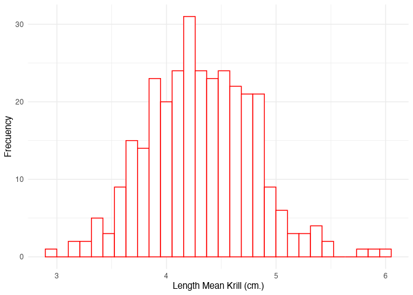

### Cambiar a factor `Year` y `cellid`


```r
envlen$Year<-as.factor(envlen$Year)
envlen$cellid<-as.factor(envlen$cellid)
glimpse(envlen)
```

```
## Rows: 314
## Columns: 7
## $ cellid   <fct> 362, 364, 365, 365, 365, 365, 365, 366, 366, 366, 366, 366, 3…
## $ Year     <fct> 2010, 2012, 2010, 2012, 2014, 2015, 2016, 2012, 2013, 2014, 2…
## $ lepro    <dbl> 5.299110, 3.650249, 4.399167, 3.649709, 4.244000, 4.646200, 4…
## $ meansic2 <dbl> 0.0000, 1278.0000, 644.5000, 645.5000, 646.5000, 651.5000, 64…
## $ meanchl2 <dbl> 0.7186055, 1.3517104, 1.7762298, 1.7762298, 1.7762298, 1.7762…
## $ meantsm2 <dbl> 272.7892, 271.9378, 271.7853, 271.7853, 271.7853, 271.7853, 2…
## $ geometry <POLYGON [°]> POLYGON ((-66 -64.72045, -6..., POLYGON ((-64 -64.720…
```

### Filtrar datos `NA` if we have. Test


```r
# Are there missing values?
colSums(is.na(envlen))
```

```
##   cellid     Year    lepro meansic2 meanchl2 meantsm2 geometry 
##        0        0        0        0        0        0        0
```

### Filter outliers environmental and biological data

Test trought plot all variables in `envlen` object


```r
boxsic <- ggplot(envlen)+
  geom_boxplot(aes(Year, meansic2),
               outlier.colour = "red")+
  theme_minimal()
boxtsm <- ggplot(envlen)+
  geom_boxplot(aes(Year, meantsm2),
               outlier.colour = "red")+
  theme_minimal()
boxchl <- ggplot(envlen)+
  geom_boxplot(aes(Year, meanchl2),
               outlier.colour = "red")+
  theme_minimal()
ggarrange(boxsic, boxtsm, boxchl, nrow = 3)
```


is necessary get off outliers from Sea ice index. Get environmental outliers data and again...


```r
envlen2 <- envlen %>% 
  filter(meansic2<100)

#plot 2
         
boxsic2 <- ggplot(envlen2)+
  geom_boxplot(aes(Year, meansic2),
               outlier.colour = "red")+
  theme_minimal()
boxtsm2 <- ggplot(envlen2)+
  geom_boxplot(aes(Year, meantsm2),
               outlier.colour = "red")+
  theme_minimal()
boxchl2 <- ggplot(envlen2)+
  geom_boxplot(aes(Year, meanchl2),
               outlier.colour = "red")+
  theme_minimal()

p<-ggplot(envlen2, aes(x=meansic2)) + 
  geom_histogram(color="black", fill="white")+
  theme_minimal()

q<-ggplot(envlen2, aes(x=meantsm2)) + 
  geom_histogram(color="black", fill="white")+
  theme_minimal()

t<-ggplot(envlen2, aes(x=meanchl2)) + 
  geom_histogram(color="black", fill="white")+
  theme_minimal()

ggarrange(boxsic2, boxtsm2, boxchl2, p, q, t, nrow = 2, ncol=3)
```

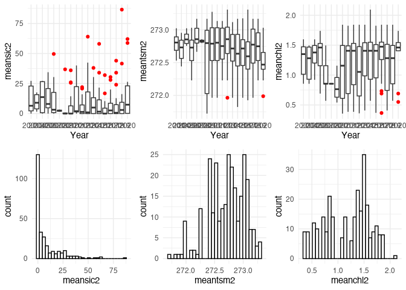

## Correlation Analysis

## Simple correlation identification toget information about variables

Firts filter in our dataframe `envlen3`.

Regarding difference between `Spearman` and `pearson`, both, the
Spearman test and the Pearson test are statistical methods used to
assess the correlation between two variables. The main difference
between them is that the Pearson test evaluates the linear correlation
between two continuous variables, while the Spearman test evaluates the
monotonic correlation between two continuous or order variables.

In the case of the Pearson test, the degree of association between two
continuous variables is measured through a correlation coefficient that
varies between -1 and 1. A value of 1 indicates a perfectly positive
correlation, a value of -1 indicates a perfectly negative correlation,
and a value of 0 indicates no correlation between the two variables.

On the other hand, the Spearman test is based on the range of the
variables, instead of the actual values. In other words, this test
evaluates the correlation between two order variables, where the values
of each variable are ranked from lowest to highest, and ranges are used
instead of actual values. Spearman's correlation coefficient also varies
between -1 and 1, but it measures the monotonic correlation between two
variables, that is, if one variable increases, the other variable also
increases or decreases[@McCulloch2001].

In summary, the main difference between the Spearman test and the
Pearson test is that the former is used to assess the monotonic
correlation between two order variables, while the latter is used to
assess the linear correlation between two continuous variables.

-   Spearman's Rank Correlation Coefficient

This coefficient is used to see if there is any significant relationship
between the two datasets, and operates under the assumption that the
data being used is ordinal, which here means that the numbers do not
indicate quantity, but rather they signify a position of place of the
subject's standing (e.g. 1st, 2nd, 3rd, etc.)

$r_s = \frac{\sum_{i=1}^n (x_i - \bar{x})(y_i - \bar{y})}{\sqrt{\sum_{i=1}^n (x_i - \bar{x})^2}\sqrt{\sum_{i=1}^n (y_i - \bar{y})^2}}$

- Pearson Product-Moment Coefficient

This is the most widely used correlation analysis formula, which measures the strength of the ‘linear’ relationships between the raw data from both variables, rather than their ranks. This is an dimensionless coefficient, meaning that there are no data-related boundaries to be considered when conducting analyses with this formula, which is a reason why this coefficient is the first formula researchers try.

$r = 1- \frac{6\sum_{i=1}^n D_{i}^n}{n (n^2 - 1)}$

(Is posible report outpus by @Report2023)

```r
# change to data frame
envlen3 <- as.data.frame(envlen2)
envlen4 <- envlen3 %>% 
  dplyr::select(3, 4, 5, 6)
```

Plot to show correlation trough different ways.
First, the matri correlation


```r
kableExtra::kable(cor(envlen4)) %>% 
  kable_styling()
```

<table class="table" style="margin-left: auto; margin-right: auto;">
 <thead>
  <tr>
   <th style="text-align:left;">   </th>
   <th style="text-align:right;"> lepro </th>
   <th style="text-align:right;"> meansic2 </th>
   <th style="text-align:right;"> meanchl2 </th>
   <th style="text-align:right;"> meantsm2 </th>
  </tr>
 </thead>
<tbody>
  <tr>
   <td style="text-align:left;"> lepro </td>
   <td style="text-align:right;"> 1.0000000 </td>
   <td style="text-align:right;"> -0.3062665 </td>
   <td style="text-align:right;"> -0.5479329 </td>
   <td style="text-align:right;"> 0.4398602 </td>
  </tr>
  <tr>
   <td style="text-align:left;"> meansic2 </td>
   <td style="text-align:right;"> -0.3062665 </td>
   <td style="text-align:right;"> 1.0000000 </td>
   <td style="text-align:right;"> 0.5346477 </td>
   <td style="text-align:right;"> -0.5136020 </td>
  </tr>
  <tr>
   <td style="text-align:left;"> meanchl2 </td>
   <td style="text-align:right;"> -0.5479329 </td>
   <td style="text-align:right;"> 0.5346477 </td>
   <td style="text-align:right;"> 1.0000000 </td>
   <td style="text-align:right;"> -0.7018000 </td>
  </tr>
  <tr>
   <td style="text-align:left;"> meantsm2 </td>
   <td style="text-align:right;"> 0.4398602 </td>
   <td style="text-align:right;"> -0.5136020 </td>
   <td style="text-align:right;"> -0.7018000 </td>
   <td style="text-align:right;"> 1.0000000 </td>
  </tr>
</tbody>
</table>

```r
# covariance matrix
kableExtra::kable(cov(envlen4)) %>% 
  kable_styling()
```

<table class="table" style="margin-left: auto; margin-right: auto;">
 <thead>
  <tr>
   <th style="text-align:left;">   </th>
   <th style="text-align:right;"> lepro </th>
   <th style="text-align:right;"> meansic2 </th>
   <th style="text-align:right;"> meanchl2 </th>
   <th style="text-align:right;"> meantsm2 </th>
  </tr>
 </thead>
<tbody>
  <tr>
   <td style="text-align:left;"> lepro </td>
   <td style="text-align:right;"> 0.2350262 </td>
   <td style="text-align:right;"> -1.966354 </td>
   <td style="text-align:right;"> -0.1139646 </td>
   <td style="text-align:right;"> 0.0676632 </td>
  </tr>
  <tr>
   <td style="text-align:left;"> meansic2 </td>
   <td style="text-align:right;"> -1.9663536 </td>
   <td style="text-align:right;"> 175.391296 </td>
   <td style="text-align:right;"> 3.0377794 </td>
   <td style="text-align:right;"> -2.1582943 </td>
  </tr>
  <tr>
   <td style="text-align:left;"> meanchl2 </td>
   <td style="text-align:right;"> -0.1139646 </td>
   <td style="text-align:right;"> 3.037779 </td>
   <td style="text-align:right;"> 0.1840641 </td>
   <td style="text-align:right;"> -0.0955384 </td>
  </tr>
  <tr>
   <td style="text-align:left;"> meantsm2 </td>
   <td style="text-align:right;"> 0.0676632 </td>
   <td style="text-align:right;"> -2.158294 </td>
   <td style="text-align:right;"> -0.0955384 </td>
   <td style="text-align:right;"> 0.1006839 </td>
  </tr>
</tbody>
</table>


```r
pairs.panels(envlen4,
             smooth = TRUE,      
             scale = FALSE,      
             density = TRUE,     
             ellipses = TRUE,  
             method = "pearson",
             pch = 21,           
             lm = FALSE,        
             cor = TRUE,         
             jiggle = FALSE,     
             factor = 2,        
             hist.col = 4,       # Color de los histogramas
             stars = TRUE)
```

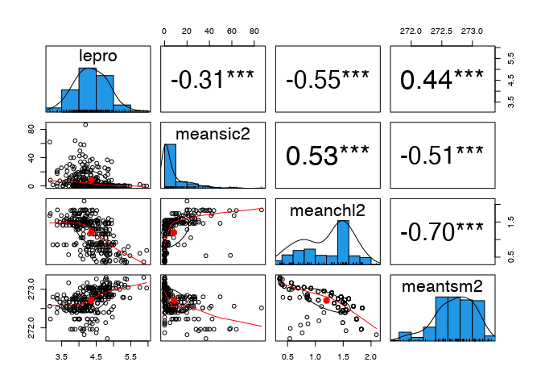


```r
resu <- correlation(envlen4)
resu
```

```
## # Correlation Matrix (pearson-method)
## 
## Parameter1 | Parameter2 |     r |         95% CI | t(273) |         p
## ---------------------------------------------------------------------
## lepro      |   meansic2 | -0.31 | [-0.41, -0.20] |  -5.32 | < .001***
## lepro      |   meanchl2 | -0.55 | [-0.63, -0.46] | -10.82 | < .001***
## lepro      |   meantsm2 |  0.44 | [ 0.34,  0.53] |   8.09 | < .001***
## meansic2   |   meanchl2 |  0.53 | [ 0.44,  0.61] |  10.45 | < .001***
## meansic2   |   meantsm2 | -0.51 | [-0.60, -0.42] |  -9.89 | < .001***
## meanchl2   |   meantsm2 | -0.70 | [-0.76, -0.64] | -16.28 | < .001***
## 
## p-value adjustment method: Holm (1979)
## Observations: 275
```

```r
summary(resu, redundant=TRUE)
```

```
## # Correlation Matrix (pearson-method)
## 
## Parameter |    lepro | meansic2 | meanchl2 | meantsm2
## -----------------------------------------------------
## lepro     |          | -0.31*** | -0.55*** |  0.44***
## meansic2  | -0.31*** |          |  0.53*** | -0.51***
## meanchl2  | -0.55*** |  0.53*** |          | -0.70***
## meantsm2  |  0.44*** | -0.51*** | -0.70*** |         
## 
## p-value adjustment method: Holm (1979)
```

We can identify through a correlation matrix the data of our set, whether it is positive or negative. See Figure \@ref(fig:coorplot).

```r
resu %>%
  summary(redundant = TRUE) %>%
  plot()
```

<div class="figure" style="text-align: center">
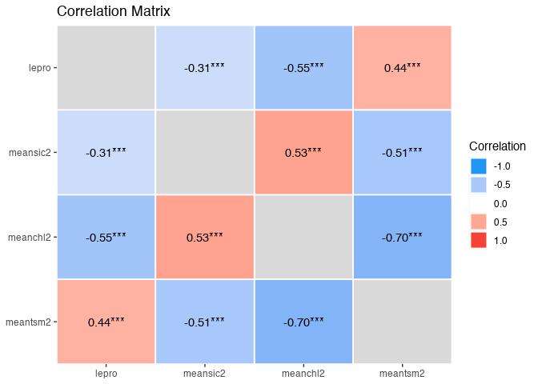
<p class="caption">Correlation Matrix</p>
</div>


```r
plot(correlation(envlen4, partial = TRUE)) +
  scale_edge_color_continuous(low = "#000004FF", high = "#FCFDBFFF")
```

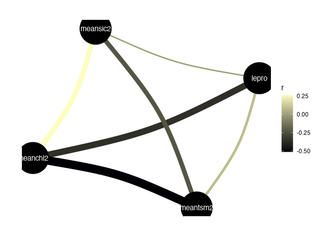

Here we can identify the correlation that exists between krill length and chlorophyla (-) and krill length and SST (+)


## GLM models

Come back with `envlen2` object.

```r
names(envlen2)
```

```
## [1] "cellid"   "Year"     "lepro"    "meansic2" "meanchl2" "meantsm2" "geometry"
```

```r
# [1] "cellid"   "Year"     "lepro"    "meansic2" "meanchl2"
# [6] "meantsm2" "geometry"
env1 <- glm(lepro ~ Year,
            data = envlen2)
env2 <- glm(lepro ~ Year + 
              meansic2,
            data = envlen2)
env3 <- glm(lepro ~ Year + 
              meansic2 +
              meanchl2 ,
            data = envlen2)
env4 <- glm(lepro ~ Year + 
              meansic2 +
              meanchl2 + 
              meantsm2 ,
            data = envlen2)
#spatial component
env5 <- glm(lepro ~ Year + 
              meansic2 +
              meanchl2 + 
              meantsm2 +
              cellid,
            data = envlen2)
```
test with @Ludecke2021


```r
check_model(env1)
```

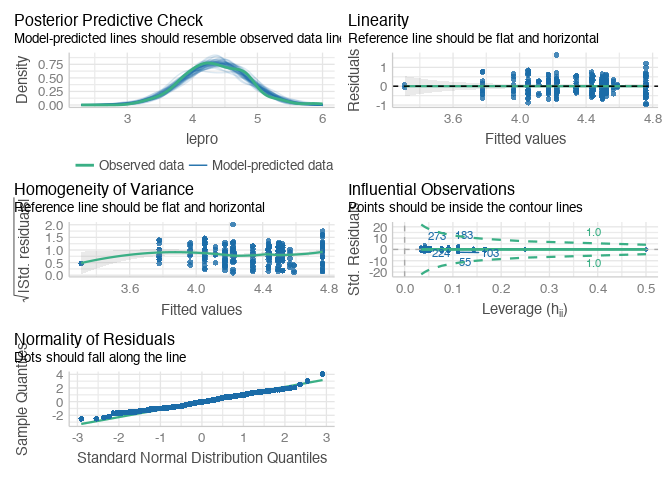

```r
check_model(env2)
```

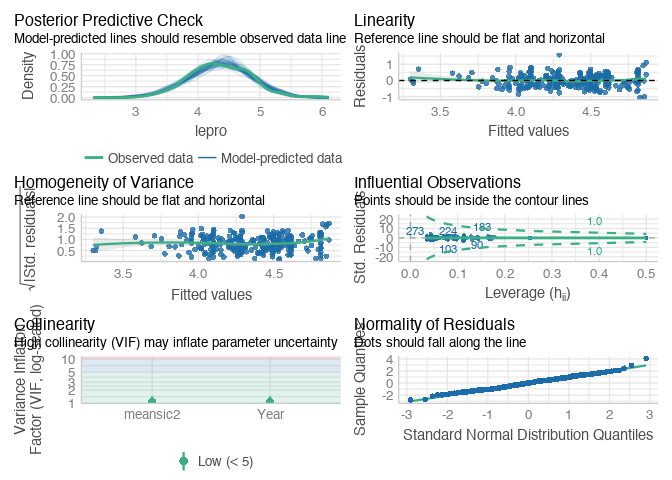

```r
check_model(env3)
```

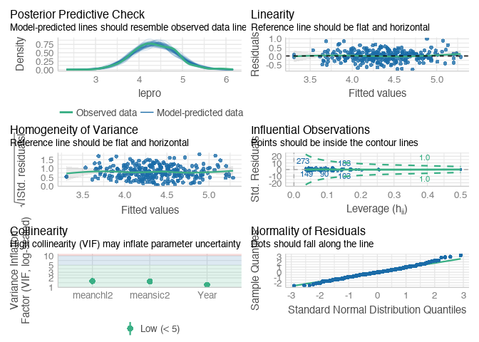

```r
check_model(env4)
```


```r
plot(compare_performance(env1, 
                         env2, 
                         env3,
                         env4,
                         env5,
                         rank = TRUE),
     name="GLM Model to length krill data vs Env")
```

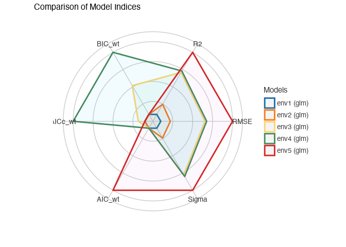

Comparative table acrosss models.

```r
comp <- compare_performance(env1, 
                         env2, 
                         env3,
                         env4,
                    env5)

kableExtra::kable(comp) %>% 
  kable_styling()
```

<table class="table" style="margin-left: auto; margin-right: auto;">
 <thead>
  <tr>
   <th style="text-align:left;"> Name </th>
   <th style="text-align:left;"> Model </th>
   <th style="text-align:right;"> AIC </th>
   <th style="text-align:right;"> AIC_wt </th>
   <th style="text-align:right;"> AICc </th>
   <th style="text-align:right;"> AICc_wt </th>
   <th style="text-align:right;"> BIC </th>
   <th style="text-align:right;"> BIC_wt </th>
   <th style="text-align:right;"> R2 </th>
   <th style="text-align:right;"> RMSE </th>
   <th style="text-align:right;"> Sigma </th>
  </tr>
 </thead>
<tbody>
  <tr>
   <td style="text-align:left;"> env1 </td>
   <td style="text-align:left;"> glm </td>
   <td style="text-align:right;"> 319.5826 </td>
   <td style="text-align:right;"> 0.0000000 </td>
   <td style="text-align:right;"> 322.5630 </td>
   <td style="text-align:right;"> 0.0000000 </td>
   <td style="text-align:right;"> 388.3012 </td>
   <td style="text-align:right;"> 0.0000000 </td>
   <td style="text-align:right;"> 0.3038840 </td>
   <td style="text-align:right;"> 0.4037456 </td>
   <td style="text-align:right;"> 0.4176453 </td>
  </tr>
  <tr>
   <td style="text-align:left;"> env2 </td>
   <td style="text-align:left;"> glm </td>
   <td style="text-align:right;"> 290.7437 </td>
   <td style="text-align:right;"> 0.0000000 </td>
   <td style="text-align:right;"> 294.0508 </td>
   <td style="text-align:right;"> 0.0000000 </td>
   <td style="text-align:right;"> 363.0792 </td>
   <td style="text-align:right;"> 0.0000000 </td>
   <td style="text-align:right;"> 0.3777294 </td>
   <td style="text-align:right;"> 0.3817303 </td>
   <td style="text-align:right;"> 0.3956426 </td>
  </tr>
  <tr>
   <td style="text-align:left;"> env3 </td>
   <td style="text-align:left;"> glm </td>
   <td style="text-align:right;"> 163.3190 </td>
   <td style="text-align:right;"> 0.0000383 </td>
   <td style="text-align:right;"> 166.9712 </td>
   <td style="text-align:right;"> 0.0833728 </td>
   <td style="text-align:right;"> 239.2712 </td>
   <td style="text-align:right;"> 0.3162969 </td>
   <td style="text-align:right;"> 0.6113265 </td>
   <td style="text-align:right;"> 0.3016890 </td>
   <td style="text-align:right;"> 0.3132967 </td>
  </tr>
  <tr>
   <td style="text-align:left;"> env4 </td>
   <td style="text-align:left;"> glm </td>
   <td style="text-align:right;"> 158.1606 </td>
   <td style="text-align:right;"> 0.0005051 </td>
   <td style="text-align:right;"> 162.1764 </td>
   <td style="text-align:right;"> 0.9166272 </td>
   <td style="text-align:right;"> 237.7295 </td>
   <td style="text-align:right;"> 0.6837031 </td>
   <td style="text-align:right;"> 0.6213134 </td>
   <td style="text-align:right;"> 0.2977879 </td>
   <td style="text-align:right;"> 0.3098536 </td>
  </tr>
  <tr>
   <td style="text-align:left;"> env5 </td>
   <td style="text-align:left;"> glm </td>
   <td style="text-align:right;"> 142.9803 </td>
   <td style="text-align:right;"> 0.9994565 </td>
   <td style="text-align:right;"> 202.0915 </td>
   <td style="text-align:right;"> 0.0000000 </td>
   <td style="text-align:right;"> 417.8549 </td>
   <td style="text-align:right;"> 0.0000000 </td>
   <td style="text-align:right;"> 0.7580380 </td>
   <td style="text-align:right;"> 0.2380349 </td>
   <td style="text-align:right;"> 0.2791207 </td>
  </tr>
</tbody>
</table>


## GLMM models

Random effects are a way to model variability in data that comes from factors that cannot be directly measured or controlled. In the context of statistical models, random effects refer to variables that are assumed to have an unknown probability distribution, and are included in the model to explain some of the variation in the data.

For example, in a study comparing the test scores of students at different schools, random effects refer to differences between schools that cannot be explained by variables measured in the study, such as students' socioeconomic status. These differences may be caused by factors such as the quality of teaching, school culture, or geographic location.

Random effects are often modeled by using mixed effects models, which combine random and fixed effects in the same model. Fixed effects are those that are assumed to be constant for all study units and are directly measured, while random effects are those that are assumed to vary randomly across study units and cannot be directly measured.

In short, random effects are a way of modeling variability in data that cannot be directly explained by the variables measured in the study, and are included in the model to improve the precision of the estimates and reduce the potential for bias [@McCulloch2001].

In this cae we try test spatial componenten in `cellid` variable like random effects with `lme4` package [@Bates2015].


```r
names(envlen$meantsm2)
```

```
## NULL
```

```r
env1m <- lmer(lepro ~ Year + 
             meanchl2 + 
             meansic2 + 
             meantsm2 + (1|cellid), 
           data = envlen)
```


```r
# graficar efectos aleatorios
pre <- plot_model(env1m,type = "re", 
                facet.grid=TRUE, 
                free.scale = FALSE, 
                title = NULL, 
                vline.color = "darkgrey",
                sort.est = TRUE,
                colors = "Set1",
                show.data = TRUE,
                jitter = 0.2,
                terms = "Days")+
  theme_minimal()

pest <- plot_model(env1m,type = "est", 
                facet.grid=FALSE, 
                free.scale = FALSE, 
                title = NULL, 
                vline.color = "darkgrey",
                sort.est = TRUE,
                colors = "Set2",
                show.data = TRUE,
                jitter = 0.2)+
  theme_minimal()

ggarrange(pre, pest, ncol = 2)
```

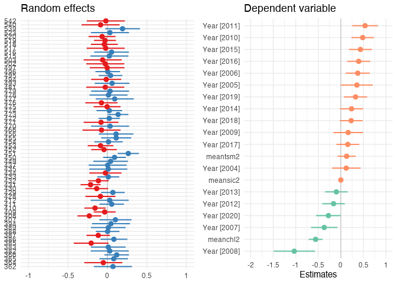
# Conclusion

On the one hand, the models with mixed effects serve to verify the influence of the spatial component, in this case each cell y in which the data of the dependent variable (krill sizes) and the independent variable (environmental variables) were considered.
# References

Sea ice data is from Giovanni NASA browser
(<https://giovanni.gsfc.nasa.gov/>) ref: Global Modeling and
Assimilation Office (GMAO) (2015),

MERRA-2 tavgM_2d_flx_Nx: 2d,Monthly mean,Time-Averaged,Single-Level,
Assimilation,Surface Flux Diagnostics V5.12.4, Greenbelt, MD, USA,
Goddard Earth Sciences Data and Information Services Center (GES DISC),
Accessed: [06 July 2022], 10.5067/0JRLVL8YV2Y4
