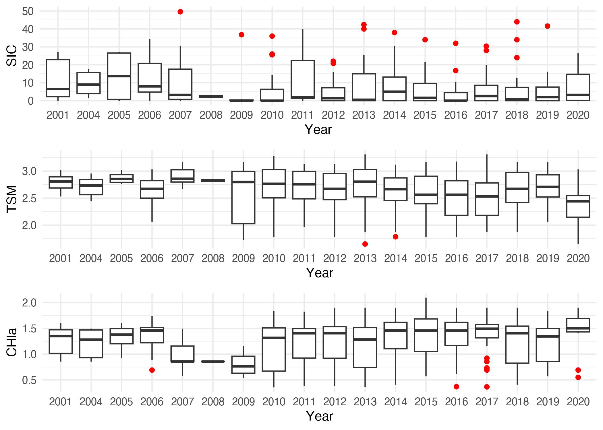
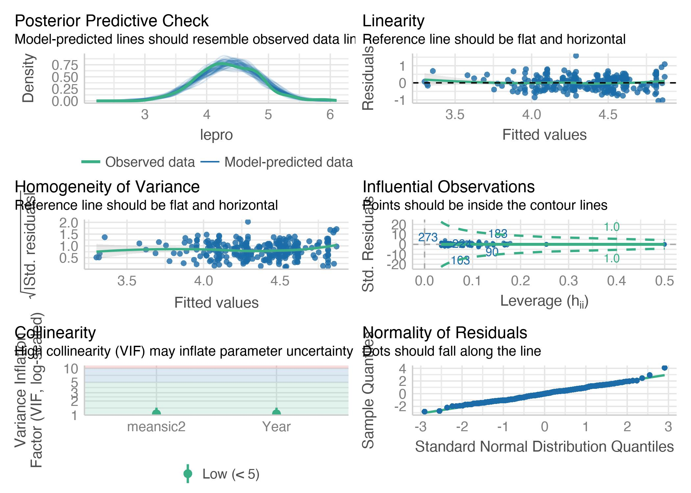

```r
rm(list = ls())
knitr::opts_chunk$set(echo = TRUE,
                      message = FALSE,
                      warning = FALSE,
                      fig.align = 'center',
                      dev = 'jpeg',
                      dpi = 300)
#XQuartz is a mess, put this in your onload to default to cairo instead
options(bitmapType = "cairo") 
# (https://github.com/tidyverse/ggplot2/issues/2655)
# Lo mapas se hacen mas rapido
```

# Background

The following document intends to carry out a complementary
methodological analysis to correlate environmental variables with the
population dynamics of krill (*Euphausia superba*), in this case, with a
biological component like lengths from fishery monitoring.

# Hypothesis

The primary inquiry pertains to the environmental effects of distinct
physical and oceanographic factors in the Southern Ocean on the krill
population. Our aim is to examine the population structure via krill
length component and determine whether any changes were driven by
environmental factors across any of its dimensions.

# Objective

Once the correlation and effects on the population and/or fishing
indicators on krill have been verified, this analysis aims to have a
time series of the environmental variable to incorporate into the stock
assessment process. Similar work in @Wang2021 but with a longest fishery
history.


```r
library(reshape2)
library(tidyverse)
library(plyr)
library(lubridate)
library(raster)
library(sf)
library(CCAMLRGIS)
library(here)
library(easystats)
library(see) # for plotting
library(ggraph) # needs to be loaded# analisis estadisticos post
library(ncdf4)
library(readr)
library(data.table)
library(ggridges)
library(ggpubr)
library(knitr)
library(kableExtra)
# stat test
library(corrplot)
library(outliers)
library(visreg)
# correlation test 
library(PerformanceAnalytics)
library(psych)
library(lme4)
library(sjPlot)
```

# Methodology

## Length structure krill 48 Statistical Subarea

Another important piece of information for a stock evaluation refers to
the biological components such as average sizes and weights across areas
and years. To do this, we will explore the biological data and prepare
the output to add it into stock assessment integrate model
[@Methot2013].

the idea is to correlate mean lengths with SIC.

## Data exploratory analysis

The object `ohbio2` come from data exploration analysis in data request
CCAMLR data. This objetc have bio information from krill.


```r
#cargo objeto
meta <- get("METADATA")
c1 <- get("C1")
ohbio <- get("OBS_HAUL_BIOLOGY")
names(ohbio)
```

```
##  [1] "c1_id"                 "obs_haul_id"           "obs_logbook_id"       
##  [4] "haul_number"           "taxon_code"            "taxon_scientific_name"
##  [7] "taxon_family"          "maturity_stage"        "sex_code"             
## [10] "length_total_cm"       "greenweight_kg"
```

```r
dim(c1)
```

```
## [1] 360439     35
```

```r
dim(ohbio)
```

```
## [1] 2107887      11
```

Join data set with master as `c1` set. This join is trought
`obs_haul_id` variable


```r
ohbio2 <- left_join(c1, ohbio, by="obs_haul_id")
dim(ohbio2)
```

```
## [1] 2443773      45
```

Firsts glance. Test how many register have by year. In this case,
`length_total_cm` by season ccamlr. Same exercise in date period
`date_catchperiod_start` to separate dates.


```r
ohbio3 <- ohbio2 %>%
  mutate(Year = year(date_catchperiod_start),
         Month = month(date_catchperiod_start),
         Day = day(date_catchperiod_start))
```


```r
names(ohbio3)
```

```
##  [1] "c1_id.x"                   "obs_haul_id"              
##  [3] "obs_logbook_id.x"          "obs_haul_number"          
##  [5] "haul_number.x"             "vessel_name"              
##  [7] "vessel_nationality_code"   "fishing_purpose_code"     
##  [9] "season_ccamlr"             "target_species"           
## [11] "asd_code"                  "trawl_technique"          
## [13] "catchperiod_code"          "date_catchperiod_start"   
## [15] "datetime_set_start"        "datetime_set_end"         
## [17] "datetime_haul_start"       "datetime_haul_end"        
## [19] "datetime_timezone"         "depth_gear_set_end_m"     
## [21] "depth_gear_haul_start_m"   "depth_bottom_set_end_m"   
## [23] "depth_bottom_haul_start_m" "latitude_set_end"         
## [25] "longitude_set_end"         "latitude_haul_start"      
## [27] "longitude_haul_start"      "gear_type_code"           
## [29] "gear_type"                 "mesh_code"                
## [31] "trawl_net_number"          "notes"                    
## [33] "trawl_duration_depth_h"    "trawl_duration_total_h"   
## [35] "krill_greenweight_kg"      "c1_id.y"                  
## [37] "obs_logbook_id.y"          "haul_number.y"            
## [39] "taxon_code"                "taxon_scientific_name"    
## [41] "taxon_family"              "maturity_stage"           
## [43] "sex_code"                  "length_total_cm"          
## [45] "greenweight_kg"            "Year"                     
## [47] "Month"                     "Day"
```

```r
ohbio4 <- ohbio3 %>% 
dplyr::select(7, 9, 11, 12, 14, 24, 25, 29, 42, 44, 46, 47)
names(ohbio4)
```

```
##  [1] "vessel_nationality_code" "season_ccamlr"          
##  [3] "asd_code"                "trawl_technique"        
##  [5] "date_catchperiod_start"  "latitude_set_end"       
##  [7] "longitude_set_end"       "gear_type"              
##  [9] "maturity_stage"          "length_total_cm"        
## [11] "Year"                    "Month"
```


```r
coutlength <-ohbio4 %>% 
  drop_na(length_total_cm) %>% 
  dplyr::group_by(Year, Month, asd_code) %>%
  dplyr::summarise(avg=mean(length_total_cm))
#kableExtra::kable(coutlength, format = "html")
```

Some features of data set length structures


```r
table(ohbio4$gear_type) %>%
  kbl() %>%
  kable_styling()
```

<table class="table" style="margin-left: auto; margin-right: auto;">
 <thead>
  <tr>
   <th style="text-align:left;"> Var1 </th>
   <th style="text-align:right;"> Freq </th>
  </tr>
 </thead>
<tbody>
  <tr>
   <td style="text-align:left;"> Beam Trawls, Midwater </td>
   <td style="text-align:right;"> 387680 </td>
  </tr>
  <tr>
   <td style="text-align:left;"> Gear Not Known, Or Not Elsewhere Included </td>
   <td style="text-align:right;"> 43 </td>
  </tr>
  <tr>
   <td style="text-align:left;"> Midwater Trawls Nei </td>
   <td style="text-align:right;"> 14346 </td>
  </tr>
  <tr>
   <td style="text-align:left;"> Otter Trawls Nei </td>
   <td style="text-align:right;"> 3 </td>
  </tr>
  <tr>
   <td style="text-align:left;"> Otter Trawls, Bottom </td>
   <td style="text-align:right;"> 380 </td>
  </tr>
  <tr>
   <td style="text-align:left;"> Otter Trawls, Bottom, Towed From Stern </td>
   <td style="text-align:right;"> 2576 </td>
  </tr>
  <tr>
   <td style="text-align:left;"> Otter Trawls, Midwater </td>
   <td style="text-align:right;"> 375337 </td>
  </tr>
  <tr>
   <td style="text-align:left;"> Otter Trawls, Midwater, Towed From Side </td>
   <td style="text-align:right;"> 1 </td>
  </tr>
  <tr>
   <td style="text-align:left;"> Otter Trawls, Midwater, Towed From Stern </td>
   <td style="text-align:right;"> 1663407 </td>
  </tr>
</tbody>
</table>

```r
table(ohbio2$trawl_technique)%>%
  kbl() %>%
  kable_styling()
```

<table class="table" style="margin-left: auto; margin-right: auto;">
 <thead>
  <tr>
   <th style="text-align:left;"> Var1 </th>
   <th style="text-align:right;"> Freq </th>
  </tr>
 </thead>
<tbody>
  <tr>
   <td style="text-align:left;"> C </td>
   <td style="text-align:right;"> 436932 </td>
  </tr>
  <tr>
   <td style="text-align:left;"> T </td>
   <td style="text-align:right;"> 2006841 </td>
  </tr>
</tbody>
</table>

## Plots

Filter data regarding to previous glances. Follow with a quick glimpse
to all 48 subarea length composition from monitoring fisheries.


```r
jz <- ggplot(ohbio4 %>% 
               filter(Year>2000),
             aes(x=length_total_cm, 
                 y = as.factor(Year), 
                 fill=asd_code))+
  #geom_joy(alpha=0.9) +
  geom_density_ridges(stat = "binline", bins = 50, 
                      scale = 1.8, 
                      draw_baseline = FALSE,
                      alpha=0.9)+
  facet_wrap(.~asd_code, ncol=3) +   
  geom_vline(xintercept = 3.6, color = "red")+
  scale_x_continuous(breaks = seq(from = 1, to = 10, 
                                  by = 1))+
  scale_y_discrete(breaks = seq(from = 2000, 
                                to = 2020, by = 1))+
  scale_fill_viridis_d(name="SubArea",
                       option="F")+
  theme_bw()+
  theme(axis.text.x = element_text(angle = 90, 
                                   hjust = 1))+
  xlim(0,10)+
  xlab("Longitud (cm.)")+
  ylab("")
jz
```


Another way to watch this data is regarding thecniches trawl like Figure
\@ref(fig:lenthtrwal).


```r
trwal <- ggplot(ohbio4 %>% 
               filter(Year>2000),
             aes(x=length_total_cm, 
                 y = as.factor(Year),
                 fill= trawl_technique))+
  #geom_joy(alpha=0.9) +
  geom_density_ridges(stat = "binline", bins = 50, 
                      scale = 1.8, 
                      draw_baseline = FALSE,
                      alpha=0.5)+
  facet_wrap(.~asd_code, ncol=3) +   
  geom_vline(xintercept = 3.6, color = "red")+
  scale_x_continuous(breaks = seq(from = 1, to = 10, 
                                  by = 1))+
  scale_y_discrete(breaks = seq(from = 2000, 
                                to = 2020, by = 1))+
  scale_fill_viridis_d(name="Trawl Technique",
                       option="F")+
  theme_bw()+
  theme(axis.text.x = element_text(angle = 90, 
                                   hjust = 1))+
  xlim(0,10)+
  xlab("Longitud (cm.)")+
  ylab("")
trwal
```


Same plot by Sub Area and month trought year. With this kind of plot, we
can see the recruit power interannually (Figure \@ref(fig:lengthmonth).


```r
ymasd <- ggplot(ohbio4 %>% 
               filter(Year>2000),
             aes(x=length_total_cm, 
                 y = as.factor(Month),
                 fill=asd_code))+
  #geom_joy(alpha=0.9) +
  geom_density_ridges(stat = "binline", bins = 50, 
                      scale = 1.5, 
                      draw_baseline = FALSE,
                      alpha=0.5)+
  facet_wrap(.~season_ccamlr, ncol=5) +   
  geom_vline(xintercept = 3.6, color = "red")+
  scale_x_continuous(breaks = seq(from = 1, to = 10, 
                                  by = 1))+
  scale_y_discrete(breaks = seq(from = 1, 
                                to = 12, by = 1))+
  scale_fill_viridis_d(name="SubArea",
                       option="F")+
  theme_bw()+
  theme(axis.text.x = element_text(angle = 90, 
                                   hjust = 1))+
  xlim(0,10)+
  xlab("Longitud (cm.)")+
  ylab("")
ymasd
```


Just 48.1 SubArea plot


```r
yma481 <- ggplot(ohbio4 %>% 
               filter(Year>2000,
                      asd_code==481),
             aes(x=length_total_cm, 
                 y = as.factor(Month),
                 fill=asd_code))+
  #geom_joy(alpha=0.9) +
  geom_density_ridges(stat = "binline", bins = 50, 
                      scale = 1.5, 
                      draw_baseline = FALSE,
                      alpha=0.5)+
  facet_wrap(.~Year, ncol=5) +   
  geom_vline(xintercept = 3.6, color = "red")+
  scale_x_continuous(breaks = seq(from = 1, to = 10, 
                                  by = 1))+
  scale_y_discrete(breaks = seq(from = 1, 
                                to = 12, by = 1))+
  scale_fill_viridis_d(name="SubArea",
                       option="F")+
  theme_bw()+
  theme(axis.text.x = element_text(angle = 90, 
                                   hjust = 1))+
  xlim(0,10)+
  xlab("Longitud (cm.)")+
  ylab("")
yma481
```

## Mean Length

Recruit estimate (% Low Recruit length) [@Perry2020]

Un diaggrama de caja para el porcentage de individuos bajo talla (3.6
mmm.)


```r
box <- ggplot(ohbio4) +
  geom_boxplot(aes(length_total_cm, group=season_ccamlr), 
               alpha=0.3,
               fill=3)+
  geom_vline(xintercept = 3.6, color = "red")+
  xlim(0, 7)+
  coord_flip()+
  facet_wrap(~asd_code, ncol=1)+
  theme_bw()+
  labs(x="% Below Recruit length (3.6 mm.)",
       x="")
hi <- ggplot(ohbio4)+
  geom_histogram(aes(y=length_total_cm), 
                 fill=3,
                 alpha=0.3,
                 color="black")+
  coord_flip()+
  theme_bw()+
  ylim(0,10)

ggarrange(box, hi, ncol = 2)
```


Mean length in time series by Subarea.


```r
pmea <- ggplot(coutlength %>% 
                 filter(Year>2000), 
               aes(Year,avg))+
    geom_point(shape=21, fill=coutlength$asd_code, 
               show.legend = T) +
    stat_smooth(method= "glm", colour='#253494')+
    scale_size(range = c(-4,8)) +
    theme_bw()+ 
    facet_wrap(.~asd_code)+
    scale_x_continuous(breaks = seq(from = 2000, to = 2020, by = 2))+
    #scale_y_discrete(breaks = seq(from = 1, to = 13, by = 1))+
    theme(axis.text.x = element_text(angle = 90, hjust = 2))+
    guides(fill = guide_legend(reverse=F))+
    scale_fill_viridis_c(option="E")+
    ylim(3,6)+
    ylab("") +
    xlab("") +
    ggtitle("Lenght Mean Krill fishery")
pmea
```


by month and year only 48.1


```r
pmea481 <- ggplot(coutlength %>% 
                 filter(Year>2000,
                        asd_code==481), 
               aes(Month, avg))+
    geom_point(shape=21,  
               show.legend = T) +
    stat_smooth(method= "glm", colour='#253494')+
    scale_x_continuous(breaks = seq(from = 1, to = 12, by = 2))+
    theme_bw()+ 
    facet_wrap(.~Year) +
    ggtitle("Lenght Mean Krill fishery 48.1")+
    ylim(0, 6)
pmea481
```


(Probar datos con RaadTools library [@Raadtools2022])

## Maps length data

First thing is get different rater layer to join krill data length
according different porpoises.


```r
# Cargo linea de costa
coast <- load_Coastline()
coast1<- st_as_sf(coast) 
coast2 = st_transform(coast1, "+proj=latlong +ellps=WGS84")
# con SSMU
ssmu <- load_SSMUs()
ssmu481 <- subset(ssmu[c(2,3,4,5,6,7,17),])
ssmu481a <- st_as_sf(ssmu481) 
ssmu481aa = st_transform(ssmu481a, "+proj=latlong +ellps=WGS84")

# con Statistical Areas con foco en 48.1
suba <- load_ASDs()
suba1 <- subset(suba[(3),])
suba1a<- st_as_sf(suba1) 
suba1aa = st_transform(suba1a, "+proj=latlong +ellps=WGS84")


# Uso las agrupaciones de DMP1
dmp1 <- st_read("~/DOCAS/Mapas/Antarctic_SHPfiles/D1MPA-model-2019.shp",
                quiet=T)
dmp1=st_transform(dmp1, 6932)

# Uso las agrupaciones de Strata
strata <- st_read("~/DOCAS/Mapas/Antarctic_SHPfiles/Strata.shp",
                quiet=T)
strata=st_transform(strata, "+proj=latlong +ellps=WGS84")
```

Test Strata maps


```r
# y testeo el mapa
ssmap <- ggplot()+
  geom_sf(data = strata, aes(fill=strata$ID, 
                           alpha=0.3))+
  # geom_sf(data = ssmu481aa, aes(fill=ssmu481aa$GAR_Short_Label, 
  #                         alpha=0.3))+
  geom_sf(data = coast2, colour="black", fill=NA)+
  #geom_sf(data = gridcrop1, colour="black", fill=NA)+
  #geom_sf(data= suba1aa, fill=NA)+
  # geom_sf(aes(fill=ssmu481aa$GAR_Short_Label,
  #              alpha=0.3))+
  scale_fill_viridis_d(option = "F",
                       name="Strata")+
  #geom_sf_label(aes(label = strata$ID))+
  # labs(fill = "SSMU")+
  ylim(230000, 2220000)+
  xlim(-3095349 , -1858911)+
  # coord_sf(crs = 32610)+ #sistema de prpyecccion para campos completos
  coord_sf(crs = 6932)+
  scale_alpha(guide="none")+
  theme_bw()
ssmap
```


Test Strata SSMU


```r
# y testeo el mapa
ssmumap <- ggplot()+
  # geom_sf(data = strata, aes(fill=strata$ID, 
  #                          alpha=0.3))+
  geom_sf(data = ssmu481aa, aes(fill=ssmu481aa$GAR_Short_Label,
                          alpha=0.3))+
  geom_sf(data = coast2, colour="black", fill=NA)+
  #geom_sf(data = gridcrop1, colour="black", fill=NA)+
  #geom_sf(data= suba1aa, fill=NA)+
  # geom_sf(aes(fill=ssmu481aa$GAR_Short_Label,
  #              alpha=0.3))+
  scale_fill_viridis_d(option = "G",
                       name="SSMU")+
  #geom_sf_label(aes(label = strata$ID))+
  # labs(fill = "SSMU")+
  ylim(230000, 2220000)+
  xlim(-3095349 , -1858911)+
  # coord_sf(crs = 32610)+ #sistema de prpyecccion para campos completos
  coord_sf(crs = 6932)+
  scale_alpha(guide="none")+
  theme_bw()
ssmumap
```


## Grouping Length data into Grid

### SSMU 48.1 CCAMLR


```r
names(ohbio4)
```

```
##  [1] "vessel_nationality_code" "season_ccamlr"          
##  [3] "asd_code"                "trawl_technique"        
##  [5] "date_catchperiod_start"  "latitude_set_end"       
##  [7] "longitude_set_end"       "gear_type"              
##  [9] "maturity_stage"          "length_total_cm"        
## [11] "Year"                    "Month"
```

```r
ohbio5 <- ohbio4 %>% 
  filter(asd_code==481) %>% 
  dplyr::select(6, 7, 8, 9, 10, 11, 12) 
ohbio6 <- st_as_sf(ohbio5 %>% 
                     drop_na(latitude_set_end), 
                   coords = c("longitude_set_end", "latitude_set_end"),  
                  crs = "+proj=latlong +ellps=WGS84")
```

This grid has the same characteristics as the environmental data grids
that will be called up later. This grid is 1x0.5 degrees which allows a
clear visualization of the processes, whether biological and/or
environmental.


```r
Grid<- suba1aa  %>% #pm481 es el plot base original linea 481
  sf::st_make_grid(cellsize = c(1,0.5)) %>% # para que quede cuadrada
  sf::st_cast("MULTIPOLYGON") %>%
  sf::st_sf()  %>%  # objeto en spatial feature
  dplyr::mutate(cellid = row_number()) 

# Clean the input data by removing duplicate vertices and making the object topologically valid
grid3 <- st_make_valid(Grid)

# Corto la grilla dentro de las SSMU
#gridcrop1 <- crop_shape(grid3, suba1aa, polygon = TRUE)

# the first object drives the output geometry
grilen <- grid3 %>%
  st_join(ohbio6) %>% 
  group_by(cellid)

names(grilen)
```

```
## [1] "cellid"          "gear_type"       "maturity_stage"  "length_total_cm"
## [5] "Year"            "Month"           "geometry"
```

Test lentgh mean map by Year


```r
grilen3 <- grilen %>%
  drop_na(length_total_cm) %>% 
  dplyr::group_by(cellid,Year) %>% 
  dplyr::summarise(lepro=mean(length_total_cm))

 
gl <- ggplot() +
   geom_sf(data=grilen3,
           aes(fill = lepro), 
           alpha=0.7, color=NA) +
  scale_fill_viridis_b(option="G",
                       name="Krill Length Fishery (cm.)",
                       breaks = seq(0,8,1),
                       direction=-1)+
  geom_sf(data = suba1aa, fill=NA, col=2)+
  geom_sf(data = coast2, colour="black", fill="grey")+
  facet_wrap(~Year, ncol=6)+
  theme(panel.background = element_rect(fill = 'aliceblue'),
        panel.grid.major = element_blank(), 
        panel.grid.minor = element_blank())+
  # ylim(-70, -60)+
  # xlim(-70, -50)
  # another kind projection
  ylim(230000, 2220000)+
  xlim(-3095349 , -1858911)+
  #coord_sf(crs = 32610)+ #sistema de prpyecccion para campos completos
  coord_sf(crs = 6932)
gl
```


Load environmental data to merge with length.


Get data specific object


Join length and environental data by `cellid` and `Year` with a reduce
DB.


```r
class(dataenvf)
```

```
## [1] "data.frame"
```

```r
envgru <- dataenvf %>%
  dplyr::select(1, 2, 3, 6, 9) %>% 
  drop_na(ANO.x) %>% 
  dplyr::rename(Year=ANO.x) %>% 
  dplyr::group_by(cellid,Year) %>% 
  dplyr::summarise(meansic2=mean(meansic),
                   meanchl2=mean(meanchl),
                   meantsm2=mean(meantsm))
dim(envgru)
```

```
## [1] 11653     5
```

```r
summary(envgru)
```

```
##      cellid          Year              meansic2         meanchl2     
##  Min.   :  1.0   Length:11653       Min.   :   0.0   Min.   :0.3017  
##  1st Qu.:353.0   Class :character   1st Qu.:   0.0   1st Qu.:0.3982  
##  Median :425.0   Mode  :character   Median :   0.8   Median :0.5417  
##  Mean   :402.7                      Mean   : 387.9   Mean   :0.7477  
##  3rd Qu.:496.0                      3rd Qu.: 434.7   3rd Qu.:1.0541  
##  Max.   :566.0                      Max.   :2540.0   Max.   :2.0949  
##                                                      NA's   :1806    
##     meantsm2    
##  Min.   :271.1  
##  1st Qu.:271.9  
##  Median :272.6  
##  Mean   :272.6  
##  3rd Qu.:273.0  
##  Max.   :275.7  
##  NA's   :1591
```

Join merge object in a new data base.


```r
names(grilen3)
```

```
## [1] "cellid"   "Year"     "lepro"    "geometry"
```

```r
names(envgru)
```

```
## [1] "cellid"   "Year"     "meansic2" "meanchl2" "meantsm2"
```

```r
envlen <- merge(grilen3, envgru, 
                 by = c("cellid", "Year"))
```

# Results

## GLM Length-Environmental

Debo trabajar ciertos componentes de los datos para poder hacer el
analisis bajo supuestos estructurales.

-   Comprobar distribución de Longitudes medias de krill
-   Cambiar a factor `Year` y `cellid`
-   Filtrar datos `NA`
-   Filtrar outliers en datos ambientales

### Test Correlation

Test de comportamiento de la variable de longitudes `lenpro` mediante 2
test; 1) Shapiro-Wilk `shapiro.test()` y Kolmogorov-Smirnov `ks.test()`


```r
shapiro.test(envlen$lepro)
```

```
## 
## 	Shapiro-Wilk normality test
## 
## data:  envlen$lepro
## W = 0.99519, p-value = 0.4385
```

```r
ks.test(envlen$lepro, "pnorm", mean(envlen$lepro), sd(envlen$lepro))
```

```
## 
## 	Asymptotic one-sample Kolmogorov-Smirnov test
## 
## data:  envlen$lepro
## D = 0.031646, p-value = 0.9116
## alternative hypothesis: two-sided
```

```r
tal<-ggplot(envlen, aes(x=lepro)) + 
  geom_histogram(color="red", fill="white")+
  theme_minimal()+
  labs(x="Length Mean Krill (cm.)",
       y="Frecuency")
tal
```


### Cambiar a factor `Year` y `cellid`


```r
envlen$Year<-as.factor(envlen$Year)
envlen$cellid<-as.factor(envlen$cellid)
glimpse(envlen)
```

```
## Rows: 314
## Columns: 7
## $ cellid   <fct> 362, 364, 365, 365, 365, 365, 365, 366, 366, 366, 366, 366, 3…
## $ Year     <fct> 2010, 2012, 2010, 2012, 2014, 2015, 2016, 2012, 2013, 2014, 2…
## $ lepro    <dbl> 5.299110, 3.650249, 4.399167, 3.649709, 4.244000, 4.646200, 4…
## $ meansic2 <dbl> 0.0000, 1278.0000, 644.5000, 645.5000, 646.5000, 651.5000, 64…
## $ meanchl2 <dbl> 0.7186055, 1.3517104, 1.7762298, 1.7762298, 1.7762298, 1.7762…
## $ meantsm2 <dbl> 272.7892, 271.9378, 271.7853, 271.7853, 271.7853, 271.7853, 2…
## $ geometry <POLYGON [°]> POLYGON ((-66 -64.72045, -6..., POLYGON ((-64 -64.720…
```

### Filtrar datos `NA` if we have. Test


```r
# Are there missing values?
colSums(is.na(envlen))
```

```
##   cellid     Year    lepro meansic2 meanchl2 meantsm2 geometry 
##        0        0        0        0        0        0        0
```

### Filter outliers environmental and biological data

Test trought plot all variables in `envlen` object


```r
boxsic <- ggplot(envlen)+
  geom_boxplot(aes(Year, meansic2),
               outlier.colour = "red")+
  theme_minimal()
boxtsm <- ggplot(envlen)+
  geom_boxplot(aes(Year, meantsm2),
               outlier.colour = "red")+
  theme_minimal()
boxchl <- ggplot(envlen)+
  geom_boxplot(aes(Year, meanchl2),
               outlier.colour = "red")+
  theme_minimal()
ggarrange(boxsic, boxtsm, boxchl, nrow = 3)
```


is necessary get off outliers from Sea ice index. Get environmental
outliers data and again...


```r
envlen2 <- envlen %>% 
  filter(meansic2<100)

#plot 2
         
boxsic2 <- ggplot(envlen2)+
  geom_boxplot(aes(Year, meansic2),
               outlier.colour = "red")+
  theme_minimal()
boxtsm2 <- ggplot(envlen2)+
  geom_boxplot(aes(Year, meantsm2),
               outlier.colour = "red")+
  theme_minimal()
boxchl2 <- ggplot(envlen2)+
  geom_boxplot(aes(Year, meanchl2),
               outlier.colour = "red")+
  theme_minimal()

p<-ggplot(envlen2, aes(x=meansic2)) + 
  geom_histogram(color="black", fill="white")+
  theme_minimal()

q<-ggplot(envlen2, aes(x=meantsm2)) + 
  geom_histogram(color="black", fill="white")+
  theme_minimal()

t<-ggplot(envlen2, aes(x=meanchl2)) + 
  geom_histogram(color="black", fill="white")+
  theme_minimal()

ggarrange(boxsic2, boxtsm2, boxchl2, p, q, t, nrow = 2, ncol=3)
```


## Correlation Analysis

## Simple correlation identification toget information about variables

Firts filter in our dataframe `envlen3`.

Regarding difference between `Spearman` and `pearson`, both, the
Spearman test and the Pearson test are statistical methods used to
assess the correlation between two variables. The main difference
between them is that the Pearson test evaluates the linear correlation
between two continuous variables, while the Spearman test evaluates the
monotonic correlation between two continuous or order variables.

In the case of the Pearson test, the degree of association between two
continuous variables is measured through a correlation coefficient that
varies between -1 and 1. A value of 1 indicates a perfectly positive
correlation, a value of -1 indicates a perfectly negative correlation,
and a value of 0 indicates no correlation between the two variables.

On the other hand, the Spearman test is based on the range of the
variables, instead of the actual values. In other words, this test
evaluates the correlation between two order variables, where the values
of each variable are ranked from lowest to highest, and ranges are used
instead of actual values. Spearman's correlation coefficient also varies
between -1 and 1, but it measures the monotonic correlation between two
variables, that is, if one variable increases, the other variable also
increases or decreases[@McCulloch2001].

In summary, the main difference between the Spearman test and the
Pearson test is that the former is used to assess the monotonic
correlation between two order variables, while the latter is used to
assess the linear correlation between two continuous variables.

-   Spearman's Rank Correlation Coefficient

This coefficient is used to see if there is any significant relationship
between the two datasets, and operates under the assumption that the
data being used is ordinal, which here means that the numbers do not
indicate quantity, but rather they signify a position of place of the
subject's standing (e.g. 1st, 2nd, 3rd, etc.)

$\begin{aligned} r_s = \frac{\sum_{i=1}^n (x_i - \bar{x})(y_i - \bar{y})}{\sqrt{\sum_{i=1}^n (x_i - \bar{x})^2}\sqrt{\sum_{i=1}^n (y_i - \bar{y})^2}} \end{aligned}$

-   Pearson Product-Moment Coefficient

This is the most widely used correlation analysis formula, which
measures the strength of the 'linear' relationships between the raw data
from both variables, rather than their ranks. This is an dimensionless
coefficient, meaning that there are no data-related boundaries to be
considered when conducting analyses with this formula, which is a reason
why this coefficient is the first formula researchers try.

$\begin{aligned} r = 1- \frac{6\sum_{i=1}^n D_{i}^n}{n (n^2 - 1)}\end{aligned}$

(Is posible report outpus by @Report2023)


```r
# change to data frame
envlen3 <- as.data.frame(envlen2)
envlen4 <- envlen3 %>% 
  dplyr::select(3, 4, 5, 6)
```

Plot to show correlation trough different ways. First, the matri
correlation


```r
kableExtra::kable(cor(envlen4)) %>% 
  kable_styling()
```

<table class="table" style="margin-left: auto; margin-right: auto;">
 <thead>
  <tr>
   <th style="text-align:left;">   </th>
   <th style="text-align:right;"> lepro </th>
   <th style="text-align:right;"> meansic2 </th>
   <th style="text-align:right;"> meanchl2 </th>
   <th style="text-align:right;"> meantsm2 </th>
  </tr>
 </thead>
<tbody>
  <tr>
   <td style="text-align:left;"> lepro </td>
   <td style="text-align:right;"> 1.0000000 </td>
   <td style="text-align:right;"> -0.3062665 </td>
   <td style="text-align:right;"> -0.5479329 </td>
   <td style="text-align:right;"> 0.4398602 </td>
  </tr>
  <tr>
   <td style="text-align:left;"> meansic2 </td>
   <td style="text-align:right;"> -0.3062665 </td>
   <td style="text-align:right;"> 1.0000000 </td>
   <td style="text-align:right;"> 0.5346477 </td>
   <td style="text-align:right;"> -0.5136020 </td>
  </tr>
  <tr>
   <td style="text-align:left;"> meanchl2 </td>
   <td style="text-align:right;"> -0.5479329 </td>
   <td style="text-align:right;"> 0.5346477 </td>
   <td style="text-align:right;"> 1.0000000 </td>
   <td style="text-align:right;"> -0.7018000 </td>
  </tr>
  <tr>
   <td style="text-align:left;"> meantsm2 </td>
   <td style="text-align:right;"> 0.4398602 </td>
   <td style="text-align:right;"> -0.5136020 </td>
   <td style="text-align:right;"> -0.7018000 </td>
   <td style="text-align:right;"> 1.0000000 </td>
  </tr>
</tbody>
</table>

```r
# covariance matrix
kableExtra::kable(cov(envlen4)) %>% 
  kable_styling()
```

<table class="table" style="margin-left: auto; margin-right: auto;">
 <thead>
  <tr>
   <th style="text-align:left;">   </th>
   <th style="text-align:right;"> lepro </th>
   <th style="text-align:right;"> meansic2 </th>
   <th style="text-align:right;"> meanchl2 </th>
   <th style="text-align:right;"> meantsm2 </th>
  </tr>
 </thead>
<tbody>
  <tr>
   <td style="text-align:left;"> lepro </td>
   <td style="text-align:right;"> 0.2350262 </td>
   <td style="text-align:right;"> -1.966354 </td>
   <td style="text-align:right;"> -0.1139646 </td>
   <td style="text-align:right;"> 0.0676632 </td>
  </tr>
  <tr>
   <td style="text-align:left;"> meansic2 </td>
   <td style="text-align:right;"> -1.9663536 </td>
   <td style="text-align:right;"> 175.391296 </td>
   <td style="text-align:right;"> 3.0377794 </td>
   <td style="text-align:right;"> -2.1582943 </td>
  </tr>
  <tr>
   <td style="text-align:left;"> meanchl2 </td>
   <td style="text-align:right;"> -0.1139646 </td>
   <td style="text-align:right;"> 3.037779 </td>
   <td style="text-align:right;"> 0.1840641 </td>
   <td style="text-align:right;"> -0.0955384 </td>
  </tr>
  <tr>
   <td style="text-align:left;"> meantsm2 </td>
   <td style="text-align:right;"> 0.0676632 </td>
   <td style="text-align:right;"> -2.158294 </td>
   <td style="text-align:right;"> -0.0955384 </td>
   <td style="text-align:right;"> 0.1006839 </td>
  </tr>
</tbody>
</table>


```r
pairs.panels(envlen4,
             smooth = TRUE,      
             scale = FALSE,      
             density = TRUE,     
             ellipses = TRUE,  
             method = "pearson",
             pch = 21,           
             lm = FALSE,        
             cor = TRUE,         
             jiggle = FALSE,     
             factor = 2,        
             hist.col = 4,       # Color de los histogramas
             stars = TRUE)
```


```r
resu <- correlation(envlen4)
resu
```

```
## # Correlation Matrix (pearson-method)
## 
## Parameter1 | Parameter2 |     r |         95% CI | t(273) |         p
## ---------------------------------------------------------------------
## lepro      |   meansic2 | -0.31 | [-0.41, -0.20] |  -5.32 | < .001***
## lepro      |   meanchl2 | -0.55 | [-0.63, -0.46] | -10.82 | < .001***
## lepro      |   meantsm2 |  0.44 | [ 0.34,  0.53] |   8.09 | < .001***
## meansic2   |   meanchl2 |  0.53 | [ 0.44,  0.61] |  10.45 | < .001***
## meansic2   |   meantsm2 | -0.51 | [-0.60, -0.42] |  -9.89 | < .001***
## meanchl2   |   meantsm2 | -0.70 | [-0.76, -0.64] | -16.28 | < .001***
## 
## p-value adjustment method: Holm (1979)
## Observations: 275
```

```r
summary(resu, redundant=TRUE)
```

```
## # Correlation Matrix (pearson-method)
## 
## Parameter |    lepro | meansic2 | meanchl2 | meantsm2
## -----------------------------------------------------
## lepro     |          | -0.31*** | -0.55*** |  0.44***
## meansic2  | -0.31*** |          |  0.53*** | -0.51***
## meanchl2  | -0.55*** |  0.53*** |          | -0.70***
## meantsm2  |  0.44*** | -0.51*** | -0.70*** |         
## 
## p-value adjustment method: Holm (1979)
```

We can identify through a correlation matrix the data of our set,
whether it is positive or negative. See Figure \@ref(fig:coorplot).


```r
resu %>%
  summary(redundant = TRUE) %>%
  plot()
```

<div class="figure" style="text-align: center">

<p class="caption">Correlation Matrix</p>
</div>


```r
plot(correlation(envlen4, partial = TRUE)) +
  scale_edge_color_continuous(low = "#000004FF", high = "#FCFDBFFF")
```



Here we can identify the correlation that exists between krill length
and chlorophyla (-) and krill length and SST (+)

## GLM models

Come back with `envlen2` object.


```r
names(envlen2)
```

```
## [1] "cellid"   "Year"     "lepro"    "meansic2" "meanchl2" "meantsm2" "geometry"
```

```r
# [1] "cellid"   "Year"     "lepro"    "meansic2" "meanchl2"
# [6] "meantsm2" "geometry"
env1 <- glm(lepro ~ Year,
            data = envlen2)
env2 <- glm(lepro ~ Year + 
              meansic2,
            data = envlen2)
env3 <- glm(lepro ~ Year + 
              meansic2 +
              meanchl2 ,
            data = envlen2)
env4 <- glm(lepro ~ Year + 
              meansic2 +
              meanchl2 + 
              meantsm2 ,
            data = envlen2)
#spatial component
env5 <- glm(lepro ~ Year + 
              meansic2 +
              meanchl2 + 
              meantsm2 +
              cellid,
            data = envlen2)
```

test with @Ludecke2021


```r
check_model(env1)
```


```r
check_model(env2)
```



```r
check_model(env3)
```


```r
check_model(env4)
```


```r
plot(compare_performance(env1, 
                         env2, 
                         env3,
                         env4,
                         env5,
                         rank = TRUE),
     name="GLM Model to length krill data vs Env")
```


Comparative table acrosss models.


```r
comp <- compare_performance(env1, 
                         env2, 
                         env3,
                         env4,
                    env5)

kableExtra::kable(comp) %>% 
  kable_styling()
```

<table class="table" style="margin-left: auto; margin-right: auto;">
 <thead>
  <tr>
   <th style="text-align:left;"> Name </th>
   <th style="text-align:left;"> Model </th>
   <th style="text-align:right;"> AIC </th>
   <th style="text-align:right;"> AIC_wt </th>
   <th style="text-align:right;"> AICc </th>
   <th style="text-align:right;"> AICc_wt </th>
   <th style="text-align:right;"> BIC </th>
   <th style="text-align:right;"> BIC_wt </th>
   <th style="text-align:right;"> R2 </th>
   <th style="text-align:right;"> RMSE </th>
   <th style="text-align:right;"> Sigma </th>
  </tr>
 </thead>
<tbody>
  <tr>
   <td style="text-align:left;"> env1 </td>
   <td style="text-align:left;"> glm </td>
   <td style="text-align:right;"> 319.5826 </td>
   <td style="text-align:right;"> 0.0000000 </td>
   <td style="text-align:right;"> 322.5630 </td>
   <td style="text-align:right;"> 0.0000000 </td>
   <td style="text-align:right;"> 388.3012 </td>
   <td style="text-align:right;"> 0.0000000 </td>
   <td style="text-align:right;"> 0.3038840 </td>
   <td style="text-align:right;"> 0.4037456 </td>
   <td style="text-align:right;"> 0.4176453 </td>
  </tr>
  <tr>
   <td style="text-align:left;"> env2 </td>
   <td style="text-align:left;"> glm </td>
   <td style="text-align:right;"> 290.7437 </td>
   <td style="text-align:right;"> 0.0000000 </td>
   <td style="text-align:right;"> 294.0508 </td>
   <td style="text-align:right;"> 0.0000000 </td>
   <td style="text-align:right;"> 363.0792 </td>
   <td style="text-align:right;"> 0.0000000 </td>
   <td style="text-align:right;"> 0.3777294 </td>
   <td style="text-align:right;"> 0.3817303 </td>
   <td style="text-align:right;"> 0.3956426 </td>
  </tr>
  <tr>
   <td style="text-align:left;"> env3 </td>
   <td style="text-align:left;"> glm </td>
   <td style="text-align:right;"> 163.3190 </td>
   <td style="text-align:right;"> 0.0000383 </td>
   <td style="text-align:right;"> 166.9712 </td>
   <td style="text-align:right;"> 0.0833728 </td>
   <td style="text-align:right;"> 239.2712 </td>
   <td style="text-align:right;"> 0.3162969 </td>
   <td style="text-align:right;"> 0.6113265 </td>
   <td style="text-align:right;"> 0.3016890 </td>
   <td style="text-align:right;"> 0.3132967 </td>
  </tr>
  <tr>
   <td style="text-align:left;"> env4 </td>
   <td style="text-align:left;"> glm </td>
   <td style="text-align:right;"> 158.1606 </td>
   <td style="text-align:right;"> 0.0005051 </td>
   <td style="text-align:right;"> 162.1764 </td>
   <td style="text-align:right;"> 0.9166272 </td>
   <td style="text-align:right;"> 237.7295 </td>
   <td style="text-align:right;"> 0.6837031 </td>
   <td style="text-align:right;"> 0.6213134 </td>
   <td style="text-align:right;"> 0.2977879 </td>
   <td style="text-align:right;"> 0.3098536 </td>
  </tr>
  <tr>
   <td style="text-align:left;"> env5 </td>
   <td style="text-align:left;"> glm </td>
   <td style="text-align:right;"> 142.9803 </td>
   <td style="text-align:right;"> 0.9994565 </td>
   <td style="text-align:right;"> 202.0915 </td>
   <td style="text-align:right;"> 0.0000000 </td>
   <td style="text-align:right;"> 417.8549 </td>
   <td style="text-align:right;"> 0.0000000 </td>
   <td style="text-align:right;"> 0.7580380 </td>
   <td style="text-align:right;"> 0.2380349 </td>
   <td style="text-align:right;"> 0.2791207 </td>
  </tr>
</tbody>
</table>

## GLMM models

Random effects are a way to model variability in data that comes from
factors that cannot be directly measured or controlled. In the context
of statistical models, random effects refer to variables that are
assumed to have an unknown probability distribution, and are included in
the model to explain some of the variation in the data.

For example, in a study comparing the test scores of students at
different schools, random effects refer to differences between schools
that cannot be explained by variables measured in the study, such as
students' socioeconomic status. These differences may be caused by
factors such as the quality of teaching, school culture, or geographic
location.

Random effects are often modeled by using mixed effects models, which
combine random and fixed effects in the same model. Fixed effects are
those that are assumed to be constant for all study units and are
directly measured, while random effects are those that are assumed to
vary randomly across study units and cannot be directly measured.

In short, random effects are a way of modeling variability in data that
cannot be directly explained by the variables measured in the study, and
are included in the model to improve the precision of the estimates and
reduce the potential for bias [@McCulloch2001].

In this cae we try test spatial componenten in `cellid` variable like
random effects with `lme4` package [@Bates2015].


```r
env1m <- lmer(lepro ~ Year + 
             meanchl2 + 
             meansic2 + 
             meantsm2 + (1|cellid), 
           data = envlen)
```


```r
# graficar efectos aleatorios
pre <- plot_model(env1m,type = "re", 
                facet.grid=TRUE, 
                free.scale = FALSE, 
                title = NULL, 
                vline.color = "darkgrey",
                sort.est = TRUE,
                colors = "Set1",
                show.data = TRUE,
                jitter = 0.2,
                terms = "Days")+
  theme_minimal()

pest <- plot_model(env1m,type = "est", 
                facet.grid=FALSE, 
                free.scale = FALSE, 
                title = NULL, 
                vline.color = "darkgrey",
                sort.est = TRUE,
                colors = "Set2",
                show.data = TRUE,
                jitter = 0.2)+
  theme_minimal()

ggarrange(pre, pest, ncol = 2)
```


# Conclusion

-   On the one hand, the models with mixed effects serve to verify the
    influence of the spatial component, in this case each cell y in
    which the data of the dependent variable (krill sizes) and the
    independent variable (environmental variables) were considered.

-   The influence of environmental variables on the sizes of the krill
    fishery is corroborated. The environmental variable with the
    greatest impact on krill sizes is Chlorophyll in negative terms. In
    other words, the more chlorophyll in the environment, the sizes
    decrease because there is greater recruitment due to the abundance
    of substrate for the krill population.

-   In a way, it is proof that the krill population structure is
    influenced not only by fishing pressure, but also by environmental
    conditions.

-   With these results, the environmental component is solidly
    incorporated into the krill stock assessment model in the Antarctic
    Peninsula, specifically in Subarea 48.1.

# References

Sea ice data is from Giovanni NASA browser
(<https://giovanni.gsfc.nasa.gov/>) ref: Global Modeling and
Assimilation Office (GMAO) (2015),

MERRA-2 tavgM_2d_flx_Nx: 2d,Monthly mean,Time-Averaged,Single-Level,
Assimilation,Surface Flux Diagnostics V5.12.4, Greenbelt, MD, USA,
Goddard Earth Sciences Data and Information Services Center (GES DISC),
Accessed: [06 July 2022], 10.5067/0JRLVL8YV2Y4
